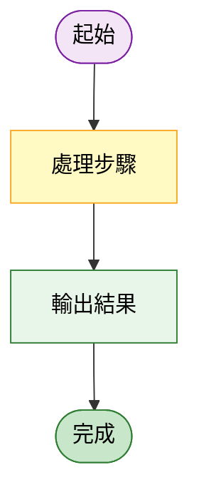
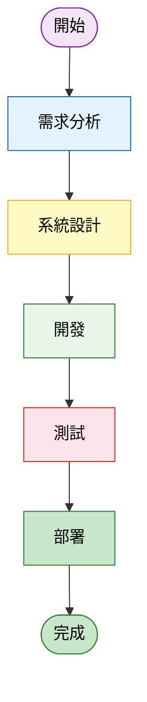
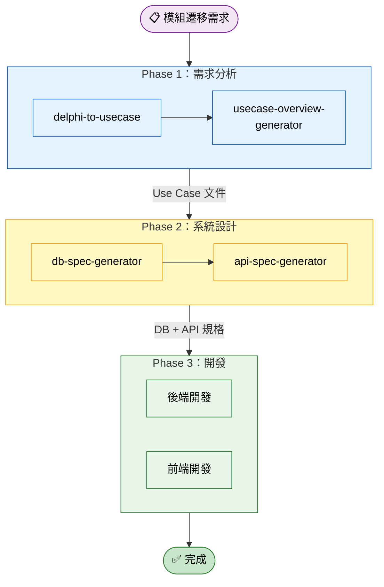
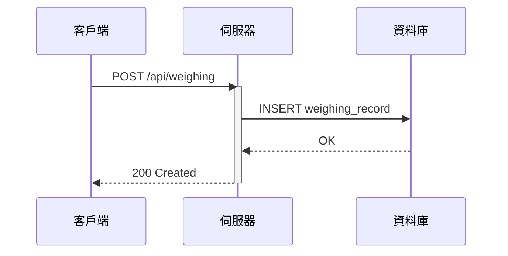
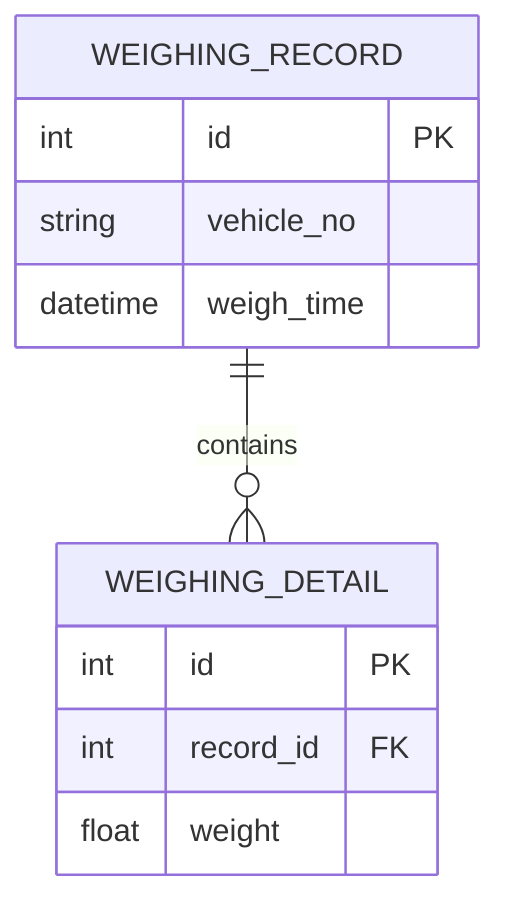
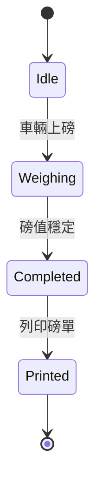

# Mermaid 圖表修復與樣式規範 Skill

## 必備工具（修復流程中必須呼叫）

本 Skill 依賴以下 VS Code 內建 Mermaid 工具，**修復流程中必須使用**：

| 工具 | 用途 | 何時呼叫 |
|------|------|---------|
| `get-syntax-docs-mermaid` | 查詢特定圖表類型的正確語法文件 | 修復前（不確定語法時） |
| `mermaid-diagram-validator` | 驗證修復後的 Mermaid 程式碼是否合法 | **修復後、輸出前（必須）** |
| `mermaid-diagram-preview` | 預覽渲染結果，確認視覺正確 | 驗證通過後（建議） |

> ⚠️ **絕對不能跳過 `mermaid-diagram-validator` 驗證步驟**。修復後的程式碼必須經過驗證確認無誤才能輸出給使用者。

---

## 核心強制規則（違反必修正）

### 規則 1：每行只能宣告一個節點

```
❌ 錯誤（多節點同行）：
    A["節點A"]    B["節點B"]    C["節點C"]

✅ 正確（每行一個）：
    A["節點A"]
    B["節點B"]
    C["節點C"]
```

### 規則 2：換行符號一律用 `<br/>`，禁止 `\n`

```
❌ 錯誤：NODE["第一行\n第二行"]
✅ 正確：NODE["第一行<br/>第二行"]
```

### 規則 3：含空格/中文/符號的標籤必須用雙引號

```
❌ 錯誤：subgraph Phase1[Phase 1：需求收集]
✅ 正確：subgraph Phase1["Phase 1：需求收集"]

❌ 錯誤：A -->|資料流| B
✅ 正確：A -->|"資料流"| B
```

### 規則 4：使用 `flowchart`，禁止 `graph`

```
❌ 錯誤：graph TD
✅ 正確：flowchart TD
```

### 規則 5：節點 ID 只能用字母、數字、底線（不含 `-`、`:` 等）

```
❌ 錯誤：some-node["標題"]  或  some:node["標題"]
✅ 正確：someNode["標題"]   或  some_node["標題"]
```

### 規則 6：subgraph 必須有對應的 `end`

```
❌ 錯誤（缺少 end）：
    subgraph G["群組"]
        A["節點"]
    （沒有 end）

✅ 正確：
    subgraph G["群組"]
        A["節點"]
    end
```

### 規則 7：箭頭語法必須正確

```
❌ 錯誤：A -> B  或  A ->> B  或  A ==> B（flowchart 不支援）
✅ 正確：A --> B  或  A --- B  或  A ==> B（粗線）  或  A -.-> B（虛線）
```

---

## 淡色系配色方案（Pastel Theme）

所有 UML 圖、流程圖，一律套用下列淡色系配色，**不使用深色或高飽和度顏色**。

### 標準色票

| 語意 | fill | stroke | color | 適用節點類型 |
|------|------|--------|-------|------------|
| 起始 / 終止 | `#f3e5f5` | `#7b1fa2` | `#000` | 圓角矩形 `(["..."])` |
| 輸入 / 需求 | `#e3f2fd` | `#1565c0` | `#000` | 一般矩形 `["..."]` |
| 設計 / 分析 | `#fff9c4` | `#f9a825` | `#000` | 一般矩形 `["..."]` |
| 開發 / 實作 | `#e8f5e9` | `#2e7d32` | `#000` | 一般矩形 `["..."]` |
| 測試 / 驗證 | `#fce4ec` | `#c62828` | `#000` | 一般矩形 `["..."]` |
| 工具 / 服務 | `#e0f7fa` | `#00838f` | `#000` | 一般矩形 `["..."]` |
| 部署 / 管理 | `#c8e6c9` | `#2e7d32` | `#000` | 一般矩形 `["..."]` |

### style 宣告語法（少量節點：逐一宣告）



### classDef 批量配色（大型圖表推薦，節點 > 8 個時使用）



> **選擇原則**：節點 ≤ 8 個 → 逐一 `style`；節點 > 8 個 → `classDef` + `class`。

### subgraph 淡色邊框

```
subgraph Phase1["Phase 1：需求收集"]
    style Phase1 fill:#e3f2fd,stroke:#1565c0
    NODE1["節點 A"]
    NODE2["節點 B"]
end
```

> `style` 宣告放置在 `subgraph` 內第一行，緊接在標題之後。

---

## 常見錯誤修復清單

| # | 錯誤類型 | 症狀 | 修復方式 |
|---|---------|------|---------|
| E1 | 多節點同行 | `Syntax error in text` | 每個節點獨立一行 |
| E2 | `\n` 換行 | 標籤顯示 `\n` 字串 | 改為 `<br/>` |
| E3 | subgraph 標題無引號 | `Syntax error in text` | 標題加雙引號 |
| E4 | 邊線標籤無引號 | `Syntax error in text` | `\|...\|` 內加雙引號 |
| E5 | 使用 `graph` 關鍵字 | 舊版語法警告 | 改為 `flowchart` |
| E6 | 節點 ID 含 `-` / `:` | `Parse error` | 改用駝峰或底線命名 |
| E7 | 深色 / 高飽和度配色 | 視覺對比過強 | 套用淡色系色票 |
| E8 | 缺少 `style` 宣告 | 全部為灰色預設 | 依語意補上 `style` 或 `classDef` |
| E9 | 缺少 `end` | `Parse error on line...` | 補上 `end` 關閉 subgraph |
| E10 | 箭頭語法錯誤 | `Parse error` | 使用 `-->` / `---` / `==>` / `-.->` |
| E11 | 節點 ID 為 `END` / `end` | 與關鍵字衝突 | 改為 `DONE` / `FINISH` 等 |

---

## 執行流程

1. **讀取問題圖表**：接收使用者提供的 Mermaid 程式碼
2. **查詢語法文件**（可選）：若圖表類型不熟悉，先呼叫 `get-syntax-docs-mermaid` 確認正確語法
3. **逐行掃描與修復**：
   - 同行多個節點 → 拆分為獨立行
   - `\n` → `<br/>`
   - subgraph 標題未引號 → 加引號
   - 邊線標籤未引號 → 加引號
   - `graph TD/LR` → `flowchart TD/LR`
   - 節點 ID 含特殊字元 → 重命名
   - 節點 ID 為 `END`/`end` → 改名（避免關鍵字衝突）
   - 缺少 `end` → 補上
   - 箭頭語法錯誤 → 修正
4. **補上配色宣告**：
   - 節點 ≤ 8 個 → 逐一 `style` 宣告
   - 節點 > 8 個 → `classDef` + `class` 批量套用
   - subgraph 同步補上淡色邊框
5. **驗證**（**必須**）：呼叫 `mermaid-diagram-validator` 驗證修復後的程式碼
   - 若驗證失敗 → 根據錯誤訊息再次修復 → 重新驗證（最多 3 輪）
6. **預覽**（建議）：呼叫 `mermaid-diagram-preview` 確認視覺效果
7. **輸出修復後圖表**：以 ` ```mermaid ` 程式碼區塊輸出完整修復版
8. **列出修復摘要**：條列所做的所有修改項目

---

## 標準輸出範本（修復後完整格式）



---

## Mermaid v11 相容性備忘

| 功能 | 支援 | 說明 |
|------|------|------|
| `flowchart TD/LR/TB/BT/RL` | ✅ | 優先使用 |
| `graph TD/LR` | ⚠️ | 舊語法，建議改用 flowchart |
| `subgraph` 標題引號 | ✅ | 必須使用雙引號 |
| `<br/>` 換行 | ✅ | 唯一合法換行方式 |
| `\n` 換行 | ❌ | 不支援，顯示為字串 |
| Unicode / Emoji | ✅ | 標籤內可使用 |
| `style` 宣告 | ✅ | 支援 fill/stroke/color |
| `classDef` / `class` | ✅ | 可批次套用，大型圖表推薦 |
| `%%` 行內註解 | ✅ | 可用於說明 |
| 節點 ID = `end` / `END` | ❌ | Mermaid 保留字，會衝突 |

---

## 多圖表類型支援

本 Skill 不僅限於 `flowchart`，以下圖表類型皆適用淡色系規範：

### sequenceDiagram（循序圖）



> sequenceDiagram 不支援 `style`，但標題與標籤仍須遵守引號與 `<br/>` 規則。

### erDiagram（ER 圖）



> erDiagram 使用 Crow's Foot 標記法，屬性宣告在 `{}` 區塊內。

### stateDiagram-v2（狀態圖）



> stateDiagram-v2 使用 `[*]` 表示起始/終止，不使用 `style`。

---

## 跨 Skill 防範（主動式品質保證）

本 Skill 的規範已寫入 `copilot-instructions.md` 的「Mermaid 圖表規範（全域強制）」區塊，
意即**所有 Skill 產出 Mermaid 圖表時都必須遵守**。

若其他 Skill（如 `usecase-to-design`、`api-spec-generator`、`db-spec-generator`、
`project-management-generator`）產出的圖表違反規範，可觸發本 Skill 進行修復：

```
使用者：「這個設計文件裡的圖有 mermaid 錯誤」
→ 觸發 mermaid-diagram-fixer → 修復 → 驗證 → 輸出
```
| `%%` 行內註解 | ✅ | 可用於說明 |
