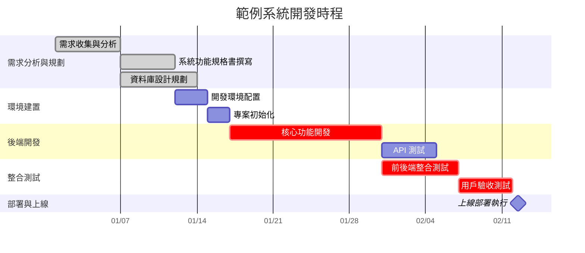
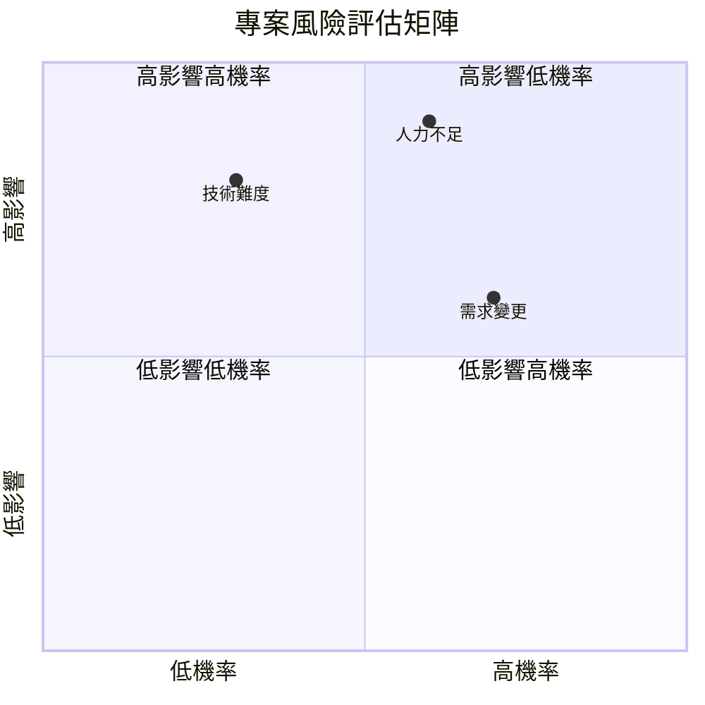

# 專案管理文件生成 Skill

## 目標

根據使用者提供的專案資訊（專案名稱、技術棧、時程、功能模組等），自動生成一份完整的專案管理文件，包含：
- 專案基本資訊
- Mermaid 甘特圖（`gantt`）
- Mermaid 里程碑時程圖（`timeline`）
- Mermaid 專案架構流程圖（`flowchart TD`）
- 分階段工作項目清單（表格）
- Mermaid 風險管理矩陣圖（`quadrantChart`）
- 里程碑檢核點

---

## 步驟 1：收集專案資訊

透過使用者輸入或對話脈絡，收集以下資訊：

### 必填資訊
| 項目 | 說明 | 範例 |
|-----|------|------|
| 專案名稱 | 完整專案名稱 | THMCPA 達航船員考評系統 |
| 專案類型 | 系統類型描述 | 前後端分離 WEB 系統 |
| 技術棧 | 主要技術組合 | PrimeVue 3 + SpringBoot 3 + Docker |

### 選填資訊（未提供則使用合理預設值）
| 項目 | 說明 | 預設值 |
|-----|------|--------|
| 專案經理 | 負責人姓名 | `[待填入]` |
| 開始日期 | 專案啟動日期 | 當天日期 |
| 預計完成日期 | 專案結束日期 | 依階段自動推算 |
| 功能模組清單 | 系統主要功能 | 依技術棧推斷通用模組 |
| 開發階段定義 | 自訂階段名稱 | 使用預設 7 階段 |

若使用者未提供足夠資訊，可基於專案類型與技術棧進行合理推斷，但須在文件中以 `[待填入]` 或 `[待確認]` 標注需要使用者後續補充的內容。

---

## 步驟 2：規劃專案階段與任務

### 預設七階段架構

依據使用者提供的專案類型和功能模組，將任務分配到以下階段：

| 階段 | 名稱 | 典型工期 | 主要產出 |
|-----|------|---------|---------|
| 1 | 需求分析與規劃 | 1-2 週 | 需求規格書、資料庫設計、API 規格、UI 原型 |
| 2 | 環境建置與架構設計 | 0.5-1 週 | 開發/測試/生產環境、專案骨架 |
| 3 | 後端開發 | 3-5 週 | 核心 API、業務邏輯、單元測試 |
| 4 | 前端開發 | 3-5 週 | 頁面元件、互動介面、前端測試 |
| 5 | 整合測試 | 2-3 週 | 測試報告、效能調優、安全修復 |
| 6 | 部署與上線 | 1-2 週 | 容器化部署、監控、資料遷移 |
| 7 | 文件與維護 | 1-2 週 | 操作手冊、技術文件、維護計畫 |

### 任務分配規則

1. **依技術棧調整任務名稱**：例如若使用 Docker，則第二階段包含「Docker 環境配置」；若使用 Maven，則包含「Maven 依賴管理」
2. **依功能模組展開任務**：將使用者提到的功能模組（如「用戶認證」、「報表」、「權限管理」）對應到後端/前端開發階段
3. **標注關鍵路徑**：核心業務功能、整合測試、用戶驗收、資料遷移等標記為 `crit`
4. **建立任務依賴**：使用 `after` 建立合理的先後關係

---

## 步驟 3：生成 Mermaid 甘特圖

> ⚠️ **CRITICAL：Mermaid 語法限制**
>
> 詳細語法規則請讀取：`references/mermaid-constraints.md`

使用 `gantt` 圖型，嚴格遵守以下語法：

```
gantt
    title [專案名稱]開發時程
    dateFormat  YYYY-MM-DD
    axisFormat  %m/%d
    
    section [階段名稱]
    [任務名稱]           :[狀態], [ID], [開始時間], [工期/結束時間]
```

### 甘特圖語法規則

| 元素 | 語法 | 說明 |
|-----|------|------|
| 圖型宣告 | `gantt` | 第一行，不加其他關鍵字 |
| 標題 | `title [文字]` | 圖表標題 |
| 日期格式 | `dateFormat YYYY-MM-DD` | 定義日期解析格式 |
| 軸格式 | `axisFormat %m/%d` | X 軸顯示格式 |
| 區段 | `section [名稱]` | 對應專案階段 |
| 一般任務 | `名稱 :id, 開始, 工期` | 有 ID 的任務 |
| 已完成 | `名稱 :done, id, 開始, 結束` | 標記已完成 |
| 進行中 | `名稱 :active, id, 開始, 工期` | 標記進行中 |
| 關鍵路徑 | `名稱 :crit, id, after 前任, 工期` | 關鍵任務 |
| 里程碑 | `名稱 :milestone, id, after 前任, 0d` | 里程碑節點（工期 0d 或 1d） |
| 依賴 | `after [前任ID]` | 任務依賴關係 |

### 工期表示法
- 具體天數：`5d`、`7d`、`14d`
- 具體日期：`2024-01-01, 2024-01-07`
- 依賴後推算：`after req1, 5d`

---

## 步驟 4：生成 Mermaid 里程碑時程圖

使用 `timeline` 圖型：

```
timeline
    title [專案名稱] 重要里程碑
    
    [時間點] : [事件1]
             : [事件2]
    
    [時間點] : [事件1]
             : [事件2]
             : [事件3]
```

### 時程圖語法規則

| 元素 | 語法 | 說明 |
|-----|------|------|
| 圖型宣告 | `timeline` | 第一行 |
| 標題 | `title [文字]` | 圖表標題 |
| 時間點 | `[時間描述]` | 如「第1週」、「第4-5週」 |
| 事件 | `: [事件描述]` | 該時間點的事件，縮排後用冒號 |
| 多事件 | 連續多行 `: [事件]` | 同一時間點的多個事件 |

### 里程碑設定建議

依專案階段設定 5-8 個里程碑節點，每個節點包含 1-3 個關鍵事件：
1. 專案啟動 / 需求收集
2. 需求分析完成 / 設計確認
3. 開發環境就緒 / 開發啟動
4. 核心功能完成 / 整合測試
5. 測試通過 / UAT
6. 系統部署 / 上線
7. 專案結案 / 維護開始

---

## 步驟 5：生成 Mermaid 專案架構流程圖

使用 `flowchart TD`（由上而下）繪製專案開發流程：

```
flowchart TD
    A[專案啟動] --> B[需求分析]
    B --> C[系統設計]
    C --> D[環境建置]
    D --> E[後端開發]
    D --> F[前端開發]
    E --> G[整合測試]
    F --> G
    G --> H{測試通過?}
    H -->|否| I[問題修復]
    I --> G
    H -->|是| J[用戶驗收]
    J --> K{驗收通過?}
    K -->|否| L[需求調整]
    L --> E
    K -->|是| M[系統部署]
    M --> N[上線運行]
    N --> O[專案結案]
```

### 流程圖語法規則

| 元素 | 語法 | 說明 |
|-----|------|------|
| 圖型宣告 | `flowchart TD` | TD = Top-Down（由上而下）|
| 矩形節點 | `ID[標籤]` | 一般步驟 |
| 菱形節點 | `ID{標籤}` | 判斷/決策 |
| 圓角矩形 | `ID(標籤)` | 流程步驟 |
| 實線箭頭 | `A --> B` | 一般流向 |
| 帶標籤箭頭 | `A -->\|標籤\| B` | 條件分支 |
| 樣式 | `style ID fill:#色碼` | 節點著色 |

### 流程圖著色建議

| 節點類型 | 色碼 | 用途 |
|---------|------|------|
| 起始節點 | `#e1f5fe` | 淺藍色 |
| 結束節點 | `#c8e6c9` | 淺綠色 |
| 決策節點 | `#fff3e0` | 淺橘色 |
| 關鍵節點 | `#ffcdd2` | 淺紅色 |

---

## 步驟 6：生成 Mermaid 風險管理矩陣圖

使用 `quadrantChart` 圖型：

```
quadrantChart
    title 專案風險評估矩陣
    x-axis 低機率 --> 高機率
    y-axis 低影響 --> 高影響
    quadrant-1 高影響低機率
    quadrant-2 高影響高機率
    quadrant-3 低影響低機率
    quadrant-4 低影響高機率
    
    [風險項目]: [x, y]
```

### 四象限圖語法規則

| 元素 | 語法 | 說明 |
|-----|------|------|
| 圖型宣告 | `quadrantChart` | 第一行 |
| 標題 | `title [文字]` | 圖表標題 |
| X 軸 | `x-axis [低端標籤] --> [高端標籤]` | 橫軸定義 |
| Y 軸 | `y-axis [低端標籤] --> [高端標籤]` | 縱軸定義 |
| 象限標籤 | `quadrant-1` 到 `quadrant-4` | 四象限名稱 |
| 資料點 | `名稱: [x, y]` | 座標 0.0–1.0 |

### 常見風險項分類

依專案類型動態調整風險項目，以下為參考：

| 風險類別 | 常見風險項 | 建議座標範圍 |
|---------|----------|------------|
| 技術風險 | 技術難度、整合困難、效能問題 | x: 0.2-0.5, y: 0.6-0.9 |
| 管理風險 | 人力不足、需求變更、時程延誤 | x: 0.5-0.8, y: 0.5-0.9 |
| 環境風險 | 環境問題、第三方依賴 | x: 0.3-0.5, y: 0.4-0.6 |
| 安全風險 | 資安風險、資料洩漏 | x: 0.1-0.3, y: 0.8-0.95 |

---

## 步驟 7：生成工作項目清單

每個階段以 Markdown 表格呈現工作項目：

```markdown
### 第 [N] 階段：[階段名稱]
| 任務編號 | 任務名稱 | 負責人 | 開始日期 | 結束日期 | 狀態 | 優先級 | 備註 |
|---------|---------|--------|----------|----------|------|--------|------|
| [N.1] | [任務名稱] | [姓名] | YYYY-MM-DD | YYYY-MM-DD | 待開始 | 高 | [說明] |
```

### 欄位填寫規則

| 欄位 | 規則 |
|------|------|
| 任務編號 | `[階段號].[序號]`，如 `1.1`、`3.2` |
| 負責人 | 若已知填入，否則填 `[姓名]` |
| 日期 | 若已知填入具體日期，否則填 `YYYY-MM-DD` |
| 狀態 | 預設 `待開始`，可選：待開始、進行中、已完成、延期、暫停 |
| 優先級 | 高（關鍵路徑）、中（重要可調整）、低（可延後）|
| 備註 | 簡要說明任務重點或工具 |

### 優先級判定標準
- **高**：位於關鍵路徑上，延遲將直接影響專案上線時間
- **中**：重要功能但具有時程彈性，可與其他任務並行
- **低**：輔助性工作，可在主要功能完成後補充

---

## 步驟 8：生成輸出文件

輸出格式嚴格依照：`assets/project-management-template.md`

### 輸出規則

1. **檔名**：`[專案名稱]-專案管理.md`（依使用者指定路徑存放，預設放在專案根目錄或 `docs/` 目錄下）
2. **生成日期**：使用當天日期（`YYYY-MM-DD`）
3. **專案基本資訊**：必填項目完整呈現，選填項目以佔位符標注
4. **甘特圖**：依步驟 3 規則生成，每個 section 對應一個階段
5. **里程碑時程圖**：依步驟 4 規則生成，5-8 個節點
6. **專案架構流程圖**：依步驟 5 規則生成，含決策迴路
7. **工作項目清單**：依步驟 7 規則，每階段一個表格
8. **風險管理矩陣圖**：依步驟 6 規則生成，5-8 個風險項
9. **里程碑檢核點**：使用 Markdown checkbox `- [ ]`，每階段一個檢核點
10. **狀態與優先級說明**：文件末附定義說明
11. **使用說明**：文件末附 5 點操作指引
12. 全程使用**繁體中文**

---

## 自我驗證檢查清單

在輸出文件前，**逐項確認**：

### Mermaid 圖表驗證

| 檢查項目 | 正確 ✅ | 錯誤 ❌ |
|---------|--------|--------|
| 甘特圖宣告 | `gantt` | `ganttChart`、`ganttDiagram` |
| 甘特圖日期格式 | `dateFormat YYYY-MM-DD` | 省略或格式錯誤 |
| 里程碑宣告 | `timeline` | `timelineDiagram` |
| 流程圖宣告 | `flowchart TD` | `graph TD`（可用但不推薦） |
| 四象限圖宣告 | `quadrantChart` | `quadrant-chart`、`quadrant` |
| 四象限資料點 | `名稱: [x, y]` | 座標超出 0.0-1.0 |
| 甘特任務工期 | `5d`、`7d` | `5 days`、`一週` |
| 甘特依賴 | `after taskId` | `depends on taskId` |
| 關鍵路徑標記 | `:crit, id, ...` | `:critical, id, ...` |
| 里程碑標記 | `:milestone, id, after x, 0d` | 工期非 0 或未標 milestone |

### 文件結構驗證

| 檢查項目 | 說明 |
|---------|------|
| 專案基本資訊完整 | 名稱、類型、技術棧均已填入 |
| 階段數量合理 | 通常 5-7 個階段 |
| 每階段含 3-5 個任務 | 不宜過多或過少 |
| 甘特圖 section 與階段對應 | 數量與名稱一致 |
| 里程碑與階段末對應 | 每個階段結束有對應檢核點 |
| 風險項涵蓋多類別 | 技術、管理、環境至少各 1 項 |
| 表格格式完整 | 表頭分隔線 `|---|` 與欄位數一致 |
| 繁體中文一致 | 無簡體混用 |

---

## 範例輸出片段

### 甘特圖範例（正確格式）



### 風險矩陣範例（正確格式）



---

## 常見錯誤提醒

1. **甘特圖 section 遺漏**：每個階段必須有對應的 `section` 區段，否則任務會全部堆在同一區
2. **任務 ID 重複**：`gantt` 中每個任務 ID 必須唯一，建議用前綴區分（`req1`、`env1`、`backend1`）
3. **依賴關係循環**：`after` 不可形成循環依賴，否則 Mermaid 無法渲染
4. **四象限座標範圍**：`quadrantChart` 的資料點座標必須在 `[0.0, 1.0]` 範圍內
5. **timeline 縮排**：事件前的 `: ` 必須對齊，否則會被解析為新的時間點
6. **flowchart 節點 ID 衝突**：節點 ID 不可與 Mermaid 保留字衝突（如 `end`、`graph` 等）
