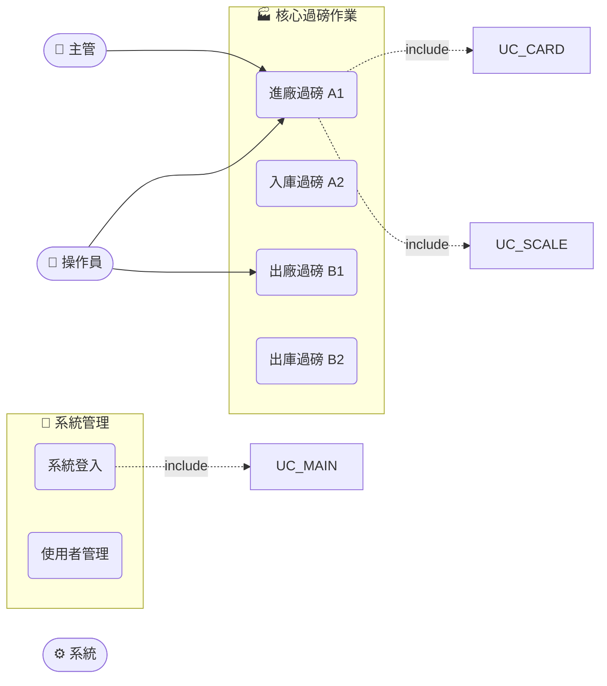

# Use Case 總覽文件生成 Skill

## 目標

掃描 `docs/use-cases/` 目錄下所有個別模組 UC 文件，彙整產生一份系統全景 `UC-00-使用案例總覽.md`，包含：
- 系統整體概述
- 使用人角色總表
- Mermaid 圖形化 Use Case 關係圖（`flowchart LR`）
- 系統流程序列圖（`sequenceDiagram`）
- 全模組業務分類表
- 所有模組使用案例詳細清單（含連結）

---

## 步驟 1：掃描來源文件

1. 列出 `docs/use-cases/` 目錄下所有 `.md` 檔案
2. **排除** `UC-00-使用案例總覽.md`（避免循環引用）
3. 對每個 UC 文件讀取以下資訊：
   - 文件標題（`# ` 開頭的第一行）→ 模組名稱
   - 使用人（`使用人` 或 `Actor` 欄位）→ 角色清單
   - 使用案例表（`| UC-Xxx |` 格式的表格行）→ UC 代號、名稱、說明、角色
   - 模組代號（從檔名推導，例如 `UC-arrivePlant-廠門地磅作業.md` → `uarrivePlant`）
   - 業務領域（依模組代號對應，見步驟 3 的分類表）

---

## 步驟 2：彙整使用人角色

從所有 UC 文件中收集去重後的使用人角色，建立角色總表：

| 代號欄位 | 角色名稱 | 職能說明 | 涉及模組 |
|---------|--------|---------|---------|
| OPR | 磅秤操作員 | 執行日常進出廠過磅 | ... |
| ...（依掃描結果動態更新）|

常見角色代號對照：

| 角色名稱關鍵字 | 代號 |
|-------------|-----|
| 操作員、磅秤操作員 | OPR |
| 主管、倉庫主管、品質主管 | MGR |
| 倉庫員、收料員、出貨員 | WRM |
| 計費員、財務 | FIN |
| 系統管理員、管理員 | ADM |
| 系統、自動化、排程 | SYS |
| 特殊操作員、中興操作員 | SPL |

---

## 步驟 3：分類模組至業務領域

依模組代號將所有模組分類到此專案的業務領域：

| 業務領域 | 代號前綴 |
|---------|--------|
| 核心過磅作業 | uarrivePlant, uflishwork, uInstore, uOutStore |
| 進階業務 | uInOutKaijin, ukajin, uGDH, uGDHMD, uZXarrivePlant, uZXflishwork, uexceptNo |
| 系統管理 | ulogon, uUser, uUserALL, uDbRights, uDbMaterial, uParas, uSetParam, utruck |
| 查詢與報表 | udayrep, udayprint |
| 自動化與外圍 | uAUTO, uled, uCardRW, UFRMMAIN |
| 支援模組 | UScale, UScale1 |

---

## 步驟 4：生成 Mermaid Use Case 圖

> ⚠️ **CRITICAL：Mermaid 語法限制**
>
> 詳細語法規則請讀取：`references/mermaid-constraints.md`
>
> **核心禁令**（必須嚴格遵守）：
> - ❌ **絕對禁止** 使用 `usecase`, `actor`, `left to right direction`, `(use case)` 這些 PlantUML 語法
> - ❌ 禁止使用 `usecaseDiagram` 關鍵字
> - ✅ **必須使用** `flowchart LR` 作為圖型宣告
> - ✅ Actor 使用 `ID(["emoji 名稱"])` 格式
> - ✅ Use Case 使用 `ID("功能名稱")` 格式
> - ✅ 分組使用 `subgraph` 區塊
> - ✅ include/extend 使用標記虛線箭頭

生成規則：

```
%% 宣告（第一行必須是此行）
flowchart LR

%% Actors（左側，使用 ([...]) stadium 形狀）
OPR(["👤 操作員"])
SYS(["⚙️ 系統"])

%% Use Cases（每個業務一個 subgraph）
subgraph GRP1["🏭 核心過磅作業"]
    UC01("進廠過磅 A1")
    UC02("入庫過磅 A2")
end

%% Actor --> Use Case 關係（實線）
OPR --> UC01

%% include/extend 關係（虛線 + 標籤）
UC01 -. "include" .-> UC19
UC01 -. "extend" .-> UC08
```

分組建議（依業務領域最多建立 4–6 個 subgraph）：
- `GRP1` → 核心過磅作業
- `GRP2` → 進階業務
- `GRP3` → 系統管理
- `GRP4` → 自動化與外圍

每個業務領域選取 **代表性** Use Case 放入圖中（不必全部列出），保持圖形清晰可讀（每個 subgraph 最多 6 個節點）。

---

## 步驟 5：生成序列圖（補充說明核心流程）

使用 `sequenceDiagram` 語法描述核心過磅流程（進廠→確認→儲存）：

```
sequenceDiagram
    participant 操作員
    participant 系統
    participant 磅秤
    participant 資料庫
    
    操作員->>系統: 開啟功能模組
    系統->>磅秤: 讀取重量
    磅秤-->>系統: 回傳重量值
    操作員->>系統: 確認過磅
    系統->>資料庫: 儲存記錄
    資料庫-->>系統: 回傳磅單號
    系統-->>操作員: 顯示完成訊息
```

> `sequenceDiagram` 是 Mermaid 11.x 合法語法，可直接使用。

---

## 步驟 6：生成輸出文件

輸出格式嚴格依照：`assets/uc-overview-template.md`

### 輸出規則

1. **檔名**：`docs/use-cases/UC-00-使用案例總覽.md`（固定路徑）
2. **生成日期**：使用當天日期（`YYYY-MM-DD`）
3. **系統概述**：2–3 句話描述整體業務目的，強調四磅節點（A1/A2/B1/B2）
4. **角色總表**：列出所有角色，涉及模組欄位列模組代號（逗號分隔）
5. **Mermaid 圖**：嚴格依步驟 4 規則，生成後自我驗證語法
6. **業務分類表**：每個模組一行，含業務領域、模組代號、表單標題、主要用戶、UC 數量、核心功能
7. **詳細清單**：依字母分組（A. 核心過磅、B. 入庫...），每組一個表格，含案例代號、名稱、說明、角色
8. **相關連結**：從個別 UC 文件自動生成相對路徑連結清單
9. **統計數據**：自動統計總模組數、總 UC 數、角色種類數
10. 全程使用**繁體中文**

---

## 自我驗證檢查清單

在輸出 Mermaid 區塊前，**逐項確認**：

| 檢查項目 | 正確 ✅ | 錯誤 ❌ |
|---------|--------|--------|
| 圖型宣告 | `flowchart LR` | `usecase`, `usecaseDiagram` |
| Actor 形狀 | `ID(["name"])` | `actor ID as "name"` |
| Use Case 形狀 | `ID("name")` | `usecase ID as "name"` |
| 分組方式 | `subgraph GRP["label"]` | 無 `subgraph` |
| include 關係 | `A -. "include" .-> B` | `A ..> B : include` |
| extend 關係 | `A -. "extend" .-> B` | `A ..> B : extend` |
| Actor→UC 關係 | `OPR --> UC01` | `OPR -- UC01` 或其他格式 |
| 圖型結束 | 不需要 `end` 結束 flowchart | （`subgraph` 內部需要 `end`）|

---

## 範例輸出片段

### Mermaid 圖範例（正確格式）



### 詳細清單範例（正確格式）

```markdown
### A. 核心過磅作業 (uarrivePlant - 廠門地磅作業)

| 案例代號 | 案例名稱 | 說明 | 參與角色 |
|---------|--------|------|--------|
| **UC-A001** | 入廠過磅作業（A1） | 車輛進廠時讀取磅秤重量，輸入採購資訊後建立進廠記錄 | 操作員、主管 |
```

---

## 常見錯誤提醒

1. **Mermaid 版本陷阱**：Mermaid 11.x 沒有 `usecase` 圖型，即使語法看起來合理也會報錯。`flowchart LR` 是唯一可行的模擬方案。

2. **subgraph 縮排**：`subgraph` 內部的節點定義必須縮排，`end` 與 `subgraph` 同層。

3. **虛線箭頭格式**：`-. "label" .->` 中的空格與引號不可省略，否則標籤無法正確顯示。

4. **stadium 形狀**：Actor 使用雙括號 `(["..."])` 才能產生橢圓/stadium 形狀；單括號 `("...")` 是圓角矩形（Use Case 形狀）。

5. **節點 ID 命名**：`subgraph` 的 ID（如 `GRP1`）不可與節點 ID 重複。
