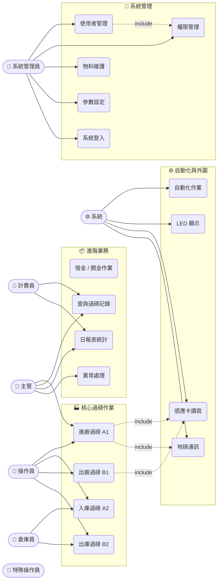
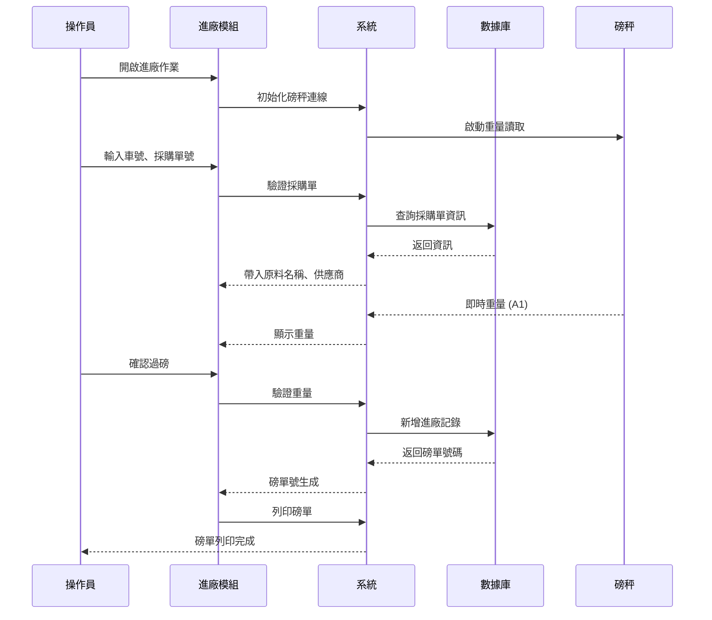

# [系統名稱]（一車四磅）- 使用案例總覽

**系統名稱**：[系統全稱，例：一車四磅過磅作業系統]  
**版本**：[版本代號，例：MM_D10]  
**生成日期**：[YYYY-MM-DD]  
**文件目的**：整合所有模組之使用案例，提供系統全景圖

---

## 📋 系統整體概述

[2–3 句話描述系統業務目的。強調 A1/A2/B1/B2 四磅節點架構、核心功能（進廠、入庫、出廠、出庫）、整合硬體設備（地磅、感應卡、LED）、服務對象（製造工廠、倉儲物流）。]

### 核心業務流程
```
┌─────────────┐      ┌─────────────┐      ┌─────────────┐      ┌─────────────┐
│  進廠作業   │      │  入庫作業   │      │  出廠作業   │      │  出庫作業   │
│    (A1)     │  →   │    (A2)     │  →   │    (B1)     │  →   │    (B2)     │
│  4 台磅秤   │      │  核對差值   │      │ 計算淨重    │      │ 確認出貨    │
└─────────────┘      └─────────────┘      └─────────────┘      └─────────────┘
      ↓                     ↓                     ↓                     ↓
   感應卡寫入           差值驗証           結案清結                 出貨確認
```

### 技術棧
| 層級 | 技術 | 說明 |
|-----|------|------|
| **應用層** | Delphi 10.x + VCL | 桌面 GUI 應用程式 |
| **資料層** | MySQL / SQL Server | 關鍵業務數據存儲 |
| **硬體層** | 地磅、感應卡、LED、RF | 物理磅秤設備 |
| **集成層** | ERP (SAP)、WiFi、TCP/IP | 外部系統對接 |

---

## 👥 使用人角色總表

| 角色代號 | 角色名稱 | 職能說明 | 涉及模組 |
|---------|--------|--------|--------|
| **OPR** | 磅秤操作員 | [職能說明] | [模組清單，逗號分隔] |
| **MGR** | 倉庫主管/品質主管 | [職能說明] | [模組清單] |
| **WRM** | 倉庫收料員/出貨員 | [職能說明] | [模組清單] |
| **FIN** | 計費/財務人員 | [職能說明] | [模組清單] |
| **ADM** | 系統管理員 | [職能說明] | [模組清單] |
| **SYS** | 系統（自動化） | [職能說明] | [模組清單] |
| **SPL** | 特殊工作人員 | [職能說明] | [模組清單] |

---

## 📊 Mermaid UML Use Case 圖

> ⚠️ Mermaid 無原生 Use Case 圖型，以下使用 `flowchart LR` 模擬：
> - **橢圓**（`(["..."])` 形）= Actor（使用人）
> - **圓角矩形**（`("...")` 形）= Use Case（功能）
> - **實線箭頭** = Actor 參與該功能
> - **虛線箭頭** = Use Case 間的 `include` / `extend` 關係



---

## 📑 業務領域分類表

| 業務領域 | 模組代號 | 表單標題 | 主要用戶 | 使用案例數 | 核心功能 |
|---------|---------|--------|--------|---------|--------|
| **核心過磅作業** | [模組代號] | [表單標題] | [角色] | [數量] | [核心功能摘要] |
| | [模組代號] | ... | | | |
| **進階業務** | [模組代號] | ... | | | |
| **系統管理** | [模組代號] | ... | | | |
| **查詢與報表** | [模組代號] | ... | | | |
| **自動化與外圍** | [模組代號] | ... | | | |
| **支援模組** | [模組代號] | ... | | | |

---

## 📈 系統流程序列圖



---

## 🎯 全模組使用案例詳細清單

### A. [業務領域 1]（[模組代號] - [表單標題]）

| 案例代號 | 案例名稱 | 說明 | 參與角色 |
|---------|--------|------|--------|
| **UC-A001** | [案例名稱] | [說明] | [角色] |
| **UC-A002** | [案例名稱] | [說明] | [角色] |

### B. [業務領域 2]（[模組代號] - [表單標題]）

| 案例代號 | 案例名稱 | 說明 | 參與角色 |
|---------|--------|------|--------|
| **UC-B001** | [案例名稱] | [說明] | [角色] |

<!-- 依字母順序繼續，每個模組一個章節 -->

---

## 📊 數據統計

- **總模組數**：[N] 個
- **總使用案例數**：[N]+ 個
- **涉及使用人角色**：[N] 種
- **業務領域**：[N] 大領域（[列舉]）

---

## 🔗 相關連結

### 個別模組詳細文檔
<!-- 依掃描到的 UC 文件自動生成 -->
- [[廠門地磅作業]](UC-arrivePlant-廠門地磅作業.md)
- [[完工出廠作業]](UC-flishwork-完工出廠作業.md)
<!-- 繼續列出所有找到的 UC-*.md 文件 -->

---

## 📝 修訂歷史

| 版本 | 日期 | 修訂說明 |
|-----|------|--------|
| 1.0 | [YYYY-MM-DD] | 初版彙總，包含 [N] 個模組、[N]+ 使用案例 |

---

## 📌 備註與說明

1. **系統特性**：採用四磅點設計（進廠 A1 / 入庫 A2 / 出廠 B1 / 出庫 B2），確保進出廠商品的完整追蹤。

2. **客製化版本**：[如有客製化版本，說明差異]

3. **內部模組**：[說明支援模組的性質]

4. **權限控制**：所有使用案例的執行權限由 uDbRights（權限管理）進行動態控制。

5. **數據驗証**：系統提供多層驗証機制，確保數據合規且可追蹤。

---

**文件維護者**：系統開發團隊  
**最後更新**：[YYYY-MM-DD]  
**檔案位置**：`docs/use-cases/UC-00-使用案例總覽.md`
