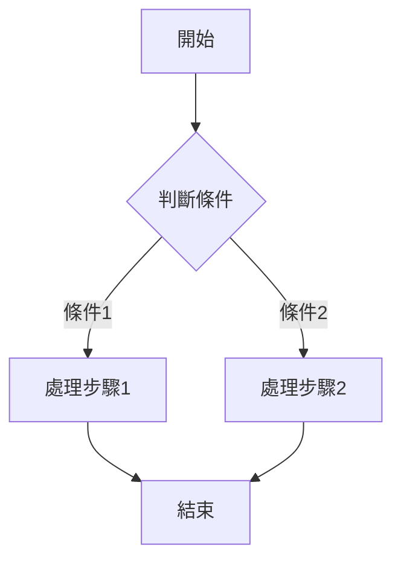
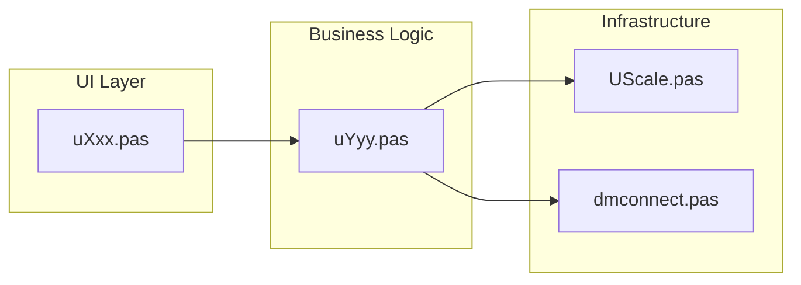
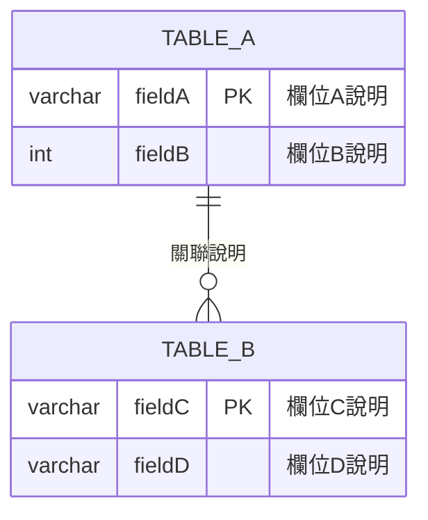

# 系統設計文件：[功能名稱]（[模組代號]）

**對應 Use Case**：`UC-[模組代號]-[功能名稱]`  
**模組代號**：`u[模組代號]`  
**表單類別**：`TFrm[類別名稱]`  
**表單標題**：[表單標題]  
**版本**：MM_D10  
**文件日期**：[YYYY-MM-DD]  

---

## 1. 功能說明

### 1.1 模組概述

[簡述此模組的業務目的，2–3 句話。說明在整體四磅點流程中的定位。]

> **重要架構說明**（若適用）：
> - `uXxx.pas` 為 UI 表單骨架（Form Stub），不含業務邏輯
> - **實際業務邏輯**實作於 `uYyy.pas`

### 1.2 功能清單

| 功能代號 | 功能名稱 | 說明 |
|---------|----------|------|
| F-001 | [功能名稱] | [功能說明] |
| F-002 | [功能名稱] | [功能說明] |
| ... | ... | ... |

### 1.3 業務流程



### 1.4 模組架構關係

> 當模組架構較為複雜（如 UI Stub + 實際實作分離）時，加入此段。



---

## 2. 使用的資料表明細

### 2.1 資料表清單

| # | 資料表名稱 | 用途 | 操作類型 |
|---|-----------|------|---------|
| 1 | [表名] | [用途說明] | SELECT / INSERT / UPDATE / DELETE |
| 2 | [表名] | [用途說明] | [操作類型] |
| ... | ... | ... | ... |

### 2.2 核心資料表欄位明細

#### [資料表名稱]（[資料表中文說明]）

| 欄位名稱 | 資料型態 | PK | NULL | 說明 |
|----------|---------|:--:|:----:|------|
| [欄位名] | [型態] | ✅/空 | ✗/✓ | [說明] |
| ... | ... | ... | ... | ... |

> 每張核心資料表列出完整欄位。非核心表可僅列出本模組使用的欄位。

---

## 3. ER Diagram



> ER Diagram 規則：
> - 列出所有在此模組中使用的資料表
> - 標示 PK 欄位
> - 用關聯線說明表間關係
> - 欄位以本模組實際使用的欄位為主

---

## 4. 相關 Delphi 程式

### 4.1 程式檔案清單

| # | 檔案路徑 | 類型 | 說明 |
|---|---------|------|------|
| 1 | MM_D10/Source/uXxx.pas | 主程式 | [模組功能說明] |
| 2 | MM_D10/Source/uXxx.dfm | 表單設計 | [UI 定義說明] |
| 3 | MM_D10/Source/common/dmconnect.pas | 資料庫 | 資料庫連線模組 |
| 4 | MM_D10/Source/common/ushare.pas | 共用 | 共用函式與變數 |
| 5 | MM_D10/Source/common/uglobal.pas | 全域 | 全域設定與變數 |
| 6 | MM_D10/COMMON/UScale.pas | 磅秤 | 磅秤設備通訊 |
| ... | ... | ... | ... |

> 類型欄位可選：主程式、表單設計、變體版本、資料庫、共用、全域、工具、磅秤、感應卡、LED、報表、例外

### 4.2 關鍵程序與函式

| 程序/函式 | 所屬類別 | 說明 |
|----------|---------|------|
| `Button1Click` | TFrmXxx | [功能說明：驗證→SQL→顯示→列印] |
| `FormCreate` | TFrmXxx | [初始化邏輯] |
| ... | ... | ... |

### 4.3 主要 SQL 語句

#### 查詢語句

```sql
-- [查詢目的說明]
SELECT [欄位] FROM [資料表]
WHERE [條件]
```

#### 新增語句（若適用）

```sql
-- [新增目的說明]
INSERT INTO [資料表] ([欄位]) VALUES ([值])
```

#### 更新語句（若適用）

```sql
-- [更新目的說明]
UPDATE [資料表] SET [欄位=值]
WHERE [條件]
```

#### 刪除語句（若適用）

```sql
-- [刪除目的說明]
DELETE FROM [資料表] WHERE [條件]
```

---

## 5. 附錄

> 以下內容根據模組複雜度選擇性加入。

### 5.1 工作流程狀態值（若適用）

| 狀態代碼 | 說明 |
|---------|------|
| 1 | 單磅作業 |
| 2 | 雙磅作業 |
| 3 | 全流程（四磅點） |

### 5.2 外部 DLL 函式（若適用）

| DLL 函式 | 說明 |
|---------|------|
| `函式名()` | [功能說明] |

### 5.3 表單元件對照（若適用）

| 元件區塊 | 主要元件 | 用途 |
|----------|---------|------|
| GroupBox1 | Edit1~Edit5 | [區塊說明] |
