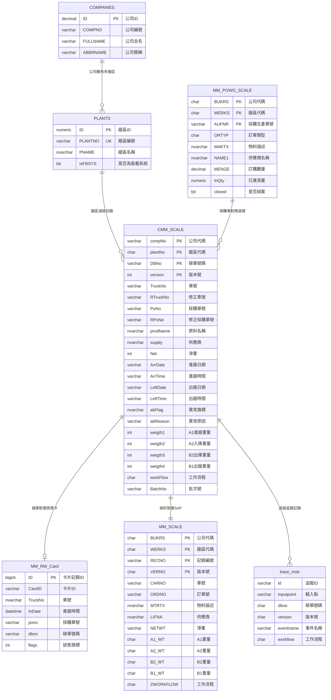
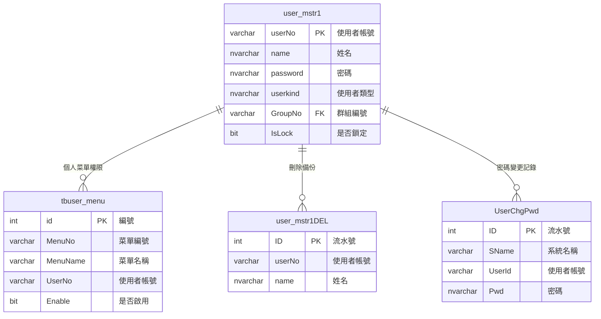
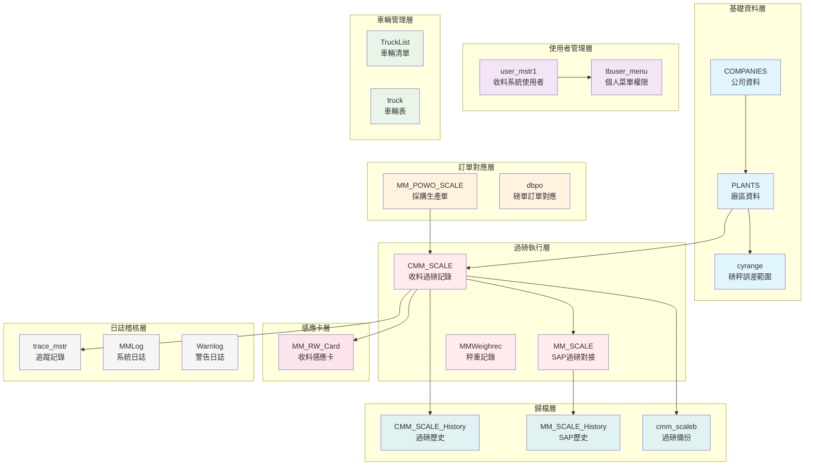

# 磅秤系統（一車四磅）Database 設計文檔

> 此文檔提供磅秤系統（一車四磅）完整的資料庫設計規格，包含資料表結構、關聯性與索引設計

## 📋 文檔資訊

| 項目 | 內容 |
|------|------|
| **專案名稱** | `mmsystem（磅秤系統 — 一車四磅過磅作業系統）` |
| **資料庫模組** | `openSQLDB` |
| **資料庫引擎** | `Microsoft SQL Server` |
| **伺服器** | `192.168.153.12` |
| **版本** | `v1.2.0` |
| **最後更新** | `2026年3月10日` |
| **負責人** | `Database Architect` |
| **審核者** | `System Architect` |

---

## 🎯 資料庫設計說明

### 核心功能
此資料庫系統支援「一車四磅」過磅作業系統，涵蓋收料過磅管理（進廠 A1→入庫 A2→出庫 B2→出廠 B1）、車輛管理、使用者權限控制、SAP/ERP 對接，以及過磅追蹤記錄。

### 業務背景
系統服務於製造工廠與倉儲物流中心，以四個磅秤節點（進廠 A1 / 入庫 A2 / 出庫 B2 / 出廠 B1）為核心架構，透過集成地磅硬體、感應卡讀寫器、LED 看板及 ERP 系統，提供即時重量採集、數據驗證、異常追蹤與報表統計等完整功能，確保進出廠商品的準確追蹤與重量合規。

### 技術特色
- **四磅點完整追蹤**: A1（進廠）→ A2（入庫）→ B2（出庫）→ B1（出廠）全程重量紀錄
- **SAP 整合**: 透過 MM_SCALE 與 MM_POWO_SCALE 與 SAP 系統同步訂單及過磅資料
- **歷史記錄保存**: 核心資料表皆有對應的 History / Backup 表保留歷史版本
- **版本控制查詢模式**: CMM_SCALE 的所有 UPDATE/SELECT 皆使用 `WHERE version = (SELECT MAX(version) FROM CMM_SCALE WHERE dbno = ?)` 子查詢確保操作最新版本
- **動態 View**: `vCMM_SCALE_One`、`vCMM_SCALE_History` 等 View 由 Delphi 程式於執行時以 `ALTER VIEW` 動態重建，而非靜態定義於資料庫
- **自訂函式 (UDF)**: 資料庫包含 `dbo.get_id_code()`、`dbo.get_id_txt1()`、`dbo.getTimeToStr()` 等 UDF 支援代碼轉換與時間格式化

---

## 🗄️ 資料表總覽

### 依業務領域分類

| 業務領域 | 資料表數 | 核心資料表 | 說明 |
|----------|---------|-----------|------|
| **核心過磅記錄** | 8 | CMM_SCALE, MM_SCALE, MM_POWO_SCALE | 收料四磅點重量紀錄與 SAP 對接 |
| **磅單管理** | 4 | dbpo, dbgroup, MMDB | 磅單群組、訂單對應、磅單號碼 |
| **車輛管理** | 6 | TruckList, truck, TruckLTime | 車輛清單、車輛表、運輸時間 |
| **公司與廠區** | 3 | COMPANIES, PLANTS, cyrange | 公司、廠區、磅秤誤差範圍 |
| **使用者與權限** | 6 | user_mstr1, tbuser_menu | 使用者帳號、菜單權限 |
| **感應卡** | 1 | MM_RW_Card | 收料系統 IC 卡讀寫記錄 |
| **物料管理** | 2 | FacMaterial, FacMaterialTemp | 廠區物料與物料暫存 |
| **排程** | 2 | DayPlanList, DayPlanListFail | 日計畫與失敗記錄 |
| **系統參數** | 4 | SYSPARAS, MMPARAS | 系統級/模組級參數設定 |
| **日誌與追蹤** | 5 | trace_mstr, MMLog, Warnlog | 追蹤記錄、系統日誌、警告 |
| **系統管理** | 2 | MMInstall, MMVer | 安裝記錄、版本記錄 |

---

## 🏗️ 資料庫架構

### 核心資料表分層

| 層級 | 資料表群組 | 職責描述 |
|------|------------|----------|
| **基礎資料層** | COMPANIES, PLANTS, cyrange | 公司、廠區、磅秤誤差範圍 |
| **使用者管理層** | user_mstr1, user_mstr1DEL, tbuser_menu, UserADDrecord, UserChgPwd, userdelrecord | 帳號、菜單權限、密碼變更 |
| **物料設定層** | FacMaterial, FacMaterialTemp | 廠區物料匯入與暫存 |
| **訂單對應層** | MM_POWO_SCALE, dbpo, dbgroup, DHNO | 採購/生產單、磅單與訂單對應 |
| **過磅執行層** | CMM_SCALE, MM_SCALE, MMWeighrec, MM_A1WGT_LOG | 核心過磅記錄、秤重記錄 |
| **感應卡層** | MM_RW_Card | IC 卡讀寫記錄 |
| **車輛管理層** | truck, TruckList, TruckListFail, TruckLTime | 車輛清單、運輸時間 |
| **排程管理層** | DayPlanList, DayPlanListFail | 日計畫排程 |
| **日誌稽核層** | trace_mstr, MMLog, Warnlog, MailParas, MMSign | 追蹤記錄、日誌、簽名 |
| **歷史歸檔層** | CMM_SCALE_History, MM_SCALE_History, cmm_scaleb | 歷史歸檔資料 |
| **系統管理層** | SYSPARAS, MMPARAS, MMPasswordWarn, params, MMInstall, MMVer | 系統參數、安裝、版本 |
| **暫存資料層** | TEMPDBMM, TEMPMMC, MMDB | 暫存比對資料 |

---

## 📊 Entity Relationship Diagram (ERD)

### 核心過磅作業 ERD



### 使用者管理 ERD



### 系統架構關聯圖



---

## 📋 資料表詳細規格

---

### 一、核心過磅記錄

#### 1. CMM_SCALE（收料過磅主檔）
> 系統最核心的資料表，記錄收料系統四磅點（A1/A2/B2/B1）的完整過磅資料

| 欄位名稱 | 資料型態 | 約束條件 | 描述 | 範例 |
|----------|----------|----------|------|------|
| `compNo` | VARCHAR(4) | PK, NOT NULL | 公司代碼 | `1000` |
| `plantNo` | CHAR(4) | PK, NOT NULL | 廠區代碼 | `1001` |
| `DBNo` | VARCHAR(10) | PK, NOT NULL | 磅單號碼（系統流水號） | `2403120001` |
| `version` | INT | PK, NOT NULL, DEFAULT 0 | 版本號（修改追蹤） | `0` |
| `TruckNo` | VARCHAR(20) | NULL | 車號 | `ABC-1234` |
| `RTruckNo` | VARCHAR(20) | NULL | 修正車號（出廠時修正） | `ABC-1234` |
| `potype` | VARCHAR(20) | NULL | 訂單類型（PO/WO/MO） | `PO` |
| `PoNo` | VARCHAR(20) | NOT NULL | 採購/生產單號 | `4500012345` |
| `RPoNo` | VARCHAR(20) | NULL | 修正採購單號 | `4500012345` |
| `prodName` | NVARCHAR(40) | NULL | 原料名稱 | `水泥熟料` |
| `RprodName` | NVARCHAR(40) | NULL | 修正原料名稱 | `水泥熟料` |
| `Net` | INT | NULL | 淨重（Kg） | `35000` |
| `RNet` | BIGINT | NULL | 修正淨重 | `35000` |
| `supply` | NVARCHAR(35) | NULL | 供應商名稱 | `台灣水泥` |
| `RSupply` | NVARCHAR(35) | NULL | 修正供應商 | `台灣水泥` |
| `SNet` | BIGINT | NULL | 供應商提供淨重 | `35100` |
| `RSNet` | BIGINT | NULL | 修正供應商淨重 | `35100` |
| `NNet` | BIGINT | NULL | 公證單位淨重 | `35050` |
| `RNNet` | BIGINT | NULL | 修正公證淨重 | `35050` |
| `ArrDate` | VARCHAR(8) | NULL | 進廠日期（YYYYMMDD） | `20240312` |
| `ArrTime` | VARCHAR(6) | NULL | 進廠時間（HHMMSS） | `083015` |
| `LeftDate` | VARCHAR(8) | NULL | 出廠日期 | `20240312` |
| `LeftTime` | VARCHAR(6) | NULL | 出廠時間 | `143025` |
| `WHNo` | VARCHAR(4) | NULL | 倉庫代碼 | `WH01` |
| `abFlag` | NVARCHAR(1) | NULL | 進廠異常旗標 | `Y` |
| `abReason` | VARCHAR(50) | NULL | 進廠異常原因 | `重量超標` |
| `absultion` | VARCHAR(10) | NULL | 進廠異常處理方式 | `放行` |
| `SpecUserNo` | VARCHAR(20) | NULL | 授權主管帳號 | `MGR001` |
| `ABUserNo` | NVARCHAR(10) | NULL | 異常處理人員 | `MGR001` |
| `Instatus` | VARCHAR(1) | NULL | 入庫狀態（NULL=正常, 'x'=異常） | — |
| `OutStatus` | VARCHAR(1) | NULL | 出庫狀態（NULL=正常, 'x'=異常） | — |
| `TaskProc` | VARCHAR(10) | NULL | 工作流程狀態 | `DONE` |
| `printNum` | INT | NULL | 進廠磅單列印次數 | `2` |
| `WeightMan1` | NVARCHAR(50) | NULL | 進廠操作員（A1） | `OP001` |
| `WeightMan2` | NVARCHAR(50) | NULL | 入庫操作員（A2, 自動='AUTO'） | `AUTO` |
| `weightman3` | NVARCHAR(50) | NULL | 出庫操作員（B2, 自動='AUTO'） | `AUTO` |
| `weightman4` | NVARCHAR(50) | NULL | 出廠操作員（B1） | `OP002` |
| `tranflag` | NVARCHAR(50) | NULL | SAP 轉帳旗標 | `Y` |
| `isCancel` | NVARCHAR(50) | NULL | 是否作廢（'Y'=已作廢） | `N` |
| `FTare` | NVARCHAR(50) | NULL | 前皮重 | `15000` |
| `TTare` | NVARCHAR(50) | NULL | 後皮重 | `15100` |
| `FNet` | NVARCHAR(50) | NULL | 前淨重 | `35000` |
| `TNet` | NVARCHAR(50) | NULL | 後淨重 | `35100` |
| `underwrite` | NVARCHAR(50) | NULL | 核保標記 | — |
| `PortNo1` | NVARCHAR(3) | NULL | A1 磅秤站 | `P01` |
| `portNo2` | NVARCHAR(3) | NULL | A2 磅秤站 | `P02` |
| `portNo3` | NVARCHAR(3) | NULL | B2 磅秤站 | `P03` |
| `portNo4` | NVARCHAR(3) | NULL | B1 磅秤站 | `P04` |
| `InStoreTime` | DATETIME | NULL | 入庫時間 | `2024-03-12 09:30:00` |
| `outStoreTime` | DATETIME | NULL | 出庫時間 | `2024-03-12 13:00:00` |
| `weigth1` | INT | NULL | A1 進廠重量（Kg） | `50000` |
| `weigth2` | INT | NULL | A2 入庫重量（Kg） | `49800` |
| `weigth3` | INT | NULL | B2 出庫重量（Kg） | `15200` |
| `weigth4` | INT | NULL | B1 出廠重量（Kg） | `15000` |
| `absultion2` | VARCHAR(10) | NULL | 出廠異常處理方式 | `放行` |
| `SpecUserNo2` | VARCHAR(10) | NULL | 出廠授權主管 | `MGR002` |
| `abReason2` | VARCHAR(50) | NULL | 出廠異常原因 | — |
| `CalType` | INT | NULL | 計算類型（1=已列印） | `1` |
| `OutPrintNum` | INT | NULL | 出廠磅單列印次數 | `1` |
| `workFlow` | CHAR(1) | NULL | 工作流程代碼（'1'/#1地磅, '2'/#2地磅, '3'/雙磅, 'T'/火車） | `3` |
| `BoatNo` | VARCHAR(20) | NULL, DEFAULT '' | 船號 | `SHIP001` |
| `Drivers` | VARCHAR(40) | NULL | 司機名稱 | `王大明` |
| `DelReason` | VARCHAR(40) | NULL | 刪除原因 | — |
| `DelFlag` | BIT | NULL, DEFAULT 0 | 刪除旗標（0=正常, 1=已刪除） | `0` |
| `BatchNo` | VARCHAR(50) | NULL | 批次號 | `LOT20240312` |
| `WgtMax` | VARCHAR(10) | NULL | 最大車重 | `50000` |
| `SEQ_NO` | VARCHAR(3) | NULL, DEFAULT 1 | 序號 | `1` |
| `Marks` | VARCHAR(40) | NULL | 標記 | — |
| `TRANCOMP` | VARCHAR(40) | NULL | 運輸公司 | `快捷物流` |
| `MTel` | VARCHAR(20) | NULL | 聯絡電話 | `0912345678` |

**主鍵**: `[compNo], [plantNo], [DBNo], [version]`

**索引**:
| 索引名稱 | 欄位 | 類型 | 說明 |
|----------|------|------|------|
| `IX_CMM_SCALE_1` | PoNo, LeftDate, weightman4 | NONCLUSTERED | 依採購單+出廠日期查詢 |
| `New_SCALE` | DBNo, ArrDate | NONCLUSTERED | 依磅單號+進廠日期查詢 |

---

#### 2. CMM_SCALE_History（過磅歷史記錄）
> 結構與 CMM_SCALE 相同，用於歸檔已完成的過磅記錄

**主要差異**: 
- PoNo 為 VARCHAR(12)（vs CMM_SCALE 的 VARCHAR(20)）
- SpecUserNo 為 VARCHAR(50)（vs CMM_SCALE 的 VARCHAR(20)）
- 無 WgtMax, SEQ_NO, Marks, TRANCOMP, MTel 欄位
- 無主鍵約束，改用 UNIQUE CLUSTERED INDEX

**索引**:
| 索引名稱 | 欄位 | 類型 |
|----------|------|------|
| `IX_CMM_SCALE_History` | DBNo, ArrDate, ArrTime, version | UNIQUE CLUSTERED |

**動態 View: vCMM_SCALE_One / vCMM_SCALE_History**

程式碼（`uflishwork.pas`）在每次查詢前以 `ALTER VIEW` 動態建立以下 View：

```sql
ALTER VIEW vCMM_SCALE_One AS
SELECT 
  BATCHNO, BoatNo as boat, Drivers, Marks, MTel, PortNo1, DelFlag, SEQ_NO, TRANCOMP,
  DBNo,
  CASE WHEN len(isnull(rpono,'')) > 0 THEN Rpono ELSE pono END as pono,
  version,
  CASE WHEN workflow='1' THEN '#1 地磅'
       WHEN workflow='2' THEN '#2 地磅'
       WHEN workflow='T' THEN '火车(轨道衡)'
       ELSE '双磅作业' END as workflow,
  CASE WHEN len(isnull(rtruckno,''))=0 THEN truckNo ELSE rtruckno END as truckno,
  ISNULL(weigth1,0) - ISNULL(weigth2,0) as chayi1,
  ISNULL(weigth4,0) - ISNULL(weigth3,0) as chayi2,
  weigth1, weigth2, weigth3, weigth4,
  prodname, supply, ArrDate, ArrTime, LeftDate, LeftTime,
  Instatus, OutStatus,
  ISNULL(TTare,0) as ttare, ISNULL(Net,0) as net,
  ISNULL(TTare,0) + CASE WHEN ISNULL(RNet,0) > 0 THEN isnull(rnet,0)
                         ELSE isnull(net,0) END as total,
  weightman4
FROM (SELECT * FROM dbo.CMM_SCALE) as c
WHERE version = (SELECT MAX(version) FROM dbo.CMM_SCALE as d WHERE d.DBNo = c.DBNo)
```

**View 計算欄位說明**：
| 計算欄位 | 公式 | 說明 |
|---------|------|------|
| `chayi1` | `ISNULL(weigth1,0) - ISNULL(weigth2,0)` | A1 與 A2 的重量差異 |
| `chayi2` | `ISNULL(weigth4,0) - ISNULL(weigth3,0)` | B1 與 B2 的重量差異 |
| `fz1` / `fz2` | 差異千分比 | ≥ 4‰ 標記為 `'N‰ *'` |
| `total` | `TTare + (RNet > 0 ? RNet : Net)` | 毛重（含修正） |

---

#### 3. cmm_scaleb（過磅備份）
> 結構與 CMM_SCALE 類似，用於資料歸檔備份。由 `uclearData.pas` 執行歸檔作業時寫入。

**主要差異**:
- outStoreTime 為 CHAR(10)（vs CMM_SCALE 的 DATETIME）
- 無 BoatNo, Drivers, DelReason, DelFlag, BatchNo, WgtMax, SEQ_NO, Marks, TRANCOMP, MTel 欄位
- 所有 PK 欄位改為 NULL（僅 DBNo 為 NOT NULL）

---

#### 4. MM_POWO_SCALE（採購/生產單磅秤主檔）
> 記錄從 SAP 下載的採購單（PO）或生產單（WO）資訊，供收料過磅時比對累計量

| 欄位名稱 | 資料型態 | 約束條件 | 描述 | 範例 |
|----------|----------|----------|------|------|
| `BUKRS` | CHAR(4) | PK | 公司代碼 | `1000` |
| `WERKS` | CHAR(4) | PK | 廠區代碼 | `1001` |
| `AUFNR` | VARCHAR(20) | PK | 採購/生產單號 | `4500012345` |
| `ORTYP` | CHAR(1) | NULL | 訂單類型 P=採購, W=生產 | `P` |
| `MAKTX` | NVARCHAR(40) | NULL | 物料描述 | `水泥熟料` |
| `NAME1` | NVARCHAR(35) | NULL | 供應商名稱 | `台灣水泥` |
| `KDATE` | CHAR(8) | NULL | 開始日期 | `20240301` |
| `EDATE` | CHAR(8) | NULL | 結束日期 | `20240331` |
| `ERNAM` | NVARCHAR(12) | NULL | 建立者 | `SAPUSER` |
| `TRUCKNO` | VARCHAR(20) | NULL | 指定車號 | `ABC-1234` |
| `MENGE` | DECIMAL(13,3) | NULL | 訂購數量（噸） | `500.000` |
| `UEBTO` | DECIMAL(3,1) | NULL | 超量允許百分比 | `10.0` |
| `InQty` | NUMERIC(14,3) | DEFAULT 0 | 累計已進貨量 | `350.500` |
| `DRDATE` | DATETIME | DEFAULT getdate() | 最後更新日期 | `2024-03-12` |
| `PutSupWgt` | BIT | NULL | 是否採用供應商重量 | `0` |
| `closed` | BIT | DEFAULT 0 | 是否結案 | `0` |

**主鍵**: `[BUKRS], [WERKS], [AUFNR]`

---

#### 5. MM_SCALE（SAP 過磅對接記錄）
> 收料過磅完成後寫入的 SAP RFC 對接資料

| 欄位名稱 | 資料型態 | 約束條件 | 描述 |
|----------|----------|----------|------|
| `BUKRS` | CHAR(4) | NOT NULL | 公司代碼 |
| `WERKS` | CHAR(4) | NOT NULL | 廠區代碼 |
| `RECNO` | VARCHAR(10) | NOT NULL | 記錄編號（對應 CMM_SCALE.DBNo） |
| `VERNO` | CHAR(1) | NOT NULL | 版本號 |
| `CARNO` / `CARNO_MDY` | VARCHAR(50) | NULL | 車號 / 修正車號 |
| `ORDNO` / `ORDNO_MDY` | VARCHAR(20) | NULL | 訂單號 / 修正訂單號 |
| `MTRTX` / `MTRTX_MDY` | NVARCHAR(40) | NULL | 物料描述 / 修正 |
| `LIFNA` / `LIFNA_MDY` | NVARCHAR(35) | NULL | 供應商 / 修正 |
| `LGORT` / `LGORT_MDY` | CHAR(4) | NULL | 儲位 / 修正 |
| `NETWT` / `NETWT_MDY` | VARCHAR(10) / CHAR(6) | NULL | 淨重 / 修正 |
| `VEDWT` / `VEDWT_MDY` | CHAR(6) | NULL | 皮重 / 修正 |
| `NUTWT` / `NUTWT_MDY` | CHAR(6) | NULL | 毛重 / 修正 |
| `MEINS` | CHAR(3) | NULL | 單位 |
| `ENTDA` / `ENTTM` | CHAR(8) / CHAR(6) | NULL | 進廠日期/時間 |
| `LEVDA` / `LEVTM` | CHAR(8) / CHAR(6) | NULL | 出廠日期/時間 |
| `ANOFG_IM` / `ANORS_IM` | CHAR(1) / NVARCHAR(50) | NULL | 進廠異常旗標/原因 |
| `ANODL_IM` / `ANOAC_IM` | NVARCHAR(50) | NULL | 進廠異常處理/授權 |
| `ANOFG_EX` / `ANORS_EX` | CHAR(1) / NVARCHAR(50) | NULL | 出廠異常旗標/原因 |
| `ANODL_EX` / `ANOAC_EX` | NVARCHAR(50) | NULL | 出廠異常處理/授權 |
| `RETCODE` | CHAR(3) | NULL | SAP 回傳代碼 |
| `RETMESG` | VARCHAR(132) | NULL | SAP 回傳訊息 |
| `ZWORKFLOW` | CHAR(1) | NULL | 工作流程 |
| `A1_WT` / `A2_WT` / `B2_WT` / `B1_WT` | CHAR(6) | NULL | 四磅點重量 |
| `BATCHNO` | VARCHAR(50) | NULL | 批次號 |

---

#### 6. MM_SCALE_History（SAP 過磅歷史）
> 結構與 MM_SCALE 相同，用於歸檔 SAP 過磅記錄

**主要差異**: MEINS 預設值 `'KG'`

**主鍵**: `[BUKRS], [WERKS], [RECNO], [VERNO]`

---

#### 7. MM_A1WGT_LOG（A1 秤重日誌）
> 記錄 A1 進廠秤重的操作日誌

| 欄位名稱 | 資料型態 | 約束條件 | 描述 |
|----------|----------|----------|------|
| `ID` | INT | IDENTITY | 流水號 |
| `PLANTNO` | VARCHAR(50) | NULL | 廠區編號 |
| `COMPNO` | VARCHAR(50) | NULL | 公司代碼 |
| `AUFNR` | VARCHAR(50) | NULL | 採購/生產單號 |
| `TRUCKNO` | VARCHAR(50) | NULL | 車號 |
| `A1` | INT | NULL | A1 重量 |
| `OP_NAME` | VARCHAR(50) | NULL | 操作員 |
| `OP_TIME` | DATETIME | NULL | 操作時間 |
| `B1` | INT | NULL | B1 重量 |

---

#### 8. MMWeighrec（收料秤重記錄）
> 記錄收料系統各磅點的秤重數值

| 欄位名稱 | 資料型態 | 約束條件 | 描述 |
|----------|----------|----------|------|
| `ID` | BIGINT | PK, IDENTITY | 流水號 |
| `Dbno` | VARCHAR(20) | NULL | 磅單號碼 |
| `WgtNO` | VARCHAR(10) | NULL | 秤重號（A1/A2/B1/B2） |
| `WgtValue` | INT | NULL | 秤重值（Kg） |
| `CDate` | DATETIME | DEFAULT getdate() | 秤重時間 |
| `CUser` | VARCHAR(20) | NULL | 秤重人員 |

**主鍵**: `[ID]`

---

### 二、磅單管理

#### 9. dbgroup（磅單群組）
> 磅單分組設定

| 欄位名稱 | 資料型態 | 約束條件 | 描述 |
|----------|----------|----------|------|
| `ID` | INT | IDENTITY | 流水號 |
| `DBGroupNo` | NVARCHAR(2) | NULL | 磅單群組編號 |
| `dbNo` | NVARCHAR(50) | NULL | 磅單號碼 |
| `lister` | NVARCHAR(50) | NULL | 建立人員 |
| `listDate` | DATETIME | NULL | 建立日期 |
| `editor` | NVARCHAR(50) | NULL | 修改人員 |
| `editDate` | DATETIME | NULL | 修改日期 |

---

#### 10. dbpo（磅單訂單對應）
> 磅單與採購單的對應關係

| 欄位名稱 | 資料型態 | 約束條件 | 描述 |
|----------|----------|----------|------|
| `ID` | INT | IDENTITY | 流水號 |
| `plantNo` | NVARCHAR(4) | NULL | 廠區代碼 |
| `compNo` | NVARCHAR(4) | NULL | 公司代碼 |
| `poNo` | NVARCHAR(50) | NULL | 採購單號 |
| `DbGroupNo` | NVARCHAR(2) | NULL | 磅單群組編號 |
| `cdate` | DATETIME | NULL | 建立日期 |
| `potype` | NVARCHAR(50) | NULL | 訂單類型 |
| `lister` | VARCHAR(12) | NULL | 建立人員 |
| `ltdate` | DATETIME | NULL | 建立時間 |
| `editor` | VARCHAR(12) | NULL | 修改人員 |
| `editdate` | DATETIME | NULL | 修改時間 |
| `used` | BIT | DEFAULT 0 | 是否已使用 |
| `tosap` | BIT | DEFAULT 0 | 是否已傳 SAP |

---

#### 11. DHNO（磅單號碼）
> 磅單號碼流水號記錄

| 欄位名稱 | 資料型態 | 約束條件 | 描述 |
|----------|----------|----------|------|
| `id` | INT | IDENTITY | 流水號 |
| `PoNo` | VARCHAR(50) | NULL | 採購單號 |

---

#### 12. MMDB（磅單對應）
> 收料磅單跨廠區比對記錄

| 欄位名稱 | 資料型態 | 約束條件 | 描述 |
|----------|----------|----------|------|
| `Pono` | VARCHAR(20) | NULL | 採購單號 |
| `SEQ_NO` | VARCHAR(3) | NULL | 序號 |
| `SLDBNO` | VARCHAR(10) | NULL | 來源磅單號 |
| `MCDBNO` | VARCHAR(10) | NULL | 比對磅單號 |
| `TruckNo` | VARCHAR(20) | NOT NULL | 車號 |
| `LeftDate` | VARCHAR(8) | NOT NULL | 出廠日期 |
| `LeftTime` | VARCHAR(6) | NOT NULL | 出廠時間 |
| `YnCheck` | BIT | DEFAULT 0 | 是否已核對 |
| `DBNO` | VARCHAR(10) | NULL | 磅單號碼 |
| `createdate` | DATETIME | DEFAULT getdate() | 建立日期 |
| `PLANTNO` | VARCHAR(20) | NULL | 廠區編號 |
| `PLANTID` | NUMERIC(19,0) | NULL | 廠區ID |
| `mtarrdate` | VARCHAR(8) | NULL | 比對進廠日期 |
| `mtarrtime` | VARCHAR(6) | NULL | 比對進廠時間 |
| `mtleftdate` | VARCHAR(8) | NULL | 比對出廠日期 |
| `mtlefttime` | VARCHAR(6) | NULL | 比對出廠時間 |
| `mtnet` | INT | NULL | 比對淨重 |
| `mtttare` | VARCHAR(50) | NULL | 比對皮重 |
| `mtweight` | VARCHAR(50) | NULL | 比對重量 |

---

### 三、車輛管理

#### 13. truck（車輛表）
> 車輛基本資料

| 欄位名稱 | 資料型態 | 約束條件 | 描述 |
|----------|----------|----------|------|
| `id` | INT | IDENTITY | 流水號 |
| `truckno` | VARCHAR(50) | NOT NULL | 車號 |
| `trancomp` | VARCHAR(50) | NOT NULL | 運輸公司 |
| `op` | VARCHAR(50) | NULL | 操作員 |
| `intime` | DATE | DEFAULT getdate() | 登記時間 |
| `TruckType` | VARCHAR(10) | NULL | 車輛類型 |
| `DriverNO` | VARCHAR(40) | NULL | 司機編號 |
| `PL` | VARCHAR(255) | NULL | 裝車單 |
| `bz` | VARCHAR(255) | NULL | 備註 |

---

#### 14. TruckList（車輛清單）
> 車輛主檔清單

| 欄位名稱 | 資料型態 | 約束條件 | 描述 |
|----------|----------|----------|------|
| `Id` | INT | IDENTITY | 流水號 |
| `TruckNo` | VARCHAR(10) | PK | 車號 |
| `TruckType` | VARCHAR(10) | NOT NULL | 車輛類型 |
| `IsBlack` | BIT | DEFAULT 0 | 是否黑名單 |
| `Intime` | DATETIME | DEFAULT getdate() | 登記時間 |
| `trancomp` | VARCHAR(40) | NULL | 運輸公司 |
| `DriverNO` | VARCHAR(40) | NULL | 司機編號 |
| `PL` | VARCHAR(255) | NULL | 裝車單 |
| `bz` | VARCHAR(255) | NULL | 備註 |
| `op` | VARCHAR(50) | NULL | 操作員 |

**主鍵**: `[TruckNo]`

---

#### 15. TruckListFail（車輛匯入失敗記錄）
> 車輛資料匯入失敗時的記錄

| 欄位名稱 | 資料型態 | 約束條件 | 描述 |
|----------|----------|----------|------|
| `Id` | INT | IDENTITY | 流水號 |
| `TruckNo` | VARCHAR(10) | PK | 車號 |
| `TruckType` | VARCHAR(10) | NOT NULL | 車輛類型 |
| `IsBlack` | BIT | DEFAULT 0 | 是否黑名單 |
| `Intime` | DATETIME | DEFAULT getdate() | 登記時間 |
| `trancomp` | VARCHAR(40) | NULL | 運輸公司 |
| `DriverNO` | VARCHAR(40) | NULL | 司機編號 |
| `PL` | VARCHAR(255) | NULL | 裝車單 |
| `bz` | VARCHAR(255) | NULL | 備註 |
| `op` | VARCHAR(50) | NULL | 操作員 |

**主鍵**: `[TruckNo]`

---

#### 16. TruckLTime（車輛運輸時間）
> 車輛最後運輸時間記錄

| 欄位名稱 | 資料型態 | 約束條件 | 描述 |
|----------|----------|----------|------|
| `Truckno` | NVARCHAR(40) | PK | 車號 |
| `TranCode` | NVARCHAR(10) | PK, DEFAULT '' | 運輸代碼 |
| `Ltime` | DATETIME | DEFAULT getdate() | 最後時間 |
| `dono` | VARCHAR(20) | DEFAULT '' | 單號 |

**主鍵**: `[Truckno], [TranCode]`

---

#### 17. TEMPDBMM（暫存比對 - MM）
> 收料系統暫存比對表

| 欄位名稱 | 資料型態 | 約束條件 | 描述 |
|----------|----------|----------|------|
| `id` | INT | IDENTITY | 流水號 |
| `DBNO` | VARCHAR(10) | NULL | 磅單號碼 |
| `MCDBNO` | VARCHAR(10) | NULL | 比對磅單號 |
| `TruckNo` | VARCHAR(20) | NOT NULL | 車號 |

---

#### 18. TEMPMMC（暫存比對 - 簡易）
> 簡易暫存比對表

| 欄位名稱 | 資料型態 | 約束條件 | 描述 |
|----------|----------|----------|------|
| `id` | INT | IDENTITY | 流水號 |
| `DBNO` | VARCHAR(10) | NULL | 磅單號碼 |
| `TruckNo` | VARCHAR(20) | NOT NULL | 車號 |

---

### 四、公司與廠區

#### 19. COMPANIES（公司主檔）

| 欄位名稱 | 資料型態 | 約束條件 | 描述 |
|----------|----------|----------|------|
| `ID` | DECIMAL(19,0) | NOT NULL | 公司ID |
| `VERSION` | DECIMAL(19,0) | NOT NULL | 版本號 |
| `COMPNO` | VARCHAR(20) | NULL | 公司編號 |
| `FULLNAME` | VARCHAR(100) | NULL | 公司全名 |
| `ABBRNAME` | VARCHAR(100) | NULL | 公司簡稱 |
| `ADDR` | VARCHAR(100) | NULL | 地址 |
| `POSTCODE` | VARCHAR(6) | NULL | 郵遞區號 |
| `INVTITLE` | VARCHAR(100) | NULL | 發票抬頭 |
| `INVADDR` | VARCHAR(100) | NULL | 發票地址 |
| `TAXNO` | VARCHAR(50) | NULL | 統一編號 |
| `BANK` | VARCHAR(100) | NULL | 銀行名稱 |
| `ACCOUNT` | VARCHAR(50) | NULL | 銀行帳號 |
| `TELNO` | VARCHAR(50) | NULL | 電話 |
| `FAXNO` | VARCHAR(50) | NULL | 傳真 |
| `URL` | VARCHAR(50) | NULL | 網址 |
| `EMAIL` | VARCHAR(50) | NULL | 電子郵件 |
| `REMARKS` | VARCHAR(8000) | NULL | 備註 |
| `CUSERNO` | VARCHAR(20) | NULL | 建立者 |
| `CDATE` | DATETIME | NULL | 建立日期 |
| `LUSERNO` | VARCHAR(20) | NULL | 最後修改者 |
| `LDATE` | DATETIME | NULL | 最後修改日期 |

---

#### 20. PLANTS（廠區主檔）

| 欄位名稱 | 資料型態 | 約束條件 | 描述 |
|----------|----------|----------|------|
| `ID` | NUMERIC(19,0) | PK | 廠區ID |
| `VERSION` | NUMERIC(19,0) | NOT NULL | 版本號 |
| `PLANTNO` | VARCHAR(20) | NOT NULL | 廠區編號 |
| `PNAME` | NVARCHAR(100) | NULL | 廠區名稱 |
| `ADDR` | NVARCHAR(100) | NULL | 地址 |
| `POSTCODE` | VARCHAR(6) | NULL | 郵遞區號 |
| `TELNO` | VARCHAR(50) | NULL | 電話 |
| `FAXNO` | VARCHAR(50) | NULL | 傳真 |
| `PRINCIPAL` | NVARCHAR(50) | NULL | 負責人 |
| `ISCENTER` | VARCHAR(1) | NULL | 是否為中心廠 |
| `CUSERNO` | VARCHAR(20) | NULL | 建立者 |
| `CDATE` | DATETIME | NULL | 建立日期 |
| `LUSERNO` | VARCHAR(20) | NULL | 最後修改者 |
| `LDATE` | DATETIME | NULL | 最後修改日期 |
| `CUSTID` | NUMERIC(18,0) | NULL | 客戶ID |
| `IsSimpleShipment` | BIT | NULL | 是否簡易出貨 |
| `IsNoneScale` | BIT | NULL | 是否無磅秤 |
| `IsFBSYS` | BIT | NULL | 是否為裝載系統 |
| `CreditCode` | VARCHAR(30) | NULL | 統一編號 |

**主鍵**: `[ID]`

---

#### 21. cyrange（磅秤誤差範圍）
> 廠區磅秤允許誤差設定

| 欄位名稱 | 資料型態 | 約束條件 | 描述 |
|----------|----------|----------|------|
| `weigthrange` | FLOAT | NOT NULL | 允許誤差範圍 |
| `compNo` | CHAR(4) | PK | 公司代碼 |
| `plantNo` | CHAR(4) | PK | 廠區代碼 |
| `companyname` | VARCHAR(50) | NULL | 公司名稱 |
| `plantName` | VARCHAR(50) | NULL | 廠區名稱 |

**主鍵**: `[compNo], [plantNo]`

---

### 五、使用者與權限

#### 22. user_mstr1（收料系統使用者）

| 欄位名稱 | 資料型態 | 約束條件 | 描述 |
|----------|----------|----------|------|
| `userNo` | VARCHAR(12) | PK | 使用者帳號 |
| `name` | NVARCHAR(50) | NULL | 姓名 |
| `password` | NVARCHAR(50) | NULL | 密碼 |
| `userkind` | NVARCHAR(50) | NULL | 使用者類型 |
| `createDate` | DATETIME | NULL | 建立日期 |
| `GroupNo` | VARCHAR(10) | NULL | 群組編號 |
| `EMPLOYEEID` | VARCHAR(30) | DEFAULT '' | 員工編號 |
| `lgdate` | DATETIME | NULL | 最後登入日期 |
| `emdate` | DATETIME | NULL | 到期日期 |
| `IsLock` | BIT | DEFAULT 0 | 是否鎖定 |
| `chgpwdtime` | DATETIME | DEFAULT getdate() | 最後改密碼時間 |
| `bz` | VARCHAR(255) | NULL | 備註 |

**主鍵**: `[userNo]`  
**索引**: `IX_user_mstr` ON (userNo) UNIQUE

---

#### 23. user_mstr1DEL（已刪除使用者備份）
> 使用者被刪除時的備份記錄

| 欄位名稱 | 資料型態 | 約束條件 | 描述 |
|----------|----------|----------|------|
| `ID` | INT | IDENTITY | 流水號 |
| `userNo` | VARCHAR(12) | NOT NULL | 使用者帳號 |
| `name` | NVARCHAR(50) | NULL | 姓名 |
| `password` | NVARCHAR(50) | NULL | 密碼 |
| `userkind` | NVARCHAR(50) | NULL | 使用者類型 |
| `createDate` | DATETIME | NULL | 建立日期 |
| `GroupNo` | VARCHAR(30) | NULL | 群組編號 |
| `EMPLOYEEID` | VARCHAR(30) | DEFAULT '' | 員工編號 |
| `lgdate` | DATETIME | NULL | 最後登入日期 |
| `emdate` | DATETIME | NULL | 到期日期 |
| `islock` | BIT | DEFAULT 0 | 是否鎖定 |
| `chgpwdtime` | DATETIME | DEFAULT getdate() | 最後改密碼時間 |
| `opdate` | DATETIME | NULL | 刪除操作日期 |
| `bz` | VARCHAR(255) | NULL | 備註 |

---

#### 24. tbuser_menu（個人菜單權限）
> 使用者個人的菜單權限設定

| 欄位名稱 | 資料型態 | 約束條件 | 描述 |
|----------|----------|----------|------|
| `id` | INT | PK, IDENTITY | 流水號 |
| `MenuNo` | VARCHAR(10) | NULL | 菜單編號 |
| `MenuName` | VARCHAR(50) | NULL | 菜單名稱 |
| `UserNo` | VARCHAR(30) | NULL | 使用者帳號 |
| `Enable` | BIT | NULL | 是否啟用 |

**主鍵**: `[id]`

---

#### 25. UserADDrecord（使用者新增記錄）
> 記錄使用者帳號新增操作

| 欄位名稱 | 資料型態 | 約束條件 | 描述 |
|----------|----------|----------|------|
| `id` | INT | IDENTITY | 流水號 |
| `userno` | NVARCHAR(50) | NULL | 使用者帳號 |
| `username` | NVARCHAR(50) | NULL | 使用者名稱 |
| `opname` | NVARCHAR(50) | NULL | 操作人員 |
| `opdate` | DATETIME | DEFAULT getdate() | 操作日期 |
| `bz` | NVARCHAR(255) | NULL | 備註 |
| `stype` | VARCHAR(10) | NOT NULL | 操作類型 |
| `password` | NVARCHAR(50) | NULL | 密碼 |

**唯一索引**: `noandtype` ON (userno, stype) UNIQUE

---

#### 26. userdelrecord（使用者刪除記錄）
> 記錄使用者帳號刪除操作

| 欄位名稱 | 資料型態 | 約束條件 | 描述 |
|----------|----------|----------|------|
| `id` | INT | IDENTITY | 流水號 |
| `userno` | NVARCHAR(50) | NULL | 使用者帳號 |
| `username` | NVARCHAR(50) | NULL | 使用者名稱 |
| `opname` | NVARCHAR(50) | NULL | 操作人員 |
| `opdate` | DATETIME | DEFAULT getdate() | 操作日期 |
| `bz` | NVARCHAR(255) | NULL | 備註 |
| `stype` | VARCHAR(10) | NOT NULL | 操作類型 |
| `password` | NVARCHAR(50) | NULL | 密碼 |

**唯一索引**: `noandtype` ON (userno, stype) UNIQUE

---

#### 27. UserChgPwd（密碼變更記錄）
> 使用者密碼變更歷史

| 欄位名稱 | 資料型態 | 約束條件 | 描述 |
|----------|----------|----------|------|
| `ID` | INT | IDENTITY | 流水號 |
| `SName` | VARCHAR(10) | NOT NULL | 系統名稱 |
| `UserId` | VARCHAR(20) | NOT NULL | 使用者帳號 |
| `Pwd` | NVARCHAR(120) | NOT NULL | 密碼 |
| `CDate` | DATETIME | DEFAULT getdate() | 變更日期 |

---

### 六、感應卡

#### 28. MM_RW_Card（收料系統讀寫卡）
> 收料系統感應卡讀寫記錄

| 欄位名稱 | 資料型態 | 約束條件 | 描述 |
|----------|----------|----------|------|
| `ID` | BIGINT | PK, IDENTITY | 流水號 |
| `CardID` | VARCHAR(14) | NULL | 卡片ID |
| `TruckNo` | NVARCHAR(20) | NULL | 車號 |
| `InDate` | DATETIME | NULL | 進廠時間 |
| `pono` | VARCHAR(20) | NULL | 採購單號 |
| `dbno` | VARCHAR(14) | NULL | 磅單號碼 |
| `flags` | INT | DEFAULT 0 | 狀態旗標（0=進廠, 1=出廠） |
| `rscode` | INT | NULL | 回應碼 |
| `WgtMax` | VARCHAR(10) | NULL | 最大車重 |
| `rmks` | VARCHAR(60) | NULL | 備註 |
| `drivers` | VARCHAR(30) | NULL | 司機名稱 |
| `MTel` | VARCHAR(20) | NULL | 聯絡電話 |
| `rks` | VARCHAR(30) | NULL | 備註2 |
| `SupWgt` | VARCHAR(10) | DEFAULT '' | 供應商重量 |

**主鍵**: `[ID]`

---

### 七、物料管理

#### 29. FacMaterial（廠區物料）
> 廠區物料匯入資料

| 欄位名稱 | 資料型態 | 約束條件 | 描述 |
|----------|----------|----------|------|
| `Id` | INT | IDENTITY | 流水號 |
| `No` | VARCHAR(10) | PK | 物料編號 |
| `Pono` | VARCHAR(50) | NOT NULL | 採購單號 |
| `Markx` | VARCHAR(255) | NOT NULL | 標記 |
| `Truckno` | VARCHAR(100) | NOT NULL | 車號 |
| `Menge` | FLOAT | NOT NULL | 數量 |
| `rq` | VARCHAR(50) | NOT NULL | 日期 |
| `indate` | DATETIME2 | DEFAULT getdate() | 匯入日期 |
| `bz` | VARCHAR(255) | NULL | 備註 |
| `Name1` | VARCHAR(255) | NULL | 供應商名稱 |
| `Flag` | INT | DEFAULT 0 | 狀態旗標 |
| `userin` | VARCHAR(255) | NULL | 匯入人員 |

**主鍵**: `[No]`

---

#### 30. FacMaterialTemp（廠區物料暫存）
> 廠區物料匯入暫存表（含校驗旗標）

| 欄位名稱 | 資料型態 | 約束條件 | 描述 |
|----------|----------|----------|------|
| `Id` | INT | IDENTITY | 流水號 |
| `No` | VARCHAR(10) | PK | 物料編號 |
| `Pono` | VARCHAR(50) | NOT NULL | 採購單號 |
| `Markx` | VARCHAR(255) | NOT NULL | 標記 |
| `Truckno` | VARCHAR(100) | NOT NULL | 車號 |
| `Menge` | FLOAT | NOT NULL | 數量 |
| `rq` | VARCHAR(50) | NOT NULL | 日期 |
| `indate` | DATETIME | DEFAULT getdate() | 匯入日期 |
| `bz` | VARCHAR(255) | NULL | 備註 |
| `Name1` | VARCHAR(255) | NULL | 供應商名稱 |
| `Flag` | INT | DEFAULT 0 | 狀態旗標 |
| `pob` | BIT | DEFAULT 0 | 採購單校驗 |
| `rqb` | BIT | DEFAULT 0 | 日期校驗 |
| `numb` | BIT | DEFAULT 0 | 數量校驗 |
| `userin` | VARCHAR(255) | NULL | 匯入人員 |

**主鍵**: `[No]`

---

### 八、排程

#### 31. DayPlanList（日計畫）
> 每日收料計畫清單

| 欄位名稱 | 資料型態 | 約束條件 | 描述 |
|----------|----------|----------|------|
| `Id` | INT | IDENTITY | 流水號 |
| `PoNo` | VARCHAR(12) | PK | 採購單號 |
| `Prq` | DATETIME | PK | 計畫日期 |
| `Pnum` | INT | NOT NULL | 計畫數量 |
| `OP` | VARCHAR(10) | NOT NULL | 操作員 |
| `Intime` | DATETIME | DEFAULT getdate() | 建立時間 |
| `MAKTX` | NVARCHAR(40) | NULL | 物料描述 |
| `NAME1` | NVARCHAR(35) | NULL | 供應商名稱 |
| `INqty` | INT | NULL | 已進數量 |

**主鍵**: `[PoNo], [Prq]`

---

#### 32. DayPlanListFail（日計畫失敗記錄）
> 日計畫匯入失敗的記錄

| 欄位名稱 | 資料型態 | 約束條件 | 描述 |
|----------|----------|----------|------|
| `Id` | INT | IDENTITY | 流水號 |
| `PoNo` | VARCHAR(12) | NOT NULL | 採購單號 |
| `Prq` | DATETIME | NOT NULL | 計畫日期 |
| `Pnum` | INT | NOT NULL | 計畫數量 |
| `OP` | VARCHAR(10) | NOT NULL | 操作員 |
| `Intime` | DATETIME | DEFAULT getdate() | 建立時間 |
| `MAKTX` | NVARCHAR(40) | NULL | 物料描述 |
| `NAME1` | NVARCHAR(35) | NULL | 供應商名稱 |

---

### 九、系統參數

#### 33. SYSPARAS（全域系統參數）

| 欄位名稱 | 資料型態 | 約束條件 | 描述 | 範例 |
|----------|----------|----------|------|------|
| `PARACODE` | VARCHAR(50) | PK | 參數代碼 | `MAX_WEIGHT` |
| `PARASTR` | VARCHAR(128) | NULL | 字串值 | `50000` |
| `PARAINT` | NUMERIC(18,6) | NULL | 數值 | `50000.000000` |
| `PARABOOL` | BIT | NULL | 布林值 | `1` |
| `REMARKS` | VARCHAR(255) | NULL | 備註 | `最大車重限制` |

**主鍵**: `[PARACODE]`

---

#### 34. MMPARAS（收料參數）

| 欄位名稱 | 資料型態 | 約束條件 | 描述 |
|----------|----------|----------|------|
| `PARACODE` | VARCHAR(50) | PK | 參數代碼 |
| `PARASTR` | VARCHAR(255) | NULL | 字串值 |
| `PARAINT` | NUMERIC(18,6) | NULL | 數值 |
| `PARABOOL` | BIT | NULL | 布林值 |
| `REMARKS` | VARCHAR(255) | NULL | 備註 |

**主鍵**: `[PARACODE]`

---

#### 35. MMPasswordWarn（密碼警告）
> 密碼到期警告通知

| 欄位名稱 | 資料型態 | 約束條件 | 描述 |
|----------|----------|----------|------|
| `Id` | INT | IDENTITY | 流水號 |
| `Content` | VARCHAR(2000) | NOT NULL | 警告內容 |
| `issend` | BIT | DEFAULT 0 | 是否已發送 |

---

#### 36. params（參數記錄）
> 通用參數設定

| 欄位名稱 | 資料型態 | 約束條件 | 描述 |
|----------|----------|----------|------|
| `ID` | INT | PK, IDENTITY | 流水號 |
| `DbGroupNo` | NVARCHAR(1) | NULL | 磅單群組編號 |
| `Reason` | NVARCHAR(50) | NULL | 原因 |
| `UserNo` | NVARCHAR(20) | NULL | 使用者帳號 |
| `Cdate` | DATETIME | NULL | 建立日期 |

**主鍵**: `[ID]`

---

### 十、日誌與追蹤

#### 37. trace_mstr（追蹤主檔）
> 記錄過磅記錄的每次變更追蹤，為系統稽核核心資料表

| 欄位名稱 | 資料型態 | 約束條件 | 描述 |
|----------|----------|----------|------|
| `id` | VARCHAR(12) | NOT NULL | 追蹤ID |
| `inputpoint` | VARCHAR(2) | NOT NULL | 輸入點代碼（'1'=A1, '2'=A2, '4'=B2, '5'=B2倉庫, '6'=B1） |
| `dbno` | CHAR(10) | NOT NULL | 磅單號碼 |
| `version` | CHAR(1) | NOT NULL | 版本號 |
| `pono` | VARCHAR(50) | NULL | 採購單號 |
| `hddate` | CHAR(8) | NULL | 日期（YYYYMMDD） |
| `hdtime` | CHAR(6) | NULL | 時間（HHMMSS） |
| `eventname` | VARCHAR(50) | NULL | 事件名稱 |
| `truckno` | NVARCHAR(50) | NULL | 車號 |
| `supply` | NVARCHAR(50) | NULL | 供應商 |
| `prodname` | NVARCHAR(50) | NULL | 原料名稱 |
| `modprodname` | NVARCHAR(50) | NULL | 修正原料名稱 |
| `modsupply` | NVARCHAR(50) | NULL | 修正供應商 |
| `modpono` | VARCHAR(20) | NULL | 修正採購單號 |
| `modtruckno` | NVARCHAR(50) | NULL | 修正車號 |
| `A1_WT` | VARCHAR(8) | NULL | A1 重量 |
| `A2_WT` | VARCHAR(8) | NULL | A2 重量 |
| `B2_WT` | VARCHAR(8) | NULL | B2 重量 |
| `B1_WT` | VARCHAR(8) | NULL | B1 重量 |
| `userno` | VARCHAR(20) | NULL | 操作人員 |
| `instatus` | CHAR(1) | NULL | 入庫狀態 |
| `inreason` | NVARCHAR(40) | NULL | 入庫異常原因 |
| `insolution` | NVARCHAR(40) | NULL | 入庫異常處理 |
| `inexcepuserno` | NVARCHAR(20) | NULL | 入庫異常授權人員 |
| `outstatus` | VARCHAR(20) | NULL | 出廠狀態 |
| `outreason` | NVARCHAR(40) | NULL | 出廠異常原因 |
| `outsolution` | NVARCHAR(40) | NULL | 出廠異常處理 |
| `outexcepuserno` | VARCHAR(20) | NULL | 出廠異常授權人員 |
| `workflow` | CHAR(1) | NULL | 工作流程 |

**索引**:
| 索引名稱 | 欄位 | 類型 |
|----------|------|------|
| `IX_trace_mstr` | id, dbno, inputpoint | NONCLUSTERED |
| `IX_trace_mstr_1` | id, dbno | NONCLUSTERED |

---

#### 38. MMLog（系統日誌）
> 系統操作日誌

| 欄位名稱 | 資料型態 | 約束條件 | 描述 |
|----------|----------|----------|------|
| `ID` | INT | IDENTITY | 流水號 |
| `LocalIP` | VARCHAR(20) | NOT NULL | 客戶端 IP |
| `LocalVersion` | NVARCHAR(20) | NULL | 程式版本 |
| `MMModule` | NVARCHAR(255) | NULL | 操作模組 |
| `OPTor` | NVARCHAR(20) | NULL | 操作人員 |
| `OPTime` | DATETIME | NULL | 操作時間 |

---

#### 39. Warnlog（警告日誌）
> 過磅作業警告記錄

| 欄位名稱 | 資料型態 | 約束條件 | 描述 |
|----------|----------|----------|------|
| `ID` | INT | IDENTITY | 流水號 |
| `PLANTNO` | VARCHAR(50) | NULL | 廠區編號 |
| `COMPNO` | VARCHAR(50) | NULL | 公司代碼 |
| `DBNO` | VARCHAR(50) | NULL | 磅單號碼 |
| `AUFNR` | VARCHAR(50) | NULL | 採購單號 |
| `TRUCKNO` | VARCHAR(50) | NULL | 車號 |
| `QTY` | INT | NULL | 數量 |
| `LOAD_QTY` | INT | NULL | 裝載量 |
| `CURREENT_QTY` | INT | NULL | 目前數量 |
| `LOG` | VARCHAR(500) | NULL | 日誌內容 |
| `OP_NAME` | VARCHAR(50) | NULL | 操作員 |
| `OP_TIME` | DATETIME | NULL | 操作時間 |

---

#### 40. MailParas（郵件參數）
> 系統郵件發送參數設定

| 欄位名稱 | 資料型態 | 約束條件 | 描述 |
|----------|----------|----------|------|
| `MailID` | VARCHAR(20) | PK | 郵件ID |
| `MailType` | NVARCHAR(20) | NOT NULL | 郵件類型 |
| `MailTitle` | NVARCHAR(100) | NOT NULL | 郵件標題 |
| `MailBody` | NVARCHAR(800) | DEFAULT '' | 郵件內文 |
| `SendTo` | VARCHAR(1000) | NOT NULL | 收件者 |
| `SQLCmd` | NVARCHAR(1000) | NULL | SQL 查詢指令 |
| `FileName` | NVARCHAR(50) | NULL | 附件檔名 |
| `FieldTitle` | NVARCHAR(800) | NULL | 欄位標題 |
| `IsExport` | BIT | DEFAULT 0 | 是否匯出 |
| `IsUse` | BIT | DEFAULT 1 | 是否啟用 |
| `Islog` | BIT | DEFAULT 0 | 是否記錄日誌 |
| `colspan` | NVARCHAR(100) | DEFAULT '' | 跨欄設定 |
| `rowspan` | NVARCHAR(100) | DEFAULT '' | 跨列設定 |
| `IsCount` | BIT | DEFAULT 0 | 是否統計 |
| `Remark` | NVARCHAR(200) | NULL | 備註 |
| `Upstatus` | BIT | DEFAULT 0 | 上傳狀態 |
| `curday` | SMALLINT | NULL | 日數設定 |
| `fontsize` | VARCHAR(10) | NULL | 字型大小 |

**主鍵**: `[MailID]`

---

#### 41. MMSign（電子簽名）
> 過磅單電子簽名影像

| 欄位名稱 | 資料型態 | 約束條件 | 描述 |
|----------|----------|----------|------|
| `dbno` | VARCHAR(16) | PK | 磅單號碼 |
| `Signmap` | IMAGE | NULL | 簽名影像 |
| `SignDate` | DATETIME | DEFAULT getdate() | 簽名日期 |

**主鍵**: `[dbno]`

---

### 十一、系統管理

#### 42. MMInstall（系統安裝記錄）
> 記錄系統安裝與更新資訊

| 欄位名稱 | 資料型態 | 約束條件 | 描述 |
|----------|----------|----------|------|
| `ID` | INT | IDENTITY | 流水號 |
| `LocalIP` | VARCHAR(20) | NOT NULL | 客戶端 IP |
| `LocalVersion` | NVARCHAR(20) | NULL | 程式版本 |
| `InstallTime` | DATETIME | NULL | 安裝時間 |
| `hostname` | VARCHAR(200) | NULL | 主機名稱 |

---

#### 43. MMVer（版本記錄）
> 程式版本記錄

| 欄位名稱 | 資料型態 | 約束條件 | 描述 |
|----------|----------|----------|------|
| `ID` | INT | IDENTITY | 流水號 |
| `LocalVersion` | NVARCHAR(20) | NULL | 程式版本 |
| `OPTime` | DATETIME | NULL | 更新時間 |
| `Send` | BIT | DEFAULT 0 | 是否已通知 |

---

## 📊 資料字典

### 狀態欄位定義

| 欄位名稱 | 適用表 | 可能值 | 描述 |
|----------|-------|--------|------|
| `workFlow` | CMM_SCALE | `'1'`=#1 地磅(單磅), `'2'`=#2 地磅, `'3'`=雙磅作業(四磅), `'T'`=火車軌道衡 | 工作流程代碼（詳見業務邏輯） |
| `Instatus` | CMM_SCALE | `NULL`=正常, `'x'`=異常（A2入庫秤重與A1差異超限） | 入庫異常狀態 |
| `OutStatus` | CMM_SCALE | `NULL`=正常, `'x'`=異常（B1出廠秤重差異超限） | 出廠異常狀態 |
| `abFlag` | CMM_SCALE | `'Y'`=異常, `NULL`=正常 | 進廠異常旗標 |
| `DelFlag` | CMM_SCALE | `0`/`NULL`=正常, `1`=已刪除/作廢 | 軟刪除旗標（查詢條件: `isnull(DelFlag,0)=0`） |
| `isCancel` | CMM_SCALE | `'Y'`=已作廢 | 作廢標記 |
| `caltype` | CMM_SCALE | `1`=已列印 | 列印狀態（出廠 print 後設定） |
| `flags` | MM_RW_Card | `0`=進廠, `1`=出廠 | 感應卡狀態 |
| `IsLock` | user_mstr1 | `0`=正常, `1`=鎖定 | 帳號鎖定狀態 |
| `closed` | MM_POWO_SCALE | `0`=進行中, `1`=結案 | 採購單結案狀態 |
| `IsBlack` | TruckList | `0`=正常, `1`=黑名單 | 車輛黑名單標記 |

### 四磅點欄位對應（依 Delphi 程式碼驗證）

| 磅點 | 重量欄位 | 操作員欄位 | 磅秤站欄位 | 時間欄位 | MM_SCALE | trace_mstr inputpoint | 說明 |
|------|---------|-----------|-----------|---------|----------|----------------------|------|
| **A1（進廠）** | `weigth1` | `weightman1` | `portno1` | `ArrDate` + `ArrTime` | `A1_WT` | `'1'` | 車輛進廠時的毛重 |
| **A2（入庫）** | `weigth2` | `weightman2` | `portno2` | `InStoreTime` | `A2_WT` | `'2'` | 入庫磅秤重量（單磅時寫入 0） |
| **B2（出庫）** | `weigth3` | `weightman3` | `portno3` | *(無獨立時間欄位)* | `B2_WT` | `'4'` / `'5'` | 卸料後出庫磅秤重量 |
| **B1（出廠）** | `weigth4` | `weightman4` | `portno4` | `LeftDate` + `LeftTime` | `B1_WT` | `'6'` | 車輛出廠時的皮重 |

> **注意**: 欄位名稱 `weigth` 為程式碼中的實際拼寫（非 `weight`），資料庫與 Delphi 程式碼均使用此拼寫。

### 淨重計算邏輯（依 uarrivePlant.pas 驗證）

| 工作流程 | 淨重公式 | 皮重 (TTare) | 說明 |
|---------|---------|-------------|------|
| `workflow = '3'`（四磅） | `net = weigth2 - weigth3` | `TTare = weigth3` (B2) | A2 入庫重 - B2 出庫重 |
| `workflow = '3'` 且 A1≤A2, B1≥B2 | `net = weigth1 - weigth3` | `TTare = weigth3` (B2) | 取較小毛重 A1，較大皮重 B2 |
| `workflow = '1'`（單磅） | `net = weigth1 - weigth4` | `TTare = weigth4` (B1) | A1 進廠重 - B1 出廠重（A2=0） |

### 異常處理免秤機制（依 uexceptNo.pas 驗證）

| 異常類型 | 複製邏輯 | 授權欄位 | 說明 |
|---------|---------|---------|------|
| 進廠異常（A2 免秤） | `weigth2 = weigth1`, `portno2 = portno1` | `SpecUserNo` | A2 入庫地磅異常，直接複製 A1 值 |
| 出廠異常（B2 免秤） | `weigth3 = weigth4` | `SpecUserNo2` | B2 出庫地磅異常，直接複製 B1 值 |

### 代碼標準

| 類型 | 格式 | 範例 | 說明 |
|------|------|------|------|
| 磅單號碼 (DBNo) | [YYMMDD][4位流水號] | `2403120001` | 日期+流水號 |
| 公司代碼 (compNo) | 4位數字 | `1000` | SAP 公司代碼 |
| 廠區代碼 (plantNo) | 4位字元 | `1001` | SAP 工廠代碼 |

### SysParas / MMPARAS 常用參數目錄（依 PubUnit.pas / ulogon.pas 驗證）

#### SYSPARAS 常用參數

| ParaCode | 用途 | 說明 |
|----------|------|------|
| `TareDiff` | 皮重差異上限 | 進廠/出廠皮重比對容許值 |
| `GrossDiff` | 毛重差異上限 | A1-A2 差異檢查閾值 |
| `BagWgt` | 每袋重量 | 袋裝產品標準重量 |
| `BagDiff` | 袋重差異 | 袋裝差異容許值 |
| `TareDiff2` | 皮重差異2 | 第二組容許值 |
| `GrossDiff2` / `GrossDiff3` / `GrossDiff4` | 毛重差異 2/3/4 | 多組差異閾值 |
| `TrukOutRate` | 出車率 | 出車效率計算 |
| `ZeroDiff` | 歸零差異 | 磅秤歸零容許值 |
| `Pallet_Capacity` | 棧板容量 | 棧板最大裝載量 |
| `Pallet_Wgt` | 棧板重量 | 棧板自身重量 |
| `MinDiffWgt` | 最小差異重量 | 最小有效差異 |
| `AutoUpdate` | 自動更新 | 程式版本自動更新開關 |

#### MMPARAS 常用參數

| ParaCode | 用途 | 說明 |
|----------|------|------|
| `DriverNo` | 司機編號啟用 | 是否啟用司機編號欄位 |
| `BoatNo` | 船號啟用 | 是否啟用船號欄位 |
| `LabelP` | 標籤列印 | 是否啟用標籤列印功能 |
| `PL` | 裝車單 | 是否啟用裝車單功能 |
| `passabo` | 密碼過期天數 | 密碼到期日數設定 |

### trace_mstr inputpoint 代碼（依 Delphi 程式碼驗證）

| inputpoint | 磅點 | 使用模組 | 說明 |
|-----------|------|---------|------|
| `'1'` | A1 | uarrivePlant.pas | 進廠作業 |
| `'2'` | A2 | uInOutKaijin.pas | 入庫作業 |
| `'4'` | B2 | uInOutKaijin.pas | 出庫作業 |
| `'5'` | B2 | uInstore.pas | 倉庫地磅作業 |
| `'6'` | B1 | uarrivePlant.pas | 出廠作業 |

---

## 📋 資料表與 Delphi 模組/使用案例對應

| 使用案例 | 主要讀寫資料表 | 操作類型 | Delphi 模組 (.pas) |
|---------|--------------|---------|-------------------|
| **UC-A001** 入廠過磅(A1) | CMM_SCALE, MM_POWO_SCALE, MM_RW_Card, dbpo, trace_mstr, MM_A1WGT_LOG | INSERT/UPDATE | `uarrivePlant` |
| **UC-A002** 出廠過磅(B1) | CMM_SCALE, MM_SCALE, trace_mstr, Warnlog | UPDATE/INSERT | `uarrivePlant` |
| **UC-A003** 補印磅單 | CMM_SCALE | SELECT | `uarrivePlant` |
| **UC-A004** 感應卡讀寫 | MM_RW_Card | INSERT/SELECT | `ucardtread`, `CardRW` |
| **UC-A005** 採購量警示 | MM_POWO_SCALE | SELECT | `uarrivePlant` |
| **UC-B001~B005** 入庫作業(A2) | CMM_SCALE, trace_mstr, MMWeighrec | UPDATE/INSERT | `uInOutKaijin` |
| **UC-C001~C005** 出廠查詢 | CMM_SCALE, CMM_SCALE_History | SELECT | `uflishwork`, `uflishworknew` |
| **UC-D001~D004** 出庫作業(B2) | CMM_SCALE, trace_mstr | UPDATE/INSERT | `uInOutKaijin`, `uInstore` |
| **UC-G001~G005** 過磅記錄查詢 | CMM_SCALE, CMM_SCALE_History | SELECT | `uGDH`, `uGDHMD` |
| **UC-H001~H004** 異常處理 | CMM_SCALE (abFlag, abReason, SpecUserNo) | UPDATE/SELECT | `uexceptNo` |
| **UC-J001~J005** 系統登入 | user_mstr1, MMPARAS, MMPasswordWarn, cyrange | SELECT/UPDATE | `ulogon` |
| **UC-K001~K005** 使用者管理 | user_mstr1, user_mstr1DEL, UserADDrecord, userdelrecord | INSERT/UPDATE/DELETE | `uUser`, `uUserALL` |
| **UC-M001~M005** 物料維護 | FacMaterial, FacMaterialTemp | INSERT/UPDATE/SELECT | `uDbMaterial` |
| **UC-N001~N004** 系統參數 | SYSPARAS, MMPARAS | SELECT/UPDATE | `uParas`, `uSetParam` |
| **UC-O001~O005** 車輛管理 | truck, TruckList | INSERT/UPDATE/SELECT | `utruck` |
| **UC-T001~T005** 感應卡 | MM_RW_Card | INSERT/UPDATE | `ucardtread`, `CardRW` |
| **UC-V001~V002** 主視窗 | tbuser_menu, params, dbgroup | SELECT | `UFRMMAIN` |
| **日計畫** | DayPlanList, DayPlanListFail | INSERT | `uDayPlanlist` |
| **資料清除/歸檔** | CMM_SCALE → cmm_scaleb | INSERT (archive) | `uclearData` |

---

## ⚙️ 核心業務邏輯（依 Delphi 程式碼驗證）

### 四磅流程資料流（workflow='3'，雙磅作業）

```
A1 (進廠 uarrivePlant.pas)
  → INSERT CMM_SCALE (weigth1, portno1, weightman1, ArrDate, ArrTime)
  → INSERT trace_mstr (inputpoint='1')
  → INSERT MM_RW_Card (CardID, TruckNo, pono, dbno)
      ↓
A2 (入庫 uInOutKaijin.pas)
  → UPDATE CMM_SCALE SET weigth2, portno2, weightman2='AUTO', InStoreTime=getdate()
  → INSERT trace_mstr (inputpoint='2')
  → 差異檢查: |A1 - A2| > SysParas.GrossDiff → Instatus='x'
      ↓
B2 (出庫 uInOutKaijin.pas / uInstore.pas)
  → UPDATE CMM_SCALE SET weigth3, portno3, weightman3='AUTO'
  → INSERT trace_mstr (inputpoint='4' 或 '5')
      ↓
B1 (出廠 uarrivePlant.pas)
  → UPDATE CMM_SCALE SET weigth4, TTare, net, portno4, weightman4, LeftDate, LeftTime
  → INSERT MM_SCALE (SAP 上傳, A1_WT, A2_WT, B2_WT, B1_WT)
  → INSERT trace_mstr (inputpoint='6')
  → UPDATE MM_RW_Card SET flags=1 (出廠)
```

### 單磅流程（workflow='1'，單磅作業）

- A2 直接寫入 `0`（`weigth2 = 0`），不經過實際秤重
- B1 出廠淨重計算: `net = weigth1 - weigth4`（直接 A1 - B1）

### 權限菜單查詢邏輯（UFRMMAIN.pas）

```sql
-- 個人菜單查詢
SELECT menuName FROM tbuser_menu WHERE userno = ?
```

---

## 📋 完整資料表清單

### 所有資料表（按字母排序）

| # | 資料表名稱 | 業務領域 | 主鍵 | 說明 |
|---|-----------|---------|------|------|
| 1 | CMM_SCALE | **核心過磅** | compNo+plantNo+DBNo+version | 收料過磅主檔 |
| 2 | CMM_SCALE_History | **核心過磅** | CLUSTERED INDEX | 過磅歷史 |
| 3 | cmm_scaleb | 核心過磅 | — | 過磅備份 |
| 4 | COMPANIES | 基礎資料 | ID | 公司主檔 |
| 5 | cyrange | 基礎資料 | compNo+plantNo | 磅秤誤差範圍 |
| 6 | DayPlanList | 排程 | PoNo+Prq | 日計畫 |
| 7 | DayPlanListFail | 排程 | — | 日計畫失敗 |
| 8 | dbgroup | 磅單 | — | 磅單群組 |
| 9 | dbpo | 磅單 | — | 磅單訂單對應 |
| 10 | DHNO | 磅單 | — | 磅單號碼 |
| 11 | FacMaterial | 物料 | No | 廠區物料 |
| 12 | FacMaterialTemp | 物料 | No | 物料暫存 |
| 13 | MailParas | 郵件 | MailID | 郵件參數 |
| 14 | MM_A1WGT_LOG | 日誌 | — | A1 秤重日誌 |
| 15 | MM_POWO_SCALE | **核心過磅** | BUKRS+WERKS+AUFNR | 採購生產單 |
| 16 | MM_RW_Card | **感應卡** | ID | 收料感應卡 |
| 17 | MM_SCALE | **核心過磅** | — | SAP 過磅對接 |
| 18 | MM_SCALE_History | 核心過磅 | BUKRS+WERKS+RECNO+VERNO | SAP 過磅歷史 |
| 19 | MMDB | 磅單 | — | 磅單對應 |
| 20 | MMInstall | 系統 | — | 系統安裝記錄 |
| 21 | MMLog | 日誌 | — | 系統日誌 |
| 22 | MMPARAS | **參數** | PARACODE | 收料參數 |
| 23 | MMPasswordWarn | 參數 | — | 密碼警告 |
| 24 | MMSign | 磅單 | dbno | 電子簽名 |
| 25 | MMVer | 系統 | — | 版本記錄 |
| 26 | MMWeighrec | 磅秤 | ID | 收料秤重記錄 |
| 27 | params | 參數 | ID | 參數記錄 |
| 28 | PLANTS | **基礎資料** | ID | 廠區主檔 |
| 29 | SYSPARAS | **參數** | PARACODE | 系統參數 |
| 30 | tbuser_menu | 權限 | id | 個人菜單權限 |
| 31 | TEMPDBMM | 暫存 | — | 暫存比對(MM) |
| 32 | TEMPMMC | 暫存 | — | 暫存比對(簡易) |
| 33 | trace_mstr | **日誌** | — | 追蹤主檔 |
| 34 | truck | 車輛 | — | 車輛表 |
| 35 | TruckList | 車輛 | TruckNo | 車輛清單 |
| 36 | TruckListFail | 車輛 | TruckNo | 車輛匯入失敗 |
| 37 | TruckLTime | 車輛 | Truckno+TranCode | 車輛運輸時間 |
| 38 | user_mstr1 | **權限** | userNo | 收料使用者 |
| 39 | user_mstr1DEL | 權限 | — | 已刪除使用者備份 |
| 40 | UserADDrecord | 權限 | — | 使用者新增記錄 |
| 41 | UserChgPwd | 權限 | — | 密碼變更記錄 |
| 42 | userdelrecord | 權限 | — | 使用者刪除記錄 |
| 43 | Warnlog | 日誌 | — | 警告日誌 |

---

## 📝 開發指南

### 命名規範（現行）
- **核心資料表**: 大寫或 PascalCase（如 `CMM_SCALE`, `MM_POWO_SCALE`）
- **輔助資料表**: 小寫或混合（如 `trace_mstr`, `dbgroup`）
- **欄位名稱**: PascalCase 為主（如 `TruckNo`, `DBNo`, `ArrDate`）
- **索引名稱**: `IX_` 前綴 + 表名/欄位名（如 `IX_CMM_SCALE_1`）
- **主鍵約束**: `PK_` 前綴 + 表名（如 `PK_cyrange`）

### 設計特點
1. **複合主鍵**: 核心表多使用業務欄位組合作為主鍵（如 compNo+plantNo+DBNo+version）
2. **日期格式**: 部分使用 VARCHAR(8) 格式 `YYYYMMDD`（非 DATETIME），適配 SAP RFC
3. **歷史記錄**: 重要資料表有 History/bak/DEL 對應表保留歷史
4. **SAP 整合**: MM_SCALE / MM_POWO_SCALE 為 SAP RFC 對接表
5. **版本控制查詢模式**: CMM_SCALE 所有操作均使用 `WHERE version = (SELECT MAX(version) FROM CMM_SCALE WHERE dbno = ?)` 子查詢
6. **動態 View**: vCMM_SCALE_One / vCMM_SCALE_History 由 Delphi 程式在執行時以 `ALTER VIEW` 重建，而非靜態定義

### 最佳實踐
1. **查詢優化**: 使用 DBNo + ArrDate 的組合索引進行磅單查詢
2. **版本控制**: CMM_SCALE 透過 version 欄位追蹤修改歷程，所有 UPDATE 均指定 `MAX(version)`
3. **軟刪除**: 使用 `DelFlag`/`isCancel` 標記而非實際刪除，查詢時過濾 `isnull(DelFlag,0)=0`
4. **歷史歸檔**: 定期將完成的過磅記錄移至 CMM_SCALE_History / cmm_scaleb
5. **感應卡追蹤**: 透過 MM_RW_Card.flags 追蹤卡片在進/出廠間的狀態
6. **變更追蹤**: 每次磅點操作均寫入 `trace_mstr`（含 inputpoint, eventname, 四磅重量、操作員）
7. **自動磅員標記**: A2/B2 磅點設定 `weightman2 = 'AUTO'` 與 `weightman3 = 'AUTO'`，表示自動過磅

### 資料庫自訂函式 (UDF)

| 函式名稱 | 用途 | 引用位置 |
|---------|------|----------|
| `dbo.get_id_code()` | 取得通用代碼 ID | PubUnit.pas |
| `dbo.get_id_txt1()` | 取得通用代碼文字 | PubUnit.pas |
| `dbo.getTimeToStr(getdate())` | 時間轉字串 | uInOutKaijin.pas, uarrivePlant.pas |

---

## 🔄 版本歷史

| 版本 | 日期 | 異動內容 | 負責人 |
|------|------|----------|--------|
| v1.0.0 | 2026-03-10 | 初版資料庫規格書，涵蓋 117 張資料表完整規格 | Database Architect |
| v1.1.0 | 2026-03-10 | 依據 MM_D10 Delphi 程式碼比對優化：修正 workFlow/Instatus/OutStatus 狀態值、新增 GENERALCODEDET gcid 目錄、新增 SysParas 參數目錄、新增淨重計算邏輯、新增動態 View 定義、新增 UDF 參考、新增 Delphi 模組對應、新增四磅點資料流說明、新增異常免秤機制說明 | Database Architect |
| v1.2.0 | 2026-03-10 | 依據精簡後 DDL（43 張資料表）更新：移除出貨系統/SAP出貨/裝載/客戶/司機/庫存/權限角色等不再使用的資料表；新增 31 張資料表的完整欄位規格；更新 ERD、資料表總覽、架構分層、UC 對應表與完整清單 | Database Architect |

---

> 💡 **使用說明**: 此文檔為磅秤系統（一車四磅）資料庫 openSQLDB 的完整設計規格。開發團隊應依據此規格進行資料庫維護與查詢優化作業。資料庫伺服器位於 `192.168.153.12`，採用 Microsoft SQL Server。
