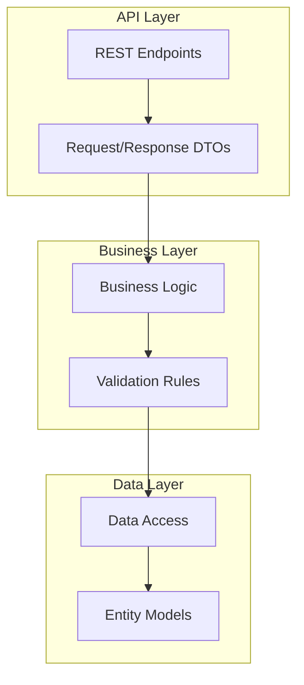
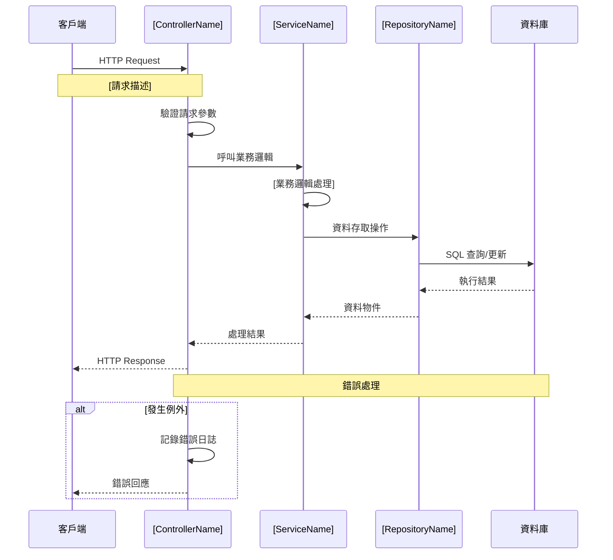
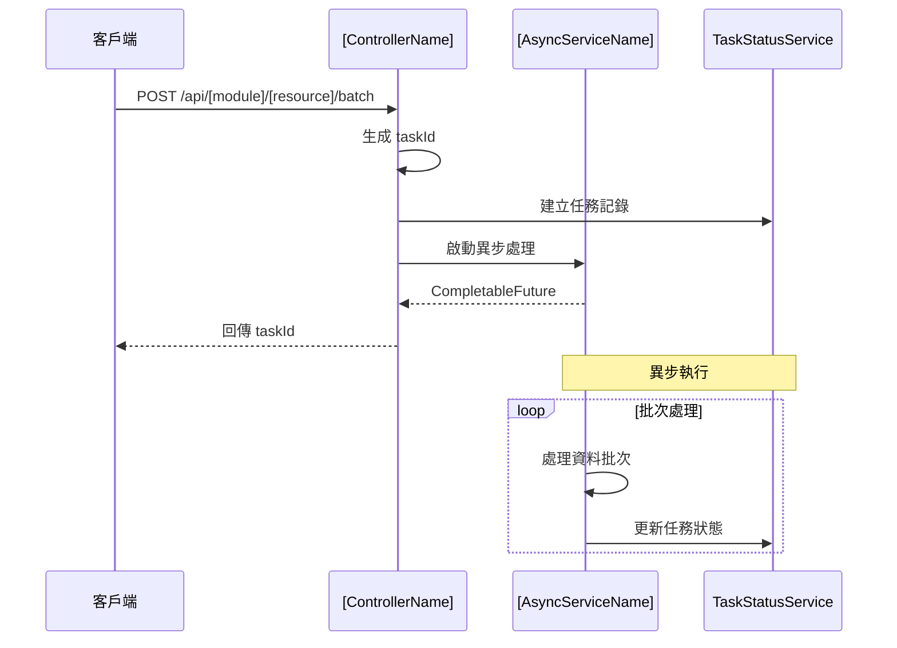
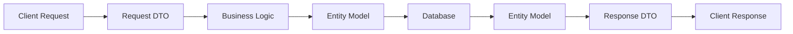

# Spring Boot API 設計文檔範本

> 此範本提供標準化的 API 文檔格式，幫助開發團隊快速建立完整的 API 設計文檔

## 📋 文檔資訊

| 項目 | 內容 |
|------|------|
| **專案名稱** | `[專案名稱]` |
| **API 模組** | `[API 模組名稱]` |
| **版本** | `v1.0.0` |
| **最後更新** | `2025-08-18` |
| **負責人** | `[開發者姓名]` |
| **審核者** | `[審核者姓名]` |
| **相關文檔** | [程式設計規範](./Spring-Boot程式設計規範文件(生成Spring程式).md) |

---

## 🎯 功能說明

### 核心功能
`[簡短描述此 API 模組的主要功能和用途]`

### 業務背景
`[說明此 API 解決的業務問題或需求]`

### 技術特色
- `[技術特色 1]`
- `[技術特色 2]`
- `[技術特色 3]`

---

## 🔗 API 端點總覽

**API路徑設計原則**: 
- **統一前綴**: 所有API使用 `/api/v{version}/` 作為基礎路徑
- **版本控制**: 當前版本為 `v1`，未來版本遞增
- **模組化設計**: 依業務模組組織API路徑結構

| 端點 | 方法 | 功能描述 | 權限需求 |
|------|------|----------|----------|
| `/api/v1/[module]/[resource]` | GET | `[查詢功能描述]` | `[權限等級]` |
| `/api/v1/[module]/[resource]` | POST | `[新增功能描述]` | `[權限等級]` |
| `/api/v1/[module]/[resource]/{id}` | PUT | `[更新功能描述]` | `[權限等級]` |
| `/api/v1/[module]/[resource]/{id}` | DELETE | `[刪除功能描述]` | `[權限等級]` |
| `/api/v1/[module]/[resource]/batch` | POST | `[批次處理功能描述]` | `[權限等級]` |
| `/api/v1/[module]/[resource]/status/{taskId}` | GET | `[狀態查詢功能描述]` | `[權限等級]` |

### API路徑範例

**實際應用範例**:
```java
// Controller層路徑對應
@RestController
@RequestMapping("/api/v1/crew-import")
@CrossOrigin(origins = "*")
public class CrewImportController {
    
    @GetMapping("/crews")
    public ResponseEntity<ApiResponse<Page<CrewResponseDTO>>> getCrewList() {
        // 對應前端: GET /api/v1/crew-import/crews
    }
    
    @PostMapping("/crews")
    public ResponseEntity<ApiResponse<CrewResponseDTO>> createCrew() {
        // 對應前端: POST /api/v1/crew-import/crews
    }
    
    @PostMapping("/crews/batch")
    public ResponseEntity<ApiResponse<BatchProcessResult>> batchImportCrews() {
        // 對應前端: POST /api/v1/crew-import/crews/batch
    }
}
```

---

## 🏗️ 系統架構

> 📖 **詳細規範**: 分層架構的程式設計規範請參考 [程式設計規範文件](./Spring-Boot程式設計規範文件(生成Spring程式).md#️-分層架構規範)

### API 架構概覽


### 專案結構
| 層級 | 套件路徑 | 職責描述 |
|------|----------|----------|
| **Controller** | `com.[company].[project].controller` | API端點定義與請求處理 |
| **Service** | `com.[company].[project].service` | 業務邏輯實作 |
| **Repository** | `com.[company].[project].repository` | 資料存取層 |
| **DTO** | `com.[company].[project].dto` | 資料傳輸物件 |

---

## 📊 API 詳細規格

### API 設計原則
- **RESTful 設計**: 遵循 REST 設計原則
- **統一回應格式**: 所有 API 使用一致的回應結構
- **版本控制**: 使用 URL 路徑進行版本管理
- **錯誤處理**: 提供清晰的錯誤訊息和狀態碼

### 1. 查詢 API
```http
GET /api/v1/[module]/[resource]
```

#### 請求參數
| 參數名 | 類型 | 必填 | 描述 | 範例 |
|--------|------|------|------|------|
| `page` | Integer | 否 | 頁碼 (從 0 開始) | `0` |
| `size` | Integer | 否 | 每頁筆數 | `20` |
| `sort` | String | 否 | 排序欄位 | `id,desc` |
| `[filter]` | String | 否 | `[篩選條件描述]` | `[範例值]` |

#### 回應範例
```json
{
  "status": "success",
  "data": {
    "content": [
      {
        "id": 1,
        "[field1]": "[value1]",
        "[field2]": "[value2]",
        "createdAt": "2024-01-01T10:00:00Z",
        "updatedAt": "2024-01-01T10:00:00Z"
      }
    ],
    "pageable": {
      "page": 0,
      "size": 20,
      "totalElements": 100,
      "totalPages": 5
    }
  },
  "message": "查詢成功",
  "timestamp": "2024-01-01T10:00:00Z"
}
```

### 2. 新增 API
```http
POST /api/v1/[module]/[resource]
```

#### 請求 Body
```json
{
  "[field1]": "[value1]",
  "[field2]": "[value2]",
  "[field3]": "[value3]"
}
```

#### 回應範例
```json
{
  "status": "success",
  "data": {
    "id": 1,
    "[field1]": "[value1]",
    "[field2]": "[value2]",
    "createdAt": "2024-01-01T10:00:00Z"
  },
  "message": "建立成功",
  "timestamp": "2024-01-01T10:00:00Z"
}
```

### 3. 批次處理 API
```http
POST /api/v1/[module]/[resource]/batch
```

#### 請求 Body
```json
{
  "operation": "[batch_operation_type]",
  "data": [
    {
      "[field1]": "[value1]",
      "[field2]": "[value2]"
    }
  ]
}
```

#### 回應範例
```json
{
  "status": "success",
  "data": {
    "taskId": "uuid-string",
    "totalCount": 100,
    "processedCount": 0,
    "status": "PROCESSING"
  },
  "message": "批次任務已啟動",
  "timestamp": "2024-01-01T10:00:00Z"
}
```

---

## 🔄 業務流程圖

### 主要業務流程


### 批次處理流程


---

## 📈 資料模型

### API 資料流


> 📖 **詳細模型**: 完整的Entity設計請參考 [程式設計規範文件](./Spring-Boot程式設計規範文件(生成Spring程式).md#️-entity-layer-規範)

### Entity 設計規範
- **所有Entity類別必須實作 `AuditableEntity` interface**，以確保統一的審計功能
- `AuditableEntity` 提供以下審計字段：
  - `creator`: 建立人員
  - `createtime`: 建立時間
  - `modifier`: 修改人員
  - `modifytime`: 修改時間
- 這有助於追蹤資料的變更歷史和責任歸屬

---

---

## 🔒 安全與驗證

### 身份驗證
- **方式**: `[JWT/OAuth2/其他]`
- **Token 格式**: `Bearer [token]`
- **過期時間**: `[時間]`

### 權限控制
| 角色 | 查詢 | 新增 | 修改 | 刪除 | 批次操作 |
|------|------|------|------|------|----------|
| `ADMIN` | ✅ | ✅ | ✅ | ✅ | ✅ |
| `USER` | ✅ | ✅ | ✅ | ❌ | ❌ |
| `VIEWER` | ✅ | ❌ | ❌ | ❌ | ❌ |

### 輸入驗證
- **請求參數驗證**: `@Valid`, `@NotNull`, `@Size` 等
- **業務邏輯驗證**: 自定義驗證規則
- **SQL 注入防護**: 使用 PreparedStatement

---

## ⚡ 效能與限制

### 分頁設定
- **預設頁面大小**: `20`
- **最大頁面大小**: `100`
- **最大查詢時間**: `30 秒`

### 批次處理限制
- **單次批次最大筆數**: `1000`
- **同時執行任務數**: `5`
- **任務逾時時間**: `30 分鐘`

### 快取策略
- **快取類型**: `[Redis/EhCache/其他]`
- **快取時間**: `[時間設定]`
- **快取鍵規則**: `[快取鍵命名規則]`

---

## 🚨 錯誤處理

### API 錯誤回應標準

> 💡 **實作參考**: 異常處理的程式實作請參考 [程式設計規範文件](./Spring-Boot程式設計規範文件(生成Spring程式).md#-異常處理規範)

### 標準錯誤回應格式
```json
{
  "status": "error",
  "error": {
    "code": "ERROR_CODE",
    "message": "錯誤訊息",
    "details": "詳細錯誤資訊"
  },
  "timestamp": "2024-01-01T10:00:00Z",
  "path": "/api/[module]/[resource]"
}
```

### 常見錯誤碼
| 錯誤碼 | HTTP 狀態 | 描述 | 解決方案 |
|--------|-----------|------|----------|
| `E001` | 400 | 請求參數錯誤 | 檢查請求參數格式 |
| `E002` | 401 | 身份驗證失敗 | 重新登入或檢查 Token |
| `E003` | 403 | 權限不足 | 聯繫管理員申請權限 |
| `E004` | 404 | 資源不存在 | 確認資源 ID 是否正確 |
| `E005` | 409 | 資源衝突 | 檢查資料是否重複 |
| `E006` | 500 | 伺服器內部錯誤 | 聯繫技術支援 |

---

## 📝 測試範例

### API 測試策略
- **單元測試**: Controller層的HTTP請求測試
- **整合測試**: 完整API流程測試
- **契約測試**: API規格一致性驗證

### 單元測試
```java
@SpringBootTest
@AutoConfigureTestDatabase(replace = AutoConfigureTestDatabase.Replace.NONE)
class [ControllerName]Test {

    @Autowired
    private MockMvc mockMvc;

    @Test
    void test[MethodName]_Success() throws Exception {
        // Given
        [RequestDTO] request = new [RequestDTO]();
        // 設定測試資料

        // When & Then
        mockMvc.perform(post("/api/[module]/[resource]")
                .contentType(MediaType.APPLICATION_JSON)
                .content(objectMapper.writeValueAsString(request)))
                .andExpect(status().isOk())
                .andExpect(jsonPath("$.status").value("success"));
    }
}
```

### 整合測試
```java
@SpringBootTest(webEnvironment = SpringBootTest.WebEnvironment.RANDOM_PORT)
@Testcontainers
class [ServiceName]IntegrationTest {

    @Container
    static MySQLContainer<?> mysql = new MySQLContainer<>("mysql:8.0")
            .withDatabaseName("[database_name]")
            .withUsername("[username]")
            .withPassword("[password]");

    @Test
    void test[BusinessMethod]_WithRealDatabase() {
        // 整合測試邏輯
    }
}
```

---

## 📚 部署與維運

## 🔧 開發與部署規範

> 📖 **編譯除錯指南**: 本章節提供 SpringBoot 應用程式的編譯、除錯和部署標準流程

### 🏗️ 編譯前準備

#### 環境要求檢查
- **Java版本**: JDK 17 或以上版本
- **Maven版本**: 3.8.0 或以上版本
- **IDE設定**: 編碼格式設為 UTF-8
- **資料庫**: MySQL 8.0 或以上版本

#### 專案結構驗證
```text
src/
├── main/
│   ├── java/
│   │   └── com/[company]/[project]/
│   │       ├── controller/     # REST API 控制器
│   │       ├── service/        # 業務邏輯層
│   │       ├── repository/     # 資料存取層
│   │       ├── entity/         # JPA 實體類
│   │       ├── dto/            # 資料傳輸物件
│   │       ├── config/         # 配置類
│   │       └── Application.java # 主程式類
│   └── resources/
│       ├── application.yml     # 應用程式配置
│       ├── application-dev.yml # 開發環境配置
│       ├── application-prod.yml # 正式環境配置
│       └── static/             # 靜態資源
└── test/                       # 測試程式碼
```

### 🔨 編譯驗證流程

#### 1. Maven 依賴檢查
```bash
# 清理並檢查依賴
mvn clean dependency:resolve

# 檢查依賴衝突
mvn dependency:tree

# 檢查安全漏洞
mvn dependency:check
```

#### 2. 編譯執行步驟
```bash
# 完整編譯流程
mvn clean compile                    # 清理並編譯
mvn compile                         # 編譯主程式
mvn test-compile                    # 編譯測試程式
mvn test                           # 執行單元測試
mvn package                        # 打包應用程式
```

#### 3. 常見編譯錯誤解決

| 錯誤類型 | 常見原因 | 解決方案 |
|----------|----------|----------|
| **編譯錯誤** | 語法錯誤、匯入錯誤 | 檢查 import 語句、修正語法 |
| **依賴衝突** | 版本不相容 | 使用 `dependencyManagement` 統一版本 |
| **缺少依賴** | pom.xml 未包含必要套件 | 添加對應的 dependency |
| **編碼問題** | 檔案編碼不一致 | 設定專案編碼為 UTF-8 |

### 🐛 除錯指南

#### 1. 應用程式啟動檢查
```bash
# 啟動應用程式並檢查日誌
mvn spring-boot:run

# 或使用 jar 檔案啟動
java -jar target/[application-name].jar

# 啟動時顯示詳細日誌
java -jar target/[application-name].jar --debug
```

#### 2. 啟動失敗常見問題

| 問題類型 | 症狀 | 解決方案 |
|----------|------|----------|
| **埠號衝突** | `Port already in use` | 更改 `server.port` 或停止佔用程序 |
| **資料庫連線失敗** | `Connection refused` | 檢查資料庫服務、連線參數 |
| **Bean 載入失敗** | `BeanCreationException` | 檢查 @Component 註解、依賴注入 |
| **配置檔案錯誤** | `YAML parsing error` | 驗證 YAML 語法、縮排格式 |

#### 3. 配置檔案驗證

##### application.yml 基本檢查
```yaml
# 伺服器配置
server:
  port: 8088                        # 確保埠號未被佔用
  servlet:
    context-path: /api              # API 根路徑

# 資料庫配置
spring:
  datasource:
    url: jdbc:mysql://localhost:3306/[database_name]
    username: ${DB_USERNAME:root}
    password: ${DB_PASSWORD:password}
    driver-class-name: com.mysql.cj.jdbc.Driver
  
  # JPA 配置
  jpa:
    hibernate:
      ddl-auto: validate            # 生產環境使用 validate
      naming:
        physical-strategy: org.hibernate.boot.model.naming.CamelCaseToUnderscoresNamingStrategy
    show-sql: false                 # 生產環境設為 false
    properties:
      hibernate:
        format_sql: true
        dialect: org.hibernate.dialect.MySQL8Dialect

# 日誌配置
logging:
  level:
    com.[company].[project]: INFO
    org.springframework.web: DEBUG
    org.hibernate.SQL: DEBUG
  file:
    name: logs/application.log
```

#### 4. 除錯工具配置

##### JVM 除錯參數
```bash
# 啟用遠端除錯
java -agentlib:jdwp=transport=dt_socket,server=y,suspend=n,address=5005 -jar app.jar

# 記憶體分析
java -XX:+HeapDumpOnOutOfMemoryError -XX:HeapDumpPath=/tmp/dumps/ -jar app.jar

# GC 日誌
java -XX:+PrintGC -XX:+PrintGCDetails -jar app.jar
```

### 🚀 部署前檢查清單

#### 程式碼品質檢查
- [ ] 所有編譯錯誤已解決
- [ ] 單元測試通過率 > 80%
- [ ] 整合測試執行成功
- [ ] 程式碼風格符合規範
- [ ] 無安全漏洞警告

#### 配置檔案檢查
- [ ] application.yml 語法正確
- [ ] 環境變數設定完整
- [ ] 資料庫連線參數正確
- [ ] 日誌等級適合環境
- [ ] 安全配置正確設定

#### 功能驗證檢查
- [ ] 應用程式正常啟動
- [ ] 健康檢查端點回應正常
- [ ] API 端點可正常訪問
- [ ] 資料庫操作正常執行
- [ ] 錯誤處理機制正常運作

#### 效能與監控檢查
- [ ] 啟動時間在合理範圍內 (< 60秒)
- [ ] 記憶體使用量正常
- [ ] API 回應時間符合需求
- [ ] 監控端點正常運作
- [ ] 日誌輸出格式正確

### 📊 效能監控與維護

#### 監控指標設定
```yaml
# application.yml - 監控配置
management:
  endpoints:
    web:
      exposure:
        include: health,info,metrics,prometheus
      base-path: /actuator
  endpoint:
    health:
      show-details: always
  metrics:
    export:
      prometheus:
        enabled: true

# 應用程式資訊
info:
  app:
    name: ${spring.application.name}
    version: @project.version@
    description: ${project.description}
```

#### 效能基準指標
- **API 回應時間**: 平均 < 200ms，P95 < 500ms
- **錯誤率**: < 1%
- **可用性**: > 99.9%
- **記憶體使用率**: < 80%
- **CPU 使用率**: < 70%
- **資料庫連線池**: 使用率 < 80%

#### 除錯報告範本

##### 編譯除錯報告格式
```markdown
# SpringBoot編譯除錯報告

## 📋 編譯摘要
- **編譯日期**: [YYYY-MM-DD HH:mm:ss]
- **Java版本**: [Java Version]
- **Maven版本**: [Maven Version]
- **編譯結果**: ✅ 成功 / ❌ 失敗
- **編譯時間**: [Duration]

## 🐛 發現的問題
### 編譯錯誤
- [ ] 語法錯誤: [詳細描述]
- [ ] 匯入錯誤: [詳細描述]
- [ ] 型別錯誤: [詳細描述]

### 相依性問題
- [ ] 版本衝突: [詳細描述]
- [ ] 缺失套件: [詳細描述]

### 配置問題
- [ ] YAML 語法錯誤: [詳細描述]
- [ ] 資料庫連線問題: [詳細描述]

## 🔧 解決方案記錄
1. **問題**: [問題描述]
   **解決方案**: [解決步驟]
   **修改檔案**: [檔案清單]

## ✅ 最終驗證結果
- [ ] Maven 編譯成功
- [ ] SpringBoot 啟動成功
- [ ] 資料庫連線測試通過
- [ ] API 健康檢查正常
```

---

## 📖 使用說明

### API文檔使用指南
1. **複製範本**: 使用此範本建立API文檔
2. **替換佔位符**: 將 `[佔位符]` 替換為實際內容
3. **更新流程圖**: 根據實際業務流程調整圖表
4. **同步程式碼**: 確保文檔與程式實作一致

### 與程式設計規範的搭配使用
- **API設計階段**: 使用本文檔進行API設計
- **程式實作階段**: 參考 [程式設計規範文件](./Spring-Boot程式設計規範文件(生成Spring程式).md)
- **測試階段**: 結合兩個文檔進行完整測試

---

## 📚 相關文檔

- [程式設計規範文件](./Spring-Boot程式設計規範文件(生成Spring程式).md) - Spring Boot程式實作標準
- [資料庫設計規範](./Database設計規範.md) - 資料庫設計標準
- [前端API整合指南](./Frontend-API整合指南.md) - 前端與API整合規範

---

## 📋 檢查清單

### API設計檢查
- [ ] API端點設計完成
- [ ] 請求/回應格式定義
- [ ] 業務流程圖繪製
- [ ] 錯誤處理規劃
- [ ] 安全性設計完成
- [ ] 效能需求確認

### 文檔品質檢查
- [ ] 佔位符全部替換
- [ ] 流程圖與實際業務一致
- [ ] 範例資料符合實際情況
- [ ] 相關文檔連結正確
- [ ] 版本資訊更新

---

## 🔄 版本歷史

| 版本 | 日期 | 異動內容 | 負責人 |
|------|------|----------|--------|
| v1.0.0 | YYYY-MM-DD | 初始版本建立 | [開發者] |
| v1.1.0 | YYYY-MM-DD | 新增批次處理功能 | [開發者] |
| v1.2.0 | YYYY-MM-DD | 優化錯誤處理機制 | [開發者] |


---

> 💡 **使用說明**: 此範本中的 `[佔位符]` 請根據實際專案需求替換為具體內容。建議複製此範本後，逐步填入專案相關資訊。

---

## 🔧 Service層業務邏輯規範

### ** Service層業務邏輯**:
- 實作API規格書中定義的所有業務規則
- 完整的資料驗證和業務規則檢查
- 事務管理和錯誤處理
- Entity與DTO之間的轉換
- 複雜查詢和批量操作的實作

### Service層實作標準
```java
@Service
@Transactional
@Slf4j
public class {Entity}Service {
    
    private final {Entity}Repository repository;
    private final {Entity}Mapper mapper;
    
    // 查詢方法使用 @Transactional(readOnly = true)
    @Transactional(readOnly = true)
    public Page<{Entity}ResponseDTO> get{Entity}List(SearchCriteria criteria) {
        // 業務邏輯實作
        // 資料驗證
        // 分頁查詢
        // Entity轉DTO
    }
    
    // 新增/更新方法的事務管理
    @Transactional(rollbackFor = Exception.class)
    public {Entity}ResponseDTO create{Entity}({Entity}RequestDTO request) {
        // 資料驗證
        // 業務規則檢查
        // Entity轉換
        // 儲存操作
        // 回傳DTO
    }
    
    // 批量操作的事務控制
    @Transactional(rollbackFor = Exception.class)
    public BatchProcessResult batch{Entity}Operation(List<{Entity}RequestDTO> requests) {
        // 批量驗證
        // 事務處理
        // 錯誤收集
        // 結果統計
    }
}
```

### 業務規則實作指南

#### 1. 資料驗證機制
```java
/**
 * 業務規則驗證範例
 */
private void validateBusinessRules({Entity}RequestDTO request) {
    // 唯一性檢查
    if (repository.existsByCode(request.getCode())) {
        throw new BusinessException("DUPLICATE_CODE", "代碼已存在: " + request.getCode());
    }
    
    // 範圍驗證
    if (request.getAmount().compareTo(BigDecimal.ZERO) < 0) {
        throw new BusinessException("INVALID_AMOUNT", "金額不能為負數");
    }
    
    // 狀態檢查
    if (!isValidStatus(request.getStatus())) {
        throw new BusinessException("INVALID_STATUS", "無效的狀態值");
    }
}
```

#### 2. 複雜查詢實作
```java
/**
 * 動態查詢條件建構
 */
@Transactional(readOnly = true)
public Page<{Entity}ResponseDTO> searchWithCriteria(SearchCriteria criteria, Pageable pageable) {
    Specification<{Entity}Entity> spec = (root, query, cb) -> {
        List<Predicate> predicates = new ArrayList<>();
        
        // 字串模糊查詢
        if (StringUtils.hasText(criteria.getName())) {
            predicates.add(cb.like(cb.lower(root.get("name")), 
                "%" + criteria.getName().toLowerCase() + "%"));
        }
        
        // 日期範圍查詢
        if (criteria.getStartDate() != null) {
            predicates.add(cb.greaterThanOrEqualTo(root.get("createDate"), criteria.getStartDate()));
        }
        
        // 狀態篩選
        if (criteria.getStatus() != null) {
            predicates.add(cb.equal(root.get("status"), criteria.getStatus()));
        }
        
        return cb.and(predicates.toArray(new Predicate[0]));
    };
    
    Page<{Entity}Entity> entities = repository.findAll(spec, pageable);
    return entities.map(mapper::toResponseDTO);
}
```

#### 3. 批量操作實作
```java
/**
 * 批量處理實作
 */
@Transactional(rollbackFor = Exception.class)
public BatchProcessResult batchProcess(List<{Entity}RequestDTO> requests) {
    BatchProcessResult result = new BatchProcessResult();
    List<String> errors = new ArrayList<>();
    
    for (int i = 0; i < requests.size(); i++) {
        try {
            {Entity}RequestDTO request = requests.get(i);
            validateBusinessRules(request);
            
            {Entity}Entity entity = mapper.toEntity(request);
            repository.save(entity);
            
            result.incrementSuccess();
        } catch (Exception e) {
            errors.add("第" + (i + 1) + "筆資料處理失敗: " + e.getMessage());
            result.incrementFailure();
        }
    }
    
    result.setErrors(errors);
    result.setTotalCount(requests.size());
    
    return result;
}
```

---

## 🎮 Controller層實作規範

### Controller層實作標準
```java
@RestController
@RequestMapping("/api/v1/{resources}")
@CrossOrigin(origins = "*")
@Validated
@Tag(name = "{Entity} Management", description = "{Entity}管理API")
@Slf4j
public class {Entity}Controller {
    
    private final {Entity}Service service;
    
    @GetMapping
    @Operation(summary = "查詢{Entity}列表", description = "支援分頁、排序、篩選查詢")
    public ResponseEntity<ApiResponse<Page<{Entity}ResponseDTO>>> get{Entity}List(
            @Parameter(description = "頁碼", example = "0")
            @RequestParam(defaultValue = "0") @Min(0) int page,
            @Parameter(description = "每頁筆數", example = "20")
            @RequestParam(defaultValue = "20") @Min(1) @Max(100) int size,
            @Parameter(description = "排序欄位", example = "id")
            @RequestParam(defaultValue = "id") String sort,
            @Parameter(description = "排序方向", example = "DESC")
            @RequestParam(defaultValue = "DESC") String direction,
            @Parameter(description = "篩選條件")
            @RequestParam(required = false) String filter) {
        
        Page<{Entity}ResponseDTO> result = service.get{Entity}List(page, size, sort, direction, filter);
        return ResponseEntity.ok(ApiResponse.success(result));
    }
    
    @PostMapping
    @Operation(summary = "新增{Entity}", description = "建立新的{Entity}記錄")
    public ResponseEntity<ApiResponse<{Entity}ResponseDTO>> create{Entity}(
            @RequestBody @Validated({Entity}RequestDTO.Create.class) {Entity}RequestDTO request) {
        
        {Entity}ResponseDTO result = service.create{Entity}(request);
        return ResponseEntity.status(HttpStatus.CREATED)
                .body(ApiResponse.success(result));
    }
    
    @PostMapping("/batch")
    @Operation(summary = "批量處理{Entity}", description = "批量新增或更新{Entity}資料")
    public ResponseEntity<ApiResponse<BatchProcessResult>> batch{Entity}Operation(
            @RequestBody @Validated List<{Entity}RequestDTO> requests) {
        
        BatchProcessResult result = service.batch{Entity}Operation(requests);
        return ResponseEntity.status(HttpStatus.ACCEPTED)
                .body(ApiResponse.success(result));
    }
}
```

### Swagger/OpenAPI註解標準

#### 1. API文件註解規範
```java
@Tag(name = "員工管理", description = "員工相關API")
@RestController
public class EmployeeController {
    
    @Operation(
        summary = "查詢員工列表",
        description = "支援分頁、排序、篩選查詢員工資料",
        tags = {"員工管理"}
    )
    @ApiResponses({
        @ApiResponse(responseCode = "200", description = "查詢成功",
            content = @Content(schema = @Schema(implementation = PageEmployeeResponse.class))),
        @ApiResponse(responseCode = "400", description = "請求參數錯誤",
            content = @Content(schema = @Schema(implementation = ErrorResponse.class))),
        @ApiResponse(responseCode = "500", description = "伺服器內部錯誤",
            content = @Content(schema = @Schema(implementation = ErrorResponse.class)))
    })
    public ResponseEntity<ApiResponse<Page<EmployeeResponseDTO>>> getEmployees(
        @Parameter(description = "頁碼", example = "0", schema = @Schema(minimum = "0"))
        @RequestParam(defaultValue = "0") @Min(0) int page) {
        // 實作內容
    }
}
```

#### 2. DTO Schema註解
```java
@Schema(description = "員工請求資料")
public class EmployeeRequestDTO {
    
    @Schema(description = "員工編號", example = "EMP001", required = true)
    @NotBlank(message = "員工編號不能為空")
    private String empCode;
    
    @Schema(description = "員工姓名", example = "張三", required = true)
    @NotBlank(message = "員工姓名不能為空")
    private String empName;
    
    @Schema(description = "部門名稱", example = "資訊部")
    private String department;
}
```

### 回應格式標準

#### 1. 統一回應物件
```java
@Schema(description = "API統一回應格式")
@Data
@NoArgsConstructor
@AllArgsConstructor
public class ApiResponse<T> {
    
    @Schema(description = "操作是否成功", example = "true")
    private boolean success;
    
    @Schema(description = "回應訊息", example = "操作成功")
    private String message;
    
    @Schema(description = "回應資料")
    private T data;
    
    @Schema(description = "時間戳記", example = "2024-01-01T10:00:00Z")
    private String timestamp;
    
    @Schema(description = "請求ID", example = "uuid-string")
    private String requestId;
    
    public static <T> ApiResponse<T> success(T data) {
        return new ApiResponse<>(true, "操作成功", data, 
                LocalDateTime.now().toString(), UUID.randomUUID().toString());
    }
    
    public static <T> ApiResponse<T> error(String message) {
        return new ApiResponse<>(false, message, null,
                LocalDateTime.now().toString(), UUID.randomUUID().toString());
    }
}
```

#### 2. 分頁回應格式
```java
@Schema(description = "分頁回應資料")
@Data
public class PageResponse<T> {
    
    @Schema(description = "資料內容")
    private List<T> content;
    
    @Schema(description = "分頁資訊")
    private PageInfo pageable;
    
    @Data
    @Schema(description = "分頁資訊")
    public static class PageInfo {
        @Schema(description = "當前頁碼", example = "0")
        private int page;
        
        @Schema(description = "每頁筆數", example = "20")
        private int size;
        
        @Schema(description = "總筆數", example = "100")
        private long totalElements;
        
        @Schema(description = "總頁數", example = "5")
        private int totalPages;
        
        @Schema(description = "是否為第一頁", example = "true")
        private boolean first;
        
        @Schema(description = "是否為最後一頁", example = "false")
        private boolean last;
    }
}
```

### RESTful設計原則

#### 1. HTTP方法與狀態碼對應
| HTTP方法 | 用途 | 成功狀態碼 | 失敗狀態碼 |
|----------|------|------------|------------|
| **GET** | 查詢資源 | 200 OK | 404 Not Found |
| **POST** | 建立資源 | 201 Created | 400 Bad Request |
| **PUT** | 更新資源 | 200 OK | 404 Not Found |
| **DELETE** | 刪除資源 | 200 OK / 204 No Content | 404 Not Found |

#### 2. URL設計規範
```java
// 標準API路徑設計 - 統一使用 /api/v1/ 前綴
// 資源集合操作
GET    /api/v1/employees           // 查詢員工列表
POST   /api/v1/employees           // 新增員工

// 單一資源操作
GET    /api/v1/employees/{id}      // 查詢特定員工
PUT    /api/v1/employees/{id}      // 更新特定員工
DELETE /api/v1/employees/{id}      // 刪除特定員工

// 子資源操作
GET    /api/v1/employees/{id}/skills     // 查詢員工技能
POST   /api/v1/employees/{id}/skills     // 新增員工技能

// 特殊操作
POST   /api/v1/employees/batch           // 批量操作
GET    /api/v1/employees/search          // 搜尋操作
POST   /api/v1/employees/upload          // 檔案上傳
GET    /api/v1/employees/status/{taskId} // 狀態查詢
```