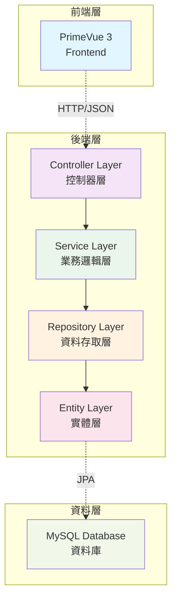

# Spring Boot 程式設計規範文件

> 本文件定義Spring Boot專案中程式設計的標準規範，確保程式碼的一致性、可維護性和擴展性。

## 📋 文檔資訊

| 項目 | 內容 |
|------|------|
| **文檔版本** | v0.2.0 |
| **最後更新** | 2025-08-16 |
| **適用技術** | Spring Boot 3 + JPA/Hibernate |
| **架構模式** | 前後端分離 |
| **負責單位** | 技術架構組 |
| **相關文檔** | [API設計規範](./Spring-Boot-api設計規範文件(生成API).md) |

---

## 🎯 設計原則

### 核心設計理念
- **分層架構**: 嚴格遵循Controller、Service、Repository、Entity分層設計
- **依賴注入**: 使用Spring的依賴注入機制，避免緊耦合
- **統一規範**: 所有程式碼遵循統一的命名和結構規範
- **異常處理**: 完整的異常處理和錯誤回應機制
- **RESTful設計**: 符合RESTful API設計原則
- **測試覆蓋**: 確保關鍵業務邏輯有適當的測試覆蓋

---

## 🏗️ 分層架構規範

### 1. 整體架構圖



### 2. 層級職責定義

| 層級 | 主要職責 | 技術實作 | 依賴關係 |
|------|----------|----------|----------|
| **Controller** | HTTP請求處理、參數驗證、回應格式化 | @RestController, @RequestMapping | 依賴 Service |
| **Service** | 業務邏輯處理、事務管理、資料轉換 | @Service, @Transactional | 依賴 Repository |
| **Repository** | 資料存取、查詢實作、資料持久化 | @Repository, JpaRepository | 依賴 Entity |
| **Entity** | 資料模型定義、資料庫對映、關聯關係 | @Entity, @Table, JPA註解 | 無依賴 |

---

## 🎮 Controller Layer 規範

### 1. 基礎規範

> 💡 **相關參考**: 詳細的API端點設計請參考 [API設計規範文件](./Spring-Boot-api設計規範文件(生成API).md#-api-端點總覽)

#### 類別命名規則
```
{BusinessEntity}Controller
```

#### 基本註解要求
```java
@RestController
@RequestMapping("/api/v1/{resource-name}")
@CrossOrigin(origins = "*")
@Validated
@Tag(name = "{Entity} Management", description = "{Entity}管理API")
public class {Entity}Controller {
    // 實作內容...
}
```

### 2. API路徑設計規範

> 📖 **詳細規範**: 完整的API路徑設計請參考 [API設計規範文件](./Spring-Boot-api設計規範文件(生成API).md#-api-詳細規格)

| HTTP方法 | 路徑格式 | 用途 |
|----------|----------|------|
| **GET** | `/api/v1/{resources}` | 查詢列表（分頁） |
| **POST** | `/api/v1/{resources}` | 新增 |
| **PUT** | `/api/v1/{resources}/{id}` | 更新 |
| **DELETE** | `/api/v1/{resources}/{id}` | 刪除 |

### 3. Controller實作範本

```java
@RestController
@RequestMapping("/api/v1/employees")
@CrossOrigin(origins = "*")
@Validated
@Tag(name = "Employee Management", description = "員工管理API")
public class EmployeeController {
    
    private final EmployeeService employeeService;
    
    public EmployeeController(EmployeeService employeeService) {
        this.employeeService = employeeService;
    }
    
    /**
     * 查詢員工列表（分頁）
     */
    @GetMapping
    @Operation(summary = "查詢員工列表", description = "支援分頁、排序、篩選")
    public ResponseEntity<ApiResponse<Page<EmployeeResponseDTO>>> getEmployees(
            @RequestParam(defaultValue = "0") int page,
            @RequestParam(defaultValue = "20") int size,
            @RequestParam(defaultValue = "id") String sort,
            @RequestParam(defaultValue = "DESC") String direction,
            @RequestParam(required = false) String department) {
        
        Page<EmployeeResponseDTO> employees = employeeService.getEmployees(page, size, sort, direction, department);
        return ResponseEntity.ok(ApiResponse.success(employees));
    }
    
    /**
     * 查詢單一員工
     */
    @GetMapping("/{id}")
    @Operation(summary = "查詢員工詳情", description = "根據ID查詢員工資訊")
    public ResponseEntity<ApiResponse<EmployeeResponseDTO>> getEmployee(
            @PathVariable @NotNull Long id) {
        
        EmployeeResponseDTO employee = employeeService.getEmployeeById(id);
        return ResponseEntity.ok(ApiResponse.success(employee));
    }
    
    /**
     * 新增員工
     */
    @PostMapping
    @Operation(summary = "新增員工", description = "建立新的員工記錄")
    public ResponseEntity<ApiResponse<EmployeeResponseDTO>> createEmployee(
            @RequestBody @Validated(EmployeeRequestDTO.Create.class) EmployeeRequestDTO request) {
        
        EmployeeResponseDTO employee = employeeService.createEmployee(request);
        return ResponseEntity.status(HttpStatus.CREATED)
                .body(ApiResponse.success(employee));
    }
    
    /**
     * 更新員工
     */
    @PutMapping("/{id}")
    @Operation(summary = "更新員工", description = "更新員工資訊")
    public ResponseEntity<ApiResponse<EmployeeResponseDTO>> updateEmployee(
            @PathVariable @NotNull Long id,
            @RequestBody @Validated(EmployeeRequestDTO.Update.class) EmployeeRequestDTO request) {
        
        EmployeeResponseDTO employee = employeeService.updateEmployee(id, request);
        return ResponseEntity.ok(ApiResponse.success(employee));
    }
    
    /**
     * 刪除員工
     */
    @DeleteMapping("/{id}")
    @Operation(summary = "刪除員工", description = "刪除員工記錄")
    public ResponseEntity<ApiResponse<Void>> deleteEmployee(@PathVariable @NotNull Long id) {
        employeeService.deleteEmployee(id);
        return ResponseEntity.ok(ApiResponse.success(null));
    }
}
```

### 4. 統一回應格式

```java
@Data
@NoArgsConstructor
@AllArgsConstructor
public class ApiResponse<T> {
    private boolean success;
    private String message;
    private T data;
    private String timestamp;
    private String path;
    
    public static <T> ApiResponse<T> success(T data) {
        ApiResponse<T> response = new ApiResponse<>();
        response.setSuccess(true);
        response.setMessage("操作成功");
        response.setData(data);
        response.setTimestamp(LocalDateTime.now().toString());
        return response;
    }
    
    public static <T> ApiResponse<T> error(String message) {
        ApiResponse<T> response = new ApiResponse<>();
        response.setSuccess(false);
        response.setMessage(message);
        response.setTimestamp(LocalDateTime.now().toString());
        return response;
    }
}
```

---

## 🔧 Service Layer 規範

### 1. 基礎規範

#### 類別命名規則
```
{BusinessEntity}Service
```

#### 基本註解要求
```java
@Service
@Transactional
@Slf4j
public class {Entity}Service {
    // 實作內容...
}
```

### 2. Service實作範本

```java
@Service
@Transactional
@Slf4j
public class EmployeeService {
    
    private final EmployeeRepository employeeRepository;
    private final EmployeeMapper employeeMapper;
    
    public EmployeeService(EmployeeRepository employeeRepository, 
                          EmployeeMapper employeeMapper) {
        this.employeeRepository = employeeRepository;
        this.employeeMapper = employeeMapper;
    }
    
    /**
     * 查詢員工列表（分頁）
     */
    @Transactional(readOnly = true)
    public Page<EmployeeResponseDTO> getEmployees(int page, int size, String sort, 
                                                 String direction, String department) {
        log.debug("查詢員工列表: page={}, size={}, sort={}, direction={}, department={}", 
                 page, size, sort, direction, department);
        
        Sort.Direction sortDirection = Sort.Direction.fromString(direction);
        Pageable pageable = PageRequest.of(page, size, Sort.by(sortDirection, sort));
        
        Page<EmployeeEntity> employees;
        if (StringUtils.hasText(department)) {
            employees = employeeRepository.findByDepartmentContainingIgnoreCase(department, pageable);
        } else {
            employees = employeeRepository.findAll(pageable);
        }
        
        return employees.map(employeeMapper::toResponseDTO);
    }
    
    /**
     * 根據ID查詢員工
     */
    @Transactional(readOnly = true)
    public EmployeeResponseDTO getEmployeeById(Long id) {
        log.debug("查詢員工: id={}", id);
        
        EmployeeEntity employee = employeeRepository.findById(id)
                .orElseThrow(() -> new BusinessException("員工不存在: " + id));
        
        return employeeMapper.toResponseDTO(employee);
    }
    
    /**
     * 新增員工
     */
    public EmployeeResponseDTO createEmployee(EmployeeRequestDTO request) {
        log.info("新增員工: {}", request);
        
        // 業務驗證
        validateEmployeeCode(request.getEmpCode());
        
        // 轉換並儲存
        EmployeeEntity employee = employeeMapper.toEntity(request);
        employee.setCreator(getCurrentUserId());
        employee = employeeRepository.save(employee);
        
        log.info("員工新增成功: id={}, empCode={}", employee.getId(), employee.getEmpCode());
        return employeeMapper.toResponseDTO(employee);
    }
    
    /**
     * 更新員工
     */
    public EmployeeResponseDTO updateEmployee(Long id, EmployeeRequestDTO request) {
        log.info("更新員工: id={}, request={}", id, request);
        
        EmployeeEntity existingEmployee = employeeRepository.findById(id)
                .orElseThrow(() -> new BusinessException("員工不存在: " + id));
        
        // 更新欄位
        employeeMapper.updateEntityFromDTO(request, existingEmployee);
        existingEmployee.setModifier(getCurrentUserId());
        existingEmployee = employeeRepository.save(existingEmployee);
        
        log.info("員工更新成功: id={}", id);
        return employeeMapper.toResponseDTO(existingEmployee);
    }
    
    /**
     * 刪除員工
     */
    public void deleteEmployee(Long id) {
        log.info("刪除員工: id={}", id);
        
        if (!employeeRepository.existsById(id)) {
            throw new BusinessException("員工不存在: " + id);
        }
        
        employeeRepository.deleteById(id);
        log.info("員工刪除成功: id={}", id);
    }
    
    /**
     * 驗證員工編號唯一性
     */
    private void validateEmployeeCode(String empCode) {
        if (employeeRepository.existsByEmpCode(empCode)) {
            throw new BusinessException("員工編號已存在: " + empCode);
        }
    }
    
    /**
     * 取得當前使用者ID
     */
    private Long getCurrentUserId() {
        // 實作取得當前登入使用者邏輯
        return 1L; // 暫時返回固定值
    }
}
```

### 3. 事務管理規範

#### 事務註解使用
```java
// 查詢操作：只讀事務
@Transactional(readOnly = true)
public EmployeeResponseDTO getEmployee(Long id) { ... }

// 新增/更新/刪除：讀寫事務
@Transactional
public EmployeeResponseDTO createEmployee(EmployeeRequestDTO request) { ... }

// 批次操作：指定回滾條件
@Transactional(rollbackFor = Exception.class)
public void batchUpdateEmployees(List<EmployeeRequestDTO> requests) { ... }
```

### **4. Service層業務邏輯**:
- 實作API規格書中定義的所有業務規則
- 完整的資料驗證和業務規則檢查
- 事務管理和錯誤處理
- Entity與DTO之間的轉換
- 複雜查詢和批量操作的實作

### Service層業務邏輯實作指南

#### 1. 業務規則驗證
```java
@Service
@Transactional
@Slf4j
public class EmployeeService {
    
    /**
     * 業務規則驗證範例
     */
    private void validateBusinessRules(EmployeeRequestDTO request) {
        // 1. 唯一性檢查
        if (employeeRepository.existsByEmpCode(request.getEmpCode())) {
            throw new BusinessException("DUPLICATE_EMP_CODE", "員工編號已存在: " + request.getEmpCode());
        }
        
        // 2. 資料完整性檢查
        if (request.getHireDate().isAfter(LocalDate.now())) {
            throw new BusinessException("INVALID_HIRE_DATE", "到職日期不能是未來時間");
        }
        
        // 3. 業務邏輯檢查
        if (request.getSalary().compareTo(BigDecimal.ZERO) <= 0) {
            throw new BusinessException("INVALID_SALARY", "薪資必須大於0");
        }
        
        // 4. 關聯資料檢查
        if (StringUtils.hasText(request.getDepartment()) && 
            !departmentService.existsByName(request.getDepartment())) {
            throw new BusinessException("DEPARTMENT_NOT_EXISTS", "部門不存在: " + request.getDepartment());
        }
    }
    
    /**
     * 複雜業務邏輯處理
     */
    @Transactional(rollbackFor = Exception.class)
    public EmployeeResponseDTO processEmployeePromotion(Long empId, PromotionRequestDTO request) {
        // 1. 查詢現有員工
        EmployeeEntity employee = employeeRepository.findById(empId)
                .orElseThrow(() -> new BusinessException("EMPLOYEE_NOT_FOUND", "員工不存在"));
        
        // 2. 檢查升遷條件
        validatePromotionEligibility(employee, request);
        
        // 3. 更新員工資訊
        employee.setPosition(request.getNewPosition());
        employee.setSalary(request.getNewSalary());
        employee.setModifier(getCurrentUserId());
        
        // 4. 建立升遷記錄
        PromotionHistoryEntity promotion = PromotionHistoryEntity.builder()
                .employeeId(empId)
                .oldPosition(employee.getPosition())
                .newPosition(request.getNewPosition())
                .promotionDate(request.getPromotionDate())
                .reason(request.getReason())
                .build();
        
        promotionHistoryRepository.save(promotion);
        
        // 5. 儲存變更
        employee = employeeRepository.save(employee);
        
        // 6. 發送通知（異步處理）
        notificationService.sendPromotionNotification(employee, promotion);
        
        return employeeMapper.toResponseDTO(employee);
    }
}
```

#### 2. 複雜查詢實作
```java
/**
 * 動態查詢條件建構
 */
@Transactional(readOnly = true)
public Page<EmployeeResponseDTO> searchEmployees(EmployeeSearchCriteria criteria, Pageable pageable) {
    Specification<EmployeeEntity> spec = (root, query, cb) -> {
        List<Predicate> predicates = new ArrayList<>();
        
        // 姓名模糊查詢
        if (StringUtils.hasText(criteria.getName())) {
            predicates.add(cb.like(cb.lower(root.get("empName")), 
                "%" + criteria.getName().toLowerCase() + "%"));
        }
        
        // 部門查詢
        if (StringUtils.hasText(criteria.getDepartment())) {
            predicates.add(cb.equal(root.get("department"), criteria.getDepartment()));
        }
        
        // 薪資範圍查詢
        if (criteria.getMinSalary() != null) {
            predicates.add(cb.greaterThanOrEqualTo(root.get("salary"), criteria.getMinSalary()));
        }
        if (criteria.getMaxSalary() != null) {
            predicates.add(cb.lessThanOrEqualTo(root.get("salary"), criteria.getMaxSalary()));
        }
        
        // 到職日期範圍
        if (criteria.getHireDateFrom() != null) {
            predicates.add(cb.greaterThanOrEqualTo(root.get("hireDate"), criteria.getHireDateFrom()));
        }
        if (criteria.getHireDateTo() != null) {
            predicates.add(cb.lessThanOrEqualTo(root.get("hireDate"), criteria.getHireDateTo()));
        }
        
        // 狀態篩選
        if (criteria.getStatus() != null) {
            predicates.add(cb.equal(root.get("status"), criteria.getStatus()));
        }
        
        return cb.and(predicates.toArray(new Predicate[0]));
    };
    
    Page<EmployeeEntity> entities = employeeRepository.findAll(spec, pageable);
    return entities.map(employeeMapper::toResponseDTO);
}

/**
 * 統計查詢實作
 */
@Transactional(readOnly = true)
public EmployeeStatisticsDTO getEmployeeStatistics() {
    // 使用原生查詢獲得統計資料
    List<Object[]> departmentStats = employeeRepository.countEmployeesByDepartment();
    
    Map<String, Long> departmentCounts = departmentStats.stream()
            .collect(Collectors.toMap(
                row -> (String) row[0],
                row -> (Long) row[1]
            ));
    
    // 薪資統計
    BigDecimal avgSalary = employeeRepository.getAverageSalary();
    BigDecimal maxSalary = employeeRepository.getMaxSalary();
    BigDecimal minSalary = employeeRepository.getMinSalary();
    
    return EmployeeStatisticsDTO.builder()
            .totalEmployees(employeeRepository.count())
            .departmentCounts(departmentCounts)
            .averageSalary(avgSalary)
            .maxSalary(maxSalary)
            .minSalary(minSalary)
            .build();
}
```

#### 3. 批量操作實作
```java
/**
 * 批量處理員工資料
 */
@Transactional(rollbackFor = Exception.class)
public BatchProcessResult batchProcessEmployees(List<EmployeeRequestDTO> requests) {
    BatchProcessResult result = new BatchProcessResult();
    List<String> errors = new ArrayList<>();
    
    // 分批處理，避免記憶體問題
    int batchSize = 100;
    for (int i = 0; i < requests.size(); i += batchSize) {
        int endIndex = Math.min(i + batchSize, requests.size());
        List<EmployeeRequestDTO> batch = requests.subList(i, endIndex);
        
        processBatch(batch, result, errors, i);
        
        // 每批次後清理Hibernate一級快取
        entityManager.flush();
        entityManager.clear();
    }
    
    result.setErrors(errors);
    result.setTotalCount(requests.size());
    
    log.info("批量處理完成: 總計={}, 成功={}, 失敗={}", 
             result.getTotalCount(), result.getSuccessCount(), result.getFailureCount());
    
    return result;
}

private void processBatch(List<EmployeeRequestDTO> batch, BatchProcessResult result, 
                         List<String> errors, int startIndex) {
    for (int j = 0; j < batch.size(); j++) {
        try {
            EmployeeRequestDTO request = batch.get(j);
            int rowNumber = startIndex + j + 1;
            
            // 資料驗證
            validateBusinessRules(request);
            
            // 轉換並儲存
            EmployeeEntity entity = employeeMapper.toEntity(request);
            entity.setCreator(getCurrentUserId());
            employeeRepository.save(entity);
            
            result.incrementSuccess();
            log.debug("第{}筆資料處理成功: {}", rowNumber, request.getEmpCode());
            
        } catch (Exception e) {
            int rowNumber = startIndex + j + 1;
            String error = String.format("第%d筆資料處理失敗: %s", rowNumber, e.getMessage());
            errors.add(error);
            result.incrementFailure();
            log.warn(error, e);
        }
    }
}
```

---

## 📦 DTO 設計規範

### 1. DTO命名規則

| DTO類型 | 命名格式 | 用途 |
|---------|----------|------|
| **Request DTO** | `{Entity}RequestDTO` | 接收API請求資料 |
| **Response DTO** | `{Entity}ResponseDTO` | API回應資料 |
| **Page Response DTO** | `{Entity}PageResponseDTO` | 分頁回應資料 |

### 2. Request DTO範本

```java
@Data
@NoArgsConstructor
@AllArgsConstructor
public class EmployeeRequestDTO {
    
    // 驗證群組定義
    public interface Create {}
    public interface Update {}
    
    @NotBlank(groups = {Create.class, Update.class}, message = "員工編號不能為空")
    @Size(max = 20, groups = {Create.class, Update.class}, message = "員工編號長度不能超過20字元")
    private String empCode;
    
    @NotBlank(groups = {Create.class, Update.class}, message = "員工姓名不能為空")
    @Size(max = 50, groups = {Create.class, Update.class}, message = "員工姓名長度不能超過50字元")
    private String empName;
    
    @Size(max = 30, groups = {Create.class, Update.class}, message = "部門名稱長度不能超過30字元")
    private String department;
    
    @Size(max = 30, groups = {Create.class, Update.class}, message = "職位名稱長度不能超過30字元")
    private String position;
    
    @Past(groups = {Create.class, Update.class}, message = "到職日期不能是未來時間")
    private LocalDate hireDate;
    
    @DecimalMin(value = "0.0", groups = {Create.class, Update.class}, message = "薪資不能為負數")
    @Digits(integer = 8, fraction = 2, groups = {Create.class, Update.class}, message = "薪資格式不正確")
    private BigDecimal salary;
    
    @Email(groups = {Create.class, Update.class}, message = "電子信箱格式不正確")
    @Size(max = 255, groups = {Create.class, Update.class}, message = "電子信箱長度不能超過255字元")
    private String email;
}
```

### 3. Response DTO範本

```java
@Data
@NoArgsConstructor
@AllArgsConstructor
public class EmployeeResponseDTO {
    
    private Long id;
    private String empCode;
    private String empName;
    private String department;
    private String position;
    
    @JsonFormat(pattern = "yyyy-MM-dd")
    private LocalDate hireDate;
    
    @JsonSerialize(using = ToStringSerializer.class)
    private BigDecimal salary;
    
    private Integer status;
    private String email;
    
    @JsonFormat(pattern = "yyyy-MM-dd HH:mm:ss")
    private LocalDateTime createtime;
    
    @JsonFormat(pattern = "yyyy-MM-dd HH:mm:ss")
    private LocalDateTime modifytime;
}
```

---

## 🔄 Mapper 設計規範

### 1. MapStruct Mapper範本

```java
@Mapper(componentModel = "spring", uses = {DateTimeMapper.class})
public interface EmployeeMapper {
    
    /**
     * RequestDTO 轉 Entity
     */
    @Mapping(target = "id", ignore = true)
    @Mapping(target = "createtime", ignore = true)
    @Mapping(target = "modifytime", ignore = true)
    @Mapping(target = "creator", ignore = true)
    @Mapping(target = "modifier", ignore = true)
    EmployeeEntity toEntity(EmployeeRequestDTO dto);
    
    /**
     * Entity 轉 ResponseDTO
     */
    EmployeeResponseDTO toResponseDTO(EmployeeEntity entity);
    
    /**
     * 更新Entity（從DTO）
     */
    @Mapping(target = "id", ignore = true)
    @Mapping(target = "createtime", ignore = true)
    @Mapping(target = "modifytime", ignore = true)
    @Mapping(target = "creator", ignore = true)
    @Mapping(target = "modifier", ignore = true)
    void updateEntityFromDTO(EmployeeRequestDTO dto, @MappingTarget EmployeeEntity entity);
    
    /**
     * List轉換
     */
    List<EmployeeResponseDTO> toResponseDTOList(List<EmployeeEntity> entities);
}
```

---

## 🚨 異常處理規範

### 1. 自訂異常類別

```java
@Data
@EqualsAndHashCode(callSuper = true)
public class BusinessException extends RuntimeException {
    
    private String errorCode;
    private Object[] args;
    
    public BusinessException(String message) {
        super(message);
    }
    
    public BusinessException(String errorCode, String message) {
        super(message);
        this.errorCode = errorCode;
    }
    
    public BusinessException(String errorCode, String message, Object... args) {
        super(message);
        this.errorCode = errorCode;
        this.args = args;
    }
}
```

### 2. 全域異常處理器

```java
@RestControllerAdvice
@Slf4j
public class GlobalExceptionHandler {
    
    /**
     * 業務異常處理
     */
    @ExceptionHandler(BusinessException.class)
    public ResponseEntity<ApiResponse<Void>> handleBusinessException(BusinessException e, HttpServletRequest request) {
        log.warn("業務異常: {}", e.getMessage());
        return ResponseEntity.status(HttpStatus.BAD_REQUEST)
                .body(ApiResponse.error(e.getMessage()));
    }
    
    /**
     * 資料驗證異常處理
     */
    @ExceptionHandler(MethodArgumentNotValidException.class)
    public ResponseEntity<ApiResponse<Void>> handleValidationException(MethodArgumentNotValidException e) {
        String message = e.getBindingResult()
                .getFieldErrors()
                .stream()
                .map(FieldError::getDefaultMessage)
                .collect(Collectors.joining(", "));
        
        log.warn("資料驗證失敗: {}", message);
        return ResponseEntity.status(HttpStatus.BAD_REQUEST)
                .body(ApiResponse.error("資料驗證失敗: " + message));
    }
    
    /**
     * 資源不存在異常處理
     */
    @ExceptionHandler(EntityNotFoundException.class)
    public ResponseEntity<ApiResponse<Void>> handleEntityNotFoundException(EntityNotFoundException e) {
        log.warn("資源不存在: {}", e.getMessage());
        return ResponseEntity.status(HttpStatus.NOT_FOUND)
                .body(ApiResponse.error(e.getMessage()));
    }
    
    /**
     * 系統異常處理
     */
    @ExceptionHandler(Exception.class)
    public ResponseEntity<ApiResponse<Void>> handleGeneralException(Exception e, HttpServletRequest request) {
        log.error("系統異常: ", e);
        return ResponseEntity.status(HttpStatus.INTERNAL_SERVER_ERROR)
                .body(ApiResponse.error("系統發生異常，請聯絡管理員"));
    }
}
```

---

## 📚 相關文檔

- [API設計規範文件](./Spring-Boot-api設計規範文件(生成API).md) - API文檔範本和設計指南
- [資料庫設計規範](./Database設計規範.md) - 資料庫設計標準
- [前端整合指南](./Frontend整合指南.md) - 前後端整合規範

---

## ✅ 程式設計檢查清單

### 📊 Controller層檢查

- [ ] 類別命名符合 `{Entity}Controller` 規範
- [ ] 包含 `@RestController`、`@RequestMapping`、`@CrossOrigin` 註解
- [ ] API路徑遵循 `/api/v1/{resources}` 格式
- [ ] 包含完整CRUD操作端點
- [ ] 使用 `@Validated` 進行參數驗證
- [ ] 返回統一的 `ApiResponse` 格式
- [ ] 包含適當的 Swagger API文件註解

### 🔧 Service層檢查

- [ ] 類別命名符合 `{Entity}Service` 規範
- [ ] 包含 `@Service`、`@Transactional` 註解
- [ ] 查詢方法使用 `@Transactional(readOnly = true)`
- [ ] 包含適當的業務邏輯驗證
- [ ] 使用 Mapper 進行 DTO 和 Entity 轉換
- [ ] 包含完整的日誌記錄
- [ ] 拋出適當的業務異常

### 📊 Repository層檢查

- [ ] 介面命名符合 `{Entity}Repository` 規範
- [ ] 繼承 `JpaRepository` 和 `JpaSpecificationExecutor`
- [ ] 查詢方法命名符合 Spring Data JPA 規範
- [ ] 複雜查詢使用 `@Query` 註解
- [ ] 效能敏感查詢考慮使用 `@EntityGraph`

### 🏛️ Entity層檢查

- [ ] 類別命名符合 `{Entity}Entity` 規範
- [ ] 包含 `@Entity`、`@Table` 註解
- [ ] **必須實作 `AuditableEntity` interface**（提供統一的審計字段：建立者、建立時間、修改者、修改時間）
- [ ] 包含完整的JPA註解 (`@Column`、`@Id` 等)
- [ ] 包含適當的驗證註解
- [ ] 關聯關係設定正確 (`@OneToMany`、`@ManyToOne` 等)
- [ ] 敏感欄位在 `@ToString` 中排除

### 📦 DTO層檢查

- [ ] DTO命名符合規範 (`{Entity}RequestDTO`、`{Entity}ResponseDTO`)
- [ ] Request DTO包含適當的驗證註解和群組
- [ ] Response DTO包含適當的序列化註解
- [ ] 使用 MapStruct 進行 Entity 和 DTO 轉換

### 🚨 異常處理檢查

- [ ] 建立自訂業務異常類別
- [ ] 實作全域異常處理器 (`@RestControllerAdvice`)
- [ ] 異常回應格式統一
- [ ] 包含適當的日誌記錄

### **Controller層要求**:
- 完整的Swagger/OpenAPI註解
- 符合RESTful設計原則
- 完整的錯誤處理機制
- 請求參數驗證
- 統一的回應格式

### Swagger/OpenAPI文件規範

#### 完整的API文件註解
```java
@RestController
@RequestMapping("/api/v1/employees")
@CrossOrigin(origins = "*")
@Validated
@Tag(name = "Employee Management", description = "員工管理API - 提供員工資料的CRUD操作")
@Slf4j
public class EmployeeController {
    
    @GetMapping
    @Operation(
        summary = "查詢員工列表",
        description = "支援分頁、排序、篩選查詢員工資料。可依部門、姓名、薪資範圍等條件篩選。",
        tags = {"員工管理"}
    )
    @ApiResponses({
        @ApiResponse(
            responseCode = "200", 
            description = "查詢成功",
            content = @Content(
                mediaType = "application/json",
                schema = @Schema(implementation = PageEmployeeResponse.class),
                examples = @ExampleObject(
                    name = "員工列表範例",
                    value = """
                    {
                        "success": true,
                        "message": "查詢成功",
                        "data": {
                            "content": [
                                {
                                    "id": 1,
                                    "empCode": "EMP001",
                                    "empName": "張三",
                                    "department": "資訊部",
                                    "position": "軟體工程師",
                                    "salary": 50000
                                }
                            ],
                            "pageable": {
                                "page": 0,
                                "size": 20,
                                "totalElements": 100,
                                "totalPages": 5
                            }
                        }
                    }
                    """
                )
            )
        ),
        @ApiResponse(
            responseCode = "400", 
            description = "請求參數錯誤",
            content = @Content(schema = @Schema(implementation = ErrorResponse.class))
        ),
        @ApiResponse(
            responseCode = "500", 
            description = "伺服器內部錯誤",
            content = @Content(schema = @Schema(implementation = ErrorResponse.class))
        )
    })
    public ResponseEntity<ApiResponse<Page<EmployeeResponseDTO>>> getEmployees(
            @Parameter(description = "頁碼 (從0開始)", example = "0", schema = @Schema(minimum = "0"))
            @RequestParam(defaultValue = "0") @Min(0) int page,
            
            @Parameter(description = "每頁筆數", example = "20", schema = @Schema(minimum = "1", maximum = "100"))
            @RequestParam(defaultValue = "20") @Min(1) @Max(100) int size,
            
            @Parameter(description = "排序欄位", example = "empName", 
                      schema = @Schema(allowableValues = {"id", "empCode", "empName", "department", "hireDate", "salary"}))
            @RequestParam(defaultValue = "id") String sort,
            
            @Parameter(description = "排序方向", example = "ASC", 
                      schema = @Schema(allowableValues = {"ASC", "DESC"}))
            @RequestParam(defaultValue = "ASC") String direction,
            
            @Parameter(description = "部門篩選", example = "資訊部")
            @RequestParam(required = false) String department,
            
            @Parameter(description = "姓名搜尋 (模糊查詢)", example = "張")
            @RequestParam(required = false) String name) {
        
        EmployeeSearchCriteria criteria = EmployeeSearchCriteria.builder()
                .department(department)
                .name(name)
                .build();
        
        Pageable pageable = PageRequest.of(page, size, 
                Sort.by(Sort.Direction.fromString(direction), sort));
        
        Page<EmployeeResponseDTO> employees = employeeService.searchEmployees(criteria, pageable);
        return ResponseEntity.ok(ApiResponse.success(employees));
    }
}
```

### 5. RESTful設計與錯誤處理

#### HTTP狀態碼標準使用
```java
@PostMapping
@Operation(summary = "新增員工", description = "建立新的員工記錄")
public ResponseEntity<ApiResponse<EmployeeResponseDTO>> createEmployee(
        @RequestBody @Validated(EmployeeRequestDTO.Create.class) EmployeeRequestDTO request) {
    
    try {
        EmployeeResponseDTO employee = employeeService.createEmployee(request);
        return ResponseEntity.status(HttpStatus.CREATED)  // 201 Created
                .body(ApiResponse.success(employee));
    } catch (BusinessException e) {
        return ResponseEntity.status(HttpStatus.BAD_REQUEST)  // 400 Bad Request
                .body(ApiResponse.error(e.getMessage()));
    }
}

@PutMapping("/{id}")
@Operation(summary = "更新員工", description = "更新指定員工的資訊")
public ResponseEntity<ApiResponse<EmployeeResponseDTO>> updateEmployee(
        @PathVariable @NotNull Long id,
        @RequestBody @Validated(EmployeeRequestDTO.Update.class) EmployeeRequestDTO request) {
    
    try {
        EmployeeResponseDTO employee = employeeService.updateEmployee(id, request);
        return ResponseEntity.ok(ApiResponse.success(employee));  // 200 OK
    } catch (EntityNotFoundException e) {
        return ResponseEntity.status(HttpStatus.NOT_FOUND)  // 404 Not Found
                .body(ApiResponse.error(e.getMessage()));
    }
}

@DeleteMapping("/{id}")
@Operation(summary = "刪除員工", description = "刪除指定的員工記錄")
public ResponseEntity<ApiResponse<Void>> deleteEmployee(@PathVariable @NotNull Long id) {
    try {
        employeeService.deleteEmployee(id);
        return ResponseEntity.ok(ApiResponse.success(null));  // 200 OK
        // 或使用 ResponseEntity.noContent().build(); // 204 No Content
    } catch (EntityNotFoundException e) {
        return ResponseEntity.status(HttpStatus.NOT_FOUND)
                .body(ApiResponse.error(e.getMessage()));
    }
}
```

#### 統一錯誤處理機制
```java
@RestControllerAdvice
@Slf4j
public class GlobalExceptionHandler {
    
    /**
     * 業務異常處理
     */
    @ExceptionHandler(BusinessException.class)
    public ResponseEntity<ApiResponse<Void>> handleBusinessException(
            BusinessException e, HttpServletRequest request) {
        
        log.warn("業務異常 [{}]: {}", request.getRequestURI(), e.getMessage());
        
        ApiResponse<Void> response = ApiResponse.<Void>builder()
                .success(false)
                .message(e.getMessage())
                .timestamp(LocalDateTime.now().toString())
                .path(request.getRequestURI())
                .build();
        
        return ResponseEntity.status(HttpStatus.BAD_REQUEST).body(response);
    }
    
    /**
     * 資料驗證異常處理
     */
    @ExceptionHandler(MethodArgumentNotValidException.class)
    public ResponseEntity<ApiResponse<Map<String, String>>> handleValidationException(
            MethodArgumentNotValidException e, HttpServletRequest request) {
        
        Map<String, String> errors = e.getBindingResult()
                .getFieldErrors()
                .stream()
                .collect(Collectors.toMap(
                    FieldError::getField,
                    FieldError::getDefaultMessage,
                    (existing, replacement) -> existing
                ));
        
        log.warn("資料驗證失敗 [{}]: {}", request.getRequestURI(), errors);
        
        ApiResponse<Map<String, String>> response = ApiResponse.<Map<String, String>>builder()
                .success(false)
                .message("資料驗證失敗")
                .data(errors)
                .timestamp(LocalDateTime.now().toString())
                .path(request.getRequestURI())
                .build();
        
        return ResponseEntity.status(HttpStatus.BAD_REQUEST).body(response);
    }
    
    /**
     * 資源不存在異常處理
     */
    @ExceptionHandler(EntityNotFoundException.class)
    public ResponseEntity<ApiResponse<Void>> handleEntityNotFoundException(
            EntityNotFoundException e, HttpServletRequest request) {
        
        log.warn("資源不存在 [{}]: {}", request.getRequestURI(), e.getMessage());
        
        ApiResponse<Void> response = ApiResponse.<Void>builder()
                .success(false)
                .message(e.getMessage())
                .timestamp(LocalDateTime.now().toString())
                .path(request.getRequestURI())
                .build();
        
        return ResponseEntity.status(HttpStatus.NOT_FOUND).body(response);
    }
}
```

### 6. 請求參數驗證規範

#### 分組驗證實作
```java
@Data
public class EmployeeRequestDTO {
    
    // 驗證群組定義
    public interface Create {}
    public interface Update {}
    
    @NotBlank(groups = {Create.class}, message = "新增時員工編號不能為空")
    @Size(max = 20, groups = {Create.class, Update.class}, message = "員工編號長度不能超過20字元")
    private String empCode;
    
    @NotBlank(groups = {Create.class, Update.class}, message = "員工姓名不能為空")
    @Size(max = 50, groups = {Create.class, Update.class}, message = "員工姓名長度不能超過50字元")
    private String empName;
    
    @DecimalMin(value = "0.0", groups = {Create.class, Update.class}, message = "薪資不能為負數")
    @DecimalMax(value = "999999.99", groups = {Create.class, Update.class}, message = "薪資不能超過999999.99")
    @Digits(integer = 6, fraction = 2, groups = {Create.class, Update.class}, message = "薪資格式不正確")
    private BigDecimal salary;
    
    @Past(groups = {Create.class, Update.class}, message = "到職日期不能是未來時間")
    private LocalDate hireDate;
}
```
