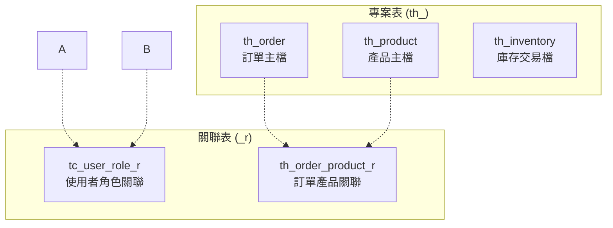
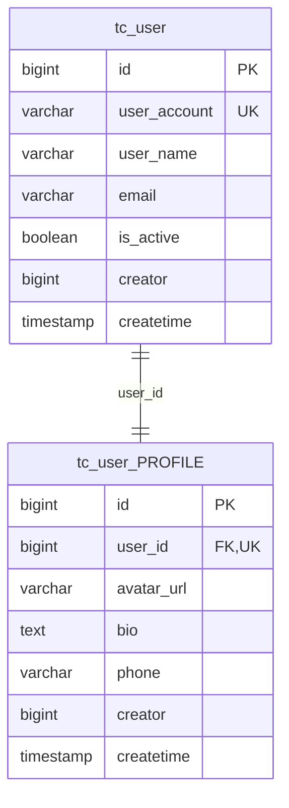
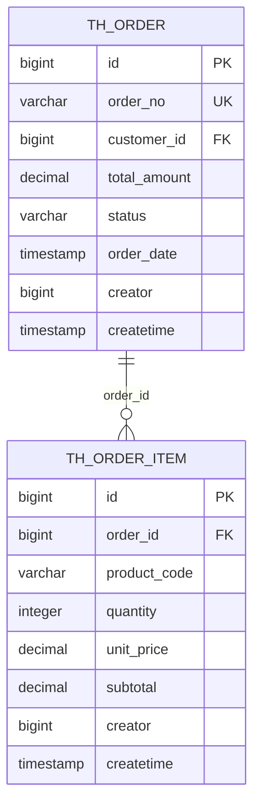

# Spring Boot 資料庫設計規範文件

> 本文件定義Spring Boot專案中資料庫設計的標準規範，確保資料庫結構的一致性、可維護性和擴展性。

## 📋 文檔資訊

| 項目 | 內容 |
|------|------|
| **文檔版本** | v0.2.0 |
| **最後更新** | 2025-08-16 |
| **適用技術** | Spring Boot 3 + JPA/Hibernate |
| **資料庫** | MySQL / PostgreSQL / Oracle |
| **負責單位** | 技術架構組 |

---

## 🎯 設計原則

### 核心設計理念
- **一致性**: 所有資料表遵循統一的命名和結構規範
- **可擴展性**: 支援未來業務需求的變更和擴展
- **效能優化**: 合理的索引設計和資料類型選擇
- **可維護性**: 清晰的命名規則和完整的稽核機制
- **JPA相容性**: 完全符合JPA/Hibernate的技術要求

---

## 🗃️ 資料表設計規範

### 1. 主鍵設計 (JPA 必要規範)

> ⚠️ **重要**: 由於使用JPA技術，所有資料表都必須包含主鍵欄位

#### 主鍵規範
- **欄位名稱**: 統一使用 `id`
- **資料類型**: `BIGINT` (對應Java `Long`)
- **自動遞增**: 使用資料庫自動遞增機制
- **非空約束**: `NOT NULL`
- **唯一約束**: `PRIMARY KEY`

#### 主鍵配置範例

```sql
-- MySQL
CREATE TABLE example_table (
    id BIGINT AUTO_INCREMENT PRIMARY KEY,
    -- 其他欄位...
);

-- PostgreSQL
CREATE TABLE example_table (
    id BIGSERIAL PRIMARY KEY,
    -- 其他欄位...
);

-- Oracle
CREATE TABLE example_table (
    id NUMBER(19) GENERATED BY DEFAULT AS IDENTITY PRIMARY KEY,
    -- 其他欄位...
);
```

### 2. 稽核欄位設計 (交易表必要規範)

> 📝 **重要**: 所有交易性資料表(非主檔)必須包含完整的稽核追蹤欄位

#### 稽核欄位規範
| 欄位名稱 | 資料類型 | 約束 | 描述 |
|----------|----------|------|------|
| `creator` | `BIGINT` | `NOT NULL` | 建立人員ID |
| `createtime` | `TIMESTAMP` | `NOT NULL DEFAULT CURRENT_TIMESTAMP` | 建立時間 |
| `modifier` | `BIGINT` | `NULL` | 最後修改人員ID |
| `modifytime` | `TIMESTAMP` | `NULL` | 最後修改時間 |

#### 稽核欄位SQL範例
```sql
CREATE TABLE th_order_detail (
    id BIGINT AUTO_INCREMENT PRIMARY KEY,
    order_id BIGINT NOT NULL,
    product_code VARCHAR(50) NOT NULL,
    quantity INTEGER NOT NULL,
    unit_price DECIMAL(10,2) NOT NULL,
    
    -- 稽核欄位 (必要)
    creator BIGINT NOT NULL,
    createtime TIMESTAMP NOT NULL DEFAULT CURRENT_TIMESTAMP,
    modifier BIGINT,
    modifytime TIMESTAMP,
    
    CONSTRAINT fk_order_detail_order 
        FOREIGN KEY (order_id) REFERENCES th_order(id)
);
```

### 3. 命名規範

#### 3.1 資料表命名規則

> 📋 **規則**: 小寫字母 + 底線分隔 + 有意義的前綴

##### 前綴分類
| 前綴 | 用途 | 描述 | 範例 |
|------|------|------|------|
| `th_` | 專案表 | This Project - 當前專案特有的業務資料 | `th_order`, `th_product`, `th_invoice` |
| `*_r` | 關聯表後綴 | Relation - 多對多關聯表 | `tc_user_role_r`, `th_menu_permission_r` |

##### 命名範例


#### 3.2 欄位命名規則

| 類型 | 命名規則 | 範例 |
|------|----------|------|
| **一般欄位** | 小寫 + 底線分隔 | `user_name`, `email_address`, `phone_number` |
| **外鍵欄位** | 參考表名 + `_id` | `user_id`, `order_id`, `department_id` |
| **布林欄位** | `is_` + 形容詞 | `is_active`, `is_deleted`, `is_verified` |
| **日期欄位** | 動作 + `_date/_time/_timestamp` | `create_date`, `expire_time`, `login_timestamp` |
| **金額欄位** | 明確描述 + `_amount` | `total_amount`, `discount_amount`, `tax_amount` |

---

## 📊 資料類型規範

### 常用資料類型對照表

| 用途 | MySQL | PostgreSQL | Oracle | 備註 |
|------|--------|------------|--------|------|
| **主鍵** | `BIGINT AUTO_INCREMENT` | `BIGSERIAL` | `NUMBER(19) GENERATED AS IDENTITY` | 自動遞增主鍵 |
| **外鍵** | `BIGINT` | `BIGINT` | `NUMBER(19)` | 關聯其他表主鍵 |
| **短字串** | `VARCHAR(50)` | `VARCHAR(50)` | `VARCHAR2(50)` | 編號、代碼類 |
| **長字串** | `VARCHAR(500)` | `VARCHAR(500)` | `VARCHAR2(500)` | 名稱、描述類 |
| **文字內容** | `TEXT` | `TEXT` | `CLOB` | 大量文字內容 |
| **整數** | `INT` | `INTEGER` | `NUMBER(10)` | 一般整數 |
| **小數** | `DECIMAL(10,2)` | `DECIMAL(10,2)` | `NUMBER(10,2)` | 金額、精確小數 |
| **布林** | `BOOLEAN` | `BOOLEAN` | `NUMBER(1) CHECK (value IN (0,1))` | 是否狀態 |
| **日期** | `DATE` | `DATE` | `DATE` | 僅日期 |
| **時間戳** | `DATETIME` | `TIMESTAMP` | `TIMESTAMP` | 日期時間 |
| **JSON** | `JSON` | `JSONB` | `CLOB` | JSON格式資料 |

---

## 🔗 關聯設計規範

### 1. 一對一關聯 (One-to-One)



```sql
-- 一對一關聯範例
CREATE TABLE tc_user (
    id BIGINT AUTO_INCREMENT PRIMARY KEY,
    user_account VARCHAR(50) UNIQUE NOT NULL,
    user_name VARCHAR(100) NOT NULL,
    email VARCHAR(255) UNIQUE NOT NULL,
    is_active BOOLEAN DEFAULT TRUE,
    creator BIGINT NOT NULL,
    createtime TIMESTAMP NOT NULL DEFAULT CURRENT_TIMESTAMP
);

CREATE TABLE tc_user_profile (
    id BIGINT AUTO_INCREMENT PRIMARY KEY,
    user_id BIGINT UNIQUE NOT NULL,
    avatar_url VARCHAR(255),
    bio TEXT,
    phone VARCHAR(20),
    creator BIGINT NOT NULL,
    createtime TIMESTAMP NOT NULL DEFAULT CURRENT_TIMESTAMP,
    
    CONSTRAINT fk_user_profile_user 
        FOREIGN KEY (user_id) REFERENCES tc_user(id)
);
```

### 2. 一對多關聯 (One-to-Many)



```sql
-- 一對多關聯範例
CREATE TABLE th_order (
    id BIGINT AUTO_INCREMENT PRIMARY KEY,
    order_no VARCHAR(50) UNIQUE NOT NULL,
    customer_id BIGINT NOT NULL,
    total_amount DECIMAL(12,2) NOT NULL,
    status VARCHAR(20) NOT NULL DEFAULT 'PENDING',
    order_date TIMESTAMP NOT NULL,
    creator BIGINT NOT NULL,
    createtime TIMESTAMP NOT NULL DEFAULT CURRENT_TIMESTAMP
);

CREATE TABLE th_order_item (
    id BIGINT AUTO_INCREMENT PRIMARY KEY,
    order_id BIGINT NOT NULL,
    product_code VARCHAR(50) NOT NULL,
    quantity INTEGER NOT NULL,
    unit_price DECIMAL(10,2) NOT NULL,
    subtotal DECIMAL(12,2) NOT NULL,
    creator BIGINT NOT NULL,
    createtime TIMESTAMP NOT NULL DEFAULT CURRENT_TIMESTAMP,
    
    CONSTRAINT fk_order_item_order 
        FOREIGN KEY (order_id) REFERENCES th_order(id)
);
```

### 3. 多對多關聯 (Many-to-Many)

```mermaid
erDiagram
    tc_user {
        bigint id PK
        varchar user_account UK
        varchar user_name
        varchar email
    }
    
    TH_ROLE {
        bigint id PK
        varchar role_code UK
        varchar role_name
        varchar description
    }
    
    tc_user_ROLE_R {
        bigint id PK
        bigint user_id FK
        bigint role_id FK
        boolean is_active
        bigint creator
        timestamp createtime
    }
    
    tc_user ||--o{ tc_user_ROLE_R : "user_id"
    TH_ROLE ||--o{ tc_user_ROLE_R : "role_id"
```



```sql
-- 多對多關聯範例
CREATE TABLE tc_user (
    id BIGINT AUTO_INCREMENT PRIMARY KEY,
    user_account VARCHAR(50) UNIQUE NOT NULL,
    user_name VARCHAR(100) NOT NULL,
    email VARCHAR(255) UNIQUE NOT NULL
);

CREATE TABLE th_role (
    id BIGINT AUTO_INCREMENT PRIMARY KEY,
    role_code VARCHAR(50) UNIQUE NOT NULL,
    role_name VARCHAR(100) NOT NULL,
    description TEXT
);

-- 關聯表 (後綴 _r)
CREATE TABLE tc_user_role_r (
    id BIGINT AUTO_INCREMENT PRIMARY KEY,
    user_id BIGINT NOT NULL,
    role_id BIGINT NOT NULL,
    is_active BOOLEAN DEFAULT TRUE,
    creator BIGINT NOT NULL,
    createtime TIMESTAMP NOT NULL DEFAULT CURRENT_TIMESTAMP,
    
    CONSTRAINT fk_user_role_user 
        FOREIGN KEY (user_id) REFERENCES tc_user(id),
    CONSTRAINT fk_user_role_role 
        FOREIGN KEY (role_id) REFERENCES th_role(id),
    CONSTRAINT uk_user_role 
        UNIQUE (user_id, role_id)
);
```

---

## 📇 索引設計規範

### 索引命名規則

| 索引類型 | 命名格式 | 範例 |
|----------|----------|------|
| **主鍵索引** | `pk_[table_name]` | `pk_th_order` |
| **唯一索引** | `uk_[table_name]_[column(s)]` | `uk_tc_user_email` |
| **一般索引** | `ix_[table_name]_[column(s)]` | `ix_th_order_customer_id` |
| **複合索引** | `ix_[table_name]_[col1]_[col2]` | `ix_th_order_status_date` |
| **外鍵索引** | `fk_[table_name]_[ref_table]` | `fk_order_item_order` |

### 索引建議

#### 1. 必要索引
- ✅ 主鍵自動建立唯一索引
- ✅ 外鍵欄位建立索引
- ✅ 唯一約束欄位建立唯一索引
- ✅ 查詢條件常用欄位建立索引

#### 2. 複合索引設計
```sql
-- 範例：訂單查詢常用條件的複合索引
CREATE INDEX ix_th_order_status_date 
ON th_order (status, order_date DESC);

-- 範例：支援分頁查詢的複合索引
CREATE INDEX ix_th_order_customer_date 
ON th_order (customer_id, order_date DESC, id);
```

#### 3. 索引效能考量
- 🔍 查詢頻率高的欄位優先建立索引
- ⚡ 複合索引的欄位順序要符合查詢模式
- 📊 定期分析索引使用情況和效能

---

## 🛡️ 約束設計規範

### 1. 外鍵約束 (Foreign Key Constraints)

#### 命名規則
```
fk_[child_table]_[parent_table]
```

#### 設計原則
- ✅ 所有外鍵都要建立約束
- ✅ 考慮級聯操作 (`ON DELETE`, `ON UPDATE`)
- ✅ 重要資料使用 `RESTRICT`，避免意外刪除
- ⚠️ 日誌類資料可考慮 `CASCADE`

```sql
-- 嚴格約束範例
ALTER TABLE th_order_item 
ADD CONSTRAINT fk_order_item_order 
FOREIGN KEY (order_id) REFERENCES th_order(id) 
ON DELETE RESTRICT ON UPDATE CASCADE;

-- 級聯刪除範例
ALTER TABLE th_order_log 
ADD CONSTRAINT fk_order_log_order 
FOREIGN KEY (order_id) REFERENCES th_order(id) 
ON DELETE CASCADE ON UPDATE CASCADE;
```

### 2. 檢查約束 (Check Constraints)

```sql
-- 狀態值檢查
ALTER TABLE th_order 
ADD CONSTRAINT ck_order_status 
CHECK (status IN ('PENDING', 'PROCESSING', 'SHIPPED', 'DELIVERED', 'CANCELLED'));

-- 數值範圍檢查
ALTER TABLE th_order_item 
ADD CONSTRAINT ck_order_item_quantity 
CHECK (quantity > 0);

ALTER TABLE th_order_item 
ADD CONSTRAINT ck_order_item_unit_price 
CHECK (unit_price >= 0);

-- 日期邏輯檢查
ALTER TABLE th_promotion 
ADD CONSTRAINT ck_promotion_date_range 
CHECK (start_date <= end_date);
```

### 3. 唯一約束 (Unique Constraints)

```sql
-- 業務唯一性約束
ALTER TABLE th_order 
ADD CONSTRAINT uk_th_order_order_no 
UNIQUE (order_no);

-- 複合唯一性約束
ALTER TABLE tc_user_role_r 
ADD CONSTRAINT uk_user_role_relation 
UNIQUE (user_id, role_id);

-- 條件唯一性 (MySQL 8.0+)
CREATE UNIQUE INDEX uk_tc_user_active_email 
ON tc_user (email) 
WHERE is_active = true;
```

---

## 📋 資料表範本

### 1. 主檔範本 (Master Data Template)

```sql
-- 主檔範本：客戶主檔
CREATE TABLE th_customer (
    -- 主鍵 (JPA必要)
    id BIGINT AUTO_INCREMENT PRIMARY KEY,
    
    -- 業務鍵值
    customer_code VARCHAR(20) UNIQUE NOT NULL,
    
    -- 基本資料
    customer_name VARCHAR(200) NOT NULL,
    customer_type VARCHAR(20) NOT NULL DEFAULT 'INDIVIDUAL',
    tax_id VARCHAR(20),
    email VARCHAR(255),
    phone VARCHAR(20),
    address TEXT,
    
    -- 狀態控制
    is_active BOOLEAN NOT NULL DEFAULT TRUE,
    is_deleted BOOLEAN NOT NULL DEFAULT FALSE,
    
    -- 稽核欄位 (主檔通常也需要)
    creator BIGINT NOT NULL,
    createtime TIMESTAMP NOT NULL DEFAULT CURRENT_TIMESTAMP,
    modifier BIGINT,
    modifytime TIMESTAMP
);

-- 索引
CREATE INDEX ix_th_customer_type ON th_customer (customer_type);
CREATE INDEX ix_th_customer_active ON th_customer (is_active);
CREATE UNIQUE INDEX uk_th_customer_tax_id ON th_customer (tax_id) WHERE tax_id IS NOT NULL;

-- 約束
ALTER TABLE th_customer 
ADD CONSTRAINT ck_th_customer_type 
CHECK (customer_type IN ('INDIVIDUAL', 'COMPANY', 'GOVERNMENT'));
```

### 2. 交易檔範本 (Transaction Data Template)

```sql
-- 交易檔範本：訂單明細
CREATE TABLE th_order_detail (
    -- 主鍵 (JPA必要)
    id BIGINT AUTO_INCREMENT PRIMARY KEY,
    
    -- 外鍵關聯
    order_id BIGINT NOT NULL,
    product_id BIGINT NOT NULL,
    
    -- 交易資料
    product_code VARCHAR(50) NOT NULL,
    product_name VARCHAR(200) NOT NULL,
    quantity INTEGER NOT NULL,
    unit_price DECIMAL(10,2) NOT NULL,
    discount_rate DECIMAL(5,4) DEFAULT 0,
    discount_amount DECIMAL(10,2) DEFAULT 0,
    subtotal DECIMAL(12,2) NOT NULL,
    
    -- 備註資訊
    remark TEXT,
    
    -- 稽核欄位 (交易檔必要)
    creator BIGINT NOT NULL,
    createtime TIMESTAMP NOT NULL DEFAULT CURRENT_TIMESTAMP,
    modifier BIGINT,
    modifytime TIMESTAMP,
    
    -- 外鍵約束
    CONSTRAINT fk_order_detail_order 
        FOREIGN KEY (order_id) REFERENCES th_order(id) ON DELETE RESTRICT,
    CONSTRAINT fk_order_detail_product 
        FOREIGN KEY (product_id) REFERENCES th_product(id) ON DELETE RESTRICT
);

-- 索引
CREATE INDEX ix_th_order_detail_order ON th_order_detail (order_id);
CREATE INDEX ix_th_order_detail_product ON th_order_detail (product_id);
CREATE INDEX ix_th_order_detail_code ON th_order_detail (product_code);

-- 約束
ALTER TABLE th_order_detail 
ADD CONSTRAINT ck_order_detail_quantity 
CHECK (quantity > 0);

ALTER TABLE th_order_detail 
ADD CONSTRAINT ck_order_detail_unit_price 
CHECK (unit_price >= 0);
```

### 3. 關聯表範本 (Relation Table Template)

```sql
-- 關聯表範本：使用者權限關聯
CREATE TABLE tc_user_permission_r (
    -- 主鍵 (JPA必要)
    id BIGINT AUTO_INCREMENT PRIMARY KEY,
    
    -- 關聯鍵值
    user_id BIGINT NOT NULL,
    permission_id BIGINT NOT NULL,
    
    -- 關聯屬性
    is_active BOOLEAN NOT NULL DEFAULT TRUE,
    granted_by BIGINT NOT NULL,
    granted_date TIMESTAMP NOT NULL DEFAULT CURRENT_TIMESTAMP,
    expire_date TIMESTAMP,
    
    -- 稽核欄位 (關聯表建議包含)
    creator BIGINT NOT NULL,
    createtime TIMESTAMP NOT NULL DEFAULT CURRENT_TIMESTAMP,
    modifier BIGINT,
    modifytime TIMESTAMP,
    
    -- 外鍵約束
    CONSTRAINT fk_user_permission_user 
        FOREIGN KEY (user_id) REFERENCES tc_user(id) ON DELETE CASCADE,
    CONSTRAINT fk_user_permission_permission 
        FOREIGN KEY (permission_id) REFERENCES th_permission(id) ON DELETE CASCADE,
    CONSTRAINT fk_user_permission_granted_by 
        FOREIGN KEY (granted_by) REFERENCES tc_user(id) ON DELETE RESTRICT,
    
    -- 唯一約束
    CONSTRAINT uk_user_permission 
        UNIQUE (user_id, permission_id)
);

-- 索引
CREATE INDEX ix_tc_user_permission_r_user ON tc_user_permission_r (user_id);
CREATE INDEX ix_tc_user_permission_r_permission ON tc_user_permission_r (permission_id);
CREATE INDEX ix_tc_user_permission_r_active ON tc_user_permission_r (is_active);
```

---

## ✅ 設計檢查清單

### 📊 資料表結構檢查

- [ ] 所有資料表都有 `id` 主鍵欄位 (JPA必要)
- [ ] 交易表都包含完整稽核欄位 (creator, createtime, modifier, modifytime)
- [ ] 資料表命名符合規範 (小寫+底線+正確前綴)
- [ ] 欄位命名清晰且一致
- [ ] 外鍵欄位都有對應索引
- [ ] 重要業務欄位有適當約束 (NOT NULL, CHECK, UNIQUE)

### 🔗 關聯設計檢查

- [ ] 外鍵約束都已建立且命名規範
- [ ] 級聯操作設定合理 (RESTRICT vs CASCADE)
- [ ] 多對多關聯使用關聯表 (後綴_r)
- [ ] 關聯表有適當的複合唯一約束

### 📇 效能優化檢查

- [ ] 查詢頻率高的欄位有索引
- [ ] 複合索引欄位順序符合查詢模式
- [ ] 大型資料表考慮分區策略
- [ ] JSON欄位使用適當的資料庫類型

### 🛡️ 資料完整性檢查

- [ ] 重要枚舉欄位有CHECK約束
- [ ] 數值欄位有合理範圍約束
- [ ] 日期欄位有邏輯性約束
- [ ] 業務唯一性通過約束保證