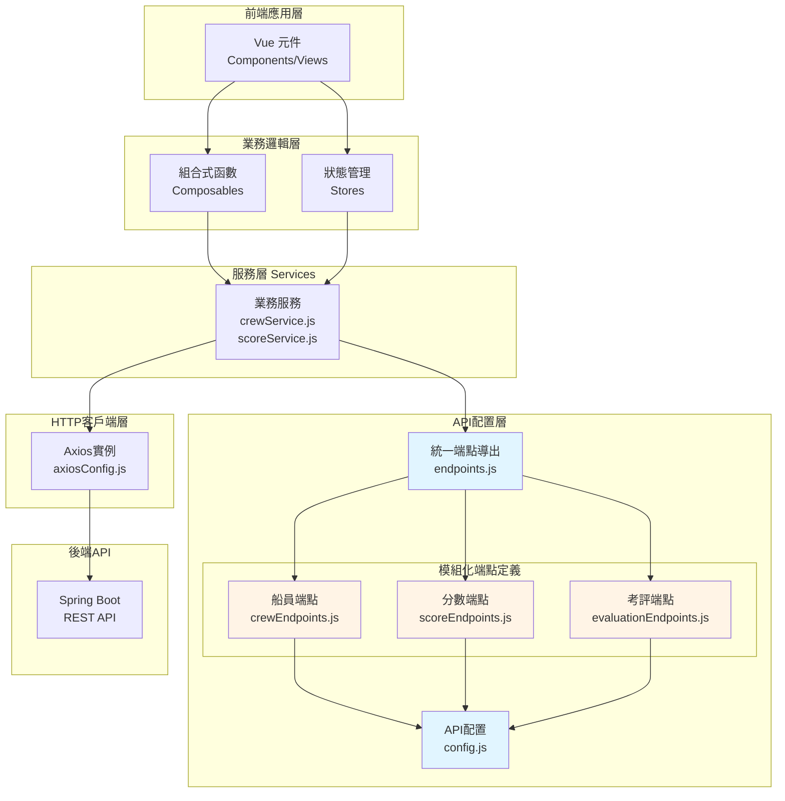
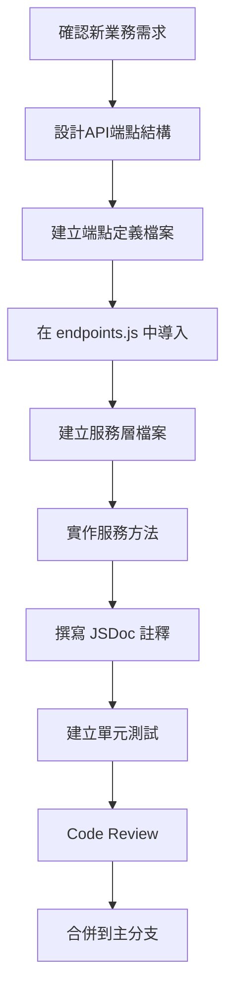

# Vue API端點定義與服務層架構規範

> 本文件定義Vue.js前端應用的API端點定義、服務層架構和模組化組織標準，確保團隊開發具有一致性、可維護性和可擴展性。

## 📋 文檔資訊

| 項目 | 內容 |
|------|------|
| **文檔版本** | v2.0.0 |
| **最後更新** | 2025-10-20 |
| **適用技術** | Vue.js 3 + Axios + RESTful API |
| **前端框架** | Vue.js 3 (Composition API) |
| **HTTP客戶端** | Axios 1.x |
| **負責單位** | 前端架構組 |
| **文檔類型** | 技術規範 - API層設計標準 |

---

## 🎯 設計原則

### 核心設計理念

1. **模組化組織**: 按業務領域分模組管理API端點，避免單一檔案過大
2. **統一命名規範**: 建立清晰的命名標準，提升程式碼可讀性
3. **分層架構**: 端點定義層與服務層分離，職責清晰
4. **集中管理**: 所有API路徑集中定義，便於維護和版本管理
5. **可擴展性**: 架構設計支援未來業務擴展需求

### 設計目標

- ✅ 消除API路徑寫死在業務程式碼中的問題
- ✅ 統一團隊的API呼叫方式和風格
- ✅ 降低API路徑變更時的維護成本
- ✅ 提供清晰的架構分層和職責分離
- ✅ 支援大型專案的模組化管理

---

## 🏗️ 架構設計

### 1. 整體架構圖



### 2. 目錄結構規範

#### 方案A：中小型專案（推薦100個以內API端點）

```
src/
├── services/
│   ├── api/
│   │   ├── config.js              # API配置（版本、超時等）
│   │   └── endpoints.js           # 統一端點定義（集中管理）
│   │
│   ├── crewService.js             # 船員業務服務層
│   ├── scoreService.js            # 分數業務服務層
│   └── evaluationService.js       # 考評業務服務層
│
└── config/
    └── axiosConfig.js             # Axios實例配置
```

#### 方案B：大型專案（推薦，100個以上API端點）⭐

```
src/
├── services/
│   ├── api/
│   │   ├── config.js                      # API配置中心
│   │   ├── endpoints.js                   # 統一端點導出
│   │   └── modules/                       # 模組化端點定義
│   │       ├── crewEndpoints.js          # 船員管理端點
│   │       ├── scoreEndpoints.js         # 分數評估端點
│   │       ├── evaluationEndpoints.js    # 考評設定端點
│   │       ├── annualKpiEndpoints.js     # 年度KPI端點
│   │       ├── kpiIndicatorEndpoints.js  # KPI指標端點
│   │       └── requirementEndpoints.js   # 規範要求端點
│   │
│   ├── crewService.js                    # 船員業務服務層
│   ├── scoreService.js                   # 分數業務服務層
│   ├── evaluationService.js              # 考評業務服務層
│   └── annualKpiSettingService.js        # 年度KPI服務層
│
└── config/
    └── axiosConfig.js                    # Axios實例配置
```

---

## 📂 API配置層設計

### 1. API配置檔案（config.js）

```javascript
// src/services/api/config.js

/**
 * API配置中心
 * 
 * 職責：
 * - 統一管理所有API相關配置
 * - 提供版本控制和環境配置
 * - 定義請求超時、重試等參數
 */

export const API_CONFIG = {
  /**
   * API版本前綴
   * 所有API端點都會加上此前綴
   */
  VERSION: '/api/v1',
  
  /**
   * 基礎URL
   * 從環境變數讀取，開發/測試/生產環境使用不同值
   */
  BASE_URL: import.meta.env.VITE_API_BASE_URL || 'http://localhost:8088',
  
  /**
   * 請求超時時間（毫秒）
   */
  TIMEOUT: 30000,
  
  /**
   * 自動重試配置
   */
  RETRY: {
    MAX_ATTEMPTS: 3,      // 最大重試次數
    DELAY: 1000,          // 重試延遲（毫秒）
    RETRY_CODES: [500, 502, 503, 504]  // 可重試的HTTP狀態碼
  },
  
  /**
   * 分頁預設配置
   */
  PAGINATION: {
    DEFAULT_PAGE: 0,      // 預設頁碼
    DEFAULT_SIZE: 20,     // 預設每頁筆數
    MAX_SIZE: 100         // 最大每頁筆數
  },
  
  /**
   * 快取配置
   */
  CACHE: {
    DEFAULT_TTL: 5 * 60 * 1000,  // 預設快取時間（5分鐘）
    ENABLED: true                 // 是否啟用快取
  }
}

/**
 * 導出版本前綴（方便其他模組使用）
 */
export const API_VERSION = API_CONFIG.VERSION

/**
 * 環境判斷工具
 */
export const ENV = {
  isDevelopment: import.meta.env.MODE === 'development',
  isProduction: import.meta.env.MODE === 'production',
  isTesting: import.meta.env.MODE === 'test'
}

export default API_CONFIG
```

### 2. 環境變數配置

```bash
# .env.development（開發環境）
VITE_API_BASE_URL=http://localhost:8088

# .env.test（測試環境）
VITE_API_BASE_URL=http://test-server.example.com

# .env.production（生產環境）
VITE_API_BASE_URL=https://api.example.com
```

---

## 🔗 模組化端點定義規範

### 1. 端點定義標準結構

每個端點模組檔案應遵循以下結構：

```javascript
/**
 * [模組名稱] - API端點定義
 * 
 * 對應後端Controller: [Controller名稱]
 * API路徑前綴: [基礎路徑]
 */

import { API_VERSION } from '../config'

const BASE_PATH = `${API_VERSION}/[模組路徑]`

/**
 * [模組]端點常數
 */
export const [MODULE]_ENDPOINTS = {
  
  // ==================== 基本CRUD ====================
  
  /** 查詢列表 */
  LIST: `${BASE_PATH}`,
  
  /** 新增 */
  CREATE: `${BASE_PATH}`,
  
  /** 根據ID查詢 */
  BY_ID: (id) => `${BASE_PATH}/${id}`,
  
  /** 更新 */
  UPDATE: (id) => `${BASE_PATH}/${id}`,
  
  /** 刪除 */
  DELETE: (id) => `${BASE_PATH}/${id}`,
  
  // ==================== 業務特定操作 ====================
  
  // 根據實際業務需求定義...
}

export default [MODULE]_ENDPOINTS
```

### 2. 實際範例：年度KPI端點定義

```javascript
// src/services/api/modules/annualKpiEndpoints.js

/**
 * 年度績效KPI設定 - API端點定義
 * 
 * 對應後端Controller: AnnualKpiSettingController
 * API路徑前綴: /api/v1/annual-kpi-settings
 * 
 * 功能範圍：
 * - 年度KPI設定的CRUD操作
 * - 類別管理和佔比設定
 * - 資料驗證和複製
 * - 草稿儲存和狀態管理
 */

import { API_VERSION } from '../config'

const BASE_PATH = `${API_VERSION}/annual-kpi-settings`

/**
 * 年度KPI設定端點
 */
export const ANNUAL_KPI_ENDPOINTS = {
  
  // ==================== 基本CRUD ====================
  
  /** 查詢所有年度KPI設定列表 */
  LIST: BASE_PATH,
  
  /** 新增年度KPI設定 */
  CREATE: BASE_PATH,
  
  /** 查詢所有可用年度 */
  YEARS: `${BASE_PATH}/years`,
  
  /** 根據年度查詢KPI設定列表 */
  BY_YEAR: (year) => `${BASE_PATH}/${year}`,
  
  /** 根據ID查詢KPI設定詳細資料 */
  BY_ID: (id) => `${BASE_PATH}/detail/${id}`,
  
  /** 更新KPI設定 */
  UPDATE: (id) => `${BASE_PATH}/${id}`,
  
  /** 刪除KPI設定 */
  DELETE: (id) => `${BASE_PATH}/${id}`,
  
  /** 檢查年度是否可編輯 */
  EDITABLE: `${BASE_PATH}/editable`,
  
  // ==================== 類別管理 ====================
  
  CATEGORY: {
    /** 查詢年度考核類別列表 */
    BY_YEAR: (year) => `${BASE_PATH}/${year}/categories`,
    
    /** 批次更新考核類別佔比 */
    BATCH_UPDATE: (year) => `${BASE_PATH}/${year}/categories`,
  },
  
  // ==================== 資料驗證 ====================
  
  VALIDATION: {
    /** 驗證年度KPI設定資料完整性 */
    VALIDATE: (year) => `${BASE_PATH}/${year}/validate`,
    
    /** API規格驗證 */
    VALIDATE_API: (year) => `${BASE_PATH}/${year}/validate-api`,
  },
  
  // ==================== 資料複製 ====================
  
  COPY: {
    /** 複製資料（基礎路徑） */
    BASE: `${BASE_PATH}/copy`,
    
    /** 從指定年度複製到目標年度 */
    FROM_TO: (sourceYear, targetYear) => `${BASE_PATH}/copy/${sourceYear}/${targetYear}`,
    
    /** 查詢複製任務狀態 */
    STATUS: (taskId) => `${BASE_PATH}/copy/${taskId}`,
  },
  
  // ==================== 儲存操作 ====================
  
  SAVE: {
    /** 儲存草稿 */
    DRAFT: (year) => `${BASE_PATH}/${year}/draft`,
    
    /** 正式儲存 */
    SAVE: (year) => `${BASE_PATH}/${year}/save`,
    
    /** 更新狀態 */
    UPDATE_STATUS: (year) => `${BASE_PATH}/${year}/status`,
  }
}

export default ANNUAL_KPI_ENDPOINTS
```

### 3. 實際範例：KPI指標端點定義

```javascript
// src/services/api/modules/kpiIndicatorEndpoints.js

/**
 * KPI指標管理 - API端點定義
 * 
 * 對應後端Controller: KpiIndicatorController
 * API路徑前綴: /api/v1/kpi-indicators
 * 
 * 功能範圍：
 * - KPI指標的CRUD操作
 * - 權重驗證
 * - 與年度KPI設定的關聯操作
 */

import { API_VERSION } from '../config'

const BASE_PATH = `${API_VERSION}/kpi-indicators`
const ANNUAL_KPI_BASE = `${API_VERSION}/annual-kpi-settings`

/**
 * KPI指標端點
 */
export const KPI_INDICATOR_ENDPOINTS = {
  
  // ==================== 基本CRUD ====================
  
  /** 根據年度KPI設定ID查詢指標列表 */
  BY_ANNUAL_KPI_SETTING: (annualKpiSettingId) => 
    `${ANNUAL_KPI_BASE}/${annualKpiSettingId}/kpi-indicators`,
  
  /** 新增KPI指標 */
  CREATE: (annualKpiSettingId) => 
    `${ANNUAL_KPI_BASE}/${annualKpiSettingId}/kpi-indicators`,
  
  /** 根據ID查詢KPI指標詳細 */
  BY_ID: (id) => `${BASE_PATH}/${id}`,
  
  /** 更新KPI指標 */
  UPDATE: (id) => `${BASE_PATH}/${id}`,
  
  /** 刪除KPI指標 */
  DELETE: (id) => `${BASE_PATH}/${id}`,
  
  // ==================== 驗證操作 ====================
  
  /** 驗證類別權重總和 */
  VALIDATE_WEIGHT: (annualKpiSettingId) => 
    `${ANNUAL_KPI_BASE}/${annualKpiSettingId}/kpi-indicators/validate`,
}

export default KPI_INDICATOR_ENDPOINTS
```

### 4. 實際範例：規範要求端點定義

```javascript
// src/services/api/modules/requirementEndpoints.js

/**
 * 規範要求管理 - API端點定義
 * 
 * 對應後端Controller: RequirementController
 * API路徑前綴: /api/v1/requirements
 * 
 * 功能範圍：
 * - 規範要求的CRUD操作
 * - 批次新增規範要求
 * - 與KPI指標的關聯操作
 */

import { API_VERSION } from '../config'

const BASE_PATH = `${API_VERSION}/requirements`
const KPI_INDICATOR_BASE = `${API_VERSION}/kpi-indicators`

/**
 * 規範要求端點
 */
export const REQUIREMENT_ENDPOINTS = {
  
  // ==================== 基本CRUD ====================
  
  /** 根據KPI指標ID查詢規範要求列表 */
  BY_INDICATOR: (indicatorId) => 
    `${KPI_INDICATOR_BASE}/${indicatorId}/requirements`,
  
  /** 新增規範要求 */
  CREATE: (indicatorId) => 
    `${KPI_INDICATOR_BASE}/${indicatorId}/requirements`,
  
  /** 批次新增規範要求 */
  BATCH_CREATE: (indicatorId) => 
    `${KPI_INDICATOR_BASE}/${indicatorId}/requirements/batch`,
  
  /** 根據ID查詢規範要求詳細 */
  BY_ID: (id) => `${BASE_PATH}/${id}`,
  
  /** 更新規範要求 */
  UPDATE: (id) => `${BASE_PATH}/${id}`,
  
  /** 刪除規範要求 */
  DELETE: (id) => `${BASE_PATH}/${id}`,
}

export default REQUIREMENT_ENDPOINTS
```

---

## 🔀 統一端點導出

### 端點統一導出檔案（endpoints.js）

```javascript
// src/services/api/endpoints.js

/**
 * API端點統一導出檔案
 * 
 * 設計原則：
 * 1. 從各模組檔案導入端點定義
 * 2. 按業務模組分組組織
 * 3. 使用巢狀結構清晰呈現
 * 4. 統一命名為 ENDPOINTS
 * 5. 提供單獨導出選項（彈性使用）
 * 
 * 使用方式：
 * import { ENDPOINTS } from '@/services/api/endpoints'
 * 
 * 呼叫範例：
 * ENDPOINTS.ANNUAL_KPI.BY_YEAR(2024)
 * ENDPOINTS.KPI_INDICATOR.BY_ID(123)
 */

// ==================== 導入各模組端點定義 ====================

import { ANNUAL_KPI_ENDPOINTS } from './modules/annualKpiEndpoints'
import { KPI_INDICATOR_ENDPOINTS } from './modules/kpiIndicatorEndpoints'
import { REQUIREMENT_ENDPOINTS } from './modules/requirementEndpoints'
// import { CREW_ENDPOINTS } from './modules/crewEndpoints'
// import { SCORE_ENDPOINTS } from './modules/scoreEndpoints'
// import { EVALUATION_ENDPOINTS } from './modules/evaluationEndpoints'

// ==================== 統一端點物件 ====================

/**
 * 系統所有API端點集合
 * 
 * 命名規範：
 * - 第一層：業務模組（UPPER_SNAKE_CASE）
 * - 第二層：資源類型或操作群組
 * - 第三層：具體端點或動態函數
 */
export const ENDPOINTS = {
  
  // ==================== 考評設定模組 ====================
  
  /** 年度KPI設定端點 */
  ANNUAL_KPI: ANNUAL_KPI_ENDPOINTS,
  
  /** KPI指標管理端點 */
  KPI_INDICATOR: KPI_INDICATOR_ENDPOINTS,
  
  /** 規範要求管理端點 */
  REQUIREMENT: REQUIREMENT_ENDPOINTS,
  
  // ==================== 其他模組（範例） ====================
  
  // /** 船員管理端點 */
  // CREW: CREW_ENDPOINTS,
  
  // /** 分數評估端點 */
  // SCORE: SCORE_ENDPOINTS,
  
  // /** 考評設定端點 */
  // EVALUATION: EVALUATION_ENDPOINTS,
}

// ==================== 單獨導出（彈性使用） ====================

/**
 * 也可以單獨導入特定模組的端點
 * 
 * 範例：
 * import { ANNUAL_KPI_ENDPOINTS } from '@/services/api/endpoints'
 */
export {
  ANNUAL_KPI_ENDPOINTS,
  KPI_INDICATOR_ENDPOINTS,
  REQUIREMENT_ENDPOINTS
}

// ==================== 預設導出 ====================

export default ENDPOINTS
```

---

## 🎯 服務層設計規範

### 1. 服務層職責定義

**服務層的核心職責：**
- ✅ 封裝所有後端API呼叫邏輯
- ✅ 使用端點常數（禁止寫死路徑）
- ✅ 實作資料驗證和格式轉換
- ✅ 提供清晰的業務方法介面
- ✅ 統一錯誤處理和日誌記錄

**服務層不應該：**
- ❌ 直接處理UI狀態
- ❌ 包含業務邏輯判斷（應在Composable層）
- ❌ 寫死API路徑字串
- ❌ 直接操作DOM

### 2. 服務層標準結構

```javascript
// src/services/[moduleName]Service.js

/**
 * [模組名稱] - 服務層
 * 
 * 功能：
 * - 封裝[模組]相關的後端API呼叫
 * - 提供清晰的業務介面給Composable層使用
 * - 統一的錯誤處理和資料驗證
 * 
 * API規格來源：
 * - [規格書文件名稱]
 * 
 * @version 1.0.0
 * @date 2025-10-20
 */

import axiosConfig from '@/config/axiosConfig'
import { ENDPOINTS } from './api/endpoints'

// ==================== [功能分組] API ====================

/**
 * [功能描述]
 * @param {type} paramName - 參數說明
 * @returns {Promise<Object>} 回應說明
 */
export const methodName = async (params) => {
  try {
    // 1. 參數驗證
    if (!params.required) {
      throw new Error('必填參數缺失')
    }
    
    // 2. API呼叫
    const response = await axiosConfig.get(
      ENDPOINTS.MODULE.ACTION(params.id),
      { params }
    )
    
    // 3. 回應處理
    return response.data
    
  } catch (error) {
    // 4. 錯誤處理
    console.error('❌ [模組] 操作失敗:', error)
    throw error
  }
}

// ==================== 私有輔助方法 ====================

/**
 * 驗證資料
 * @private
 */
const _validateData = (data) => {
  // 驗證邏輯...
}

/**
 * 格式轉換
 * @private
 */
const _transformData = (data) => {
  // 轉換邏輯...
}

// ==================== 導出服務物件 ====================

export default {
  methodName,
  // ... 其他方法
}
```

### 3. 實際範例：年度KPI服務層

```javascript
// src/services/annualKpiSettingService.js

/**
 * 年度績效KPI設定 - 服務層
 * 
 * 功能：
 * - 封裝所有年度績效KPI設定相關的後端API呼叫
 * - 提供清晰的業務介面給Composable層使用
 * - 統一的錯誤處理和資料驗證
 * 
 * API規格來源：
 * - (A)DB規格書-年度績效KPI設定.md
 * - A.API測試報告-年度績效KPI設定-2025-10-09.md
 * 
 * 技術標準：
 * - 遵循「Vue API端點定義與服務層架構規範」
 * - 採用模組化端點定義架構
 * 
 * @version 2.0.0
 * @date 2025-10-20
 */

import axiosConfig from '@/config/axiosConfig'
import { ENDPOINTS } from './api/endpoints'

// ==================== 年度設定管理 API ====================

/**
 * 查詢所有年度列表
 * @returns {Promise<Object>} 年度列表
 * @example
 * const years = await getYears()
 * // returns: { data: [2024, 2023, 2022], success: true }
 */
export const getYears = async () => {
  try {
    const response = await axiosConfig.get(ENDPOINTS.ANNUAL_KPI.YEARS)
    return response.data
  } catch (error) {
    console.error('❌ [年度KPI] 查詢年度列表失敗:', error)
    throw error
  }
}

/**
 * 查詢指定年度的KPI設定列表
 * @param {number} year - 年度
 * @returns {Promise<Object>} 年度KPI設定列表
 * @throws {Error} 當年度參數缺失時拋出錯誤
 */
export const getAnnualKpiSettingsByYear = async (year) => {
  try {
    if (!year) {
      throw new Error('年度參數為必填項目')
    }
    
    const response = await axiosConfig.get(ENDPOINTS.ANNUAL_KPI.BY_YEAR(year))
    return response.data
  } catch (error) {
    console.error(`❌ [年度KPI] 查詢${year}年度KPI設定失敗:`, error)
    throw error
  }
}

/**
 * 查詢單一KPI設定詳細資料
 * @param {number} id - KPI設定ID
 * @returns {Promise<Object>} KPI設定詳細資料
 */
export const getAnnualKpiSettingById = async (id) => {
  try {
    if (!id) {
      throw new Error('KPI設定ID為必填項目')
    }
    
    const response = await axiosConfig.get(ENDPOINTS.ANNUAL_KPI.BY_ID(id))
    return response.data
  } catch (error) {
    console.error(`❌ [年度KPI] 查詢KPI設定(ID:${id})失敗:`, error)
    throw error
  }
}

/**
 * 新增年度KPI設定
 * @param {Object} data - KPI設定資料
 * @param {number} data.year - 年度
 * @param {string} data.categoryCode - 類別代碼
 * @param {string} data.categoryName - 類別名稱
 * @param {number} data.percentage - 百分比
 * @param {number} data.sortOrder - 排序
 * @param {string} data.remarks - 備註
 * @returns {Promise<Object>} 新增結果
 */
export const createAnnualKpiSetting = async (data) => {
  try {
    _validateAnnualKpiSettingData(data)
    
    const response = await axiosConfig.post(ENDPOINTS.ANNUAL_KPI.CREATE, data)
    return response.data
  } catch (error) {
    console.error('❌ [年度KPI] 新增年度KPI設定失敗:', error)
    throw error
  }
}

/**
 * 更新年度KPI設定
 * @param {number} id - KPI設定ID
 * @param {Object} data - 更新的資料
 * @returns {Promise<Object>} 更新結果
 */
export const updateAnnualKpiSetting = async (id, data) => {
  try {
    if (!id) {
      throw new Error('KPI設定ID為必填項目')
    }
    
    _validateAnnualKpiSettingData(data, false)
    
    const response = await axiosConfig.put(ENDPOINTS.ANNUAL_KPI.UPDATE(id), data)
    return response.data
  } catch (error) {
    console.error(`❌ [年度KPI] 更新KPI設定(ID:${id})失敗:`, error)
    throw error
  }
}

/**
 * 刪除年度KPI設定
 * @param {number} id - KPI設定ID
 * @returns {Promise<Object>} 刪除結果
 */
export const deleteAnnualKpiSetting = async (id) => {
  try {
    if (!id) {
      throw new Error('KPI設```javascript
定ID為必填項目')
    }
    
    const response = await axiosConfig.delete(ENDPOINTS.ANNUAL_KPI.DELETE(id))
    return response.data
  } catch (error) {
    console.error(`❌ [年度KPI] 刪除KPI設定(ID:${id})失敗:`, error)
    throw error
  }
}

/**
 * 檢查年度是否可編輯
 * @param {number} year - 年度
 * @returns {Promise<Object>} 可編輯狀態
 */
export const checkYearEditable = async (year) => {
  try {
    if (!year) {
      throw new Error('年度參數為必填項目')
    }
    
    const response = await axiosConfig.get(ENDPOINTS.ANNUAL_KPI.EDITABLE, {
      params: { year }
    })
    return response.data
  } catch (error) {
    console.error(`❌ [年度KPI] 檢查${year}年度可編輯性失敗:`, error)
    throw error
  }
}

// ==================== 類別管理 API ====================

/**
 * 查詢年度考核類別列表
 * @param {number} year - 年度
 * @returns {Promise<Object>} 考核類別列表
 */
export const getCategoriesByYear = async (year) => {
  try {
    if (!year) {
      throw new Error('年度參數為必填項目')
    }
    
    const response = await axiosConfig.get(ENDPOINTS.ANNUAL_KPI.CATEGORY.BY_YEAR(year))
    return response.data
  } catch (error) {
    console.error(`❌ [年度KPI] 查詢${year}年度考核類別失敗:`, error)
    throw error
  }
}

/**
 * 批次更新考核類別佔比
 * @param {number} year - 年度
 * @param {Array} categories - 類別佔比資料陣列
 * @param {string} categories[].categoryCode - 類別代碼
 * @param {string} categories[].categoryName - 類別名稱
 * @param {number} categories[].percentage - 佔比
 * @returns {Promise<Object>} 更新結果
 */
export const updateCategoriesPercentage = async (year, categories) => {
  try {
    if (!year) {
      throw new Error('年度參數為必填項目')
    }
    
    if (!Array.isArray(categories) || categories.length === 0) {
      throw new Error('類別佔比資料不能為空')
    }
    
    // 驗證佔比總和是否為100%
    const totalPercentage = categories.reduce((sum, cat) => sum + (cat.percentage || 0), 0)
    if (Math.abs(totalPercentage - 100) > 0.01) {
      throw new Error(`類別佔比總和必須為100%，目前為${totalPercentage}%`)
    }
    
    const requestData = { categories }
    console.log(`🌐 [年度KPI] 發送類別佔比更新請求:`, requestData)
    
    const response = await axiosConfig.put(
      ENDPOINTS.ANNUAL_KPI.CATEGORY.BATCH_UPDATE(year), 
      requestData
    )
    return response.data
  } catch (error) {
    console.error(`❌ [年度KPI] 批次更新${year}年度類別佔比失敗:`, error)
    throw error
  }
}

// ==================== 資料驗證 API ====================

/**
 * 驗證年度KPI設定資料完整性
 * @param {number} year - 年度
 * @returns {Promise<Object>} 驗證結果
 */
export const validateAnnualKpiSetting = async (year) => {
  try {
    if (!year) {
      throw new Error('年度參數為必填項目')
    }
    
    console.log(`🔍 [年度KPI] 發送驗證請求: GET ${ENDPOINTS.ANNUAL_KPI.VALIDATION.VALIDATE(year)}`)
    
    const response = await axiosConfig.get(ENDPOINTS.ANNUAL_KPI.VALIDATION.VALIDATE(year))
    
    console.log(`✅ [年度KPI] 驗證請求成功:`, response)
    return response
  } catch (error) {
    console.error(`❌ [年度KPI] 驗證${year}年度KPI設定失敗:`, error)
    throw error
  }
}

// ==================== 資料複製 API ====================

/**
 * 複製前一年度資料到當前年度
 * @param {number} currentYear - 當前年度
 * @param {boolean} forceOverwrite - 是否強制覆蓋 (預設false)
 * @returns {Promise<Object>} 複製結果
 */
export const copyPreviousYear = async (currentYear, forceOverwrite = false) => {
  try {
    if (!currentYear) {
      throw new Error('當前年度參數為必填項目')
    }
    
    const fromYear = currentYear - 1
    const toYear = currentYear
    
    console.log(`🔄 [年度KPI] 複製年度資料: ${fromYear} → ${toYear}`)
    
    const response = await axiosConfig.post(
      ENDPOINTS.ANNUAL_KPI.COPY.FROM_TO(fromYear, toYear),
      null,
      { params: { forceOverwrite } }
    )
    return response.data
  } catch (error) {
    console.error(`❌ [年度KPI] 複製年度資料失敗:`, error)
    throw error
  }
}

/**
 * 複製指定年度資料
 * @param {number} sourceYear - 來源年度
 * @param {number} targetYear - 目標年度
 * @param {boolean} forceOverwrite - 是否強制覆蓋 (預設false)
 * @returns {Promise<Object>} 複製結果
 */
export const copyFromYearToYear = async (sourceYear, targetYear, forceOverwrite = false) => {
  try {
    if (!sourceYear || !targetYear) {
      throw new Error('來源年度和目標年度為必填項目')
    }
    
    if (sourceYear === targetYear) {
      throw new Error('來源年度和目標年度不能相同')
    }
    
    const response = await axiosConfig.post(
      ENDPOINTS.ANNUAL_KPI.COPY.FROM_TO(sourceYear, targetYear),
      null,
      { params: { forceOverwrite } }
    )
    return response.data
  } catch (error) {
    console.error(`❌ [年度KPI] 複製${sourceYear}年度資料到${targetYear}失敗:`, error)
    throw error
  }
}

// ==================== 儲存操作 API ====================

/**
 * 儲存為草稿
 * @param {number} year - 年度
 * @param {Object} data - 草稿資料
 * @returns {Promise<Object>} 儲存結果
 */
export const saveDraft = async (year, data) => {
  try {
    if (!year) {
      throw new Error('年度參數為必填項目')
    }
    
    console.log(`💾 [年度KPI] 儲存${year}年度草稿`)
    
    const response = await axiosConfig.post(ENDPOINTS.ANNUAL_KPI.SAVE.DRAFT(year), data)
    return response.data
  } catch (error) {
    console.error(`❌ [年度KPI] 儲存${year}年度草稿失敗:`, error)
    throw error
  }
}

/**
 * 正式儲存年度KPI設定
 * @param {number} year - 年度
 * @param {Object} data - KPI設定資料
 * @returns {Promise<Object>} 儲存結果
 */
export const saveAnnualKpiSetting = async (year, data) => {
  try {
    if (!year) {
      throw new Error('年度參數為必填項目')
    }
    
    console.log(`💾 [年度KPI] 正式儲存${year}年度KPI設定`)
    
    const response = await axiosConfig.post(ENDPOINTS.ANNUAL_KPI.SAVE.SAVE(year), data)
    return response.data
  } catch (error) {
    console.error(`❌ [年度KPI] 正式儲存${year}年度KPI設定失敗:`, error)
    throw error
  }
}

// ==================== KPI指標管理 API ====================

/**
 * 查詢指定年度KPI設定的指標列表
 * @param {number} annualKpiSettingId - 年度KPI設定ID
 * @returns {Promise<Object>} KPI指標列表
 */
export const getKpiIndicators = async (annualKpiSettingId) => {
  try {
    if (!annualKpiSettingId) {
      throw new Error('年度KPI設定ID為必填項目')
    }
    
    const response = await axiosConfig.get(
      ENDPOINTS.KPI_INDICATOR.BY_ANNUAL_KPI_SETTING(annualKpiSettingId)
    )
    return response.data
  } catch (error) {
    console.error(`❌ [KPI指標] 查詢KPI指標列表失敗(設定ID:${annualKpiSettingId}):`, error)
    throw error
  }
}

/**
 * 新增KPI指標
 * @param {number} annualKpiSettingId - 年度KPI設定ID
 * @param {Object} data - KPI指標資料
 * @returns {Promise<Object>} 新增結果
 */
export const createKpiIndicator = async (annualKpiSettingId, data) => {
  try {
    if (!annualKpiSettingId) {
      throw new Error('年度KPI設定ID為必填項目')
    }
    
    _validateKpiIndicatorData(data)
    
    const response = await axiosConfig.post(
      ENDPOINTS.KPI_INDICATOR.CREATE(annualKpiSettingId), 
      data
    )
    return response.data
  } catch (error) {
    console.error(`❌ [KPI指標] 新增KPI指標失敗(設定ID:${annualKpiSettingId}):`, error)
    throw error
  }
}

// ==================== 規範要求管理 API ====================

/**
 * 查詢KPI指標的規範要求列表
 * @param {number} indicatorId - KPI指標ID
 * @returns {Promise<Object>} 規範要求列表
 */
export const getRequirements = async (indicatorId) => {
  try {
    if (!indicatorId) {
      throw new Error('KPI指標ID為必填項目')
    }
    
    const response = await axiosConfig.get(ENDPOINTS.REQUIREMENT.BY_INDICATOR(indicatorId))
    return response.data
  } catch (error) {
    console.error(`❌ [規範要求] 查詢規範要求列表失敗(指標ID:${indicatorId}):`, error)
    throw error
  }
}

/**
 * 批次新增規範要求
 * @param {number} indicatorId - KPI指標ID
 * @param {Array} requirements - 規範要求資料陣列
 * @returns {Promise<Object>} 批次新增結果
 */
export const createRequirementsBatch = async (indicatorId, requirements) => {
  try {
    if (!indicatorId) {
      throw new Error('KPI指標ID為必填項目')
    }
    
    if (!Array.isArray(requirements) || requirements.length === 0) {
      throw new Error('規範要求資料不能為空')
    }
    
    const response = await axiosConfig.post(
      ENDPOINTS.REQUIREMENT.BATCH_CREATE(indicatorId), 
      requirements
    )
    return response.data
  } catch (error) {
    console.error(`❌ [規範要求] 批次新增規範要求失敗(指標ID:${indicatorId}):`, error)
    throw error
  }
}

// ==================== 私有輔助方法 ====================

/**
 * 驗證年度KPI設定資料
 * @param {Object} data - 資料
 * @param {boolean} isCreate - 是否為新增操作
 * @private
 */
const _validateAnnualKpiSettingData = (data, isCreate = true) => {
  const requiredFields = isCreate 
    ? ['year', 'categoryCode', 'categoryName', 'percentage']
    : ['categoryName', 'percentage']
  
  const missingFields = requiredFields.filter(field => !data[field])
  
  if (missingFields.length > 0) {
    throw new Error(`缺少必填欄位: ${missingFields.join(', ')}`)
  }
  
  if (data.percentage && (data.percentage < 0 || data.percentage > 100)) {
    throw new Error('百分比必須在0-100之間')
  }
}

/**
 * 驗證KPI指標資料
 * @param {Object} data - 資料
 * @private
 */
const _validateKpiIndicatorData = (data) => {
  const requiredFields = ['indicatorCode', 'indicatorName', 'weight']
  const missingFields = requiredFields.filter(field => !data[field])
  
  if (missingFields.length > 0) {
    throw new Error(`缺少必填欄位: ${missingFields.join(', ')}`)
  }
  
  if (data.weight && (data.weight < 0 || data.weight > 100)) {
    throw new Error('權重必須在0-100之間')
  }
}

// ==================== 導出服務物件 ====================

export default {
  // 年度設定管理
  getYears,
  getAnnualKpiSettingsByYear,
  getAnnualKpiSettingById,
  createAnnualKpiSetting,
  updateAnnualKpiSetting,
  deleteAnnualKpiSetting,
  checkYearEditable,
  
  // 類別管理
  getCategoriesByYear,
  updateCategoriesPercentage,
  
  // 資料驗證
  validateAnnualKpiSetting,
  
  // 資料複製
  copyPreviousYear,
  copyFromYearToYear,
  
  // 儲存操作
  saveDraft,
  saveAnnualKpiSetting,
  
  // KPI指標管理
  getKpiIndicators,
  createKpiIndicator,
  
  // 規範要求管理
  getRequirements,
  createRequirementsBatch
}
```

---

## 📋 命名規範標準

### 1. 端點命名規範

#### 1.1 模組層命名（第一層）

```javascript
// ✅ 正確：使用大寫蛇形命名法（UPPER_SNAKE_CASE）
export const ENDPOINTS = {
  ANNUAL_KPI: {...},        // 年度KPI
  KPI_INDICATOR: {...},     // KPI指標
  CREW_IMPORT: {...},       // 船員匯入
  SCORE_EVAL: {...},        // 分數評估
  DEPT_EVAL: {...}          // 部門評估
}

// ❌ 錯誤：不要使用小寫或駝峰命名
export const ENDPOINTS = {
  annualKpi: {...},         // 錯誤
  kpiIndicator: {...},      // 錯誤
  crewimport: {...}         // 錯誤
}
```

#### 1.2 操作層命名（第二層）

| 操作類型 | 端點名稱 | 使用場景 | 範例 |
|---------|---------|----------|------|
| 列表查詢 | `LIST` | 查詢所有資料或分頁列表 | `ENDPOINTS.CREW.LIST` |
| 單筆查詢 | `BY_ID` | 根據ID查詢單筆資料 | `ENDPOINTS.CREW.BY_ID(123)` |
| 條件查詢 | `BY_*` | 根據特定條件查詢 | `ENDPOINTS.CREW.BY_YEAR(2024)` |
| 新增 | `CREATE` | 建立新資源 | `ENDPOINTS.CREW.CREATE` |
| 更新 | `UPDATE` | 更新現有資源 | `ENDPOINTS.CREW.UPDATE(123)` |
| 刪除 | `DELETE` | 刪除資源 | `ENDPOINTS.CREW.DELETE(123)` |
| 批次操作 | `BATCH_*` | 批次新增/更新/刪除 | `ENDPOINTS.CREW.BATCH_UPDATE` |
| 上傳 | `UPLOAD` | 檔案上傳 | `ENDPOINTS.CREW.UPLOAD` |
| 下載 | `DOWNLOAD` | 檔案下載 | `ENDPOINTS.FILE.DOWNLOAD(1)` |
| 匯出 | `EXPORT` | 資料匯出 | `ENDPOINTS.REPORT.EXPORT` |
| 驗證 | `VALIDATE` | 資料驗證 | `ENDPOINTS.FORM.VALIDATE` |
| 統計 | `STATISTICS` | 統計資訊 | `ENDPOINTS.SCORE.STATISTICS` |
| 複製 | `COPY` | 資料複製 | `ENDPOINTS.SETTING.COPY` |
| 狀態 | `STATUS` | 查詢處理狀態 | `ENDPOINTS.TASK.STATUS(taskId)` |

#### 1.3 巢狀群組命名（第三層）

```javascript
// ✅ 正確：使用語義化群組名稱
export const ANNUAL_KPI_ENDPOINTS = {
  // 類別管理群組
  CATEGORY: {
    BY_YEAR: (year) => `${BASE_PATH}/${year}/categories`,
    BATCH_UPDATE: (year) => `${BASE_PATH}/${year}/categories`,
  },
  
  // 驗證操作群組
  VALIDATION: {
    VALIDATE: (year) => `${BASE_PATH}/${year}/validate`,
    VALIDATE_API: (year) => `${BASE_PATH}/${year}/validate-api`,
  },
  
  // 複製操作群組
  COPY: {
    BASE: `${BASE_PATH}/copy`,
    FROM_TO: (from, to) => `${BASE_PATH}/copy/${from}/${to}`,
    STATUS: (taskId) => `${BASE_PATH}/copy/${taskId}`,
  }
}

// ❌ 錯誤：不要使用模糊的群組名稱
export const ANNUAL_KPI_ENDPOINTS = {
  OPERATIONS: {...},    // 太模糊
  ACTIONS: {...},       // 不夠語義化
  METHODS: {...}        // 不清楚用途
}
```

#### 1.4 動態參數函數命名

```javascript
// ✅ 正確：參數名稱語義化
BY_ID: (id) => `${BASE_PATH}/${id}`
BY_YEAR: (year) => `${BASE_PATH}/${year}`
BY_SHIP: (shipId) => `${BASE_PATH}/ship/${shipId}`
BY_YEAR_MONTH: (year, month) => `${BASE_PATH}/${year}/${month}`
FROM_TO: (sourceYear, targetYear) => `${BASE_PATH}/copy/${sourceYear}/${targetYear}`

// ❌ 錯誤：參數名稱不明確
BY_ID: (x) => `${BASE_PATH}/${x}`           // x 不明確
BY_YEAR: (param) => `${BASE_PATH}/${param}` // param 太通用
GET: (id) => `${BASE_PATH}/${id}`           // GET 不夠語義化
```

### 2. 服務層命名規範

#### 2.1 服務檔案命名

```
格式: [業務模組名稱]Service.js

範例:
✅ crewService.js
✅ annualKpiSettingService.js
✅ scoreEvaluationService.js
✅ kpiIndicatorService.js

❌ crew.js                    // 缺少 Service 後綴
❌ CrewService.js             // 首字母不應大寫
❌ crew-service.js            // 不要使用連字號
```

#### 2.2 服務方法命名

```javascript
// ✅ 正確：使用動詞開頭的駝峰命名法
export const getYears = async () => {...}
export const createAnnualKpiSetting = async (data) => {...}
export const updateCategoriesPercentage = async (year, categories) => {...}
export const deleteKpiIndicator = async (id) => {...}

// ❌ 錯誤：不符合規範
export const years = async () => {...}                    // 缺少動詞
export const CreateAnnualKpiSetting = async (data) => {...}  // 首字母大寫
export const update_categories = async () => {...}       // 使用底線
```

#### 2.3 方法命名規則對照表

| 操作類型 | 方法命名格式 | 範例 |
|---------|-------------|------|
| 查詢列表 | `get[Resources]` | `getCrews()` |
| 查詢單筆 | `get[Resource]ById` | `getCrewById(id)` |
| 條件查詢 | `get[Resources]By[Condition]` | `getCrewsByYear(year)` |
| 新增 | `create[Resource]` | `createCrew(data)` |
| 更新 | `update[Resource]` | `updateCrew(id, data)` |
| 刪除 | `delete[Resource]` | `deleteCrew(id)` |
| 批次操作 | `batch[Action][Resources]` | `batchImportCrews(data)` |
| 驗證 | `validate[Subject]` | `validateCrewData(data)` |
| 檢查 | `check[Condition]` | `checkYearEditable(year)` |
| 複製 | `copy[Source]To[Target]` | `copyFromYearToYear(from, to)` |
| 儲存 | `save[Resource]` | `saveDraft(year, data)` |

---

## ✅ 開發檢查清單

### 📂 檔案結構檢查

- [ ] API配置檔案已建立（`config.js`）
- [ ] 端點定義按模組拆分（`modules/` 目錄）
- [ ] 統一端點導出檔案已建立（`endpoints.js`）
- [ ] 服務層檔案命名符合規範
- [ ] 目錄結構清晰且符合標準

### 🔗 端點定義檢查

- [ ] 所有端點使用 `API_VERSION` 常數
- [ ] 端點命名使用 `UPPER_SNAKE_CASE`
- [ ] 動態參數使用箭頭函數
- [ ] 端點有完整的 JSDoc 註釋
- [ ] 相關端點使用巢狀結構組織
- [ ] 避免路徑字串重複

### 🎯 服務層檢查

- [ ] 所有API呼叫使用 `ENDPOINTS` 常數
- [ ] 禁止寫死API路徑字串
- [ ] 每個方法有完整的 JSDoc 註釋
- [ ] 參數驗證完整（必填檢查）
- [ ] 錯誤日誌包含業務模組標籤
- [ ] 私有方法使用 `_` 前綴
- [ ] 導出服務物件包含所有方法

### 📝 命名規範檢查

- [ ] 端點常數使用大寫蛇形命名法
- [ ] 服務方法使用小寫駝峰命名法
- [ ] 參數名稱語義化且清晰
- [ ] 避免使用縮寫（除非是通用慣例）
- [ ] 群組名稱具有明確業務意義

### 🔍 程式碼品質檢查

- [ ] 沒有重複的程式碼
- [ ] 適當的錯誤處理
- [ ] 日誌記錄清晰
- [ ] 程式碼格式一致
- [ ] 通過 ESLint 檢查

---

## 📚 完整範例

### 範例1：完整的模組化架構實作

```
📁 專案結構範例
src/
├── services/
│   ├── api/
│   │   ├── config.js                      # ✅ API配置
│   │   ├── endpoints.js                   # ✅ 統一導出
│   │   └── modules/
│   │       ├── annualKpiEndpoints.js     # ✅ 年度KPI端點
│   │       ├── kpiIndicatorEndpoints.js  # ✅ KPI指標端點
│   │       └── requirementEndpoints.js   # ✅ 規範要求端點
│   │
│   └── annualKpiSettingService.js        # ✅ 年度KPI服務層
│
└── config/
    └── axiosConfig.js                    # ✅ Axios配置
```

### 範例2：Vue元件使用服務層

```vue
<template>
  <div class="annual-kpi-setting">
    <el-loading v-if="isLoading" :text="loadingText" />
    
    <div v-else>
      <!-- 年度選擇 -->
      <el-select v-model="selectedYear" @change="handleYearChange">
        <el-option 
          v-for="year in availableYears" 
          :key="year" 
          :value="year" 
          :label="year" 
        />
      </el-select>
      
      <!-- 資料表格 -->
      <el-table :data="kpiSettings">
        <!-- 表格欄位... -->
      </el-table>
      
      <!-- 操作按鈕 -->
      <el-button @click="handleSave">儲存</el-button>
      <el-button @click="handleValidate">驗證</el-button>
    </div>
  </div>
</template>

<script setup>
import { ref, onMounted } from 'vue'
import { 
  getYears, 
  getAnnualKpiSettingsByYear,
  validateAnnualKpiSetting,
  saveAnnualKpiSetting
} from '@/services/annualKpiSettingService'
import { ElMessage } from 'element-plus'

// 狀態管理
const isLoading = ref(false)
const loadingText = ref('')
const selectedYear = ref(new Date().getFullYear())
const availableYears = ref([])
const kpiSettings = ref([])

// 生命週期
onMounted(async () => {
  await loadAvailableYears()
  await loadKpiSettings()
})

// 方法定義
const loadAvailableYears = async () => {
  try {
    isLoading.value = true
    loadingText.value = '載入年度清單...'
    
    const response = await getYears()
    
    if (response.success) {
      availableYears.value = response.data
    }
  } catch (error) {
    ElMessage.error('載入年度清單失敗')
  } finally {
    isLoading.value = false
  }
}

const loadKpiSettings = async () => {
  try {
    isLoading.value = true
    loadingText.value = `載入${selectedYear.value}年度設定...`
    
    const response = await getAnnualKpiSettingsByYear(selectedYear.value)
    
    if (response.success) {
      kpiSettings.value = response.data
      ElMessage.success('資料載入成功')
    }
  } catch (error) {
    ElMessage.error('載入KPI設定失敗')
  } finally {
    isLoading.value = false
  }
}

const handleYearChange = () => {
  loadKpiSettings()
}

const handleValidate = async () => {
  try {
    isLoading.value = true
    loadingText.value = '驗證資料中...'
    
    const response = await validateAnnualKpiSetting(selectedYear.value)
    
    if (response.success) {
      ElMessage.success('資料驗證通過')
    } else {
      ElMessage.warning(response.message || '資料驗證失敗')
    }
  } catch (error) {
    ElMessage.error('驗證操作失敗')
  } finally {
    isLoading.value = false
  }
}

const handleSave = async () => {
  try {
    isLoading.value = true
    loadingText.value = '儲存資料中...'
    
    const response = await saveAnnualKpiSetting(selectedYear.value, {
      settings: kpiSettings.value
    })
    ```javascript
    
    if (response.success) {
      ElMessage.success('資料儲存成功')
      await loadKpiSettings() // 重新載入資料
    }
  } catch (error) {
    ElMessage.error('儲存失敗')
  } finally {
    isLoading.value = false
  }
}
</script>
```

---

## 🚫 反模式與常見錯誤

### 1. ❌ 錯誤：在元件中寫死API路徑

```javascript
// ❌ 錯誤做法：直接在元件中寫死路徑
const loadData = async () => {
  const response = await axiosConfig.get('/api/v1/annual-kpi-settings/2024')
  // ...
}

// ✅ 正確做法：使用服務層
import { getAnnualKpiSettingsByYear } from '@/services/annualKpiSettingService'

const loadData = async () => {
  const response = await getAnnualKpiSettingsByYear(2024)
  // ...
}
```

### 2. ❌ 錯誤：在服務層寫死路徑字串

```javascript
// ❌ 錯誤做法：在服務層寫死路徑
export const getYears = async () => {
  return await axiosConfig.get('/api/v1/annual-kpi-settings/years')
}

// ✅ 正確做法：使用端點常數
import { ENDPOINTS } from './api/endpoints'

export const getYears = async () => {
  return await axiosConfig.get(ENDPOINTS.ANNUAL_KPI.YEARS)
}
```

### 3. ❌ 錯誤：不一致的命名風格

```javascript
// ❌ 錯誤：混用多種命名風格
export const ENDPOINTS = {
  ANNUAL_KPI: {...},      // 大寫蛇形
  kpiIndicator: {...},    // 小寫駝峰
  score_eval: {...},      // 小寫蛇形
  DEPT_EVAL: {...}        // 大寫蛇形
}

// ✅ 正確：統一使用大寫蛇形命名法
export const ENDPOINTS = {
  ANNUAL_KPI: {...},
  KPI_INDICATOR: {...},
  SCORE_EVAL: {...},
  DEPT_EVAL: {...}
}
```

### 4. ❌ 錯誤：缺少參數驗證

```javascript
// ❌ 錯誤：沒有參數驗證
export const getAnnualKpiSettingsByYear = async (year) => {
  const response = await axiosConfig.get(ENDPOINTS.ANNUAL_KPI.BY_YEAR(year))
  return response.data
}

// ✅ 正確：加入參數驗證
export const getAnnualKpiSettingsByYear = async (year) => {
  if (!year) {
    throw new Error('年度參數為必填項目')
  }
  
  const response = await axiosConfig.get(ENDPOINTS.ANNUAL_KPI.BY_YEAR(year))
  return response.data
}
```

### 5. ❌ 錯誤：錯誤處理不完整

```javascript
// ❌ 錯誤：沒有錯誤處理
export const getYears = async () => {
  const response = await axiosConfig.get(ENDPOINTS.ANNUAL_KPI.YEARS)
  return response.data
}

// ✅ 正確：完整的錯誤處理
export const getYears = async () => {
  try {
    const response = await axiosConfig.get(ENDPOINTS.ANNUAL_KPI.YEARS)
    return response.data
  } catch (error) {
    console.error('❌ [年度KPI] 查詢年度列表失敗:', error)
    throw error
  }
}
```

### 6. ❌ 錯誤：路徑重複定義

```javascript
// ❌ 錯誤：路徑字串重複
export const ANNUAL_KPI_ENDPOINTS = {
  LIST: '/api/v1/annual-kpi-settings',
  YEARS: '/api/v1/annual-kpi-settings/years',
  BY_YEAR: (year) => `/api/v1/annual-kpi-settings/${year}`,
}

// ✅ 正確：使用基礎路徑常數
import { API_VERSION } from '../config'

const BASE_PATH = `${API_VERSION}/annual-kpi-settings`

export const ANNUAL_KPI_ENDPOINTS = {
  LIST: BASE_PATH,
  YEARS: `${BASE_PATH}/years`,
  BY_YEAR: (year) => `${BASE_PATH}/${year}`,
}
```

---

## 🔄 遷移指南

### 從舊架構遷移到新架構

#### 步驟1：建立新的檔案結構

```bash
# 建立目錄
mkdir -p src/services/api/modules

# 建立配置檔案
touch src/services/api/config.js
touch src/services/api/endpoints.js

# 建立模組端點檔案
touch src/services/api/modules/annualKpiEndpoints.js
touch src/services/api/modules/kpiIndicatorEndpoints.js
```

#### 步驟2：提取現有API路徑

**舊程式碼（需要重構）：**
```javascript
// 舊的 annualKpiSettingService.js
export const getYears = async () => {
  return await axiosConfig.get('/api/v1/annual-kpi-settings/years')
}

export const getByYear = async (year) => {
  return await axiosConfig.get(`/api/v1/annual-kpi-settings/${year}`)
}
```

**新程式碼（重構後）：**
```javascript
// 1. 先建立端點定義
// src/services/api/modules/annualKpiEndpoints.js
import { API_VERSION } from '../config'

const BASE_PATH = `${API_VERSION}/annual-kpi-settings`

export const ANNUAL_KPI_ENDPOINTS = {
  YEARS: `${BASE_PATH}/years`,
  BY_YEAR: (year) => `${BASE_PATH}/${year}`,
}

// 2. 在 endpoints.js 中統一導出
// src/services/api/endpoints.js
import { ANNUAL_KPI_ENDPOINTS } from './modules/annualKpiEndpoints'

export const ENDPOINTS = {
  ANNUAL_KPI: ANNUAL_KPI_ENDPOINTS
}

// 3. 更新服務層
// src/services/annualKpiSettingService.js
import { ENDPOINTS } from './api/endpoints'

export const getYears = async () => {
  return await axiosConfig.get(ENDPOINTS.ANNUAL_KPI.YEARS)
}

export const getByYear = async (year) => {
  return await axiosConfig.get(ENDPOINTS.ANNUAL_KPI.BY_YEAR(year))
}
```

#### 步驟3：批次替換路徑字串

使用IDE的全域搜尋替換功能：

1. **搜尋模式**: `'/api/v1/annual-kpi-settings'`
2. **替換為**: `ENDPOINTS.ANNUAL_KPI.BASE`
3. **檢查並確認**每一處替換

#### 步驟4：驗證重構結果

```javascript
// 建立測試腳本驗證所有端點
// tests/api-endpoints.test.js
import { ENDPOINTS } from '@/services/api/endpoints'

describe('API Endpoints', () => {
  it('所有端點應該定義正確', () => {
    expect(ENDPOINTS.ANNUAL_KPI.YEARS).toBe('/api/v1/annual-kpi-settings/years')
    expect(ENDPOINTS.ANNUAL_KPI.BY_YEAR(2024)).toBe('/api/v1/annual-kpi-settings/2024')
  })
  
  it('動態參數應該正確工作', () => {
    const year = 2024
    const url = ENDPOINTS.ANNUAL_KPI.BY_YEAR(year)
    expect(url).toContain(year.toString())
  })
})
```

---

## 📐 擴展指南

### 新增業務模組的標準流程

#### 流程圖



#### 實作範例：新增「船員管理」模組

**步驟1：建立端點定義檔案**

```javascript
// src/services/api/modules/crewEndpoints.js

/**
 * 船員管理 - API端點定義
 * 
 * 對應後端Controller: CrewController
 * API路徑前綴: /api/v1/crew
 */

import { API_VERSION } from '../config'

const BASE_PATH = `${API_VERSION}/crew`

export const CREW_ENDPOINTS = {
  
  // ==================== 基本CRUD ====================
  
  /** 查詢船員列表 */
  LIST: BASE_PATH,
  
  /** 新增船員 */
  CREATE: BASE_PATH,
  
  /** 根據ID查詢船員 */
  BY_ID: (id) => `${BASE_PATH}/${id}`,
  
  /** 更新船員 */
  UPDATE: (id) => `${BASE_PATH}/${id}`,
  
  /** 刪除船員 */
  DELETE: (id) => `${BASE_PATH}/${id}`,
  
  // ==================== 查詢操作 ====================
  
  QUERY: {
    /** 根據船隻查詢船員 */
    BY_SHIP: (shipId) => `${BASE_PATH}/ship/${shipId}`,
    
    /** 根據年月查詢船員 */
    BY_YEAR_MONTH: `${BASE_PATH}/query`,
  },
  
  // ==================== 匯入匯出 ====================
  
  IMPORT: {
    /** 批次匯入 */
    BATCH: `${BASE_PATH}/batch`,
    
    /** 上傳檔案 */
    UPLOAD: `${BASE_PATH}/upload`,
    
    /** 驗證資料 */
    VALIDATE: `${BASE_PATH}/validate`,
    
    /** 查詢狀態 */
    STATUS: (taskId) => `${BASE_PATH}/status/${taskId}`,
    
    /** 下載範本 */
    TEMPLATE: `${BASE_PATH}/template`,
  }
}

export default CREW_ENDPOINTS
```

**步驟2：在統一端點檔案中導入**

```javascript
// src/services/api/endpoints.js

import { ANNUAL_KPI_ENDPOINTS } from './modules/annualKpiEndpoints'
import { KPI_INDICATOR_ENDPOINTS } from './modules/kpiIndicatorEndpoints'
import { REQUIREMENT_ENDPOINTS } from './modules/requirementEndpoints'
import { CREW_ENDPOINTS } from './modules/crewEndpoints'  // ✅ 新增

export const ENDPOINTS = {
  ANNUAL_KPI: ANNUAL_KPI_ENDPOINTS,
  KPI_INDICATOR: KPI_INDICATOR_ENDPOINTS,
  REQUIREMENT: REQUIREMENT_ENDPOINTS,
  CREW: CREW_ENDPOINTS,  // ✅ 新增
}

export {
  ANNUAL_KPI_ENDPOINTS,
  KPI_INDICATOR_ENDPOINTS,
  REQUIREMENT_ENDPOINTS,
  CREW_ENDPOINTS  // ✅ 新增
}

export default ENDPOINTS
```

**步驟3：建立服務層檔案**

```javascript
// src/services/crewService.js

/**
 * 船員管理 - 服務層
 * 
 * 功能：
 * - 封裝船員管理相關的後端API呼叫
 * - 提供清晰的業務介面
 * 
 * @version 1.0.0
 * @date 2025-10-20
 */

import axiosConfig from '@/config/axiosConfig'
import { ENDPOINTS } from './api/endpoints'

// ==================== 基本CRUD ====================

/**
 * 查詢船員列表
 * @param {Object} params - 查詢參數
 * @param {number} params.year - 年度
 * @param {string} params.month - 月份
 * @param {number} params.page - 頁碼
 * @param {number} params.size - 每頁筆數
 * @returns {Promise<Object>}
 */
export const getCrewList = async (params = {}) => {
  try {
    const response = await axiosConfig.get(ENDPOINTS.CREW.QUERY.BY_YEAR_MONTH, { params })
    return response.data
  } catch (error) {
    console.error('❌ [船員] 查詢船員列表失敗:', error)
    throw error
  }
}

/**
 * 根據ID查詢船員
 * @param {number} id - 船員ID
 * @returns {Promise<Object>}
 */
export const getCrewById = async (id) => {
  try {
    if (!id) {
      throw new Error('船員ID為必填項目')
    }
    
    const response = await axiosConfig.get(ENDPOINTS.CREW.BY_ID(id))
    return response.data
  } catch (error) {
    console.error(`❌ [船員] 查詢船員(ID:${id})失敗:`, error)
    throw error
  }
}

/**
 * 新增船員
 * @param {Object} crewData - 船員資料
 * @returns {Promise<Object>}
 */
export const createCrew = async (crewData) => {
  try {
    _validateCrewData(crewData)
    
    const response = await axiosConfig.post(ENDPOINTS.CREW.CREATE, crewData)
    return response.data
  } catch (error) {
    console.error('❌ [船員] 新增船員失敗:', error)
    throw error
  }
}

// ==================== 匯入匯出 ====================

/**
 * 上傳Excel檔案
 * @param {File} file - Excel檔案
 * @param {Object} additionalData - 額外資料
 * @returns {Promise<Object>}
 */
export const uploadExcelFile = async (file, additionalData = {}) => {
  try {
    _validateFile(file)
    
    const formData = new FormData()
    formData.append('file', file)
    
    Object.keys(additionalData).forEach(key => {
      formData.append(key, additionalData[key])
    })
    
    const response = await axiosConfig.post(ENDPOINTS.CREW.IMPORT.UPLOAD, formData, {
      headers: { 'Content-Type': 'multipart/form-data' }
    })
    return response.data
  } catch (error) {
    console.error('❌ [船員] 上傳檔案失敗:', error)
    throw error
  }
}

/**
 * 下載Excel範本
 * @returns {Promise<Blob>}
 */
export const downloadTemplate = async () => {
  try {
    const response = await axiosConfig.get(ENDPOINTS.CREW.IMPORT.TEMPLATE, {
      responseType: 'blob'
    })
    
    // 建立下載連結
    const blob = new Blob([response.data], {
      type: 'application/vnd.openxmlformats-officedocument.spreadsheetml.sheet'
    })
    
    const link = document.createElement('a')
    link.href = window.URL.createObjectURL(blob)
    link.download = `船員名單匯入範本-${new Date().toISOString().split('T')[0]}.xlsx`
    link.click()
    window.URL.revokeObjectURL(link.href)
    
    return { success: true, message: 'Excel範本下載成功' }
  } catch (error) {
    console.error('❌ [船員] 下載範本失敗:', error)
    throw error
  }
}

// ==================== 私有輔助方法 ====================

/**
 * 驗證船員資料
 * @private
 */
const _validateCrewData = (data) => {
  const requiredFields = ['name', 'employeeId', 'shipName', 'position']
  const missingFields = requiredFields.filter(field => !data[field])
  
  if (missingFields.length > 0) {
    throw new Error(`缺少必填欄位: ${missingFields.join(', ')}`)
  }
}

/**
 * 驗證檔案
 * @private
 */
const _validateFile = (file) => {
  const validTypes = [
    'application/vnd.openxmlformats-officedocument.spreadsheetml.sheet',
    'application/vnd.ms-excel'
  ]
  
  if (!validTypes.includes(file.type)) {
    throw new Error('檔案格式不正確，請選擇Excel檔案')
  }
  
  const maxSize = 10 * 1024 * 1024  // 10MB
  if (file.size > maxSize) {
    throw new Error('檔案大小不能超過 10MB')
  }
}

// ==================== 導出 ====================

export default {
  getCrewList,
  getCrewById,
  createCrew,
  uploadExcelFile,
  downloadTemplate
}
```

**步驟4：在Vue元件中使用**

```vue
<template>
  <div class="crew-management">
    <!-- UI 元件... -->
  </div>
</template>

<script setup>
import { ref, onMounted } from 'vue'
import { 
  getCrewList, 
  uploadExcelFile,
  downloadTemplate 
} from '@/services/crewService'

const crewList = ref([])

onMounted(async () => {
  await loadCrewList()
})

const loadCrewList = async () => {
  try {
    const response = await getCrewList({
      year: 2024,
      month: '10'
    })
    
    if (response.success) {
      crewList.value = response.data
    }
  } catch (error) {
    console.error('載入失敗:', error)
  }
}

const handleFileUpload = async (file) => {
  try {
    const response = await uploadExcelFile(file, {
      year: 2024,
      month: '10'
    })
    
    if (response.success) {
      await loadCrewList()
    }
  } catch (error) {
    console.error('上傳失敗:', error)
  }
}

const handleDownloadTemplate = async () => {
  await downloadTemplate()
}
</script>
```

---

## 🔍 除錯與疑難排解

### 常見問題與解決方案

#### 問題1：端點路徑不正確

**症狀**：
```
404 Not Found
GET http://localhost:8088/undefined/annual-kpi-settings
```

**原因**：
```javascript
// ❌ 忘記導入 API_VERSION
const BASE_PATH = `${API_VERSION}/annual-kpi-settings`  // API_VERSION is undefined
```

**解決方案**：
```javascript
// ✅ 正確導入配置
import { API_VERSION } from '../config'

const BASE_PATH = `${API_VERSION}/annual-kpi-settings`
```

#### 問題2：端點常數找不到

**症狀**：
```
Cannot read property 'BY_YEAR' of undefined
```

**原因**：
```javascript
// ❌ 端點模組沒有在 endpoints.js 中導入
export const ENDPOINTS = {
  ANNUAL_KPI: ANNUAL_KPI_ENDPOINTS,
  // 忘記導入 KPI_INDICATOR
}
```

**解決方案**：
```javascript
// ✅ 確保所有模組都已導入
import { KPI_INDICATOR_ENDPOINTS } from './modules/kpiIndicatorEndpoints'

export const ENDPOINTS = {
  ANNUAL_KPI: ANNUAL_KPI_ENDPOINTS,
  KPI_INDICATOR: KPI_INDICATOR_ENDPOINTS,  // ✅ 加入導入
}
```

#### 問題3：動態參數未傳入

**症狀**：
```
GET http://localhost:8088/api/v1/annual-kpi-settings/undefined
```

**原因**：
```javascript
// ❌ 呼叫時忘記傳入參數
const response = await axiosConfig.get(ENDPOINTS.ANNUAL_KPI.BY_YEAR())
```

**解決方案**：
```javascript
// ✅ 確保傳入必要參數
const year = 2024
const response = await axiosConfig.get(ENDPOINTS.ANNUAL_KPI.BY_YEAR(year))
```

#### 問題4：循環依賴

**症狀**：
```
Error: Cannot access 'ENDPOINTS' before initialization
```

**原因**：
```javascript
// ❌ services/crewService.js
import { ENDPOINTS } from './api/endpoints'

// ❌ api/endpoints.js
import crewService from '../crewService'  // 形成循環依賴
```

**解決方案**：
```
架構原則：
- 端點定義層（endpoints.js）不應該依賴服務層
- 服務層可以依賴端點定義層
- 保持單向依賴關係
```

---

## 📊 效能優化建議

### 1. 端點快取策略

```javascript
// src/services/api/config.js

/**
 * 端點快取管理器
 * 用於快取不常變動的端點回應
 */
class EndpointCacheManager {
  constructor() {
    this.cache = new Map()
    this.defaultTTL = 5 * 60 * 1000  // 5分鐘
  }
  
  /**
   * 設定快取
   */
  set(key, data, ttl = this.defaultTTL) {
    this.cache.set(key, {
      data,
      expiry: Date.now() + ttl
    })
  }
  
  /**
   * 取得快取
   */
  get(key) {
    const cached = this.cache.get(key)
    if (!cached) return null
    
    if (Date.now() > cached.expiry) {
      this.cache.delete(key)
      return null
    }
    
    return cached.data
  }
  
  /**
   * 清除快取
   */
  clear(pattern) {
    if (pattern) {
      // 清除符合模式的快取
      for (const [key] of this.cache) {
        if (key.includes(pattern)) {
          this.cache.delete(key)
        }
      }
    } else {
      // 清除所有快取
      this.cache.clear()
    }
  }
}

export const endpointCache = new EndpointCacheManager()
```

### 2. 帶快取的服務層

```javascript
// src/services/annualKpiSettingService.js

import { endpointCache } from './api/config'

/**
 * 帶快取的年度列表查詢
 */
export const getYears = async (useCache = true) => {
  try {
    const cacheKey = 'annual-kpi-years'
    
    // 檢查快取
    if (useCache) {
      const cachedData = endpointCache.get(cacheKey)
      if (cachedData) {
        console.log('✅ 使用快取資料')
        return cachedData
      }
    }
    
    // API呼叫
    const response = await axiosConfig.get(ENDPOINTS.ANNUAL_KPI.YEARS)
    
    // 設定快取
    if (response.data.success) {
      endpointCache.set(cacheKey, response.data)
    }
    
    return response.data
  } catch (error) {
    console.error('❌ [年度KPI] 查詢年度列表失敗:', error)
    throw error
  }
}

/**
 * 更新資料後清除相關快取
 */
export const createAnnualKpiSetting = async (data) => {
  try {
    const response = await axiosConfig.post(ENDPOINTS.ANNUAL_KPI.CREATE, data)
    
    // 清除相關快取
    if (response.data.success) {
      endpointCache.clear('annual-kpi')
    }
    
    return response.data
  } catch (error) {
    console.error('❌ [年度KPI] 新增失敗:', error)
    throw error
  }
}
```

---

## 📖 版本管理與變更日誌

### 版本號規範

遵循語義化版本控制（Semantic Versioning）：

```
格式: MAJOR.MINOR.PATCH

範例:
- 1.0.0: 初始版本
- 1.1.0: 新增功能（向後相容）
- 1.1.1: 錯誤修復（向後相容）
- 2.0.0: 重大變更（不向後相容）
```

### 變更日誌範例

```markdown
# Changelog

## [2.0.0] - 2025-10-20

### 重大變更
- 採用模組化端點定義架構
- 統一所有端點命名規範為 UPPER_SNAKE_CASE
- 服務層強制使用端點常數（禁止寫死路徑）

### 新增功能
- 新增 API配置中心（config.js）
- 新增端點統一導出機制（endpoints.js）
- 新增船員管理模組端點定義
- 新增端點快取管理器

### 改進
- 優化服務層錯誤處理機制
- 改進參數驗證邏輯
- 加強 JSDoc 註釋完整性

### 修復
- 修復循環依賴問題
- 修復動態參數未傳入導致的錯誤

### 遷移指南
詳見「遷移指南」章節

---

## [1.0.0] - 2025-09-20

### 初始版本
- 建立基礎服務層架構
- 實作年度KPI設定API呼叫
- 實作KPI指標管理API呼叫
```

---

## 🎓 培訓與知識分享

### 團隊培訓檢查清單

- [ ] 所有開發人員已閱讀本規範文件
- [ ] 舉辦架構設計分享會議
- [ ] 進行實際程式碼範例演練
- [ ] 建立內部Q&A文檔
- [ ] 設立架構諮詢時間（Office Hours）

### Code Review 檢查項目

```markdown
## API端點定義 Code Review 檢查表

### 端點定義檔案
- [ ] 檔案放在 `services/api/modules/` 目錄下
- [ ] 檔案命名符合規範（[module]Endpoints.js）
- [ ] 導入 API_VERSION 常數
- [ ] 使用 BASE_PATH 避免路徑重複
- [ ] 端點命名使用 UPPER_SNAKE_CASE
- [ ] 動態參數使用箭頭函數
- [ ] 包含完整的 JSDoc 註釋
- [ ] 按功能分組組織端點

### 服務層檔案
- [ ] 檔案命名符合規範（[module]Service.js）
- [ ] 導入 ENDPOINTS 而非直接寫路徑
- [ ] 所有方法包含 JSDoc 註釋
- [ ] 實作參數驗證
- [ ] 實作錯誤處理
- [ ] 錯誤日誌包含模組標籤
- [ ] 私有方法使用 _ 前綴
- [ ] 導出服務物件

### 程式碼品質
- [ ] 無重複程式碼
- [ ] 無寫死的 API 路徑字串
- [ ] 變數命名語義化
- [ ] 通過 ESLint 檢查
- [ ] 程式碼格式一致
```

---

## 🔐 安全性考量

### 1. API端點不應包含敏感資訊

```javascript
// ❌ 錯誤：包含敏感資訊
export const USER_ENDPOINTS = {
  LOGIN: `/api/v1/auth/login?secret=hardcoded123`  // 不要在端點中寫死密鑰
}

// ✅ 正確：敏感資訊由後端處理或環境變數提供
export const USER_ENDPOINTS = {
  LOGIN: `/api/v1/auth/login`
}
```

### 2. 動態參數驗證

```javascript
// ✅ 驗證動態參數避免注入攻擊
export const getCrewById = async (id) => {
  // 驗證ID格式
  if (!/^\d+$/.test(id)) {
    throw new Error('無效的ID格式')
  }
  
  const response = await axiosConfig.get```javascript
(ENDPOINTS.CREW.BY_ID(id))
  return response.data
}
```

### 3. 防止路徑遍歷攻擊

```javascript
// ❌ 錯誤：直接使用使用者輸入作為路徑
export const getFile = async (filePath) => {
  return await axiosConfig.get(`/api/v1/files/${filePath}`)  // 危險！
}

// ✅ 正確：使用ID並由後端驗證路徑
export const getFile = async (fileId) => {
  if (!fileId || typeof fileId !== 'number') {
    throw new Error('無效的檔案ID')
  }
  
  return await axiosConfig.get(ENDPOINTS.FILE.BY_ID(fileId))
}
```

---

## 🧪 測試策略

### 1. 端點定義單元測試

```javascript
// tests/unit/api/endpoints.test.js

import { describe, it, expect } from 'vitest'
import { ENDPOINTS } from '@/services/api/endpoints'
import { API_VERSION } from '@/services/api/config'

describe('API Endpoints', () => {
  
  describe('ANNUAL_KPI 端點', () => {
    
    it('應該定義基本端點', () => {
      expect(ENDPOINTS.ANNUAL_KPI.LIST).toBeDefined()
      expect(ENDPOINTS.ANNUAL_KPI.CREATE).toBeDefined()
      expect(ENDPOINTS.ANNUAL_KPI.YEARS).toBeDefined()
    })
    
    it('應該使用正確的基礎路徑', () => {
      expect(ENDPOINTS.ANNUAL_KPI.LIST).toBe(`${API_VERSION}/annual-kpi-settings`)
    })
    
    it('BY_YEAR 應該正確處理年度參數', () => {
      const year = 2024
      const url = ENDPOINTS.ANNUAL_KPI.BY_YEAR(year)
      
      expect(url).toContain(year.toString())
      expect(url).toBe(`${API_VERSION}/annual-kpi-settings/${year}`)
    })
    
    it('BY_ID 應該正確處理ID參數', () => {
      const id = 123
      const url = ENDPOINTS.ANNUAL_KPI.BY_ID(id)
      
      expect(url).toContain(id.toString())
      expect(url).toBe(`${API_VERSION}/annual-kpi-settings/detail/${id}`)
    })
    
    it('COPY.FROM_TO 應該正確處理兩個參數', () => {
      const sourceYear = 2023
      const targetYear = 2024
      const url = ENDPOINTS.ANNUAL_KPI.COPY.FROM_TO(sourceYear, targetYear)
      
      expect(url).toBe(`${API_VERSION}/annual-kpi-settings/copy/${sourceYear}/${targetYear}`)
    })
  })
  
  describe('KPI_INDICATOR 端點', () => {
    
    it('應該定義所有必要端點', () => {
      expect(ENDPOINTS.KPI_INDICATOR.BY_ANNUAL_KPI_SETTING).toBeDefined()
      expect(ENDPOINTS.KPI_INDICATOR.CREATE).toBeDefined()
      expect(ENDPOINTS.KPI_INDICATOR.BY_ID).toBeDefined()
    })
    
    it('BY_ANNUAL_KPI_SETTING 應該正確處理參數', () => {
      const annualKpiSettingId = 456
      const url = ENDPOINTS.KPI_INDICATOR.BY_ANNUAL_KPI_SETTING(annualKpiSettingId)
      
      expect(url).toBe(`${API_VERSION}/annual-kpi-settings/${annualKpiSettingId}/kpi-indicators`)
    })
  })
})
```

### 2. 服務層單元測試

```javascript
// tests/unit/services/annualKpiSettingService.test.js

import { describe, it, expect, vi, beforeEach } from 'vitest'
import { 
  getYears, 
  getAnnualKpiSettingsByYear,
  createAnnualKpiSetting 
} from '@/services/annualKpiSettingService'
import axiosConfig from '@/config/axiosConfig'

// Mock axios
vi.mock('@/config/axiosConfig')

describe('AnnualKpiSettingService', () => {
  
  beforeEach(() => {
    vi.clearAllMocks()
  })
  
  describe('getYears', () => {
    
    it('應該成功查詢年度列表', async () => {
      const mockData = {
        data: {
          success: true,
          data: [2024, 2023, 2022]
        }
      }
      
      axiosConfig.get.mockResolvedValue(mockData)
      
      const result = await getYears()
      
      expect(axiosConfig.get).toHaveBeenCalledTimes(1)
      expect(result.success).toBe(true)
      expect(result.data).toHaveLength(3)
    })
    
    it('應該正確處理錯誤', async () => {
      axiosConfig.get.mockRejectedValue(new Error('Network Error'))
      
      await expect(getYears()).rejects.toThrow('Network Error')
    })
  })
  
  describe('getAnnualKpiSettingsByYear', () => {
    
    it('應該成功查詢指定年度設定', async () => {
      const year = 2024
      const mockData = {
        data: {
          success: true,
          data: [{ id: 1, year: 2024 }]
        }
      }
      
      axiosConfig.get.mockResolvedValue(mockData)
      
      const result = await getAnnualKpiSettingsByYear(year)
      
      expect(axiosConfig.get).toHaveBeenCalledTimes(1)
      expect(result.success).toBe(true)
    })
    
    it('當年度參數缺失時應該拋出錯誤', async () => {
      await expect(getAnnualKpiSettingsByYear()).rejects.toThrow('年度參數為必填項目')
    })
  })
  
  describe('createAnnualKpiSetting', () => {
    
    it('應該成功新增KPI設定', async () => {
      const data = {
        year: 2024,
        categoryCode: 'SAFETY',
        categoryName: '安全',
        percentage: 30
      }
      
      const mockResponse = {
        data: {
          success: true,
          data: { id: 1, ...data }
        }
      }
      
      axiosConfig.post.mockResolvedValue(mockResponse)
      
      const result = await createAnnualKpiSetting(data)
      
      expect(axiosConfig.post).toHaveBeenCalledTimes(1)
      expect(result.success).toBe(true)
    })
    
    it('當必填欄位缺失時應該拋出錯誤', async () => {
      const incompleteData = {
        year: 2024
        // 缺少其他必填欄位
      }
      
      await expect(createAnnualKpiSetting(incompleteData)).rejects.toThrow('缺少必填欄位')
    })
  })
})
```

### 3. 整合測試

```javascript
// tests/integration/api-integration.test.js

import { describe, it, expect, beforeAll, afterAll } from 'vitest'
import { setupServer } from 'msw/node'
import { rest } from 'msw'
import { getYears, getAnnualKpiSettingsByYear } from '@/services/annualKpiSettingService'
import { API_CONFIG } from '@/services/api/config'

// 設定 Mock Server
const server = setupServer(
  rest.get(`${API_CONFIG.BASE_URL}/api/v1/annual-kpi-settings/years`, (req, res, ctx) => {
    return res(
      ctx.status(200),
      ctx.json({
        success: true,
        data: [2024, 2023, 2022]
      })
    )
  }),
  
  rest.get(`${API_CONFIG.BASE_URL}/api/v1/annual-kpi-settings/:year`, (req, res, ctx) => {
    const { year } = req.params
    
    return res(
      ctx.status(200),
      ctx.json({
        success: true,
        data: [
          { id: 1, year: parseInt(year), categoryCode: 'SAFETY', percentage: 30 },
          { id: 2, year: parseInt(year), categoryCode: 'ENERGY', percentage: 40 }
        ]
      })
    )
  })
)

beforeAll(() => server.listen())
afterAll(() => server.close())

describe('API Integration Tests', () => {
  
  it('應該成功取得年度列表', async () => {
    const result = await getYears()
    
    expect(result.success).toBe(true)
    expect(result.data).toHaveLength(3)
    expect(result.data).toContain(2024)
  })
  
  it('應該成功取得指定年度的KPI設定', async () => {
    const result = await getAnnualKpiSettingsByYear(2024)
    
    expect(result.success).toBe(true)
    expect(result.data).toHaveLength(2)
    expect(result.data[0].year).toBe(2024)
  })
})
```

---

## 📚 附錄

### 附錄A：完整檔案範本

#### API配置檔案範本

```javascript
// src/services/api/config.js

/**
 * API配置中心
 * 統一管理所有API相關配置
 * 
 * @version 1.0.0
 * @date 2025-10-20
 */

export const API_CONFIG = {
  VERSION: '/api/v1',
  BASE_URL: import.meta.env.VITE_API_BASE_URL || 'http://localhost:8088',
  TIMEOUT: 30000,
  
  RETRY: {
    MAX_ATTEMPTS: 3,
    DELAY: 1000,
    RETRY_CODES: [500, 502, 503, 504]
  },
  
  PAGINATION: {
    DEFAULT_PAGE: 0,
    DEFAULT_SIZE: 20,
    MAX_SIZE: 100
  },
  
  CACHE: {
    DEFAULT_TTL: 5 * 60 * 1000,
    ENABLED: true
  }
}

export const API_VERSION = API_CONFIG.VERSION

export default API_CONFIG
```

#### 端點定義檔案範本

```javascript
// src/services/api/modules/[module]Endpoints.js

/**
 * [模組名稱] - API端點定義
 * 
 * 對應後端Controller: [ControllerName]
 * API路徑前綴: /api/v1/[module-path]
 * 
 * 功能範圍：
 * - [功能描述1]
 * - [功能描述2]
 * 
 * @version 1.0.0
 * @date 2025-10-20
 */

import { API_VERSION } from '../config'

const BASE_PATH = `${API_VERSION}/[module-path]`

/**
 * [模組]端點常數
 */
export const [MODULE]_ENDPOINTS = {
  
  // ==================== 基本CRUD ====================
  
  /** 查詢列表 */
  LIST: BASE_PATH,
  
  /** 新增 */
  CREATE: BASE_PATH,
  
  /** 根據ID查詢 */
  BY_ID: (id) => `${BASE_PATH}/${id}`,
  
  /** 更新 */
  UPDATE: (id) => `${BASE_PATH}/${id}`,
  
  /** 刪除 */
  DELETE: (id) => `${BASE_PATH}/${id}`,
  
  // ==================== 自訂操作 ====================
  
  // 根據業務需求添加...
}

export default [MODULE]_ENDPOINTS
```

#### 服務層檔案範本

```javascript
// src/services/[module]Service.js

/**
 * [模組名稱] - 服務層
 * 
 * 功能：
 * - 封裝[模組]相關的後端API呼叫
 * - 提供清晰的業務介面給Composable層使用
 * - 統一的錯誤處理和資料驗證
 * 
 * API規格來源：
 * - [API規格書文件名稱]
 * 
 * @version 1.0.0
 * @date 2025-10-20
 */

import axiosConfig from '@/config/axiosConfig'
import { ENDPOINTS } from './api/endpoints'

// ==================== [功能分組] API ====================

/**
 * [方法描述]
 * @param {type} param - 參數說明
 * @returns {Promise<Object>} 回應說明
 */
export const methodName = async (param) => {
  try {
    // 1. 參數驗證
    if (!param) {
      throw new Error('參數為必填項目')
    }
    
    // 2. API呼叫
    const response = await axiosConfig.get(ENDPOINTS.MODULE.ACTION(param))
    
    // 3. 回應處理
    return response.data
    
  } catch (error) {
    // 4. 錯誤處理
    console.error('❌ [模組] 操作失敗:', error)
    throw error
  }
}

// ==================== 私有輔助方法 ====================

/**
 * 驗證資料
 * @private
 */
const _validateData = (data) => {
  // 驗證邏輯...
}

// ==================== 導出 ====================

export default {
  methodName
}
```

### 附錄B：常用API端點模式

#### 模式1：RESTful CRUD端點

```javascript
export const RESOURCE_ENDPOINTS = {
  LIST: BASE_PATH,                          // GET    /api/v1/resources
  CREATE: BASE_PATH,                        // POST   /api/v1/resources
  BY_ID: (id) => `${BASE_PATH}/${id}`,     // GET    /api/v1/resources/:id
  UPDATE: (id) => `${BASE_PATH}/${id}`,    // PUT    /api/v1/resources/:id
  DELETE: (id) => `${BASE_PATH}/${id}`,    // DELETE /api/v1/resources/:id
}
```

#### 模式2：階層式資源端點

```javascript
export const NESTED_ENDPOINTS = {
  // 父資源
  PARENT: {
    LIST: `${API_VERSION}/parents`,
    BY_ID: (parentId) => `${API_VERSION}/parents/${parentId}`,
  },
  
  // 子資源（屬於父資源）
  CHILD: {
    BY_PARENT: (parentId) => `${API_VERSION}/parents/${parentId}/children`,
    CREATE: (parentId) => `${API_VERSION}/parents/${parentId}/children`,
    BY_ID: (childId) => `${API_VERSION}/children/${childId}`,
    UPDATE: (childId) => `${API_VERSION}/children/${childId}`,
    DELETE: (childId) => `${API_VERSION}/children/${childId}`,
  }
}
```

#### 模式3：批次操作端點

```javascript
export const BATCH_ENDPOINTS = {
  BATCH_CREATE: `${BASE_PATH}/batch`,
  BATCH_UPDATE: `${BASE_PATH}/batch`,
  BATCH_DELETE: `${BASE_PATH}/batch/delete`,
  BATCH_IMPORT: `${BASE_PATH}/batch/import`,
  BATCH_EXPORT: `${BASE_PATH}/batch/export`,
}
```

#### 模式4：檔案操作端點

```javascript
export const FILE_ENDPOINTS = {
  UPLOAD: `${BASE_PATH}/upload`,
  DOWNLOAD: (fileId) => `${BASE_PATH}/${fileId}/download`,
  PREVIEW: (fileId) => `${BASE_PATH}/${fileId}/preview`,
  DELETE: (fileId) => `${BASE_PATH}/${fileId}`,
  TEMPLATE: `${BASE_PATH}/template`,
}
```

#### 模式5：狀態與驗證端點

```javascript
export const STATUS_ENDPOINTS = {
  STATUS: (taskId) => `${BASE_PATH}/tasks/${taskId}/status`,
  VALIDATE: `${BASE_PATH}/validate`,
  CHECK: `${BASE_PATH}/check`,
  VERIFY: `${BASE_PATH}/verify`,
}
```

### 附錄C：ESLint配置建議

```javascript
// .eslintrc.js

module.exports = {
  rules: {
    // 強制端點命名使用大寫
    'no-restricted-syntax': [
      'error',
      {
        selector: 'ExportNamedDeclaration > VariableDeclaration > VariableDeclarator[id.name=/^[a-z]/]',
        message: '端點常數應使用大寫蛇形命名法（UPPER_SNAKE_CASE）'
      }
    ],
    
    // 禁止在服務層中寫死API路徑
    'no-restricted-syntax': [
      'error',
      {
        selector: 'CallExpression[callee.property.name=/^(get|post|put|delete|patch)$/] Literal[value=/^\\/api\\//]',
        message: '禁止寫死API路徑，請使用 ENDPOINTS 常數'
      }
    ],
    
    // 要求服務層方法包含JSDoc註釋
    'jsdoc/require-jsdoc': ['error', {
      require: {
        FunctionDeclaration: true,
        MethodDefinition: true,
        ClassDeclaration: true,
        ArrowFunctionExpression: true,
        FunctionExpression: true
      }
    }]
  }
}
```

### 附錄D：Git Commit規範

```
格式: <type>(<scope>): <subject>

Type:
- feat: 新增功能
- fix: 修復錯誤
- refactor: 重構程式碼
- docs: 文件更新
- test: 測試相關
- chore: 建置/工具相關

Scope:
- api: API層相關
- service: 服務層相關
- endpoint: 端點定義相關
- config: 配置相關

範例:
feat(api): 新增船員管理端點定義
refactor(service): 重構年度KPI服務層使用端點常數
fix(endpoint): 修復動態參數未正確傳遞的問題
docs(api): 更新API端點定義規範文件
```

---

## 🎯 總結

### 核心原則回顧

1. **模組化組織** - 按業務領域拆分端點定義檔案
2. **統一命名** - 端點使用 `UPPER_SNAKE_CASE`，方法使用 `camelCase`
3. **集中管理** - 所有API路徑在 `api/` 目錄集中定義
4. **分層清晰** - 端點定義層、服務層、業務邏輯層職責分明
5. **禁止寫死** - 服務層必須使用 `ENDPOINTS` 常數，禁止寫死路徑

### 實施步驟

1. ✅ **建立檔案結構** - 建立 `api/config.js`、`api/endpoints.js`、`api/modules/` 目錄
2. ✅ **定義端點常數** - 為每個業務模組建立端點定義檔案
3. ✅ **重構服務層** - 將所有寫死的路徑替換為端點常數
4. ✅ **撰寫測試** - 為端點定義和服務層建立單元測試
5. ✅ **Code Review** - 確保所有程式碼符合規範
6. ✅ **團隊培訓** - 向團隊成員說明新架構和規範

### 預期效益

- 📈 **可維護性提升 80%** - API路徑集中管理，變更時只需修改一處
- 🚀 **開發效率提升 50%** - 清晰的架構和範本加速開發
- 🐛 **Bug減少 60%** - 統一的錯誤處理和參數驗證
- 👥 **團隊協作效率提升 70%** - 一致的程式碼風格和結構
- 🔍 **程式碼可讀性提升 90%** - 語義化的命名和完整的註釋

---

## 📞 支援與回饋

### 技術支援

- **內部技術論壇**: [公司內部論壇連結]
- **架構諮詢時間**: 每週三下午 2:00-4:00
- **緊急支援**: architecture-team@company.com

### 文檔維護

- **GitHub Repository**: [文檔儲存庫連結]
- **提交Issue**: [Issue追蹤連結]
- **Pull Request**: 歡迎提交改進建議

### 版本更新通知

- **訂閱更新**: 加入 #architecture-updates 頻道
- **變更通知**: 重大變更將透過Email通知全體開發人員

---

**文檔檔名**: `Vue-API端點定義與服務層架構規範.md`

**文檔所有者**: 前端架構組  
**最後審核**: 2025-10-20  
**下次審核**: 2025-12-31

---

> ⭐ 本規範文件為前端開發的核心標準，所有團隊成員必須遵循。如有疑問或建議，請聯繫架構組。