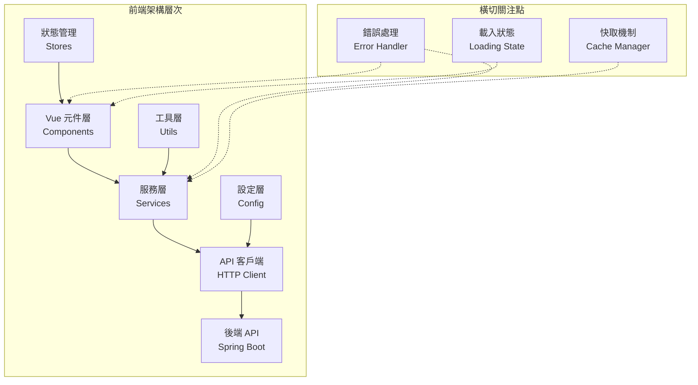

# 前後端API串接設計規範文件

> 本文件定義前後端API串接的標準規範，確保Vue.js前端與Spring Boot後端之間的API整合具有一致性、可靠性和高效能。

## 📋 文檔資訊

| 項目 | 內容 |
|------|------|
| **文檔版本** | v1.0.0 |
| **最後更新** | 2025-09-20 |
| **適用技術** | Vue.js 3 + Spring Boot 3 + RESTful API |
| **前端框架** | Vue.js 3 + Axios |
| **後端框架** | Spring Boot 3 + JPA/Hibernate |
| **負責單位** | 技術架構組 |

---

## 🎯 設計原則

### 核心設計理念
- **完整資料流轉**: 確保前端所有功能都能正確呼叫對應的後端API
- **統一錯誤處理**: 建立完整的錯誤處理機制，提供良好的使用者體驗
- **效能最佳化**: 實作資料快取、防抖動、批次操作等效能優化
- **使用者體驗**: 加入載入狀態、進度指示、即時反饋等UX改善
- **架構分層**: 清晰的架構分層和元件職責分離

---

## 🏗️ 架構設計規範

### 1. 前端架構分層



#### 1.1 服務層設計 (Services)

**目的**: 封裝所有後端API呼叫，提供清晰的業務介面

**命名規範**:
```
[業務模組]Service.js
```

**範例結構**:
```javascript
// services/crewImportService.js
import axiosConfig from '@/config/axiosConfig'

export const crewImportService = {
  // 查詢類API
  async getCrewList(params) {
    return await axiosConfig.get('/api/v1/crew-import/crews', { params })
  },
  
  // 建立類API
  async createCrew(crewData) {
    return await axiosConfig.post('/api/v1/crew-import/crews', crewData)
  },
  
  // 更新類API
  async updateCrew(id, crewData) {
    return await axiosConfig.put(`/api/v1/crew-import/crews/${id}`, crewData)
  },
  
  // 刪除類API
  async deleteCrew(id) {
    return await axiosConfig.delete(`/api/v1/crew-import/crews/${id}`)
  },
  
  // 批次操作API
  async batchImportCrews(importData) {
    return await axiosConfig.post('/api/v1/crew-import/crews/batch', importData)
  },
  
  // 檔案操作API
  async uploadExcelFile(formData) {
    return await axiosConfig.post('/api/v1/crew-import/crews/upload', formData, {
      headers: { 'Content-Type': 'multipart/form-data' }
    })
  },
  
  // 狀態查詢API
  async getImportStatus(taskId) {
    return await axiosConfig.get(`/api/v1/crew-import/crews/status/${taskId}`)
  }
}
```

#### 1.2 HTTP客戶端設定 (Axios Config)

**設定檔範例**:
```javascript
// config/axiosConfig.js
import axios from 'axios'
import { useAuthStore } from '@/stores/auth'
import { showMessage } from '@/utils/messageHandler'

// 建立 axios 實例 - 統一API基礎路徑
const axiosConfig = axios.create({
  baseURL: import.meta.env.VITE_API_BASE_URL || 'http://localhost:8088',
  timeout: 30000,
  headers: {
    'Content-Type': 'application/json'
  }
})

// 請求攔截器
axiosConfig.interceptors.request.use(
  (config) => {
    const authStore = useAuthStore()
    if (authStore.token) {
      config.headers.Authorization = `Bearer ${authStore.token}`
    }
    return config
  },
  (error) => {
    return Promise.reject(error)
  }
)

// 回應攔截器
axiosConfig.interceptors.response.use(
  (response) => {
    return response
  },
  (error) => {
    // 統一錯誤處理
    handleApiError(error)
    return Promise.reject(error)
  }
)

export default axiosConfig
```

---

## 🔧 API串接整合規範

### API路徑設計標準

**基礎路徑格式**: `/api/v{version}/{module}/{resource}`

**標準範例**:
```javascript
// 基礎CRUD操作
const API_ENDPOINTS = {
  // 船員匯入模組
  CREW_IMPORT: {
    BASE: '/api/v1/crew-import',
    LIST: '/api/v1/crew-import/crews',
    CREATE: '/api/v1/crew-import/crews',
    UPDATE: '/api/v1/crew-import/crews/{id}',
    DELETE: '/api/v1/crew-import/crews/{id}',
    BATCH: '/api/v1/crew-import/crews/batch',
    UPLOAD: '/api/v1/crew-import/crews/upload',
    STATUS: '/api/v1/crew-import/crews/status/{taskId}'
  },
  
  // 其他業務模組
  EMPLOYEE: {
    BASE: '/api/v1/employee',
    LIST: '/api/v1/employee/list',
    DETAIL: '/api/v1/employee/{id}',
    CREATE: '/api/v1/employee',
    UPDATE: '/api/v1/employee/{id}',
    DELETE: '/api/v1/employee/{id}'
  }
}
```

### 1.1 服務層設計 (Services)

**API呼叫範例**:
```javascript
// services/crewImportService.js
import axiosConfig from '@/config/axiosConfig'

export const crewImportService = {
  // 查詢類API - 統一使用 /api/ 前綴
  async getCrewList(params) {
    return await axiosConfig.get('/api/v1/crew-import/crews', { params })
  },
  
  // 建立類API
  async createCrew(crewData) {
    return await axiosConfig.post('/api/v1/crew-import/crews', crewData)
  },
  
  // 更新類API
  async updateCrew(id, crewData) {
    return await axiosConfig.put(`/api/v1/crew-import/crews/${id}`, crewData)
  },
  
  // 刪除類API
  async deleteCrew(id) {
    return await axiosConfig.delete(`/api/v1/crew-import/crews/${id}`)
  },
  
  // 批次操作API
  async batchImportCrews(importData) {
    return await axiosConfig.post('/api/v1/crew-import/crews/batch', importData)
  },
  
  // 檔案操作API
  async uploadExcelFile(formData) {
    return await axiosConfig.post('/api/v1/crew-import/crews/upload', formData, {
      headers: { 'Content-Type': 'multipart/form-data' }
    })
  },
  
  // 狀態查詢API
  async getImportStatus(taskId) {
    return await axiosConfig.get(`/api/v1/crew-import/crews/status/${taskId}`)
  }
}
```

#### 1.2 HTTP客戶端設定 (Axios Config)

**設定檔範例**:
```javascript
// config/axiosConfig.js
import axios from 'axios'
import { useAuthStore } from '@/stores/auth'
import { showMessage } from '@/utils/messageHandler'

// 建立 axios 實例 - 統一API基礎路徑
const axiosConfig = axios.create({
  baseURL: import.meta.env.VITE_API_BASE_URL || 'http://localhost:8088',
  timeout: 30000,
  headers: {
    'Content-Type': 'application/json'
  }
})

// 請求攔截器
axiosConfig.interceptors.request.use(
  (config) => {
    const authStore = useAuthStore()
    if (authStore.token) {
      config.headers.Authorization = `Bearer ${authStore.token}`
    }
    return config
  },
  (error) => {
    return Promise.reject(error)
  }
)

// 回應攔截器
axiosConfig.interceptors.response.use(
  (response) => {
    return response
  },
  (error) => {
    // 統一錯誤處理
    handleApiError(error)
    return Promise.reject(error)
  }
)

export default axiosConfig
```

---

## 🔗 API端點總覽

**路徑設計規範**: 所有API端點統一使用 `/api/v1/` 前綴

| 端點 | 方法 | 功能描述 | 權限需求 |
|------|------|----------|----------|
| `/api/v1/crew-import/crews` | GET | 查詢船員清單 | USER |
| `/api/v1/crew-import/crews` | POST | 新增船員資料 | USER |
| `/api/v1/crew-import/crews/{id}` | PUT | 更新船員資料 | USER |
| `/api/v1/crew-import/crews/{id}` | DELETE | 刪除船員資料 | ADMIN |
| `/api/v1/crew-import/crews/batch` | POST | 批次匯入船員 | USER |
| `/api/v1/crew-import/crews/upload` | POST | 上傳Excel檔案 | USER |
| `/api/v1/crew-import/crews/status/{taskId}` | GET | 查詢處理狀態 | USER |

---

## 🔧 API串接整合規範

### 1. 資料載入整合

#### 1.1 基本資料載入模式

```javascript
// 標準資料載入實作
const loadData = async (params = {}) => {
  try {
    // 設定載入狀態
    isLoading.value = true
    loadingText.value = '載入資料中...'
    
    // 檢查快取
    const cacheKey = generateCacheKey(params)
    const cachedData = getCachedData(cacheKey)
    if (cachedData) {
      crewData.value = cachedData
      return
    }
    
    // API呼叫
    const response = await crewImportService.getCrewList(params)
    
    // 成功處理
    if (response.success) {
      crewData.value = response.data.content || []
      
      // 設定快取
      setCachedData(cacheKey, crewData.value)
      
      // 更新狀態
      updateComponentState(crewData.value)
      
      showMessage('資料載入成功', 'success')
    }
    
  } catch (error) {
    handleApiError(error, '載入船員資料失敗')
    crewData.value = []
  } finally {
    isLoading.value = false
  }
}
```

#### 1.2 分頁資料載入

```javascript
// 分頁資料載入實作
const loadPagedData = async (page = 0, size = 20) => {
  try {
    isLoading.value = true
    
    const params = {
      page,
      size,
      year: selectedYear.value,
      month: selectedMonth.value,
      // 其他查詢條件...
    }
    
    const response = await crewImportService.getCrewList(params)
    
    if (response.success) {
      const pageData = response.data
      
      // 更新分頁資料
      crewData.value = pageData.content || []
      pagination.value = {
        currentPage: pageData.number,
        totalPages: pageData.totalPages,
        totalElements: pageData.totalElements,
        size: pageData.size
      }
      
      showMessage(`載入 ${crewData.value.length} 筆資料`, 'info')
    }
    
  } catch (error) {
    handleApiError(error, '載入分頁資料失敗')
  } finally {
    isLoading.value = false
  }
}
```

### 2. 檔案上傳整合

#### 2.1 Excel檔案上傳處理

```javascript
// Excel檔案上傳完整流程
const processFile = async (file) => {
  try {
    // 檔案驗證
    if (!validateExcelFile(file)) {
      return
    }
    
    // 顯示進度列
    showProgressBar()
    
    // 本地檔案解析（可選）
    const localData = await parseExcelFile(file)
    
    // 準備上傳資料
    const formData = new FormData()
    formData.append('file', file)
    formData.append('year', selectedYear.value)
    formData.append('month', selectedMonth.value)
    
    // API上傳
    const uploadResponse = await crewImportService.uploadExcelFile(formData)
    
    if (uploadresponse.success) {
      // 取得任務ID並監控進度
      const taskId = uploadResponse.data.taskId
      await monitorImportProgress(taskId)
    }
    
  } catch (error) {
    handleApiError(error, 'Excel檔案處理失敗')
  } finally {
    hideProgressBar()
  }
}

// 檔案驗證
const validateExcelFile = (file) => {
  const validTypes = [
    'application/vnd.openxmlformats-officedocument.spreadsheetml.sheet',
    'application/vnd.ms-excel'
  ]
  
  if (!validTypes.includes(file.type)) {
    showMessage('請選擇Excel檔案 (.xlsx 或 .xls)', 'error')
    return false
  }
  
  if (file.size > 10 * 1024 * 1024) { // 10MB
    showMessage('檔案大小不能超過 10MB', 'error')
    return false
  }
  
  return true
}
```

#### 2.2 進度監控機制

```javascript
// 監控匯入進度
const monitorImportProgress = async (taskId) => {
  const maxAttempts = 30
  let attempts = 0
  
  const checkProgress = async () => {
    try {
      const response = await crewImportService.getImportStatus(taskId)
      const taskData = response.data
      
      // 更新進度條
      progressValue.value = taskData.progressPercentage || 0
      progressText.value = taskData.statusMessage || '處理中...'
      
      if (taskData.status === 'COMPLETED') {
        showMessage(`匯入完成！成功處理 ${taskData.processedCount} 筆資料`, 'success')
        await loadData() // 重新載入資料
        currentMode.value = 'imported'
        return
      } else if (taskData.status === 'FAILED') {
        showMessage(`匯入失敗：${taskData.errorMessage}`, 'error')
        return
      }
      
      // 繼續監控
      if (attempts < maxAttempts) {
        attempts++
        setTimeout(checkProgress, 1000)
      } else {
        showMessage('匯入狀態查詢逾時', 'warning')
      }
    } catch (error) {
      handleApiError(error, '查詢匯入狀態失敗')
    }
  }
  
  checkProgress()
}
```

### 3. 資料儲存整合

#### 3.1 批次資料儲存

```javascript
// 批次儲存資料
const saveData = async () => {
  try {
    isLoading.value = true
    loadingText.value = '儲存資料中...'
    
    // 前端資料驗證
    const validationResult = validateCrewData(crewData.value)
    if (!validationResult.isValid) {
      showMessage(`資料驗證失敗：${validationResult.errors.join(', ')}`, 'error')
      return
    }
    
    // 準備批次匯入資料
    const batchData = {
      year: selectedYear.value,
      month: selectedMonth.value,
      mode: 'OVERWRITE',
      crews: crewData.value.map(item => transformToApiFormat(item))
    }
    
    // 呼叫批次匯入API
    const response = await crewImportService.batchImportCrews(batchData)
    
    if (response.success) {
      const taskId = response.data.taskId
      await monitorImportProgress(taskId)
      currentMode.value = 'saved'
      isDraft.value = false
    }
    
  } catch (error) {
    handleApiError(error, '儲存船員資料失敗')
  } finally {
    isLoading.value = false
  }
}

// 資料格式轉換
const transformToApiFormat = (frontendData) => {
  return {
    name: frontendData.姓名,
    employeeId: frontendData.工號,
    shipName: frontendData.船名,
    position: frontendData.職稱,
    workingDays: frontendData.在職天數,
    year: selectedYear.value,
    month: selectedMonth.value
  }
}
```

---

## 🛡️ 錯誤處理機制

### 1. 統一錯誤處理

#### 1.1 錯誤處理器

```javascript
// utils/apiErrorHandler.js
export const handleApiError = (error, defaultMessage = 'API呼叫失敗') => {
  console.error('API Error:', error)
  
  let errorMessage = defaultMessage
  let errorCode = null
  
  if (error.response) {
    // 伺服器回應錯誤
    const { status, data } = error.response
    errorCode = status
    
    switch (status) {
      case 400:
        errorMessage = data.message || '請求參數錯誤'
        break
      case 401:
        errorMessage = '登入已過期，請重新登入'
        handleAuthError()
        break
      case 403:
        errorMessage = '無權限執行此操作'
        break
      case 404:
        errorMessage = 'API端點不存在'
        break
      case 409:
        errorMessage = data.message || '資料衝突，請重新整理後再試'
        break
      case 422:
        errorMessage = handleValidationError(data)
        break
      case 500:
        errorMessage = '伺服器內部錯誤'
        break
      case 503:
        errorMessage = '服務暫時無法使用，請稍後再試'
        break
      default:
        errorMessage = data.message || defaultMessage
    }
  } else if (error.request) {
    // 網路錯誤
    errorMessage = '網路連線失敗，請檢查網路狀態'
    errorCode = 'NETWORK_ERROR'
  } else {
    // 其他錯誤
    errorMessage = error.message || defaultMessage
    errorCode = 'UNKNOWN_ERROR'
  }
  
  // 顯示錯誤訊息
  showMessage(errorMessage, 'error')
  
  // 錯誤日誌記錄
  logError(error, errorMessage, errorCode)
  
  return { errorMessage, errorCode }
}

// 處理驗證錯誤
const handleValidationError = (data) => {
  if (data.fieldErrors && Array.isArray(data.fieldErrors)) {
    return data.fieldErrors
      .map(error => `${error.field}: ${error.message}`)
      .join(', ')
  }
  return data.message || '資料驗證失敗'
}

// 處理認證錯誤
const handleAuthError = () => {
  const authStore = useAuthStore()
  authStore.logout()
  router.push('/login')
}
```

#### 1.2 業務層錯誤處理

```javascript
// 在 Vue 元件中的錯誤處理模式
const handleOperation = async (operation, successMessage) => {
  try {
    isLoading.value = true
    
    const result = await operation()
    
    if (result.success) {
      showMessage(successMessage, 'success')
      await loadData() // 重新載入資料
    } else {
      showMessage(result.message || '操作失敗', 'warning')
    }
    
  } catch (error) {
    const { errorMessage } = handleApiError(error, '操作執行失敗')
    
    // 特殊錯誤處理
    if (error.response?.status === 409) {
      // 資料衝突，提示重新整理
      confirmRefresh('資料已被其他使用者修改，是否重新載入最新資料？')
    }
    
  } finally {
    isLoading.value = false
  }
}
```

### 2. 重試機制

```javascript
// 自動重試機制
const retryRequest = async (requestFunc, maxRetries = 3, delay = 1000) => {
  for (let attempt = 1; attempt <= maxRetries; attempt++) {
    try {
      return await requestFunc()
    } catch (error) {
      if (attempt === maxRetries) {
        throw error
      }
      
      // 只對特定錯誤進行重試
      if (shouldRetry(error)) {
        await new Promise(resolve => setTimeout(resolve, delay * attempt))
        continue
      } else {
        throw error
      }
    }
  }
}

const shouldRetry = (error) => {
  // 網路錯誤或服務器暫時無法使用時重試
  return !error.response || 
         error.response.status >= 500 ||
         error.response.status === 503
}
```

---

## ⚡ 效能最佳化規範

### 1. 防抖動處理

```javascript
// 防抖動搜尋
import { debounce } from 'lodash-es'

const debouncedSearch = debounce(async (searchParams) => {
  await loadData(searchParams)
}, 300)

// 防抖動自動儲存
const debouncedAutoSave = debounce(async () => {
  if (isDraft.value) {
    await saveDraft()
  }
}, 2000)
```

### 2. 資料快取機制

```javascript
// utils/cacheManager.js
class CacheManager {
  constructor() {
    this.cache = new Map()
    this.defaultTTL = 5 * 60 * 1000 // 5分鐘
  }
  
  set(key, data, ttl = this.defaultTTL) {
    this.cache.set(key, {
      data,
      timestamp: Date.now(),
      ttl
    })
  }
  
  get(key) {
    const cached = this.cache.get(key)
    if (!cached) return null
    
    if (Date.now() - cached.timestamp > cached.ttl) {
      this.cache.delete(key)
      return null
    }
    
    return cached.data
  }
  
  clear() {
    this.cache.clear()
  }
  
  generateKey(params) {
    return JSON.stringify(params)
  }
}

export const cacheManager = new CacheManager()
```

### 3. 分頁載入最佳化

```javascript
// 虛擬滾動實作
const useVirtualScroll = (items, itemHeight = 50, containerHeight = 400) => {
  const visibleStart = ref(0)
  const visibleEnd = ref(Math.ceil(containerHeight / itemHeight))
  
  const visibleItems = computed(() => {
    return items.value.slice(visibleStart.value, visibleEnd.value)
  })
  
  const handleScroll = (scrollTop) => {
    const start = Math.floor(scrollTop / itemHeight)
    const visible = Math.ceil(containerHeight / itemHeight)
    
    visibleStart.value = start
    visibleEnd.value = start + visible
  }
  
  return {
    visibleItems,
    handleScroll,
    totalHeight: computed(() => items.value.length * itemHeight)
  }
}
```

---

## 🎨 使用者體驗改善

### 1. 載入狀態管理

```javascript
// 載入狀態組合式函數
export const useLoadingState = () => {
  const isLoading = ref(false)
  const loadingText = ref('載入中...')
  const loadingProgress = ref(0)
  
  const setLoading = (loading, text = '載入中...', progress = 0) => {
    isLoading.value = loading
    loadingText.value = text
    loadingProgress.value = progress
  }
  
  const updateProgress = (progress, text) => {
    loadingProgress.value = progress
    if (text) loadingText.value = text
  }
  
  return {
    isLoading: readonly(isLoading),
    loadingText: readonly(loadingText),
    loadingProgress: readonly(loadingProgress),
    setLoading,
    updateProgress
  }
}
```

### 2. 操作確認機制

```javascript
// 操作確認對話框
export const useConfirmDialog = () => {
  const showConfirm = async (message, title = '確認操作') => {
    return new Promise((resolve) => {
      // 使用 UI 框架的確認對話框
      ElMessageBox.confirm(message, title, {
        confirmButtonText: '確認',
        cancelButtonText: '取消',
        type: 'warning'
      }).then(() => {
        resolve(true)
      }).catch(() => {
        resolve(false)
      })
    })
  }
  
  const confirmAction = async (message, action) => {
    const confirmed = await showConfirm(message)
    if (confirmed) {
      await action()
    }
    return confirmed
  }
  
  return {
    showConfirm,
    confirmAction
  }
}
```

### 3. 即時反饋機制

```javascript
// 即時狀態反饋
export const useStatusFeedback = () => {
  const status = ref('idle') // idle, loading, success, error
  const message = ref('')
  
  const setStatus = (newStatus, newMessage = '') => {
    status.value = newStatus
    message.value = newMessage
    
    // 自動清除成功狀態
    if (newStatus === 'success') {
      setTimeout(() => {
        if (status.value === 'success') {
          status.value = 'idle'
          message.value = ''
        }
      }, 3000)
    }
  }
  
  const resetStatus = () => {
    status.value = 'idle'
    message.value = ''
  }
  
  return {
    status: readonly(status),
    message: readonly(message),
    setStatus,
    resetStatus
  }
}
```

---

## ✅ 最佳實務檢查清單

### 📊 API串接架構檢查

- [ ] API服務層正確封裝所有後端API呼叫
- [ ] HTTP客戶端設定包含攔截器和統一設定
- [ ] 前端元件正確使用服務層，避免直接API呼叫
- [ ] 錯誤處理機制完整且統一
- [ ] 載入狀態和進度指示正確實作

### 🔗 資料流轉檢查

- [ ] 前後端資料格式正確轉換
- [ ] API請求參數和回應格式符合規範
- [ ] 檔案上傳和下載功能正確實作
- [ ] 批次操作和狀態監控機制完整
- [ ] 分頁和搜尋功能正確整合

### 🛡️ 錯誤處理檢查

- [ ] 網路錯誤、伺服器錯誤、權限錯誤都有適當處理
- [ ] 錯誤訊息對使用者友善且具指導性
- [ ] 認證錯誤能正確導向登入頁面
- [ ] 重試機制針對適當的錯誤類型
- [ ] 錯誤日誌記錄完整

### ⚡ 效能最佳化檢查

- [ ] API呼叫有適當的載入指示
- [ ] 資料快取機制正確實作
- [ ] 防抖動處理避免過度API呼叫
- [ ] 分頁載入和虛擬滾動適當使用
- [ ] 大型檔案上傳有進度指示

### 🎨 使用者體驗檢查

- [ ] 操作流程順暢自然
- [ ] 成功/失敗操作都有明確反饋
- [ ] 頁面狀態變化清晰可理解
- [ ] 載入和處理過程有適當提示
- [ ] 確認對話框在關鍵操作中正確使用

---

## 📚 參考範本

### 1. 完整元件範本

```vue
<template>
  <div class="api-integration-component">
    <!-- 載入狀態 -->
    <div v-if="isLoading" class="loading-state">
      <el-progress 
        :percentage="loadingProgress" 
        :format="() => loadingText"
      />
    </div>
    
    <!-- 主要內容 -->
    <div v-else class="main-content">
      <!-- 操作區域 -->
      <div class="action-bar">
        <el-button @click="handleRefresh">重新整理</el-button>
        <el-button type="primary" @click="handleSave">儲存</el-button>
      </div>
      
      <!-- 資料區域 -->
      <div class="data-section">
        <!-- 資料表格或清單 -->
      </div>
    </div>
    
    <!-- 狀態反饋 -->
    <StatusFeedback 
      :status="status" 
      :message="message" 
    />
  </div>
</template>

<script setup>
import { ref, onMounted } from 'vue'
import { useLoadingState } from '@/composables/useLoadingState'
import { useStatusFeedback } from '@/composables/useStatusFeedback'
import { useConfirmDialog } from '@/composables/useConfirmDialog'
import { crewImportService } from '@/services/crewImportService'
import { handleApiError } from '@/utils/apiErrorHandler'

// 組合式函數
const { isLoading, loadingText, loadingProgress, setLoading } = useLoadingState()
const { status, message, setStatus } = useStatusFeedback()
const { confirmAction } = useConfirmDialog()

// 資料狀態
const data = ref([])

// 生命週期
onMounted(async () => {
  await loadData()
})

// 方法定義
const loadData = async () => {
  try {
    setLoading(true, '載入資料中...')
    
    const response = await crewImportService.getCrewList()
    
    if (response.success) {
      data.value = response.data
      setStatus('success', '資料載入成功')
    }
    
  } catch (error) {
    handleApiError(error, '載入資料失敗')
    setStatus('error', '載入資料失敗')
  } finally {
    setLoading(false)
  }
}

const handleRefresh = () => {
  loadData()
}

const handleSave = () => {
  confirmAction('確定要儲存變更嗎？', async () => {
    await saveData()
  })
}

const saveData = async () => {
  try {
    setLoading(true, '儲存資料中...')
    
    const response = await crewImportService.saveData(data.value)
    
    if (response.success) {
      setStatus('success', '資料儲存成功')
    }
    
  } catch (error) {
    handleApiError(error, '儲存資料失敗')
    setStatus('error', '儲存資料失敗')
  } finally {
    setLoading(false)
  }
}
</script>
```

### 2. 服務層範本

```javascript
// services/baseService.js
import axiosConfig from '@/config/axiosConfig'

export class BaseService {
  constructor(baseUrl) {
    this.baseUrl = baseUrl
  }
  
  async get(url, params = {}) {
    return await axiosConfig.get(`${this.baseUrl}${url}`, { params })
  }
  
  async post(url, data) {
    return await axiosConfig.post(`${this.baseUrl}${url}`, data)
  }
  
  async put(url, data) {
    return await axiosConfig.put(`${this.baseUrl}${url}`, data)
  }
  
  async delete(url) {
    return await axiosConfig.delete(`${this.baseUrl}${url}`)
  }
  
  async upload(url, formData) {
    return await axiosConfig.post(`${this.baseUrl}${url}`, formData, {
      headers: { 'Content-Type': 'multipart/form-data' }
    })
  }
}

// 具體業務服務
export class CrewImportService extends BaseService {
  constructor() {
    super('/crew-import')
  }
  
  async getCrewList(params) {
    return await this.get('/crews', params)
  }
  
  async batchImport(data) {
    return await this.post('/crews/batch', data)
  }
  
  async uploadFile(file, additionalData = {}) {
    const formData = new FormData()
    formData.append('file', file)
    
    Object.keys(additionalData).forEach(key => {
      formData.append(key, additionalData[key])
    })
    
    return await this.upload('/crews/upload', formData)
  }
}
```

這個規範文件提供了完整的前後端API串接設計標準，確保開發團隊能夠建立高品質、可維護的API整合方案。