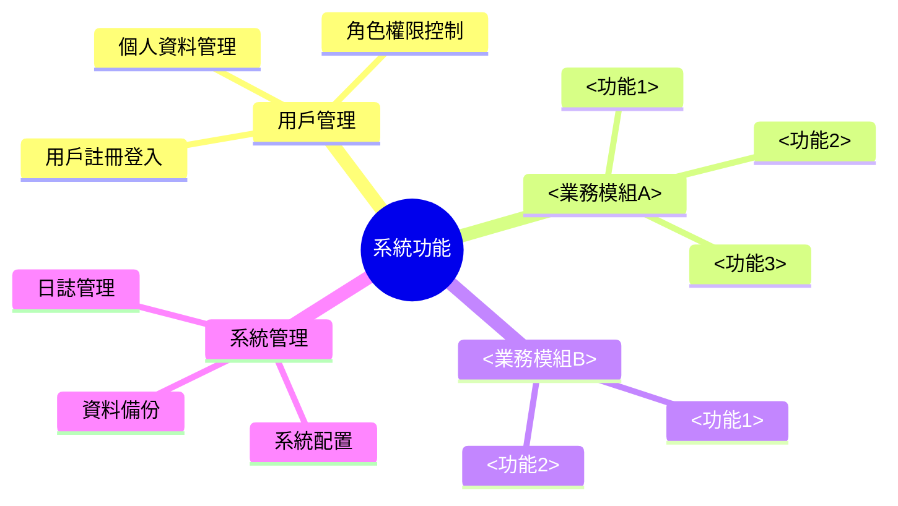
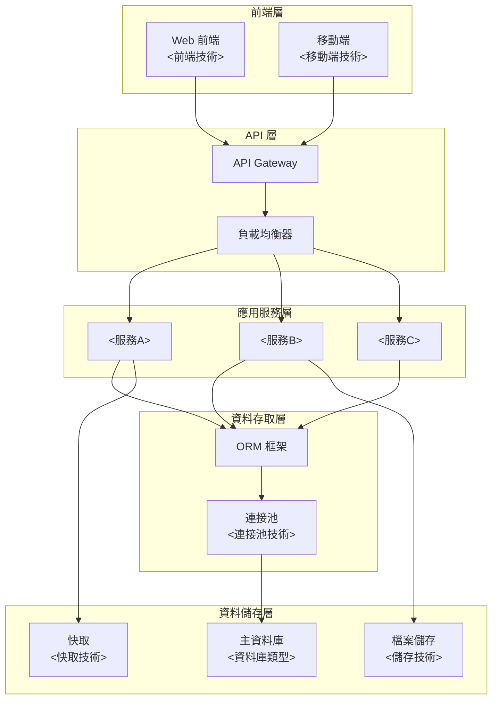
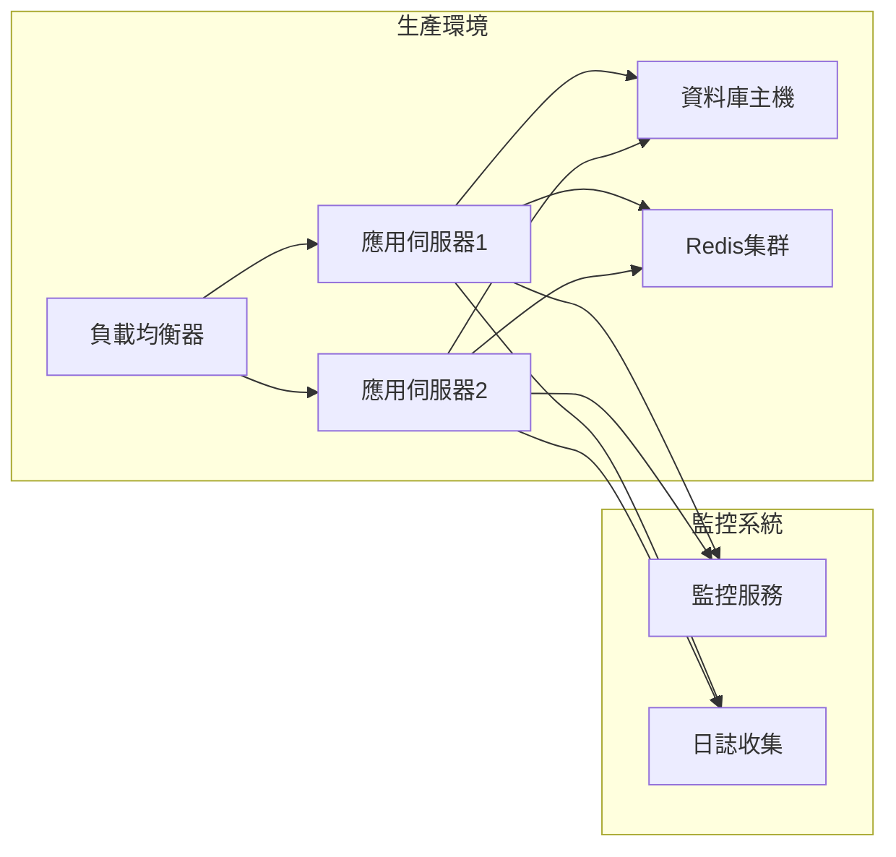
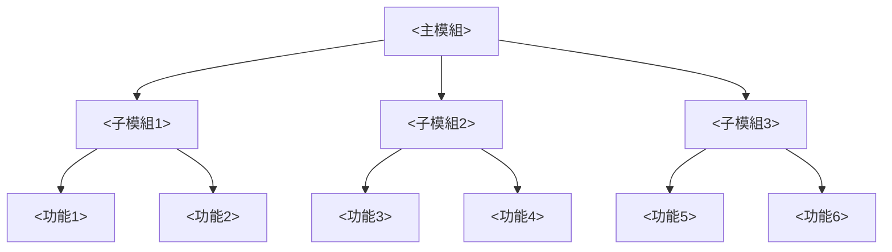
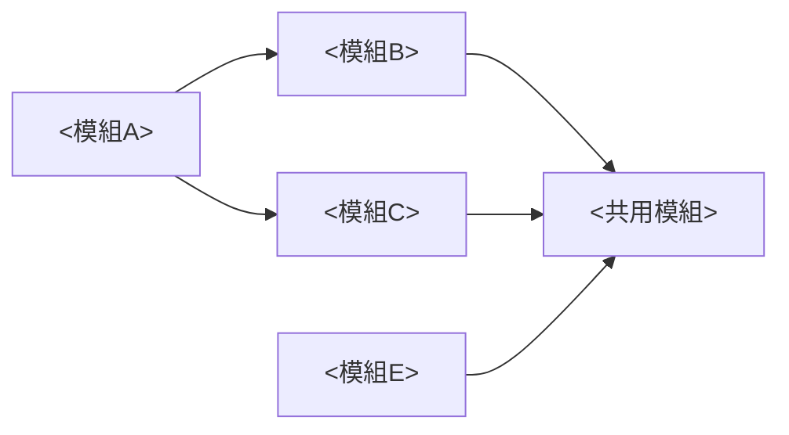
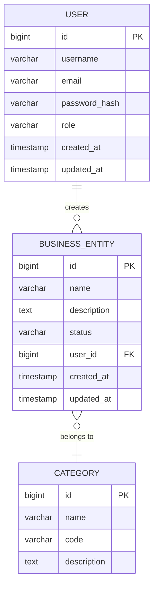
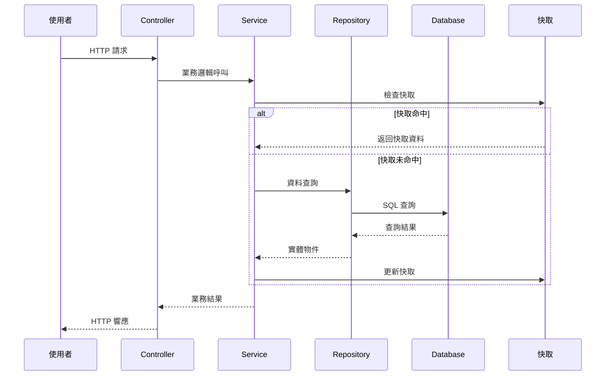
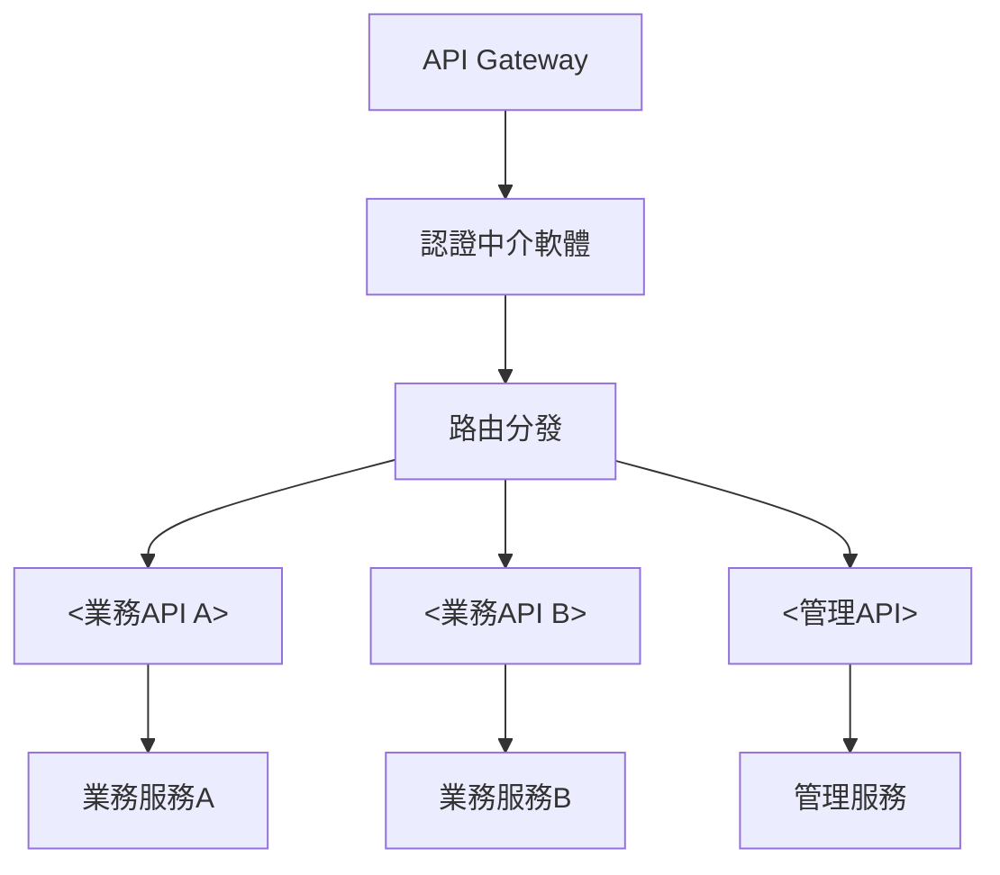
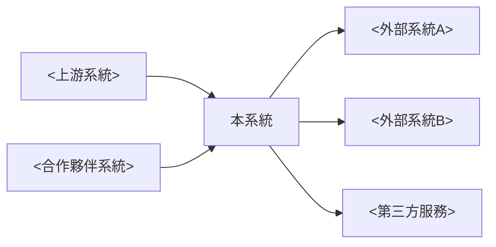

# JavaEE 系統架構分析報告

## 📋 目錄

1. [系統概述](#系統概述)
2. [技術架構分析](#技術架構分析)
3. [**類別設計分析**](#類別設計分析) ⭐ 新增
4. [**組件架構分析**](#組件架構分析) ⭐ 新增
5. [功能模組分析](#功能模組分析)
6. [資料模型分析](#資料模型分析)
7. [**企業服務設計**](#企業服務設計) ⭐ 新增
8. [**事務管理設計**](#事務管理設計) ⭐ 新增
9. [**安全架構設計**](#安全架構設計) ⭐ 新增
10. [資料流分析](#資料流分析)
11. [API 介面分析](#API-介面分析)
12. [**設計模式應用**](#設計模式應用) ⭐ 新增
13. [系統整合分析](#系統整合分析)
14. [**部署架構設計**](#部署架構設計) ⭐ 增強

---

## 系統概述

### 系統基本資訊

| 項目 | 內容 |
|------|------|
| **系統名稱** | <系統名稱> |
| **系統版本** | <版本號> |
| **開發框架** | <主要框架及版本> |
| **部署環境** | <開發/測試/正式環境說明> |
| **資料庫** | <資料庫類型及版本> |
| **業務領域** | <業務領域描述> |

### 系統功能概覽



### 使用者角色

| 角色名稱 | 權限範圍 | 主要功能 |
|----------|----------|----------|
| **<角色1>** | <權限描述> | <主要功能列表> |
| **<角色2>** | <權限描述> | <主要功能列表> |
| **<角色3>** | <權限描述> | <主要功能列表> |

---

## 技術架構分析

### 整體系統架構



### 技術棧清單

| 技術類別 | 技術名稱 | 版本 | 用途說明 |
|----------|----------|------|----------|
| **後端框架** | <框架名稱> | <版本> | <用途說明> |
| **前端框架** | <框架名稱> | <版本> | <用途說明> |
| **資料庫** | <資料庫名稱> | <版本> | <用途說明> |
| **快取** | <快取技術> | <版本> | <用途說明> |
| **訊息佇列** | <MQ技術> | <版本> | <用途說明> |
| **Web伺服器** | <伺服器名稱> | <版本> | <用途說明> |

### 部署架構



---

## 類別設計分析

### 核心業務類別圖
[插入類別圖]

### 設計原則遵循
- **單一職責原則**: 每個類別只負責一個功能
- **開放封閉原則**: 對擴展開放，對修改封閉
- **依賴倒置原則**: 依賴抽象而非具體實作

## 企業服務設計

### EJB 服務架構
### JPA 實體設計
### CDI 依賴注入設計

## 事務管理設計

### 事務邊界定義
### 事務隔離等級
### 事務回滾策略

---

## 功能模組分析

### 模組架構圖



### 核心模組說明

#### 1. <模組名稱A>

**功能描述**: <模組功能概述>

**主要組件**:
- **Controller**: <控制器說明>
- **Service**: <服務層說明>
- **Repository**: <資料存取層說明>
- **Entity**: <實體類說明>

**關鍵功能**:
- <功能1>: <功能描述>
- <功能2>: <功能描述>
- <功能3>: <功能描述>

#### 2. <模組名稱B>

**功能描述**: <模組功能概述>

**主要組件**:
- **Controller**: <控制器說明>
- **Service**: <服務層說明>
- **Repository**: <資料存取層說明>

**關鍵功能**:
- <功能1>: <功能描述>
- <功能2>: <功能描述>

### 模組依賴關係



---

## 資料模型分析

### 實體關係圖 (ERD)



### 主要實體說明

| 實體名稱 | 說明 | 關鍵欄位 |
|----------|------|----------|
| **<實體A>** | <實體功能說明> | <主要欄位列表> |
| **<實體B>** | <實體功能說明> | <主要欄位列表> |
| **<實體C>** | <實體功能說明> | <主要欄位列表> |

### 資料庫設計特點

- **正規化程度**: <正規化說明>
- **索引策略**: <索引設計說明>
- **資料完整性**: <完整性約束說明>
- **效能考量**: <效能優化說明>

---

## 資料流分析

### 典型業務流程



### 資料處理流程

#### <業務流程A>

1. **輸入驗證**: <驗證邏輯說明>
2. **業務處理**: <處理邏輯說明>
3. **資料持久化**: <儲存邏輯說明>
4. **結果回傳**: <回傳邏輯說明>

#### <業務流程B>

1. **權限檢查**: <權限邏輯說明>
2. **資料查詢**: <查詢邏輯說明>
3. **資料轉換**: <轉換邏輯說明>
4. **結果輸出**: <輸出邏輯說明>

---

## API 介面分析

### API 架構



### 主要 API 清單

| API 分類 | 端點路徑 | HTTP 方法 | 功能說明 |
|----------|----------|-----------|----------|
| **認證相關** | `/api/auth/login` | POST | 使用者登入 |
| **認證相關** | `/api/auth/refresh` | POST | Token 刷新 |
| **<業務A>** | `/api/<resource>/` | GET | <功能說明> |
| **<業務A>** | `/api/<resource>/` | POST | <功能說明> |
| **<業務A>** | `/api/<resource>/{id}` | GET | <功能說明> |
| **<業務A>** | `/api/<resource>/{id}` | PUT | <功能說明> |
| **<業務A>** | `/api/<resource>/{id}` | DELETE | <功能說明> |

### API 設計模式

- **RESTful 設計**: <RESTful 實作說明>
- **版本控制**: <版本控制策略>
- **錯誤處理**: <錯誤回應格式>
- **分頁機制**: <分頁實作方式>
- **過濾排序**: <查詢參數設計>

### 統一回應格式

```json
{
  "code": "SUCCESS",
  "message": "操作成功",
  "data": {},
  "timestamp": "2024-01-01T00:00:00Z",
  "traceId": "trace-uuid"
}
```

### 常見程式碼模式

**Controller 層範例**:
```java
@RestController
@RequestMapping("/api/v1/<resource>")
public class <Resource>Controller {
    
    @GetMapping
    public ResponseEntity<Page<<ResourceDTO>>> getAll(
            @PageableDefault(size = 20) Pageable pageable) {
        // 分頁查詢邏輯
        return ResponseEntity.ok(service.findAll(pageable));
    }
    
    @PostMapping
    public ResponseEntity<<ResourceDTO>> create(
            @Valid @RequestBody Create<Resource>Request request) {
        // 資源創建邏輯
        return ResponseEntity.ok(service.create(request));
    }
}
```

**Service 層範例**:
```java
@Service
@Transactional
public class <Resource>Service {
    
    public <ResourceDTO> create(Create<Resource>Request request) {
        // 業務邏輯處理
        <Resource>Entity entity = mapper.toEntity(request);
        entity = repository.save(entity);
        return mapper.toDTO(entity);
    }
}
```

---

## 系統整合分析

### 外部系統整合



### 整合方式說明

| 整合系統 | 整合方式 | 資料格式 | 頻率 | 說明 |
|----------|----------|----------|------|------|
| **<系統A>** | <整合方式> | <資料格式> | <同步頻率> | <整合說明> |
| **<系統B>** | <整合方式> | <資料格式> | <同步頻率> | <整合說明> |
| **<第三方服務>** | <整合方式> | <資料格式> | <呼叫頻率> | <整合說明> |

### 中介軟體使用

- **訊息佇列**: <MQ 使用說明>
- **API Gateway**: <Gateway 配置說明>
- **ESB/集成平台**: <集成平台說明>

