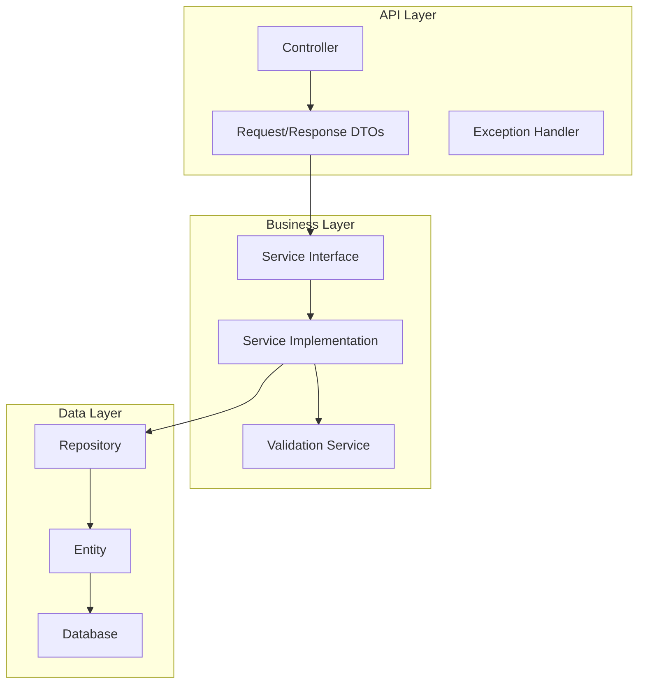
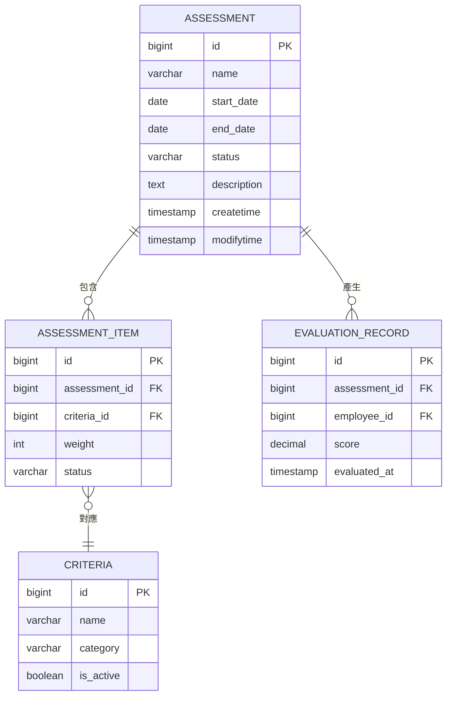
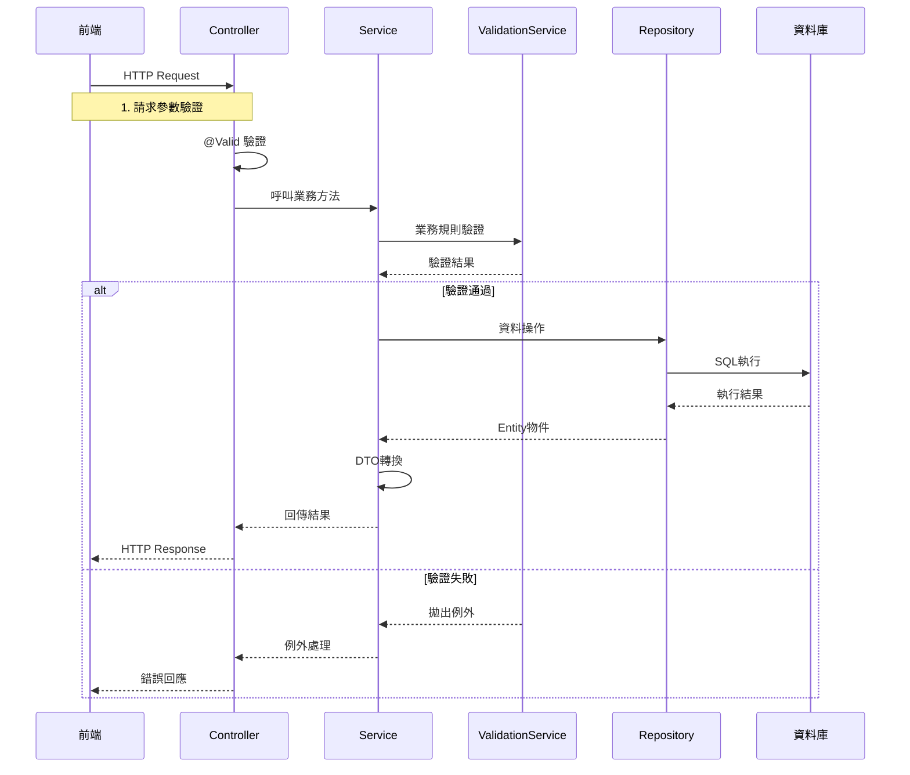
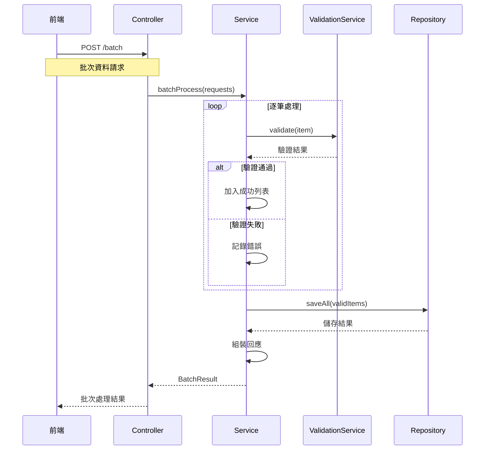
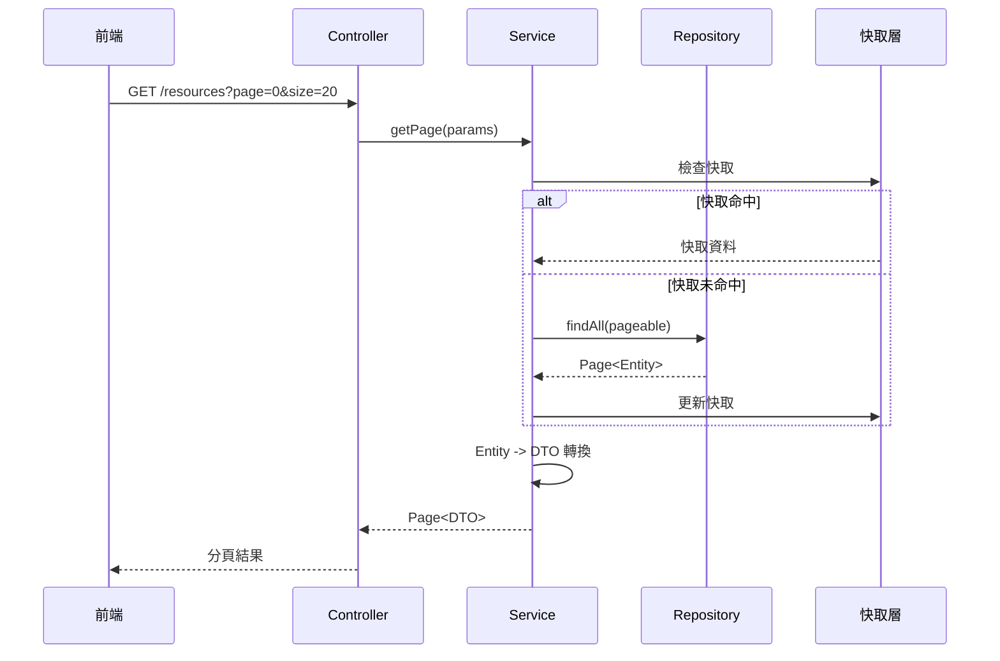

# thmcpa RESTful API 規格文件範本

> 本文件為 thmcpa（達航船員考評系統）後端 RESTful API 的標準規格，用於確保 API 輸入輸出與資料庫結構一致、支援 PrimeVue 前端開發、並符合 Spring Boot 3 + JPA/Hibernate 實作需求。

## 📋 文件資訊

| 項目 | 內容 |
|------|------|
| **文件版本** | v0.1.0 |
| **最後更新** | 2025-08-16 |
| **適用框架** | Spring Boot 3 + JPA/Hibernate |
| **序列化格式** | JSON (UTF-8) |
| **預設分頁參數** | `page`, `size`, `sort` |
| **製作單位** | 技術架構組 |

---

## 🎯 API 設計原則

### 核心設計理念
- **一致性**：API 命名與資料表、欄位保持對應規則
- **對應性**：API 輸入/輸出資料結構與 Entity / DTO 完全對應
- **可擴展性**：支持後續版本新增欄位與過濾條件
- **錯誤友好**：統一錯誤響應格式，明確提供錯誤碼與訊息
- **驗證嚴格**：請求參數需經過資料驗證（Validation Annotations）
- **RESTful 規範**：嚴格遵循 RESTful API 設計原則

### API 路徑設計標準

| HTTP方法 | 路徑格式 | 用途 | 範例 |
|----------|----------|------|------|
| **GET** | `/api/{resources}` | 查詢列表（分頁） | `GET /api/assessments?page=0&size=20` |
| **GET** | `/api/{resources}/{id}` | 查詢單筆 | `GET /api/assessments/123` |
| **POST** | `/api/{resources}` | 新增 | `POST /api/assessments` |
| **PUT** | `/api/{resources}/{id}` | 更新 | `PUT /api/assessments/123` |
| **DELETE** | `/api/{resources}/{id}` | 刪除 | `DELETE /api/assessments/123` |
| **POST** | `/api/{resources}/batch` | 批次操作 | `POST /api/assessments/batch` |
| **GET** | `/api/{resources}/export` | 匯出功能 | `GET /api/assessments/export` |

---

## 📑 API 清單總覽

| 類別 | HTTP 方法 | 路徑 | 功能描述 | 狀態 |
|------|-----------|------|----------|------|
| 考核項目管理 | GET | `/api/assessments` | 分頁查詢考核項目 | ✅ |
| 考核項目管理 | POST | `/api/assessments` | 新增考核項目 | ✅ |
| 考核項目管理 | GET | `/api/assessments/{id}` | 查詢單一考核項目 | ✅ |
| 考核項目管理 | PUT | `/api/assessments/{id}` | 更新考核項目 | ✅ |
| 考核項目管理 | DELETE | `/api/assessments/{id}` | 刪除考核項目 | ✅ |

> 📌 **重要提醒**：API 名稱、欄位與資料庫映射需來自資料庫設計文件的表結構。

---

## 🔧 API 詳細規格

### 1. 查詢考核項目列表

| 項目 | 說明 |
|------|------|
| **HTTP Method** | GET |
| **URL** | `/api/assessments` |
| **功能** | 分頁查詢考核項目列表，支援篩選和排序 |
| **對應資料表** | `th_assessment` |

#### 請求參數 (Query Parameters)
| 參數名稱 | 類型 | 必填 | 預設值 | 描述 | 驗證規則 |
|----------|------|------|--------|------|----------|
| `page` | integer | 否 | 0 | 分頁頁碼（0 起算） | `@Min(0)` |
| `size` | integer | 否 | 20 | 每頁筆數 | `@Min(1) @Max(100)` |
| `sort` | string | 否 | id,desc | 排序條件 | 格式：`欄位名,方向` |
| `name` | string | 否 | - | 按考核名稱過濾（模糊查詢） | `@Size(max=200)` |
| `status` | string | 否 | - | 按狀態過濾 | 枚舉：`ACTIVE`, `INACTIVE` |

#### 請求範例
```http
GET /api/assessments?page=0&size=10&sort=name,asc&status=ACTIVE
Accept: application/json
```

#### 成功響應 (200 OK)
```json
{
  "success": true,
  "message": "查詢成功",
  "data": {
    "content": [
      {
        "id": 1,
        "name": "年度績效考核",
        "startDate": "2025-01-01",
        "endDate": "2025-12-31",
        "status": "ACTIVE",
        "createtime": "2025-01-01T10:00:00",
        "modifytime": "2025-01-01T10:00:00"
      }
    ],
    "pageable": {
      "pageNumber": 0,
      "pageSize": 10,
      "sort": {
        "sorted": true,
        "orderBy": [
          {
            "property": "name",
            "direction": "ASC"
          }
        ]
      }
    },
    "totalElements": 1,
    "totalPages": 1,
    "first": true,
    "last": true,
    "numberOfElements": 1
  },
  "timestamp": "2025-01-01T10:00:00.123Z"
}
```

#### 錯誤響應範例
```json
{
  "success": false,
  "errorCode": "VALIDATION_ERROR",
  "message": "參數驗證失敗",
  "details": [
    {
      "field": "size",
      "message": "每頁筆數不能超過100"
    }
  ],
  "timestamp": "2025-01-01T10:00:00.123Z"
}
```

---

### 2. 新增考核項目

| 項目 | 說明 |
|------|------|
| **HTTP Method** | POST |
| **URL** | `/api/assessments` |
| **功能** | 新增考核項目 |
| **對應資料表** | `th_assessment` |

#### 請求 Body (JSON)
```json
{
  "name": "年度績效考核",
  "startDate": "2025-01-01",
  "endDate": "2025-12-31",
  "status": "ACTIVE",
  "description": "2025年度員工績效考核"
}
```

#### 欄位驗證規則
| 欄位 | 類型 | 必填 | 驗證規則 | 錯誤訊息 |
|------|------|------|----------|----------|
| `name` | string | ✅ | `@NotBlank`, `@Size(max=200)` | 考核名稱不得為空且長度不能超過200字元 |
| `startDate` | string | ✅ | `@NotNull`, 格式：`yyyy-MM-dd` | 開始日期不得為空且格式須為 yyyy-MM-dd |
| `endDate` | string | ✅ | `@NotNull`, 格式：`yyyy-MM-dd` | 結束日期不得為空且格式須為 yyyy-MM-dd |
| `status` | string | ✅ | 枚舉：`ACTIVE`, `INACTIVE` | 狀態必須為 ACTIVE 或 INACTIVE |
| `description` | string | 否 | `@Size(max=1000)` | 描述長度不能超過1000字元 |

#### 請求範例
```http
POST /api/assessments
Content-Type: application/json
Accept: application/json

{
  "name": "年度績效考核",
  "startDate": "2025-01-01",
  "endDate": "2025-12-31",
  "status": "ACTIVE",
  "description": "2025年度員工績效考核"
}
```

#### 成功響應 (201 Created)
```json
{
  "success": true,
  "message": "新增成功",
  "data": {
    "id": 1,
    "name": "年度績效考核",
    "startDate": "2025-01-01",
    "endDate": "2025-12-31",
    "status": "ACTIVE",
    "description": "2025年度員工績效考核",
    "createtime": "2025-01-01T10:00:00",
    "modifytime": "2025-01-01T10:00:00"
  },
  "timestamp": "2025-01-01T10:00:00.123Z"
}
```

#### 錯誤響應範例
```json
{
  "success": false,
  "errorCode": "VALIDATION_ERROR",
  "message": "資料驗證失敗",
  "details": [
    {
      "field": "name",
      "message": "考核名稱不得為空"
    },
    {
      "field": "startDate",
      "message": "開始日期格式不正確"
    }
  ],
  "timestamp": "2025-01-01T10:00:00.123Z"
}
```

---

### 3. 查詢單一考核項目

| 項目 | 說明 |
|------|------|
| **HTTP Method** | GET |
| **URL** | `/api/assessments/{id}` |
| **功能** | 根據ID查詢單一考核項目詳情 |
| **對應資料表** | `th_assessment` |

#### 路徑參數
| 參數名稱 | 類型 | 必填 | 描述 | 驗證規則 |
|----------|------|------|------|----------|
| `id` | long | ✅ | 考核項目ID | `@NotNull`, `@Min(1)` |

#### 請求範例
```http
GET /api/assessments/1
Accept: application/json
```

#### 成功響應 (200 OK)
```json
{
  "success": true,
  "message": "查詢成功",
  "data": {
    "id": 1,
    "name": "年度績效考核",
    "startDate": "2025-01-01",
    "endDate": "2025-12-31",
    "status": "ACTIVE",
    "description": "2025年度員工績效考核",
    "createtime": "2025-01-01T10:00:00",
    "modifytime": "2025-01-01T10:00:00"
  },
  "timestamp": "2025-01-01T10:00:00.123Z"
}
```

#### 錯誤響應 (404 Not Found)
```json
{
  "success": false,
  "errorCode": "RESOURCE_NOT_FOUND",
  "message": "查無此考核項目",
  "details": [
    {
      "field": "id",
      "message": "ID為 1 的考核項目不存在"
    }
  ],
  "timestamp": "2025-01-01T10:00:00.123Z"
}
```

---

### 4. 更新考核項目

| 項目 | 說明 |
|------|------|
| **HTTP Method** | PUT |
| **URL** | `/api/assessments/{id}` |
| **功能** | 更新指定ID的考核項目 |
| **對應資料表** | `th_assessment` |

#### 路徑參數
| 參數名稱 | 類型 | 必填 | 描述 | 驗證規則 |
|----------|------|------|------|----------|
| `id` | long | ✅ | 考核項目ID | `@NotNull`, `@Min(1)` |

#### 請求 Body (JSON)
```json
{
  "name": "年度績效考核(修正版)",
  "startDate": "2025-01-01",
  "endDate": "2025-12-31",
  "status": "ACTIVE",
  "description": "2025年度員工績效考核(已修正)"
}
```

#### 欄位驗證規則
| 欄位 | 類型 | 必填 | 驗證規則 | 錯誤訊息 |
|------|------|------|----------|----------|
| `name` | string | ✅ | `@NotBlank`, `@Size(max=200)` | 考核名稱不得為空且長度不能超過200字元 |
| `startDate` | string | ✅ | `@NotNull`, 格式：`yyyy-MM-dd` | 開始日期不得為空且格式須為 yyyy-MM-dd |
| `endDate` | string | ✅ | `@NotNull`, 格式：`yyyy-MM-dd` | 結束日期不得為空且格式須為 yyyy-MM-dd |
| `status` | string | ✅ | 枚舉：`ACTIVE`, `INACTIVE` | 狀態必須為 ACTIVE 或 INACTIVE |
| `description` | string | 否 | `@Size(max=1000)` | 描述長度不能超過1000字元 |

#### 請求範例
```http
PUT /api/assessments/1
Content-Type: application/json
Accept: application/json

{
  "name": "年度績效考核(修正版)",
  "startDate": "2025-01-01",
  "endDate": "2025-12-31",
  "status": "ACTIVE",
  "description": "2025年度員工績效考核(已修正)"
}
```

#### 成功響應 (200 OK)
```json
{
  "success": true,
  "message": "更新成功",
  "data": {
    "id": 1,
    "name": "年度績效考核(修正版)",
    "startDate": "2025-01-01",
    "endDate": "2025-12-31",
    "status": "ACTIVE",
    "description": "2025年度員工績效考核(已修正)",
    "createtime": "2025-01-01T10:00:00",
    "modifytime": "2025-01-01T15:30:00"
  },
  "timestamp": "2025-01-01T15:30:00.123Z"
}
```

---

### 5. 刪除考核項目

| 項目 | 說明 |
|------|------|
| **HTTP Method** | DELETE |
| **URL** | `/api/assessments/{id}` |
| **功能** | 刪除指定ID的考核項目 |
| **對應資料表** | `th_assessment` |

#### 路徑參數
| 參數名稱 | 類型 | 必填 | 描述 | 驗證規則 |
|----------|------|------|------|----------|
| `id` | long | ✅ | 考核項目ID | `@NotNull`, `@Min(1)` |

#### 請求範例
```http
DELETE /api/assessments/1
Accept: application/json
```

#### 成功響應 (200 OK)
```json
{
  "success": true,
  "message": "刪除成功",
  "data": null,
  "timestamp": "2025-01-01T15:30:00.123Z"
}
```

#### 錯誤響應 (404 Not Found)
```json
{
  "success": false,
  "errorCode": "RESOURCE_NOT_FOUND",
  "message": "查無此考核項目",
  "details": [
    {
      "field": "id",
      "message": "ID為 1 的考核項目不存在"
    }
  ],
  "timestamp": "2025-01-01T15:30:00.123Z"
}
```

---

## 🚨 統一錯誤響應格式

### 錯誤響應結構
```json
{
  "success": false,
  "errorCode": "ERROR_CODE",
  "message": "人類可讀的錯誤訊息",
  "details": [
    {
      "field": "欄位名稱",
      "message": "具體錯誤描述"
    }
  ],
  "timestamp": "2025-01-01T15:30:00.123Z",
  "path": "/api/assessments"
}
```

### 標準錯誤碼定義

| 錯誤碼 | HTTP狀態 | 描述 | 使用場景 |
|--------|----------|------|----------|
| `VALIDATION_ERROR` | 400 | 資料驗證失敗 | 請求參數格式錯誤、必填欄位為空 |
| `RESOURCE_NOT_FOUND` | 404 | 資源不存在 | 查詢或操作的資源ID不存在 |
| `DUPLICATE_KEY` | 409 | 資料重複 | 唯一性約束違反 |
| `BUSINESS_ERROR` | 422 | 業務邏輯錯誤 | 不符合業務規則 |
| `UNAUTHORIZED` | 401 | 未授權 | 未登入或Token過期 |
| `FORBIDDEN` | 403 | 權限不足 | 沒有操作權限 |
| `INTERNAL_ERROR` | 500 | 系統錯誤 | 系統異常或資料庫錯誤 |

### 錯誤響應範例

#### 資料驗證錯誤 (400)
```json
{
  "success": false,
  "errorCode": "VALIDATION_ERROR",
  "message": "資料驗證失敗",
  "details": [
    {
      "field": "name",
      "message": "考核名稱不得為空"
    },
    {
      "field": "startDate",
      "message": "開始日期格式不正確"
    }
  ],
  "timestamp": "2025-01-01T15:30:00.123Z",
  "path": "/api/assessments"
}
```

#### 資源不存在錯誤 (404)
```json
{
  "success": false,
  "errorCode": "RESOURCE_NOT_FOUND",
  "message": "查無此考核項目",
  "details": [
    {
      "field": "id",
      "message": "ID為 999 的考核項目不存在"
    }
  ],
  "timestamp": "2025-01-01T15:30:00.123Z",
  "path": "/api/assessments/999"
}
```

---

## 🏗️ 系統架構

### API 架構概覽


### 專案結構
| 層級 | 套件路徑 | 職責描述 |
|------|----------|----------|
| **Controller** | `com.tcci.thmcpa.{module}.controller` | API端點定義與請求處理 |
| **Service** | `com.tcci.thmcpa.{module}.service` | 業務邏輯實作 |
| **Repository** | `com.tcci.thmcpa.{module}.repository` | 資料存取層 |
| **Entity** | `com.tcci.thmcpa.{module}.entity` | 資料庫實體映射 |
| **DTO** | `com.tcci.thmcpa.{module}.dto` | 資料傳輸物件 |

> 📌 **說明**：`{module}` 代表具體模組名稱，如 `evaluation`、`assessment` 等

---

## 📐 實作層級說明

### Controller 層

| Controller 類別 | 套件路徑 | 職責描述 | 實作說明 |
|----------------|---------|----------|----------|
| **[模組]Controller** | `com.tcci.thmcpa.controller.{module}.[模組]Controller` | [功能]API端點控制器 | 處理所有[功能]相關的HTTP請求，包含CRUD操作 |

**範例：**
```java
@RestController
@RequestMapping("/api/{resources}")
@RequiredArgsConstructor
public class AssessmentController {
    
    private final AssessmentService assessmentService;
    
    @GetMapping
    public ResponseEntity<ApiResponse<Page<AssessmentDTO>>> getAssessments(
        @RequestParam(defaultValue = "0") int page,
        @RequestParam(defaultValue = "20") int size,
        @RequestParam(required = false) String name,
        @RequestParam(required = false) String status
    ) {
        // 實作查詢邏輯
    }
    
    @PostMapping
    public ResponseEntity<ApiResponse<AssessmentDTO>> createAssessment(
        @Valid @RequestBody AssessmentRequest request
    ) {
        // 實作新增邏輯
    }
}
```

### Service 層

| Service 類別 | 套件路徑 | 職責描述 | 實作說明 |
|-------------|---------|----------|----------|
| **[模組]Service** | `com.tcci.thmcpa.service.{module}.[模組]Service` | [功能]業務邏輯服務介面 | 定義[功能]相關的業務邏輯方法 |
| **[模組]ServiceImpl** | `com.tcci.thmcpa.service.{module}.impl.[模組]ServiceImpl` | [功能]業務邏輯服務實作 | 實作資料驗證、業務規則處理等核心邏輯 |
| **ValidationService** | `com.tcci.thmcpa.service.{module}.ValidationService` | 資料驗證服務 | 執行業務規則驗證與資料完整性檢查 |

**範例：**
```java
@Service
@RequiredArgsConstructor
@Transactional
public class AssessmentServiceImpl implements AssessmentService {
    
    private final AssessmentRepository assessmentRepository;
    private final ValidationService validationService;
    
    @Override
    public AssessmentDTO createAssessment(AssessmentRequest request) {
        // 1. 驗證資料
        validationService.validate(request);
        
        // 2. 業務邏輯處理
        AssessmentEntity entity = mapToEntity(request);
        
        // 3. 儲存資料
        AssessmentEntity saved = assessmentRepository.save(entity);
        
        // 4. 轉換回傳DTO
        return mapToDTO(saved);
    }
}
```

---

## 🗄️ 資料存取層

### Entity 層類別

| Entity 類別 | 套件路徑 | 職責描述 | 主要欄位 |
|------------|---------|----------|----------|
| **[模組]Entity** | `com.tcci.thmcpa.entity.[模組]Entity` | [功能]資料實體 | id, name, status, createtime, modifytime |

**範例：**
```java
@Entity
@Table(name = "th_assessment")
@Data
@Builder
@NoArgsConstructor
@AllArgsConstructor
public class AssessmentEntity {
    
    @Id
    @GeneratedValue(strategy = GenerationType.IDENTITY)
    private Long id;
    
    @Column(name = "name", nullable = false, length = 200)
    private String name;
    
    @Column(name = "start_date", nullable = false)
    private LocalDate startDate;
    
    @Column(name = "end_date", nullable = false)
    private LocalDate endDate;
    
    @Column(name = "status", nullable = false, length = 20)
    @Enumerated(EnumType.STRING)
    private AssessmentStatus status;
    
    @Column(name = "description", columnDefinition = "TEXT")
    private String description;
    
    @Column(name = "createtime", nullable = false, updatable = false)
    private LocalDateTime createtime;
    
    @Column(name = "modifytime")
    private LocalDateTime modifytime;
    
    @PrePersist
    protected void onCreate() {
        createtime = LocalDateTime.now();
        modifytime = LocalDateTime.now();
    }
    
    @PreUpdate
    protected void onUpdate() {
        modifytime = LocalDateTime.now();
    }
}
```

### Repository 層介面

| Repository 介面 | 套件路徑 | 繼承自 | 主要方法 |
|----------------|---------|--------|----------|
| **[模組]Repository** | `com.tcci.thmcpa.repository.[模組]Repository` | JpaRepository | `findByXxx`, `existsByXxx`, `deleteByXxx` |

**範例：**
```java
@Repository
public interface AssessmentRepository extends JpaRepository<AssessmentEntity, Long> {
    
    // 分頁查詢
    Page<AssessmentEntity> findByNameContaining(String name, Pageable pageable);
    
    // 條件查詢
    List<AssessmentEntity> findByStatus(AssessmentStatus status);
    
    // 自定義查詢
    @Query("SELECT a FROM AssessmentEntity a WHERE a.startDate <= :date AND a.endDate >= :date")
    List<AssessmentEntity> findActiveAssessmentsOnDate(@Param("date") LocalDate date);
    
    // 存在性檢查
    boolean existsByNameAndYear(String name, Integer year);
    
    // 刪除操作
    void deleteByYearAndStatus(Integer year, AssessmentStatus status);
}
```

### Entity 關聯說明



### Repository 使用範例

#### 基本查詢
```java
// 查詢所有資料
List<AssessmentEntity> all = assessmentRepository.findAll();

// 分頁查詢
Pageable pageable = PageRequest.of(0, 20, Sort.by("name").ascending());
Page<AssessmentEntity> page = assessmentRepository.findAll(pageable);

// 條件查詢
List<AssessmentEntity> activeAssessments = assessmentRepository
    .findByStatus(AssessmentStatus.ACTIVE);
```

#### 複雜查詢
```java
// 使用 Specification 進行動態查詢
Specification<AssessmentEntity> spec = (root, query, cb) -> {
    List<Predicate> predicates = new ArrayList<>();
    
    if (StringUtils.hasText(name)) {
        predicates.add(cb.like(root.get("name"), "%" + name + "%"));
    }
    
    if (status != null) {
        predicates.add(cb.equal(root.get("status"), status));
    }
    
    return cb.and(predicates.toArray(new Predicate[0]));
};

Page<AssessmentEntity> result = assessmentRepository.findAll(spec, pageable);
```

#### 批次操作
```java
// 批次新增
List<AssessmentEntity> entities = requests.stream()
    .map(this::mapToEntity)
    .collect(Collectors.toList());
assessmentRepository.saveAll(entities);

// 批次刪除
List<Long> ids = Arrays.asList(1L, 2L, 3L);
assessmentRepository.deleteAllById(ids);
```

---

## 🔄 業務流程圖

### 標準 CRUD 流程



### 批次處理流程



### 分頁查詢流程



---

## 📊 API 詳細規格

### 1. 查詢考核項目列表

| 項目 | 說明 |
|------|------|
| **HTTP Method** | GET |
| **URL** | `/api/assessments` |
| **功能** | 分頁查詢考核項目列表，支援篩選和排序 |
| **對應資料表** | `th_assessment` |

#### 請求參數 (Query Parameters)
| 參數名稱 | 類型 | 必填 | 預設值 | 描述 | 驗證規則 |
|----------|------|------|--------|------|----------|
| `page` | integer | 否 | 0 | 分頁頁碼（0 起算） | `@Min(0)` |
| `size` | integer | 否 | 20 | 每頁筆數 | `@Min(1) @Max(100)` |
| `sort` | string | 否 | id,desc | 排序條件 | 格式：`欄位名,方向` |
| `name` | string | 否 | - | 按考核名稱過濾（模糊查詢） | `@Size(max=200)` |
| `status` | string | 否 | - | 按狀態過濾 | 枚舉：`ACTIVE`, `INACTIVE` |

#### 請求範例
```http
GET /api/assessments?page=0&size=10&sort=name,asc&status=ACTIVE
Accept: application/json
```

#### 成功響應 (200 OK)
```json
{
  "success": true,
  "message": "查詢成功",
  "data": {
    "content": [
      {
        "id": 1,
        "name": "年度績效考核",
        "startDate": "2025-01-01",
        "endDate": "2025-12-31",
        "status": "ACTIVE",
        "createtime": "2025-01-01T10:00:00",
        "modifytime": "2025-01-01T10:00:00"
      }
    ],
    "pageable": {
      "pageNumber": 0,
      "pageSize": 10,
      "sort": {
        "sorted": true,
        "orderBy": [
          {
            "property": "name",
            "direction": "ASC"
          }
        ]
      }
    },
    "totalElements": 1,
    "totalPages": 1,
    "first": true,
    "last": true,
    "numberOfElements": 1
  },
  "timestamp": "2025-01-01T10:00:00.123Z"
}
```

#### 錯誤響應範例
```json
{
  "success": false,
  "errorCode": "VALIDATION_ERROR",
  "message": "參數驗證失敗",
  "details": [
    {
      "field": "size",
      "message": "每頁筆數不能超過100"
    }
  ],
  "timestamp": "2025-01-01T10:00:00.123Z"
}
```

---

### 2. 新增考核項目

| 項目 | 說明 |
|------|------|
| **HTTP Method** | POST |
| **URL** | `/api/assessments` |
| **功能** | 新增考核項目 |
| **對應資料表** | `th_assessment` |

#### 請求 Body (JSON)
```json
{
  "name": "年度績效考核",
  "startDate": "2025-01-01",
  "endDate": "2025-12-31",
  "status": "ACTIVE",
  "description": "2025年度員工績效考核"
}
```

#### 欄位驗證規則
| 欄位 | 類型 | 必填 | 驗證規則 | 錯誤訊息 |
|------|------|------|----------|----------|
| `name` | string | ✅ | `@NotBlank`, `@Size(max=200)` | 考核名稱不得為空且長度不能超過200字元 |
| `startDate` | string | ✅ | `@NotNull`, 格式：`yyyy-MM-dd` | 開始日期不得為空且格式須為 yyyy-MM-dd |
| `endDate` | string | ✅ | `@NotNull`, 格式：`yyyy-MM-dd` | 結束日期不得為空且格式須為 yyyy-MM-dd |
| `status` | string | ✅ | 枚舉：`ACTIVE`, `INACTIVE` | 狀態必須為 ACTIVE 或 INACTIVE |
| `description` | string | 否 | `@Size(max=1000)` | 描述長度不能超過1000字元 |

#### 請求範例
```http
POST /api/assessments
Content-Type: application/json
Accept: application/json

{
  "name": "年度績效考核",
  "startDate": "2025-01-01",
  "endDate": "2025-12-31",
  "status": "ACTIVE",
  "description": "2025年度員工績效考核"
}
```

#### 成功響應 (201 Created)
```json
{
  "success": true,
  "message": "新增成功",
  "data": {
    "id": 1,
    "name": "年度績效考核",
    "startDate": "2025-01-01",
    "endDate": "2025-12-31",
    "status": "ACTIVE",
    "description": "2025年度員工績效考核",
    "createtime": "2025-01-01T10:00:00",
    "modifytime": "2025-01-01T10:00:00"
  },
  "timestamp": "2025-01-01T10:00:00.123Z"
}
```

#### 錯誤響應範例
```json
{
  "success": false,
  "errorCode": "VALIDATION_ERROR",
  "message": "資料驗證失敗",
  "details": [
    {
      "field": "name",
      "message": "考核名稱不得為空"
    },
    {
      "field": "startDate",
      "message": "開始日期格式不正確"
    }
  ],
  "timestamp": "2025-01-01T10:00:00.123Z"
}
```

---

### 3. 查詢單一考核項目

| 項目 | 說明 |
|------|------|
| **HTTP Method** | GET |
| **URL** | `/api/assessments/{id}` |
| **功能** | 根據ID查詢單一考核項目詳情 |
| **對應資料表** | `th_assessment` |

#### 路徑參數
| 參數名稱 | 類型 | 必填 | 描述 | 驗證規則 |
|----------|------|------|------|----------|
| `id` | long | ✅ | 考核項目ID | `@NotNull`, `@Min(1)` |

#### 請求範例
```http
GET /api/assessments/1
Accept: application/json
```

#### 成功響應 (200 OK)
```json
{
  "success": true,
  "message": "查詢成功",
  "data": {
    "id": 1,
    "name": "年度績效考核",
    "startDate": "2025-01-01",
    "endDate": "2025-12-31",
    "status": "ACTIVE",
    "description": "2025年度員工績效考核",
    "createtime": "2025-01-01T10:00:00",
    "modifytime": "2025-01-01T10:00:00"
  },
  "timestamp": "2025-01-01T10:00:00.123Z"
}
```

#### 錯誤響應 (404 Not Found)
```json
{
  "success": false,
  "errorCode": "RESOURCE_NOT_FOUND",
  "message": "查無此考核項目",
  "details": [
    {
      "field": "id",
      "message": "ID為 1 的考核項目不存在"
    }
  ],
  "timestamp": "2025-01-01T10:00:00.123Z"
}
```

---

### 4. 更新考核項目

| 項目 | 說明 |
|------|------|
| **HTTP Method** | PUT |
| **URL** | `/api/assessments/{id}` |
| **功能** | 更新指定ID的考核項目 |
| **對應資料表** | `th_assessment` |

#### 路徑參數
| 參數名稱 | 類型 | 必填 | 描述 | 驗證規則 |
|----------|------|------|------|----------|
| `id` | long | ✅ | 考核項目ID | `@NotNull`, `@Min(1)` |

#### 請求 Body (JSON)
```json
{
  "name": "年度績效考核(修正版)",
  "startDate": "2025-01-01",
  "endDate": "2025-12-31",
  "status": "ACTIVE",
  "description": "2025年度員工績效考核(已修正)"
}
```

#### 欄位驗證規則
| 欄位 | 類型 | 必填 | 驗證規則 | 錯誤訊息 |
|------|------|------|----------|----------|
| `name` | string | ✅ | `@NotBlank`, `@Size(max=200)` | 考核名稱不得為空且長度不能超過200字元 |
| `startDate` | string | ✅ | `@NotNull`, 格式：`yyyy-MM-dd` | 開始日期不得為空且格式須為 yyyy-MM-dd |
| `endDate` | string | ✅ | `@NotNull`, 格式：`yyyy-MM-dd` | 結束日期不得為空且格式須為 yyyy-MM-dd |
| `status` | string | ✅ | 枚舉：`ACTIVE`, `INACTIVE` | 狀態必須為 ACTIVE 或 INACTIVE |
| `description` | string | 否 | `@Size(max=1000)` | 描述長度不能超過1000字元 |

#### 請求範例
```http
PUT /api/assessments/1
Content-Type: application/json
Accept: application/json

{
  "name": "年度績效考核(修正版)",
  "startDate": "2025-01-01",
  "endDate": "2025-12-31",
  "status": "ACTIVE",
  "description": "2025年度員工績效考核(已修正)"
}
```

#### 成功響應 (200 OK)
```json
{
  "success": true,
  "message": "更新成功",
  "data": {
    "id": 1,
    "name": "年度績效考核(修正版)",
    "startDate": "2025-01-01",
    "endDate": "2025-12-31",
    "status": "ACTIVE",
    "description": "2025年度員工績效考核(已修正)",
    "createtime": "2025-01-01T10:00:00",
    "modifytime": "2025-01-01T15:30:00"
  },
  "timestamp": "2025-01-01T15:30:00.123Z"
}
```

---

### 5. 刪除考核項目

| 項目 | 說明 |
|------|------|
| **HTTP Method** | DELETE |
| **URL** | `/api/assessments/{id}` |
| **功能** | 刪除指定ID的考核項目 |
| **對應資料表** | `th_assessment` |

#### 路徑參數
| 參數名稱 | 類型 | 必填 | 描述 | 驗證規則 |
|----------|------|------|------|----------|
| `id` | long | ✅ | 考核項目ID | `@NotNull`, `@Min(1)` |

#### 請求範例
```http
DELETE /api/assessments/1
Accept: application/json
```

#### 成功響應 (200 OK)
```json
{
  "success": true,
  "message": "刪除成功",
  "data": null,
  "timestamp": "2025-01-01T15:30:00.123Z"
}
```

#### 錯誤響應 (404 Not Found)
```json
{
  "success": false,
  "errorCode": "RESOURCE_NOT_FOUND",
  "message": "查無此考核項目",
  "details": [
    {
      "field": "id",
      "message": "ID為 1 的考核項目不存在"
    }
  ],
  "timestamp": "2025-01-01T15:30:00.123Z"
}
```

---

## 🚨 統一錯誤響應格式

### 錯誤響應結構
```json
{
  "success": false,
  "errorCode": "ERROR_CODE",
  "message": "人類可讀的錯誤訊息",
  "details": [
    {
      "field": "欄位名稱",
      "message": "具體錯誤描述"
    }
  ],
  "timestamp": "2025-01-01T15:30:00.123Z",
  "path": "/api/assessments"
}
```

### 標準錯誤碼定義

| 錯誤碼 | HTTP狀態 | 描述 | 使用場景 |
|--------|----------|------|----------|
| `VALIDATION_ERROR` | 400 | 資料驗證失敗 | 請求參數格式錯誤、必填欄位為空 |
| `RESOURCE_NOT_FOUND` | 404 | 資源不存在 | 查詢或操作的資源ID不存在 |
| `DUPLICATE_KEY` | 409 | 資料重複 | 唯一性約束違反 |
| `BUSINESS_ERROR` | 422 | 業務邏輯錯誤 | 不符合業務規則 |
| `UNAUTHORIZED` | 401 | 未授權 | 未登入或Token過期 |
| `FORBIDDEN` | 403 | 權限不足 | 沒有操作權限 |
| `INTERNAL_ERROR` | 500 | 系統錯誤 | 系統異常或資料庫錯誤 |

### 錯誤響應範例

#### 資料驗證錯誤 (400)
```json
{
  "success": false,
  "errorCode": "VALIDATION_ERROR",
  "message": "資料驗證失敗",
  "details": [
    {
      "field": "name",
      "message": "考核名稱不得為空"
    },
    {
      "field": "startDate",
      "message": "開始日期格式不正確"
    }
  ],
  "timestamp": "2025-01-01T15:30:00.123Z",
  "path": "/api/assessments"
}
```

#### 資源不存在錯誤 (404)
```json
{
  "success": false,
  "errorCode": "RESOURCE_NOT_FOUND",
  "message": "查無此考核項目",
  "details": [
    {
      "field": "id",
      "message": "ID為 999 的考核項目不存在"
    }
  ],
  "timestamp": "2025-01-01T15:30:00.123Z",
  "path": "/api/assessments/999"
}
```

---

## 🏗️ 系統架構

### API 架構概覽


### 專案結構
| 層級 | 套件路徑 | 職責描述 |
|------|----------|----------|
| **Controller** | `com.tcci.thmcpa.{module}.controller` | API端點定義與請求處理 |
| **Service** | `com.tcci.thmcpa.{module}.service` | 業務邏輯實作 |
| **Repository** | `com.tcci.thmcpa.{module}.repository` | 資料存取層 |
| **Entity** | `com.tcci.thmcpa.{module}.entity` | 資料庫實體映射 |
| **DTO** | `com.tcci.thmcpa.{module}.dto` | 資料傳輸物件 |

> 📌 **說明**：`{module}` 代表具體模組名稱，如 `evaluation`、`assessment` 等

---

## 📐 實作層級說明

### Controller 層

| Controller 類別 | 套件路徑 | 職責描述 | 實作說明 |
|----------------|---------|----------|----------|
| **[模組]Controller** | `com.tcci.thmcpa.controller.{module}.[模組]Controller` | [功能]API端點控制器 | 處理所有[功能]相關的HTTP請求，包含CRUD操作 |

**範例：**
```java
@RestController
@RequestMapping("/api/{resources}")
@RequiredArgsConstructor
public class AssessmentController {
    
    private final AssessmentService assessmentService;
    
    @GetMapping
    public ResponseEntity<ApiResponse<Page<AssessmentDTO>>> getAssessments(
        @RequestParam(defaultValue = "0") int page,
        @RequestParam(defaultValue = "20") int size,
        @RequestParam(required = false) String name,
        @RequestParam(required = false) String status
    ) {
        // 實作查詢邏輯
    }
    
    @PostMapping
    public ResponseEntity<ApiResponse<AssessmentDTO>> createAssessment(
        @Valid @RequestBody AssessmentRequest request
    ) {
        // 實作新增邏輯
    }
}
```

### Service 層

| Service 類別 | 套件路徑 | 職責描述 | 實作說明 |
|-------------|---------|----------|----------|
| **[模組]Service** | `com.tcci.thmcpa.service.{module}.[模組]Service` | [功能]業務邏輯服務介面 | 定義[功能]相關的業務邏輯方法 |
| **[模組]ServiceImpl** | `com.tcci.thmcpa.service.{module}.impl.[模組]ServiceImpl` | [功能]業務邏輯服務實作 | 實作資料驗證、業務規則處理等核心邏輯 |
| **ValidationService** | `com.tcci.thmcpa.service.{module}.ValidationService` | 資料驗證服務 | 執行業務規則驗證與資料完整性檢查 |

**範例：**
```java
@Service
@RequiredArgsConstructor
@Transactional
public class AssessmentServiceImpl implements AssessmentService {
    
    private final AssessmentRepository assessmentRepository;
    private final ValidationService validationService;
    
    @Override
    public AssessmentDTO createAssessment(AssessmentRequest request) {
        // 1. 驗證資料
        validationService.validate(request);
        
        // 2. 業務邏輯處理
        AssessmentEntity entity = mapToEntity(request);
        
        // 3. 儲存資料
        AssessmentEntity saved = assessmentRepository.save(entity);
        
        // 4. 轉換回傳DTO
        return mapToDTO(saved);
    }
}
```

---

## 🗄️ 資料存取層

### Entity 層類別

| Entity 類別 | 套件路徑 | 職責描述 | 主要欄位 |
|------------|---------|----------|----------|
| **[模組]Entity** | `com.tcci.thmcpa.entity.[模組]Entity` | [功能]資料實體 | id, name, status, createtime, modifytime |

**範例：**
```java
@Entity
@Table(name = "th_assessment")
@Data
@Builder
@NoArgsConstructor
@AllArgsConstructor
public class AssessmentEntity {
    
    @Id
    @GeneratedValue(strategy = GenerationType.IDENTITY)
    private Long id;
    
    @Column(name = "name", nullable = false, length = 200)
    private String name;
    
    @Column(name = "start_date", nullable = false)
    private LocalDate startDate;
    
    @Column(name = "end_date", nullable = false)
    private LocalDate endDate;
    
    @Column(name = "status", nullable = false, length = 20)
    @Enumerated(EnumType.STRING)
    private AssessmentStatus status;
    
    @Column(name = "description", columnDefinition = "TEXT")
    private String description;
    
    @Column(name = "createtime", nullable = false, updatable = false)
    private LocalDateTime createtime;
    
    @Column(name = "modifytime")
    private LocalDateTime modifytime;
    
    @PrePersist
    protected void onCreate() {
        createtime = LocalDateTime.now();
        modifytime = LocalDateTime.now();
    }
    
    @PreUpdate
    protected void onUpdate() {
        modifytime = LocalDateTime.now();
    }
}
```

### Repository 層介面

| Repository 介面 | 套件路徑 | 繼承自 | 主要方法 |
|----------------|---------|--------|----------|
| **[模組]Repository** | `com.tcci.thmcpa.repository.[模組]Repository` | JpaRepository | `findByXxx`, `existsByXxx`, `deleteByXxx` |

**範例：**
```java
@Repository
public interface AssessmentRepository extends JpaRepository<AssessmentEntity, Long> {
    
    // 分頁查詢
    Page<AssessmentEntity> findByNameContaining(String name, Pageable pageable);
    
    // 條件查詢
    List<AssessmentEntity> findByStatus(AssessmentStatus status);
    
    // 自定義查詢
    @Query("SELECT a FROM AssessmentEntity a WHERE a.startDate <= :date AND a.endDate >= :date")
    List<AssessmentEntity> findActiveAssessmentsOnDate(@Param("date") LocalDate date);
    
    // 存在性檢查
    boolean existsByNameAndYear(String name, Integer year);
    
    // 刪除操作
    void deleteByYearAndStatus(Integer year, AssessmentStatus status);
}
```

### Entity 關聯說明


### Repository 使用範例

#### 基本查詢
```java
// 查詢所有資料
List<AssessmentEntity> all = assessmentRepository.findAll();

// 分頁查詢
Pageable pageable = PageRequest.of(0, 20, Sort.by("name").ascending());
Page<AssessmentEntity> page = assessmentRepository.findAll(pageable);

// 條件查詢
List<AssessmentEntity> activeAssessments = assessmentRepository
    .findByStatus(AssessmentStatus.ACTIVE);
```

#### 複雜查詢
```java
// 使用 Specification 進行動態查詢
Specification<AssessmentEntity> spec = (root, query, cb) -> {
    List<Predicate> predicates = new ArrayList<>();
    
    if (StringUtils.hasText(name)) {
        predicates.add(cb.like(root.get("name"), "%" + name + "%"));
    }
    
    if (status != null) {
        predicates.add(cb.equal(root.get("status"), status));
    }
    
    return cb.and(predicates.toArray(new Predicate[0]));
};

Page<AssessmentEntity> result = assessmentRepository.findAll(spec, pageable);
```

#### 批次操作
```java
// 批次新增
List<AssessmentEntity> entities = requests.stream()
    .map(this::mapToEntity)
    .collect(Collectors.toList());
assessmentRepository.saveAll(entities);

// 批次刪除
List<Long> ids = Arrays.asList(1L, 2L, 3L);
assessmentRepository.deleteAllById(ids);
```

---

## 🔄 業務流程圖

### 標準 CRUD 流程


### 批次處理流程


### 分頁查詢流程


---

## 📊 API 詳細規格

### 1. 查詢考核項目列表

| 項目 | 說明 |
|------|------|
| **HTTP Method** | GET |
| **URL** | `/api/assessments` |
| **功能** | 分頁查詢考核項目列表，支援篩選和排序 |
| **對應資料表** | `th_assessment` |

#### 請求參數 (Query Parameters)
| 參數名稱 | 類型 | 必填 | 預設值 | 描述 | 驗證規則 |
|----------|------|------|--------|------|----------|
| `page` | integer | 否 | 0 | 分頁頁碼（0 起算） | `@Min(0)` |
| `size` | integer | 否 | 20 | 每頁筆數 | `@Min(1) @Max(100)` |
| `sort` | string | 否 | id,desc | 排序條件 | 格式：`欄位名,方向` |
| `name` | string | 否 | - | 按考核名稱過濾（模糊查詢） | `@Size(max=200)` |
| `status` | string | 否 | - | 按狀態過濾 | 枚舉：`ACTIVE`, `INACTIVE` |

#### 請求範例
```http
GET /api/assessments?page=0&size=10&sort=name,asc&status=ACTIVE
Accept: application/json
```

#### 成功響應 (200 OK)
```json
{
  "success": true,
  "message": "查詢成功",
  "data": {
    "content": [
      {
        "id": 1,
        "name": "年度績效考核",
        "startDate": "2025-01-01",
        "endDate": "2025-12-31",
        "status": "ACTIVE",
        "createtime": "2025-01-01T10:00:00",
        "modifytime": "2025-01-01T10:00:00"
      }
    ],
    "pageable": {
      "pageNumber": 0,
      "pageSize": 10,
      "sort": {
        "sorted": true,
        "orderBy": [
          {
            "property": "name",
            "direction": "ASC"
          }
        ]
      }
    },
    "totalElements": 1,
    "totalPages": 1,
    "first": true,
    "last": true,
    "numberOfElements": 1
  },
  "timestamp": "2025-01-01T10:00:00.123Z"
}
```

#### 錯誤響應範例
```json
{
  "success": false,
  "errorCode": "VALIDATION_ERROR",
  "message": "參數驗證失敗",
  "details": [
    {
      "field": "size",
      "message": "每頁筆數不能超過100"
    }
  ],
  "timestamp": "2025-01-01T10:00:00.123Z"
}
```

---

### 2. 新增考核項目

| 項目 | 說明 |
|------|------|
| **HTTP Method** | POST |
| **URL** | `/api/assessments` |
| **功能** | 新增考核項目 |
| **對應資料表** | `th_assessment` |

#### 請求 Body (JSON)
```json
{
  "name": "年度績效考核",
  "startDate": "2025-01-01",
  "endDate": "2025-12-31",
  "status": "ACTIVE",
  "description": "2025年度員工績效考核"
}
```

#### 欄位驗證規則
| 欄位 | 類型 | 必填 | 驗證規則 | 錯誤訊息 |
|------|------|------|----------|----------|
| `name` | string | ✅ | `@NotBlank`, `@Size(max=200)` | 考核名稱不得為空且長度不能超過200字元 |
| `startDate` | string | ✅ | `@NotNull`, 格式：`yyyy-MM-dd` | 開始日期不得為空且格式須為 yyyy-MM-dd |
| `endDate` | string | ✅ | `@NotNull`, 格式：`yyyy-MM-dd` | 結束日期不得為空且格式須為 yyyy-MM-dd |
| `status` | string | ✅ | 枚舉：`ACTIVE`, `INACTIVE` | 狀態必須為 ACTIVE 或 INACTIVE |
| `description` | string | 否 | `@Size(max=1000)` | 描述長度不能超過1000字元 |

#### 請求範例
```http
POST /api/assessments
Content-Type: application/json
Accept: application/json

{
  "name": "年度績效考核",
  "startDate": "2025-01-01",
  "endDate": "2025-12-31",
  "status": "ACTIVE",
  "description": "2025年度員工績效考核"
}
```

#### 成功響應 (201 Created)
```json
{
  "success": true,
  "message": "新增成功",
  "data": {
    "id": 1,
    "name": "年度績效考核",
    "startDate": "2025-01-01",
    "endDate": "2025-12-31",
    "status": "ACTIVE",
    "description": "2025年度員工績效考核",
    "createtime": "2025-01-01T10:00:00",
    "modifytime": "2025-01-01T10:00:00"
  },
  "timestamp": "2025-01-01T10:00:00.123Z"
}
```

#### 錯誤響應範例
```json
{
  "success": false,
  "errorCode": "VALIDATION_ERROR",
  "message": "資料驗證失敗",
  "details": [
    {
      "field": "name",
      "message": "考核名稱不得為空"
    },
    {
      "field": "startDate",
      "message": "開始日期格式不正確"
    }
  ],
  "timestamp": "2025-01-01T10:00:00.123Z"
}
```

---

### 3. 查詢單一考核項目

| 項目 | 說明 |
|------|------|
| **HTTP Method** | GET |
| **URL** | `/api/assessments/{id}` |
| **功能** | 根據ID查詢單一考核項目詳情 |
| **對應資料表** | `th_assessment` |

#### 路徑參數
| 參數名稱 | 類型 | 必填 | 描述 | 驗證規則 |
|----------|------|------|------|----------|
| `id` | long | ✅ | 考核項目ID | `@NotNull`, `@Min(1)` |

#### 請求範例
```http
GET /api/assessments/1
Accept: application/json
```

#### 成功響應 (200 OK)
```json
{
  "success": true,
  "message": "查詢成功",
  "data": {
    "id": 1,
    "name": "年度績效考核",
    "startDate": "2025-01-01",
    "endDate": "2025-12-31",
    "status": "ACTIVE",
    "description": "2025年度員工績效考核",
    "createtime": "2025-01-01T10:00:00",
    "modifytime": "2025-01-01T10:00:00"
  },
  "timestamp": "2025-01-01T10:00:00.123Z"
}
```

#### 錯誤響應 (404 Not Found)
```json
{
  "success": false,
  "errorCode": "RESOURCE_NOT_FOUND",
  "message": "查無此考核項目",
  "details": [
    {
      "field": "id",
      "message": "ID為 1 的考核項目不存在"
    }
  ],
  "timestamp": "2025-01-01T10:00:00.123Z"
}
```

---

### 4. 更新考核項目

| 項目 | 說明 |
|------|------|
| **HTTP Method** | PUT |
| **URL** | `/api/assessments/{id}` |
| **功能** | 更新指定ID的考核項目 |
| **對應資料表** | `th_assessment` |

#### 路徑參數
| 參數名稱 | 類型 | 必填 | 描述 | 驗證規則 |
|----------|------|------|------|----------|
| `id` | long | ✅ | 考核項目ID | `@NotNull`, `@Min(1)` |

#### 請求 Body (JSON)
```json
{
  "name": "年度績效考核(修正版)",
  "startDate": "2025-01-01",
  "endDate": "2025-12-31",
  "status": "ACTIVE",
  "description": "2025年度員工績效考核(已修正)"
}
```

#### 欄位驗證規則
| 欄位 | 類型 | 必填 | 驗證規則 | 錯誤訊息 |
|------|------|------|----------|----------|
| `name` | string | ✅ | `@NotBlank`, `@Size(max=200)` | 考核名稱不得為空且長度不能超過200字元 |
| `startDate` | string | ✅ | `@NotNull`, 格式：`yyyy-MM-dd` | 開始日期不得為空且格式須為 yyyy-MM-dd |
| `endDate` | string | ✅ | `@NotNull`, 格式：`yyyy-MM-dd` | 結束日期不得為空且格式須為 yyyy-MM-dd |
| `status` | string | ✅ | 枚舉：`ACTIVE`, `INACTIVE` | 狀態必須為 ACTIVE 或 INACTIVE |
| `description` | string | 否 | `@Size(max=1000)` | 描述長度不能超過1000字元 |

#### 請求範例
```http
PUT /api/assessments/1
Content-Type: application/json
Accept: application/json

{
  "name": "年度績效考核(修正版)",
  "startDate": "2025-01-01",
  "endDate": "2025-12-31",
  "status": "ACTIVE",
  "description": "2025年度員工績效考核(已修正)"
}
```

#### 成功響應 (200 OK)
```json
{
  "success": true,
  "message": "更新成功",
  "data": {
    "id": 1,
    "name": "年度績效考核(修正版)",
    "startDate": "2025-01-01",
    "endDate": "2025-12-31",
    "status": "ACTIVE",
    "description": "2025年度員工績效考核(已修正)",
    "createtime": "2025-01-01T10:00:00",
    "modifytime": "2025-01-01T15:30:00"
  },
  "timestamp": "2025-01-01T15:30:00.123Z"
}
```

---

### 5. 刪除考核項