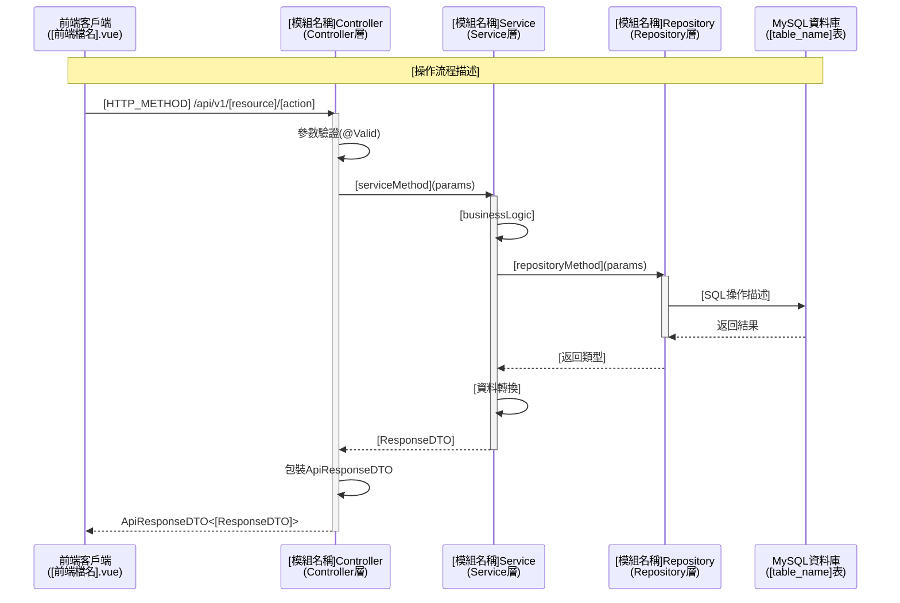
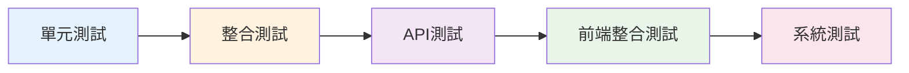

# SpringBoot開發完成簡要報告 - [模組名稱]

> **[專案名稱]** - [模組名稱]模組開發完成報告

<!-- 填寫說明：
- [專案名稱]：填入專案完整名稱
- [模組名稱]：填入模組功能名稱（中文）
- [模組代碼]：填入模組編號（如：A、B、C等）
-->

## 📋 專案概述

| 項目 | 內容 |
|------|------|
| **模組名稱** | [模組名稱中文] ([Module Name English]) |
| **模組代碼** | [模組代碼].模組名稱 |
| **開發日期** | YYYY-MM-DD |
| **報告版本** | v1.0.0 |
| **開發狀態** | ✅ 開發完成 / ⚠️ 進行中 / ❌ 未開始 |
| **測試狀態** | ✅ 測試完成 / ⚠️ 待測試 / ❌ 未測試 |
| **部署狀態** | ✅ 已部署 / ⚠️ 待部署 / ❌ 未部署 |

### 技術架構

| 技術組件 | 版本/規格 |
|---------|---------|
| **Java** | JDK [版本號] |
| **SpringBoot** | [版本號] |
| **Spring Data JPA** | [版本號] |
| **資料庫** | MySQL [版本號] / PostgreSQL [版本號] |
| **建構工具** | Maven [版本號] / Gradle [版本號] |
| **API文檔** | Swagger/OpenAPI 3 |
| **前端框架** | Vue [版本號] + [UI框架] |

---

## 🎯 功能摘要

### 核心功能實作清單

<!-- 填寫說明：
- 功能編號：使用模組代碼-序號格式（如：A-001, B-001）
- 功能名稱：簡述功能要點
- 實作狀態：✅ 完成 / ⚠️ 進行中 / ❌ 未開始
- API端點：填入完整API路徑
-->

| 功能編號 | 功能名稱 | 實作狀態 | API端點 |
|---------|---------|---------|---------|
| [代碼]-001 | [功能描述] | ✅ 完成 | `GET /api/v1/[resource]/[action]` |
| [代碼]-002 | [功能描述] | ✅ 完成 | `POST /api/v1/[resource]` |
| [代碼]-003 | [功能描述] | ✅ 完成 | `PUT /api/v1/[resource]/{id}` |
| [代碼]-004 | [功能描述] | ✅ 完成 | `DELETE /api/v1/[resource]/{id}` |

**總計**: [總數]個API端點 | ✅ 完成: [數量] | ⚠️ 待完成: [數量]

---

## 📊 API端點統計

### API端點清單

<!-- 填寫說明：
- 按HTTP方法分組列出所有API端點
- 權限需求：填入對應的權限代碼
-->

| HTTP方法 | 端點路徑 | 功能描述 | 權限需求 |
|---------|---------|----------|---------|
| GET | `/api/v1/[resource]` | [功能說明] | [PERMISSION_NAME] |
| GET | `/api/v1/[resource]/{id}` | [功能說明] | [PERMISSION_NAME] |
| POST | `/api/v1/[resource]` | [功能說明] | [PERMISSION_NAME] |
| PUT | `/api/v1/[resource]/{id}` | [功能說明] | [PERMISSION_NAME] |
| DELETE | `/api/v1/[resource]/{id}` | [功能說明] | [PERMISSION_NAME] |

**統計**: 
- GET: [數量]個
- POST: [數量]個
- PUT: [數量]個
- DELETE: [數量]個

---

## 🏗️ 生成的主要類別清單

### Entity層類別 ([數量]個)

<!-- 填寫說明：
- 列出所有Entity類別
- 標註對應的資料表名稱
- 狀態：✅ 已存在 / 🆕 新增 / 🔄 修改
-->

| 類別名稱 | 檔案路徑 | 功能描述 | 狀態 |
|---------|---------|----------|------|
| `[Entity名稱]Entity` | `com.tcci.thmcpa.entity.[Entity名稱]Entity` | [實體功能描述]，對應資料表 [table_name] | ✅ 已存在 |
| `AuditableEntity` | `com.tcci.thmcpa.entity.base.AuditableEntity` | 審計欄位介面，提供審計功能 | ✅ 已存在 |

### Enum枚舉類別 ([數量]個)

| 類別名稱 | 檔案路徑 | 功能描述 | 狀態 |
|---------|---------|----------|------|
| `[Enum名稱]Enum` | `com.tcci.thmcpa.enums.[Enum名稱]Enum` | [枚舉功能描述] | ✅ 已存在 |

### Repository層介面 ([數量]個)

| 類別名稱 | 檔案路徑 | 功能描述 | 狀態 |
|---------|---------|----------|------|
| `[模組名稱]Repository` | `com.tcci.thmcpa.repository.[模組名稱]Repository` | [模組名稱]資料存取層，繼承JpaRepository | ✅ 已存在 |

### DTO類別群 ([數量]個)

#### Request DTOs ([package名稱]包)
| 類別名稱 | 檔案路徑 | 功能描述 | 狀態 |
|---------|---------|----------|------|
| `[操作]RequestDTO` | `com.tcci.thmcpa.dto.[package]` | [請求DTO描述] | ✅ 已存在 |

#### Response DTOs
| 類別名稱 | 檔案路徑 | 功能描述 | 狀態 |
|---------|---------|----------|------|
| `[資料]ResponseDTO` | `com.tcci.thmcpa.dto.response` | [回應DTO描述] | ✅ 已存在 |
| `ApiResponseDTO` | `com.tcci.thmcpa.dto.response` | API統一回應格式 | ✅ 已存在 |

### Service層類別 ([數量]個)

| 類別名稱 | 檔案路徑 | 功能描述 | 狀態 |
|---------|---------|----------|------|
| `[模組名稱]Service` | `com.tcci.thmcpa.service.[模組名稱]Service` | [模組名稱]業務邏輯服務 | ✅ 已存在 |

### Controller層類別 ([數量]個)

| 類別名稱 | 檔案路徑 | 功能描述 | 狀態 |
|---------|---------|----------|------|
| `[模組名稱]Controller` | `com.tcci.thmcpa.controller.[模組名稱]Controller` | [模組名稱]REST API控制器 | ✅ 已存在 |

### Exception異常類別 ([數量]個)

| 類別名稱 | 檔案路徑 | 功能描述 | 狀態 |
|---------|---------|----------|------|
| `[模組名稱]BusinessException` | `com.tcci.thmcpa.exception` | [模組名稱]業務異常 | ✅ 已存在 |
| `[模組名稱]GlobalExceptionHandler` | `com.tcci.thmcpa.exception` | [模組名稱]全域異常處理器 | ✅ 已存在 |

---

## 🗄️ 資料庫設計對應

### Entity與資料表對應

<!-- 填寫說明：
- 列出所有Entity對應的資料表
- 詳細說明主鍵和索引設計
-->

| Entity類別 | 資料表名稱 | 主鍵 | 索引設計 | 狀態 |
|-----------|-----------|------|---------|------|
| `[Entity名稱]Entity` | `[table_name]` | `id` (BIGINT, AUTO_INCREMENT) | UK: ([欄位列表])<br>IX: [索引欄位]<br>IX: [索引欄位] | ✅ 對應 |

### 資料表結構確認

```sql
-- 填寫說明：貼上完整的CREATE TABLE語句
CREATE TABLE [table_name] (
    id BIGINT PRIMARY KEY AUTO_INCREMENT,
    [column_name] [DATA_TYPE] [CONSTRAINTS],
    -- ...其他欄位...
    creator BIGINT NOT NULL,
    createtime TIMESTAMP NOT NULL DEFAULT CURRENT_TIMESTAMP,
    modifier BIGINT,
    modifytime TIMESTAMP,
    
    CONSTRAINT uk_[table_name]_[columns] 
        UNIQUE ([column_list])
) ENGINE=InnoDB DEFAULT CHARSET=utf8mb4;
```

### JPA註解與資料表欄位對應

<!-- 填寫說明：
- 列出Entity所有欄位與資料表欄位的對應關係
- 標註JPA註解和驗證註解
-->

| Entity欄位 | 資料表欄位 | 資料型態 | JPA註解 | 驗證註解 |
|-----------|-----------|---------|---------|---------|
| `id` | `id` | BIGINT | `@Id @GeneratedValue` | - |
| `[fieldName]` | `[column_name]` | [DATA_TYPE] | `@Column(nullable=false)` | `@NotBlank` |
| `creator` | `creator` | BIGINT | `@CreatedBy` | `@NotNull` |
| `createtime` | `createtime` | TIMESTAMP | `@CreatedDate` | - |
| `modifier` | `modifier` | BIGINT | `@LastModifiedBy` | - |
| `modifytime` | `modifytime` | TIMESTAMP | `@LastModifiedDate` | - |

---

## 📐 主要類別關聯圖

### 架構層次關聯圖

```mermaid
graph TB
    subgraph "Presentation Layer - Controller"
        A[[模組名稱]Controller<br/>REST API端點]
    end
    
    subgraph "Business Layer - Service"
        B[[模組名稱]Service<br/>業務邏輯]
        C[相關Service<br/>輔助服務]
    end
    
    subgraph "Data Access Layer - Repository"
        D[[模組名稱]Repository<br/>資料存取]
    end
    
    subgraph "Domain Layer - Entity"
        E[[模組名稱]Entity<br/>實體模型]
        F[AuditableEntity<br/>審計介面]
    end
    
    subgraph "Support Layer"
        G[[相關]Enum<br/>枚舉]
        H[DTO Classes<br/>資料傳輸物件]
        I[Exception Handler<br/>異常處理]
    end
    
    A -->|依賴| B
    A -->|依賴| C
    A -->|使用| H
    A -->|異常處理| I
    B -->|依賴| D
    B -->|使用| G
    B -->|轉換| H
    D -->|操作| E
    E -->|實作| F
    E -->|關聯| G
    
    style A fill:#e1f5ff
    style B fill:#fff4e6
    style D fill:#f3e5f5
    style E fill:#e8f5e9
```

### 資料流程圖



### Entity關聯與繼承結構

```mermaid
classDiagram
    class BaseEntity {
        <<interface>>
        +Long getId()
        +void setId(Long id)
    }
    
    class AuditableEntity {
        <<interface>>
        +TcUser getCreator()
        +void setCreator(TcUser)
        +LocalDateTime getCreatetime()
        +void setCreatetime(LocalDateTime)
        +TcUser getModifier()
        +void setModifier(TcUser)
        +LocalDateTime getModifytime()
        +void setModifytime(LocalDateTime)
    }
    
    class [模組名稱]Entity {
        -Long id
        -[欄位類型] [欄位名稱]
        -TcUser creator
        -LocalDateTime createtime
        -TcUser modifier
        -LocalDateTime modifytime
        +equals(Object)
        +hashCode()
    }
    
    class [相關]Enum {
        <<enumeration>>
        [常數1]
        [常數2]
        -[屬性]
        +from[屬性]([類型])
        +isValid[屬性]([類型])
    }
    
    class TcUser {
        <<external>>
        -Long id
        -String username
        -String fullName
    }
    
    BaseEntity <|.. AuditableEntity : extends
    AuditableEntity <|.. [模組名稱]Entity : implements
    [模組名稱]Entity --> [相關]Enum : uses
    [模組名稱]Entity --> TcUser : creator/modifier
    
    note for [模組名稱]Entity "對應資料表: [table_name]\n唯一約束: ([約束欄位])"
    note for AuditableEntity "提供審計欄位:\ncreator, createtime\nmodifier, modifytime"
```

---

## ✅ 人工複核檢查清單

### 1. API規格一致性檢查

| 檢查項目 | 狀態 | 備註 |
|---------|------|------|
| API端點路徑與規格書一致 | ⬜ 待檢查 | 檢查是否使用正確的前綴和版本號 |
| HTTP方法使用正確 | ⬜ 待檢查 | GET/POST/PUT/DELETE 使用符合RESTful |
| 請求參數驗證註解完整 | ⬜ 待檢查 | 使用 @Valid, @NotBlank, @Pattern 等 |
| 回應格式符合規格 | ⬜ 待檢查 | 使用 ApiResponseDTO 統一格式 |
| 錯誤碼定義完整 | ⬜ 待檢查 | 業務異常包含錯誤碼 |
| Swagger文檔註解完整 | ⬜ 待檢查 | @Operation, @ApiResponses 完整標註 |

### 2. 資料庫整合檢查

| 檢查項目 | 狀態 | 備註 |
|---------|------|------|
| Entity與資料表對應正確 | ⬜ 待檢查 | @Table, @Column 註解正確 |
| 主鍵策略配置正確 | ⬜ 待檢查 | @GeneratedStrategy 正確配置 |
| 唯一約束設定正確 | ⬜ 待檢查 | @UniqueConstraint 設定符合業務 |
| 審計欄位實作完整 | ⬜ 待檢查 | 實作 AuditableEntity 介面 |
| Repository方法定義完整 | ⬜ 待檢查 | 包含查詢、更新、刪除等方法 |
| JPA查詢方法命名規範 | ⬜ 待檢查 | 遵循Spring Data JPA命名規範 |

### 3. 前端相容性檢查

| 檢查項目 | 狀態 | 備註 |
|---------|------|------|
| 回應格式與前端期望一致 | ⬜ 待檢查 | success, data, message 欄位完整 |
| 資料型態符合前端需求 | ⬜ 待檢查 | 數值、字串、日期格式正確 |
| 參數命名與前端統一 | ⬜ 待檢查 | 使用駝峰命名或底線命名 |
| Toast訊息對應完整 | ⬜ 待檢查 | 與前端的toast訊息一致 |
| 驗證邏輯與前端同步 | ⬜ 待檢查 | 空值、格式檢查與前端一致 |

### 4. 程式品質檢查

| 檢查項目 | 狀態 | 備註 |
|---------|------|------|
| 程式碼格式規範 | ⬜ 待檢查 | 遵循Java命名規範 |
| 日誌記錄完整 | ⬜ 待檢查 | 使用@Slf4j，關鍵操作有日誌 |
| 異常處理機制完善 | ⬜ 待檢查 | 全域異常處理器 + 業務異常 |
| 事務管理配置正確 | ⬜ 待檢查 | @Transactional 註解使用正確 |
| 程式碼註解清晰 | ⬜ 待檢查 | JavaDoc註解完整 |
| 權限控制設定 | ⬜ 待檢查 | @PreAuthorize 權限檢查 |

---

## 🔍 後續整合建議

### 1. 測試順序建議



#### 測試階段說明

**Phase 1: 單元測試**
- [ ] Repository層測試（資料存取）
- [ ] Service層測試（業務邏輯）
- [ ] DTO驗證測試
- [ ] Enum枚舉測試

**Phase 2: 整合測試**
- [ ] Service與Repository整合測試
- [ ] 資料庫事務測試
- [ ] 異常處理測試

**Phase 3: API測試**
- [ ] Controller端點測試（MockMvc）
- [ ] API回應格式驗證
- [ ] 參數驗證測試
- [ ] 權限控制測試

**Phase 4: 前端整合測試**
- [ ] 前端API調用測試
- [ ] 資料格式相容性測試
- [ ] 錯誤訊息顯示測試
- [ ] 操作流程端到端測試

**Phase 5: 系統測試**
- [ ] 效能測試（批次操作）
- [ ] 併發測試
- [ ] 壓力測試
- [ ] 安全性測試

### 2. 配置確認清單

**application.yml 配置檢查**
```yaml
spring:
  datasource:
    url: jdbc:mysql://localhost:3306/[database_name]?useUnicode=true&characterEncoding=utf-8
    username: ${DB_USERNAME:root}
    password: ${DB_PASSWORD:password}
    driver-class-name: com.mysql.cj.jdbc.Driver
  
  jpa:
    hibernate:
      ddl-auto: validate  # 生產環境必須使用 validate
      naming:
        physical-strategy: org.hibernate.boot.model.naming.CamelCaseToUnderscoresNamingStrategy
    show-sql: false       # 生產環境設為 false
    properties:
      hibernate:
        format_sql: true
        dialect: org.hibernate.dialect.MySQL8Dialect
```

**配置檢查清單**
- [ ] 資料庫連線參數正確
- [ ] JPA命名策略設定為駝峰轉底線
- [ ] Hibernate DDL模式設為 validate（生產環境）
- [ ] 日誌等級適合當前環境
- [ ] CORS設定符合前端網域
- [ ] 權限管理配置完整

### 3. 部署檢查事項

**部署前檢查**
- [ ] 資料庫表結構已建立
- [ ] 初始資料已匯入（如需要）
- [ ] 環境變數設定完成
- [ ] 日誌路徑可寫入
- [ ] 埠號未被佔用

**部署後驗證**
- [ ] 健康檢查端點正常（/actuator/health）
- [ ] Swagger UI可訪問（/swagger-ui.html）
- [ ] 資料庫連線正常
- [ ] API端點回應正常
- [ ] 前端整合正常

---

## ⚠️ 特別注意事項

### 1. [業務規則特殊處理]

<!-- 填寫說明：
- 描述模組中特殊的業務規則
- 說明與其他模組的關聯
- 標註需要特別注意的設計決策
-->

**[規則標題]**
- **原因**: [設計原因說明]
- **優點**: [優勢說明]
- **驗證**: [驗證方式]
- **查詢**: [查詢方式]

### 2. [資料處理特殊邏輯]

**[邏輯描述]**
- **適用場景**: [使用時機]
- **前端對應**: [前端相關處理]
- **錯誤處理**: [異常情況處理]

### 3. 權限控制配置

**權限定義**
```java
// Controller層權限註解
@PreAuthorize("hasAuthority('[MODULE]_VIEW')")    // 查詢權限
@PreAuthorize("hasAuthority('[MODULE]_CREATE')")  // 新增權限
@PreAuthorize("hasAuthority('[MODULE]_EDIT')")    // 編輯權限
@PreAuthorize("hasAuthority('[MODULE]_DELETE')")  // 刪除權限
```

**權限配置建議**
- 管理員（ADMIN）: 所有權限
- 經理（MANAGER）: VIEW + CREATE + EDIT + DELETE
- 使用者（USER）: VIEW + CREATE + EDIT
- 訪客（VIEWER）: 僅 VIEW

### 4. [與其他模組的整合]

<!-- 填寫說明：
- 說明與其他Service的整合方式
- 描述相依性和呼叫時機
-->

**[整合服務名稱]**
```java
// Service層整合方式
private final [OtherService] [otherService];

// 呼叫時機和檢查邏輯
[OtherServiceDTO] result = [otherService].[method](params);
if ([condition]) {
    throw new [ModuleName]BusinessException("[ERROR_CODE]", 
        "[錯誤訊息]");
}
```

### 5. 異常處理機制

**錯誤碼規範**
```
[MODULE]_001: [錯誤描述]
[MODULE]_002: [錯誤描述]
[MODULE]_003: [錯誤描述]
[MODULE]_004: [錯誤描述]
[MODULE]_005: [錯誤描述]
...
```

**異常處理層級**
1. **Controller層**: 參數驗證異常（@Valid）
2. **Service層**: 業務邏輯異常（[ModuleName]BusinessException）
3. **Repository層**: 資料存取異常（DataAccessException）
4. **全域處理器**: [ModuleName]GlobalExceptionHandler 統一處理

---

## 📋 檢查清單總結

### 開發完成度檢查

| 檢查類別 | 檢查項目 | 完成度 |
|---------|---------|--------|
| **Entity層** | Entity類別實作、審計欄位、驗證註解 | ⬜ [百分比]% |
| **Enum層** | 枚舉定義、轉換方法、驗證方法 | ⬜ [百分比]% |
| **Repository層** | Repository介面、查詢方法、自訂查詢 | ⬜ [百分比]% |
| **DTO層** | Request DTO、Response DTO、驗證註解 | ⬜ [百分比]% |
| **Service層** | 業務邏輯、資料驗證、事務管理 | ⬜ [百分比]% |
| **Controller層** | API端點、參數驗證、Swagger註解 | ⬜ [百分比]% |
| **Exception層** | 異常類別、全域處理器、錯誤碼 | ⬜ [百分比]% |
| **文檔** | JavaDoc註解、API文檔、README | ⬜ [百分比]% |

**總體完成度**: ⬜ **[百分比]%**

### 品質檢查通過率

| 檢查維度 | 通過項目 | 總項目 | 通過率 |
|---------|---------|--------|--------|
| API規格一致性 | [數量] | 6 | ⬜ [百分比]% |
| 資料庫整合 | [數量] | 6 | ⬜ [百分比]% |
| 前端相容性 | [數量] | 5 | ⬜ [百分比]% |
| 程式品質 | [數量] | 6 | ⬜ [百分比]% |

**總體品質**: ⬜ **[百分比]%**

---

## 🎯 下一步行動

### 立即執行項目

1. **⬜ 完成開發**: 完成所有功能開發
2. **⬜ 執行測試**: 按照測試順序建議執行測試
3. **⬜ 部署準備**: 確認配置和環境變數
4. **⬜ 前端整合**: 與前端Vue元件進行整合測試
5. **⬜ 文檔更新**: 更新README和部署文檔

### 長期優化項目

1. **效能優化**: 查詢效能調優、快取機制
2. **監控告警**: 設定監控指標和告警規則
3. **日誌優化**: 完善日誌輸出和分析
4. **安全加固**: API限流、防護措施
5. **使用者體驗**: 根據反饋優化功能

---

## 📞 支援資訊

### 開發團隊

| 角色 | 負責內容 | 聯絡方式 |
|-----|---------|---------|
| **系統架構師** | 整體架構設計、技術選型 | [聯絡資訊] |
| **後端開發** | SpringBoot應用程式開發 | [聯絡資訊] |
| **前端開發** | Vue應用程式開發 | [聯絡資訊] |
| **資料庫管理員** | 資料庫設計、效能調優 | [聯絡資訊] |
| **測試工程師** | 測試計畫、測試執行 | [聯絡資訊] |

### 相關文檔

| 文檔名稱 | 檔案路徑 |
|---------|---------|
| **API規格書** | `docs/03_Development/[模組代碼].[模組名稱]/([模組代碼])API規格書-[模組名稱].md` |
| **資料庫規格書** | `docs/03_Development/[模組代碼].[模組名稱]/([模組代碼])DB規格書-[模組名稱].md` |
| **設計規範文件** | `docs/11_Standards_and_Templates/Standards/Spring-Boot-api設計規範文件(生成API).md` |
| **前端Vue程式** | `frontend/src/views/[viewName].vue` |

---

## 📊 版本歷史

| 版本 | 日期 | 變更內容 | 作者 |
|------|------|----------|------|
| v1.0.0 | YYYY-MM-DD | 初始版本，完成開發報告 | [作者名稱] |

---

> 💡 **使用說明**: 
> 1. 本範本適用於SpringBoot模組開發完成後的報告撰寫
> 2. 請替換所有 `[佔位符]` 內容為實際資訊
> 3. 刪除不適用的章節或根據實際情況調整
> 4. 完成度和狀態請如實填寫，便於追蹤進度
> 5. Mermaid圖表請根據實際架構調整節點和關聯

---

**範本版本**: v1.0.0  
**範本建立日期**: 2025-10-06  
**適用專案**: SpringBoot + JPA + MySQL 架構
