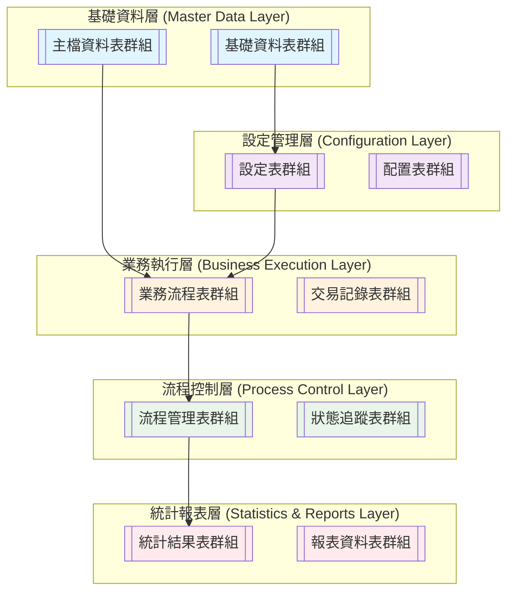

# [專案名稱] - 資料庫設計總覽文件

> 本文件為[專案名稱]([專案英文縮寫])完整的資料庫架構總覽，整合所有功能模組的資料表設計，並定義模組間的資料關聯關係。

## 📋 文檔資訊

| 項目 | 內容 |
|------|------|
| **文檔版本** | v0.1.0 |
| **最後更新** | [YYYY-MM-DD] |
| **系統名稱** | [專案中文名稱] ([專案英文縮寫] - [英文全名]) |
| **技術架構** | Spring Boot + JPA/Hibernate + PostgreSQL |
| **資料庫版本** | PostgreSQL 14+ |
| **負責單位** | 後端開發組 |

---

## 🎯 系統架構概述

### 業務背景
[描述系統的業務目標、主要功能領域和核心價值。說明系統採用的架構特色，如模組化設計、各模組間的關聯性等。]

### 技術特色
- **模組化架構**：各功能模組獨立開發與部署
- **統一資料標準**：遵循Spring Boot資料庫設計規範
- **完整稽核追蹤**：所有交易表包含完整稽核欄位
- **彈性權限控制**：支援[權限維度描述]的多維權限管理
- **資料一致性保證**：通過外鍵約束和業務規則確保資料完整性

---

## 📊 模組資料表設計文件清單

| 模組名稱 | 設計檔名 | 路徑 | 主要功能 | 狀態 |
|----------|----------|------|----------|------|
| **[模組1名稱]** | `db-design-[模組1].md` | `/docs/2.development/backend/db-design/` | [模組1主要功能描述] | ✅ 完成 |
| **[模組2名稱]** | `db-design-[模組2].md` | `/docs/2.development/backend/db-design/` | [模組2主要功能描述] | ✅ 完成 |
| **[模組3名稱]** | `db-design-[模組3].md` | `/docs/2.development/backend/db-design/` | [模組3主要功能描述] | 🔄 開發中 |
| **[模組N名稱]** | `db-design-[模組N].md` | `/docs/2.development/backend/db-design/` | [模組N主要功能描述] | ⏳ 規劃中 |

---

## 🏗️ 整體資料庫架構

### 架構分層


### 核心資料表統計

| 層級 | 資料表數量 | 主要功能 | 記錄數預估(年) |
|------|------------|----------|----------------|
| **基礎資料層** | [N] tables | [基礎資料功能描述] | [數量預估] |
| **設定管理層** | [N] tables | [設定管理功能描述] | [數量預估] |
| **業務執行層** | [N] tables | [業務執行功能描述] | [數量預估] |
| **流程控制層** | [N] tables | [流程控制功能描述] | [數量預估] |
| **統計報表層** | [N] tables | [統計報表功能描述] | [數量預估] |
| **總計** | **[總數] tables** | **[整體功能描述]** | **[總預估量]** |

---

## 📋 各模組資料表設計概覽

### 1. [模組1名稱]

#### 核心資料表
| 資料表名稱 | 中文名稱 | 表類型 | 主要功能 |
|------------|----------|--------|----------|
| `[TABLE_NAME_1]` | [中文表名1] | [主檔表/交易表] | [功能描述1] |
| `[TABLE_NAME_2]` | [中文表名2] | [主檔表/交易表] | [功能描述2] |
| `[TABLE_NAME_3]` | [中文表名3] | [主檔表/交易表] | [功能描述3] |

#### 關鍵特性
- [特性描述1]
- [特性描述2]
- [特性描述3]

### 2. [模組2名稱]

#### 核心資料表
| 資料表名稱 | 中文名稱 | 表類型 | 主要功能 |
|------------|----------|--------|----------|
| `[TABLE_NAME_A]` | [中文表名A] | [主檔表/交易表] | [功能描述A] |
| `[TABLE_NAME_B]` | [中文表名B] | [主檔表/交易表] | [功能描述B] |

#### 關鍵特性
- [特性描述A]
- [特性描述B]

### [模組N名稱]
> [依實際模組數量重複此段落結構]

---

## 🔗 模組間資料關聯關係

### 核心關聯圖
```mermaid
erDiagram
    %% 範例關聯定義
    [PRIMARY_TABLE] {
        bigint id PK
        varchar [business_key] UK
        varchar [description]
    }
    
    [RELATED_TABLE] {
        bigint id PK
        bigint [primary_table]_id FK
        varchar [related_field]
    }
    
    [TRANSACTION_TABLE] {
        bigint id PK
        bigint [primary_table]_id FK
        bigint [related_table]_id FK
        varchar status
    }
    
    %% 關聯關係定義
    [PRIMARY_TABLE] ||--o{ [RELATED_TABLE] : "[primary_table]_id"
    [PRIMARY_TABLE] ||--o{ [TRANSACTION_TABLE] : "[primary_table]_id"
    [RELATED_TABLE] ||--o{ [TRANSACTION_TABLE] : "[related_table]_id"
```

### 跨模組資料流


### 關鍵外鍵關聯

| 子表模組 | 子表名稱 | 父表模組 | 父表名稱 | 關聯欄位 | 關聯說明 |
|----------|----------|----------|----------|----------|----------|
| [模組A] | `[CHILD_TABLE_1]` | [模組B] | `[PARENT_TABLE_1]` | `[parent_table_1]_id` | [關聯說明1] |
| [模組C] | `[CHILD_TABLE_2]` | [模組D] | `[PARENT_TABLE_2]` | `[parent_table_2]_id` | [關聯說明2] |

---

## 🛡️ 資料一致性保證

### 統一命名規範

#### 資料表命名
- **主檔表前綴**：`CM_` (Common Master)
- **交易表前綴**：`[專案縮寫]_` (如：TH_)
- **命名風格**：大寫+底線分隔

#### 欄位命名標準
- **主鍵**：統一使用 `id` (BIGINT, AUTO_INCREMENT)
- **業務唯一鍵**：使用業務意義明確的欄位名
- **外鍵**：使用 `[referenced_table]_id` 格式
- **狀態欄位**：使用 `status` 或 `is_[condition]` 格式
- **時間欄位**：使用 `[action]_timestamp` 格式

#### 稽核欄位標準
所有交易表必須包含以下稽核欄位：
```sql
creator BIGINT NOT NULL,
createtime TIMESTAMP NOT NULL DEFAULT CURRENT_TIMESTAMP,
modifier BIGINT,
modifytime TIMESTAMP
```

### 約束設計原則

#### 主鍵約束
- 所有資料表必須有 `id` 主鍵欄位
- 使用 `BIGINT` 資料類型支援大量資料
- 使用 `AUTO_INCREMENT` 自動遞增

#### 外鍵約束
- 重要業務關聯必須建立外鍵約束
- 外鍵命名格式：`fk_[table_name]_[referenced_table]`
- 適當設定 `ON DELETE RESTRICT/CASCADE` 策略

#### 業務約束
- 重要枚舌欄位使用 `CHECK` 約束
- 數值欄位設定合理範圍約束
- 業務唯一性通過 `UNIQUE` 約束保證

---

## 📈 效能優化策略

### 索引設計原則

#### 主要索引類型
```sql
-- 1. 主鍵索引 (自動建立)
PRIMARY KEY (id)

-- 2. 唯一索引
CREATE UNIQUE INDEX uk_[table]_[columns] ON [table] ([unique_columns]);

-- 3. 一般索引  
CREATE INDEX ix_[table]_[columns] ON [table] ([indexed_columns]);

-- 4. 複合索引
CREATE INDEX ix_[table]_[col1]_[col2] ON [table] ([col1], [col2]);

-- 5. 外鍵索引
CREATE INDEX ix_[table]_[ref_table]_id ON [table] ([ref_table_id]);
```

#### 關鍵查詢優化
```sql
-- [業務場景1] 查詢優化
CREATE INDEX ix_[table]_[scenario1] ON [table] ([column1], [column2]);

-- [業務場景2] 查詢優化  
CREATE INDEX ix_[table]_[scenario2] ON [table] ([column3], [column4]);
```

### 效能監控
```sql
-- 資料表大小監控
SELECT 
    schemaname,
    tablename,
    ROUND(pg_total_relation_size(schemaname||'.'||tablename) / 1024 / 1024, 2) AS size_mb,
    pg_size_pretty(pg_total_relation_size(schemaname||'.'||tablename)) AS size_pretty
FROM pg_tables 
WHERE schemaname = '[schema_name]'
ORDER BY pg_total_relation_size(schemaname||'.'||tablename) DESC;
```

---

## 🔄 資料遷移與版本管理

### 版本升級策略

#### 結構變更管理
```sql
-- 版本控制表
CREATE TABLE db_version_history (
    id BIGSERIAL PRIMARY KEY,
    version_number VARCHAR(20) NOT NULL,
    migration_script TEXT NOT NULL,
    applied_at TIMESTAMP NOT NULL DEFAULT CURRENT_TIMESTAMP,
    applied_by VARCHAR(100) NOT NULL,
    execution_time_ms INTEGER,
    status VARCHAR(20) NOT NULL DEFAULT 'SUCCESS'
);
```

### 備份與恢復策略

#### 定期備份腳本
```bash
#!/bin/bash
# 資料庫備份腳本
DB_NAME="[專案資料庫名稱]"
BACKUP_DIR="/var/backups/postgresql"
DATE=$(date +%Y%m%d_%H%M%S)

# 完整備份
pg_dump -h localhost -U postgres -d $DB_NAME > "${BACKUP_DIR}/[專案名稱]_full_${DATE}.sql"
```

---

## 📊 系統監控與維護

### 資料庫健康檢查

#### 連線與查詢監控
```sql
-- 連線狀態監控
SELECT 
    state,
    COUNT(*) as connection_count
FROM pg_stat_activity 
WHERE datname = '[專案資料庫名稱]'
GROUP BY state;
```

### 定期維護作業

#### 週期性維護腳本
```sql
-- 統計資訊更新
ANALYZE;

-- 資料表清理
VACUUM ANALYZE;

-- 清理歷史資料 (超過[N]年)
DELETE FROM [history_table] 
WHERE [date_column] < CURRENT_DATE - INTERVAL '[N] years'
AND status = 'ARCHIVED';
```

---

## 🚀 未來擴展規劃

### 系統擴展方向

#### 1. [擴展方向1]
- [具體擴展內容1]
- [具體擴展內容2]

#### 2. [擴展方向2]
- [具體擴展內容A]
- [具體擴展內容B]

### 技術架構升級

#### 資料庫技術
- PostgreSQL 版本升級與新功能應用
- 讀寫分離與主從複製架構
- 分散式資料庫架構考量

#### 應用架構
- 容器化部署 (Docker/Kubernetes)
- 雲端化部署策略
- DevOps 自動化流程

---

## 📋 開發檢查清單

### 資料庫設計檢查

- [ ] **表命名規範**：所有表都使用正確的前綴
- [ ] **欄位命名一致**：主鍵統一使用 `id`，外鍵使用 `[table]_id`
- [ ] **稽核欄位完整**：所有交易表包含必要稽核欄位
- [ ] **約束設計合理**：主鍵、外鍵、唯一性、檢查約束都已正確設定
- [ ] **索引設計優化**：基於查詢模式建立適當的索引
- [ ] **資料類型統一**：相同性質的欄位使用一致的資料類型
- [ ] **業務規則約束**：重要的業務邏輯通過資料庫約束保證
- [ ] **文檔完整性**：每個模組都有完整的設計文檔

### 模組整合檢查

- [ ] **外鍵關聯正確**：跨模組的資料關聯已正確建立
- [ ] **資料流向清晰**：模組間的資料流向和依賴關係明確
- [ ] **介面定義統一**：跨模組的資料介面標準化
- [ ] **版本管理同步**：所有模組的版本與主系統保持同步

---

## 🎯 結論

[專案名稱]的資料庫設計採用模組化架構，通過統一的設計規範和標準，確保了各模組間的資料一致性和系統的可維護性。整體架構支援完整的[業務領域]業務流程，從[起始流程]到[結束流程]，形成了完整的業務閉環。

### 設計優勢
1. **模組化架構**：各模組相對獨立，便於維護和擴展
2. **統一規範**：遵循一致的命名和設計規範
3. **完整追蹤**：提供完整的稽核和歷史記錄
4. **效能優化**：通過適當的索引和分區策略確保查詢效能
5. **擴展性強**：預留了未來功能擴展的空間

### 技術特色
- 支援 Spring Boot + JPA/Hibernate 技術架構
- 完全相容 PostgreSQL 14+ 版本
- 提供完整的資料完整性保證
- 支援大規模資料的高效能查詢
- 具備良好的可維護性和可擴展性

本資料庫設計為[專案名稱]提供了穩固的資料基礎，支援系統的長期穩定運行和持續發展。

---
