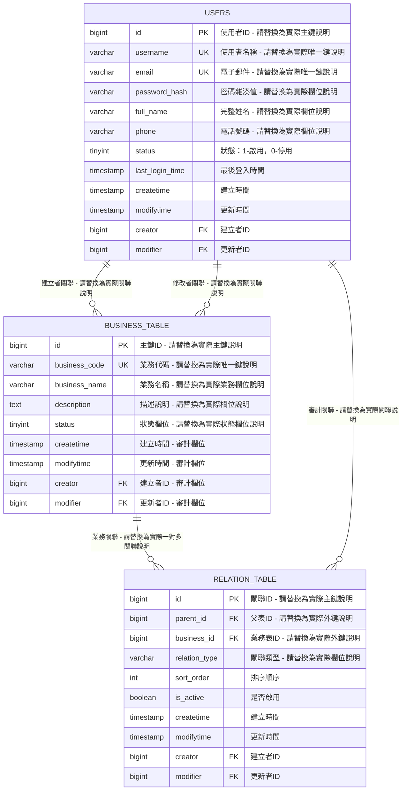

# [專案名稱] - 資料庫ERD圖表

## 📋 同步資訊
- **DDL版本**: schema.sql (最後更新: [YYYY-MM-DD])
- **ERD版本**: erd-diagram.md (生成時間: [YYYY-MM-DD])
- **資料表數量**: [N]個 ([table1], [table2], ...)
- **關聯關係數**: [N]個 ([relationship1], [relationship2], ...)
- **檢視數量**: [N]個 ([view1], [view2], ...)

## 🎯 ERD圖表

### 📝 ERD圖表設計說明

#### 🔄 範本替換指引

**重要**: 以上Mermaid圖表中的實體名稱和欄位都是範例，請依照以下規則替換：

1. **實體名稱替換**:
   - `USERS` → 替換為實際的使用者表名（大寫）
   - `BUSINESS_TABLE` → 替換為實際的業務表名（大寫）
   - `RELATION_TABLE` → 替換為實際的關聯表名（大寫）

2. **欄位資訊替換**:
   - `bigint id PK "使用者ID - 請替換為實際主鍵說明"` → `bigint id PK "實際主鍵說明"`
   - `varchar username UK "使用者名稱 - 請替換為實際唯一鍵說明"` → `varchar actual_column UK "實際唯一鍵說明"`
   - 移除所有 "請替換為..." 的提示文字

3. **關聯關係替換**:
   - `USERS ||--o{ BUSINESS_TABLE : "建立者關聯 - 請替換為實際關聯說明"` → `ACTUAL_PARENT ||--o{ ACTUAL_CHILD : "實際關聯說明"`

#### 實體命名規範
- **實體名稱**: 使用DDL中的資料表名稱(轉為大寫)
- **欄位標記**:
  * `PK`: Primary Key (主鍵)
  * `FK`: Foreign Key (外鍵)
  * `UK`: Unique Key (唯一鍵)
- **資料型別**: 直接使用DDL中定義的資料庫資料型別
- **欄位說明**: 提取DDL中的COMMENT註解作為說明

#### 關聯關係類型
- `||--o{`: 一對多 (父表對子表的典型關係)
- `}o--||`: 多對一 (子表對父表的參照關係)
- `||--||`: 一對一 (透過唯一外鍵識別)
- `}o--o{`: 多對多 (透過中間表識別)

#### 模組分組原則
- **核心實體優先**: 將業務核心表放在中央位置
- **依賴關係清晰**: 父表在上，子表在下，關聯線條清楚
- **模組化分組**: 相關功能的資料表就近擺放
- **避免交叉**: 最小化關聯線條的交叉，提高可讀性

## 📊 DDL同步檢查清單

### ✅ 已同步項目
- [ ] **所有CREATE TABLE語句已轉換為ERD實體**
  - [table_name1] → [TABLE_NAME1]
  - [table_name2] → [TABLE_NAME2]
  - [...其他資料表]

- [ ] **PRIMARY KEY約束已標記為PK**
  - [TABLE_NAME1].id ([data_type] AUTO_INCREMENT)
  - [TABLE_NAME2].id ([data_type] AUTO_INCREMENT)
  - [...其他主鍵]

- [ ] **FOREIGN KEY約束已轉換為關聯關係**
  - [fk_constraint_name1]: [child_table].[fk_column] → [parent_table].id
  - [fk_constraint_name2]: [child_table].[fk_column] → [parent_table].id
  - [...其他外鍵約束]

- [ ] **UNIQUE KEY約束已標記為UK**
  - [TABLE_NAME1].[unique_column] ([constraint_name])
  - [TABLE_NAME2].[unique_column] ([constraint_name])
  - [...其他唯一約束]

- [ ] **COMMENT註解已提取為欄位說明**
  - 所有欄位的業務說明已正確對應

- [ ] **資料型別定義已正確對應**
  - [列出主要使用的資料型別，如：BIGINT、VARCHAR、INT、TEXT、BOOLEAN、TIMESTAMP、DATE等]

- [ ] **CHECK約束已反映在說明中**
  - [constraint_column] 的有效值範圍
  - [business_rule_column] 的業務規則限制
  - [...其他CHECK約束]

### 🔄 索引設計摘要

#### [TABLE_NAME1] 表索引
- PRIMARY KEY: id
- UNIQUE KEY: [uk_constraint_name] ([column_name])
- INDEX: [idx_name] ([column_list])
- 複合索引: [idx_composite_name] ([column1], [column2], ...)

#### [TABLE_NAME2] 表索引
- PRIMARY KEY: id
- UNIQUE KEY: [uk_constraint_name] ([column_list])
- INDEX: [idx_name] ([column_name])
- INDEX: [idx_name2] ([column_name2])
- 複合索引: [idx_composite_name] ([column1], [column2], ...)

### 📋 業務規則約束

#### CHECK約束驗證
1. **[column_name1]** 限制值:
   - '[value1]' ([description1])
   - '[value2]' ([description2])
   - '[value3]' ([description3])

2. **[column_name2]** 限制值:
   - '[value1]' ([description1])
   - '[value2]' ([description2])

3. **資料範圍約束**:
   - [column_name]: [min_value]-[max_value]
   - [sort_order_column]: >= 0
   - [end_date_column] >= [start_date_column]

### 🔧 預存程序與函數

#### 預存程序
1. **[sp_procedure_name1]**: [procedure_description]
2. **[sp_procedure_name2]**: [procedure_description]

#### 函數
1. **[fn_function_name1]**: [function_description]
2. **[fn_function_name2]**: [function_description]

#### 觸發器
1. **[tr_trigger_name1]**: [trigger_description]
2. **[tr_trigger_name2]**: [trigger_description]

### 📈 檢視定義

#### 業務檢視
1. **[v_view_name1]**: [view_description]
2. **[v_view_name2]**: [view_description]
3. **[v_view_name3]**: [view_description]

## 🔄 後續維護指引

### 當schema.sql有異動時的更新步驟:

1. **備份現有ERD**: 保留當前版本作為參考
2. **解析新DDL**: 識別變更的資料表和欄位
3. **更新ERD圖表**: 反映新的結構變更
4. **驗證關聯關係**: 確認外鍵約束正確對應
5. **更新同步資訊**: 修改版本號和更新時間
6. **測試驗證**: 確保ERD圖表能正確渲染

### 維護檢查清單:
- [ ] DDL中的所有資料表都反映在ERD中
- [ ] 所有外鍵關係都正確建立關聯線
- [ ] 欄位型別和約束與DDL完全一致
- [ ] 新增的CHECK約束已反映在說明中
- [ ] 索引設計已更新到文檔中
- [ ] 版本號和時間戳已更新

---

## 📖 範本使用說明

### 🔧 如何使用此範本

#### 1. 檔案命名
將範本檔案重新命名為：`[實際專案名稱]-db規格書-ERD圖形.md`

#### 2. 基本資訊替換
- `[專案名稱]` → 實際專案名稱
- `[YYYY-MM-DD]` → 實際日期
- `[N]` → 實際數量

#### 3. Mermaid ERD圖表替換 ⚠️ 重要
**第一步**: 替換實體名稱
- `USERS` → 實際使用者表名（如：`SYS_USERS`、`MEMBERS`等）
- `BUSINESS_TABLE` → 實際業務表名（如：`ORDERS`、`PRODUCTS`等）
- `RELATION_TABLE` → 實際關聯表名（如：`ORDER_ITEMS`、`USER_ROLES`等）

**第二步**: 替換欄位資訊
- 將所有 `"說明 - 請替換為實際..."` 改為實際的欄位說明
- 根據實際DDL調整資料型別（bigint, varchar, int等）
- 根據實際DDL調整欄位名稱

**第三步**: 替換關聯關係
- 根據實際外鍵約束調整關聯線
- 更新關聯說明文字

#### 4. 約束資訊替換
- `[fk_constraint_name]` → 實際外鍵約束名稱
- `[uk_constraint_name]` → 實際唯一約束名稱
- `[idx_name]` → 實際索引名稱
- `[constraint_column]` → 實際約束欄位名稱

#### 5. 業務規則替換
- `[value1]`, `[value2]` → CHECK約束的實際有效值
- `[description1]`, `[description2]` → 約束值的業務說明
- `[min_value]`, `[max_value]` → 數值範圍約束

#### 6. 預存程序與檢視替換
- `[sp_procedure_name]` → 實際預存程序名稱
- `[fn_function_name]` → 實際函數名稱
- `[tr_trigger_name]` → 實際觸發器名稱
- `[v_view_name]` → 實際檢視名稱
- `[procedure_description]` → 預存程序功能說明

#### 7. 資料庫名稱替換
- `[database_name]` → 實際資料庫名稱

### 📋 檢查清單

使用範本前請確認：
- [ ] 已獲得完整的DDL檔案(schema.sql)
- [ ] 已了解專案的資料庫架構和業務邏輯
- [ ] 已確認資料表間的關聯關係
- [ ] 已收集所有約束條件和業務規則
- [ ] 已準備預存程序、函數、檢視等物件資訊

使用範本後請驗證：
- [ ] 所有佔位符都已替換為實際內容
- [ ] **Mermaid ERD語法正確，能正常渲染** ⚠️ 重要
- [ ] 實體名稱符合Mermaid語法規範（無特殊字元、括號等）
- [ ] 資料表關聯關係正確對應DDL外鍵約束
- [ ] 欄位型別和約束與DDL完全一致
- [ ] 業務規則和CHECK約束正確反映
- [ ] 索引資訊完整且準確
- [ ] 移除所有 "請替換為..." 的提示文字

---

**📝 維護記錄**
- 範本版本: 2025-08-31 (基於thmcpa專案ERD架構)
- 適用範圍: 所有使用MySQL的資料庫專案
- Mermaid語法: 已修正語法錯誤，確保正常渲染
- 下次更新: 根據使用回饋和最佳實務演進
