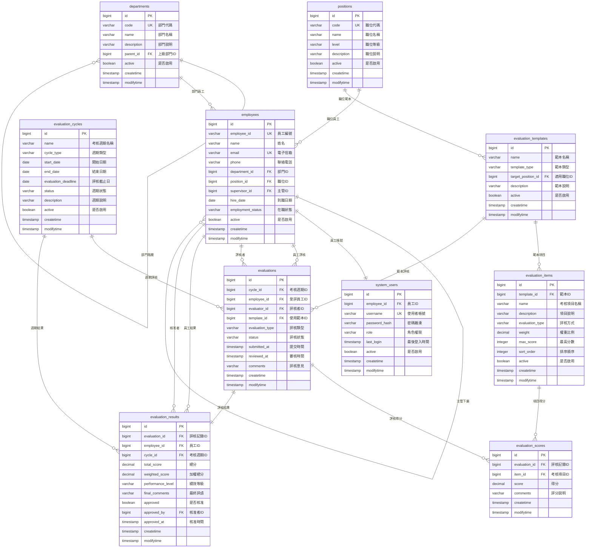
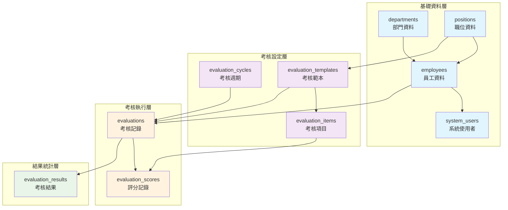

# 達航船員考評系統 Database 設計文檔

> 此文檔提供達航船員考評系統完整的資料庫設計規格，包含資料表結構、關聯性與索引設計

## 📋 文檔資訊

| 項目 | 內容 |
|------|------|
| **專案名稱** | `thmcpa (達航船員考評系統)` |
| **資料庫模組** | `Performance Evaluation Database` |
| **版本** | `v1.0.0` |
| **最後更新** | `2025年8月16日` |
| **負責人** | `Database Architect` |
| **審核者** | `System Architect` |

---

## 🎯 資料庫設計說明

### 核心功能
此資料庫系統支援達航公司員工績效考核管理，包含員工資料管理、考核項目設定、考核週期管理、評分記錄與結果統計分析。

### 業務背景
為提升達航公司人力資源管理效率，建立標準化的員工績效考核流程，支援多維度評估、自動化計算與報表產出。

### 技術特色
- **標準化資料結構**: 遵循企業級資料庫設計規範
- **彈性擴展性**: 支援考核項目與評分標準動態調整
- **資料完整性**: 完整的外鍵約束與資料驗證
- **效能優化**: 合理的索引設計與查詢優化

---

## 🗄️ 資料表總覽

| 資料表名稱 | 中文名稱 | 主要功能 | 記錄數預估 |
|------------|----------|----------|------------|
| `departments` | 部門資料表 | 組織架構管理 | 50+ |
| `positions` | 職位資料表 | 職位級別管理 | 100+ |
| `employees` | 員工資料表 | 員工基本資料 | 1000+ |
| `evaluation_cycles` | 考核週期表 | 考核時程管理 | 12/年 |
| `evaluation_templates` | 考核範本表 | 考核項目範本 | 10+ |
| `evaluation_items` | 考核項目表 | 具體考核項目 | 100+ |
| `evaluations` | 考核記錄表 | 考核實例記錄 | 10000+/年 |
| `evaluation_scores` | 評分記錄表 | 詳細評分資料 | 50000+/年 |
| `evaluation_results` | 考核結果表 | 最終考核結果 | 10000+/年 |
| `system_users` | 系統使用者表 | 系統登入管理 | 1000+ |

---

## 🏗️ 資料庫架構

### 核心資料表分層
| 層級 | 資料表群組 | 職責描述 |
|------|------------|----------|
| **基礎資料層** | departments, positions, employees | 組織架構與人員基礎資料 |
| **考核設定層** | evaluation_cycles, evaluation_templates, evaluation_items | 考核制度與項目設定 |
| **考核執行層** | evaluations, evaluation_scores | 考核過程資料記錄 |
| **結果統計層** | evaluation_results | 考核結果與統計分析 |
| **系統管理層** | system_users | 系統存取控制 |


---

## 📊 Entity Relationship Diagram (ERD)

### 核心實體關聯圖


### 系統架構關聯圖


---

## 📋 資料表詳細規格

### 1. departments (部門資料表)
| 欄位名稱 | 資料型態 | 約束條件 | 描述 | 範例 |
|----------|----------|----------|------|------|
| `id` | BIGINT | PK, AUTO_INCREMENT | 部門唯一識別碼 | `1` |
| `code` | VARCHAR(20) | NOT NULL, UNIQUE | 部門代碼 | `IT001` |
| `name` | VARCHAR(100) | NOT NULL | 部門名稱 | `資訊技術部` |
| `description` | TEXT | NULL | 部門說明 | `負責公司資訊系統開發維護` |
| `parent_id` | BIGINT | FK, NULL | 上級部門ID | `NULL` |
| `active` | BOOLEAN | NOT NULL, DEFAULT TRUE | 是否啟用 | `true` |
| `createtime` | TIMESTAMP | NOT NULL, DEFAULT CURRENT_TIMESTAMP | 建立時間 | `2024-01-01 10:00:00` |
| `modifytime` | TIMESTAMP | NOT NULL, DEFAULT CURRENT_TIMESTAMP ON UPDATE | 更新時間 | `2024-01-01 10:00:00` |

### 2. employees (員工資料表)
| 欄位名稱 | 資料型態 | 約束條件 | 描述 | 範例 |
|----------|----------|----------|------|------|
| `id` | BIGINT | PK, AUTO_INCREMENT | 員工唯一識別碼 | `1001` |
| `employee_id` | VARCHAR(20) | NOT NULL, UNIQUE | 員工編號 | `EMP001` |
| `name` | VARCHAR(50) | NOT NULL | 姓名 | `張三` |
| `email` | VARCHAR(100) | NOT NULL, UNIQUE | 電子信箱 | `zhang.san@thmcpa.com` |
| `phone` | VARCHAR(20) | NULL | 聯絡電話 | `0912-345-678` |
| `department_id` | BIGINT | FK, NOT NULL | 部門ID | `1` |
| `position_id` | BIGINT | FK, NOT NULL | 職位ID | `1` |
| `supervisor_id` | BIGINT | FK, NULL | 主管ID | `1000` |
| `hire_date` | DATE | NOT NULL | 到職日期 | `2024-01-01` |
| `employment_status` | VARCHAR(20) | NOT NULL, DEFAULT 'ACTIVE' | 在職狀態 | `ACTIVE` |
| `active` | BOOLEAN | NOT NULL, DEFAULT TRUE | 是否啟用 | `true` |
| `createtime` | TIMESTAMP | NOT NULL, DEFAULT CURRENT_TIMESTAMP | 建立時間 | `2024-01-01 10:00:00` |
| `modifytime` | TIMESTAMP | NOT NULL, DEFAULT CURRENT_TIMESTAMP ON UPDATE | 更新時間 | `2024-01-01 10:00:00` |


---

## 📊 資料字典

### 狀態欄位定義
| 欄位名稱 | 可能值 | 描述 |
|----------|--------|------|
| employment_status | ACTIVE, INACTIVE, TERMINATED | 在職狀態 |
| evaluation_status | DRAFT, SUBMITTED, REVIEWED, COMPLETED, CANCELLED | 考核狀態 |
| cycle_status | PLANNING, ACTIVE, COMPLETED, CLOSED | 週期狀態 |
| performance_level | EXCELLENT, GOOD, SATISFACTORY, NEEDS_IMPROVEMENT, UNSATISFACTORY | 績效等級 |

### 代碼標準
| 類型 | 格式 | 範例 | 說明 |
|------|------|------|------|
| 部門代碼 | [部門類別][3位數字] | IT001, HR001, FN001 | 部門類別+流水號 |
| 員工編號 | EMP[4位數字] | EMP0001, EMP1234 | EMP+流水號 |
| 職位代碼 | [職位等級][3位數字] | MGR001, ENG001, AST001 | 職位等級+流水號 |

---

## 📋 初始化資料

### 基礎部門資料
```sql
INSERT INTO departments (code, name, description, parent_id, active) VALUES
('CORP', '達航總公司', '集團總部', NULL, true),
('IT', '資訊技術部', '負責資訊系統開發維護', 1, true),
('HR', '人力資源部', '負責人事管理', 1, true),
('FN', '財務部', '負責財務管理', 1, true);
```

### 基礎職位資料
```sql
INSERT INTO positions (code, name, level, description, active) VALUES
('CEO', '執行長', 'EXECUTIVE', '公司最高主管', true),
('MGR', '部門經理', 'MANAGER', '部門管理職', true),
('ENG', '工程師', 'PROFESSIONAL', '技術專業職', true),
('AST', '助理', 'ASSISTANT', '行政助理職', true);
```

---

## 📝 開發指南

### 命名規範
- **資料表名稱**: 複數形式，使用底線分隔 (如: `evaluation_results`)
- **欄位名稱**: 小寫，使用底線分隔 (如: `employee_id`)
- **索引名稱**: `idx_` 前綴 + 資料表 + 欄位 (如: `idx_employees_dept`)
- **外鍵名稱**: `fk_` 前綴 + 資料表 + 參考欄位 (如: `fk_employees_department`)

### 最佳實踐
1. **使用適當的資料型態**: 避免過度設計，選擇合適的欄位長度
2. **建立必要的索引**: 基於查詢模式建立索引，避免過度索引
3. **維護參考完整性**: 正確設定外鍵約束
4. **記錄變更歷史**: 重要資料表包含 createtime, modifytime 欄位
5. **軟刪除機制**: 使用 active 欄位而非實際刪除記錄

---

## 🔄 版本歷史

| 版本 | 日期 | 異動內容 | 負責人 |
|------|------|----------|--------|
| v1.0.0 | 2024-01-15 | 初始資料庫設計完成 | Database Architect |
| v1.1.0 | 2024-02-01 | 新增效能優化索引 | Database Architect |
| v1.2.0 | 2024-03-01 | 優化外鍵約束設計 | Database Architect |

---

> 💡 **使用說明**: 此文檔為達航船員考評系統資料庫設計的完整規格，開發團隊應依據此規格進行資料庫建置與維護作業。