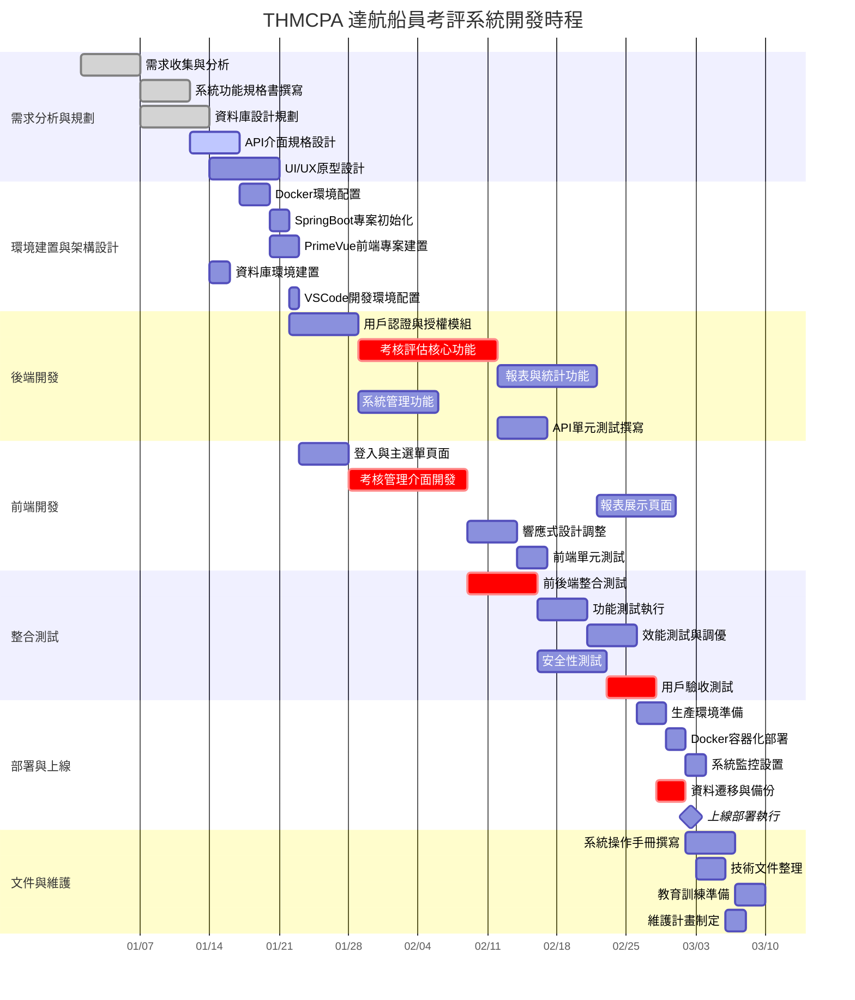
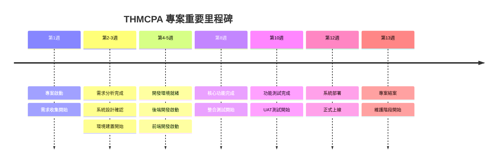
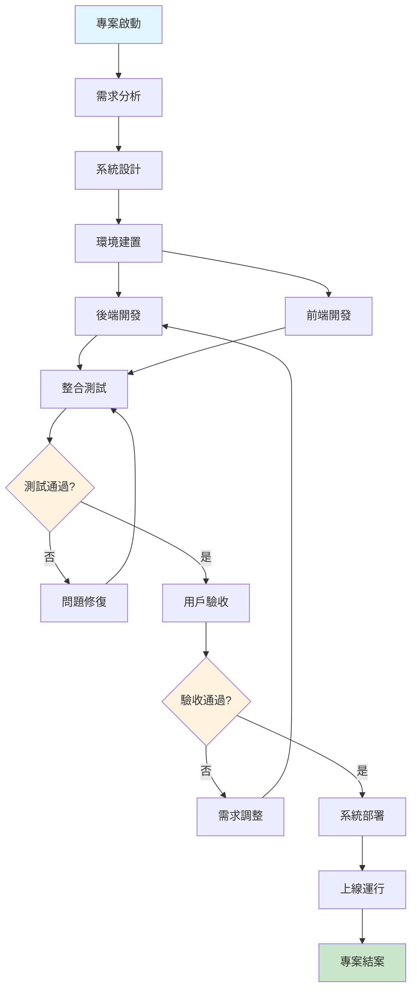
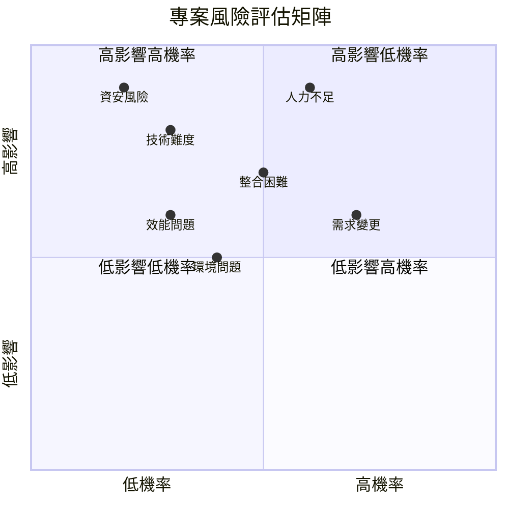

# THMCPA 達航船員考評系統 - 專案管理範本

## 專案基本資訊
- **專案名稱**: THMCPA 達航船員考評系統
- **專案類型**: 前後端分離 WEB 系統
- **技術棧**: PrimeVue 3 + SpringBoot 3 + Docker
- **專案經理**: [待填入]
- **開始日期**: [YYYY-MM-DD]
- **預計完成日期**: [YYYY-MM-DD]

---

## 專案甘特圖

---

## 專案里程碑時程圖

---

## 專案架構流程圖

---

## 專案階段與工作項目清單

### 第一階段：需求分析與規劃
| 任務編號 | 任務名稱 | 負責人 | 開始日期 | 結束日期 | 狀態 | 優先級 | 備註 |
|---------|---------|--------|----------|----------|------|--------|------|
| 1.1 | 需求收集與分析 | [姓名] | YYYY-MM-DD | YYYY-MM-DD | 待開始 | 高 | 與業務單位訪談 |
| 1.2 | 系統功能規格書撰寫 | [姓名] | YYYY-MM-DD | YYYY-MM-DD | 待開始 | 高 | 包含功能清單與流程圖 |
| 1.3 | 資料庫設計規劃 | [姓名] | YYYY-MM-DD | YYYY-MM-DD | 待開始 | 高 | ER圖與資料表設計 |
| 1.4 | API介面規格設計 | [姓名] | YYYY-MM-DD | YYYY-MM-DD | 待開始 | 高 | RESTful API 文件 |
| 1.5 | UI/UX 原型設計 | [姓名] | YYYY-MM-DD | YYYY-MM-DD | 待開始 | 中 | Figma 或其他設計工具 |

### 第二階段：環境建置與架構設計
| 任務編號 | 任務名稱 | 負責人 | 開始日期 | 結束日期 | 狀態 | 優先級 | 備註 |
|---------|---------|--------|----------|----------|------|--------|------|
| 2.1 | Docker 環境配置 | [姓名] | YYYY-MM-DD | YYYY-MM-DD | 待開始 | 高 | 包含開發與生產環境 |
| 2.2 | SpringBoot 專案初始化 | [姓名] | YYYY-MM-DD | YYYY-MM-DD | 待開始 | 高 | Maven 依賴管理 |
| 2.3 | PrimeVue 前端專案建置 | [姓名] | YYYY-MM-DD | YYYY-MM-DD | 待開始 | 高 | Vue 3 + Vite 配置 |
| 2.4 | 資料庫環境建置 | [姓名] | YYYY-MM-DD | YYYY-MM-DD | 待開始 | 高 | 含測試資料準備 |
| 2.5 | VSCode 開發環境配置 | [姓名] | YYYY-MM-DD | YYYY-MM-DD | 待開始 | 中 | 插件與偵錯設定 |

### 第三階段：後端開發
| 任務編號 | 任務名稱 | 負責人 | 開始日期 | 結束日期 | 狀態 | 優先級 | 備註 |
|---------|---------|--------|----------|----------|------|--------|------|
| 3.1 | 用戶認證與授權模組 | [姓名] | YYYY-MM-DD | YYYY-MM-DD | 待開始 | 高 | JWT Token 實作 |
| 3.2 | 考核評估核心功能 | [姓名] | YYYY-MM-DD | YYYY-MM-DD | 待開始 | 高 | 主要業務邏輯 |
| 3.3 | 報表與統計功能 | [姓名] | YYYY-MM-DD | YYYY-MM-DD | 待開始 | 中 | 數據分析與導出 |
| 3.4 | 系統管理功能 | [姓名] | YYYY-MM-DD | YYYY-MM-DD | 待開始 | 中 | 用戶、角色、權限管理 |
| 3.5 | API 單元測試撰寫 | [姓名] | YYYY-MM-DD | YYYY-MM-DD | 待開始 | 中 | JUnit 測試案例 |

### 第四階段：前端開發
| 任務編號 | 任務名稱 | 負責人 | 開始日期 | 結束日期 | 狀態 | 優先級 | 備註 |
|---------|---------|--------|----------|----------|------|--------|------|
| 4.1 | 登入與主選單頁面 | [姓名] | YYYY-MM-DD | YYYY-MM-DD | 待開始 | 高 | 包含路由設定 |
| 4.2 | 考核管理介面開發 | [姓名] | YYYY-MM-DD | YYYY-MM-DD | 待開始 | 高 | CRUD 操作介面 |
| 4.3 | 報表展示頁面 | [姓名] | YYYY-MM-DD | YYYY-MM-DD | 待開始 | 中 | 圖表與數據視覺化 |
| 4.4 | 響應式設計調整 | [姓名] | YYYY-MM-DD | YYYY-MM-DD | 待開始 | 中 | 手機版適配 |
| 4.5 | 前端單元測試 | [姓名] | YYYY-MM-DD | YYYY-MM-DD | 待開始 | 低 | Vitest 測試框架 |

### 第五階段：整合測試
| 任務編號 | 任務名稱 | 負責人 | 開始日期 | 結束日期 | 狀態 | 優先級 | 備註 |
|---------|---------|--------|----------|----------|------|--------|------|
| 5.1 | 前後端整合測試 | [姓名] | YYYY-MM-DD | YYYY-MM-DD | 待開始 | 高 | API 對接驗證 |
| 5.2 | 功能測試執行 | [姓名] | YYYY-MM-DD | YYYY-MM-DD | 待開始 | 高 | 測試案例執行 |
| 5.3 | 效能測試與調優 | [姓名] | YYYY-MM-DD | YYYY-MM-DD | 待開始 | 中 | 壓力測試 |
| 5.4 | 安全性測試 | [姓名] | YYYY-MM-DD | YYYY-MM-DD | 待開始 | 高 | 漏洞掃描與修復 |
| 5.5 | 用戶驗收測試 | [姓名] | YYYY-MM-DD | YYYY-MM-DD | 待開始 | 高 | UAT 執行 |

### 第六階段：部署與上線
| 任務編號 | 任務名稱 | 負責人 | 開始日期 | 結束日期 | 狀態 | 優先級 | 備註 |
|---------|---------|--------|----------|----------|------|--------|------|
| 6.1 | 生產環境準備 | [姓名] | YYYY-MM-DD | YYYY-MM-DD | 待開始 | 高 | 伺服器配置 |
| 6.2 | Docker 容器化部署 | [姓名] | YYYY-MM-DD | YYYY-MM-DD | 待開始 | 高 | 打包與部署 |
| 6.3 | 系統監控設置 | [姓名] | YYYY-MM-DD | YYYY-MM-DD | 待開始 | 中 | 日誌與監控配置 |
| 6.4 | 資料遷移與備份 | [姓名] | YYYY-MM-DD | YYYY-MM-DD | 待開始 | 高 | 資料安全確保 |
| 6.5 | 上線部署執行 | [姓名] | YYYY-MM-DD | YYYY-MM-DD | 待開始 | 高 | 正式上線 |

### 第七階段：文件與維護
| 任務編號 | 任務名稱 | 負責人 | 開始日期 | 結束日期 | 狀態 | 優先級 | 備註 |
|---------|---------|--------|----------|----------|------|--------|------|
| 7.1 | 系統操作手冊撰寫 | [姓名] | YYYY-MM-DD | YYYY-MM-DD | 待開始 | 中 | 使用者指南 |
| 7.2 | 技術文件整理 | [姓名] | YYYY-MM-DD | YYYY-MM-DD | 待開始 | 中 | 開發與維護文件 |
| 7.3 | 教育訓練準備 | [姓名] | YYYY-MM-DD | YYYY-MM-DD | 待開始 | 中 | 培訓材料製作 |
| 7.4 | 維護計畫制定 | [姓名] | YYYY-MM-DD | YYYY-MM-DD | 待開始 | 低 | 後續維護規劃 |

---

## 風險管理矩陣圖

---

## 狀態說明
- **待開始**: 尚未開始執行
- **進行中**: 正在執行中
- **已完成**: 已完成
- **延期**: 超過預定時間
- **暫停**: 暫時停止

## 優先級說明
- **高**: 關鍵路徑，影響專案進度
- **中**: 重要但可彈性調整
- **低**: 可延後處理

---

## 里程碑檢核點
- [ ] 需求確認完成 (第一階段結束)
- [ ] 開發環境就緒 (第二階段結束)
- [ ] 後端核心功能完成 (第三階段結束)
- [ ] 前端主要功能完成 (第四階段結束)
- [ ] 整合測試通過 (第五階段結束)
- [ ] 系統正式上線 (第六階段結束)
- [ ] 專案結案 (第七階段結束)

## 使用說明
1. 請根據實際專案時程調整甘特圖中的日期
2. 定期更新任務狀態和進度
3. 關注關鍵路徑 (crit) 標記的任務
4. 及時識別和處理風險項目
5. 確保里程碑按時達成