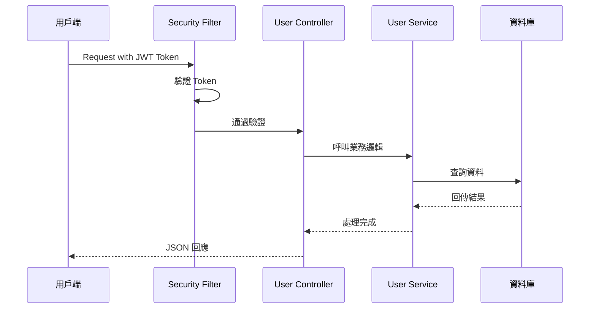
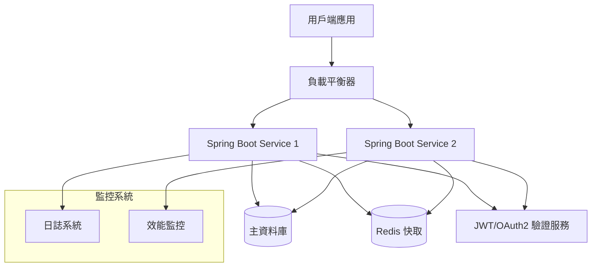

# REST API 規格文件範本 (Spring Boot)

> **📋 使用說明**: 此為 Spring Boot REST API 規格文件範本，適用於 AI 生成和開發人員溝通。
> 請根據實際需求替換 `【】` 內的內容，並刪除不需要的章節。

---

## 1. 基本資訊
- **API 名稱**: 【API名稱，如：使用者管理 API】
- **版本**: 【版本號，如：v1.0】
- **Base URL**: `【基礎URL，如：https://api.example.com/api/v1】`
- **作者**: 【開發者姓名】
- **建立日期**: 【YYYY-MM-DD】
- **最後更新**: 【YYYY-MM-DD】
- **聯絡方式**: 【email@example.com】

---

## 2. API 概述
### 2.1 功能說明
【描述此 API 的主要功能和用途，如：此 API 負責提供使用者 CRUD 操作及驗證功能】

### 2.2 技術架構
- **框架**: Spring Boot 3.x
- **資料庫**: 【如：MySQL 8.0 / PostgreSQL】
- **快取**: 【如：Redis / 無】
- **驗證方式**: 【如：JWT / OAuth2 / Spring Security】
- **部署環境**: 【如：Docker / Kubernetes / Cloud】

---

## 3. 認證與授權
### 3.1 認證方式
- **類型**: Bearer Token (JWT)
- **Header**: `Authorization: Bearer <token>`
- **Token 有效期**: 【如：24小時】
- **更新機制**: 【如：Refresh Token / 重新登入】

### 3.2 權限等級
| 角色 | 權限 | 說明 |
|------|------|------|
| 【admin】 | 【CRUD】 | 【管理員，具備所有操作權限】 |
| 【user】 | 【R】 | 【一般使用者，僅能查看】 |

---

## 4. 資料模型

### 4.1 User (使用者)
```json
{
  "id": "integer - 使用者 ID，自動生成",
  "name": "string(50) - 使用者姓名，必填",
  "email": "string(100) - 電子信箱，必填且唯一",
  "role": "string(20) - 角色，預設 'user'",
  "status": "string(10) - 狀態：active/inactive",
  "created_at": "datetime - 建立時間",
  "updated_at": "datetime - 更新時間"
}
```

### 4.2 【其他資料模型】
```json
{
  "【欄位名】": "【型別】 - 【說明】"
}
```

---

## 5. API 清單

| 功能 | Method | Path | 權限 | 說明 |
|------|--------|------|------|------|
| 取得全部使用者 | GET | `/users` | admin | 取得使用者列表 |
| 取得單一使用者 | GET | `/users/{id}` | user | 依 ID 取得使用者 |
| 新增使用者 | POST | `/users` | admin | 建立新使用者 |
| 更新使用者 | PUT | `/users/{id}` | admin | 更新使用者資料 |
| 刪除使用者 | DELETE | `/users/{id}` | admin | 刪除使用者 |
| 【其他API】 | 【METHOD】 | 【PATH】 | 【ROLE】 | 【說明】 |

---

## 6. API 詳細規格

### 6.1 取得全部使用者
- **Method**: `GET`
- **URL**: `/users`
- **描述**: 分頁取得系統中所有使用者資料
- **權限**: admin

#### Request
- **Headers**
  | Key | Value | 必填 | 說明 |
  |-----|-------|------|------|
  | Authorization | Bearer {token} | ✅ | JWT 驗證 Token |
  | Accept | application/json | ❌ | 回應格式 |

- **Query Parameters**
  | 參數 | 型態 | 必填 | 預設值 | 範圍 | 說明 |
  |------|------|------|--------|------|------|
  | page | int | ❌ | 1 | ≥1 | 頁碼 |
  | size | int | ❌ | 10 | 1-100 | 單頁筆數 |
  | sort | string | ❌ | id | id,name,email | 排序欄位 |
  | order | string | ❌ | asc | asc,desc | 排序方向 |
  | status | string | ❌ | all | active,inactive,all | 狀態篩選 |

#### Response
- **成功回應 (200 OK)**
```json
{
  "success": true,
  "message": "查詢成功",
  "data": {
    "page": 1,
    "size": 10,
    "total": 23,
    "totalPages": 3,
    "users": [
      {
        "id": 1,
        "name": "John Doe",
        "email": "john@example.com",
        "role": "admin",
        "status": "active",
        "created_at": "2024-06-03T08:00:00Z"
      }
    ]
  }
}
```

- **Response Codes**
  | 狀態碼 | 說明 | 情境 |
  |--------|------|------|
  | 200 | 查詢成功 | 正常回傳資料 |
  | 400 | 請求參數錯誤 | page/size 超出範圍 |
  | 401 | 未授權 | Token 無效或過期 |
  | 403 | 權限不足 | 非 admin 角色 |
  | 500 | 伺服器錯誤 | 資料庫連線失敗等 |

### 6.2 取得單一使用者
- **Method**: `GET`
- **URL**: `/users/{id}`
- **描述**: 根據使用者 ID 取得詳細資料
- **權限**: user

#### Request
- **Headers**
  | Key | Value | 必填 | 說明 |
  |-----|-------|------|------|
  | Authorization | Bearer {token} | ✅ | JWT 驗證 Token |

- **Path Parameters**
  | 參數 | 型態 | 必填 | 驗證規則 | 說明 |
  |------|------|------|----------|------|
  | id | int | ✅ | >0 | 使用者 ID |

#### Response
- **成功回應 (200 OK)**
```json
{
  "success": true,
  "message": "查詢成功",
  "data": {
    "id": 1,
    "name": "John Doe",
    "email": "john@example.com",
    "role": "user",
    "status": "active",
    "created_at": "2024-06-03T08:00:00Z",
    "updated_at": "2024-06-15T10:15:30Z"
  }
}
```

- **Response Codes**
  | 狀態碼 | 說明 | 情境 |
  |--------|------|------|
  | 200 | 查詢成功 | 找到使用者資料 |
  | 404 | 找不到資源 | 使用者 ID 不存在 |
  | 401 | 未授權 | Token 無效 |
  | 500 | 伺服器錯誤 | 系統異常 |

### 6.3 新增使用者
- **Method**: `POST`
- **URL**: `/users`
- **描述**: 建立新的使用者帳號
- **權限**: admin

#### Request
- **Headers**
  | Key | Value | 必填 | 說明 |
  |-----|-------|------|------|
  | Authorization | Bearer {token} | ✅ | JWT 驗證 Token |
  | Content-Type | application/json | ✅ | 請求內容格式 |

- **Request Body**
```json
{
  "name": "Jane Smith",
  "email": "jane@example.com",
  "role": "admin",
  "status": "active"
}
```

- **欄位驗證**
  | 欄位 | 型態 | 必填 | 驗證規則 | 說明 |
  |------|------|------|----------|------|
  | name | string | ✅ | 長度 2-50，不可空白 | 使用者姓名 |
  | email | string | ✅ | 有效 email 格式，唯一性 | 電子信箱 |
  | role | string | ❌ | admin/user | 角色，預設 user |
  | status | string | ❌ | active/inactive | 狀態，預設 active |

#### Response
- **成功回應 (201 Created)**
```json
{
  "success": true,
  "message": "使用者建立成功",
  "data": {
    "id": 2,
    "name": "Jane Smith",
    "email": "jane@example.com",
    "role": "admin",
    "status": "active",
    "created_at": "2024-06-15T10:15:30Z"
  }
}
```

### 6.4 更新使用者
- **Method**: `PUT`
- **URL**: `/users/{id}`
- **描述**: 更新指定使用者的資料
- **權限**: admin

#### Request
- **Headers**
  | Key | Value | 必填 | 說明 |
  |-----|-------|------|------|
  | Authorization | Bearer {token} | ✅ | JWT 驗證 Token |
  | Content-Type | application/json | ✅ | 請求內容格式 |

- **Path Parameters**
  | 參數 | 型態 | 必填 | 說明 |
  |------|------|------|------|
  | id | int | ✅ | 使用者 ID |

- **Request Body**
```json
{
  "name": "John Updated",
  "email": "john.updated@example.com",
  "role": "admin",
  "status": "inactive"
}
```

#### Response
- **成功回應 (200 OK)**
```json
{
  "success": true,
  "message": "使用者更新成功",
  "data": {
    "id": 1,
    "name": "John Updated",
    "email": "john.updated@example.com",
    "role": "admin",
    "status": "inactive",
    "updated_at": "2024-06-15T10:15:30Z"
  }
}
```

### 6.5 刪除使用者
- **Method**: `DELETE`
- **URL**: `/users/{id}`
- **描述**: 刪除指定的使用者帳號
- **權限**: admin

#### Request
- **Headers**
  | Key | Value | 必填 | 說明 |
  |-----|-------|------|------|
  | Authorization | Bearer {token} | ✅ | JWT 驗證 Token |

- **Path Parameters**
  | 參數 | 型態 | 必填 | 說明 |
  |------|------|------|------|
  | id | int | ✅ | 使用者 ID |

#### Response
- **成功回應 (200 OK)**
```json
{
  "success": true,
  "message": "使用者刪除成功",
  "data": null
}
```

---

## 7. 統一錯誤格式

### 7.1 錯誤回應結構
```json
{
  "success": false,
  "error": {
    "code": "USER_NOT_FOUND",
    "message": "找不到指定的使用者",
    "details": "User with ID 999 does not exist",
    "timestamp": "2024-06-15T10:15:30Z",
    "path": "/api/v1/users/999"
  }
}
```

### 7.2 常見錯誤代碼
| 錯誤代碼 | HTTP 狀態 | 說明 | 解決方式 |
|----------|------------|------|----------|
| INVALID_TOKEN | 401 | Token 無效或過期 | 重新登入取得新 Token |
| INSUFFICIENT_PERMISSION | 403 | 權限不足 | 聯絡管理員提升權限 |
| USER_NOT_FOUND | 404 | 使用者不存在 | 確認使用者 ID |
| EMAIL_ALREADY_EXISTS | 409 | Email 已存在 | 使用不同的 Email |
| VALIDATION_ERROR | 400 | 參數驗證失敗 | 檢查請求參數格式 |

---

## 8. API 流程圖 (Mermaid)



---

## 9. 系統架構圖 (Mermaid)



---

## 10. 開發指引

### 10.1 Spring Boot 實作要點
- **Controller 註解使用**
  ```java
  @RestController
  @RequestMapping("/api/v1/users")
  @Validated
  ```
- **Bean Validation 驗證**
  ```java
  @Valid @RequestBody User user
  ```
- **依賴注入**
  ```java
  @Autowired
  private UserService userService;
  ```

### 10.2 安全性考慮
- ✅ 所有 API 需透過 HTTPS
- ✅ JWT Token 驗證在 Spring Security Filter 實作
- ✅ 輸入參數需進行驗證和清理
- ✅ 敏感資料不可記錄在日誌中
- ✅ 實作 Rate Limiting 防止 API 濫用

### 10.3 效能優化
- ✅ 分頁查詢避免全表掃描
- ✅ 使用 Redis 快取常用資料
- ✅ 資料庫連線池設定 (HikariCP)
- ✅ 非同步處理長時間作業 (@Async)

### 10.4 AI 生成提示詞範例
```
請根據此規格產生 Spring Boot REST API 實作，包含：
1. Controller 控制器類別
2. Service 業務邏輯層
3. JPA Entity 實體類別
4. DTO 資料傳輸物件
5. Spring Security JWT 配置
6. 全域例外處理器 (@ControllerAdvice)
```

---

## 11. 測試案例

### 11.1 單元測試範例
- ✅ 正常流程測試 (@Test)
- ✅ 邊界值測試
- ✅ 異常情境測試
- ✅ 權限驗證測試 (@WithMockUser)

### 11.2 API 測試工具
- **Postman Collection**: 【提供 Postman 匯入檔案】
- **curl 範例**:
  ```bash
  curl -X GET "https://api.example.com/api/v1/users" \
    -H "Authorization: Bearer {token}"
  ```

---

## 12. 版本歷史
| 版本 | 日期 | 異動內容 | 作者 |
|------|------|----------|------|
| v1.0 | 2024-06-15 | 初版建立 | 【作者】 |

---

## 13. 附錄

### 13.1 參考文件
- [Spring Boot 官方文檔](https://spring.io/projects/spring-boot)
- [Spring Security 參考指南](https://docs.spring.io/spring-security/reference/)
- [Spring Data JPA 文檔](https://spring.io/projects/spring-data-jpa)

### 13.2 常見問題 FAQ
**Q: Token 過期怎麼處理？**
A: 系統會回傳 401 錯誤，請重新登入取得新的 Token。

**Q: 如何提升 API 權限？**
A: 請聯絡系統管理員調整使用者角色。

---

> **📝 範本使用提醒**:
> 1. 請根據實際專案需求調整此範本
> 2. 【】內容為必填項目，請務必替換
> 3. 可依據複雜度增減章節內容
> 4. 建議定期更新版本歷史

