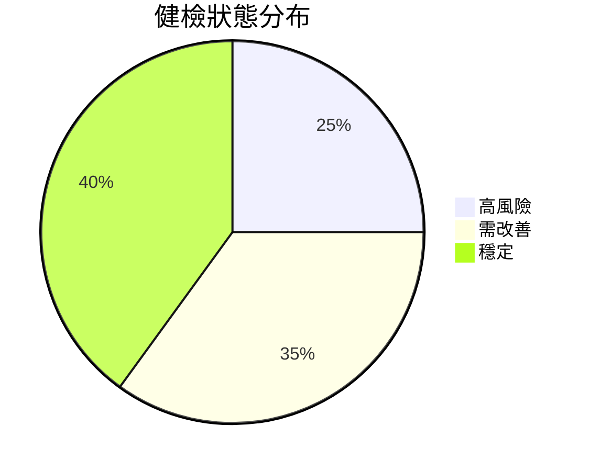
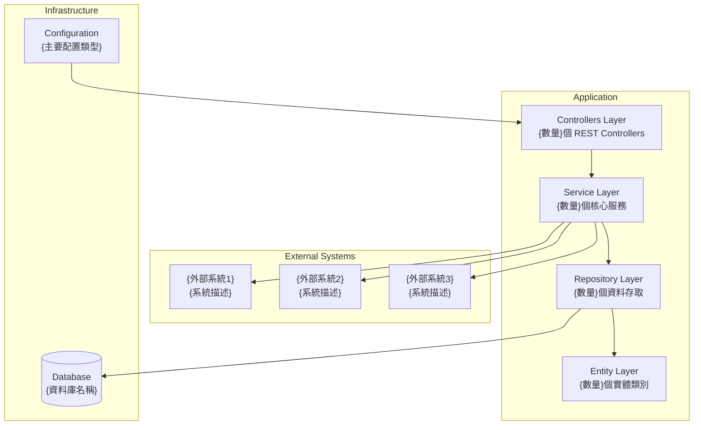

# {系統名稱} 系統架構及資安健檢報告範本

**產出日期：** {YYYY年MM月DD日}  
**系統版本：** {版本號}  
**檢查範圍：** {技術棧描述，例如：Spring Boot 應用程式 (Java 17, Spring Boot 3.4.1)}

---

## 📝 使用此範本產生報告的步驟說明

### 🚀 A001 Prompt 執行指南

#### 執行前準備
1. 確保專案目錄結構完整，可存取src目錄下的SpringBoot程式碼
2. 檢查\docs\05_report目錄是否存在，如不存在請先建立
3. 確認AI工具能夠存取並分析專案檔案

#### 執行步驟
1. 複製A001 prompt內容（來自：`docs\03_GenAI_Assistance\prompt-library\design-prompts\產生架構健檢與改善建議報告-prompts.md`）
2. 確認分析目標路徑：src目錄下的SpringBoot應用程式
3. 確認輸出位置：\docs\05_report目錄
4. 在AI工具中執行A001 prompt
5. 檢視生成的報告內容，確保所有{變數}已被替換為實際內容
6. 根據報告建議制定改善計畫

#### 客製化調整建議
可根據專案特性調整分析重點：
- **微服務架構**: 增加服務間通訊分析、API Gateway檢核
- **大型專案**: 強化模組化設計檢核、依賴關係分析
- **高安全性需求**: 加強資安檢核項目、合規性檢查
- **高效能需求**: 重點關注效能瓶頸分析、資源使用優化

#### 品質檢查清單
執行完成後請確認：
- [ ] 所有{變數名稱}已替換為實際內容
- [ ] Mermaid圖表正確顯示系統架構
- [ ] 紅燈、黃燈、綠燈項目分類合理
- [ ] 改善建議具體可執行
- [ ] 報告檔名格式正確：{系統名稱}_架構健檢報告_{YYYYMMDD}.md

---

## 📋 執行摘要

{系統名稱} 是一個基於 {主要技術棧} 的 {系統用途描述}，主要負責 {主要功能描述}。系統採用 {架構模式}，整合 {主要整合系統/資料庫/服務}。

### 健檢結果



**註：** 請根據實際分析結果調整上述百分比數值

---

## 🏗️ 系統架構分析

### 整體架構圖



### 核心模組結構

| 模組 | 檔案數 | 主要職責 | 風險等級 |
|------|--------|----------|----------|
| **{模組1}** | {數量} | {職責描述} | {🟢 低 / 🟡 中 / 🔴 高} |
| **{模組2}** | {數量} | {職責描述} | {🟢 低 / 🟡 中 / 🔴 高} |
| **{模組3}** | {數量} | {職責描述} | {🟢 低 / 🟡 中 / 🔴 高} |
| **{模組4}** | {數量} | {職責描述} | {🟢 低 / 🟡 中 / 🔴 高} |
| **{模組5}** | {數量} | {職責描述} | {🟢 低 / 🟡 中 / 🔴 高} |
| **{模組6}** | {數量} | {職責描述} | {🟢 低 / 🟡 中 / 🔴 高} |

---

## 🔴 紅燈（高風險，需立即處理）

### 1. {高風險問題1標題}
**問題：** {問題描述}
```{程式語言}
// 🔴 {問題說明}
{程式碼範例}
```
**影響：** {影響說明}

### 2. {高風險問題2標題}
**問題：** {問題描述}
```{設定檔格式}
# {檔案名稱}
{設定範例}  # 🔴 {問題說明}
```
**影響：** {影響說明}

### 3. {高風險問題3標題}
**問題：** {問題描述}
```{程式語言}
{程式碼範例}
```
**影響：** {影響說明}

### 4. {高風險問題4標題}
**問題：** {問題描述}
```{設定檔格式}
{設定範例}  # 🔴 {問題說明}
```
**影響：** {影響說明}

---

## 🟡 黃燈（中風險，建議改善）

### 1. {中風險問題1標題}
**問題：** {問題描述}
- {具體項目1}
- {具體項目2}
- {具體項目3}

### 2. {中風險問題2標題}
**問題：** {問題描述}
- {改善點1}
- {改善點2}

### 3. {中風險問題3標題}
**問題：** {問題描述}
```{設定檔格式}
{設定範例}  # 🟡 {問題說明}
```

### 4. {中風險問題4標題}
**問題：** {問題描述}
- {複雜度說明1}
- {複雜度說明2}

---

## 🟢 綠燈（低風險，狀況良好）

### 1. {優點1標題}
- ✅ {優點描述1}
- ✅ {優點描述2}
- ✅ {優點描述3}

### 2. {優點2標題}
- ✅ {技術選擇1}
- ✅ {技術選擇2}
- ✅ {技術選擇3}
- ✅ {技術選擇4}

### 3. {優點3標題}
- ✅ {工具整合1}
- ✅ {工具整合2}
- ✅ {工具整合3}

---

## 📈 改善建議（行動方案）

### 🔥 短期（1-2週）- 修復紅燈項目

1. **{短期改善項目1}**
   ```{程式語言}
   // {修改說明}
   {修改後程式碼範例}
   ```

2. **{短期改善項目2}**
   ```{設定檔格式}
   # {使用方式說明}
   {修改後設定範例}
   ```

3. **{短期改善項目3}**
   ```{設定檔格式}
   {修改後設定範例}
   ```

### ⚡ 中期（1-2個月）- 改善黃燈項目

1. **{中期改善項目1}**
   ```{程式語言}
   {改善程式碼範例}
   ```

2. **{中期改善項目2}**
   - {改善步驟1}
   - {改善步驟2}

3. **{中期改善項目3}**
   ```{設定檔格式}
   {環境配置範例}
   ```

### 🚀 長期（3-6個月）- 架構優化

1. **{長期優化項目1}**
   - {優化目標1}
   - {優化目標2}
   - {優化目標3}

2. **{長期優化項目2}**
   - {監控工具1}
   - {監控工具2}
   - {指標設定}

3. **{長期優化項目3}**
   - {架構改善1}
   - {架構改善2}
   - {標準化項目}

---

## 🎯 具體安全檢查清單

### 立即執行項目
- [ ] {安全項目1}
- [ ] {安全項目2}
- [ ] {安全項目3}
- [ ] {安全項目4}
- [ ] {安全項目5}
- [ ] {安全項目6}

### 程式碼品質改善
- [ ] {品質改善1}
- [ ] {品質改善2}
- [ ] {品質改善3}
- [ ] {品質改善4}

### 基礎設施安全
- [ ] {基礎設施1}
- [ ] {基礎設施2}
- [ ] {基礎設施3}
- [ ] {基礎設施4}

---

## 💡 一句話總結

👉 **{系統名稱} {整體評價摘要，包含主要優點和關鍵改善建議}。**

---

**報告產出工具：** {工具名稱或方法}  
**下次檢查建議：** {時間建議}

---

## 📝 範本填寫指南

#### 如何使用此範本：

1. **替換變數：** 將所有 `{變數名稱}` 替換為實際內容
2. **調整架構圖：** 根據實際系統修改 Mermaid 圖表
3. **更新風險評估：** 根據實際檢查結果填入紅燈、黃燈、綠燈項目
4. **客製化清單：** 依據系統特性調整檢查清單項目
5. **更新百分比：** 在健檢結果圓餅圖中填入實際比例

#### 變數說明：

- `{系統名稱}`: 被檢查的系統名稱
- `{版本號}`: 系統當前版本
- `{技術棧描述}`: 主要技術棧和版本資訊
- `{數量}`: 各模組的實際檔案或元件數量
- `{風險等級}`: 🟢 低 / 🟡 中 / 🔴 高
- `{程式語言}`: java, yaml, xml, json 等
- `{設定檔格式}`: yaml, properties, xml 等

#### 建議檢查項目分類：

**紅燈（高風險）：**
- 資安配置漏洞
- 敏感資訊外洩
- 認證授權問題
- 系統暴露風險

**黃燈（中風險）：**
- 程式碼品質問題
- 架構設計缺陷
- 效能瓶頸
- 維護性問題

**綠燈（優點）：**
- 良好的架構設計
- 適當的技術選擇
- 完善的工具整合
- 符合最佳實務

### 🔗 相關文件
- **Prompt來源**: `docs\03_GenAI_Assistance\prompt-library\design-prompts\產生架構健檢與改善建議報告-prompts.md`
- **輸出位置**: `docs\05_report\`
- **使用範例**: 參考已產生的架構健檢報告範例
