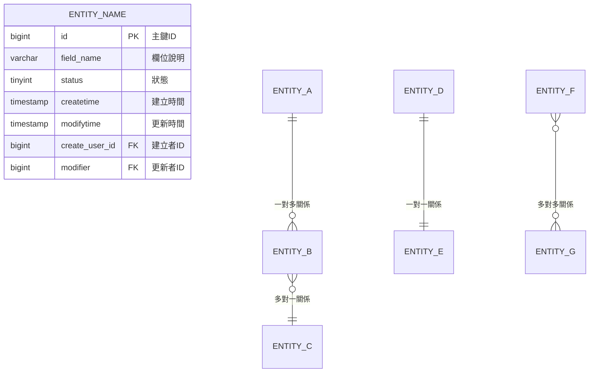
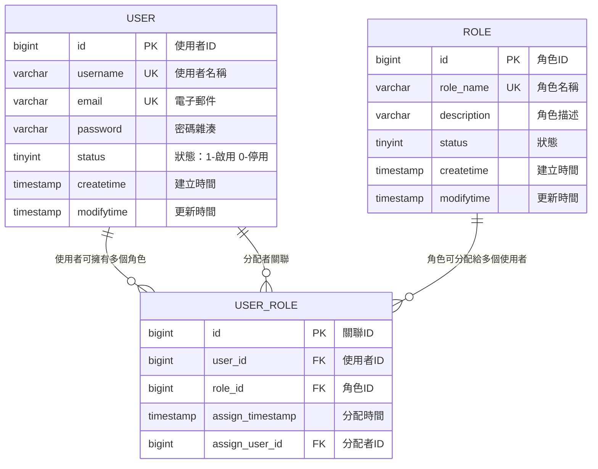

# thmcpa 資料庫設計 Prompt Library

## 📋 文件說明
本文件提供thmcpa達航船員考評系統專用的資料庫設計prompt範本，專門用於根據需求文件生成完整的資料庫設計文件、ERD圖表、DDL語句等資料庫相關內容。

**注意**: 詳細的資料庫設計規範請參考 [Spring Boot資料庫設計規範文件](../../4.document-templates/standards/Spring Boot 資料庫設計規範文件.md)

## 🏷️ Prompt 分類
- **資料庫設計**: 根據需求文件生成完整資料庫設計
- **ERD圖表**: 實體關係圖生成與優化
- **DDL生成**: 資料表創建語句生成
- **資料模型**: 資料結構分析與設計
- **索引設計**: 效能優化索引設計
- **資料庫重構**: 既有資料庫結構優化
- **資料驗證**: 資料完整性與約束設計

## 📊 Prompt 清單表

| ID | 類別 | Prompt名稱 | 用途 | 更新日期 | 使用頻率 |
|----|------|------------|------|----------|----------|
| D001 | 資料庫設計 | 需求驅動資料庫設計文件生成器 | 根據需求文件生成完整資料庫設計 | 2024-01-15 | ⭐⭐⭐⭐⭐ |
| D002 | ERD圖表 | Mermaid ERD圖表生成器 | 生成Mermaid格式的ERD圖表 | 待新增 | - |
| D003 | DDL生成 | MySQL DDL語句生成器 | 根據設計生成MySQL建表語句 | 待新增 | - |
| D004 | 資料模型 | 業務實體關係分析器 | 分析業務需求中的實體關係 | 待新增 | - |
| D005 | 索引設計 | 效能優化索引設計器 | 設計高效能資料庫索引 | 待新增 | - |
| D006 | 資料庫重構 | 資料庫結構優化器 | 優化既有資料庫結構 | 待新增 | - |
| D007 | 資料驗證 | 資料約束規則設計器 | 設計資料完整性約束 | 待新增 | - |

---

## 📝 Prompt 詳細內容

### 🆔 D001 - 需求驅動資料庫設計文件生成器

**分類**: 資料庫設計  
**優先級**: 高  
**適用場景**: 根據需求文件生成完整的資料庫設計文件時使用

#### Prompt 內容:
```
請根據以下資料生成資料庫設計文件：

**輸入文件：**
- 需求文件：`[REQUIREMENT_DOC_1]`、`[REQUIREMENT_DOC_2]`
- 設計範本：`[TEMPLATE_FILE]`

**輸出文件：**
- 路徑：`[OUTPUT_PATH]`
- 檔名：`[OUTPUT_FILENAME]`

**生成要求：**
1. 依據需求文件分析資料結構
2. 套用範本格式產生完整資料庫設計文件
3. 包含 ERD 圖表與資料表規格
4. 確保欄位命名與約束設計合理
```

#### 使用說明:
- 將 `[REQUIREMENT_DOC_1]`、`[REQUIREMENT_DOC_2]` 替換為實際需求文件名稱，例如: `公司分數考核系統流程圖.md`、`公司分數考核使用案例.md`
- 將 `[TEMPLATE_FILE]` 替換為設計範本文件名稱，例如:`db-design-template.md`
- 將 `[OUTPUT_PATH]`、`[OUTPUT_FILENAME]` 替換為輸出路徑和檔名，例如: `/docs/development/backend/db-design/`、`db-design-公司分數考核.md`
- 確保需求文件包含完整的業務流程和功能描述
- 生成的設計文件將遵循專案設計規範

#### 預期輸出:
- 生成完整的資料庫設計文件
- 包含詳細的需求分析和資料模型設計
- 提供Mermaid格式的ERD圖表
- 包含完整的DDL語句和資料字典
- 符合thmcpa專案的命名和設計規範

#### 相關標籤:
`#資料庫設計` `#ERD` `#MySQL` `#DDL` `#需求分析` `#資料模型`

---

### 🆔 D002 - Mermaid ERD圖表生成器

**分類**: ERD圖表  
**優先級**: 高  
**適用場景**: 根據資料表設計生成Mermaid格式的ERD圖表時使用

#### Prompt 內容:
```
你是資深的資料庫視覺化專家。
請根據以下資料表設計，生成Mermaid格式的ERD圖表。

**系統資訊**:
- 專案名稱：thmcpa (達航船員考評系統)
- 圖表工具：Mermaid ERD
- 輸出格式：Markdown代碼塊

**資料表設計輸入**:
[TABLE_DESIGN_INPUT]

**生成要求**:

1. **ERD圖表結構**:


2. **實體命名規範**:
   - 使用大寫英文名稱
   - 對應資料表名稱的單數形式
   - 具有業務意義的命名

3. **欄位標記規範**:
   - PK: Primary Key (主鍵)
   - FK: Foreign Key (外鍵)
   - UK: Unique Key (唯一鍵)
   - 欄位型別使用MySQL標準型別名稱

4. **關聯關係標記**:
   - `||--o{`: 一對多 (One to Many)
   - `}o--||`: 多對一 (Many to One)
   - `||--||`: 一對一 (One to One)
   - `}o--o{`: 多對多 (Many to Many)

5. **圖表組織原則**:
   - 核心業務實體放在中央
   - 相關實體就近擺放
   - 關聯線條清晰易讀
   - 避免線條交叉過多

6. **註解和說明**:
   - 為複雜關聯添加業務說明
   - 標註重要的約束條件
   - 說明特殊的業務規則

**範例格式**:


**輸出要求**:
1. **完整的ERD圖表**: 包含所有資料表和關聯
2. **清晰的關聯標示**: 明確的關聯關係和約束
3. **詳細的欄位說明**: 每個欄位都有中文說明
4. **業務邏輯註解**: 重要業務規則的說明
5. **視覺化建議**: 圖表佈局和美化建議

**特別要求**:
- 確保ERD圖表的可讀性
- 突出核心業務實體
- 清楚標示資料完整性約束
- 考慮圖表的可維護性

請生成完整、清晰的Mermaid ERD圖表，確保能準確反映資料庫設計。
```

#### 使用說明:
- 將 `[TABLE_DESIGN_INPUT]` 替換為實際的資料表設計內容
- 可以是DDL語句、資料表清單或設計文件
- 生成的ERD圖表可直接在支援Mermaid的平台使用
- 適用於文件撰寫和技術溝通

#### 預期輸出:
- 生成完整的Mermaid ERD圖表代碼
- 包含所有實體和關聯關係
- 清晰的欄位定義和類型標記
- 符合視覺化最佳實務的圖表佈局

#### 相關標籤:
`#Mermaid` `#ERD` `#視覺化` `#資料模型` `#圖表設計`

---

### 🆔 D003 - MySQL DDL語句生成器

**分類**: DDL生成  
**優先級**: 高  
**適用場景**: 根據資料庫設計文件生成完整的MySQL建表語句時使用

#### Prompt 內容:
```
你是資深的MySQL資料庫工程師。
請根據以下資料庫設計，生成完整的MySQL DDL語句。

**系統資訊**:
- 專案名稱：thmcpa (達航船員考評系統)
- 資料庫：MySQL 8.0
- 字符集：utf8mb4
- 排序規則：utf8mb4_unicode_ci
- 儲存引擎：InnoDB

**設計文件輸入**:
[DATABASE_DESIGN_INPUT]

**生成要求**:

1. **DDL語句結構**:
```sql
-- ============================================
-- thmcpa 達航船員考評系統 資料庫DDL
-- 生成時間：[TIMESTAMP]
-- MySQL版本：8.0
-- ============================================

-- 建立資料庫
CREATE DATABASE IF NOT EXISTS thmcpa 
DEFAULT CHARACTER SET utf8mb4 
COLLATE utf8mb4_unicode_ci;

USE thmcpa;

-- ============================================
-- 資料表建立
-- ============================================

-- 表名：[table_name]
-- 用途：[table_description]
CREATE TABLE [table_name] (
    -- 主鍵欄位
    id BIGINT AUTO_INCREMENT PRIMARY KEY COMMENT '主鍵ID',
    
    -- 業務欄位
    [business_fields],
    
    -- 狀態欄位
    status TINYINT DEFAULT 1 COMMENT '狀態：1-啟用，0-停用',
    
    -- 審計欄位
    createtime TIMESTAMP DEFAULT CURRENT_TIMESTAMP COMMENT '建立時間',
    modifytime TIMESTAMP DEFAULT CURRENT_TIMESTAMP ON UPDATE CURRENT_TIMESTAMP COMMENT '更新時間',
    create_user_id BIGINT COMMENT '建立者ID',
    modifier BIGINT COMMENT '更新者ID',
    
    -- 索引定義
    [indexes],
    
    -- 外鍵約束
    [foreign_keys]
    
) ENGINE=InnoDB DEFAULT CHARSET=utf8mb4 COLLATE=utf8mb4_unicode_ci COMMENT='[table_comment]';
```

2. **欄位設計規範**:
   - **主鍵**: 統一使用 `id BIGINT AUTO_INCREMENT PRIMARY KEY`
   - **字串欄位**: VARCHAR，根據業務需求設定長度
   - **數值欄位**: 選擇適當精度 (TINYINT, INT, BIGINT, DECIMAL)
   - **日期時間**: 使用 TIMESTAMP 或 DATETIME
   - **狀態欄位**: 使用 TINYINT，並設定預設值
   - **文字欄位**: 大量文字使用 TEXT 或 LONGTEXT

3. **約束設計**:
   - **NOT NULL**: 必填欄位加上 NOT NULL 約束
   - **UNIQUE**: 唯一性約束，如 email, username
   - **CHECK**: 業務規則約束 (MySQL 8.0支援)
   - **FOREIGN KEY**: 參照完整性約束

4. **索引設計原則**:
   - **主鍵索引**: 自動建立
   - **唯一索引**: 唯一性約束欄位
   - **一般索引**: 常用查詢欄位
   - **複合索引**: 多欄位組合查詢
   - **部分索引**: 長字串欄位的前綴索引

5. **命名規範**:
   - **資料表**: 小寫英文，複數形式，單字間用底線
   - **欄位**: 小寫英文，具業務意義，單字間用底線
   - **索引**: `idx_` + 欄位名稱
   - **外鍵**: `fk_` + 表名 + 欄位名

6. **標準審計欄位**:
```sql
-- 每個業務表都要包含以下審計欄位
createtime TIMESTAMP DEFAULT CURRENT_TIMESTAMP COMMENT '建立時間',
modifytime TIMESTAMP DEFAULT CURRENT_TIMESTAMP ON UPDATE CURRENT_TIMESTAMP COMMENT '更新時間',
create_user_id BIGINT COMMENT '建立者ID',
modifier BIGINT COMMENT '更新者ID',

-- 審計欄位的外鍵約束
CONSTRAINT fk_[table]_create_user FOREIGN KEY (create_user_id) REFERENCES users(id),
CONSTRAINT fk_[table]_modifier FOREIGN KEY (modifier) REFERENCES users(id)
```

7. **DDL組織結構**:
```sql
-- 1. 資料庫建立
-- 2. 基礎設定表 (users, roles, etc.)
-- 3. 業務核心表 (按依賴關係排序)
-- 4. 關聯表 (多對多關係)
-- 5. 日誌和審計表
-- 6. 額外索引建立
-- 7. 觸發器定義 (如需要)
-- 8. 初始資料插入
```

**範例DDL結構**:
```sql
-- ============================================
-- 使用者管理
-- ============================================
CREATE TABLE users (
    id BIGINT AUTO_INCREMENT PRIMARY KEY COMMENT '使用者ID',
    username VARCHAR(50) NOT NULL UNIQUE COMMENT '使用者名稱',
    email VARCHAR(100) NOT NULL UNIQUE COMMENT '電子郵件',
    password_hash VARCHAR(255) NOT NULL COMMENT '密碼雜湊值',
    full_name VARCHAR(100) NOT NULL COMMENT '完整姓名',
    phone VARCHAR(20) COMMENT '電話號碼',
    status TINYINT DEFAULT 1 COMMENT '狀態：1-啟用，0-停用',
    last_login_time TIMESTAMP NULL COMMENT '最後登入時間',
    createtime TIMESTAMP DEFAULT CURRENT_TIMESTAMP COMMENT '建立時間',
    modifytime TIMESTAMP DEFAULT CURRENT_TIMESTAMP ON UPDATE CURRENT_TIMESTAMP COMMENT '更新時間',
    create_user_id BIGINT COMMENT '建立者ID',
    modifier BIGINT COMMENT '更新者ID',
    
    -- 索引
    INDEX idx_username (username),
    INDEX idx_email (email),
    INDEX idx_status_create_time (status, createtime),
    INDEX idx_last_login (last_login_time)
    
) ENGINE=InnoDB DEFAULT CHARSET=utf8mb4 COLLATE=utf8mb4_unicode_ci COMMENT='使用者資料表';
```

**輸出要求**:
1. **完整的建庫語句**: 包含資料庫建立和字符集設定
2. **有序的建表語句**: 按照依賴關係正確排序
3. **完整的約束定義**: 主鍵、外鍵、唯一性約束
4. **合理的索引設計**: 基於查詢需求的索引策略
5. **詳細的註解說明**: 每個表和欄位的業務說明
6. **初始資料語句**: 必要的基礎資料插入語句

請生成完整、可執行的MySQL DDL語句，確保符合企業級資料庫設計標準。
```

#### 使用說明:
- 將 `[DATABASE_DESIGN_INPUT]` 替換為資料庫設計文件內容
- 可以是資料表清單、ERD圖或設計規格文件
- 生成的DDL語句可直接在MySQL中執行
- 建議在測試環境先驗證DDL的正確性

#### 預期輸出:
- 生成完整的MySQL DDL語句文件
- 包含資料庫建立、資料表定義、索引和約束
- 符合MySQL 8.0語法和最佳實務
- 遵循thmcpa專案的命名規範

#### 相關標籤:
`#MySQL` `#DDL` `#建表語句` `#索引設計` `#約束設計`

---

## 🔄 使用指南

### 快速開始
1. **準備輸入資料**: 需求文件、設計範本或既有設計文件
2. **選擇適合的prompt**: 
   - D001用於完整資料庫設計
   - D002用於ERD圖表生成
   - D003用於DDL語句生成
3. **替換placeholder**: 將prompt中的變數替換為實際內容
4. **執行生成**: 獲得符合規範的資料庫設計文件
5. **驗證結果**: 檢查生成內容是否符合專案規範

### 工作流程建議
1. **需求分析** → 使用D001生成完整設計文件
2. **視覺化展示** → 使用D002生成ERD圖表
3. **資料庫實作** → 使用D003生成DDL語句
4. **測試驗證** → 在測試環境執行DDL
5. **文件維護** → 更新設計文件和版本控制

### 注意事項
- 生成後需檢查是否符合專案資料庫設計規範
- DDL語句建議先在測試環境驗證
- 複雜的業務邏輯可能需要人工調整
- 定期更新prompt以符合最新的技術標準
- 注意資料庫版本的語法相容性

---

## 📈 貢獻指南

歡迎團隊成員貢獻新的prompt或改進現有prompt：

1. **新增Prompt**: 按照標準格式新增到對應分類
2. **更新現有Prompt**: 修改內容並更新日期
3. **回饋使用經驗**: 更新使用頻率評級和使用心得
4. **分享最佳實務**: 在使用說明中補充實用技巧
5. **提交測試案例**: 提供實際的需求文件測試範例
6. **優化輸出品質**: 根據實際使用回饋改進prompt內容

---

## 📚 相關文件

- [Spring Boot資料庫設計規範文件](../../4.document-templates/standards/Spring Boot 資料庫設計規範文件.md)
- [資料庫設計範本](../../4.document-templates/db-design-template.md)
- [後端程式生成Prompt Library](backend-codegen-prompts.md)
- [ERD圖表設計指南](../../3.technical-documents/database-design/)
   - **主鍵索引**: 自動建立
   - **唯一索引**: 唯一性約束欄位
   - **一般索引**: 常用查詢欄位
   - **複合索引**: 多欄位組合查詢
   - **部分索引**: 長字串欄位的前綴索引

5. **命名規範**:
   - **資料表**: 小寫英文，複數形式，單字間用底線
   - **欄位**: 小寫英文，具業務意義，單字間用底線
   - **索引**: `idx_` + 欄位名稱
   - **外鍵**: `fk_` + 表名 + 欄位名

6. **標準審計欄位**:
```sql
-- 每個業務表都要包含以下審計欄位
createtime TIMESTAMP DEFAULT CURRENT_TIMESTAMP COMMENT '建立時間',
modifytime TIMESTAMP DEFAULT CURRENT_TIMESTAMP ON UPDATE CURRENT_TIMESTAMP COMMENT '更新時間',
create_user_id BIGINT COMMENT '建立者ID',
modifier BIGINT COMMENT '更新者ID',

-- 審計欄位的外鍵約束
CONSTRAINT fk_[table]_create_user FOREIGN KEY (create_user_id) REFERENCES users(id),
CONSTRAINT fk_[table]_modifier FOREIGN KEY (modifier) REFERENCES users(id)
```

7. **DDL組織結構**:
```sql
-- 1. 資料庫建立
-- 2. 基礎設定表 (users, roles, etc.)
-- 3. 業務核心表 (按依賴關係排序)
-- 4. 關聯表 (多對多關係)
-- 5. 日誌和審計表
-- 6. 額外索引建立
-- 7. 觸發器定義 (如需要)
-- 8. 初始資料插入
```

**範例DDL結構**:
```sql
-- ============================================
-- 使用者管理
-- ============================================
CREATE TABLE users (
    id BIGINT AUTO_INCREMENT PRIMARY KEY COMMENT '使用者ID',
    username VARCHAR(50) NOT NULL UNIQUE COMMENT '使用者名稱',
    email VARCHAR(100) NOT NULL UNIQUE COMMENT '電子郵件',
    password_hash VARCHAR(255) NOT NULL COMMENT '密碼雜湊值',
    full_name VARCHAR(100) NOT NULL COMMENT '完整姓名',
    phone VARCHAR(20) COMMENT '電話號碼',
    status TINYINT DEFAULT 1 COMMENT '狀態：1-啟用，0-停用',
    last_login_time TIMESTAMP NULL COMMENT '最後登入時間',
    createtime TIMESTAMP DEFAULT CURRENT_TIMESTAMP COMMENT '建立時間',
    modifytime TIMESTAMP DEFAULT CURRENT_TIMESTAMP ON UPDATE CURRENT_TIMESTAMP COMMENT '更新時間',
    create_user_id BIGINT COMMENT '建立者ID',
    modifier BIGINT COMMENT '更新者ID',
    
    -- 索引
    INDEX idx_username (username),
    INDEX idx_email (email),
    INDEX idx_status_create_time (status, createtime),
    INDEX idx_last_login (last_login_time)
    
) ENGINE=InnoDB DEFAULT CHARSET=utf8mb4 COLLATE=utf8mb4_unicode_ci COMMENT='使用者資料表';
```

**輸出要求**:
1. **完整的建庫語句**: 包含資料庫建立和字符集設定
2. **有序的建表語句**: 按照依賴關係正確排序
3. **完整的約束定義**: 主鍵、外鍵、唯一性約束
4. **合理的索引設計**: 基於查詢需求的索引策略
5. **詳細的註解說明**: 每個表和欄位的業務說明
6. **初始資料語句**: 必要的基礎資料插入語句

請生成完整、可執行的MySQL DDL語句，確保符合企業級資料庫設計標準。
```

#### 使用說明:
- 將 `[DATABASE_DESIGN_INPUT]` 替換為資料庫設計文件內容
- 可以是資料表清單、ERD圖或設計規格文件
- 生成的DDL語句可直接在MySQL中執行
- 建議在測試環境先驗證DDL的正確性

#### 預期輸出:
- 生成完整的MySQL DDL語句文件
- 包含資料庫建立、資料表定義、索引和約束
- 符合MySQL 8.0語法和最佳實務
- 遵循thmcpa專案的命名規範

#### 相關標籤:
`#MySQL` `#DDL` `#建表語句` `#索引設計` `#約束設計`

---

## 🔄 使用指南

### 快速開始
1. **準備輸入資料**: 需求文件、設計範本或既有設計文件
2. **選擇適合的prompt**: 
   - D001用於完整資料庫設計
   - D002用於ERD圖表生成
   - D003用於DDL語句生成
3. **替換placeholder**: 將prompt中的變數替換為實際內容
4. **執行生成**: 獲得符合規範的資料庫設計文件
5. **驗證結果**: 檢查生成內容是否符合專案規範

### 工作流程建議
1. **需求分析** → 使用D001生成完整設計文件
2. **視覺化展示** → 使用D002生成ERD圖表
3. **資料庫實作** → 使用D003生成DDL語句
4. **測試驗證** → 在測試環境執行DDL
5. **文件維護** → 更新設計文件和版本控制

### 注意事項
- 生成後需檢查是否符合專案資料庫設計規範
- DDL語句建議先在測試環境驗證
- 複雜的業務邏輯可能需要人工調整
- 定期更新prompt以符合最新的技術標準
- 注意資料庫版本的語法相容性

---

## 📈 貢獻指南

歡迎團隊成員貢獻新的prompt或改進現有prompt：

1. **新增Prompt**: 按照標準格式新增到對應分類
2. **更新現有Prompt**: 修改內容並更新日期
3. **回饋使用經驗**: 更新使用頻率評級和使用心得
4. **分享最佳實務**: 在使用說明中補充實用技巧
5. **提交測試案例**: 提供實際的需求文件測試範例
6. **優化輸出品質**: 根據實際使用回饋改進prompt內容

---

## 📚 相關文件

- [Spring Boot資料庫設計規範文件](../../4.document-templates/standards/Spring Boot 資料庫設計規範文件.md)
- [資料庫設計範本](../../4.document-templates/db-design-template.md)
- [後端程式生成Prompt Library](backend-codegen-prompts.md)
- [ERD圖表設計指南](../../3.technical-documents/database-design/)
