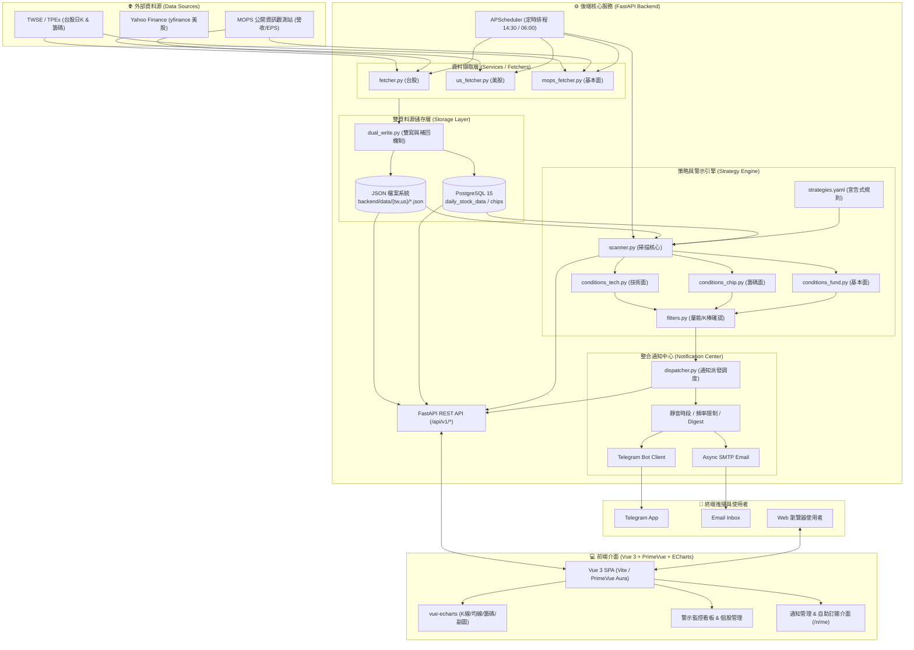

# 📈 MyStock — 台美股個人化投資儀表板與策略警示通知系統

<p align="center">
  
  
  
  
  
  
  
  
</p>

---

## 📌 專案簡介 (Project Overview)

**MyStock** 是一套專為個人投資者打造的**台美股跨市場全方位看盤、策略選股與即時通知平台**。

整合了台灣證券交易所 (TWSE)、櫃檯買賣中心 (TPEx)、公開資訊觀測站 (MOPS) 及 Yahoo Finance (yfinance) 等多方數據源，透過 **FastAPI** 高效後端進行資料爬取、指標運算與策略掃描，並以 **Vue 3 + PrimeVue + ECharts** 提供現代化、流暢且具高質感的互動式圖表儀表板；同時內建完整的**整合訊息通知子系統**，可在盤後或策略觸發時第一時間透過 **Telegram Bot** 或 **Email** 派發警示通知。

---

## ✨ 核心特色與功能 (Key Features)

### 1. 🌐 多市場支援與統一適配層 (Multi-Market Support)
* **跨市場無縫切換**：原生支援**台股 (TW)** 與**美股 (US)** 雙市場。
* **市場適配器架構 (`MarketAdapter`)**：
  * **配色規範自適應**：台股支援「紅漲綠跌」、美股支援「綠漲紅跌」。
  * **交易細節抽象化**：自動處理幣別 (TWD / USD)、交易單位 (1,000股 / 1股)、交易時段判定。
  * **籌碼特性隔離**：台股啟用三大法人與融資融券面板；美股自動適配專屬指標。
* **URL 狀態同步**：前端路由支援 `/stock/:market/:id`，市場狀態持久化至 `localStorage`。

### 2. 💽 雙資料源儲存架構 (Dual Data Source)
* **JSON Flat Files (免資料庫輕量模式)**：以代號為檔名 (`backend/data/{tw,us}/<symbol>.json`)，開箱即用。
* **PostgreSQL (高效關聯資料庫模式)**：支援大量歷史數據快速索引、區間統計與時序查詢。
* **雙寫與容錯機制 (Dual-write)**：爬蟲寫入 JSON 作為 Source of Truth，並非同步雙寫至 PostgreSQL；資料庫異常時不阻斷爬蟲主流程。
* **啟動自動補齊 (Startup Backfill)**：服務啟動時自動檢查最近交易日缺漏並自動回補。

### 3. 🤖 自動化爬蟲與定時排程 (Automated Crawlers & Schedulers)
* **多來源數據採集**：
  * **台股日K / 籌碼**：自動抓取日 OHLCV、外資/投信/自營商三大法人買賣超、融資融券餘額與增減。
  * **台股基本面**：定期抓取 MOPS 公開資訊觀測站「每月營收 YoY」與「每季 EPS 財報」。
  * **美股數據**：透過 `yfinance` 獲取美股歷史日K線與成交量。
* **非同步自動排程 (APScheduler)**：
  * 🇹🇼 台股日常爬取與策略掃描：每個交易日 `14:30` (Asia/Taipei)。
  * 🇺🇸 美股日常爬取與策略掃描：每個交易日 `06:00` (Asia/Taipei)。
  * 防重複觸發鎖 (In-flight guard) 與手動/回填觸發 API。

### 4. 🎯 宣告式策略與警示掃描引擎 (Strategy & Alert Engine)
策略參數完全由 YAML 設定檔 (`backend/strategy_config/strategies.yaml`) 驅動，**調整閥值無須修改程式碼與重啟**：
* **技術面策略 (Technical)**：
  * 收盤價突破/跌破關鍵均線 (MA 20/60/240)
  * 均線黃金交叉 / 死亡交叉 (MA 5/20, 20/60, 60/240)
  * 均線多頭排列 / 空頭排列 (結合斜率判斷)
  * 均線糾結突破 (MA Squeeze Breakout)
  * 乖離率極值抄底 / 逃頂 (BIAS Extreme Reversal)
* **籌碼面策略 (Chip - 台股專屬)**：
  * 三大法人同步買超 / 賣超
  * 外資或投信連續買超
  * 融資融券異動與主力籌碼異常 (自動排除 ETF/ETN 標的，避免信號失真)
* **基本面策略 (Fundamental - 台股專屬)**：
  * MOPS 單月營收年減 / 年增警示
  * 營收連續衰退警示
* **信號過濾與風控**：
  * 支援量能確認 (`volume_confirm`)、K棒實體比例確認 (`candlestick_confirm`)。
  * 信號強度分級 (`weak` / `moderate` / `strong`)。
  * 冷卻時間窗口 (`ALERT_COOLDOWN_DAYS`) 與去重機制，避免重複頻繁警示。

### 5. 🔔 整合訊息通知平台 (Unified Notification Center)
* **多通道支援**：內建 **Telegram Bot** 與 **SMTP Email** 雙通道推播。
* **安全機制**：
  * 頻道 Token / 密碼採 **Fernet 對稱加密** 儲存。
  * 擁有者管理登入驗證 (bcrypt + 簽章 Cookie 認證)。
* **靈活調控機制**：
  * 支援 Jinja2 安全沙盒模板自訂訊息內容。
  * 支援**靜音時段** (Quiet Hours) 與**發送頻率限制** (Rate Limiting)。
  * 支援**每日盤後綜合摘要** (Daily Digest) 合併發送。
  * 獨立的**收件人自助訂閱入口** (`/n/me`)。

### 6. 📊 現代化視覺化前端介面 (Modern Frontend)
* **響應式儀表板 (Dashboard)**：市場概況、個股即時漲跌、重點自選股摘要。
* **互動式 K 線與多指標圖表 (Chart Detail)**：
  * 技術分析主圖：K 線、SMA 均線系統 (5, 10, 20, 60, 120, 240)。
  * 豐富副圖切換：成交量 (Volume)、三大法人買賣超、融資融券餘額變化、乖離率 (BIAS)。
* **多維度熱力圖 (Heatmap Dashboard)**：視覺化展示標的強弱度與市場熱點。
* **策略警示監控看板 (Alert Dashboard)**：即時檢視歷史觸發信號、強度分級、篩選與回測記錄。
* **管理介面**：股票池管理、通知頻道設定、訂閱規則配置、模板管理與發送記錄日誌。

---

## 🏛️ 系統架構 (System Architecture)



---

## 📁 專案目錄結構 (Directory Structure)

```text
mystock-vue/
├── backend/                        # 後端專案目錄 (FastAPI)
│   ├── api/v1/endpoints/           # API 路由端點
│   │   ├── alerts.py               # 策略警示查詢與手動掃描
│   │   ├── fetch.py                # 資料爬取手動觸發
│   │   ├── fundamentals.py         # 基本面 (營收/EPS) 資料 API
│   │   ├── markets.py              # 市場規格與適配資訊
│   │   ├── notify_admin.py         # 通知系統管理端 API
│   │   ├── notify_public.py        # 通知系統公開/回呼 API
│   │   ├── notify_self.py          # 收件人自助訂閱 API
│   │   ├── schedule.py             # 排程檢視與觸發
│   │   ├── stocks.py               # 股票資訊與 K 線圖表數據
│   │   └── strategies.py           # 策略配置讀取
│   ├── core/                       # 核心通用模組 (exceptions, security)
│   ├── data/                       # 本地 JSON 數據儲存庫 (Source of Truth)
│   │   ├── tw/                     # 台股歷史資料 (<symbol>.json)
│   │   ├── us/                     # 美股歷史資料 (<symbol>.json)
│   │   └── _alerts/                # 歷史警示觸發紀錄
│   ├── db/                         # 資料庫連線與遷移 (SQLAlchemy, asyncpg, Flyway)
│   ├── indicators/                 # 技術指標計算庫 (SMA, BIAS)
│   ├── markets/                    # 市場適配層 (MarketAdapter, tw.py, us.py)
│   ├── notify/                     # 整合訊息通知子系統 (Telegram, Email, Dispatcher)
│   ├── repositories/               # 資料訪問層 (StockRepository, AlertRepository)
│   ├── scripts/                    # 資料庫匯入、遷移與驗證工具腳本
│   ├── services/                   # 業務邏輯與爬蟲 (fetcher, stock_service, scheduler)
│   ├── strategies/                 # 策略掃描引擎 (scanner, registry, conditions, filters)
│   ├── strategy_config/            # 策略宣告式配置 (strategies.yaml)
│   ├── config.py                   # 系統全域設定 (讀取 .env)
│   ├── Dockerfile                  # 後端 Docker 映像檔構建檔
│   ├── requirements.txt            # Python 相依套件清單
│   └── main.py                     # FastAPI 應用程式入口
├── frontend/                       # 前端專案目錄 (Vue 3 + Vite + PrimeVue)
│   ├── src/
│   │   ├── assets/                 # 靜態資源、樣式 (SCSS/CSS)
│   │   ├── components/             # 共用 UI 元件 (StockHeader, StatusBadge 等)
│   │   ├── composables/            # 組合式函式 (useMarket, useChartTheme 等)
│   │   ├── layout/                 # 佈局骨架 (AppLayout, AppTopbar, AppSidebar)
│   │   ├── router/                 # Vue Router 路由設定
│   │   ├── service/                # 後端 API 溝通封裝 (stockApi, alertApi, notifyApi)
│   │   ├── utils/                  # 數學與格式化工具 (movingAverage, formatter)
│   │   ├── views/                  # 各頁面視圖
│   │   │   ├── notify/             # 通知系統管理與自助訂閱頁面
│   │   │   ├── AlertDashboard.vue  # 策略警示監控儀表板
│   │   │   ├── ChartDetailView.vue # 個股 K 線與多指標詳細圖表
│   │   │   ├── HeatmapDashboard.vue# 市場熱力圖看板
│   │   │   ├── StockDashboard.vue  # 個股首頁概覽
│   │   │   └── StockManagement.vue # 股票追蹤清單管理
│   │   ├── App.vue                 # 根元件
│   │   └── main.js                 # 前端入口檔
│   ├── nginx.conf                  # 前端生產環境 Nginx 反向代理配置
│   ├── Dockerfile                  # 前端 Docker 映像檔構建檔
│   └── package.json                # 前端相依套件清單
├── docs/                           # 完整系統規格與各模組設計文件
├── docker-compose.yml              # 正式環境 / 完整堆疊 Docker Compose
├── docker-compose.dev.yml          # 本機熱重載開發用 Docker Compose
├── docker-compose.traefik.yml      # Traefik 反向代理範例疊加檔
├── .env.example                    # 環境變數範本檔
└── README.md                       # 專案說明文件 (本檔)
```

---

## 🚀 快速開始 (Getting Started)

### 方式一：Docker 完整堆疊快速啟動 (推薦)

專案提供了針對不同環境的標準 Compose 配置（含 PostgreSQL 15、Flyway 自動遷移、定時備份、後端與前端 Nginx 反向代理）：

```bash
# 1. 複製並設定環境變數範本 (以 dev 環境為例)
cp .env.example .env.dev

# 2. 啟動完整服務容器 (Postgres + Flyway + Backend + Frontend)
docker compose --env-file .env.dev -f docker-compose.yml up -d --build

# 3. 服務存取
# 前端介面：http://localhost:8082 (依 .env.dev 中的 FRONTEND_PORT 而定)
# 後端 API 文件：http://localhost:8002/docs (依 .env.dev 中的 BACKEND_PORT 而定)
```

> **開發環境熱重載 (Hot-reload)**：
> 若需要在容器內進行即時程式碼修改熱重載，可使用 `docker-compose.dev.yml`：
> ```bash
> cp .env.example .env
> docker compose -f docker-compose.dev.yml up -d --build
> ```

---

### 方式二：本機直接開發 (Native Local Development)

#### 1. 前置需求
* **Node.js**: 18.0+
* **Python**: 3.11+
* **PostgreSQL** (可選，若使用 `DATA_SOURCE=json` 則免安裝)

#### 2. 後端啟動 (Backend)
```bash
cd backend

# 建立並啟用 Python 虛擬環境
python -m venv .venv
# Windows:
.venv\Scripts\activate
# Linux/macOS:
source .venv/bin/activate

# 安裝相依套件
pip install -r requirements.txt

# 設定環境變數
cp .env.example .env

# 啟動 FastAPI 伺服器
python main.py
# 或使用 uvicorn
uvicorn main:app --reload --port 8000
```
* 後端 API Swagger 文件：`http://localhost:8000/docs`

#### 3. 前端啟動 (Frontend)
```bash
cd frontend

# 安裝 npm 依賴
npm install

# 啟動 Vite 開發伺服器
npm run dev
```
* 前端頁面預設於：`http://localhost:5173`

---

## ⚙️ 環境變數配置說明 (Configuration)

在專案根目錄 `.env.<環境>` 或 `backend/.env` 中可配置以下核心參數：

| 變數名稱 | 預設值 | 說明 |
| :--- | :--- | :--- |
| `DATA_SOURCE` | `json` | 讀取資料來源 (`json` 檔案模式 或 `postgres` 資料庫模式) |
| `ENABLED_MARKETS` | `tw,us` | 啟用的市場清單 (逗號分隔) |
| `STOCK_CODES` | `0050,2330,2317` | 台股預設追蹤股票代號 |
| `US_STOCK_CODES` | `AAPL,MSFT,GOOGL,TSLA` | 美股預設追蹤股票代號 |
| `MONTHS_RANGE` | `3` | 增量爬取時預設回溯的月數 |
| `QUARTERS_RANGE` | `4` | 季報 EPS 回溯抓取的季數 |
| `BACKFILL_MAX_DAYS`| `90` | 啟動時缺漏資料自動回補的最大回溯天數 (Postgres 模式) |
| `POSTGRES_HOST` | `localhost` | PostgreSQL 主機位址 (Docker 內為 `db`) |
| `POSTGRES_PORT` | `5432` | PostgreSQL 連接埠 |
| `POSTGRES_DB` | `mystock_db` | 資料庫名稱 |
| `POSTGRES_USER` | `stock_user` | 資料庫使用者名稱 |
| `POSTGRES_PASSWORD`| `change-me` | 資料庫密碼 |
| `TELEGRAM_BOT_TOKEN`| - | Telegram 通知機器人 Token |
| `VITE_API_BASE` | `/api/v1` | 前端呼叫 API 的基礎路徑 (本地直跑時可為 `http://localhost:8000/api/v1`) |

---

## 🧩 策略自訂教學 (Strategy Customization)

策略引擎採用解耦設計，所有策略規則定義於 `backend/strategy_config/strategies.yaml`。

### 範例：新增一組均線突破與成交量確認策略
```yaml
strategies:
  - id: "my_custom_ma_breakout"
    name: "放量突破 20 日月線策略"
    category: "technical"
    enabled: true
    markets: ["tw", "us"]
    conditions:
      - type: "price_cross"
        target: "close"
        ma_periods: [20]
        directions: ["cross_above"]
    filters:
      - type: "volume_confirm"
        params: { multiple: 2.0 }         # 成交量大於 5 日均量 2 倍
      - type: "candlestick_confirm"
        params: { body_ratio: 0.6 }       # 實體紅K棒佔比 > 60%
```
儲存後，下一次定時掃描或呼叫 `POST /api/v1/alerts/scan` 即刻生效！

---

## 📚 系統設計文件導覽 (Documentation)

本專案各模組具備詳盡之架構設計與開發規格書，位於 `docs/` 目錄：

* 📘 [系統整體架構規格書](docs/#Architecture/)
* 📘 [1. 策略管理模組設計](docs/1.策略管理模組/)
* 📘 [2. 均線策略警示系統設計](docs/2.%20均線策略警示系統/)
* 📘 [3. 跨市場與多來源爬蟲架構](docs/3.爬蟲開發/)
* 📘 [4. PostgreSQL 資料庫架構與遷移規範](docs/4.資料轉存到postgressql/)
* 📘 [5. 籌碼選股策略設計](docs/5.籌碼選股策略/)
* 📘 [6. 極端抄底策略警示規範](docs/6.極端抄底策略警示/)
* 📘 [7. 賣股與停損策略開發](docs/7.賣股策略+爬蟲開發/)
* 📘 [8. 個人投資記帳與資產管理功能](docs/8.個人投資記帳功能/)
* 📘 [9. 整合訊息通知平台規格書 (Telegram & Email)](docs/9.整合訊息系統_Telegram/)
* 📘 [台美股多市場架構適配設計](docs/multi_market_tw_us_design.md)

---

## 🛠️ 開發工具與實用腳本 (Utilities)

後端 `backend/scripts/` 提供常用維運與測試工具：

```bash
cd backend

# 一次性將 data/{tw,us}/*.json 全量批次匯入至 PostgreSQL (具冪等性)
python scripts/import_json_to_postgres.py

# 比對驗證 JSON 與 PostgreSQL 讀取結果之一致性
python scripts/compare_data_sources.py

# 修復歷史極端異常價格數據
python scripts/restore_price_from_legacy.py --dry-run
```

---

## 📄 授權條款 (License)

本專案採用 [MIT License](LICENSE) 開源授權，歡迎自由研究、改進與個人使用。
