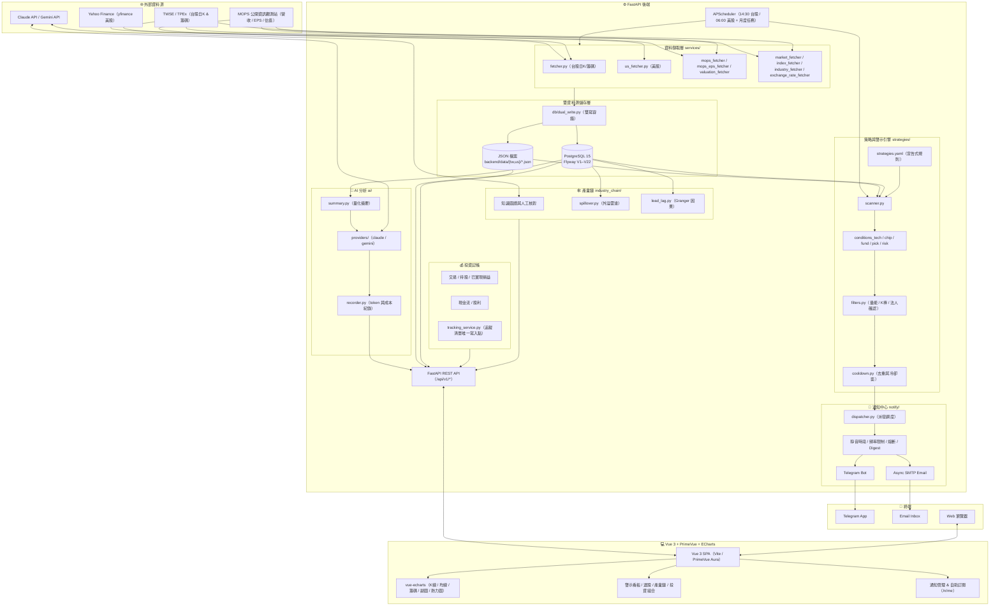

# 📈 MyStock — 台美股個人化投資儀表板、策略警示與 AI 分析平台

<p align="center">
  
  
  
  
  
  
  
  
  
</p>

---

## 📌 專案簡介 (Project Overview)

**MyStock** 是一套專為個人投資者打造的**台美股跨市場看盤、選股、記帳、策略警示與 AI 分析平台**。

整合台灣證券交易所 (TWSE)、櫃買中心 (TPEx)、公開資訊觀測站 (MOPS) 及 Yahoo Finance (yfinance) 等多方數據源，
以 **FastAPI** 後端進行資料爬取、指標運算、策略掃描與 LLM 分析，前端以 **Vue 3 + PrimeVue + ECharts**
提供互動式圖表儀表板；並內建**整合訊息通知子系統**（Telegram / Email）與**個人投資記帳模組**。

> 📝 程式註解與 `docs/` 設計文件均以**繁體中文**撰寫，且為本專案的權威規格；多數模組的註解會標示
> `見設計文件第 X 節`，對應 `docs/01_Requirements/` 下的編號資料夾。修改 `strategies/`、`services/`、
> `db/` 的行為前，請先查閱對應文件。

---

## ✨ 核心功能 (Key Features)

### 1. 🌐 多市場支援與統一適配層
* **跨市場無縫切換**：原生支援**台股 (TW)** 與**美股 (US)**。
* **市場適配器 (`MarketAdapter`)**：抽象化幣別 (TWD/USD)、交易單位 (1,000 股 / 1 股)、交易時段判定、
  籌碼面板適用性（台股才有三大法人與融資融券）、代號驗證。新增市場只需新增一個 adapter 並註冊到
  `markets/__init__.py`，不需要在商業邏輯裡寫 `if market == "xx"`。
* **URL 狀態同步**：前端路由 `/stock/:market/:id`，市場狀態由 `useMarket()` 單例持有並持久化至 `localStorage`。
* **漲跌配色**：台美股一律「**紅漲綠跌**」。

### 2. 💽 雙資料源儲存架構 (Dual Data Source)
* **JSON Flat Files**（預設）：一檔一代號，`backend/data/{tw,us}/<symbol>.json`，開箱即用免資料庫。
* **PostgreSQL 15**（可選）：完整平行讀取路徑，適合大量歷史資料的索引與時序查詢。
* **全域切換**：由 `.env` 的 `DATA_SOURCE` (`json` | `postgres`) 決定，**非逐次呼叫決定**；唯一的分支點在
  `services/stock_service.load_stock_data()`。
* **雙寫容錯 (Dual-write)**：爬蟲一律先寫 JSON（Source of Truth），再 best-effort 雙寫 Postgres
  (`db/dual_write.py`)；資料庫失敗僅記 warning，不會中斷爬蟲。
* **啟動自動補齊 (Startup Backfill)**：`DATA_SOURCE=postgres` 時，啟動會診斷近期缺漏交易日並自動回補。
* **Flyway 遷移**：`backend/db/migration/V*__*.sql`（目前 V1–V22）；新增請另開新檔，切勿修改已套用的版本。

### 3. 🤖 自動化爬蟲與排程 (Crawlers & Scheduler)
* **資料採集**：
  * 台股日 K／籌碼：OHLCV、外資/投信/自營商三大法人買賣超、融資融券餘額與增減。
  * 台股基本面：MOPS 每月營收 YoY、每季 EPS 財報、估值 (PE/PB/殖利率)。
  * 大盤指數、類股輪動、產業分類、每日匯率、全市場快照。
  * 美股：`yfinance` 歷史日 K 與成交量。
* **排程 (APScheduler，`Asia/Taipei`)**：
  * 台股爬取 + 策略掃描：交易日 `14:30`（`TW_SCHEDULE_TIME`）。
  * 美股爬取 + 策略掃描：交易日 `06:00`（`US_SCHEDULE_TIME`）。
  * 月營收（每月 11 日）、季報 EPS／估值（每月 16 日）、產業與代號主檔（每月 1 日）等維護性任務。
  * 通知平台的 digest／重試／熔斷恢復／日誌清理定時任務。
* **防重複觸發**：每個 fetcher 有 `fetch_status` 單例作 in-flight guard；掃描一律鏈在該市場爬取之後。
* **手動觸發**：`POST /api/v1/fetch/trigger`、`POST /api/v1/alerts/scan`、
  `POST /api/v1/fundamentals/revenue|eps/trigger`。

### 4. 🎯 宣告式策略與警示引擎 (Strategy & Alert Engine)
策略全部定義在 `backend/strategy_config/strategies.yaml`，**調整閾值不需改程式碼也不需重啟**
（`config_loader.py` 每次呼叫重新解析）。

| 類別 | 策略 |
| :--- | :--- |
| **technical** | 收盤價突破/跌破均線、均線黃金/死亡交叉、均線多頭/空頭排列、均線糾結突破、乖離率過大、均線回踩支撐、KD 超賣黃金交叉 / 超買死亡交叉、MACD 黃金/死亡交叉、RSI 超賣止跌 / 超買轉弱 |
| **chip**（台股） | 底部換手（洗盤）、高檔軋空（暴走）、高檔出貨（崩盤前） |
| **fundamental**（台股） | 營收連續衰退出場 |
| **stock_picking** | 低本益比高殖利率、營收高成長動能、季報 EPS 獲利、法人籌碼共振、多因子共振旗艦、相對低點承接 |
| **risk** | 移動停利出場、固定停損出場 |

**掃描流程**（`strategies/scanner.py`）：

1. `ChipDataProvider.get_bars()` 依 `DATA_SOURCE` 載入歷史，並預先算好 MA/BIAS 等序列放進 `ScanContext`。
   **條件函式只能讀 `ctx.ma` / `ctx.bias`，不得自行重算指標** —— 這保證後端訊號與前端圖表數字一致
   （`indicators/moving_average.py` 的 `sma()` 與 `frontend/src/utils/movingAverage.js` 刻意保持數值一致）。
2. 逐條件查 `strategies/registry.CONDITION_REGISTRY`；條件以 `@condition(type=...)` 自我註冊於
   `conditions_tech.py` / `conditions_chip.py` / `conditions_fund.py` / `conditions_pick.py` /
   `conditions_risk.py`。新增條件模組務必 import 進 `strategies/__init__.py` 才會註冊。
3. 濾網 (`filters.py`：量能確認、K 棒實體確認、法人買超確認) 只做**強度評分**
   (`weak` / `moderate` / `strong`)，不會直接壓掉訊號。
4. 去重與冷卻：`(symbol, strategy_id, direction, trade_date)` 重複即丟棄；並套用
   `ALERT_COOLDOWN_DAYS` 冷卻窗（`strategies/cooldown.py`），避免同一盤勢天天重複警示。
5. 存入 `repositories/alert_repository.py`（平面檔於 `backend/data/_alerts/`）。

> 籌碼類策略會自動排除台股 ETF/ETN 代號（`00` + 2–6 碼，如 `0050`、`00981A`），因為 ETF 的融資與法人
> 數據意義不同，會污染籌碼訊號。

### 5. 🧠 AI 技術分析報告 (AI Analysis)
* **雙 Provider**：**Claude**（`anthropic` SDK）與 **Gemini**（`google-genai` SDK），可於前端選擇機型
  （清單見 `backend/ai/config.py` 的 `SELECTABLE_MODELS`）。
* **量化摘要先行**：`ai/summary.py` 先把 K 線／指標／籌碼壓成結構化摘要再送 LLM，降低 token 成本。
* **成本與濫用防線**：`AI_DAILY_QUOTA` 為全站每日新報告上限；
  `(market_type, symbol, trade_date, provider, model)` 唯一鍵讓同一標的同一交易日同一機型只呼叫一次
  （換機型視為另一份獨立報告）；逾時、輸出上限、圖片大小上限皆可設定；每次呼叫的 token 與成本記錄於
  `ai_llm_execution`。
* **報告與執行紀錄頁**：`/ai/reports`、`/ai/executions`。
* 預設關閉，需 `AI_ANALYSIS_ENABLED=true` 與對應 API 金鑰。

### 6. 🕸️ 產業鏈知識圖譜 (Industry Chain Graph)
* LLM 抽取 + 人工核對的**供應鏈關聯圖**，含節點狀態與上下游 BFS（`IC_MAX_BFS_TIER`）。
* **外溢雷達 (Spillover Radar)**：偵測某節點「點火」後，沿供應鏈可能受惠的關聯個股。
* **Granger 因果檢定**：以 `IC_GRANGER_*` 參數做領先-落後關係統計驗證（Benjamini-Hochberg 校正）。
* 預設關閉，需 `INDUSTRY_CHAIN_ENABLED=true`。

### 7. 💰 個人投資記帳與績效 (Portfolio & Ledger)
* **交易紀錄**：買賣進出、手續費與稅費，台美股分帳。
* **持股總覽**：即時報價、未實現損益、成本均價。
* **已實現損益與績效**：期間報酬與實現損益明細。
* **現金流與股利**：入出金、配息配股紀錄。
* **追蹤與觀察名單**：系統唯一的個股清單頁 —— 加入即納入每日爬蟲抓取範圍 (`is_crawl_enabled`)，
  可設定目標買進價與追蹤原因，並掛多個自訂標籤。所有寫入一律經 `services/tracking_service.py`
  （唯一寫入點），不得直接呼叫 `PortfolioRepository`。
* **投資筆記**：個股／標的對的自由筆記。

### 8. 🔔 整合訊息通知平台 (Notification Center)
* **雙通道**：**Telegram Bot** 與 **SMTP Email**。
* **安全**：頻道 Token／密碼以 **Fernet** 對稱加密儲存；管理端以 bcrypt 密碼 + 簽章 Cookie 認證
  （`OWNER_PASSWORD_HASH` / `OWNER_API_TOKEN`）。
* **調控**：Jinja2 沙盒模板、靜音時段 (Quiet Hours)、發送頻率與每日額度限制、失敗重試與熔斷、
  每日盤後綜合摘要 (Daily Digest)、日誌保留期。
* **自助訂閱入口**：`/n/me`（收件人自行管理訂閱與偏好，不需登入後台）。
* 預設關閉，需 `NOTIFY_ENABLED=true` 並設定 `NOTIFY_SECRET_KEY`。

### 9. 📊 前端視覺化介面
* **首頁儀表板**：市場概況、追蹤股摘要、指數走勢。
* **個股頁與 K 線圖**：SMA (5/10/20/60/120/240) 主圖；副圖可切換成交量、三大法人、融資融券、
  BIAS、KD、MACD、RSI、布林通道等。
* **大盤指數與類股輪動**：`/index/:market/:code`、`/indices/sectors`。
* **熱力圖**：`/`（HeatmapDashboard），視覺化強弱度與概念股標籤分類。
* **選股與篩選**：`/picking`（策略選股）、`/market`（全市場條件篩選）、`/compare`（多檔比較）、
  `/stocks/symbols`（代號瀏覽）。
* **策略警示看板**：`/alerts`，可依市場、類別、強度、日期篩選。
* **管理頁**：股票與爬蟲管理、通知頻道／收件人／訂閱規則／模板／發送記錄。

---

## 🏛️ 系統架構 (System Architecture)



---

## 🚀 快速開始 (Getting Started)

### 方式一：Docker 完整堆疊（推薦）

根目錄的 compose 檔提供完整堆疊（PostgreSQL 15 + Flyway 自動遷移 + 每夜備份 + 後端 + 前端 Nginx）。
prod / test / dev / local 共用同一份定義，**只差在 `--env-file`**（git 分支 → 環境檔）：

| 分支 | env 檔 |
| :--- | :--- |
| `main` | `.env.prod` |
| `test` | `.env.test` |
| `dev` | `.env.dev` |
| 本機驗證 | `.env.local`（未進版控） |

```bash
# 1. 複製環境變數範本（以 dev 為例），並修改 APP_ENV / 埠號 / 密碼
cp .env.example .env.dev

# 2. 啟動完整服務（--env-file 不可省略）
docker compose --env-file .env.dev -f docker-compose.yml up -d --build

# 3. 存取
#    前端：http://localhost:8082            （FRONTEND_PORT）
#    後端 API 文件：http://localhost:8002/docs（BACKEND_PORT）
```

**本機熱重載開發**（bind-mount 原始碼、`uvicorn --reload` + Vite dev server，讀根目錄 `.env`）：

```bash
cp .env.example .env
docker compose -f docker-compose.dev.yml up -d --build
```

> `docker-compose.traefik.yml` 只是未來反向代理閘道的**示範疊加檔**（範例網域／網路），並未接進正常流程。
> `backend/docker-compose.yml` 則是獨立可用的「僅後端 + DB」設定，不受根目錄 compose 影響。

---

### 方式二：本機直接開發 (Native Local Development)

#### 前置需求
* **Node.js** 18+
* **Python** 3.11+ 與 [**uv**](https://docs.astral.sh/uv/)（Windows：`winget install --id astral-sh.uv`）
* **PostgreSQL**（可選；`DATA_SOURCE=json` 時免安裝）

#### 後端 (Backend)

Windows 從專案根目錄執行啟動器即可 —— 它會用 uv 建立／沿用專案根目錄的 `.venv`、補齊缺少的套件、
必要時由範本產生 `backend/.env`，最後 `uv run main.py`：

```bat
start_backend.bat
```

Linux / macOS（或想自行管理環境時）：

```bash
# 建立虛擬環境並安裝相依套件
uv venv --python ">=3.11" .venv
uv pip install -r backend/requirements.txt

# 設定環境變數（必要；由 python-dotenv 在多數設定查詢時重新讀取，改完通常免重啟）
cp backend/.env.example backend/.env

# 啟動
source .venv/bin/activate
cd backend && python main.py
# 或： uvicorn main:app --reload --port 18888
```

* Swagger API 文件：`http://localhost:18888/docs`
* 健康檢查：`http://localhost:18888/health`

#### 前端 (Frontend)

```bash
cd frontend
npm install
npm run dev       # http://localhost:5173（被占用時退到 5175）
npm run build     # 產生 frontend/dist
npm run preview   # 預覽 production build
npm run lint      # eslint --fix
```

#### 關閉本機服務

```bat
stop_servers.bat          :: 清掉佔用 18888 / 5173 / 5175 的行程（非 Docker 用）
```

---

## ⚙️ 環境變數 (Configuration)

完整清單見 `backend/.env.example`（後端全部設定）與根目錄 `.env.example`（Docker 堆疊插值用）。
以下為最常調整的項目：

### 核心

| 變數 | 預設 | 說明 |
| :--- | :--- | :--- |
| `DATA_SOURCE` | `json` | 讀取來源：`json` 檔案模式／`postgres` 資料庫模式 |
| `ENABLED_MARKETS` | `tw,us` | 啟用的市場（逗號分隔） |
| `MONTHS_RANGE` | `3` | 增量爬取回溯月數 |
| `QUARTERS_RANGE` | `4` | 季報 EPS 回溯季數 |
| `BACKFILL_MAX_DAYS` | `90` | 啟動缺漏自動回補的最大回望天數（Postgres 模式） |
| `SCHEDULE_TIMEZONE` | `Asia/Taipei` | 排程時區 |
| `TW_SCHEDULE_TIME` / `TW_SCHEDULE_ENABLED` | `14:30` / `true` | 台股爬取＋掃描排程 |
| `US_SCHEDULE_TIME` / `US_SCHEDULE_ENABLED` | `06:00` / `true` | 美股爬取＋掃描排程 |

### PostgreSQL

| 變數 | 預設 | 說明 |
| :--- | :--- | :--- |
| `POSTGRES_HOST` | `localhost` | 主機（Docker 內為 `db`，由 compose 覆寫） |
| `POSTGRES_PORT` | `5432` | 連接埠 |
| `POSTGRES_DB` | `mystock_db` | 資料庫名稱 |
| `POSTGRES_USER` | `stock_user` | 使用者 |
| `POSTGRES_PASSWORD` | — | 密碼（正式環境務必更換） |

### 通知平台

| 變數 | 預設 | 說明 |
| :--- | :--- | :--- |
| `NOTIFY_ENABLED` | `false` | 通知子系統總開關 |
| `NOTIFY_SECRET_KEY` | — | Fernet 加密金鑰（加密頻道 Token／密碼，啟用時必填） |
| `PUBLIC_BASE_URL` | `http://localhost:5173` | 自助訂閱連結所用的對外網址 |
| `OWNER_PASSWORD_HASH` / `OWNER_API_TOKEN` | — | 通知管理後台登入憑證 |
| `NOTIFY_DEFAULT_QUIET_START` / `_END` | `22:00` / `08:00` | 預設靜音時段 |
| `NOTIFY_DEFAULT_STRENGTHS` | `strong,moderate` | 預設推播的訊號強度 |
| `NOTIFY_DIGEST_TIME_TW` / `_US` | `15:00` / `07:00` | 每日摘要發送時間 |
| `NOTIFY_DRY_RUN` | `false` | 只記錄不實際送出，便於測試 |
| `TELEGRAM_WEBHOOK_BASE` / `_SECRET` | — | Telegram webhook 設定 |

### AI 分析

| 變數 | 預設 | 說明 |
| :--- | :--- | :--- |
| `AI_ANALYSIS_ENABLED` | `false` | AI 分析總開關 |
| `AI_DEFAULT_PROVIDER` | `claude` | 預設 Provider（`claude` / `gemini`） |
| `CLAUDE_API_KEY` / `CLAUDE_MODEL` | — / `claude-sonnet-5` | Claude 金鑰與預設機型 |
| `GEMINI_API_KEY` / `GEMINI_MODEL` | — / `gemini-3.6-flash` | Gemini 金鑰與預設機型 |
| `AI_DAILY_QUOTA` | `20` | 每日可產生的「新」報告總數（回讀既有報告不計入） |
| `AI_REQUEST_TIMEOUT_SEC` | `90` | 呼叫 Provider 的逾時上限 |
| `AI_MAX_OUTPUT_TOKENS` | `8000` | 輸出上限（設太低會截斷報告） |

### 產業鏈

| 變數 | 預設 | 說明 |
| :--- | :--- | :--- |
| `INDUSTRY_CHAIN_ENABLED` | `false` | 產業鏈模組總開關 |
| `IC_LLM_MONTHLY_CALL_CAP` | `20` | 本模組每月 LLM 呼叫上限 |
| `IC_MAX_BFS_TIER` | `2` | 向上游收集的最大關聯層級 |
| `IC_GRANGER_MAX_LAG` / `_ALPHA` | `30` / `0.05` | Granger 檢定的延遲上限與顯著水準 |

### 前端

| 變數 | 預設 | 說明 |
| :--- | :--- | :--- |
| `VITE_API_BASE` | `/api/v1` | API 基礎路徑；本機直跑時設 `http://localhost:18888/api/v1` |

---

## 🔌 API 總覽

所有端點掛在 `/api/v1/<resource>`，回應信封統一為
`{"success": bool, "data": ..., "message"?: ..., "error"?: {"code", "message"}}`；
找不到標的時拋 `SymbolNotFoundException`，由 `main.py` 的全域 handler 轉成 `404` +
`error.code = "SYMBOL_NOT_FOUND"`。

| 前綴 | 說明 |
| :--- | :--- |
| `/stocks` | 個股資訊與 K 線圖表資料 |
| `/markets`、`/market` | 市場規格適配資訊；全市場快照與條件篩選 |
| `/indices` | 大盤指數、指數比較、類股輪動 |
| `/industry-chains` | 產業鏈圖譜、外溢雷達、關聯邊的人工核對 |
| `/alerts` | 策略警示查詢與手動掃描 (`POST /alerts/scan`) |
| `/strategies` | 策略設定讀取 |
| `/fundamentals` | 月營收、季報 EPS 查詢與手動觸發 |
| `/fetch`、`/schedule` | 爬蟲手動觸發、排程檢視 |
| `/exchange-rates` | 每日匯率 |
| `/watchlist` | 追蹤與觀察名單（唯一的個股清單 API） |
| `/portfolio`、`/transactions`、`/performance`、`/cashflow`、`/dividends` | 投資記帳、持股、績效、現金流與股利 |
| `/ai` | AI 技術分析報告與執行紀錄 |
| `/notify/*` | 通知平台管理端、公開回呼、自助訂閱 (`/notify/me`) |

---

## 📁 專案目錄結構

```text
mystock-vue/
├── backend/                        # FastAPI 後端
│   ├── ai/                         # AI 分析：config / prompt / summary / guard / recorder
│   │   └── providers/              #   claude_provider.py、gemini_provider.py
│   ├── api/v1/endpoints/           # 各資源的 APIRouter（見上方 API 總覽）
│   ├── core/                       # 共用核心（exceptions、security）
│   ├── data/                       # JSON 資料庫（Source of Truth）
│   │   ├── tw/  us/                #   <symbol>.json
│   │   └── _alerts/                #   警示與冷卻紀錄
│   ├── db/                         # SQLAlchemy / asyncpg 連線、mapping、dual_write
│   │   └── migration/              #   Flyway V*__*.sql（勿改已套用的檔）
│   ├── indicators/                 # 指標庫：ma / macd / rsi / stochastic / bollinger / atr / chip …
│   ├── industry_chain/             # 產業鏈圖譜、外溢雷達、Granger 因果
│   ├── markets/                    # 市場適配層（base / tw / us）
│   ├── notify/                     # 通知子系統（Telegram、Email、dispatcher、模板）
│   ├── repositories/               # 唯一 SQL 存取層（StockRepository 等）
│   ├── scripts/                    # 匯入、遷移、驗證與維運腳本
│   ├── services/                   # 爬蟲與業務邏輯（fetcher、stock_service、scheduler …）
│   ├── strategies/                 # 策略引擎（scanner、registry、conditions_*、filters）
│   ├── strategy_config/            # strategies.yaml（宣告式策略設定）
│   ├── tests/                      # pytest 測試（需另外安裝 pytest）
│   ├── config.py                   # 全域設定（讀 .env）
│   ├── main.py                     # 應用程式入口與 router 掛載
│   └── requirements.txt
├── frontend/                       # Vue 3 + Vite + PrimeVue
│   ├── src/
│   │   ├── assets/                 # SCSS／樣式（品牌色見 variables/_common-brass.scss）
│   │   ├── components/             # 共用元件
│   │   ├── composables/            # useMarket、useChartTheme …
│   │   ├── layout/                 # AppLayout / AppTopbar / AppSidebar
│   │   ├── router/                 # 路由（beforeEach 同步 :market 到 useMarket()）
│   │   ├── service/                # axios 封裝（stockApi、alertApi、ownerApi …）
│   │   ├── utils/                  # movingAverage、formatter …
│   │   └── views/                  # 頁面
│   │       ├── ai/                 #   AI 報告與執行紀錄
│   │       ├── industry-chain/     #   產業鏈圖譜
│   │       ├── notify/             #   通知管理與自助訂閱
│   │       ├── portfolio/          #   記帳、持股、績效、現金流、追蹤清單、筆記
│   │       └── *.vue               #   儀表板、K線、熱力圖、選股、篩選、比較、警示看板
│   ├── nginx.conf                  # production 反向代理（/api/ → backend:8000）
│   └── Dockerfile                  # development / production 兩個 target
├── docs/                           # 設計文件（繁中，權威規格）
│   ├── 01_Requirements/            #   依建置階段編號的需求／規劃書
│   ├── 02_Design/#Architecture/    #   系統設計規格書、資料庫設計規格書
│   └── 05_Deploy/                  #   部署計畫
├── docker-compose.yml              # 完整堆疊（prod/test/dev/local 共用，靠 --env-file 區分）
├── docker-compose.dev.yml          # 本機熱重載
├── docker-compose.traefik.yml      # Traefik 示範疊加（非必要）
├── start_backend.bat               # Windows：uv 建環境並啟動後端
├── stop_servers.bat                # 釋放 18888 / 5173 / 5175 埠
└── .env.example                    # 根目錄環境變數範本
```

---

## 🧩 策略自訂教學

所有策略定義於 `backend/strategy_config/strategies.yaml`，存檔後**下一次掃描立即生效**。

```yaml
strategies:
  - id: "my_custom_ma_breakout"
    name: "放量突破 20 日月線策略"
    category: "technical"
    enabled: true
    markets: ["tw", "us"]
    conditions:
      - type: "price_cross"
        target: "close"
        ma_periods: [20]
        directions: ["cross_above"]
    filters:
      - type: "volume_confirm"
        params: { multiple: 2.0 }         # 成交量 > 5 日均量 2 倍
      - type: "candlestick_confirm"
        params: { body_ratio: 0.6 }       # 紅 K 實體佔比 > 60%
```

驗證：呼叫 `POST /api/v1/alerts/scan`，再到 `/alerts` 看板檢視結果。

**新增一種條件型別**時：在 `strategies/conditions_*.py` 以 `@condition(type="...")` 註冊，函式簽名固定為
`(ctx: ScanContext, idx: int, params: dict) -> list[dict] | None`；若是新檔案，記得 import 進
`strategies/__init__.py`，否則不會被註冊。

---

## 🛠️ 維運腳本與測試

```bash
cd backend

# 一次性把 data/**/*.json 全量匯入 PostgreSQL（冪等）
python scripts/import_json_to_postgres.py

# 驗證 JSON 與 PostgreSQL 的 chart-data 回應逐欄一致
python scripts/compare_data_sources.py

# 主檔初始化（僅 Postgres，冪等）
python scripts/init_symbol_master.py       # 台股代號／名稱全集
python scripts/init_industries.py          # 產業分類
python scripts/init_index_history.py       # 指數歷史

# 指標數值驗證
python scripts/verify_indicators.py
python scripts/verify_kd.py

# 資料修復／遷移（先跑 --dry-run）
python scripts/restore_price_from_legacy.py --dry-run
python scripts/migrate_data_layout.py
python scripts/reconcile_market_vs_daily.py
```

每支腳本的用途與參數都寫在自己的 docstring 裡。

**測試**：`backend/tests/` 下有一批 pytest 測試（通知派發、Telegram、排程順序、owner 認證、選股與風控條件、
估值與營收爬蟲等）。`pytest` 未列在 `requirements.txt`，需自行安裝後執行：

```bash
uv pip install pytest pytest-asyncio
cd backend && python -m pytest tests/
```

前端沒有測試套件；驗證方式是啟動服務後打 `/health`、`/docs` 或直接操作頁面。

---

## 📚 設計文件導覽

規格與設計文件位於 `docs/`，其中 `docs/01_Requirements/` 的編號資料夾大致對應專案的建置階段：

* 📘 [系統設計規格書](docs/02_Design/%23Architecture/系統規格書/)　·　[資料庫設計規格書](docs/02_Design/%23Architecture/資料庫設計/)
* 📘 [1. 策略管理模組](docs/01_Requirements/1.策略管理模組/)
* 📘 [2. 均線策略警示系統](docs/01_Requirements/2.%20均線策略警示系統/)
* 📘 [3. 跨市場與多來源爬蟲架構](docs/01_Requirements/3.爬蟲開發/)
* 📘 [4. 資料轉存到 PostgreSQL](docs/01_Requirements/4.資料轉存到postgressql/)
* 📘 [5. 籌碼選股策略](docs/01_Requirements/5.籌碼選股策略/)
* 📘 [6. 極端抄底策略警示](docs/01_Requirements/6.極端抄底策略警示/)
* 📘 [7. 賣股策略 + 爬蟲開發](docs/01_Requirements/7.賣股策略+爬蟲開發/)
* 📘 [8. 個人投資記帳功能](docs/01_Requirements/8.個人投資記帳功能/)
* 📘 [9. 整合訊息系統（Telegram & Email）](docs/01_Requirements/9.整合訊息系統_Telegram/)
* 📘 [10. 加權指數](docs/01_Requirements/10.加權指數/)
* 📘 [11. 進出場策略](docs/01_Requirements/11.進出場策略/)
* 📘 [12. 各項指標](docs/01_Requirements/12.各項指標/)
* 📘 [13. 選股功能](docs/01_Requirements/13.選股功能/)　·　[14. ETF 選股](docs/01_Requirements/14.ETF選股/)
* 📘 [15. 追蹤個股清單優化](docs/01_Requirements/15.追蹤個股清單優化/)
* 📘 [16. AI 技術分析](docs/01_Requirements/16.AI技術分析/)
* 📘 [17. 熱力圖概念股標籤分類](docs/01_Requirements/17.熱力圖概念股標籤分類/)
* 📘 [台美股多市場架構適配設計](docs/01_Requirements/multi_market_tw_us_design.md)
* 📘 [部署到 AWS 計畫](docs/05_Deploy/Deploy到AWS計劃.md)

---

## 🧭 開發須知 (Conventions)

* **唯一分支點**：讀取路徑的 `json` / `postgres` 分支只能寫在 `services/stock_service.load_stock_data()`。
* **唯一 SQL 出口**：所有 SQL 走 `repositories/`，其他地方不得出現裸 SQL。
  （`*_sync` 方法是給同步爬蟲呼叫非同步 SQLAlchemy 用的，各自開 `asyncio.run()` 並在結束後
  `db/session.dispose_engine()` —— asyncpg 連線綁定建立它的 event loop。）
* **指標一致性**：策略條件只讀 `ScanContext` 預先算好的序列，不自行重算；後端 `sma()` 與前端
  `movingAverage.js` 的 `sma()` 刻意保持數值一致。
* **UI 硬性規則**（不可回歸）：
  1. 切換 K 線圖的期間／區間按鈕時**不可整頁 refresh 跳回頂端** —— 重新抓資料期間維持既有內容掛載
     （dim/overlay + spinner 可以），只有首次無資料時才顯示整頁 loading。
  2. 同一列的 KPI／指標卡片**高度必須一致** —— grid 卡片請加 `!m-0` 抵銷舊版
     `.card { margin-bottom: 2rem }` 規則，改由 grid 的 `gap-*` 控制間距。
* **主題色**：改品牌色請改 `assets/layout/variables/_common-brass.scss`，不要用 `definePreset`。
* **Vite**：`vite.config.mjs` 的 `fixViteHashPlugin` 是在繞過第三方工具在 import specifier 後面附加
  `#ai-agent` 的問題，移除前請先確認原因。

---

## 📄 授權條款

本專案採用 **MIT License** 開源授權，歡迎自由研究、改進與個人使用。
（尚未於 repo 根目錄放置 `LICENSE` 檔案。）
