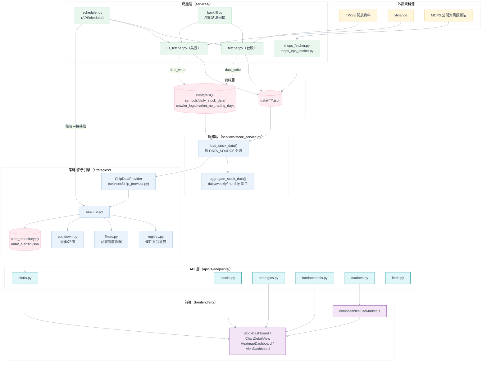
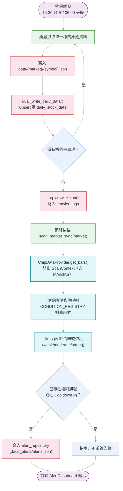
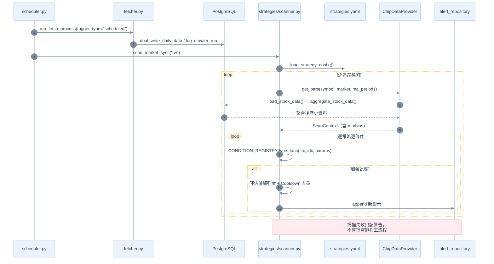
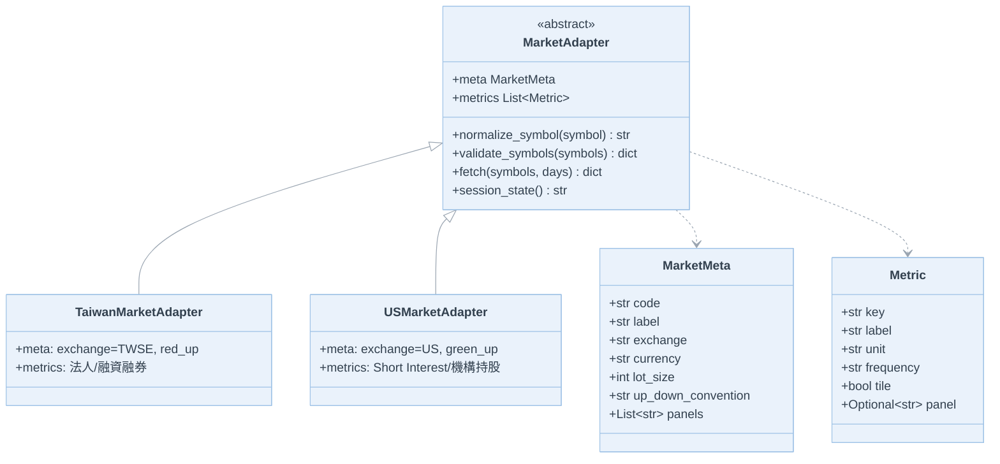
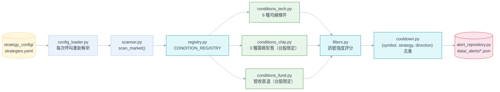

# 系統設計規格書（MyStock 台股／美股股市儀表板）

**模組**：全系統（爬蟲層 / 資料層 / 策略引擎 / API 層 / 前端）
**版本**：v1.0
**日期**：2026-08-15
**對應現況**：PostgreSQL 導入 Phase 1～4 已完成，`DATA_SOURCE=postgres` 已生效（詳見 [資料庫設計規格書](../資料庫設計/資料庫設計規格書.md)）

---

## 1. 功能說明

MyStock 是個人使用的台股／美股市場儀表板：爬蟲（TWSE 開放資料／`yfinance`／MOPS）每日抓取 K 線、
三大法人買賣超、融資融券（台股限定）與月營收／季報 EPS（台股限定）等資料，經 FastAPI 後端整理、
聚合、跑過設定驅動（config-driven）的技術面／籌碼面／基本面警示策略引擎後，由 Vue 3 + PrimeVue 前端
呈現 K 線圖、熱力圖與警示儀表板。

**核心設計原則**：

| 原則 | 說明 |
| :--- | :--- |
| 市場抽象化 | 台股/美股差異（貨幣、單位、紅漲綠跌慣例、可用面板）集中在 `markets/` 的 `MarketAdapter`，業務邏輯不寫死 `if market == "xx"` |
| 資料來源單一分岔點 | `services/stock_service.load_stock_data()` 是唯一依 `DATA_SOURCE` 切換 JSON/PostgreSQL 的位置 |
| 條件與資料解耦 | 策略條件函式只讀 `ScanContext.ma`/`.bias` 等預先算好的值，不重新計算指標，確保與前端圖表數字一致 |
| 設定驅動 | 策略門檻在 `strategy_config/strategies.yaml`，改門檻是 YAML 編輯，不需改程式碼、不需部署 |
| 容錯優先 | PostgreSQL 雙寫、策略掃描、通知等「非核心」流程失敗只記警告，絕不拖垮爬蟲主流程 |
| JSON 為爬蟲側真相來源 | 爬蟲永遠先寫 JSON 再雙寫 DB；JSON 本身是可重新下載的每日快取，已排除在版控之外（見第 12 節） |

---

## 2. 系統架構圖

---

## 3. 模組總覽表

| 模組 | 路徑 | 職責 |
| :--- | :--- | :--- |
| 市場抽象層 | `backend/markets/` | `MarketAdapter`（ABC）+ `MarketMeta`/`Metric`；`tw.py`/`us.py` 實作貨幣、單位、面板等市場差異 |
| 爬蟲層 | `backend/services/fetcher.py`, `us_fetcher.py`, `mops_fetcher.py`, `mops_eps_fetcher.py` | 抓取 OHLCV／籌碼／營收／EPS，寫 JSON 並雙寫 DB |
| 排程層 | `backend/services/scheduler.py`, `backfill.py` | `AsyncIOScheduler` 定時觸發；啟動時背景回補歷史缺漏 |
| 資料存取層 | `backend/db/`, `backend/repositories/stock_repository.py` | SQLAlchemy Model、`StockRepository`（唯一 SQL 入口）、JSON⇄DB 映射（`db/mapping.py`） |
| 服務層 | `backend/services/stock_service.py`, `chip_provider.py` | 讀取切換、資料聚合（daily/weekly/monthly）、供策略引擎使用的 `ScanContext` |
| 策略/警示引擎 | `backend/strategies/` | YAML 設定驅動的技術面／籌碼面／基本面訊號掃描與去重 |
| API 層 | `backend/api/v1/endpoints/` | `stocks` / `fetch` / `markets` / `alerts` / `strategies` / `fundamentals` 六組路由 |
| 指標計算 | `backend/indicators/` | `moving_average.py`（SMA/BIAS，須與前端 `movingAverage.js` 數值一致）、`chip.py` |
| 前端 | `frontend/src/` | Vue 3 + PrimeVue + ECharts；`useMarket()` 全域市場狀態、`service/*.js` API 封裝 |

---

## 4. 核心資料流程：爬蟲 → JSON → DB → 分析 → 策略

### 4.1 每日排程總覽

| 市場 | 觸發時間（Asia/Taipei） | 任務 |
| :--- | :--- | :--- |
| 台股 | 14:30（收盤 13:30 後留緩衝） | `run_fetch_process` → 緊接 `scan_market_sync("tw")` |
| 美股 | 06:00（涵蓋夏令/冬令收盤時間） | `run_us_fetch_process` → 緊接 `scan_market_sync("us")` |
| 兩市場 | 服務啟動時（背景執行，不阻塞 `/health`） | `run_startup_backfill()` 依 `market_no_trading_days ∪ daily_stock_data` 計算缺漏並回補 |

> 排程與手動觸發共用 `fetch_status` 單例；若已有任務在跑，本次排程直接跳過、不排隊
> （見 `services/scheduler.py` 的 `_run_if_idle()`）。`AsyncIOScheduler` 而非 `BackgroundScheduler`
> 是因為排程 job 本身是同步阻塞程式碼，由 APScheduler 的執行緒池執行，不佔用 FastAPI 主 event loop。

### 4.2 端到端流程圖

### 4.3 循序圖：抓取＋策略掃描

---

## 5. 多市場抽象設計（Market Adapter）

`markets/base.py` 定義 `MarketAdapter`（ABC），`tw.py`／`us.py` 各自實作。新市場只需新增一個 Adapter，
不在業務邏輯中新增 `if market == "xx"` 分支。

| `MarketMeta` 欄位 | 台股 (`tw.py`) | 美股 (`us.py`) |
| :--- | :--- | :--- |
| `exchange` | `TWSE` | `US` |
| `currency` / `currency_symbol` | `TWD` / `NT$` | `USD` / `$` |
| `lot_size` | 1000（張） | 1（股） |
| `up_down_convention` | `red_up`（紅漲綠跌） | `green_up`（綠漲紅跌） |
| `panels` | `institutional`, `margin`, `table` | `short`, `holders`, `table` |
| 專屬 `Metric` | 外資/投信/自營商買賣超、融資餘額、融券餘額 | Short Interest、Days to Cover、機構持股 |

前端 `useMarket()`（`frontend/src/composables/useMarket.js`）是對應的單例狀態，`currentMarket` 由路由
`:market` 參數驅動並持久化到 `localStorage`，`router.beforeEach` 保證路由與市場狀態同步。

---

## 6. 策略／警示引擎

### 6.1 設定驅動流程

### 6.2 已定義策略一覽

| 策略 ID | 分類 | 適用市場 | 說明 |
| :--- | :--- | :--- | :--- |
| `price_cross_ma` | technical | tw, us | 收盤價突破/跌破月/季/年線 |
| `ma_golden_death_cross` | technical | tw, us | 均線黃金/死亡交叉（5/20、20/60、60/240） |
| `ma_alignment` | technical | tw, us | 均線多頭/空頭排列（含斜率判斷） |
| `ma_squeeze_breakout` | technical | tw, us | 均線糾結後帶量突破 |
| `extreme_bias` | technical | tw, us | 60 日乖離率過大（超買/超賣） |
| `ma_pullback_support` | technical | tw, us | 回踩均線支撐未破 |
| `chip_bottom_turnover` | chip | tw | 底部換手（融資去化＋法人進場） |
| `chip_short_squeeze` | chip | tw | 高檔軋空（券資比＋融券激增） |
| `chip_distribution_top` | chip | tw | 高檔出貨（法人連續賣超＋融資創高） |
| `fundamental_revenue_decline` | fundamental | tw | 月營收年增率連續轉負 |

> 籌碼類策略（`category="chip"`）會排除代號符合台股 ETF/ETN 規則（`00` + 2~6 碼）的標的，
> 避免 ETF 的法人/信用交易語意污染籌碼型態訊號（`scanner.py` 的 `_is_chip_excluded()`）。

### 6.3 訊號強度與去重

- **強度分級**（`_strength()`）：通過 ≥2 個濾網 → `strong`；1 個 → `moderate`；0 個 → `weak`。濾網（如 `volume_confirm`、`candlestick_confirm`、`institutional_buy`）只影響強度分級，**不會**抑制訊號本身。
- **去重**：`(symbol, strategy_id, direction, trade_date)` 完全相同即捨棄；另有 `cooldown.py` 的冷卻窗（`ALERT_COOLDOWN_DAYS`，預設 1 天）避免同一個 regime 每天重複告警。

---

## 7. API 端點總覽

| 資源 | 方法／路徑 | 說明 |
| :--- | :--- | :--- |
| Stocks | `GET /api/v1/stocks` | 系統中所有可用股票與元資料 |
| | `GET /api/v1/stocks/tracked` | 目前追蹤清單（含資料涵蓋範圍） |
| | `POST /api/v1/stocks/tracked` | 新增追蹤代號 |
| | `DELETE /api/v1/stocks/tracked/{stock_id}` | 移除追蹤代號 |
| | `GET /api/v1/stocks/heatmap` | 全市場熱力圖資料 |
| | `GET /api/v1/stocks/{stock_id}/chart-data` | 圖表專用聚合資料（含市場 meta/metrics） |
| | `GET /api/v1/stocks/{stock_id}` | 單一股票歷史明細 |
| Fetch | `POST /api/v1/fetch/trigger` | 手動觸發抓取（背景執行） |
| | `GET /api/v1/fetch/status` | 抓取任務進度與日誌 |
| Markets | `GET /api/v1/markets` | 啟用的市場清單與元資料 |
| | `GET /api/v1/markets/search` | 跨市場代號搜尋驗證 |
| Alerts | `GET /api/v1/alerts` | 查詢警示清單 |
| | `GET /api/v1/alerts/summary` | 今日策略摘要 |
| | `POST /api/v1/alerts/scan` | 手動觸發全市場策略掃描 |
| Strategies | `GET /api/v1/strategies` | 目前生效的策略設定（唯讀，來自 YAML） |
| Fundamentals | `POST /api/v1/fundamentals/revenue/trigger` | 觸發月營收抓取 |
| | `GET /api/v1/fundamentals/revenue/status` | 月營收抓取進度 |
| | `GET /api/v1/fundamentals/revenue/{stock_id}` | 單一股票月營收 |
| | `POST /api/v1/fundamentals/eps/trigger` | 觸發季報 EPS 抓取 |
| | `GET /api/v1/fundamentals/eps/status` | EPS 抓取進度 |
| | `GET /api/v1/fundamentals/eps/{stock_id}` | 單一股票季報 EPS |

**回應信封慣例**：`{"success": bool, "data": ..., "message"?: ..., "error"?: {"code", "message"}}`；
`SymbolNotFoundException` 由 `main.py` 的全域 handler 轉成 `404` + `error.code="SYMBOL_NOT_FOUND"`。

---

## 8. 資料庫與欄位設計

完整 ERD、UML、欄位明細、索引、JSON⇄DB 映射規則已獨立於
[資料庫設計規格書](../資料庫設計/資料庫設計規格書.md)，本文件不重複列出，僅摘要現況：

- 四張表：`symbols`、`daily_stock_data`、`crawler_logs`、`market_no_trading_days`。
- `daily_stock_data.market_specific_data`（JSONB）承載台股籌碼／美股 Short Interest 與機構持股，
  「市場不支援的能力回傳 `NULL`，而非零值」是全系統一致的慣例。
- `DATA_SOURCE=postgres` 已生效，前端讀取全面走 PostgreSQL；爬蟲仍雙寫 JSON + DB（過渡期設計，Phase 5 才會退役 JSON）。

---

## 9. 前端架構簡述

| 項目 | 說明 |
| :--- | :--- |
| 框架 | Vue 3（`<script setup>` Composition API）＋ PrimeVue（Aura 預設，品牌色透過 `_common-brass.scss` 覆蓋） |
| 圖表 | `vue-echarts` |
| 路由 | 單一 `AppLayout` 殼層；`/stock/:id` 系列舊路由重導向至 `:market/...` 對應路由 |
| 市場狀態 | `composables/useMarket.js` 全域單例，`router.beforeEach` 依 `:market` 路由參數同步 |
| API 封裝 | `service/*.js`（`stockApi.js`、`alertApi.js`）共用 `apiClient`（`VITE_API_BASE`，預設 `http://localhost:8000/api/v1`） |
| 主要頁面 | `StockDashboard.vue`、`ChartDetailView.vue`、`HeatmapDashboard.vue`、`AlertDashboard.vue` |

---

## 10. 設定與環境變數矩陣（`backend/.env` / `config.py`）

| 變數 | 預設值 | 說明 |
| :--- | :--- | :--- |
| `STOCK_CODES` / `US_STOCK_CODES` | 內建預設清單 | 逗號分隔的追蹤代號 |
| `MONTHS_RANGE` | `3` | 圖表預設回溯月數 |
| `QUARTERS_RANGE` | `4` | 季報 EPS 回溯季數 |
| `ENABLED_MARKETS` | `tw,us` | Feature Flag，可隨時移除 `us` 關閉美股功能 |
| `DATA_SOURCE` | `json`（本機 `.env` 已設為 `postgres`） | 讀取來源切換 |
| `POSTGRES_DB/USER/PASSWORD/HOST/PORT` | - | PostgreSQL 連線資訊 |
| `BACKFILL_MAX_DAYS` | `90` | 啟動回補檢查回望天數 |
| `STRATEGY_CONFIG_PATH` | `strategy_config/strategies.yaml` | 策略設定檔路徑 |
| `ALERT_COOLDOWN_DAYS` | `1` | 同一訊號冷卻天數 |

---

## 11. 開發鐵則

| 規則 | 說明 |
| :--- | :--- |
| 資料來源分岔點唯一 | 任何新讀取邏輯只能加在 `stock_service.load_stock_data()`，不可在呼叫端各自 `if DATA_SOURCE == ...` |
| 策略條件不得自算指標 | 條件函式只能讀 `ScanContext.ma`/`.bias`，確保與前端 K 線圖數字一致 |
| API 層不得走同步橋接 | 一律 `await` 原生 async 方法，不可呼叫 `StockRepository.run_async()`/`*_sync()`（會導致每請求各開一次連線池） |
| 新市場只加 Adapter | 禁止在業務邏輯中新增 `if market == "xx"` 分支 |
| 非核心流程容錯 | PostgreSQL 雙寫、策略掃描失敗只記警告，不得讓爬蟲主流程失敗 |
| Flyway 遷移只能新增 | 禁止修改已套用的 `Vn__xxx.sql`，異動一律新增 `Vn+1__Fix_xxx.sql` |
| 策略門檻不寫死程式碼 | 一律放 `strategy_config/strategies.yaml`，程式只負責解讀 |
| 爬蟲 JSON 不進版控 | `backend/data/**/*.json`（除 `_alerts/` 外）已排除在 git 之外，見第 12 節 |

---

## 12. 已知限制與待辦

| 項目 | 說明 |
| :--- | :--- |
| Phase 5（JSON 退役）尚未執行 | 需先驗證連續多日雙寫零差異＋備份還原演練（詳見資料庫設計規格書 §12） |
| 美股非交易日 | `market_no_trading_days` 對 `us` 市場暫不會自動填入 |
| 月營收/EPS 尚未雙寫 | 目前僅 JSON 落地，未建立對應資料表 |
| 爬蟲 JSON 快取已排除版控 | `backend/data/*.json`、`backend/data/tw/*.json`、`backend/data/us/*.json`、
  `backend/data/_no_trading_days.json` 已加入 `.gitignore` 並從既有版控移除（`git rm --cached`）；
  `backend/data/_alerts/*.json`（警示狀態，非爬蟲下載資料）維持版控，因為 PostgreSQL 尚未承接警示記錄 |
| 連續失敗告警尚未串接 | `crawler_logs.status='failed'` 目前只落地紀錄，尚未接上通知系統 |

---

## 13. 參考文件索引

- [資料庫設計規格書](../資料庫設計/資料庫設計規格書.md)
- [`multi_market_tw_us_design.md`](../../multi_market_tw_us_design.md) — 多市場切換設計
- [`策略管理架構-設計規格書.md`](../../1.策略管理模組/策略管理架構-設計規格書.md)
- [`均線策略.md`](../../2.%20均線策略警示系統/均線策略.md)
- [`籌碼選股.md`](../../5.籌碼選股策略/籌碼選股.md)
- [`postgresql_migration_and_scheduling_design.md`](../../4.資料轉存到postgressql/postgresql_migration_and_scheduling_design.md)
