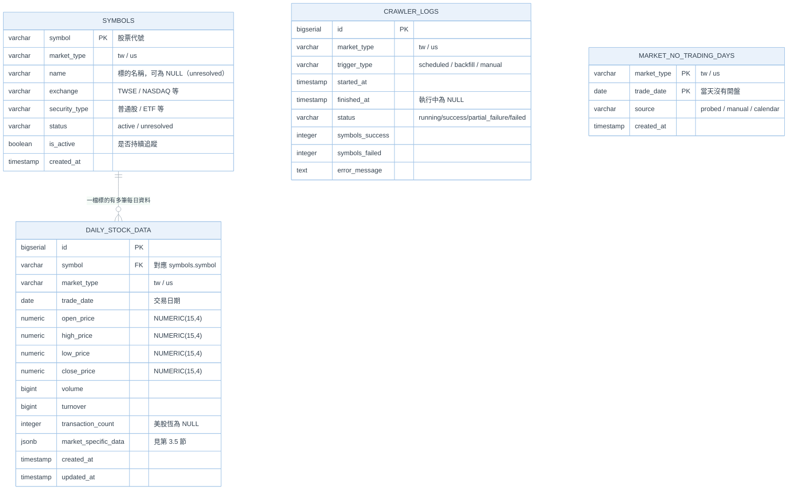
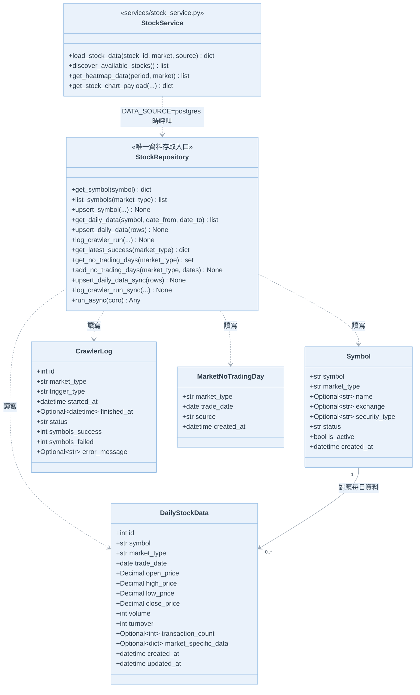
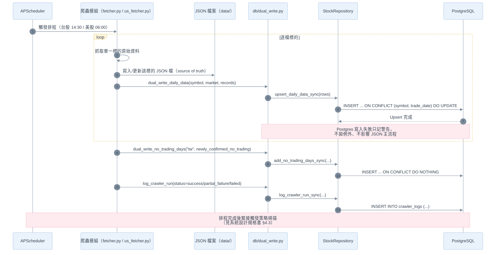
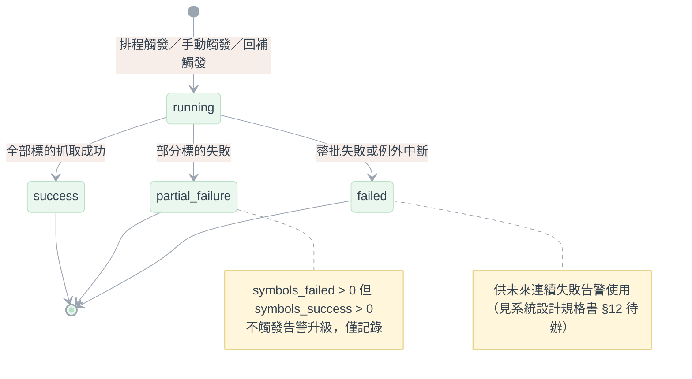

# 資料庫設計規格書（PostgreSQL）

**模組**：資料儲存層（`symbols` / `daily_stock_data` / `crawler_logs` / `market_no_trading_days`）
**版本**：v1.0（對應 PostgreSQL 導入 Phase 1～4 已完成狀態）
**日期**：2026-08-15
**狀態**：✅ 已上線 —— `backend/.env` 的 `DATA_SOURCE=postgres` 已生效，前端所有讀取 API 皆已改走 PostgreSQL。

---

## 0. 現況總覽（本系統的資料是否已儲存到 PostgreSQL？）

**結論：是，已完成並已切換為主要讀取來源。** 現況如下：

| 階段 | 內容 | 狀態 |
| :--- | :--- | :--- |
| Phase 1 | Docker Compose（`db` + `flyway` + `backup`）、Flyway 遷移建表 | ✅ 完成 |
| Phase 2 | SQLAlchemy Model、`StockRepository`、一次性歷史資料匯入、爬蟲雙寫（JSON + Postgres） | ✅ 完成 |
| Phase 3 | 讀取路徑切換（`DATA_SOURCE=json\|postgres`），API 全面改用 `load_stock_data()` | ✅ 完成，已用 `scripts/compare_data_sources.py` 驗證 0 差異 |
| Phase 4 | `APScheduler` 排程（台股 14:30 / 美股 06:00）＋ 啟動時歷史缺漏自動回補 | ✅ 完成 |
| Phase 5 | JSON 完全退役（停寫 JSON、`git rm --cached` 舊資料、移除 `load_stock_json`） | ⏸️ 刻意保留，需先完成連續多日雙寫零差異＋備份還原演練 |

> 目前架構仍是「**JSON 為寫入時的原始真相來源，PostgreSQL 為雙寫＋主要讀取來源**」的過渡狀態（見第 9 節）。
> 爬蟲每天寫入的個股 JSON 快取（`backend/data/**/*.json`）僅是可重新下載的暫存檔，已排除在版控之外
> （見 [系統設計規格書](../系統規格書/系統設計規格書.md) 第 12 節）。

本文件是圖像化＋欄位權威定義的整合版，內容取材並延伸自原始設計文件：
[`postgresql_migration_and_scheduling_design.md`](../../4.資料轉存到postgressql/postgresql_migration_and_scheduling_design.md)、
[`database_design_erd_uml.md`](../../4.資料轉存到postgressql/database_design_erd_uml.md)、
[`phase3_5_read_switch_scheduler_retirement_design.md`](../../4.資料轉存到postgressql/phase3_5_read_switch_scheduler_retirement_design.md)。
異動欄位定義時，應同步更新本文件與程式碼中的 `backend/db/models.py`。

---

## 1. 系統資料儲存架構圖

```mermaid
%%{init: {
  "theme": "base",
  "themeVariables": {
    "background": "#ffffff",
    "primaryColor": "#EAF2FB",
    "primaryBorderColor": "#9EC2E6",
    "primaryTextColor": "#33414F",
    "lineColor": "#9AA5B1",
    "textColor": "#33414F",
    "fontFamily": "Segoe UI, sans-serif"
  }
}}%%
flowchart TD
    subgraph SRC ["外部資料源"]
        TWSE["TWSE 開放資料<br/>(三大法人/融資融券)"]
        YF["yfinance<br/>(美股 OHLCV/Short Interest)"]
        MOPS["MOPS<br/>(月營收/季報 EPS)"]
    end

    subgraph CRAWL ["爬蟲層 services/"]
        FETCHER["fetcher.py<br/>(台股)"]
        USFETCHER["us_fetcher.py<br/>(美股)"]
        MOPSFETCHER["mops_fetcher.py<br/>mops_eps_fetcher.py"]
    end

    subgraph JSONSTORE ["JSON 檔案（原始真相來源）"]
        JSONFILES[("data/tw/*.json<br/>data/us/*.json<br/>data/tw/*_revenue.json")]
    end

    subgraph DUALWRITE ["雙寫橋接 db/dual_write.py"]
        DW["dual_write_daily_data()<br/>dual_write_no_trading_days()<br/>log_crawler_run()"]
    end

    subgraph PG [("PostgreSQL")]
        SYM[("symbols")]
        DAILY[("daily_stock_data")]
        LOG[("crawler_logs")]
        NOTRADE[("market_no_trading_days")]
    end

    subgraph READ ["讀取切換 services/stock_service.py"]
        LOADFN["load_stock_data()<br/>依 DATA_SOURCE 分流"]
    end

    subgraph API ["API 層 api/v1/endpoints/"]
        APIROUTES["stocks / alerts / strategies / fundamentals"]
    end

    TWSE --> FETCHER
    YF --> USFETCHER
    MOPS --> MOPSFETCHER

    FETCHER --> JSONFILES
    USFETCHER --> JSONFILES
    MOPSFETCHER --> JSONFILES

    FETCHER --> DW
    USFETCHER --> DW
    DW --> SYM
    DW --> DAILY
    DW --> LOG
    DW --> NOTRADE

    JSONFILES -. "DATA_SOURCE=json 時讀此" .-> LOADFN
    DAILY -. "DATA_SOURCE=postgres 時讀此（現行）" .-> LOADFN
    SYM -.-> LOADFN

    LOADFN --> APIROUTES

    style TWSE fill:#FFF6DC,stroke:#E8D48B,color:#33414F
    style YF fill:#FFF6DC,stroke:#E8D48B,color:#33414F
    style MOPS fill:#FFF6DC,stroke:#E8D48B,color:#33414F
    style FETCHER fill:#EAF7EE,stroke:#B7E0C4,color:#33414F
    style USFETCHER fill:#EAF7EE,stroke:#B7E0C4,color:#33414F
    style MOPSFETCHER fill:#EAF7EE,stroke:#B7E0C4,color:#33414F
    style JSONFILES fill:#FDEBEF,stroke:#F3B6C4,color:#33414F
    style DW fill:#EAF2FB,stroke:#9EC2E6,color:#33414F
    style SYM fill:#FDEBEF,stroke:#F3B6C4,color:#33414F
    style DAILY fill:#FDEBEF,stroke:#F3B6C4,color:#33414F
    style LOG fill:#FDEBEF,stroke:#F3B6C4,color:#33414F
    style NOTRADE fill:#FDEBEF,stroke:#F3B6C4,color:#33414F
    style LOADFN fill:#EAF2FB,stroke:#9EC2E6,color:#33414F
    style APIROUTES fill:#E0F7FA,stroke:#00838F,color:#33414F
```

> **爬蟲寫入為何仍先寫 JSON？** 過渡期採「雙軌並行」策略：爬蟲永遠先落地 JSON（source of truth），
> 再 best-effort 呼叫 `dual_write_daily_data()` 寫入 Postgres；Postgres 寫入失敗只記警告，不影響 JSON 主流程與爬蟲成功與否
> （見 `db/dual_write.py` 開頭註解）。

---

## 2. ERD（實體關聯圖）



> `crawler_logs` 與 `market_no_trading_days` 皆刻意**不**外鍵指向 `symbols`：
> 前者聚合層級是「一次市場批次」，後者是「市場層級的日曆事實」，兩者都與單一標的無關，
> 圖上呈現的是實際 Schema，不是為了畫面美觀硬加關聯。

**索引摘要**（完整定義見第 4 節）：

| Table | 索引 | 用途 |
| :--- | :--- | :--- |
| `daily_stock_data` | Unique `(symbol, trade_date)` | Upsert 基準，防重複寫入 |
| `daily_stock_data` | `(trade_date, market_type)` | 範圍查詢／市場分區 |
| `daily_stock_data` | GIN `(market_specific_data)` | JSON 存在性／包含查詢（`?`、`@>`） |
| `daily_stock_data` | Expression B-tree（外資買賣超） | 數值範圍過濾，GIN 涵蓋不到 |
| `crawler_logs` | `(market_type, started_at)` | 查詢某市場最近一次執行 |
| `market_no_trading_days` | PK `(market_type, trade_date)` | 判斷「缺漏」vs「當天沒開盤」 |

---

## 3. 資料表欄位明細

### 3.1 `symbols`（追蹤標的管理表）

| 欄位 | 型別 | 允許 NULL | 說明 |
| :--- | :--- | :---: | :--- |
| `symbol` | `VARCHAR(20)` PK | 否 | 股票代號，如 `2330`、`AAPL` |
| `market_type` | `VARCHAR(10)` | 否 | `tw` / `us` |
| `name` | `VARCHAR(100)` | 是 | 公司/標的名稱；`status='unresolved'` 時可為 NULL |
| `exchange` | `VARCHAR(20)` | 是 | `TWSE` / `NASDAQ` 等 |
| `security_type` | `VARCHAR(20)` | 是 | 普通股 / ETF 等 |
| `status` | `VARCHAR(20)` | 否 | `active` / `unresolved`，預設 `active` |
| `is_active` | `BOOLEAN` | 否 | 是否持續追蹤更新，預設 `TRUE` |
| `created_at` | `TIMESTAMP` | 否 | 建立時間，`DEFAULT NOW()` |

### 3.2 `daily_stock_data`（每日個股交易資料表）

| 欄位 | 型別 | 允許 NULL | 對應爬蟲原始欄位（台股 / 美股） |
| :--- | :--- | :---: | :--- |
| `id` | `BIGSERIAL` PK | 否 | - |
| `symbol` | `VARCHAR(20)` FK→`symbols.symbol` | 否 | - |
| `market_type` | `VARCHAR(10)` | 否 | - |
| `trade_date` | `DATE` | 否 | JSON key / `date` |
| `open_price` | `NUMERIC(15,4)` | 是 | `開盤價` / `open` |
| `high_price` | `NUMERIC(15,4)` | 是 | `最高價` / `high` |
| `low_price` | `NUMERIC(15,4)` | 是 | `最低價` / `low` |
| `close_price` | `NUMERIC(15,4)` | 是 | `收盤價` / `close`（`0` 視為缺值，見下方說明） |
| `volume` | `BIGINT` | 是 | `成交股數(股)` / `volume` |
| `turnover` | `BIGINT` | 是 | `成交金額(元)` / `amount` |
| `transaction_count` | `INTEGER` | 是 | `成交筆數(筆)` / 無（美股恆 NULL） |
| `market_specific_data` | `JSONB` | 是 | 見第 3.5 節 |
| `created_at` | `TIMESTAMP` | 否 | `DEFAULT NOW()` |
| `updated_at` | `TIMESTAMP` | 否 | 每次 Upsert 更新為 `NOW()` |

> **`close_price = 0` 的歷史包袱**：爬蟲失敗時曾以 `0.0` 補洞造成假資料（`scripts/restore_price_from_legacy.py` 修復過一次）；
> `stock_service.py` 現在把 `0` 視為「當天未回補到行情」的缺值，聚合與策略引擎（`ChipDataProvider._clean()`）都據此排除，
> 而非當作合法股價。

### 3.3 `crawler_logs`（爬蟲執行紀錄表）

| 欄位 | 型別 | 允許 NULL | 說明 |
| :--- | :--- | :---: | :--- |
| `id` | `BIGSERIAL` PK | 否 | - |
| `market_type` | `VARCHAR(10)` | 否 | `tw` / `us` |
| `trigger_type` | `VARCHAR(20)` | 否 | `scheduled` / `backfill` / `manual` |
| `started_at` | `TIMESTAMP` | 否 | - |
| `finished_at` | `TIMESTAMP` | 是 | 執行中為 NULL |
| `status` | `VARCHAR(20)` | 否 | `running`/`success`/`partial_failure`/`failed`（應用層維護，非 DB CHECK 約束） |
| `symbols_success` | `INTEGER` | 否 | 預設 `0` |
| `symbols_failed` | `INTEGER` | 否 | 預設 `0` |
| `error_message` | `TEXT` | 是 | 失敗訊息摘要 |

### 3.4 `market_no_trading_days`（市場非交易日快取）

| 欄位 | 型別 | 允許 NULL | 說明 |
| :--- | :--- | :---: | :--- |
| `market_type` | `VARCHAR(10)` PK | 否 | `tw` / `us` |
| `trade_date` | `DATE` PK | 否 | 當天沒開盤 |
| `source` | `VARCHAR(20)` | 否 | `probed`（爬蟲探測）/ `manual` / `calendar`，預設 `probed` |
| `created_at` | `TIMESTAMP` | 否 | `DEFAULT NOW()` |

> 取代原本 `data/_no_trading_days.json` 快取檔的角色，讓「缺漏」與「當天沒開盤」可在 DB 層被區分，
> 避免 `services/backfill.py` 的啟動回補檢查每次都重抓假日。美股目前沒有非交易日來源（yfinance 不回傳假日資訊），
> 此表對 `us` 市場暫不會自動填入，屬已知限制（見 [系統設計規格書](../系統規格書/系統設計規格書.md) 第 12 節）。

### 3.5 `market_specific_data` JSONB 結構

**台股（`market_type='tw'`）**：

```json
{
  "institutional_investors": {
    "foreign_net_buy": -8703,
    "investment_trust_net_buy": 0,
    "dealer_net_buy": 5800,
    "total_net_buy": -13609,
    "estimated_net_buy_amount": -140580.97
  },
  "margin_trading": {
    "margin_purchase": 863,
    "margin_sale": 1025,
    "margin_cash_repayment": 36,
    "margin_prev_balance": 25389,
    "margin_balance": 25191,
    "short_purchase": 133,
    "short_sale": 230,
    "short_cash_repayment": 0,
    "short_prev_balance": 476,
    "short_balance": 573,
    "margin_short_offset": 19
  }
}
```

**美股（`market_type='us'`）**：

```json
{
  "short_interest": { "shares_short": 12345678, "short_ratio": 2.3 },
  "institutional": { "shares_held": 987654321 }
}
```

> **不支援的能力回傳 `NULL`，而非空物件 `{}`或零值**：例如美股沒有三大法人/融資融券概念，
> 整個 `market_specific_data` 或其子鍵直接不存在，前端才能正確分辨「這個市場沒有此資料」與「這檔剛好是 0」。
> 中文鍵的融資/融券明細欄位（如 `融資買進(張)`）只存在於原始 JSON、不寫入 DB——下游聚合與前端都沒有使用它們
> （見第 8 節「已知且刻意排除的欄位」）。

---

## 4. 索引設計（Flyway 遷移腳本節錄）

```sql
-- V1__Create_symbols_and_daily_data.sql
CREATE UNIQUE INDEX uq_daily_stock_data_symbol_trade_date ON daily_stock_data (symbol, trade_date);
CREATE INDEX idx_daily_stock_data_trade_date_market ON daily_stock_data (trade_date, market_type);
CREATE INDEX idx_daily_stock_data_market_specific_data ON daily_stock_data USING GIN (market_specific_data);
CREATE INDEX idx_daily_foreign_net_buy ON daily_stock_data (
    ((market_specific_data->'institutional_investors'->>'foreign_net_buy')::numeric)
);
CREATE INDEX idx_crawler_logs_market_started ON crawler_logs (market_type, started_at);

-- V2__Create_market_no_trading_days.sql
-- PRIMARY KEY (market_type, trade_date) 本身即索引，無需額外建立
```

> 若某個 `market_specific_data` 巢狀欄位查詢頻率高到需要常態排序/範圍掃描，
> 應考慮直接升級為結構化欄位（新增 Flyway 遷移），而非長期留在 JSONB 內用 Expression Index 硬撐。

---

## 5. UML 類別圖（資料存取層）



> `run_async()` 是同步爬蟲模組（`fetcher.py`/`us_fetcher.py`）呼叫 async Repository 的橋接函式；
> 每次呼叫都是獨立的 `asyncio.run()`，結束前必須 `dispose_engine()` 釋放連線池，
> 否則第二次呼叫會因沿用綁定在舊 event loop 的 `asyncpg` 連線而炸掉（`Event loop is closed`）——
> 這是本專案已踩過並修正的坑，API 層讀取**絕對不能**走這條橋接路徑，必須直接 `await` 原生 async 方法。

---

## 6. 循序圖：雙寫 Upsert 流程



---

## 7. 狀態圖：`crawler_logs.status` 生命週期



---

## 8. JSON ⇄ DB 欄位對照（`db/mapping.py`）

`record_to_daily_row()`（JSON → 資料列）與 `daily_row_to_record()`（資料列 → JSON 形狀）並排維護在同一檔案，
避免加欄位時只改到一邊。下表為對照關係：

| JSON 鍵 | `daily_stock_data` 欄位 | 說明 |
| :--- | :--- | :--- |
| `open` / `high` / `low` / `close` | `open_price` / `high_price` / `low_price` / `close_price` | 直接對應 |
| `volume` | `volume` | 成交股數 |
| `amount` | `turnover` | 成交金額 |
| `trades` | `transaction_count` | 成交筆數，美股無此欄位 |
| `foreign_buy_sell` 等 5 個法人欄位 | `market_specific_data.institutional_investors.*` | 台股限定 |
| `margin_balance` / `short_balance` | `market_specific_data.margin_trading.margin_balance` / `.short_balance` | 唯二會被反向還原的中文明細欄位（英文鍵） |
| `短_interest` / `short_ratio` | `market_specific_data.short_interest.*` | 美股限定 |
| `institutional_holders` | `market_specific_data.institutional.shares_held` | 美股限定 |

**已知且刻意排除的差異**（`scripts/compare_data_sources.py` 已驗證 0 差異後仍保留的例外，非 bug）：

1. 中文鍵的融資/融券明細欄位（`融資買進(張)`、`融資賣出(張)` 等）——只存在 JSON，前端沒用到，不反向映射回 `daily_row_to_record()`。
2. `name` / `stock_name`——早期 `backfill_daily_quotes()` 寫入的 JSON 記錄沒有 `name`，Postgres 版一律補齊，屬改善非退化。
3. 浮點數容忍度用 `1e-4` 而非 `1e-9`——`NUMERIC(15,4)` 本來就只存 4 位小數，美股（yfinance 還原股利/分割）小數位數更長，落地本來就會四捨五入。

---

## 9. 讀寫切換機制（`DATA_SOURCE`）

- `config.get_data_source()` 讀取 `.env` 的 `DATA_SOURCE`（`json` | `postgres`），不合法值一律退回 `json`，避免設定打錯字讓服務起不來。
- `services/stock_service.load_stock_data(stock_id, market, source=None)` 是唯一讀取接縫：`source` 參數可覆蓋 `DATA_SOURCE`，
  僅供 `scripts/compare_data_sources.py` 兩邊比對使用，一般呼叫端不需傳入。
- `discover_available_stocks()` / `get_heatmap_data()` / `get_stock_chart_payload()` 皆已改為 `async def`，
  API 層（`api/v1/endpoints/stocks.py` 等）一律 `await` 這些原生 async 方法，**不會**經過 `StockRepository.run_async()` 橋接，
  否則每個 HTTP 請求都會建立＋丟棄一次 `asyncpg` 連線池。
- 目前 `backend/.env` 已設定 `DATA_SOURCE=postgres`，即前端目前看到的所有圖表/清單資料皆來自 PostgreSQL。

---

## 10. Migration 版本控管（Flyway）

| 版本 | 檔名 | 內容 |
| :--- | :--- | :--- |
| V1 | `V1__Create_symbols_and_daily_data.sql` | 建立 `symbols`、`daily_stock_data`、`crawler_logs` 與全部索引 |
| V2 | `V2__Create_market_no_trading_days.sql` | 建立 `market_no_trading_days`，支援 Phase 4 回補防重 |

**規則**：
- Flyway 社群版不支援自動 `undo migrate`，任何遷移一旦套用即不可自動逆轉，因此每個 `Vn__xxx.sql` 都應設計成向前相容的小步異動。
- 若寫錯，新增 `Vn+1__Fix_xxx.sql` 補救，**絕不修改已套用的舊遷移檔**。
- `docker compose up -d` 需在 `backend/` 目錄下執行（未使用 `--env-file`，靠工作目錄讀到同層 `.env`），
  `flyway` 服務以 `depends_on: db: condition: service_healthy` 等待資料庫就緒後才執行遷移。

---

## 11. 備份與還原策略

- `docker-compose.yml` 的 `backup` 服務（`prodrigestivill/postgres-backup-local:15`）每日（`SCHEDULE=@daily`）執行 `pg_dump`，
  壓縮檔輸出至主機掛載的 `./backups` 目錄（容器被刪除、映像升級都不影響已備份檔案）。
- 保留策略：`BACKUP_KEEP_DAYS=30` / `BACKUP_KEEP_WEEKS=4` / `BACKUP_KEEP_MONTHS=6`，超過保留期自動清除舊檔，`./backups` 不會無限成長。
- **尚未完成**：實際備份還原演練（Phase 5 前置條件之一），見第 12 節。

---

## 12. 已知限制與後續規劃

| 項目 | 說明 |
| :--- | :--- |
| Phase 5 尚未執行 | 需先驗證「連續 7 天雙寫零差異」＋完成備份還原演練，才可停寫 JSON、`git rm -r --cached backend/data`、移除 `load_stock_json` 等舊邏輯 |
| 美股非交易日 | `market_no_trading_days` 對 `us` 市場目前不會自動填入（yfinance 不回傳假日資訊），每次啟動可能對美股已知假日重複嘗試一次，影響有限 |
| `crawler_logs` 尚無告警串接 | `status='failed'` 目前只落地紀錄，尚未接上 Telegram/Discord 等連續失敗通知（見專案 `docs/9.整合訊息系統_Telegram/`） |
| 月營收/EPS 尚未雙寫 | `services/mops_fetcher.py` / `mops_eps_fetcher.py` 目前僅落地 JSON（`data/tw/{stock_id}_revenue.json`），尚未比照 OHLCV 建立對應資料表 |

---

## 13. 參考文件索引

- [`postgresql_migration_and_scheduling_design.md`](../../4.資料轉存到postgressql/postgresql_migration_and_scheduling_design.md) — 原始規劃文件（Docker Compose、Schema 設計動機、排程與回補設計）
- [`database_design_erd_uml.md`](../../4.資料轉存到postgressql/database_design_erd_uml.md) — 原始 ERD/UML 草稿
- [`phase3_5_read_switch_scheduler_retirement_design.md`](../../4.資料轉存到postgressql/phase3_5_read_switch_scheduler_retirement_design.md) — 讀取切換與 Phase 5 退役規劃
- [系統設計規格書](../系統規格書/系統設計規格書.md) — 完整系統模組與流程說明
