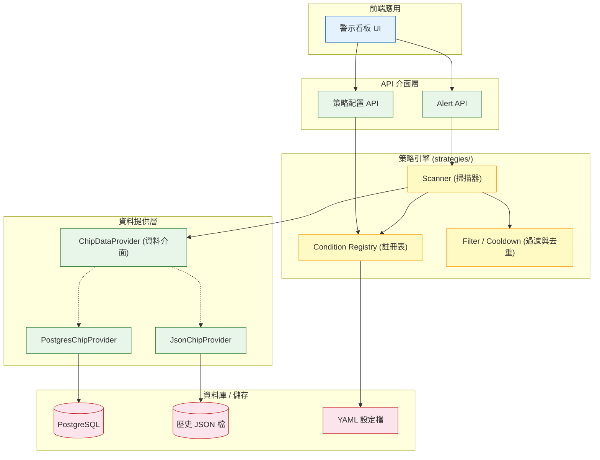
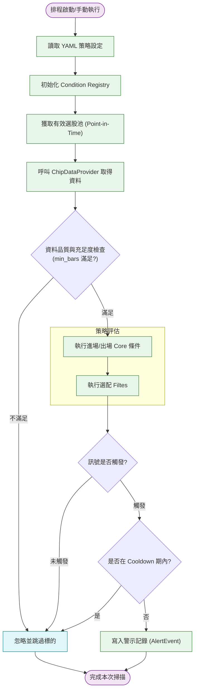
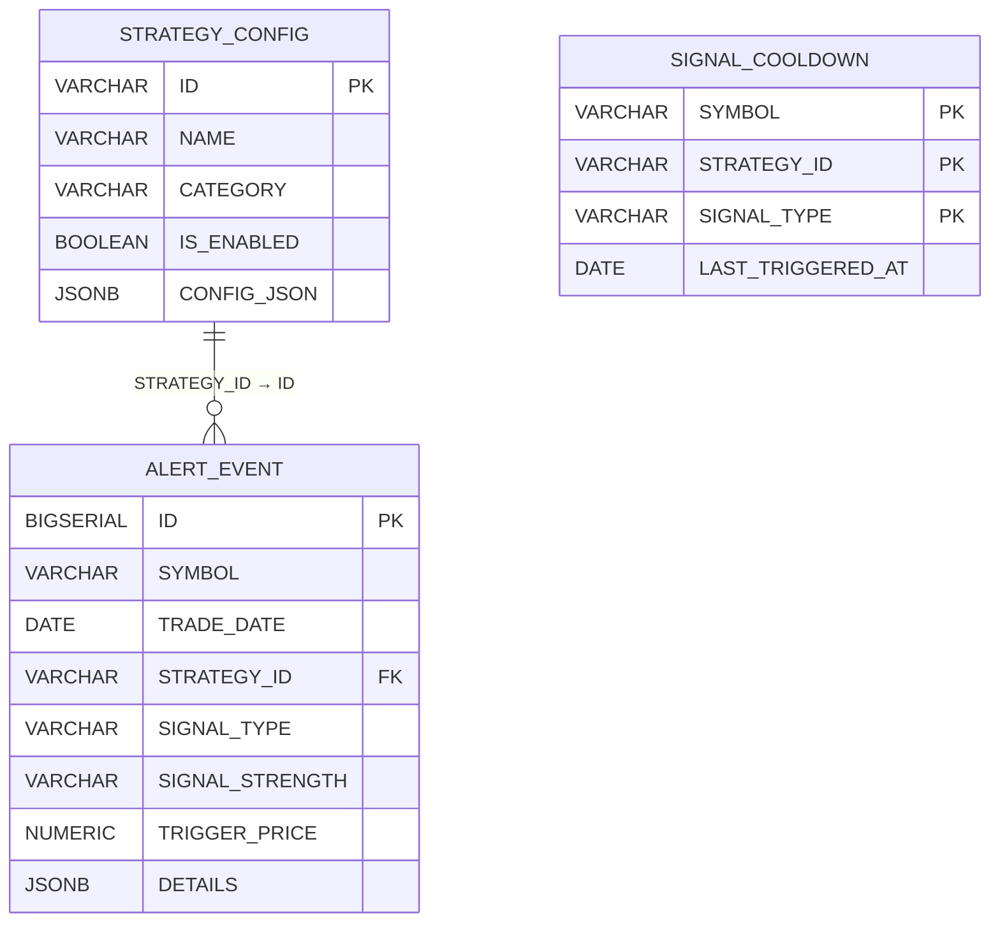

# 策略管理架構 設計規格書

**模組**：策略管理架構
**版本**：v1.0
**日期**：2026-08-13
**作者**：GitHub Copilot

---

## 1. 功能說明

本模組旨在建立一個靈活、可擴展且統一的「策略管理架構」，支援多種選股與警示策略（如技術面破線、籌碼面鬆動、風控與紀律、基本面惡化等）。其核心設計理念是將**策略定義（條件與濾網）**、**資料供應（Data Provider）**與**策略執行引擎（Scanner/Filter）**徹底解耦。

**核心設計原則**：

| 原則 | 說明 |
|---|---|
| **條件與引擎分離** | 策略條件抽象為獨立函數，透過 `Condition Registry` 動態註冊，不修改掃描器核心碼。 |
| **資料存取抽象化** | 策略層只依賴 `ChipDataProvider` 介面，不直接操作 JSON 或 SQL。 |
| **統一配置管理** | 透過 YAML 設定檔定義各策略啟用的條件、濾網、參數與權重。 |
| **獨立資料驗證** | 所有測略執行前必須進行資料充足度與品質檢核（如：不足筆數即跳過）。 |
| **防過度觸發與去重** | 導入訊號去重（Cooldown）機制，確保同一策略同一方向在指定天數內只觸發一次。 |

參考文件：
- [籌碼選股需求](籌碼選股.md)
- [賣股策略](../賣股策略+爬蟲開發/賣股策略.md)
- [爬蟲開發](../賣股策略+爬蟲開發/爬蟲開發.md)

---

## 2. 系統架構圖（Mermaid）

### 整體架構圖



### 核心業務流程：策略掃描與警示觸發



---

## 3. 資料表明細

*(本章節僅列出策略管理本身所需存放的表，不涵蓋基本的 OHLCV 爬蟲表)*

### 策略設定檔與結果關聯表

#### `STRATEGY_CONFIG`
策略靜態設定，可對應 YAML。
| 欄位名 | DB Column | 型別 | 長度 | 非空 | 說明 |
|---|---|---|---|---|---|
| `id` | `ID` | VARCHAR | 50 | Y | 策略唯一識別碼 (PK) |
| `name` | `NAME` | VARCHAR | 100 | Y | 策略名稱 |
| `category` | `CATEGORY` | VARCHAR | 50 | Y | 策略分類 (technical, chip, fundamental, risk) |
| `is_enabled` | `IS_ENABLED` | BOOLEAN | - | Y | 是否啟用 |
| `config_json` | `CONFIG_JSON` | JSONB | - | Y | 序列化後的條件、參數與權重設定 |

#### `ALERT_EVENT`
記錄產生的警示訊號。
| 欄位名 | DB Column | 型別 | 長度 | 非空 | 說明 |
|---|---|---|---|---|---|
| `id` | `ID` | BIGSERIAL | - | Y | 警示唯一碼 (PK) |
| `symbol` | `SYMBOL` | VARCHAR | 20 | Y | 股票代碼 |
| `trade_date` | `TRADE_DATE` | DATE | - | Y | 觸發交易日 |
| `strategy_id` | `STRATEGY_ID` | VARCHAR | 50 | Y | 觸發的策略 ID (FK) |
| `signal_type` | `SIGNAL_TYPE` | VARCHAR | 20 | Y | BUY / SELL / WARNING |
| `signal_strength`| `SIGNAL_STRENGTH` | VARCHAR| 20 | N | 訊號強度 (strong, moderate, weak) |
| `trigger_price` | `TRIGGER_PRICE` | NUMERIC | 10,2 | N | 觸發當下參考價格 (通常是收盤) |
| `details` | `DETAILS` | JSONB | - | N | 觸發當下各條件數值快照 (供回溯) |

#### `SIGNAL_COOLDOWN`
控制去重機制的快取表。
| 欄位名 | DB Column | 型別 | 長度 | 非空 | 說明 |
|---|---|---|---|---|---|
| `symbol` | `SYMBOL` | VARCHAR | 20 | Y | 股票代碼 (PK part 1) |
| `strategy_id` | `STRATEGY_ID` | VARCHAR | 50 | Y | 策略 ID (PK part 2) |
| `signal_type` | `SIGNAL_TYPE` | VARCHAR | 20 | Y | 分向 (PK part 3) |
| `last_triggered_at` | `LAST_TRIGGERED_AT`| DATE| - | Y | 最後觸發日期 |

---

## 4. ER Diagram（Mermaid）



---

## 5. API 端點摘要

### 取得目前生效之警示清單
| 方法 | URL | 說明 | 回傳 |
|---|---|---|---|
| `GET` | `/api/v1/strategies/alerts` | 取回特定交易日或最新區間之警示 | JSON Array |

**參數：**
| 參數 | 型別 | 必填 | 說明 |
|---|---|---|---|
| `date` | String | N | 查詢哪一天的警示 (YYYY-MM-DD)，預設最新一天 |
| `symbol` | String | N | 過濾單檔股票 |
| `strategy_id`| String | N | 過濾特定策略 |

### 取得策略設定檔現況
| 方法 | URL | 說明 | 回傳 |
|---|---|---|---|
| `GET` | `/api/v1/strategies/config` | 取得從 YAML 或 DB 解析出的運作中策略參數 | JSON Object |

---

## 6. 程式清單

| 類別 | 實作檔案 / Package | 說明 |
|---|---|---|
| **Data Provider**| `backend/services/chip_provider.py` | 定義 `ChipDataProvider` 介面及對應的 Postgres 實作 |
| **Registry** | `backend/strategies/registry.py` | 定義裝飾器 `@condition` 以及存放策略規則的註冊表字典 |
| **Conditions** | `backend/strategies/conditions_chip.py`<br>`backend/strategies/conditions_tech.py`<br>`backend/strategies/conditions_risk.py`<br>`backend/strategies/conditions_fund.py` | 實作實際的法規條件函數 (籌碼、技術、風控、基本面) |
| **Scanner** | `backend/strategies/scanner.py` | 策略引擎核心，執行依賴檢查、迴圈調用條件並組合結果 |
| **Filter** | `backend/strategies/cooldown.py` | 處理訊號冷卻去重邏輯 |
| **Repository** | `backend/repositories/alert_repository.py` | 存取 `ALERT_EVENT` 的 DB 操作 |

---

## 7. 關鍵 SQL

### 查詢某日所有強勢警示 (含策略名稱)
```sql
SELECT 
    a.SYMBOL, 
    s.NAME AS STRATEGY_NAME, 
    a.SIGNAL_TYPE,
    a.TRIGGER_PRICE
FROM ALERT_EVENT a
JOIN STRATEGY_CONFIG s ON a.STRATEGY_ID = s.ID
WHERE a.TRADE_DATE = '2026-08-12' 
  AND a.SIGNAL_STRENGTH = 'strong';
```

### 更新/檢查 Cooldown 狀態 (UPSERT)
```sql
INSERT INTO SIGNAL_COOLDOWN (SYMBOL, STRATEGY_ID, SIGNAL_TYPE, LAST_TRIGGERED_AT)
VALUES (:symbol, :strategy_id, :signal_type, :current_date)
ON CONFLICT (SYMBOL, STRATEGY_ID, SIGNAL_TYPE) 
DO UPDATE SET LAST_TRIGGERED_AT = EXCLUDED.LAST_TRIGGERED_AT;
```

---

## 8. 多環境配置

| 環境 | Profile | 關鍵配置差異 |
|---|---|---|
| `DEV` | `dev` | 資料存取可允許 Fallback to JSON `DATA_SOURCE=json` |
| `PROD` | `prod` | 強制使用 PostgreSQL `DATA_SOURCE=postgres`，開啟嚴格排程 |

**環境變數對照表**

| 變數名 | DEV 預設值 | PROD 預設值 | 說明 |
|---|---|---|---|
| `DATA_SOURCE` | `json` | `postgres` | 決定 `ChipDataProvider` 的具體實作注入 |
| `STRATEGY_CONFIG_PATH`| `./config/strategies_dev.yaml`| `./config/strategies.yaml` | 策略設定檔實體路徑 |
| `ALERT_COOLDOWN_DAYS` | `1` | `5` | 預設全域去重天數 |

---

## 9. 鐵則（開發注意事項）

| 規則 | 說明 |
|---|---|
| **不寫死參數** | 均線天數、百分比門檻皆不允許寫死在 code 中，統一自 YAML 或傳入 Context 解析。 |
| **獨立計算法定義**| 所有衍生指標（例如 券資比、乖離率）只能使用 `indicators/` 中先算好的指標回傳值，嚴禁在 strategy condition 中自己算均線或加減乘除。 |
| **強制資料預檢** | 每個註冊的 condition **必須指明** `min_bars` 及 `requires`，如資料不足，引擎負責防呆略過，Condition 無需自行處理 index out of range。 |
| **依賴隔離** | `Scanner` 不允許認識特定的 `JSON` 或 `SQL` 語法，只能依賴 `ChipDataProvider` 的 `get_bars()` 方法。 |

---

## 10. 備註

- **後續相容性**：此架構支援美股市場 (US)；針對美股，目前無「三大法人籌碼」資料，故在 YAML 設定美股執行哪些策略時，不載入 `category: chip` 的策略體即可天然防呆。
- **除權息保護**：若當日或前一日為除權息日，在傳至 Scanner 進行技術面與風控評估時，務必確保 `adj_close` (還原價) 已經正確在資料管線階段 (L2) 就處理完成，Scanner 中不可看見人為斷層。
