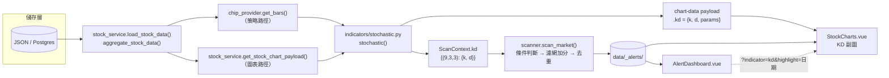

# KD 指標 (Stochastic Oscillator) 整合設計規格書

**模組**：技術指標（`indicators/`）＋ 策略管理（`strategies/`）＋ 前端圖表（`frontend/src/`）
**版本**：v2.1
**日期**：2026-08-16
**狀態**：規格已定案，待開發（本文件為開發前設計規格，不含程式實作）

**參考文件**
- [策略管理架構 設計規格書](../1.策略管理模組/策略管理架構-設計規格書.md)（以下簡稱《策略架構》）
- [均線策略警示系統](../2.%20均線策略警示系統/均線策略.md)（以下簡稱《均線策略》）
- [進出場策略規劃](../11.進出場策略/進出場策略規劃.md)（以下簡稱《進出場》）

---

## 0. 修訂紀錄

| 版本 | 日期 | 主要變更 |
|---|---|---|
| v1.0 | 2026-08-16 | 初版：指標概述、策略構想、前端呈現構想 |
| v2.0 | 2026-08-16 | 改為可直接開發的規格書。重大調整見下表 |
| v2.1 | 2026-08-16 | 原 §12「待決事項」六項全數拍板（見 [§12 決議事項](#12-決議事項已拍板)），決議內容已回填至 §3.2 / §4.3 / §5.2 / §6.1 / §9 / §11。開發前不再有未定議題 |

**v2.0 相對 v1.0 的重大調整（皆為對照現有程式碼盤點後的修正）**

| # | v1.0 的敘述 | v2.0 的修正 | 原因 |
|---|---|---|---|
| 1 | 使用 `talib.STOCH(..., matype=SMA)` | **不引入 TA-Lib**，於 `indicators/stochastic.py` 自行實作台股慣例 KD | TA-Lib 的 `STOCH` 任何 `matype` 都**無法**重現台股慣例的 1/3 遞迴平滑，算出的數字與國內看盤軟體不同；且 TA-Lib 需編譯 C 函式庫，與現有純 pip 安裝流程衝突。見 [ADR-KD-01](#31-adr-kd-01不引入-ta-lib) |
| 2 | 「附加於歷史資料 (DataFrame)」 | 掛在 `ScanContext.kd`，以 `(n, k, d)` 參數組為 key | 本專案策略層的資料載體是 `ScanContext` 的平行 list（`ctx.ma` / `ctx.bias`），沒有 DataFrame。見 [§4](#4-資料供應層整合scancontext-擴充) |
| 3 | 「聲明 `requires`，引擎會自動略過」 | `requires` **目前不存在**，需先擴充 `registry.py` 與 `scanner.py` | 現行 `@condition()` 只收 `type` / `min_bars`，且 `min_bars` 從未被 `scanner.py` 讀取（實際防呆是各條件函式自己 `if idx < N: return []`）。見 [§5.1](#51-前置工作條件註冊表補上-requires-與-min_bars-防呆) |
| 4 | `min_bars = 20` | `min_bars = 35`（RSV 9 + 收斂暖身 25） | 遞迴平滑的種子（50）誤差在 20 根時仍有約 0.3 點、15 根時約 1.8 點。見 [§3.3](#33-暖身期warm-up與-min_bars-推導) |
| 5 | 「規劃趨勢**濾網**降低鈍化假訊號」 | 趨勢／鈍化守衛必須做成 **condition 參數**，不能做成 filter | `strategies/filters.py` 的濾網**只加分不擋訊號**（只影響 `signal_strength`），做成濾網無法減少假訊號。見 [ADR-KD-03](#54-adr-kd-03趨勢與鈍化守衛必須是-condition-參數不是-filter) |
| 6 | 前端「新增 KD 副圖、Checkbox 開關」 | 明定雙 `grid` / `axisPointer.link` / `dataZoom` 連動規格，且 **KD 數值由後端隨 chart-data 一併回傳** | 現有 K 線圖是單一固定高度舞台（`StockCharts.vue`）；KD 若前端自算，會與掃描器的數值不一致（MA 目前已有前後端各算一份的技術債，不應複製）。見 [ADR-KD-04](#62-adr-kd-04kd-由後端計算前端不重算) |
| 7 | 未提及 | 新增 direction 命名與**四處必須同步修改**的清單 | `classify_direction()` 預設回傳 `bullish`，KD 死亡交叉若未登記前綴，會被靜默判定成 BUY 訊號。見 [§5.5](#55-direction-命名與多空分類必改四處) |
| 8 | 未提及 | 新增短區間（1 個月）KD 數值漂移問題與暖身切片規則 | `aggregate_stock_data()` 會先依 `months` 截斷再計算，1 個月區間只有約 20 根 K 棒，KD 不會收斂且與警示的數值對不起來。見 [§6.3](#63-暖身切片規則短區間數值漂移) |
| 9 | 背離「(進階)」一句帶過 | 給出可實作的 pivot 偵測演算法與參數，並明確排入 P2 | 原敘述無法直接開發 |

---

## 1. 目的與範圍

### 1.1 目的
將 **KD 隨機指標**納入本系統，成為繼均線（MA / BIAS）之後第二組「指標 → 策略 → 警示 → 圖表」的完整垂直切片，並且：

1. 指標計算集中於 `indicators/`，策略條件只做 if/else 判斷（《策略架構》§9 鐵則「獨立計算法定義」）。
2. 門檻參數全部落在 `strategy_config/strategies.yaml`，調參不需改程式、不需重啟（《均線策略》AC-7）。
3. 圖表上看到的 K/D 數值，與觸發警示所用的 K/D 數值**必為同一組數字**。
4. 新增功能不得破壞 `CLAUDE.md` 中的兩條硬規則（切換圖表控制項不得整頁 refresh 跳回頂端、KPI 卡片高度一致）。

### 1.2 範圍

| 範圍內 | 範圍外（本階段不做） |
|---|---|
| KD 計算層（`indicators/stochastic.py`） | 回測引擎（無回測模組，KD 參數最佳化只能人工比對） |
| `ScanContext` 擴充、`ChipDataProvider` 預算 | KD 值落 Postgres（決議 D4：不新增資料表／欄位，一律即時計算） |
| KD 交叉策略條件 + YAML 設定 | 盤中即時 KD（現行排程為每日收盤後，`scan_frequency: daily_close`） |
| chart-data payload 擴充 + 前端 KD 副圖 | 分鐘／小時級 KD |
| 警示看板 → 圖表跳轉帶出 KD | KD 背離（列為 P2，本文件只出規格不排入首版） |

### 1.3 名詞

| 名詞 | 定義 |
|---|---|
| RSV | Raw Stochastic Value，未平滑的隨機值 |
| K 值 | RSV 經一次平滑後的快線 |
| D 值 | K 值再經一次平滑後的慢線 |
| 鈍化 (Blunting) | 強勢單邊行情中 K/D 長期黏在 80 以上或 20 以下、久久不交叉的現象 |
| 暖身期 (Warm-up) | 遞迴平滑自種子值收斂到可信賴數值所需的 K 棒數 |
| 參數組 | `(fastk_period, slowk_period, slowd_period)`，例如 `(9, 3, 3)` |

---

## 2. 現況盤點（本次開發要接上的既有接縫）

先確認「哪些東西已經存在、可以直接接」，避免重造或誤用：

| 既有物件 | 位置 | 與 KD 的關係 |
|---|---|---|
| `sma()` / `bias_series()` / `compute_ma_set()` | `backend/indicators/moving_average.py` | KD 計算層要**比照其風格**：只算數值、缺值留 `None` 不補零、`round()` 後回傳 list |
| `ScanContext`（`ma` / `bias` / `volume_ma` dict） | `backend/services/chip_provider.py` | KD 序列掛在這裡，新增 `kd` 欄位 |
| `ChipDataProvider.get_bars(symbol, market, ma_periods, volume_ma_period)` | 同上 | 簽章需再加 `kd_params` |
| `@condition(type=, min_bars=)` 裝飾器 | `backend/strategies/registry.py` | 需擴充 `requires`；`min_bars` 目前是死欄位（未被讀取） |
| `scanner.scan_market()` 主迴圈 | `backend/strategies/scanner.py` | 需加 `min_bars` / `requires` 防呆；需加 KD 的 `_SUGGESTED_ACTION_TEMPLATES` |
| `classify_direction()` / `to_signal_type()` | `backend/strategies/direction.py` | 需登記 KD 的多空前綴（**預設值是 bullish，漏登記會出錯**） |
| `evaluate_filters()`（只加分不擋訊號） | `backend/strategies/filters.py` | KD 可沿用 `volume_confirm` / `institutional_buy` 加分；但趨勢守衛**不可**放這裡 |
| 全域冷卻天數 `get_alert_cooldown_days()` | `backend/config.py` → `scanner.py` | KD 訊號密度遠高於均線，建議加 per-strategy 覆寫（§5.7） |
| `get_stock_chart_payload()` 回傳的 `moving_averages` | `backend/services/stock_service.py:307` | KD 比照新增 `kd` 欄位 |
| 單一圖表舞台（頁籤切換、固定 440px） | `frontend/src/components/StockCharts.vue` | KD 副圖掛在 `kline` 頁籤的 option 裡 |
| `alertMarkPoints`（K 線上的策略觸發三角標記） | 同上，第 200–222 行 | KD 訊號會自動帶出標記；再加 `highlight` 垂直線 |
| `buildMovingAverageSeries()`（前端自算 MA） | `frontend/src/utils/movingAverage.js` | **反例**：後端已回傳 `moving_averages` 卻沒被 `StockCharts.vue` 使用，KD 不重蹈覆轍 |
| `chartExplanations`（各圖說明文字） | `frontend/src/utils/chartExplanations.js` | 需新增 `kd` key |
| `classifyDirection` / `LABEL_PATTERNS` | `frontend/src/utils/alertDirection.js` | 需與後端 `direction.py` 同步 |
| 警示看板 | `frontend/src/views/AlertDashboard.vue` | 目前**沒有**逐列「查看圖表」動作，需新增（§7.5） |

---

## 3. 指標計算規格

### 3.1 ADR-KD-01：不引入 TA-Lib

**決策：不新增 `TA-Lib` 依賴，於 `backend/indicators/stochastic.py` 以純 Python 實作。**

**理由**

1. **TA-Lib 算不出台股慣例的 KD。**
   台股（含港股、陸股看盤軟體）標準 KD 的平滑是遞迴式、平滑係數固定 1/3：

   ```
   RSV_t = (C_t − LLV(L, n)_t) / (HHV(H, n)_t − LLV(L, n)_t) × 100
   K_t   = (2/3) × K_{t−1} + (1/3) × RSV_t
   D_t   = (2/3) × D_{t−1} + (1/3) × K_t
   ```

   TA-Lib `STOCH` 的 `slowk` 是 `MA(fastk, slowk_period, matype)`，其 `MA_Type` 只有 `SMA / EMA / WMA / DEMA / TEMA / TRIMA / KAMA / MAMA / T3`，**沒有** Wilder（SMMA，α = 1/N）平滑。
   - `matype=SMA, slowk_period=3`：等於 RSV 的 3 期簡單平均，與遞迴平滑在趨勢段落差可達數十點。
   - `matype=EMA, slowk_period=3`：α = 2/(3+1) = **0.5**，不是 1/3。
   - `matype=EMA, slowk_period=5`：α = 2/(5+1) = 1/3，係數雖對，但 TA-Lib 的 EMA 以前 5 筆 SMA 作種子、台股慣例以 50 作種子，且 unstable period 處理不同，前段數值仍不一致。

   結論：沿用 v1.0 的 `talib.STOCH(..., matype=SMA)` 會產生一組**與使用者手上任何看盤軟體都對不起來**的 KD，警示也會在不同時間點觸發。

2. **安裝成本與現有流程衝突。** `backend/requirements.txt` 目前全部是純 pip 套件；TA-Lib 需先安裝 C 函式庫（Windows 本機開發需另外處理 wheel／編譯，Docker 映像需加 build stage）。為了一個 20 行的遞迴運算付出這個成本不划算。

3. **與既有規則一致。** `indicators/moving_average.py` 的 `sma()` 已刻意與前端 `movingAverage.js` 的 `sma()` 數值對齊；KD 自行實作才能沿用同一套缺值語意（0 視為缺值、缺值留空不補零）。

**代價與緩解**
- 代價：自行實作需自負正確性。
- 緩解：以 [§10 驗證方式](#10-驗證方式) 的一次性腳本 `scripts/verify_kd.py`，用固定樣本比對「手算結果」與「（可選）臨時環境中的 TA-Lib EMA(5) 近似值」，並與看盤軟體截圖人工抽查 3 檔標的、各 5 個日期。

**若日後仍決定引入 TA-Lib**：本規格的 `compute_kd()` API 契約不變，只換內部實作即可（計算層已與策略層隔離），並須同時在 `backend/Dockerfile` 的 `production`／`development` 兩個 target 都加上 C 函式庫的安裝步驟。

### 3.2 計算規格與邊界條件

**API 契約（`backend/indicators/stochastic.py`）**

```python
def stochastic(
    highs: Series, lows: Series, closes: Series,
    fastk_period: int = 9, slowk_period: int = 3, slowd_period: int = 3,
    seed: float = 50.0, warmup_bars: int = 25,
    smoothing: str = "wilder_1_3",
) -> tuple[Series, Series]:
    """回傳 (k_series, d_series)，長度與輸入相同，未達可信賴條件的位置為 None。"""
```

- `Series = List[Optional[float]]`，與 `moving_average.py` 同一型別別名。
- `slowk_period` / `slowd_period` 在台股慣例下代表平滑係數 `1/period`（3 → 1/3），**不是**簡單移動平均天數；此語意須在 docstring 明講，避免後人誤讀。
- 輸出一律 `round(value, 4)`，比照 `sma()`。

**`smoothing` 參數（[決議 D1](#12-決議事項已拍板)）**

| 值 | 語意 | 本版是否實作 |
|---|---|---|
| `"wilder_1_3"` | 台股慣例遞迴平滑，α = `1/slowk_period` | ✅ 唯一實作 |
| `"sma"` | 歐美慣例，`slowk = SMA(rsv, slowk_period)` | ❌ 保留字，尚未實作 |

- **台股慣例一體適用於台股與美股**，理由見決議 D1。參數存在的目的是把「慣例」變成設定值而非隱含假設，日後要支援歐美慣例時只需補實作、不動任何呼叫端。
- 值來自 YAML `defaults.kd_smoothing`（§4.3），**嚴禁**在任何地方寫 `if market == "us"` 來切換（§11 鐵則）。
- 收到未實作的值時：記一次 warning 並退回 `"wilder_1_3"` 繼續計算，**不得拋例外**。原因是本函式的呼叫點 `get_bars()` 位於 `scanner.py` 的 `try/except` 內，拋例外會讓整檔標的被靜默略過，症狀難以追查。

**邊界條件（全部必須明文實作，不可留給呼叫端）**

| 情境 | 規則 | 理由 |
|---|---|---|
| OHLC 為 `0` 或 `None` | 視為缺值。`ChipDataProvider._clean()` 已對 `0` 做此處理，計算層再自行防呆一次 | 抓不到行情時 fetcher 會寫 `0.0`（見 `scripts/restore_price_from_legacy.py`） |
| 視窗內任一根缺 High/Low/Close | 該根 RSV 為 `None` → 該根 K/D 輸出 `None`，**但遞迴狀態（前一組 K/D）保留不重置** | 重置回 50 會在復牌／補資料後製造假交叉 |
| `HHV == LLV`（區間內高低同價，如連續一價漲停） | `RSV = 50`（中性），不視為缺值 | 避免除以零；50 代表「無方向資訊」 |
| 序列開頭不足 `fastk_period` 根 | K/D 輸出 `None` | 無法算 RSV |
| 已可算 RSV 但未過暖身期 | K/D 輸出 `None`（見 §3.3） | 種子誤差未收斂 |
| 交叉判斷 | 條件函式必須同時取得 `idx` 與 `idx-1` 兩根皆非 `None` 才判斷 | 沿用 `conditions_tech.ma_cross()` 的既有寫法 |

### 3.3 暖身期（Warm-up）與 `min_bars` 推導

種子值固定為 50，其誤差以 (2/3)^n 衰減；D 值多一層遞迴，誤差上界約 `(n+1) × (2/3)^n × 50`：

| 暖身根數 n | K 值種子誤差上界 | D 值種子誤差上界 |
|---|---|---|
| 10 | 0.87 點 | 9.54 點 |
| 15 | 0.11 點 | 1.83 點 |
| 20 | 0.015 點 | 0.32 點 |
| **25** | **0.002 點** | **0.05 點** |

**決策：`warmup_bars = 25`（可由 YAML 覆寫），條件註冊 `min_bars = 35`（RSV 9 根 + 暖身 25 根 + 交叉需回看 1 根）。**

v1.0 提的 `min_bars = 20` 會讓 D 值帶著最高約 2～9 點的種子誤差就開始判斷 80/20 門檻，等同在超買超賣邊界上擲骰子。

### 3.4 資料流



**鐵則：`stochastic()` 只有上圖兩個呼叫點**（`chip_provider` 與 `stock_service`）。條件函式、前端、API endpoint 一律不得再算一次 KD。

---

## 4. 資料供應層整合（`ScanContext` 擴充）

### 4.1 `ScanContext` 新欄位

```python
@dataclass
class KDSeries:
    k: List[Optional[float]]
    d: List[Optional[float]]

@dataclass
class ScanContext:
    ...
    # key 為 (fastk_period, slowk_period, slowd_period)，比照 ctx.ma 以參數為 key 的作法，
    # 讓同一次掃描可同時支援短線 (9,3,3) 與長線 (14,3,3) 兩組策略。
    kd: Dict[Tuple[int, int, int], KDSeries] = field(default_factory=dict)
```

**ADR-KD-02：為什麼以參數組為 key，而不是單一 `kd_k` / `kd_d` 欄位**
`ctx.ma` 已經是 `{period: series}` 的形狀，策略可自由選 MA20 或 MA60；KD 同理——《進出場》規劃了長線與短線兩類策略，若寫死單一組 KD，未來要加 `(14,3,3)` 就得改 `ScanContext` 結構。以參數組為 key 的成本只是多一層 dict。

### 4.2 `get_bars()` 簽章擴充

```python
async def get_bars(
    self, symbol: str, market: str,
    ma_periods: List[int],
    volume_ma_period: int = 5,
    kd_params: Optional[List[Tuple[int, int, int]]] = None,   # 新增
    kd_warmup_bars: int = 25,                                  # 新增
) -> Optional[ScanContext]:
```

- `kd_params` 由 `scanner.scan_market()` 從 `cfg.defaults["kd_params"]` 讀出後傳入，**與 `ma_periods` 完全相同的傳遞路徑**。
- `kd_params` 為 `None` 或空 list 時，`ctx.kd` 為空 dict，KD 條件自然不觸發（不報錯）——與 `ctx.revenue` 在美股為空 dict 的既有處理一致。
- `ChipDataProvider` 已用 `_MAX_HISTORY_MONTHS = 60` 抓全部歷史，暖身期在策略路徑上天然充足，**不需**額外處理（暖身問題只發生在圖表路徑，見 §6.3）。

### 4.3 YAML `defaults` 擴充

```yaml
defaults:
  ma_periods: [5, 10, 20, 60, 120, 240]
  volume_ma_period: 5
  lookback_days: 1
  scan_frequency: "daily_close"
  # ── KD（本次新增）──
  # 預先計算的 KD 參數組，格式 [fastk_period, slowk_period, slowd_period]。
  # 策略條件的 params 必須落在這份清單內，否則掃描時取不到序列會自然略過（並記一次 warning）。
  kd_params:
    - [9, 3, 3]
  kd_warmup_bars: 25
  # 平滑慣例（決議 D1）：台股慣例一體適用於 tw / us。目前只實作 wilder_1_3。
  kd_smoothing: "wilder_1_3"
```

**`kd_smoothing` 為何放在 `defaults` 而非各策略的 `conditions`**：平滑方式是「這套系統對 KD 的定義」，不是單一策略的調參空間；同一次掃描若兩個策略用不同平滑方式，圖表只能畫其中一組，就會回到「圖上數字與警示對不起來」的老問題。

**日後若要 tw / us 分開（決議 D1 的延伸路徑）**：`scan_market()` 與 `get_stock_chart_payload()` 本來就是**一次只處理一個市場**，因此只需把此欄位擴充成 per-market 對應表即可，`ScanContext.kd` 的 key 結構不必變動：

```yaml
  kd_smoothing:
    tw: "wilder_1_3"
    us: "sma"
```

---

## 5. 策略條件規格

### 5.1 前置工作：條件註冊表補上 `requires` 與 `min_bars` 防呆

《策略架構》§9 鐵則寫明「每個註冊的 condition **必須指明** `min_bars` 及 `requires`，如資料不足，引擎負責防呆略過」。**現況與此不符**：

- `registry.py` 的 `@condition()` 沒有 `requires` 參數。
- `min_bars` 已被各條件宣告，但 `scanner.py` 從未讀取（實際防呆是每個條件函式自己寫 `if idx < N: return []`）。

KD 是第一個真正需要「欄位級」預檢的指標（`ctx.kd` 可能整個為空），因此把這條鐵則補上作為本次前置工作：

```python
# registry.py
@dataclass
class ConditionSpec:
    type: str
    min_bars: int
    requires: Tuple[str, ...]      # 新增：需要 ScanContext 上哪些欄位有值
    func: ConditionFunc

def condition(type: str, min_bars: int = 2, requires: Tuple[str, ...] = ()):
    ...
```

```python
# scanner.py 主迴圈，取得 spec 之後、進入 idx 迴圈之前
if ctx.length < spec.min_bars:
    continue
if any(not getattr(ctx, field, None) for field in spec.requires):
    continue     # 資料源缺該欄位（例如未設定 kd_params），靜默略過，不報錯
```

**設計約束（兩層檢查，職責分明）**
- `requires` 只檢查「`ScanContext` 上的欄位存不存在／是否為空」——這是引擎的責任。
- 「YAML 指定的 `(9,3,3)` 這組序列在不在 `ctx.kd` 裡」由條件函式自己判斷後回傳 `[]`——因為 `params` 的語意只有條件函式懂，`scanner` 不該解讀。

**相容性**：`requires` 預設空 tuple，現有 10 個條件行為完全不變。`min_bars` 防呆屬於收緊——需確認現有條件宣告值合理（`squeeze_breakout=30`、`chip_distribution_top=60` 等皆是實際需求，不會誤殺）；各條件內部原有的 `if idx < N` 自我防護**保留不刪**（雙重保險，且 `min_bars` 檢查的是總長度、不是 idx）。

### 5.2 條件：`kd_cross`（P0，首版範圍）

```python
@condition(type="kd_cross", min_bars=35, requires=("kd",))
def kd_cross(ctx: ScanContext, idx: int, params: dict) -> List[dict]:
```

**參數規格（全部來自 YAML，不得有寫死的門檻）**

| 參數 | 型別 | 預設 | 說明 |
|---|---|---|---|
| `kd_params` | `[int, int, int]` | `[9, 3, 3]` | 要使用的 KD 參數組；須存在於 `defaults.kd_params` |
| `oversold_threshold` | float | `20` | 超賣水位 |
| `overbought_threshold` | float | `80` | 超買水位 |
| `zone_rule` | `"both"` \| `"k_only"` \| `"either"` | `"both"` | 判定「在超賣/超買區」時，要求 K 與 D 皆滿足、只看 K、或任一滿足 |
| `directions` | list | `["golden_cross_oversold", "death_cross_overbought"]` | 要產出哪些方向；未列入者不觸發 |
| `trend_guard` | dict / null | `null` | 趨勢守衛，見 §5.4 |
| `blunt_guard` | dict / null | `null` | 鈍化守衛，見 §5.4 |

> `kd_smoothing` **刻意不列在條件參數中**——平滑慣例是全域定義，只能在 `defaults` 設定（§4.3，決議 D1）。
>
> `directions` 的可用值只有 `golden_cross_oversold` / `death_cross_overbought`（產出的完整 direction 字串見 §5.5）。一般區（非超買超賣）的交叉在本版**不開放**（決議 D3）：KD 在中間區的交叉極其頻繁，開啟會直接淹沒警示看板；條件函式收到未支援的值時記一次 warning 後略過該值。

**判斷邏輯**

1. 取 `series = ctx.kd.get(tuple(params["kd_params"]))`；取不到 → 回傳 `[]`。
2. 取 `k_now, k_prev, d_now, d_prev`；任一為 `None` → 回傳 `[]`。
3. 黃金交叉：`k_prev <= d_prev and k_now > d_now`；死亡交叉：`k_prev >= d_prev and k_now < d_now`。
   （比較運算子刻意與 `conditions_tech.ma_cross()` 一致：`<=` / `>=`，讓「前一日剛好等值」的情形只在真正發生穿越的那天觸發一次。）
4. 依 `zone_rule` 判定交叉點是否落在超賣／超買區。
5. 套用 `trend_guard` / `blunt_guard`（§5.4），未通過即 `return []`。
6. 產出訊號。

**`details` 欄位契約**（會原封不動存進警示記錄、並顯示於前端）

```python
{
  "k": 18.42, "d": 15.77,
  "k_prev": 14.05, "d_prev": 16.31,
  "close": 512.0,
  "kd_params": [9, 3, 3],
  "zone": "oversold",                # oversold | overbought | neutral
  "threshold": 20,
  "blunted": false,                   # 交叉前是否處於鈍化狀態
  "trend_ma_period": 60,              # trend_guard 啟用時才有
  "trend_ma_value": 486.3
}
```

### 5.3 條件：`kd_divergence`（P2，本版只出規格不實作）

背離的難點在於「什麼叫波峰／波谷」必須先定義清楚，否則每個人實作出來的訊號都不同。規格如下：

```python
@condition(type="kd_divergence", min_bars=60, requires=("kd",))
```

| 參數 | 預設 | 說明 |
|---|---|---|
| `pivot_window` | `3` | 樞紐點定義：某根的低點低於左右各 `pivot_window` 根，才算波谷（高點同理） |
| `lookback_bars` | `60` | 只在最近 N 根內尋找可配對的前一個樞紐點 |
| `min_pivot_gap` | `5` | 兩個樞紐點至少相隔幾根，避免相鄰雜訊配對 |
| `price_margin_pct` | `0.5` | 價格須「確實」創新低／新高的最小幅度（%），避免持平被當成背離 |
| `kd_margin` | `2.0` | KD 須「確實」未創新低／新高的最小點差 |
| `confirm_with_cross` | `true` | 是否要求背離後出現同向交叉才發訊號 |

**多頭背離判定**：最新確認的波谷 `P2` 相對前一波谷 `P1`，滿足
`price(P2) < price(P1) × (1 − price_margin_pct/100)` **且** `K(P2) > K(P1) + kd_margin`；
若 `confirm_with_cross`，再要求 `P2` 之後、當日之前出現黃金交叉。空頭背離對稱處理。

**延後理由**：樞紐點必須「左右各 `pivot_window` 根都確認」才成立，代表訊號天生延遲 `pivot_window` 根；在 `lookback_days: 1` 的每日掃描下，需要額外設計回補邏輯（掃描當天才確認 3 天前的樞紐點 → `trade_date` 該記哪一天？）。這個問題與去重／冷卻機制相互牽動，應獨立評估，不與 P0 綁在一起。

### 5.4 ADR-KD-03：趨勢與鈍化守衛必須是 condition 參數，不是 filter

**決策：`trend_guard` 與 `blunt_guard` 實作為 `kd_cross` 條件的參數，於條件函式內直接 `return []`；不得註冊為 `filters.py` 的濾網。**

**理由**：`strategies/filters.py` 的 docstring 與 `scanner.py` 的行為都明確定義——濾網**只計入 `signal_strength`，不會擋掉任何已觸發的訊號**（《均線策略》§8.3：warning 一定會產生，只是強度不同）。v1.0 §5.2 期待用「趨勢濾網」大幅降低鈍化假訊號，在現行架構下**做不到**：訊號仍會全數寫入警示、只是強度標成 `weak`。

**規格**

```yaml
trend_guard:
  ma_period: 60          # 使用 ctx.ma[60]（必須在 defaults.ma_periods 內）
  mode: "require_above"  # require_above | require_below | off
```

| `mode` | 語意 | 典型用法 |
|---|---|---|
| `require_above` | 僅當 `close > MA(ma_period)` 才允許觸發 | 超賣黃金交叉只做多頭趨勢中的拉回，避開下跌段的「接刀」 |
| `require_below` | 僅當 `close < MA(ma_period)` 才允許觸發 | 超買死亡交叉只在弱勢股上發出場訊號 |
| `off` | 不檢查 | 觀察期／回測比對用 |

```yaml
blunt_guard:
  window: 5              # 觀察交叉前 N 根
  mode: "downgrade"      # downgrade | suppress | off
```

- 定義：交叉發生前 `window` 根內，K 值**持續**位於同側極端區（死亡交叉看 `> overbought_threshold`，黃金交叉看 `< oversold_threshold`），即判定為鈍化。
- `suppress`：直接不產生訊號。
- `downgrade`：仍產生訊號，但在 `details.blunted = true` 標記；前端與通知文案需顯示「鈍化中，訊號可靠度較低」提示。**注意**：`signal_strength` 由濾網數量決定，條件函式不得直接改寫，因此降級只能靠 `details` 旗標呈現。
- **首版採 `downgrade`（決議 D2）**，並綁定 §9「P1.5 上線後檢核」的三項量化門檻——上線後兩週依實際訊號分佈決定是否改為 `suppress`。此檢核是本決議的成立條件，不得省略。

**鐵則**：`trend_guard` 只能讀 `ctx.ma[period]`，不得在條件內自行計算均線（《策略架構》§9）。所引用的 `ma_period` 必須存在於 `defaults.ma_periods`，否則 `ctx.ma.get()` 取不到 → 靜默 `return []`（此情形記一次 warning）。

### 5.5 direction 命名與多空分類（必改四處）

**風險說明**：`strategies/direction.py` 的 `classify_direction()` 是「比對空方前綴，其餘一律回傳 `bullish`」。KD 死亡交叉若命名為 `overbought_death_cross` 之外的形式而未登記前綴，會被**靜默判定為 BUY**，警示看板上出現一筆「偏多」的高檔死亡交叉——不會報錯，只會給錯訊號。這是本次開發最容易漏、且後果最嚴重的一點。

**採用的 direction 字串**

| direction | 多空 | 顯示文案 |
|---|---|---|
| `kd_golden_cross_oversold` | bullish | KD 超賣區黃金交叉 |
| `kd_death_cross_overbought` | bearish | KD 超買區死亡交叉 |
| `kd_golden_cross`（決議 D3：本版不啟用） | bullish | KD 黃金交叉 |
| `kd_death_cross`（決議 D3：本版不啟用） | bearish | KD 死亡交叉 |
| `kd_bullish_divergence`（P2） | bullish | KD 多頭背離 |
| `kd_bearish_divergence`（P2） | bearish | KD 空頭背離 |

> 區間資訊寫進 direction（而非只放 `details`）是刻意的：去重鍵與冷卻鍵都是 `(symbol, strategy_id, direction, trade_date)`，區間分開才能讓「超賣區交叉」與「一般區交叉」各自獨立冷卻。相對代價是同一天可能同時符合兩個 direction，因此**一般區的兩個 direction 預設不啟用**（`directions` 參數不列入），避免與區間版重複發訊。

**必須同步修改的四處（缺一即出錯）**

| # | 檔案 | 修改內容 | 漏改的後果 |
|---|---|---|---|
| 1 | `backend/strategies/direction.py` | `_BEARISH_PREFIXES` 加 `"kd_death_cross"`、`"kd_bearish_divergence"`；`_BULLISH_PREFIXES` 加對應多方前綴（顯式宣告意圖） | 死亡交叉被判成 BUY，`signal_type` 錯誤 |
| 2 | `frontend/src/utils/alertDirection.js` | `BEARISH_PREFIXES` / `BULLISH_PREFIXES` 同步；`LABEL_PATTERNS` 加上表格中的正則與文案 | 看板圖示箭頭朝向錯誤、顯示原始英文字串 |
| 3 | `backend/strategies/scanner.py` | `_SUGGESTED_ACTION_TEMPLATES` 加 `("kd_cross_oversold", "bullish")` 等鍵值 | `suggested_action` 為空字串，通知文案空白 |
| 4 | `frontend/src/components/StockCharts.vue` | 無需改動（`alertMarkPoints` 透過 `directionVisual()` 自動生效），但需**驗證** KD 訊號的三角標記方向正確 | — |

**建議行動文案（`_SUGGESTED_ACTION_TEMPLATES`）**

```python
("kd_oversold_golden_cross", "bullish"):
    "KD 於超賣區黃金交叉，短線動能可能轉強；建議確認是否站上 MA{ma_period} 再行進場",
("kd_overbought_death_cross", "bearish"):
    "KD 於超買區死亡交叉，短線動能轉弱，留意獲利了結賣壓",
```

> 注意：`_suggested_action()` 目前用 `details.get("ma_period")` 與 `ma_value` 做模板填空；KD 的 `details` 只有在 `trend_guard` 啟用時才有這兩個欄位。模板須能容忍缺值（現行 `stop_loss` 已有 `"-"` 的 fallback，但 `ma_period` 會填成 `None`）——本次順帶修正為缺值時填 `"—"`。

### 5.6 YAML 策略設定（可直接貼入 `strategy_config/strategies.yaml`）

```yaml
  # ══ KD 隨機指標策略（KD指標 設計規格書 §5）══════════════
  # 純 OHLC 指標，台股／美股皆適用。門檻與守衛全部在此調整，改完存檔即生效（不需重啟）。
  - id: "kd_oversold_golden_cross"
    name: "KD 超賣區黃金交叉"
    category: "technical"
    enabled: true
    markets: ["tw", "us"]
    cooldown_days: 10                  # 覆寫全域 ALERT_COOLDOWN_DAYS，見 §5.7
    conditions:
      - type: "kd_cross"
        kd_params: [9, 3, 3]
        oversold_threshold: 20
        overbought_threshold: 80
        zone_rule: "both"
        directions: ["golden_cross_oversold"]
        trend_guard:
          ma_period: 60
          mode: "require_above"        # 只在季線之上做超賣反彈，避開下跌段接刀
        blunt_guard:
          window: 5
          mode: "downgrade"
    filters:
      - type: "volume_confirm"
        params: { multiple: 1.2 }
      - type: "candlestick_confirm"
        params: { body_ratio: 0.4 }
      - type: "institutional_buy"       # 僅台股會通過（美股恆 false，只影響強度）
        params: { lookback_days: 3 }

  - id: "kd_overbought_death_cross"
    name: "KD 超買區死亡交叉"
    category: "technical"
    enabled: true
    markets: ["tw", "us"]
    cooldown_days: 10
    conditions:
      - type: "kd_cross"
        kd_params: [9, 3, 3]
        oversold_threshold: 20
        overbought_threshold: 80
        zone_rule: "both"
        directions: ["death_cross_overbought"]
        trend_guard:
          mode: "off"                   # 出場訊號不設趨勢門檻，寧可多提醒
        blunt_guard:
          window: 5
          mode: "downgrade"
```

**`category` 選 `technical` 而非新增類別**：`scanner.py` 只對 `category == "chip"` 做 ETF 排除，`technical` 無額外行為；KD 只依賴 OHLC，ETF（0050 等）算 KD 完全有意義，**不應**被排除。若未來要對 KD 做 ETF 排除，須是明確的產品決策而非沿用籌碼規則。

### 5.7 冷卻期：新增 per-strategy 覆寫

**問題**：`scanner.py` 目前 `cooldown_days = get_alert_cooldown_days()` 是全域單一值。KD 交叉的發生頻率遠高於均線黃金交叉（同一檔股票一個月可能交叉 2～4 次），沿用全域值（DEV 預設 1 天）會讓警示看板被 KD 洗版，稀釋掉均線與籌碼訊號的能見度。

**規格**：
- `StrategyDef` 新增 `cooldown_days: Optional[int] = None`；`config_loader.load_strategy_config()` 從 YAML 讀 `s.get("cooldown_days")`。
- `scanner.py`：`effective_cooldown = strategy.cooldown_days or global_cooldown_days`。
- 未設定的策略行為完全不變（向後相容）。
- KD 兩個策略建議設 `10`（約半個月，讓同一波段只提醒一次）。

---

## 6. API 與資料契約

### 6.1 chart-data payload 擴充

`get_stock_chart_payload()`（`backend/services/stock_service.py:307`）回傳值新增 `kd`：

```jsonc
{
  "dates": ["2026-07-01", "..."],
  "kline": [[open, close, low, high], null, ...],
  "moving_averages": { "MA5": [...], "MA20": [...] },
  "kd": {                              // ← 新增
    "params": [9, 3, 3],
    "smoothing": "wilder_1_3",         // 決議 D1：圖例標註用，也方便日後排查數值爭議
    "k": [null, null, 42.13, ...],     // 長度與 dates 相同，缺值為 null
    "d": [null, null, 45.02, ...],
    "overbought": 80,                  // 由 strategies.yaml 讀出，前端不寫死基準線
    "oversold": 20
  }
}
```

- `overbought` / `oversold` 由後端從 `load_strategy_config()` 取 KD 策略的門檻回傳，讓「YAML 改門檻 → 圖上基準線跟著動」，符合《策略架構》§9「不寫死參數」。
- `smoothing` 供前端圖例顯示（例如 `KD(9,3,3)`）並保留數值溯源能力；前端**不得**依此欄位分支計算邏輯（前端本來就不算 KD，見 ADR-KD-04）。取不到設定時回傳預設 80/20。
- 指數（`kind="index"`）同樣有 OHLC，**一併支援**，`IndexDetailView.vue` 可直接沿用。
- 相容性：新增欄位，舊前端忽略即可，不影響現有呼叫端。

### 6.2 ADR-KD-04：KD 由後端計算，前端不重算

**決策：前端不實作 KD 計算，一律使用 payload 的 `kd` 欄位。**

**理由**
1. KD 是**遞迴**運算，種子值、缺值時的狀態保留、`HHV==LLV` 的處理，任何一處前後端不一致，圖上的交叉點就會與警示的觸發日對不起來——而「點警示 → 看圖驗證」正是本功能的核心使用情境。MA 是無狀態的視窗運算，前後端各算一份還能靠 `sma()` 逐行對齊；KD 沒有這個餘裕。
2. 專案現況已有此技術債的反例：後端 `get_stock_chart_payload()` 明明回傳了 `moving_averages`，但 `StockCharts.vue` 仍呼叫 `buildMovingAverageSeries()` 前端自算（只有 `IndexDetailView.vue` 用了後端版本）。KD 不複製這個模式。

**代價**：切換日／週／月線與時間範圍時，KD 必須隨 payload 重新取得。由於這些切換本來就會重打 chart-data API，**不會增加任何一次請求**；但務必遵守 `CLAUDE.md` 硬規則 1——重新取得期間保持既有圖表掛載（dim + spinner 覆蓋），不得整塊卸載。

### 6.3 暖身切片規則（短區間數值漂移）

**問題**：`aggregate_stock_data(raw, period, months)` 是**先依 `months` 截斷、再聚合**。當使用者選「1 個月」時，只剩約 20 根日 K：
- RSV 需 9 根 → 前 8 根無值；
- 剩下 12 根遠不足 25 根暖身 → 若照算，K/D 帶著數點的種子誤差；
- 更嚴重的是**同一天的 KD 值會隨選擇的時間範圍而變**（1 個月 vs 6 個月算出不同數字），且都與掃描器（用 60 個月全歷史）的數值不同——警示說「7/15 超賣黃金交叉」，圖上卻看不到交叉。

月線更誇張：25 根月 K = 25 個月的暖身需求。

**規格**：
1. `get_stock_chart_payload()` 先以**完整歷史**（沿用 `chip_provider._MAX_HISTORY_MONTHS = 60` 的同一常數，抽到共用設定）聚合出 `full_records`。
2. 在 `full_records` 上計算 KD。
3. 依 `months` 求出顯示區間的起始日期，將 `dates` / `kline` / `kd.k` / `kd.d` 及其餘所有陣列**一致切片**到顯示區間。
4. 切片必須以「日期」對齊而非固定筆數，避免非交易日造成偏移。

**驗收條件**：同一檔股票、同一日期，在 1 個月 / 3 個月 / 6 個月 / 1 年四種區間下讀到的 K、D 值必須完全相同（見 AC-6）。

**已知的相同問題（決議 D5：本次不處理，但必須在程式碼註解標明）**：`moving_averages` 也是在截斷後的資料上計算，所以 1 個月區間看不到 MA60／MA240 的線。MA 因為缺值會回傳 `None`（線斷掉、不會給錯數字），屬於「誠實的缺口」而非錯誤；KD 則會給出看似正常卻錯誤的數字，兩者錯誤等級不同，故只修 KD。

實作時須在 `stock_service.py` 計算 `moving_averages` 之處加註解，寫明「此處未套用暖身切片，短區間看不到長天期均線為已知限制、非遺漏」，避免後人誤判為 bug 而做出與本規格不一致的修改。日後若要修，套用同一個切片機制即可（獨立議題 F-1）。

### 6.4 警示記錄與現有 API

- `GET /api/v1/alerts` 無需改動——`details` 是自由 dict，KD 欄位直接帶出。
- `GET /api/v1/alerts/summary` 的 `by_strategy` 會自動出現兩個新 key；`by_direction` 依賴 `classify_direction()`，前提是 §5.5 的第 1 項已完成。
- `GET /api/v1/strategies` 供前端篩選器建立選項，會自動包含新策略。
- 通知平台（`backend/notify/`）的接縫在 `services/scheduler.py`，`scan_market()` 已回傳完整 `alerts`，**無需改動**；只需確認新策略的 `suggested_action` 文案（§5.5 第 3 項）有填。

---

## 7. 前端規格

### 7.1 KD 副圖（`StockCharts.vue` 的 `kline` 頁籤）

現況：`StockCharts.vue` 是「單一圖表舞台」，一次顯示一張圖，容器固定 `height: 440px`（`.chart-container-stage`）。KD 以**同一個 ECharts 實例中的第二個 grid** 呈現，不新增頁籤、不新增元件。

**ECharts option 規格（`klineOption` 擴充）**

| 項目 | 設定 |
|---|---|
| `grid` | 由單一 grid 改為陣列：`[{ top:'10%', height: KD 開啟 ? '55%' : '76%' }, { top:'72%', height:'18%', show: KD 開啟 }]` |
| `xAxis` | 兩個：index 0 為主圖；index 1 `gridIndex: 1`、`axisLabel: { show: false }`、`data` 同 `dates` |
| `yAxis` | index 1 固定 `min: 0, max: 100, splitNumber: 2`（0/50/100 三格），`gridIndex: 1` |
| `series` | 新增 K 線、D 線兩條 `type: 'line'`，`xAxisIndex: 1, yAxisIndex: 1`，`showSymbol: false`、`connectNulls: false`（缺值必須斷線，不得連過去） |
| `axisPointer` | 頂層加 `{ link: [{ xAxisIndex: 'all' }] }`，讓十字線在主圖與副圖同步 |
| `dataZoom` | 兩個 zoom 的 `xAxisIndex` 皆改為 `[0, 1]`，縮放連動 |
| 超買／超賣帶 | K 線 series 上掛 `markArea`：`[[{yAxis: overbought}, {yAxis: 100}], [{yAxis: 0}, {yAxis: oversold}]]`，填色用低透明度 `rgba`（明暗主題皆可讀） |
| 基準線 | `markLine` 於 `oversold` / `overbought` 兩個水位，`type: 'dashed'`，`silent: true`（不搶 tooltip） |
| 舞台高度 | KD 開啟時 `.chart-container-stage` 由 440px 提高到 **560px**（僅 `kline` 頁籤），避免主圖被壓扁 |

**顏色規範**：K 線 `#6366f1`（indigo），D 線 `#ec4899`（pink）。
規則：**同一張圖內不得與 K 棒漲跌色（依 `getUpDownColor(market)`，台股紅漲綠跌／美股相反）及三條均線色 `#f59e0b` / `#0ea5e9` / `#8b5cf6` 重複**。新增其他指標時沿用此檢查。

**Tooltip**：現行 formatter 的最後一段是「把所有 `seriesType === 'line'` 的項目列出來」，KD 兩條線會自動被列入，但會混在均線之中且無單位區隔。需明確分組：

```
2026-08-14
開盤價 512.0  最高價 518.0  最低價 509.0  收盤價 516.0 (+4.0)
─────────────
5日均線 511.2   20日均線 505.8   60日均線 498.1
─────────────
K 82.41   D 76.05        ← 超買
```
判斷方式以 `seriesName`（`'K'` / `'D'`）或 `axisIndex` 區分，不可用「是不是 line」判斷。

### 7.2 開關與狀態保存

| 項目 | 規格 |
|---|---|
| 控制項 | 沿用 `StockCharts.vue` 現有頁籤列的按鈕樣式，在 `kline` 頁籤啟用時於右側（放大按鈕左邊）顯示一顆「KD」切換鈕，`aria-pressed` 標示狀態 |
| 預設值 | 關閉（避免既有使用者的視覺習慣被改變） |
| 狀態保存 | `localStorage`，key `mystock:chart:kd-visible`（專案既有慣例見 `composables/useMarket.js`） |
| 路由覆寫 | 網址帶 `?indicator=kd` 時強制開啟（不寫回 localStorage），供警示看板跳轉使用 |
| 無資料時 | `chartData.kd` 為 null／全 null（例如資料筆數不足暖身期）時，按鈕 disabled 並顯示 tooltip「資料筆數不足，無法計算 KD」——**誠實標示資料缺口**，不畫空白格線 |

**必須遵守 `CLAUDE.md` 硬規則 1**：切換 KD、切換日／週／月線、切換時間範圍時，**不得**把整個內容區換成 spinner。KD 開關純屬前端狀態，不觸發任何請求；週期／區間切換沿用 `StockDashboard.vue` 既有的 `v-if="loading && !chartData"` + inline 覆蓋層寫法。**驗收時必須實測**：捲到頁面中段再切換，畫面不得跳回頂端（AC-9）。

### 7.3 圖表說明區塊

`frontend/src/utils/chartExplanations.js` 新增 `kd` key（三段式結構與既有項目一致）：

- **definition**：KD 由 RSV（收盤價在近 N 日高低區間中的相對位置）經兩次平滑而來，K 為快線、D 為慢線，數值介於 0～100。本系統採台股慣例 (9,3,3)，平滑係數 1/3。
- **purpose**：判斷短線動能與超買／超賣狀態，常用於在既有趨勢中尋找拉回買點或反彈賣點。
- **howToRead**：K 由下往上穿越 D 稱黃金交叉、反之為死亡交叉；一般以 20 以下為超賣、80 以上為超買。**須註明鈍化風險**：強勢單邊行情中 KD 會長期黏在極端區不交叉，此時單獨依 KD 逆勢操作極易受傷，應搭配均線趨勢方向判讀。

> 說明文字的定位是「給使用者看的中性教學」，不得寫成投資建議。

### 7.4 `ChartDetailView.vue`（放大檢視頁）

- KD 副圖與開關規格同 §7.1／§7.2，`chart-container-large` 於 KD 開啟時等比加高。
- 不新增頁籤（KD 屬於 K 線圖的附屬面板，不是獨立圖表），故 `stockChartTabs` 不變。
- 需接收並套用 §7.5 的 `indicator` / `highlight` query 參數。

### 7.5 警示看板 → 圖表跳轉

**現況**：`AlertDashboard.vue` 沒有逐列的「查看圖表」動作（僅 KPI 卡有 `pi-chart-line` 圖示，用途是篩選）。

**新增規格**

1. 警示列表每列加一個「查看圖表」按鈕（icon `pi-chart-bar`），導向：
   ```
   /stock/{market}/{symbol}/chart/kline?period=daily&months=6&indicator=kd&highlight={trade_date}
   ```
2. `months=6` 是刻意選擇：需涵蓋觸發日前後足夠的脈絡；`highlight` 用 `trade_date`（`YYYY-MM-DD`）。
3. `ChartDetailView.vue` / `StockCharts.vue` 讀取 query：
   - `indicator=kd` → 強制開啟 KD 副圖；
   - `highlight={date}` → 在該日期畫一條**貫穿主圖與 KD 副圖**的垂直 `markLine`（`xAxis` 值指定為該日期），並標註策略名稱。
4. 若 `highlight` 的日期不在目前顯示區間內（使用者事後把區間改成 1 個月），垂直線自然消失即可，不需報錯，但**不得**因此讓圖表崩潰或畫在錯誤位置（以日期比對，不用索引推算）。
5. 既有的 `alertMarkPoints` 三角標記維持不變——KD 訊號會自動出現在 K 棒上方／下方。

**同場加映**：`StockAlertsPanel.vue`（個股頁的警示面板）套用同一組 query 契約，避免兩處行為不一致。

---

## 8. 影響檔案清單

### 新增

| 檔案 | 內容 |
|---|---|
| `backend/indicators/stochastic.py` | `stochastic()` 計算層（§3） |
| `backend/scripts/verify_kd.py` | 一次性驗證腳本（§10） |

### 修改（後端）

| 檔案 | 修改重點 |
|---|---|
| `backend/strategies/registry.py` | `ConditionSpec` / `@condition` 加 `requires` |
| `backend/strategies/scanner.py` | `min_bars` + `requires` 防呆；讀 `kd_params` 傳給 provider；per-strategy `cooldown_days`；KD 的 `_SUGGESTED_ACTION_TEMPLATES`；`_suggested_action()` 缺值容錯 |
| `backend/services/chip_provider.py` | `ScanContext.kd`、`KDSeries`、`get_bars()` 加 `kd_params` / `kd_warmup_bars` |
| `backend/strategies/conditions_tech.py` | 新增 `kd_cross` 條件（含 `trend_guard` / `blunt_guard`） |
| `backend/strategies/direction.py` | 登記 KD 多空前綴 |
| `backend/strategies/config_loader.py` | `StrategyDef` 加 `cooldown_days` |
| `backend/strategy_config/strategies.yaml` | `defaults.kd_params` / `kd_warmup_bars` / `kd_smoothing`；兩個 KD 策略區塊（含 `cooldown_days: 10`） |
| `backend/services/stock_service.py` | payload 加 `kd`（含 `smoothing`）；暖身切片（§6.3）；`moving_averages` 處補上「未套用切片為已知限制」的註解（決議 D5） |

> `backend/strategies/__init__.py` **無需修改**——`kd_cross` 放在既有的 `conditions_tech.py` 內，該模組已被匯入。若日後另開 `conditions_kd.py`，必須記得在此加一行 import，否則條件不會註冊（`scanner` 只會記一句「未知的條件類型」warning 後略過）。

### 修改（前端）

| 檔案 | 修改重點 |
|---|---|
| `frontend/src/components/StockCharts.vue` | KD 副圖 option、開關按鈕、tooltip 分組、舞台高度、`highlight` 垂直線 |
| `frontend/src/views/ChartDetailView.vue` | 同上（放大頁）＋ query 參數處理 |
| `frontend/src/utils/chartExplanations.js` | 新增 `kd` 說明 |
| `frontend/src/utils/alertDirection.js` | KD 多空前綴 + `LABEL_PATTERNS` 文案 |
| `frontend/src/views/AlertDashboard.vue` | 逐列「查看圖表」按鈕 |
| `frontend/src/components/StockAlertsPanel.vue` | 同上跳轉契約 |

**不需修改**：`api/v1/endpoints/alerts.py`、`repositories/alert_repository.py`、`db/`、`backend/notify/`、任何 Flyway migration（KD 不落庫）。

---

## 9. 分階段交付與驗收準則

### P0：計算層 + 策略 + 警示（後端可獨立驗收）
1. `indicators/stochastic.py` 與邊界條件
2. `registry` / `scanner` 的 `requires` + `min_bars` 防呆
3. `ScanContext.kd` 與 `get_bars()` 擴充
4. `kd_cross` 條件（含兩種守衛）
5. YAML 設定與 direction 四處同步
6. per-strategy `cooldown_days`

### P1：圖表呈現（前端）
7. chart-data payload `kd` 欄位 + 暖身切片
8. KD 副圖、開關、tooltip、說明文字
9. 警示看板跳轉與 `highlight` 垂直線

### P1.5：上線後檢核（決議 D2 的配套，不可省略）

`blunt_guard` 首版採 `downgrade`（只標記不擋訊號）是**帶條件的決定**，必須有回頭檢視的動作，否則等同永久默認：

| 檢核時點 | 檢核項目 | 判定門檻 | 應採行動 |
|---|---|---|---|
| 上線後滿 2 週 | KD 警示中 `details.blunted == true` 的佔比 | > 30% | 將 `blunt_guard.mode` 改為 `suppress` |
| 上線後滿 2 週 | 單一市場單日 KD 警示平均筆數 | > 全部策略當日警示總數的 50% | 提高 `cooldown_days`（10 → 15）或收緊 `zone_rule` 為 `both` 以外更嚴格的組合 |
| 上線後滿 2 週 | 鈍化訊號的後續 5 日報酬（人工抽查 10 筆） | 明顯劣於非鈍化訊號 | 同上改 `suppress` |

三項調整全部只需改 `strategies.yaml`，**不需重新部署**（`config_loader.py` 每次呼叫都重讀檔案）。

### P2：進階（本版只留規格）
10. `kd_divergence` 背離條件（規格見 §5.3，對應獨立議題 F-4）
11. 長線參數組 `(14, 3, 3)` 的第二套策略（F-5）
12. 一般區（非超買超賣）交叉策略：本版依決議 D3 關閉，僅在 P1.5 檢核顯示訊號量充裕、且確有需求時才評估開啟

### 驗收準則

| # | 準則 | 驗收方式 |
|---|---|---|
| AC-1 | 手算的 KD 與 `stochastic()` 輸出在小數 4 位內一致 | `scripts/verify_kd.py` |
| AC-2 | 修改 `strategies.yaml` 的 `oversold_threshold` 後，**不重啟服務**，下一次 `POST /alerts/scan` 即套用新門檻；圖上的基準線也跟著移動 | 手動：改 20 → 30，重掃 + 重整圖表 |
| AC-3 | 資料筆數 < 35 的標的（新上市股）掃描時被靜默略過，log 無 exception | 用一檔資料很少的標的掃描 |
| AC-4 | KD 死亡交叉警示的 `signal_type` 為 `SELL`、看板箭頭朝下、顏色為跌色 | `GET /api/v1/alerts?strategy=kd_overbought_death_cross` + 看板目視 |
| AC-5 | 同一檔標的、同一 `(strategy, direction)` 在 `cooldown_days` 內只出現一次 | 連續掃描兩次 + `lookback_days=30` 回填測試 |
| AC-6 | 同一日期的 K/D 值，在 1／3／6／12 個月四種區間下**完全相同**，且與警示 `details.k` / `details.d` 一致 | 比對四次 API 回應 |
| AC-7 | 警示看板點「查看圖表」→ 圖表頁自動開啟 KD 副圖，且該筆訊號日期有垂直標線 | 手動點擊 |
| AC-8 | KD 副圖十字線與主圖同步、`dataZoom` 縮放連動、缺值處斷線不連過去 | 手動操作 |
| AC-9 | **（硬規則 1）** 捲動到頁面中段後切換日／週／月線、時間範圍、KD 開關，畫面不跳回頂端 | 手動實測，三種控制項各測一次 |
| AC-10 | **（硬規則 2）** 個股頁上方 KPI 卡片高度維持一致 | 目視（本次不動卡片，僅回歸確認） |
| AC-11 | 鈍化情境（K 連續 5 日 > 80 後才死亡交叉）的訊號帶有 `details.blunted = true` | 挑一檔軋空過的標的回填掃描 |
| AC-12 | 美股標的可正常產生 KD 訊號，且 `institutional_buy` 濾網不會造成例外；美股與台股使用同一套平滑慣例（決議 D1） | `POST /alerts/scan {"market":"us"}` + 比對 payload 的 `kd.smoothing` |
| AC-13 | **（D1）** `kd_smoothing` 設為未實作的值（如 `"sma"`）時，服務不中斷、log 有一次 warning、KD 數值與預設值一致 | 改 YAML 後重掃，確認無 exception 且該標的未被略過 |
| AC-14 | **（D3）** 中間區交叉（例如 K 由 45 上穿 D）不產生任何 KD 警示 | 挑一檔盤整股 `lookback_days=60` 回填掃描，確認警示的 `details.zone` 皆非 `neutral` |

---

## 10. 驗證方式

本專案**沒有測試框架**（前後端皆無），驗證沿用既有慣例——一次性腳本 + 打 API 目視（見 `backend/scripts/compare_data_sources.py` 的作法）。

**`backend/scripts/verify_kd.py`（新增，一次性驗證用）**

1. 內建一組 20～40 筆的固定 OHLC 樣本與**人工計算**的期望 K/D 值，逐筆比對（小數 4 位）。
2. 邊界案例逐項斷言：全部缺值、中間缺值（狀態保留不重置）、`HHV == LLV`、序列長度不足、開頭連續缺值。
3. 對一檔真實標的（如 `2330`）分別取 1／3／6／12 個月的 chart-data，斷言重疊日期的 K/D 完全相同（AC-6 自動化）。
4. 選配：若執行環境裝得起 TA-Lib，額外比對 `STOCH(matype=EMA, slowk_period=5)` 的近似值，斷言在暖身期之後差距 < 1 點（僅作為 sanity check，**不是**正確性標準——正確性標準是台股慣例公式）。

**人工抽查**：3 檔標的（大型權值股 / 中小型股 / ETF）× 各 5 個日期，與看盤軟體的 KD 數值比對，容許小數第 2 位的顯示差異。

---

## 11. 鐵則與常見誤區

| 鐵則 | 說明 |
|---|---|
| **KD 只在兩處計算** | `chip_provider.get_bars()` 與 `stock_service.get_stock_chart_payload()`。條件函式、API endpoint、前端一律只讀不算（《策略架構》§9） |
| **不寫死門檻** | 20／80／(9,3,3)／暖身根數／平滑方式全部來自 YAML；程式碼只放「取不到設定時的 fallback 預設值」 |
| **市場差異不寫 if** | 平滑慣例、門檻等市場差異一律走 YAML 設定或 `markets/` 的 MarketAdapter，**嚴禁**在指標層或策略層出現 `if market == "us"`（決議 D1；同一原則見 `CLAUDE.md`「多市場抽象」） |
| **缺值留空，不補零** | 比照 `sma()`；`0` 一律視為缺值（fetcher 抓不到行情時會寫 `0.0`） |
| **遞迴狀態不因缺值重置** | 重置回種子 50 會在補資料後製造假交叉 |
| **濾網不能擋訊號** | 要減少訊號只能用 condition 參數（`trend_guard` / `blunt_guard`），濾網只影響 `signal_strength` |
| **新 direction 必須四處同步** | `direction.py`、`alertDirection.js`、`_SUGGESTED_ACTION_TEMPLATES`，並驗證圖表標記；`classify_direction()` 預設 bullish，漏登記不會報錯只會給錯訊號 |
| **切圖不得跳頁頂** | `CLAUDE.md` 硬規則 1；KD 開關不觸發請求，週期／區間切換維持既有內容掛載 |
| **新條件模組必須被 import** | 若另開檔案，記得在 `strategies/__init__.py` 加 import，否則裝飾器不會執行 |
| **誠實標示資料缺口** | 筆數不足時 disable 按鈕並說明原因，不畫空圖也不畫錯數字 |

---

## 12. 決議事項（已拍板）

原 v2.0 §12 的六項待決事項已全數依建議定案，開發前**不再有未定議題**。以下為決議內容與其在規格中的落點；日後若要推翻任一項，須先更新本節再改程式。

### D1 — 平滑慣例：台股慣例一體適用於台股與美股

| 項目 | 內容 |
|---|---|
| **決議** | `stochastic()` 提供 `smoothing` 參數，本版只實作 `"wilder_1_3"`（台股慣例，α = 1/3），台股與美股皆使用；`"sma"` 列為保留字，尚未實作 |
| **理由** | ①「同一個指標在同一套系統裡有兩種定義」會讓跨市場比較失去意義；② 本系統的主要使用情境是台股，美股為輔；③ 把慣例做成參數而非隱含假設，日後補實作即可，不需重構 |
| **實作落點** | §3.2（函式簽章與未知值的退回行為）、§4.3（`defaults.kd_smoothing`）、§6.1（payload 帶出 `smoothing`） |
| **配套鐵則** | 嚴禁 `if market == "us"`；日後若要分市場，改成 per-market 對應表即可，`ScanContext.kd` 的 key 不需變動（§4.3） |
| **未知值處理** | 記一次 warning 後退回預設值，**不拋例外**——呼叫點在 `scanner.py` 的 `try/except` 內，拋例外會讓整檔標的被靜默略過 |

### D2 — 鈍化守衛：首版採 `downgrade`，並綁定兩週後的量化檢核

| 項目 | 內容 |
|---|---|
| **決議** | `blunt_guard.mode` 首版設 `downgrade`（照常發訊號，於 `details.blunted` 標記），**不**直接 `suppress` |
| **理由** | 尚無鈍化訊號的實際分佈資料，一開始就擋掉等於用猜測消滅樣本；先標記可同時保留訊號與判斷依據 |
| **風險與控管** | 風險是「先寬鬆」若無人回頭檢視就成為永久預設。故本決議**綁定** §9「P1.5 上線後檢核」的三項量化門檻與對應行動，該檢核不得省略 |
| **實作落點** | §5.4（守衛規格）、§5.6（YAML 已設 `downgrade`）、§7 前端須顯示「鈍化中，訊號可靠度較低」、§9 P1.5 檢核表 |
| **調整成本** | 改 `strategies.yaml` 即生效，不需重新部署 |

### D3 — 一般區交叉：本版不開放

| 項目 | 內容 |
|---|---|
| **決議** | 只啟用 `golden_cross_oversold` / `death_cross_overbought` 兩個區間限定方向；`kd_golden_cross` / `kd_death_cross` 保留字串定義但不納入 `directions` |
| **理由** | KD 在 20～80 中間區的交叉極其頻繁，開啟會使 KD 佔滿警示看板，稀釋均線與籌碼訊號的能見度——這正是本系統警示機制最該避免的失效模式 |
| **實作落點** | §5.2（`directions` 可用值與未支援值的處理）、§5.5（direction 表已標「預設不啟用」）、§5.6（YAML 未列入） |
| **保留擴充性** | 字串與多空分類仍需在四處登記（§5.5），日後只要在 YAML 的 `directions` 加一個值即可啟用，不需改程式 |

### D4 — KD 值不落 Postgres

| 項目 | 內容 |
|---|---|
| **決議** | KD 一律即時計算，不新增資料表、不新增欄位、不寫 Flyway migration |
| **理由** | ① 計算成本極低（單檔全歷史為一次線性掃描）；② 落庫會產生「JSON／Postgres／即時計算」三份可能不一致的數值，直接違反本文件的核心目標（圖表與警示必為同一組數字）；③ 參數一改（如門檻或暖身根數）就得全表重算，維運成本遠高於重算成本 |
| **實作落點** | §1.2 範圍表、§8「不需修改」清單 |
| **附帶效果** | 本功能完全不受 `DATA_SOURCE`（json / postgres）影響，兩種模式行為一致 |

### D5 — `moving_averages` 的暖身切片：不在本次範圍

| 項目 | 內容 |
|---|---|
| **決議** | 本次**只**對 KD 套用暖身切片（§6.3），`moving_averages` 維持現狀 |
| **理由** | 兩者的錯誤等級不同：MA 在資料不足時回傳 `None`（線斷掉、缺口誠實可見），KD 則會**給出看似正常但錯誤的數字**。前者是已知限制，後者是缺陷 |
| **必要動作** | 在 `stock_service.py` 計算 `moving_averages` 之處加註解，寫明「此處未套用 §6.3 的暖身切片，故短區間看不到長天期均線；此為已知限制，非遺漏」，避免後人誤以為是 bug 而做出不一致的修改 |
| **後續** | 列為獨立待辦（見下方「衍生獨立議題」），與 KD 開發解耦 |

### D6 — 複合策略（KD + 均線）：不新增條件組合器

| 項目 | 內容 |
|---|---|
| **決議** | 不為本次開發設計 AND 組合機制 |
| **背景事實** | 現行 `strategy.conditions` 是 list，`scanner.py` 對其**逐條件各自產生訊號**，語意為 OR 而非 AND；要做複合需新增條件組合器，會動到掃描器核心迴圈 |
| **理由** | 《進出場》§3.1 所指的複合需求中，最常見的「KD 訊號 + 趨勢方向確認」已由 `trend_guard` 覆蓋（§5.4）——它實質上就是「KD 交叉 AND 收盤價在 MA60 之上」。以既有機制先滿足八成需求，不必為此改動掃描器 |
| **界線** | `trend_guard` 只處理「單一均線的方向確認」。若未來需要真正的多條件 AND（例如 KD ＋ 法人連買 ＋ 營收成長），才啟動條件組合器的獨立設計 |
| **實作落點** | §5.4、§5.6 的 `trend_guard` 設定 |

### 衍生獨立議題（不阻擋本次開發）

| # | 議題 | 來源 | 觸發時機 |
|---|---|---|---|
| F-1 | `moving_averages` 套用暖身切片，修正短區間看不到長天期均線 | D5 | 使用者實際回報困擾時 |
| F-2 | 條件組合器（多條件 AND 語意） | D6 | 出現 `trend_guard` 無法表達的複合需求時 |
| F-3 | 歐美慣例 `smoothing: "sma"` 實作 | D1 | 美股使用比重提高、或需與美股看盤軟體對數字時 |
| F-4 | `kd_divergence` 背離條件（規格見 §5.3） | §9 P2 | KD 基礎策略穩定運行後 |
| F-5 | 長線參數組 `(14, 3, 3)` 第二套策略 | §9 P2 | 同上 |
