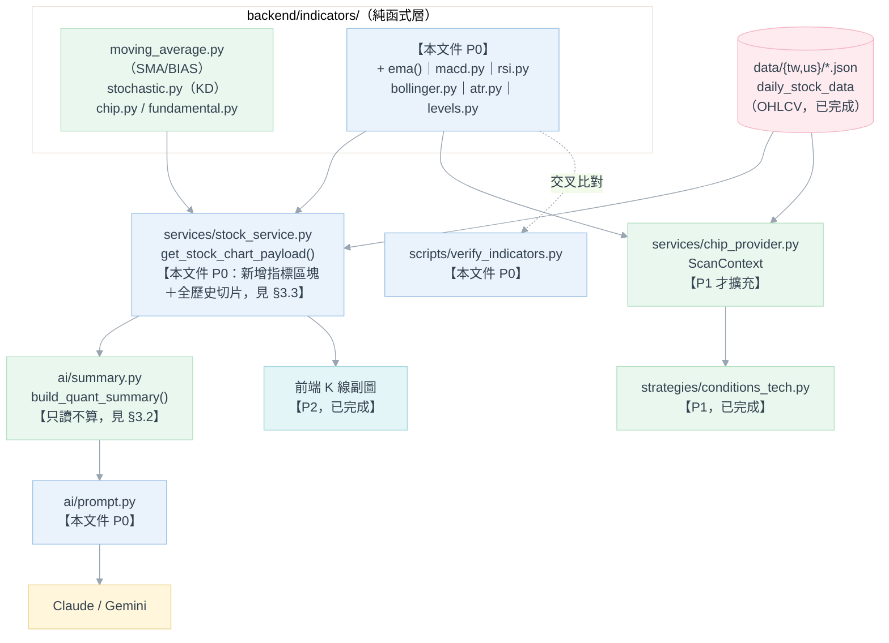

# Phase 1：基礎量化與技術面 — 技術指標庫補齊 功能需求文件

**模組**：技術面純函式指標庫（`backend/indicators/`）擴充，及其於圖表 payload 與 AI 診股報告的落地
**版本**：v3.1（v1.0 為外部貼入草案；v2.0 已對照現況重寫；v3.0 補上三項跨文件／跨層的關鍵約束；本版 P0～P2 已全部開發完成，見 §0）
**日期**：2026-08-29
**狀態**：**P0～P2 已完成開發並通過驗證**（`scripts/verify_indicators.py` 全數 PASS；策略條件與前端副圖已實作，見 §7、§8）

**對應既有模組**
[indicators/moving_average.py](../../backend/indicators/moving_average.py)（SMA／BIAS，**無 EMA**）、
[indicators/stochastic.py](../../backend/indicators/stochastic.py)（KD，遞迴平滑與暖身期的既有前例）、
[indicators/chip.py](../../backend/indicators/chip.py)、[indicators/fundamental.py](../../backend/indicators/fundamental.py)、
[services/stock_service.py](../../backend/services/stock_service.py)（`get_stock_chart_payload()`、`_build_kd_payload()`）、
[services/chip_provider.py](../../backend/services/chip_provider.py)（`ScanContext`）、
[strategies/conditions_tech.py](../../backend/strategies/conditions_tech.py)（`kd_cross`，四層整合的既有範本）、
[strategies/filters.py](../../backend/strategies/filters.py)（`volume_confirm`）、
[ai/summary.py](../../backend/ai/summary.py)、[ai/prompt.py](../../backend/ai/prompt.py)、
[scripts/verify_kd.py](../../backend/scripts/verify_kd.py)（無測試框架下的既有驗證慣例）

**參考文件**
- [AI 技術分析報告 系統開發規格書](AI技術分析規劃.md)（以下簡稱《AI 報告規格》）——§4.2 量化摘要契約的鐵則「本模組不得自行計算任何指標」是本文件 §3.2／FR-P1-7 的直接依據
- [股價相對低點 需求規格書](../13.選股功能/股價相對低點.md)（以下簡稱《相對低點》）——**ADR-RL-02 已決議「以 KD 取代 RSI、不為單一策略新增指標」，RSI 列為該文件 P3 並掛在其 Q-3 待決**；本文件與該決議的關係見 §2.3
- [進出場策略規劃](../11.進出場策略/進出場策略規劃.md)——§4.2「移動停利」需要近期高點、§5-3 明列 RSI 應由指標引擎預先算好，是本批指標在 AI 報告以外的第二個消費者（§2.3）
- [Phase2-籌碼面與基本面量化擴充.md](Phase2-籌碼面與基本面量化擴充.md)——同一輪「對照現況重寫」的前例；其 §1.4「前置依賴」模式為本文件 §3.2 所沿用
- [Phase3-產業鏈知識圖譜與輪動模型.md](Phase3-產業鏈知識圖譜與輪動模型.md) §2.0——該文件已指出本文件 v1.0 的 `TWSEProvider`／Parquet 描述與現行架構不符，v2.0 起即為該落差的修正
- KD 指標 設計規格書（其 §12 決議 D5、ADR-KD-01 由 `stochastic.py`／`stock_service.py` 程式註解引用）——本文件 §3.3 的計算視窗規則、FR-P1-3 的平滑方式選擇皆沿用其結論

---

## 目錄

| 章節 | 內容 |
|---|---|
| 0 | 修訂紀錄 |
| 1 | 目的與範圍 |
| 2 | 現況盤點與跨文件依賴（避免重複建設與決議打架） |
| 3 | 系統架構與關鍵設計約束 |
| 4 | 功能需求（FR） |
| 5 | 設定項目 |
| 6 | 決議事項（ADR） |
| 7 | 分階段交付 |
| 8 | 驗收準則（AC） |
| 9 | 開放問題 |
| 10 | 風險與限制 |
| 11 | 影響範圍（僅供日後開發估算） |

---

## 0. 修訂紀錄

| 版本 | 變更摘要 |
|---|---|
| v1.0 | 從外部貼入、未核對本專案現況的構想清單：`BaseProvider`／`TWSEProvider`／`YahooProvider` 抽象層、`data/raw/` JSON → `data/curated/` Parquet 兩段式落地、`DataFrame in → DataFrame out` 指標函式、`pytest` 單元測試。方向可理解，但四項技術假設在本專案**全部不成立**（見 §2.1） |
| v2.0 | 對照現行程式碼重寫：加入 §0 改版說明與 §2 現況盤點，把範圍從「重建資料管線」收斂為「補齊 MACD／RSI／布林通道／ATR 四項缺席指標」，修正 Parquet／pytest／DataFrame 三項技術假設 |
| v3.0 | 本次優化，補上 v2.0 漏掉的三項關鍵約束，並改寫為 FR 編號式的功能需求文件：<br/>① **AI 摘要層不得自行算指標**（《AI 報告規格》§4.2 鐵則）——新指標必須先落在 `get_stock_chart_payload()`，`ai/summary.py` 只能讀，v2.0 誤寫成由摘要層計算（→ §3.2、FR-P1-7）<br/>② **遞迴型指標必須「全歷史計算後切片」**（KD 決議 D5）——MACD／RSI／ATR 若比照 MA 在截斷視窗上計算，會產出「看似正常但其實錯誤」的數字（→ §3.3、FR-P1-7）<br/>③ **RSI 與《相對低點》ADR-RL-02 的決議關係**——該文件已決定不新增 RSI 並列為 P3／Q-3，本文件若交付 RSI 等同回答其 Q-3，需明講而非各寫各的（→ §2.3、ADR-P1-06）<br/>另補：§3.1 資料流圖、FR 編號與 AC 對應、§5 設定項目、前後端算法對齊的兩種模式（ADR-P1-07） |
| **v3.1** | **P0～P2 全部開發完成，本版記錄實際決議與交付狀態**（§9 開放問題逐項回填、§7 分階段交付更新）：<br/>**Q-1＝是**：新增 `macd_cross`／`rsi_zone` 策略條件（`strategies/conditions_tech.py`），比照 `kd_cross` 拆成黃金/死亡交叉各一策略（`macd_golden_cross`／`macd_death_cross`／`rsi_oversold_recovery`／`rsi_overbought_reversal`，見 `strategy_config/strategies.yaml`）；`_kd_trend_guard()` 一併通用化為 `_trend_guard()` 供三種指標共用（ADR-P1-09）<br/>**Q-2＝是**：`StockCharts.vue`／`ChartDetailView.vue` 的 KD 副圖開關擴充為 KD／MACD／RSI 三選一（`subchartMode`，取代原本的單一布林 `kdVisible`，localStorage 相容遷移舊值），同一時間只顯示一張副圖（ADR-P1-10）<br/>**Q-3＝業界慣用 70/30**（取代 v1.0 的 80/20），`rsi_zone` 預設門檔與 `stock_service._build_recursive_indicator_payloads()` 的 RSI 副圖基準線皆採此值，且門檻仍可由 YAML 覆寫（不寫死，比照 KD 既有慣例）<br/>**Q-4＝維持不做**：ATR 不接入 `stop_loss` 規則式計算，本階段仍只是 Context 數值<br/>**Q-5＝保留既有四鍵並新增四鍵**：`quant_summary.range` 維持 P0 的既定作法（已在 FR-P1-8 落地，非本版新增）<br/>**Q-6＝未決議**：《相對低點》`relative_low_zone` 的 C4 是否改用 RSI 維持懸而未決，不在本文件範圍內動作 |

---

## 1. 目的與範圍

### 1.1 目的

把技術面純函式指標庫從現行的「趨勢＋隨機指標」（MA／BIAS／KD）補齊到「趨勢＋動能＋波動＋位階」四類，
讓 AI 診股報告（以及日後的策略引擎、進出場風控）能取得完整的技術面數據，且**全程沿用既有慣例**，
不新建任何一條與 `indicators/` 現行設計原則不同的資料路徑。

本文件是**功能需求文件**（What／Why），不是技術設計規格書（How）。介面契約寫到「呼叫端能據以整合」
的程度即止，內部演算法的實作選擇（迴圈寫法、暫存結構）留給工程階段。

### 1.2 交付範圍

| 範圍內 | 範圍外（本文件不涵蓋） |
|---|---|
| 六個純函式指標的需求與介面契約（§4.1） | 指標函式的內部實作細節 |
| 新指標在 `get_stock_chart_payload()` 的落地與計算視窗規則（§4.2） | 圖表 UI 呈現（副圖、切換鈕）——列 P2，見 §7 |
| 新指標進入 AI 診股報告 Context 與 Prompt（§4.3） | AI 報告對外七個結構化輸出欄位的任何變更（**明確不動**） |
| 無測試框架下的驗證方式（§4.4） | 導入 `pytest`（見 ADR-P1-03） |
| 指標門檻的設定歸屬（§5） | 門檻數值本身的最終決定（見 §9 Q-3） |

### 1.3 不在本文件範圍

| 項目 | 原因 | 現況／責任文件 |
|---|---|---|
| OHLCV 爬蟲重寫為 Provider 抽象層 | 已完成且形態不同；`markets/` 已是既有的多市場抽象點，無新增市場的迫切需求 | `services/fetcher.py`、`services/us_fetcher.py`（§2.1） |
| `data/curated/` Parquet 欄位式儲存 | 會製造 JSON／Postgres 之外的第三份資料來源 | ADR-P1-01 |
| MA／BIAS／均線多空排列／KD | 已完成，且 KD 的規格遠超 v1.0 描述 | `indicators/moving_average.py`、`indicators/stochastic.py`、`conditions_tech.py` |
| 爆量偵測（量 ≥ 均量 × N 倍） | 已完成（濾網布林版）＋ AI Context 已有數值版 `volume_ratio` | `strategies/filters.volume_confirm`、`ai/summary.py`（§4.5） |
| 型態辨識（W 底／頸線／下影線） | 全專案無實作，且屬另一個量級的需求 | 《相對低點》P2 缺口（§4.4）——非本文件範圍 |
| 估值歷史分位數 | 同上，是資料回補缺口不是指標缺口 | 《相對低點》P1 缺口 |
| 回測／勝率驗證 | 本專案無回測模組 | 《相對低點》§1.2 既有結論，Phase 3 §4.3.3 沿用 |

### 1.4 市場範圍

**TW／US 皆適用**。本批指標的輸入只有 OHLCV 序列，不依賴台股專屬的籌碼或基本面資料——這點與
Phase 2（估值／營收，僅 TW）、Phase 4（新聞輿情，僅 TW）不同。因此在 `ai/summary.py` 的 Context
組裝中，這批指標**不受**既有 `market == "tw"` 分支限制。

### 1.5 名詞

| 名詞 | 本文件的定義 |
|---|---|
| 純函式指標 | 型別為 `List[Optional[float]] → List[Optional[float]]`、無副作用、不做 I/O 的計算函式，比照 `moving_average.py`／`stochastic.py` 既有形態 |
| 暖身期（warmup） | 遞迴型指標在序列開頭因初始值誤差尚未衰減、數值不可信賴的區段；既有 KD 以 `warmup_bars=25` 表達 |
| 截斷後計算 | 先依顯示區間（`months`）截斷資料再算指標——MA 現行作法 |
| 全歷史計算後切片 | 在 `MAX_HISTORY_MONTHS`（現值 60 個月）的完整歷史上算完，再依日期切到顯示區間——KD 現行作法（決議 D5） |
| 缺值 | `None`，或本專案慣例中代表「當天沒回補到行情」的 `0`（見 `chip_provider._clean()`／`stochastic._clean()`） |

---

## 2. 現況盤點與跨文件依賴

### 2.1 v1.0 四大項 vs 實際狀態

| v1.0 項目 | 現況 | 依據 |
|---|---|---|
| 一、基礎工程與資料目錄重構（鎖版、兩段式落地、`fetch_range`／`display_range` 解耦） | 🟡 **部分完成且機制不同**：`requirements.txt` 已鎖版但**無 `pyarrow`／`pytest`**；儲存為 JSON 源頭 ＋ 盡力而為 dual-write 到 Postgres，**無 Parquet 層**；抓取範圍與顯示範圍**本來就已解耦**——`get_stock_chart_payload(months=…)` 是顯示區間，內部另以 `MAX_HISTORY_MONTHS=60` 撈 `full_records` 供 KD 計算 | `requirements.txt`；`config.py:32`；`stock_service.py:428` |
| 二、抽象資料層與 OHLCV 爬蟲（`BaseProvider`／`TWSEProvider`／`TPEXProvider`／`YahooProvider`、Parquet 增量保存） | ✅ **功能已完成，形態不同**：無抽象基底類別，是 `fetcher.py`（TWSE，含民國年轉西元 `stock_service` 端 `+1911`、3.5～5.5 秒隨機節流、指數退避重試）與 `us_fetcher.py`（yfinance）兩支具體模組；落地 `data/{tw,us}/<symbol>.json` ＋ dual-write | `fetcher.py:218`、`fetcher.py:122/279`、`db/dual_write.py`；CLAUDE.md |
| 三、純函式技術指標庫（趨勢／動能／通道／量能四類） | 🟡 **趨勢與隨機類完成，動能與波動類完全空白**——逐項見 §2.2 | 見 §2.2 |
| 四、品質保證與單元測試（`pytest.fixture`、`test_indicators.py`） | ❌ **未採用**：專案無任何測試框架；既有驗證慣例是一次性交叉比對腳本 | `scripts/verify_kd.py`、`scripts/compare_data_sources.py`；CLAUDE.md 明載「無後端測試套件」 |

### 2.2 指標庫逐項盤點（本文件的真正缺口）

| 指標 | 現況 | 位置／缺口 |
|---|---|---|
| SMA（5/10/20/60/120/240） | ✅ | `moving_average.sma()`、`compute_ma_set()` |
| **EMA** | ❌ **無** | 全庫查無；MACD 及任何 EMA 系指標的**前置基礎**（FR-P1-1） |
| BIAS 乖離率 | ✅ | `moving_average.bias_series()` |
| 均線多空排列 | ✅ | `conditions_tech.alignment`（含 `require_slope`） |
| 均線糾結突破 | ✅ | `conditions_tech.squeeze_breakout` |
| KD 隨機指標 | ✅ 規格遠超 v1.0 描述（台股慣例 1/3 遞迴平滑、暖身 25 根、缺值不重置遞迴、鈍化判定、趨勢守衛） | `stochastic.py`、`conditions_tech.kd_cross` |
| **MACD** | ❌ **無** | 全庫（含前端）查無（FR-P1-2） |
| **RSI** | ❌ **無** | 全庫查無；且已被《相對低點》ADR-RL-02 主動繞過，見 §2.3（FR-P1-3） |
| **布林通道** | ❌ **無** | 全庫（含前端）查無（FR-P1-4） |
| **ATR** | ❌ **無** | 全庫（含前端）查無（FR-P1-5） |
| 量能均線／爆量偵測 | ✅ 布林版（濾網）＋ 數值版（AI Context） | `filters.volume_confirm`、`ScanContext.volume_ma`、`ai/summary.py` 的 `volume_ratio`——**不重複造輪子**（§4.5） |
| 近 N 日高低（支撐／壓力） | 🟡 **有 inline 版本，非可重用函式** | `ai/summary.py:124-133` 直接對顯示區間取 `max/min`，視窗等於使用者選的月份數，**不是 v1.0 要的 20／60 日固定視窗**，且指標庫外無法呼叫（FR-P1-6） |

> **搜尋依據**：對 `backend/` 與 `frontend/src/` 全庫搜尋 `MACD`／`RSI`／`Bollinger`／`ATR`，
> 後端僅命中 `AI_PROMPT_VERSION`（字串巧合）與 `conditions_pick.py` 一行說明 RSI 被 KD 取代的註解，
> 前端僅命中無關的樣板檔。四項指標確實完全不存在。

### 2.3 跨文件依賴：RSI 已有既有決議，不可各寫各的

這是 v2.0 最重要的疏漏。RSI 並非「沒人想過」的缺口，而是**已經被另一份文件審視並主動繞過**：

| 文件 | 既有結論 | 本文件的處置 |
|---|---|---|
| 《相對低點》**ADR-RL-02** | 「以 KD 取代 RSI，不為本策略新增指標」——理由是 KD 已實作已驗證、與 RSI 在「超賣」語意高度重疊，且新增指標會增加指標層維護面積（含前後端一致性義務）。RSI 列該文件 **P3**，掛在其 **Q-3「是否仍需要 RSI？」**，建議先用 KD 跑 1～2 個月再評估 | **不推翻該決議**。ADR-RL-02 的適用範圍是「單一策略是否值得為此新增指標」，本文件的消費者不同（AI 報告 Context ＋ 進出場策略，見下列），屬於「多個消費者都需要 RSI」這個 ADR-RL-02 自己預留的觸發條件——原文明載「**若日後有多個策略都需要 RSI，再另立指標規格**」，本文件即為該指標規格。詳見 ADR-P1-06 |
| 《相對低點》§4.2 C4、`conditions_pick.py:259` 註解 | 現行 `relative_low_zone` 的「動能超賣」用 `ctx.kd`，註明「取代 v1.0 的 RSI」 | **不改動既有策略**。RSI 交付後，該策略是否改回或並用 RSI，屬《相對低點》Q-3 的範圍，非本文件決定（§9 Q-3） |
| 《進出場策略規劃》§5-3 | 明列「所有均線 (MA)、相對強弱 (RSI)、乖離率 (BIAS) 需由外部指標引擎預先計算完成，策略函數內僅做條件判斷」 | 該文件**假設 RSI 已存在**，實際不存在。本文件的 FR-P1-3 即補上這個被假設存在的前提 |
| 《進出場策略規劃》§4.2 移動停利（`lookback_high` 回落百分比）、§4.1 技術面破線停損 | 需要「近期高點」與支撐位階 | 正是 FR-P1-6 `rolling_high_low()` 的第二個消費者；ATR（FR-P1-5）亦為移動停損的常見基準 |

**結論**：本文件交付 RSI 後，等同回答《相對低點》Q-3 並解除其 P3；審核通過時應在該文件回填一筆註記，
避免兩份文件對「本專案有沒有 RSI」給出不一致的答案。

---

## 3. 系統架構與關鍵設計約束

### 3.0 圖例色票（沿用《AI 報告規格》§3.0 專案統一色系）

| 語意 | 填色 | 邊框 |
|---|---|---|
| 外部系統／LLM | `#FFF6DC` | `#E8D48B` |
| 核心處理（本文件新增） | `#EAF2FB` | `#9EC2E6` |
| 既有可複用元件 | `#EAF7EE` | `#B7E0C4` |
| 資料儲存 | `#FDEBEF` | `#F3B6C4` |
| 介面 | `#E4F5F7` | `#A5D8DF` |

文字色一律 `#33414F`，連線 `#9AA5B1`。

### 3.1 指標資料流與本文件的落點



### 3.2 約束一：AI 摘要層不得自行計算指標（v2.0 的錯誤，本版修正）

《AI 報告規格》§4.2 開宗明義：「**本模組不得自行計算任何指標**（沿用 CLAUDE.md 對策略引擎的同一條
約束：條件函式只能讀既算好的序列，不得重算）」，ADR-AI-09 進一步要求量化摘要一律由
`get_stock_chart_payload()` 重新推導。

因此新指標**不能**直接在 `ai/summary.py` 內計算——必須先出現在 `get_stock_chart_payload()` 的回傳
結構中（比照現行 `moving_averages`／`kd` 兩個既有區塊），`ai/summary.py` 才能取用。這與 Phase 2 §1.4
面對估值／營收欄位時的前置依賴形態完全相同，是同一條鐵則的兩次體現。

**實作順序因此固定為**：`indicators/*` →「`stock_service` 落地」→「`ai/summary` 取用」→「`ai/prompt` 敘述」，
四者屬同一批工作，不可只做頭尾（FR-P1-7 為 FR-P1-8 的前置）。

### 3.3 約束二：遞迴型指標必須「全歷史計算後切片」（KD 決議 D5 的延伸）

`get_stock_chart_payload()` 目前對兩類指標採**不同**的計算視窗策略，這是刻意的既有決議（KD 規格書
§12 決議 D5，程式註解見 `stock_service.py:418-430` 與 `_build_kd_payload()` docstring）：

| 現行指標 | 策略 | 理由（原文） |
|---|---|---|
| MA | 先依 `months` 截斷、再計算 | 「MA 資料不足只會**誠實斷線**」——短區間看不到 MA60／MA240 是已知限制，使用者看得出來 |
| KD | 在 `MAX_HISTORY_MONTHS` 全歷史上算完，再**依日期**切到顯示區間 | 「KD 若不做這層切片則會算出**看起來正常但其實錯誤**的數字」；且要與 scanner 的全歷史計算結果一致 |

本文件四項新指標依此標準各自歸類——**這是 v2.0 完全漏掉、卻直接決定數值正確與否的需求**：

| 新指標 | 性質 | 應採策略 | 若採錯的後果 |
|---|---|---|---|
| MACD（EMA 遞迴） | 遞迴 | **全歷史計算後切片** | 使用者選「1 個月」時，EMA 從區間首日重新起算，DIF／柱狀圖全部是錯的，但圖形看起來完全正常 |
| RSI（Wilder 遞迴） | 遞迴 | **全歷史計算後切片** | 同上 |
| ATR（Wilder 遞迴） | 遞迴 | **全歷史計算後切片** | 同上，且會直接影響任何以 ATR 為基準的停損位階 |
| 布林通道（SMA ＋ 標準差視窗） | 視窗式 | **可比照 MA 截斷後計算** | 資料不足時誠實斷線，錯誤等級與 MA 相同，可接受 |
| 近 N 日高低（`rolling_high_low`） | 視窗式 | 比照 MA | 同上 |

另一個附帶效益：全歷史切片同時保證「同一天的指標值不會因為使用者選 1 個月或 1 年而改變」，
也讓日後（P1）策略引擎算出的數字與圖表一致——正是 `_build_kd_payload()` docstring 記載的兩個原始動機。

### 3.4 約束三：相依方向

```
ai/prompt.py → ai/summary.py → services/stock_service.py → indicators/*（純函式，不吃 DB、不做 I/O）
strategies/conditions_tech.py → services/chip_provider.py（ScanContext）→ indicators/*
```

**禁止**：`indicators/` 反向 import `services/`／`strategies/`／`ai/`（沿用既有純函式層定位，
比照 `moving_average.py`／`stochastic.py` 目前零外部相依的狀態）。

---

## 4. 功能需求（FR）

**通則**（適用 FR-P1-1～FR-P1-6，沿用 `moving_average.py`／`stochastic.py` 既有慣例，見 ADR-P1-02）：

- 型別一律 `Series = List[Optional[float]]`，**不使用 `pandas.DataFrame`**。
- 純函式、無副作用、不做 I/O；輸出序列與輸入等長。
- 資料不足、暖身期未滿或輸入缺值的位置一律 `None`，**不得補零、不得沿用前值**。
- 輸入清理比照 `stochastic._clean()`：`None` 或 `0` 一律視為缺值。
- 所有門檻／參數皆為呼叫端傳入的具名參數，**函式內不得硬編碼**（見 §5）。

### 4.1 純函式指標庫

| # | 需求 | 介面契約與規格 |
|---|---|---|
| **FR-P1-1** | **EMA 指數移動平均**（MACD 的前置基礎） | `ema(values: Series, period: int) -> Series`，建議置於既有 `moving_average.py`（避免日後 EMA 系需求分散多檔）。需明確定義：① 起始種子取法（前 `period` 筆簡單平均或首個有效值）；② **輸入缺值時遞迴狀態的處理方式必須與 `stochastic.py` 的既有決策一致**（「缺值不重置遞迴」），若採不同作法須在程式註解與 §9 記錄理由 |
| **FR-P1-2** | **MACD** | `macd(closes, fast_period=12, slow_period=26, signal_period=9) -> Tuple[Series, Series, Series]`，回傳 `(dif, signal, histogram)`。`DIF = EMA(fast) − EMA(slow)`；`signal = EMA(DIF, signal_period)`；`histogram = DIF − signal`。內部 EMA **一律呼叫 FR-P1-1，不得另寫一份** |
| **FR-P1-3** | **RSI** | `rsi(closes, period) -> Series`；呼叫端各自帶入 `6`／`14`。採 **Wilder 遞迴平滑**（`1/period`）而非簡單移動平均版——與 `stochastic.py` 選擇台股慣例遞迴平滑的理由相同（ADR-KD-01：避免與國內看盤軟體對不起來）。超買／超賣**門檻不進函式**，由呼叫端判讀（見 §5、§9 Q-3）。與《相對低點》ADR-RL-02 的關係見 §2.3、ADR-P1-06 |
| **FR-P1-4** | **布林通道** | `bollinger_bands(closes, period=20, num_std=2.0) -> Tuple[Series, Series, Series]` 回傳 `(upper, middle, lower)`，另提供帶寬 `bandwidth = (upper − lower) / middle`。**中軌不得重算 SMA**——呼叫端已有 `MA20` 時應直接傳入或取用既有結果（ADR-P1-05）。帶寬與既有 `squeeze_breakout` 的「均線糾結」語意相關但**不同對象**（前者是通道寬窄、後者是四條均線的極差），兩者不合併 |
| **FR-P1-5** | **ATR** | `atr(highs, lows, closes, period=14) -> Series`。`TR_t = max(H−L, \|H−C_{t−1}\|, \|L−C_{t−1}\|)`，ATR 為 TR 的 Wilder `1/period` 遞迴平滑。序列首日必為 `None`（無 `C_{t−1}`）。**本階段只交付數值**，是否用於停損位階計算見 §9 Q-4 |
| **FR-P1-6** | **近 N 日高低（支撐／壓力）** | `rolling_high_low(highs, lows, window) -> Tuple[Series, Series]`，新檔 `indicators/levels.py`。取代 `ai/summary.py:124-133` 的 inline 邏輯（該版視窗等於使用者選的月份數、無法外部呼叫）。需同時支援 20 日與 60 日兩組視窗。第二個消費者為《進出場策略規劃》§4.2 移動停利的 `lookback_high`（§2.3） |

### 4.2 圖表 payload 落地（前置於 4.3）

| # | 需求 | 說明 |
|---|---|---|
| **FR-P1-7** | `get_stock_chart_payload()` 新增指標區塊 | 比照既有 `moving_averages`／`kd` 兩個區塊，新增 `macd`／`rsi`／`bollinger`／`atr` 與 `levels`（近 20／60 日高低）。**MACD／RSI／ATR 必須採「全歷史計算後切片」**（§3.3），切片方式比照 `_build_kd_payload()`：以**日期**比對而非位置切法（非交易日與缺值會讓筆數對不齊）。布林通道與 `levels` 比照 MA 截斷後計算即可。此 FR 是 FR-P1-8 的**硬前置**（§3.2） |

### 4.3 AI 診股報告整合

| # | 需求 | 說明 |
|---|---|---|
| **FR-P1-8** | `ai/summary.py` 的 `quant_summary` 新增區塊 | **只讀 FR-P1-7 落地的結果，不得自行計算**（§3.2）。新增鍵值如下表；沿用既有 `_clean()`（`0`／`None` 一律省略整個鍵）與 `_round()` 慣例。TW／US 皆適用，不受既有 `market == "tw"` 分支限制 |
| **FR-P1-9** | `ai/prompt.py` 研判框架與分節擴充 | System Prompt 既有研判框架（《AI 報告規格》§4.4 的 5 點）新增第 6 點；User Prompt 新增對應分節，**缺值區塊整段不輸出**（不出現空標題）。須遵守既有原則「Prompt 中不得出現任何硬編碼的策略門檻」——RSI 超買超賣的數字若要寫進 Prompt，須取自設定（§5） |

**FR-P1-8 的 `quant_summary` 新增鍵**：

| 區塊鍵 | 欄位 | 來源 |
|---|---|---|
| `macd` | `dif`／`signal`／`histogram`（皆取最新值） | `payload["macd"]` |
| `rsi` | `rsi_6`／`rsi_14` | `payload["rsi"]` |
| `bollinger` | `upper`／`middle`／`lower`／`bandwidth` | `payload["bollinger"]`；`middle` 須與既有 `ma.ma20` 相等（AC-P1-5） |
| `atr` | `atr_14` | `payload["atr"]` |
| `range`（既有鍵擴充） | 由現行單一視窗的 `high`／`low`／`high_date`／`low_date`，擴充為 `resistance_20d`／`support_20d`／`resistance_60d`／`support_60d` | `payload["levels"]` |

> `range` 既有鍵的處置（保留原欄位並存、或直接取代）影響《AI 報告規格》的 `quant_summary` 快照
> 一致性與歷史報告的可讀性，列 §9 Q-5。

**FR-P1-9 的 System Prompt 新增段落**（沿用既有條列風格）：

```text
6. 動能與波動檢核：MACD 柱狀圖與 DIF／訊號線的交叉是否支持當前趨勢方向、RSI 所處位階、
   布林通道收斂或開口擴大所反映的波動狀態、ATR 反映的單日波動幅度。
   任一數值缺席時（如新上市個股尚未累積足夠交易日）略過該面向，不得臆測。
```

### 4.4 品質保證

| # | 需求 | 說明 |
|---|---|---|
| **FR-P1-10** | 一次性交叉驗證腳本 | `scripts/verify_indicators.py`，比照 `scripts/verify_kd.py` 既有模式：對每個指標寫一份**與正式實作不共用程式碼**的獨立參考算法，交叉比對數值在容許誤差內一致；全部印 `PASS` 才算通過。**不引入 pytest**（ADR-P1-03） |

**必須涵蓋的邊界案例**（每項皆對應一條驗收準則，見 §8）：

1. 序列長度小於暖身期 → 全 `None`，不得回傳 `0` 或近似值。
2. 輸入含 `None`／`0`（缺值）→ 遞迴狀態的處理與 §3.3／FR-P1-1 的決策一致。
3. 連續同值（如連續一價漲停／跌停）→ RSI 分母為零、布林標準差為零時不得拋例外或回傳 `inf`。
4. **同一天的 MACD／RSI／ATR 值，在顯示區間為 1 個月與 1 年時必須完全相同**（§3.3 全歷史切片的直接驗證，AC-P1-4）。
5. 至少 1 檔 TW、1 檔 US 真實標的的歷史區間，數值與外部看盤軟體／參考實作比對合理。

### 4.5 明確不做：爆量偵測

v1.0 的「量能均線與爆量偵測（判定是否達均量 1.5 或 2 倍）」**已完整存在於兩個地方**，本文件不重複建設：

| 用途 | 既有實作 |
|---|---|
| 策略訊號強度加分（布林值） | `strategies/filters.volume_confirm`（`multiple` 參數可調） |
| 策略硬門檻（布林值） | 各條件函式直接讀 `ctx.volume_ma` 自行比較，如 `relative_low_zone` 的 C6 |
| AI Context 顯示（數值） | `ai/summary.py` 既有的 `volume_ma5`／`volume_ratio` |

---

## 5. 設定項目

沿用專案既有的「門檻不寫死」原則（CLAUDE.md：改門檻是 YAML 編輯、免部署；`_build_kd_payload()` 已示範
從 `strategy_config/strategies.yaml` 讀取 KD 超買超賣門檻來畫圖上基準線）：

| 參數類別 | 歸屬 | 說明 |
|---|---|---|
| 指標計算參數（MACD 12/26/9、RSI 6/14、布林 20/2σ、ATR 14、高低視窗 20/60） | `strategy_config/strategies.yaml` 的 `defaults` 區塊，比照既有 `ma_periods`／`kd_params`／`kd_warmup_bars` | `stock_service` 與 scanner 讀同一份設定，天然保證圖表與策略用同一組參數 |
| RSI 超買／超賣門檻 | 同上（若日後做成 condition，則在該策略的 `conditions` 內，比照 `kd_cross` 的 `overbought_threshold`／`oversold_threshold`） | 數值選擇見 §9 Q-3 |
| AI Prompt 版本 | 既有 `AI_PROMPT_VERSION`（`.env`／`ai/config.py`，現值 `v3`） | Prompt 內容變更（FR-P1-9）**須同步遞增此版本號**，否則歷史報告的 `prompt_version` 快照會失真（《AI 報告規格》ADR-AI-15 的稽核前提） |

**不新增任何 `.env` 項目**——本文件的功能無需開關旗標（指標算好即用，無外部服務、無成本）。

---

## 6. 決議事項（ADR）

| 編號 | 決策 | 理由 |
|---|---|---|
| **ADR-P1-01** | 不採用 `BaseProvider`／`TWSEProvider`／`YahooProvider` 抽象層，不新增 Parquet 儲存層 | 現行具體爬蟲模組已穩定運作，且 `markets/` 已是既有的多市場抽象點；Parquet 會在 JSON／Postgres 之外製造第三份資料來源，違反「JSON 為唯一事實來源」的既有架構 |
| **ADR-P1-02** | 新指標一律 `List[Optional[float]]` 純函式，不使用 `pandas.DataFrame` | 比照 `moving_average.py`／`stochastic.py`；`ScanContext` 本身即以 list 為基礎，DataFrame in/out 需額外轉換層 |
| **ADR-P1-03** | 驗證採一次性交叉比對腳本，不引入 `pytest` | 專案無任何測試框架，`verify_kd.py` 是唯一先例且運作良好。引入 `pytest` 屬「新增專案級測試基礎設施」的獨立決定，不應由本文件夾帶 |
| **ADR-P1-04** | 遞迴型指標（MACD／RSI／ATR）採「全歷史計算後切片」，視窗型指標（布林／高低點）比照 MA 截斷後計算 | 直接沿用 KD 決議 D5 的判準：錯誤等級不同——視窗型不足只會誠實斷線，遞迴型會產出「看似正常但其實錯誤」的數字（§3.3） |
| **ADR-P1-05** | 布林中軌重用既有 SMA20 結果，不在新函式內重算 | 避免同資料算兩次與浮點結果分歧；與「不得重算已算好的序列」既有鐵則一致 |
| **ADR-P1-06** | 交付 RSI，不推翻《相對低點》ADR-RL-02，而是滿足其自身預留的觸發條件 | ADR-RL-02 原文即載明「若日後有多個策略都需要 RSI，再另立指標規格」。現有兩個獨立消費者（AI 報告 Context、《進出場策略規劃》§5-3 假設其存在），符合該觸發條件。既有 `relative_low_zone` 的 C4 **維持用 KD 不動**，是否改用 RSI 屬該文件 Q-3 範圍 |
| **ADR-P1-07** | 新指標採「後端算、前端只畫」（KD 模式），不比照 MA 在前端另寫一份等值實作 | 專案現有兩種模式：MA 是前後端各一份（`moving_average.py` 與 `utils/movingAverage.js`），KD 是後端算好隨 payload 下送。前者已出現細微分歧徵兆（後端 `round(…, 4)`、前端 `toFixed(2)`），且每新增一個指標就多一份需同步維護的 JS 實作。新指標一律採 KD 模式，P2 若做副圖也不需要新的 JS 算法 |
| **ADR-P1-08** | 指標計算與其下游整合（策略 condition、前端副圖）分階段交付，本階段不預先決定後兩者 | 「算得出指標」與「要不要因此新增策略與 UI」是可分離的兩件事；先交付 P0 觀察實際需求，避免範圍蔓延（見 §7、§9 Q-1／Q-2） |
| **ADR-P1-09** | `macd_cross`／`rsi_zone` 比照 `kd_cross` 拆成黃金/死亡交叉（或超賣回升/超買回落）各一個獨立策略，而非一個策略同時掛兩個方向 | 與既有 `kd_oversold_golden_cross`／`kd_overbought_death_cross` 的既有慣例一致，方便個別設定 `cooldown_days` 與濾網；`_kd_trend_guard()` 通用化為 `_trend_guard()`，三種指標共用同一段「收盤價相對某均線」判斷，避免重複程式碼 |
| **ADR-P1-10** | 前端副圖從「KD 單一布林開關」擴充為「KD／MACD／RSI 三選一」（`subchartMode`），同一時間只顯示一張，而非三個獨立開關各自疊加 | 三張副圖同時開啟會讓 K 線圖被壓得過扁、資訊過載；三選一維持與既有 KD 副圖相同的版面高度與互動複雜度。`localStorage` 舊鍵（`mystock:chart:kd-visible`）保留讀取相容，不強迫使用者重新設定 |

---

## 7. 分階段交付

| 階段 | 內容 | 狀態 |
|---|---|---|
| **P0** | FR-P1-1～FR-P1-10 全部：六個純函式指標 ＋ `get_stock_chart_payload()` 落地（含全歷史切片）＋ `ai/summary.py`／`ai/prompt.py` 整合 ＋ 驗證腳本 | ✅ **已完成**（`scripts/verify_indicators.py` 全數 PASS，含 TW/US 真實標的端到端檢查） |
| **P1** | §9 Q-1 決議為「是」：`ScanContext` 新增 `macd`／`rsi` 欄位（`services/chip_provider.py`）＋ `conditions_tech.py` 新增 `macd_cross`（`min_bars=40`）／`rsi_zone`（`min_bars=20`）條件＋ `strategy_config/strategies.yaml` 新增 `macd_golden_cross`／`macd_death_cross`／`rsi_oversold_recovery`／`rsi_overbought_reversal` 四個策略＋ `direction.py`／`scanner._SUGGESTED_ACTION_TEMPLATES` 登記新方向文案 | ✅ **已完成**（見 §0 v3.1、ADR-P1-09） |
| **P2** | §9 Q-2 決議為「是」：前端 `StockCharts.vue`／`ChartDetailView.vue` 的 KD 副圖開關擴充為 KD／MACD／RSI 三選一（`subchartMode`），沿用既有 `localStorage` 記憶、資料不足停用、`?indicator=` 深連結、副圖開啟時主圖加高等 KD 既有慣例；`alertDirection.js`／`chartExplanations.js` 同步登記新方向與說明文字 | ✅ **已完成**（見 §0 v3.1、ADR-P1-10） |

---

## 8. 驗收準則（AC）

| # | 準則 | 對應 FR |
|---|---|---|
| **AC-P1-1** | `scripts/verify_indicators.py` 全部檢查印出 `PASS`，涵蓋 §4.4 列出的五類邊界案例 | FR-P1-10 |
| **AC-P1-2** | 任選 3 檔 TW、3 檔 US 有足夠歷史（≥ 60 個交易日）的標的，`quant_summary` 的 `macd`／`rsi`／`bollinger`／`atr` 數值與獨立參考實作一致 | FR-P1-2～5、8 |
| **AC-P1-3** | 任選 1 檔上市未滿 35 個交易日的新股，`quant_summary` **不含**尚無法計算的指標鍵（不得是 `0` 或 `null`） | FR-P1-8 |
| **AC-P1-4** | 同一檔標的、同一交易日，在顯示區間 1 個月與 1 年下取得的 MACD／RSI／ATR 值**完全相同**；布林中軌與 MA20 則允許在短區間因資料不足而斷線（`None`） | FR-P1-7（§3.3） |
| **AC-P1-5** | `quant_summary.bollinger.middle` 與同日 `quant_summary.ma.ma20` **數值相等**（驗證確實共用同一份 SMA、未重算） | FR-P1-4（ADR-P1-05） |
| **AC-P1-6** | `range` 區塊改用 `rolling_high_low()` 後，`resistance_20d`／`support_20d`／`resistance_60d`／`support_60d` 與手動核對的近 20／60 個交易日高低點一致 | FR-P1-6 |
| **AC-P1-7** | `ai/summary.py` 內**不存在**任何新指標的加減乘除——所有新數值皆取自 `get_stock_chart_payload()` 的回傳（以程式碼審查確認，§3.2 鐵則） | FR-P1-8 |
| **AC-P1-8** | 既有回歸：AI 報告對外七個結構化輸出欄位（`verdict`／`headline`／`support_levels`／`resistance_levels`／`stop_loss`／`report_markdown`／`confidence`）的契約與端點行為**完全不變**；既有 `ma`／`bias_percent`／`kd`／`chips`／`margin` 區塊數值與改動前逐筆相同 | FR-P1-8、9 |
| **AC-P1-9** | Prompt 內容變更後 `AI_PROMPT_VERSION` 已遞增，且新產生的報告快照記錄到新版本號 | FR-P1-9（§5） |
| **AC-P1-10** | `indicators/` 各新檔案**零外部相依**（不 import `services/`／`strategies/`／`ai/`，不碰 DB 與檔案系統） | §3.4、ADR-P1-02 |
| **AC-P1-11** | 一次完整報告產生流程的耗時與改動前相比無顯著增加（新增指標皆為既有記憶體序列上的單次線性計算） | FR-P1-7 |

---

## 9. 開放問題

| # | 問題 | 決議 |
|---|---|---|
| **Q-1** | MACD／RSI 是否要做成策略 `condition`（比照 `kd_cross`），串進 `strategies.yaml` 與通知平台？ | ✅ **是**——已交付（見 §7 P1、ADR-P1-09）。訊號沿用既有 `alert_repository`／通知平台管線，不另開推播路徑 |
| **Q-2** | 前端是否需要 MACD／RSI 副圖？ | ✅ **是**——已交付（見 §7 P2、ADR-P1-10） |
| **Q-3** | RSI 超買／超賣門檻：沿用 v1.0 的 **80/20**，或業界慣用的 **70/30**？ | ✅ **改用業界慣用 70/30**（取代 v1.0 的 80/20）。`rsi_zone` 條件與 RSI 副圖基準線皆採此預設值，門檻本身仍可由 `strategies.yaml` 覆寫 |
| **Q-4** | ATR 是否要用於停損位階（如 `close − 2×ATR`）？ | ❌ **本階段維持不做**。ATR 先以純數值併入 Context 供 LLM 參考，維持「技術面數值是佐證、不是直接決策」的既有定位。若日後要做，應在《進出場策略規劃》而非本文件 |
| **Q-5** | `quant_summary.range` 既有的 `high`／`low`／`high_date`／`low_date` 四個鍵，在改用 20／60 日固定視窗後是保留並存還是取代？ | ✅ **保留既有四鍵並新增四鍵**（已在 P0／FR-P1-8 落地）：既有鍵語意是「本次圖表顯示區間的高低點」，新鍵是「固定 20／60 日位階」，兩者語意不同不互相取代 |
| **Q-6** | 交付 RSI 後，《相對低點》的 C4（現用 KD）是否改用或並用 RSI？ | **未決議，維持開放**。**不在本文件範圍**（ADR-P1-06）；本文件不變更 `relative_low_zone` 既有條件，變更前應先評估對歷史訊號的影響，留待《相對低點》自行決議 |

---

## 10. 風險與限制

1. **遞迴狀態的缺值處理若各指標不一致，會產生難以察覺的行為分歧**：`stochastic.py` 已有明確決策
   （缺值不重置遞迴狀態，理由是避免復牌／補資料後製造假交叉）。MACD／RSI／ATR 若各自採不同處理，
   會出現「同一份資料、不同指標對同一個缺值反應不同」的狀況。FR-P1-1 要求此決策統一，
   AC-P1-1 要求驗證腳本明確覆蓋。
2. **暖身期造成新股多個指標同時缺席**：MACD 約需 35 個交易日（26＋9）、RSI／ATR 約 14～15 日、
   布林 20 日。上市未滿一個半月的個股在 `quant_summary` 中會大片缺鍵，FR-P1-9 的 Prompt 措辭需
   明確涵蓋，避免 LLM 把「看不到常見指標」誤讀為異常訊號。
3. **前後端一致性的長期維護成本**：ADR-P1-07 已選擇「後端算、前端只畫」以避免新增 JS 實作，
   但既有 MA 的雙份實作仍然存在（且四捨五入位數已不同）。本文件不處理既有 MA 的收斂，
   僅避免問題擴大；若日後要統一，屬獨立的重構議題。
4. **不新增任何套件依賴**：EMA 遞迴、標準差、TR 皆可用純 Python 完成，不需 `numpy`／`pandas`
   （`pandas` 雖已在 `requirements.txt`，指標層刻意不使用，見 ADR-P1-02）。這也是本文件無部署風險的原因。
5. **本文件的輸出是數值，不是判斷**：新增指標只是讓 AI 報告與（日後的）策略引擎有更多依據，
   不代表訊號品質必然提升。指標數量與研判準確度沒有必然關係，上線後應觀察 AI 報告是否真的引用了
   這些數值、引用得是否合理，再決定 P1／P2 是否值得投入。

---

## 11. 影響範圍（僅供日後開發估算，本文件不動任何檔案）

| 檔案 | 預期異動 | 階段 |
|---|---|---|
| `backend/indicators/moving_average.py` | 新增 `ema()`（FR-P1-1） | P0 |
| `backend/indicators/macd.py`／`rsi.py`／`bollinger.py`／`atr.py`／`levels.py` | 新增（FR-P1-2～6） | P0 |
| `backend/services/stock_service.py` | `get_stock_chart_payload()` 新增指標區塊；比照 `_build_kd_payload()` 新增遞迴型指標的全歷史切片組裝（FR-P1-7） | P0 |
| `backend/strategy_config/strategies.yaml` | `defaults` 新增指標參數（§5） | P0 |
| `backend/ai/summary.py` | 新增 `macd`／`rsi`／`bollinger`／`atr` 區塊；`range` 區塊改讀 payload（FR-P1-8） | P0 |
| `backend/ai/prompt.py` | System Prompt 新增第 6 點；User Prompt 新增分節（FR-P1-9） | P0 |
| `backend/.env`／`.env.example` | 僅遞增 `AI_PROMPT_VERSION`（§5），**不新增項目** | P0 |
| `backend/scripts/verify_indicators.py` | 新增（FR-P1-10） | P0 |
| `docs/13.選股功能/股價相對低點.md` | 回填註記：其 P3／Q-3（RSI）已由本文件承接（§2.3、ADR-P1-06） | P0 |
| [AI技術分析規劃.md](AI技術分析規劃.md) | 依其既有版本紀錄慣例新增一列（比照 Phase 2 §5-6 的作法） | P0 |
| `backend/services/chip_provider.py` | ✅ 已異動：`ScanContext` 新增 `macd`／`rsi` 欄位、`MACDSeries` dataclass、`get_bars()` 新增 `macd_params`／`rsi_periods` 參數 | P1 |
| `backend/strategies/conditions_tech.py` | ✅ 已異動：`_kd_trend_guard` 通用化為 `_trend_guard`；新增 `macd_cross`／`rsi_zone` 條件函式 | P1 |
| `backend/strategies/scanner.py` | ✅ 已異動：`scan_market()` 傳入 `macd_params`／`rsi_periods`；`_SUGGESTED_ACTION_TEMPLATES` 新增四筆文案 | P1 |
| `backend/strategies/direction.py` | ✅ 已異動：新增 `macd_golden_cross`／`macd_death_cross`／`rsi_oversold_recovery`／`rsi_overbought_reversal` 前綴 | P1 |
| `backend/strategy_config/strategies.yaml` | ✅ 已異動：新增四個策略（`macd_golden_cross`／`macd_death_cross`／`rsi_oversold_recovery`／`rsi_overbought_reversal`） | P1 |
| `backend/services/stock_service.py` | ✅ 已異動（P1 部分）：`_build_recursive_indicator_payloads()` 的 `rsi_payload` 新增 `overbought`／`oversold`（取自 `rsi_oversold_recovery`／`rsi_overbought_reversal` 策略設定，供前端副圖畫基準線） | P1 |
| `frontend/src/components/StockCharts.vue`、`frontend/src/views/ChartDetailView.vue` | ✅ 已異動：KD 單一開關擴充為 KD／MACD／RSI 三選一（`subchartMode`），新增對應 series／grid／tooltip 邏輯；符合 ADR-P1-07——三種副圖皆是後端算好、前端只畫，未新增任何 JS 指標演算法檔 | P2 |
| `frontend/src/utils/alertDirection.js` | ✅ 已異動：新增四個方向的分類前綴與文案 | P1 |
| `frontend/src/utils/chartExplanations.js` | ✅ 已異動：新增 `macd`／`rsi` 說明區塊 | P2 |
| **不需異動** | `services/fetcher.py`／`us_fetcher.py`（OHLCV 管線已完成）、`db/dual_write.py`、`db/migration/`（**無資料表變更**）、`indicators/stochastic.py`／`chip.py`／`fundamental.py`、`strategies/filters.py`（爆量偵測已存在，§4.5） | — |
