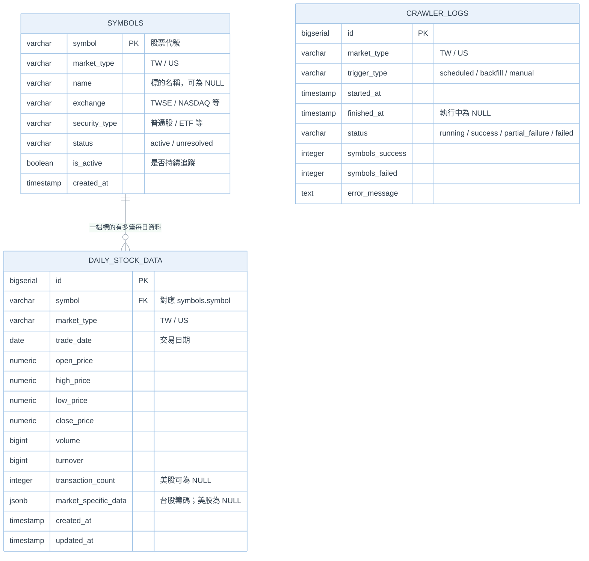
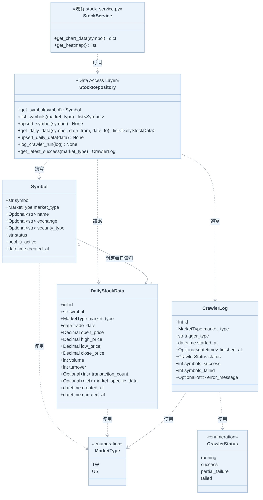
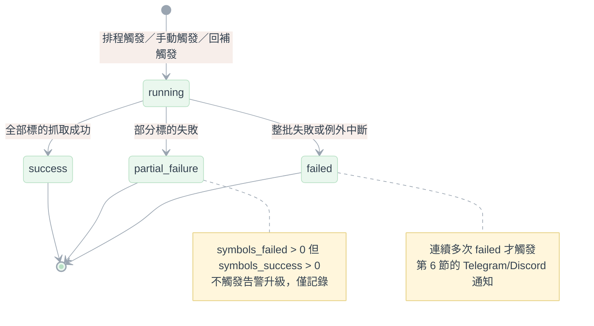

# 資料庫設計文件：ERD 與 UML (PostgreSQL)

本文件是 [`postgresql_migration_and_scheduling_design.md`](./postgresql_migration_and_scheduling_design.md) 第 3 節「資料庫 Schema 設計」的圖像化補充，
聚焦在**實體關聯（ERD）**與**物件/流程結構（UML）**，欄位定義以該文件為權威來源，本文件不重複列出每個欄位的完整說明，只保留圖上需要的關鍵屬性。

所有圖表採用淡彩色系（pastel）主題，方便長時間閱讀；各圖為獨立的 Mermaid 區塊，個別套用 `%%{init: ...}%%` 主題設定，不依賴外部樣式檔。

---

## 1. ERD（實體關聯圖）



> **`crawler_logs` 刻意沒有連線**：它記錄的是「一次排程/回補批次」，聚合層級是市場（`market_type`），
> 不是單一標的，因此沒有指向 `symbols` 或 `daily_stock_data` 的外鍵——圖上呈現的是實際 Schema，
> 不是為了畫面好看硬加關聯。

**索引摘要**（完整說明見主文件 §3.1）：

| Table | 索引 | 用途 |
| :--- | :--- | :--- |
| `daily_stock_data` | Unique `(symbol, trade_date)` | Upsert 基準，防重複寫入 |
| `daily_stock_data` | `(trade_date, market_type)` | 範圍查詢／市場分區 |
| `daily_stock_data` | GIN `(market_specific_data)` | JSON 存在性／包含查詢 |
| `daily_stock_data` | Expression B-tree（依熱門欄位另建） | 數值範圍過濾（GIN 涵蓋不到） |
| `crawler_logs` | `(market_type, started_at)` | 查詢某市場最近一次執行 |

---

## 2. UML 類別圖（資料存取層）

對應主文件 §4.2「Repository Pattern」：三張表各對應一個 SQLAlchemy Model，`StockRepository` 是唯一的資料存取入口，
API 層與排程都只透過它操作資料庫，不直接寫 SQL。



> `StockService` 對應現有 `backend/services/stock_service.py`；本圖只畫出它與新資料存取層的關係，不重複列出既有方法。
> 第 4.2 節的 `DATA_SOURCE=json|postgres` 切換，實務上會是 `StockRepository` 有兩套實作（`JsonStockRepository` / `PostgresStockRepository`）
> 共用同一介面，圖上為保持精簡先省略，等進入實作階段再展開。

---

## 3. 狀態圖：`crawler_logs.status` 生命週期

`status` 是應用層維護的欄位，並非資料庫層的 CHECK 約束（設計上刻意寬鬆，方便未來新增狀態不需改 Schema），
以下是目前定義的合法轉移，供實作與 Code Review 對照：



---

## 4. 循序圖：雙寫 Upsert 流程

對應主文件 §4.1，展示單一標的從爬蟲觸發到落地 PostgreSQL 的完整路徑，包含防呆與衝突處理：

```mermaid
%%{init: {
  "theme": "base",
  "themeVariables": {
    "background": "#ffffff",
    "actorBkg": "#EAF2FB",
    "actorBorder": "#9EC2E6",
    "actorTextColor": "#33414F",
    "actorLineColor": "#B9C2CC",
    "signalColor": "#7C8B9B",
    "signalTextColor": "#33414F",
    "labelBoxBkgColor": "#FFF6DC",
    "labelBoxBorderColor": "#E8D48B",
    "labelTextColor": "#33414F",
    "loopTextColor": "#33414F",
    "noteBkgColor": "#FDEBEF",
    "noteBorderColor": "#F3B6C4",
    "noteTextColor": "#33414F",
    "activationBkgColor": "#EAF7EE",
    "activationBorderColor": "#B7E0C4",
    "sequenceNumberColor": "#33414F",
    "fontFamily": "Segoe UI, sans-serif"
  }
}}%%
sequenceDiagram
    autonumber
    participant S as APScheduler
    participant C as 爬蟲模組 (fetcher.py)
    participant R as StockRepository
    participant J as JSON 檔案 (data/)
    participant DB as PostgreSQL

    S->>C: 觸發排程 (14:30 台股 / 06:00 美股)
    C->>R: 查詢當日是否已有資料（防呆，見 §5.1）
    R->>DB: SELECT ... WHERE trade_date = 今日
    DB-->>R: 無資料
    R-->>C: 可以執行

    loop 逐檔標的
        C->>C: 抓取單一標的原始資料
        C->>J: 寫入/更新該標的 JSON 檔
        C->>R: upsert_daily_data(data)
        R->>DB: INSERT ... ON CONFLICT (symbol, trade_date) DO UPDATE
        DB-->>R: Upsert 完成
    end

    C->>R: log_crawler_run(status=success/partial_failure/failed)
    R->>DB: INSERT INTO crawler_logs (...)
    DB-->>R: 寫入完成

    Note over C,DB: 轉存採同步呼叫（§4.1），<br/>目前規模不引入訊息佇列
