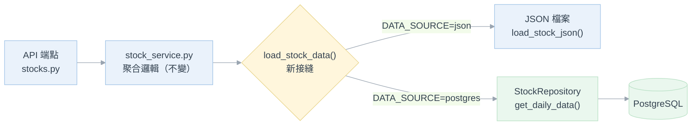

# 系統設計規劃：Phase 3–5（讀取切換 · 排程自動化 · 舊架構退役）

本文件是 [`postgresql_migration_and_scheduling_design.md`](./postgresql_migration_and_scheduling_design.md) 第 7 節「階段性導入計畫」中 Phase 3～5 的實作級設計，
資料表定義見 [`database_design_erd_uml.md`](./database_design_erd_uml.md)。

與前兩份文件不同，本文件是**針對現有程式碼**寫的：Phase 1（Docker/Schema）與 Phase 2（雙寫）**已經實作完成**，
因此以下每一節都直接指出要改哪個檔案、目前程式碼卡在哪裡，而不是重述架構原則。

---

## 1. 現況盤點（撰寫本文件時的實際程式碼）

Phase 1、2 已落地，以下是既有資產：

| 元件 | 位置 | 狀態 |
| :--- | :--- | :--- |
| Docker Compose（db / flyway / backup） | `backend/docker-compose.yml` | ✅ 已建立 |
| Flyway 遷移 V1 | `backend/db/migration/V1__Create_symbols_and_daily_data.sql` | ✅ 三表與索引皆已建立 |
| SQLAlchemy 2.0 ORM 模型 | `backend/db/models.py` | ✅ `Symbol` / `DailyStockData` / `CrawlerLog` |
| 非同步連線管理（asyncpg） | `backend/db/session.py` | ✅ 含 `dispose_engine()` |
| Repository（唯一資料存取入口） | `backend/repositories/stock_repository.py` | ✅ 含 Upsert 全欄位覆蓋 |
| JSON→資料列映射 | `backend/db/mapping.py` | ✅ 雙寫與匯入腳本共用 |
| 雙寫入口（容錯不中斷 JSON） | `backend/db/dual_write.py` | ✅ 已接進 `fetcher.py` / `us_fetcher.py` |
| 一次性歷史匯入 | `backend/scripts/import_json_to_postgres.py` | ✅ idempotent |
| `DATA_SOURCE` 環境變數 | `backend/.env`、`.env.example` | ⚠️ **僅有變數，程式碼無任何consumer** |

**因此 Phase 3 的起點很明確**：`.env` 裡的 `DATA_SOURCE=json` 目前是一個沒有作用的字串，
`config.py` 沒有 `get_data_source()`，讀取路徑 100% 仍走 JSON 檔案。

### 1.1 讀取路徑的唯一收斂點

盤點所有 JSON 讀取呼叫（`grep load_stock_json`），可分成兩群：

| 群組 | 呼叫點 | Phase 3 是否要改 |
| :--- | :--- | :--- |
| **API 讀取路徑** | `stock_service.py:47`（`discover_available_stocks`）、`:93`（`get_heatmap_data`）、`:219`（`get_stock_chart_payload`）、`stocks.py:25`（`_build_tracked_details`）、`stocks.py:125`（`get_stock_detail`） | ✅ 本階段目標 |
| **爬蟲內部狀態** | `fetcher.py:246, 298, 418, 464`、`us_fetcher.py:53`、`scripts/restore_price_from_legacy.py:46` | ❌ 留到 Phase 5 |

**關鍵發現**：五個 API 讀取點全部經由同一個函式 `load_stock_json(stock_id, market)`（定義於 `fetcher.py:118`），
且它回傳的都是同一種形狀——`{ "YYYY-MM-DD": { 英文欄位: 值 } }` 的巢狀 dict。

這代表 Phase 3 **不需要改寫五個端點的查詢邏輯**，只要在這個接縫上換掉資料來源即可。
`aggregate_stock_data()`、`get_stock_chart_payload()` 等所有下游聚合邏輯可以一行不動——這是本階段風險最低的切入點。

爬蟲那群呼叫的是「我上次抓到哪一天」「這天資料完不完整」的**增量狀態**，性質完全不同（見 §4.1、§5.1），
刻意不在 Phase 3 一起換，避免把「讀取切換」和「爬蟲改寫」兩件事綁在同一次上線。

---

## 2. Phase 3：後端讀取 API 切換

### 2.1 整體策略：兩步走，先對齊正確性再談效能



* **Step 1（正確性）**：建立 `load_stock_data()` 接縫，PostgreSQL 端把資料列**還原成與 JSON 完全相同的巢狀 dict**，
  下游邏輯零改動。此時兩種來源必須產生**逐欄位相同**的 API 回應——這是可驗證的硬指標（見 §2.6）。
* **Step 2（效能）**：確認 Step 1 兩邊一致後，才把日期區間過濾、熱力圖聚合下推到 SQL（見 §2.5）。

刻意分兩步的理由：Step 1 若和 Step 2 混做，一旦圖表數字對不上，無法判斷是「來源切換錯了」還是「SQL 聚合寫錯了」。

### 2.2 `config.py`：補上 `get_data_source()`

目前 `.env` 有 `DATA_SOURCE=json` 但沒有任何程式讀它。仿照既有的 `get_enabled_markets()` 寫法（同樣每次 `load_dotenv(override=True)`，
讓 `.env` 改動免重啟即可生效，與現有慣例一致）：

```python
# config.py
DEFAULT_DATA_SOURCE = "json"
VALID_DATA_SOURCES = ("json", "postgres")

def get_data_source() -> str:
    load_dotenv(ENV_PATH, override=True)
    source = os.getenv("DATA_SOURCE", DEFAULT_DATA_SOURCE).strip().lower()
    return source if source in VALID_DATA_SOURCES else DEFAULT_DATA_SOURCE
```

> 無法辨識的值一律退回 `json`（現行可用架構），而非拋例外——設定打錯字不該讓整個服務起不來。

### 2.3 ⚠️ 最大的技術陷阱：不可讓 API 走 `run_async()`

這是本階段最容易寫出「能跑但很慢」的地方，必須在動工前講清楚。

`repositories/stock_repository.py:13` 的 `run_async()` 是為**同步爬蟲**設計的橋接函式，它的行為是：

```python
asyncio.run(_runner())      # 每次呼叫都建立一個全新的 event loop
# 且 finally 一定執行：
await dispose_engine()      # 每次呼叫都把整個 asyncpg 連線池丟棄
```

`db/session.py:38` 的註解說明了原因——asyncpg 連線綁定建立時的 event loop，同步爬蟲每次 `asyncio.run()` 都是新 loop，
不丟棄舊池會出現 `Event loop is closed`。**對爬蟲而言這是正確的設計**（一天跑幾次，建池成本可忽略）。

但如果 API 讀取路徑也走這條路，後果是：**每一個 HTTP 請求都會建立並銷毀一次資料庫連線池**。
連線池的意義就是重複使用連線，這等於把連線池的好處完全抵銷，Phase 3 的效能測試必然難看——
而且會誤導成「PostgreSQL 比讀 JSON 還慢」這種錯誤結論。

**正確做法**：API 讀取路徑必須是原生非同步，直接 `await` Repository，共用同一個長生命週期連線池。

現有端點（`stocks.py`）全部是同步 `def`，FastAPI 會把它們丟到 threadpool 執行——那裡沒有 running loop，
所以 `run_async()` 「不會報錯」，正是這點讓這個陷阱特別隱蔽：它會安靜地正常運作，只是很慢。

因此 Phase 3 需要把讀取路徑改為 `async def`：

| 檔案 | 改動 |
| :--- | :--- |
| `api/v1/endpoints/stocks.py` | 5 個讀取端點改 `async def`，內部 `await` service 層 |
| `services/stock_service.py` | 讀取相關函式改 `async def`，`load_stock_data()` 為 `await` |
| `repositories/stock_repository.py` | 不動；API 直接用既有的 `async` 方法，**不碰** `*_sync()` 版本 |
| `db/session.py` | 不動；但需確認 API 路徑不會觸發 `dispose_engine()` |

> `upsert_daily_data_sync()` / `log_crawler_run_sync()` 保留給爬蟲，Phase 3 完全不動它們。
> 兩條路徑（API 非同步共用池、爬蟲同步拋棄池）刻意分開，各自符合自己的生命週期需求。

**另需補一個 lifespan 收尾**：`main.py` 目前沒有 lifespan handler，服務關閉時不會釋放連線池。
Phase 4 本來就要加 lifespan（見 §3.1），可一併在 `shutdown` 呼叫 `dispose_engine()`。

### 2.4 資料還原：`db/mapping.py` 的反向映射

`db/mapping.py` 目前只有 `record_to_daily_row()`（JSON → 資料列）。Phase 3 需要它的反向函式，
放在同一個檔案，理由與原本註解一致：**兩個方向的映射必須並排維護**，否則加欄位時很容易只改一邊。

```python
# db/mapping.py（新增）
def daily_row_to_record(row: dict) -> dict:
    """把 daily_stock_data 資料列還原成與 JSON 相同形狀的 record。
    下游 aggregate_stock_data() 完全依賴這個形狀，欄位名與型別都必須對齊。"""
```

**必須處理的三件事**（每一件寫錯都會讓圖表壞掉但不報錯）：

1. **型別還原**：資料庫回傳 `Decimal`（`Numeric(15,4)`）與 `datetime.date`，JSON 路徑回傳 `float` 與 `"YYYY-MM-DD"` 字串。
   * `Decimal` → `float`：`aggregate_stock_data()` 有 `r[f] > 0`、`sum()` 等運算，混入 `Decimal` 會在與 `float` 相乘時拋 `TypeError`，
     且 `short_ratio` 的除法結果精度也會改變。
   * `date` → `str`：`_get_group_key()`（`stock_service.py:139`）直接對 key 做 `datetime.strptime(date_str, "%Y-%m-%d")`，
     傳 `date` 物件會直接拋例外。
2. **JSONB 攤平**：`market_specific_data` 的巢狀結構要攤回頂層英文鍵。這是 `_INSTITUTIONAL_MAP` 與 `_MARGIN_MAP` 的反向：
   `foreign_net_buy` → `foreign_buy_sell`、`margin_balance` → `margin_balance`（同名）等。
3. **`None` 不可補 0**：`market_specific_data` 為 `NULL`（美股）時，還原後對應鍵應**不存在**，
   而不是補 0——`aggregate_stock_data()` 用的是 `.get(f, 0)`，補不補 0 對聚合結果一樣，
   但 `records` 陣列會直接送到前端明細表格，補 0 會讓美股表格出現一排假的「0 張」。
   這與主文件第 3.1 節「不支援的能力回 `null` 而非零值」是同一條原則。

**反向映射的覆蓋範圍**：經核對前端 `StockDashboard.vue` 明細表格實際使用的欄位為
`open` / `high` / `low` / `close` / `foreign_buy_sell` / `trust_buy_sell` / `dealer_buy_sell` /
`institutional_total` / `institutional_amount_est` / `margin_balance` / `short_balance` / `short_ratio`，
加上 `SUM_FIELDS` 需要的 `volume` / `amount` / `trades`——**全部可由現有資料表還原**，無缺口。

> `_MARGIN_MAP` 中以中文為來源鍵的欄位（`融資買進(張)`、`融券賣出(張)` 等）確實有存進 JSONB，
> 但前端與聚合邏輯都沒有使用，反向映射**只需輸出英文鍵**即可。
> 這點需在 §2.6 的比對測試中確認，而不是憑推測——若 CSV 匯出有用到，比對會直接抓出差異。

### 2.5 效能：熱力圖與清單頁的 N+1 檔案問題

Step 1 完成後，`get_heatmap_data()` 與 `discover_available_stocks()` 雖然會正確運作，但效能不會變好——
因為它們的迴圈結構是「逐檔標的各查一次」，換成 SQL 只是把 14 次檔案讀取換成 14 次查詢。

真正的效能來源在 Step 2：這兩個函式目前的行為是 `os.listdir()` 後**逐檔開啟並解析整份 JSON**
（`stock_service.py:40-47`、`:83-93`），每檔含 3 個月資料，只為了取「最新一筆」與「最近 10 筆收盤價」。

PostgreSQL 版本可用單一查詢取代整個迴圈：

```sql
-- 熱力圖：一次取回所有追蹤標的的最近 N 個交易日
SELECT symbol, trade_date, close_price, open_price
FROM (
  SELECT *, ROW_NUMBER() OVER (PARTITION BY symbol ORDER BY trade_date DESC) AS rn
  FROM daily_stock_data
  WHERE market_type = :market AND symbol = ANY(:symbols)
) t
WHERE rn <= 10
ORDER BY symbol, trade_date;
```

`get_stock_chart_payload()` 則是把日期區間下推——目前是載入全部資料後在 Python 端用
`months_ago()` 產生的 cutoff 字串過濾（`stock_service.py:151-152`），改為 SQL `WHERE trade_date >= :cutoff`
即可讓資料庫只回傳需要的列（`get_daily_data()` 已支援 `date_from` / `date_to` 參數，不需改 Repository）。

> **效能測試要測對東西**：`months=3` 時 JSON 與 PostgreSQL 差距不會明顯（資料量太小）。
> 有意義的測試是 `months=12` 的圖表查詢與整頁熱力圖，並且**必須在 Step 2 完成後才測**——
> 在 Step 1 就測會得到「換了資料庫卻沒變快」的結論，因為那時瓶頸還在 Python 端過濾。

### 2.6 驗收：JSON / PostgreSQL 逐欄位比對

Phase 3 的驗收核心不是「圖表看起來正常」，而是**兩種來源的 API 回應完全一致**。
建議寫一支比對腳本 `backend/scripts/compare_data_sources.py`：

1. 對每個追蹤標的、每種 `period`（daily/weekly/monthly）、每種 `months`（1/3/12）：
2. 以 `DATA_SOURCE=json` 取得 `chart-data` 載荷，再以 `DATA_SOURCE=postgres` 取得同一組載荷；
3. 逐欄位深度比對，浮點數容許 `1e-9` 誤差（`Decimal` → `float` 轉換的正常誤差）；
4. 印出所有差異的 `(symbol, period, field, json_value, pg_value)`。

**這支腳本在 Phase 5 會再用一次**（退役前的一致性驗證，見主文件第 10 節），
所以值得寫得完整一點，不要寫成一次性的臨時腳本。

### 2.7 ⚠️ 已知資料缺口：美股籌碼欄位目前沒有進資料庫

比對測試會立刻抓到這個問題，但因為它是 **Phase 2 遺留的缺陷**、且必須在 Phase 3 切換前修好，在此明確列出：

`us_fetcher.py:103-105` 會把三個欄位寫進 JSON 的最新日期記錄：

```python
stock_data[latest_date]["short_interest"] = shares_short
stock_data[latest_date]["short_ratio"] = short_ratio
stock_data[latest_date]["institutional_holders"] = inst_holders
```

但 `db/mapping.py:32-34` 的 `_build_market_specific_data()` 對非台股一律回傳 `None`，
而 `record_to_daily_row()` 也只映射 OHLC/volume/amount/trades——
**這三個欄位在雙寫時被靜默丟棄，PostgreSQL 裡完全沒有。**

影響：`get_stock_chart_payload()` 的 `latest_summary` 會讀 `latest.get("short_interest", 0)`
與 `latest.get("institutional_holders", 0)`（`stock_service.py:279-280`），前端 `StockDashboard.vue:407-408`
用這兩個 key 決定要不要顯示對應的 KPI 方塊。切到 `postgres` 後，美股這兩格會**無聲地變成 0**，
不會有任何錯誤訊息——正是主文件一再強調要避免的「假資料」情境。

**修法**：在 `mapping.py` 為美股建立對應的 `market_specific_data` 結構，而非回傳 `None`：

```python
{ "short_interest": { "shares_short": ..., "short_ratio": ..., "settlement_date": ... },
  "institutional": { "shares_held": ... } }
```

* 修改後需**重跑一次美股抓取或匯入腳本**回填既有資料列，否則舊列仍是 `NULL`。
* 注意這**不牴觸**「美股 `market_specific_data` 為 `NULL`」的原則——該原則針對的是**台股專屬籌碼**（法人買賣超、融資融券），
  意思是「美股沒有這種制度」；而 Short Interest 是美股**確實存在**的資料，本來就該儲存。
  真正該保持 `NULL` 的是「這個市場不存在此概念」，不是「這個市場的資料我懶得存」。

---

## 3. Phase 4：排程自動化與自動補齊

### 3.1 APScheduler 接入點：FastAPI lifespan

`main.py` 目前沒有 lifespan handler，需要新增。`requirements.txt` 也需加入 `apscheduler>=3.10`（目前沒有）。

```python
# main.py
from contextlib import asynccontextmanager

@asynccontextmanager
async def lifespan(app: FastAPI):
    scheduler = create_scheduler()     # services/scheduler.py
    scheduler.start()
    asyncio.create_task(run_startup_backfill())   # 背景執行，不阻塞啟動（見 §3.4）
    yield
    scheduler.shutdown(wait=False)
    await dispose_engine()             # 一併補上 Phase 3 缺的連線池收尾（見 §2.3）

app = FastAPI(..., lifespan=lifespan)
```

> **啟動檢查必須是背景任務**：缺漏回補會逐日抓取並 `sleep` 數秒（見 §3.5），
> 若在 lifespan 中直接 `await`，服務要等回補跑完才開始接受請求，前端會以為後端掛了。

### 3.2 多行程重複觸發：確認目前的實際風險

主文件第 5 節已列出此風險，這裡確認現況：`main.py:53` 是 `uvicorn.run("main:app", ..., reload=True)`。

* `reload=True` 會有一個 reloader 監控行程與一個實際跑 app 的子行程，**只有子行程會執行 lifespan**，因此不會重複觸發。
* 但 `--reload` 在存檔時會重啟子行程，排程會跟著重建——開發期間若剛好在排程時間點存檔，可能漏跑或重跑。
* 真正的風險是未來改用 `--workers N`：每個 worker 各跑一份排程，同一時間觸發 N 次抓取。

**決議**：目前規模維持單 worker，但**排程任務一律先寫入 `crawler_logs` 再開始抓**，
並在任務開頭查詢「今天這個市場是否已有 `running` 或 `success` 紀錄」，有則跳過。
這層防重是資料庫層的，不依賴行程數量，未來擴充 worker 時不需重寫。

### 3.3 必要的程式碼改動：`trigger_type` 目前寫死為 `manual`

`fetcher.py:491,495` 與 `us_fetcher.py:125,130` 呼叫 `log_crawler_run()` 時，`trigger_type` 參數**寫死字串 `"manual"`**。

但 `crawler_logs.trigger_type` 的設計值域是 `scheduled` / `backfill` / `manual`（見 ERD 文件），
若不改，排程與回補跑出來的紀錄全部標成 `manual`，後續「連續失敗告警」與「排程是否正常執行」的查詢會失去區分能力。

**改動**：`run_fetch_process()` 與 `run_us_fetch_process()` 各加一個參數：

```python
def run_fetch_process(target_stocks=None, months=None, mode="incremental",
                      trigger_type="manual"):   # ← 新增，預設維持 manual 不影響既有呼叫端
```

`api/v1/endpoints/fetch.py:35-39` 的既有呼叫不傳此參數即維持原行為，排程則明確傳入 `"scheduled"` / `"backfill"`。

### 3.4 `fetch_status` 單例衝突：排程必須讓路

`services/fetcher.py:87` 的 `fetch_status` 是**模組級單例**，`run_fetch_process()` 一進來就無條件呼叫
`fetch_status.start()`（`fetcher.py:452`），會直接覆寫既有狀態。

`fetch.py:21-27` 的手動觸發端點有檢查 `is_running` 並回傳 `FETCH_IN_PROGRESS`，
但**排程任務不會經過那個端點**——它直接呼叫 `run_fetch_process()`。

後果：使用者正在手動同步時排程觸發，兩個任務會同時寫同一批 JSON 檔與同一組進度狀態，
前端進度條會在兩個任務之間跳動，且 JSON 寫入可能互相覆蓋。

**對策**：排程任務在呼叫前檢查，**有任務進行中就跳過本次並記錄**，而不是排隊等待：

```python
# services/scheduler.py
def scheduled_fetch(market: str):
    if fetch_status.get_snapshot()["is_running"]:
        logger.info(f"[排程] 已有抓取任務進行中，跳過本次 {market} 排程")
        return
    ...
```

選擇「跳過」而非「等待」的理由：這是每日例行抓取，使用者的手動同步抓的是同一批資料，
等它跑完再抓一次只是重複做功；真的漏掉的日期，隔天的排程或啟動時的缺漏檢查（§3.5）會補上。

### 3.5 缺漏資料回補：先解決「應該有哪些交易日」

主文件第 5.2 節的演算法是「應有交易日列表 − 資料庫已有日期 = 缺漏清單」。
落到現有程式碼，`應有交易日列表` 這一項是缺的，而且兩個市場的難度不同：

| 市場 | 現況 | 問題 |
| :--- | :--- | :--- |
| 台股 | `_no_trading_days.json`（`fetcher.py:141`，存於 `DATA_DIR` 根目錄、非市場子目錄） | 是**探測結果的快取**，不是完整行事曆；只記錄「抓過且確認沒開盤」的日期 |
| 美股 | 無 | yfinance 只回傳實際交易日，沒有「這天沒開盤」的資訊 |

若沒有可信的交易日清單，「缺漏」與「當天沒開盤」無法區分，回補邏輯會**每次啟動都去重抓那些其實是假日的日期**，
一路撞 rate limit，而且永遠補不齊（因為那天本來就沒有資料）。

**設計決議：新增 V2 遷移，把非交易日納入資料庫管理**

```sql
-- V2__Create_market_no_trading_days.sql
CREATE TABLE market_no_trading_days (
    market_type VARCHAR(10) NOT NULL,
    trade_date  DATE        NOT NULL,
    source      VARCHAR(20) NOT NULL DEFAULT 'probed',  -- probed | manual | calendar
    created_at  TIMESTAMP   NOT NULL DEFAULT NOW(),
    PRIMARY KEY (market_type, trade_date)
);
```

* 沿用台股既有的「探測後快取」機制（`fetcher.py:395-403` 已在做這件事，只是寫進 JSON 檔），寫入目標改為此表。
* `source` 欄位保留來源區分，未來若接入官方行事曆可直接灌入 `calendar` 來源的資料，不需改結構。
* **這張表也讓 `_no_trading_days.json` 有了明確的退場路徑**（見 §4.3），否則 Phase 5 會卡在「這個檔案要放哪」。

回補流程因此變成：

```
應有交易日 = 該區間的平日（週一~週五）
           − market_no_trading_days 中該市場的日期
缺漏清單   = 應有交易日 − daily_stock_data 中該標的已有的 trade_date
```

**回補的 Rate Limiting**：台股爬蟲每次請求後已有 `time.sleep(3)`（`fetcher.py:239, 349, 400`），
回補走的是同一套 `run_fetch_process()`，因此節流是既有行為，不需另外實作。
但需注意首次啟動若缺漏 90 天，光台股就是數十分鐘等級的作業——這也是 §3.1 要求它必須是背景任務的原因。

**回補範圍上限**：建議加一個 `BACKFILL_MAX_DAYS`（預設 90，對齊主文件）環境變數，
避免資料庫剛建好、`daily_stock_data` 幾乎全空時，啟動檢查判定「缺漏 90 天 × 14 檔」並立刻發動大規模抓取。
初次建置應該走 `import_json_to_postgres.py` 匯入，而不是靠回補從頭抓。

### 3.6 排程時間設定

沿用主文件第 5.1 節的決議，此處僅補上實作註記：

| 市場 | Cron | 備註 |
| :--- | :--- | :--- |
| 台股 | 每日 14:30（`Asia/Taipei`） | 收盤 13:30 後 1 小時 |
| 美股 | 每日 06:00（`Asia/Taipei`） | 已含夏令/冬令兩種收盤時間的緩衝，**排程時間本身不需隨 DST 調整** |

APScheduler 的 `CronTrigger` 必須明確帶 `timezone="Asia/Taipei"`，
不可依賴容器或主機的預設時區——`docker-compose.yml` 的 `db` 服務是 `TZ=UTC`，
後端若未來也容器化，預設時區會是 UTC，不明確指定就會整整差 8 小時。

---

## 4. Phase 5：舊架構退役與清理

### 4.1 前置條件：爬蟲的增量狀態必須先脫離 JSON

Phase 5 的說法是「停止寫入 JSON、移除解析 JSON 的舊有邏輯」，但實際盤點後，
**爬蟲對 JSON 的依賴不只是寫入，還有讀取**，這部分必須先改，否則一停寫 JSON 爬蟲就會失效：

| 位置 | 用途 | 停用 JSON 後的替代 |
| :--- | :--- | :--- |
| `fetcher.py:464-470` | 讀最後一筆日期算增量天數 `gap_days` | `SELECT MAX(trade_date) FROM daily_stock_data WHERE symbol=...` |
| `fetcher.py:298-308` | `is_date_complete()` 判斷該日是否已抓完整（用 `margin_balance` 是否存在） | 查 `market_specific_data->'margin_trading'->>'margin_balance' IS NOT NULL` |
| `fetcher.py:246, 418` | 讀既有資料以合併/避免 0 覆蓋非零價格 | 需先查回該標的區間資料再合併 |
| `us_fetcher.py:53-58` | 讀既有日期決定 `ticker.history(start=...)` | 同上，改查 `MAX(trade_date)` |

其中 `fetcher.py:429-431`「不讓 0 覆蓋既有非零價格」與 `backfill_daily_quotes()` 的修補邏輯，
是過去踩過坑後加上的保護（原始碼註解寫得很明確），**改寫時必須完整保留這個語意**，
否則會重現「行情未回補導致 K 線被壓成一條線」的舊問題。

**建議**：這部分獨立成 Phase 5a，與 5b（停寫 JSON）分開驗收——
5a 完成後爬蟲已完全以 PostgreSQL 為狀態來源，此時 JSON 仍在寫但已無人讀，
確認一段時間無異常再進 5b，風險比一次做完低很多。

### 4.2 退役檢查清單（對應主文件第 10 節）

停寫 JSON 前必須全部通過：

- [ ] §2.6 的 `compare_data_sources.py` 連續 7 天執行皆零差異（不是只跑一次）
- [ ] `DATA_SOURCE=postgres` 已穩定運行 7 天以上，`crawler_logs` 無 `failed` 紀錄
- [ ] 已完成一次**實際的備份還原演練**（主文件第 6 節），不是只確認備份檔存在
- [ ] §2.7 的美股籌碼欄位缺口已修復並回填
- [ ] Phase 5a 完成：爬蟲不再讀取 JSON
- [ ] 全域搜尋 `load_stock_json` 僅剩下待刪除的定義本身

### 4.3 `backend/data` 停止進版控

**執行時機**：確認上述清單全數通過、且 PostgreSQL 已是唯一資料來源之後。

**兩個步驟缺一不可**：

```bash
# 1. 加入忽略規則（backend/.gitignore 已存在，附加即可）
#    現有內容已有 postgres_data/ 與 backups/
echo "data/" >> backend/.gitignore

# 2. 從版控移除已追蹤的檔案（只加 .gitignore 對已追蹤檔案完全沒有效果）
git rm -r --cached backend/data
```

> `git rm --cached` 只把檔案移出索引，**本機檔案不會被刪除**——這點很重要，
> 因為退役初期仍可能需要那些 JSON 作為最後的人工比對依據。

**關於 git 歷史**：舊資料仍留在 commit 歷史中（`git log` 可查、`git show` 可還原）。
本步驟的目的是**停止未來的異動繼續進版控**，不是抹除過去。
若日後真的需要縮減 repo 體積，需另外使用 `git filter-repo` 重寫歷史——
那是會改變所有 commit hash 的破壞性操作，需獨立評估，不在本階段範圍。

**索引檔的個別處置**：

| 檔案 | 處置 |
| :--- | :--- |
| `data/tw/*.json`、`data/us/*.json` | 隨 `data/` 一併移出版控 |
| `_no_trading_days.json` | 已由 §3.5 的 `market_no_trading_days` 表取代，可一併移除 |
| `_symbols.json` | 已由 `symbols` 表取代（見主文件第 3.1 節），確認 `resolve_market()` 等呼叫端都改查資料庫後移除 |

> **注意**：`_no_trading_days.json` 與 `_symbols.json` 位於 `DATA_DIR` 根目錄，
> 加 `data/` 到 `.gitignore` 會**一併涵蓋它們**。若希望在完全確認前保留這兩個檔案的版控，
> 需寫成更精確的規則（如 `data/tw/`、`data/us/`）再分批處理。

### 4.4 程式碼清理範圍

停寫 JSON 後可移除的部分：

| 檔案 | 可移除內容 |
| :--- | :--- |
| `services/fetcher.py` | `load_stock_json()`、`stock_json_path()`、`save_data_to_json()`、`load/save_no_trading_days()`、`_normalize_keys()`、`_ALT_KEYS` |
| `services/us_fetcher.py` | `stock_json_path()`、`save_us_stock_json()` |
| `db/dual_write.py` | 整個模組——雙寫已無意義，爬蟲直接呼叫 Repository |
| `services/stock_service.py` | `load_stock_data()` 的 json 分支；`get_data_source()` 相關判斷 |
| `config.py` | `DATA_SOURCE` 相關（`DATA_DIR` 若無其他用途一併評估） |
| `scripts/restore_price_from_legacy.py` | 一次性腳本，確認不再需要後移除 |

> **`db/mapping.py` 不要整個刪掉**：`record_to_daily_row()` 在爬蟲直寫資料庫後仍然需要
> （原始抓取結果 → 資料列的轉換依然存在），只有 §2.4 的反向函式 `daily_row_to_record()` 可視情況保留——
> 若前端明細表格仍依賴那個扁平形狀，它就還有用。

---

## 5. 風險與注意事項

| 風險 | 對策 |
| :--- | :--- |
| **API 走 `run_async()` 導致每請求建池** | 見 §2.3，讀取路徑一律 `async def` + `await`，不碰 `*_sync()` 方法 |
| **`Decimal` / `date` 型別未轉換** | 見 §2.4；`strptime` 與 `> 0` 比較會直接拋例外或算錯，比對測試必抓 |
| **美股籌碼欄位靜默歸零** | 見 §2.7，屬 Phase 2 遺留缺陷，必須在切換前修好並回填 |
| **`None` 被補成 0 混入前端表格** | 反向映射對 `NULL` 一律不產生該鍵；Code Review 檢查 `.get(x, 0)` 是否用在 `records` 組裝上 |
| **排程與手動抓取搶同一個 `fetch_status`** | 見 §3.4，排程檢查 `is_running` 後跳過本次 |
| **`trigger_type` 全部記成 `manual`** | 見 §3.3，加參數並由排程明確傳入 |
| **回補分不清「缺漏」與「沒開盤」** | 見 §3.5，新增 `market_no_trading_days` 表；並設 `BACKFILL_MAX_DAYS` 上限 |
| **啟動回補阻塞服務啟動** | 見 §3.1，必須以背景任務執行 |
| **APScheduler 未指定時區** | 明確帶 `timezone="Asia/Taipei"`，不依賴主機/容器預設（容器是 UTC） |
| **停寫 JSON 後爬蟲失去增量狀態** | 見 §4.1，Phase 5a 先把爬蟲狀態來源改為資料庫，與 5b 分開驗收 |
| **`.gitignore` 加了但檔案仍在版控** | 見 §4.3，必須同時執行 `git rm -r --cached backend/data` |
| **「0 不可覆蓋非零價格」的保護被改寫掉** | 見 §4.1，該邏輯是踩坑後加的，改寫爬蟲時需完整保留語意並補測試 |

---

## 6. 驗收檢查清單

**Phase 3**

- [ ] `DATA_SOURCE=json` 時，所有 API 回應與改動前完全一致（迴歸驗證）
- [ ] `compare_data_sources.py` 對全部追蹤標的 × 3 種 period × 3 種 months 執行，零差異
- [ ] 美股個股頁的 Short Interest／機構持股方塊在兩種來源下數值相同（§2.7 已修復）
- [ ] 美股 `records` 中不存在台股籌碼欄位，且不是補 0 而是鍵不存在
- [ ] 讀取端點皆為 `async def`，且單次請求不會觸發 `dispose_engine()`（可用 log 或連線數觀察）
- [ ] `months=12` 的 `chart-data` 與整頁熱力圖，PostgreSQL 明顯快於 JSON（Step 2 完成後測）
- [ ] `DATA_SOURCE` 填入無效值時服務仍正常啟動並退回 `json`

**Phase 4**

- [ ] 台股 14:30、美股 06:00 排程正確觸發，`crawler_logs` 的 `trigger_type` 為 `scheduled`
- [ ] 手動抓取進行中時觸發排程，排程跳過且不影響前端進度顯示
- [ ] 同一天重複觸發排程，第二次因已有當日資料/紀錄而跳過
- [ ] 人為刪除某天資料後重啟服務，啟動檢查能找出並回補該日
- [ ] 假日（`market_no_trading_days` 中的日期）不會被判定為缺漏而重複重抓
- [ ] 啟動回補執行期間，API 可正常回應（未被阻塞）
- [ ] `BACKFILL_MAX_DAYS` 生效，空資料庫啟動不會觸發無上限的大規模抓取

**Phase 5**

- [ ] Phase 5a：爬蟲在 `data/` 目錄被改名的情況下仍能正常增量抓取（證明已不依賴 JSON 讀取）
- [ ] 停寫 JSON 後，`data/` 目錄檔案的 mtime 不再變動
- [ ] `git status` 不再出現 `backend/data/**` 的異動
- [ ] `git ls-files backend/data | wc -l` 回傳 0
- [ ] 本機 `backend/data/` 檔案仍存在（`--cached` 未誤刪）
- [ ] 全域搜尋 `load_stock_json`、`dual_write` 在 `backend/` 內零命中
- [ ] 移除舊邏輯後，完整跑一次抓取 + 前端渲染驗證
