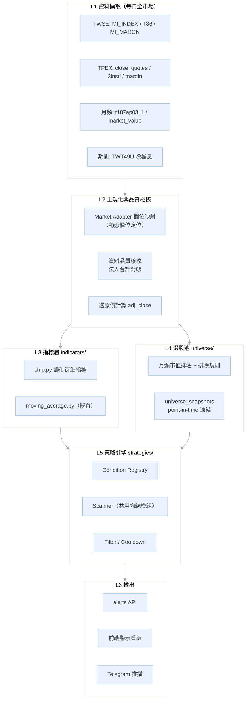

# 籌碼選股與警示策略 — 開發需求規格書

> **文件版本**：v2.0 · **最後更新**：2026-08-12
> **狀態**：Draft — 待審核確認後進入開發
> **前置文件**：
> - [均線策略.md](../均線策略警示系統/均線策略.md) — 策略引擎與警示框架（本文件共用其 Scanner / Filter / Alert 架構）
> - [multi_market_tw_us_design.md](../multi_market_tw_us_design.md) — 雙市場架構
> - [database_design_erd_uml.md](../資料轉存到postgressql/database_design_erd_uml.md) — 資料庫 ERD / UML

---

## 0. 文件導讀

本文件定義「籌碼面（三大法人 + 信用交易）選股與警示系統」的開發需求。

v2.0 相對 v1.0 的修訂重點，全部以**實際程式碼與實測 API 回應為依據**（實測日期 2026-08-12）：

| # | 修訂項目 | 性質 | 章節 |
| :--- | :--- | :--- | :--- |
| 1 | 揭露 T86 欄位錯位缺陷：`投信買賣超` 100% 為 0、`三大法人合計` 實為自營商數字 | **準確性 · P0 阻斷** | §1.2 |
| 2 | 爬蟲複雜度由 `O(標的數 × 月數)` 改為 `O(交易日數)`，全市場回補 9 小時 → 36 分鐘 | **可行性 · P0** | §2.2 |
| 3 | 補齊上櫃（TPEX）資料源，v1 僅寫「整合 TPEX」未指定端點 | 可行性 | §2.3 |
| 4 | 市值排名改用可實作公式（實收資本額 ÷ 面額 × 收盤價；上櫃直接取現成排行） | 可行性 | §2.4 §4.2 |
| 5 | 券資比門檻 20~30% 經實測對個股形同永不觸發，改為分層 + 相對百分位 | **準確性** | §5.5 |
| 6 | 補上除權息還原規則，避免除權息跳空產生假的「跌破月線」訊號 | **準確性** | §3.4 |
| 7 | 選股池補上 ETF / 處置股 / 流動性排除規則 | 準確性 | §4.1 |
| 8 | 季底時間濾網由「8 個月份清單」改為「季底前 N 個交易日」窗口 | 準確性 | §5.4 |
| 9 | 所有觸發條件改寫為含明確視窗與單位的可測試公式，並定義資料不足時的行為 | 準確性 | §3.3 §5 |
| 10 | 新增條件註冊表（Condition Registry）與資料存取抽象，新增策略免改引擎 | **擴展性** | §6.3 §6.4 |
| 11 | 新增訊號去重（cooldown）、point-in-time 選股池凍結（防倖存者偏差） | 擴展性 / 準確性 | §4.3 §5.1 |

---

## 1. 現況盤點與可行性結論

### 1.1 系統現有能力

| 層次 | 已具備 | 相關檔案 |
| :--- | :--- | :--- |
| 台股日頻爬蟲 | STOCK_DAY（行情）+ T86（法人）+ MI_MARGN（信用） | [fetcher.py](../../backend/services/fetcher.py) |
| 欄位正規化 | 中文 → 英文 key 映射 | [markets/tw.py](../../backend/markets/tw.py) `FIELD_MAP` |
| 聚合引擎 | 日／週／月 K 線與籌碼欄位聚合，已內建 `short_ratio`（券資比） | [stock_service.py](../../backend/services/stock_service.py) `aggregate_stock_data()` |
| 資料庫 | PostgreSQL Schema、ORM、Repository、雙寫皆已就緒 | [db/models.py](../../backend/db/models.py)、[repositories/stock_repository.py](../../backend/repositories/stock_repository.py)、[db/dual_write.py](../../backend/db/dual_write.py) |
| 警示框架 | 由均線策略文件定義的 Scanner / Filter / AlertEvent 架構（本模組共用） | 規劃中 |

### 1.2 P0 阻斷缺陷：T86 欄位錯位（必須先修）

**本模組的核心資料目前是錯的。** 這不是推測，是對實際檔案與 TWSE 線上回應交叉驗證的結果。

[fetcher.py:361-364](../../backend/services/fetcher.py#L361-L364) 以固定索引解析 T86：

```python
foreign_lots = int(row[4].replace(",", "")) // 1000
trust_lots   = int(row[7].replace(",", "")) // 1000
dealer_lots  = int(row[10].replace(",", "")) // 1000
total_lots   = int(row[11].replace(",", "")) // 1000
```

但 `selectType=ALL` 的 T86 實際回傳 **19 個欄位**（2026-08-11 實測）：

| 索引 | TWSE 實際欄位 | 程式目前當成 | 判定 |
| :--- | :--- | :--- | :--- |
| 4 | 外陸資買賣超股數（不含外資自營商） | `foreign_buy_sell` | ✅ 正確（惟漏加索引 7 的外資自營商） |
| 7 | **外資自營商**買賣超股數 | `trust_buy_sell` | ❌ **錯位** |
| 10 | **投信**買賣超股數 | `dealer_buy_sell` | ❌ **錯位** |
| 11 | **自營商**買賣超股數（合計） | `institutional_total` | ❌ **錯位** |
| 18 | **三大法人**買賣超股數 | （未取用） | ❌ **遺漏** |

**實測佐證（2026-08-11 台積電 2330）**：

| 欄位 | TWSE 原始值（股） | 落檔值（張） | 應為 |
| :--- | ---: | ---: | :--- |
| 外陸資買賣超 | 3,498,237 | `foreign_buy_sell` = 3498 | ✅ |
| 外資自營商買賣超 | 0 | `trust_buy_sell` = **0** | 應為投信 381 |
| 投信買賣超 | 381,840 | `dealer_buy_sell` = 381 | 應為自營商 −189 |
| 自營商買賣超 | −188,933 | `institutional_total` = **−189** | 應為三大法人 3691 |
| 三大法人買賣超 | 3,691,144 | — | **未落檔** |

**對現有 904 筆歷史資料的全量掃描結果**：

- `trust_buy_sell`（投信）**100.0%（904/904）為 0** — 因為它實際存的是「外資自營商」，該欄位絕大多數日子本就是 0。
- `foreign + trust + dealer ≠ institutional_total` 的比例達 **99.7%（901/904）** — 因為 `institutional_total` 存的根本不是合計值。

**影響**：

| 受影響需求 | 後果 |
| :--- | :--- |
| §5.4 衛星策略「投信破冰買進」 | **完全失效**（投信永遠是 0，永不觸發） |
| §5.3 核心策略「外資買超佔量比」 | 偏低（漏計外資自營商） |
| §5.5 三型態警示「三大法人合計買/賣超」 | **判斷相反的可能**（用自營商數字代替三大法人） |
| 前端法人圖表 | 圖例與數值不符 |

**修正要求**：

1. 依 `fields` 陣列**動態定位欄位**，不再寫死索引；找不到欄位即中止並記錄錯誤，禁止靜默落檔。
2. 落檔欄位改為：`foreign_net`（索引 4 + 7）、`trust_net`（10）、`dealer_net`（11）、`institutional_net`（18）。
3. **單位改以「股」為正典**，張數在展示層換算。現行 `// 1000` 對負數是向下取整（−188,933 → −189 而非 −188.9），會系統性低估賣超。
4. 提供一次性回補腳本重抓歷史區間；因舊資料無法就地修正（索引 18 從未落檔），必須重抓。
5. 加入落檔後驗證：`foreign_net + trust_net + dealer_net == institutional_net`，不成立則該日標記 `data_quality: suspect`。

> **MI_MARGN（信用交易）已驗證正確**：索引 6 = 融資今日餘額、索引 12 = 融券今日餘額，與 2026-08-11 台積電實際值（29,070 / 30）一致，無須修正。

### 1.3 其他資料層缺口

| 缺口 | 現況 | 影響 |
| :--- | :--- | :--- |
| 資料視窗過短 | `MONTHS_RANGE=3`，實際僅 63~70 筆日資料 | 60MA 僅最後數日可算，**季線斜率無法判斷** → 核心策略不可用 |
| 無上櫃資料 | 僅 TWSE，`data/tw/` 14 檔全為上市 | 中小型股池大量缺漏（上櫃約 900 檔） |
| 無市值資料 | 未抓發行股數／市值 | 選股池分層無依據 |
| 無除權息資料 | 未抓還原因子 | 除權息跳空產生假訊號（§3.4） |
| 無選股池歷史 | 無 universe 快照 | 回測有倖存者偏差 |
| 全域掃描效能 | `discover_available_stocks()` 每次請求 `json.load` 全目錄 | 標的數擴大到千檔會嚴重劣化 |

### 1.4 v1 需求可行性判定

| v1 需求 | 判定 | 說明 |
| :--- | :--- | :--- |
| 2.1 動態選股池（前 50 / 151–1000） | 🟡 **需改設計** | 資料源可行（§2.4），但爬蟲須先改為全市場模式（§2.2），並補排除規則（§4.1） |
| 2.2 核心：外資大型權值波段 | 🟡 **需修資料** | 待 T86 修正 + 資料視窗延長至 12 個月 |
| 2.3 衛星：投信中小型作帳 | 🔴 **目前不可行** | 投信資料 100% 為 0，須先修 §1.2；且需上櫃資料 |
| 2.4 底部換手 | 🟢 可行 | 融資資料正確；三大法人合計待修 |
| 2.4 高檔軋空 | 🟡 **需調參** | 券資比 20~30% 門檻對個股實測形同永不觸發（§5.5） |
| 2.4 高檔出貨 | 🟢 可行 | 同底部換手 |
| 3.2 YAML 設定檔 | 🟢 可行 | 沿用均線策略的設定檔框架 |

---

## 2. 資料來源盤點（2026-08-12 實測）

### 2.1 來源清單

所有端點皆於 2026-08-12 實際發送請求驗證，「一次回傳」欄位為實測筆數。

| # | 來源 | 端點 | 粒度 | 一次回傳 | 用途 | 狀態 |
| :--- | :--- | :--- | :--- | :--- | :--- | :--- |
| A | TWSE 每日收盤行情（全部） | `rwd/zh/afterTrading/MI_INDEX?date=&type=ALLBUT0999` | 單日 × 全市場 | **1,379 檔**（`tables[8]`） | 上市 OHLCV | ✅ 已驗證 |
| B | TWSE 三大法人買賣超 | `rwd/zh/fund/T86?date=&selectType=ALL` | 單日 × 全市場 | 19 欄位 | 上市法人 | ✅ 已驗證（欄位須改動態定位） |
| C | TWSE 融資融券 | `rwd/zh/marginTrading/MI_MARGN?date=&selectType=ALL` | 單日 × 全市場 | `tables[1]` | 上市信用 | ✅ 已在用且正確 |
| D | TWSE 上市公司基本資料 | `openapi.twse.com.tw/v1/opendata/t187ap03_L` | 快照 | **1,094 檔** | 實收資本額、產業別 → 市值 | ✅ 已驗證 |
| E | TWSE 除權息計算結果 | `rwd/zh/exRight/TWT49U?startDate=&endDate=` | 期間 | 804 筆（5/1–8/11） | 還原因子 | ✅ 已驗證 |
| F | TPEX 上櫃行情 | `tpex.org.tw/openapi/v1/tpex_mainboard_daily_close_quotes` | 見註 | 10,337 筆 | 上櫃 OHLCV + `Capitals` | ⚠️ 期間範圍待確認 |
| G | TPEX 上櫃三大法人 | `openapi/v1/tpex_3insti_daily_trading` | 單日 | **915 檔** | 上櫃法人（含 `TotalDifference`） | ✅ 已驗證 |
| H | TPEX 上櫃融資融券 | `openapi/v1/tpex_mainboard_margin_balance` | 單日 | **916 檔** | 上櫃信用（含使用率、限額） | ✅ 已驗證 |
| I | TPEX 上櫃市值排行 | `openapi/v1/tpex_daily_market_value` | 單日 | **890 檔** | 上櫃市值 + 現成排名 | ✅ 已驗證 |
| J | TWSE 本益比／淨值比 | `openapi.twse.com.tw/v1/exchangeReport/BWIBBU_ALL` | 快照 | 1,083 檔 | 選配估值濾網 | ✅ 已驗證 |

> **註（F）**：`tpex_mainboard_daily_close_quotes` 實測回傳 10,337 筆，遠多於上櫃股票數（約 900），推測涵蓋多個交易日。**實作前須先確認其日期涵蓋範圍**，若僅含近期數日，歷史回補需另找端點或逐日抓取。列為 §11 開放問題 Q-1。
>
> **註（B、G）**：TPEX 端點名稱與 TWSE 完全不同，且 TPEX OpenAPI 的 JSON key 含空白與拼字不一致（例如 `LatesAskPrice`、`ShortConvering`、同時存在 `Dealers-TotalSell` 與 `Dealers -TotalSell`）。**必須在 Market Adapter 層做欄位正規化**，不可讓原始 key 外流到策略層。

### 2.2 爬蟲複雜度重構（P0 · 可行性關鍵）

**現行問題**：[fetch_daily_quotes()](../../backend/services/fetcher.py#L198) 以 `STOCK_DAY` 逐檔逐月抓取，每次請求後 `time.sleep(3)`：

```
請求數 = 標的數 × 月數
```

| 情境 | 標的數 | 月數 | 請求數 | 耗時（含 3s 間隔） |
| :--- | ---: | ---: | ---: | ---: |
| 現況 | 14 | 3 | 42 | 約 2 分鐘 |
| v1 目標選股池 | 900 | 3 | 2,700 | **約 2.3 小時** |
| v1 目標 + 12 個月回補 | 900 | 12 | 10,800 | **約 9 小時** |

**每日執行 9 小時的排程不可行**，且對 TWSE 是不合理的請求量。

**解法**：行情改用**每日全市場**端點（來源 A / F）。法人（B）與信用（C）本來就是每日全市場端點——現行程式已經抓了全市場，卻用 `if row_stock_id in target_stocks` 丟棄其餘資料，等於白費頻寬。

```
請求數 = 交易日數 × 每日端點數（TWSE 3 個 + TPEX 3 個）
```

| 情境 | 交易日 | 請求數 | 耗時（3s 間隔） |
| :--- | ---: | ---: | ---: |
| 12 個月首次回補（全市場） | 240 | 720（TWSE） | **約 36 分鐘** |
| 每日增量（全市場） | 1 | 6 | **約 18 秒** |

**與標的數無關**——選股池從 14 檔擴到 2,000 檔，爬蟲成本完全不變。這是本模組能否落地的關鍵改動。

**保留 STOCK_DAY 的場景**：單檔補洞、使用者新增追蹤標的時的歷史回補（現行 `mode="repair"` 路徑）。

### 2.3 儲存量與存取層評估

以現有 `data/tw/` 實測平均 **716 bytes/筆**估算：

| 情境 | 筆數 | JSON 體積 |
| :--- | ---: | ---: |
| 現況（14 檔 × 65 日） | 907 | 0.6 MB |
| 上市＋上櫃 2,000 檔 × 240 日 | 480,000 | **約 330 MB** |

**結論**：全市場資料**只入 PostgreSQL**，不落 per-stock JSON。理由：

1. `discover_available_stocks()` / `get_heatmap_data()` 目前每次 API 請求都 `json.load` 整個目錄，2,000 檔會直接拖垮回應時間。
2. 選股掃描需要「跨標的、單日切片」查詢（例：某日全市場投信買超前 50 名），JSON per-stock 佈局是最差結構，PostgreSQL 的 `(trade_date, market_type)` 索引正好命中。
3. DB 層（Schema / ORM / Repository / 雙寫）**已經建好**，不需新增基礎建設。

**分工**：JSON 保留給使用者「追蹤清單」的個股明細（前端圖表沿用現有路徑，零破壞）；全市場籌碼與選股池走 PostgreSQL。

### 2.4 市值計算

| 市場 | 方法 | 資料來源 |
| :--- | :--- | :--- |
| 上市 | `市值 = (實收資本額 ÷ 每股面額) × 當日收盤價` | D（實收資本額、面額）+ A（收盤價） |
| 上櫃 | 直接取 `MarketValue` 與 `Rank` 欄位 | I |

**上市計算注意事項**：

- `普通股每股面額` 欄位是**字串**（實測值：`"新台幣                 10.0000元"`），需正則解析；台股存在面額 0.1 / 1 / 2.5 / 5 元與無面額股，不可寫死 10。
- 應扣除 `私募股數`；`特別股` 不計入普通股市值。
- 外國企業（KY 股）另有 `已發行普通股數或TDR原股發行股數` 欄位，優先採用該欄位。
- **驗證方式**：以台積電 2026-08-11 資料驗算 — 實收資本額 259,323,700,670 ÷ 10 = 25,932,370,067 股 × 收盤 2,395 元 ≈ 62.1 兆，與市場公開數字量級相符。此驗算列為 §10 驗收項目 AC-3。

---

## 3. 資料字典與衍生指標

### 3.1 原始欄位（修正後）

| 正規化欄位 | 型別 | 單位 | 來源 | 備註 |
| :--- | :--- | :--- | :--- | :--- |
| `close` / `open` / `high` / `low` | numeric | 元 | A / F | **未還原價**，另見 §3.4 |
| `volume` | bigint | 股 | A / F | 現行 JSON 已是股 |
| `amount` | bigint | 元 | A / F | |
| `foreign_net` | bigint | 股 | B(4+7) / G | 含外資自營商 |
| `trust_net` | bigint | 股 | B(10) / G | **修正欄位** |
| `dealer_net` | bigint | 股 | B(11) / G | 自營商合計 |
| `institutional_net` | bigint | 股 | B(18) / G | **新增欄位**，非三者相加 |
| `margin_balance` | int | 張 | C(6) / H | 融資餘額 |
| `margin_quota` | bigint | 張 | C(7) / H | **新增**，融資限額 |
| `short_balance` | int | 張 | C(12) / H | 融券餘額 |
| `adj_factor` | numeric | — | E | **新增**，還原因子 |
| `market_cap` | bigint | 元 | §2.4 | 每日計算 |

> 舊 JSON 中殘留的中文 key（`融資買進(張)`、`資券互抵(張)` 等）在本次一併納入 `FIELD_MAP`，消除中英文 key 並存的狀態。

### 3.2 衍生指標公式

所有策略條件只能引用下表指標，**禁止在策略程式碼內臨時計算**——確保定義單一、可測試、可重用。

| 指標 | 公式 | 單位 | 備註 |
| :--- | :--- | :--- | :--- |
| `foreign_net_lots` | `foreign_net / 1000` | 張 | 保留小數，不用整除 |
| `net_buy_volume_ratio(x)` | `x_net / volume × 100` | % | **分子分母同為「股」**，避免 v1 的張／股混用 |
| `net_buy_days(x, N)` | 近 N 日中 `x_net > 0` 的天數 | 天 | |
| `consec_net_buy(x)` | 至今連續 `x_net > 0` 的天數 | 天 | |
| `cum_net(x, N)` | 近 N 日 `x_net` 累計 | 股 | |
| `short_margin_ratio` | `short_balance / margin_balance × 100` | % | 券資比；`margin_balance = 0` → `null` |
| `margin_usage` | `margin_balance / margin_quota × 100` | % | **新增**，融資使用率 |
| `margin_change_pct(N)` | `(margin_balance[t] − margin_balance[t−N]) / margin_balance[t−N] × 100` | % | 融資增減率 |
| `short_change_pct(N)` | 同上，對 `short_balance` | % | |
| `ma(p)` | 近 p 日 `adj_close` 簡單平均 | 元 | 由均線模組提供，**使用還原價** |
| `ma_slope(p, N)` | `(ma(p)[t] − ma(p)[t−N]) / ma(p)[t−N] × 100` | % | 預設 `N=5`；正值為上彎 |
| `volume_ratio(N)` | `volume[t] / N 日平均 volume` | 倍 | |
| `mcap_rank` | 當日全市場市值降冪排名 | 名 | 跨上市＋上櫃合併排名 |

### 3.3 資料充足度守則

| 規則 | 說明 |
| :--- | :--- |
| **不足即跳過** | 任一條件所需的回看視窗筆數不足時，該策略對該標的當日**不評估**，不得以 0 或 `null` 代入判斷 |
| **最小資料量** | 核心策略需 `60 + ma_slope_window` ≥ 65 筆；衛星策略需 ≥ 25 筆；型態警示需 ≥ 25 筆 |
| **停牌處理** | 以**交易日**計算視窗，非日曆日；停牌日不計入 |
| **可疑資料** | `data_quality = suspect`（§1.2 檢核不通過）的日期不參與任何策略評估 |
| **新上市櫃** | 上市未滿視窗需求的標的自動排除，不補值 |

### 3.4 除權息還原（準確性 · P1）

TWSE / TPEX 的收盤價皆為**未還原價**。除權息當日價格向下跳空，若直接餵入均線：

- 產生假的「跌破月線」出場警示（§5.3、§5.5 高檔出貨）
- 產生假的負乖離
- 台股 7–9 月為除權息旺季，正是本模組核心策略運作期，影響不可忽略

**處理方式**：

1. 由來源 E 取得 `除權息前收盤價` 與 `除權息參考價`，計算 `adj_factor = 除權息參考價 / 除權息前收盤價`。
2. 以累積因子回溯調整歷史價格，產生 `adj_close`（**均線與乖離一律使用 `adj_close`**）。
3. 原始 `close` 保留供前端顯示與成交金額計算。
4. **過渡方案**（Phase 1 未完成還原前）：除權息日及其後 1 個交易日，抑制該標的所有「跌破型」警示，並在警示中標註 `ex_dividend_nearby: true`。

---

## 4. 動態選股池（Universe）

### 4.1 分層定義與排除規則

| 層 | 定義 | 用途 |
| :--- | :--- | :--- |
| `large_cap` | 跨市場市值排名 **1–50** | 核心策略（§5.3） |
| `mid_small_cap` | 跨市場市值排名 **151–1000** | 衛星策略（§5.4） |
| `all_tracked` | 上述聯集 + 使用者自訂追蹤清單 | 型態警示（§5.5） |

**排除規則（v1 未定義，補上；未排除會直接污染訊號）**：

| 排除項 | 理由 | 判定依據 |
| :--- | :--- | :--- |
| ETF / ETN | 法人買賣超語意不同（多為造市與申贖），且信用交易機制不同 | 代號規則（`00` 開頭 5–6 碼）+ D 的證券類別 |
| 特別股、TDR、受益證券 | 同上 | 代號後綴／證券類別 |
| 全額交割股、處置股、注意股 | 流動性與漲跌幅受限，訊號不可執行 | TWSE / TPEX 每日公告 |
| 暫停融資融券之標的 | 信用交易條件恆為 null | C / H 的註記欄位 |
| 日均量 < 500 張（近 20 日） | 訊號無法以合理成本執行 | 由 `volume` 計算 |
| 上市未滿 6 個月 | 籌碼結構未穩定，且資料不足 | D 的上市日期 |

> **實證依據**：現有資料中 ETF 的券資比中位數為 0050 = 9.64%、006208 = 8.09%，而一般個股 2330 = 0.26%、1101 = 0.23%、2207 = 0.00%。若不排除 ETF，任何以券資比為基礎的門檻都會被 ETF 主導。

### 4.2 生成流程

```
每月首個交易日盤後
  ├─ 抓取 D（上市基本資料）→ 計算上市市值
  ├─ 抓取 I（上櫃市值排行）→ 取上櫃市值
  ├─ 合併跨市場排名
  ├─ 套用 §4.1 排除規則
  └─ 寫入 universe_snapshots（含生成日、規則版本）
```

### 4.3 Point-in-Time 凍結（防倖存者偏差）

v1 的 `universe_cache.json` 只保留最新狀態，回測時會用「今天的贏家名單」去跑「過去的資料」，勝率必然虛高。

**要求**：

- 每月快照**永久保留**，不覆寫：`universe_snapshots(snapshot_date, tier, symbol, mcap_rank, market_cap)`。
- 策略掃描與回測一律查詢「當時生效的快照」，而非最新快照。
- 快照需記錄 `rule_version`，規則調整後可區分新舊結果。
- 下市／下櫃標的保留在歷史快照中，不回溯刪除。

---

## 5. 策略規格

### 5.1 通用觸發框架

沿用均線策略文件（§3、§8）的 Scanner / Filter / AlertEvent 架構，本模組只新增**籌碼類條件**與**籌碼類濾網**，不另建引擎。

```
訊號 = 標的池過濾 AND 資料充足度檢查 AND (所有 conditions 成立) AND (所有 filters 通過)
       → 去重檢查 → AlertEvent
```

**訊號去重（Cooldown）**：同一 `(symbol, strategy_id, direction)` 在 `cooldown_days`（預設 5 個交易日）內只發一次。籌碼條件具高度自相關（例：融資連續下降會連日成立），無去重會產生大量重複警示。

**警示 ≠ 下單**：本系統只產生「警示」與「建議」，不涉及部位管理、資金配置執行。v1 的「70/30 資金配置權重」在系統中僅作為**警示分組標籤與每日各組警示數量上限**（`max_alerts_per_day`），不代表自動配置資金。

### 5.2 策略總覽

| `strategy_id` | 名稱 | 標的池 | 方向 | 權重標籤 |
| :--- | :--- | :--- | :--- | :--- |
| `core_foreign_largecap` | 外資大型權值波段 | `large_cap` | 多 | core (70%) |
| `core_foreign_exit` | 核心部位出場警示 | 持有／已觸發清單 | 出場 | core |
| `satellite_trust_window` | 投信中小型作帳爆發 | `mid_small_cap` | 多 | satellite (30%) |
| `satellite_trust_exit` | 衛星部位出場警示 | 持有／已觸發清單 | 出場 | satellite |
| `chip_bottom_turnover` | 底部換手（洗盤） | `all_tracked` | 多 | pattern |
| `chip_short_squeeze` | 高檔軋空（暴走） | `all_tracked` | 多（短） | pattern |
| `chip_distribution_top` | 高檔出貨（崩盤前） | `all_tracked` | 空／避險 | pattern |

### 5.3 `core_foreign_largecap` — 外資大型權值波段

| 屬性 | 定義 |
| :--- | :--- |
| 標的池 | `large_cap`（市值前 50） |
| 最小資料量 | 65 個交易日 |

**進場條件（全部成立）**：

| # | 條件 | 公式 | 預設值 |
| :--- | :--- | :--- | :--- |
| C1 | 外資近 5 日買超天數 | `net_buy_days(foreign, 5) ≥ 3` | 3 |
| C2 | 外資累計買超佔量比 | `cum_net(foreign,5) / sum(volume,5) × 100 ≥ 10` | 10% |
| C3 | 站上季線 | `adj_close > ma(60)` | — |
| C4 | 季線上彎 | `ma_slope(60, 5) > 0` | — |

> **v1 條文修正**：原文「累計買超張數佔總成交量達 10%」未定義分母期間與單位。此處明確為「近 5 日外資累計買超（股）÷ 近 5 日累計成交量（股）」。若用單日成交量作分母，5 日累計值會虛高約 5 倍，門檻形同失效。

**選配濾網**：

| 濾網 | 說明 | 預設 |
| :--- | :--- | :--- |
| `market_trend` | 加權指數站上 20MA | 啟用 |
| `not_overbought` | `(adj_close − ma(60)) / ma(60) < 25%`，避免追高 | 啟用 |
| `margin_not_surging` | `margin_change_pct(20) < 20%`，排除散戶同步追捧 | 停用 |

**出場警示 `core_foreign_exit`（任一成立）**：

| # | 條件 | 公式 |
| :--- | :--- | :--- |
| X1 | 跌破月線 | `adj_close < ma(20)`（前一日 ≥ ma(20)） |
| X2 | 外資連續倒貨 | `consec_net_sell(foreign) ≥ 3` 且 `cum_net(foreign,3) / sum(volume,3) ≤ −5%` |

> **v1 條文修正**：原文「連續 3 天由買轉賣的大額倒貨」未定義「大額」。此處以佔量比 −5% 量化，避免大型股常態性小額賣超觸發雜訊。

**已知風險**：外資買超包含避險與套利部位（如期現貨對沖、ETF 申贖），並非全屬方向性看多。Phase 3 可考慮以 `foreign_net` 扣除外資自營商（索引 7）作為對照組，觀察差異。

### 5.4 `satellite_trust_window` — 投信中小型作帳爆發

> ⚠️ **本策略在 §1.2 修正完成前無法運作**（投信資料 100% 為 0）。

| 屬性 | 定義 |
| :--- | :--- |
| 標的池 | `mid_small_cap`（市值 151–1000） |
| 最小資料量 | 25 個交易日 |

**進場條件（C1、C2 擇一 + C3 必要）**：

| # | 條件 | 公式 | 預設值 |
| :--- | :--- | :--- | :--- |
| C1 | 投信破冰買進 | 近 20 日 `cum_net(trust, 20) ≤ 0` **且** `consec_net_buy(trust) ≥ 2` | 20 日 / 2 日 |
| C2 | 投信買超佔量異常 | `net_buy_volume_ratio(trust) ≥ 15%` | 15% |
| C3 | 季底時間窗 | 距最近季底（3/6/9/12 月最後交易日）**≤ 30 個交易日且 > 0** | 30 日 |

> **v1 條文修正**：原文時間濾網列舉「2、3、5、6、8、9、11、12 月」＝ 12 個月中的 8 個月，等同幾乎不過濾。改用「季底前 N 個交易日」窗口，語意直接對應作帳行為，且自動處理跨月與月份長短差異，N 亦可調參回測。

**出場警示 `satellite_trust_exit`（任一成立）**：

| # | 條件 | 公式 |
| :--- | :--- | :--- |
| X1 | 投信轉賣 | `consec_net_sell(trust) ≥ 2` |
| X2 | 跌破 10MA | `adj_close < ma(10)`（前一日 ≥ ma(10)） |
| X3 | 過季底 | 已跨過季底日 |

**已知風險**：中小型股籌碼易被單一法人主導，訊號滑價與流動性風險高。§4.1 的日均量門檻對本策略應**加嚴至 1,000 張**（設定檔獨立覆寫）。

### 5.5 型態警示（Pattern Alerts）

#### `chip_bottom_turnover` — 底部換手（洗盤）

| # | 條件 | 公式 | 預設值 |
| :--- | :--- | :--- | :--- |
| C1 | 價格位置 | `adj_close > ma(20)` 且近 20 日內曾 `< ma(20)` | — |
| C2 | 融資退場 | `margin_change_pct(20) ≤ −5%` | −5% |
| C3 | 法人進場 | `cum_net(institutional, 5) > 0` 且（`consec_net_buy(foreign) ≥ 3` 或 `consec_net_buy(trust) ≥ 3`） | 3 日 |

> **參數校準提醒**：對現有 14 檔 63–70 日資料回測 C2 單一條件，觸發次數為 0～30 次不等（部分標的超過半數交易日成立）。**C2 單獨使用毫無鑑別力**，必須與 C3 共構，且門檻需在 Phase 3 以 12 個月資料重新校準。

#### `chip_short_squeeze` — 高檔軋空（暴走）

| # | 條件 | 公式 | 預設值 |
| :--- | :--- | :--- | :--- |
| C1 | 多頭排列 | `adj_close > ma(20)` 且 `ma_slope(20,5) > 0` | — |
| C2 | 法人續買 | `cum_net(institutional, 5) > 0` 且 `net_buy_days(institutional, 5) ≥ 3` | — |
| C3a | 券資比高檔 | `short_margin_ratio ≥ tier_threshold` | 見下表 |
| C3b | 券資比相對高檔 | `short_margin_ratio ≥ 近 60 日第 90 百分位` | P90 |
| C4 | 融券激增 | `short_change_pct(5) ≥ 30%` | 30% |

**觸發 = C1 AND C2 AND (C3a OR C3b) AND C4**

> **v1 門檻修正（準確性關鍵）**：原文「券資比突破 20%~30%」經現有資料實測 —
>
> | 標的 | 券資比中位數 | 券資比最大值 |
> | :--- | ---: | ---: |
> | 2330 台積電 | 0.26% | 0.75% |
> | 1101 台泥 | 0.23% | 1.16% |
> | 2207 和泰車 | 0.00% | 0.00% |
> | 2317 鴻海 | 1.24% | 2.68% |
> | 0050（ETF） | 9.64% | 17.70% |
>
> **一般個股的券資比極少超過 3%，20% 門檻等同永不觸發**；能達到該量級的反而是 ETF（已於 §4.1 排除）。因此改為：
>
> | 分層 | `tier_threshold` |
> | :--- | ---: |
> | 大型股（rank 1–50） | 3% |
> | 中型股（rank 51–300） | 5% |
> | 中小型股（rank 301–1000） | 8% |
>
> 並補上 C3b 相對百分位條件，讓策略在絕對值偏低的標的上仍具鑑別力。此組門檻**必須在 Phase 3 以 12 個月全市場資料重新校準**，上表僅為起始值。

#### `chip_distribution_top` — 高檔出貨（崩盤前）

| # | 條件 | 公式 | 預設值 |
| :--- | :--- | :--- | :--- |
| C1 | 跌破月線 | `adj_close < ma(20)` 且前一日 `≥ ma(20)` | — |
| C2 | 法人連賣 | `consec_net_sell(institutional) ≥ 3` | 3 日 |
| C3 | 融資創高 | `margin_balance` 為近 60 日最高（散戶接手） | 60 日 |

> **除權息保護**：C1 為跌破型條件，除權息日必須依 §3.4 抑制，否則每年 7–9 月會大量誤報。

**訊號強度分級**（沿用均線策略 §8.3 定義）：

| 等級 | 定義 |
| :--- | :--- |
| `strong` | 核心條件成立 + 通過 ≥ 2 項濾網 |
| `moderate` | 核心條件成立 + 通過 1 項濾網 |
| `weak` | 核心條件成立、未通過任何濾網 |

---

## 6. 系統架構與擴展性

### 6.1 分層架構



### 6.2 新增／修改檔案

```
backend/
├── indicators/
│   ├── chip.py                       [NEW] §3.2 全部籌碼衍生指標
│   └── adjust.py                     [NEW] 除權息還原因子
├── universe/                         [NEW]
│   ├── builder.py                    市值排名 + 排除規則
│   └── snapshot.py                   point-in-time 快照讀寫
├── strategies/
│   ├── registry.py                   [NEW] 條件／濾網註冊表
│   ├── conditions_chip.py            [NEW] 籌碼條件實作
│   └── scanner.py                    [MODIFY] 共用均線模組的掃描器
├── services/
│   ├── fetcher.py                    [MODIFY] T86 動態欄位（P0）+ 全市場模式
│   └── market_fetcher.py             [NEW] 全市場每日抓取
├── markets/
│   ├── tw.py                         [MODIFY] FIELD_MAP 補齊，新增 T86 欄位對照
│   └── tpex.py                       [NEW] 上櫃 Adapter
├── repositories/
│   └── stock_repository.py           [MODIFY] 新增單日全市場切片查詢
├── db/migration/
│   └── V2__Add_universe_and_chip.sql [NEW]
├── config/
│   └── strategies_chip.yaml          [NEW]
└── scripts/
    └── backfill_t86_fix.py           [NEW] P0 歷史資料重抓
```

### 6.3 條件註冊表（擴展性核心）

新增籌碼條件時**不應修改 Scanner**。以裝飾器註冊，Scanner 依 YAML 的 `type` 查表分派：

```python
# strategies/registry.py
CONDITION_REGISTRY: dict[str, ConditionFn] = {}

def condition(type_name: str, *, min_bars: int, requires: list[str]):
    """min_bars: 最小資料筆數；requires: 依賴的指標欄位，供資料充足度預檢"""
    def deco(fn):
        CONDITION_REGISTRY[type_name] = ConditionSpec(fn, min_bars, requires)
        return fn
    return deco

@condition("institutional_net_buy_days", min_bars=5, requires=["foreign_net", "volume"])
def _net_buy_days(ctx: ScanContext, params: dict) -> ConditionResult:
    ...
```

**設計要點**：

| 要點 | 說明 |
| :--- | :--- |
| `min_bars` / `requires` 由條件自行宣告 | Scanner 據此自動執行 §3.3 的資料充足度檢查，條件實作不需重複防呆 |
| 條件回傳 `ConditionResult`（含成立與否 + 實際數值） | 警示 payload 可帶出觸發當下的數值，便於事後檢討與調參 |
| 濾網共用同一註冊機制 | 均線濾網（`volume_confirm` 等）與籌碼濾網可互相套用 |
| `markets` 宣告於註冊時 | 美股無籌碼資料，註冊為 `markets=["tw"]`，掃描美股時自動略過而非報錯 |

### 6.4 資料存取抽象

策略層**只依賴 `ChipDataProvider` 介面**，不直接讀 JSON 或 SQL：

```python
class ChipDataProvider(Protocol):
    def get_bars(self, symbol: str, end: date, lookback: int) -> list[Bar]: ...
    def get_market_slice(self, trade_date: date, tier: str) -> list[Bar]: ...
    def get_universe(self, as_of: date, tier: str) -> list[str]: ...
```

沿用既有 `DATA_SOURCE=json|postgres` 環境變數切換實作（`JsonChipProvider` / `PostgresChipProvider`），與 [.env.example](../../backend/.env.example) 現行設計一致。全市場掃描僅 `PostgresChipProvider` 支援，JSON 實作對 `get_market_slice` 拋出明確的 `UnsupportedOperation`，不做靜默降級。

### 6.5 資料庫增補

沿用既有 `daily_stock_data.market_specific_data` (JSONB) 存放籌碼欄位，**新增兩張表**：

| 表 | 用途 | 關鍵欄位 |
| :--- | :--- | :--- |
| `universe_snapshots` | 選股池月度凍結 | `(snapshot_date, symbol)` PK、`tier`、`mcap_rank`、`market_cap`、`rule_version` |
| `chip_alerts` | 籌碼警示事件 | `id`、`trade_date`、`symbol`、`strategy_id`、`direction`、`signal_strength`、`details` (JSONB)、`filters_passed` |

**索引需求**：

| 表 | 索引 | 用途 |
| :--- | :--- | :--- |
| `daily_stock_data` | 既有 `(trade_date, market_type)` | 單日全市場切片（掃描主路徑） |
| `daily_stock_data` | 新增 expression B-tree on `(market_specific_data->>'trust_net')` | 投信買超排行查詢 |
| `universe_snapshots` | `(snapshot_date, tier)` | 取當期名單 |
| `chip_alerts` | `(trade_date DESC, strategy_id)`、Unique `(symbol, strategy_id, direction, trade_date)` | 查詢與去重 |

---

## 7. 設定檔規格

```yaml
# config/strategies_chip.yaml

defaults:
  cooldown_days: 5
  min_liquidity_lots: 500          # 近 20 日均量下限（張）
  ex_dividend_guard: true          # 除權息鄰近日抑制跌破型警示
  data_quality_strict: true        # suspect 資料不評估

universe:
  rule_version: "2026.08"
  refresh: "monthly_first_trading_day"
  markets: ["twse", "tpex"]
  tiers:
    large_cap:     { rank_from: 1,   rank_to: 50 }
    mid_small_cap: { rank_from: 151, rank_to: 1000 }
  exclude:
    security_types: ["ETF", "ETN", "TDR", "特別股", "受益證券"]
    flags: ["全額交割", "處置", "注意", "暫停信用交易"]
    min_listed_months: 6
    min_avg_volume_lots: 500

strategies:
  - id: "core_foreign_largecap"
    name: "外資大型權值波段"
    enabled: true
    markets: ["tw"]
    weight_tag: "core"
    universe_tier: "large_cap"
    max_alerts_per_day: 5
    conditions:
      - type: "institutional_net_buy_days"
        params: { investor: "foreign", lookback: 5, min_days: 3 }
      - type: "net_buy_volume_ratio_cum"
        params: { investor: "foreign", lookback: 5, min_ratio_pct: 10 }
      - type: "price_vs_ma"
        params: { ma_period: 60, operator: "above" }
      - type: "ma_slope"
        params: { ma_period: 60, window: 5, operator: "gt", value: 0 }
    filters:
      - type: "market_trend"
        params: { index: "TAIEX", ma_period: 20 }
      - type: "max_bias"
        params: { ma_period: 60, max_bias_pct: 25 }

  - id: "satellite_trust_window"
    name: "投信中小型作帳爆發"
    enabled: false                 # T86 修正完成前保持停用（§1.2）
    markets: ["tw"]
    weight_tag: "satellite"
    universe_tier: "mid_small_cap"
    max_alerts_per_day: 10
    overrides:
      min_liquidity_lots: 1000
    conditions:
      - type: "any_of"
        of:
          - type: "trust_ice_breaking"
            params: { quiet_lookback: 20, consec_buy_days: 2 }
          - type: "net_buy_volume_ratio"
            params: { investor: "trust", min_ratio_pct: 15 }
      - type: "quarter_end_window"
        params: { trading_days_before_quarter_end: 30 }

  - id: "chip_short_squeeze"
    name: "高檔軋空"
    enabled: true
    markets: ["tw"]
    weight_tag: "pattern"
    universe_tier: "all_tracked"
    conditions:
      - type: "price_vs_ma"
        params: { ma_period: 20, operator: "above" }
      - type: "ma_slope"
        params: { ma_period: 20, window: 5, operator: "gt", value: 0 }
      - type: "institutional_net_buy_days"
        params: { investor: "institutional", lookback: 5, min_days: 3 }
      - type: "any_of"
        of:
          - type: "short_margin_ratio_tiered"     # §5.5 分層門檻
            params:
              tiers:
                - { rank_to: 50,   min_pct: 3 }
                - { rank_to: 300,  min_pct: 5 }
                - { rank_to: 1000, min_pct: 8 }
          - type: "short_margin_ratio_percentile"
            params: { lookback: 60, min_percentile: 90 }
      - type: "short_balance_change"
        params: { lookback: 5, min_change_pct: 30 }
```

> **設定檔原則**：策略 id、條件 type、參數皆為資料；新增策略只需新增 YAML 區塊 + 註冊條件實作，不動 Scanner。載入時須以 Schema 驗證（Pydantic），未註冊的 `type` 立即報錯，不允許啟動後才失敗。

---

## 8. API 契約

沿用均線策略文件 §6 的 `/api/v1/alerts` 契約與回應格式，**本模組僅補充籌碼專屬欄位與新端點**。

### 8.1 `GET /api/v1/alerts` — 籌碼警示的 `details`

```jsonc
{
  "id": "chip-20260812-2454-001",
  "trade_date": "2026-08-12",
  "symbol": "2454",
  "name": "聯發科",
  "market": "tw",
  "strategy_id": "core_foreign_largecap",
  "weight_tag": "core",
  "direction": "bullish",
  "signal_strength": "strong",
  "details": {
    "foreign_net_lots_5d": 12480,
    "foreign_net_buy_days_5d": 4,
    "net_buy_volume_ratio_5d": 13.2,
    "ma60": 1385.4,
    "ma60_slope_5d": 1.8,
    "close": 1450.0,
    "adj_close": 1450.0,
    "short_margin_ratio": 0.42,
    "margin_change_pct_20d": -3.1,
    "mcap_rank": 4
  },
  "filters_passed": ["market_trend", "max_bias"],
  "data_quality": "ok",
  "ex_dividend_nearby": false,
  "suggested_action": "納入核心觀察清單，跌破月線（1,402）為出場警示點"
}
```

> `details` **必須帶出每個條件的實際數值**，而非只回傳布林結果——這是後續調參與事後檢討的唯一依據。

### 8.2 新增端點

| 端點 | 用途 |
| :--- | :--- |
| `GET /api/v1/universe?tier=large_cap&as_of=2026-08-01` | 查詢指定時點的選股池（含排名與市值） |
| `POST /api/v1/universe/rebuild` | 手動重建當期選股池 |
| `GET /api/v1/chip/ranking?date=&metric=trust_net&limit=50` | 單日全市場籌碼排行（投信買超前 N 名等） |
| `POST /api/v1/alerts/scan` | 擴充既有端點，新增 `strategy_ids` 參數以支援單策略掃描 |
| `GET /api/v1/data-quality?date=` | 回報當日資料品質檢核結果（法人對帳、缺漏標的數） |

---

## 9. 分階段交付

### Phase 0 — 資料修正（**阻斷所有後續工作**）

| # | 工作項目 | 驗收 | 預估 |
| :--- | :--- | :--- | :--- |
| 0-1 | T86 改動態欄位定位，落檔 `foreign/trust/dealer/institutional_net` | 投信非全 0；四項對帳成立 | 2h |
| 0-2 | 單位改「股」為正典，移除 `// 1000` 整除 | 負數不再偏移 | 1h |
| 0-3 | 落檔後資料品質檢核 + `data_quality` 標記 | 檢核失敗有紀錄 | 1h |
| 0-4 | `backfill_t86_fix.py` 重抓歷史（建議 12 個月） | 全歷史對帳通過 | 2h |
| 0-5 | 前端法人圖表欄位對應同步修正 | 圖例與數值一致 | 1h |

### Phase 1 — 全市場資料管線

| # | 工作項目 | 預估 |
| :--- | :--- | :--- |
| 1-1 | `market_fetcher.py`：MI_INDEX 全市場行情（取代逐檔 STOCK_DAY） | 3h |
| 1-2 | TPEX Adapter：行情／法人／信用三來源正規化 | 4h |
| 1-3 | 除權息抓取與 `adj_close` 還原 | 3h |
| 1-4 | 全市場資料寫入 PostgreSQL（不落 JSON） | 2h |
| 1-5 | 12 個月歷史回補與資料完整性報表 | 2h |
| 1-6 | 確認 TPEX `close_quotes` 日期涵蓋範圍（Q-1） | 1h |

### Phase 2 — 選股池

| # | 工作項目 | 預估 |
| :--- | :--- | :--- |
| 2-1 | 市值計算（上市面額解析 / 上櫃直取） | 2h |
| 2-2 | 排除規則實作（ETF、處置股、流動性等） | 2h |
| 2-3 | `universe_snapshots` 表與月頻凍結排程 | 2h |
| 2-4 | `/api/v1/universe` 端點 | 1h |

### Phase 3 — 策略引擎

| # | 工作項目 | 預估 |
| :--- | :--- | :--- |
| 3-1 | `indicators/chip.py`：§3.2 全部指標 + 單元測試 | 4h |
| 3-2 | Condition Registry 與資料充足度預檢 | 3h |
| 3-3 | 五個策略的條件實作 | 5h |
| 3-4 | YAML Schema 驗證載入器 | 2h |
| 3-5 | Cooldown 去重與 `chip_alerts` 落地 | 2h |
| 3-6 | **門檻校準**：以 12 個月全市場資料統計各條件觸發頻率，調整預設值 | 4h |

### Phase 4 — 前端與推播

| # | 工作項目 | 預估 |
| :--- | :--- | :--- |
| 4-1 | 警示看板增加籌碼策略分頁（core / satellite / pattern 分組） | 3h |
| 4-2 | 選股池瀏覽頁（排名、市值、所屬層級） | 2h |
| 4-3 | 籌碼排行頁（單日全市場買超排行） | 2h |
| 4-4 | K 線圖疊加籌碼觸發標記 | 2h |
| 4-5 | Telegram 推播（沿用均線模組管道） | 1h |

### Phase 5 — 未來擴充

- 回測引擎（含 point-in-time 選股池，驗證各策略勝率與參數敏感度）
- 分點券商買賣超（主力籌碼集中度）
- 融券／借券賣出合併分析（`tpex_margin_sbl`、TWSE 借券餘額）
- 法人持股比例（`tpex_3insti_qfii`）作為長期籌碼指標

---

## 10. 驗收標準

### 資料正確性

| # | 項目 | 通過條件 |
| :--- | :--- | :--- |
| AC-1 | T86 欄位修正 | 隨機抽 10 個交易日 × 10 檔，`foreign_net + trust_net + dealer_net == institutional_net` 全部成立 |
| AC-2 | 投信資料有效 | 全歷史 `trust_net` 非 0 的比例 > 30%（現況 0%） |
| AC-3 | 市值計算 | 台積電 2026-08-11 市值計算值與公開資料誤差 < 2% |
| AC-4 | 還原價正確 | 任選 3 檔除權息標的，`adj_close` 於除權息日無跳空（相鄰日變動 < 該日實際漲跌幅 + 0.5%） |
| AC-5 | 上櫃資料完整 | 任一交易日上櫃標的法人＋信用資料覆蓋率 > 95% |
| AC-6 | 資料充足度 | 資料不足視窗的標的不產生警示，且不拋例外 |

### 功能

| # | 項目 | 通過條件 |
| :--- | :--- | :--- |
| AC-7 | 選股池分層 | `large_cap` 恰 50 檔、`mid_small_cap` ≤ 850 檔，且無 ETF／處置股 |
| AC-8 | Point-in-time | 查詢 3 個月前的快照，回傳當時名單而非最新名單 |
| AC-9 | 策略觸發 | 每個策略至少能在 12 個月歷史中重現 1 筆人工可驗證的觸發 |
| AC-10 | 設定檔驅動 | 調整 YAML 門檻後無需改程式碼即生效；未註冊的 `type` 於載入時即報錯 |
| AC-11 | 去重 | 同標的同策略 5 個交易日內不重複發送 |
| AC-12 | 條件數值回傳 | 每筆警示的 `details` 含所有條件的實際數值 |

### 非功能

| # | 項目 | 通過條件 |
| :--- | :--- | :--- |
| NF-1 | 每日增量爬取 | 全市場（上市＋上櫃）每日更新 < 5 分鐘 |
| NF-2 | 全市場掃描 | 2,000 檔 × 7 策略掃描完成 < 60 秒 |
| NF-3 | 12 個月回補 | 單次全量回補 < 2 小時 |
| NF-4 | 爬蟲禮貌性 | 對單一來源請求間隔 ≥ 3 秒，失敗指數退避重試 |
| NF-5 | 前端相容 | 既有 14 檔追蹤標的的圖表與 API 行為不變 |

---

## 11. 風險與開放問題

| # | 問題 | 影響 | 建議 |
| :--- | :--- | :--- | :--- |
| Q-1 | TPEX `close_quotes` 實測回傳 10,337 筆，日期涵蓋範圍不明 | Phase 1 上櫃歷史回補方式 | 實作前先確認；若僅含近期資料，歷史需另尋端點或改逐日抓取 |
| Q-2 | TWSE / TPEX 未承諾 API 穩定性，欄位順序可能變動 | 資料正確性（§1.2 即為前例） | 一律動態欄位定位 + 每日對帳；異常即告警不靜默 |
| Q-3 | 全市場資料是否需保留 JSON 備份？ | 儲存成本（約 330 MB）與復原能力 | 建議僅 PG，另做每週 `pg_dump`；JSON 保留給追蹤清單 |
| Q-4 | 券資比與融資變動門檻的初始值來自小樣本（14 檔、63–70 日） | 訊號品質 | Phase 3-6 以 12 個月全市場資料重新校準，本文件門檻視為起始值 |
| Q-5 | 外資買超含避險與套利部位，非純方向性訊號 | 核心策略準確性 | Phase 5 回測時比較「含／不含外資自營商」兩種定義的績效 |
| Q-6 | 每日警示量可能過多（2,000 檔 × 7 策略） | 可用性 | 已設 `max_alerts_per_day` 與 cooldown；仍過多則加訊號強度排序後截斷 |
| Q-7 | 選股池排除規則所需的處置股／注意股清單來源未定 | §4.1 完整性 | Phase 2 確認 TWSE／TPEX 公告端點；未取得前先以流動性與 ETF 規則過濾 |
| Q-8 | 是否納入分點券商買賣超（主力籌碼）？ | 範圍 | 資料量級大幅上升（每日數十萬筆），建議留待 Phase 5 評估 |
