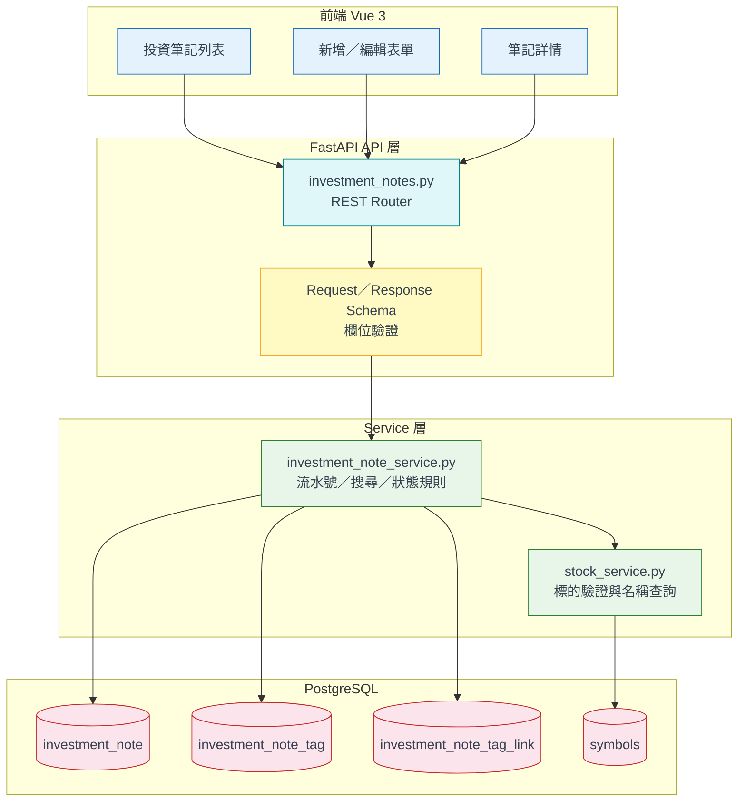
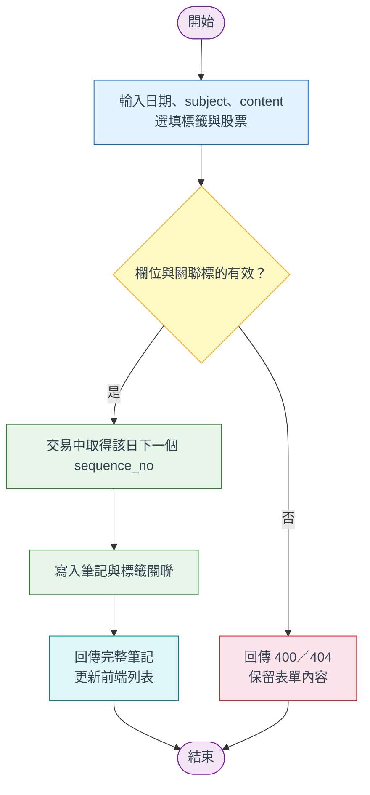
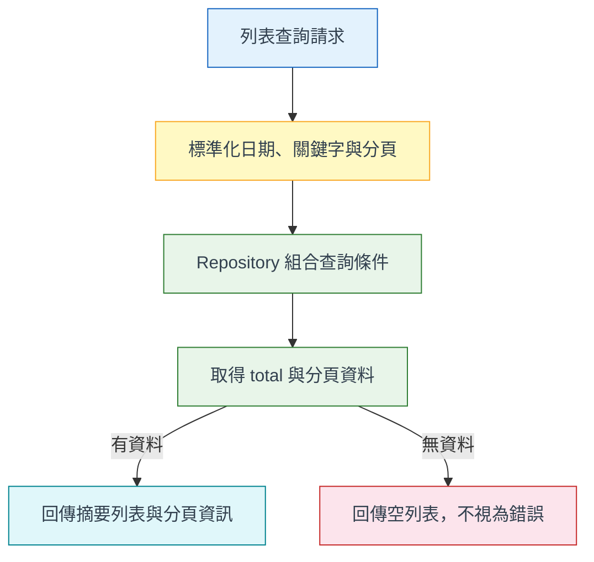
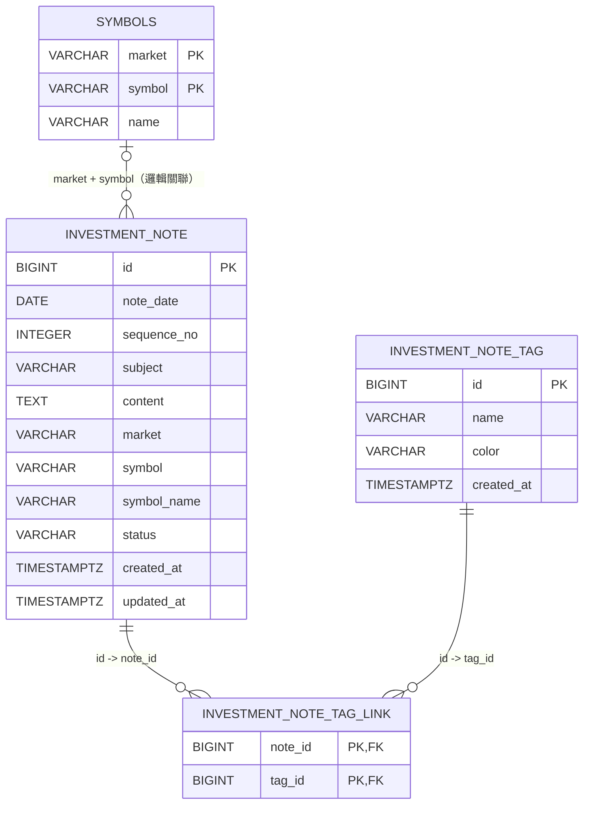

# 個人投資筆記功能設計規格書

**模組**：個人投資記帳－投資筆記（Investment Notes）  
**版本**：v1.0  
**日期**：2026-08-28  
**狀態**：規劃中，尚未開發  
**適用架構**：FastAPI + Vue 3 + PostgreSQL

---

## 1. 功能說明

投資筆記用來記錄投資決策、研究心得、市場事件與事後檢討，讓每筆資料可依日期回顧，並保留同一天的建立順序。核心資料分為 `subject`（主旨）與 `content`（內容）兩個區段；主旨供列表掃描與搜尋，內容供完整敘述。

本功能是個人投資記帳模組的獨立子模組，不取代交易紀錄、持股計算或觀察名單。第一版支援建立、查詢、編輯、刪除、日期篩選、關鍵字搜尋、標籤與可選股票關聯；未來可由交易紀錄或個股頁帶入關聯標的，但不自動改寫筆記內容。

### 1.1 使用情境

| 使用情境 | 預期結果 |
|---|---|
| 記下當日投資決策或市場觀察 | 取得當日流水號，筆記保存成功。 |
| 回顧一段期間的判斷 | 依日期、關鍵字、標籤或股票快速篩選。 |
| 修正原有內容 | 更新主旨、內容與關聯資料，保留建立時間。 |
| 清理錯誤筆記 | 二次確認後刪除，且不影響交易或持倉。 |

### 1.2 核心設計原則

| 原則 | 說明 |
|---|---|
| 日期流水號 | `note_date` 相同的筆記依 `sequence_no` 從 1 起算；刪除後不重排既有流水號。 |
| MVP 優先 | 第一版必要欄位為日期、主旨、內容；標籤、股票關聯、草稿與封存可逐階段加入。 |
| 原文保存 | 後端不擅自摘要或改寫內容；列表只回傳摘要，詳情才回傳全文。 |
| 資料解耦 | 不將筆記內容塞入交易紀錄或觀察名單的 `note` 欄位。 |
| 可回顧 | 預設以日期降冪、同日流水號降冪顯示，支援分頁與條件查詢。 |

### 1.3 功能優先級

| 優先級 | 功能 | 說明 |
|---|---|---|
| P0 | CRUD | 新增、詳情、編輯、刪除及同日流水號。 |
| P0 | 列表 | 日期區間、關鍵字、分頁與排序。 |
| P1 | 標籤 | 多標籤建立、去重與篩選。 |
| P1 | 股票關聯 | 可選 `market`（可只標記市場），`symbol` 選填但需搭配 `market`，不要求已有交易紀錄。 |
| P1 | 草稿／封存 | 草稿可暫存；封存預設不出現在一般列表。 |
| P2 | 匯出／統計 | Markdown、CSV 匯出與月份統計，另立需求。 |

---

## 2. 系統架構圖

### 2.1 整體架構



### 2.2 新增筆記流程



### 2.3 查詢流程



---

## 3. 資料表明細

### 3.1 `investment_note`

| 欄位名 | DB Column | 型別 | 長度 | 非空 | 說明 |
|---|---|---|---:|:---:|---|
| 主鍵 | `investment_note.id` | BIGSERIAL | - | 是 | PK。 |
| 筆記日期 | `investment_note.note_date` | DATE | - | 是 | 預設台北時區當日。 |
| 當日第幾筆 | `investment_note.sequence_no` | INTEGER | - | 是 | 從 1 起算；與日期組成唯一鍵。 |
| 主旨 | `investment_note.subject` | VARCHAR | 200 | 是 | 去除前後空白後不可為空。 |
| 內容 | `investment_note.content` | TEXT | - | 是 | MVP 以純文字完整保存。 |
| 市場 | `investment_note.market` | VARCHAR | 10 | 否 | `tw` 或 `us`；無股票關聯為 NULL。 |
| 股票代號 | `investment_note.symbol` | VARCHAR | 20 | 否 | 填寫時需搭配 `market`；`market` 可單獨存在（僅標記市場、不指定個股）。 |
| 股票名稱快照 | `investment_note.symbol_name` | VARCHAR | 100 | 否 | 保存建立／更新時的名稱。 |
| 狀態 | `investment_note.status` | VARCHAR | 10 | 是 | `published`、`draft`、`archived`。 |
| 建立時間 | `investment_note.created_at` | TIMESTAMPTZ | - | 是 | DB `NOW()`。 |
| 更新時間 | `investment_note.updated_at` | TIMESTAMPTZ | - | 是 | 每次編輯更新。 |

> 約束：`UNIQUE(note_date, sequence_no)`、`sequence_no > 0`；`symbol` 有值時 `market` 必須有值（`market` 可單獨存在，僅標記市場、不指定個股）；第一版不建立使用者 FK，因目前系統為單一使用者模式。

### 3.2 `investment_note_tag`

| 欄位名 | DB Column | 型別 | 長度 | 非空 | 說明 |
|---|---|---|---:|:---:|---|
| 主鍵 | `investment_note_tag.id` | BIGSERIAL | - | 是 | PK。 |
| 標籤名稱 | `investment_note_tag.name` | VARCHAR | 30 | 是 | 去空白；不分大小寫唯一。 |
| 顏色 | `investment_note_tag.color` | VARCHAR | 20 | 是 | 前端色彩 token，預設 `slate`。 |
| 建立時間 | `investment_note_tag.created_at` | TIMESTAMPTZ | - | 是 | 建立時間。 |

### 3.3 `investment_note_tag_link`

| 欄位名 | DB Column | 型別 | 長度 | 非空 | 說明 |
|---|---|---|---:|:---:|---|
| 筆記 ID | `investment_note_tag_link.note_id` | BIGINT | - | 是 | PK/FK → `investment_note.id`，CASCADE。 |
| 標籤 ID | `investment_note_tag_link.tag_id` | BIGINT | - | 是 | PK/FK → `investment_note_tag.id`，CASCADE。 |

### 3.4 索引

| 索引 | 欄位 | 用途 |
|---|---|---|
| `uq_investment_note_date_sequence` | `note_date, sequence_no` | 保證同日流水號唯一。 |
| `idx_investment_note_date` | `note_date DESC, sequence_no DESC` | 預設排序與日期查詢。 |
| `idx_investment_note_symbol` | `market, symbol, note_date DESC` | 股票關聯查詢。 |
| `idx_investment_note_status` | `status, note_date DESC` | 狀態篩選。 |
| `idx_investment_note_tag_link_tag` | `tag_id, note_id` | 標籤篩選。 |

---

## 4. ER Diagram



> `symbols` 為既有代號主檔；第一版以 Service 驗證標的，不建立硬性 FK，使退市或代號變更後仍可保存歷史筆記。

---

## 5. API 端點摘要

| 方法 | URL | 說明 | 回傳 |
|---|---|---|---|
| GET | `/api/v1/investment-notes` | 分頁列表；預設排除 archived。 | `200 { success, data: { items, total, page, page_size } }` |
| GET | `/api/v1/investment-notes/{id}` | 取得單筆完整內容。 | `200`；不存在 `404`。 |
| POST | `/api/v1/investment-notes` | 新增並配置同日下一個流水號。 | `201`：完整筆記。 |
| PATCH | `/api/v1/investment-notes/{id}` | 部分更新欄位與標籤。 | `200`：更新後筆記。 |
| DELETE | `/api/v1/investment-notes/{id}` | 刪除筆記與標籤關聯。 | `204`；不存在 `404`。 |
| GET | `/api/v1/investment-notes/tags` | 取得標籤與使用次數。 | `200`：標籤陣列。 |

### 5.1 列表參數

| 參數 | 型別 | 必填 | 說明 |
|---|---|:---:|---|
| `page` | integer | 否 | 預設 1，最小 1。 |
| `page_size` | integer | 否 | 預設 20，上限 100。 |
| `date_from`／`date_to` | date | 否 | 含邊界的日期區間。 |
| `q` | string | 否 | 搜尋 subject 與 content，最多 100 字。 |
| `tag` | string | 否 | 依標籤名稱篩選。 |
| `market` | string | 否 | `tw` 或 `us`。 |
| `symbol` | string | 否 | 股票代號。 |
| `status` | string | 否 | `published`、`draft` 或 `archived`；預設 `published`。 |

### 5.2 Request 與錯誤

新增必填 `subject`、`content`；`note_date` 預設今日；`symbol` 有值時必須搭配 `market`（`market` 可單獨提供）；`tag_names` 去重後最多 10 個；`status` 預設 `published`。更新採 partial update，日期變更時由 Service 重新配置新日期流水號。

| HTTP | `error.code` | 情境 |
|---:|---|---|
| 400 | `VALIDATION_ERROR` | 空白、長度、日期區間、狀態或 market/symbol 錯誤。 |
| 404 | `NOTE_NOT_FOUND` | 筆記不存在。 |
| 404 | `SYMBOL_NOT_FOUND` | 關聯標的不存在。 |
| 409 | `NOTE_SEQUENCE_CONFLICT` | 併發配置流水號衝突且重試失敗。 |

---

## 6. 程式清單

以下為規劃新增檔案，目前尚未開發。

| 分層 | 預計檔案 | 說明 |
|---|---|---|
| Entity | `backend/db/note_models.py` | 三個 ORM model；沿用既有 `Base`。 |
| Repository | `backend/repositories/investment_note_repository.py` | CRUD、分頁、流水號與標籤關聯。 |
| Service | `backend/services/investment_note_service.py` | 正規化、標的驗證、狀態規則與重試。 |
| Controller | `backend/api/v1/endpoints/investment_notes.py` | REST API 與 response envelope。 |
| DTO | `backend/api/v1/schemas/investment_note.py` | Create、Patch、List、Detail、Tag schema。 |
| Migration | `backend/db/migration/V13__Create_investment_notes.sql` | 三張表、約束、索引與註解；版本依實際最新 migration 調整。 |
| Frontend | `frontend/src/views/portfolio/InvestmentNotesView.vue` | 列表、篩選、分頁與刪除確認。 |
| Frontend | `frontend/src/components/portfolio/InvestmentNoteEditor.vue` | 新增／編輯表單。 |
| Service | `frontend/src/service/investmentNoteApi.js` | 沿用既有 `apiClient`。 |

### 6.1 既有程式串接

| 既有檔案 | 串接方式 |
|---|---|
| `backend/db/models.py` | 沿用既有 `Base`，不得另建 declarative base。 |
| `backend/db/session.py` | API 使用原生 async session。 |
| `backend/services/stock_service.py` | 驗證 `market + symbol` 並取得名稱快照。 |
| `frontend/src/router/index.js` | 新增 `/portfolio/notes` 路由。 |

---

## 7. 關鍵 SQL

### 7.1 建表（規劃）

```sql
CREATE TABLE investment_note (
	id BIGSERIAL PRIMARY KEY,
	note_date DATE NOT NULL DEFAULT CURRENT_DATE,
	sequence_no INTEGER NOT NULL CHECK (sequence_no > 0),
	subject VARCHAR(200) NOT NULL CHECK (btrim(subject) <> ''),
	content TEXT NOT NULL CHECK (btrim(content) <> ''),
	market VARCHAR(10),
	symbol VARCHAR(20),
	symbol_name VARCHAR(100),
	status VARCHAR(10) NOT NULL DEFAULT 'published'
		CHECK (status IN ('published', 'draft', 'archived')),
	created_at TIMESTAMPTZ NOT NULL DEFAULT NOW(),
	updated_at TIMESTAMPTZ NOT NULL DEFAULT NOW(),
	CONSTRAINT uq_investment_note_date_sequence UNIQUE (note_date, sequence_no),
	CONSTRAINT ck_investment_note_symbol_pair CHECK (
		symbol IS NULL OR market IS NOT NULL
	),
	CONSTRAINT ck_investment_note_market CHECK (market IS NULL OR market IN ('tw', 'us'))
);
```

> `ck_investment_note_symbol_pair` 原始版本（V16）要求 `market`／`symbol` 同時為 NULL 或同時有值；V17 放寬為「`symbol` 有值時才要求 `market` 有值」，讓使用者可以只標記市場、不指定個股（見 `db/migration/V17__Relax_investment_note_symbol_pair_check.sql`）。

### 7.2 流水號與列表查詢

```sql
SELECT COALESCE(MAX(sequence_no), 0) + 1 AS next_sequence_no
FROM investment_note
WHERE note_date = :note_date;

SELECT id, note_date, sequence_no, subject,
	   LEFT(content, 240) AS content_excerpt,
	   market, symbol, symbol_name, status, created_at, updated_at
FROM investment_note
WHERE status = COALESCE(:status, 'published')
  AND (:date_from IS NULL OR note_date >= :date_from)
  AND (:date_to IS NULL OR note_date <= :date_to)
  AND (:q IS NULL OR subject ILIKE '%' || :q || '%'
				 OR content ILIKE '%' || :q || '%')
ORDER BY note_date DESC, sequence_no DESC
LIMIT :page_size OFFSET (:page - 1) * :page_size;
```

> 流水號查詢必須在 transaction 內執行，並以 unique constraint 做最終併發保護；衝突時 Service 重查並重試一次。資料量增大後再評估 `pg_trgm` 或全文索引。

---

## 8. 多環境配置

本功能不新增外部服務或密鑰，沿用既有 PostgreSQL 與 `apiClient`；各環境只需確認 migration 已執行。

| 環境 | Profile | 關鍵差異 |
|---|---|---|
| DEV | local | 可顯示 draft；本機或 Docker PostgreSQL。 |
| TEST | test | 使用獨立資料庫，測試資料不可污染 DEV。 |
| PROD | production | migration 完成且備份成功後才開啟前端路由。 |

| 變數 | DEV | TEST | PROD | 說明 |
|---|---|---|---|---|
| `DATABASE_URL` | 既有 local URL | 獨立 test URL | 既有 secret | 沿用既有資料庫設定。 |
| `VITE_API_BASE` | `http://localhost:8000/api/v1` | 測試 API URL | 正式 API URL | 沿用既有前端設定。 |
| `INVESTMENT_NOTES_PAGE_SIZE` | `20` | `20` | `20` | 可選；API 上限 100。 |

---

## 9. 鐵則（開發注意事項）

| 規則 | 說明 |
|---|---|
| R1 流水號只增不重排 | 刪除中間筆記後不得更新其他筆記的流水號。 |
| R2 併發不可重號 | 必須有 DB unique constraint；不能只依賴先查後寫。 |
| R3 不污染既有欄位 | 不得寫入交易、觀察名單或行情 JSON 的 `note`。 |
| R4 API 使用 async DB | 不可在 HTTP request path 呼叫 `run_async()`／`*_sync()`。 |
| R5 後端強制驗證 | 前端驗證只改善體驗；長度、狀態、日期與配對由後端把關。 |
| R6 純文字優先 | MVP 不使用 `v-html`；支援 Markdown 前須先做 XSS sanitize。 |
| R7 列表不回全文 | 列表只回傳 `content_excerpt`，詳情才回完整內容。 |
| R8 時區固定 | 預設日期採 `Asia/Taipei`；時間欄位使用 timezone-aware timestamp。 |
| R9 刪除需確認 | 前端顯示 subject、日期與流水號後才允許刪除。 |
| R10 遵循既有架構 | 沿用 `Base`、Repository 單一 SQL 入口與 Flyway migration。 |

---

## 10. 備註

### 10.1 已知限制

1. 目前為單一使用者模式，未包含 `owner_id`；導入多使用者前必須補資料隔離與授權。
2. 股票關聯採邏輯驗證，不建立 FK；退市標的仍可保留歷史筆記，名稱以快照為準。
3. 第一版不支援圖片、附件、Markdown、版本歷程或復原。
4. 日期變更建議視為移動到新日期並重新配置新日期流水號，API 回傳變更後結果。

### 10.2 開發與驗收順序

| 階段 | 內容 | 驗收重點 |
|---|---|---|
| Phase 1 | Migration、ORM、Repository、CRUD API | 同日第一筆為 1，約束與錯誤回應正確。 |
| Phase 2 | Vue 列表、表單、詳情、路由 | 可完成新增、編輯、刪除、排序與分頁。 |
| Phase 3 | 搜尋、標籤、股票關聯、草稿 | 篩選與空結果行為正確。 |
| Phase 4 | API、併發、migration、前端 lint/build 驗證 | 通過測試並同步更新本文件。 |

### 10.3 參考文件

- [個人投資記帳與績效追蹤功能規劃](個人投資記帳功能_design.md)
- [PostgreSQL 資料庫設計規格書](../#Architecture/資料庫設計/資料庫設計規格書.md)
- [追蹤與觀察名單整合規劃書](../15.追蹤個股清單優化/追蹤與觀察名單整合_規劃書.md)

### 10.4 品質自檢

| 檢查項目 | 結果 |
|---|---|
| 10 大章節完整 | 通過 |
| Mermaid 至少 3 張 | 通過：架構、Happy Path、查詢流程、ERD |
| Mermaid 使用 `flowchart`、`<br/>` 與淡色系 | 通過 |
| 表格包含 PK、型別、非空、說明 | 通過 |
| ERD 涵蓋 FK 關聯 | 通過 |
| API 含方法、URL、參數與回傳 | 通過 |
| 程式清單含 Entity／Repository／Service／Controller／DTO | 通過，規劃檔案標示尚未開發 |
| 交叉引用與欄位 backtick | 通過 |