# 整合訊息通知平台 系統開發規格書

**模組**：整合訊息通知平台（Unified Notification Platform）
**版本**：v1.1
**日期**：2026-08-15
**狀態**：待開發（Phase 1 尚未啟動；DEV-01／DEV-04／DEV-05 已確認，見 §15.3）
**對應需求**：[整合訊息通知平台_需求規格書 v1.2](整合訊息通知平台_需求規格書.md)
**對應原型**：[prototype/index.html](prototype/index.html)（本文件第 9 章逐頁對照，第 15 章列出原型須修正之處）

**版本紀錄**

| 版本 | 日期 | 變更摘要 |
|---|---|---|
| v1.0 | 2026-08-15 | 初版：技術選型、程式架構、資料庫實體設計、API 契約、安全設計、前端對照、階段 WBS |
| v1.1 | 2026-08-15 | 確認 DEV-01（自助頁未授權項目採灰化＋鎖頭）、DEV-04（首版不宣稱可偵測排程/服務停止）、DEV-05（自助連結採反向代理同源部署），見 §15.3 |

> **文件性質說明**
> 需求規格書回答「**要做什麼**」，本文件回答「**怎麼做**」。
> 需求規格書中的「模組」是邏輯功能模組（M1～M13）；本文件中的「模組」一律指**實際程式套件與檔案**，
> 兩者的對應關係見 §3.3。凡本文件與需求規格書衝突之處，**以需求規格書為準**，並須於 §15 記錄落差。
> 所有 Mermaid 圖採統一淡彩色系（色票定義見 §3.0）。

---

## 目錄

| 章節 | 內容 |
|---|---|
| 0 | 文件導讀與需求對照 |
| 1 | 範圍與設計前提 |
| 2 | 技術選型與決策紀錄（ADR） |
| 3 | 系統架構 |
| 4 | 核心機制設計 |
| 5 | 資料庫設計 |
| 6 | API 設計 |
| 7 | 安全設計 |
| 8 | 排程與執行模型 |
| 9 | 前端設計（原型對照） |
| 10 | 設定項目 |
| 11 | 部署與維運 |
| 12 | 開發階段與工作分解 |
| 13 | 驗收條件實作對照 |
| 14 | 需求追溯矩陣 |
| 15 | 原型落差與修正清單 |
| 16 | 附錄 |

---

## 0. 文件導讀與需求對照

| 需求規格書章節 | 本文件對應章節 | 說明 |
|---|---|---|
| §5 系統定位與整體架構 | §3.1、§3.2 | 三層解耦落實為三個 Python 套件邊界 |
| §6 模組分析（M1～M13） | §3.3、§4 | 邏輯模組 → 程式檔案，逐一給出演算法 |
| §7 功能需求（FR-*） | §14 追溯矩陣 | 每條 FR 對應到檔案與 API |
| §8 流程圖 | §4、§8 | 需求流程 → 實作流程（含交易邊界與失敗處理） |
| §9 邏輯資料需求 | §5 | 邏輯實體 → PostgreSQL 實體表與索引 |
| §10 擴充性設計原則 | §3.2、§4.3 | R1～R8 對應到程式碼層級的強制約束 |
| §11 非功能需求（NFR-*） | §7、§8、§11 | 每條 NFR 對應實作手段與量測方式 |
| §12 管理介面規劃 | §9 | 對照 `prototype/` 六個頁面 |
| §13 開發階段規劃 | §12 | Phase 1～4 展開為檔案級 WBS |
| §14 驗收條件（AC-*） | §13 | 每條 AC 對應驗證腳本或操作步驟 |
| §15 風險與待確認 | §2、§10 | 待確認事項以「可設定預設值」方式先行落地 |

---

## 1. 範圍與設計前提

### 1.1 交付範圍

本文件涵蓋需求規格書 §3.1「Release 1 完整交付範圍」的全部內容：Email 與 Telegram 兩個管道、
四類事件來源、收件人／端點／群組管理、訂閱規則、四道通知政策、管理介面、收件人自助訂閱、
重試與熔斷等可靠性機制。

### 1.2 現有系統前提（本次開發的既有基礎）

通知平台是**掛載在既有 MyStock 後端之上的新增子系統**，不改寫既有資料流。以下為必須理解的既有事實：

| 既有元件 | 位置 | 與通知平台的關係 |
|---|---|---|
| 策略掃描器 | [backend/strategies/scanner.py](../../backend/strategies/scanner.py) | `scan_market()` 回傳 `alerts_generated`，`alert_repository.append_alerts()` 回傳補好 `id`/`timestamp` 的完整警示清單 —— **這份清單就是 `ALERT_SIGNAL` 事件的來源** |
| 警示儲存 | [backend/repositories/alert_repository.py](../../backend/repositories/alert_repository.py) | 平面 JSON（`data/_alerts/alerts.json`）。通知平台**不改動**它，只在掃描完成後另行發事件 |
| 排程 | [backend/services/scheduler.py](../../backend/services/scheduler.py) | `AsyncIOScheduler`，台股 14:30／美股 06:00，`_scan_after_fetch()` 已用 try/except 包住掃描。通知事件發佈掛在同一個容錯慣例下 |
| 爬蟲 | [backend/services/fetcher.py](../../backend/services/fetcher.py)、[us_fetcher.py](../../backend/services/us_fetcher.py) | `fetch_status` 單例的快照即 `FETCH_COMPLETED`／`FETCH_FAILED` 的事件內容來源 |
| SQL 存取 | [backend/repositories/stock_repository.py](../../backend/repositories/stock_repository.py) | 唯一 SQL 入口的慣例；通知平台比照新增 `notify_repository.py` |
| 連線管理 | [backend/db/session.py](../../backend/db/session.py) | `create_async_engine` + `dispose_engine()`（asyncpg 連線綁定 event loop） |
| 資料庫遷移 | [backend/db/migration/](../../backend/db/migration/) | Flyway，目前到 `V2`；本模組新增 `V3` |
| 設定 | [backend/config.py](../../backend/config.py) | `load_dotenv(ENV_PATH, override=True)` 於每次讀取時重載，`.env` 改動免重啟 |
| 前端 | [frontend/src/router/index.js](../../frontend/src/router/index.js)、[layout/AppMenu.vue](../../frontend/src/layout/AppMenu.vue) | 單一 `AppLayout` 殼層 + PrimeVue Aura；`service/*.js` 共用 `apiClient` |

### 1.3 不在本文件範圍

| 項目 | 原因 |
|---|---|
| 策略邏輯、訊號產生方式 | 需求規格書 §3.3 已排除 |
| 既有 API 與前端頁面的改寫 | 通知平台只新增路由與頁面，既有頁面僅加一個側邊選單項目 |
| 既有 `alerts.json` 遷移至 PostgreSQL | 與本模組無耦合；通知平台自帶資料表 |
| 全站身分驗證 | 本次僅對 `/api/v1/notify/**` 管理端點導入擁有者驗證（FR-AU），全站 SSO 另案 |

---

## 2. 技術選型與決策紀錄（ADR）

| 編號 | 決策 | 選項與理由 | 影響的需求 |
|---|---|---|---|
| **ADR-01** | 通知平台的資料一律存 **PostgreSQL**，不使用 JSON 檔 | 既有 `alert_repository` 用 JSON 是因為警示是「一天寫一次的附加紀錄」；通知平台需要**待發佇列的原子取件、跨重啟續行、唯一鍵去重、每日計數**，平面 JSON 無法在多執行緒／重啟情境下保證這些。改用 Postgres 後 `UNIQUE INDEX` 直接承擔去重、`FOR UPDATE SKIP LOCKED` 直接承擔取件 | NFR-02、NFR-06、FR-PL-01 |
| **ADR-02** | 通知平台**不受 `DATA_SOURCE` 開關影響**；改由獨立的 `NOTIFY_ENABLED` 控制 | `DATA_SOURCE` 決定「行情資料從哪讀」，與通知無關。若 `NOTIFY_ENABLED=true` 但資料庫不可用，平台**自我停用並記警告**，絕不拋例外 | 鐵則 R7、NFR-01 |
| **ADR-03** | 佇列採 **DB-backed Outbox + 進程內 async worker**，不引入 Redis／Celery／RabbitMQ | 本系統為單人自用、日均訊息量以百為單位（NFR-06 上限 10,000）。引入 broker 會多一個容器、一份故障面與一份備份負擔。Outbox 模式在單一 writer 下足夠，且天然滿足「重啟不遺失」 | NFR-02、NFR-04 |
| **ADR-04** | Worker 與 FastAPI **同進程**，以 `asyncio.Task` 常駐；排程沿用既有 `AsyncIOScheduler` | 與既有 `main.py` lifespan／scheduler 慣例一致，不新增容器。取件用 `SKIP LOCKED`，未來要拆成獨立進程時**不需改邏輯**（見 §8.4 水平擴充） | NFR-04、可維運性 |
| **ADR-05** | Email 用 **`aiosmtplib`**（非同步 SMTP）；Telegram 用 **`httpx`** 直呼 Bot API，不引入 `python-telegram-bot` | dispatcher 是 async 迴圈，同步 `smtplib` 會阻塞。Telegram 只用到 `sendMessage`／`getUpdates`／`setWebhook` 三支 API，直呼比引入完整框架輕 | FR-DP-01 |
| **ADR-06** | Telegram 入站（綁定碼）預設走 **long polling (`getUpdates`)**，`TELEGRAM_WEBHOOK_BASE` 有設定時才切 webhook | 個人自用環境多半沒有對外 HTTPS 端點；long polling 免公開網址即可運作。兩種模式共用同一組訊息處理函式 | FR-BD-03、UC-04 |
| **ADR-07** | 模板存在**資料庫**（`notify_template`），啟動時自檔案種子匯入；渲染用 **Jinja2 `SandboxedEnvironment`** | R4 要求「調整文案不需改程式、不需部署」→ 必須可從管理介面編輯 → 必須存 DB。管理員可編輯的模板等同可執行程式碼，故**強制沙箱環境**，並停用 ``／檔案系統存取 | FR-MC-01、R4、NFR-08 |
| **ADR-08** | 管道認證資訊以 **Fernet 對稱加密**存 DB（`cryptography` 套件），金鑰放 `NOTIFY_SECRET_KEY` | NFR-08 要求「不得明文顯示、不得寫入紀錄或匯出」。存 `.env` 無法支援介面編輯；存 DB 明文則備份即外洩。加密存 DB 是唯一同時滿足兩者的作法 | NFR-08、FR-CH-06 |
| **ADR-09** | 自助連結採 **256-bit 隨機 token → 只存 SHA-256 摘要**；首次存取以 **Cookie 交換**後 **303 轉址**到無 token 的網址 | FR-SS-14／NFR-23 要求 token 不得明文保存、不得出現在存取紀錄與 Referer。路徑中的 token 仍會進入 access log，故一到站就換成 `HttpOnly; Secure; SameSite=Lax` Cookie 並轉址，之後所有請求都不帶 token | FR-SS-14、NFR-19、NFR-23 |
| **ADR-10** | 管理端授權採**簽章 Session Cookie**（`itsdangerous`）＋ 可選的 **Bearer Token**（供腳本用），由 FastAPI dependency `require_owner` 於**伺服器端**強制 | NFR-22 明文禁止「只靠前端隱藏」。dependency 掛在 router 層級，新增端點時**預設就是受保護的**，避免漏掛 | FR-AU-01/02、NFR-22 |
| **ADR-11** | 去重以 **`UNIQUE (idempotency_key, endpoint_id)` + `INSERT … ON CONFLICT DO NOTHING`** 實作，而非先查後寫 | 先查後寫在重跑掃描與手動掃描並行時有 race window。以資料庫唯一鍵作為單一事實來源，插入回傳 0 列即代表重複 | FR-PL-01、AC-06 |
| **ADR-12** | 通知平台的時間欄位一律用 **`TIMESTAMPTZ`**，與既有表（`TIMESTAMP`）**刻意不同** | FR-PL-09 要求每日上限邊界、靜音時段、摘要時間皆依**端點時區**計算。無時區的 `TIMESTAMP` 無法正確處理跨時區端點。此為有意識的偏離，於 §5.2 標注 | FR-PL-09 |
| **ADR-13** | 事件發佈的接縫放在 **`services/scheduler.py` 與 API 端點**，不放進 `scanner.py` | 鐵則 R1「事件產生端不得指定管道或收件人」。掃描器連「有沒有通知平台」都不需要知道；由呼叫端在掃描結束後把回傳的警示清單交給 `notify.intake` | 鐵則 R1、R7 |
| **ADR-14** | 新增管道採 **`@channel` 裝飾器自我註冊**，與既有 `strategies/registry.py` 的 `@condition` 同慣例 | 專案已有此慣例；沿用可讓「新增管道 = 新增一個檔案 + 在 `channels/__init__.py` import」 | 鐵則 R2、AC-19 |

---

## 3. 系統架構

### 3.0 圖例色票（全文統一）

| 語意 | 填色 | 邊框 | 用於 |
|---|---|---|---|
| 外部系統／事件來源 | `#FFF6DC` | `#E8D48B` | TWSE、SMTP、Telegram API、既有爬蟲 |
| 平台核心處理 | `#EAF2FB` | `#9EC2E6` | M1～M5 的處理模組 |
| 服務／成功結果 | `#EAF7EE` | `#B7E0C4` | 設定類模組、成功狀態 |
| 資料儲存 | `#FDEBEF` | `#F3B6C4` | 資料表、佇列、失敗狀態 |
| 管道／介面 | `#E4F5F7` | `#A5D8DF` | 管道轉接、UI、延後狀態 |
| 使用者／起訖點 | `#F4EAF8` | `#CDA9DC` | 角色、流程起訖 |
| 略過／未來擴充 | `#F0F1F3` | `#C9CDD3` | 略過分支、Phase 5 項目 |

文字色一律 `#33414F`，連線 `#9AA5B1`。

### 3.1 全景架構圖

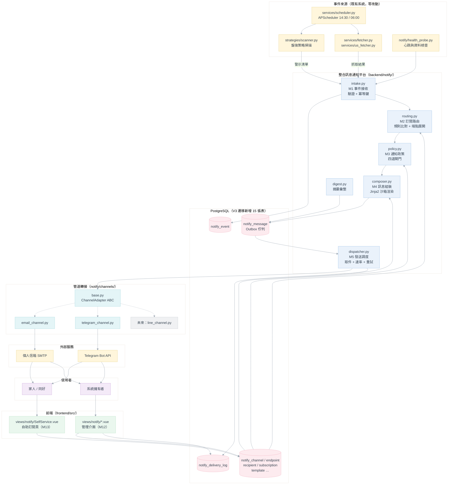

### 3.2 三層解耦的程式邊界

需求規格書 §5.2 的「三個不知道」在程式碼中以**匯入方向**強制。以下為可被 code review 檢查的硬規則：

| 需求鐵則 | 程式碼層級的落實 | 違反時的徵兆 |
|---|---|---|
| R1 事件產生端不得指定管道或收件人 | `strategies/`、`services/fetcher.py` **不得 import `notify` 之下的任何模組**；事件發佈由 `services/scheduler.py` 與 API 端點呼叫 `notify.intake.publish()` | `grep -r "import notify" backend/strategies backend/services/fetcher.py` 應為空 |
| R2 新增管道不得修改路由與政策 | `routing.py`／`policy.py` **不得 import `notify.channels`**，只認 `endpoint.channel_code` 字串 | `channels` 出現在 routing/policy 的 import 清單 |
| R3 新增收件對象是純資料操作 | 收件人／端點／群組**只存在資料表**，`.env` 內不得出現任何收件位址 | `.env` 出現 email 或 chat id |
| R4 模板與流程分離 | `composer.py` 只做「取模板 → 渲染」；任何 `if event_type == …` 的文案分支都是違規 | composer 出現事件類型字面值 |
| R5 每個事件類型都要有可回退預設模板 | `composer.py` 找不到 `(event_type, channel)` 時退回 `(__default__, channel)`；`__default__` 由 V3 遷移種下，**不可刪除**（DB 層以 `is_default` 旗標保護） | 模板缺漏導致訊息漏發 |
| R6 任一管道故障不得影響其他管道 | 熔斷狀態存在 `notify_channel` 的**列層級**；dispatcher 依 `channel_code` 分組取件，某管道熔斷只過濾掉該管道的訊息 | 一個管道失敗導致整個 worker 停擺 |
| R7 通知平台故障不得影響爬蟲與掃描 | 所有從既有流程呼入通知平台的地方一律 `try/except Exception: logger.warning(...)`，比照 [db/dual_write.py](../../backend/db/dual_write.py) 慣例 | 排程日誌出現通知相關的 traceback 且掃描中斷 |
| R8 所有數量限制皆可設定 | 重試次數、退避秒數、每日上限、冷卻時間、寄送預算全部走 `notify/config.py` 讀 `.env`，無硬編碼常數 | 程式碼出現魔術數字 |

```mermaid
%%{init: {
  "theme": "base",
  "themeVariables": {
    "background": "#ffffff",
    "primaryColor": "#EAF2FB",
    "primaryBorderColor": "#9EC2E6",
    "primaryTextColor": "#33414F",
    "lineColor": "#9AA5B1",
    "textColor": "#33414F",
    "fontFamily": "Segoe UI, sans-serif"
  }
}}%%
flowchart LR
    subgraph L1 ["第一層：事件產生端"]
        A1["strategies/scanner.py"]
        A2["services/fetcher.py"]
        A3["notify/health_probe.py"]
    end

    subgraph SEAM ["接縫（唯一允許的耦合點）"]
        S1["services/scheduler.py<br/>_publish_after_scan()"]
        S2["api/v1/endpoints/*.py<br/>手動觸發後發佈"]
    end

    subgraph L2 ["第二層：路由與政策"]
        B1["notify/intake.py"]
        B2["notify/routing.py"]
        B3["notify/policy.py"]
        B4["notify/composer.py"]
    end

    subgraph L3 ["第三層：管道轉接"]
        C1["notify/dispatcher.py"]
        C2["notify/channels/base.py"]
        C3["email / telegram / …"]
    end

    A1 --> S1
    A2 --> S1
    A3 --> S2
    S1 --> B1
    S2 --> B1
    B1 --> B2 --> B3 --> B4
    B4 -- "notify_message（Outbox）" --> C1
    C1 --> C2 --> C3

    N1["新增事件類型<br/>只動 L1 + events.py"]
    N2["新增收件人 / 改訂閱<br/>只改資料，零程式異動"]
    N3["新增管道<br/>只動 L3 + 補模板"]

    L1 -.-> N1
    L2 -.-> N2
    L3 -.-> N3

    style A1 fill:#FFF6DC,stroke:#E8D48B,color:#33414F
    style A2 fill:#FFF6DC,stroke:#E8D48B,color:#33414F
    style A3 fill:#FFF6DC,stroke:#E8D48B,color:#33414F
    style S1 fill:#F4EAF8,stroke:#CDA9DC,color:#33414F
    style S2 fill:#F4EAF8,stroke:#CDA9DC,color:#33414F
    style B1 fill:#EAF2FB,stroke:#9EC2E6,color:#33414F
    style B2 fill:#EAF2FB,stroke:#9EC2E6,color:#33414F
    style B3 fill:#EAF2FB,stroke:#9EC2E6,color:#33414F
    style B4 fill:#EAF2FB,stroke:#9EC2E6,color:#33414F
    style C1 fill:#E4F5F7,stroke:#A5D8DF,color:#33414F
    style C2 fill:#E4F5F7,stroke:#A5D8DF,color:#33414F
    style C3 fill:#E4F5F7,stroke:#A5D8DF,color:#33414F
    style N1 fill:#EAF7EE,stroke:#B7E0C4,color:#33414F
    style N2 fill:#EAF7EE,stroke:#B7E0C4,color:#33414F
    style N3 fill:#EAF7EE,stroke:#B7E0C4,color:#33414F
```

### 3.3 邏輯模組（M1～M13）→ 程式模組對照

| 邏輯模組 | 程式檔案 | 對外函式／類別 | 備註 |
|---|---|---|---|
| **M1** 事件接收 | `notify/intake.py`、`notify/events.py` | `publish(event: Event) -> str`、`publish_alert_signals(alerts) -> int` | `events.py` 定義事件契約、嚴重度、冪等鍵計算與 routing facts 擷取 |
| **M2** 訂閱路由 | `notify/routing.py` | `resolve_endpoints(event) -> list[EndpointRef]` | 條件比對器以 `MATCHER_REGISTRY` 註冊，新增維度是純新增 |
| **M3** 通知政策 | `notify/policy.py` | `apply_gates(event, endpoints) -> list[Decision]` | 回傳每個端點的決策（send／defer／digest／skip 與理由） |
| **M4** 訊息組裝 | `notify/composer.py` | `compose(event, endpoint) -> ComposedMessage` | Jinja2 `SandboxedEnvironment`；能力降級在此處理 |
| **M5** 發送調度 | `notify/dispatcher.py` | `DispatcherWorker.run()`、`claim_batch()`、`send_one()` | 常駐 asyncio task；速率控制、退避重試、熔斷判定 |
| **M6** 管道轉接 | `notify/channels/base.py` + `email_channel.py` + `telegram_channel.py` | `ChannelAdapter`（ABC）、`CHANNEL_REGISTRY`、`@channel(code=...)` | **新增管道時唯一需要新增檔案的位置** |
| **M7** 投遞紀錄 | `repositories/notify_repository.py`、`api/v1/endpoints/notify_admin.py` | `query_messages()`、`log_attempt()`、`resend()`、`stats()` | 唯一 SQL 入口 |
| **M8** 收件人管理 | `notify/recipients.py`、`repositories/notify_repository.py` | `create_recipient()`、`create_endpoint()`、`set_preferences()` | 個人／共用端點的規則在此強制 |
| **M9** 綁定驗證 | `notify/binding.py`、`notify/telegram_bot.py` | `issue_email_verification()`、`issue_binding_code()`、`consume_token()` | 一次性 token 產生／雜湊／時效 |
| **M10** 模板管理 | `notify/templating.py`、`notify/templates/*.j2` | `render()`、`preview()`、`seed_templates()` | 檔案僅為種子，權威來源在 DB |
| **M11** 管道設定 | `notify/channel_config.py` | `get_channel_state()`、`test_connection()`、`open_circuit()` | 憑證加解密、熔斷狀態機 |
| **M12** 管理介面 | `frontend/src/views/notify/`（5 頁） | — | 見 §9 |
| **M13** 自助訂閱 | `notify/selfservice.py` + `api/v1/endpoints/notify_self.py` + `frontend/src/views/notify/SelfService.vue` | `authenticate_token()`、`narrow_preferences()`、`pause()`、`unsubscribe()` | 「只能收窄」的檢查在後端強制，不倚賴前端 |

### 3.4 新增檔案結構

```
backend/
├── notify/                              ← 新增套件
│   ├── __init__.py                      # 匯入 channels 觸發註冊（比照 strategies/__init__.py）
│   ├── config.py                        # NOTIFY_* 設定讀取（比照 config.py 的 load_dotenv override 慣例）
│   ├── events.py                        # Event / EventType / Severity / 冪等鍵 / routing facts
│   ├── intake.py                        # M1
│   ├── routing.py                       # M2（含 MATCHER_REGISTRY）
│   ├── policy.py                        # M3（四道閘門 + 偏好收窄）
│   ├── composer.py                      # M4
│   ├── templating.py                    # M10 Jinja2 沙箱與種子
│   ├── dispatcher.py                    # M5 常駐 worker
│   ├── digest.py                        # 摘要彙整
│   ├── recipients.py                    # M8
│   ├── binding.py                       # M9
│   ├── channel_config.py                # M11（含 Fernet 加解密）
│   ├── selfservice.py                   # M13
│   ├── telegram_bot.py                  # Telegram 入站（getUpdates / webhook 共用處理）
│   ├── health_probe.py                  # SYSTEM_HEALTH 事件產生器
│   ├── security.py                      # token 產生/雜湊、require_owner、遮蔽工具
│   ├── channels/
│   │   ├── __init__.py                  # CHANNEL_REGISTRY + import 各管道
│   │   ├── base.py                      # ChannelAdapter ABC + Capability + SendResult
│   │   ├── email_channel.py
│   │   └── telegram_channel.py
│   └── templates/                       # 種子模板（.j2），權威副本在 DB
│       ├── alert_signal.email.j2
│       ├── alert_signal.telegram.j2
│       ├── alert_digest.email.j2
│       ├── alert_digest.telegram.j2
│       ├── fetch_completed.email.j2
│       ├── ...
│       └── __default__.txt.j2           # R5 的最後防線
├── db/
│   ├── notify_models.py                 ← 新增 SQLAlchemy 模型
│   └── migration/
│       └── V3__Create_notification_platform.sql   ← 新增
├── repositories/
│   └── notify_repository.py             ← 新增（唯一 SQL 入口）
├── api/v1/endpoints/
│   ├── notify_admin.py                  ← 新增（require_owner）
│   ├── notify_self.py                   ← 新增（Cookie 授權）
│   └── notify_public.py                 ← 新增（token 交換、Email 驗證、Telegram webhook）
└── scripts/
    ├── notify_seed_demo.py              ← 新增：建立示範收件人與規則
    └── notify_smoke_test.py             ← 新增：AC 驗收自動化腳本

frontend/src/
├── views/notify/
│   ├── ChannelSettings.vue              # ① 管道設定
│   ├── RecipientManagement.vue          # ② 收件人管理
│   ├── SubscriptionRules.vue            # ③ 訂閱規則
│   ├── MessageTemplates.vue             # ④ 訊息模板（原型缺此頁，見 §15）
│   ├── DeliveryLogs.vue                 # ⑤ 發送紀錄
│   └── SelfService.vue                  # ⑥ 自助訂閱（獨立於 AppLayout）
├── components/notify/                   # RuleCard / EndpointRow / StatusTag / TemplateEditor …
└── service/notifyApi.js                 # 共用 apiClient 的薄封裝
```

### 3.5 套件相依圖（匯入方向即設計約束）

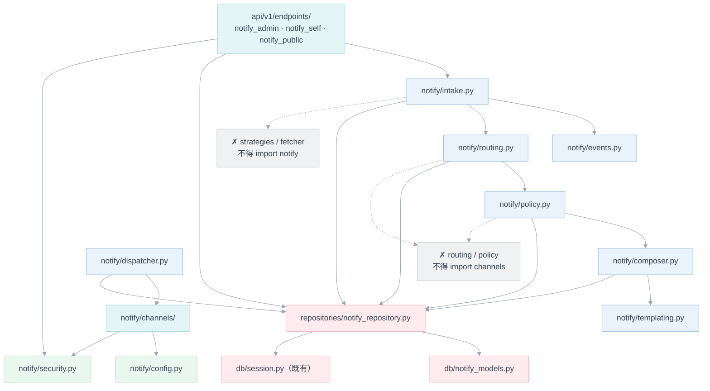

---

## 4. 核心機制設計

### 4.1 事件契約（`notify/events.py`）

```python
@dataclass(frozen=True)
class Event:
    event_type: str          # ALERT_SIGNAL | ALERT_DIGEST | FETCH_COMPLETED | FETCH_FAILED | SYSTEM_HEALTH
    severity: str            # info | warning | critical
    source: str              # scanner | fetcher | health_probe | manual
    occurred_at: datetime    # tz-aware，事件實際發生時間（非接收時間）
    payload: dict            # 事件類型專屬內容，見 §16.2
    source_event_key: str | None = None   # 來源已有的穩定識別鍵
```

**事件類型定義表**（`EVENT_TYPES`，程式與 DB `notify_event_type` 種子資料一致）：

| 代碼 | 預設嚴重度 | 優先度 | 來源 | 冪等鍵組成 |
|---|---|---|---|---|
| `ALERT_SIGNAL` | info（`signal_type=WARNING` 時為 warning） | 10 | scanner | `alert:{market}:{symbol}:{strategy_id}:{direction}:{trade_date}` |
| `ALERT_DIGEST` | info | 10 | 平台內部（`digest.py`） | `digest:{endpoint_code}:{digest_date}:{seq}` |
| `FETCH_COMPLETED` | info | 10 | fetcher | `fetch_ok:{market}:{trade_date}:{trigger_type}` |
| `FETCH_FAILED` | critical | 0 | fetcher | `fetch_fail:{market}:{trade_date}:{failure_digest}` |
| `SYSTEM_HEALTH` | critical | 0 | health_probe / dispatcher | `health:{probe_key}:{cooldown_bucket}` |

> **`ALERT_DIGEST` 的唯一產生路徑**：需求規格書 §M1 明定摘要只能由通知政策模組於摘要時間內部彙整產生。
> 因此 `digest.py` 是唯一允許發出 `ALERT_DIGEST` 的模組，`intake.publish()` 對外部來源的
> `ALERT_DIGEST` 一律拒收並記錄 `invalid`。

### 4.2 冪等與識別（M1）

```python
def idempotency_key(event: Event) -> str:
    if event.source_event_key:
        return event.source_event_key          # 來源鍵優先，平台不得以隨機值取代
    return KEY_BUILDERS[event.event_type](event.payload)   # 依事件類型的業務欄位組合
```

| 概念 | 實作 | 資料表欄位 |
|---|---|---|
| 事件識別碼 | `uuid4()`，每次成功接收都是新值 | `notify_event.event_uid` |
| 冪等鍵 | 上述函式，**跨重跑穩定** | `notify_event.idempotency_key` |
| 去重判定 | `UNIQUE (idempotency_key, endpoint_id)` on `notify_message` | 見 §5.3 |

**接收流程**（`intake.publish()`）：

1. 欄位驗證 → 失敗即 `logger.warning` 並寫入 `notify_event(routed_status='invalid')` 後回傳（FR-EV-06，**不得拋例外**）。
2. 計算冪等鍵與 routing facts，寫入 `notify_event`。
3. 呼叫 `routing.resolve_endpoints()` → `policy.apply_gates()` → `composer.compose()` → 批次 `INSERT … ON CONFLICT DO NOTHING` 進 `notify_message`。
4. 更新 `notify_event.routed_status` 為 `routed` 或 `no_match`（FR-RT-06：無命中不是錯誤）。

> 步驟 2～4 在**同一個交易**內完成，確保「事件已收下但訊息沒建立」不會發生（NFR-02）。
> 實際送出由 dispatcher 非同步進行，因此步驟 1～4 的耗時不受外部管道影響（FR-DP-01）。

### 4.3 管道轉接抽象（M6）—— UML 類別圖

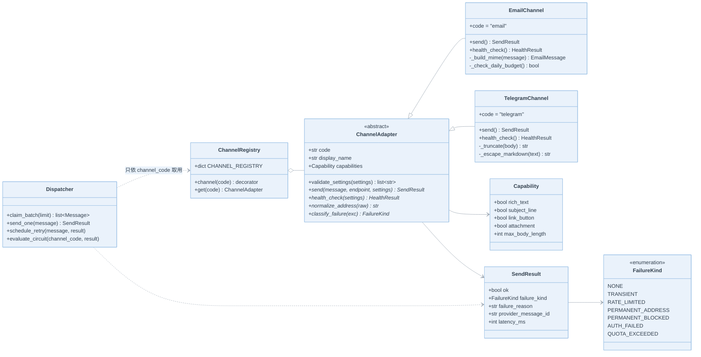

**新增管道的完整步驟（AC-19 的驗證依據）**：

| 步驟 | 動作 | 涉及檔案 |
|---|---|---|
| ① | 建立 `notify/channels/line_channel.py`，實作 `ChannelAdapter` 四個抽象方法 | 新檔案 1 個 |
| ② | 於 `notify/channels/__init__.py` 加一行 `from . import line_channel` | 既有檔案 +1 行 |
| ③ | 於 `notify/templates/` 補該管道模板（缺漏時自動回退 `__default__`，不會漏發） | 新檔案 N 個 |
| ④ | 於管理介面「管道設定」填入必要設定並啟用 | 純資料操作 |

> `routing.py`、`policy.py`、`dispatcher.py`、`composer.py`、`notify_repository.py` 與所有既有資料
> **零改動**——這就是 AC-19 的驗收內容。

### 4.4 訂閱路由演算法（M2）

```python
def resolve_endpoints(event: Event) -> list[EndpointRef]:
    rules = repo.list_enabled_subscriptions(event.event_type)     # 已在 SQL 用 event_type 初篩
    facts = ROUTING_FACTS[event.event_type](event.payload)        # 攤平為可比對的鍵值
    hit_endpoints: dict[int, EndpointRef] = {}                    # 以 endpoint_id 去重（FR-RT-05）

    for rule in rules:
        if not _match(rule.filter_conditions, facts):
            continue
        for ep in repo.expand_target(rule):        # group → recipients → endpoints；或直接 endpoint
            if ep.id not in hit_endpoints:
                hit_endpoints[ep.id] = ep.with_rule(rule.rule_code)   # 記住命中規則，供偏好授權範圍計算
    return list(hit_endpoints.values())


def _match(conditions: dict, facts: dict) -> bool:
    for dim, expected in conditions.items():
        if expected is None:
            continue                                   # 未設定 = 不過濾（FR-RT-08）
        matcher = MATCHER_REGISTRY.get(dim)
        if matcher is None:
            logger.warning("未知的過濾維度 %s，視為不過濾", dim)
            continue                                   # 向前相容：舊規則遇到新版移除的維度不會爆掉
        if not matcher(expected, facts):
            return False                               # 不同項目之間 AND
    return True
```

**過濾維度註冊表**（`MATCHER_REGISTRY`，新增維度是純新增，對應 FR-RT-08）：

| 維度鍵 | 比對語意 | facts 來源欄位 |
|---|---|---|
| `market` | 集合交集（OR） | `payload.market` |
| `strategy_id` | 集合交集 | `payload.strategy_id` |
| `strategy_category` | 集合交集 | 由 `strategy_id` 查 `strategies.yaml` 的 `category` |
| `signal_type` | 集合交集 | `payload.signal_type`（BUY／SELL／WARNING） |
| `signal_strength` | 集合交集 | `payload.signal_strength` |
| `symbols` | `{"mode":"include"\|"exclude","list":[…]}` | `payload.stock_id` |
| `severity` | 集合交集 | `event.severity` |

> **`strategy_category` 的取得方式**：`strategies.yaml` 內每個策略已有 `category` 欄位
> （`technical`／`chip`／`fundamental`）。`events.py` 於擷取 routing facts 時呼叫
> `strategies.config_loader.load_strategy_config()` 反查，**不在事件 payload 中要求掃描器多帶欄位**
> （避免動到 R1 邊界）。查不到時該維度視為 `unknown`，只有明確過濾該維度的規則會落空。

### 4.5 通知政策閘門（M3）

`policy.apply_gates()` 對每個端點依序通過 **0～4 號閘門**，回傳 `Decision(action, reason, scheduled_at)`：

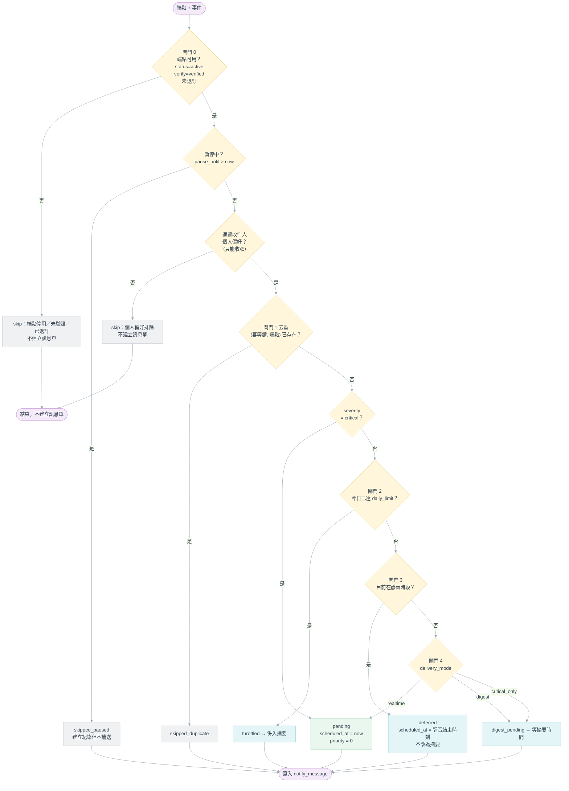

**關鍵實作細節**：

| 項目 | 實作 | 對應需求 |
|---|---|---|
| 「只能收窄」的強制 | `policy` 取 `rule.filter_conditions ∩ recipient_preference`，**交集**而非聯集；自助 API 儲存偏好時另做一次「是否為授權範圍子集」檢查，兩層都在後端 | FR-SS-08、AC-24 |
| 靜音時段跨午夜 | `quiet_start=22:00, quiet_end=08:00` → 判斷式為 `start > end ? (t >= start or t < end) : (start <= t < end)`；一律先用 `endpoint.timezone` 把 `now` 轉為端點當地時間 | FR-PL-03、FR-PL-09 |
| 靜音 ≠ 摘要 | 閘門 3 只設 `scheduled_at`，**不改 delivery_mode**；dispatcher 到時自然取件逐則送出 | FR-PL-03、AC-07 |
| 每日上限計數 | `notify_quota_usage(scope='endpoint', scope_key, usage_date)`，`usage_date` 以端點時區的日期計算；`UPDATE … RETURNING` 原子遞增 | FR-PL-02、FR-PL-09 |
| critical 豁免 | `severity == 'critical'` 直接跳過閘門 2、3、4，且 `priority=0` | FR-PL-04、AC-08 |
| 暫停不補送 | 記為 `skipped_paused` 終態，恢復後**不重排** | M13、AC-23 |

### 4.6 訊息組裝與模板（M4／M10）

```python
env = SandboxedEnvironment(
    autoescape=select_autoescape(["html"]),   # Email HTML 版自動轉義；純文字版不轉義
    undefined=ChainableUndefined,             # 模板引用不存在欄位時輸出空字串，不炸掉
    loader=None,                              # 模板字串來自 DB，禁止檔案系統存取
)
env.globals.clear()                            # 移除 range/dict 等可被濫用的全域
```

| 設計點 | 作法 |
|---|---|
| 模板查找 | `(event_type, channel_code)` → 找不到 → `('__default__', channel_code)` → 再找不到 → `('__default__', '__text__')`（R5 三層回退） |
| 能力降級 | `composer` 讀 `adapter.capabilities`；管道不支援 `subject_line` 時把標題併為內文首行；不支援 `rich_text` 時以 `strip_markup()` 轉純文字（§10.3 優雅降級） |
| 長度限制 | 渲染後若超過 `capabilities.max_body_length`，於安全邊界截斷並附「查看完整內容」連結（FR-MC-06） |
| 必備要素 | `composer` 在渲染後**強制附加** `disclaimer` 與 `manage_url`（個人端點）／不附 `manage_url`（共用端點）；模板不可省略（FR-MC-05、FR-SS-01、AC-29） |
| 可用變數 | 由 `TEMPLATE_CONTEXT_SPEC[event_type]` 宣告，管理介面「變數說明」直接讀這份定義，不另行維護文件 |
| 預覽 | `POST /templates/preview` 用 `SAMPLE_PAYLOADS[event_type]` 渲染，**不寫入任何資料表**（FR-MC-07） |

**共用端點的連結抑制**（RK-10 的實作點）：

```python
manage_url = None
if endpoint.endpoint_scope == "personal" and endpoint.recipient_id:
    manage_url = selfservice.build_manage_url(endpoint.recipient_id)
# shared 端點：manage_url 恆為 None，模板中的 {{ manage_url }} 渲染為空、對應區塊整段不輸出
```

### 4.7 發送調度（M5）—— Outbox Worker

```sql
-- claim_batch()：原子取件，多 worker 或多進程下也不會重複取
WITH claimed AS (
    SELECT id FROM notify_message
     WHERE status IN ('pending', 'failed')
       AND scheduled_at <= NOW()
       AND (next_retry_at IS NULL OR next_retry_at <= NOW())
       AND channel_code = ANY(:available_channels)   -- 熔斷/停用的管道直接排除（R6）
     ORDER BY priority ASC, scheduled_at ASC
     LIMIT :batch_size
     FOR UPDATE SKIP LOCKED
)
UPDATE notify_message m
   SET status = 'sending', claimed_at = NOW(), claimed_by = :worker_id
  FROM claimed
 WHERE m.id = claimed.id
RETURNING m.*;
```

| 機制 | 設計 | 設定鍵 |
|---|---|---|
| 輪詢間隔 | 空批次時 `await asyncio.sleep(NOTIFY_POLL_INTERVAL_SEC)`（預設 10 s）；有批次時立即續跑 → 滿足 NFR-04 的 3 分鐘 | `NOTIFY_POLL_INTERVAL_SEC` |
| 批次大小 | 預設 20 | `NOTIFY_BATCH_SIZE` |
| 優先度 | `priority ASC`，critical=0、warning=5、info=10（FR-DP-05） | — |
| 速率控制 | 每個管道一個 token bucket（記憶體內）；Telegram 預設 20 則/分、Email 預設 30 則/分 | `NOTIFY_RATE_<CHANNEL>_PER_MIN` |
| 卡單回收 | 啟動時與每 5 分鐘，把 `status='sending' AND claimed_at < NOW() - INTERVAL '10 min'` 的訊息重設為 `failed`（涵蓋硬當機情境，NFR-02／AC-32） | `NOTIFY_STUCK_TIMEOUT_MIN` |
| 重試退避 | `next_retry_at = NOW() + backoff[attempt_count]`，預設 `[60, 300, 1800]` 秒 | `NOTIFY_RETRY_BACKOFF_SEC` |
| 最大重試 | 預設 3；用盡轉 `dead` | `NOTIFY_MAX_RETRY` |

**失敗分類與處置**（`FailureKind` → 動作）：

| FailureKind | 判定依據 | 動作 | 需求 |
|---|---|---|---|
| `TRANSIENT` | 連線逾時、5xx、SMTP 4xx | 退避重試 | FR-DP-02 |
| `RATE_LIMITED` | Telegram 429（讀 `retry_after`）、SMTP 421 | 依對方指定秒數重排，**不計入重試次數** | RK-03 |
| `PERMANENT_ADDRESS` | SMTP 5xx `550`、Telegram `chat not found` | 立即 `dead` **並停用該端點** | FR-DP-03、RK-04 |
| `PERMANENT_BLOCKED` | Telegram `bot was blocked by the user` | 同上，另發 `SYSTEM_HEALTH` 通知擁有者 | RK-04 |
| `AUTH_FAILED` | SMTP 535、Telegram 401 | 立即 `dead`，**管道**轉 `misconfigured` 並停止該管道發送 | FR-CH-04 |
| `QUOTA_EXCEEDED` | 每日寄送量預算達標 | 不重試；改走已授權備援端點，無備援則 `dead` + 告警 | NFR-21、AC-26 |

### 4.8 跨管道備援（FR-DP-08／NFR-21）

**備援不是「隨便改送」**，必須同時滿足三個條件才允許：

```python
def resolve_fallback(message, endpoint) -> Endpoint | None:
    fb = repo.get_endpoint(endpoint.fallback_endpoint_id)
    if fb is None:                                   return None
    if fb.verify_status != "verified":               return None   # ① 已驗證
    if fb.status != "active":                        return None   # ② 啟用中
    if not repo.rule_authorizes(message.event_id, fb.id):
        return None                                                # ③ 獲原訂閱規則授權
    return fb
```

無可用備援時**記錄 `dead` 並發告警，不得任意改送**（FR-DP-08 明文要求）。

### 4.9 熔斷與恢復（M11）

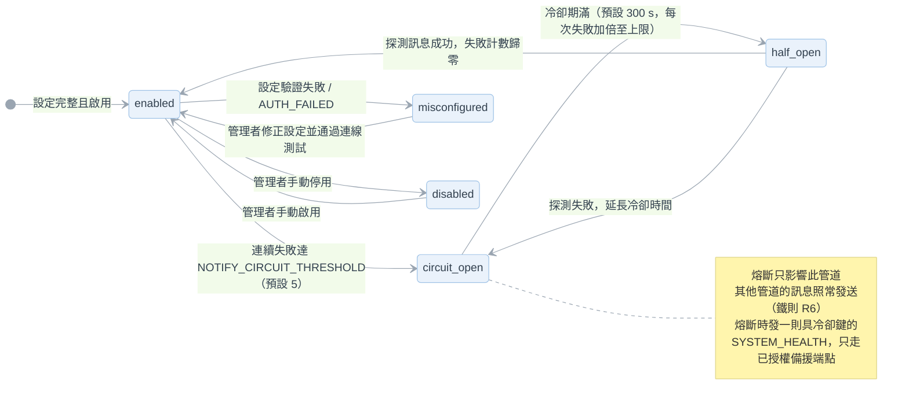

`half_open` 不落地為資料表狀態，而是 `circuit_open_until <= NOW()` 時 dispatcher 允許放行**一則**探測訊息的臨時判定，避免多一個需要維護的狀態值。

### 4.10 防遞迴告警（RK-11／FR-DP-04／AC-28）

| 規則 | 實作 |
|---|---|
| `SYSTEM_HEALTH` 的投遞失敗不得再產生 `SYSTEM_HEALTH` | `dispatcher._maybe_alert()` 首行：`if message.event_type == 'SYSTEM_HEALTH': return` |
| 同管道同失敗類型冷卻期間只產生一則 | `notify_suppression` 表以 `cooldown_key = f"{channel}:{failure_kind}"` 為主鍵；冷卻中只 `occurrence_count += 1` |
| 所有管道皆不可用時不得建立無限告警鏈 | `intake.publish()` 對 `SYSTEM_HEALTH` 若 `resolve_endpoints()` 回傳空清單，只寫 `notify_event(routed_status='no_match')` 並記 `logger.error`，供管理介面「系統警示」區塊讀取 |

---

## 5. 資料庫設計

### 5.1 實體關聯圖（PostgreSQL 實體模型）

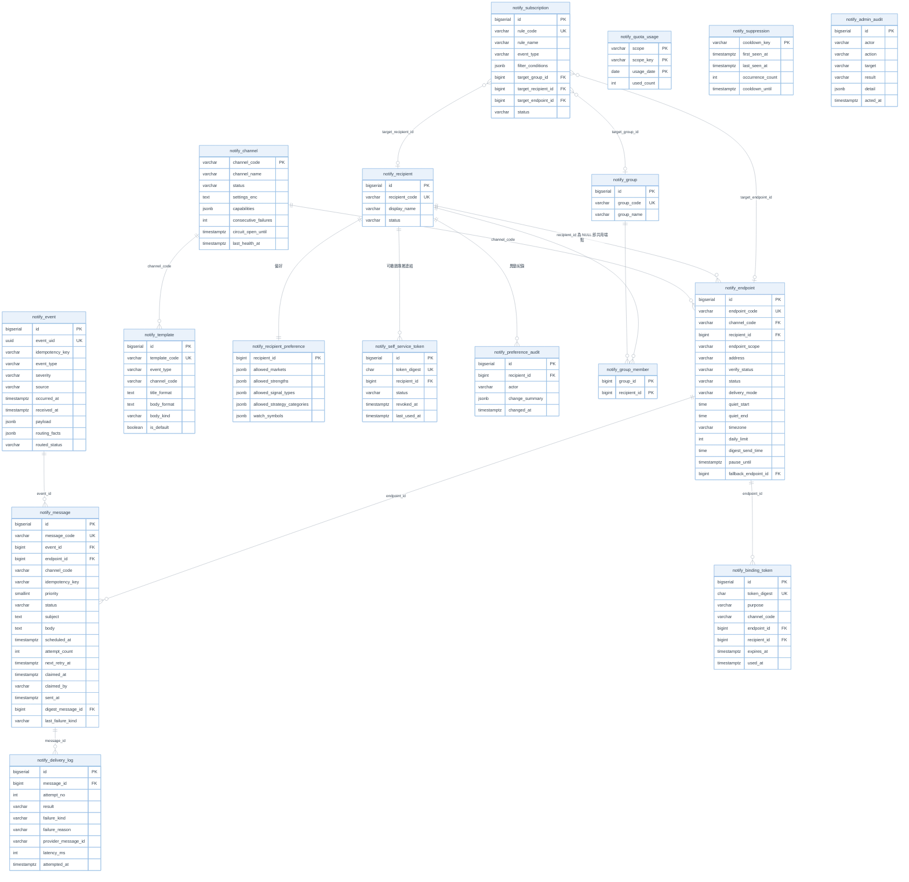

> `notify_message.digest_message_id` 與 `notify_endpoint.fallback_endpoint_id` 皆為**自參照外鍵**
> （摘要成員指向摘要主訊息、端點指向其備援端點），受 Mermaid `erDiagram` 表達限制未於圖上畫出，
> 欄位定義見 §5.3。

### 5.2 邏輯實體 → 實體資料表對照

| 需求規格書 §9.1 邏輯實體 | 實體資料表 | 差異說明 |
|---|---|---|
| `CHANNEL` | `notify_channel` | `channel_settings` 改為 `settings_enc`（Fernet 密文，ADR-08） |
| `RECIPIENT` | `notify_recipient` | 一致 |
| `ENDPOINT` | `notify_endpoint` | `quiet_hours` 拆為 `quiet_start`／`quiet_end` 兩個 `TIME` 以支援跨午夜比較；新增 `fallback_endpoint_id`（FR-RC-10） |
| `GROUP` | `notify_group` + `notify_group_member` | 多對多拆表 |
| `SUBSCRIPTION` | `notify_subscription` | `target` 拆為三個可為空的外鍵 + CHECK 約束，取代多型欄位以保有參照完整性 |
| `EVENT_TYPE` | **不建表**，改為程式常數 `EVENT_TYPES` | 事件類型是程式契約而非使用者資料；建表會造成「改程式又要改資料」的雙重真相 |
| `EVENT` | `notify_event` | 增 `routing_facts`（攤平後的比對欄位快照）與 `routed_status` |
| `TEMPLATE` | `notify_template` | 增 `body_kind`（text／html／markdown）與 `is_default` |
| `MESSAGE` | `notify_message` | 增 Outbox 所需的 `priority`／`attempt_count`／`next_retry_at`／`claimed_*` |
| `DELIVERY_LOG` | `notify_delivery_log` | 一致 |
| `BINDING_TOKEN` | `notify_binding_token` | `token` 改為 `token_digest`（不存明文） |
| `RECIPIENT_PREFERENCE` | `notify_recipient_preference` | 一致 |
| `SELF_SERVICE_TOKEN` | `notify_self_service_token` | 一致 |
| `PREFERENCE_AUDIT_LOG` | `notify_preference_audit` | 一致 |
| `DIGEST_SCHEDULE` | **併入 `notify_endpoint`**（`digest_send_time` + `timezone`） | 一個端點最多一組摘要排程，獨立成表只會多一次 join |
| （新增） | `notify_quota_usage` | 每日上限與 Email 寄送預算的計數載體（FR-PL-02、NFR-21） |
| （新增） | `notify_suppression` | 告警防遞迴冷卻鍵（RK-11、AC-28） |
| （新增） | `notify_admin_audit` | 管理端操作稽核（FR-AU-03） |

> **時間型別的刻意偏離**：既有 [db/models.py](../../backend/db/models.py) 使用 `TIMESTAMP`（無時區）。
> 本模組全面使用 `TIMESTAMPTZ`，因為 FR-PL-09 要求每日上限邊界、靜音時段與摘要時間皆依**端點時區**
> 計算。`TIME` 型別欄位（`quiet_start`／`quiet_end`／`digest_send_time`）本身無時區，一律搭配同列的
> `timezone` 欄位解讀（見 ADR-12）。

### 5.3 關鍵索引與約束

```sql
-- 去重的單一事實來源（FR-PL-01、AC-06、ADR-11）
CREATE UNIQUE INDEX uq_notify_message_dedup
    ON notify_message (idempotency_key, endpoint_id);

-- Outbox 取件（NFR-04）
CREATE INDEX idx_notify_message_queue
    ON notify_message (priority, scheduled_at)
    WHERE status IN ('pending', 'failed');

-- 端點唯一性：同一管道下不得重複位址；同一 Telegram 對話只能有一個有效端點（M8）
CREATE UNIQUE INDEX uq_notify_endpoint_channel_address
    ON notify_endpoint (channel_code, address);

-- 摘要成員與備援端點的自參照外鍵
ALTER TABLE notify_message
    ADD CONSTRAINT fk_notify_message_digest
    FOREIGN KEY (digest_message_id) REFERENCES notify_message (id);
ALTER TABLE notify_endpoint
    ADD CONSTRAINT fk_notify_endpoint_fallback
    FOREIGN KEY (fallback_endpoint_id) REFERENCES notify_endpoint (id);

-- 個人端點必須有收件人；共用端點必須沒有（FR-RC-09、RK-10）
ALTER TABLE notify_endpoint ADD CONSTRAINT ck_notify_endpoint_scope CHECK (
    (endpoint_scope = 'personal' AND recipient_id IS NOT NULL) OR
    (endpoint_scope = 'shared'   AND recipient_id IS NULL)
);

-- 訂閱規則的目標必須且只能有一個
ALTER TABLE notify_subscription ADD CONSTRAINT ck_notify_subscription_single_target CHECK (
    (target_group_id     IS NOT NULL)::int
  + (target_recipient_id IS NOT NULL)::int
  + (target_endpoint_id  IS NOT NULL)::int = 1
);

-- 每位收件人同時只能有一組有效自助連結（FR-SS-10：撤銷後舊連結立即失效）
CREATE UNIQUE INDEX uq_notify_sst_active
    ON notify_self_service_token (recipient_id) WHERE status = 'active';

-- 模板矩陣唯一（事件類型 × 管道）
CREATE UNIQUE INDEX uq_notify_template_pair
    ON notify_template (event_type, channel_code);

-- 紀錄查詢（FR-LG-02）
CREATE INDEX idx_notify_message_lookup ON notify_message (created_at DESC, status, channel_code);
CREATE INDEX idx_notify_event_key      ON notify_event (idempotency_key);
```

**去重的競態安全寫法**（取代「先查後寫」）：

```sql
INSERT INTO notify_message (message_code, event_id, endpoint_id, channel_code,
                            idempotency_key, priority, status, subject, body, scheduled_at)
VALUES (...)
ON CONFLICT (idempotency_key, endpoint_id) DO NOTHING
RETURNING id;
-- 回傳 0 列 → 此（事件, 端點）先前已建立過訊息 → 記為 skipped_duplicate（僅寫稽核，不再建訊息單）
```

### 5.4 資料保留與清理（FR-LG-06、Q-06）

| 資料表 | 保留期 | 清理方式 |
|---|---|---|
| `notify_message`（終態）＋ `notify_delivery_log` | `NOTIFY_LOG_RETENTION_DAYS`，預設 **90 天** | APScheduler 每日 04:00 執行 `notify.maintenance.purge_old_logs()`，分批 `DELETE ... LIMIT 5000` 避免長交易 |
| `notify_event`（已無關聯訊息者） | 同上 | 隨訊息一併清 |
| `notify_binding_token`（已用或逾期） | 7 天 | 同一排程 |
| `notify_quota_usage` | 90 天 | 同一排程 |
| `notify_admin_audit`／`notify_preference_audit` | **不自動清理** | 稽核資料，僅手動 |

> 清理**不刪除仍在流程中的列**（`pending`／`sending`／`failed`／`deferred`／`digest_pending`），
> 以免把待發訊息當成舊資料刪掉。

---

## 6. API 設計

### 6.1 回應封套與錯誤碼

沿用既有慣例 `{"success": bool, "data": ..., "error": {"code","message"}}`。新增例外與全域處理器
（註冊於 [main.py](../../backend/main.py)，比照既有 `SymbolNotFoundException`）：

| 例外 | HTTP | `error.code` |
|---|---|---|
| `NotifyNotFoundException` | 404 | `NOTIFY_NOT_FOUND` |
| `NotifyUnauthorizedException` | 401 | `NOTIFY_UNAUTHORIZED` |
| `NotifyForbiddenException` | 403 | `NOTIFY_FORBIDDEN` |
| `NotifyValidationException` | 400 | `NOTIFY_INVALID_INPUT` |
| `PreferenceWideningException` | 400 | `NOTIFY_SCOPE_WIDENING`（FR-SS-08 只能收窄） |
| `ChannelUnavailableException` | 409 | `NOTIFY_CHANNEL_UNAVAILABLE` |

> **不得洩漏存在性**：自助端與 token 相關端點，無論 token 不存在、已撤銷或格式錯誤，
> 一律回 `401 NOTIFY_UNAUTHORIZED` 與**完全相同的訊息**（NFR-19、AC-21）。

### 6.2 端點總表

#### ① 管理端（全部套用 `Depends(require_owner)`）

| 方法 | 路徑（前綴 `/api/v1/notify`） | 用途 | 需求 |
|---|---|---|---|
| POST／DELETE | `/session` | 擁有者登入／登出 | FR-AU-01 |
| GET | `/channels` | 管道清單與健康狀態 | FR-CH-01、NFR-13 |
| GET | `/channels/{code}` | 單一管道設定（**機敏欄位一律回傳遮蔽值**） | FR-CH-06、NFR-08 |
| PUT | `/channels/{code}` | 更新設定（機敏欄位傳 `null` 代表保留原值） | FR-CH-01 |
| POST | `/channels/{code}/enable`、`/disable` | 啟用／停用 | FR-CH-01、AC-12 |
| POST | `/channels/{code}/test` | 連線測試（不寫入訊息單） | FR-CH-03、UC-09 |
| GET／POST | `/recipients` | 收件人列表／新增 | FR-RC-01 |
| PATCH／DELETE | `/recipients/{code}` | 編輯／停用（軟刪除） | FR-RC-01、FR-RC-08 |
| GET | `/recipients/{code}/preferences` | 檢視收件人自助偏好（**唯讀**） | M13「管理者可見但不可代改」 |
| POST | `/recipients/{code}/self-service-link` | 產生／撤銷重產專屬連結，**明文只在這個回應出現一次** | FR-SS-10、AC-25 |
| DELETE | `/recipients/{code}/self-service-link` | 僅撤銷 | FR-SS-10 |
| POST | `/recipients/{code}/endpoints` | 新增個人端點（Email 立即寄驗證信） | FR-RC-02／03、FR-BD-01 |
| POST | `/endpoints` | 新增**共用端點**（如 Telegram 群組，無 `recipient_code`） | FR-RC-09 |
| PATCH | `/endpoints/{code}` | 偏好設定（模式／靜音／上限／時區／摘要時間／備援端點） | FR-RC-06、FR-RC-10 |
| POST | `/endpoints/{code}/test-send` | 測試發送 | FR-RC-07、UC-09 |
| POST | `/endpoints/{code}/resend-verification` | 重寄驗證信 | FR-BD-02 |
| POST | `/endpoints/{code}/disable` | 停用（保留歷史） | FR-RC-08 |
| POST | `/recipients/{code}/binding-code` | 產生 Telegram 一次性綁定碼（15 分鐘） | FR-BD-03／04 |
| GET／POST／PATCH／DELETE | `/groups`、`/groups/{code}`、`/groups/{code}/members` | 收件群組維護 | FR-RC-05 |
| GET／POST | `/subscriptions` | 規則列表／新增 | FR-RT-01 |
| PATCH | `/subscriptions/{code}` | 編輯、啟用／停用 | FR-RT-04 |
| POST | `/subscriptions/preview` | **規則測試**：丟一筆範例事件，回傳命中規則與端點清單（不寫入任何資料） | FR-RT-07、UC-06 |
| GET | `/templates` | 模板矩陣（含「使用預設模板」標記） | FR-MC-02 |
| GET／PUT | `/templates/{event_type}/{channel}` | 模板內容編輯 | 鐵則 R4 |
| GET | `/templates/variables/{event_type}` | 可用變數清單（來自 `TEMPLATE_CONTEXT_SPEC`） | FR-MC-07 |
| POST | `/templates/preview` | 以範例資料渲染預覽 | FR-MC-07 |
| GET | `/messages` | 發送紀錄查詢（`date_from`／`date_to`／`status`／`channel`／`recipient`／`event_type`） | FR-LG-02 |
| GET | `/messages/{code}` | 單筆詳情＋完整 `delivery_log` 歷程 | FR-LG-01／03 |
| POST | `/messages/{code}/resend` | 手動重送（`dead`／`failed` → `pending`，**沿用同一列**不新建） | FR-LG-04、AC-14 |
| POST | `/messages/resend-failed` | 批次重送當日失敗 | FR-LG-04 |
| GET | `/stats` | 發送統計（總量、成功率、管道占比、失敗排行、Email 今日用量） | FR-LG-05 |
| POST | `/events` | 手動注入事件（測試用；拒收 `ALERT_DIGEST`） | 測試 |
| GET | `/audit` | 管理端操作稽核查詢 | FR-AU-03 |

#### ② 自助端（Cookie 授權，見 §7.2）

| 方法 | 路徑（前綴 `/api/v1/notify/me`） | 用途 | 需求 |
|---|---|---|---|
| GET | `/` | 本人資料：端點清單、偏好、**被指派的授權範圍**（供前端灰化不可選項） | FR-SS-02／03／11 |
| PATCH | `/preferences` | 調整訂閱範圍（後端驗證是否為授權子集） | FR-SS-04／08 |
| PATCH | `/endpoints/{code}` | 調整**該端點**的模式／靜音／每日上限 | FR-SS-05、FR-RC-06 |
| POST | `/pause` | 暫停 `{days: 1｜3｜7｜30}` | FR-SS-06 |
| DELETE | `/pause` | 提前恢復 | FR-SS-06 |
| POST | `/unsubscribe` | `{scope:"endpoint", endpoint_code}` 或 `{scope:"all"}`，破壞性操作需 `confirm:true` | FR-SS-07、AC-17 |
| GET | `/messages` | 我近 7 天收到的通知 | FR-SS-09 |

#### ③ 公開端（無需授權，但有速率限制）

| 方法 | 路徑 | 用途 | 需求 |
|---|---|---|---|
| GET | `/n/s/{token}` | 自助連結**入口**：驗證 → 種 Cookie → **303 轉址**至 `/n/me` | ADR-09、NFR-23 |
| GET | `/n/v/{token}` | Email 驗證連結（一次性、24 小時） | FR-BD-01／02 |
| POST | `/api/v1/notify/telegram/webhook/{secret}` | Telegram webhook（僅 `TELEGRAM_WEBHOOK_BASE` 有設定時掛載） | ADR-06 |

### 6.3 端到端序列圖（盤後訊號 → 送達）

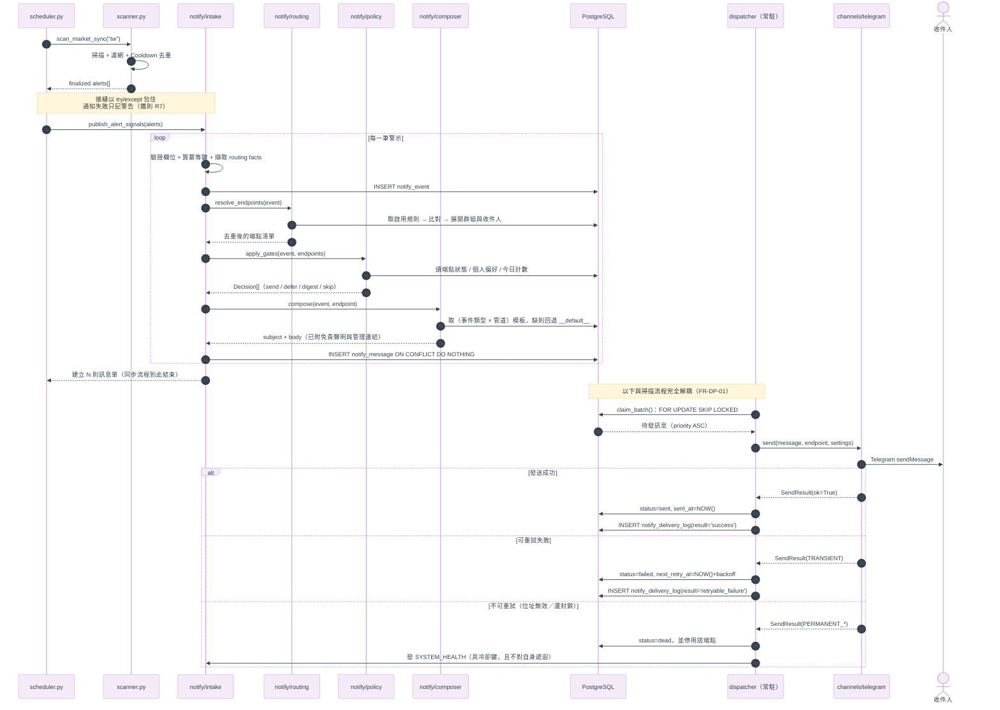

---

## 7. 安全設計

### 7.1 機敏資訊（NFR-08、FR-CH-06、FR-LG-07、AC-16）

| 層面 | 作法 |
|---|---|
| 靜態儲存 | `notify_channel.settings_enc` = `Fernet(NOTIFY_SECRET_KEY).encrypt(json.dumps(settings))`；金鑰只存 `.env`，**不入資料庫、不入版控** |
| API 回應 | `security.mask_settings()` 依 `SECRET_FIELDS` 清單把 `smtp_password`、`bot_token` 等替換為 `"••••••••"` 並附 `"_masked": true`；**沒有任何端點會回傳明文** |
| 更新語意 | `PUT /channels/{code}` 收到機敏欄位為 `null` 時代表「維持原值」，前端不需先取得明文即可存檔 |
| 日誌 | `security.redact()` 過濾所有 `logger` 輸出；`SendResult.failure_reason` 寫入前截斷 300 字並移除比對到 `SECRET_PATTERNS` 的片段 |
| 匯出 | 發送紀錄匯出只含 `notify_message`／`notify_delivery_log` 欄位，結構上不含管道設定 |
| 訊息內容 | 模板可用變數由 `TEMPLATE_CONTEXT_SPEC` 白名單提供，管道設定不在渲染上下文中（NFR-11） |

### 7.2 自助連結（M13、NFR-19／23、FR-SS-14、RK-12）

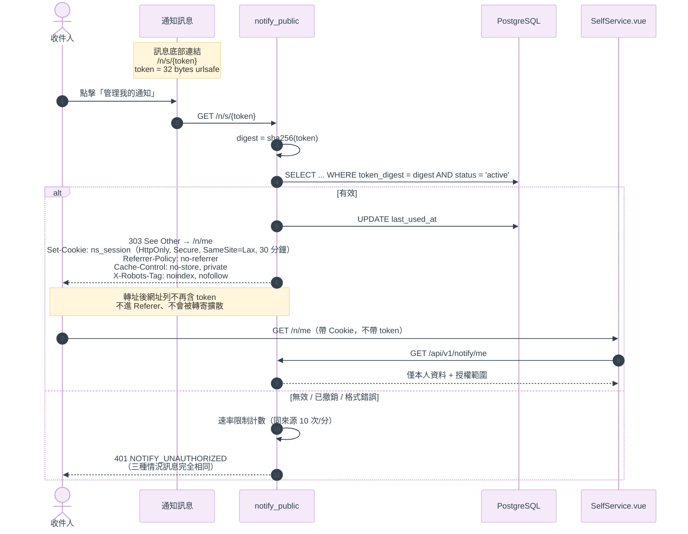

| 要求 | 實作 |
|---|---|
| 不可猜測 | `secrets.token_urlsafe(32)`，即 256 bit |
| 不存明文 | 只存 `sha256` 摘要（`CHAR(64)`）；產生當下回傳一次明文給管理介面，之後**任何 API 都取不回** |
| 不入紀錄 | Cookie 交換 + 303 轉址（ADR-09）；access log 只會出現一次 `/n/s/...`，另於部署層加過濾規則（§11.3） |
| 可撤銷 | `status='revoked'` + 唯一索引保證同時只有一組有效；撤銷後舊 Cookie 於下一次 `GET /me` 反查 token 狀態時立即失效 |
| 破壞性操作二次確認 | `POST /me/unsubscribe` 要求 `confirm=true`，前端另加確認對話框 |
| 速率限制 | `notify/security.py` 以 `(來源, 分鐘)` 為鍵的記憶體計數器；超限回 `429`，訊息不透露收件人是否存在 |
| 共用端點不得附連結 | §4.6 已在 composer 強制；AC-29 驗收 |

### 7.3 管理端授權（FR-AU、NFR-22）

```python
# notify/security.py
async def require_owner(request: Request) -> str:
    token = request.cookies.get("mystock_owner")
    if token and _verify_signed(token):
        return "owner"
    auth = request.headers.get("Authorization", "")
    if auth.startswith("Bearer ") and secrets.compare_digest(
        auth[7:], notify_config.get_owner_api_token()
    ):
        return "owner:api"
    raise NotifyUnauthorizedException()
```

| 要求 | 實作 |
|---|---|
| 伺服器端強制 | `require_owner` 掛在 **router 層級**：`APIRouter(prefix="/api/v1/notify", dependencies=[Depends(require_owner)])`，新增端點預設就受保護，不會漏掛 |
| 不得只靠前端 | 前端只依 `GET /session` 結果決定是否顯示選單；即使繞過前端直呼 API 仍會被擋（AC-30） |
| 登入 | `POST /session` 比對 `OWNER_PASSWORD_HASH`（bcrypt）；成功後種簽章 Cookie（`itsdangerous`，12 小時） |
| 操作稽核 | 所有寫入型管理端點經 `@audit("action_name")` 裝飾器寫入 `notify_admin_audit`（操作者、時間、目標、結果） |
| 自助端隔離 | 自助 API 使用**不同 Cookie 名稱與不同簽章 salt**，兩者無法互相冒用（§12.1「入口完全分離」） |

### 7.4 綁定與驗證（M9）

| 項目 | Email 驗證 | Telegram 綁定 |
|---|---|---|
| 憑證形式 | `secrets.token_urlsafe(32)` | 6 碼 Base32（去除易混淆的 `I O 0 1`），顯示為 `XXX-XXX` |
| 儲存 | `sha256` 摘要 | `sha256` 摘要 |
| 有效期 | 24 小時 | 15 分鐘 |
| 一次性 | `used_at` 非空即失效 | 同左 |
| 低熵補償 | — | 綁定碼僅 6 碼，故額外限制**同一 Telegram 使用者每分鐘最多嘗試 5 次**，超過即靜默忽略 |
| 綁定後 | `verify_status='verified'` | 自動建立端點（`address = chat_id`）並回覆確認訊息 |
| 群組綁定 | — | `chat.type in ('group','supergroup')` → 建立 `endpoint_scope='shared'` 端點，**不掛任何 `recipient_id`**（FR-RC-09、RK-10） |
| 解除 | 停用端點 | 使用者送 `/unbind`，或管理端停用端點 |

### 7.5 非功能需求實作對照

| 編號 | 需求 | 實作手段 | 量測方式 |
|---|---|---|---|
| NFR-01 | 通知異常不影響爬蟲與掃描 | 接縫處 try/except（§3.2 R7） | AC-15：停掉 DB 後跑排程，確認資料照常寫入 |
| NFR-02 | 訊息不遺失、重啟可續行 | Outbox 落地 + 卡單回收 | AC-32：建立待發訊息後重啟服務 |
| NFR-03 | 單一管道故障不影響其他 | 熔斷為列層級 + 取件依 `channel_code` 過濾 | AC-12 |
| NFR-04 | 95% 即時訊息 3 分鐘內首發 | 輪詢 10 s + 批次 20 + 優先度排序 | `notify_smoke_test.py --latency`：算 `sent_at - received_at` 的 P95 |
| NFR-05 | 摘要 ±2 分鐘 | 摘要 tick 每 60 秒 | 同上腳本 |
| NFR-06 | 1,000 事件／10,000 訊息不遺失不重複 | 唯一索引 + 單一交易 | `notify_smoke_test.py --load`：比對事件數 × 端點數 vs 訊息列數 |
| NFR-07 | 100 端點 × 100 規則路由 2 秒內 | 規則以 `event_type` 先在 SQL 篩選，比對在記憶體內完成 | 腳本量測 `resolve_endpoints` 的 P95 |
| NFR-08／11 | 機敏不外洩 | §7.1 | AC-16 |
| NFR-09／10 | 一次性時效憑證、未驗證不發 | §7.4、政策閘門 0 | AC-03 |
| NFR-12 | 可查、可追溯、可重送 | `notify_delivery_log` + 重送 API | AC-14 |
| NFR-13 | 管道健康一目了然 | `GET /channels` 回傳狀態燈號 | 目視 |
| NFR-14 | 門檻可調不需改程式 | `notify/config.py` 全數走 `.env` | 改 `.env` 後不重啟即生效 |
| NFR-15 | 手機易讀、重點前置 | Telegram 模板首行即標題；Email 摘要重點在前 | 目視 |
| NFR-16 | 非技術者可完成設定 | 原型已驗證的表單流程（§9） | 使用者測試 |
| NFR-17／18 | 免責聲明、退訂 | composer 強制附加（§4.6） | AC-18、AC-17 |
| NFR-19／20／23 | 自助連結安全 | §7.2 | AC-21、AC-25 |
| NFR-21 | Email 寄送預算 | `notify_quota_usage(scope='channel')` + `QUOTA_EXCEEDED` | AC-26 |
| NFR-22 | 管理端伺服器授權 | §7.3 | AC-30 |

---

## 8. 排程與執行模型

### 8.1 進程內執行單元

所有背景工作都跑在**既有 uvicorn 進程**內（ADR-04），於 [main.py](../../backend/main.py) 的 `lifespan` 啟動：

```python
@asynccontextmanager
async def lifespan(app: FastAPI):
    scheduler = create_scheduler()                       # 既有：另加通知平台的 job（見 8.2）
    scheduler.start()
    asyncio.create_task(run_startup_backfill())          # 既有
    notify_worker = await notify.dispatcher.start()      # 新增：常駐 Outbox worker
    tg_poller = await notify.telegram_bot.start()        # 新增：long polling（webhook 模式為 no-op）
    yield
    await notify.dispatcher.stop(notify_worker)
    await notify.telegram_bot.stop(tg_poller)
    scheduler.shutdown(wait=False)
    await dispose_engine()
```

> `NOTIFY_ENABLED=false` 或啟動時資料庫連線失敗 → `start()` 回傳 `None` 並記 `logger.warning`，
> **FastAPI 照常啟動**，既有功能完全不受影響（ADR-02、鐵則 R7）。

### 8.2 排程表

| 工作 | 觸發 | 實作 | 需求 |
|---|---|---|---|
| 台股抓取 → 掃描 → **發佈事件** | Cron 14:30 Asia/Taipei | 既有 `_scheduled_tw()` 末端加 `_publish_after_scan("tw", alerts)` | UC-01 |
| 美股抓取 → 掃描 → **發佈事件** | Cron 06:00 Asia/Taipei | 同上 | UC-01 |
| **Outbox 派送** | 常駐迴圈，空批次睡 10 s | `dispatcher.run()` | FR-DP-01 |
| **摘要 tick** | Interval 60 s | `digest.tick()`：找出端點當地時間剛跨過 `digest_send_time` 者 | FR-PL-06、NFR-05 |
| **暫停到期恢復** | Interval 5 min | `UPDATE notify_endpoint SET pause_until = NULL WHERE pause_until <= NOW()` | FR-SS-06、AC-23 |
| **卡單回收** | Interval 5 min | `sending` 超過 10 分鐘者重設為 `failed` | NFR-02 |
| **熔斷探測** | 由 dispatcher 依 `circuit_open_until` 內生判定 | §4.9 | FR-DP-07 |
| **健康檢查** | Cron 15:30 / 07:00 | `health_probe.check()`：當日應有資料卻沒有 → `SYSTEM_HEALTH` | FR-EV-03 |
| **紀錄清理** | Cron 04:00 | `maintenance.purge_old_logs()` | FR-LG-06 |
| Telegram long polling | 常駐迴圈 | `telegram_bot.poll()`，`getUpdates` timeout=30 | FR-BD-03 |

> **Q-13（心跳檢查者）的誠實處理**：`health_probe` 跑在**被監控的同一個進程內**，因此
> 需求規格書 §M1 已警告的「排程未執行／服務整個停止」**首版偵測不到**。本文件不宣稱具備該能力。
> 若需要，Phase 5 加一個獨立的外部 cron（`curl /health` 失敗即告警），列於 §12.5。

### 8.3 摘要彙整流程

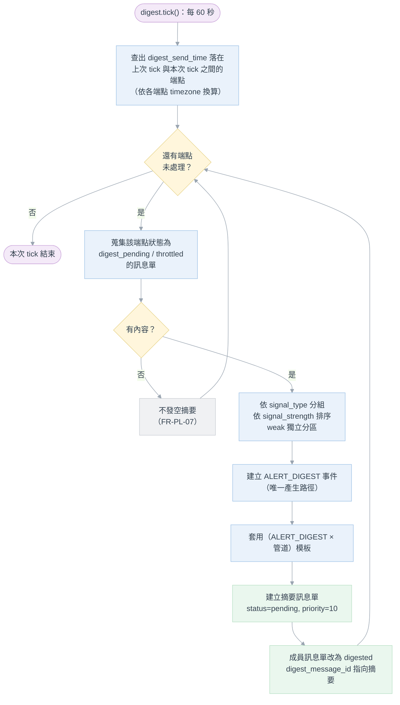

**摘要預設時間**（Q-02 建議值，可於端點層覆寫）：台股 15:00、美股 07:00（Asia/Taipei）。
端點若同時訂閱兩市場，兩個時間各發一次，摘要標題標明市場。

### 8.4 訊息單狀態機（實體）

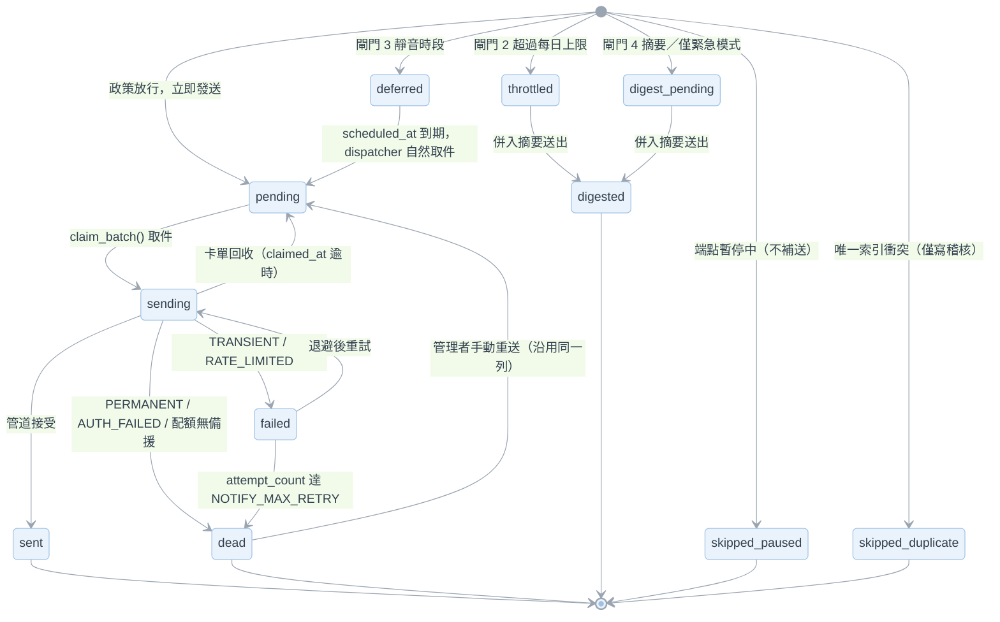

> **`sent` 的語意**：代表外部管道已接受發送請求，**不等同已進收件匣、更不等同已讀**。
> 只有在管道確實提供送達／退信回報時，系統才可另標 `delivered`／`bounced`。
> 介面文案一律用「已送出」而非「已送達」（需求規格書 §M7 明文要求，原型須修正，見 §15）。

> **`digest_pending` 是本文件新增的實體狀態**：需求規格書 §M7 的狀態清單中，「摘要模式暫存」
> 與「超量轉摘要」若共用 `throttled` 會混淆統計（前者是使用者偏好、後者是系統節流）。
> 兩者分開後，`GET /stats` 才能正確區分。介面上兩者皆呈現為「併入摘要」，對使用者無差異。

### 8.5 未來的水平擴充

目前為單進程單 worker。因 `claim_batch()` 使用 `FOR UPDATE SKIP LOCKED` 且以 `claimed_by` 記錄
worker 識別，**要拆成獨立進程或多副本時不需修改任何邏輯**：把 `dispatcher.run()` 包成獨立
entrypoint（`python -m notify.dispatcher`）並於 `docker-compose.yml` 加一個 service 即可。
速率控制屆時需從記憶體 token bucket 改為 DB 或 Redis 計數——這是唯一需要調整之處，記於 §12.5。

---

## 9. 前端設計（原型對照）

### 9.1 路由與入口分離

需求規格書 §12.1 明定「管理介面與自助頁**入口完全分離**」。這在前端落實為
**兩組互不相通的路由樹**——自助頁**不掛在 `AppLayout` 之下**，因此不會出現側邊選單、
不會載入既有的市場切換邏輯，也不可能誤連到管理頁面。

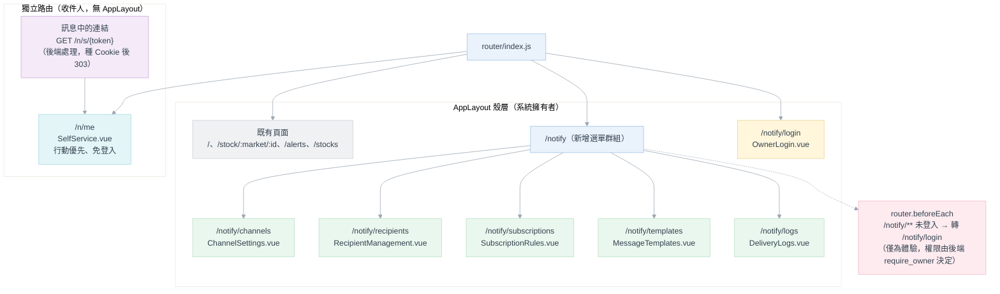

`AppMenu.vue` 新增一個選單群組（既有結構為單一群組 `MyStock 股市選股分析`）：

```javascript
{
    label: '通知設定',
    items: [
        { label: '管道設定',   icon: 'pi pi-fw pi-send',    to: '/notify/channels' },
        { label: '收件人',     icon: 'pi pi-fw pi-users',   to: '/notify/recipients' },
        { label: '訂閱規則',   icon: 'pi pi-fw pi-filter',  to: '/notify/subscriptions' },
        { label: '訊息模板',   icon: 'pi pi-fw pi-comment', to: '/notify/templates' },
        { label: '發送紀錄',   icon: 'pi pi-fw pi-history', to: '/notify/logs' }
    ]
}
```

### 9.2 原型頁面 → Vue 元件 → API 對照

原型（`prototype/`）已完成 UI 與互動驗證，開發時以它為視覺與流程依據，改以 PrimeVue 元件實作。

| 原型檔案 | Vue 視圖 | 主要 PrimeVue 元件 | 使用的 API |
|---|---|---|---|
| [channels.html](prototype/channels.html) | `ChannelSettings.vue` | `Card`、`ToggleSwitch`、`ProgressBar`（寄送量）、`Tag`、`DataTable`（事件類型表） | `GET /channels`、`PUT /channels/{code}`、`POST /channels/{code}/test`、`POST .../enable｜disable` |
| [recipients.html](prototype/recipients.html) | `RecipientManagement.vue` | `Card`、`Dialog`、`InputText`、`Select`、`ToggleButton`（強度 chip）、`Message` | `GET/POST /recipients`、`POST /recipients/{code}/endpoints`、`PATCH /endpoints/{code}`、`POST /endpoints/{code}/test-send`、`POST /recipients/{code}/binding-code`、`POST /recipients/{code}/self-service-link`、`GET/POST /groups` |
| [subscriptions.html](prototype/subscriptions.html) | `SubscriptionRules.vue` | `Card`（三段式規則卡）、`Dialog`、`ToggleSwitch`、`Chip`、`AutoComplete`（個股） | `GET/POST /subscriptions`、`PATCH /subscriptions/{code}`、`POST /subscriptions/preview` |
| [message-preview.html](prototype/message-preview.html) ＋ **新增** [templates.html](prototype/templates.html) | `MessageTemplates.vue` | `TabView`（Email／Telegram）、`Textarea`（模板編輯）、`DataTable`（模板矩陣）、`Panel`（變數說明） | `GET /templates`、`GET/PUT /templates/{event_type}/{channel}`、`GET /templates/variables/{event_type}`、`POST /templates/preview` |
| [logs.html](prototype/logs.html) | `DeliveryLogs.vue` | `DataTable`（分頁、排序）、`DatePicker`、`SelectButton`（狀態篩選）、`Tag`、`Dialog`（歷程） | `GET /messages`、`GET /messages/{code}`、`POST /messages/{code}/resend`、`POST /messages/resend-failed`、`GET /stats` |
| [my-subscription.html](prototype/my-subscription.html) | `SelfService.vue` | `Card`、`ToggleButton`、`SelectButton`（模式）、`DatePicker`（time）、`InputNumber`、`ConfirmDialog` | `GET /me`、`PATCH /me/preferences`、`PATCH /me/endpoints/{code}`、`POST/DELETE /me/pause`、`POST /me/unsubscribe`、`GET /me/messages` |
| [index.html](prototype/index.html) | —（原型導覽用，不實作） | — | — |

### 9.3 前端須遵守的規格性約束

| 約束 | 說明 | 需求 |
|---|---|---|
| 權限不由前端決定 | 前端隱藏選單只是體驗；**所有授權判斷都在後端**。前端不得因為「畫面沒顯示」就假設安全 | NFR-22、AC-30 |
| 不可調整項目**隱藏**而非停用 | 自助頁中收件人未被指派的選項應直接不顯示（需求 §12.2 明文）。原型目前是灰化顯示並附說明——本文件採**灰化 + 鎖頭圖示**的折衷，因為完全隱藏會讓收件人不知道「還有更多可選但需洽詢擁有者」，反而增加詢問成本。**此為與需求 §12.2 的刻意偏離，記於 §15** | §12.2 |
| `sent` 不得標為「已讀／已送達」 | 狀態文案用「已送出」；只有管道回報送達時才可顯示「已送達」 | §M7 |
| 機敏欄位一律遮蔽 | 前端不接收明文，也不得提供「顯示密碼」按鈕 | NFR-08 |
| 自助頁行動優先 | 單欄佈局、觸控目標 ≥ 44 px、底部固定儲存列 | FR-SS-13 |
| 自助頁不得載入管理端 API | `SelfService.vue` 只 import `notifyApi.self.*`，靜態分析即可檢查 | FR-SS-11 |

### 9.4 API 封裝（`frontend/src/service/notifyApi.js`）

沿用既有 `alertApi.js` 的薄封裝風格，共用 `apiClient`，但分成三個命名空間以防誤用：

```javascript
import { apiClient } from '@/service/stockApi';

export const notifyApi = {
    admin: { /* 管道、收件人、訂閱、模板、紀錄 —— 需擁有者 Cookie */ },
    self:  { /* /me/** —— 使用自助 Cookie，SelfService.vue 只用這一組 */ },
    session: { login, logout, whoami }
};
```

---

## 10. 設定項目（`backend/.env`）

新增區塊，沿用既有 `config.py` 的「每次讀取都 `load_dotenv(override=True)`」慣例，
因此**改 `.env` 不需重啟**（NFR-14）。

```bash
# ── 通知平台總開關 ─────────────────────────────────────────
NOTIFY_ENABLED=true
NOTIFY_SECRET_KEY=            # Fernet 金鑰，以 `python -c "from cryptography.fernet import Fernet; print(Fernet.generate_key().decode())"` 產生
PUBLIC_BASE_URL=https://mystock.example.com   # 訊息內連結與自助連結的基底網址

# ── 管理端授權（FR-AU） ─────────────────────────────────────
OWNER_PASSWORD_HASH=          # bcrypt hash
OWNER_API_TOKEN=              # 供腳本使用的 Bearer token（選填）
OWNER_SESSION_TTL_HOURS=12

# ── 發送調度（可調門檻，鐵則 R8） ─────────────────────────────
NOTIFY_POLL_INTERVAL_SEC=10
NOTIFY_BATCH_SIZE=20
NOTIFY_MAX_RETRY=3
NOTIFY_RETRY_BACKOFF_SEC=60,300,1800
NOTIFY_STUCK_TIMEOUT_MIN=10
NOTIFY_CIRCUIT_THRESHOLD=5
NOTIFY_CIRCUIT_COOLDOWN_SEC=300
NOTIFY_CIRCUIT_COOLDOWN_MAX_SEC=3600

# ── 通知政策預設值（Q-03／Q-07／Q-08） ───────────────────────
NOTIFY_DEFAULT_DAILY_LIMIT=30
NOTIFY_DEFAULT_QUIET_START=22:00
NOTIFY_DEFAULT_QUIET_END=08:00
NOTIFY_DEFAULT_TIMEZONE=Asia/Taipei
NOTIFY_DEFAULT_STRENGTHS=strong,moderate
NOTIFY_DIGEST_TIME_TW=15:00
NOTIFY_DIGEST_TIME_US=07:00
NOTIFY_LOG_RETENTION_DAYS=90

# ── Email 管道（Q-01：個人信箱） ──────────────────────────────
NOTIFY_EMAIL_DAILY_BUDGET=350        # Q-11 建議：信箱上限的 70%
NOTIFY_RATE_EMAIL_PER_MIN=30
NOTIFY_EMAIL_SUBJECT_PREFIX=【MyStock】
# SMTP 主機/帳密/寄件人不放這裡 —— 由管理介面填寫，加密後存 notify_channel（ADR-08）

# ── Telegram 管道 ──────────────────────────────────────────
NOTIFY_RATE_TELEGRAM_PER_MIN=20
TELEGRAM_WEBHOOK_BASE=               # 留空 = long polling（ADR-06）
TELEGRAM_WEBHOOK_SECRET=             # webhook 模式下的路徑密鑰

# ── 開發／驗收輔助 ──────────────────────────────────────────
NOTIFY_DRY_RUN=false                 # true = 不真的送出，只寫紀錄（用於 AC 驗收與本機開發）
```

`requirements.txt` 新增：

```
aiosmtplib>=3.0        # 非同步 SMTP（ADR-05）
httpx>=0.27            # Telegram Bot API（ADR-05）
jinja2>=3.1            # 模板渲染，使用 SandboxedEnvironment（ADR-07）
cryptography>=42.0     # Fernet 加密管道憑證（ADR-08）
itsdangerous>=2.2      # 簽章 Cookie（ADR-10）
bcrypt>=4.1            # 擁有者密碼雜湊
```

---

## 11. 部署與維運

### 11.1 部署架構

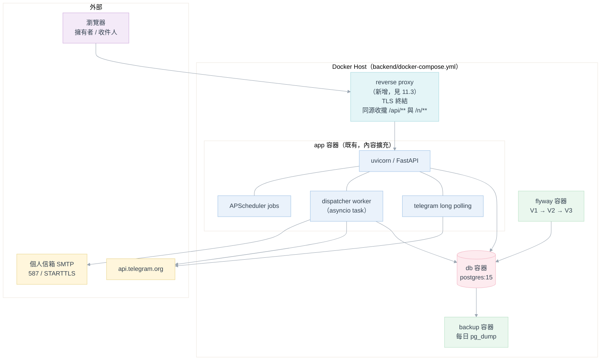

### 11.2 遷移與上線步驟

| 步驟 | 動作 | 可回復性 |
|---|---|---|
| 1 | 產生 `NOTIFY_SECRET_KEY` 並填入 `.env`；設定 `OWNER_PASSWORD_HASH` | — |
| 2 | `docker compose up -d`，Flyway 自動套用 `V3`（**只新增表，不動既有表**） | `V3` 全為 `CREATE TABLE`，回復即 drop 這 15 張表 |
| 3 | 首次啟動時 `templating.seed_templates()` 把 `notify/templates/*.j2` 種入 DB（`ON CONFLICT DO NOTHING`，不覆蓋管理者已編輯的內容） | 可重跑 |
| 4 | 登入管理介面 → 管道設定填入 SMTP 與 Bot Token → 連線測試 | — |
| 5 | 建立收件人與端點 → 完成驗證／綁定 → 測試發送 | — |
| 6 | `NOTIFY_DRY_RUN=true` 跑一次 `POST /alerts/scan` 觀察訊息單產出，確認無誤後改 `false` | 直接改 `.env` |

> **`V3` 對既有系統零侵入**：不修改 `symbols`／`daily_stock_data`／`crawler_logs`／
> `market_no_trading_days` 任何一張表，因此即使通知平台整個關掉，既有資料流完全不受影響。

### 11.3 反向代理需求（新增基礎設施）

自助連結採 Cookie 授權（ADR-09），因此**前端與 API 必須同源**。部署時需以反向代理把
`/api/**`、`/n/**` 與前端靜態檔收攏在同一網域，並設定：

| 設定 | 值 | 理由 |
|---|---|---|
| TLS | 必要 | `Secure` Cookie 與 NFR-23 |
| access log | 過濾 `/n/s/` 開頭的路徑（改記為 `/n/s/[REDACTED]`） | NFR-23：token 不得寫入存取紀錄 |
| `Referrer-Policy` | `no-referrer`（`/n/**` 路徑） | 防 token 經 Referer 外洩 |
| `X-Robots-Tag` | `noindex, nofollow`（`/n/**`） | 防搜尋引擎索引 |
| `Cache-Control` | `no-store, private`（`/n/**`、`/api/v1/notify/**`） | 防共用快取 |

> 若初期在區網內以 HTTP 執行，`Secure` Cookie 會失效。此情況下**必須**把
> `NOTIFY_ALLOW_INSECURE_COOKIE=true` 明確開啟，且系統於啟動時記一則 `logger.warning`，
> 避免在不知情的狀況下降級安全性。

### 11.4 監控與維運

| 面向 | 作法 |
|---|---|
| 健康檢查 | 既有 `GET /health` 擴充 `notify` 區塊：worker 是否存活、待發訊息數、最舊待發訊息年齡、各管道狀態 |
| 告警 | 管道熔斷、端點自動停用、Email 預算達標 → `SYSTEM_HEALTH` 事件（走已授權備援端點） |
| 積壓觀察 | `GET /stats` 回傳 `queue_depth` 與 `oldest_pending_age_sec`；積壓持續成長即代表管道有問題 |
| 備份 | 沿用既有 `backup` 容器的 `pg_dump`；`notify_*` 表隨之納入。**`NOTIFY_SECRET_KEY` 需另行備份**——遺失即無法解密管道憑證（須重新填寫設定，不影響其他資料） |
| 日誌 | 統一用既有 `logger = logging.getLogger("mystock-backend")`，訊息前綴 `[通知]` 以利篩選 |

---

## 12. 開發階段與工作分解

### 12.1 階段時程

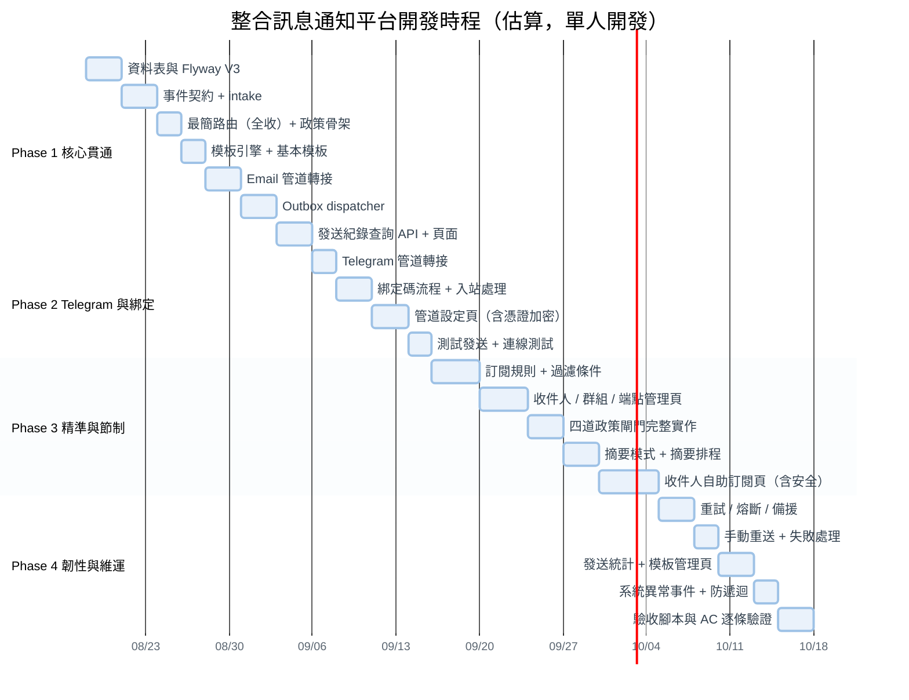

### 12.2 Phase 1：核心貫通（打通「事件 → 訊息 → 送達」）

| 交付項目 | 檔案 | 完成判準 |
|---|---|---|
| 資料表 | `db/migration/V3__*.sql`、`db/notify_models.py` | `docker compose up` 後 15 張表建立完成 |
| 資料存取 | `repositories/notify_repository.py` | 涵蓋 event/message/log 的 CRUD |
| 事件契約 | `notify/events.py`、`notify/intake.py` | `POST /api/v1/notify/events` 可注入事件並落地 |
| 最簡路由 | `notify/routing.py` | 支援單一「全收」規則 |
| 政策骨架 | `notify/policy.py` | 只實作閘門 0（端點可用）與閘門 1（去重） |
| 模板 | `notify/templating.py`、`composer.py`、`templates/*.j2` | `__default__` 回退可運作 |
| Email 管道 | `notify/channels/base.py`、`email_channel.py` | 真的能寄出一封信 |
| 派送 | `notify/dispatcher.py` | 重啟後未送完的訊息會續送 |
| 紀錄 | `api/v1/endpoints/notify_admin.py`、`views/notify/DeliveryLogs.vue` | 可查詢當日發送結果 |
| 接縫 | `services/scheduler.py` `_publish_after_scan()` | **AC-15：拔掉 DB 後跑排程，掃描仍正常完成** |

> **階段目標（對應需求 §13）**：盤後掃描完成後，能收到一封含當日訊號的 Email。

### 12.3 Phase 2～4 的關鍵交付

| 階段 | 關鍵交付 | 完成判準（對應 AC） |
|---|---|---|
| **Phase 2** | Telegram 轉接、綁定碼、管道設定頁、憑證加密、測試發送 | AC-03：新 Telegram 帳號不改設定檔即可綁定收訊 |
| **Phase 3** | 完整過濾條件、收件人／群組／端點管理、四道閘門、摘要、**自助訂閱頁** | AC-05／06／07／08／09／10／11、AC-20～25 |
| **Phase 4** | 重試、熔斷、備援、手動重送、統計、模板管理頁、系統異常防遞迴 | AC-13／14、AC-26／28、AC-31／32 |

### 12.4 驗收輔助腳本

| 腳本 | 用途 |
|---|---|
| `scripts/notify_seed_demo.py` | 建立示範收件人、群組、端點與六條訂閱規則（對齊原型 `shared.js` 的 mock 資料），讓 UI 一開就有東西看 |
| `scripts/notify_smoke_test.py` | `--latency` 量測 NFR-04 的 P95；`--load` 灌 1,000 事件驗 NFR-06；`--ac <編號>` 逐條跑 AC 驗收 |

### 12.5 明確延後的項目（Phase 5 以後）

| 項目 | 原因 | 觸發條件 |
|---|---|---|
| 獨立心跳檢查者 | 首版無法偵測「服務整個停止」（Q-13） | 需要偵測服務停機時 |
| dispatcher 拆為獨立進程 + 分散式速率控制 | 目前單進程已足夠 | 訊息量超過每日數千則 |
| LINE／Discord／Slack 管道 | 需求 §3.2 已排除 | 有實際需要時，依 §4.3 四步驟加入 |
| 雙向互動指令 | Q-10 決議列入 Phase 5 | — |
| 記帳模組事件串接 | 該模組尚未開發 | 記帳模組上線後 |

---

## 13. 驗收條件實作對照

| AC | 驗證方式 | 依賴的實作 |
|---|---|---|
| AC-01 | `POST /alerts/scan` 後檢查 Email 與 Telegram 皆收到 | §4.7 dispatcher |
| AC-02 | 服務執行中新增信箱並驗證，下次事件即收到 | 端點為純資料（§5.1） |
| AC-03 | 綁定碼流程 | §7.4 |
| AC-04 | 建多端點，確認每個端點都收到 | 路由展開（§4.4） |
| AC-05 | 規則設「只收賣出強訊號」 | `MATCHER_REGISTRY` |
| AC-06 | 同日重複掃描 | `uq_notify_message_dedup`（§5.3） |
| AC-07 | 靜音時段觸發一般事件 → 靜音結束後**逐則**送出，且未轉摘要 | 閘門 3 只設 `scheduled_at`（§4.5） |
| AC-08 | 靜音時段觸發 `FETCH_FAILED` → 立即送達 | `severity=critical` 跳過閘門 2/3/4 |
| AC-09 | 超過 `daily_limit` 的部分併入摘要 | `notify_quota_usage` |
| AC-10 | 摘要模式於指定時間收到一則彙整 | `digest.tick()`（§8.3） |
| AC-11 | 無訊號日不收到空摘要 | `HAS` 分支（§8.3） |
| AC-12 | 停用 Email 後 Telegram 仍正常 | 取件依 `channel_code` 過濾 |
| AC-13 | 模擬管道暫時不可用 | `NOTIFY_DRY_RUN` + 注入失敗；退避 60/300/1800 |
| AC-14 | 紀錄頁找到失敗項目並重送 | `POST /messages/{code}/resend` |
| AC-15 | 所有管道失效後跑排程，資料仍正常寫入 | 接縫 try/except（§3.2） |
| AC-16 | 檢視介面、紀錄、匯出無明文憑證與自助 token | §7.1、§7.2 |
| AC-17 | 收件人自行退訂 → 立即停止 | 閘門 0 |
| AC-18 | 訊息含免責聲明與回系統連結 | composer 強制附加（§4.6） |
| AC-19 | 撰寫「新增第三管道」步驟，確認不涉及路由與政策 | §4.3 四步驟表 |
| AC-20 | 由訊息連結進入自助頁，免帳密 | §7.2 |
| AC-21 | 用 A 的連結看不到 B；token 竄改／截短／撤銷後皆不可存取 | 摘要比對 + 統一 401 |
| AC-22 | 自助頁改設定 → 下次發送套用 | 偏好於閘門 0 讀取，無快取 |
| AC-23 | 暫停 1 天，期間不送、到期自動恢復 | `skipped_paused` + 恢復排程 |
| AC-24 | 嘗試訂閱未指派內容 → 拒絕 | `PreferenceWideningException` |
| AC-25 | 撤銷重產後舊連結失效 | 唯一索引 + `status='revoked'` |
| AC-26 | Email 預算達標 → 只走已授權備援；無備援則記錄失敗並告警 | `QUOTA_EXCEEDED` + §4.8 |
| AC-27 | 新端點預設即時收 strong＋moderate，weak 僅在摘要 | `NOTIFY_DEFAULT_STRENGTHS` |
| AC-28 | 停用所有管道並讓 `SYSTEM_HEALTH` 失敗 → 事件數量穩定 | §4.10 |
| AC-29 | 共用群組端點訊息不含個人管理連結 | §4.6 `manage_url = None` |
| AC-30 | 未授權請求直呼管理 API → 被擋 | `require_owner`（§7.3） |
| AC-31 | 100 則事件，95% 於 3 分鐘內首發 | `notify_smoke_test.py --latency` |
| AC-32 | 重啟後處理續行且不重複 | Outbox + 卡單回收 + 唯一索引 |

---

## 14. 需求追溯矩陣

| 需求群 | 主要實作位置 |
|---|---|
| FR-EV-01～07 | `notify/events.py`、`notify/intake.py`、`services/scheduler.py`（接縫） |
| FR-RT-01～08 | `notify/routing.py`、`notify_subscription` 表、`POST /subscriptions/preview` |
| FR-PL-01～09 | `notify/policy.py`、`notify_quota_usage`、`uq_notify_message_dedup` |
| FR-MC-01～07 | `notify/composer.py`、`notify/templating.py`、`notify_template` 表 |
| FR-DP-01～08 | `notify/dispatcher.py`、`notify/channels/`、`notify_message` 的重試欄位 |
| FR-RC-01～10 | `notify/recipients.py`、`notify_endpoint`（含 `endpoint_scope`／`fallback_endpoint_id`） |
| FR-BD-01～07 | `notify/binding.py`、`notify/telegram_bot.py`、`notify_binding_token` |
| FR-LG-01～07 | `repositories/notify_repository.py`、`notify_delivery_log`、`DeliveryLogs.vue` |
| FR-CH-01～06 | `notify/channel_config.py`、`ChannelSettings.vue` |
| FR-SS-01～14 | `notify/selfservice.py`、`api/v1/endpoints/notify_self.py`、`SelfService.vue`、`notify_self_service_token` |
| FR-AU-01～03 | `notify/security.py`、`notify_admin_audit` |
| NFR-01～23 | 見 §7.5 逐條對照表 |
| 鐵則 R1～R8 | 見 §3.2 逐條對照表 |

---

## 15. 原型落差與修正清單

檢視 `prototype/` 後，發現以下與需求規格書不一致或缺漏之處。**標記為「已修正」者已直接改動原型檔案**；
其餘為開發時須注意的實作差異。

### 15.1 已修正的規格違反

| 編號 | 問題 | 違反的需求 | 修正內容 |
|---|---|---|---|
| **PT-01** | `STATUS_META.sent` 標示為「已送達」，發送紀錄 KPI 稱「送達率」 | §M7「`sent` 代表外部管道已接受發送請求，不等同已進收件匣；介面不得將 `sent` 誤稱為已讀」 | `shared.js` 改為「已送出」；`logs.html` KPI 改為「送出成功率」，並加註說明 |
| **PT-02** | 「家庭群組」端點掛在收件人「家人 A」名下，且該收件人卡片底部顯示個人自助連結 | FR-RC-09、§M8「共用端點不屬於任何單一收件人」、RK-10「共用群組訊息不得洩漏個人自助連結」 | `shared.js` 把群組端點抽離為獨立的 `MOCK_SHARED_ENDPOINTS`；`recipients.html` 新增「共用端點（系統擁有者管理）」區塊，且該區塊**不顯示自助連結** |
| **PT-03** | 端點暫停中的訊息標為 `deferred`（延後） | §M13「暫停期間的訊息不發送、**不於恢復後補送**，狀態標記為 `skipped_paused`」；`deferred` 語意是「稍後仍會送」 | `shared.js` 新增 `skipped_paused` 狀態（標籤「暫停略過」），並修正該筆 mock 資料 |
| **PT-04** | 自助連結以明文完整顯示在收件人列表中，且格式可預測（`rcp-001-a7f3d9e2c1b4`） | FR-SS-14「不得以可直接使用的明文保存」、NFR-19「不可被猜測」 | `recipients.html` 改為顯示遮蔽值＋「已於 YYYY-MM-DD 產生」，明文僅在「撤銷重產」後的對話框中出現一次 |
| **PT-05** | 端點偏好未呈現「備援端點」 | FR-RC-10、FR-DP-08、NFR-21（Email 預算達標時只能走**已授權**備援） | `recipients.html` 端點列加上備援端點標示；`shared.js` mock 資料補 `fallback` 欄位 |
| **PT-06** | 缺少需求 §12.1 ④「訊息模板」頁（原型只有唯讀的「訊息外觀預覽」） | §12.1、§12.2、FR-MC-07、鐵則 R4「文案調整不應牽動任何流程」 | 新增 [prototype/templates.html](prototype/templates.html)：模板矩陣、模板編輯、可用變數說明、範例預覽；並加入導覽列與首頁 |
| **PT-07** | 自助頁「我的收件方式」列出「家庭群組」共用端點 | 與 PT-02 同源：共用端點不屬於任何收件人，不得出現在個人自助頁 | `my-subscription.html` 改為個人對話端點，並加註共用端點由系統擁有者管理 |
| **PT-08** | `MOCK_LOGS` 中 weak 訊號被標為 `throttled`（超量轉摘要），且缺少真正的超量與靜音案例 | `throttled` 的規格語意是「超過每日上限」；weak 不即時推送是**訂閱條件／個人偏好**造成，兩者不可混用（否則統計失真） | weak 該筆改為 `digested`；另補上真正的「已達每日上限」與「靜音延後」兩筆示例，讓四道閘門在紀錄頁都看得到 |

> 檢視原型時另確認：單一端點退訂（「停止此管道」）**原型本已具備**，符合 FR-SS-07，無需修正。

### 15.2 待開發時處理的落差（原型不修改）

| 編號 | 問題 | 說明 |
|---|---|---|
| **PT-09** | 原型無管理端登入畫面 | 原型定位是 UI 流程驗證，登入不影響版面評估。開發時依 §7.3 加 `OwnerLogin.vue`，並於 `router.beforeEach` 導向 |
| **PT-10** | 自助頁的接收節奏（模式／靜音／上限）是**全域一組**，但規格是**每端點**可獨立設定 | FR-RC-06／FR-SS-05 要求逐端點。開發時 `SelfService.vue` 需把節奏設定收進「我的收件方式」每一列的展開區；原型維持單組以保持畫面簡潔，**已於該卡片加註說明** |
| **PT-11** | 未指派項目採「灰化 + 鎖頭」而非隱藏 | 需求 §12.2 寫「不可調整的項目應直接隱藏而非顯示為停用」。**本文件刻意偏離**：完全隱藏會讓收件人不知道還有可洽詢的選項，反而增加溝通成本；灰化並附「請洽系統擁有者」說明較符合實際使用。**此偏離須經需求方確認**（見 §15.3 DEV-01） |
| **PT-12** | 原型未呈現 critical 事件的雙軌發送（Email ＋ Telegram 同時） | §15.3 Q-01 配套要求。開發時由訂閱規則設定達成，UI 上無需特別元件 |

### 15.3 需請需求方確認的偏離

| 編號 | 偏離內容 | 本文件的建議 | 決策狀態 |
|---|---|---|---|
| **DEV-01** | 需求 §12.2 要求自助頁「不可調整的項目直接隱藏」，本文件建議改為「灰化 + 鎖頭 + 說明」（PT-10） | 建議採灰化。若需求方堅持隱藏，改動範圍僅 `SelfService.vue` 一處條件判斷 | ✅ **已確認採灰化**（2026-08-15） |
| **DEV-02** | 需求 §M7 狀態清單未區分「摘要模式暫存」與「超量轉摘要」，本文件新增 `digest_pending` 實體狀態（§8.4） | 建議採納；使用者介面不受影響，只影響統計正確性 | 待確認 |
| **DEV-03** | 需求 §9.1 有 `DIGEST_SCHEDULE` 獨立實體，本文件併入 `notify_endpoint`（§5.2） | 建議採納；若未來需要「一個端點多組摘要時間」再拆表 | 待確認 |
| **DEV-04** | Q-13 心跳檢查者：首版**不提供**，因此不宣稱可偵測「排程未執行／服務停止」（§8.2） | 建議接受，並於管理介面明確標示偵測範圍，避免誤以為有全面監控 | ✅ **已確認接受**（2026-08-15） |
| **DEV-05** | 自助連結需同源部署（反向代理），屬新增基礎設施需求（§11.3） | 若暫時無法提供 HTTPS 網域，需明確接受 `NOTIFY_ALLOW_INSECURE_COOKIE=true` 的降級風險 | ✅ **已確認採反向代理同源部署**（2026-08-15） |

> DEV-02、DEV-03 為內部實作細節（不影響使用者操作與畫面），本文件建議直接採納；如需求方無異議，開發時逕行依 §8.4／§5.2 實作。

---

## 16. 附錄

### 16.1 事件 payload 範例（`ALERT_SIGNAL`）

直接沿用 `alert_repository.append_alerts()` 的回傳結構，**不要求掃描器多帶欄位**：

```json
{
  "event_type": "ALERT_SIGNAL",
  "severity": "info",
  "source": "scanner",
  "occurred_at": "2026-08-14T14:32:05+08:00",
  "source_event_key": "alert:tw:2330:price_cross_ma:cross_under_MA20:2026-08-14",
  "payload": {
    "id": "alert-20260814-2330-001",
    "stock_id": "2330",
    "stock_name": "台積電",
    "market": "tw",
    "strategy_id": "price_cross_ma",
    "strategy_name": "收盤價突破/跌破關鍵均線",
    "direction": "cross_under_MA20",
    "signal_type": "SELL",
    "signal_strength": "moderate",
    "trade_date": "2026-08-14",
    "details": { "close": 1085, "ma_period": 20, "ma_value": 1102.5, "bias_percent": -1.59 },
    "filters_passed": ["volume_confirm"],
    "suggested_action": "跌破 MA20，建議減碼或設定停損觀察"
  }
}
```

`routing_facts` 為平台擷取後的比對快照（`strategy_category` 由 `strategies.yaml` 反查，見 §4.4）：

```json
{
  "market": "tw",
  "strategy_id": "price_cross_ma",
  "strategy_category": "technical",
  "signal_type": "SELL",
  "signal_strength": "moderate",
  "stock_id": "2330",
  "severity": "info"
}
```

### 16.2 模板範例

**`alert_signal.telegram.j2`**（對應需求 §16.1）：

```jinja
{{ emoji }}【{{ signal_label }}】{{ stock_id }} {{ stock_name }}
策略：{{ strategy_name }}
強度：{{ strength_label }}（通過 {{ filters_passed | join('、') }}）
交易日：{{ trade_date }}
收盤 {{ details.close }}　MA{{ details.ma_period }} {{ details.ma_value }}　乖離 {{ details.bias_percent }}%
參考動作：{{ suggested_action }}
▸ {{ chart_url }}　▸ 管理我的通知 {{ manage_url }}
{{ disclaimer }}
```

| 變數 | 來源 | 備註 |
|---|---|---|
| `emoji`、`signal_label`、`strength_label` | composer 依 `signal_type`／`signal_strength` 對照 | 不由模板寫死判斷式 |
| `chart_url` | `PUBLIC_BASE_URL` + `/stock/{market}/{stock_id}` | FR-MC-04 |
| `manage_url` | **僅個人端點有值**；共用端點為 `None`，整段不輸出 | FR-SS-01、AC-29 |
| `disclaimer` | composer 強制附加，模板不可省略 | FR-MC-05、NFR-17 |

### 16.3 `__default__` 回退模板

R5 的最後防線，任何事件類型 × 任何管道都能渲染：

```jinja
【{{ event_type_label }}】{{ title | default(event_type) }}
發生時間：{{ occurred_at }}
{{ key }}：{{ value }}

{{ disclaimer }}
```

### 16.4 新增管道檢查清單（AC-19 用）

- [ ] 新增 `notify/channels/<name>_channel.py`，實作 `send`／`health_check`／`normalize_address`／`classify_failure`
- [ ] 宣告 `Capability`（是否支援標題、排版、連結按鈕、長度上限）
- [ ] 於 `notify/channels/__init__.py` 加一行 import
- [ ] 於 `notify/templates/` 補該管道模板（可先不補，會自動回退 `__default__`）
- [ ] 管理介面「管道設定」填入設定並通過連線測試
- [ ] 為既有收件人新增該管道端點並完成驗證
- [ ] **確認 `git diff` 未觸及 `routing.py`、`policy.py`、`dispatcher.py`、`notify_repository.py`**

---

**文件結束**
