# 整合訊息通知平台 需求規格書

**模組**：整合訊息通知平台（Unified Notification Platform）
**版本**：v1.2
**日期**：2026-08-15
**狀態**：需求確認中（Q-01／Q-03／Q-05 已確認，見 §15.2）

**版本紀錄**

| 版本 | 日期 | 變更摘要 |
|---|---|---|
| v1.0 | 2026-08-15 | 初版：功能規劃、模組分析、流程圖 |
| v1.1 | 2026-08-15 | 確認 Email 採個人信箱寄送（Q-01）、預設推送 strong＋moderate（Q-03）、<br/>新增收件人自助訂閱管理（Q-05）→ 新增 M13 模組、FR-SS 需求群、§8.7 流程、自助設定頁 |
| v1.2 | 2026-08-15 | 補強事件冪等、共用群組端點、自助連結安全、管理端授權、摘要與靜音語意、<br/>失敗告警防遞迴、跨管道備援、邏輯資料實體及可量測驗收標準 |

> **文件性質說明**
> 本文件為**功能需求規格書**，聚焦於「功能規劃」與「模組分析」，不涉及技術選型、程式架構、
> 資料庫語法或實作細節。文中所有「模組」皆指**邏輯功能模組**，而非程式檔案或套件。
> 文中的資料實體僅描述「系統必須記得哪些資訊」，不規範儲存方式。

---

## 目錄

| 章節 | 內容 |
|---|---|
| 1 | 背景與目標 |
| 2 | 名詞定義 |
| 3 | 需求範圍 |
| 4 | 使用者角色與使用情境 |
| 5 | 系統定位與整體架構 |
| 6 | 模組分析 |
| 7 | 功能需求明細 |
| 8 | 流程圖 |
| 9 | 邏輯資料需求 |
| 10 | 擴充性設計原則 |
| 11 | 非功能需求 |
| 12 | 管理介面規劃 |
| 13 | 開發階段規劃 |
| 14 | 驗收條件 |
| 15 | 風險、已確認決策與待確認事項 |
| 16 | 附錄：訊息內容範例 |

---

## 1. 背景與目標

### 1.1 背景

現行 MyStock 系統已具備完整的**策略警示引擎**：每日盤後（台股 14:30、美股 06:00）自動執行
爬蟲與策略掃描，產出技術面／籌碼面／基本面的買賣警示訊號，並寫入警示紀錄。

然而目前警示訊號**僅能透過前端「警示看板」頁面被動查看**，存在以下痛點：

| 痛點 | 說明 |
|---|---|
| **必須主動開啟系統才知道有訊號** | 訊號在盤後產生，若當天沒有登入系統就會錯過 |
| **無即時性** | 買賣訊號具時效性，隔日才看到可能已錯過進出場點 |
| **無法分享** | 無法讓家人／同好同步收到相同的訊號通知 |
| **系統異常無感** | 爬蟲失敗、資料缺漏時沒有任何主動告知，可能持續數日未被發現 |
| **通知管道零散** | 若日後要加 Email、Telegram、LINE，各自實作會造成邏輯重複與難以維護 |

### 1.2 專案目標

建立一個**與訊息管道解耦的整合訊息通知平台**，達成以下目標：

| 編號 | 目標 | 說明 |
|---|---|---|
| G1 | **主動推播** | 系統產生的警示與異常，主動推送到使用者手上，不需登入系統 |
| G2 | **多管道整合** | 同一則訊息可同時／擇一送往 Email 與即時通訊軟體 |
| G3 | **管道可擴充** | 未來新增 LINE、Discord、Slack 等管道時，不需改動事件產生端與路由邏輯 |
| G4 | **收件人可擴充** | 可隨時新增／停用 Email 信箱與即時通訊帳號，不需修改設定檔或重啟系統 |
| G5 | **精準訂閱** | 可依市場、策略、訊號強度等條件決定「什麼訊息送給誰、送到哪個管道」 |
| G6 | **不洗版** | 具備去重、頻率上限、靜音時段、每日摘要等機制，避免通知疲勞 |
| G7 | **可追溯** | 每一則發送都有完整紀錄與狀態，失敗可查、可重送 |

### 1.3 初期範圍決策

依需求方指示，**第一階段僅開發 Email 與 Telegram 兩個管道**，
其餘管道（LINE、Discord、Slack、簡訊、Webhook 等）**於未來有需要時再加掛**。

因此本規格的核心設計要求是：**「初期只做兩個管道，但架構上必須讓第三個管道以純新增的方式加入」**。

---

## 2. 名詞定義

| 名詞 | 英文 | 定義 |
|---|---|---|
| **事件** | Event | 系統中值得通知的一件事。例如「0050 跌破 MA20」「台股爬蟲失敗」 |
| **事件類型** | Event Type | 事件的分類代碼，決定它可以被誰訂閱、用哪個模板呈現 |
| **管道** | Channel | 訊息傳遞的媒介類別。例如 Email、Telegram |
| **收件端點** | Endpoint | 管道下的一個具體收件位置。例如某個 Email 信箱、某個 Telegram 對話 |
| **收件人** | Recipient | 一個真實的人，底下可掛多個不同管道的收件端點 |
| **收件群組** | Recipient Group | 收件人的集合，方便訂閱規則一次指定多人。例如「本人」「家人」 |
| **訂閱規則** | Subscription Rule | 定義「哪些事件」在「什麼條件下」要送給「哪些收件端點」 |
| **訊息模板** | Template | 將事件資料轉換成可讀訊息文字的格式定義，依管道各有一份 |
| **訊息單** | Message | 事件經路由與模板組裝後，針對「某一個收件端點」產生的一筆待發送訊息 |
| **投遞紀錄** | Delivery Log | 訊息單每一次發送嘗試的結果紀錄 |
| **冪等鍵** | Idempotency Key | 由事件業務內容形成的穩定識別；相同業務事件即使被重新接收，仍具有相同冪等鍵 |
| **靜音時段** | Quiet Hours | 不打擾時段，此期間內的非緊急訊息延後或改以摘要發送 |
| **摘要** | Digest | 將一段時間內多則訊息合併為一則彙整訊息 |
| **綁定** | Binding | 使用者將自己的即時通訊帳號與本系統關聯的動作 |

---

## 3. 需求範圍

### 3.1 首版完整交付範圍（Release 1）

> 本節的 Release 1 是首版最終應具備的完整能力；第 13 章的 Phase 1～4 是 Release 1 內部的
> 漸進交付階段，兩者不可混用。

| 項目 | 範圍 |
|---|---|
| **管道** | Email、Telegram（兩者皆為必要，可獨立啟用／停用） |
| **事件來源** | 策略警示訊號、每日警示摘要、爬蟲執行結果、系統異常 |
| **收件人管理** | 新增／編輯／停用 Email 信箱；Telegram 個人對話綁定與解除綁定；共用群組端點由系統擁有者管理 |
| **訂閱規則** | 依市場、策略、訊號類型、訊號強度、股票清單過濾 |
| **通知政策** | 去重、頻率上限、靜音時段、即時／摘要模式 |
| **管理介面** | 通知設定頁（管道、收件人、訂閱規則、模板預覽、發送紀錄） |
| **自助訂閱管理** | 收件人可透過訊息中的專屬連結，自行調整訂閱範圍、發送模式、靜音時段、暫停與退訂 |
| **可靠性** | 發送失敗自動重試、失敗紀錄查詢、手動重送、失敗告警防遞迴 |

### 3.2 未來擴充範圍（Phase 2 以後，本次不開發但架構須預留）

| 項目 | 說明 |
|---|---|
| LINE 通知管道 | 以新增管道的方式加入，不改動既有邏輯 |
| Discord / Slack / Webhook | 同上 |
| 簡訊（SMS） | 同上 |
| 手機 App 推播 | 同上 |
| 雙向互動指令 | 在 Telegram 中直接輸入指令查詢股價、暫停通知等 |
| 記帳模組事件 | 與「個人投資記帳功能」模組串接（如停損提醒、配息入帳提醒） |
| 多使用者權限 | 目前為單人自用，未來若開放多人需加上權限隔離 |

### 3.3 不在範圍內

| 項目 | 原因 |
|---|---|
| 策略邏輯的修改 | 本模組只負責「送出」既有引擎產生的訊號，不改變訊號如何產生 |
| 訊號品質的判斷 | 訊號是否準確由策略模組負責，通知平台不做二次判斷 |
| 下單 / 交易執行 | 本系統定位為資訊輔助，不涉及任何實際交易行為 |
| 投資建議產生 | 訊息內容僅呈現既有訊號與客觀數值，不新增投資建議語句 |

---

## 4. 使用者角色與使用情境

### 4.1 角色定義

| 角色 | 說明 | 主要需求 |
|---|---|---|
| **系統擁有者（本人）** | 系統管理者兼主要使用者 | 設定管道、管理收件人、調整訂閱規則、查看發送紀錄 |
| **一般收件人** | 被加入通知名單的家人／同好 | 收到訊息；**自行管理個人訂閱範圍、發送節奏、暫停與退訂**，不需麻煩系統擁有者 |
| **系統本身（排程）** | 自動觸發者 | 盤後掃描完成後自動送出通知 |

### 4.2 使用情境（Use Case）

| 編號 | 情境名稱 | 角色 | 描述 |
|---|---|---|---|
| UC-01 | 收到即時警示 | 一般收件人 | 台股盤後掃描完成，2330 觸發「跌破 MA20」，使用者的 Telegram 立即收到訊息 |
| UC-02 | 收到每日摘要 | 一般收件人 | 每日收盤後收到一封 Email，彙整當日所有觸發的訊號 |
| UC-03 | 新增一個 Email 收件人 | 系統擁有者 | 在設定頁輸入家人的信箱，系統寄出驗證信，對方點擊確認後生效 |
| UC-04 | 綁定 Telegram 帳號 | 一般收件人 | 系統擁有者產生綁定碼，收件人在 Telegram 對機器人送出綁定碼即完成綁定 |
| UC-05 | 只想收強訊號 | 一般收件人 | 設定訂閱規則為「僅訊號強度＝strong」，弱訊號不再打擾 |
| UC-06 | 只關注自選股 | 系統擁有者 | 設定訂閱規則限定股票清單，只有名單內個股觸發時才通知 |
| UC-07 | 夜間免打擾 | 一般收件人 | 設定 22:00–08:00 為靜音時段，期間訊息延後至隔日一併送出 |
| UC-08 | 爬蟲失敗告警 | 系統擁有者 | 當日爬蟲異常，系統立即發送高優先訊息（不受靜音時段限制） |
| UC-09 | 測試發送 | 系統擁有者 | 新增管道或收件端點後，按下「測試發送」確認設定正確 |
| UC-10 | 查詢發送紀錄 | 系統擁有者 | 查詢某日所有發送結果，找出失敗項目並手動重送 |
| UC-11 | 暫時停用某管道 | 系統擁有者 | Email 額度用盡時，一鍵停用 Email 管道，訊息只走 Telegram |
| UC-12 | 加入新管道（未來） | 系統擁有者 | 未來啟用 LINE 時，只需新增管道設定與模板，既有訂閱規則沿用 |
| UC-13 | **自行調整訂閱範圍** | 一般收件人 | 點擊訊息中的「管理我的通知」連結，開啟個人設定頁，自行改為只收台股強訊號 |
| UC-14 | **自行暫停通知** | 一般收件人 | 出國期間自行設定「暫停 7 天」，到期自動恢復，不需請系統擁有者處理 |
| UC-15 | **自行退訂** | 一般收件人 | 不想再收到任何通知，於個人設定頁一鍵退訂所有端點 |

---

## 5. 系統定位與整體架構

### 5.1 系統定位圖（Context Diagram）

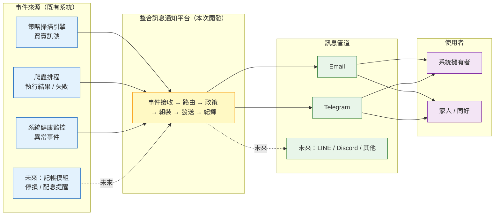

### 5.2 設計核心理念

整個平台建立在三層解耦之上，這是「可擴充彈性」的來源：

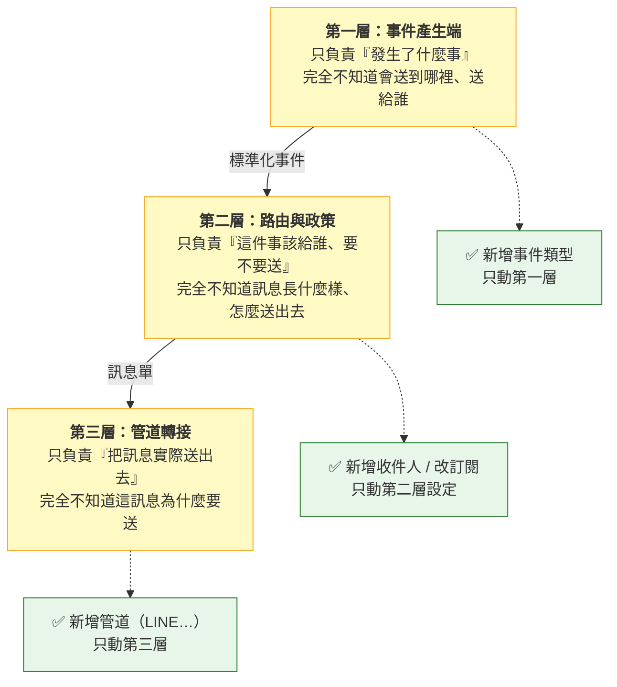

**三個「不知道」是本規格最重要的約束**：

| 約束 | 說明 | 違反的後果 |
|---|---|---|
| 事件產生端**不得指定管道** | 策略引擎只能說「2330 跌破 MA20」，不能說「用 Telegram 送給某某」 | 每加一個管道就要改策略引擎 |
| 路由層**不得知道管道細節** | 路由只輸出「這則訊息要給端點 X」，不處理各管道的格式差異 | 路由邏輯會被各管道特例污染 |
| 管道層**不得反查事件語意** | 管道只拿到組裝好的訊息文字與收件位置，直接送出 | 新增管道時要重新理解所有事件類型 |

---

## 6. 模組分析

### 6.1 模組關聯圖

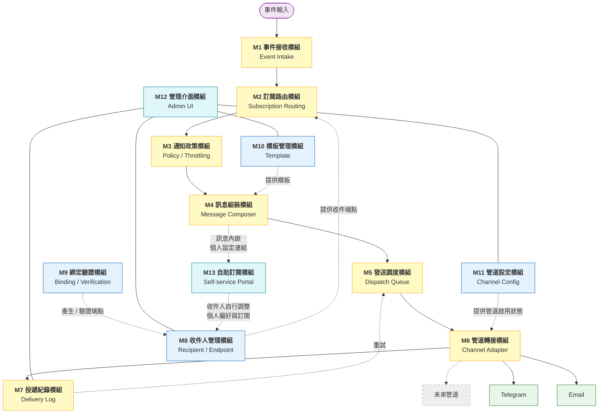

### 6.2 模組職責總表

| 模組 | 名稱 | 核心職責 | 輸入 | 輸出 |
|---|---|---|---|---|
| **M1** | 事件接收 | 接收各來源事件，轉為統一格式並驗證必要欄位 | 各來源的原始事件 | 標準化事件 |
| **M2** | 訂閱路由 | 比對訂閱規則，決定這個事件要送給哪些收件端點 | 標準化事件 | 收件端點清單 |
| **M3** | 通知政策 | 去重、頻率上限、靜音時段、即時／摘要判定 | 事件＋端點清單 | 允許發送的端點清單／延後排程 |
| **M4** | 訊息組裝 | 套用對應管道的模板，產出實際訊息內容 | 事件＋端點＋模板 | 訊息單 |
| **M5** | 發送調度 | 排入待發佇列、控制發送順序與重試排程 | 訊息單 | 依序交付管道 |
| **M6** | 管道轉接 | 依管道類型執行實際發送，回報成功／失敗 | 訊息單 | 發送結果 |
| **M7** | 投遞紀錄 | 記錄每次發送嘗試、狀態與失敗原因，供查詢與重送 | 發送結果 | 紀錄與統計 |
| **M8** | 收件人管理 | 維護收件人、收件端點、收件群組 | 管理操作 | 收件端點資料 |
| **M9** | 綁定驗證 | Email 驗證信流程、Telegram 綁定碼流程 | 使用者操作 | 已驗證的收件端點 |
| **M10** | 模板管理 | 維護「事件類型 × 管道」的訊息模板與預覽 | 管理操作 | 模板內容 |
| **M11** | 管道設定 | 維護各管道的啟用狀態與必要設定、健康檢查 | 管理操作 | 管道可用性 |
| **M12** | 管理介面 | 提供上述設定與查詢的操作畫面 | 使用者操作 | 畫面呈現 |
| **M13** | 自助訂閱 | 讓收件人以專屬連結自行管理個人訂閱、節奏、暫停與退訂 | 收件人操作 | 更新後的個人偏好 |

### 6.3 各模組詳細分析

#### M1 事件接收模組

| 項目 | 內容 |
|---|---|
| **目的** | 成為所有事件進入通知平台的**唯一入口**，確保後續模組看到的格式一致 |
| **主要功能** | ① 接收事件<br/>② 補齊必要欄位（事件識別碼、冪等鍵、發生時間、來源、嚴重度）<br/>③ 欄位完整性驗證，不合格事件記錄並丟棄<br/>④ 為每次接收產生全域唯一事件識別碼，並保留來源提供或依業務欄位計算的穩定冪等鍵 |
| **關鍵規則** | 事件產生端**只描述事實**，不得指定管道、收件人或訊息文字 |
| **擴充點** | 新增事件來源時，只需定義新的「事件類型」與其資料欄位，其他模組無須改動 |

**識別與冪等規則：**

| 項目 | 規則 |
|---|---|
| 事件識別碼 | 每次成功接收產生新的全域唯一值，用於追蹤單次處理流程 |
| 來源事件鍵 | 事件來源若已有穩定識別鍵，應原樣提供；通知平台不得以隨機值取代 |
| 冪等鍵 | 優先採來源事件鍵；無來源事件鍵時，由事件類型定義的業務欄位組合計算 |
| `ALERT_SIGNAL` 範例 | 市場＋股票代號＋策略識別碼＋方向＋交易日 |
| 去重用途 | 同一冪等鍵即使因重新掃描或重送而以不同事件識別碼進入，對同一端點仍只可形成一則有效通知 |

**Phase 1 支援的事件類型：**

| 事件類型代碼 | 名稱 | 嚴重度 | 觸發時機 | 主要內容 |
|---|---|---|---|---|
| `ALERT_SIGNAL` | 策略警示訊號 | info / warning | 盤後掃描產出新訊號時，逐筆 | 股票代號名稱、市場、策略名稱、買賣方向、訊號強度、觸發價、通過的濾網、建議動作 |
| `ALERT_DIGEST` | 每日警示摘要 | info | 通知政策模組於摘要排程時間，依各端點待摘要事件彙整後在平台內部產生 | 當日訊號總數、依買／賣分組的清單、依強度排序 |
| `FETCH_COMPLETED` | 每日抓取完成 | info | 爬蟲排程正常結束 | 市場、抓取模式、成功／失敗檔數、耗時 |
| `FETCH_FAILED` | 抓取失敗 | critical | 爬蟲異常或部分標的失敗 | 市場、失敗標的清單、錯誤摘要 |
| `SYSTEM_HEALTH` | 系統異常 | critical | 排程未執行、資料異常、管道連續失敗 | 異常項目、發生時間、影響範圍 |

> **設計說明**：嚴重度 `critical` 的事件預設**不受靜音時段限制**，確保系統故障能被即時察覺。
> `ALERT_DIGEST` 只有上述內部彙整路徑，不得再由掃描器另行產生，以免同一批訊號形成兩份摘要。
> 「排程未執行」與「應用程式停止」無法由同一個已停止的程序自行發現，必須由獨立於被監控程序的
> 心跳檢查者判定；若首版未提供獨立檢查者，僅能宣稱偵測程序仍運作時的資料與管道異常。

---

#### M2 訂閱路由模組

| 項目 | 內容 |
|---|---|
| **目的** | 回答一個問題：「**這個事件該送給誰？**」 |
| **主要功能** | ① 取出所有啟用中的訂閱規則<br/>② 以事件類型初篩<br/>③ 逐一比對規則的過濾條件<br/>④ 展開規則指定的收件群組／收件人為實際收件端點<br/>⑤ 端點去重（同一端點被多條規則命中時只保留一份） |
| **輸出** | 一份「收件端點清單」，每個端點標註它所屬的管道 |
| **擴充點** | 過濾條件採「條件項目清單」設計，未來要新增過濾維度（如產業別、持股中與否）只需新增條件項目 |

**Phase 1 支援的過濾條件：**

| 條件項目 | 說明 | 範例 |
|---|---|---|
| 市場 | 限定台股／美股 | 只收台股 |
| 策略 | 限定特定策略識別碼 | 只收「均線黃金/死亡交叉」 |
| 策略分類 | 技術面／籌碼面／基本面 | 只收籌碼面 |
| 訊號類型 | 買進／賣出／警告 | 只收賣出訊號 |
| 訊號強度 | 強／中／弱 | 只收 strong 與 moderate |
| 股票清單 | 指定代號白名單／黑名單 | 只收自選股 |
| 嚴重度 | info／warning／critical | 只收 critical |

**條件組合規則：**
- 同一條件項目內的多個值 → **OR**（例如市場＝台股 or 美股）
- 不同條件項目之間 → **AND**（例如 台股 **且** 賣出 **且** 強訊號）
- 未設定的條件項目 → 視為不過濾（全部通過）

---

#### M3 通知政策模組

| 項目 | 內容 |
|---|---|
| **目的** | 回答第二個問題：「**現在該送嗎？該怎麼送？**」 |
| **主要功能** | ① 通知去重<br/>② 頻率上限控管<br/>③ 靜音時段判定<br/>④ 即時／摘要模式判定<br/>⑤ 收件端點停用與退訂檢查 |

**四道政策閘門：**

| 閘門 | 規則 | 目的 | 未通過的處理 |
|---|---|---|---|
| **① 去重** | 同一（事件冪等鍵 × 收件端點）不重複發送 | 防止重跑掃描造成重複轟炸 | 直接略過，紀錄為 `skipped_duplicate` |
| **② 頻率上限** | 每個收件端點每日最多 N 則（可設定，預設 30） | 防止極端行情造成洗版 | 超限後改為併入摘要，紀錄為 `throttled` |
| **③ 靜音時段** | 收件端點可設定每日免打擾區間 | 避免夜間打擾 | 即時模式延後至時段結束後逐則發送；摘要模式仍於下一個摘要時間彙整；`critical` 事件不受限 |
| **④ 發送模式** | 收件端點設定為「即時」或「摘要」 | 依偏好調整節奏 | 摘要模式者暫存，到彙整時間一併送出 |

> **與既有策略冷卻機制的分工**：策略引擎的 Cooldown 負責「**同一個訊號不要每天重複產生**」，
> 屬於訊號層；本模組的去重與頻率控制負責「**已經產生的訊號不要重複／過量送達**」，屬於通知層。
> 兩者職責不同，不可互相取代。

**發送模式對照：**

| 模式 | 行為 | 適用 |
|---|---|---|
| **即時（realtime）** | 事件產生後立即發送 | Telegram、關注時效者 |
| **摘要（digest）** | 累積至指定時間，合併為一則發送 | Email、不想被打擾者 |
| **僅緊急（critical_only）** | 只有 critical 事件會即時送出，其餘進摘要 | 折衷選項 |

> **靜音與摘要的唯一語意**：靜音只改變即時訊息的可發送時間，不會自行把訊息改成摘要；只有端點原本
> 採摘要／僅緊急模式，或訊息因每日上限被節流時，才會進入摘要集合。

---

#### M4 訊息組裝模組

| 項目 | 內容 |
|---|---|
| **目的** | 把「事件資料」變成「人看得懂的訊息」 |
| **主要功能** | ① 依（事件類型 × 管道）取得對應模板<br/>② 將事件欄位代入模板變數<br/>③ 依管道特性調整格式與長度<br/>④ 產生訊息單 |
| **擴充點** | 模板與程式邏輯分離，調整措辭不需改動任何流程；新增管道時只需補上該管道的模板 |

**管道格式差異對照：**

| 面向 | Email | Telegram |
|---|---|---|
| 標題 | 需要主旨行 | 無主旨，訊息首行即標題 |
| 內容形式 | 較長，可用表格呈現多筆 | 需精簡，重點前置 |
| 排版 | 支援豐富排版 | 支援基本樣式與連結 |
| 長度限制 | 寬鬆 | 有單則長度上限，過長需截斷或分則 |
| 適合場景 | 每日摘要、多筆彙整 | 單筆即時訊號 |

**訊息內容必備要素（所有管道共通）：**

| 要素 | 說明 |
|---|---|
| 事件標題 | 一眼看出發生什麼事（例：`【賣出訊號】2330 台積電 跌破 MA20`） |
| 關鍵數值 | 觸發價、均線值、乖離率等客觀數字 |
| 訊號強度 | 強／中／弱，並標示通過哪些濾網 |
| 交易日期 | 訊號所屬的交易日（非發送時間） |
| 回系統連結 | 可直接開啟該股在系統中的詳細圖表頁 |
| 免責聲明 | 說明本訊息為系統依既定規則產生的資訊提示，非投資建議 |

> **內容原則**：訊息僅呈現既有訊號與客觀數值，措辭須避免形成個人化投資勸誘。
> 「建議動作」欄位沿用策略引擎既有輸出，不由通知平台新增判斷。

---

#### M5 發送調度模組

| 項目 | 內容 |
|---|---|
| **目的** | 讓「產生訊息」與「送出訊息」在時間上解耦，確保發送失敗不影響主流程 |
| **主要功能** | ① 訊息單排入待發佇列<br/>② 依優先度排序（critical 優先）<br/>③ 控制發送速率，避免觸發管道端限流<br/>④ 失敗訊息依退避策略重新排程<br/>⑤ 超過重試上限轉入失敗清單 |
| **關鍵規則** | **通知發送的任何失敗，都不得影響爬蟲與策略掃描的執行結果**（比照既有「掃描失敗只記警告」的容錯慣例） |

**重試策略：**

| 項目 | 規則 |
|---|---|
| 最大重試次數 | 可設定，預設 3 次 |
| 重試間隔 | 逐次遞增（例：1 分鐘 → 5 分鐘 → 30 分鐘） |
| 可重試的失敗 | 網路逾時、管道暫時不可用、對方系統限流 |
| 不可重試的失敗 | 收件位址無效、帳號已封鎖機器人、認證失敗 → 直接標記失敗並停用該端點 |
| 用盡重試後 | 標記為最終失敗，於管理介面顯示；非 `SYSTEM_HEALTH` 訊息可發出一則具冷卻鍵的系統異常事件 |

**失敗告警防遞迴規則：**
- `SYSTEM_HEALTH` 的投遞失敗不得再次衍生 `SYSTEM_HEALTH`。
- 同一管道、同一失敗類型在冷卻期間只產生一則告警，其餘累計於同一事件。
- 所有管道均不可用時只保留本機失敗紀錄與管理介面警示，不得建立無限告警鏈。

---

#### M6 管道轉接模組

| 項目 | 內容 |
|---|---|
| **目的** | 統一各管道的差異，對上層提供一致的「送出訊息」能力 |
| **主要功能** | ① 依訊息單指定的管道，交由對應的轉接單元處理<br/>② 執行實際發送<br/>③ 統一回報成功／失敗與失敗原因分類<br/>④ 管道可用性檢查 |
| **擴充點** | **本模組是新增管道時唯一需要新增內容的地方**。每個管道轉接單元只需具備四項共通能力：驗證設定、發送單則訊息、回報結果、健康檢查 |

**Phase 1 兩個管道轉接單元的需求：**

| 管道 | 必要設定項目 | 需具備能力 | 特殊注意 |
|---|---|---|---|
| **Email** | 寄件伺服器位址與埠、認證帳密、寄件人名稱與信箱、加密方式、**每日寄送量預算** | 單發、群發、附件（未來）、退信偵測、寄送量統計 | 已確認採**個人信箱**寄送（Q-01），須控管每日寄送量並以摘要模式為主，配套見 §15.3 |
| **Telegram** | 機器人憑證、對話識別碼 | 單發、格式化文字、連結按鈕、綁定訊息接收 | 使用者需先主動與機器人對話才能收訊；被封鎖時需能偵測並自動停用端點；群組屬共用端點 |

> **敏感資訊處理要求**：機器人憑證、郵件認證密碼等屬機敏資訊，
> 不得出現在管理介面的明文顯示、發送紀錄或匯出檔案中，畫面上一律遮蔽顯示。

---

#### M7 投遞紀錄模組

| 項目 | 內容 |
|---|---|
| **目的** | 讓每一則通知「送了沒、成功沒、為什麼失敗」都可以被查到 |
| **主要功能** | ① 記錄每筆訊息單的狀態變化<br/>② 記錄每次發送嘗試的結果與失敗原因<br/>③ 提供查詢與篩選<br/>④ 提供手動重送<br/>⑤ 產出統計（成功率、各管道量、失敗排行）<br/>⑥ 逾期紀錄自動清理 |

**訊息單狀態定義：**

| 狀態 | 說明 |
|---|---|
| `pending` | 已產生，等待發送 |
| `sending` | 發送中 |
| `sent` | 發送成功 |
| `failed` | 發送失敗，仍可重試 |
| `dead` | 重試用盡，最終失敗 |
| `skipped_duplicate` | 因去重被略過 |
| `throttled` | 因頻率上限被改為摘要 |
| `deferred` | 因靜音時段被延後 |
| `digested` | 已併入摘要送出 |
| `skipped_paused` | 收件人暫停期間略過，不於恢復後補送 |

> `sent` 代表外部管道已接受發送請求，不等同 Email 已進入收件匣或使用者已閱讀。只有管道確實提供
> 送達／退信回報時，系統才可另行標示 `delivered` 或 `bounced`，介面不得將 `sent` 誤稱為「已讀」。

---

#### M8 收件人管理模組

| 項目 | 內容 |
|---|---|
| **目的** | 管理「訊息要送到哪裡」，並確保**新增收件對象是純資料操作，不需修改設定檔或重啟系統** |
| **主要功能** | ① 收件人的新增／編輯／停用<br/>② 個人與共用收件端點的新增／編輯／停用／刪除<br/>③ 收件群組維護<br/>④ 個別端點的偏好設定（發送模式、靜音時段、頻率上限、時區、摘要時間）<br/>⑤ 測試發送<br/>⑥ 設定已授權的跨管道備援端點與優先順序 |

**三層結構設計（擴充性的關鍵）：**

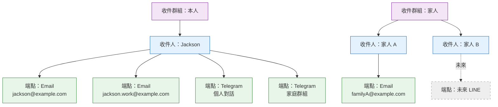

| 層級 | 擴充方式 | 是否需要改動系統 |
|---|---|---|
| 新增一個 **Email 信箱** | 在收件人底下新增一個 Email 端點 → 驗證 → 生效 | ❌ 不需要 |
| 新增一個 **Telegram 帳號／群組** | 產生綁定碼 → 對方完成綁定 → 自動建立端點 | ❌ 不需要 |
| 新增一位 **收件人** | 新增收件人並掛上端點，加入群組 | ❌ 不需要 |
| 新增一個 **管道類型** | 新增管道轉接單元與該管道的模板 | ✅ 需要（僅此一項） |

**個人與共用端點規則：**
- 個人端點只能屬於一位收件人，可使用該收件人的自助偏好與專屬管理連結。
- Telegram 群組屬共用端點，由系統擁有者管理，不屬於任何單一收件人的自助設定範圍。
- 共用端點訊息不得附上任何收件人的專屬管理連結；退訂與偏好調整由系統擁有者處理。
- 同一 Telegram 對話識別碼只能建立一個有效端點，避免重複投遞。

---

#### M9 綁定驗證模組

| 項目 | 內容 |
|---|---|
| **目的** | 確保收件端點確實屬於本人且可正常收訊，避免誤寄與濫發 |
| **主要功能** | ① Email 驗證信流程<br/>② Telegram 綁定碼流程<br/>③ 綁定碼的產生、時效控制與失效<br/>④ 解除綁定與退訂 |

| 管道 | 驗證方式 | 有效期 | 未驗證的處理 |
|---|---|---|---|
| Email | 系統寄出含驗證連結的信件，點擊後生效 | 24 小時 | 端點維持「待驗證」狀態，不會收到任何通知 |
| Telegram | 系統產生一次性綁定碼，使用者在對話中送出該碼 | 15 分鐘 | 綁定碼逾時失效，需重新產生 |

**退訂要求**：每則訊息（尤其 Email）須提供退訂或調整通知設定的方式，
使用者可自行停止接收，不需透過系統擁有者。

---

#### M10 模板管理模組

| 項目 | 內容 |
|---|---|
| **目的** | 讓訊息文案可調整、可預覽，且與流程邏輯完全分離 |
| **主要功能** | ① 維護「事件類型 × 管道」的模板<br/>② 提供可用變數清單說明<br/>③ 以範例資料即時預覽<br/>④ 模板缺失時回退至預設通用模板 |
| **關鍵規則** | 模板數量 ＝ 事件類型數 × 啟用管道數；缺少任一組合時**必須有預設模板可回退**，不得因缺模板而漏發訊息 |

**Phase 1 模板矩陣：**

| 事件類型 ＼ 管道 | Email | Telegram |
|---|---|---|
| `ALERT_SIGNAL` | 單筆詳細格式 | 精簡即時格式 |
| `ALERT_DIGEST` | 表格彙整格式 | 條列摘要格式 |
| `FETCH_COMPLETED` | 簡短狀態格式 | 簡短狀態格式 |
| `FETCH_FAILED` | 錯誤詳情格式 | 醒目告警格式 |
| `SYSTEM_HEALTH` | 錯誤詳情格式 | 醒目告警格式 |

---

#### M11 管道設定模組

| 項目 | 內容 |
|---|---|
| **目的** | 集中管理各管道的啟用狀態與設定，支援不改動程式即可增減可用管道 |
| **主要功能** | ① 管道的啟用／停用切換<br/>② 各管道必要設定的維護<br/>③ 設定完整性檢查<br/>④ 連線測試與健康狀態顯示<br/>⑤ 管道連續失敗時自動熔斷 |

**管道狀態：**

| 狀態 | 說明 | 系統行為 |
|---|---|---|
| `enabled` | 已啟用且設定完整 | 正常發送 |
| `disabled` | 手動停用 | 路由時直接跳過此管道的端點 |
| `misconfigured` | 設定不完整 | 視同停用，介面顯示警示 |
| `circuit_open` | 連續失敗達門檻自動熔斷 | 暫停發送一段時間後自動重試恢復 |

---

#### M12 管理介面模組

詳見第 12 章「管理介面規劃」。

---

#### M13 自助訂閱模組

| 項目 | 內容 |
|---|---|
| **目的** | 讓收件人**不需要帳號密碼、也不需要麻煩系統擁有者**，就能自行決定要收什麼、多久收一次、要不要暫停 |
| **主要功能** | ① 以專屬連結進入個人設定頁<br/>② 調整個人訂閱範圍<br/>③ 調整發送模式與靜音時段<br/>④ 暫停通知（指定天數，到期自動恢復）<br/>⑤ 單一端點退訂／全部退訂<br/>⑥ 檢視自己近期收到的通知紀錄 |
| **關鍵前提** | 本系統為個人自用、收件人皆為認識的家人與同好，**不建立帳號密碼制度**；以「專屬連結」作為身分依據即可，避免為了少數幾位收件人導入完整的會員系統 |

**存取方式：專屬連結（不需登入）**

| 項目 | 規則 |
|---|---|
| 連結來源 | 每則訊息底部固定附上「管理我的通知」連結 |
| 連結內容 | 帶有該收件人專屬的識別碼，系統據此判斷是誰 |
| 有效期 | 長效但**可隨時由系統擁有者撤銷／重新產生** |
| 可見範圍 | **只能看到與修改自己的設定**，絕不得看到其他收件人的任何資訊 |
| 不可執行的操作 | 不得修改管道設定、訊息模板、他人訂閱，不得查看系統層級的發送紀錄 |
| 適用端點 | 僅限個人端點；Telegram 群組等共用端點不得包含專屬連結 |

**專屬連結安全要求：**
- 專屬識別碼必須不可猜測，儲存時不得保留可直接使用的明文值。
- 專屬識別碼不得出現在應用程式紀錄、分析事件、匯出檔、錯誤訊息或外部頁面的 Referer 中。
- 自助頁僅可透過加密連線存取，回應不得被共用快取或搜尋引擎索引。
- 撤銷或重新產生後，舊連結必須立即失效；退訂全部端點等破壞性操作須再次確認。
- 連續輸入無效識別碼應受速率限制，但不得藉錯誤訊息判斷某位收件人是否存在。

**收件人可自行調整的項目：**

| 項目 | 可調整內容 | 預設值 |
|---|---|---|
| 訂閱市場 | 台股／美股，可多選 | 兩者皆收 |
| 訊號強度 | 強／中／弱，可多選 | 強＋中即時，弱只入摘要 |
| 訊號類型 | 買進／賣出／警告 | 全收 |
| 策略分類 | 技術面／籌碼面／基本面 | 全收 |
| 關注個股 | 可指定只收特定股票清單 | 不限定 |
| 發送模式 | 即時／摘要／僅緊急 | 依端點而定 |
| 靜音時段 | 每日免打擾區間 | 22:00–08:00 |
| 每日上限 | 每日最多接收則數 | 30 |
| 暫停通知 | 暫停 1／3／7／30 天，到期自動恢復 | 未暫停 |
| 退訂 | 單一端點退訂或全部退訂 | 未退訂 |

**與系統擁有者設定的關係（重要）：**

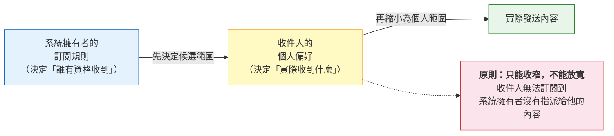

| 規則 | 說明 |
|---|---|
| **只能收窄，不能放寬** | 收件人的個人偏好只能在系統擁有者指派的範圍內做減法，不能自己新增訂閱到未被指派的內容 |
| **退訂優先於一切** | 收件人一旦退訂，即使訂閱規則命中也不發送 |
| **暫停期間仍記錄** | 暫停期間的訊息不發送、不於恢復後補送，但仍留下紀錄，狀態標記為 `skipped_paused` |
| **管理者可見但不可代改偏好** | 系統擁有者可在管理介面看到每位收件人的個人偏好，但修改應由收件人自行操作，避免設定來源混亂 |

---

## 7. 功能需求明細

### 7.1 需求編號原則

`FR-<模組>-<序號>`，例如 `FR-RT-01` 代表路由模組第一項功能需求。

### 7.2 功能需求清單

#### 事件接收（FR-EV）

| 編號 | 需求 | 優先度 |
|---|---|---|
| FR-EV-01 | 系統應可接收策略掃描產生的每一筆警示訊號作為事件 | 必要 |
| FR-EV-02 | 系統應可接收爬蟲執行結果（成功／失敗）作為事件 | 必要 |
| FR-EV-03 | 系統應可接收系統異常作為事件 | 必要 |
| FR-EV-04 | 每次事件接收應具備唯一事件識別碼供追溯，並具備跨重跑仍穩定的冪等鍵供去重 | 必要 |
| FR-EV-05 | 事件應標註嚴重度（info／warning／critical） | 必要 |
| FR-EV-06 | 事件欄位不完整時應記錄並丟棄，不得中斷來源流程 | 必要 |
| FR-EV-07 | 新增事件類型時，不需修改路由、政策、發送模組 | 必要 |

#### 訂閱路由（FR-RT）

| 編號 | 需求 | 優先度 |
|---|---|---|
| FR-RT-01 | 應可建立訂閱規則，指定事件類型、過濾條件與目標收件對象 | 必要 |
| FR-RT-02 | 過濾條件應支援市場、策略、策略分類、訊號類型、訊號強度、股票清單、嚴重度 | 必要 |
| FR-RT-03 | 訂閱規則的目標可指定「收件群組」「收件人」或「單一收件端點」 | 必要 |
| FR-RT-04 | 訂閱規則應可個別啟用／停用 | 必要 |
| FR-RT-05 | 同一端點被多條規則命中時，同一事件僅產生一則訊息 | 必要 |
| FR-RT-06 | 無任何規則命中的事件應正常結束並記錄，不視為錯誤 | 必要 |
| FR-RT-07 | 應提供「規則測試」功能，輸入範例事件即可預覽會送給誰 | 建議 |
| FR-RT-08 | 新增過濾條件維度時，既有規則不受影響（預設為不過濾） | 必要 |

#### 通知政策（FR-PL）

| 編號 | 需求 | 優先度 |
|---|---|---|
| FR-PL-01 | 同一事件對同一端點不得重複發送 | 必要 |
| FR-PL-02 | 應可設定每個端點的每日發送上限，超限後併入摘要 | 必要 |
| FR-PL-03 | 應可設定每個端點的時區與靜音時段；即時訊息延後至靜音結束，且不得僅因靜音而改入摘要 | 必要 |
| FR-PL-04 | 嚴重度為 critical 的事件不受靜音時段與頻率上限限制 | 必要 |
| FR-PL-05 | 每個端點應可設定發送模式（即時／摘要／僅緊急） | 必要 |
| FR-PL-06 | 摘要模式應可設定彙整發送時間 | 必要 |
| FR-PL-07 | 摘要內若無任何內容，不應發送空白訊息 | 必要 |
| FR-PL-08 | 已停用或未驗證的端點不得收到任何通知 | 必要 |
| FR-PL-09 | 每日上限的日期邊界、靜音時段與摘要時間皆應依端點時區計算 | 必要 |

#### 訊息組裝（FR-MC）

| 編號 | 需求 | 優先度 |
|---|---|---|
| FR-MC-01 | 應依「事件類型 × 管道」套用對應模板 | 必要 |
| FR-MC-02 | 缺少特定模板時應回退至預設通用模板，不得漏發 | 必要 |
| FR-MC-03 | 訊息應包含事件標題、關鍵數值、訊號強度、交易日期 | 必要 |
| FR-MC-04 | 訊息應包含可回到系統對應頁面的連結 | 建議 |
| FR-MC-05 | 訊息應包含免責聲明 | 必要 |
| FR-MC-06 | Telegram 訊息超過長度上限時應自動截斷並附完整內容連結 | 必要 |
| FR-MC-07 | 模板應支援以範例資料預覽 | 建議 |

#### 發送與可靠性（FR-DP）

| 編號 | 需求 | 優先度 |
|---|---|---|
| FR-DP-01 | 訊息應以佇列方式發送，發送過程不得阻塞事件來源流程 | 必要 |
| FR-DP-02 | 發送失敗應依退避策略自動重試，次數可設定 | 必要 |
| FR-DP-03 | 不可重試的失敗（位址無效、遭封鎖）應立即停止重試並停用該端點 | 必要 |
| FR-DP-04 | 重試用盡的非系統異常訊息應標記最終失敗並觸發具冷卻鍵的系統異常事件；系統異常訊息失敗不得再衍生相同事件 | 必要 |
| FR-DP-05 | critical 事件應優先於其他訊息發送 | 建議 |
| FR-DP-06 | 通知平台的任何異常都不得影響爬蟲與策略掃描的執行 | 必要 |
| FR-DP-07 | 管道連續失敗達門檻時應自動熔斷，並於一段時間後自動嘗試恢復 | 建議 |
| FR-DP-08 | 跨管道備援僅可使用該收件人預先驗證、啟用且獲訂閱規則授權的備援端點；無可用備援時應記錄失敗而非任意改送 | 必要 |

#### 收件人與端點管理（FR-RC）

| 編號 | 需求 | 優先度 |
|---|---|---|
| FR-RC-01 | 應可新增／編輯／停用收件人 | 必要 |
| FR-RC-02 | 一位收件人應可掛載多個不同管道的收件端點 | 必要 |
| FR-RC-03 | 同一管道下應可為同一收件人設定多個端點（如兩個信箱） | 必要 |
| FR-RC-04 | 新增收件端點應為純資料操作，不需修改設定檔或重啟系統 | 必要 |
| FR-RC-05 | 應可建立收件群組並管理成員 | 必要 |
| FR-RC-06 | 每個端點應可獨立設定發送模式、靜音時段與頻率上限 | 必要 |
| FR-RC-07 | 應提供單一端點的「測試發送」功能 | 必要 |
| FR-RC-08 | 停用端點應保留歷史紀錄，不得因停用而遺失稽核資料 | 必要 |
| FR-RC-09 | 端點應區分個人端點與共用端點；共用端點不得套用個人自助連結 | 必要 |
| FR-RC-10 | 應可為個人端點設定已授權的備援端點及使用優先順序 | 必要 |

#### 綁定與驗證（FR-BD）

| 編號 | 需求 | 優先度 |
|---|---|---|
| FR-BD-01 | 新增 Email 端點應寄出驗證信，驗證通過後才可接收通知 | 必要 |
| FR-BD-02 | Email 驗證連結應有時效性 | 必要 |
| FR-BD-03 | Telegram 綁定應以一次性綁定碼完成，不需使用者手動填寫識別碼 | 必要 |
| FR-BD-04 | 綁定碼應有時效性，逾時自動失效 | 必要 |
| FR-BD-05 | 綁定完成後應自動建立對應的收件端點並回覆確認訊息 | 必要 |
| FR-BD-06 | 應可解除綁定，解除後立即停止發送 | 必要 |
| FR-BD-07 | 訊息中應提供退訂或調整通知設定的途徑 | 必要 |

#### 紀錄與稽核（FR-LG）

| 編號 | 需求 | 優先度 |
|---|---|---|
| FR-LG-01 | 每則訊息應記錄其完整狀態歷程 | 必要 |
| FR-LG-02 | 應可依日期、管道、收件人、狀態、事件類型查詢發送紀錄 | 必要 |
| FR-LG-03 | 失敗紀錄應顯示可讀的失敗原因 | 必要 |
| FR-LG-04 | 應可對失敗訊息執行手動重送 | 必要 |
| FR-LG-05 | 應提供發送統計（總量、成功率、各管道占比、失敗排行） | 建議 |
| FR-LG-06 | 紀錄應可設定保留期限並自動清理 | 建議 |
| FR-LG-07 | 紀錄與介面中不得出現機敏設定資訊的明文 | 必要 |

#### 管道設定（FR-CH）

| 編號 | 需求 | 優先度 |
|---|---|---|
| FR-CH-01 | 應可個別啟用／停用各管道 | 必要 |
| FR-CH-02 | 管道停用時，該管道的端點應自動跳過，其他管道不受影響 | 必要 |
| FR-CH-03 | 應提供各管道的連線測試功能 | 必要 |
| FR-CH-04 | 管道設定不完整時應於介面明確提示 | 必要 |
| FR-CH-05 | 新增管道時，既有訂閱規則與收件人資料應可直接沿用 | 必要 |
| FR-CH-06 | 機敏設定資訊於介面應遮蔽顯示 | 必要 |

#### 自助訂閱管理（FR-SS）

| 編號 | 需求 | 優先度 |
|---|---|---|
| FR-SS-01 | 發往個人端點的每則訊息應附上該收件人的專屬「管理我的通知」連結；共用端點不得附加 | 必要 |
| FR-SS-02 | 收件人以專屬連結進入個人設定頁時不需帳號密碼 | 必要 |
| FR-SS-03 | 個人設定頁**只能顯示與修改該收件人自己的資料** | 必要 |
| FR-SS-04 | 收件人應可自行調整訂閱市場、訊號強度、訊號類型、策略分類、關注個股 | 必要 |
| FR-SS-05 | 收件人應可自行調整發送模式、靜音時段、每日上限 | 必要 |
| FR-SS-06 | 收件人應可暫停通知指定天數，到期自動恢復 | 必要 |
| FR-SS-07 | 收件人應可退訂單一端點或全部端點，退訂後立即生效 | 必要 |
| FR-SS-08 | 收件人的個人偏好**只能收窄**系統擁有者指派的範圍，不得放寬 | 必要 |
| FR-SS-09 | 收件人應可檢視自己近期收到的通知紀錄 | 建議 |
| FR-SS-10 | 系統擁有者應可撤銷並重新產生某收件人的專屬連結 | 必要 |
| FR-SS-11 | 個人設定頁不得暴露管道設定、模板或其他收件人的任何資訊 | 必要 |
| FR-SS-12 | 收件人於個人設定頁的變更應留下異動紀錄 | 建議 |
| FR-SS-13 | 個人設定頁應可在手機瀏覽器正常操作 | 必要 |
| FR-SS-14 | 專屬連結識別碼不得以可直接使用的明文保存或出現在紀錄、匯出與外部 Referer 中 | 必要 |

#### 管理端存取控制（FR-AU）

| 編號 | 需求 | 優先度 |
|---|---|---|
| FR-AU-01 | 管道設定、收件人、訂閱、模板與全域發送紀錄僅限系統擁有者存取 | 必要 |
| FR-AU-02 | 未經授權的請求不得讀取或修改管理資料，且不得僅依前端入口是否顯示判定權限 | 必要 |
| FR-AU-03 | 管理端的設定異動、重送、憑證更新與專屬連結重發應留下操作者、時間與結果紀錄 | 必要 |

---

## 8. 流程圖

### 8.1 主流程：從訊號產生到訊息送達

```mermaid
flowchart TD
    START(["盤後排程<br/>爬蟲完成 → 策略掃描完成"]):::start
    S1["產生警示訊號"]:::proc
    S2["轉為標準化事件<br/>補齊識別碼與嚴重度"]:::proc

    D0{"事件欄位完整?"}:::dec
    X0["記錄並丟棄"]:::skip

    S3["讀取啟用中的訂閱規則"]:::proc
    S4["比對過濾條件<br/>市場/策略/強度/股票清單"]:::proc
    D1{"有規則命中?"}:::dec
    X1["結束（無人訂閱）"]:::skip

    S5["展開為收件端點清單<br/>並去除重複端點"]:::proc

    subgraph POLICY ["通知政策檢核（逐一端點）"]
        D2{"端點已啟用<br/>且已驗證?"}:::dec
        D3{"此事件已送過<br/>此端點?"}:::dec
        D4{"今日已達<br/>發送上限?"}:::dec
        D5{"目前在<br/>靜音時段?"}:::dec
        D6{"端點模式<br/>為即時?"}:::dec
    end

    X2["略過：端點停用"]:::skip
    X3["略過：重複"]:::skip
    X4["併入摘要：超量"]:::defer
    X5["延後至靜音時段結束"]:::defer
    X6["併入摘要：摘要模式"]:::defer

    D7A{"嚴重度<br/>= critical?"}:::dec
    D7B{"嚴重度<br/>= critical?"}:::dec

    S6["取得（事件類型 × 管道）模板"]:::proc
    S7["組裝訊息內容"]:::proc
    S8["產生訊息單，排入發送佇列"]:::proc
    S9["由對應管道轉接單元送出"]:::proc

    D8{"發送成功?"}:::dec
    S10["標記 sent，寫入紀錄"]:::ok
    D9{"可重試 且<br/>未達重試上限?"}:::dec
    S11["依退避策略重新排程"]:::proc
    S12["標記最終失敗<br/>觸發系統異常事件"]:::err

    END_(["流程結束"]):::start

    START --> S1 --> S2 --> D0
    D0 -- 否 --> X0 --> END_
    D0 -- 是 --> S3 --> S4 --> D1
    D1 -- 否 --> X1 --> END_
    D1 -- 是 --> S5 --> D2

    D2 -- 否 --> X2 --> END_
    D2 -- 是 --> D3
    D3 -- 是 --> X3 --> END_
    D3 -- 否 --> D4
    D4 -- 是 --> D7A
    D4 -- 否 --> D5
    D5 -- 是 --> D7B
    D5 -- 否 --> D6
    D6 -- 否 --> X6 --> END_
    D6 -- 是 --> S6

    D7A -- 是 --> S6
    D7A -- 否 --> X4 --> END_
    D7B -- 是 --> S6
    D7B -- 否 --> X5 --> END_

    S6 --> S7 --> S8 --> S9 --> D8
    D8 -- 是 --> S10 --> END_
    D8 -- 否 --> D9
    D9 -- 是 --> S11 --> S9
    D9 -- 否 --> S12 --> END_

    classDef start fill:#f3e5f5,stroke:#7b1fa2
    classDef proc fill:#e8f5e9,stroke:#2e7d32
    classDef dec fill:#fff9c4,stroke:#f9a825
    classDef skip fill:#eeeeee,stroke:#9e9e9e
    classDef defer fill:#e0f7fa,stroke:#00838f
    classDef ok fill:#c8e6c9,stroke:#2e7d32
    classDef err fill:#fce4ec,stroke:#c62828
```

### 8.2 Telegram 帳號綁定流程

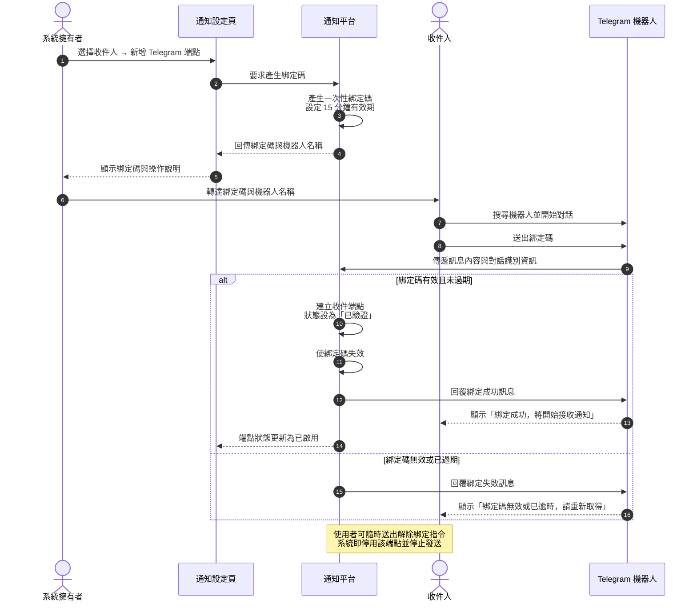

### 8.3 新增 Email 收件人與驗證流程

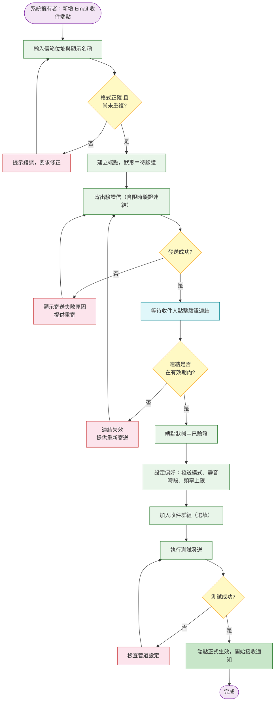

### 8.4 每日摘要彙整流程

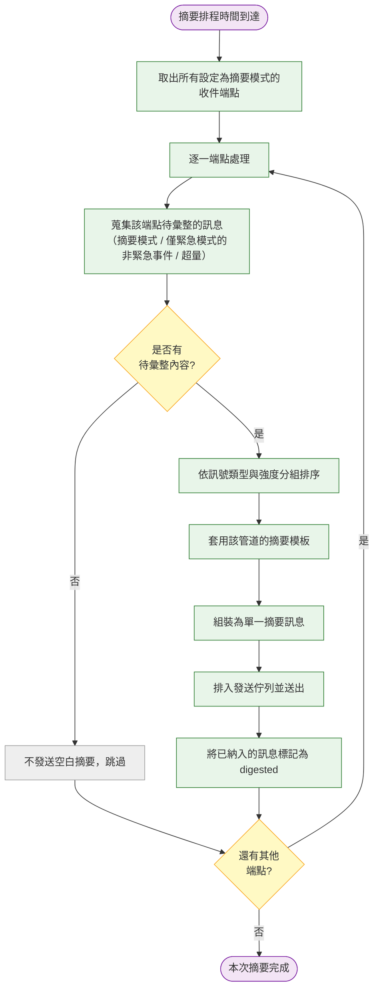

### 8.5 訊息單狀態轉換圖

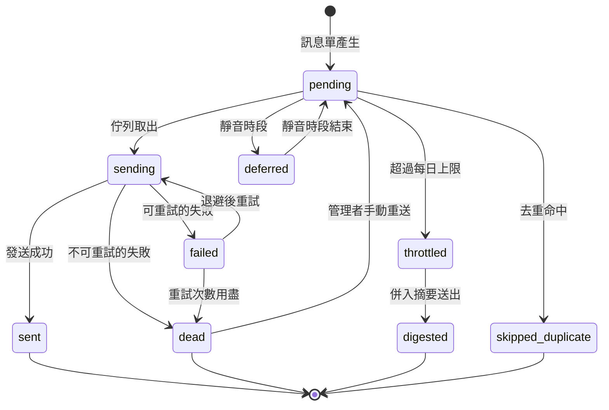

### 8.6 管道熔斷與恢復流程

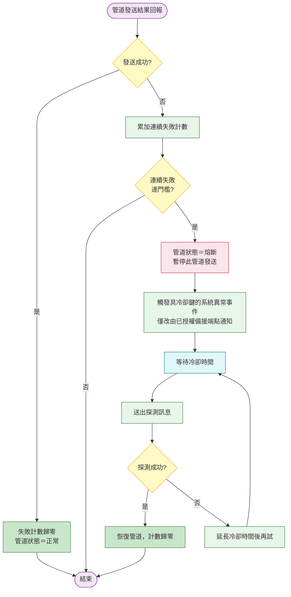

### 8.7 收件人自助管理訂閱流程

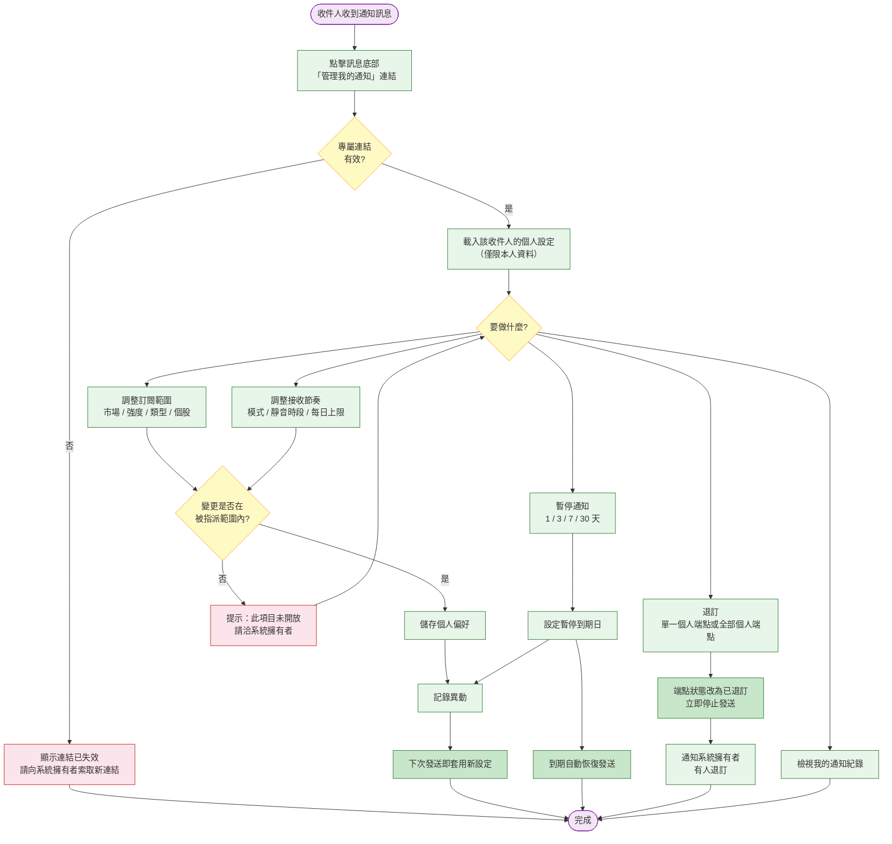

### 8.8 未來新增管道的擴充流程

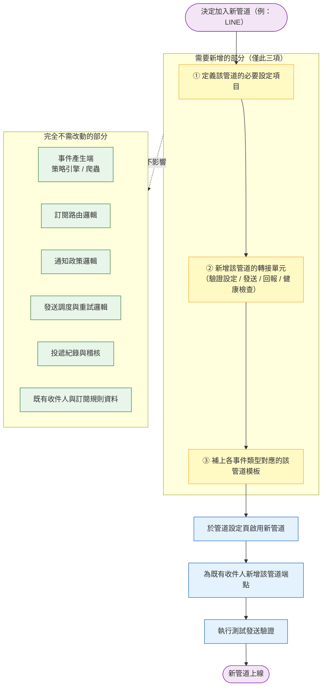

---

## 9. 邏輯資料需求

> 本章僅描述「系統必須記住哪些資訊」及彼此關聯，**不規範儲存方式與欄位型別**。

### 9.1 概念實體關聯圖

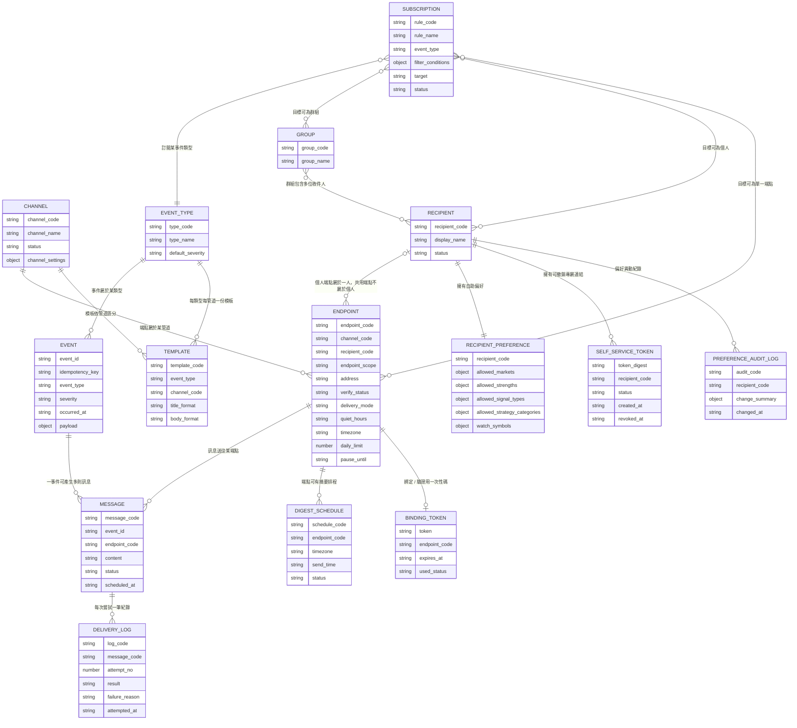

> 上圖屬性名稱以英文標示僅為圖形工具的呈現限制，各實體的中文意義如下：

| 實體 | 中文名稱 | 記錄什麼 |
|---|---|---|
| `CHANNEL` | 管道 | 有哪些管道、是否啟用、各自的設定 |
| `RECIPIENT` | 收件人 | 有哪些人會收到通知 |
| `ENDPOINT` | 收件端點 | 每個人在各管道的收件位置與個人偏好 |
| `GROUP` | 收件群組 | 收件人的分組，方便訂閱規則一次指定 |
| `SUBSCRIPTION` | 訂閱規則 | 什麼事件、什麼條件、送給誰 |
| `EVENT_TYPE` | 事件類型 | 系統支援哪些事件分類 |
| `EVENT` | 事件 | 實際發生的每一件事及其內容 |
| `TEMPLATE` | 訊息模板 | 各事件類型在各管道的呈現格式 |
| `MESSAGE` | 訊息單 | 針對某端點產生的一則待發／已發訊息 |
| `DELIVERY_LOG` | 投遞紀錄 | 每一次發送嘗試的結果 |
| `BINDING_TOKEN` | 綁定驗證碼 | Email 驗證與 Telegram 綁定用的一次性碼 |
| `RECIPIENT_PREFERENCE` | 收件人偏好 | 收件人可在管理者授權範圍內自行收窄的訂閱條件 |
| `SELF_SERVICE_TOKEN` | 自助連結憑證 | 專屬連結的摘要值、狀態、建立與撤銷時間，不保存可直接使用的明文值 |
| `PREFERENCE_AUDIT_LOG` | 偏好異動紀錄 | 收件人在自助頁進行的設定變更 |
| `DIGEST_SCHEDULE` | 摘要排程 | 端點的摘要發送時間、時區與啟用狀態 |

### 9.2 關鍵資料規則

| 規則 | 說明 |
|---|---|
| 端點的唯一性 | 同一管道下，同一收件位置不得重複建立 |
| 端點與收件人的關係 | 個人端點只能屬於一位收件人；共用端點不屬於任何單一收件人，由系統擁有者管理 |
| 訊息與事件的關係 | 一個事件可產生 0 到多則訊息（取決於命中幾個端點） |
| 去重的判定鍵 | 事件冪等鍵 ＋ 端點代碼 |
| 停用不刪除 | 收件人、端點、規則的停用皆為狀態變更，保留歷史紀錄的可追溯性 |
| 機敏資料隔離 | 管道設定中的認證資訊不得隨紀錄一併保存或匯出 |

---

## 10. 擴充性設計原則

本章是本規格的核心承諾，明確定義「什麼情況下**不需要**改動系統」。

### 10.1 擴充情境對照表

| 擴充情境 | 需要的操作 | 是否需改動系統 | 是否需重啟 |
|---|---|---|---|
| 新增一個 Email 收件信箱 | 介面新增端點 → 完成驗證 | ❌ | ❌ |
| 新增一個 Telegram 個人帳號 | 產生綁定碼 → 對方完成綁定 | ❌ | ❌ |
| 新增一個 Telegram 群組 | 將機器人加入群組 → 完成綁定 | ❌ | ❌ |
| 新增一位收件人 | 介面新增收件人並掛端點 | ❌ | ❌ |
| 調整某人只收強訊號 | 修改訂閱規則的過濾條件 | ❌ | ❌ |
| 調整訊息措辭 | 修改模板 | ❌ | ❌ |
| 暫停 Email 通知 | 管道設定頁停用 Email | ❌ | ❌ |
| 收件人自行改訂閱／暫停／退訂 | 收件人於自助頁自行操作 | ❌ | ❌ |
| 新增事件類型（如記帳提醒） | 定義事件類型 ＋ 補模板 ＋ 建訂閱規則 | ⚠️ 僅事件產生端 | ❌ |
| **新增管道（LINE / Discord…）** | 定義設定項目 ＋ 新增管道轉接單元 ＋ 補模板 | ⚠️ 僅管道層 | 視情況 |
| 新增過濾條件維度 | 新增條件項目定義 | ⚠️ 僅路由條件定義 | ❌ |

### 10.2 擴充性鐵則

| 編號 | 鐵則 | 理由 |
|---|---|---|
| R1 | **事件產生端永遠不得指定管道或收件人** | 否則每加一個管道都要回頭改策略引擎 |
| R2 | **新增管道不得修改路由與政策模組** | 路由與政策只認「端點」，不認管道細節 |
| R3 | **新增收件對象必須是純資料操作** | 收件人資訊寫進設定檔或程式碼，就失去彈性 |
| R4 | **模板必須與流程邏輯分離** | 文案調整不應牽動任何流程 |
| R5 | **每個事件類型都必須有可回退的預設模板** | 避免新增管道時因漏補模板而靜默漏發 |
| R6 | **任一管道故障不得影響其他管道** | 管道之間必須完全獨立 |
| R7 | **通知平台故障不得影響爬蟲與策略掃描** | 通知是附加價值，核心資料流程優先 |
| R8 | **所有數量限制（重試次數、每日上限、冷卻時間）皆須可設定** | 不同使用習慣需要不同節奏 |

### 10.3 管道能力差異的處理原則

不同管道能力不同（Email 可長文與附件、Telegram 需精簡但可互動）。處理原則：

| 原則 | 說明 |
|---|---|
| **最小共通能力** | 所有管道必須支援「送出一段純文字」，這是唯一的強制能力 |
| **能力宣告** | 每個管道宣告自己支援哪些進階能力（排版、連結按鈕、附件、互動） |
| **優雅降級** | 模板使用進階能力時，若管道不支援則自動退回純文字呈現，不得發送失敗 |
| **管道專屬模板** | 需要充分利用管道特性時，以該管道專屬模板處理，不影響其他管道 |

---

## 11. 非功能需求

| 類別 | 編號 | 需求 |
|---|---|---|
| **可靠性** | NFR-01 | 通知平台的任何異常，不得中斷或影響爬蟲與策略掃描流程；通知失敗時來源流程仍須正常完成並保存原結果 |
| | NFR-02 | 已接受的事件在訊息被外部管道接受或標記最終失敗前不得遺失；服務重新啟動後仍可繼續處理未完成訊息 |
| | NFR-03 | 單一管道故障時，其他管道仍應正常運作 |
| **時效性** | NFR-04 | 在外部管道正常且未受靜音／節流影響時，95% 即時訊息應於事件接收後 3 分鐘內完成首次發送嘗試 |
| | NFR-05 | 摘要訊息的首次發送嘗試應落在端點設定時間的 ±2 分鐘內 |
| **容量** | NFR-06 | 在 10 分鐘內接收 1,000 個事件、最多展開為 10,000 則訊息時，不得遺失事件或重複建立有效訊息 |
| | NFR-07 | 在 100 個啟用端點與 100 條啟用訂閱規則下，95% 路由判定應於 2 秒內完成；外部管道等待時間不計入 |
| **安全性** | NFR-08 | 管道認證資訊不得於介面明文顯示、不得寫入紀錄或匯出檔 |
| | NFR-09 | Email 驗證連結與 Telegram 綁定碼皆須為一次性且有時效 |
| | NFR-10 | 未經驗證的端點不得收到任何通知，避免誤寄或濫發 |
| | NFR-11 | 訊息內容不得包含帳號密碼等機敏資訊 |
| | NFR-19 | 自助設定的專屬連結須為每位收件人專屬且不可被猜測，並可由系統擁有者隨時撤銷 |
| | NFR-20 | 自助設定頁不得顯示其他收件人的任何資訊，亦不得暴露系統層級設定 |
| | NFR-21 | Email 每日寄送量須可設定預算，達標時僅可改走預先驗證且獲訂閱授權的備援端點，並留下紀錄與告警 |
| | NFR-22 | 管理介面必須執行系統擁有者身分驗證與伺服器端授權，不得只依前端隱藏控制存取 |
| | NFR-23 | 自助連結只可透過加密連線使用，且不得被共用快取、搜尋引擎索引或寫入存取紀錄的查詢字串 |
| **可維運性** | NFR-12 | 所有發送結果可查詢、可追溯、可手動重送 |
| | NFR-13 | 管道健康狀態應可於介面一目了然 |
| | NFR-14 | 各項門檻與限制值皆可調整，不需改動程式 |
| **使用性** | NFR-15 | 訊息在手機上應易讀，重點資訊置於前段 |
| | NFR-16 | 通知設定頁應讓非技術使用者也能完成收件人與訂閱設定 |
| **合規** | NFR-17 | 每則訊息須附免責聲明，明示為系統依既定規則產生的資訊提示 |
| | NFR-18 | 須提供退訂機制，收件人可自行停止接收 |

---

## 12. 管理介面規劃

### 12.1 頁面結構

```mermaid
flowchart TD
    ROOT["通知設定（主入口）"]:::main

    P1["① 管道設定"]:::page
    P2["② 收件人管理"]:::page
    P3["③ 訂閱規則"]:::page
    P4["④ 訊息模板"]:::page
    P5["⑤ 發送紀錄"]:::page
    P6["⑥ 我的通知設定<br/>（收件人自助頁）"]:::self

    P1A["管道清單與啟用開關"]:::item
    P1B["各管道設定與連線測試"]:::item
    P1C["管道健康狀態"]:::item

    P2A["收件人清單"]:::item
    P2B["收件端點管理（含新增/驗證/綁定）"]:::item
    P2C["端點偏好（模式/靜音/上限）"]:::item
    P2D["收件群組管理"]:::item

    P3A["規則清單與啟用開關"]:::item
    P3B["規則編輯（事件類型 + 過濾條件 + 目標）"]:::item
    P3C["規則測試預覽"]:::item

    P4A["模板矩陣（事件類型 × 管道）"]:::item
    P4B["模板編輯與變數說明"]:::item
    P4C["範例資料預覽"]:::item

    P5A["發送紀錄查詢與篩選"]:::item
    P5B["失敗明細與手動重送"]:::item
    P5C["發送統計摘要"]:::item

    P6A["我的訂閱範圍"]:::selfitem
    P6B["我的接收節奏"]:::selfitem
    P6C["暫停 / 退訂"]:::selfitem
    P6D["我收到的通知"]:::selfitem

    ROOT --> P1
    ROOT --> P2
    ROOT --> P3
    ROOT --> P4
    ROOT --> P5

    P1 --> P1A
    P1 --> P1B
    P1 --> P1C

    P2 --> P2A
    P2 --> P2B
    P2 --> P2C
    P2 --> P2D

    P3 --> P3A
    P3 --> P3B
    P3 --> P3C

    P4 --> P4A
    P4 --> P4B
    P4 --> P4C

    P5 --> P5A
    P5 --> P5B
    P5 --> P5C

    ENTRY["訊息中的<br/>『管理我的通知』連結"]:::entry
    ENTRY --> P6
    P6 --> P6A
    P6 --> P6B
    P6 --> P6C
    P6 --> P6D

    classDef main fill:#f3e5f5,stroke:#7b1fa2
    classDef page fill:#fff9c4,stroke:#f9a825
    classDef item fill:#e8f5e9,stroke:#2e7d32
    classDef self fill:#e0f7fa,stroke:#00838f
    classDef selfitem fill:#e3f2fd,stroke:#1565c0
    classDef entry fill:#f3e5f5,stroke:#7b1fa2
```

> **注意**：①～⑤ 為系統擁有者專用的管理介面；⑥ 為收件人專用的自助頁，
> **兩者入口完全分離**。管理介面必須驗證系統擁有者身分並於伺服器端授權；自助頁則以可撤銷的
> 專屬連結授權，兩者不得共用權限或僅靠前端路由隱藏功能。

### 12.2 各頁面功能重點

| 頁面 | 核心操作 | 關鍵呈現 |
|---|---|---|
| **① 管道設定** | 啟用／停用、填寫設定、測試連線 | 每個管道一張卡片，顯示狀態燈號（正常／停用／設定不全／熔斷）；機敏欄位遮蔽 |
| **② 收件人管理** | 新增收件人與端點、驗證／綁定、設定偏好、測試發送、群組維護 | 收件人為主表，展開後列出其所有端點與各自狀態；未驗證端點需明顯標示 |
| **③ 訂閱規則** | 建立與編輯規則、啟用／停用、測試預覽 | 規則以「事件類型 → 條件 → 目標」三段式呈現，讓人一眼看懂規則語意 |
| **④ 訊息模板** | 編輯模板、查看可用變數、預覽 | 以矩陣呈現事件類型 × 管道，缺模板者標示為使用預設模板 |
| **⑤ 發送紀錄** | 查詢、篩選、查看失敗原因、手動重送 | 依日期倒序；狀態以色彩區分；失敗項目提供重送按鈕與原因說明 |
| **⑥ 我的通知設定**<br/>（收件人自助） | 調整訂閱範圍與接收節奏、暫停、退訂、查看自己收到的通知 | 免登入、手機優先；只顯示本人資料；不可調整的項目應直接隱藏而非顯示為停用 |

### 12.3 與既有警示看板的關係

| 項目 | 說明 |
|---|---|
| 定位區分 | 既有「警示看板」呈現**訊號本身**；本模組的「發送紀錄」呈現**訊號是否送達**，兩者不重疊 |
| 入口位置 | 通知設定建議置於系統設定區，與警示看板分開 |
| 交互連結 | 警示看板的單筆訊號可查看「此訊號通知了誰、是否送達」 |
| 訊息回連 | 通知訊息中的連結應可直接開啟該股在系統中的圖表頁 |

---

## 13. 開發階段規劃

```mermaid
flowchart LR
    subgraph PH1 ["Phase 1：核心貫通"]
        A1["事件接收"]
        A2["Email 管道"]
        A3["最簡訂閱（全收）"]
        A4["基本模板"]
        A5["發送紀錄"]
    end

    subgraph PH2 ["Phase 2：Telegram 與綁定"]
        B1["Telegram 管道"]
        B2["綁定碼流程"]
        B3["管道設定介面"]
        B4["測試發送"]
    end

    subgraph PH3 ["Phase 3：精準與節制"]
        C1["訂閱規則與過濾條件"]
        C2["收件人 / 群組管理"]
        C3["去重 / 頻率 / 靜音"]
        C4["摘要模式"]
        C5["★ 收件人自助訂閱頁"]
    end

    subgraph PH4 ["Phase 4：韌性與維運"]
        D1["重試與熔斷"]
        D2["失敗手動重送"]
        D3["發送統計"]
        D4["系統異常事件"]
    end

    subgraph PH5 ["Phase 5：未來擴充"]
        E1["LINE 等新管道"]
        E2["雙向互動指令"]
        E3["記帳模組事件串接"]
    end

    PH1 --> PH2 --> PH3 --> PH4 -.-> PH5

    classDef p1 fill:#e8f5e9,stroke:#2e7d32
    classDef p2 fill:#e3f2fd,stroke:#1565c0
    classDef p3 fill:#fff9c4,stroke:#f9a825
    classDef p4 fill:#e0f7fa,stroke:#00838f
    classDef p5 fill:#eeeeee,stroke:#9e9e9e

    class A1,A2,A3,A4,A5 p1
    class B1,B2,B3,B4 p2
    class C1,C2,C3,C4,C5 p3
    class D1,D2,D3,D4 p4
    class E1,E2,E3 p5
```

### 階段目標與驗證方式

| 階段 | 目標 | 完成的判斷標準 |
|---|---|---|
| **Phase 1** | 打通「事件 → 訊息 → 送達」最短路徑 | 盤後掃描完成後，能收到一封含當日訊號的 Email |
| **Phase 2** | 補上即時管道與自助綁定 | 新的 Telegram 帳號可在不改設定檔的情況下完成綁定並收訊 |
| **Phase 3** | 從「全部都收」進化為「只收我要的」，並把調整權交還收件人 | 兩位收件人可設定不同的過濾條件並各自收到正確內容；收件人可自行從訊息連結進入設定頁完成調整與退訂 |
| **Phase 4** | 從「能送」進化為「送不到也知道」 | 刻意讓管道失敗，能觀察到重試、熔斷與失敗紀錄 |
| **Phase 5** | 驗證擴充性承諾 | 新增第三個管道時，路由與政策模組零改動 |

> **階段順序理由**：先做 Email 是因為它不需要使用者端的綁定動作，可最快驗證整條資料流；
> Telegram 涉及綁定流程，放在管線打通之後導入，可以獨立驗證綁定邏輯。

---

## 14. 驗收條件

| 編號 | 驗收項目 | 驗收方式 |
|---|---|---|
| AC-01 | 盤後掃描產生訊號後，訂閱者能收到通知 | 執行一次掃描，確認 Email 與 Telegram 皆收到 |
| AC-02 | 新增 Email 收件人不需重啟系統 | 系統執行中新增信箱並完成驗證，下一次事件即可收到 |
| AC-03 | 新增 Telegram 帳號不需修改任何設定檔 | 以綁定碼完成綁定，確認立即生效 |
| AC-04 | 同一收件人可同時擁有多個信箱與多個 Telegram 對話 | 建立多端點，確認每個端點都收到 |
| AC-05 | 過濾條件正確生效 | 設定「只收賣出強訊號」，確認買進與弱訊號不會送達 |
| AC-06 | 去重機制生效 | 對同一日重複執行掃描，確認不會重複收到相同訊號 |
| AC-07 | 靜音時段生效 | 對即時端點在靜音時段觸發一般事件，確認於靜音結束後逐則送出且未被改入摘要 |
| AC-08 | critical 事件不受靜音時段限制 | 在靜音時段觸發爬蟲失敗事件，確認立即送達 |
| AC-09 | 頻率上限生效 | 觸發超過上限的訊號量，確認超量部分併入摘要 |
| AC-10 | 摘要模式生效 | 設定摘要模式，確認於指定時間收到一則彙整訊息 |
| AC-11 | 無內容時不發送空摘要 | 無訊號日確認不會收到空白摘要 |
| AC-12 | 停用管道後其他管道不受影響 | 停用 Email，確認 Telegram 仍正常送達 |
| AC-13 | 發送失敗會自動重試 | 模擬管道暫時不可用，確認依退避策略重試 |
| AC-14 | 失敗紀錄可查詢且可手動重送 | 於發送紀錄頁找到失敗項目並成功重送 |
| AC-15 | 通知失敗不影響爬蟲與掃描 | 讓所有管道失效後執行排程，確認資料仍正常寫入 |
| AC-16 | 機敏設定不外洩 | 檢視介面、紀錄與匯出內容，確認無明文憑證或可直接使用的自助連結識別碼 |
| AC-17 | 退訂機制可用 | 由收件人自行退訂，確認立即停止發送 |
| AC-18 | 訊息含免責聲明與回系統連結 | 檢視實際收到的訊息內容 |
| AC-19 | 擴充性驗證 | 撰寫一份「新增第三管道」的操作步驟，確認不涉及路由與政策模組 |
| AC-20 | 自助設定連結可用 | 由訊息中的連結進入個人設定頁，無需帳號密碼即可開啟 |
| AC-21 | 自助設定僅限本人 | 以 A 的連結進入，確認完全看不到 B 的任何資訊；將 A 的識別碼替換、截短或撤銷後皆不可存取 |
| AC-22 | 自助調整立即生效 | 於自助頁改為「只收台股強訊號」，確認下次發送即套用 |
| AC-23 | 自助暫停與自動恢復 | 設定暫停 1 天，確認期間不發送、到期自動恢復 |
| AC-24 | 只能收窄不能放寬 | 嘗試訂閱未被指派的內容，確認系統不允許 |
| AC-25 | 專屬連結可撤銷 | 由管理端撤銷並重新產生連結，確認舊連結失效 |
| AC-26 | 個人信箱寄送量控管 | 達到每日寄送量預算時，只對已設定且獲授權的 Telegram 備援端點改送；無備援者記錄失敗並告警 |
| AC-27 | 預設強度規則正確 | 新建端點預設即時收 strong＋moderate，weak 僅出現在摘要中 |
| AC-28 | 失敗告警不遞迴 | 停用所有管道並讓 `SYSTEM_HEALTH` 投遞失敗，確認不再產生新的同類事件且事件數量穩定 |
| AC-29 | Telegram 群組不洩漏個人連結 | 發送至共用群組端點，確認訊息不含任何收件人的專屬管理連結 |
| AC-30 | 管理端授權生效 | 以未授權請求直接呼叫管理功能，確認無法讀取或修改管道、收件人、模板與全域紀錄 |
| AC-31 | 即時訊息時效性 | 在管道正常且無靜音／節流下送出至少 100 則事件，確認至少 95% 於 3 分鐘內完成首次發送嘗試 |
| AC-32 | 重新啟動後不遺失 | 建立待發與待重試訊息後重新啟動服務，確認處理可續行且不重複形成有效訊息 |

---

## 15. 風險與待確認事項

### 15.1 風險

| 編號 | 風險 | 影響 | 因應方向 |
|---|---|---|---|
| RK-01 | Email 被判為垃圾信 | 收不到重要訊號而不自知 | 設定正確寄件人資訊；重要事件同時走 Telegram；提供送達統計供比對 |
| RK-02 | **個人信箱有每日寄送量限制**（已確認採個人信箱） | 極端行情下訊息量爆增而被擋，後續信件全數失敗 | 設定每日寄送量預算並於達標時僅改走已授權備援端點；Email 端點預設摘要模式；寄送量於管道設定頁即時顯示 |
| RK-03 | 即時通訊服務有速率限制 | 大量訊號同時觸發時被限流 | 發送調度控制速率；限流錯誤視為可重試 |
| RK-04 | 使用者封鎖機器人後系統無感 | 持續發送失敗 | 偵測封鎖類錯誤，自動停用端點並通知管理者 |
| RK-05 | 通知疲勞導致使用者忽略訊息 | 通知失去意義 | 預設即時推送 strong＋moderate、weak 僅入摘要；提供摘要與靜音；定期檢視發送量 |
| RK-06 | 極端行情下大量訊號同時觸發 | 訊息洪水 | 頻率上限 ＋ 自動轉摘要；摘要以強度排序，重點在前 |
| RK-07 | 訊息內容被解讀為投資建議 | 認知偏差風險 | 訊息僅陳述客觀訊號與數值；固定附上免責聲明；不新增主觀判斷語句 |
| RK-08 | 通知平台故障拖累核心流程 | 資料抓取與掃描中斷 | 訂為鐵則 R7：通知與核心流程完全隔離，失敗只記錄不拋出 |
| RK-09 | 未來新增管道時發現架構不足 | 擴充成本高於預期 | Phase 5 明確排入「以新增第三管道驗證擴充性」 |
| RK-10 | 共用群組訊息洩漏個人自助連結 | 群組成員可修改他人偏好或退訂 | 共用端點禁止附加專屬連結，且不得掛在單一收件人名下 |
| RK-11 | 通知平台自身告警形成遞迴 | 大量無效事件與紀錄耗盡資源 | `SYSTEM_HEALTH` 投遞失敗不再衍生事件，並對同類告警使用冷卻鍵聚合 |
| RK-12 | 長效專屬連結遭轉寄或外洩 | 未授權者可讀取或修改收件人設定 | 識別碼不可猜測、僅保存摘要、避免紀錄與 Referer 外洩，並支援立即撤銷與重發 |

### 15.2 已確認決策

| 編號 | 問題 | **決策** | 對規格的影響 |
|---|---|---|---|
| Q-01 | Email 寄送方式 | ✅ **使用個人信箱寄送** | 須加上每日寄送量預算控管與進垃圾信匣的因應（見 15.3） |
| Q-03 | 預設推送的訊號強度 | ✅ **strong ＋ moderate 即時推送；weak 只進每日摘要** | 成為訂閱規則與個人偏好的系統預設值 |
| Q-05 | 收件人自助管理訂閱 | ✅ **需要，以專屬連結免登入方式提供** | 新增 M13 自助訂閱模組、FR-SS-01～13、§8.7 流程、自助設定頁 |

### 15.3 已確認決策衍生的補充要求

#### Q-01：使用個人信箱寄送的配套

| 要求 | 說明 |
|---|---|
| 每日寄送量預算 | 個人信箱有每日寄送上限，系統須可設定「每日寄送量預算」；達到門檻時僅可改走該收件人預先設定、已驗證且獲訂閱授權的備援端點，無可用備援時記錄失敗並通知系統擁有者 |
| 優先走摘要 | Email 端點預設為摘要模式，以「一天一封」取代「一則一封」，大幅降低寄送次數 |
| 寄件人資訊完整 | 須設定清楚的寄件人顯示名稱與固定主旨前綴（如 `【MyStock】`），降低被判為垃圾信的機率 |
| 收件人自助補救 | 首次驗證信中提示收件人將寄件位址加入通訊錄，避免後續信件進入垃圾信匣 |
| 重要事件雙軌 | 嚴重度 critical 的事件同時走 Email 與 Telegram，避免單一管道被擋而完全失聯 |

#### Q-03：預設訊號強度的落實方式

| 層級 | 預設行為 |
|---|---|
| 訂閱規則預設 | 新建立的訂閱規則，訊號強度預設勾選 strong ＋ moderate |
| 端點偏好預設 | 新建立的收件端點，即時推送預設為 strong ＋ moderate |
| weak 訊號的處理 | 不即時推送，但仍納入每日摘要，於摘要中獨立分區呈現 |
| 可覆寫 | 上述皆為系統初始預設；系統擁有者可調整授權範圍，收件人只能於被授權範圍內自行收窄 |

### 15.4 尚待確認事項

| 編號 | 待確認問題 | 影響範圍 | 建議預設 |
|---|---|---|---|
| Q-02 | 每日摘要的發送時間？台股與美股是否各發一次？ | 摘要排程設計 | 台股 15:00、美股 07:00 各一次 |
| Q-04 | Telegram 是否啟用群組端點？ | 綁定流程與隱私 | 可支援，但群組須視為系統擁有者管理的共用端點，禁止個人自助連結 |
| Q-06 | 發送紀錄保留多久？ | 儲存量與查詢範圍 | 建議保留 90 天 |
| Q-07 | 每日發送上限的預設值？ | 頻率控管強度 | 建議每端點每日 30 則 |
| Q-08 | 靜音時段預設區間？ | 使用體驗 | 建議 22:00–08:00 |
| Q-09 | 是否需要「持股中個股優先」的過濾條件？ | 需與記帳模組串接 | Phase 5 與記帳模組一併評估 |
| Q-10 | 是否需要雙向互動（在對話中直接查詢）？ | 開發範圍大幅增加 | 列入 Phase 5，本次不做 |
| Q-11 | 個人信箱的每日寄送量預算設為多少？ | Q-01 衍生 | 依實際信箱方案設定，建議保守設為上限的 70% |
| Q-12 | 專屬連結是否需要可設定有效期？ | Q-05 衍生 | 建議長效但可撤銷，不設固定到期日 |
| Q-13 | 首版是否提供獨立於應用程式的心跳檢查者？ | 決定能否偵測排程未執行與整個服務停止 | 若未提供，首版不得宣稱可偵測服務停止；建議列入 Phase 4 |

---

## 16. 附錄：訊息內容範例（示意）

> 以下僅為**內容結構示意**，實際文案於模板管理模組中維護與調整。

### 16.1 即時訊號（Telegram，精簡格式）

```
🔴【賣出訊號】2330 台積電
策略：收盤價跌破關鍵均線
強度：中（通過 成交量確認）
交易日：2026-08-14
收盤 1085　MA20 1102.5　乖離 -1.59%
參考動作：跌破 MA20，可留意減碼或設定停損
▸ 查看圖表　▸ 管理我的通知
—— 本訊息由系統依既定規則自動產生，僅供參考，非投資建議
```

### 16.2 每日摘要（Email，彙整格式）

```
主旨：【MyStock】2026-08-14 台股警示摘要（賣出 3 檔 / 買進 2 檔）

當日掃描完成，共觸發 5 則訊號。

■ 賣出訊號（3）
  代號    名稱        策略                強度   收盤     關鍵值
  2330   台積電      跌破 MA20           中     1085     MA20 1102.5
  2317   鴻海        均線死亡交叉        強     205      MA5/MA20
  1101   台泥        高檔出貨            中     32.5     法人連 3 賣

■ 買進訊號（1）
  代號    名稱        策略                強度   收盤     關鍵值
  2884   玉山金      突破 MA60           中     28.4     MA60 27.9

■ 弱訊號（僅摘要呈現，不即時推送）
  代號    名稱        策略                強度   收盤     關鍵值
  0050   元大台灣50  均線多頭排列        弱     107.8    —

▸ 開啟警示看板查看完整內容
—— 本訊息由系統依既定規則自動產生，僅供參考，非投資建議
—— 管理我的通知 / 暫停 / 退訂
```

### 16.3 系統異常（不受靜音時段限制）

```
⚠️【系統異常】台股每日抓取失敗
發生時間：2026-08-14 14:32
影響範圍：3 檔標的未更新（2330、2317、1101）
錯誤摘要：資料來源連線逾時
提醒：今日策略掃描結果可能不完整，建議手動重新抓取
▸ 開啟抓取管理頁
```

---

**文件結束**
