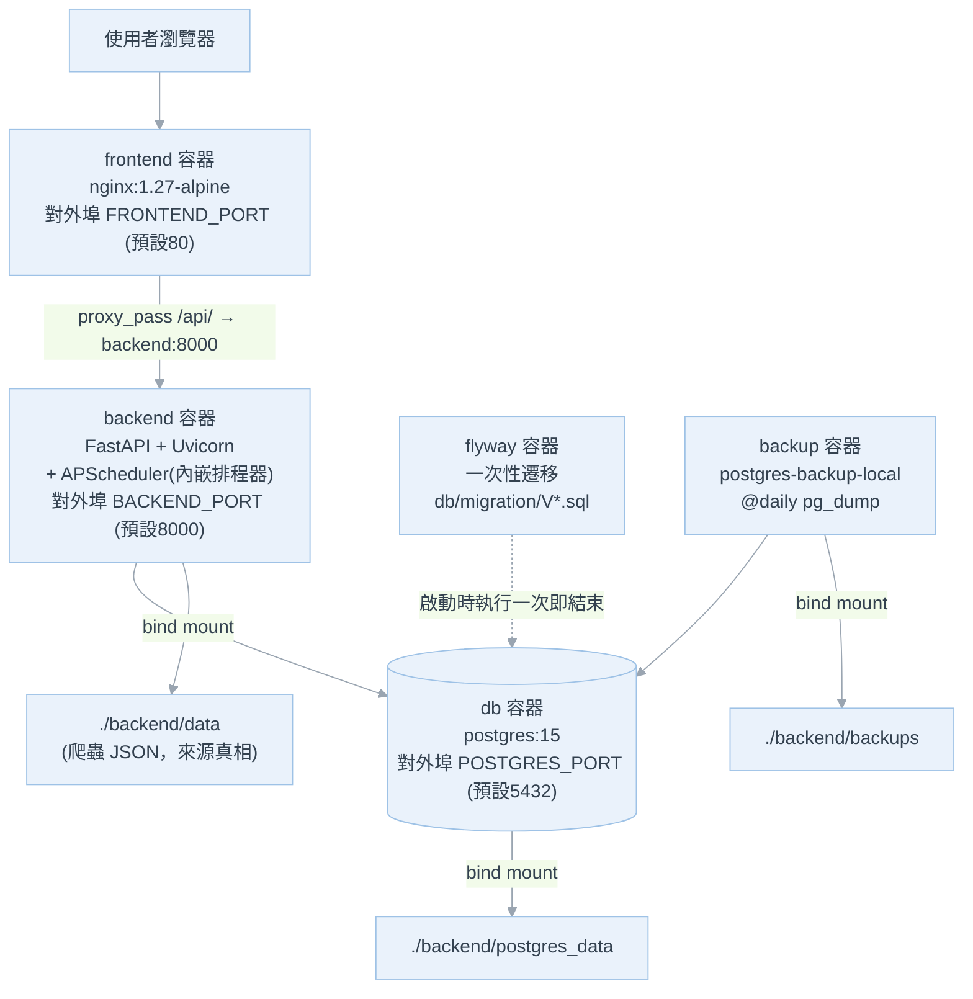
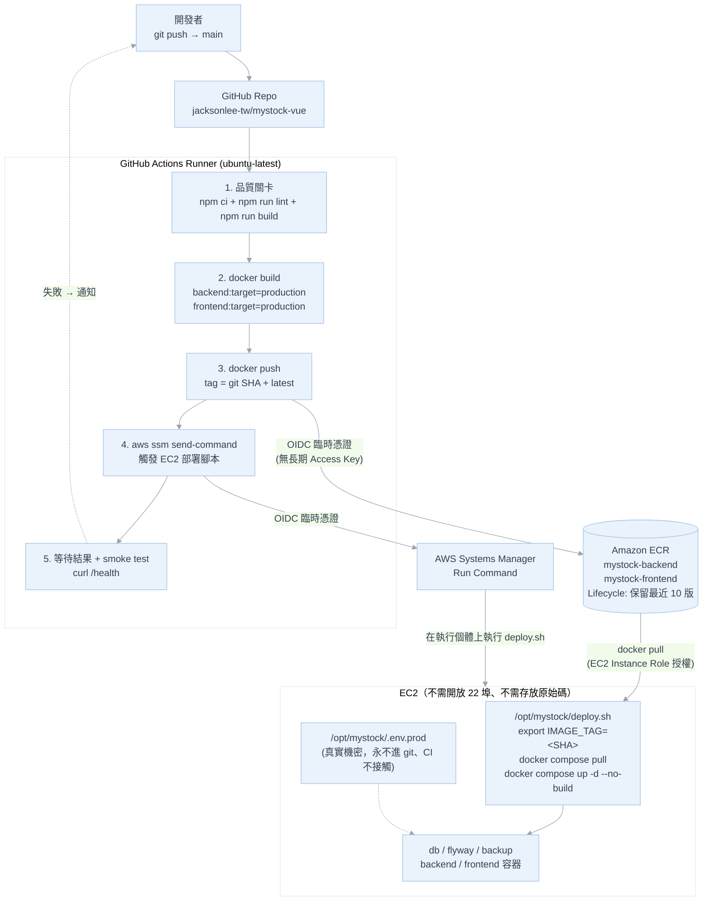
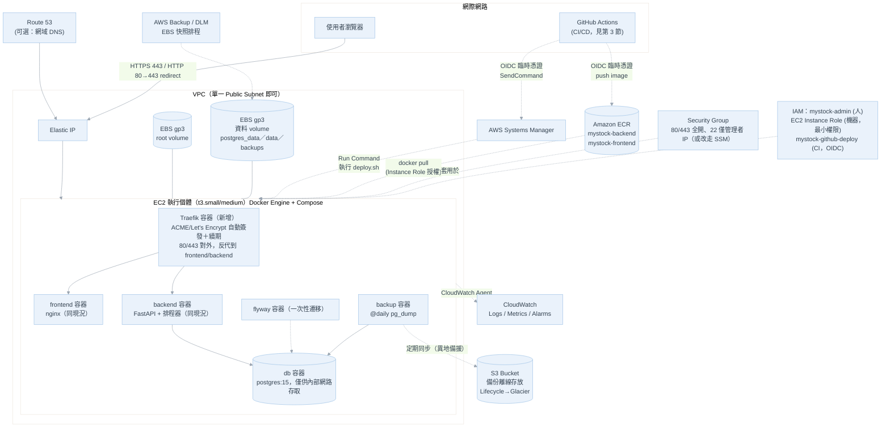

# MyStock 部署到 AWS 計劃（Docker Compose 方式）

> 狀態：規劃階段（本文件僅為部署計畫，未包含任何程式碼變更）
> 最後更新：2026-09-06
> AWS 帳號：`jackson1229@gmail.com`
> 程式碼倉庫：<https://github.com/jacksonlee-tw/mystock-vue.git>
> 對應分支／環境檔：`main` branch → `.env.prod`（見根目錄 `docker-compose.yml` 檔頭說明）

**本次更新重點**：新增 **第 3 節「CI/CD 策略建議」**（回答「是否要整合 GitHub CI/CD，由 GitHub build code 再 deploy 到 AWS」），並同步調整第 4／5／6／9／12／13／14／15／16／17 節中與 CI/CD 相關的內容。原第 3～17 節整體順延一號。

---

## 0. 文件目的與範圍

- **目的**：規劃如何把現有「單機 Docker Compose 全端部署」（`docker-compose.yml` + `.env.prod`）搬到 AWS 上長期營運，取代個人電腦/本機環境。
- **範圍**：涵蓋**基礎設施、部署作業與 CI/CD 流程設計**（AWS 資源、網路、機密管理、備份、監控、安全加固、成本、GitHub Actions 流水線設計），**不涉及應用程式碼修改**。凡是需要改程式碼、改 compose/Dockerfile、或新增 workflow 檔才能落地的項目，本文一律標註為「後續待辦（需開發）」，先不動手。
- **前提**：延續專案既有慣例——四個環境（prod/test/dev/local）共用同一份 `docker-compose.yml`，用 `--env-file .env.<env>` 切換；AWS 上只建置 **prod** 一個環境。

---

## 1. 現況架構（部署前）



**重點**：
- 目前 `docker-compose.yml` 的 5 個服務（db / flyway / backup / backend / frontend）全部跑在**同一台主機**，靠 bind mount 落地資料，沒有反向代理閘道、沒有 TLS、資料庫連 host port 都直接對外映射。
- 兩個自建服務都用 `build:` 就地建置（`backend` → `target: production`、`frontend` → `target: production`），**沒有** registry、沒有版本化 image tag。
- `.env.prod` 已存在且已進版控（範本值、無真實機密），但只涵蓋 `APP_ENV`/埠號/`POSTGRES_*`/`DATA_SOURCE` 等根層變數，**未包含** `backend/.env.example` 定義的通知平台（`NOTIFY_*`）、AI 診股（`AI_*`）、擁有者登入（`OWNER_*`）、排程（`*_SCHEDULE_*`）等變數（見第 8 節「已知落差」）。
- 專案已有 GitHub 遠端倉庫，但 **尚未有任何 `.github/workflows/`**，目前完全依賴本機手動建置與部署。

---

## 2. 部署方式選型

| 方案 | 說明 | 是否符合「用 Docker Compose 部署」 | 評估 |
|---|---|---|---|
| **EC2 單機 + Docker Compose（建議）** | 一台 EC2（Ubuntu/Amazon Linux）裝 Docker + Compose plugin，直接 `docker compose up -d`，與本機部署流程 100% 相同 | ✅ 完全符合，零額外改動 | 學習成本最低、與現有 compose/Dockerfile 完全相容、成本可控。個人專案流量小，單機足夠 |
| Lightsail（Amazon Lightsail 執行個體） | 本質也是一台 VM，操作方式與 EC2 相同，但採固定月費、內建靜態 IP、防火牆 UI 較簡單 | ✅ 符合 | 對「不想碰太多 AWS 主控台」的個人專案是不錯的替代方案，可作為 EC2 的備案，本計畫仍以 EC2 為主，兩者部署步驟幾乎一致。**但要注意**：Lightsail 與 IAM/SSM/ECR 的整合不如 EC2 順暢，若要走第 3 節的 CI/CD 方案，EC2 是明顯較佳選擇 |
| ECS Fargate / `docker compose ecs` | 把 compose 檔轉譯成 ECS Task/Service | ⚠️ 名義上支援，實際要重新設計儲存（EFS 取代 bind mount）、health check、networking，且 `docker compose ecs` 整合已多年未積極維護 | 對個人專案過度複雜，且 Postgres 用容器化在 Fargate 上管理儲存/備份麻煩，不建議 |
| EKS / Kubernetes | 需要 K8s manifest、非本次「Docker Compose」需求 | ❌ 不符合需求描述 | 排除 |

**結論：採「單一 EC2 執行個體 + Docker Compose」**，與現有 `docker-compose.yml` / `.env.prod` 流程完全對齊，之後若流量成長可再評估拆分資料庫（RDS）或改用 ECS。

---

## 3. CI/CD 策略建議（GitHub Actions → AWS）

> 本節回答使用者提問：**「是否要整合 GitHub 的 CI/CD，由 GitHub build code，再 deploy 到 AWS？」**

### 3.1 結論（先講建議）

**建議：要整合，而且建議採「GitHub Actions 建 image → 推送 Amazon ECR → 透過 AWS SSM 命令 EC2 拉取並重啟」的模式；但分兩階段導入，第一次上線先手動，跑通之後再自動化。**

| 階段 | 做法 | 目的 |
|---|---|---|
| **Phase 1：手動部署（先做）** | 依第 9 節 Runbook，SSH 進 EC2 手動 `git clone` + `docker compose up -d --build` | 先把系統跑起來、驗證**最大未知數**（MOPS WAF 是否封鎖 AWS IP，見第 13 節）。CI/CD 是把「已經確定可行的流程」自動化，流程都還沒確定就先寫流水線，等於在不穩定的地基上蓋房子 |
| **Phase 2：導入 CI/CD（跑通後再做）** | 建 ECR + GitHub OIDC + workflow，改為 push `main` 自動部署 | 消除手動 SSH 的人為疏漏、讓回滾變成「切 tag」、把建置負載移出 EC2 |

**如果只能記一句話**：這個專案的兩個 image 已經被設計成「環境無關」（見 3.2 理由一），所以它天生就適合 CI 建置；而在 EC2 上就地 build 反而是這個架構最脆弱的一環。

### 3.2 為什麼建議「由 GitHub build」而不是「在 EC2 上 build」

**理由一：這個專案的 image 本來就是環境無關的，build-once/deploy-anywhere 天然成立**

這是最關鍵的技術事實，而且是專案既有設計刻意造成的：

- `frontend/Dockerfile` 註解明寫：「`VITE_API_BASE` 於建置期烘進 JS，預設為相對路徑 `/api/v1`，交由 `nginx.conf` 轉發至 `backend:8000`，因此**同一份建置產物換環境／換主機都不需要重新建置**」。
- `backend/Dockerfile` 註解明寫：「`.env` 也不烘進 image（見 `.dockerignore`），啟動所需設定改用 docker-compose 的 environment 區塊注入」。

也就是說，**image 裡沒有任何環境專屬的東西**，環境差異 100% 由 EC2 上那份真實 `.env.prod` 在執行期注入。這正是 CI 建置的前提條件——很多專案要導入 CI/CD 時必須先重構掉「build 時綁定環境」的設計，而本專案不用，**零重構成本**。

**理由二：EC2 上 build 有實際的記憶體風險（會直接影響機型選擇與成本）**

`frontend` 的 `build` stage 要跑 `npm ci` + `npm run build`（Vite + Vue 3 + PrimeVue + ECharts），Node 建置尖峰通常吃 1～2GB RAM。若在 `t3.small`（2GiB）上，於 Postgres／backend 已在執行時同時 build，**很可能 OOM 而建置失敗**（典型症狀：`npm run build` 被 kill、Docker build 中斷）。

這條理由有直接的成本後果：

- **若在 EC2 上 build** → 為了 build 尖峰，機型至少要 `t3.medium`（4GiB，約 US$30～35/月），或另外掛 swap 硬撐（拖慢且不可靠）。
- **若在 GitHub 上 build** → EC2 只做 `docker pull` + `up -d`，執行期記憶體需求低很多，**`t3.small` 就夠（約 US$15/月）**。

**每月省下的約 US$15，遠大於 ECR 的儲存費（不到 US$1）**，等於導入 CI/CD 不但沒有增加成本，還降低了成本。

**理由三：版本化 image tag 讓「回滾」從「重新 build」變成「切 tag」**

目前架構（原第 12 節風險表已列出這個缺口）沒有 image tag，回滾要 `git checkout` 舊 commit 再 `--build` 重建一次，慢且不保證重現（上游 base image、npm/pip 依賴解析可能已經漂移，同一個 commit 不同時間 build 出來的 image 未必相同）。

導入 ECR + tag（用 git commit SHA）後：

- 回滾 = `IMAGE_TAG=<舊SHA> docker compose up -d`，數十秒完成，且**拉到的是當初上線那顆一模一樣的 image**（bit-for-bit 相同），不受依賴漂移影響。
- 「哪個版本正在線上」變成可查（`docker compose images` / ECR 主控台），不再靠人記得。

**理由四：縮短部署期間的服務中斷，且不必在伺服器上放 GitHub 憑證**

- 中斷時間：EC2 build 需要數分鐘（npm ci + vite build + pip install）；改成 pull 只需數十秒（且分層快取下多半只拉變動層）。
- 憑證面：目前規劃是在 EC2 上 `git clone`（需要 Deploy Key）。改用 CI/CD 後，**EC2 上完全不需要原始碼與 git 憑證**，只留 compose 檔、`.env.prod` 與資料目錄——攻擊面更小，也少一組要保管的金鑰。

**理由五：品質關卡（CI 的另一半價值）**

專案有 `npm run lint`（前端）但**無前後端測試套件**（CLAUDE.md 明載）。CI 至少可以擋住兩類低級錯誤，這在只有單人維護時特別有價值：

- PR / push 時跑 `npm run lint` 與 `npm run build` → 前端語法錯誤、import 錯誤不會被部署到雲端才發現。
- `docker build` 兩個 image → 依賴安裝失敗（例如 `requirements.txt` 版本衝突）在 CI 就攔下，不會讓 EC2 上的服務 build 到一半掛掉。

### 3.3 建議的 CI/CD 架構



**設計要點**：

1. **機密的分工非常乾淨**——CI 只負責「建置與搬運不含機密的 image」；真實機密（`POSTGRES_PASSWORD`、`NOTIFY_SECRET_KEY`、`OWNER_PASSWORD_HASH`、`CLAUDE_API_KEY`…）**永遠只存在 EC2 上那份未進版控的 `.env.prod`，完全不經過 GitHub**。這比常見的「把 .env 內容整包塞進 GitHub Secrets 再寫到伺服器」安全得多，也完全符合第 8 節既有的機密管理原則。
2. **EC2 不需要開 22 埠**——部署指令走 SSM Run Command，與第 12 節「改用 SSM Session Manager、完全不開 SSH」的安全建議是同一套機制，一次設定兩邊都受惠。
3. **GitHub 不持有 AWS 長期金鑰**——用 GitHub OIDC + IAM Role（trust policy 限定 `repo:jacksonlee-tw/mystock-vue:ref:refs/heads/main`），每次執行取得 15 分鐘臨時憑證。這是目前 AWS 官方推薦的做法，也避免了「Access Key 外洩後被拿去挖礦」這個個人專案最常見的災難。
4. **`flyway` 遷移不需要特別處理**——`docker compose up -d` 會照既有 `depends_on` 順序重跑一次性的 flyway 容器，Flyway 本身冪等，已套用的 migration 會跳過。

### 3.4 選型比較：GitHub Actions 用什麼方式「命令 EC2 部署」

| 方案 | 做法 | 安全性 | 評估 |
|---|---|---|---|
| **AWS SSM Run Command（建議）** | Actions 以 OIDC 取得臨時憑證後呼叫 `aws ssm send-command`，在 EC2 上執行 `/opt/mystock/deploy.sh` | ⭐⭐⭐⭐⭐ EC2 **完全不用開 22 埠**、無需保管 SSH 私鑰 | 需要 EC2 裝 SSM Agent（Ubuntu 22.04/24.04、Amazon Linux 2023 皆預裝）＋ Instance Role 掛 `AmazonSSMManagedInstanceCore`。send-command 是非同步，workflow 需以 `aws ssm wait command-executed` 等待並取回 log 判斷成敗 |
| SSH from Actions（`appleboy/ssh-action` 等） | 把 EC2 私鑰放 GitHub Secrets，Actions 直接 SSH 進去下指令 | ⭐⭐ **不建議** | GitHub 託管 runner 的出口 IP 不固定，等於 Security Group 的 22 埠必須對極大範圍（實務上常變成 0.0.0.0/0）開放；且長期 SSH 私鑰存在 GitHub。與第 12 節安全加固方向相衝突 |
| Pull-based（EC2 端 cron 或 Watchtower 定期檢查新 image） | EC2 主動輪詢 registry，有新版就換 | ⭐⭐⭐⭐ 不需開任何入站權限 | 部署時機不可控（要等輪詢週期）、失敗不易回報到 PR/commit、Watchtower 自動更新對「有資料庫遷移」的服務較危險。可作為 SSM 不可行時的備案 |
| AWS CodeDeploy / CodePipeline | 用 AWS 原生 CD 服務 | ⭐⭐⭐⭐ | 對單機 Compose 部署過度複雜（要寫 appspec、裝 CodeDeploy Agent、管 lifecycle hook），而且與「用 GitHub 當唯一 CI」的目標重疊。個人專案不建議 |

### 3.5 選型比較：image registry 放哪裡

| 方案 | 評估 |
|---|---|
| **Amazon ECR（建議）** | EC2 憑 **Instance Role** 即可拉取，**機器上不需要任何 registry 帳密**；與 EC2 同 Region 時拉取流量不計費；可設 Lifecycle Policy 自動刪舊 image（例如只留最近 10 個 tag）控制成本；內建 image 弱點掃描（basic scanning 免費），正好呼應第 12 節第 8 項。私有儲存 US$0.10/GB-月，本專案兩個 image 保留 10 版約數 GB，**每月不到 US$1** |
| GitHub Container Registry (GHCR) | Actions 推送最簡單（直接用 `GITHUB_TOKEN`），但若 repo 為 private，**EC2 端拉取需要另外保管一組 PAT**（又多一個長期憑證要輪替），且跨網拉取流量走公網。若 repo 是 public 則可免憑證拉取，是可接受的替代方案 |
| Docker Hub | 免費方案有拉取速率限制、private repo 數量限制，不建議用於正式環境 |

### 3.6 導入 CI/CD 需要的改動清單（**後續待辦，本次不開發**）

> 以下每一項都需要實際新增/修改檔案，依使用者指示本次一律**不動手**，僅列出範圍供評估工作量。

**A. 專案內（需開發）**

| # | 改動 | 說明 | 影響既有流程？ |
|---|---|---|---|
| A1 | 新增 `.github/workflows/deploy-prod.yml` | push `main` 觸發：lint → build → push ECR → SSM 部署 → smoke test | 全新檔案，不影響現有 |
| A2 | 新增 `.github/workflows/ci.yml`（可選但建議） | PR 觸發：只跑 lint + docker build，不部署 | 全新檔案 |
| A3 | `docker-compose.yml` 的 `backend`／`frontend` 各補一行 `image:` | 例：`image: ${ECR_REGISTRY:-mystock}/mystock-backend:${IMAGE_TAG:-local}`。Compose 允許 `build:` 與 `image:` 並存——**本機仍可 `up -d --build`（行為不變）**，雲端則用 `docker compose pull` + `up -d --no-build` 走 registry。這是本清單中唯一動到既有檔案的項目，且為向後相容的追加 | ⚠️ 動到既有檔案，但預設值設計成「不帶 `IMAGE_TAG` 時行為與現在相同」 |
| A4 | 新增 `deploy.sh`（部署腳本，放 repo 內或直接置於 EC2） | 內容：`export IMAGE_TAG=$1` → `aws ecr get-login-password \| docker login` → `docker compose --env-file .env.prod pull` → `up -d --no-build` → `docker image prune -f` | 全新檔案 |
| A5 | （可選）`docker-compose.traefik.yml` 併入正式流程 | 與第 7 節 HTTPS 規劃一併處理，非 CI/CD 必要項 | — |

> **A3 的替代方案**：若不想動 `docker-compose.yml`，可改新增疊加檔 `docker-compose.registry.yml`（用 `!reset` 清掉 `build:`，需 Compose v2.24+），部署時 `-f docker-compose.yml -f docker-compose.registry.yml`。與專案既有 `docker-compose.traefik.yml` 的疊加檔慣例一致，但部署指令會變長。**建議採 A3 本體追加 `image:`**，更簡潔且預設行為不變。

**B. AWS 端（設定，非開發）**

| # | 資源 | 說明 |
|---|---|---|
| B1 | ECR repository ×2 | `mystock-backend`、`mystock-frontend`，各設 Lifecycle Policy（保留最近 10 個 tag）、開啟 scan on push |
| B2 | IAM OIDC Identity Provider | Provider URL `token.actions.githubusercontent.com`，一個帳號設定一次 |
| B3 | IAM Role `mystock-github-deploy` | 信任政策**限定** `repo:jacksonlee-tw/mystock-vue:ref:refs/heads/main`（務必限定到分支，否則任何分支/fork PR 都可能取得部署權限）；權限僅 ECR push/pull + `ssm:SendCommand`（限定該執行個體）+ `ssm:GetCommandInvocation` |
| B4 | EC2 Instance Role 增補 | 既有的 S3/CloudWatch 權限外，加上 ECR 唯讀拉取（`AmazonEC2ContainerRegistryReadOnly`）與 `AmazonSSMManagedInstanceCore` |
| B5 | EC2 上準備 `/opt/mystock/` | 只需 `docker-compose.yml`、`deploy.sh`、真實 `.env.prod` 與資料目錄；**不需要完整原始碼、不需要 git 憑證** |

**C. GitHub 端（設定，非開發）**

| 類型 | 項目 | 備註 |
|---|---|---|
| Variables（非機密） | `AWS_REGION`、`AWS_ROLE_ARN`、`ECR_REGISTRY`、`EC2_INSTANCE_ID` | 用 Repository Variables 即可，這些不是機密 |
| Secrets | **理想狀況為 0 個** | 採 OIDC 後不需要 `AWS_ACCESS_KEY_ID`／`AWS_SECRET_ACCESS_KEY`。應用程式機密全在 EC2 的 `.env.prod`，不進 GitHub |
| Environment protection（可選） | 建立 `production` environment 並開啟 required reviewers | 讓 `main` 的部署需按一次確認再執行，避免誤 push 直接上線 |

### 3.7 分支策略如何對應（沿用專案既有慣例）

專案已定義 `main→prod / test→test / dev→dev` 的分支↔環境對應（`docker-compose.yml` 檔頭），CI/CD 直接沿用即可，不需另創規則：

| 分支 | Workflow 行為 | 備註 |
|---|---|---|
| PR → 任意分支 | 只跑 CI（lint + build），**不部署** | 品質關卡 |
| push `main` | build → push ECR（tag = git SHA）→ 部署到 AWS prod | 本次唯一要上雲的環境 |
| push `test` / `dev` | 本階段**不接 AWS**（AWS 上只建 prod 一個環境，見第 0 節前提） | 若日後要多環境，可在同一台 EC2 用不同埠號跑第二套 compose（四環境預設埠號本來就不衝突），或另開執行個體 |

> ⚠️ 注意：目前工作分支是 `feature/message-plateform`，尚未合併回 `main`。導入 CI/CD 前需先確認 `main` 分支的內容即為要上線的版本。

### 3.8 不建議的做法（反模式，避免踩坑）

| 反模式 | 為什麼不好 |
|---|---|
| 在 workflow 裡用 `.env.prod` 的完整內容當 GitHub Secret，部署時寫到伺服器 | 把所有應用機密複製到第三方平台，違反第 8 節「真實機密只存在伺服器上」的既有原則。機密應該只在 EC2 上產生與保存 |
| 讓 CI 直接 `ssh` 進去 `git pull && docker compose up -d --build` | 等於只是把手動指令搬到雲端跑，**完全沒有解決 EC2 build 的記憶體與中斷問題**，還多開了 SSH 攻擊面（見 3.4） |
| image 只打 `latest` tag | 無法回滾、無法確認線上跑的是哪一版。**一定要用 git SHA 當主 tag**，`latest` 只當附加別名 |
| workflow 內用長期 AWS Access Key | 個人專案最常見的外洩來源。OIDC 設定只多花約 15 分鐘，但風險等級差一個量級 |
| 自動部署順便自動跑 `docker compose down -v` 或清資料卷 | `-v` 會刪掉 volume；本專案雖用 bind mount 較安全，但部署腳本仍應**明確禁止**任何觸及 `postgres_data`／`data`／`backups` 的指令 |

### 3.9 如果「暫時不導入 CI/CD」

也是可接受的選擇（尤其在 Phase 1），但請務必補上這兩點以降低風險：

1. **建置記憶體**：機型至少 `t3.medium`，或在 `t3.small` 上先建立 2GB swap 再 build，並在 build 前 `docker compose stop` 前端以外的服務以釋放記憶體。
2. **部署可重現性**：每次手動部署後，記錄當下的 git commit SHA（例如寫進 `/opt/mystock/DEPLOYED_SHA`），否則出事時無法確認線上版本，回滾只能靠猜。

### 3.10 CI/CD 的成本影響（本節結論的量化）

| 項目 | 成本 |
|---|---|
| GitHub Actions | public repo 免費無限；private repo Free 方案每月 2,000 分鐘。本專案單次流水線約 4～6 分鐘，即使每天部署一次也僅約 180 分鐘/月，**免費額度內** |
| Amazon ECR | 兩個 repo，保留 10 版約 3～5GB → 約 **US$0.3～0.5/月**；與 EC2 同 Region 拉取流量免費 |
| AWS Systems Manager Run Command | **免費**（標準版無額外費用） |
| **節省** | 建置移出 EC2 後可由 `t3.medium` 降為 `t3.small` → **每月省約 US$15** |
| **淨效果** | **每月淨省約 US$14**，同時取得版本化回滾、免 SSH 部署、CI 品質關卡 |

---

## 4. AWS 帳號與存取規劃

| 項目 | 規劃 |
|---|---|
| Root 帳號 | `jackson1229@gmail.com`。**僅用於帳單與初始設定**，開啟 MFA，日常操作一律不使用 root |
| IAM 使用者 | 新建 `mystock-admin`（或改用 IAM Identity Center），僅授予部署所需最小權限（EC2、EBS、VPC、Route 53、S3、CloudWatch、Backup、ECR），並強制 MFA |
| EC2 Key Pair | 新建專用金鑰對 `mystock-prod-key`，私鑰只存在管理者本機（絕不進 git、絕不上傳雲端硬碟明文）。若採 SSM Session Manager 連線，此項可省略 |
| EC2 IAM Role（Instance Profile） | 給執行個體掛一個最小權限 Role，僅允許：上傳備份到指定 S3 bucket、寫入 CloudWatch Logs/Metrics、**從 ECR 唯讀拉取 image**、**被 SSM 管理**（`AmazonSSMManagedInstanceCore`）。**不要**在機器上放長期 Access Key |
| GitHub OIDC Provider（CI/CD 用） | IAM Identity Provider 指向 `token.actions.githubusercontent.com`，全帳號設定一次 |
| IAM Role `mystock-github-deploy`（CI/CD 用） | 供 GitHub Actions 以 OIDC 擔任。信任政策**必須限定** `repo:jacksonlee-tw/mystock-vue:ref:refs/heads/main`；權限僅 ECR push/pull ＋ 對指定執行個體的 `ssm:SendCommand`／`ssm:GetCommandInvocation`。詳見第 3.6 節 B3 |
| 帳單告警 | 開啟 AWS Budgets / CloudWatch Billing Alarm，超過門檻（例如 US$50/月）寄信到 `jackson1229@gmail.com` |

---

## 5. 目標架構設計（AWS）



**與現況的主要差異**：
1. 新增 **Traefik** 作為邊緣反向代理，統一處理 TLS（Let's Encrypt ACME）與網域路由，取代現行「nginx 直接對外、無 HTTPS」的作法。可沿用專案既有的 `docker-compose.traefik.yml`（目前是「範例／未來擴充」檔），日後只需在同機額外啟動一個 Traefik 容器並建立 `edge` network，即可直接套用。
2. **Postgres 不再對外映射 host port**——現行 `docker-compose.yml` 的 `db` 服務有 `ports: "${POSTGRES_PORT:-5432}:5432"`，雲端上必須靠 Security Group 擋掉 5432 對外（見第 12 節），資料庫僅透過 Docker 內部網路給 `backend`/`flyway`/`backup` 存取。
3. 資料落地改放在**獨立 EBS 資料卷**（而非只靠 root volume），方便日後單獨擴容/快照。
4. 備份除了現有的每日 `pg_dump`（本機保留 30 天/4 週/6 月），加一道**異地備援**：定期把 `backend/backups` 同步到 S3（生命週期規則轉 Glacier / 到期刪除），加上 **EBS 快照**排程，雙重保護。
5. **（Phase 2）新增 ECR + GitHub Actions 流水線**：image 改由 GitHub 建置並推入 ECR，EC2 僅拉取執行、不再就地 build，亦不再需要保存原始碼與 git 憑證（見第 3 節）。

---

## 6. AWS 資源規格清單

| 資源 | 規格建議 | 說明 |
|---|---|---|
| Region | `ap-northeast-1`（東京） | 目前無台灣 Region；東京在服務完整度與延遲間最平衡。若對延遲極敏感可評估 `ap-east-1`（香港），但服務項目較少、成本略高 |
| VPC | 沿用該 Region 的 Default VPC 即可（個人專案不需自建多層 VPC） | 減少維運複雜度 |
| Subnet | 1 個 Public Subnet | 單機部署，不需要 Private Subnet/NAT Gateway（可省下 NAT Gateway 費用） |
| EC2 執行個體 | **導入 CI/CD 後：`t3.small`（2 vCPU / 2GiB）即可**；<br>若堅持在 EC2 上 build：建議 `t3.medium`（2 vCPU / 4GiB） | 建置負載是機型選擇的主要驅動因素，理由見第 3.2 節理由二。`t3` 系列為 burstable，需留意 CPU Credit（見第 13 節風險） |
| AMI | Ubuntu 22.04/24.04 LTS 或 Amazon Linux 2023 | 兩者皆可，Ubuntu 對 Docker 官方安裝腳本相容性較直覺；兩者皆預裝 SSM Agent（CI/CD 部署所需） |
| Root EBS | gp3、20GB | 系統與 Docker image 層 |
| 資料 EBS | gp3、40～50GB（可隨用量擴充） | 掛載後綁定 `/opt/mystock/backend/postgres_data`、`data`、`backups` |
| Elastic IP | 1 個，綁定 EC2 | 固定對外 IP，供 DNS/憑證使用 |
| Security Group | 見第 12 節 | 80/443 對外；22 僅限管理者來源 IP 或直接不開放（改走 SSM Session Manager） |
| Route 53（可選） | Hosted Zone + A/ALIAS record 指向 Elastic IP | 若尚無網域，需先決定是否透過 Route 53 註冊新網域（見第 17 節待確認事項） |
| **ECR（Phase 2）** | 2 個 private repository：`mystock-backend`、`mystock-frontend`；Lifecycle Policy 保留最近 10 個 tag；開啟 scan on push | CI/CD 用；成本約 US$0.3～0.5/月（見第 3.10 節） |
| **SSM（Phase 2）** | 不需建立資源，僅需 EC2 掛上 `AmazonSSMManagedInstanceCore` 並確認 SSM Agent 執行中 | 免費；同時提供免 SSH 的維運連線 |
| S3 Bucket | 例如 `mystock-backups-prod`，開啟版本控制＋生命週期規則 | 存放異地備援的 DB dump |
| AWS Backup 或 DLM | 每日快照，保留 7 天／每週快照保留 4 週 | 對資料 EBS 卷排程 |
| CloudWatch | Log Group（系統/Docker 日誌）＋ 基本 Alarm（CPU、磁碟、健康檢查） | 見第 11 節 |
| IAM | `mystock-admin`（人）＋ EC2 Instance Role（機器）＋ `mystock-github-deploy`（CI，OIDC） | 見第 4 節 |

---

## 7. 網域與 HTTPS 規劃

- **為什麼一定要 HTTPS**：專案的擁有者登入機制（`OWNER_*`）與通知平台的收件人自助訂閱（`/n/me`）都涉及 Cookie 驗證；`backend/.env.example` 明確有 `NOTIFY_ALLOW_INSECURE_COOKIE=false` 這個安全開關，代表正式環境本來就設計成需要 HTTPS 才能安全運作（Secure Cookie）。純 HTTP 對外會是明確的安全缺口。
- **做法**：EC2 上以 **Traefik + Let's Encrypt ACME** 承接 80/443，自動簽發並自動續期憑證；`frontend`/`backend` 維持現行 nginx/uvicorn 設定不變，只需在 compose 疊加層加上 Traefik 的 label（沿用專案既有 `docker-compose.traefik.yml` 的 label 寫法，把範例網域換成實際網域）。
- **網域**：需使用者提供已持有網域，或透過 Route 53 註冊新網域（見第 17 節）。若短期內不申請網域，可先以「Elastic IP + 自簽憑證」上線做內部驗證，但**正式對外使用前務必補上真實網域 + 受信任憑證**。

---

## 8. 環境變數與機密管理

### 8.1 現行 `.env.prod` 落差盤點

根目錄 `docker-compose.yml` 的 `backend` 服務透過 `env_file: .env.${APP_ENV}`（即 `.env.prod`）注入環境變數；但目前 `.env.prod` 只有下列變數：

```
APP_ENV, BACKEND_PORT, FRONTEND_PORT, POSTGRES_PORT, VITE_API_BASE,
MONTHS_RANGE, QUARTERS_RANGE, ENABLED_MARKETS, DATA_SOURCE, BACKFILL_MAX_DAYS,
POSTGRES_DB, POSTGRES_USER, POSTGRES_PASSWORD, POSTGRES_HOST
```

而 `backend/.env.example` 另外定義了一大批目前 **不在** `.env.prod` 裡的變數：`NOTIFY_*`（通知平台）、`OWNER_*`（擁有者登入）、`TELEGRAM_*`、`*_SCHEDULE_*`（排程時間，目前有內建預設值）、`AI_*`（AI 診股，`CLAUDE_API_KEY`/`GEMINI_API_KEY` 等）。

**待辦（部署前必須決定）**：依「第 17 節待確認事項」使用者的功能需求，把要在雲端啟用的功能對應變數補進**伺服器上實際使用的 `.env.prod`**（不是 git 裡那份範本）。若不補齊，這些功能在雲端會維持關閉／預設值（例如 `NOTIFY_ENABLED=false`、`AI_ANALYSIS_ENABLED=false` 沿用範本預設，行為上是安全的，但功能不會運作）。

> **導入 CI/CD 後新增的變數**：`IMAGE_TAG`（要部署的 image 版本，即 git commit SHA）與 `ECR_REGISTRY`。建議**不要**寫死在 `.env.prod`，而由 `deploy.sh` 以 shell 環境變數 `export` 後再呼叫 compose——Compose 的變數優先序為「shell 環境變數 > `--env-file` > `.env`」，因此 shell 傳入的值會正確覆蓋，且不必每次部署去改檔案。

### 8.2 機密管理原則

1. **git 裡的 `.env.prod` 永遠只是範本**（無真實密碼／金鑰），這是專案既有規範（檔頭已註記「可安全進版控」）。**絕對不要**把真實密碼／API 金鑰寫回這份會被 commit 的檔案。
2. 伺服器上實際使用的 `.env.prod`（含真實 `POSTGRES_PASSWORD`、`NOTIFY_SECRET_KEY`、`OWNER_PASSWORD_HASH`、`CLAUDE_API_KEY` 等）另存在 EC2 上的 `/opt/mystock/.env.prod`，**不納入 git 追蹤**（部署時用 `scp`/手動編輯放上去，而不是 `git pull` 帶上真實機密）。
3. 檔案權限：`chmod 600`，擁有者限定為部署用的系統帳號，避免其他本機使用者/程序讀取。
4. **CI/CD 不接觸應用機密**：GitHub Actions 只負責建置與部署觸發，**不需要也不應該持有** `.env.prod` 的任何內容。GitHub 端理想上為 0 個 Secret（AWS 存取走 OIDC 臨時憑證）。這是採 3.3 節架構的重要好處，也是 3.8 節列為反模式的「把 .env 塞進 GitHub Secrets」之所以要避免的原因。
5. （進階、可選，列為後續強化）改用 **AWS Systems Manager Parameter Store（SecureString）** 或 **Secrets Manager** 集中存放機密，部署腳本啟動前先 `aws ssm get-parameters` 產生 `.env.prod`，可避免明文檔案長期留在磁碟上，且方便輪替密鑰。導入 CI/CD 後這一步會變得特別自然（`deploy.sh` 已在跑、EC2 已有 Instance Role），可列為 Phase 3。
6. `NOTIFY_SECRET_KEY`（Fernet key）、`OWNER_PASSWORD_HASH`（bcrypt）在**伺服器上首次部署時**各自產生一次即可，兩者一旦變更會讓既有加密資料/密碼失效，需謹慎保管、不可遺失。

---

## 9. 部署作業程序（Runbook）

> 以下步驟為「規劃」用的作業順序，實際執行時建議先在 test/dev 環境（或本機）演練一次。
> **Phase 1（步驟 1～7）為首次手動上線；Phase 2（步驟 8）為導入 CI/CD，建議 Phase 1 驗證完成後再進行（理由見第 3.1 節）。**

### Phase 1：首次手動部署

1. **AWS 基礎設施建置**
   - 建立 IAM 使用者/角色、Key Pair、Security Group（見第 4、12 節）
   - 於目標 Region 啟動 EC2 執行個體（AMI／規格見第 6 節），掛載 root + 資料 EBS 卷
   - 配置並綁定 Elastic IP
   - （若已決定網域）Route 53 建立 DNS record 指向 Elastic IP
2. **主機初始化**
   - SSH 登入，作業系統更新（`apt update && apt upgrade` / `dnf upgrade`）
   - 安裝 Docker Engine + Docker Compose plugin（官方腳本或套件庫）
   - 格式化並掛載資料 EBS 卷到 `/opt/mystock/backend`（或以 bind mount 對應現有目錄結構）
   - 建立部署用系統帳號（非 root），加入 `docker` 群組
   - 確認 SSM Agent 執行中（`systemctl status amazon-ssm-agent`），為 Phase 2 與免 SSH 維運預作準備
3. **程式碼與設定佈署**
   - 於 `/opt/mystock` clone 專案（建議用限定唯讀權限的 Deploy Key，而非個人 SSH 私鑰）
   - 依第 8 節，於伺服器上準備**真實**的 `.env.prod`（覆蓋掉 git 裡的範本內容，且此檔不可被 commit）
   - 確認 `backend/data`、`backend/postgres_data`、`backend/backups` 目錄存在且指向資料 EBS 卷
4. **啟動服務**
   ```bash
   cd /opt/mystock
   docker compose --env-file .env.prod -f docker-compose.yml up -d --build
   ```
   - ⚠️ 若機型為 `t3.small`，`frontend` 的 `npm run build` 可能因記憶體不足失敗（見第 3.2 節理由二）。可先建立 swap 或暫停其他容器後再 build
   - 確認 `docker compose ps` 五個服務皆為 `healthy`
   - `curl http://127.0.0.1:8000/health`（後端）、瀏覽 Elastic IP 確認前端可載入
   - 記錄本次部署的 git commit SHA（例如 `git rev-parse HEAD > /opt/mystock/DEPLOYED_SHA`）
5. **接上 HTTPS（Traefik）**
   - 啟動 Traefik 容器（沿用 `docker-compose.traefik.yml` label 樣式，網域改為實際網域），確認憑證簽發成功
   - 驗證 HTTP → HTTPS 自動導向、憑證資訊正確
6. **驗證關鍵業務功能**
   - 手動觸發一次台股/美股抓取（`/fetch/trigger`），確認 JSON + Postgres 雙寫正常
   - 手動觸發 MOPS 月營收抓取，**驗證雲端 IP 是否被 WAF 封鎖**（見第 13 節風險，這是本次部署最需要提前確認的未知數）
   - 確認排程器（TW 14:30 / US 06:00，Asia/Taipei）已掛上（看 `backend` 容器 log）
   - 確認 `backup` 容器產出當日 dump 檔
7. **收尾**
   - 開啟 CloudWatch 監控/告警（第 11 節）
   - 建立 EBS 快照排程（第 10 節）
   - 對照第 16 節「上線檢查清單」逐項確認

### Phase 2：導入 CI/CD（第 3 節方案落地，**需開發，本次不執行**）

8. **CI/CD 建置**（每一子項的細節見第 3.6 節）
   1. AWS：建立 ECR ×2 與 Lifecycle Policy；建立 GitHub OIDC Provider 與 `mystock-github-deploy` Role（信任政策限定 repo + `main` 分支）；EC2 Instance Role 增補 ECR 唯讀與 SSM 權限
   2. 專案：`docker-compose.yml` 的 `backend`／`frontend` 補上 `image:`（保留 `build:`，本機行為不變）
   3. EC2：放置 `/opt/mystock/deploy.sh`（ECR 登入 → `docker compose pull` → `up -d --no-build` → `docker image prune -f`），確認腳本**不含任何**會觸及 `postgres_data`／`data`／`backups` 的指令
   4. GitHub：設定 Repository Variables（`AWS_REGION`／`AWS_ROLE_ARN`／`ECR_REGISTRY`／`EC2_INSTANCE_ID`）；（可選）建立 `production` environment 並要求人工核准
   5. 新增 `.github/workflows/deploy-prod.yml` 與 `ci.yml`
   6. **驗證**：先用一個無害 commit（例如改 README）跑完整流水線，確認 image 進 ECR、SSM 命令成功、`/health` smoke test 通過
   7. **驗證回滾**：手動以前一版 SHA 執行 `deploy.sh`，確認可在一分鐘內回到舊版且資料完好
   8. 完成後即可評估將機型由 `t3.medium` 降為 `t3.small`（見第 3.10 節成本試算）

---

## 10. 資料持久化、備份與還原

| 層級 | 機制 | 現況 | 本計畫新增 |
|---|---|---|---|
| 應用層 | `backup` 容器 `pg_dump`，`@daily`，保留 30 天/4 週/6 月 | ✅ 已有（`backend/docker-compose.yml`／根目錄 `docker-compose.yml` 皆同） | 維持不變 |
| 異地備援 | 把 `backend/backups` 同步到 S3 | ❌ 目前只落地在本機磁碟 | 新增：排程（cron 或 EventBridge+SSM）跑 `aws s3 sync`，S3 生命週期規則轉 Glacier / 到期刪除 |
| 區塊層 | EBS 快照 | ❌ 無 | 新增：AWS Backup 或 Data Lifecycle Manager，對資料 EBS 卷每日快照，保留 7 天＋每週快照保留 4 週 |
| 應用版本 | image 版本保存 | ❌ 無（就地 build，無 tag） | Phase 2：ECR 保留最近 10 個 SHA tag，等同「應用程式版本的備份」，回滾不需重建（見第 3.2 節理由三） |
| 還原演練 | 定期實際還原驗證 | ❌ 尚未執行（`postgresql_migration` 開發記錄中 Phase 5 明確要求但尚未做） | 建議每季至少演練一次：新建一台測試 EC2，從最新 S3 dump 或 EBS 快照還原，確認資料完整性與應用程式可正常啟動 |

---

## 11. 監控、日誌與告警

- **應用健康檢查**：`db`/`backend`/`frontend` 容器皆已內建 `healthcheck`（沿用現況），`docker compose ps` 可直接看到狀態。
- **系統層監控**：安裝 CloudWatch Agent，收集 CPU、記憶體、磁碟使用率（EC2 預設 Metrics 不含記憶體/磁碟，需要 Agent）。
- **日誌**：容器已設定 `json-file` driver + 大小輪替（10m×3），建議額外接上 CloudWatch Logs（`awslogs` driver 或 CloudWatch Agent 讀取 `/var/lib/docker/containers/*/*.log`），避免主機重建後歷史 log 全部遺失。
- **告警（CloudWatch Alarms）**：
  - CPU 使用率 > 80% 持續 5 分鐘
  - 磁碟可用空間 < 15%
  - `CPUCreditBalance`（`t3` 系列）低於門檻，提前預警可能被限速
  - EC2 System/Instance Status Check 失敗
- **部署結果告警（Phase 2）**：GitHub Actions 失敗時預設會寄信給 commit 作者；若要更即時，可在 workflow 末段加一個 Telegram 通知步驟（用第 3.6 節之外的獨立 secret，與應用機密無關）。
- **帳單告警**：AWS Budgets，超過月度預算門檻寄信通知。
- **（後續待辦，需開發）** 應用層自我監控：可考慮讓 `/health` 失敗時透過專案既有的 Telegram 通知子系統告警，但這需要新增程式邏輯，本次不在部署計畫範圍內，列為未來強化項目。

---

## 12. 安全加固清單（對照 OWASP Top 10／AWS 最佳實務）

| # | 項目 | 說明 |
|---|---|---|
| 1 | **Postgres 不對外開放** | 現行 `docker-compose.yml` 有 `POSTGRES_PORT:5432` 對外映射；雲端上 Security Group **一律不開放 5432 對外來源**（即使 compose 仍映射 host port，也靠 SG 擋掉，多一層防護）。長期建議修改 compose 移除該 host port 映射（僅留 Docker 內部網路存取），此為後續待辦（需改 compose 檔） |
| 2 | SSH 存取面 | 22 埠只開放管理者固定來源 IP／CIDR；更嚴謹作法是完全不開 22，改用 **AWS Systems Manager Session Manager** 連線（不需公開 SSH 埠）。**採第 3 節 CI/CD 方案後，部署本身也不需要 SSH**，兩者共用同一套 SSM 設定 |
| 3 | Root 帳號 | 啟用 MFA、不產生 root 的 Access Key、日常操作一律用 IAM 使用者 |
| 4 | 機密不落地版控 | 真實密碼/金鑰只存在伺服器上未受 git 追蹤的 `.env.prod`（見第 8 節），不得回填進 git 追蹤的範本檔，**也不得放進 GitHub Secrets**（見第 3.8 節反模式） |
| 5 | **CI/CD 不使用長期 AWS 金鑰** | GitHub Actions 一律以 **OIDC** 取得臨時憑證，不設定 `AWS_ACCESS_KEY_ID`／`AWS_SECRET_ACCESS_KEY`。IAM Role 信任政策**必須限定到 repo 與分支**（`repo:jacksonlee-tw/mystock-vue:ref:refs/heads/main`），否則 fork 的 PR 可能取得部署權限 |
| 6 | 傳輸加密 | 全站 HTTPS（見第 7 節），HTTP 自動導向 HTTPS，並開啟 HSTS（於 Traefik 設定） |
| 7 | 系統更新 | 開啟 OS 自動安全更新（Ubuntu `unattended-upgrades` / Amazon Linux `dnf-automatic`） |
| 8 | 最小權限 IAM | EC2 Instance Role 僅授予 S3（限定 bucket）、CloudWatch 寫入、ECR 唯讀、SSM 受管四項，不給 `AdministratorAccess`；CI Role 僅授予 ECR push/pull 與對指定執行個體的 `ssm:SendCommand` |
| 9 | 映像檔弱點掃描 | 導入 ECR 後可直接開啟 **scan on push**（basic scanning 免費），取代手動跑 `docker scout`／`trivy`；發現高風險 CVE 後更新 base image 重新建置 |
| 10 | 備份保密 | S3 bucket 關閉公開存取（Block Public Access 全開），開啟預設加密（SSE-S3 或 SSE-KMS） |
| 11 | 依賴弱點 | `requirements.txt`/`package.json` 定期跑弱點掃描（`pip-audit`/`npm audit`）。導入 CI 後可直接掛進 workflow 或啟用 GitHub Dependabot alerts（免費），變成自動化的例行維運 |
| 12 | Repo 可見性 | 若 GitHub repo 為 public，須確認歷史 commit 中**從未**出現真實密碼／API 金鑰（`.env.prod` 目前是範本值，符合規範）。若曾誤 commit，改密碼比刪 commit 更重要——公開過的機密一律視為已外洩 |

---

## 13. 已知風險與因應對策

| 風險 | 說明 | 因應對策 |
|---|---|---|
| **MOPS WAF 可能封鎖雲端/機房 IP 網段** | 依專案先前開發紀錄（`/memories/repo/postgresql_migration.md`），開發用 sandbox 環境的對外 IP 曾被 MOPS 的 WAF 擋下（回傳安全性錯誤頁而非資料表），但 TWSE 開放資料端點（T86/STOCK_DAY）當時不受影響。AWS EC2 的 IP 同樣屬於公有雲/資料中心網段，**存在相同被擋的風險，且無法在部署前確認，只能實際部署後測試** | 部署後**第一件事**就是手動觸發月營收/EPS 抓取驗證（第 9 節步驟 6）。若確認被擋，候選方案：(a) 改由使用者家用網路的機器定期執行 MOPS 爬蟲，再將結果同步/寫入雲端 DB（需額外開發，同步機制待設計）；(b) 尋找符合資料源使用條款的合法代理/出口；(c) 接受此限制，MOPS 相關基本面功能維持在本機/開發環境執行，雲端只提供其餘資料源與既有歷史資料的讀取服務。**這也是建議「先手動部署驗證、再導入 CI/CD」的主要原因**（見第 3.1 節） |
| **EC2 上就地 build 可能記憶體不足** | `frontend` 的 `npm ci` + `vite build` 尖峰約需 1～2GB RAM，在 `t3.small`（2GiB）且 Postgres 同時執行時可能 OOM 導致部署失敗 | 首選：導入第 3 節 CI/CD，把建置移到 GitHub runner，EC2 只 pull（同時可降規省錢）。次選：機型用 `t3.medium`，或建立 swap 並在 build 前停掉非必要容器 |
| 單一 EC2 為單點故障 | 應用與資料庫同機，任何一方故障可能導致全站不可用 | 完整備份＋還原 SOP（第 10 節）縮短 MTTR；流量成長後可評估拆分 RDS 或多可用區部署 |
| `t3` 系列為 Burstable Performance | 爬蟲/策略掃描為 CPU 密集短時任務，長時間高負載會耗盡 CPU Credit 被限速 | 監控 `CPUCreditBalance`（第 11 節），必要時升級到 `m` 系列固定效能執行個體，或開啟 `t3-unlimited`（會產生額外費用） |
| `.env.prod` 目前變數不齊全 | 通知平台／AI 診股／擁有者登入等功能所需變數尚未進 `.env.prod`（第 8 節） | 部署前依需求盤點並補齊，否則相關功能在雲端維持關閉/預設狀態（安全但不可用） |
| Postgres host port 對外映射 | compose 檔本身仍會映射 5432 對外（第 12 節第 1 項） | 短期靠 Security Group 擋，中長期建議修改 compose 移除映射（列為後續待辦） |
| ~~尚未建立版本化 image tag~~ | 目前 `docker compose build` 直接用 repo 當下程式碼建 image，沒有版本標籤，回滾需仰賴 git commit 對應且必須重新 build | **已由第 3 節 CI/CD 方案解決**：ECR + git SHA tag，回滾改為切換 `IMAGE_TAG` 重新 `up`。Phase 2 落地前，暫以「每次部署記錄 `DEPLOYED_SHA`」緩解 |
| CI/CD 權限設定失誤 | IAM 信任政策若未限定分支，任何 fork PR 都可能觸發部署；OIDC 設定錯誤則流水線無法運作 | 信任政策務必寫到 `ref:refs/heads/main`；先用無害 commit 驗證流水線（第 9 節步驟 8.6）；（可選）啟用 GitHub `production` environment 的人工核准當作最後一道閘門 |
| 自動部署誤觸資料 | 部署腳本若誤含 `down -v` 或清目錄指令，可能刪除資料 | `deploy.sh` 明確禁止任何觸及 `postgres_data`／`data`／`backups` 的指令（第 3.8 節）；並依賴第 10 節的每日 dump + EBS 快照作為最後防線 |

---

## 14. 成本估算（月，粗估，`ap-northeast-1`，On-Demand，未稅）

| 項目 | 不導入 CI/CD | 導入 CI/CD（建議） |
|---|---|---|
| EC2 執行個體 | `t3.medium`（build 需求）約 US$30～35 | **`t3.small` 約 US$15**（建置移出 EC2） |
| EBS gp3 root 20GB ＋ 資料卷 40GB | 約 US$5～6 | 約 US$5～6 |
| EBS 快照儲存 | 約 US$1～2 | 約 US$1～2 |
| Elastic IP | 綁定使用中免費 | 綁定使用中免費 |
| 資料傳出流量 | 約 US$1～5 | 約 US$1～5 |
| Route 53 Hosted Zone | 約 US$0.5 ＋ 少量查詢費（用既有網域可省） | 同左 |
| S3（備份） | 約 US$0.5～1 | 約 US$0.5～1 |
| **Amazon ECR** | — | 約 US$0.3～0.5 |
| **GitHub Actions** | — | **US$0**（public repo 無限；private repo 免費額度 2,000 分鐘/月，本專案約用 180 分鐘） |
| **AWS SSM Run Command** | — | **US$0** |
| **合計** | **約 US$40～50／月** | **約 US$24～30／月** |

> 導入 CI/CD **不但沒有增加成本，反而因為可降規機型而每月淨省約 US$14**（約 NTD 450）。另可透過精簡快照保留天數、或申請 AWS 新帳號免費方案額度進一步降低初期成本。

---

## 15. 回滾與災難復原

- **部署失敗（新版本有問題）**
  - **Phase 1（手動部署）**：`docker compose down` 後 `git checkout` 回上一個穩定 commit（參考 `/opt/mystock/DEPLOYED_SHA` 紀錄），重新 `up -d --build`。需重新建置，耗時數分鐘。
  - **Phase 2（CI/CD）**：`IMAGE_TAG=<前一版 SHA> ./deploy.sh` 或直接在 GitHub 上 re-run 前一次成功的 workflow 的部署步驟，**數十秒內完成且不需重建**，拉回的是與當初上線完全相同的 image。
  - 資料庫結構若有新的 Flyway migration 且需要回退，需另外手動處理（Flyway 預設不支援自動 downgrade，需評估是否要寫回退用的 SQL，此為個案處理，非通用流程）。**注意：回滾應用程式版本並不會回滾資料庫 schema**，若新版含破壞性 migration，回舊版 image 未必能正常運作——這類 migration 上線前應特別評估。
- **資料庫毀損**：優先從當日 `pg_dump` 備份還原；若本機備份也不可用，改用 S3 異地備援或 EBS 快照還原（第 10 節）。
- **整台主機毀損**：重新啟動一台 EC2 → 從最新 EBS 快照建立並掛載資料卷（或從 S3 還原 dump）→ 取得 compose 檔與 `deploy.sh` → 補上真實 `.env.prod` → 執行部署。
  - Phase 2 下此流程明顯更快：**不需要 clone 原始碼、不需要重新 build**，只要 `docker compose pull` 即可還原到任一保留中的版本。
  - 建議把此流程實際演練一次並記錄實際耗時，作為 RTO 的依據。

---

## 16. 上線檢查清單（Go-Live Checklist）

### Phase 1：手動部署上線
- [ ] AWS IAM／MFA／帳單告警已設定
- [ ] EC2、EBS（root＋資料卷）、Elastic IP、Security Group 建置完成
- [ ] Security Group 僅開放 80/443（22 限定管理者 IP 或改走 SSM），5432 未對外開放
- [ ] SSM Agent 執行中，可用 Session Manager 連線（免 SSH）
- [ ] 網域 DNS（若有）指向 Elastic IP，解析正常
- [ ] Traefik + Let's Encrypt 憑證簽發成功，HTTP 自動導向 HTTPS
- [ ] 伺服器上真實 `.env.prod` 已備妥（含依需求補齊的 `NOTIFY_*`/`AI_*`/`OWNER_*` 等變數），權限 600，且未進版控
- [ ] `docker compose ps` 五個服務皆 healthy
- [ ] `/health` 回應 200，前端頁面（K 線圖／KPI 卡片）顯示正常
- [ ] 排程器兩個 job（TW 14:30／US 06:00, Asia/Taipei）已掛上（backend log 確認）
- [ ] 手動觸發台股/美股抓取成功，JSON＋Postgres 雙寫正常
- [ ] 手動觸發 MOPS 月營收抓取，確認雲端 IP 是否被 WAF 封鎖（第 13 節風險）
- [ ] `backup` 容器當日 dump 已產出
- [ ] S3 異地備援同步已設定並驗證
- [ ] EBS 快照排程（AWS Backup/DLM）已建立
- [ ] CloudWatch 監控／告警（CPU、磁碟、健康檢查、帳單）已設定
- [ ] 已記錄本次上線的 git commit SHA

### Phase 2：CI/CD 導入（需開發，本次不執行）
- [ ] ECR 兩個 repository 建立完成，Lifecycle Policy（保留 10 版）＋ scan on push 已開啟
- [ ] GitHub OIDC Provider 建立完成
- [ ] `mystock-github-deploy` Role 建立，信任政策**已限定** repo 與 `refs/heads/main`
- [ ] EC2 Instance Role 已增補 ECR 唯讀與 `AmazonSSMManagedInstanceCore`
- [ ] `docker-compose.yml` 已補 `image:` 欄位，且**本機 `up -d --build` 行為未變**（需實測確認）
- [ ] `/opt/mystock/deploy.sh` 已就位，且經檢查**不含**任何觸及 `postgres_data`／`data`／`backups` 的指令
- [ ] GitHub Repository Variables 設定完成；**確認 Secrets 中沒有任何 AWS 長期金鑰**
- [ ] `.github/workflows/ci.yml`（PR 品質關卡）可正常執行
- [ ] `.github/workflows/deploy-prod.yml` 以無害 commit 完整跑通（image 進 ECR、SSM 成功、`/health` smoke test 通過）
- [ ] **回滾演練通過**：以前一版 SHA 重新部署，服務正常且資料完好
- [ ] （可選）GitHub `production` environment 人工核准已啟用
- [ ] 評估是否將機型由 `t3.medium` 降為 `t3.small`

---

## 17. 待確認事項（需使用者提供／決策）

1. **是否採用第 3 節建議的 CI/CD 方案？** 建議「Phase 1 手動先跑通 → Phase 2 導入 GitHub Actions + ECR + SSM」。若確認採用，第 3.6 節的 A1～A5 需另開一次開發工作（本次不動手）。
2. **GitHub repo 是 public 還是 private？** 影響：(a) Actions 免費額度（public 無限、private 2,000 分鐘/月）；(b) registry 選型（public repo 用 GHCR 也可免憑證拉取）；(c) 若為 public，需再確認歷史 commit 未曾包含真實機密（見第 12 節第 12 項）。
3. **網域名稱**：是否已持有網域？要沿用既有網域，還是透過 Route 53 註冊新網域？（若暫不申請，將先以 Elastic IP + 自簽憑證上線，需再補上正式憑證）
4. **SSH 存取策略**：接受對管理者 IP 開放 22 埠，還是改用 AWS Systems Manager Session Manager（完全不開 22，安全性更高；若採 CI/CD 方案則本來就要設定 SSM，等於順帶完成）？
5. **預算與規格**：導入 CI/CD 後建議 `t3.small`（約 US$24～30/月總計）；若先手動部署則建議 `t3.medium`（約 US$40～50/月）。是否接受？
6. **雲端要啟用哪些附加功能**：通知平台（Telegram/Email）、AI 診股報告（需 `CLAUDE_API_KEY`/`GEMINI_API_KEY`）、擁有者登入是否要在雲端環境一併啟用？（會決定第 8 節需要補齊的變數與對應金鑰）
7. **Region 偏好**：預設建議 `ap-northeast-1`（東京），是否有其他偏好（例如 `ap-east-1` 香港，延遲更低但服務項目較少、成本略高）？
8. **MOPS 爬蟲風險的可接受度**：若部署後確認 AWS IP 被 MOPS WAF 封鎖，是否接受「MOPS 相關基本面功能維持在本機執行」的暫時方案，或需要另外規劃同步機制（屬於後續開發項目）？
9. **上線版本**：目前工作分支為 `feature/message-plateform`，尚未合併回 `main`。要以哪個分支的內容作為首次上雲的版本？（CI/CD 的部署觸發分支預設為 `main`）
10. **是否要在 AWS 上同時保留 test/dev 環境？** 本計畫預設只建 prod。若需要，可在同一台 EC2 用不同埠號跑第二套 compose（四環境預設埠號本來就不衝突），成本增加有限但記憶體需求上升。

---

## 18. 附錄：關鍵指令速查

### 18.1 Phase 1：手動部署

```bash
# SSH 連線（範例）
ssh -i mystock-prod-key.pem ubuntu@<Elastic-IP>

# 或改用 SSM Session Manager（不需開 22 埠）
aws ssm start-session --target <instance-id> --region ap-northeast-1

# 安裝 Docker（Ubuntu，官方腳本）
curl -fsSL https://get.docker.com | sudo sh
sudo usermod -aG docker $USER

# clone 專案並啟動（於 /opt/mystock）
git clone https://github.com/jacksonlee-tw/mystock-vue.git /opt/mystock
cd /opt/mystock
# ...手動建立/上傳伺服器專用的真實 .env.prod（不可用 git 帶真實機密）...
chmod 600 .env.prod
docker compose --env-file .env.prod -f docker-compose.yml up -d --build

# 記錄本次部署版本
git rev-parse HEAD > /opt/mystock/DEPLOYED_SHA

# 檢查服務狀態與健康檢查
docker compose --env-file .env.prod -f docker-compose.yml ps
curl -f http://127.0.0.1:8000/health

# 手動觸發抓取（驗證用）
curl -X POST http://127.0.0.1:8000/api/v1/fetch/trigger
curl -X POST http://127.0.0.1:8000/api/v1/fundamentals/revenue/trigger

# 手動備份 / 還原（示意，實際指令依 postgres-backup-local image 文件與 pg_restore 版本調整）
docker exec mystock-prod-db pg_dump -U stock_user mystock_db > manual_backup.sql
```

### 18.2 Phase 2：CI/CD（**以下為規劃示意，對應檔案尚未建立**）

```bash
# ── EC2 上的 /opt/mystock/deploy.sh（示意骨架）
#!/usr/bin/env bash
set -euo pipefail
IMAGE_TAG="${1:?需指定 image tag（git commit SHA）}"
export IMAGE_TAG
cd /opt/mystock

# ECR 登入（憑 EC2 Instance Role，機器上不需存放任何 registry 帳密）
aws ecr get-login-password --region "$AWS_REGION" \
  | docker login --username AWS --password-stdin "$ECR_REGISTRY"

# 拉取指定版本並套用（--no-build 確保絕不在 EC2 上建置）
docker compose --env-file .env.prod -f docker-compose.yml pull
docker compose --env-file .env.prod -f docker-compose.yml up -d --no-build

# smoke test
curl -fsS --retry 10 --retry-delay 3 http://127.0.0.1:8000/health

echo "$IMAGE_TAG" > /opt/mystock/DEPLOYED_SHA
docker image prune -f          # 僅清理 dangling image，不觸及任何資料目錄
```

```bash
# ── 從 GitHub Actions 觸發部署（workflow 內的指令示意）
aws ssm send-command \
  --instance-ids "$EC2_INSTANCE_ID" \
  --document-name "AWS-RunShellScript" \
  --parameters "commands=['/opt/mystock/deploy.sh ${GITHUB_SHA}']" \
  --query "Command.CommandId" --output text

# send-command 為非同步，需等待並取回結果
aws ssm wait command-executed --command-id "$CMD_ID" --instance-id "$EC2_INSTANCE_ID"
aws ssm get-command-invocation --command-id "$CMD_ID" --instance-id "$EC2_INSTANCE_ID"
```

```bash
# ── 緊急回滾（Phase 2，數十秒完成，不需重建）
/opt/mystock/deploy.sh <前一版的 git commit SHA>

# 查詢 ECR 中可用的版本
aws ecr list-images --repository-name mystock-backend --region ap-northeast-1
```
