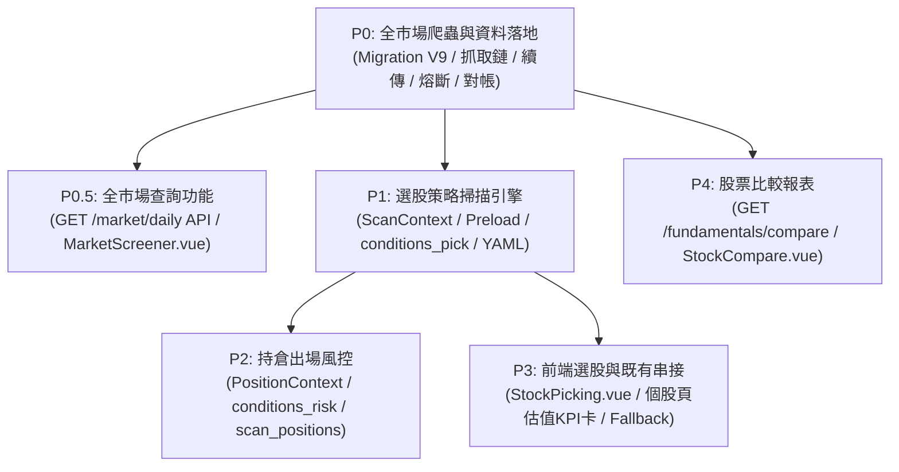

# 選股功能與爬蟲 整合設計規格書

**模組**：爬蟲資料管線（`services/`）＋ 指標層（`indicators/`）＋ 策略管理（`strategies/`）＋ 前端介面（`frontend/src/`）
**版本**：v5.2
**日期**：2026-08-16
**狀態**：已核准實施計畫，開發中（進行中）

**參考文件**
- [策略管理架構 設計規格書](../1.策略管理模組/策略管理架構-設計規格書.md)（以下簡稱《策略架構》）
- [籌碼選股策略](../5.籌碼選股策略/籌碼選股.md)（以下簡稱《籌碼選股》）—— **全市場資料管線與選股池（universe）的規格母體，本文件不重複定義**
- [進出場策略規劃](../11.進出場策略/進出場策略規劃.md)（以下簡稱《進出場》）—— 本文件把它落成可開發規格
- [KD 指標](../12.各項指標/KD指標.md)（以下簡稱《KD》）—— 其 §5.1「`requires` / `min_bars` 防呆」與 §5.7 per-strategy 冷卻覆寫**已落地於現行程式碼**，本文件直接沿用（見 §2、§5.1）
- [賣股策略](../7.賣股策略+爬蟲開發/賣股策略.md)、[均線策略警示系統](../2.%20均線策略警示系統/均線策略.md)

---

## 0. 修訂紀錄

| 版本 | 日期 | 主要變更 |
|---|---|---|
| v1.0 | 2026-08-16 | 初版：爬蟲項目清單與選股構想 |
| v2.0 | 2026-08-16 | 納入《策略架構》，改以 `@condition` 表達選股條件 |
| v3.0 | 2026-08-16 | 改為可直接開發的規格書：對照現行程式碼盤點後修正 12 項失真敘述、補齊選股池／效能／point-in-time／名單語意規格，並整合《進出場》的出場策略（持倉掃描）成為同一引擎的兩個入口 |
| v4.0 | 2026-08-16 | 二次對照現行程式碼（`strategies/registry.py`／`scanner.py`／`config_loader.py`，KD 指標開發已落地）後修正 2 項已過時的「待依賴」敘述；新增 [§10 受影響功能清單](#10-受影響功能清單既有個股頁面新增顯示欄位)（既有個股頁如何掛上估值／營收欄位）與 [§11 新增功能：股票比較／追蹤報表](#11-新增功能股票比較追蹤報表)（跨股票查詢比較頁），並補 2 則 ADR（ADR-SP-09／10）、更新影響檔案清單與驗收準則。原 §10～§15 依序順移為 §12～§17 |
| v5.0 | 2026-08-16 | **全市場每日抓取正式納入本文件範圍**（原本整段推給《籌碼選股》Phase 1）：定義 4 張以 `symbol` 關聯代碼主檔的新資料表、每日作業鏈與冪等／對帳規則（§3）；新增全市場資料查詢 API 與查詢頁（§8.4／§9.3，可排序、可篩選、伺服器端分頁）；新增 [§10.6～§10.8 與既有功能串接](#106-與既有功能串接矩陣)（個股查詢／熱力圖／代碼瀏覽／策略／警示／記帳／產業輪動／健康檢查）；補 4 則 ADR（ADR-SP-11～14） |
| v5.1 | 2026-08-16 | 補齊**資料量與耗時評估**、**中斷續傳機制**、**可回補範圍**（§3.8～§3.10），並回填六項已拍板決策：首批回補 **3 個月**、節流改為 `.env` 可設定（預設 3 秒）、**啟動自動偵測缺日並自動續跑**、自動補漏沿用 90 天、**P0 只做上市**（上櫃自上線日累積、不回補歷史）、資料**永久保留** |
| v5.2 | 2026-08-16 | 依據實施計畫正式啟動開發，新增 [§18 實施計畫與分階段進度追蹤](#18-實施計畫與分階段進度追蹤) |

**v3.0 相對 v2.0 的重大調整（皆為對照現行程式碼盤點後的修正）**

| # | v2.0 的敘述 | v3.0 的修正 | 原因 |
|---|---|---|---|
| 1 | 爬蟲放在 `services/crawler/` | 專案**沒有** `services/crawler/`；新增 `services/valuation_fetcher.py`、`services/revenue_market_fetcher.py`，全市場行情／籌碼沿用《籌碼選股》規劃的 `services/market_fetcher.py` | 現行爬蟲是平鋪的 `services/fetcher.py`（TWSE）、`us_fetcher.py`、`mops_fetcher.py`、`index_fetcher.py`、`symbol_master_fetcher.py`，無 crawler 套件 |
| 2 | 「掃描引擎直接沿用，不需修改核心」 | **必須修改核心**：現行 `scan_market()` 的標的池是 `config.get_target_stocks()`（`.env` 的 `STOCK_CODES` 追蹤清單，實際十餘檔），沒有全市場選股池 | 選股 = 對「全市場」篩出少數標的；用追蹤清單掃描出來的不是選股，是既有警示。見 [§2](#2-現況盤點本次開發要接上的既有接縫)、[ADR-SP-02](#adr-sp-02選股池不重造依賴籌碼選股-l4未完成前以-all_tracked-降級) |
| 3 | `ScanContext` 加入 `pe_ratio: Optional[float]` 等**純量**欄位 | 一律改為與 `ctx.dates` **等長對齊的平行序列**（`List[Optional[float]]`） | `scanner.py` 是 `for idx in range(start_idx, ctx.length)` 逐根 K 棒評估；純量欄位等於把「今天的估值」套用到歷史每一天，造成 look-ahead bias，回填測試（`lookback_days` 覆寫）會得到假訊號。見 [ADR-SP-03](#adr-sp-03估值營收一律以-point-in-time-平行序列進入-scancontext) |
| 4 | 新增 `institutional_net_buy: Dict[str, List[float]]` | **不新增**：法人欄位已存在於 `ctx.raw_records`，衍生指標已存在於 `indicators/chip.py`（`cum_net` / `consec_net_buy` / `net_buy_days` / `change_pct`…） | 重造會出現兩套法人數字；且《策略架構》§9 鐵則禁止在條件函式內自行加減乘除 |
| 5 | 「每個條件需定義 `requires` 預檢所需欄位」 | `@condition()` 目前只收 `type` / `min_bars`，且 `min_bars` **從未被 `scanner.py` 讀取**；`requires` 尚不存在 | 需先完成《KD》§5.1 的 registry／scanner 前置工作，本文件宣告依賴、不重複規範。見 [§5.1](#51-前置依賴requires--min_bars-防呆) |
| 6 | 同一策略下並列 `value_filter` + `chip_resonance`，語意當成 AND | 現行 `scanner.py` 對同一策略的多個 `conditions` 是**各自獨立觸發（OR）**，不是 AND | 照 v2.0 的 YAML 寫，只要殖利率達標就會出訊號，籌碼條件形同虛設。解法見 [ADR-SP-06](#adr-sp-06and-組合寫在單一複合條件函式內不新增組合器) |
| 7 | 條件參數寫在 `params:` 底下 | 條件（condition）參數**平鋪**在該 condition 節點；只有濾網（filter）才包在 `params:` 底下 | `scanner.py` 是 `spec.func(ctx, idx, condition_cfg)` 傳整個節點，而 `filters.evaluate_filters()` 讀 `f["params"]`。兩者不一致是既有行為，YAML 必須照它寫 |
| 8 | API 用 `GET /api/v1/strategies/alerts?category=stock_picking` | 實際端點是 `GET /api/v1/alerts`（`api/v1/endpoints/alerts.py`），且**沒有** `category` 參數、警示記錄裡也**沒有** `category` 欄位 | 需擴充 repository 寫入欄位與查詢參數。見 [§7](#7-api-與資料契約) |
| 9 | 未提及 | 選股「名單」語意與現行 cooldown 去重衝突，需 `max_picks_per_day` / 排序 / per-strategy cooldown 覆寫 | 選股條件在同一檔股票上會連續多日成立，現行全域 cooldown（`ALERT_COOLDOWN_DAYS`）會讓名單只在第一天出現。見 [ADR-SP-05](#adr-sp-05選股結果沿用-alert_event不另建資料表以名單語意欄位補足) |
| 10 | 未提及 | `direction` 命名必須同步登記四處，否則被靜默判為 `bullish` / `BUY` | `strategies/direction.py` 的 `classify_direction()` 預設回傳 `bullish`；前端 `utils/alertDirection.js` 目前連既有的籌碼／基本面 direction 都還沒登記（既有技術債，本次一併補）。見 [§5.6](#56-direction-命名與必改四處) |
| 11 | 「BWIBBU 每日抓取」 | `BWIBBU_ALL` 是**當日快照**、且僅涵蓋上市；歷史回補需改用帶日期參數的端點（待實測），上櫃需另尋 TPEx 端點 | 若不確認，估值序列只能自上線日往後累積，長回看的估值策略無法回測。見 [§3.2](#32-來源清單與實測狀態) 與開放問題 Q-1／Q-2 |
| 12 | 「MOPS 每月營收」 | 現行 `mops_fetcher.py` 是**逐檔逐月**送 POST（`ajax_t05st10_ifrs`）；全市場 1,800 檔不可行，需改用全市場彙總端點 | 逐檔抓取的請求數 = 標的數 × 月數，與《籌碼選股》§2.2 指出的 `STOCK_DAY` 問題同型。見 [§3.3](#33-月營收全市場化) |
| 13 | 未提及《進出場》 | 併入《進出場》：**進場＝選股（掃 universe）、出場＝持倉掃描（掃 holdings）**，同一引擎兩個入口；出場條件需 `PositionContext`（成本、進場日、持有期最高價） | 停損／移動停利／時間停損無法只靠 OHLC 判斷，必須接上既有的 `services/portfolio_ledger.py`。見 [§6](#6-出場策略規格進出場整合) |

**v4.0 相對 v3.0 的重大調整**

| # | v3.0 的敘述 | v4.0 的修正 | 原因 |
|---|---|---|---|
| 1 | 「`min_bars` 目前是死欄位（未被讀取）、無 `requires`」「本模組**依賴**《KD》§5.1」 | **《KD》§5.1 已完成並已在現行程式碼落地**：`strategies/registry.py` 的 `ConditionSpec` 已有 `requires` 欄位，`scanner.py` 進 `idx` 迴圈前已檢查 `ctx.length >= spec.min_bars` 與 `requires` 是否非空（`kd_cross` 即以 `requires=("kd",)` 運作中）。本模組不再需要「等《KD》先做」，直接比照 `kd_cross` 的寫法宣告 `requires=("valuation",)` 等即可 | 二次對照程式碼發現 §5.1／§2 的「待依賴」敘述已過時；再不修正會讓開發者誤以為還要先動 `registry.py`／`scanner.py` 的核心邏輯 |
| 2 | 「冷卻…需 per-strategy 覆寫（與《KD》§5.7 同一件事，先到者實作）」 | **已完成**：`strategies/config_loader.py` 的 `StrategyDef` 已有 `cooldown_days: Optional[int] = None`，`scanner.py` 已算出 `effective_cooldown = strategy.cooldown_days if ... else cooldown_days` 並用於冷卻判斷。§5.7 的「per-strategy cooldown 覆寫」YAML 寫法可直接套用，不必再修改 `cooldown.py` 本體 | 同上，屬程式碼已超前規格的情況，文件需追上現況以免重工 |
| 3 | 只規劃「選股清單頁 `/picks`」，未處理估值／營收欄位在**既有**個股頁（`StockDashboard.vue`）如何顯示 | 新增 [§10 受影響功能清單](#10-受影響功能清單既有個股頁面新增顯示欄位)：盤點 `markets/tw.py` 的 `Metric`／`meta.panels` 機制、`StockDashboard.vue` 既有「後端 metrics 陣列驅動 KPI 卡」架構、`StockCharts.vue` 的 panel 過濾分頁，逐一定義估值／營收欄位如何掛進既有頁面而不新增第二套 UI 骨架 | 使用者要求：「列出會影響的功能，各股要顯示各項新增欄位」；估值／營收不是只在選股結果才用得到的資料，追蹤中的個股本身就該看得到 |
| 4 | 未規劃跨股票比較／追蹤查詢介面 | 新增 [§11 新增功能：股票比較／追蹤報表](#11-新增功能股票比較追蹤報表)：`/compare` 頁，複用追蹤清單／觀察清單與 `MarketPreload` 批次查詢，比較多檔標的的 PE／PB／殖利率／營收 YoY／籌碼買賣超等欄位 | 使用者要求：「新增查詢/報表功能，可比較追蹤各股票的相關數據」 |

**v5.0 相對 v4.0 的重大調整**

| # | v4.0 的敘述 | v5.0 的修正 | 原因 |
|---|---|---|---|
| 1 | 全市場行情／法人／信用「依《籌碼選股》Phase 1，本文件不重複規範」（§3.2 來源 A～I） | **納入本文件範圍**：`services/market_fetcher.py` 每日抓取全市場行情、三大法人、信用交易、市值，落 `daily_market_quote`／`daily_market_chip`／`daily_valuation` 三張新表（§3.2～§3.4） | 使用者要求「本次要抓取的數據為每天抓取全市場，另開 table 儲存」；且沒有這批資料，選股條件（§5）與 `MarketPreload`（§4.3）都無資料可用，等於整份規格卡在外部依賴上 |
| 2 | 只提「新表 `daily_valuation`／`monthly_revenue`」，未定義與 `symbols` 主檔的關聯 | 4 張新表一律 `symbol` FK → `symbols.symbol`，並定義**寫入前先補主檔**的順序與未知代號處理（§3.6） | 使用者要求「與股票代號主檔用代號關聯」；不先補主檔會直接違反 FK 而整批寫入失敗 |
| 3 | 未規劃全市場資料的查詢介面（只有 `/picks` 選股結果、`/compare` 多檔比較） | 新增 `GET /api/v1/market/daily` 等端點（伺服器端分頁／排序／篩選，排序欄位白名單）與 `/market` 查詢頁（§8.4／§9.3） | 使用者要求「另開查詢功能，可排列／查詢」；1,800 檔 × N 日不可能沿用前端排序 |
| 4 | 未定義新表與既有 `daily_stock_data`／既有查詢功能的關係 | 新增 §3.5（讀取優先序與對帳，避免雙重真相）與 §10.6～§10.8（與個股查詢／熱力圖／代碼瀏覽／策略／警示／記帳／產業輪動／健康檢查的串接矩陣） | 使用者要求「與現有功能串接」；兩份來源同時存在卻沒有優先序，必然出現「同一天同一檔兩個收盤價」的爭議 |
| 5 | ETF 排除沿用 `scanner.py` 的代號正則 `^00\d{2,4}[A-Za-z]?$` | 改用 `symbols.security_type`／`exchange`（代碼主檔已有），正則僅作為主檔查無資料時的後備（ADR-SP-13） | 全市場資料落地後，證券類別是現成欄位；用代號猜類別會誤傷（例如非 ETF 的 00 開頭代號、特別股與 TDR 完全猜不到） |

---

## 1. 目的與範圍

### 1.1 目的

把「每日盤後自動化選股」與「持倉出場警示」兩件事，**完全長在既有策略引擎上**，不另建第二套掃描器：

1. 選股條件、出場條件一律是 `@condition` 註冊的函式，門檻參數全部落在 `strategy_config/strategies.yaml`，調參不改程式、不重啟（《均線策略》AC-7）。
2. 所有衍生數值（估值、營收成長、籌碼共振、未實現損益、回落幅度）一律先由 `indicators/` 算好放進 Context，條件函式只做 if/else（《策略架構》§9 鐵則）。
3. 選股結果與警示訊號走同一條輸出管線（`alert_repository` → `/api/v1/alerts` → 前端 → Telegram 推播），不新增平行的資料流。
4. 不得違反 `CLAUDE.md` 兩條硬規則：切換圖表控制項不得整頁 refresh 跳回頂端、KPI 卡片高度必須一致。

### 1.2 範圍

| 範圍內 | 範圍外（本階段不做） |
|---|---|
| **全市場每日行情／三大法人／信用交易落地**（`daily_market_quote`／`daily_market_chip`，§3） | 分鐘級或即時報價（維持盤後日頻） |
| **全市場資料查詢 API 與查詢頁**（伺服器端分頁／排序／篩選、匯出，§8.4／§9.3） | 使用者自訂條件存檔成策略（「把查詢條件變成 YAML 策略」列 P5） |
| 全市場估值（PE / PB / 殖利率）每日落地（Postgres） | 盤中即時選股（維持 `scan_frequency: daily_close`） |
| 全市場月營收落地（取代逐檔 MOPS 抓取） | 回測引擎與參數最佳化（無回測模組，只能人工抽樣比對） |
| `ScanContext` 擴充（估值／營收平行序列）＋批次載入 | 財報深度分析（現金流折現、杜邦分析、EPS 預估） |
| 選股條件 `stock_pick_resonance` 及其三個可獨立使用的子條件 | 美股選股（無等價的估值／法人來源，列 P3） |
| 出場條件（停損／移動停利／時間停損／籌碼鬆動）＋ `PositionContext` | 自動下單、自動再平衡 |
| 選股／出場的 YAML 設定、名單截斷、排序、冷卻覆寫 | 選股池（universe）的**月頻 point-in-time 快照**（`universe_snapshots`）—— 屬《籌碼選股》Phase 2；本文件以 `daily_valuation.mcap_rank` + `symbols.security_type` 即時產生當日可掃描池作為過渡（§10.6-4） |
| `/api/v1/alerts` 契約擴充、`/picks` 前端頁 | 除權息還原（`adj_close`）—— 屬《籌碼選股》§3.4 |
| 既有個股頁（`StockDashboard.vue`）新增估值／營收 KPI 卡與趨勢分頁（§10） | 既有個股頁新增「財務比率排名」等衍生分析（僅顯示原始欄位與既有指標，不做新的評分模型） |
| 跨股票比較／追蹤報表 `/compare`（§11），複用追蹤清單／觀察清單 | 常駐式「比較看板」資料表化、多人共享比較清單（列 P3，見 ADR-SP-09） |

### 1.3 名詞

| 名詞 | 定義 |
|---|---|
| 選股池（universe） | 當日／當期可被掃描的合格標的集合，含市值分層與排除規則（《籌碼選股》§4） |
| 選股清單（pick list） | 某策略在某交易日輸出的、已排序並截斷至 `max_picks_per_day` 的標的名單 |
| 共振（resonance） | 價值面、基本面、籌碼面在同一標的同一日同時成立（AND） |
| Point-in-time | 評估第 `idx` 根 K 棒時，只能看見該日「當時已公開」的資料，不得使用日後才公布的數字 |
| 持倉掃描（position scan） | 以「目前持有的標的」為選股池的出場策略掃描入口 |
| 降級運行 | universe 尚未建置時，以追蹤清單＋持倉聯集（`all_tracked`）作為選股池的過渡模式 |

### 1.4 與《進出場》規劃項目的對照

《進出場》是一份不涉及程式碼現況的純規劃文件（§5「後續行動與非程式開發任務」明講尚待落成規格），涵蓋範圍比本文件的選股／出場更廣。逐項對照現況，避免重複規劃或遺漏：

| 《進出場》項目 | 對照結果 |
|---|---|
| §3.1 均線突破策略（`ma_period`／`volume_ratio`） | **已實作**：`conditions_tech.py` 的 `price_cross`（突破/跌破關鍵均線＋量能濾網）、`ma_cross`（黃金/死亡交叉） |
| §3.1 型態突破策略（`lookback_days`／`breakout_threshold`） | **已實作**：`conditions_tech.py` 的 `squeeze_breakout`（擠壓突破） |
| §3.2 法人連續買超策略 | **部分已實作**：`conditions_chip.py` 的 `chip_bottom_turnover`／`chip_short_squeeze` 內含法人連買條件，但都是複合條件的一部分，非獨立可調參策略；本文件 §5.4 的 `chip_resonance` 補上**可獨立使用**的版本 |
| §3.2 主力集中度策略 | **未實作、本文件亦不涵蓋**：現行 `raw_records`／`indicators/chip.py` 沒有「主力集中度」的資料與定義，超出本次估值／營收／籌碼共振的範圍，留待後續評估資料來源後另立文件 |
| §3.3 營收雙增＋技術面多頭 | 本文件 §5.5 `stock_pick_resonance` 的 `fundamental` + `technical` 面向即涵蓋此語意（同日 AND，非《進出場》原文隱含的「營收公告時已多頭排列」時序判斷，差異見 §5.5 `trigger_on: persistent`） |
| §4.1 固定百分比停損 | 本文件 §6.3 `stop_loss_pct` |
| §4.1 技術面破線停損 | 本文件 §6.3 `ma_support_break` |
| §4.2 移動停利 | 本文件 §6.3 `trailing_stop`（《進出場》的 `lookback_high` 改用「持有期最高收盤」`peak_close_since_entry`，見 §6.2，比「近期高點」更貼合「這一段持倉」的語意，且避免用回溯天數重新定義高點造成兩套「高點」定義） |
| §4.2 籌碼鬆動停利 | 本文件 §6.3 `chip_loosening` |
| §4.3 時間停損 | 本文件 §6.3 `time_stop` |
| §5.1 策略參數定義表（Excel/YAML 範本） | 本文件 §7 YAML 設定規格＋§6.3 參數表即為該範本的可執行版本 |
| §5.2 回測情境定義 | **範圍外**（§1.2）：專案無回測模組，本文件只能靠人工抽樣比對（§15） |
| §5.3 警示文案設計 | 本文件 §8.3 推播整合＋§5.6／§10.4 的 `direction`／前端文案登記即涵蓋 |

---

## 2. 現況盤點（本次開發要接上的既有接縫）

先確認「什麼已經存在、可以直接接」，避免重造或誤用：

| 既有物件 | 位置 | 與本模組的關係 |
|---|---|---|
| `scan_market(market, lookback_days, symbols)` | `backend/strategies/scanner.py` | 主迴圈可沿用；需加：選股池來源、名單截斷、`category` 寫入、建議動作模板 |
| 標的池 `get_target_stocks(market)` | `backend/config.py` | 讀 `.env` 的 `STOCK_CODES` / `US_STOCK_CODES`，**不是全市場**；選股需改由 universe 提供 |
| `ChipDataProvider.get_bars()` | `backend/services/chip_provider.py` | 目前逐檔 `load_stock_data()` + 全歷史 MA；擴大到千檔會成為效能瓶頸，需批次化（§4.3） |
| `ScanContext`（`ma` / `bias` / `volume_ma` / `revenue`） | 同上 | 新增 `valuation` / `revenue_series` 平行序列；`revenue`（dict, `"YYYY-MM"`）已存在可沿用 |
| `@condition(type=, min_bars=, requires=)` | `backend/strategies/registry.py` | ✅ **已完成**（《KD》§5.1 已落地）：`ConditionSpec` 已有 `requires: Tuple[str, ...]` 欄位，`scanner.py` 進 `idx` 迴圈前已檢查 `ctx.length >= spec.min_bars` 與 `requires` 各欄位非空（`kd_cross` 現行即以 `requires=("kd",)` 運作）。本模組直接沿用同一寫法宣告 `requires=("valuation",)` 等，**不需要**再改 `registry.py`／`scanner.py` 本體 |
| 條件參數傳遞方式 | `scanner.py`：`spec.func(ctx, idx, condition_cfg)` | 條件參數**平鋪**於 YAML condition 節點（非 `params:`） |
| 濾網「只加分不擋訊號」 | `backend/strategies/filters.py` | 選股的**硬門檻不可放濾網**，一律做成 condition 參數（同《KD》ADR-KD-03） |
| ETF 排除 `_is_chip_excluded()` | `scanner.py`，正則 `^00\d{2,4}[A-Za-z]?$` | 目前**只在 `category == "chip"` 生效**；`stock_picking` 也必須排除，需改為 category 集合或 YAML 開關 |
| `indicators/chip.py` | `cum_net` / `net_buy_days` / `consec_net_buy` / `consec_net_sell` / `change_pct` / `rolling_max` / `short_margin_ratio` / `rolling_percentile` | 籌碼共振條件**只准**呼叫這裡，不自行加總 |
| 月營收 point-in-time 規則 | `backend/strategies/conditions_fund.py` 的 `_revenue_visible_from()`（次月 11 日起可見）／`_latest_visible_month()` | 選股的營收條件必須共用同一份可見性規則 → 抽到 `strategies/fundamental_time.py` 供兩邊 import |
| 月營收落檔 | `backend/services/mops_fetcher.py`：`data/tw/{symbol}_revenue.json`（JSON-only、逐檔逐月 POST） | 全市場化後改由 Postgres 供應，JSON 保留給追蹤清單個股（§3.3） |
| 三大法人／信用交易爬蟲 | `backend/services/fetcher.py`：`T86`（動態欄位定位）、`MI_MARGN` | 已是全市場端點，但目前用 `target_stocks` 過濾後丟棄其餘資料（《籌碼選股》§2.2） |
| 全市場代碼主檔 | `backend/services/symbol_master_fetcher.py` → `symbols` 表（含 `security_type`、`exchange`） | universe 的排除規則（ETF／TDR／特別股）可直接用它，不必再爬 |
| 警示儲存 | `backend/repositories/alert_repository.py`（JSON：`data/_alerts/alerts.json` / `cooldown.json`） | 需新增 `category` / `universe_tier` / `rank_value` 欄位與查詢過濾 |
| 冷卻 | `strategies/cooldown.py` + 全域 `ALERT_COOLDOWN_DAYS`（`config.get_alert_cooldown_days()`） | ✅ **per-strategy 覆寫已完成**（《KD》§5.7 已落地）：`config_loader.StrategyDef` 已有 `cooldown_days: Optional[int]`，`scanner.py` 已算出 `effective_cooldown` 並用於 `cooldown_mod.is_active()`。§5.7 只需在 YAML 設定 `cooldown_days`，**不需要**再改 `cooldown.py` 本體 |
| 方向分類 | `backend/strategies/direction.py`（預設 `bullish`） | 需登記 `pick_` / `exit_` 前綴 |
| 前端方向文案 | `frontend/src/utils/alertDirection.js` | **既有技術債**：籌碼／基本面 direction（`bottom_turnover`、`distribution_top`、`revenue_yoy_decline`…）尚未登記，本次一併補齊 |
| 警示看板 | `frontend/src/views/AlertDashboard.vue`、`frontend/src/service/alertApi.js`、路由 `/alerts` | 選股另開 `/picks` 頁（欄位需求不同，§8） |
| 排程 | `backend/services/scheduler.py`：TW 14:30、US 06:00，fetch 完成後鏈接 scan | 新增估值抓取（每日，接在 fetch 後、scan 前）與月營收（每月）作業 |
| 推播 | `backend/notify/`：`ALERT_SIGNAL` / `ALERT_DIGEST`，路由事實含 `strategy_category` | **既有缺陷**：`notify/events.py` 的 `_get_strategy_category()` 以 `load_strategy_config(path)` 呼叫並迭代 dict，與現行 `config_loader.load_strategy_config()`（無參數、回傳 `StrategyConfig`）不符，例外被吞掉後恆回傳 `"unknown"`，依 category 的路由條件目前失效 → 本模組引入新 category 前必須先修 |
| 持倉與成本 | `backend/services/portfolio_ledger.py` 的 `build_ledger()`（FIFO／依 `portfolio_settings.cost_method`）、`db/portfolio_models.py` | 出場策略的 `PositionContext` 來源；`portfolio_watchlist` 提供觀察名單 |
| 既有日資料表 | `db/models.py` 的 `DailyStockData`（`daily_stock_data`，PK `id`、含 `market_specific_data` JSONB） | **只裝追蹤清單**（`fetcher.py`／`us_fetcher.py` 以 JSON 為主、Postgres best-effort 雙寫）；全市場資料另立表，兩者關係與讀取優先序見 §3.5、ADR-SP-11 |
| 代碼主檔 | `symbols` 表（`symbol` PK、`market_type`、`name`、`exchange`、`security_type`、`status`），由 `services/symbol_master_fetcher.py` 全市場同步（TWSE/TPEx ISIN、SEC） | 新表的 FK 對象；同時提供 ETF／特別股／TDR 排除依據（ADR-SP-13） |
| 爬蟲執行記錄 | `db/models.py` 的 `CrawlerLog`（`crawler_logs`） | 全市場每日作業必須逐段寫入（§3.3），供健康檢查與補抓判斷 |
| 無交易日記錄 | `market_no_trading_days` + `services/fetcher.py` 的 `save_no_trading_days()` | 全市場抓取回傳空資料時，須沿用同一張表判定「當天沒開盤」而非「抓取失敗」 |
| 個股清單／熱力圖 | `services/stock_service.py` 的 `discover_available_stocks()`／`get_heatmap_data()` | 目前掃 `data/{market}/` 目錄逐檔 `json.load`；接上全市場資料後**不得**改成掃 1,800 檔 JSON，需走新表（§10.6） |
| 缺口回補 | `services/backfill.py`（`DATA_SOURCE=postgres` 時於 `main.py` lifespan 執行） | 需擴充涵蓋新表的缺口診斷（§10.6） |
| 健康檢查 | `backend/notify/health_probe.py` | 新增「全市場當日資料筆數異常」偵測項（§10.6） |
| 資料庫 | `db/migration/V1`～`V8`（下一版號 **V9**）、`repositories/stock_repository.py`（`daily_stock_data` 的唯一 SQL 入口） | 新表 `daily_market_quote` / `daily_market_chip` / `daily_valuation` / `monthly_revenue`（§3.4）；SQL 一律收斂在 repository 層，新表另立 `repositories/market_repository.py`（ADR-SP-11）；`universe_snapshots` 仍由《籌碼選股》負責 |

---

## 3. 資料擷取層規格（爬蟲）

### 3.1 設計前提

1. **每日抓取「全市場」，不是抓追蹤清單**：一律採「單日 × 全市場」端點，請求數 = 交易日數 × 端點數，**與標的數無關**（《籌碼選股》§2.2）。現行 `fetcher.py` 已經打了全市場的 `T86`／`MI_MARGN`，卻用 `target_stocks` 過濾後丟棄其餘資料 —— 本模組把丟掉的部分完整落地。
2. **全市場資料另立資料表，不併入 `daily_stock_data`、不落 per-symbol JSON**（ADR-SP-11；量級估算沿用《籌碼選股》§2.3：全市場 JSON 約 330 MB 且跨標的查詢是最差結構）。JSON 維持「使用者追蹤清單個股明細」用途，前端既有圖表路徑零破壞。
3. **每張新表以 `symbol` 關聯代碼主檔 `symbols`**（FK），寫入前必先確保主檔存在該代號（§3.6）。
4. 因此 **`DATA_SOURCE=json` 時，`category: stock_picking` 的策略一律停用並記一次警告，不做靜默降級**（ADR-SP-04）；但全市場抓取與查詢頁不受 `DATA_SOURCE` 影響 —— 它們本來就只走 Postgres。
5. **所有寫入冪等**：以主鍵 UPSERT，同一天重跑或補抓不得產生重複列，也不得把已正確的值改成 `NULL`（來源缺欄位時保留舊值，見 §3.7）。冪等是「中斷續傳」（§3.9）能成立的前提：重跑任何一天都安全，因此不需要精確到「斷在第幾筆」的斷點記錄。
6. **本版只做上市（TWSE）的歷史回補**（已拍板，見 §3.10）：上櫃（TPEx）端點多為「當日快照」、無法回溯，因此上櫃資料**自上線日往後累積**，並在查詢頁明示涵蓋區間。
7. **節流秒數可設定**：新增 `MARKET_FETCH_THROTTLE_SECONDS`（`.env`，預設 **3**，沿用 `fetcher.py`／`index_fetcher.py` 的現行間隔）；每日增量一律用預設值，只有批量回補作業可在呼叫時覆寫（實測確認來源可接受後才調短）。

### 3.2 每日抓取項目與來源

| # | 項目 | 端點 | 粒度 | 落地表 | 狀態 |
|---|---|---|---|---|---|
| A | TWSE 每日收盤行情（全部） | `www.twse.com.tw/rwd/zh/afterTrading/MI_INDEX?date=&type=ALLBUT0999&response=json` | 單日 × 全市場（約 1,379 檔） | `daily_market_quote` | ✅ 《籌碼選股》已實測 |
| B | TWSE 三大法人買賣超 | `rwd/zh/fund/T86?date=&selectType=ALL` | 單日 × 全市場 | `daily_market_chip` | ✅ 已在用（**必須沿用 `fetcher.py` 既有的動態欄位定位**，不得寫死索引） |
| C | TWSE 融資融券 | `rwd/zh/marginTrading/MI_MARGN?date=&selectType=ALL` | 單日 × 全市場 | `daily_market_chip` | ✅ 已在用且欄位已驗證 |
| D | TWSE 上市公司基本資料 | `openapi.twse.com.tw/v1/opendata/t187ap03_L` | 月頻快照 | `symbols`（產業）＋市值計算輸入 | ✅ 已實測（1,094 檔） |
| F | TPEx 上櫃行情 | TPEx OpenAPI `tpex_mainboard_daily_close_quotes` | 單日 | `daily_market_quote` | ⚠️ 日期涵蓋範圍待確認（《籌碼選股》Q-1） |
| G | TPEx 上櫃三大法人 | `tpex_3insti_daily_trading` | 單日（915 檔） | `daily_market_chip` | ✅ 已實測 |
| H | TPEx 上櫃融資融券 | `tpex_mainboard_margin_balance` | 單日（916 檔） | `daily_market_chip` | ✅ 已實測 |
| I | TPEx 上櫃市值排行 | `tpex_daily_market_value` | 單日（890 檔） | `daily_valuation`（`market_cap`／`mcap_rank`） | ✅ 已實測 |
| J | TWSE 本益比／殖利率／淨值比（快照） | `openapi.twse.com.tw/v1/exchangeReport/BWIBBU_ALL` | **當日快照**（無日期參數） | `daily_valuation` | ✅ 已實測（1,083 檔） |
| K | TWSE 個股日本益比（可指定日期） | `www.twse.com.tw/rwd/zh/afterTrading/BWIBBU_d?date=YYYYMMDD&selectType=ALL&response=json` | 單日 × 全市場 | `daily_valuation`（**歷史回補**） | ⚠️ **待實測**（Q-1） |
| L | TPEx 上櫃本益比／殖利率／淨值比 | TPEx OpenAPI（`tpex_mainboard_peratio_analysis` 系列） | 單日 | `daily_valuation` | ⚠️ **待實測**（Q-2） |
| M | TWSE 上市每月營收彙總 | `openapi.twse.com.tw/v1/opendata/t187ap05_L` | 月頻 × 全市場 | `monthly_revenue` | ⚠️ **待實測**（Q-3） |
| N | TPEx 上櫃每月營收彙總 | TPEx OpenAPI（`mopsfin_t187ap05_O` 系列） | 月頻 × 全市場 | `monthly_revenue` | ⚠️ **待實測**（Q-3） |
| O | MOPS 逐檔月營收（既有） | `mops.twse.com.tw/mops/web/ajax_t05st10_ifrs` | 單檔 × 單月 | `data/tw/{symbol}_revenue.json` | ✅ 既有，**保留作為個股補洞，不作為全市場來源** |
| E | TWSE 除權息計算結果 | `rwd/zh/exRight/TWT49U?startDate=&endDate=` | 期間 | —（還原價屬《籌碼選股》§3.4） | 範圍外，本模組只消費 `ex_dividend_nearby` 旗標 |

> **實作前置**：K／L／M／N 四個端點必須先以一次性腳本實測（回傳筆數、欄位名、日期涵蓋範圍、歷史可得性），結果回填本表後才開工（`scripts/probe_market_sources.py`）。**不得**在未確認前直接寫進排程。
>
> **分批決策（已拍板）**：P0 只上上市（A、B、C、J／K、D、M）；上櫃（F、G、H、I、L、N）列 P1，上線後**只做每日累積、不回補歷史**（§3.10）。這直接改變每日請求數與耗時估算（§3.3／§3.8）。
>
> **欄位正規化**：TPEx OpenAPI 的 JSON key 與 TWSE 完全不同，且存在空白與拼字不一致（如 `ShortConvering`、同時有 `Dealers-TotalSell` 與 `Dealers -TotalSell`）。正規化一律在 `markets/` adapter 層完成，**原始 key 不得外流**到 repository 與策略層。

### 3.3 每日作業鏈與排程

`services/scheduler.py` 現行台股 14:30 是「fetch（追蹤清單）→ scan」；本模組把它擴為單一有序作業鏈，任一段失敗**只中止其下游、不影響已完成的上游**：

| 順序 | 作業 | 頻率／時點（`Asia/Taipei`） | 來源 | 落地 | 失敗處理 |
|---|---|---|---|---|---|
| 1 | `sync_symbol_master()`（既有） | 每日 14:25（先於行情） | ISIN | `symbols` | 失敗只記警告；未知代號仍會在步驟 2 自動補入（§3.6） |
| 2 | `fetch_market_quotes(trade_date)` | 每日 14:35 | A（P0）／F（P1 上櫃） | `daily_market_quote` | 回傳空且判定為休市 → 寫 `market_no_trading_days`，整條鏈正常結束（非失敗） |
| 3 | `fetch_market_chips(trade_date)` | 每日 14:40 | B／C（P0）／G／H（P1） | `daily_market_chip` | 單一交易所失敗 → 記 `partial`，不阻擋步驟 4 |
| 4 | `fetch_market_valuation(trade_date)` | 每日 14:45 | J／K（P0）／L／I（P1，供上櫃市值） | `daily_valuation` | 同上；當日缺估值 → 該日估值條件不評估（**不沿用前一日**） |
| 5 | 既有追蹤清單 fetch（`fetcher.py`） | 每日 14:30（維持現況） | STOCK_DAY 等 | JSON＋`daily_stock_data` | 維持現況（§3.5 說明兩者為何並存） |
| 6 | `scan_market()` / `scan_positions()` | 步驟 2～5 完成後鏈接 | — | `alerts.json` | 上游缺當日資料時，掃描仍執行（條件因資料不足自然跳過），不得整批中止 |
| — | `fetch_market_revenue(year_month)` | 每月 11 日 09:00 | M／N | `monthly_revenue` | 隔日重試一次；仍失敗則該月營收條件自然不成立（不補值） |
| — | `backfill_market(start, end, targets)` | 手動（`POST /api/v1/market/fetch`） | A～K | 全部新表 | 只跑缺日、逐日冪等（§3.9.2）；請求間隔依 `MARKET_FETCH_THROTTLE_SECONDS`（預設 3 秒）；中斷可續傳（§3.9） |

**執行紀錄**：每段作業（步驟 2／3／4 與月營收）各寫一筆 `crawler_logs`（`market_type`、`trigger_type`、`started_at`／`finished_at`、`status`、`symbols_success`／`symbols_failed`、`error_message`），供 §10.6 的健康檢查與補抓判斷使用。

**請求量與耗時**：見 §3.8（P0 上市每日約 4 次請求、約 20 秒）。

### 3.4 資料表（`db/migration/V9__Create_market_daily_tables.sql`）

四張表共同規則：
- `symbol` 一律 `VARCHAR(20)` 且 **FK → `symbols.symbol`**（`ON DELETE RESTRICT`：歷史資料不因主檔下市清理而消失）。
- 以 `(symbol, trade_date)`／`(symbol, year_month)` 為主鍵 → 天然去重、可安全重跑（§3.1-5）。
- 金額／數量單位一律在欄位說明中寫死，缺值存 `NULL`，**不得存 0**（`0` 在本專案已被既有程式碼視為「當天沒回補到行情」，見 `chip_provider._clean()`）。

#### `daily_market_quote`（全市場行情）
| 欄位 | 型別 | 非空 | 說明 |
|---|---|---|---|
| `symbol` | VARCHAR(20) | Y | PK part 1，FK → `symbols.symbol` |
| `trade_date` | DATE | Y | PK part 2 |
| `market_type` | VARCHAR(10) | Y | `tw` |
| `exchange` | VARCHAR(20) | Y | `TWSE` / `TPEx` |
| `open_price` / `high_price` / `low_price` / `close_price` | NUMERIC(15,4) | N | **未還原價**（還原屬《籌碼選股》§3.4） |
| `change_amount` | NUMERIC(15,4) | N | 漲跌 |
| `change_percent` | NUMERIC(10,4) | N | 漲跌幅（%），由來源提供或以前一交易日收盤計算（`indicators/` 內計算，不在 repository 算） |
| `volume` | BIGINT | N | 成交量（**股**，與既有 JSON 一致） |
| `turnover` | BIGINT | N | 成交金額（元） |
| `transaction_count` | INTEGER | N | 成交筆數 |
| `data_quality` | VARCHAR(10) | Y | `ok` / `suspect`（§3.7）；`suspect` 不參與策略評估 |
| `source` | VARCHAR(20) | Y | `MI_INDEX` / `TPEX_QUOTES` / `STOCK_DAY` |
| `created_at` / `updated_at` | TIMESTAMP | Y | |

索引：`(trade_date, market_type)`（單日切片主路徑）、`(trade_date, change_percent DESC)`、`(trade_date, turnover DESC)`（查詢頁排序，§8.4）。

#### `daily_market_chip`（全市場籌碼：三大法人＋信用交易）
| 欄位 | 型別 | 非空 | 說明 |
|---|---|---|---|
| `symbol` / `trade_date` | — | Y | 複合 PK，FK → `symbols.symbol` |
| `market_type` / `exchange` | VARCHAR | Y | 同上 |
| `foreign_net` | BIGINT | N | 外資買賣超（**股**，含外資自營商） |
| `trust_net` | BIGINT | N | 投信買賣超（股） |
| `dealer_net` | BIGINT | N | 自營商合計買賣超（股） |
| `institutional_net` | BIGINT | N | 三大法人合計（**取來源欄位，不是三者相加**，見《籌碼選股》§3.1） |
| `margin_balance` | BIGINT | N | 融資餘額（張） |
| `margin_buy` / `margin_sell` / `margin_redeem` | BIGINT | N | 融資買進／賣出／現金償還（張） |
| `margin_quota` | BIGINT | N | 融資限額（張） |
| `short_balance` | BIGINT | N | 融券餘額（張） |
| `short_buy` / `short_sell` / `short_redeem` | BIGINT | N | 融券買進／賣出／現券償還（張） |
| `offset_amount` | BIGINT | N | 資券互抵（張） |
| `data_quality` | VARCHAR(10) | Y | `ok` / `suspect`（法人合計對帳不符時標 `suspect`，§3.7） |
| `source` | VARCHAR(20) | Y | `T86+MI_MARGN` / `TPEX` |
| `created_at` / `updated_at` | TIMESTAMP | Y | |

索引：`(trade_date, market_type)`、`(trade_date, foreign_net DESC)`、`(trade_date, trust_net DESC)`（買超排行查詢）。

> **不用 JSONB 的理由**：既有 `daily_stock_data.market_specific_data` 把籌碼塞在 JSONB，是為了配合「JSON 為主、Postgres 雙寫」的既有語意；全市場查詢需要對法人買超、券資比直接排序與分頁（§8.4），JSONB 需要 expression index 才能命中，欄位化才是正解。

#### `daily_valuation`（全市場估值與市值）
| 欄位 | 型別 | 非空 | 說明 |
|---|---|---|---|
| `symbol` | VARCHAR(20) | Y | PK part 1，FK → `symbols.symbol` |
| `trade_date` | DATE | Y | PK part 2 |
| `market_type` | VARCHAR(10) | Y | `tw` |
| `exchange` | VARCHAR(20) | N | `TWSE` / `TPEx` |
| `pe_ratio` | NUMERIC(12,2) | N | 本益比；虧損股來源回傳空值 → 存 `NULL`，**不得存 0** |
| `pb_ratio` | NUMERIC(12,2) | N | 股價淨值比 |
| `dividend_yield` | NUMERIC(8,2) | N | 殖利率（%） |
| `market_cap` | BIGINT | N | 市值（元）；上市依《籌碼選股》§2.4 計算、上櫃取來源 I |
| `mcap_rank` | INTEGER | N | 當日跨市場市值降冪排名（供 universe 與查詢頁排序） |
| `source` | VARCHAR(20) | Y | `BWIBBU_ALL` / `BWIBBU_d` / `TPEX` |
| `created_at` | TIMESTAMP | Y | |

索引：`(trade_date, market_type)`（掃描主路徑）、`(trade_date, dividend_yield DESC)`、`(trade_date, pe_ratio)`、`(trade_date, mcap_rank)`（排行查詢）。

#### `monthly_revenue`
| 欄位 | 型別 | 非空 | 說明 |
|---|---|---|---|
| `symbol` | VARCHAR(20) | Y | PK part 1 |
| `year_month` | CHAR(7) | Y | PK part 2，`YYYY-MM`（**營收所屬月份**，非公告月份） |
| `market_type` | VARCHAR(10) | Y | `tw` |
| `revenue` | BIGINT | N | 當月營收（元） |
| `mom_percent` | NUMERIC(10,2) | N | 月增率 |
| `yoy_percent` | NUMERIC(10,2) | N | 年增率 |
| `announced_date` | DATE | N | 官方公告日；缺值時由 `_revenue_visible_from()` 規則推導 |
| `source` | VARCHAR(20) | Y | `TWSE_OPENAPI` / `TPEX_OPENAPI` / `MOPS` |
| `created_at` | TIMESTAMP | Y | |

索引：`(year_month)`、`(symbol, year_month DESC)`。

> **一致性要求**：`monthly_revenue` 的 `yoy_percent` 語意必須與既有 `data/tw/{symbol}_revenue.json` 的 `yoy_percent` 完全相同（同單位、同正負號），否則 `fundamental_revenue_decline`（既有出場策略）會因資料源不同而行為改變。以 3 檔標的、6 個月交叉比對作為驗收項 AC-3。

### 3.5 與既有 `daily_stock_data` 的關係（避免雙重真相）

新表與既有 `daily_stock_data` 會**同時**擁有追蹤清單標的的同一天行情，必須先講清楚誰是準的：

| 面向 | `daily_stock_data`（既有） | `daily_market_quote` / `daily_market_chip`（新增） |
|---|---|---|
| 涵蓋 | 追蹤清單（十餘檔） | 全市場（約 1,800 檔，含追蹤清單） |
| 來源 | `STOCK_DAY` 逐檔逐月＋`T86`／`MI_MARGN` 過濾 | 單日全市場端點（A/B/C/F/G/H） |
| 寫入語意 | JSON 為主、Postgres best-effort 雙寫（失敗只記警告） | Postgres 為唯一落地 |
| 用途 | 既有個股頁 K 線、圖表、熱力圖（既有路徑不動） | 選股掃描、全市場查詢、比較報表 |

**規則**：

1. **不遷移、不合併、不互相覆寫**：兩者各自維持既有寫入路徑（ADR-SP-11）。本模組不修改 `fetcher.py` 既有的 JSON／雙寫行為。
2. **讀取優先序**（`services/stock_service.load_stock_data()` 的既有分支再加一層，見 §10.7）：追蹤清單標的 → 既有路徑（JSON／`daily_stock_data`）；**非追蹤清單標的** → `daily_market_quote` + `daily_market_chip`；兩者皆無 → 既有 `SymbolNotFoundException`（404）。
3. **對帳（不可省略）**：每日作業鏈結束後，對追蹤清單標的比對兩邊的 `close`／`volume`／`foreign_net`／`margin_balance`；不一致筆數 > 0 時記 `WARNING` 並寫入 `crawler_logs.error_message`，**不自動修改任何一邊**（人工判讀後決定重抓哪邊）。對帳腳本：`scripts/reconcile_market_vs_daily.py`。
4. 未來若要「以新表為單一真相、廢除雙寫」，屬獨立議題（Q-9），本版不做 —— 那會動到既有前端全部圖表路徑，風險與本模組不對稱。

### 3.6 代碼主檔關聯與未知代號處理

新表的 `symbol` 有 FK 指向 `symbols`，因此**寫入順序有硬性要求**：

1. 每日作業鏈第 1 步先跑 `sync_tw_symbol_master()`（既有，`services/symbol_master_fetcher.py`），確保當日新掛牌代號已進主檔。
2. 落地前先取出本批次所有 `symbol`，與 `symbols` 差集比對；**差集不為空時，先以最小資料補入主檔**（`symbol`、`market_type`、`name`（來源若有）、`exchange`、`security_type=NULL`、`status='active'`），再寫入資料表。差集筆數寫入日誌，作為「主檔同步是否落後」的指標。
3. **不得**因為單一未知代號就讓整批寫入失敗，也不得改用「移除 FK」的做法規避 —— FK 正是本次「與代號主檔關聯」需求的落點。
4. 下市／下櫃：主檔以 `status` 標記，**歷史資料不刪除**（FK `ON DELETE RESTRICT`）；查詢頁預設只顯示 `status='active'`，可用參數 `include_delisted=true` 查回歷史。

### 3.7 資料品質檢核（`data_quality`）

沿用 `fetcher.py` 既有的「法人合計對帳」精神，把結果落成欄位而不是只寫 log：

| 檢核 | 判定 | 標記 |
|---|---|---|
| 法人合計 | `institutional_net` 與 `foreign_net + trust_net + dealer_net` 差距超過容許值 | `daily_market_chip.data_quality = 'suspect'` |
| 行情合理性 | `close` 為 0／負值、`high < low`、`volume < 0` | `daily_market_quote.data_quality = 'suspect'` |
| 覆蓋率 | 當日落地檔數 < 前 5 個交易日中位數的 80% | 該日整批標 `suspect` 並發 `SYSTEM_HEALTH` 事件 |
| 缺欄位 | 來源該欄位缺漏 | 存 `NULL`（**不得覆寫既有非空值**，UPSERT 需用 `COALESCE(EXCLUDED.x, table.x)` 語意） |

`data_quality='suspect'` 的列**不參與策略評估**（`MarketPreload` 載入時直接過濾），但仍保留於資料表並在查詢頁以標記顯示 —— 讓人看得到問題，而不是靜默消失。

### 3.8 資料量、耗時與儲存評估

#### 3.8.1 計算基準

| 參數 | 值 | 依據 |
|---|---|---|
| 節流間隔 | **3 秒/請求**（`MARKET_FETCH_THROTTLE_SECONDS`，可調） | 現行 `fetcher.py` `time.sleep(3)`、`index_fetcher._THROTTLE_SECONDS = 3` |
| 單一請求往返 | 約 1 秒（`timeout=10`） | 現行程式碼設定 |
| **實際每請求成本** | **約 4 秒** | 3 秒節流 ＋ 1 秒往返 |
| 交易日 | 每月約 20 日、每年約 240 日 | 台股慣例 |
| 上市檔數 | 行情約 1,380 檔／法人約 1,100 檔／估值約 1,083 檔 | 《籌碼選股》§2.1 實測 |

#### 3.8.2 每個交易日的請求數

| 階段 | 端點 | 請求數／日 | 每日耗時 |
|---|---|---|---|
| **P0（上市）** | A 行情、B 法人、C 信用、J/K 估值 | **4** | **約 16～20 秒** |
| P1（＋上櫃） | ＋F、G、H、I、L | 9 | 約 36～40 秒 |
| 月頻（每月一次） | D 基本資料、M（＋N）營收 | 2～3 | 約 12 秒 |

> **關鍵性質**：請求數 = 交易日數 × 端點數，**與標的數完全無關** —— 追蹤 14 檔或掃描 1,800 檔，爬蟲成本一模一樣（對照現行 `STOCK_DAY` 逐檔逐月：900 檔 × 3 個月 = 2,700 次請求／約 2.3 小時）。

#### 3.8.3 批次回補耗時（P0：上市、4 端點/日、4 秒/請求）

| 回補範圍 | 交易日 | 請求數 | 預估耗時 | 可支援的最長均線 |
|---|---|---|---|---|
| 1 個月 | 20 | 80 | **約 6 分鐘** | 20MA |
| **3 個月（已拍板的首批範圍）** | **60** | **240** | **約 16～20 分鐘** | **60MA（季線）** |
| 6 個月 | 120 | 480 | 約 32～40 分鐘 | 120MA（半年線） |
| 12 個月 | 240 | 960 | 約 64～80 分鐘 | 240MA（年線） |
| 5 年 | 1,200 | 4,800 | 約 5.3～6.7 小時 | 全部 |

（若 P1 上櫃可回補，同一範圍的耗時約為上表的 2.25 倍。）

**3 個月首批的已知取捨（重要）**：

| 影響 | 說明 |
|---|---|
| 可用 | 5／10／20／60MA、乖離、KD、法人與信用的短中期衍生指標、估值與（已公告的）營收條件 |
| 不可用 | **120MA／240MA**、以及需要 60 筆以上視窗的條件（例：`chip_distribution_top` 的 `margin_high_window=60` 剛好卡在邊界） |
| 行為 | 這些條件會被 `scanner.py` 既有的 `min_bars` 防呆**自動跳過**，不會報錯、也不會算出錯誤數字 —— 只是「不出訊號」 |
| 延伸方式 | 上線穩定後，以 `POST /api/v1/market/fetch` 分批往前補（每次 1～3 個月，可跨日多次執行，由 §3.9 的續傳機制承接），逐步推進到 12 個月；**自動補漏（90 天）不會幫你補到 12 個月**，必須手動觸發 |

#### 3.8.4 儲存量（P0 上市；含索引）

| 表 | 列數／年 | 資料＋索引／年 |
|---|---|---|
| `daily_market_quote` | 1,380 × 240 ≈ 33 萬 | 約 85 MB |
| `daily_market_chip` | 1,100 × 240 ≈ 26 萬 | 約 85 MB |
| `daily_valuation` | 1,083 × 240 ≈ 26 萬 | 約 55 MB |
| `monthly_revenue` | 1,000 × 12 ≈ 1.2 萬 | 約 3 MB |
| **合計** | **約 86 萬列/年** | **約 230 MB/年** |

- 首批 3 個月 ≈ 21 萬列、約 60 MB；5 年 ≈ 430 萬列、約 1.2 GB（加上櫃約 2 GB）。
- **保留策略：永久保留、不自動清理**（已拍板）—— 歷史籌碼與估值正是策略回溯的價值所在。備份沿用既有 `backend/docker-compose.yml` 的每日 pg 備份服務；備份容量需求依上表等比成長，**部署前需確認備份磁碟至少預留 5 GB**。
- 本版**不做分割表（partition）**：單機 Postgres 在千萬列等級、且查詢一律帶 `trade_date` 條件時無壓力；若查詢延遲超過 AC-20 門檻再評估（Q-8）。

### 3.9 中斷與續傳（Resume）

#### 3.9.1 現況缺口

現行 `FetchStatusManager`（`services/fetcher.py`）的進度**只存在記憶體**（`is_running`／`current_step`／`logs`），行程一結束就消失；`crawler_logs` 只記「整段作業成功或失敗」，沒有到「哪一天抓完了」的粒度。因此目前一旦中斷（服務重啟、容器重建、來源逾時），**只能整批重跑**。批量回補動輒數十分鐘至數小時，這不可接受。

#### 3.9.2 設計原則：以資料為準的續傳（data-driven resume）

**不記錄斷點，而是每次都問資料庫「還缺哪幾天」** —— 因為寫入是冪等的（§3.1-5），「已完成的日子」本身就是最可靠的進度記錄，不會與另一份 checkpoint 狀態不同步。

```
missing_dates(target, start, end)
  = 期望交易日(start..end)                      # 週一～週五
  − market_no_trading_days 已知休市日
  − 該 target 對應表中已有資料的日期            # 例：daily_market_quote 的 DISTINCT trade_date
```

- 續傳 = 重新計算 `missing_dates` 後從第一個缺日繼續，**不需要**「上次做到第幾筆」的斷點。
- 這正是現行 `services/backfill.py` `_compute_missing_symbols()` 已驗證過的作法，本模組沿用同一套思路，只是把粒度從「標的」換成「交易日 × target」。

#### 3.9.3 原子單位與交易邊界

| 規則 | 說明 |
|---|---|
| 原子單位 | **一個交易日 × 一個 target**（quote／chip／valuation） |
| 交易邊界 | 該日資料**全部解析成功後**，在單一 DB transaction 內 UPSERT；解析失敗則整日不寫入 | 
| 為何不用「每檔一筆 commit」 | 會產生「半天資料」——`missing_dates` 會誤判該日已完成，導致缺漏被永久跳過 |
| 覆蓋率不足 | 若某日落地檔數低於門檻（§3.7），該日整批標 `suspect` 並**視為未完成**，下次續傳會重抓 |

#### 3.9.4 作業狀態表（可觀測性用，非續傳依據）

`market_fetch_job`（隨 V9 一併建立）：

| 欄位 | 型別 | 說明 |
|---|---|---|
| `id` | BIGSERIAL | PK |
| `scope` | VARCHAR(20) | `daily` / `backfill` |
| `targets` | VARCHAR(100) | `quote,chip,valuation` |
| `start_date` / `end_date` | DATE | 作業涵蓋區間 |
| `cursor_date` | DATE | 最後一個已完成的交易日（僅供進度顯示與預估剩餘時間） |
| `total_days` / `done_days` / `failed_days` | INTEGER | 進度統計 |
| `status` | VARCHAR(20) | `running` / `completed` / `interrupted` / `failed` |
| `last_error` | TEXT | 最後一次錯誤訊息 |
| `trigger_type` | VARCHAR(20) | `schedule` / `manual` / `resume` |
| `created_at` / `updated_at` | TIMESTAMP | |

> **定位**：這張表是給人看的（`GET /api/v1/market/status` 與查詢頁 KPI），**不是**續傳的判斷依據 —— 判斷一律走 §3.9.2 的 `missing_dates`。狀態表就算寫壞或遺失，續傳仍然正確。

#### 3.9.5 中斷情境與處理

| 情境 | 偵測 | 處理 |
|---|---|---|
| 單一請求逾時／5xx | `requests` 例外 | 指數退避重試 **3 次**（3s → 9s → 27s，退避基數＝節流秒數） |
| 單日 3 次仍失敗 | 重試耗盡 | 記入 `failed_days`，**繼續下一天**（不中止整批），作業結束時回報缺日清單 |
| 連續 5 天全數失敗 / 明顯被限流 | 連續失敗計數 | **熔斷**：標記 `interrupted`、停止本次作業、發 `SYSTEM_HEALTH`；30 分鐘後由排程自動重試（沿用既有 probe 冷卻機制） |
| 服務重啟／容器重建 | 啟動時 | `main.py` lifespan **自動偵測缺日並自動續跑**（已拍板；比照現行 `run_startup_backfill()` 的背景任務寫法，不阻塞啟動） |
| 重複觸發 | 既有 `fetch_status` 單例 | 執行中拒絕新觸發（沿用現行行為）；**跨行程**（多 worker／多容器）另加 Postgres `pg_advisory_lock`，確保同時只有一個全市場抓取作業 |
| 使用者主動中止 | `POST /api/v1/market/fetch/cancel` | 設定取消旗標，於「當日單位完成後」乾淨結束（不硬殺），狀態記 `interrupted`，之後可續傳 |

#### 3.9.6 自動續傳的範圍上限

| 觸發點 | 範圍 | 上限 |
|---|---|---|
| 每日排程 | 當日 | 1 天 |
| 服務啟動自動續傳 | 往回 `BACKFILL_MAX_DAYS`（**沿用現行預設 90 日曆天**，已拍板） | 90 天內的缺日 |
| 手動 `POST /api/v1/market/fetch` | 使用者指定 `start`／`end` | 單次上限 `MARKET_MANUAL_BACKFILL_MAX_DAYS`（預設 **120 交易日**）；超過需分批，避免一次打爆來源 |

> **必然的後果（需知悉）**：自動續傳只看 90 天，因此「把歷史從 3 個月延伸到 12 個月」**必須手動分批觸發**（§3.8.3 最後一列）。這是刻意的：自動作業不應該在無人監看時對來源連打數小時。

### 3.10 可回補的時間範圍（來源端限制）

「能補幾天」不是由我方決定，而是由來源端點是否接受日期參數決定：

| 來源 | 可否指定日期 | 可回補範圍 | 備註 |
|---|---|---|---|
| A `MI_INDEX` | ✅ `date=` | 可回溯多年（**實際上限待實測**） | P0 主力 |
| B `T86` | ✅ `date=` | 同上 | 現行程式已在用 |
| C `MI_MARGN` | ✅ `date=` | 同上 | 現行程式已在用 |
| K `BWIBBU_d` | ⚠️ 待實測（Q-1） | 可用則同上 | **不可用時估值只能自上線日累積** |
| J `BWIBBU_ALL` | ❌ 當日快照 | **0 天**（無法回補） | 只能每日累積 |
| F/G/H/I/L TPEx | ❌ 多為當日快照 | **0 天**（已拍板：不回補） | 上櫃自上線日往後累積 |
| M/N 月營收 | ⚠️ 待實測（Q-3） | 可用則可補歷史月份 | 不可用時以既有逐檔 MOPS（來源 O）補追蹤清單個股 |

**回溯深度的採行方式（已拍板）**：P0 **只回補近三個月**（約 60 交易日），不在上線前花時間確認 A／B／C／K 到底能回溯到哪一年 —— 這個問題不影響 P0 能否上線，且「能不能再往前補」在日後實際補跑時自然會得到答案（補不到的日子會留在 `failed_days`，不會弄壞已有資料）。

**日後延伸歷史的標準作法**：

1. 以 `POST /api/v1/market/fetch` 指定更早的區間（建議每次 1～3 個月，不超過 `MARKET_MANUAL_BACKFILL_MAX_DAYS`），可跨日多次執行，中斷由 §3.9 的續傳承接。
2. 若某個區間**整段**都落在 `failed_days` 且錯誤為「來源回空資料」（非連線失敗），即可判定已觸到來源的歷史上限，將實際可得的最早日期回填本節表格。
3. 延伸到 240 個交易日以上後，年線（240MA）相關策略會**自動**開始出訊號（`min_bars` 防呆本來就是動態判斷），不需要改任何程式或設定。

---

## 4. 資料供應層整合（`ScanContext` 擴充）

### 4.1 新欄位（全部是與 `ctx.dates` 等長的平行序列）

```python
@dataclass
class ScanContext:
    # ... 既有欄位（dates / opens / highs / lows / closes / volumes / raw_records / ma / bias / volume_ma / revenue）

    # 估值：key 為指標名，值為與 dates 等長、對齊的序列；缺值一律 None（不補 0、不沿用前一日）
    valuation: Dict[str, List[Optional[float]]] = field(default_factory=dict)
    # 例：{"pe_ratio": [...], "pb_ratio": [...], "dividend_yield": [...]}

    # 營收：以「該交易日當時已公開的最新月份」對齊成序列，避免條件函式各自換算可見性
    revenue_visible_month: List[Optional[str]] = field(default_factory=list)   # 例："2026-06"
    revenue_yoy: List[Optional[float]] = field(default_factory=list)
    revenue_mom: List[Optional[float]] = field(default_factory=list)

    # 出場策略專用；僅 scan_positions() 入口會填，選股掃描恆為 None（見 §6）
    position: Optional["PositionContext"] = None
```

**規則**：

1. `valuation` / `revenue_*` 的第 `idx` 個元素，必須只反映 `ctx.dates[idx]` 當日已公開的資訊。營收的可見性一律走 `strategies/fundamental_time.py`（自 `conditions_fund.py` 抽出的 `_revenue_visible_from()` / `_latest_visible_month()`），**不得**各條件自己換算。
2. 估值缺值不沿用前一日：交易日有資料才有值。連續假日、暫停交易、來源當日缺漏一律 `None`。
3. `pe_ratio` 為 `None`（虧損股）時，`max_pe` 門檻視為**不成立**（不是成立），避免「虧損股因為沒有本益比而被選進低本益比名單」。此判定寫在條件函式內並於 §5.2 明列。

### 4.2 `get_bars()` 簽章擴充

```python
async def get_bars(
    self,
    symbol: str,
    market: str,
    ma_periods: List[int],
    volume_ma_period: int = 5,
    with_valuation: bool = False,      # 選股掃描才需要，既有均線掃描不付出額外成本
    preloaded: Optional["MarketPreload"] = None,  # 批次預載結果（§4.3）
) -> Optional[ScanContext]:
```

`with_valuation=False` 時 `valuation` / `revenue_*` 為空，對應條件因資料不足自然跳過 —— 與現行 `ctx.revenue` 在美股恆為空 dict 的處理方式一致。

### 4.3 效能：批次預載（`MarketPreload`）

現行 `get_bars()` 逐檔 `load_stock_data()`；掃描池從十餘檔擴到 1,800 檔時，若估值／營收也逐檔查詢，等於每檔多 2 次 round trip（N+1）。

| 項目 | 規格 |
|---|---|
| 預載時機 | `scan_market()` 取得選股池後、進入標的迴圈前，一次性建立 `MarketPreload` |
| 預載內容 | ① 選股池標的在 `[start, end]` 期間的 `daily_market_quote`／`daily_market_chip`（`data_quality='ok'` 才載）② 同期間的 `daily_valuation` ③ 期間涵蓋月份的 `monthly_revenue` ④ 當期 `universe_snapshots`（含 `mcap_rank`；未建置前改取 `daily_valuation.mcap_rank`） |
| 查詢方式 | `repositories/market_repository.py` 提供批次方法，依 `trade_date` 範圍 + `symbol IN (...)` 分批（每批 ≤ 500 檔），**不得**逐檔查詢 |
| OHLC 載入 | 選股掃描（`scope=universe`）直接讀 `daily_market_quote` 的批次結果，**不走** `load_stock_data()` 逐檔路徑；追蹤清單掃描（`scope=watchlist`）維持現行 `load_stock_data()`，行為不變 |
| 效能目標 | 全市場約 1,800 檔、回看 1 日的每日掃描 **≤ 10 分鐘**；超過即視為 P0 缺陷 |
| 觀測 | 掃描結果既有 `scan_duration_ms` 保留；另在日誌輸出「預載耗時／標的數／略過數（資料不足）」 |

---

## 5. 選股條件規格

### 5.1 前置依賴：`requires` / `min_bars` 防呆（✅ 已完成，直接沿用）

《KD》§5.1 對 `strategies/registry.py`（`@condition(..., requires=(...))`）與 `strategies/scanner.py`（進 `idx` 迴圈前先檢查 `ctx.length >= min_bars` 與 `requires` 欄位是否存在）的擴充**已落地於現行程式碼**：`ConditionSpec` 已有 `requires` 欄位，`scanner.py` 已在標的迴圈內做 `if ctx.length < spec.min_bars: continue` 與 `if any(not getattr(ctx, f, None) for f in spec.requires): continue`，`kd_cross`（`requires=("kd",)`）是現行運作中的範例。

本模組**不再需要**視為前置依賴，直接比照 `kd_cross` 的寫法宣告 `requires=("valuation",)`、`requires=("revenue_yoy",)`、`requires=("valuation", "revenue_yoy", "raw_records")` 即可，無需再改動 `registry.py`／`scanner.py` 這兩個檔案的 `requires`/`min_bars` 檢查邏輯本體（§13 影響檔案清單已同步移除這兩項）。

`requires` 的檢查語意：檢查 `ScanContext` 上該欄位「存在且非空」，例如 `requires=("valuation",)` 只確認 `ctx.valuation` 有內容；**逐 `idx` 的缺值仍由條件函式自行 `if value is None: return []`**（與現行 `ctx.ma` 內含 `None` 的處理一致）。

### 5.2 子條件：`valuation_filter`（價值面）

```python
@condition(type="valuation_filter", min_bars=1, requires=("valuation",))
def valuation_filter(ctx, idx, params) -> List[dict]
```

| 參數 | 預設 | 說明 |
|---|---|---|
| `max_pe` | 無 | 本益比上限；`pe_ratio is None`（虧損／來源缺值）→ **不成立** |
| `min_pe` | 無 | 本益比下限，用於排除「本益比異常低」的疑似 EPS 失真標的 |
| `max_pb` | 無 | 股價淨值比上限 |
| `min_dividend_yield` | 無 | 殖利率下限（%）；`None` → 不成立 |
| `require_all` | `true` | 已設定的門檻須全部通過（AND）；設 `false` 則任一通過即成立 |

- `direction`：`pick_valuation`
- `details`：`{"pe_ratio", "pb_ratio", "dividend_yield", "thresholds": {...}}`
- 未設定的參數不參與判斷（不得以 0 當預設）。

### 5.3 子條件：`revenue_growth`（基本面）

```python
@condition(type="revenue_growth", min_bars=2, requires=("revenue_yoy",))
def revenue_growth(ctx, idx, params) -> List[dict]
```

| 參數 | 預設 | 說明 |
|---|---|---|
| `min_yoy_pct` | `0` | 年增率下限（%） |
| `min_mom_pct` | 無 | 月增率下限（%）；未設定則不檢查 |
| `consecutive_months` | `1` | 需連續幾個月同時達標（往回數已公開月份） |
| `trigger_on` | `"announcement_day"` | `announcement_day`：僅在「當日新公開一個月營收」時觸發（比照 `revenue_yoy_decline` 的既有慣例）；`persistent`：每個成立日都觸發（供選股共振使用，見 §5.5 的注意事項） |

- `direction`：`pick_revenue_growth`
- `details`：`{"months": [...], "yoy_percent": [...], "mom_percent": [...], "latest_month": "YYYY-MM"}`
- **與既有 `revenue_yoy_decline` 的關係**：兩者共用 `strategies/fundamental_time.py` 的可見性規則；`revenue_yoy_decline` 行為不得因本次改動而改變（回歸驗收項 AC-4）。

### 5.4 子條件：`chip_resonance`（籌碼面）

```python
@condition(type="chip_resonance", min_bars=5, requires=("raw_records",))
def chip_resonance(ctx, idx, params) -> List[dict]
```

| 參數 | 預設 | 說明 |
|---|---|---|
| `lookback_days` | `5` | 回看視窗（交易日） |
| `required_buyers` | `["foreign", "trust"]` | 需同步買超的法人；對應 `raw_records` 的 `foreign_buy_sell` / `trust_buy_sell` / `dealer_buy_sell` |
| `min_buy_days` | `3` | 視窗內每個指定法人的買超天數下限（`indicators.chip.net_buy_days`） |
| `min_cum_net_lots` | `0` | 視窗內累計買超張數下限（`indicators.chip.cum_net`） |
| `min_net_buy_volume_ratio_pct` | 無 | 累計買超佔同期成交量比例下限（%）；**需在 `indicators/chip.py` 新增 `net_buy_volume_ratio()`，分子分母同為「股」**（《籌碼選股》§3.2），不得在條件函式內換算張／股 |

- 僅台股（`ctx.market != "tw"` 直接回傳 `[]`，比照 `conditions_chip.py` 既有寫法）。
- `direction`：`pick_chip_resonance`
- `details`：`{"lookback_days", "buyers": {"foreign": {"buy_days", "cum_net_lots"}, ...}, "net_buy_volume_ratio_pct"}`

### 5.5 複合條件：`stock_pick_resonance`（本模組的主力條件）

```python
@condition(type="stock_pick_resonance", min_bars=25,
           requires=("valuation", "revenue_yoy", "raw_records"))
def stock_pick_resonance(ctx, idx, params) -> List[dict]
```

**AND 組合寫在函式內**（理由見 ADR-SP-06），參數依面向分組：

```yaml
- type: "stock_pick_resonance"
  valuation:  { max_pe: 20, max_pb: 3, min_dividend_yield: 3.0 }
  fundamental: { min_yoy_pct: 10, consecutive_months: 2 }
  chip:       { lookback_days: 5, required_buyers: ["foreign", "trust"], min_buy_days: 3 }
  technical:  { above_ma_period: 60 }     # 選配：收盤價須站上均線，只讀 ctx.ma
  require:    ["valuation", "fundamental", "chip"]   # 需成立的面向；未列入者不評估
```

| 規則 | 說明 |
|---|---|
| 子面向重用 | 內部呼叫 §5.2～§5.4 的同一份判斷函式（抽為私有 `_eval_*`），**不得複製邏輯** |
| 任一面向資料不足 | 整條不成立（回傳 `[]`），不得以「其他面向都過」放行 |
| 營收 `trigger_on` | 複合條件內固定以 `persistent` 語意評估（選股是「當日是否符合條件」，不是「今天有沒有新公告」） |
| `technical` | 只讀 `ctx.ma`，不得自行算均線（《策略架構》§9 鐵則） |
| `direction` | `pick_resonance` |
| `details` | 合併三個子面向的 details，另加 `"universe_tier"`、`"mcap_rank"`（來自預載快照，無則 `None`） |

### 5.6 `direction` 命名與必改四處

| 位置 | 需登記內容 |
|---|---|
| `backend/strategies/direction.py` | `_BULLISH_PREFIXES` 加 `"pick_"`；`_BEARISH_PREFIXES` 加 `"exit_"`（出場一律 `SELL`） |
| `backend/strategies/scanner.py` | `_SUGGESTED_ACTION_TEMPLATES` 補 `(strategy_id, "bullish"/"bearish")` 對應文案 |
| `frontend/src/utils/alertDirection.js` | `BULLISH_PREFIXES` / `BEARISH_PREFIXES` 同步；`LABEL_PATTERNS` 補 `pick_*` / `exit_*`，**並補回既有未登記的** `bottom_turnover` / `short_squeeze` / `distribution_top` / `revenue_yoy_decline` |
| `backend/notify/templates/` | 推播文案需能顯示新的 `direction` 與 `details` 欄位 |

> `classify_direction()` 預設回傳 `bullish` → 出場訊號若漏登記 `exit_`，會被靜默推播成「買進訊號」。這是**必須有測試涵蓋**的高風險點（AC-6）。

### 5.7 選股名單語意（scanner 需新增的處理）

現行 scanner 逐標的、逐條件觸發即 append。選股需要「當日名單」語意，因此在寫入前新增一段後處理：

| 步驟 | 規格 |
|---|---|
| 1. 分組 | 對 `category == "stock_picking"` 的策略，依 `(strategy_id, trade_date)` 分組 |
| 2. 排序 | 依 YAML `sort_by`（欄位名 + `asc`/`desc`，取自 `details`，例如 `dividend_yield desc`）排序；未設定則依 `signal_strength` → `stock_id` |
| 3. 截斷 | 取前 `max_picks_per_day` 筆；其餘**丟棄且不寫入 cooldown**（否則被截掉的標的隔日仍會被冷卻擋住） |
| 4. 寫入 | 保留名單才 `append_alerts()` 並 `cooldown_mod.mark()` |
| 5. 冷卻 | 選股策略以 per-strategy `cooldown_days` 覆寫全域值（建議 `1`，即隔日可再入選）；出場策略建議 `0`（風控訊號每日提醒） |

---

## 6. 出場策略規格（《進出場》整合）

### 6.1 定位

| 面向 | 進場（選股） | 出場（持倉風控） |
|---|---|---|
| 掃描入口 | `scan_market(market, scope="universe")` | `scan_positions(market)` |
| 選股池 | universe（降級時 `all_tracked`） | 目前持倉標的（`portfolio_ledger.build_ledger()` 的 holdings） |
| 需要的 Context | `valuation` / `revenue_*` / 籌碼 | `position`（成本、進場日、持有期高點）＋ OHLC／均線／籌碼 |
| 訊號 | `pick_*` → `BUY` | `exit_*` → `SELL` |
| 冷卻 | 1 日 | 0 日（每日提醒直到出場） |
| 推播 | 每日彙整（digest） | 逐筆即時（`ALERT_SIGNAL`） |

> 兩個入口共用同一個 `scan_market()` 主迴圈實作，差別只在「選股池來源」與「是否填 `position`」，**不得複製第二套掃描迴圈**。

### 6.2 `PositionContext`

```python
@dataclass
class PositionContext:
    symbol: str
    market: str
    shares: float
    avg_cost: float          # 依 portfolio_settings.cost_method（FIFO）計算，含手續費
    entry_date: str          # 目前這段持有的首次買進日（全數賣出後重新計算）
    holding_trading_days: int
    peak_close_since_entry: float
    unrealized_return_pct: float
```

- 來源：`services/portfolio_ledger.build_ledger()`；**不得**在 `strategies/` 內重算成本或稅費。
- 衍生數值一律由新增的 `indicators/position.py` 提供：`unrealized_return_pct()`、`peak_close_since()`、`drawdown_from_peak()`、`holding_trading_days()`。條件函式只做比較。

### 6.3 出場條件（`backend/strategies/conditions_risk.py`，《策略架構》§6 已規劃但尚未建立）

| type | `requires` | 參數 | direction | 說明 |
|---|---|---|---|---|
| `stop_loss_pct` | `("position",)` | `stop_loss_pct`（如 `-8`） | `exit_stop_loss` | 未實現報酬率 ≤ 門檻 |
| `trailing_stop` | `("position",)` | `trailing_pct`（如 `-15`）、`min_profit_pct`（啟動移動停利的最低獲利） | `exit_trailing_stop` | 自持有期最高收盤回落達門檻 |
| `time_stop` | `("position",)` | `max_holding_days`、`min_progress_pct` | `exit_time_stop` | 持有滿 N 個交易日且報酬未達 `min_progress_pct` |
| `ma_support_break` | `("ma",)` | `support_ma`、`confirm_days` | `exit_ma_break` | 跌破支撐均線且 N 日未站回；**與既有 `price_cross`（當日跌破）不同，需 N 日確認** |
| `chip_loosening` | `("raw_records",)` | `sell_days`、`investors` | `exit_chip_loosening` | 指定法人由買轉賣連續 N 日（`indicators.chip.consec_net_sell`） |

**共同規則**：

1. `ctx.position is None`（非持倉掃描入口）時一律回傳 `[]`，不得報錯。
2. 停損類條件**不套用濾網加分**以外的抑制；濾網只影響 `signal_strength`（既有語意）。
3. 每個條件的 `details` 必須帶出觸發當下的 `avg_cost` / `close` / `unrealized_return_pct` / `peak_close_since_entry`，供事後檢討。

---

## 7. YAML 設定規格

`backend/strategy_config/strategies.yaml`（沿用單一檔案；`defaults` 擴充向下相容）。**注意條件參數平鋪、濾網參數包在 `params:` 內**（§0 修正 #7）。

```yaml
defaults:
  ma_periods: [5, 10, 20, 60, 120, 240]
  volume_ma_period: 5
  lookback_days: 1
  scan_frequency: "daily_close"
  # ── 本模組新增 ──
  universe_tier: "all_tracked"        # 選股池預設層；universe 未建置前的降級值
  max_picks_per_day: 20               # 選股名單上限（可被策略覆寫）
  valuation_required: true            # 估值缺當日資料時，選股策略不評估

strategies:
  # ══ 選股（進場）══════════════════════════════════════════
  - id: "value_chip_resonance_picking"
    name: "價值＋營收＋法人共振選股"
    category: "stock_picking"
    enabled: true
    markets: ["tw"]
    universe_tier: "all_tracked"       # universe 完成後改 "mid_small_cap" 等
    max_picks_per_day: 10
    cooldown_days: 1                   # per-strategy 覆寫全域 ALERT_COOLDOWN_DAYS
    sort_by: { field: "dividend_yield", order: "desc" }
    conditions:
      - type: "stock_pick_resonance"
        valuation:   { max_pe: 20, max_pb: 3, min_dividend_yield: 3.0 }
        fundamental: { min_yoy_pct: 10, consecutive_months: 2 }
        chip:        { lookback_days: 5, required_buyers: ["foreign", "trust"], min_buy_days: 3 }
        technical:   { above_ma_period: 60 }
        require:     ["valuation", "fundamental", "chip", "technical"]
    filters:
      - type: "volume_confirm"
        params: { multiple: 1.5 }

  # ══ 出場（持倉風控）══════════════════════════════════════
  - id: "position_risk_exit"
    name: "持倉停損／移動停利／時間停損"
    category: "risk"
    enabled: true
    markets: ["tw", "us"]
    scope: "positions"                 # 由 scan_positions() 執行，不進選股掃描
    cooldown_days: 0
    conditions:
      - type: "stop_loss_pct"
        stop_loss_pct: -8
      - type: "trailing_stop"
        trailing_pct: -15
        min_profit_pct: 20
      - type: "time_stop"
        max_holding_days: 60
        min_progress_pct: 3
```

**設定檔規則**：

| 規則 | 說明 |
|---|---|
| 未註冊的 `type` | 現行行為是記警告後略過；本模組要求在 `GET /api/v1/strategies` 回應中額外標示 `unknown_conditions`，讓設定錯誤看得見（不改為啟動即失敗，避免單一筆誤讓整個服務起不來） |
| `scope` | 新增欄位，`universe`（預設）／`watchlist`／`positions`；`config_loader.StrategyDef` 需同步新增欄位 |
| `cooldown_days` / `max_picks_per_day` / `sort_by` / `universe_tier` | 皆為 per-strategy 可選欄位，未設定時取 `defaults` |
| ETF 排除 | `scanner._is_chip_excluded()` 的適用 category 由 `{"chip"}` 改為 `{"chip", "stock_picking"}`（或改由 YAML `exclude_etf: true` 控制，二擇一，實作時擇 YAML 版較有彈性） |

---

## 8. API 與資料契約

### 8.1 警示記錄新增欄位（`repositories/alert_repository.py`）

| 欄位 | 說明 |
|---|---|
| `category` | 取自策略設定（`technical` / `chip` / `fundamental` / `stock_picking` / `risk`）。**現行記錄沒有此欄位**，查詢舊資料時視為 `None` |
| `universe_tier` | 選股當下的選股池層別 |
| `rank_value` | 排序所用的數值（對應 `sort_by.field`），供前端顯示與稽核 |

> 舊 `alerts.json` 不做資料遷移；查詢層以 `a.get("category")` 容錯（沿用現行 `query_alerts()` 的寫法慣例）。

### 8.2 端點異動

| 方法 | URL | 異動 |
|---|---|---|
| `GET` | `/api/v1/alerts` | 新增 `category`、`direction_prefix`、`sort`（`trade_date` / `rank_value`）三個查詢參數；回應每筆多帶 `category` / `universe_tier` / `rank_value` |
| `GET` | `/api/v1/alerts/summary` | `by_category` 統計加入回應（現有 `by_strategy` / `by_direction` 不動） |
| `POST` | `/api/v1/alerts/scan` | 請求體新增 `scope: "universe" \| "watchlist" \| "positions"`（預設 `watchlist`，維持現行行為向下相容） |
| `GET` | `/api/v1/strategies` | 回應加 `scope`、`universe_tier`、`max_picks_per_day`、`unknown_conditions` |
| `GET` | `/api/v1/fundamentals/valuation` | **新增**：`?symbol=&date=` 或 `?date=&limit=`，供前端顯示個股估值與當日排行（P2） |
| `POST` | `/api/v1/fundamentals/valuation/trigger` | **新增**：手動觸發估值抓取（比照既有 `fundamentals/revenue/trigger`） |
| `GET` | `/api/v1/market/daily` | **新增**：全市場單日查詢（分頁／排序／篩選），規格見 §8.4 |
| `GET` | `/api/v1/market/symbols/{symbol}/daily` | **新增**：單一標的的全市場期間序列（`?start=&end=&fields=`），供未追蹤標的的圖表與 §10.8 fallback |
| `GET` | `/api/v1/market/dates` | **新增**：可查詢的交易日清單（供前端日期選單，不讓使用者選到休市日） |
| `GET` | `/api/v1/market/status` | **新增**：最新一日各新表的落地筆數、`suspect` 筆數、最後執行時間（讀 `crawler_logs`）；並回目前作業進度（`market_fetch_job` 的 `cursor_date`／`done_days`／`total_days`／`failed_days`／預估剩餘時間，§3.9.4） |
| `POST` | `/api/v1/market/fetch` | **新增**：手動觸發／補抓（`{"start":"YYYY-MM-DD","end":...,"targets":["quote","chip","valuation"],"throttle_seconds":3}`）；只抓**缺日**（§3.9.2），已有資料的日子直接跳過；單次區間上限 `MARKET_MANUAL_BACKFILL_MAX_DAYS`；執行中再呼叫一律拒絕（沿用 `fetch_status` 單例＋`pg_advisory_lock`） |
| `POST` | `/api/v1/market/fetch/cancel` | **新增**：設定取消旗標，於當日單位完成後乾淨結束（不硬殺），之後可續傳（§3.9.5） |

回應一律沿用既有信封 `{"success": bool, "data": ..., "error"?: {...}}`（`main.py` 的全域例外處理不變）。

### 8.3 推播整合

| 項目 | 規格 |
|---|---|
| 前置修正 | 先修 `notify/events.py` 的 `_get_strategy_category()`（§2 現況盤點的既有缺陷），否則 `strategy_category` 恆為 `unknown`，依 category 的訂閱路由對本模組完全無效 |
| 選股 | 以 `ALERT_DIGEST`（每日彙整）推播，**不逐檔發 `ALERT_SIGNAL`**；`max_picks_per_day` 同時是推播篇幅上限 |
| 出場 | 以 `ALERT_SIGNAL` 逐筆推播，`severity` 高於選股 |
| 模板變數 | `TEMPLATE_CONTEXT_SPEC[ALERT_SIGNAL]` 補 `category`、`rank_value`；digest 模板補 `pick_list` |

### 8.4 全市場資料查詢 API（`GET /api/v1/market/daily`）

這是使用者要求的「另開查詢功能，可排列／查詢」的後端契約。回傳「某一交易日的全市場切片」，一列一檔股票，行情＋籌碼＋估值 JOIN 在一起（三張新表 `LEFT JOIN`，再 `JOIN symbols` 取名稱與證券類別）。

#### Query 參數

| 參數 | 型別 | 預設 | 說明 |
|---|---|---|---|
| `date` | String | 最新一個有資料的交易日 | `YYYY-MM-DD` |
| `market` | String | `tw` | 市場 |
| `exchange` | String | 全部 | `TWSE` / `TPEx` |
| `security_type` | String | 全部 | 取自 `symbols.security_type`（例：股票、ETF） |
| `industry` | String | 全部 | 取自既有 `symbol_industry` 表 |
| `q` | String | — | 代號或名稱模糊查詢（**參數化查詢**，不得字串拼接 SQL） |
| `symbols` | String | — | 逗號分隔的指定代號（與 `q` 可並用） |
| `min_*` / `max_*` | Number | — | 數值篩選，白名單欄位：`close`、`change_percent`、`volume`、`turnover`、`pe_ratio`、`pb_ratio`、`dividend_yield`、`market_cap`、`mcap_rank`、`foreign_net`、`trust_net`、`institutional_net`、`margin_balance`、`short_balance` |
| `sort` | String | `turnover` | **只接受白名單欄位**（同上）；非白名單一律 `400`（ADR-SP-14） |
| `order` | String | `desc` | `asc` / `desc` |
| `page` / `page_size` | Number | `1` / `50` | `page_size` 上限 `200` |
| `include_delisted` | Boolean | `false` | 預設只回 `symbols.status='active'` |
| `include_suspect` | Boolean | `false` | 預設排除 `data_quality='suspect'` 的列 |

#### Response

```jsonc
{
  "success": true,
  "data": {
    "trade_date": "2026-08-15",
    "total": 1783,          // 符合條件總筆數（分頁前）
    "page": 1, "page_size": 50,
    "rows": [
      { "symbol": "2330", "name": "台積電", "exchange": "TWSE", "security_type": "股票",
        "close": 1085, "change_percent": 1.21, "volume": 28451000, "turnover": 30869000000,
        "pe_ratio": 24.5, "pb_ratio": 6.1, "dividend_yield": 1.55,
        "market_cap": 28140000000000, "mcap_rank": 1,
        "foreign_net": 5231000, "trust_net": -120000, "institutional_net": 5011000,
        "margin_balance": 29070, "short_balance": 30, "data_quality": "ok" }
    ]
  }
}
```

#### 實作規則

| 規則 | 說明 |
|---|---|
| 伺服器端分頁／排序 | 1,800 檔 × 多欄位不得全部回給前端排序（ADR-SP-14）；`total` 與 `rows` 分兩次查詢或 window function 一次取得 |
| 排序白名單 | `sort` 參數絕不拼進 SQL 字串，一律先對應到 ORM 欄位物件；找不到就 `400`（OWASP A03 注入防護） |
| 缺值排序 | `NULLS LAST`（例：依本益比正序排列時，無本益比的虧損股不得排在最前面） |
| SQL 位置 | 一律寫在 `repositories/market_repository.py`；endpoint 只做參數驗證與組裝，**不得**出現裸 SQL |
| 匯出 | `GET /api/v1/market/daily?format=csv` 直接串流回傳目前篩選結果（上限 5,000 列），與 `/picks`／`/compare` 共用同一套匯出工具函式 |
| 效能目標 | 單日全市場、含排序與分頁的查詢 **< 1 秒**（靠 §3.4 列出的複合索引） |

---

## 9. 前端規格

### 9.1 選股清單頁 `frontend/src/views/StockPicking.vue`（路由 `/picks`）

| 項目 | 規格 |
|---|---|
| 資料來源 | `alertApi.getAlerts({ category: 'stock_picking', market, days, strategy, sort: 'rank_value' })` |
| 頂部 KPI 卡 | 「今日入選檔數」「策略數」「平均殖利率」「資料日期」；**同列卡片必須加 `!m-0`**，避免 `_utils.scss` 的 `.card` 底部間距讓最後一張卡變高（`CLAUDE.md` 硬規則 2） |
| 表格欄位 | 代號／名稱、策略、入選日、`rank_value`（依 `sort_by` 動態表頭）、PE、PB、殖利率、營收 YoY、法人買超天數／累計張數、`mcap_rank`、訊號強度、通過濾網 |
| `details` 展開 | 以 PrimeVue `Column expander` 呈現完整 `details`，欄位缺值顯示「—」而非 0 |
| 互動 | 點列 → `/stock/:market/:id`；篩選（市場、策略、日期區間、強度）；匯出 CSV（P2） |
| 重新整理 | 切換篩選時**不得**整頁 loading 卸載內容 → 沿用 `StockDashboard.vue` 的「首次載入才全頁 spinner、之後只蓋半透明遮罩」模式（`CLAUDE.md` 硬規則 1） |
| 市場適配 | 是否顯示估值／籌碼欄位由 `useMarket()` 與 `markets/` adapter 決定；美股隱藏籌碼欄位而非顯示空白 |

### 9.2 其他前端異動

| 檔案 | 異動 |
|---|---|
| `frontend/src/router/index.js` | 新增 `/picks`（`name: 'stock-picking'`），放在既有 `AppLayout` 之下 |
| `frontend/src/layout/AppMenu.vue` | 側邊選單新增「選股清單」項目 |
| `frontend/src/utils/alertDirection.js` | 依 §5.6 補齊前綴與文案（含既有缺漏） |
| `frontend/src/views/AlertDashboard.vue` | 新增 `category` 篩選器；出場（`risk`）訊號以醒目樣式呈現 |
| `frontend/src/views/portfolio/*` | 持倉頁顯示該標的目前是否有未處理的 `exit_*` 訊號（P2） |

### 9.3 全市場資料查詢頁 `frontend/src/views/MarketScreener.vue`（路由 `/market`）

對應使用者要求的「另開查詢功能，可排列／查詢」。與另兩個表格頁的分工：`/picks` 答「哪些股票**符合策略**」、`/compare` 答「**這幾檔**數值各是多少」、`/market` 答「**全市場**今天的數據，我自己排序篩選看」。

| 項目 | 規格 |
|---|---|
| 資料來源 | `GET /api/v1/market/daily`（§8.4）；日期選單來自 `GET /api/v1/market/dates` |
| 表格 | PrimeVue `DataTable` **lazy 模式**（`:lazy="true"`、`@page`／`@sort` 回後端）—— 1,800 列絕不一次拉回前端排序 |
| 預設欄位 | 代號、名稱、收盤、漲跌%、成交量、成交金額、PE、PB、殖利率、外資、投信、法人合計、融資餘額、市值排名 |
| 欄位切換 | `MultiSelect` 勾選顯示欄位，選擇存 `localStorage`（比照 `useMarket()` 的持久化慣例） |
| 篩選面板 | 交易所、證券類別、產業、代號／名稱搜尋、數值區間（PE、殖利率、成交量、法人買超…）；篩選條件同步到 URL query，重整可還原、可分享（同 ADR-SP-09 精神） |
| 排序 | 點表頭排序，僅限 §8.4 白名單欄位；不在白名單的欄位不顯示排序圖示 |
| 資料品質 | `data_quality='suspect'` 的列以警告圖示標記（預設不回，勾選「含可疑資料」才顯示） |
| KPI 卡 | 上方顯示「資料日期」「落地檔數」「漲／跌家數」「最後抓取時間」（讀 `GET /api/v1/market/status`）；**同列卡片必須加 `!m-0`**（`CLAUDE.md` 硬規則 2） |
| 重新整理 | 切換日期／排序／分頁時**不得**整頁 loading 卸載表格（`CLAUDE.md` 硬規則 1），只蓋半透明遮罩 |
| 互動 | 點列 → `/stock/:market/:id`（包含**未追蹤**標的，見 §10.8）；勾選多檔 → 「加入比較」帶 `?symbols=` 跳 `/compare`；單檔 → 「加入追蹤清單」呼叫既有 `POST /api/v1/stocks`（`StockManagement.vue` 已有的行為） |
| 匯出 | `format=csv`（§8.4），與 `/picks`／`/compare` 共用匯出元件 |
| 市場適配 | `market=us` 時估值／籌碼欄位無來源 → 不渲染該組欄位（依 `useMarket()`），而非顯示整欄空白 |

---

## 10. 受影響功能清單（既有個股頁面新增顯示欄位）

### 10.1 目的

估值（PE／PB／殖利率）與月營收（YoY／MoM）不是只有「選股結果」才用得到的資料——使用者瀏覽任何一檔**已追蹤**個股時，本來就該直接看到這些數字，不必先跑一次選股掃描或跳到 `/picks` 頁才看得到。本節盤點：新增這些欄位會影響到既有哪些檔案／頁面，以及各自該怎麼改，才不會另開一套與 §9 平行的 UI 骨架。

### 10.2 現況缺口

對照現行程式碼確認：**個股頁目前完全沒有任何估值／基本面欄位**。`markets/tw.py` 的 `metrics` 只定義 7 個籌碼類 `Metric`（外資／投信／自營／三大法人合計／估算金額／融資／融券）；`markets/us.py` 只有 `short_interest`／`institutional_holders`。月營收（`services/mops_fetcher.py` 產出的 `data/tw/{symbol}_revenue.json`、`ScanContext.revenue`）目前**只有策略引擎在讀**（`conditions_fund.py` 的 `revenue_yoy_decline`），前端沒有任何畫面顯示營收數字或趨勢——使用者只能從警示文案「猜」到觸發原因，看不到營收本身。

### 10.3 既有機制可直接複用：`Metric` / `panel` 骨架

個股頁的 KPI 卡並非寫死的元件，而是**由後端 `adapter.metrics` 陣列驅動渲染**的通用機制（多市場抽象化的一部分，見 CLAUDE.md「Multi-market abstraction」）：

- `backend/markets/base.py` 的 `Metric` dataclass（`key`／`label`／`unit`／`tile`／`panel`）＋ `backend/markets/tw.py`／`us.py` 各自的 `metrics` property，是 KPI 卡與圖表分頁「有哪些」的唯一定義來源。
- `frontend/src/views/StockDashboard.vue`（158～207 行）用 `v-for="metric in chartData.metrics"` 動態產生卡片，卡片數值讀 `summary[metric.key]`；`formatMetricValue()`（514～520 行）已經把 `null`/`undefined` 格式化成「—」。
- `frontend/src/components/StockCharts.vue` 的 `widgetDefinitions` 依 `panel` 值過濾要顯示哪些圖表分頁（`activePanels` 來自後端 `meta.panels`）。

**結論**：新增估值／營收欄位是在既有骨架裡「多登記幾筆定義」，不是新蓋一套 UI；也因此天然滿足 CLAUDE.md 硬規則 2（同列卡片 `!m-0`）——新卡片跟既有卡片走同一段 `v-for`，不會有「最後一張卡漏套 class」的問題。

### 10.4 受影響功能清單

| 功能／頁面 | 檔案 | 現況 | 需新增／調整 |
|---|---|---|---|
| 個股 KPI 指標卡 | `frontend/src/views/StockDashboard.vue`（158～207 行） | 由 `chartData.metrics` 動態渲染；TW 目前只有 7 個籌碼類 tile | 不新增元件，只要後端 `metrics`／`summary` 有值就自動出現；`revenue_yoy` 卡片可比照既有 197～204 行「副標」寫法（`institutional_total` 卡副標顯示外資買賣超）加一行 `revenue_visible_month`（例如「2026-06」），不必為此另開卡片 |
| Market Adapter 指標定義 | `backend/markets/tw.py` `metrics` property | 只有 7 個籌碼 `Metric` | 新增 `pe_ratio`（本益比）／`pb_ratio`（股價淨值比）／`dividend_yield`（殖利率 %），`tile=True, panel="valuation"`；新增 `revenue_yoy`（營收年增率 %）／`revenue_mom`（營收月增率 %），`tile=True, panel="fundamental", frequency="monthly"` |
| Market Adapter meta.panels | `backend/markets/tw.py` `meta.panels` | `["institutional", "margin", "table"]` | 追加 `"valuation"`、`"fundamental"`；`markets/us.py` **不**追加（無等價資料來源，§1.2 範圍外） |
| KPI 卡數值來源 | `backend/services/stock_service.py` `get_stock_chart_payload()` 的 `latest_summary`（424 行起） | 手動白名單組裝，只含既有 OHLC／籌碼欄位 | 比照既有欄位風格追加 `pe_ratio`／`pb_ratio`／`dividend_yield`／`revenue_yoy`／`revenue_mom`／`revenue_visible_month`；資料流見 §10.5 |
| 圖表分頁定義 | `frontend/src/components/StockCharts.vue` `widgetDefinitions` | 依 `panel` 過濾分頁；無估值／營收分頁 | 新增 `{ id: 'valuation', title: '估值走勢（PE/PB/殖利率）', panel: 'valuation' }`、`{ id: 'revenue', title: '月營收 YoY/MoM', panel: 'fundamental' }`，套用既有 `activePanels` 過濾機制 |
| 圖表白話說明 | `frontend/src/utils/chartExplanations.js` | 每個 `chartType` 有對應說明文字（既有慣例） | 補 `valuation`／`revenue` 兩個 key 的說明文字 |
| 圖表資料 API | `backend/api/v1/endpoints/stocks.py` `/{stock_id}/chart-data` | 回傳 OHLC＋既有籌碼歷史序列 | 依 `chartType=valuation｜revenue` 回傳對應歷史序列，查詢邏輯複用 §8.2 `/api/v1/fundamentals/valuation` 那份，不重造 |
| 個股警示面板 | `frontend/src/components/StockAlertsPanel.vue`、`AlertTimeline.vue` | 顯示該股歷史觸發的警示（含既有 `revenue_yoy_decline`） | 無需結構調整；§5.6 補齊 `direction` 前綴後文案自動正確；`details` 已含估值／營收數值可展開檢視 |
| 美股個股頁 | `markets/us.py`、`StockDashboard.vue` | 無估值／月營收來源 | 明確不新增對應 `Metric`／`panel`（範圍外，§1.2）；`useMarket()` 既有的「依市場決定顯示面板」機制會讓 `valuation`／`fundamental` 分頁與 KPI 卡自然不出現，前端不需要另寫 `if (market === 'us')` 判斷 |
| 股票管理／追蹤清單頁 | `frontend/src/views/StockManagement.vue` | 純爬蟲觸發與追蹤清單管理，無指標欄位 | 不變（範圍外）；跨股比較不塞進管理頁，改用 §11 新頁面 |

### 10.5 資料流與降級規則（Postgres 不可用時的畫面行為）

1. `daily_valuation`／`monthly_revenue` 依 ADR-SP-04 只落地 Postgres，**與 `DATA_SOURCE`（決定 OHLC／籌碼走 JSON 還是 Postgres）是兩件事**——即使 `DATA_SOURCE=json`，個股頁的 K 線／籌碼仍走 JSON，估值／營收 tile 一律直接查 `daily_valuation`／`monthly_revenue`。
2. 因此本地開發若沒啟用 Postgres（`docker compose up -d`），估值／營收查詢一定拿不到資料。**規則（ADR-SP-10）**：查詢失敗或當日無資料時，`latest_summary` 對應欄位給 `None`，`get_stock_chart_payload()` 其餘部分（K 線、籌碼、均線、KD）正常回傳，不得因為這張新表沒資料就讓整頁連 K 線都出不來。
3. 前端不需要為此另寫錯誤處理：`formatMetricValue()` 已把 `null`/`undefined` 顯示成「—」（既有邏輯，514 行），卡片**照樣顯示**（不是整張拿掉），使用者才看得出「這個功能存在、只是今天沒資料」而不是誤以為該股沒有本益比；同時避免同列卡片數量忽多忽少，牴觸 CLAUDE.md 硬規則 2。

### 10.6 與既有功能串接矩陣

全市場資料落地後，以下既有功能都可以「接上去」。逐項定義**接法**與**不可退讓的底線**，避免為了接新資料而破壞既有行為：

| # | 既有功能 | 檔案 | 串接方式 | 底線 |
|---|---|---|---|---|
| 1 | 個股資料讀取 | `services/stock_service.py` `load_stock_data()` | 追蹤清單走既有路徑；查無資料時 fallback 至 `daily_market_quote`＋`daily_market_chip`（§10.8） | **不得**改變追蹤清單標的的既有讀取結果；fallback 只增加「原本 404 的標的現在查得到」 |
| 2 | 個股列表／熱力圖 | `discover_available_stocks()`／`get_heatmap_data()` | 新增 `scope` 參數：`watchlist`（預設，維持現況掃目錄）／`market`（走 `daily_market_quote` 單日切片，可依成交金額取 Top N） | **不得**把預設改成全市場：現行是逐檔 `json.load`，1,800 檔會直接拖垮首頁 |
| 3 | 代碼瀏覽頁 | `views/StockSymbolBrowser.vue`＋`/api/v1/stocks/symbols` | 主檔清單可掛最新一日收盤／漲跌幅／市值排名（`daily_valuation`／`daily_market_quote` 的單日 JOIN） | 主檔查詢本身（自動完成、Ctrl+K）不得因 JOIN 變慢；新欄位以獨立參數 `with_quote=true` 開關 |
| 4 | 選股池（universe） | `strategies/scanner.py` | universe 未建置前，`scope=universe` 直接以 `daily_valuation.mcap_rank` + `symbols.security_type` 產生當日可掃描池（ADR-SP-02 的降級模式因此可用真全市場，不再只有追蹤清單） | 產生規則必須寫在單一處（`universe` 模組或 repository 方法），不得散在 scanner 與 API 各寫一份 |
| 5 | ETF／證券類別排除 | `scanner._is_chip_excluded()` | 改讀 `symbols.security_type`／`exchange`；主檔查無資料時才退回既有代號正則（ADR-SP-13） | 既有籌碼策略（`category=chip`）的排除結果不得放寬；改動需通過 AC-4 回歸 |
| 6 | 策略掃描資料源 | `services/chip_provider.py` | `scope=universe` 時 OHLC／籌碼一律走 `MarketPreload` 批次（§4.3）；`scope=watchlist` 維持 `load_stock_data()` | 同一檔股票在兩種 scope 下算出的 MA／指標必須一致（同一份 `indicators/`），差異只能來自資料源本身 |
| 7 | 警示看板 | `views/AlertDashboard.vue`、`/api/v1/alerts` | 警示 `details` 可帶 `pe_ratio`／`mcap_rank` 等全市場欄位；看板新增 `category` 篩選（§8.2） | 舊警示記錄缺新欄位時顯示「—」，不得因缺欄位而整列渲染失敗 |
| 8 | 推播 | `notify/` | 全市場作業完成後發 `FETCH_COMPLETED`（`success_count` 用落地檔數）；覆蓋率異常發 `SYSTEM_HEALTH`（§3.7） | 不得為每檔股票發事件；全市場作業一天最多 1 則完成通知 |
| 9 | 健康檢查 | `notify/health_probe.py` | 新增偵測：`daily_market_quote` 當日筆數為 0／低於門檻、`crawler_logs` 最後一筆為 `failed`、`suspect` 比例過高 | 沿用既有 probe 的冷卻機制，不得每分鐘重複告警 |
| 10 | 缺口回補 | `services/backfill.py` | 啟動時除既有 `daily_stock_data` 診斷外，加驗新表最近 N 個交易日是否有缺日；缺日以 `POST /api/v1/market/fetch` 同一份補抓函式處理 | 回補一次上限沿用既有 `BACKFILL_MAX_DAYS`，不得無上限狂打來源 |
| 11 | 投資記帳／觀察清單 | `services/portfolio_ledger.py`、`portfolio_watchlist` | 未實現損益、目標價距離所需的「最新收盤價」可改由 `daily_market_quote` 取得 → **未加入追蹤清單的持股也能算市值** | 成本、手續費、稅一律仍由 `portfolio_ledger` 負責（ADR-SP-07），新資料只提供價格 |
| 12 | 產業／類股輪動 | `views/SectorRotationView.vue`、`symbol_industry`、`services/index_service.py` | 以 `daily_market_quote` JOIN `symbol_industry` 計算真正的產業漲跌家數／成交金額佔比（目前只能用追蹤清單，樣本不足） | 計算一律寫在後端 repository／service，不得把 1,800 列丟到前端 groupBy |
| 13 | 比較報表 `/compare` | §11 | `GET /api/v1/fundamentals/compare` 的資料源即這批新表，且**可比較任何全市場代號**，不限追蹤清單 | 仍複用 `MarketPreload` 批次查詢（AC-13） |

### 10.7 讀取優先序（單一真相原則）

```
load_stock_data(symbol, market)
  ├─ 1. 追蹤清單標的 → 既有路徑（DATA_SOURCE=json → JSON 檔；=postgres → daily_stock_data）
  ├─ 2. 非追蹤清單標的 → daily_market_quote + daily_market_chip（僅 Postgres）
  └─ 3. 皆無 → SymbolNotFoundException（既有 404 行為不變）
```

- **順序不可顛倒**：追蹤清單標的永遠以既有來源為準，否則使用者會看到「同一檔股票，加入追蹤前後 K 線數字不同」。
- 差異由 §3.5 的每日對帳腳本監控，不靠讀取時即時比對（會拖慢每一次請求）。
- 回應中應帶 `data_source: "watchlist" | "market"`，前端可據此在圖表角落標示資料來源（P2）。

### 10.8 未追蹤標的的可查性（既有 404 的解除）

現況：`/stock/:market/:id` 只有追蹤清單標的有資料，其餘一律 404 —— 但全市場資料落地後，任何一檔都有 OHLC 與籌碼可看。

| 項目 | 規格 |
|---|---|
| 可查範圍 | `daily_market_quote` 有資料的期間（自本模組上線日往後累積，或補抓涵蓋的區間） |
| 畫面差異 | 個股頁上方顯示「此標的未在追蹤清單，資料來自全市場每日落地，歷史區間可能較短」提示，並提供「加入追蹤清單」按鈕（呼叫既有 `POST /api/v1/stocks`） |
| 加入追蹤後 | 觸發既有 `mode="repair"` 逐檔回補（`fetcher.py` 既有路徑），補齊長歷史後自動改走優先序 1 |
| 月營收 | 未追蹤標的走 `monthly_revenue`（全市場）；追蹤標的維持 JSON（§3.5） |
| 效能 | 圖表查詢一律帶日期區間，**不得**一次撈該標的全歷史再於應用層裁切 |

---

## 11. 新增功能：股票比較／追蹤報表

### 11.1 目的與定位

使用者要求：新增查詢／報表功能，能**橫向比較**多檔追蹤股票的本益比／股價淨值比／殖利率／營收成長／籌碼動向等數據，而不是只能一檔一檔點進個股頁去看。與既有兩個相近功能的分工：

| 頁面 | 驅動方式 | 標的來源 | 資料形狀 |
|---|---|---|---|
| 個股頁 `StockDashboard.vue`（§10） | 使用者選定單一標的 | 追蹤清單 | 單一標的的**時間序列**（K 線／趨勢） |
| 選股清單 `/picks`（§9.1） | 策略條件觸發 | universe／`all_tracked` | 通過條件的標的，每日重算，會被 cooldown／截斷過濾 |
| **比較報表 `/compare`（本節）** | **使用者自選** | 追蹤清單 ∪ 觀察清單 ∪ 手動輸入 | **多檔標的**的單一時間點**快照**，不需任何條件成立 |

比較報表不判斷任何策略條件、不寫入 `alerts`，純粹是「查詢＋橫向比較」——這點與 §9.1 的選股清單本質不同：選股清單答的是「哪些股票『符合』某個條件」，比較報表答的是「這幾檔股票『目前數值各是多少』」。

### 11.2 比較標的來源（不新增第三套清單）

- 預設帶入目前市場的追蹤清單（`config.get_target_stocks(market)`，即 `.env` 的 `STOCK_CODES`）。
- 使用者可額外輸入任何代號加入本次比較（複用既有 `search_symbols()` 自動完成，如 `StockManagement.vue`／Ctrl+K 既有的代號輸入行為），**不必**先把它加進追蹤清單——比較是臨時性操作。
- 若使用者已用「投資記帳模組」的觀察清單 `portfolio_watchlist`（見 §2 現況盤點），可一鍵帶入作為比較集合的起點。
- **不新增第三套「股票清單」概念**：比較集合只存在前端 state／URL query（例如 `?symbols=2330,2317,2454`），不落地成新資料表；重新整理頁面靠 URL 還原，分享比較結果靠分享網址（見 ADR-SP-09）。

### 11.3 資料與 API

新增 `GET /api/v1/fundamentals/compare`：

| 項目 | 規格 |
|---|---|
| Query 參數 | `market`（預設 `tw`）、`symbols`（逗號分隔代號，必填，上限 50 檔）、`date`（可選；未帶時每個欄位各自取「最新可得」的一筆，不強制對齊同一天，同 §4.1 point-in-time 精神） |
| Response `data` | `[{ symbol, name, close, change_pct, pe_ratio, pb_ratio, dividend_yield, revenue_yoy, revenue_mom, revenue_visible_month, institutional_net_buy_days_5d, institutional_cum_net_lots_5d, margin_balance, short_balance, short_margin_ratio, mcap_rank }]`；缺值一律 `null`，不補 0（沿用 ADR-SP-08） |
| 查詢實作 | **必須**複用 §4.3 `MarketPreload` 的批次查詢方法（`symbol IN (...)` 一次查完），不得為此另開一套逐檔查詢；籌碼欄位（`institutional_net_buy_days_5d` 等）複用 `indicators/chip.py` 既有函式，不自行加總（同《策略架構》§9 鐵則） |
| 美股（`market=us`） | `pe_ratio`／`pb_ratio`／`dividend_yield`／`revenue_*`／籌碼類欄位固定回傳 `null`（無來源，§1.2 範圍外）；response schema 不因市場而異，前端依 `useMarket()` 決定要不要渲染該欄位 |
| 信封 | 沿用既有 `{"success": bool, "data": ..., "error"?: {...}}` |

### 11.4 前端頁面 `frontend/src/views/StockCompare.vue`（路由 `/compare`）

| 項目 | 規格 |
|---|---|
| 進場 | 側邊選單新增「股票比較」；個股頁與 `/picks` 頁可選加「加入比較」動作（勾選多檔後帶 `?symbols=` 跳轉） |
| 版面 | PrimeVue `DataTable`，一列一檔股票；欄位用 `MultiSelect` 讓使用者勾選要顯示的欄位（預設：代號／名稱、收盤、漲跌%、PE、PB、殖利率、營收 YoY、法人 5 日買超天數）；表頭可點擊排序（前端排序即可，資料量小） |
| 缺值顯示 | 「—」，比照 §10.5／`formatMetricValue()` 既有慣例，不得顯示 0 |
| 新增／移除標的 | 表格上方代號輸入框（複用既有自動完成元件）新增列；每列可移除 |
| 匯出 CSV | 與 `/picks` 頁的匯出（§9.1，P2）共用同一顆元件／工具函式，不寫兩份 |
| 互動 | 點列代號 → `/stock/:market/:id`（既有個股頁），形成「先比較、再點進去看細節」動線 |
| 歷史快照（P2，可選） | 加一個「資料日期」選擇器，回顧某個歷史日期的估值快照；切換日期時**不得**整頁 loading 卸載表格（CLAUDE.md 硬規則 1），沿用 §9.1 已採用的「首次載入才全頁 spinner、之後只蓋半透明遮罩」模式 |
| 市場適配 | 隨 `useMarket()` 的 `:market` route param 判斷欄位集合，規則同 §10.4 美股列 |

### 11.5 其他前端異動

| 檔案 | 異動 |
|---|---|
| `frontend/src/router/index.js` | 新增 `/compare`（`name: 'stock-compare'`） |
| `frontend/src/layout/AppMenu.vue` | 側邊選單新增「股票比較」項目 |
| `frontend/src/service/alertApi.js` 或新增 `frontend/src/service/fundamentalsApi.js` | 包 `GET /api/v1/fundamentals/compare` |

---

## 12. 決議事項（ADR）

### ADR-SP-01：不另建選股引擎，一律走 Condition Registry
**決策**：選股條件即策略條件，透過 `@condition` 註冊，由既有 `scanner.py` 執行。
**理由**：另建引擎會出現兩套資料充足度檢查、兩套去重、兩套推播接縫。
**代價**：`scanner.py` 需為「名單語意」增加後處理（§5.7），核心迴圈仍只有一份。

### ADR-SP-02：選股池不重造，依賴《籌碼選股》L4；未完成前以 `all_tracked` 降級
**決策**：universe（市值分層、排除規則、point-in-time 快照）由《籌碼選股》Phase 1／2 負責；本模組只消費 `universe_snapshots`。未建置期間，選股池 = 追蹤清單 ∪ 目前持倉 ∪ 觀察清單（`portfolio_watchlist`），並在警示 `details.universe_tier` 標記 `all_tracked`。
**理由**：兩份文件各做一套選股池必然產生兩份不同的名單。
**代價**：降級模式下「選股」實質是「小池篩選」，統計意義有限 —— 必須在前端頁面明確標示資料池範圍，避免誤讀。

### ADR-SP-03：估值／營收一律以 point-in-time 平行序列進入 `ScanContext`
**決策**：不使用純量欄位（v2.0 的寫法）。
**理由**：`scanner.py` 逐 `idx` 評估，純量等於把今日資訊套到歷史，回填測試與未來回測全部失真。
**代價**：需要 `daily_valuation` 逐日資料；若來源 K 不可用（Q-1），估值序列只能自上線日往後累積，這是可接受的（本版無回測需求）。

### ADR-SP-04：全市場估值／營收只入 Postgres；`DATA_SOURCE=json` 時選股策略停用
**決策**：不落 per-symbol JSON；JSON 模式啟動掃描時，`category: stock_picking` 策略跳過並記一次警告。
**理由**：沿用《籌碼選股》§2.3 的量級結論（全市場 JSON 約 330 MB、跨標的查詢是最差結構）。
**代價**：本模組成為第一個「硬性要求 Postgres」的功能，需在 `README` 與 `.env.example` 標明。

### ADR-SP-05：選股結果沿用 `ALERT_EVENT`，不另建資料表，以名單語意欄位補足
**決策**：不新增 `picks` 表；以 `category` / `rank_value` / `universe_tier` 三個欄位 + `max_picks_per_day` 截斷 + per-strategy cooldown 表達名單語意。
**理由**：新表會迫使 API、前端、推播、去重全部再做一份；且選股與警示的消費方式（看板、推播、跳圖表）完全相同。
**代價**：`alerts.json` 記錄變寬；查詢舊記錄需容錯缺欄位。
**排序分數**：v1 只支援單一欄位排序（`sort_by`），加權綜合評分（`rank_score`）列 P3，避免在缺乏回測驗證下堆疊不可解釋的分數。

### ADR-SP-06：AND 組合寫在單一複合條件函式內，不新增組合器
**決策**：以 `stock_pick_resonance` 一個條件內部 AND 三個面向；不引入 YAML `all_of` / `any_of` 組合器。
**理由**：現行 `scanner.py` 對同策略多 conditions 是 OR，改成可組合的運算樹會動到引擎核心；且 `conditions_chip.py` 既有三個策略都已採「子條件寫在同一函式內」的慣例。
**代價**：面向組合需要改程式（不是純 YAML）；但 `require: [...]` 參數已可在 YAML 開關各面向，覆蓋多數調參需求。

### ADR-SP-07：出場策略以「持倉掃描」為獨立入口，成本一律取自 portfolio 模組
**決策**：`scan_positions()` 以 `build_ledger()` 的 holdings 為選股池，填入 `PositionContext`；`strategies/` 內不得重算成本、手續費、稅。
**理由**：成本計算方法（FIFO／移動平均）、手續費折讓、匯率都已在 `portfolio_settings` 與 `portfolio_ledger.py` 定義，重算必然分歧。
**代價**：出場策略只對「有記錄在投資記帳模組中的持倉」生效；未記帳的持股不會有出場警示（前端需說明）。

### ADR-SP-08：估值缺值一律不成立、不補值、不沿用前一日
**決策**：`pe_ratio is None` 時 `max_pe` 判定為不成立。
**理由**：虧損股沒有本益比；若視為「通過低本益比篩選」會選出最不該選的標的。
**代價**：來源當日缺漏會少選幾檔 —— 相較選錯，這是正確的失敗方向。

### ADR-SP-09：比較報表不建第三套股票清單，複用追蹤清單／觀察清單＋臨時 URL 參數
**決策**：`/compare`（§11）的比較集合只存在前端 state／URL query，不落地成新資料表、不建第三套「股票清單」概念。
**理由**：追蹤清單（`STOCK_CODES`）與投資記帳模組的觀察清單（`portfolio_watchlist`）已足夠表達「使用者關心哪些股票」；再建一套會製造「這檔股票到底在哪個清單」的混淆，也會多一份要跟前兩者保持同步的資料。
**代價**：比較結果不會跨裝置持久化，只能靠分享網址還原；若未來需要「常駐比較看板」（多人共享、排程更新），屬於範圍外（§1.2），留待 P3+ 視需求評估是否升級成資料表。

### ADR-SP-10：個股頁估值／營收顯示與全市場選股解耦，來源缺資料時卡片顯示「—」而非整頁失敗
**決策**：`daily_valuation`／`monthly_revenue` 查詢失敗或當日無資料時，`get_stock_chart_payload()`（§10.5）只讓對應欄位回傳 `None`，K 線／籌碼／均線／KD 等既有欄位正常回傳，不得因此讓整個 API 呼叫失敗。
**理由**：估值／營收對個股頁而言是「錦上添花」的補充資訊，`DATA_SOURCE=json` 或 Postgres 未啟用時仍要能正常看 K 線；沿用 `markets/tw.py` 既有 `validate_symbols()`／`search_symbols()`「查詢失敗就優雅降級、不阻斷既有流程」的既有慣例（同一份程式碼理念的第三個實例）。
**代價**：使用者可能誤以為某檔「沒有本益比」而非「資料源當天缺漏」；可在卡片加 info icon 說明兩者差異（P2，非必要）。

### ADR-SP-11：全市場資料另立資料表，不併入 `daily_stock_data`
**決策**：新增 `daily_market_quote`／`daily_market_chip`／`daily_valuation`／`monthly_revenue` 四張表，均以 `symbol` FK 關聯 `symbols`；新表的 SQL 收在新的 `repositories/market_repository.py`，`stock_repository.py` 仍是 `daily_stock_data` 的唯一入口。
**理由**：兩者的來源（逐檔 vs 全市場端點）、寫入語意（JSON 為主雙寫 vs Postgres 唯一）、量級（十餘檔 vs 1,800 檔）、查詢型態（單檔時序 vs 單日跨標的排序）全都不同；強行合併會讓既有雙寫語意與 `backfill.py` 的缺口診斷失準。籌碼欄位欄位化（而非沿用 `market_specific_data` JSONB）是為了讓 §8.4 的排序／篩選能直接命中 B-tree 索引。
**代價**：同一檔股票在兩處各有一份行情 → 必須配套 §3.5 的讀取優先序與每日對帳；repository 多一個檔（但仍然「不得在 service／strategies 寫裸 SQL」的原則不變）。

### ADR-SP-12：未追蹤標的以全市場資料補位，但追蹤標的永遠以既有來源為準
**決策**：`load_stock_data()` 採 §10.7 的三層優先序；回應帶 `data_source` 標示。
**理由**：讓全市場任一檔都能點進個股頁（解除既有 404），同時避免「加入追蹤前後數字不一致」這種難以解釋的畫面。
**代價**：未追蹤標的的歷史區間較短（只有上線後累積的部分），需在 UI 明示；長周期均線（240MA）在這些標的上會因資料不足而無值（屬既有 `sma()` 回 `None` 的正確行為）。

### ADR-SP-13：證券類別排除改用代碼主檔，代號正則降為後備
**決策**：ETF／ETN／TDR／特別股的排除改讀 `symbols.security_type`（已由 `symbol_master_fetcher.py` 自 ISIN 頁面帶回）；主檔查無時才用現行正則 `^00\d{2,4}[A-Za-z]?$`。
**理由**：代號規則只能猜到 ETF，猜不到 TDR／特別股／受益證券，也會誤傷非 ETF 的 00 開頭代號；主檔本來就有正確資料，沒理由繼續猜。
**代價**：依賴主檔同步的新鮮度 → 因此作業鏈第 1 步先跑主檔同步（§3.3）；改動影響既有籌碼策略，必須通過 AC-4 回歸比對。

### ADR-SP-14：全市場查詢一律伺服器端分頁／排序，排序欄位走白名單
**決策**：`GET /api/v1/market/daily` 的排序、篩選、分頁全部在 SQL 層完成；`sort` 參數先對應到 ORM 欄位物件，不在白名單就回 `400`。
**理由**：① 1,800 列 × 十幾欄位全部回給前端會讓頁面卡頓；② 把使用者傳入的字串拼進 `ORDER BY` 是典型的 SQL Injection（OWASP A03）。
**代價**：新增可排序欄位時需同步白名單與索引（候選欄位已於 §8.4 列述）。

---

## 13. 影響檔案清單

### 新增（後端）
| 檔案 | 內容 |
|---|---|
| `backend/services/market_fetcher.py` | **全市場每日抓取**（來源 A／B／C／F／G／H／I）：行情、三大法人、信用交易、市值；含補抓、品質檢核、退避重試、熔斷與續傳（§3.3／§3.7／§3.9） |
| `backend/db/migration/V9__Create_market_daily_tables.sql` | `daily_market_quote` / `daily_market_chip` / `daily_valuation` / `monthly_revenue` / `market_fetch_job`（含 FK 與索引，§3.4／§3.9.4） |
| `backend/repositories/market_repository.py` | 四張新表的唯一 SQL 入口：UPSERT、批次讀取（`MarketPreload`）、全市場查詢（§8.4） |
| `backend/api/v1/endpoints/market.py` | `GET /market/daily`／`/market/symbols/{symbol}/daily`／`/market/dates`／`/market/status`／`POST /market/fetch`（§8.4） |
| `backend/services/valuation_fetcher.py` | 來源 J／K／L 的估值抓取與正規化 |
| `backend/services/revenue_market_fetcher.py` | 來源 M／N 的全市場月營收抓取 |
| `backend/indicators/valuation.py` | 估值序列組裝／缺值規則（供 provider 使用） |
| `backend/indicators/position.py` | `unrealized_return_pct` / `peak_close_since` / `drawdown_from_peak` / `holding_trading_days` |
| `backend/strategies/fundamental_time.py` | 自 `conditions_fund.py` 抽出的營收可見性規則（兩邊共用） |
| `backend/strategies/conditions_pick.py` | `valuation_filter` / `revenue_growth` / `chip_resonance` / `stock_pick_resonance` |
| `backend/strategies/conditions_risk.py` | 出場條件（§6.3） |
| `backend/db/migration/V9__Create_market_daily_tables.sql` | `daily_market_quote` / `daily_market_chip` / `daily_valuation` / `monthly_revenue`（含 FK 與索引，§3.4） |
| `backend/scripts/probe_market_sources.py` | 一次性端點實測（Q-1～Q-3：回傳筆數、欄位名、當日可用性），結果回填 §3.2；歷史回溯深度（Q-10）不在 P0 探測範圍 | 
| `backend/scripts/reconcile_market_vs_daily.py` | 新表與 `daily_stock_data` 的每日對帳（§3.5） |

### 修改（後端）
| 檔案 | 修改重點 |
|---|---|
| `backend/strategies/scanner.py` | 選股池來源（`scope`）、名單排序與截斷、`category` 等欄位寫入、ETF 排除適用 category、`scan_positions()` 入口（`min_bars`/`requires` 預檢與 per-strategy cooldown **已完成，不在本次修改範圍**，見 §5.1／§2） |
| `backend/strategies/config_loader.py` | `StrategyDef` 新增 `scope` / `max_picks_per_day` / `sort_by` / `universe_tier`（`cooldown_days` **已存在**，不必再加） |
| `backend/strategies/conditions_fund.py` | 改 import 共用的可見性規則（行為不得改變） |
| `backend/strategies/direction.py` | 登記 `pick_` / `exit_` |
| `backend/strategies/__init__.py` | import 新條件模組（否則不會註冊） |
| `backend/services/chip_provider.py` | `ScanContext` 新欄位、`get_bars()` 簽章、`MarketPreload` 批次載入（資料改議 `market_repository`） |
| `backend/services/scheduler.py` | 將台股 14:30 擴為完整作業鏈（主檔同步 → 行情 → 籌碼 → 估值 → 掃描，§3.3）；新增月營收月頻作業 |
| `backend/services/stock_service.py` | `load_stock_data()` 加入全市場 fallback（§10.7）；`discover_available_stocks()`／`get_heatmap_data()` 加 `scope` 參數（§10.6）；`get_stock_chart_payload()` 的 `latest_summary` 補 `pe_ratio`／`pb_ratio`／`dividend_yield`／`revenue_yoy`／`revenue_mom`／`revenue_visible_month`（§10.4）；查詢失敗降級為 `None`（ADR-SP-10） |
| `backend/services/backfill.py` | 新表缺日診斷與回補（§10.6-10） |
| `backend/services/symbol_master_fetcher.py` | 作業鏈第 1 步每日同步；提供「未知代號最小補入主檔」的共用函式（§3.6） |
| `backend/markets/tw.py` | `metrics` 新增估值／營收 5 個 `Metric`；`meta.panels` 追加 `"valuation"`／`"fundamental"`（§10.4）；TPEx 欄位正規化對照表（§3.2） |
| `backend/repositories/stock_repository.py` | 維持 `daily_stock_data` 的唯一入口（新表不寫這裡，見 ADR-SP-11）；僅在對帳腳本需要時新增讀取方法 |
| `backend/notify/health_probe.py` | 新增全市場資料缺漏／`suspect` 比例過高的偵測項（§10.6-9） |
| `backend/repositories/alert_repository.py` | 新欄位與查詢過濾（`category` / `sort`） |
| `backend/api/v1/endpoints/alerts.py` | 查詢參數、`scope`、summary 的 `by_category` |
| `backend/api/v1/endpoints/strategies.py` | 回應補 `scope` 等欄位與 `unknown_conditions` |
| `backend/api/v1/endpoints/fundamentals.py` | 估值查詢與手動觸發端點；新增 `GET /compare`（§11.3） |
| `backend/api/v1/endpoints/stocks.py` | `chart-data` 依 `chartType=valuation｜revenue` 回傳對應歷史序列（§10.4） |
| `backend/indicators/chip.py` | 新增 `net_buy_volume_ratio()` |
| `backend/notify/events.py` | 修 `_get_strategy_category()`；模板變數擴充 |
| `backend/db/models.py` | 新增兩個 ORM 模型 |
| `backend/config.py` / `.env.example` | 新增 `MARKET_FETCH_THROTTLE_SECONDS`（預設 3）、`MARKET_MANUAL_BACKFILL_MAX_DAYS`（預設 120 交易日）、`MARKET_FETCH_ENABLED`、選股掃描開關、預設 universe 層（`BACKFILL_MAX_DAYS` 沿用現行 90） |
| `backend/main.py` | lifespan 背景任務加入全市場缺日的**自動續傳**（比照現行 `run_startup_backfill()`，不阻塞啟動，§3.9.5） |

### 修改／新增（前端）
| 檔案 | 修改重點 |
|---|---|
| `frontend/src/views/StockPicking.vue` | 新增選股清單頁（§9.1） |
| `frontend/src/views/StockCompare.vue` | **新增**：股票比較／追蹤報表頁（§11.4） |
| `frontend/src/views/MarketScreener.vue` | **新增**：全市場資料查詢頁，lazy DataTable（§9.3） |
| `frontend/src/service/marketApi.js` | **新增**：包 `/api/v1/market/*`（§8.4） |
| `frontend/src/router/index.js` | `/picks`、`/compare`、`/market` 路由 |
| `frontend/src/layout/AppMenu.vue` | 新增「選股清單」、「股票比較」、「全市場查詢」選單項目 |
| `frontend/src/service/alertApi.js` | 新查詢參數 |
| `frontend/src/service/fundamentalsApi.js` | **新增**：包 `/api/v1/fundamentals/valuation`、`/compare` |
| `frontend/src/utils/alertDirection.js` | 方向前綴與文案（含補回既有缺漏） |
| `frontend/src/views/AlertDashboard.vue` | `category` 篩選、出場訊號樣式 |
| `frontend/src/components/StockCharts.vue` | `widgetDefinitions` 新增 `valuation`／`revenue` 兩個圖表分頁（§10.4） |
| `frontend/src/utils/chartExplanations.js` | 補 `valuation`／`revenue` 說明文字（§10.4） |
| `frontend/src/views/StockDashboard.vue` | KPI 卡與 `metrics` 迴圈是既有通用機制，估值／營收欄位由後端 `metrics` 陣列驅動自動出現、無需改動（§10.3）；**僅需新增**「未追蹤標的」提示列與「加入追蹤清單」按鈕（§10.8） |

---

## 14. 分階段交付與驗收準則

### P0：全市場資料落地（無此步不得開工後續）
1. `scripts/probe_market_sources.py` 完成 K／L／M／N 實測，回填 §3.2（**歷史可回溯深度不列為 P0 前置**，已拍板：只拓近三個月，日後補跑時自然測得，§3.10）。
2. `V9` migration：`daily_market_quote`／`daily_market_chip`／`daily_valuation`／`monthly_revenue`／`market_fetch_job`（含 `symbols` FK 與 §3.4 索引）。
3. `services/market_fetcher.py` **上市（TWSE）**每日抓取上線，作業鏈寫入 `scheduler.py`（§3.3），含未知代號補主檔（§3.6）、品質檢核（§3.7）、`crawler_logs` 紀錄。
4. 中斷續傳（§3.9）：`missing_dates()` 計算、單日堆交易、退避重試與熔斷、`pg_advisory_lock`、**啟動自動續跑**、`/market/fetch/cancel`。
5. 歷史回補 **3 個月**（已拍板，約 16～20 分鐘，§3.8.3），並以 `scripts/reconcile_market_vs_daily.py` 對帳通過（§3.5）。
6. `_get_strategy_category()` 缺陷修復。

### P0.5：全市場查詢功能（可獨立交付，使用者立即看得到 P0 的成果）
6. `GET /api/v1/market/daily` 等端點（§8.4，含排序白名單與伺服器端分頁）。
7. `MarketScreener.vue`（§9.3）＋路由／選單／匯出。

### P1：選股（後端可獨立驗收）
4. ~~`requires` / `min_bars` 預檢~~ **已完成，無需重做**（見 §5.1）；`conditions_pick.py` 的條件直接宣告 `requires=(...)` 即可。
5. `ScanContext` 估值／營收序列 + `MarketPreload` 批次載入。
6. `conditions_pick.py` 四個條件 + YAML 策略 + 名單截斷／排序／冷卻覆寫（`cooldown_days` 覆寫機制已存在，只需在 YAML 設定，見 §2）。
7. `/api/v1/alerts` 契約擴充。

### P2：出場（進出場整合）
8. `PositionContext` + `indicators/position.py` + `conditions_risk.py` + `scan_positions()` 入口與排程鏈接。

### P3：前端與推播
9. `/picks` 頁、選單、方向文案、`AlertDashboard` 篩選。
10. digest 推播模板與訂閱路由驗證。
11. **個股頁新增欄位**（§10）：`markets/tw.py` 的估值／營收 `Metric`、`get_stock_chart_payload()` 的 `latest_summary` 補欄位、`StockCharts.vue`／`chartExplanations.js` 新分頁——可與 9、10 平行開發，彼此無相依。
11.1 **既有功能串接**（§10.6）：個股讀取 fallback（§10.7／§10.8）、熱力圖／代碼瀏覽的 `scope`／`with_quote` 參數、ETF 排除改讀主檔、backfill 與健康檢查擴充，依風險由低到高依序上（先只讀、後改行為）。

### P4：股票比較／追蹤報表（可獨立於 P1～P3 排期，僅依賴 P0 的 `daily_valuation`／`monthly_revenue`）
12. `GET /api/v1/fundamentals/compare`（§11.3），複用 `MarketPreload` 批次查詢。
13. `StockCompare.vue`（§11.4）＋路由／選單。

### P5：後續（本版只留規格）
14. **歷史延伸補跑**（已拍板的做法）：上線穩定後以 `POST /api/v1/market/fetch` 每次 1～3 個月往前延伸（目標 12 個月以上，使 240MA 可用），並將實測到的來源最早可得日期回填 §3.10。
15. universe 分層（依《籌碼選股》Phase 2 完成後切換 `universe_tier`）。
16. `rank_score` 加權評分、CSV 匯出（`/picks` 與 `/compare` 共用）、美股選股、回測、比較報表常駐資料表化（見 ADR-SP-09）。

### 驗收準則

| # | 準則 |
|---|---|
| AC-1 | 全市場（或降級池）每日掃描在 **10 分鐘內**完成，日誌可見預載耗時、標的數、因資料不足略過數 |
| AC-2 | 抽樣 3 檔標的，`daily_valuation` 的 PE／PB／殖利率與 TWSE 官網當日公告值完全一致 |
| AC-3 | 抽樣 3 檔標的 × 6 個月，`monthly_revenue.yoy_percent` 與既有 `{symbol}_revenue.json` 的值一致（同單位、同正負號） |
| AC-4 | 既有策略回歸：`fundamental_revenue_decline`、三個籌碼型態警示、六個均線策略、KD 相關策略在同一份歷史資料上的觸發結果與改動前**逐筆相同** |
| AC-5 | 以 `lookback_days=60` 回填掃描，任一選股訊號的 `details` 都不含「該交易日尚未公開」的營收月份（point-in-time 檢核） |
| AC-6 | `exit_*` 訊號的 `signal_type` 恆為 `SELL`、前端顯示為空方樣式；`pick_*` 恆為 `BUY` |
| AC-7 | 修改 YAML 門檻（如 `max_pe`）後**不重啟服務**，下一次掃描即生效 |
| AC-8 | `DATA_SOURCE=json` 啟動掃描時，選股策略被跳過並留下明確警告，服務不中斷 |
| AC-9 | 某策略當日符合條件 30 檔、`max_picks_per_day: 10` 時，只寫入 10 筆，且被截斷的 20 檔隔日仍可入選（未被冷卻） |
| AC-10 | `/picks` 頁切換篩選時畫面不跳回頂端；KPI 卡片同列等高（`CLAUDE.md` 兩條硬規則） |
| AC-11 | 個股頁（§10）：Postgres 停用或當日估值缺漏時，K 線／籌碼／均線／KD 仍正常顯示，估值卡片顯示「—」而非整頁報錯或卡片消失 |
| AC-12 | 個股頁：TW 個股 KPI 卡新增 PE／PB／殖利率／營收 YoY／MoM 共 5 張，同列卡片等高（沿用 `!m-0`）；US 個股頁不出現這 5 張卡片、不出現 `valuation`／`fundamental` 圖表分頁 |
| AC-13 | `/compare`（§11）：輸入 5 檔以上標的查詢，回應時間 < 2 秒（複用 `MarketPreload` 批次查詢、非逐檔） |
| AC-14 | `/compare`：任一標的當期缺估值／營收資料時顯示「—」，不影響其餘標的正常顯示；US 市場查詢時估值／籌碼欄位固定 `null` |
| AC-15 | `/compare` 切換顯示欄位或排序時畫面不跳回頂端（`CLAUDE.md` 硬規則 1） |
| AC-16 | 全市場每日抓取：任一交易日執行後，`daily_market_quote` 當日筆數 ≥ 1,500（上市＋上櫃），且 `daily_market_chip`／`daily_valuation` 覆蓋率 ≥ 90%；整段作業鏈 **≤ 5 分鐘** |
| AC-17 | 冪等：同一日連續執行抓取兩次，四張表筆數不增加，且第二次不會把已有非空值覆寫成 `NULL`（§3.7） |
| AC-18 | 主檔關聯：以一個不存在於 `symbols` 的新代號模擬落地，系統自動補入主檔後寫入成功，**整批不得失敗**；且強行寫入不存在且未補主檔的代號時，FK 確實擋下（§3.6） |
| AC-19 | 對帳：`reconcile_market_vs_daily.py` 對追蹤清單標的比對 `close`／`volume`／`foreign_net`／`margin_balance`，不一致筆數 = 0（或已列出可解釋的差異來源） |
| AC-20 | 查詢效能：`GET /api/v1/market/daily`（全市場、指定日、依任一白名單欄位排序、`page_size=50`）回應 **< 1 秒** |
| AC-21 | 查詢安全：`sort=close;DROP TABLE` 等非白名單值回 `400`，不得進入 SQL；`q` 參數以參數化查詢執行（ADR-SP-14） |
| AC-22 | 串接不回歸：接上全市場資料後，首頁熱力圖、追蹤清單個股頁的回應時間與改動前差異 < 10%（預設 `scope=watchlist` 未變，§10.6-2） |
| AC-23 | 未追蹤標的：任選一檔未在 `STOCK_CODES` 的全市場代號，`/stock/tw/<code>` 能顯示 K 線與籌碼（資料來源標示 `market`），且追蹤清單標的的畫面數字與改動前完全相同（§10.7） |
| AC-24 | 耗時：3 個月（60 交易日）上市回補在 **25 分鐘內**完成（預估 16～20 分，留寬限）；每日增量作業在 **60 秒內**完成（§3.8） |
| AC-25 | 續傳：回補進行中強行重啟服務（`docker compose restart backend`），服務啟動後**自動從缺日繼續**，且已完成的日子不被重抓（比對重啟前後的請求數與 `count(*)`） |
| AC-26 | 中斷不留半天資料：在某日解析到一半時模擬例外，該日**零列寫入**（單一 transaction），且下一次 `missing_dates()` 仍將該日列為缺日（§3.9.3） |
| AC-27 | 並發守衛：同時發出兩個 `POST /api/v1/market/fetch`（含不同容器副本），第二個被拒絕且**不會**產生重複或互相覆寫的寫入（`pg_advisory_lock`，§3.9.5） |

---

## 15. 驗證方式

| 項目 | 方式 |
|---|---|
| 端點實測 | `python scripts/probe_market_sources.py`，輸出各來源筆數、欄位、日期範圍 |
| 全市場落地 | `POST /api/v1/market/fetch {"start":"2026-08-15","end":"2026-08-15"}` → `GET /api/v1/market/status` 核對筆數、`suspect` 比例、`crawler_logs` |
| 全市場查詢 | `GET /api/v1/market/daily?date=&sort=dividend_yield&order=desc&page_size=50` → 與 TWSE 官網殖利率排行抽樣比對；再試 `sort=<非白名單>` 確認回 `400`（AC-20／AC-21） |
| 對帳 | `python scripts/reconcile_market_vs_daily.py --date YYYY-MM-DD`（AC-19） |
| 冪等 | 同一日連跑兩次抓取，比對四張表 `count(*)` 與隨機抽樣列的欄位值（AC-17） |
| 續傳 | 發動 3 個月回補 → 約 5 分鐘後 `docker compose restart backend` → 觀察啟動日誌自動續跑、`GET /api/v1/market/status` 的 `done_days` 從中斷點繼續增加（AC-25） |
| 中斷不留半天 | 以測試參數強制在解析中途拋例外，確認該日 `count(*)` = 0，且 `missing_dates()` 仍包含該日（AC-26） |
| 估值落地 | `GET /api/v1/fundamentals/valuation?date=YYYY-MM-DD&limit=20` 與 TWSE 官網比對 |
| 選股掃描 | `POST /api/v1/alerts/scan {"market":"tw","scope":"universe","lookback_days":1}` → `GET /api/v1/alerts?category=stock_picking` |
| 出場掃描 | 於投資記帳模組建立一筆測試買進紀錄 → `POST /api/v1/alerts/scan {"scope":"positions"}` → 檢查 `details` 的 `avg_cost` 與帳務頁一致 |
| 回歸 | 掃描前後比對 `data/_alerts/alerts.json`（同一份歷史資料、同一組 YAML） |
| point-in-time | 以 `lookback_days` 回填後，人工抽查營收月份與 `_revenue_visible_from()` 規則 |
| 個股頁新欄位 | 開一檔已追蹤個股的 `StockDashboard.vue`，核對 5 張新 KPI 卡數值與 `GET /api/v1/fundamentals/valuation?symbol=`／MOPS 官網一致；停用 Postgres 後重整頁面，確認 K 線正常、新卡片顯示「—」（AC-11／AC-12） |
| 比較報表 | `GET /api/v1/fundamentals/compare?market=tw&symbols=2330,2317,2454` → 核對回應筆數與欄位；`/compare` 頁輸入同一組代號比對畫面數值一致（AC-13／AC-14／AC-15） |

---

## 16. 鐵則與常見誤區

| 鐵則 | 說明 |
|---|---|
| 不寫死參數 | 所有門檻（PE、殖利率、YoY、買超天數、停損％）一律 YAML |
| 不在條件內算數 | 估值、營收成長、籌碼累計、報酬率、回落幅度一律先由 `indicators/` 算好；條件只做比較 |
| 硬門檻不可放濾網 | `filters.py` 只加分不擋訊號；選股門檻放濾網等於沒有門檻（同《KD》ADR-KD-03） |
| 缺值不補零 | `None` 一律視為「不成立／不評估」，不得以 0 代入（`chip_provider._clean()` 已把 0 視為缺值，勿走回頭路） |
| 不得 look-ahead | 任何以「最新一期」為名的純量欄位都是風險訊號，一律改成 point-in-time 序列 |
| 新條件模組要 import | 未在 `strategies/__init__.py` import 的模組不會註冊，掃描時只會記一行「未知的條件類型」警告 |
| `direction` 必須登記四處 | 漏登記 → 靜默判為 `bullish` / `BUY`，出場訊號會被推播成買進 |
| 條件參數平鋪、濾網參數包 `params` | 這是現行引擎的既有行為差異，YAML 必須照它寫，否則參數讀不到卻不報錯 |
| 全市場資料不落 JSON | 只入 Postgres；JSON 保留給追蹤清單個股 |
| 全市場資料不併入 `daily_stock_data` | 另立四張表、另立 `market_repository.py`；兩邊同時有資料時依 §10.7 優先序，不可顛倒（ADR-SP-11／12） |
| 寫入前先補代碼主檔 | 新表有 FK，未知代號必須先進 `symbols`；**不得**以移除 FK 規避（§3.6） |
| 抓取必須冪等 | 一律 UPSERT；來源缺欄位時保留舊值，不得覆寫成 `NULL`（§3.7） |
| 續傳看資料、不看斷點 | 續傳一律重算 `missing_dates()`；`market_fetch_job` 只是給人看的進度，寫壞也不影響正確性（§3.9） |
| 一天一個 transaction | 單日資料全部解析成功才寫入；絕不允許「半天資料」，否則缺漏會被永久跳過（§3.9.3） |
| 失敗不中止整批 | 單日重試耗盡就記 `failed_days` 繼續下一天；只有連續失敗（疑似限流）才熔斷（§3.9.5） |
| 全市場查詢不做前端排序 | 1,800 列一律伺服器端分頁／排序，`sort` 走欄位白名單（ADR-SP-14） |
| 不得把預設改成全市場 | 熱力圖／個股清單的預設 `scope` 維持 `watchlist`，否則首頁會被 1,800 檔拖垮（§10.6-2） |
| 選股池要標示 | 降級模式下前端必須標明「資料池 = 追蹤清單」，不得讓使用者誤以為是全市場結果 |
| 已完成的機制不要重做 | 開工前先查現行程式碼；`requires`/`min_bars` 防呆與 per-strategy `cooldown_days` 已完成（§2／§5.1），本模組是使用者不是實作者 |
| 個股頁缺資料不擋頁面 | 估值／營收查詢失敗只讓對應欄位回傳 `None`，K 線等既有內容必須正常顯示（ADR-SP-10） |
| 不重造股票清單 | 追蹤清單（`STOCK_CODES`）、觀察清單（`portfolio_watchlist`）已是既有的「使用者關心哪些股票」機制；`/compare` 的比較集合不落地成第三套清單（ADR-SP-09） |

---

## 17. 開放問題

| # | 問題 | 影響 | 處理 |
|---|---|---|---|
| Q-1 | `BWIBBU_d`（帶日期的全市場估值）是否可用、歷史可回溯多久？ | 決定估值能否回補歷史；不可用則估值序列只能自上線日累積 | P0 實測 |
| Q-2 | TPEx 估值端點的實際路徑與欄位命名？ | 上櫃標的能否納入選股 | P0 實測；不可用則選股池先限上市 |
| Q-3 | TWSE／TPEx 全市場月營收端點是否直接提供 MoM／YoY？ | 否則需以歷史值自算（需完整歷史，回補成本上升） | P0 實測 |
| Q-4 | universe（《籌碼選股》Phase 1／2）的交付時程？ | 決定何時能從 `all_tracked` 降級模式切到真正的全市場選股 | 與《籌碼選股》共同排程 |
| Q-5 | 除權息還原（`adj_close`）未完成前，出場策略的「跌破均線」是否要沿用《籌碼選股》§3.4 的過渡抑制（除權息日 ±1 日不發跌破型警示）？ | 7–9 月除權息旺季的假訊號量 | 建議採用；實作屬《籌碼選股》，本模組只消費旗標 `ex_dividend_nearby` |
| Q-6 | 未記帳持股是否需要「虛擬持倉」機制（僅輸入成本與日期）以取得出場警示？ | 影響出場功能可用範圍 | 列 P4 評估，不進本版 |
| Q-7 | TPEx 行情端點（來源 F）實測回傳 10,337 筆，日期涵蓋範圍未確認；若只含近期數日，上櫃歷史要從哪裡回補？ | 上櫃標的（約 900 檔）能否納入選股與查詢 | **已拍板**：P0 只做上市；上櫃列 P1、**自上線日往後累積不回補**，並在查詢頁明示涵蓋區間（§3.10） |
| Q-10 | TWSE 帶日期端點（A／B／C／K）**實際能回溯到哪一年**？ | 決定未來能不能補满 1～5 年（影響 240MA 與回測可行性） | **已拍板：不阻擋 P0**。P0 只拓近三個月；日後以每次 1～3 個月手動補跑往前延伸，補不到的日子自然落入 `failed_days`，實測到的最早日期再回填 §3.10（P5-14） |
| Q-8 | 資料量長期成長後，是否需要依 `trade_date` 分割表（partition）或冷資料歸檔？ | 5 年約 650 萬列，本版判斷無壓力 | 上線後觀察查詢延遲；超過 AC-20 門檻再評估（§3.8） |
| Q-9 | 是否最終要以 `daily_market_quote` 為單一真相、廢除 `daily_stock_data` 雙寫？ | 消除兩套行情與對帳成本，但會動到所有既有前端圖表路徑 | **本版不做**（ADR-SP-11）；穩定運行且對帳連續無差異三個月後另立議題評估 |

---

## 18. 實施計畫與分階段進度追蹤

依據已拍板之實施計畫（`implementation_plan.md`），本模組分階段實作與驗收：

### 階段切分與工作項目



| 階段 | 範圍 | 核心交付成果 | 狀態 |
|---|---|---|---|
| **P0** | 全市場資料落地 | `V9 Migration`、`market_fetcher.py`、`valuation_fetcher.py`、`revenue_market_fetcher.py`、`market_repository.py`、作業鏈、中斷續傳、對帳腳本、修復 `notify` | 🔄 進行中 |
| **P0.5** | 全市場查詢功能 | `GET /api/v1/market/daily` 等端點、`MarketScreener.vue`、路由與導覽選單 | ⏳ 待進行 |
| **P1** | 選股策略掃描 | `ScanContext` 平行序列、`MarketPreload`、`conditions_pick.py`、`strategies.yaml`、`scanner.py` 名單後處理 | ⏳ 待進行 |
| **P2** | 持倉出場風控 | `PositionContext`、`indicators/position.py`、`conditions_risk.py`、`scan_positions()` 入口 | ⏳ 待進行 |
| **P3** | 前端選股與個股頁串接 | `StockPicking.vue`、`tw.py` 估值 Metrics、`StockDashboard.vue` KPI 卡、`StockCharts.vue` 新分頁、未追蹤標的 Fallback | ⏳ 待進行 |
| **P4** | 股票比較報表 | `GET /api/v1/fundamentals/compare`、`StockCompare.vue` 比較報表頁 | ⏳ 待進行 |