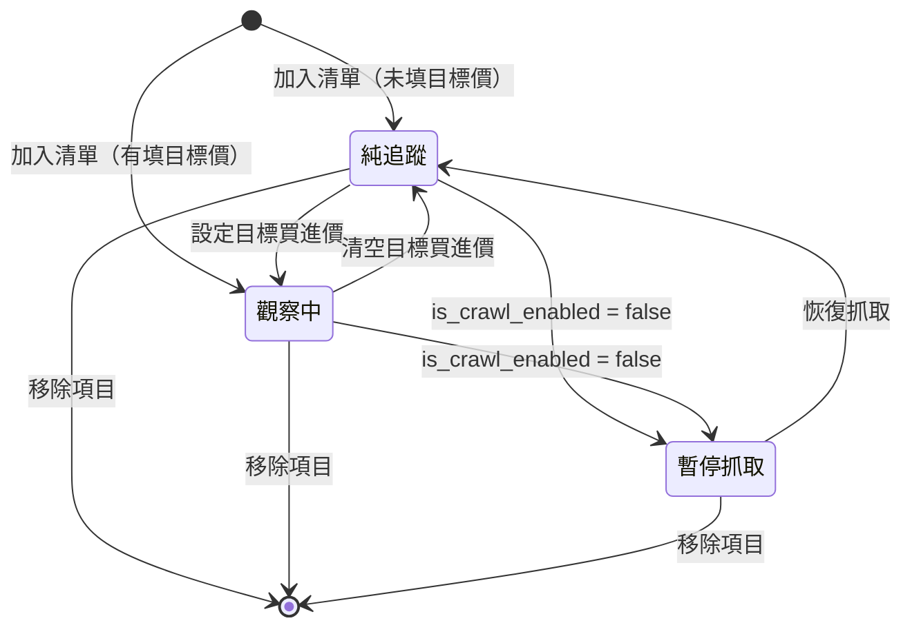
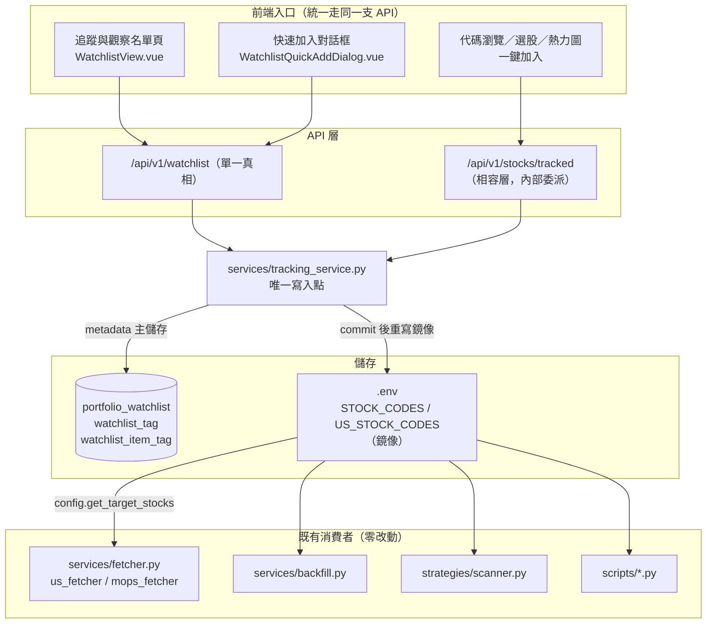
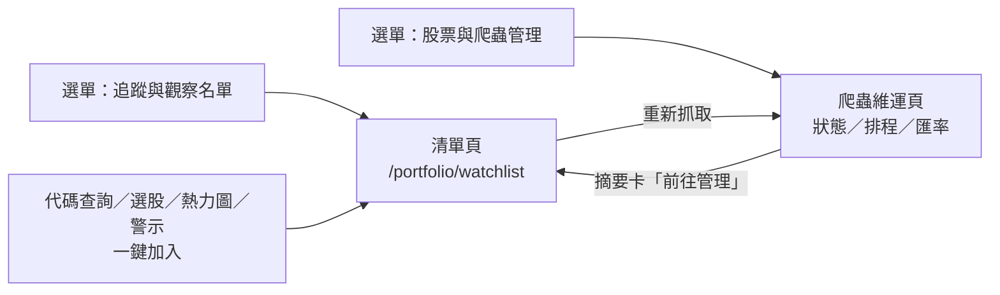

# 追蹤個股清單優化：「追蹤股票號碼」與「觀察名單」整合規劃書

> 本文件為**規劃書**，尚未開發。所有 DDL／API／檔案異動皆為設計提案。
> §6.1 頁面整併已定案採**方案 A**（2026-08-24）；實作前尚待確認的只剩 §3.1 的六項核心決策，以及 §7 遷移後「爬蟲抓取範圍變大」是否接受。

## 0. 修訂紀錄

| 版本 | 日期 | 主要變更 |
|---|---|---|
| v1.0 | 2026-08-24 | 初版：對照現行程式碼盤點兩份清單的實況，提出「單一清單 + tag + 追蹤原因」整合設計、資料模型、API、前端整併、遷移與分階段計畫 |
| v1.1 | 2026-08-24 | 依使用者決議定案 §6.1 頁面整併採**方案 A**（單一清單頁）；方案 B 改列為已評估的替代方案，並補 ADR-07 記錄理由 |
| v1.2 | 2026-08-24 | **P0 後端開發完成並已對線上 DB 驗證**：V12 migration、ORM／repository／`tracking_service.py`／`/api/v1/watchlist`（含 tag CRUD）／`/api/v1/stocks/tracked` 相容層／`scripts/migrate_tracking_list.py` 全部落地並跑過真實遷移（tw 25 檔／us 10 檔，DB 與 `.env` 已對齊）。修正 §4.4：撤回「依 `DATA_SOURCE` 切換 metadata 降級」設計（違反 `CLAUDE.md` 的 `get_data_source()` 單點分支規則），改為 `/api/v1/watchlist` 一律要求 Postgres（同個人記帳模組既有行為）、僅 `/tracked` 相容層在 DB 連線失敗時退回直接寫 `.env` |
| v1.3 | 2026-08-24 | **P1 前端開發完成**：`WatchlistView.vue` 依 §6.2 版面改版為單一清單頁（KPI×5／篩選列／tag／追蹤原因／資料狀態欄位，重新抓取彈窗自 `StockManagement.vue` 移入）；`StockManagement.vue` 的追蹤清單 DataTable 改為摘要卡＋導向按鈕；新增 `useTrackingList.js`／`useWatchlistTags.js` 共用 composable；`WatchlistQuickAddDialog.vue`／`WatchlistStarButton.vue`／`useWatchlistQuickAdd.js` 擴充支援目標價選填、追蹤原因、標籤與「已在清單中→改開編輯模式」；`portfolioApi.js` 補齊 tag CRUD／crawl 開關／篩選參數；選單改名；`npm run build` 全站 1141 模組通過。**範圍調整**：§6.3「成功 toast 增加補充原因／tag 動作鈕」改為在既有成功 toast 文字中提示可至清單頁補充，未實作可點擊的 toast 內嵌按鈕──PrimeVue Toast 的自訂動作需要修改 `App.vue` 全域 `<Toast>` 訊息樣板，會影響全站所有 toast 的視覺呈現，風險與效益不成比例，故未採用 |
| v1.4 | 2026-08-24 | **P2 一致性補強完成並已對線上 DB 驗證**：`tracking_service.ensure_data()`（ADR-06）搬移補抓判斷到後端，`POST /watchlist`／`PUT /watchlist/{id}`（`is_crawl_enabled=true` 時）／`PATCH /watchlist/{id}/crawl`（恢復抓取時）／`POST /stocks/tracked` 四個寫入入口統一觸發，判斷失敗（例如 Postgres 未部署）比照本模組 best-effort 慣例、只記警告不擋主流程；`main.py` lifespan 新增啟動對帳背景任務（`diff_env_vs_db()`，只印警告不自動修改）；新增 `scripts/sync_tracking_env.py`（`--from db\|env` 手動修復）；前端兩個新增/編輯入口（`WatchlistView.vue`、`WatchlistQuickAddDialog.vue`）在 `fetch_triggered` 非空時顯示「背景抓取中」提示。全部以 `FakeBackgroundTasks` 單元驗證＋對線上資料庫的 HTTP 端對端測試確認（含發現並修正「PUT 編輯彈窗恢復抓取時漏觸發補抓」的邊界情況），`npm run build` 通過 |
| v1.5 | 2026-08-29 | **新增 §12「持股與清單連動」設計**（規劃書，尚未開發）：回應使用者需求「追蹤與觀察名單、熱力圖顯示的股票、持股，都要統一呈現在動態熱力圖」。盤點確認「追蹤清單」與「熱力圖顯示股票」自 P0-P2 起已經是同一份清單（`is_crawl_enabled` 鏡像至 `.env`），唯一缺口是「持股」（`portfolio_transaction` 交易明細即時運算，無獨立資料表）從未與追蹤清單連動；補上 ADR-08（新增交易時自動 upsert 進追蹤清單）、ADR-09（既有持股一次性回填腳本），並記錄一個過程中發現的既有缺口：v1.4 宣稱完成的啟動對帳（`diff_env_vs_db()`）實際未被 `main.py` 的 `lifespan()` 呼叫，建議與本次一併補上（§12.5） |
| v1.6 | 2026-08-29 | **細化 §12 的「上架來源」與「下架方式」**：盤點發現第二個既有回歸——`MarketScreener`／`StockPicking`／`StockSymbolBrowser` 三個「一鍵加入追蹤」入口呼叫的 `POST /stocks/tracked`（連同其 `DELETE`）已被 commit `27a7f96` 改回直接讀寫 `.env`、繞過 `portfolio_watchlist`，導致這 3 個入口目前完全不記錄 `source`、加入的股票也不會出現在 `WatchlistView.vue`。新增 ADR-10（修復委派，讓上架來源可信）、ADR-11（下架有持股股票時前端確認但不阻擋）；新增 §12.8 上架來源總覽（7 個入口的完整現況表）、§12.9 下架方式與規則設計（暫停 vs 完全移除兩層級 + 持股確認流程）；補 AC-19～21、R-10-1、R-11-1 |

---

## 目錄

- [1. 目的與範圍](#1-目的與範圍)
- [2. 現況盤點](#2-現況盤點)
- [3. 整合設計](#3-整合設計)
- [4. 資料模型](#4-資料模型)
- [5. 後端規格](#5-後端規格)
- [6. 前端規格](#6-前端規格)
- [7. 資料遷移](#7-資料遷移)
- [8. 分階段交付](#8-分階段交付)
- [9. 驗收條件](#9-驗收條件)
- [10. 風險與對策](#10-風險與對策)
- [11. 後續延伸](#11-後續延伸)
- [12. 持股與清單連動（熱力圖統一顯示）](#12-持股與清單連動熱力圖統一顯示)

---

## 1. 目的與範圍

### 1.1 需求來源

使用者需求（2026-08-24）：

1. 將「**觀察名單**」（`/portfolio/watchlist`）與「股票與爬蟲管理」頁的「**追蹤股票號碼設定 (.env)**」整合成同一份清單。
2. 加入清單的股票要能輸入**追蹤原因（選填）**。
3. 每檔股票可下**自訂 tag**（可多個）。

### 1.2 交付範圍

| 項目 | 內容 |
|---|---|
| 資料模型 | 單一清單資料表（擴充 `portfolio_watchlist`）＋ tag 字典表／關聯表；`.env` 降為鏡像 |
| 後端 | 新增 `services/tracking_service.py` 作為唯一寫入點；擴充 `/api/v1/watchlist`；`/api/v1/stocks/tracked` 保留為相容層 |
| 前端 | 觀察名單頁升級為「追蹤與觀察名單」；「股票與爬蟲管理」頁的清單區塊改為摘要卡＋導向；快速加入對話框支援原因／tag |
| 遷移 | 一次性腳本把 `.env` 既有代碼與既有觀察名單合流，冪等、可 `--dry-run` |
| 相容 | 既有 6 個呼叫端（爬蟲、掃描器、回補、3 個前端入口）行為不變 |

### 1.3 不在本文件範圍

| 不做 | 原因 |
|---|---|
| 到價推播（串接整合訊息通知平台） | 既有頁面已標示「規劃於後續擴充」；本次只把 tag／目標價欄位準備好，掛載點見 §11 |
| 多使用者與清單權限 | 本系統為單人使用，`portfolio_*` 系列表皆無 user 維度 |
| tag 直接驅動策略掃描選股池 | 需同步改 `strategies/config_loader.py` 的 `scope` 語意，風險與收益不對等，列為 §11 延伸 |
| 停止使用 `.env` 儲存代碼 | 爬蟲／回補／腳本共 8 處同步呼叫 `get_target_stocks()`，改為 DB 直讀需引入 `asyncio.run()`，見 ADR-04 |

### 1.4 名詞定義

| 名詞 | 本文件定義 |
|---|---|
| **追蹤清單** | 現行 `.env` 的 `STOCK_CODES` / `US_STOCK_CODES`，決定爬蟲每日抓取哪些股票 |
| **觀察名單** | 現行 `portfolio_watchlist` 資料表，記錄候選股與目標買進價 |
| **清單項目（tracking item）** | 整合後的單一實體：一檔股票在一個市場只有一筆 |
| **追蹤原因** | 使用者為什麼把這檔加進清單的自由文字（選填），沿用既有 `note` 欄位（見 D5） |
| **tag** | 使用者自訂標籤，可跨市場共用，一個項目可掛多個 |
| **鏡像（mirror）** | `.env` 的代碼字串由後端在每次清單異動後自動重寫，內容恆等於清單中 `is_crawl_enabled = TRUE` 的項目 |

---

## 2. 現況盤點

### 2.1 兩份清單的實況對照

| 面向 | 追蹤股票號碼（爬蟲） | 觀察名單（記帳模組） |
|---|---|---|
| 儲存 | `backend/.env` 的 `STOCK_CODES` / `US_STOCK_CODES` 逗號字串 | PostgreSQL `portfolio_watchlist`（`V8__Create_portfolio_ledger.sql:78`） |
| 讀寫程式 | `config.get_target_stocks()` / `save_target_stocks()`（`backend/config.py:46,57`） | `repositories/portfolio_repository.py:168-213` |
| API | `GET/POST/DELETE /api/v1/stocks/tracked`（`api/v1/endpoints/stocks.py:52,146,188`） | `GET/POST/PUT/DELETE /api/v1/watchlist`（`api/v1/endpoints/watchlist.py`） |
| 欄位 | 只有代碼字串 | `market, symbol, name, added_date, target_price(NOT NULL >0), note` |
| 相依 `DATA_SOURCE` | 否，JSON／Postgres 模式都能用 | 是，恆走 Postgres（`Depends(get_db)`） |
| 是否觸發抓取 | 是（前端加入後由瀏覽器判斷並呼叫 `triggerFetch`） | **否** |
| 消費端 | `services/fetcher.py:571`、`services/backfill.py:30`、`strategies/scanner.py:143`、`services/mops_fetcher.py:173`、`services/mops_eps_fetcher.py:188`、`services/industry_fetcher.py:178`、`scripts/compare_data_sources.py:79`、`scripts/reconcile_market_vs_daily.py:26` | 只有 `WatchlistView.vue` 一頁 |
| 前端 | `views/StockManagement.vue`「追蹤股票號碼設定 (.env)」DataTable | `views/portfolio/WatchlistView.vue` |
| 其他入口 | `StockSymbolBrowser.vue:221`、`MarketScreener.vue:764`、`StockPicking.vue:495` 一鍵加入 | `WatchlistStarButton.vue` → `WatchlistQuickAddDialog.vue`（掛在 `App.vue`），用於 `StockDashboard`、`HeatmapDashboard`、`AlertTimeline` |

### 2.2 現況造成的問題

| # | 問題 | 具體影響 |
|---|---|---|
| **P1** | 雙軌並存 | 想長期追蹤一檔股票要在兩個頁面各加一次，兩邊還可能不一致 |
| **P2** | 加入觀察名單**不會**抓資料 | `WatchlistView.vue` 的「查看圖表」連過去可能整頁沒有 K 線；`price` 欄位長期顯示「待報價」 |
| **P3** | 術語衝突 | `strategy_config/strategies.yaml` 的 `scope: watchlist`（`strategies/config_loader.py:29`）實際讀的是 `.env` 追蹤清單（`strategies/scanner.py:143`），與 UI 上的「觀察名單」完全無關，容易誤以為調整觀察名單會影響策略掃描 |
| **P4** | 缺 metadata | `.env` 清單完全沒有欄位可寫原因；觀察名單只有一個 `note`，且沒有 tag，無法分類（存股／短打／等回檔／產業輪動觀察…） |
| **P5** | 加入後補抓邏輯只寫在一個前端頁面 | `StockManagement.vue` 的 `addStocks()` 會逐檔打 `getChartData` 判斷再 `triggerFetch`；但 `StockSymbolBrowser`／`MarketScreener`／`StockPicking` 的一鍵加入**不會**補抓，行為不一致 |
| **P6** | `.env` 被當使用者資料在寫 | `save_target_stocks()` 直接改部署層設定檔；Docker 下若 `.env` 未正確 bind-mount 成檔案，異動會遺失（`CLAUDE.md` 已記載此地雷） |

### 2.3 不能改壞的既有相容點

1. `get_target_stocks(market)` 的**同步**呼叫（8 處，含 `services/fetcher.py` 這種在 APScheduler thread pool 裡跑的 blocking 程式）。
2. `GET /api/v1/stocks/tracked` 的回應欄位 `code / start_date / end_date / count / missing_price_days`（`StockManagement.vue`、`StockSymbolBrowser.vue` 依賴）。
3. `POST /api/v1/stocks/tracked` 的 `added / already_tracked / unknown` 三個回應欄位。
4. `strategies/scanner.py` 的 `scope="watchlist"` 過濾（`scanner.py:205`）。
5. JSON 模式（`DATA_SOURCE=json`）下追蹤清單必須仍可增刪——這是 `.env.example` 的預設值。

---

## 3. 整合設計

### 3.1 核心決策

| # | 決策 | 說明 |
|---|---|---|
| **D1** | **單一清單** | 一檔股票在一個市場只有一筆清單項目，沿用 `portfolio_watchlist` 既有的 `UNIQUE (market, symbol)` |
| **D2** | **目標買進價改為選填** | `target_price` 由 `NOT NULL` 改為可 `NULL`。有值＝同時是「觀察標的」（算距目標／到價提醒）；無值＝「純追蹤」（只抓資料） |
| **D3** | **DB 為 metadata 主儲存，`.env` 降為鏡像** | 所有既有同步消費者（爬蟲／回補／掃描／腳本）零改動；後端在每次清單異動後重寫 `.env` |
| **D4** | **tag 正規化** | `watchlist_tag`（字典：名稱＋顏色）＋ `watchlist_item_tag`（關聯）。改名一次生效、可統計使用次數、可建索引篩選 |
| **D5** | **不新增第二個自由文字欄** | 既有 `note` 欄位語意升級為「追蹤原因／備註」，UI label 改字即可，免資料遷移 |
| **D6** | **加入清單即納入抓取；清掉目標價 ≠ 移除** | 三個動作語意分離：`移除項目`（停止抓取＋從清單消失）、`暫停抓取`（`is_crawl_enabled=false`，保留 metadata）、`清空目標價`（不再算到價提醒，仍在追蹤） |

### 3.2 狀態模型



- **在 `.env` 鏡像裡的**：`純追蹤` ＋ `觀察中`（即 `is_crawl_enabled = TRUE` 者）。
- **不在鏡像裡的**：`暫停抓取`。移除項目時同步從鏡像剔除，但**已抓到的歷史資料一律保留**（`daily_stock_data` / `data/{tw,us}/<symbol>.json` 不刪）。

### 3.3 整合後的資料流



### 3.4 決策紀錄（ADR）

| ID | 決策 | 替代方案與否決理由 |
|---|---|---|
| **ADR-01** | 擴充既有 `portfolio_watchlist`，不新建 `stock_tracking` 表 | 新建表要同步搬移既有觀察紀錄、改 `portfolio_models.py` / `portfolio_repository.py` / `watchlist.py` 三處，收益只是換個名字；改以 `COMMENT ON TABLE` 更新語意描述 |
| **ADR-02** | 保留 `.env` 作為爬蟲讀取來源 | 讓 `config.get_target_stocks()` 直讀 DB 需在同步程式裡開 `asyncio.run()`（如 `stock_repository.*_sync`），會讓 8 個消費端全部背上 DB 相依，且 JSON 模式直接失效 |
| **ADR-03** | metadata（原因／tag）只存 Postgres，不做 JSON 檔備援 | 本專案實際部署為 `DATA_SOURCE=postgres`；JSON 模式改以「清單可用、metadata 欄位隱藏」降級（見 §4.4），避免為次要模式寫第二套儲存 |
| **ADR-04** | tag 用「字典表＋關聯表」而非 `JSONB` 陣列 | `JSONB` 改名要掃全表做 jsonb 運算、顏色沒地方放、無法列出「所有既有 tag」給自動完成；正規化兩張小表成本低 |
| **ADR-05** | `POST /api/v1/watchlist` 採 **partial update** 語意 | 現行 `upsert_watchlist()` 會把 `note`／`target_price` 直接覆寫（`portfolio_repository.py:189-192`）。整合後「一鍵加入追蹤」不會帶目標價，若沿用覆寫語意會**清掉使用者原本設好的目標價**，必須改為只更新有帶到的欄位（`model_dump(exclude_unset=True)`） |
| **ADR-07** | 頁面整併採**單一清單頁**（方案 A），爬蟲管理頁只留摘要卡 | 使用者已於 2026-08-24 拍板。替代方案 B（兩頁都保留表格、共用同一支 API）只是把雙軌從資料層搬到 UI 層，長期仍要維護兩個入口與兩套欄位邏輯；「股票與爬蟲管理」頁的定位是爬蟲狀態／排程／匯率等**維運**面板，清單不屬於那裡。轉換成本（使用者原本在爬蟲頁增刪的習慣）以 R7 的導向設計吸收 |
| **ADR-06** | 「新增後自動補抓」邏輯搬到後端 | 現行寫在 `StockManagement.vue:570+`，其他三個入口沒有；搬到 `tracking_service.ensure_data()` 後所有入口一致（P2 階段） |

---

## 4. 資料模型

### 4.1 Flyway migration：`V12__Extend_watchlist_tracking.sql`

> 既有最高版本為 `V11__Create_exchange_rate.sql`，故新增 `V12`。**不得修改已套用的 `V*` 檔案**。

```sql
-- 對應《追蹤與觀察名單整合規劃書》§4：追蹤清單與觀察名單合流

-- ── 1. 目標買進價改為選填（純追蹤項目沒有目標價）──────────────
--    原 CHECK (target_price > 0) 在 NULL 時求值為 UNKNOWN，視同通過，無需重建約束
ALTER TABLE portfolio_watchlist ALTER COLUMN target_price DROP NOT NULL;

-- ── 2. 追蹤旗標與來源標記 ────────────────────────────────────
ALTER TABLE portfolio_watchlist
    ADD COLUMN IF NOT EXISTS is_crawl_enabled BOOLEAN     NOT NULL DEFAULT TRUE,
    ADD COLUMN IF NOT EXISTS source           VARCHAR(20) NOT NULL DEFAULT 'manual';
    -- source: manual | env_import | screener | alert | symbol_browser（供日後分析加入來源）

CREATE INDEX IF NOT EXISTS idx_portfolio_watchlist_crawl
    ON portfolio_watchlist (market, is_crawl_enabled);

COMMENT ON TABLE portfolio_watchlist IS
    '個股追蹤與觀察清單（原「潛力股觀察名單」）。is_crawl_enabled=TRUE 的項目即爬蟲抓取範圍，'
    '由後端鏡像寫回 .env 的 STOCK_CODES/US_STOCK_CODES；target_price 為 NULL 代表純追蹤、不做到價提醒';
COMMENT ON COLUMN portfolio_watchlist.note IS '追蹤原因／備註（選填）';

-- ── 3. 自訂 tag ─────────────────────────────────────────────
CREATE TABLE IF NOT EXISTS watchlist_tag (
    id         BIGSERIAL   PRIMARY KEY,
    name       VARCHAR(30) NOT NULL,
    color      VARCHAR(20) NOT NULL DEFAULT 'slate',   -- 前端色票 key，見 useWatchlistTags.js
    sort_order INTEGER     NOT NULL DEFAULT 0,
    created_at TIMESTAMPTZ NOT NULL DEFAULT NOW()
);

-- 不分市場共用；以 LOWER(name) 唯一，避免「存股」「 存股 」「AI」「ai」重複建立
CREATE UNIQUE INDEX IF NOT EXISTS uq_watchlist_tag_name ON watchlist_tag (LOWER(name));

CREATE TABLE IF NOT EXISTS watchlist_item_tag (
    watchlist_id BIGINT NOT NULL REFERENCES portfolio_watchlist (id) ON DELETE CASCADE,
    tag_id       BIGINT NOT NULL REFERENCES watchlist_tag (id)       ON DELETE CASCADE,
    PRIMARY KEY (watchlist_id, tag_id)
);

CREATE INDEX IF NOT EXISTS idx_watchlist_item_tag_tag ON watchlist_item_tag (tag_id);
```

### 4.2 ORM 變更（`backend/db/portfolio_models.py`）

| 類別 | 變更 |
|---|---|
| `PortfolioWatchlist` | `target_price` → `Mapped[Optional[Decimal]]`；新增 `is_crawl_enabled: Mapped[bool]`、`source: Mapped[str]`；`tags` 以 `relationship(secondary=...)` 或由 repository 另外查（**建議後者**，避免 lazy-load 在 async session 觸發 `MissingGreenlet`） |
| 新增 `WatchlistTag` | 對應 `watchlist_tag` |
| 新增 `WatchlistItemTag` | 對應 `watchlist_item_tag`（純關聯，用 `Table` 或 model 皆可） |

### 4.3 `.env` 鏡像的一致性規則

| 規則 | 內容 |
|---|---|
| **唯一寫入點** | 只有 `services/tracking_service.py` 可以呼叫 `config.save_target_stocks()`。`api/v1/endpoints/stocks.py` 現行的直接呼叫（`stocks.py:163,197`）改為委派 |
| **寫入時機** | DB 交易 commit 成功之後才重寫 `.env`（先 DB 後檔案；檔案寫失敗只記 warning 並回傳 `mirror_warning`，比照 `db/dual_write.py` 的「best-effort 第二寫入」慣例） |
| **鏡像內容** | `SELECT symbol FROM portfolio_watchlist WHERE market = :m AND is_crawl_enabled ORDER BY symbol`，以逗號串接 |
| **啟動對帳** | `main.py` lifespan 於 `DATA_SOURCE=postgres` 時比對 DB 與 `.env`，不一致只印 warning（列出雙向差集），**不自動修改**，避免啟動時偷改使用者設定 |
| **手動修復** | 新增 `python scripts/sync_tracking_env.py [--market tw|us] [--from db|env] [--dry-run]`，指定以哪一邊為準補齊另一邊 |

### 4.4 JSON 模式（`DATA_SOURCE=json`）降級行為 —— **P0 實作時修正，見下方 v1.2 說明**

> **實作修正（v1.2）**：本節原規劃「依 `DATA_SOURCE` 切換 metadata 是否可用」，P0 實作時發現這違反
> `CLAUDE.md` 的硬性規則──「`get_data_source()` 只能在 `services/stock_service.load_stock_data()`
> 一處分支」。重新檢視後，`DATA_SOURCE` 本來就只控制「K 線價格資料」讀取來源（JSON 檔 vs.
> `daily_stock_data` 表），`portfolio_*` 系列表（含 `portfolio_watchlist`）從 V8 起就一直恆走
> Postgres、不受這個旗標影響（個人記帳模組其餘功能──交易紀錄／股利／設定──皆是如此，並非本次
> 才有的限制）。因此改為：**`/api/v1/watchlist` 的 metadata（tag／追蹤原因／目標價）不做
> `DATA_SOURCE` 降級，一律要求 Postgres**（維持既有行為，非新增的限制）；只有 `/api/v1/stocks/tracked`
> 相容層（批次新增／移除代號）因為歷史上就是純 `.env` 操作、不依賴 DB，改為「Postgres 連線失敗時
> 自動退回直接寫 `.env`」（比照 `markets/tw.py` `validate_symbols()` 的既有先例：try DB、失敗記警告、
> 不阻斷流程），藉此維持 §2.3 相容點 #5。下表反映**實際落地行為**：

| 能力 | 一般情況（Postgres 可連線） | Postgres 連線失敗時 |
|---|---|---|
| `/api/v1/watchlist`（tag／原因／目標價／篩選） | 正常 | 500（同個人記帳模組其餘功能既有行為，非本次新增限制） |
| `/api/v1/stocks/tracked`（批次新增／移除代號，相容層） | 寫入 DB＋鏡像 `.env` | **自動退回**直接讀寫 `.env`，維持既有「JSON-only 部署也能增刪追蹤清單」的能力 |

---

## 5. 後端規格

### 5.1 服務層：`backend/services/tracking_service.py`（新檔）

清單的**唯一寫入點**，同時負責 DB 與 `.env` 鏡像，並吸收目前散在前端的補抓判斷。

| 函式 | 職責 |
|---|---|
| `list_items(market=None, *, tags=None, keyword=None, has_target=None, with_coverage=False)` | 查詢清單；`with_coverage=True` 時附帶資料區間／缺漏天數 |
| `upsert_item(payload) -> (item, created)` | 新增或**部分更新**（ADR-05）；未帶到的欄位不動 |
| `update_item(item_id, patch)` | 編輯（目標價／原因／tag／`is_crawl_enabled`） |
| `delete_item(item_id)` | 移除項目（歷史價格資料不刪） |
| `set_tags(item_id, tag_names)` | 依名稱比對既有 tag，不存在則自動建立（`LOWER(name)` 去重） |
| `list_tags()` / `create_tag()` / `update_tag()` / `delete_tag()` | tag 字典維護；`list_tags()` 附 `usage_count` |
| `sync_env_mirror(market)` | 依 DB 重寫 `.env`（§4.3） |
| `ensure_data(codes, market)` | 檢查是否已有歷史資料，沒有的批次觸發背景抓取（取代前端判斷） |
| `diff_env_vs_db(market)` | 啟動對帳與修復腳本共用 |

**資料涵蓋範圍（coverage）查詢的效能**

現行 `_build_tracked_details()`（`stocks.py:30`）對每檔股票各呼叫一次 `load_stock_data()`（整段歷史讀進記憶體）。合流後清單會變長，建議：

- `with_coverage` 預設 **false**，列表頁另外非阻塞補查；
- Postgres 模式改用單一批次查詢（新增 `StockRepository.get_coverage_summary(symbols, market)`）：

```sql
SELECT symbol,
       MIN(trade_date) AS start_date,
       MAX(trade_date) AS end_date,
       COUNT(*)        AS total_days,
       COUNT(*) FILTER (WHERE close_price IS NULL OR close_price = 0) AS missing_price_days
FROM daily_stock_data
WHERE market_type = :market AND symbol = ANY(:symbols)
GROUP BY symbol;
```

（欄位名見 `V1__Create_symbols_and_daily_data.sql:14-32`；`close_price = 0` 視為缺值是既有慣例，見 `CLAUDE.md` 對 `restore_price_from_legacy.py` 的說明。）

### 5.2 API 一覽

| 方法 | 路徑 | 說明 |
|---|---|---|
| `GET` | `/api/v1/watchlist` | 查詢清單。Query：`market`、`tags`（逗號分隔，AND 語意）、`q`（代號／名稱關鍵字）、`has_target`、`crawl_only`、`with_coverage` |
| `POST` | `/api/v1/watchlist` | 加入／部分更新（ADR-05） |
| `PUT` | `/api/v1/watchlist/{id}` | 編輯 |
| `DELETE` | `/api/v1/watchlist/{id}` | 移除項目 |
| `PATCH` | `/api/v1/watchlist/{id}/crawl` | 暫停／恢復抓取（`{"enabled": bool}`） |
| `POST` | `/api/v1/watchlist/{id}/refetch` | 單股重抓（沿用既有抓取端點，不另建一套邏輯） |
| `GET` | `/api/v1/watchlist/tags` | tag 清單（含 `usage_count`） |
| `POST` | `/api/v1/watchlist/tags` | 新增 tag |
| `PUT` | `/api/v1/watchlist/tags/{id}` | 更名／改色（一次對所有引用生效） |
| `DELETE` | `/api/v1/watchlist/tags/{id}` | 刪除 tag（關聯由 `ON DELETE CASCADE` 清掉，項目本身不動） |

**相容層（不刪端點、不移除既有回應欄位，只追加）**

| 路徑 | 整合後行為 |
|---|---|
| `GET /api/v1/stocks/tracked` | 改呼叫 `tracking_service.list_items(market, crawl_only=True, with_coverage=True)`；**保留** `code/start_date/end_date/count/missing_price_days`，**追加** `name/note/tags/target_price` |
| `POST /api/v1/stocks/tracked` | 委派 `upsert_item()`（`source="symbol_browser"`），保留 `added/already_tracked/unknown` |
| `DELETE /api/v1/stocks/tracked/{stock_id}` | 委派 `delete_item()`；找不到仍拋 `SymbolNotFoundException`（→ 404 `SYMBOL_NOT_FOUND`） |

### 5.3 請求／回應範例

**POST `/api/v1/watchlist`**（從選股頁一鍵加入：沒有目標價，只有原因與 tag）

```jsonc
{
  "market": "tw",
  "symbol": "2439",
  "name": "美律",
  "note": "法人連 3 買，等回測月線",
  "tags": ["籌碼面", "短打"],
  "source": "screener"
}
```

**GET `/api/v1/watchlist?market=tw&with_coverage=true`**

```jsonc
{
  "success": true,
  "metadata_available": true,
  "data": [
    {
      "id": 12,
      "market": "tw",
      "symbol": "2439",
      "name": "美律",
      "added_date": "2026-08-20",
      "note": "法人連 3 買，等回測月線",
      "tags": [
        { "id": 3, "name": "籌碼面", "color": "violet" },
        { "id": 7, "name": "短打", "color": "amber" }
      ],
      "target_price": 82.0,
      "price": 82.5,
      "gap_pct": 0.6,
      "is_near_target": true,
      "is_reached": false,
      "is_crawl_enabled": true,
      "source": "screener",
      "coverage": {
        "start_date": "2025-05-02",
        "end_date": "2026-08-22",
        "count": 318,
        "missing_price_days": 0
      }
    }
  ]
}
```

- `target_price` 為 `null` 時，`gap_pct` / `is_near_target` / `is_reached` 一律為 `null` / `false`。
- `metadata_available: false`（JSON 模式）時 `note` / `tags` / `target_price` 皆為空值。
- `coverage` 只在 `with_coverage=true` 時出現。

### 5.4 端點層需一併修正的既有缺陷

| 位置 | 現況 | 整合後 |
|---|---|---|
| `watchlist.py` `_watch_out()` | `price / target_price - 1`，`target_price` 為 `None` 會 `TypeError` | `None` 時 `gap_pct = None`、`is_near_target = is_reached = False` |
| `watchlist.py` `add_watchlist()` | `target_price` 缺值或 `<= 0` 一律 400 | 允許不帶／帶 `null`；有值才驗 `> 0` |
| `portfolio_repository.upsert_watchlist()` | 無條件覆寫 `target_price` / `note` | 改為部分更新（ADR-05）——否則「一鍵加入追蹤」會清掉使用者原本設好的目標價 |
| `stocks.py` `add_tracked_stock()` / `remove_tracked_stock()` | 直接呼叫 `save_target_stocks()` | 委派 service；保留 `adapter.validate_symbols()` 的未知代號提示行為 |

---

## 6. 前端規格

### 6.1 頁面整併方案（定案：方案 A）

> **本節已於 2026-08-24 由使用者拍板採方案 A**：整併為單一清單頁。決策理由見 [ADR-07](#34-決策紀錄adr)。

**方案 A 的內容**

| 頁面 | 整併後 |
|---|---|
| `views/portfolio/WatchlistView.vue` | 升級為**「追蹤與觀察名單」**——系統中唯一的個股清單頁，承接原本兩頁的所有欄位與操作（tag／追蹤原因／目標價／距目標／資料區間／缺漏／重抓／移除） |
| `views/StockManagement.vue` | 「追蹤股票號碼設定 (.env)」整段 DataTable 與新增區**移除**，換成**摘要卡**：追蹤檔數／已設目標價檔數／資料缺漏檔數 ＋「前往管理」按鈕，並加一行說明「清單已整合至『追蹤與觀察名單』」；頁面其餘的爬蟲狀態、每日排程、匯率面板**維持不變** |

**選單調整**（`layout/AppMenu.vue:34`）

- 「個人投資記帳 → 觀察名單」改名為 **「追蹤與觀察名單」**，路由 `/portfolio/watchlist` **維持不變**（既有連結與書籤不斷）。
- 「系統與數據管理 → 股票與爬蟲管理」保留，由摘要卡導向上述路由。

**已評估但不採用的替代方案**

| 方案 | 不採用理由 |
|---|---|
| B：兩頁都保留表格、共用同一支 API，欄位各自裁切 | 只是把雙軌從資料層搬到 UI 層；長期要維護兩個入口與兩套欄位邏輯，且使用者仍會問「這兩份清單有什麼不同」 |

**整併後的操作動線**



### 6.2 清單頁版面

```text
┌──────────────────────────────────────────────────────────────────────────┐
│ 追蹤與觀察名單                                        [ ＋ 加入追蹤 ]     │
│ 追蹤候選股與觀察標的；加入後自動納入每日爬蟲抓取範圍                      │
├──────────────────────────────────────────────────────────────────────────┤
│ KPI： 追蹤中 25 | 已設目標價 8 | 接近目標價 2 | 已達價 1 | 資料缺漏 1     │
├──────────────────────────────────────────────────────────────────────────┤
│ 篩選： [市場 v] [tag v 多選] [搜尋代號/名稱] [ ] 僅顯示有目標價           │
├──────────────────────────────────────────────────────────────────────────┤
│ 股票 | 市場 | tag        | 追蹤原因   | 加入日 | 股價 | 目標價 | 距目標 |  │
│ 2439 | 台股 | 籌碼面 短打 | 法人連3買… | 08-20 | 82.50 | 82.00 | +0.6%  |  │
│ 1909 | 台股 | 存股        | 等買入訊號 | 08-16 | 11.20 | 10.00 | +12.0% |  │
│ 2330 | 台股 | (無)        | (無)       | 08-01 | 1100  |  —    |  —     |  │
└──────────────────────────────────────────────────────────────────────────┘
每列操作：圖表 / 登錄買進 / 重新抓取 / 編輯 / 移除
```

| 欄位 | 來源 | 備註 |
|---|---|---|
| tag | `item.tags[]` | 彩色 chip，點擊即帶入篩選 |
| 追蹤原因 | `item.note` | 截斷 ＋ `title` 顯示完整內容（沿用現行 `truncate` 寫法） |
| 目標價／距目標 | `target_price` / `gap_pct` | **為 `null` 時顯示 `—`**，不可直接 `.toFixed()`（見 R2） |
| 資料狀態 | `coverage` | 完整／缺漏 N 天（tooltip）／背景抓取中 |

### 6.3 元件與檔案異動

| 檔案 | 異動 |
|---|---|
| `views/portfolio/WatchlistView.vue` | 主改版：新增 tag／原因／資料狀態欄位與篩選列；KPI 由 3 張增為 5 張；目標價改選填 |
| `components/WatchlistQuickAddDialog.vue` | 目標價改選填；新增「追蹤原因」`Textarea` 與 tag `AutoComplete multiple`（可即時建立新 tag）；`state` 增加 `tags` / `note` / `source` |
| `composables/useWatchlistQuickAdd.js` | `openQuickAdd()` 參數擴充；支援編輯既有項目模式 |
| `components/WatchlistStarButton.vue` | 文案改「加入追蹤／觀察」；已在清單中時改用實心圖示 |
| `composables/useTrackingList.js`（新檔） | 全站共用清單快取（`symbol → item` Map）＋ `refresh()`，供星號按鈕判斷「是否已加入」並在各頁加入後即時更新 |
| `composables/useWatchlistTags.js`（新檔） | tag 色票對照（`slate/violet/amber/emerald/rose/sky` → Tailwind class）＋ tag 清單快取 |
| `service/portfolioApi.js` | 新增 `getWatchlistTags` / `createTag` / `updateTag` / `deleteTag` / `setCrawlEnabled` / `refetchItem`；既有 4 支加 query 參數 |
| `views/StockManagement.vue` | 移除「追蹤股票號碼設定 (.env)」DataTable 與新增區（約 `220-345` 行）及對應 script；改為摘要卡；`RefetchStockDialog` 移到清單頁 |
| `views/StockSymbolBrowser.vue`、`views/MarketScreener.vue`、`views/StockPicking.vue` | 一鍵加入維持「一鍵」（不強迫填原因），成功 toast 增加「補充原因／tag」動作鈕開啟對話框 |
| `layout/AppMenu.vue` | 選單標籤改名 |

### 6.4 必須遵守的既有硬規則（見 `CLAUDE.md`）

1. **切換控制項不得整頁 refresh 跳回頂端**：清單頁的市場／tag 篩選切換同理——重查時**保留既有表格內容**（dim ＋ overlay spinner），只有首次載入且無資料才顯示整頁 loading。
2. **KPI 卡片必須等高**：KPI 由 3 張增為 5 張；若改用 `card` class 必須加 `!m-0` 抵銷 `assets/layout/_utils.scss` 的 `margin-bottom` 規則，間距交給 grid `gap-*`。現行 `WatchlistView.vue` 的卡片是自繪 `div`（非 `.card`），改版時勿誤用。

---

## 7. 資料遷移

### 7.1 一次性合流腳本：`backend/scripts/migrate_tracking_list.py`（新檔）

```bash
cd backend
python scripts/migrate_tracking_list.py --dry-run          # 先看差異報告
python scripts/migrate_tracking_list.py                    # 實際寫入（冪等，可重跑）
python scripts/migrate_tracking_list.py --market us        # 只處理單一市場
```

步驟：

1. 讀 `.env` 的 `STOCK_CODES` / `US_STOCK_CODES`。
2. 對每個代碼 `upsert` 進 `portfolio_watchlist`：
   - `name` 由 `symbols` 主檔補（查不到就填代碼本身）；
   - `target_price = NULL`、`note = NULL`、`is_crawl_enabled = TRUE`、`source = 'env_import'`；
   - `added_date` 取該股既有資料的最早交易日，查不到則 `CURRENT_DATE`。
3. 既有觀察名單列：一律設 `is_crawl_enabled = TRUE`（**這會讓它們開始被爬蟲抓取**，解決 P2）。
4. 重寫 `.env` 鏡像＝步驟 2＋3 的聯集。
5. 印出差異報告：新增幾筆、既有觀察名單新增進抓取清單幾檔、`.env` 前後代碼數。

**冪等性**：以 `(market, symbol)` 唯一鍵 upsert；`env_import` 來源的列若已存在就只補空欄位，不覆寫使用者已填的原因／目標價／tag。

### 7.2 上線順序

```text
1) docker compose ... up -d           # Flyway 自動套用 V12
2) python scripts/migrate_tracking_list.py --dry-run
3) python scripts/migrate_tracking_list.py
4) 重啟後端 → 確認啟動對帳 log 無差異警告
5) 前端部署
```

### 7.3 回滾

| 層級 | 做法 |
|---|---|
| 前端 | 回滾前端版本即可（舊頁面仍讀相容層 API） |
| 後端 | 回滾程式碼；`.env` 內容已是合流後的聯集，舊版讀取完全正常（純字串） |
| 資料庫 | `V12` 只做「放寬 NOT NULL ＋ 新增欄位／新表」，舊版程式不會讀到新欄位；如需嚴格還原，手動 `ALTER TABLE portfolio_watchlist ALTER COLUMN target_price SET NOT NULL`（需先處理 `NULL` 列）並 `DROP TABLE watchlist_item_tag, watchlist_tag` |

> 注意：步驟 3 之後爬蟲抓取範圍會變大（多出原本只在觀察名單的股票），首次每日抓取耗時會增加，屬預期行為。

---

## 8. 分階段交付

| 階段 | 目標 | 主要工作 | 產出檔案 |
|---|---|---|---|
| **P0**<br/>資料與 API | 單一清單可用，可存原因與 tag | `V12` migration；ORM／repository 擴充；`tracking_service.py`；`/api/v1/watchlist` 擴充（含 tag CRUD）；相容層委派；`_watch_out()` 空值修正；遷移腳本 | `db/migration/V12__*.sql`、`db/portfolio_models.py`、`repositories/portfolio_repository.py`、`services/tracking_service.py`、`api/v1/endpoints/watchlist.py`、`api/v1/endpoints/stocks.py`、`scripts/migrate_tracking_list.py` |
| **P1**<br/>前端整併 | 一頁看完所有追蹤標的 | 清單頁改版（tag／原因／篩選／KPI）；快速加入對話框擴充；共用 composable；爬蟲頁改摘要卡；選單改名 | `views/portfolio/WatchlistView.vue`、`components/WatchlistQuickAddDialog.vue`、`composables/useTrackingList.js`、`composables/useWatchlistTags.js`、`views/StockManagement.vue`、`layout/AppMenu.vue`、`service/portfolioApi.js` |
| **P2**<br/>一致性補強 | 各入口行為一致、維運可觀測 | `ensure_data()` 補抓搬到後端；批次 coverage 查詢；啟動對帳 log；`scripts/sync_tracking_env.py`；三個一鍵加入入口的 toast 動作鈕 | `services/tracking_service.py`、`repositories/stock_repository.py`、`main.py`、`scripts/sync_tracking_env.py`、3 個 view |
| **P3**<br/>延伸（另案） | 見 §11、§12 | 到價推播接 notify、tag 作為訂閱過濾條件、tag 驅動策略選股池、**持股與清單連動（已於 §12 完成設計，尚未開發）** | — |

**建議順序**：P0 → 遷移腳本跑過並確認資料正確 → P1 → P2。P0 完成後舊前端仍可正常運作（相容層未改回應欄位），可分次上線。

---

## 9. 驗收條件

| ID | 條件 |
|---|---|
| **AC-01** | 在清單頁加入一檔從未追蹤過的股票，`.env` 的 `STOCK_CODES` 立即出現該代碼，且該股於下次（或手動觸發）抓取後有 K 線資料 |
| **AC-02** | 加入時可留空目標買進價，清單顯示「目標價 —／距目標 —」，且 API 不報錯 |
| **AC-03** | 追蹤原因（選填）可留空、可存中文長文字，列表截斷但 `title` 顯示完整 |
| **AC-04** | 可新增自訂 tag、一檔掛多個 tag、以 tag 篩選清單（多選為 AND） |
| **AC-05** | tag 更名一次，所有引用該 tag 的項目同步顯示新名稱 |
| **AC-06** | 刪除 tag 後，原本掛該 tag 的清單項目仍存在，只是少一個 tag |
| **AC-07** | 對已有目標價的股票再次執行「一鍵加入追蹤」，**原目標價與原因不被清空**（ADR-05） |
| **AC-08** | 移除清單項目後，`.env` 同步移除該代碼，但 `daily_stock_data` / `data/{tw,us}/<symbol>.json` 的歷史資料仍在 |
| **AC-09** | `GET /api/v1/stocks/tracked` 的既有欄位（`code/start_date/end_date/count/missing_price_days`）保持可用，`StockSymbolBrowser` 的「已追蹤」標記行為不變 |
| **AC-10** | `DATA_SOURCE=json` 時清單頁仍可增刪股票，metadata 欄位隱藏並顯示提示，且不出現 500 |
| **AC-11** | 切換市場／tag 篩選時頁面不整頁閃爍、不跳回頂端；KPI 卡片同列等高 |
| **AC-12** | 遷移腳本重複執行兩次，資料與 `.env` 結果完全相同（冪等） |
| **AC-13** | 遷移後 `strategies/scanner.py` 的 `scope="watchlist"` 策略掃描範圍＝新清單中 `is_crawl_enabled` 的標的，掃描結果數量與遷移前相比只多不少（多出的來自原觀察名單股票） |

---

## 10. 風險與對策

| ID | 風險 | 對策 |
|---|---|---|
| **R1** | `.env` 與 DB 不同步（有人手改 `.env`、或鏡像寫入失敗） | 單一寫入點；鏡像寫入失敗回 `mirror_warning` 給前端 toast；啟動對帳印差異；`scripts/sync_tracking_env.py` 可指定以哪邊為準修復 |
| **R2** | `target_price` 變成可 `NULL` 打爆既有前端 | `WatchlistView.vue` 現有 `w.target_price.toFixed(2)` 與後端 `_watch_out()` 的除法都必須同批修改，否則清單頁整頁白畫面。列為 P0 必改項 |
| **R3** | JSON 模式沒有 metadata 儲存 | 明確降級（§4.4）＋ 前端提示；不為次要模式寫第二套儲存（ADR-03） |
| **R4** | Docker 下 `.env` 若未 bind-mount 成檔案，鏡像寫入會遺失 | `CLAUDE.md` 已記載該地雷；上線檢查表加入「確認 `backend/.env` 為檔案掛載而非目錄」 |
| **R5** | 遷移後抓取範圍變大，每日抓取變慢 | 遷移報告先以 `--dry-run` 顯示新增檔數；必要時把不想抓的項目設 `is_crawl_enabled=false` |
| **R6** | tag 命名爆炸（同義多寫法） | `LOWER(name)` 唯一索引；加入時走 `AutoComplete` 優先選既有 tag；tag 管理頁顯示 `usage_count` 方便清理 |
| **R7** | 使用者找不到原本在爬蟲頁的清單 | 爬蟲頁保留摘要卡與「前往管理」按鈕，並在該區塊加一行說明「清單已整合至『追蹤與觀察名單』」 |
| **R8** | 名詞混淆延續（`scope: watchlist`） | 整合後兩者確實同源，於 `strategy_config/strategies.yaml` 與 `config_loader.py:29` 補註解說明「watchlist＝追蹤與觀察名單中 `is_crawl_enabled` 的標的」 |

---

## 11. 後續延伸（本次不做，先留掛載點）

| 項目 | 掛載點 |
|---|---|
| **到價推播** | 清單項目已有 `target_price`；掃描或報價更新後以 `EventType.ALERT_SIGNAL`（或新增 `WATCH_TARGET_REACHED`）投遞 `notify/intake.py`，即可沿用既有訂閱／管道／模板機制。現行頁面上的「尚未串接」提示可於此時移除 |
| **tag 作為通知訂閱過濾條件** | `notify/routing.py` 的 `CONDITION_FACT_KEYS` 增加 `watch_tags` → 事實鍵 `watch_tags`，即可做到「只推播『存股』tag 的股票警示」 |
| **tag 驅動策略選股池** | `strategies/config_loader.py` 的 `scope` 增加 `tag:<name>` 形式，`scanner.py:143` 依 tag 取得 symbols，實現「只對『短打』標的跑均線策略」 |
| **持股與清單連動** | ~~有持股但不在清單中的股票，於清單頁提示「持股中但未追蹤」~~ → **已展開為完整設計，見 §12** |
| **清單匯出／匯入** | 沿用記帳模組既有的 CSV 匯出慣例，帶出 tag 與追蹤原因 |

---

## 12. 持股與清單連動（熱力圖統一顯示）

> 本節為**規劃書**，尚未開發。回應使用者需求（2026-08-29）：「規劃將名單統一，包括追蹤與觀察名單、動態熱力圖中的各個股票、持股的股票，都要呈現在動態熱力圖」。

### 12.0 先釐清：三者現況只有一個真正的缺口

- **「追蹤與觀察名單」與「熱力圖目前顯示的股票」已經是同一份清單，不需要任何新工作。** `GET /api/v1/stocks/heatmap` 只顯示 `get_target_stocks(market)` 範圍內的股票（`backend/services/stock_service.py:126-160`），而 `get_target_stocks()` 讀的正是 `.env` 的 `STOCK_CODES`/`US_STOCK_CODES`——也就是本文件 P0-P2（§4.3）已經做好的「`portfolio_watchlist.is_crawl_enabled=TRUE` 項目鏡像」。這兩者本來就是同一份東西的兩種呈現。
- **真正的缺口是「持股」從未與追蹤清單連動**——這正是 §11 原本列為佔位的「持股與清單連動」，本節將其展開為完整設計。

### 12.1 現況盤點

- 持股不是一張獨立的表：`portfolio_transaction`（`db/migration/V8__Create_portfolio_ledger.sql:15-33`，逐筆買賣紀錄）由 `services/portfolio_ledger.py::build_ledger()` 即時重播運算出目前庫存（`positions`），`GET /api/v1/portfolio/holdings` 每次請求即時算一次，**沒有持久化的「持股」資料列**可供 JOIN。
- 新增交易（`views/portfolio/TransactionList.vue` 的「新增交易」對話框 → `POST /api/v1/transactions`）跟追蹤清單／`.env`／`tracking_service.py` **完全沒有互動**。股票代號欄位是 `AutoComplete` 自由輸入（`TransactionList.vue:142-146`），查詢的是全市場代號主檔（`GET /api/v1/markets/suggest`），與追蹤狀態無關，甚至不驗證代號是否存在。
- 後果：買進一檔從未追蹤過的股票，該股不會進 `.env`、不會被每日爬蟲抓取、`daily_stock_data`／JSON 完全沒有資料，`HoldingsView.vue` 顯示「待報價」（`quote_missing`），也不會出現在熱力圖上——這正是使用者這次想解決的問題。
- **細化時額外發現的既有落差**：不只是「持股沒連動」，現行 3 個「一鍵加入追蹤」入口（`MarketScreener.vue`／`StockPicking.vue`／`StockSymbolBrowser.vue`）呼叫的 `POST /api/v1/stocks/tracked`，其後端 `api/v1/endpoints/stocks.py::add_tracked_stock()` 目前**直接讀寫 `.env`**，完全不呼叫 `tracking_service`、不寫入 `portfolio_watchlist`（commit `27a7f96` 把 P0 階段建好的委派改回了舊行為）。對應的 `DELETE /stocks/tracked/{stock_id}` 也是同樣狀況。這代表目前只有「快速加入對話框」（`WatchlistQuickAddDialog.vue`）與清單頁本身真正走 `portfolio_watchlist`；其餘 3 個入口加進去的股票只會出現在 `.env`／熱力圖，**不會**出現在 `WatchlistView.vue`，`source` 欄位也無從紀錄。這件事直接影響本節「上架來源」的設計是否有意義，故一併在 §12.8／ADR-10 處理。

### 12.2 設計決策

| ID | 決策 | 替代方案與否決理由 |
|---|---|---|
| **ADR-08** | 新增交易時**自動** upsert 進追蹤清單（而非僅提示） | §11 原本設想「於清單頁提示『持股中但未追蹤』，由使用者手動一鍵加入」——較保守，但無法保證「都要呈現在動態熱力圖」（提示不等於使用者一定會點），且提示本身也要先算一次差集，不如寫入當下直接處理，程式碼更簡單，也不會有漏網之魚 |
| **ADR-09** | 既有持股採**一次性回填腳本**，不做啟動時自動掃描 | 既有持股缺口是一次性的（回填一次即可），不需要每次啟動都重新掃描全部交易紀錄；比照 §4.3「啟動對帳只印警告不自動修改」的既有原則──啟動時的自動行為應保守，批次回填屬於明確執行的維運操作，與 `scripts/migrate_tracking_list.py`／`scripts/sync_tracking_env.py` 同一類 |
| **ADR-10** | 修復 `/api/v1/stocks/tracked` 的 `POST`／`DELETE`，改為委派 `tracking_service`（而非維持現狀直接讀寫 `.env`） | §12.1 發現這兩個端點被 commit `27a7f96` 改回繞過 `portfolio_watchlist` 的舊行為。若不修，MarketScreener／StockPicking／StockSymbolBrowser 三個一鍵加入入口寫入的股票不會出現在 `portfolio_watchlist`，本節新增的 `source='holding'` 會變成系統裡唯一「有意義」的來源標記，其餘入口的 `source` 名存實亡，不符合「上架來源」要能被信任的前提。細節見 §12.8 |
| **ADR-11** | 下架（暫停抓取或完全移除）一檔目前仍有持股的股票時，前後端都要有明確確認流程，但**不硬性阻擋** | 系統一貫態度是「相信使用者、把後果講清楚」（同 §10 R5、AC-08 的設計語言）。下架持股中的股票最直接的後果是「不再有新的每日價格」，這在 §12.1 已是既有已知的失敗模式（`HoldingsView.vue` 的「待報價」），下架流程只需要在動作前把這個後果講清楚，不需要因為有持股就完全禁止操作。細節見 §12.9 |

**ADR-08 細節**：`POST /api/v1/transactions` 寫入 `portfolio_transaction` 成功後，呼叫既有的 `tracking_service.upsert_item()`（partial-update 語意，ADR-05）確保該筆交易的 `(market, symbol)` 存在一筆 `portfolio_watchlist` 項目：已存在則不動任何既有欄位（不覆寫使用者已設定的目標價／tag）；不存在則新增 `is_crawl_enabled=true`、`target_price=NULL`（純追蹤，同 D2）、`source='holding'`。買賣皆觸發同一 upsert，不特別區分（冪等操作，成本可忽略）。**完全出清（持股歸零）不會自動移除追蹤清單項目**——沿用既有 `is_crawl_enabled` 手動關閉語意，使用者通常仍想看歷史走勢／已實現損益對照圖，自動下架反而會讓圖表資料在使用者不知情下停止更新。

**ADR-09 細節**：新增 `python scripts/backfill_holdings_to_tracking.py [--dry-run]`——掃描 `portfolio_transaction` 所有 distinct `(market, symbol)`，逐筆呼叫 `tracking_service.upsert_item()`（同 ADR-08 語意），冪等。上線當天手動跑一次，之後全靠 ADR-08 的即時 hook 維持同步。

**ADR-10 細節**：`add_tracked_stock()`／`remove_tracked_stock()` 改呼叫既有 `tracking_service.add_codes(codes, market, source=...)`（已存在，只是沒被這兩個端點呼叫）與對應的移除函式，依呼叫端點帶入正確 `source`（`MarketScreener`→`screener`、`StockSymbolBrowser`→`symbol_browser`、`StockPicking`→新增 `stock_picking`）。修復時**維持既有回應欄位不變**（`code/start_date/end_date/count/missing_price_days`／`added/already_tracked/unknown`），只換內部實作路徑，不破壞 §2.3 相容點與 AC-09。

**ADR-11 細節**：下架動作（`PATCH .../crawl` 關閉、`DELETE`）執行前，查一次該 `(market, symbol)` 是否有非零持股（複用 `portfolio_ledger.build_ledger()` 現成的 `positions` 計算，不需新查詢邏輯）。有持股時前端彈出確認對話框，講清楚後果；使用者確認後正常執行，後端不因為有持股而拒絕請求。詳細規則見 §12.9。

### 12.3 後端規格

| 異動點 | 內容 |
|---|---|
| `api/v1/endpoints/transactions.py`（新增交易端點） | `POST /api/v1/transactions` 成功寫入後呼叫 `tracking_service.upsert_item({"market":..., "symbol":..., "name":..., "is_crawl_enabled": True, "source": "holding"})`（ADR-08）。失敗只記警告、不擋交易寫入（比照 §4.3「鏡像寫入 best-effort」既有慣例） |
| `services/tracking_service.py` | `source` 欄位允許值新增 `'holding'`（原為 `manual/env_import/screener/alert/symbol_browser`，見 `V12` migration 註解），純供分析用途，不影響既有邏輯 |
| `scripts/backfill_holdings_to_tracking.py`（新增） | 一次性回填腳本，見 ADR-09 |
| `api/v1/endpoints/stocks.py` 的 `add_tracked_stock()`／`remove_tracked_stock()` | 改為委派 `tracking_service.add_codes()`／新增對應移除函式，取代目前直接讀寫 `.env` 的回歸行為（ADR-10） |
| `api/v1/endpoints/watchlist.py` 的 `PATCH .../crawl`、`DELETE` | 執行前查一次該 symbol 的持股股數，回應加一個 `had_position: bool` 欄位（ADR-11） |

**不需要修改 `services/stock_service.py` 的 `get_heatmap_data()` 或任何熱力圖程式碼**——持股一旦進入追蹤清單，就自動落在既有 `get_target_stocks()` 範圍內，熱力圖與每日爬蟲會用既有邏輯自然涵蓋，這正是 §12.0 那個「只有一個真正缺口」判斷的直接結果。

### 12.4 前端規格

| 異動點 | 內容 |
|---|---|
| `TransactionList.vue` | 無需異動——自動連動在後端完成，前端不用感知 |
| `HoldingsView.vue` | 新增交易後若該股先前缺資料，`quote_missing` 狀態會在下次爬蟲跑完後自動消失，不需前端邏輯變更 |
| `WatchlistView.vue` | `source='holding'` 的項目沿用既有清單顯示；是否要加小圖示區分來源列為**可選加強**，非必要。暫停／移除追蹤前若該股有持股，彈出確認對話框（ADR-11，文案見 §12.9） |
| `MarketScreener.vue`／`StockPicking.vue`／`StockSymbolBrowser.vue` | 無需額外異動——後端修復 ADR-10 後這三頁的「加入追蹤」行為自動修正，`source` 由後端依端點決定 |

### 12.5 一併發現的既有缺口（建議一併修復）

盤點過程中發現：v1.4 版修訂紀錄宣稱「`main.py` lifespan 新增啟動對帳背景任務（`diff_env_vs_db()`）」已完成，但實際檢查 `backend/main.py` 的 `lifespan()`（約 51-56 行）**並未呼叫 `diff_env_vs_db()`**——這個函式目前只存在於 `tracking_service.py` 的定義本身，與 `scripts/sync_tracking_env.py` 的手動呼叫，從未被啟動流程觸發。也就是說 §4.3「啟動對帳」這條防線目前實際上是空的：如果 ADR-08 的即時 hook 因某次交易寫入時 DB／`.env` 鏡像失敗（`mirror_warning`）而漏同步，目前沒有任何自動機制會在下次啟動時發現並警示。**建議與 ADR-08 一併補上**（把已寫好但沒接線的 `diff_env_vs_db()` 呼叫加進 `main.py` 的 `lifespan()`）——函式已存在，只差一行呼叫，成本很低，且能提高本節新增連動機制的可靠性。

### 12.6 驗收條件（新增）

| ID | 條件 |
|---|---|
| **AC-14** | 對一檔從未出現在追蹤清單、也從未有過交易紀錄的股票新增一筆買進交易，該股立即出現在 `portfolio_watchlist`（`is_crawl_enabled=true`, `source='holding'`），`.env` 對應市場的 `STOCK_CODES`/`US_STOCK_CODES` 同步出現該代碼 |
| **AC-15** | 該股於下次（或手動觸發）抓取後有 K 線資料，並出現在熱力圖對應市場的分類區塊中 |
| **AC-16** | 對已在清單中、且已設定目標價/tag 的股票新增交易，原有目標價/tag 不被清空（沿用 ADR-05 partial-update 語意） |
| **AC-17** | 全數賣出（持股歸零）後，該股仍留在追蹤清單與熱力圖，不自動下架，除非使用者手動關閉 `is_crawl_enabled` |
| **AC-18** | `scripts/backfill_holdings_to_tracking.py --dry-run` 能列出目前有交易紀錄但不在追蹤清單中的股票；重複執行正式模式兩次結果冪等 |
| **AC-19** | 透過 `MarketScreener.vue`／`StockPicking.vue`／`StockSymbolBrowser.vue` 加入追蹤後，該股票出現在 `portfolio_watchlist`（`source` 分別為 `screener`／`stock_picking`／`symbol_browser`），且能在 `WatchlistView.vue` 看到（ADR-10） |
| **AC-20** | 對有非零持股的股票執行暫停抓取或完全移除，前端彈出確認對話框並顯示正確持股股數；確認後動作照常完成，成功訊息提示「該股票目前仍有持股」（ADR-11） |
| **AC-21** | 對無持股的股票執行暫停／移除，不彈窗，行為與現行一致 |

### 12.7 風險與對策（新增）

| ID | 風險 | 對策 |
|---|---|---|
| **R-08-1** | 使用者只是想記一筆「已出清很久、純紀錄用」的舊交易（例如補登多年前的歷史交易），不希望因此把該股拉進每日爬蟲範圍 | Phase 1 先接受這個代價（單人使用，追蹤範圍變大的抓取成本可忽略，比照 §10 既有 R5 對策）；若之後造成困擾，可在新增交易表單加一個「不加入追蹤清單」選填 checkbox（預設勾選加入），列為可選加強，不影響本節核心設計 |
| **R-08-2** | 自動連動是「寫入時」行為，對 ADR-08 上線前就存在的舊交易不會回溯生效 | ADR-09 的一次性回填腳本涵蓋這個缺口；使用者後續若刪除唯一一筆交易導致某股票不再有任何持股紀錄，追蹤清單項目也不會自動移除——這是刻意行為（見 ADR-08 細節），不是遺漏 |
| **R-08-3** | §4.3 的啟動對帳機制實際未接線（見 §12.5） | 建議與本節一併修復 |
| **R-10-1** | 修復 `/tracked` 端點屬於「回歸修復」而非單純新增功能，需回歸測試既有依賴此端點的行為 | 維持既有回應欄位不變（AC-09 既有保證），只換內部實作路徑；`StockManagement.vue` 舊版爬蟲頁的增刪流程需一併回歸測試 |
| **R-11-1** | 確認對話框若彈出時機沒抓好，可能讓使用者養成「看到彈窗就無腦點確認」的習慣（warning fatigue） | 只在真的有非零持股、且動作是「暫停」或「移除」時才彈；編輯 tag／目標價等其他操作不套用同樣邏輯 |

---

## 12.8 上架來源總覽（細化）

以下是目前系統裡「一檔股票如何進入追蹤清單」的完整入口盤點，包含盤點時發現的既有落差（非本次新增，但直接影響「上架來源」設計是否有意義）：

| 入口 | UI 位置 | 呼叫鏈 | 目前實際行為 | `source` 值 |
|---|---|---|---|---|
| 快速加入對話框 | `WatchlistQuickAddDialog.vue`（掛在 `WatchlistStarButton.vue`，用於 `StockDashboard`／`HeatmapDashboard`／`AlertTimeline`） | `portfolioApi.addWatchlist()` → `POST /api/v1/watchlist` | ✅ 正確走 `tracking_service`，寫入 `portfolio_watchlist`＋鏡像 `.env` | `manual`（目前未依掛載頁面區分，見下方「可選加強」） |
| 追蹤與觀察名單頁手動新增/編輯 | `WatchlistView.vue` | 同上 | ✅ 正確 | `manual` |
| 全市場數據篩選「加入追蹤」 | `MarketScreener.vue:764` | `stockApi.addTrackedStock()` → `POST /stocks/tracked` | ❌ **回歸**：`api/v1/endpoints/stocks.py` 的 `add_tracked_stock()` 目前直接讀寫 `.env`，完全不呼叫 `tracking_service`／不碰 `portfolio_watchlist`（commit `27a7f96` 改回的舊行為，見 ADR-10） | 無（不出現在 `portfolio_watchlist`／`WatchlistView.vue`，但出現在 `.env`／熱力圖） |
| 選股功能「加入追蹤」 | `StockPicking.vue:495` | 同上 | ❌ 同上 | 無 |
| 全市場代碼查詢「加入追蹤」 | `StockSymbolBrowser.vue:221` | `stockApi.addTrackedStocks()`（批次版）→ `POST /stocks/tracked` | ❌ 同上（此頁另有 §2.3 所述的路由 404 問題，兩者互相獨立） | 無 |
| 一次性遷移腳本 | `scripts/migrate_tracking_list.py` | 直接呼叫 repository | ✅ 正確 | `env_import` |
| **新增交易紀錄（本文件 ADR-08）** | `TransactionList.vue` → `POST /api/v1/transactions` | `tracking_service.upsert_item()` | ✅（本次設計） | **`holding`（新增）** |

**設計結論**：`source` 欄位要真的「有意義」（能回答「這檔股票當初是怎麼被加進來的」），前提是所有入口都走同一個唯一寫入點——目前 3 個一鍵加入入口（MarketScreener／StockPicking／StockSymbolBrowser）並沒有做到，這是 ADR-10 要修的問題，建議與 ADR-08／ADR-09 排入同一次開發，否則本文件新增的 `source='holding'` 會是系統裡唯一被正確記錄的來源值，體驗上很奇怪。

**可選加強（非必要）**：目前 `WatchlistQuickAddDialog.vue` 不論從哪個頁面開啟都記錄 `source='manual'`，V12 migration 註解原本保留了 `alert` 這個值（供 `AlertTimeline` 情境使用）但從未真正被賦值過。若要讓「上架來源」統計更精細，可以讓 `WatchlistStarButton` 接收一個 `source` prop、依掛載頁面帶入不同值（`StockDashboard`→`manual`、`AlertTimeline`→`alert`），成本很低（元件已是共用元件，只差一個 prop 透傳），但對現階段目標（讓熱力圖涵蓋持股）不是必要項，列為之後有分析需求時再做。

## 12.9 下架方式與規則設計（細化）

### 兩種下架層級（既有機制，本節做規則補完）

| 層級 | 操作 | 效果 | 歷史資料 | 適用情境 |
|---|---|---|---|---|
| **暫停抓取（軟下架）** | `PATCH /api/v1/watchlist/{id}/crawl` `{"enabled": false}`（P2 已完成） | `portfolio_watchlist` 該列 `is_crawl_enabled=false`；`.env` 鏡像移除該代碼 → 不再被每日爬蟲抓取、不出現在熱力圖 | `daily_stock_data`／JSON 保留，個股頁仍可查歷史走勢；tag／note／target_price 全部保留 | 想暫時停止每日追蹤，但保留清單上的整理資訊（原因／tag），之後可能還會想恢復 |
| **完全移除（硬下架）** | `DELETE /api/v1/watchlist/{id}` | 該列自 `portfolio_watchlist` 整列刪除（`watchlist_item_tag` 隨 `ON DELETE CASCADE` 一併移除關聯，`watchlist_tag` 字典本身不受影響）；`.env` 鏡像移除 | `daily_stock_data`／JSON 歷史資料維持不變（AC-08 既有保證），但清單上的原因／tag／目標價一併消失 | 確定不再需要這檔股票的任何清單層級 metadata（例如加錯代號、或徹底放棄追蹤這個主題） |

### 目前的既有缺口（與 ADR-10 相同根因）

`DELETE /api/v1/stocks/tracked/{stock_id}` 相容層（`StockManagement.vue` 舊版爬蟲頁使用）與 `POST` 有同樣的回歸——直接改 `.env`，不觸碰 `portfolio_watchlist`。這代表：若一檔股票是透過**正確路徑**（`WatchlistView.vue`／本文件 ADR-08 的持股自動上架）進到 `portfolio_watchlist` 的，卻透過**這個相容層**移除，會出現 `.env` 已移除、但 `portfolio_watchlist.is_crawl_enabled` 仍是 `TRUE` 的資料飄移（DB 說「還在追蹤」，`.env`／熱力圖卻已經看不到）。這正是 §4.3「啟動對帳」（`diff_env_vs_db()`）設計初衷要抓的情境，但 §12.5 已指出這個對帳目前根本沒被啟動流程呼叫——兩個問題疊加在一起，會讓下架這件事在邊界情況下悄悄壞掉而沒人發現。**ADR-10 與 §12.5 的修復建議一起做**，是讓下架機制真正可靠的前提。

### 新規則：下架有持股的股票時要求確認（ADR-11）

不論暫停或完全移除，動作送出前（前端）與寫入前（後端二次防呆）都檢查該 `(market, symbol)` 目前是否有非零持股（複用 `portfolio_ledger.build_ledger()` 的 `positions` 計算，不必新增查詢邏輯）：

- **有持股**：彈出確認對話框，明確文案例如：「這檔股票目前持有 {shares} 股。{暫停／移除}追蹤後，明日起不會再更新每日價格，也不會出現在熱力圖與持股列表的即時報價中。確定要繼續嗎？」——**不阻擋**，使用者確認後正常執行（理由見 ADR-11）。
- **無持股**：維持現有行為，不彈窗、直接執行。

後端 API（`PATCH .../crawl`、`DELETE`）本身不因為有持股就拒絕請求（避免前後端行為不一致造成「前端擋不掉但後端報錯」的困惑體驗），但回應中補一個 `had_position: bool` 欄位供前端在成功 toast 裡額外提醒（例如「已移除追蹤（該股票目前仍有持股，請留意價格不會再更新）」），即使使用者是透過非本文件涵蓋的管道操作，也能在結果端得到同樣的提醒。
