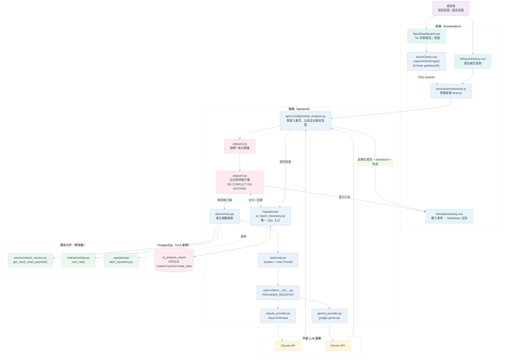
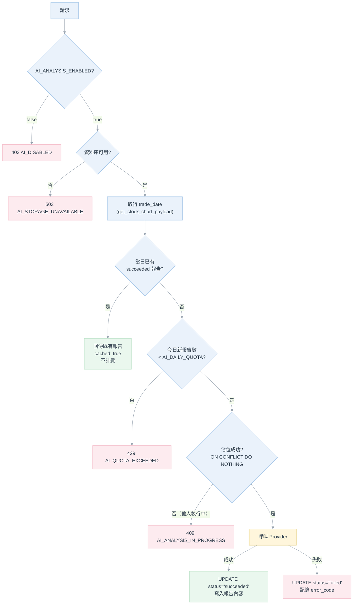
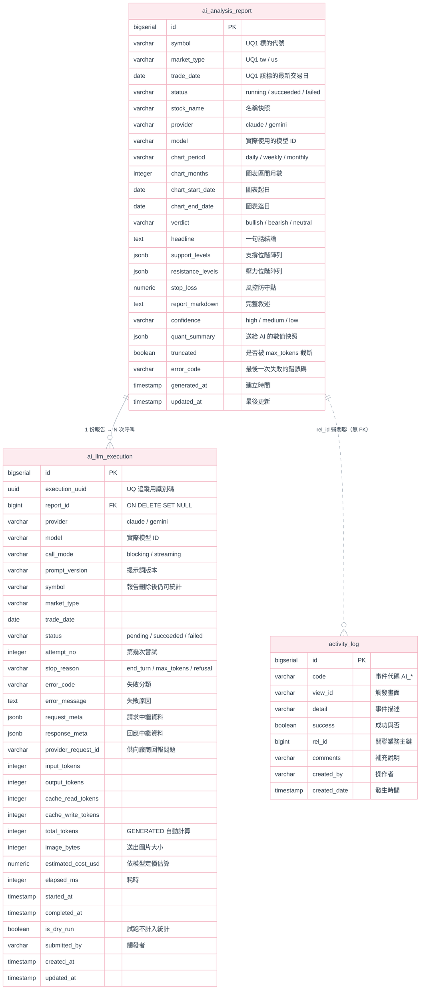
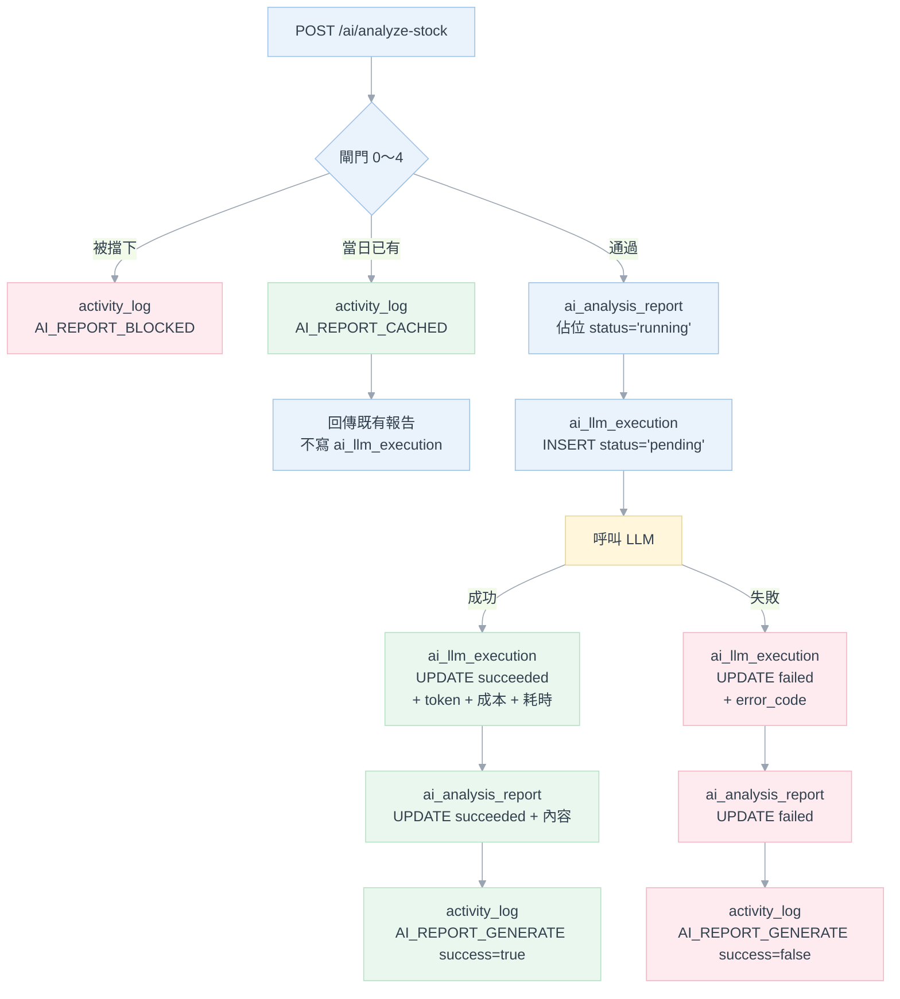
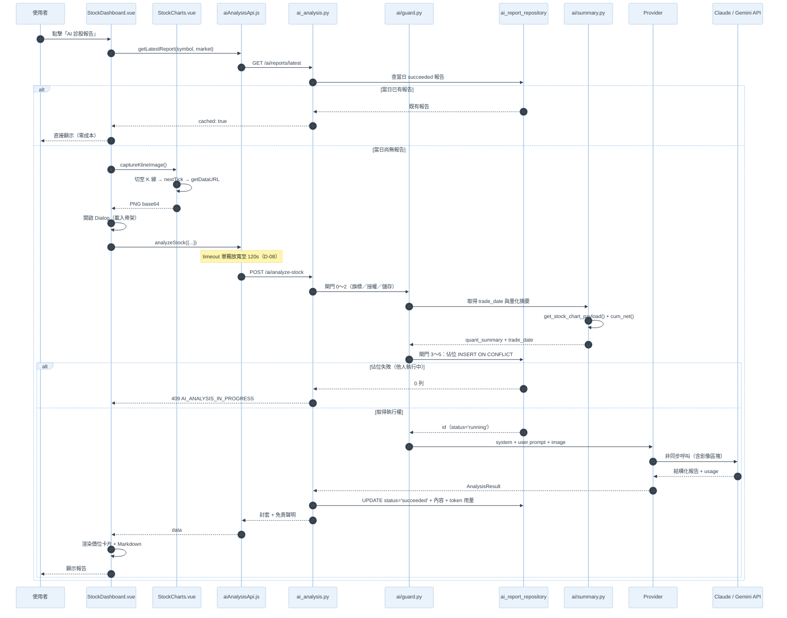

# AI 技術分析報告 系統開發規格書

**模組**：AI 技術分析報告（AI Technical Analysis Report）
**版本**：v3.5
**日期**：2026-08-29
**狀態**：**已完成開發並通過端對端驗證**（後端 P1～P8、前端 P6～P7 皆已實作；Claude 走過完整失敗/重試/落地路徑，Gemini 走過真實成功的完整路徑，見 §11 WBS 與各階段驗證紀錄）
**對應既有模組**：[strategies/](../../backend/strategies/)（策略警示）、[notify/](../../backend/notify/)（通知平台，本文多處沿用其架構慣例）

**版本紀錄**

| 版本 | 日期 | 變更摘要 |
|---|---|---|
| v1.0 | 2026-08-27 | 初版構想：mplfinance 後端繪圖 + Gemini／Claude 二擇一 + Prompt 草稿 |
| v2.0 | 2026-08-27 | 改寫為開發規格書：修正 9 項會導致實作失敗的落差（見 §0.1）、確立雙 Provider 註冊表、改為前端擷取既有 ECharts 圖表、加入結構化輸出、成本閘門、逾時設計、驗收條件 |
| v3.0 | 2026-08-27 | **推翻 ADR-AI-03「不落地」**：報告改存 PostgreSQL；確立「**同一標的同一交易日只呼叫 LLM 一次**」為資料庫層強制約束；新增 §5 資料庫設計、歷史報告查詢 API 與前端頁面（見 §0.2） |
| v3.1 | 2026-08-27 | 新增兩張紀錄表：**`ai_llm_execution`**（每次 LLM 呼叫的交易紀錄與 token 用量，含失敗）與 **`activity_log`**（主要功能的事件紀錄）；成本統計改以執行紀錄表為唯一事實來源（ADR-AI-17）；補上參考 MySQL DDL → PostgreSQL 的轉換對照（§5.9） |
| v3.2 | 2026-08-28 | 完成開發與端對端驗證（含真實 Claude／Gemini 呼叫）；過程中修正 3 個實作 bug（DATE 參數型別、`INTERVAL` 串接、`force` 旗標邏輯）與 1 個 Gemini `finish_reason` enum 解析 bug；**推翻 ADR-AI-07：移除所有 AI 端點的 `require_owner` 授權**（前端無登入入口，見 §0.3）；補上 Gemini 2.5 Flash／Flash-Lite 官方定價 |
| v3.3 | 2026-08-28 | **D-10／§4.5 修訂**：`report_markdown` 不再要求 LLM 直接產生自由文字（實測 Claude／Gemini 皆會不穩定地把「### 標題」黏在前一句話尾端，即使 Prompt 三令五申仍會失效）；改為 LLM 只填結構化的 `sections: [{title, body}]`，Markdown 標題與換行改由後端 `sections_to_markdown()` 自行組裝，100% 保證正確斷行；同時完成前端 `AiAnalysisDialog.vue` 的 UI/UX 重新設計（單一捲動區、標題左側色條、結論改為色塊摘要卡、支撐/壓力/停損卡片加圖示） |
| v3.4 | 2026-08-28 | **ADR-AI-21：唯一鍵擴充為 `(market_type, symbol, trade_date, provider, model)`**（V15 遷移）——換模型視為另一份獨立報告，可再產生一次；新增 `GET /api/v1/ai/models`（**ADR-AI-22** 程式碼白名單）與 `POST /analyze-stock` 的 `model` 欄位；前端 `AiAnalysisDialog.vue` 新增「選擇模型」步驟（見 §0.4）。過程中實測發現 `gemini-2.5-flash-lite` 已對新用戶下架（官方指定改用 `gemini-3.5-flash-lite`），移出白名單並補上正確機型 |
| v3.5 | 2026-08-29 | 依 [Phase1-基礎量化與技術面](Phase1-基礎量化與技術面.md) FR-P1-7～9 落地：`get_stock_chart_payload()`／`quant_summary`／System Prompt 新增 `macd`／`rsi`／`bollinger`／`atr` 與固定 20/60 日 `resistance`／`support`（§4.2 表格同步更新）；`AI_PROMPT_VERSION` 由 `v3` 遞增為 `v4`；對外七個結構化輸出欄位與既有 `ma`／`kd`／`chips`／`margin` 區塊不受影響（該文件 AC-P1-8） |

> **文件性質說明**
> v1.0 是「可行性構想」，回答「做不做得到」；本版是**開發規格書**，回答「怎麼做才不會踩雷」。
> 凡本文件與 v1.0／v2.0 構想衝突之處，**一律以本文件為準**，落差原因逐條記於 §0。
> 本文件所有 Mermaid 圖沿用專案統一淡彩色系（比照[整合訊息通知平台_系統開發規格書](../9.整合訊息系統_Telegram/整合訊息通知平台_系統開發規格書.md) §3.0）。
> **本模組產出之內容為 AI 生成的技術面觀察，不構成投資建議**（強制落實見 §8.3）。

---

## 目錄

| 章節 | 內容 |
|---|---|
| 0 | 改版重點（v1.0／v2.0 落差修正） |
| 1 | 範圍與設計前提 |
| 2 | 技術選型與決策紀錄（ADR） |
| 3 | 系統架構 |
| 4 | 核心機制設計 |
| 5 | **資料庫設計（v3.0 新增）** |
| 6 | API 設計 |
| 7 | 前端設計 |
| 8 | 安全與合規設計 |
| 9 | 設定項目 |
| 10 | 成本估算與控管 |
| 11 | 開發階段與工作分解 |
| 12 | 驗收條件 |
| 13 | 風險與延後項目 |
| 14 | 附錄 A：報告輸出範例 |

---

## 0. 改版重點

### 0.1 v1.0 落差修正

v1.0 的架構方向正確，但若照字面實作會有 9 處直接失敗或造成長期維護債。逐條列出，避免日後有人回頭複製 v1.0 的程式碼片段。

| # | v1.0 的寫法 | 問題 | 現行作法 |
|---|---|---|---|
| **D-01** | `model="claude-3-5-sonnet-20241022"`、`gemini-1.5-flash` | **模型 ID 已過期**。現行為 Claude 5 系列（`claude-opus-5`／`claude-sonnet-5`），Gemini 為 2.5 系列 | 模型 ID 集中於 `.env`（§9），預設 `claude-sonnet-5`；不得散落在程式碼字面值（ADR-AI-12） |
| **D-02** | `import google.generativeai as genai` | **SDK 已被取代**。Google 現行統一 SDK 為 `google-genai`（`from google import genai`），舊套件不再是建議路徑 | 採 `google-genai`，並於實作時以官方文件複核（§2 註） |
| **D-03** | `genai.configure(api_key="YOUR_KEY")` 寫在**模組頂層** | 模組被 import 的當下就要有金鑰。只要沒設定 key，`main.py` 匯入路由就整個炸掉，**連不用 AI 的人也開不了服務** | Client **延遲建立**（lazy），金鑰於呼叫當下才讀取（ADR-AI-05） |
| **D-04** | `client.messages.create(...)`（同步） | 本專案 API 端點是 `async def`，同步 HTTP 呼叫會**卡住整個 FastAPI event loop**，AI 跑 20 秒＝全站卡 20 秒 | 一律用非同步客戶端（`AsyncAnthropic`／`genai` 的 `aio`），理由同 notify 平台 ADR-05 捨 `smtplib` 改 `aiosmtplib`（ADR-AI-04） |
| **D-05** | `max_tokens=1500` | 附圖那種完整報告（趨勢＋均線＋支撐壓力＋雙策略＋風控）會**被截斷在句子中間** | `max_tokens` 提高到 8000，並強制檢查 `stop_reason == "max_tokens"`（§4.7） |
| **D-06** | 後端用 `mplfinance` 另外畫一張 K 線圖 | **AI 看到的圖 ≠ 使用者看到的圖**。等於維護第二套繪圖管線，均線根數、顏色慣例、KD 副圖、警示標記全都要再對一次。本專案已有明確前例：`indicators/moving_average.py` 的 `sma()` 是刻意寫成與前端 `movingAverage.js` 數值一致的 | 改由**前端擷取畫面上那張 ECharts 圖**（`getDataURL`），不新增任何 Python 繪圖相依（ADR-AI-02） |
| **D-07** | 未提成本控管 | 每次點擊都是真實計費。單人自用系統若誤按或前端重試，帳單無上限 | 功能旗標預設關閉 ＋ 擁有者授權 ＋ **每檔每日僅一次（資料庫強制）** ＋ 全站每日總量上限（§4.6、§10） |
| **D-08** | 「約 2～4 秒」 | **低估**。帶 thinking 的模型加上視覺輸入，實測區間常在 10～40 秒。而前端 `apiClient` 的 timeout 是 **15000ms**（[stockApi.js:10](../../frontend/src/service/stockApi.js#L10)）——照 v1.0 實作，**前端會先超時，使用者永遠看不到報告** | 前端該次請求單獨放寬逾時，後端亦設上限（§7.2，此為本模組最容易踩的整合陷阱） |
| **D-09** | 只回一段 Markdown | 支撐／壓力／停損價位只能用正規表示式從 Markdown 裡挖，前端無法可靠渲染成欄位 | 採**結構化輸出＋敘述並存**：關鍵價位是型別化欄位，敘述仍是 Markdown（ADR-AI-06、§4.5） |

### 0.2 v3.0 架構變更（推翻 v2.0 的「不落地」決策）

v2.0 為求首版精簡，決定「報告產生即用、不儲存」（原 ADR-AI-03），並以行程內記憶體快取避免重複計費。**v3.0 依需求改為資料庫落地**，變更如下：

| # | v2.0 的作法 | 變更原因 | v3.0 的作法 |
|---|---|---|---|
| **C-01** | 報告不儲存 | 需要查詢歷史 AI 分析紀錄 | 落地至 PostgreSQL 資料表 `ai_analysis_report`（§5） |
| **C-02** | 記憶體快取（TTL 60 分鐘），重啟即失效 | 重啟後同一檔會再次計費；且記憶體字典**無法在併發下保證「只呼叫一次」** | 以資料庫 **`UNIQUE (market_type, symbol, trade_date)`** 作為單一事實來源（ADR-AI-16） |
| **C-03** | 快取鍵含 `provider/period/months` | 切換週期或 Provider 就會重新計費，與「一天一次」的需求不符 | 唯一鍵**只含市場＋代號＋交易日**；週期等資訊改為記錄在報告中供顯示（§5.4） |
| **C-04** | 無歷史查詢 | 需求新增 | 新增 `GET /api/v1/ai/reports` 系列端點（§6.2）與歷史頁面（§7.4） |
| **C-05** | 併發未處理 | 使用者連點兩下，兩個請求都會查不到快取而各自呼叫 LLM，**付兩次錢** | 呼叫 LLM **之前**先以 `INSERT … ON CONFLICT DO NOTHING` 佔位取得執行權（§4.6、§5.8） |

**v3.1 追加**

| # | 需求 | 作法 |
|---|---|---|
| **C-06** | 每次執行 AI 都要有交易紀錄，並記錄 token 用量 | 新增 **`ai_llm_execution`** 表：**每一次實際呼叫 LLM 就寫一列**（含失敗、含被接手重試的那次），記錄 provider／model／token 明細／估算成本／耗時／錯誤（§5.5） |
| **C-07** | 執行主要功能時要記錄事件 log | 新增 **`activity_log`** 表（沿用參考 `cm_activity_log` 的欄位語意），記錄產生／回讀／被閘門擋下／查詢／刪除等事件（§5.6） |

> **重要前提變更**：本模組自 v3.0 起**需要 PostgreSQL**。專案預設 `DATA_SOURCE=json`，Postgres 為選用；AI 報告模組**不受 `DATA_SOURCE` 影響、一律使用 Postgres**（ADR-AI-14），但若資料庫不可用，本功能須自我停用並回報明確錯誤，**不得影響任何既有功能**（見 §5.1、AC-AI-15）。

### 0.3 v3.2 架構變更（推翻 ADR-AI-07：移除 `require_owner` 授權）

實作並在瀏覽器實測後發現：ADR-AI-07 原本要求所有 AI 端點掛 `Depends(require_owner)`，但**本專案除了通知平台的獨立管理頁面（`/notify/login`）外，其餘功能（含既有的個股／警示／記帳頁面）一律不要求登入**，前端也從未實作任何取得 owner Cookie／Bearer Token 的入口——UI 上「您好：傑克森」只是 `AppTopbar.vue` 寫死的裝飾文字，不是真的登入狀態。掛上 `require_owner` 的結果不是「多一層防護」，而是一條**沒有入口的死路**：使用者點下按鈕只會收到 401，且前端沒有任何頁面能讓他們解開這個 401。

| # | v3.1 的作法 | 問題 | v3.2 的作法 |
|---|---|---|---|
| **C-08** | 所有 AI 端點掛 `Depends(require_owner)`（ADR-AI-07） | 前端無登入入口，功能完全打不開；為此另建登入流程對單人本機工具而言得不償失 | **移除 `require_owner`**，AI 端點與其餘既有功能一致，皆不要求登入 |

**成本控管改由何處承接**：拿掉 HTTP 層的授權閘門後，「未授權者按下去會產生金錢支出」這件事，改成完全依賴既有的資料庫層防線，兩者本來就已經是主要防線、不是新增的補償措施：

- `AI_DAILY_QUOTA`：全站每日新報告總量上限（§4.6 閘門 3，預設 20）
- `UNIQUE (market_type, symbol, trade_date)`：同一標的同一交易日只呼叫一次 LLM（ADR-AI-16）
- `AI_ANALYSIS_ENABLED=false`：功能總開關，預設關閉

若日後此系統需要對外網路開放（而不僅是本機／區網使用），**必須重新評估是否要接一套全站通用的登入機制**（而不是只給 AI 端點單獨掛一個打不開的鎖），這點列入 §13 風險與延後項目。

### 0.4 v3.4 架構變更（唯一鍵加入 provider／model；產生前先選模型）

使用者需求：Gemini 官方模型清單持續在推出新版本（3.1 Pro／3.5 Flash／3.6 Flash／Flash-Lite
等），應該讓使用者在產生報告**前**先選要用哪個模型，而不是固定用 `.env` 設定的單一預設模型；
且既然模型是使用者當場選的，「同一標的同一天只能呼叫一次」的範圍也應該收斂到**同一個模型**，
換模型應視為另一份獨立報告，可以再產生一次。

| # | v3.3 的作法 | v3.4 的作法 |
|---|---|---|
| **C-09** | 唯一鍵 `(market_type, symbol, trade_date)`，不分 provider／model（ADR-AI-16） | **推翻**：唯一鍵改為 `(market_type, symbol, trade_date, provider, model)`（**ADR-AI-21**，V15 遷移）。`model` 從「事後才知道的中繼資料」變成「事前就決定、參與唯一鍵」的識別欄位，補上 `NOT NULL` |
| **C-10** | `model` 只能來自 `.env`（`CLAUDE_MODEL`／`GEMINI_MODEL`），使用者無從選擇 | 新增 `GET /api/v1/ai/models`（§6.1）回傳可選模型清單（`ai/config.py` 的 `*_SELECTABLE_MODELS` 白名單）；`POST /ai/analyze-stock` 新增可選欄位 `model`，未帶時仍退回 `.env` 預設 |
| **C-11** | 前端點按鈕直接判斷「今日有沒有」就開始擷圖／呼叫 | `AiAnalysisDialog.vue` 新增「選擇模型」為第一步（`stage='select'`），選好後才依「這個 provider+model 組合今天是否已有報告」決定要擷圖產生還是直接讀取（`composables/useAiAnalysis.js`） |

**模型白名單而非任意字串**（ADR-AI-22）：前端不能把使用者輸入的任意字串直接送給 Provider
API——一來打錯字要等一次真實呼叫失敗才知道，二來使用者需求明確要排除圖片生成／即時語音／
翻譯／TTS 等本模組用不到的變體（如 Nano Banana 系列）。`ai/config.py` 維護
`CLAUDE_SELECTABLE_MODELS`／`GEMINI_SELECTABLE_MODELS` 兩份程式碼白名單，`POST
/analyze-stock` 收到 `model` 時以 `ai_config.is_valid_model()` 驗證，不在清單內回 400
`AI_INVALID_REQUEST`。新模型上市時在清單裡加一筆即可，不需要改任何呼叫邏輯。

> **清單來源與實測狀態的誠實揭露**：Gemini 可選清單依使用者提供的官方模型頁截圖
> （`ai.google.dev/gemini-api/docs/models`）與官方定價頁交叉核對，**只有預設的
> `gemini-2.5-flash` 真正用本專案的程式碼實測成功過**；`gemini-2.5-flash-lite` 實測直接
> 回 404「no longer available to new users」，官方訊息指定改用 `gemini-3.5-flash-lite`
> ——因此前者**未列入**白名單、後者列入但未實測。其餘機型（3.1 Pro／3.6 Flash／3.5
> Flash／3-flash-preview／3.1 Flash-Lite／2.5 Pro）僅核對過名稱與定價存在，**未實際打過
> API**，不保證這把金鑰／地區能用；打不通會是 Google 端 404，不是本專案程式問題，見
> `ai/config.py` 該處的程式碼註解。

---

## 1. 範圍與設計前提

### 1.1 交付範圍

1. **產生報告**：使用者在個股頁面點擊「AI 診股報告」後，系統將**畫面上該檔股票的 K 線圖**與**後端推導的量化摘要**一併送交多模態 LLM，於彈窗中呈現結構化的技術分析報告，內容涵蓋：趨勢研判、均線與型態解析、關鍵支撐壓力位階、短線與中長線操作建議、風控防守點。
2. **每檔每日僅一次**：同一市場的同一標的，在同一交易日內**只會實際呼叫一次 LLM**；當日再次點擊一律由資料庫回讀既有報告，不產生任何費用。
3. **歷史查詢**：提供歷史 AI 技術分析報告的列表與詳情查詢，可依市場、代號、日期區間、趨勢研判結果篩選。
4. **交易紀錄與用量統計**：每一次呼叫 LLM（含失敗）都留下獨立紀錄，包含 provider／模型／token 明細／估算成本／耗時／錯誤原因，並提供用量與成本彙總查詢。
5. **事件紀錄**：主要功能操作（產生、回讀、被閘門擋下、查詢、刪除、孤兒回收）皆寫入活動事件紀錄。

### 1.2 既有系統前提（本模組賴以建立的既有事實）

| 既有元件 | 位置 | 與本模組的關係 |
|---|---|---|
| 圖表資料組裝 | [services/stock_service.py](../../backend/services/stock_service.py) `get_stock_chart_payload()` | **量化摘要的唯一來源**。已回傳 `moving_averages`（MA 5/10/20/60/120/240）、`kd`、`latest_summary`（含三大法人與融資券）、`records`。本模組**不新增任何指標計算** |
| 均線計算 | [indicators/moving_average.py](../../backend/indicators/moving_average.py) | `sma()` 刻意與前端 `movingAverage.js` 數值一致——AI 引用的數字因此與圖上的線同源 |
| 籌碼指標 | [indicators/chip.py](../../backend/indicators/chip.py) | `cum_net()` 可直接取近 N 日法人買賣超合計，供摘要使用 |
| 策略警示 | [repositories/alert_repository.py](../../backend/repositories/alert_repository.py) | 可選擇性把該檔近期已觸發的策略訊號一併餵給 AI 當佐證（§4.2 選用欄位） |
| 管道註冊表慣例 | [notify/channels/\_\_init\_\_.py](../../backend/notify/channels/__init__.py) | `@channel` 裝飾器自我註冊。本模組的 Provider 註冊表**完全比照**（ADR-AI-01） |
| ~~擁有者授權~~ | ~~[notify/security.py:127](../../backend/notify/security.py#L127) `require_owner`~~ | **v3.2 移除**：前端無登入入口，掛上去打不開（見 §0.3）。成本控管改依賴 `AI_DAILY_QUOTA` 與唯一鍵去重 |
| SQL 存取慣例 | [repositories/notify_repository.py](../../backend/repositories/notify_repository.py) | `AsyncSession` ＋ `text()` 原生 SQL ＋ `result.mappings()`。**唯一 SQL 入口**的慣例，本模組比照新增 `ai_report_repository.py` |
| 連線管理 | [db/session.py](../../backend/db/session.py) | `create_async_engine` ＋ `dispose_engine()` |
| 資料庫遷移 | [db/migration/](../../backend/db/migration/) | Flyway，目前最新為 `V13`；本模組新增 **`V14`** |
| 孤兒列回收前例 | [main.py](../../backend/main.py) lifespan `reap_orphaned_fetch_jobs()` | 「行程重啟後回收殘留 `running` 紀錄」的既有作法，本模組的卡住報告比照處理（§5.8） |
| 設定讀取慣例 | [config.py](../../backend/config.py)、[notify/config.py](../../backend/notify/config.py) | `load_dotenv(ENV_PATH, override=True)` 每次讀取重載，改 `.env` 免重啟 |
| 前端圖表 | [components/StockCharts.vue](../../frontend/src/components/StockCharts.vue) | `vue-echarts` v8 的 `<v-chart>`。其實例代理了 `getDataURL`，**擷圖不需引入任何新套件** |
| 前端 API 客戶端 | [service/stockApi.js](../../frontend/src/service/stockApi.js) | 共用 `apiClient`，**timeout 15000ms**——見 D-08 |

### 1.3 不在本文件範圍

| 項目 | 原因 |
|---|---|
| 排程自動產生每日 AI 報告 | 會把成本從「使用者按一次」變成「每天 N 檔 × 每日」，風險見 §10 |
| 將 AI 報告推送進通知平台 | 需先解決成本與內容合規；列入 §13 延後項目 |
| AI 產生買賣訊號並寫回 `alerts.json` | 策略引擎是規則式、可回溯的；混入不可重現的 LLM 輸出會污染既有訊號品質 |
| 多輪對話（追問「那如果跌破呢？」） | 首版單輪。多輪需保存對話狀態與完整訊息歷程，超出本次資料模型 |
| AI 報告的準確度回測與評分 | 需要長期累積資料後另案評估；本次已把 `quant_summary` 快照存檔，為日後回測預留基礎 |

---

## 2. 技術選型與決策紀錄（ADR）

| 編號 | 決策 | 理由 | 影響 |
|---|---|---|---|
| **ADR-AI-01** | 雙 Provider（Claude／Gemini）以**註冊表＋裝飾器**自我註冊，經 `AI_DEFAULT_PROVIDER` 切換 | 專案已有 `@condition`（strategies）與 `@channel`（notify）兩個相同慣例。沿用可讓「新增 Provider ＝ 新增一個檔案 ＋ 在 `__init__.py` 加一行 import」 | §3.2、§4.3 |
| **ADR-AI-02** | K 線圖由**前端擷取既有 ECharts 圖表**，後端不繪圖 | 見 D-06。附帶好處：使用者切到週線／6 個月／開 KD 副圖後再按，AI 看到的就是那個視角，語意天然一致 | §4.1 |
| **ADR-AI-03** | ~~報告不落地~~ → **v3.0 修訂：報告落地 PostgreSQL** | 需求要求歷史查詢，且「每日一次」必須跨重啟、跨併發成立——記憶體狀態無法保證（見 C-02） | §5 |
| **ADR-AI-04** | 一律使用**非同步** SDK 客戶端 | 見 D-04。與 notify ADR-05（`aiosmtplib` 而非 `smtplib`）同一條理由 | §4.3 |
| **ADR-AI-05** | Provider client **延遲建立**；模組匯入階段不得要求金鑰存在 | 見 D-03。鐵則：**未啟用 AI 功能的部署，必須能正常啟動且完全不受影響**（比照 notify 鐵則 R7） | §4.3 |
| **ADR-AI-06** | 輸出採**結構化欄位＋Markdown 敘述並存** | 見 D-09。Claude 端用 `output_config.format`（JSON Schema）保證可解析。結構化欄位同時是資料表的欄位來源，讓歷史查詢能依 `verdict` 篩選 | §4.5、§5.4 |
| ~~ADR-AI-07~~ | ~~功能旗標 `AI_ANALYSIS_ENABLED` 預設 **false**；端點掛 `Depends(require_owner)`~~ | **v3.2 推翻**：前端無登入入口可解開 401，見 §0.3。功能旗標仍保留（預設 false），只移除授權那一段 | §0.3、§8.1 |
| **ADR-AI-08** | 成本控管採**兩層**：資料庫層的「每檔每交易日一次」＋ 設定層的「全站每日新報告總量上限」 | 前者防重複、後者防失控（例如一次點開 50 檔）。兩者互補，缺一不可 | §4.6 |
| **ADR-AI-09** | 量化摘要由**後端自 `get_stock_chart_payload()` 重新推導**，前端只送 `symbol/market/period/months` ＋ 圖片 | ① payload 從數十 KB 降到僅圖片；② 不信任前端傳來的數字；③ 符合 CLAUDE.md「資料讀取只在 `stock_service` 分支」的既有約束。因兩端同源同函式，數字仍與畫面一致 | §4.2 |
| **ADR-AI-10** | 免責聲明由**後端強制附加**於回應，不依賴模型自己講 | 模型是否輸出免責文字不可控。合規訊息必須是確定性的 | §8.3 |
| **ADR-AI-11** | 首版**不接排程、不進通知平台** | 見 §1.3 | §13 |
| **ADR-AI-12** | 模型 ID、金鑰、開關一律走 `.env` ＋ `config`，程式碼中不得出現模型字面值 | 見 D-01。模型汰換速度遠快於本專案的部署頻率 | §9 |
| **ADR-AI-13** | 「一天」的界定採**該標的的最新交易日（`trade_date`）**，而非系統日曆日 | 若用日曆日，週六與週日會各自產生一次全新報告，但資料自週五收盤後**完全沒變**——等於白付兩次錢，且兩份報告內容應該相同卻可能不同。改用交易日後，週五盤後～下週一開盤前共用同一份報告，語意與成本都正確 | §4.6、§5.4 |
| **ADR-AI-14** | AI 報告一律存 **PostgreSQL**，**不受 `DATA_SOURCE` 開關影響** | 完全比照通知平台 ADR-01／ADR-02。平面 JSON 無法提供 `UNIQUE` 約束的原子性，而那正是「每日一次」的實作基礎。`DATA_SOURCE` 管的是「行情從哪讀」，與報告儲存無關 | §5.1 |
| **ADR-AI-15** | **不儲存 K 線圖片**，改存 `quant_summary` 快照 ＋ 圖表區間中繼資料 | 單張圖 base64 約 1～2MB，每日數十筆會讓資料庫與備份迅速膨脹，而圖片可由當時的區間參數重新繪製。真正有稽核價值的是「AI 當時看到哪些數字」 | §5.4 |
| **ADR-AI-16** | 「每日一次」以 **`UNIQUE` 索引 ＋ `INSERT … ON CONFLICT DO NOTHING` 先佔位**實作，而非「先查詢再決定要不要呼叫」 | 先查後寫在連點兩下時有 race window：兩個請求都查到「今天還沒有」，然後**都去呼叫 LLM**，唯一索引只會擋下第二次寫入，錢卻已經付了兩次。改為呼叫 LLM 之前先搶佔位列，由資料庫裁決誰有執行權。完全比照 notify ADR-11 | §4.6、§5.8 |
| **ADR-AI-21** | v3.4 修訂：唯一鍵從 `(market_type, symbol, trade_date)` 擴充為 `(market_type, symbol, trade_date, provider, model)` | 使用者要求可在產生報告前選模型，且換模型應視為另一份獨立報告可再產生一次；「每日一次」的範圍因此收斂到「每個 provider+model 組合每日一次」。連帶效應：`model` 從「事後才知道的中繼資料」變成「事前就決定、參與唯一鍵」的欄位，補上 `NOT NULL`（V15 遷移，§5.3） | §0.4、§4.6、§5.3 |
| **ADR-AI-22** | 可選模型採**程式碼白名單**（`ai/config.py` 的 `*_SELECTABLE_MODELS`），不接受前端傳任意字串直接打 Provider API | 打錯字要等一次真實呼叫失敗才知道，且使用者需求明確要排除圖片生成／即時語音／翻譯／TTS 等變體。白名單同時是 `GET /api/v1/ai/models` 選單資料的來源，新模型上市時加一筆即可 | §0.4、§6.1 |
| **ADR-AI-17** | **成本與 token 統計的唯一事實來源是 `ai_llm_execution`**；`ai_analysis_report` **不保留** token／耗時欄位 | 一份報告可能歷經「失敗 → 接手重試 → 成功」多次呼叫，**失敗的那幾次同樣會計費**。若把 token 記在報告列上，只會留下最後一次成功的數字，**系統性低估實際支出**。成本必須以「每一次呼叫」為粒度累計 | §5.3、§5.5、§10 |
| **ADR-AI-18** | 事件紀錄表命名為通用的 **`activity_log`**（不加 `ai_` 前綴），但本次**只接 AI 模組的事件** | 參考 DDL（`cm_activity_log`）本就是系統級的「系統執行記錄」。取通用名可讓日後其他模組（爬蟲、策略掃描、記帳）沿用同一張表與同一套查詢；以 `code` 的模組前綴（`AI_*`）區隔來源即可，不必每個模組各建一張 | §5.6 |
| **ADR-AI-19** | 參考 DDL 為 MySQL，本專案採 PostgreSQL，**做等義轉換而非逐字照搬**；刻意不移植的欄位逐條列出理由 | 直接照搬會帶進本專案不存在的概念（`tc_user` 外鍵、批次派工、非同步重試排程、提示詞管理子系統），徒增無人維護的空欄位。轉換與取捨對照見 §5.9 | §5.9 |

> **Gemini 端註記**：本文件的 Claude 參數（模型 ID、定價、`max_tokens`、影像區塊格式、`output_config`）取自 Anthropic 官方 SDK 文件，可直接採用。**Gemini 的 SDK 呼叫細節、模型 ID 與定價請於實作當下複核 Google 官方文件**，本文件不擔保其時效性。

---

## 3. 系統架構

### 3.0 圖例色票（沿用專案統一色系）

| 語意 | 填色 | 邊框 |
|---|---|---|
| 外部系統／LLM 服務 | `#FFF6DC` | `#E8D48B` |
| 核心處理 | `#EAF2FB` | `#9EC2E6` |
| 既有可複用元件 | `#EAF7EE` | `#B7E0C4` |
| 資料儲存／閘門 | `#FDEBEF` | `#F3B6C4` |
| 介面 | `#E4F5F7` | `#A5D8DF` |
| 使用者 | `#F4EAF8` | `#CDA9DC` |

文字色一律 `#33414F`，連線 `#9AA5B1`。

### 3.1 全景架構圖



### 3.2 新增與異動檔案

**後端新增**

```
backend/ai/
├── __init__.py              # 觸發 provider 自我註冊
├── config.py                # 旗標／金鑰／模型 ID 讀取（比照 notify/config.py）
├── errors.py                # AIProviderError / AIQuotaExceeded / AIDisabled / AIStorageUnavailable
├── guard.py                 # 功能旗標、每日總量、佔位取得執行權
├── summary.py               # QuantSummary 組裝（唯一呼叫 get_stock_chart_payload 之處）
├── prompt.py                # System Prompt + User Prompt 組裝
├── schema.py                # AnalysisReport 結構化輸出定義
└── providers/
    ├── __init__.py          # PROVIDER_REGISTRY + @ai_provider 裝飾器
    ├── base.py              # AIProvider ABC
    ├── claude_provider.py
    └── gemini_provider.py

backend/ai/recorder.py                           # 執行紀錄與事件紀錄的統一門面（§5.7）

backend/repositories/
├── ai_report_repository.py      # 報告表唯一 SQL 入口（比照 notify_repository.py）
├── ai_execution_repository.py   # LLM 執行紀錄與用量統計（§5.5）
└── activity_log_repository.py   # 通用事件紀錄（§5.6，ADR-AI-18）

backend/db/migration/V14__Create_ai_analysis_tables.sql   # 一次建立三張表
backend/api/v1/endpoints/ai_analysis.py          # 產生 + 歷史查詢 + 用量統計端點
```

**後端異動**

| 檔案 | 異動 |
|---|---|
| [main.py](../../backend/main.py) | 加一行 `app.include_router(ai_analysis_router)`；新增 AI 相關全域例外處理器；lifespan 加入**卡住報告回收**（比照既有 `reap_orphaned_fetch_jobs()`，見 §5.8） |
| [requirements.txt](../../backend/requirements.txt) | 新增 `anthropic`、`google-genai`（比照既有的分區註解格式） |
| `.env.example` | 新增 §9 的設定區塊 |

**前端新增／異動**

| 檔案 | 異動 |
|---|---|
| `service/aiAnalysisApi.js` | 新增。薄封裝，**單獨覆寫 timeout** |
| `components/AiAnalysisDialog.vue` | 新增。PrimeVue `Dialog` ＋ 載入骨架 ＋ Markdown 渲染 |
| `views/ai/AiReportHistory.vue` | 新增。歷史報告列表與詳情 |
| [router/index.js](../../frontend/src/router/index.js)、`layout/AppMenu.vue` | 新增 `/ai/reports` 路由與選單項目 |
| [components/StockCharts.vue](../../frontend/src/components/StockCharts.vue) | `<v-chart>` 加 `ref`，`defineExpose({ captureKlineImage })` |
| [views/StockDashboard.vue](../../frontend/src/views/StockDashboard.vue) | 控制列按鈕群（第 60～86 行）加入觸發按鈕 |
| `package.json` | 新增 `markdown-it` |

### 3.3 相依方向約束（匯入方向即設計約束）

```
api/v1/endpoints/ai_analysis.py
        ↓
    ai/guard.py ──→ ai/config.py
        ↓            repositories/ai_report_repository.py ──→ db/session.py（既有）
    ai/summary.py ──→ services/stock_service.py（既有）
        ↓                indicators/chip.py（既有）
    ai/prompt.py
        ↓
    ai/providers/__init__.py ──→ base.py ←── claude_provider.py / gemini_provider.py
```

**禁止的反向相依**：`services/`、`strategies/`、`indicators/` **不得 import `ai/`**。AI 模組是既有系統之上的消費者，既有資料流不得因它產生任何耦合——與 notify 平台的鐵則 R7 同一條原則。

**SQL 邊界**：`ai/` 套件內**不得直接操作 SQLAlchemy session**，所有讀寫一律經 `repositories/ai_report_repository.py`（比照 notify 鐵則 R3）。

---

## 4. 核心機制設計

### 4.1 K 線圖擷取（前端）

`vue-echarts` v8 會把 ECharts 實例方法代理到元件 ref 上（其型別定義的 `METHOD_NAMES` 明列 `getDataURL`），因此不需引入 `html2canvas` 或任何截圖套件。

`StockCharts.vue` 對外 `defineExpose({ captureKlineImage })`，流程：

1. 若目前顯示的不是 K 線圖（`activeId !== 'kline'`），先切過去；
2. `await nextTick()` 等一次渲染完成；
3. `chartRef.value.getDataURL({ type: 'png', pixelRatio: 2, backgroundColor })`；
4. 去掉 `data:image/png;base64,` 前綴後回傳純 base64。

**設計約束**

| 約束 | 說明 |
|---|---|
| 背景色不可透明 | ECharts 預設透明背景轉 PNG 後，深色主題下的白字會落在透明底上，AI 幾乎讀不到。必須依當前主題明確帶入不透明底色 |
| `pixelRatio` 取 2 即可 | 視覺模型會把過大的圖縮到長邊上限（Claude 約 1568px），再高只是浪費頻寬與 token。約 1400×700 的圖已足夠辨識均線與量能 |
| 影像大小須設上限 | 超過上限時降 `pixelRatio` 重試一次，仍超過則回報前端錯誤而非硬送。實際上限以各 Provider 官方文件為準（Claude 單張約 5MB） |
| **當日已有報告時不必擷圖** | 前端應先問 `GET /api/v1/ai/reports/latest`，已有就直接顯示，省下擷圖與上傳（§7.3） |
| 切圖不得重置捲動位置 | 見 §7.5 鐵則 |

### 4.2 量化摘要契約（`ai/summary.py`）

後端依 `symbol/market/period/months` 呼叫既有 `get_stock_chart_payload()`，萃取以下欄位。**本模組不得自行計算任何指標**（沿用 CLAUDE.md 對策略引擎的同一條約束：條件函式只能讀既算好的序列，不得重算）。

| 欄位 | 來源 | 市場 |
|---|---|---|
| `symbol`、`name`、`market`、`period`、`date_range` | `get_stock_chart_payload()` 頂層欄位 | 全部 |
| `latest`：`close`／`open`／`high`／`low`／`volume`／`change_pct` | `latest_summary` | 全部 |
| `ma`：`ma5`／`ma10`／`ma20`／`ma60`／`ma120`／`ma240`（各取最新值） | `moving_averages` | 全部 |
| `bias`：收盤相對各均線乖離率 | 由 `ma` 與 `close` 直接得出 | 全部 |
| `kd`：最新 `K`／`D` | `kd` | 全部 |
| `macd`：最新 `dif`／`signal`／`histogram` | `macd`（[Phase1-基礎量化與技術面](Phase1-基礎量化與技術面.md) FR-P1-8，v3.5 新增） | 全部 |
| `rsi`：最新 `rsi_6`／`rsi_14` | `rsi`（同上） | 全部 |
| `bollinger`：最新 `upper`／`middle`／`lower`／`bandwidth`（`middle` 與 `ma.ma20` 同值，不重算，見該文件 ADR-P1-05） | `bollinger`（同上） | 全部 |
| `atr`：最新 `atr_14` | `atr`（同上） | 全部 |
| `range_high`／`range_low`：區間最高最低與其日期；另含固定 `resistance_20d`／`support_20d`／`resistance_60d`／`support_60d`（同上 FR-P1-6，兩組視窗語意不同、並存不取代，見該文件 §9 Q-5） | `records`／`levels` | 全部 |
| `volume_ma5`、`volume_ratio`（量能比） | `records` | 全部 |
| `chips`：近 5 日外資／投信／自營商買賣超合計 | `indicators/chip.py` `cum_net()` | **僅 TW** |
| `margin`：融資餘額、融券餘額、券資比 | `latest_summary` | **僅 TW** |
| `recent_alerts`（選用）：該檔近 10 日已觸發的策略訊號 | `alert_repository` | 全部 |

**空值處理**：任何為 `None`／`0`（本專案以 `0` 代表缺值，見 `stock_service` 註解）的欄位**一律從摘要中移除，不得送出 `null` 或 `0`**——模型看到 `"ma240": 0` 會當成真實價位並據此推論。美股沒有籌碼欄位屬正常，整段略去即可。

**摘要即快照**：本函式的輸出會原樣存入 `ai_analysis_report.quant_summary`（JSONB），作為「AI 當時看到什麼數字」的稽核依據（ADR-AI-15）。

**交易日的取得**：`get_stock_chart_payload()` 回傳的 `latest_summary.date` 即該標的最新交易日，**這就是 ADR-AI-13 所指的 `trade_date`**，也是唯一鍵的一部分。因此 §4.6 的佔位動作必須在取得此日期之後才能執行。

### 4.3 Provider 抽象層

`ai/providers/base.py`：

```python
class AIProvider(ABC):
    code: str            # "claude" / "gemini"
    display_name: str

    @abstractmethod
    async def analyze(
        self,
        image_base64: str,
        quant_summary: dict,
        system_prompt: str,
        user_prompt: str,
    ) -> AnalysisResult: ...
```

`ai/providers/__init__.py` 比照 [notify/channels/\_\_init\_\_.py](../../backend/notify/channels/__init__.py)：`PROVIDER_REGISTRY` ＋ `@ai_provider(code=..., display_name=...)` 裝飾器 ＋ `get_provider(code)`，檔尾以 import 觸發註冊。

**Claude 端的關鍵實作要點**（皆為 v1.0 未涵蓋或寫錯之處）：

| 要點 | 規格 |
|---|---|
| 客戶端 | `anthropic.AsyncAnthropic()`，**於函式內延遲建立**（ADR-AI-05） |
| 模型 | 讀 `CLAUDE_MODEL`，預設 `claude-sonnet-5`（成本考量；`claude-opus-5` 品質更佳，見 §10 取捨） |
| `max_tokens` | 8000（見 D-05） |
| 影像區塊 | `{"type": "image", "source": {"type": "base64", "media_type": "image/png", "data": ...}}`，**置於文字區塊之前** |
| System Prompt | 走頂層 `system` 參數，不要塞進 user 訊息 |
| 思考模式 | `thinking={"type": "adaptive"}`；**不得傳 `budget_tokens`**（在 Claude 5 系列會回 400） |
| 快取 | System Prompt 為固定前綴，可加 `cache_control`；但需注意最小可快取前綴約 1024 token，未達門檻不會生效。**在「每檔每日一次」的前提下，同一前綴的重複呼叫頻率本來就低，此項列為低優先度最佳化** |
| 用量回報 | 須回傳 `usage` 的 `input_tokens`／`output_tokens`／`cache_read_input_tokens`／`cache_creation_input_tokens`，以及回應的 `_request_id`（Anthropic 的 request id，回報問題時用），全部寫入 `ai_llm_execution`（§5.5） |
| 錯誤處理 | 依 `anthropic` 的型別化例外分類，**由具體到廣泛**：`AuthenticationError` → `RateLimitError` → `APIStatusError` → `APIConnectionError`（§4.7） |
| 逾時 | 以 `client.with_options(timeout=...)` 單次覆寫，不改動全域預設 |

### 4.4 Prompt 設計

**System Prompt**（沿用 v1.0 的研判框架，這部分 v1.0 寫得好，予以保留並補強）：

```text
你是一位任職於頂級對沖基金的資深技術分析師與風控專家。
你將接收一張【個股日 K 線圖（含均線與成交量）】以及【結構化量化數值】。

研判框架：
1. 均線架構：5MA／20MA／60MA 的相對位置、糾結或發散、斜率方向。
2. 型態與 K 線特徵：破線、突破、高檔反轉、島狀反轉、雙底／頸線等關鍵型態。
3. 量價配合：放量跌破、量縮築底、帶量突破；成交量相對 5 日均量的位置。
4. 關鍵位階：明確標示【關鍵支撐（防守／停損點）】與【上方壓力（轉強／目標價）】。
5. 實戰建議：「短線價差操作」與「中長線持股／進場」分別給出具體指引。

輸出規範：
- 所有價位必須是具體數字，不得寫「附近」「左右」而無數值。
- 數值一律以【結構化量化數值】為準；圖片僅用於判讀型態與相對位置。
  兩者衝突時以數值為準，並在敘述中說明圖上觀察到的差異。
- 若某項資料缺席（如美股無籌碼欄位），略過該面向，不得臆測。
- 使用繁體中文。
```

**User Prompt**：`ai/prompt.py` 將 §4.2 的摘要序列化為易讀區塊（非裸 JSON dump——分節標題與單位標註能顯著提升引用準確度），後接該次的分析指示。

**設計原則**：Prompt 中**不得出現任何硬編碼的策略門檻**。門檻屬於 `strategy_config/strategies.yaml` 的管轄範圍（CLAUDE.md：改門檻是 YAML 編輯、免部署）；AI 報告是獨立的觀察視角，不應與規則引擎的參數耦合。

### 4.5 結構化輸出（`ai/schema.py`）

Claude 端以 `output_config.format`（JSON Schema，`additionalProperties: false`）或 `client.messages.parse()` 搭配 Pydantic 保證可解析。**對外契約**（API 回應、`ai_analysis_report` 資料表欄位）：

| 欄位 | 型別 | 說明 |
|---|---|---|
| `verdict` | `"bullish"｜"bearish"｜"neutral"` | 趨勢研判，供前端上色與歷史篩選（**須遵守專案色彩慣例：紅漲綠跌**，見 §7.5） |
| `headline` | `string` | 一句話結論，對應附圖最上方的粗體摘要 |
| `support_levels` | `[{price, label}]` | 關鍵支撐（可多筆） |
| `resistance_levels` | `[{price, label}]` | 上方壓力 |
| `stop_loss` | `number \| null` | 風控防守點 |
| `report_markdown` | `string` | 完整敘述（章節結構見 §14） |
| `confidence` | `"high"｜"medium"｜"low"` | 模型自評；資料越缺越低 |

前端據此把支撐／壓力／停損渲染成獨立的數值卡片，`report_markdown` 才走 Markdown 渲染。這七個欄位**同時是資料表的欄位**（§5.4），因此歷史查詢可直接依 `verdict` 篩選，不需解析 Markdown。

> **v3.3 修訂（D-10）：`report_markdown` 不再要求 LLM 直接產生**。實測發現無論 Claude 或
> Gemini，都會不穩定地把「### 標題」黏在前一句話尾端（例如「...動能延續。### 籌碼面分析
> 三大法人近五日...」），導致標題無法被 CommonMark 解析、直接印出一串 `#` 符號——這是
> 「自由文字裡的排版慣例」，JSON Schema 只能保證欄位互不相混，保證不了一個字串內部的換行
> 規則，光是在 System Prompt 裡三令五申「標題前後要空行」實測仍會不穩定失效。
>
> 改法：LLM 實際要填的是 `ai/schema.py` 的 `LLMAnalysisReport`，把 `report_markdown` 換成
> `sections: [{title, body}]`——標題與內文拆成獨立欄位，模型不需要自己排版。後端
> `sections_to_markdown()` 用 `f"### {title}\n\n{body}"` 逐段組裝，**換行 100% 由我們自己
>的字串組裝保證**，不再賭模型會不會乖乖照做。`from_llm_report()` 轉成對外的 `AnalysisReport`
> （仍是上表這七個欄位），下游（端點、前端、資料表）完全無感、契約不變。
>
> `report_markdown` 仍可能是自由文字的情況只剩一種：模型拒答或解析失敗時的**保底 fallback**
> （直接取 `response.text`），這種殘餘情況才輪到前端 `AiAnalysisDialog.vue` 的
> `normalizeMarkdown()` 防禦性正規化（標題前補空行）派上用場。

Gemini 端若結構化輸出行為不一致，需在 Provider 層做正規化，**對端點以上保持同一份契約**。

### 4.6 成本與併發閘門（`ai/guard.py`）

請求依序通過閘門 0、2～5，任一不過即以明確錯誤碼回絕（不進 LLM）。**編號中刻意留空的「閘門 1
授權」已於 v3.2 移除**（見 §0.3）——本專案除通知平台管理頁外一律不要求登入，掛授權閘門只會是
打不開的死路；保留編號跳號是為了不用去改其餘章節既有的「閘門 3」「閘門 5」等交叉引用：



**閘門說明**

| 閘門 | 判定 | 說明 |
|---|---|---|
| 0 功能旗標 | `AI_ANALYSIS_ENABLED` | 關閉時**完全不碰資料庫、不碰外部 API** |
| ~~1 授權~~ | ~~`require_owner`~~ | **v3.2 移除**，見 §0.3、ADR-AI-07 |
| 2 儲存可用性 | 資料庫連線 | 本模組需要 Postgres（ADR-AI-14）。不可用時明確回報，**不得靜默降級成「不儲存但照樣呼叫 LLM」**——那會讓「每日一次」的保證悄悄失效 |
| 3 **當日既有報告** | `SELECT … WHERE market_type/symbol/trade_date AND status='succeeded'` | **這是「一天一次」的主要出口**，命中即回傳，零成本 |
| 4 每日總量 | `COUNT(*) WHERE generated_at::date = 今日 AND status='succeeded'` | 防止一次點開數十檔造成失控（ADR-AI-08 第二層） |
| 5 **佔位取得執行權** | `INSERT … ON CONFLICT DO NOTHING`（§5.8 完整 SQL） | 由資料庫裁決併發，這是 ADR-AI-16 的核心 |

> **為什麼閘門 3 與閘門 5 都要有？**
> 閘門 3 是**快樂路徑**：當日已完成，直接回讀，不必進入寫入流程。
> 閘門 5 是**競態防線**：兩個請求同時通過閘門 3（都查到「還沒有」）時，只有一個能插入成功。
> 少了閘門 3，每次都要走寫入流程、效率差；少了閘門 5，連點兩下就會**付兩次錢**。

**開發用逃生門**：`AI_ALLOW_FORCE_REGENERATE`（預設 `false`）啟用後，請求可帶 `force: true` 覆寫當日既有報告。**此旗標僅供開發除錯，正式使用一律維持 `false`**，否則「每日一次」的成本保證形同虛設。啟用時應於回應中標記 `forced: true` 並寫入日誌。

### 4.7 失敗分類與錯誤處理

| 情境 | 判定 | HTTP | `error.code` | 前端呈現 |
|---|---|---|---|---|
| 功能未啟用 | 旗標為 false | 403 | `AI_DISABLED` | 提示至設定啟用 |
| 請求參數不合法 | 例如不支援的 `provider` 代碼 | 400 | `AI_INVALID_REQUEST` | 提示參數錯誤 |
| 圖片超過大小上限 | 超過 `AI_MAX_IMAGE_MB` | 400 | `AI_IMAGE_TOO_LARGE` | 提示降低解析度重試（§4.1） |
| 資料庫不可用 | 連線失敗 | 503 | `AI_STORAGE_UNAVAILABLE` | 提示需啟動 PostgreSQL |
| 金鑰未設定／無效 | `AuthenticationError` | 500 | `AI_PROVIDER_MISCONFIGURED` | 提示檢查 `.env`，**不得回傳金鑰片段** |
| Provider 限流 | `RateLimitError` | 429 | `AI_RATE_LIMITED` | 提示稍後再試，附 `retry-after` |
| 逾時 | `APITimeoutError` | 504 | `AI_TIMEOUT` | 提示重試或改用較快模型 |
| 連線失敗 | `APIConnectionError` | 502 | `AI_PROVIDER_UNREACHABLE` | 提示檢查網路 |
| Provider 其他錯誤 | 未歸類的 SDK 例外 | 502 | `AI_PROVIDER_ERROR` | 提示稍後再試 |
| **他人正在產生同一份** | 佔位失敗且既有列為 `running` | 409 | `AI_ANALYSIS_IN_PROGRESS` | 顯示「分析進行中」，前端可輪詢 |
| 每日總量用盡 | 閘門 4 | 429 | `AI_QUOTA_EXCEEDED` | 顯示今日已用量 |
| 回應被截斷 | `stop_reason == "max_tokens"` | 200 | — | **仍回傳並儲存內容**，`truncated=true`，前端顯示截斷提示 |
| 模型拒答 | `stop_reason == "refusal"` | 200 | — | 回傳友善訊息，不當成系統錯誤 |

> v3.2 移除「未授權」情境（`require_owner` 失敗、401 `NOTIFY_UNAUTHORIZED`）：AI 端點已不掛授權（見 §0.3）。

**共同規範**

- Provider 層**不得讓 SDK 原生例外穿透到端點**，一律轉為 `ai/errors.py` 的型別；端點以既有封套 `{"success": false, "error": {"code", "message"}}` 回應，例外處理器註冊於 `main.py`，比照既有 `SymbolNotFoundException` 的作法。
- **任何失敗都必須把佔位列收尾**（更新為 `status='failed'` 並記錄 `error_code`），否則該標的當日會被一列殭屍 `running` 永久卡住。實作上應以 `try/finally` 或等效結構保證此事，並由 §5.8 的回收機制作為第二道保險。
- **每一次呼叫 LLM 都必須留下 `ai_llm_execution` 紀錄——成功與失敗一視同仁**。失敗的呼叫同樣可能已經計費（例如已開始生成才逾時），漏記就等於漏算成本（ADR-AI-17）。
- **每一次主要功能操作都必須寫 `activity_log`**，包含被閘門擋下的請求——「今天為什麼沒產生報告」本身就是要查的事（§5.6）。
- **紀錄失敗不得讓主流程失敗**：寫 log 的例外一律吞掉並記入應用日誌。已經花錢取得的報告，不可以因為寫 log 失敗而回傳錯誤給使用者。

---

## 5. 資料庫設計（v3.0 新增，v3.1 擴充為三張表）

### 5.1 設計前提

| 決策 | 說明 |
|---|---|
| 一律使用 PostgreSQL | ADR-AI-14。**不受 `DATA_SOURCE` 影響**——`DATA_SOURCE` 決定行情從 JSON 或 Postgres 讀，與報告儲存無關。完全比照通知平台 ADR-02 |
| 不採用平面 JSON 檔 | `alert_repository.py` 用 JSON 是因為警示是「一天寫一次的附加紀錄」。本模組需要**併發下的原子去重**與**條件查詢**，平面 JSON 兩者皆無法保證（ADR-AI-16） |
| 不建立 `symbols` 外鍵 | `symbols` 表主要由 `init_symbol_master.py` 以**台股**代碼母體填充；美股標的未必存在。加外鍵會讓美股報告寫入失敗。改以 `symbol VARCHAR(20)` 純值儲存，並額外保存 `stock_name` 快照 |
| 時間欄位用 `TIMESTAMP` | 沿用 `V1`／`V9` 等既有表的慣例。**每日邊界由 `trade_date`（`DATE`）承擔**，不涉及跨時區判斷，因此不需要通知平台 ADR-12 的 `TIMESTAMPTZ` |
| 資料庫不可用時 | 本功能自我停用並回 `503 AI_STORAGE_UNAVAILABLE`；**既有功能完全不受影響**（AC-AI-15） |

**三張表的分工**（v3.1）

| 表 | 粒度 | 回答的問題 | 保留期 |
|---|---|---|---|
| `ai_analysis_report` | **一檔一交易日一列** | 「這檔今天的 AI 報告內容是什麼？」 | 365 天 |
| `ai_llm_execution` | **一次呼叫一列**（含失敗、含重試） | 「總共花了多少 token／多少錢？哪次失敗、為什麼？」 | 730 天 |
| `activity_log` | **一次操作一列** | 「誰在什麼時候做了什麼？成功了嗎？」 | 365 天 |

> 三者是**不同粒度**，不可互相取代：一份報告可能對應 0 次呼叫（回讀快取）、1 次呼叫（正常）、或 N 次呼叫（失敗後接手重試）。這正是 ADR-AI-17 堅持把成本統計放在 `ai_llm_execution` 的原因。

### 5.2 實體關聯圖



**唯一鍵 `UQ1 = (market_type, symbol, trade_date)` 即「每檔每交易日一份報告」的實體落實。**

`ai_llm_execution.report_id` 採 **`ON DELETE SET NULL`** 而非 `CASCADE`：使用者刪掉一份報告時，**那次呼叫花掉的錢仍然存在**，成本紀錄不可隨之消失。這也是 `ai_llm_execution` 自帶 `symbol`／`market_type`／`trade_date` 冗餘欄位的原因——報告被刪後仍可完整統計。

### 5.3 遷移腳本之一：報告表（`V14__Create_ai_analysis_tables.sql`）

> Flyway 慣例：新增遷移即新增檔案，**絕不修改已套用的 `V*` 檔**。目前最新為 `V13`。
> 三張表寫在**同一個 `V14` 檔**內依序建立（`ai_analysis_report` → `ai_llm_execution` → `activity_log`），因為 `ai_llm_execution` 有指向報告表的外鍵，順序不可顛倒。

```sql
-- V14__Create_ai_analysis_tables.sql
-- 依據《AI 技術分析報告 系統開發規格書》(v3.1) §5 建立三張表
-- 唯一鍵 (market_type, symbol, trade_date) 是「同一標的同一交易日只呼叫一次 LLM」的實體保證

CREATE TABLE IF NOT EXISTS ai_analysis_report (
    id                BIGSERIAL PRIMARY KEY,
    -- ── 唯一鍵三欄（ADR-AI-13、ADR-AI-16）──────────────────────
    symbol            VARCHAR(20)  NOT NULL,
    market_type       VARCHAR(10)  NOT NULL,
    trade_date        DATE         NOT NULL,
    -- ── 執行狀態（併發佔位用，§5.8）─────────────────────────────
    status            VARCHAR(10)  NOT NULL DEFAULT 'running',
    -- ── 標的與模型中繼資料 ──────────────────────────────────────
    stock_name        VARCHAR(100),
    provider          VARCHAR(20)  NOT NULL,
    model             VARCHAR(60),
    -- ── 產生報告時的圖表視角（不存圖片本身，ADR-AI-15）──────────
    chart_period      VARCHAR(10),
    chart_months      INTEGER,
    chart_start_date  DATE,
    chart_end_date    DATE,
    -- ── 結構化報告內容（§4.5）───────────────────────────────────
    verdict           VARCHAR(10),
    headline          TEXT,
    support_levels    JSONB,
    resistance_levels JSONB,
    stop_loss         NUMERIC(15, 4),
    report_markdown   TEXT,
    confidence        VARCHAR(10),
    -- ── 稽核 ────────────────────────────────────────────────────
    -- 注意：token 與耗時「不」放這裡，一律記在 ai_llm_execution（ADR-AI-17）
    quant_summary     JSONB,
    truncated         BOOLEAN      NOT NULL DEFAULT FALSE,
    error_code        VARCHAR(40),
    generated_at      TIMESTAMP    NOT NULL DEFAULT CURRENT_TIMESTAMP,
    updated_at        TIMESTAMP    NOT NULL DEFAULT CURRENT_TIMESTAMP
);

-- 每檔每交易日僅一列（ADR-AI-16 的實體保證；ON CONFLICT 依賴此索引）
CREATE UNIQUE INDEX IF NOT EXISTS uq_ai_report_daily
    ON ai_analysis_report (market_type, symbol, trade_date);

-- 歷史列表：預設依產生時間新到舊
CREATE INDEX IF NOT EXISTS idx_ai_report_recent
    ON ai_analysis_report (generated_at DESC);

-- 單一標的的歷史軌跡
CREATE INDEX IF NOT EXISTS idx_ai_report_symbol_date
    ON ai_analysis_report (market_type, symbol, trade_date DESC);

-- 依趨勢研判篩選
CREATE INDEX IF NOT EXISTS idx_ai_report_verdict
    ON ai_analysis_report (trade_date DESC, verdict);

-- 回收卡住的 running 列（§5.8）
CREATE INDEX IF NOT EXISTS idx_ai_report_status
    ON ai_analysis_report (status, updated_at);
```

### 5.4 關鍵欄位說明

| 欄位 | 說明 |
|---|---|
| `trade_date` | **該標的的最新交易日**，取自 `get_stock_chart_payload()` 的 `latest_summary.date`，非系統日曆日（ADR-AI-13）。這是「一天」的唯一定義 |
| `status` | `running`（佔位中，LLM 呼叫進行中）／`succeeded`（完成，可回讀）／`failed`（失敗，可被下次請求接手重試）。**只有 `succeeded` 會被閘門 3 視為「當日已有」** |
| `stock_name` | 名稱快照。因無 `symbols` 外鍵，且個股改名時歷史報告應保留當時名稱 |
| `chart_period` / `chart_months` / `chart_start_date` / `chart_end_date` | 產生報告時使用者所在的圖表視角。**不存圖片本身**（ADR-AI-15），但存足以重繪同一張圖的參數，歷史頁面可據此還原「AI 當時看的是哪段區間」 |
| `quant_summary` | §4.2 摘要的原樣快照（JSONB）。用途：稽核 AI 引用的數字、日後回測評分 |
| `error_code` | 對應 §4.7 的錯誤碼。`status='failed'` 時填入，供歷史頁面顯示失敗原因 |
| ~~`input_tokens` / `output_tokens` / `latency_ms`~~ | **v3.1 移除**。全部改記於 `ai_llm_execution`（ADR-AI-17）。若要在報告列表顯示成本，以 `report_id` 聚合執行紀錄表取得 |

**`verdict` 與色彩**：`bullish` 為紅、`bearish` 為綠——遵守專案「紅漲綠跌」慣例（台股與美股皆同），前端須走既有 [utils/marketColors.js](../../frontend/src/utils/marketColors.js)。

### 5.5 遷移腳本之二：LLM 呼叫執行紀錄（`ai_llm_execution`）

**寫入時機**：每一次**實際送出**給 LLM 的呼叫，在送出前寫入 `status='pending'`，回應（或例外）後更新為 `succeeded`／`failed`。**回讀當日既有報告時不寫這張表**（因為根本沒有呼叫）。

```sql
-- ── 表 2：LLM 呼叫執行紀錄（參考 dify_workflow_execution，轉為 PostgreSQL）──
-- 粒度：一次呼叫一列。成功與失敗一視同仁，失敗同樣可能已計費（ADR-AI-17）
CREATE TABLE IF NOT EXISTS ai_llm_execution (
    id                  BIGSERIAL PRIMARY KEY,
    execution_uuid      UUID         NOT NULL DEFAULT gen_random_uuid(),
    -- 關聯報告；報告被刪除時保留本列（成本紀錄不可消失）
    report_id           BIGINT       REFERENCES ai_analysis_report(id) ON DELETE SET NULL,
    -- ── 呼叫對象 ────────────────────────────────────────────────
    provider            VARCHAR(20)  NOT NULL,              -- claude | gemini
    model               VARCHAR(60)  NOT NULL,              -- 實際使用的模型 ID
    call_mode           VARCHAR(20)  NOT NULL DEFAULT 'blocking',  -- blocking | streaming
    prompt_version      VARCHAR(20),                        -- ai/prompt.py 的常數，改提示詞時手動遞增
    -- ── 標的快照（報告被刪除後仍可統計）────────────────────────
    symbol              VARCHAR(20),
    market_type         VARCHAR(10),
    trade_date          DATE,
    -- ── 執行狀態 ────────────────────────────────────────────────
    status              VARCHAR(20)  NOT NULL DEFAULT 'pending',   -- pending | succeeded | failed
    attempt_no          INTEGER      NOT NULL DEFAULT 1,   -- 該報告的第幾次嘗試
    stop_reason         VARCHAR(30),                        -- end_turn | max_tokens | refusal
    error_code          VARCHAR(40),                        -- 對應 §4.7 的錯誤碼
    error_message       TEXT,
    -- ── 請求／回應中繼資料（不含 prompt 全文與圖片，見 §8.2）──
    request_meta        JSONB,                              -- max_tokens、effort、圖片尺寸等
    response_meta       JSONB,                              -- 回應中繼欄位
    provider_request_id VARCHAR(100),                       -- Anthropic 的 request id，回報問題用
    -- ── 用量與成本（本模組的成本唯一事實來源）──────────────────
    input_tokens        INTEGER,
    output_tokens       INTEGER,
    cache_read_tokens   INTEGER,
    cache_write_tokens  INTEGER,
    total_tokens        INTEGER GENERATED ALWAYS AS
                        (COALESCE(input_tokens, 0) + COALESCE(output_tokens, 0)) STORED,
    image_bytes         INTEGER,                            -- 送出的 K 線圖大小
    estimated_cost_usd  NUMERIC(12, 6),                     -- 依 §10 的模型定價於寫入時計算
    -- ── 時間 ────────────────────────────────────────────────────
    elapsed_ms          INTEGER,
    started_at          TIMESTAMP,
    completed_at        TIMESTAMP,
    -- ── 其他 ────────────────────────────────────────────────────
    is_dry_run          BOOLEAN      NOT NULL DEFAULT FALSE, -- 開發試跑，排除於成本統計之外
    submitted_by        VARCHAR(100) NOT NULL DEFAULT 'owner',
    created_at          TIMESTAMP    NOT NULL DEFAULT CURRENT_TIMESTAMP,
    updated_at          TIMESTAMP    NOT NULL DEFAULT CURRENT_TIMESTAMP
);

CREATE UNIQUE INDEX IF NOT EXISTS uq_ai_exec_uuid
    ON ai_llm_execution (execution_uuid);
CREATE INDEX IF NOT EXISTS idx_ai_exec_report
    ON ai_llm_execution (report_id);
CREATE INDEX IF NOT EXISTS idx_ai_exec_status
    ON ai_llm_execution (status);
CREATE INDEX IF NOT EXISTS idx_ai_exec_created
    ON ai_llm_execution (created_at DESC);
-- 用量統計：依模型分組看花費
CREATE INDEX IF NOT EXISTS idx_ai_exec_provider_model
    ON ai_llm_execution (provider, model, created_at DESC);
-- 單一標的的呼叫軌跡
CREATE INDEX IF NOT EXISTS idx_ai_exec_symbol
    ON ai_llm_execution (market_type, symbol, trade_date DESC);
-- 成本報表：排除試跑後依時間彙總
CREATE INDEX IF NOT EXISTS idx_ai_exec_cost
    ON ai_llm_execution (is_dry_run, created_at DESC);
```

**欄位設計說明**

| 欄位 | 說明 |
|---|---|
| `execution_uuid` | 沿用參考 DDL 的 `execution_uuid`。以 `gen_random_uuid()`（PostgreSQL 13+ 內建）產生，供跨系統追蹤與回報問題時引用 |
| `report_id` | `ON DELETE SET NULL`，理由見 §5.2 |
| `attempt_no` | 取代參考 DDL 的 `retry_count`／`max_retries`／`next_retry_at`——本模組是使用者同步觸發、當場等待，**沒有非同步重試派工的概念**（見 §5.9） |
| `input_tokens` / `output_tokens` | **必須分開記**。Claude 的輸入與輸出單價相差 5 倍（§10），只存 `total_tokens` 無法算出正確成本 |
| `cache_read_tokens` / `cache_write_tokens` | 若日後啟用 prompt caching（§4.3），快取讀取約為原價一成、寫入約 1.25 倍，需分開計價 |
| `total_tokens` | `GENERATED ALWAYS AS ... STORED` 由資料庫自動維護，不會與明細不一致 |
| `estimated_cost_usd` | **寫入當下**依該模型的單價計算並固定。不可事後即時換算——模型定價會調整，歷史成本必須是當時的價格 |
| `is_dry_run` | 沿用參考 DDL 的同名欄位。`AI_ALLOW_FORCE_REGENERATE` 的強制重產應標記為試跑，避免污染成本統計 |
| `request_meta` / `response_meta` | **只存中繼資料，不存 prompt 全文與 base64 圖片**（§8.2）。圖片單張 1～2MB，存進來會讓這張高頻表迅速膨脹 |

### 5.6 遷移腳本之三：活動事件紀錄（`activity_log`）

沿用參考 `cm_activity_log` 的欄位語意，取通用名稱供其他模組日後共用（ADR-AI-18）。

```sql
-- ── 表 3：系統活動事件紀錄（參考 cm_activity_log，轉為 PostgreSQL）──
-- 粒度：一次操作一列。本次只接 AI 模組事件，code 以 AI_ 前綴區隔（ADR-AI-18）
CREATE TABLE IF NOT EXISTS activity_log (
    id           BIGSERIAL PRIMARY KEY,
    code         VARCHAR(30)   NOT NULL,               -- 事件代碼，見下表
    view_id      VARCHAR(60),                          -- 觸發來源畫面
    detail       VARCHAR(1024),                        -- 事件描述
    success      BOOLEAN,                              -- 成功與否
    rel_id       BIGINT,                               -- 關聯業務主鍵（此處為 ai_analysis_report.id）
    comments     VARCHAR(1024),                        -- 補充說明（失敗原因、閘門代碼等）
    created_by   VARCHAR(50)   NOT NULL DEFAULT 'owner',  -- 本系統為單一擁有者，無使用者表
    created_date TIMESTAMP     NOT NULL DEFAULT CURRENT_TIMESTAMP
);

CREATE INDEX IF NOT EXISTS idx_activity_log_code
    ON activity_log (code);
CREATE INDEX IF NOT EXISTS idx_activity_log_created_by
    ON activity_log (created_by);
CREATE INDEX IF NOT EXISTS idx_activity_log_created_date
    ON activity_log (created_date DESC);
-- 查「某份報告發生過哪些事」
CREATE INDEX IF NOT EXISTS idx_activity_log_rel
    ON activity_log (code, rel_id);
```

**AI 模組的事件代碼**

| `code` | 時機 | `rel_id` | `success` | `comments` |
|---|---|---|---|---|
| `AI_REPORT_GENERATE` | 實際呼叫 LLM 產生新報告 | 報告 id | ✓／✗ | 失敗時填錯誤碼 |
| `AI_REPORT_CACHED` | 回讀當日既有報告（未計費） | 報告 id | ✓ | — |
| `AI_REPORT_BLOCKED` | 被閘門擋下（停用／配額／併發／儲存不可用） | — | ✗ | 擋下的閘門與錯誤碼 |
| `AI_REPORT_VIEW` | 開啟歷史報告詳情 | 報告 id | ✓ | — |
| `AI_REPORT_QUERY` | 查詢歷史列表 | — | ✓ | 查詢條件摘要 |
| `AI_REPORT_DELETE` | 刪除報告 | 報告 id | ✓／✗ | — |
| `AI_REPORT_REAP` | 啟動時回收卡住的 `running` 列 | 報告 id | ✓ | 回收筆數 |

> **`created_by` 的偏離說明**：參考 DDL 有 `FOREIGN KEY (created_by) REFERENCES tc_user(id)`。**本專案是單人自用、無使用者表**（v3.2 起 AI 端點已不要求登入，見 §0.3），因此改為 `VARCHAR(50)` 存字串（預設 `'owner'`），不建外鍵。日後若導入多使用者，再以遷移改為外鍵。

### 5.7 三張表的寫入時序



**關鍵約束**

| 約束 | 理由 |
|---|---|
| `ai_llm_execution` 必須在**呼叫之前**先 INSERT（`pending`） | 若等回應才寫，行程在呼叫途中被中止就完全沒有紀錄——**錢花了卻查不到** |
| 回讀快取**不寫** `ai_llm_execution` | 沒有呼叫就沒有交易。混進去會讓「呼叫次數」失真 |
| 被閘門擋下**只寫** `activity_log` | 同上，沒有呼叫 |
| 寫紀錄失敗不得中斷主流程 | 見 §4.7 共同規範最後一條 |
| 紀錄寫入與報告更新應在**同一個交易**內 | 避免報告顯示成功、執行紀錄卻停在 `pending` 的不一致狀態 |

### 5.8 併發與執行權取得（ADR-AI-16 的實作）

呼叫 LLM **之前**必須先取得執行權。分兩步，皆為單一原子 SQL：

```sql
-- 步驟 1：嘗試以新列佔位（正常路徑）
INSERT INTO ai_analysis_report
       (symbol, market_type, trade_date, provider, status, stock_name,
        chart_period, chart_months, chart_start_date, chart_end_date)
VALUES (:symbol, :market, :trade_date, :provider, 'running', :name,
        :period, :months, :start_date, :end_date)
ON CONFLICT (market_type, symbol, trade_date) DO NOTHING
RETURNING id;
```

若上一步回傳 **0 列**，代表該標的當日已有紀錄，再嘗試接手可回收的列：

```sql
-- 步驟 2：接手「失敗過的」或「卡住的孤兒」列
UPDATE ai_analysis_report
   SET status       = 'running',
       provider     = :provider,
       error_code   = NULL,
       updated_at   = CURRENT_TIMESTAMP
 WHERE market_type = :market
   AND symbol      = :symbol
   AND trade_date  = :trade_date
   AND (
         status = 'failed'
         OR (status = 'running'
             AND updated_at < CURRENT_TIMESTAMP - (:stuck_min || ' minutes')::INTERVAL)
       )
RETURNING id;
```

**三種結果的處置**

| 結果 | 意義 | 處置 |
|---|---|---|
| 步驟 1 回傳 id | 取得執行權（首次） | 呼叫 LLM |
| 步驟 2 回傳 id | 接手失敗列或孤兒列 | 呼叫 LLM |
| 兩步皆 0 列 | 已有 `succeeded`（閘門 3 應已攔下）或他人正在執行且未逾時 | 回讀既有列；若為 `running` 則回 `409 AI_ANALYSIS_IN_PROGRESS` |

**孤兒列回收**：行程被強制中止時，`running` 列不會有人收尾。除上述 `stuck_min` 逾時接手外，`main.py` 的 lifespan 應在啟動時把逾時的 `running` 列一次更新為 `failed`——**這與既有的 `reap_orphaned_fetch_jobs()` 是同一種問題、同一種解法**，實作時比照辦理。

### 5.9 參考 DDL（MySQL）→ 本專案（PostgreSQL）轉換對照

需求提供的兩份參考 DDL 來自 MySQL 環境（Dify AI Gateway），本專案為 PostgreSQL 且系統前提不同，因此**做等義轉換而非逐字照搬**（ADR-AI-19）。

**型別與語法轉換**

| 參考 DDL（MySQL） | 本專案（PostgreSQL） | 說明 |
|---|---|---|
| `bigint NOT NULL AUTO_INCREMENT` | `BIGSERIAL` | 沿用 `V1`／`V9` 既有慣例 |
| `json` | `JSONB` | PostgreSQL 的 `JSONB` 可建索引、查詢更快，是本專案既有選擇 |
| `datetime` | `TIMESTAMP` | 沿用既有表慣例（理由見 §5.1） |
| `tinyint(1)` | `BOOLEAN` | |
| `varchar(n) COLLATE utf8mb4_unicode_ci` | `VARCHAR(n)` | PostgreSQL 資料庫層級已是 UTF-8，不需逐欄宣告字元集 |
| `COMMENT '...'`（內嵌欄位） | `--` 行內註解 | 既有遷移檔（`V1`～`V13`）皆採 `--` 註解，沿用以維持一致；不使用 `COMMENT ON COLUMN` |
| `KEY` / `UNIQUE KEY` | `CREATE INDEX` / `CREATE UNIQUE INDEX` | |
| **`ON UPDATE CURRENT_TIMESTAMP`** | **無對應語法** | PostgreSQL 需自建觸發器。**本專案既有表（如 `V9` 的 `daily_market_quote`）皆由應用層更新 `updated_at`**，沿用此慣例，**不新增觸發器**——這是實作時最容易漏掉的一點 |
| `ENGINE=InnoDB DEFAULT CHARSET=...` | 不適用 | |
| `FOREIGN KEY … REFERENCES tc_user(id)` | 無外鍵，改存 `VARCHAR` | 本專案無使用者表（單一擁有者，且 v3.2 起 AI 端點不掛登入要求，見 §0.3），見 §5.6 說明 |

**刻意不移植的欄位**

| 參考欄位 | 不移植的理由 | 替代作法 |
|---|---|---|
| `batch_id`／`seq_no`／FK `dify_workflow_batch` | 本模組**無批次模式**（排程與批次不在範圍，§1.3） | 日後接排程時再以新遷移擴充 |
| `retry_count`／`max_retries`／`next_retry_at`／`retry_error_log` | 參考系統有**非同步重試派工器**；本模組是使用者同步觸發、當場等待，且 Anthropic SDK 已內建 429／5xx 自動重試（預設 2 次） | 改以 `attempt_no` 記錄「這是該報告的第幾次嘗試」，每次嘗試各自一列，失敗原因記在該列的 `error_message` |
| `paused_at`／`paused_by` | 無暫停功能 | — |
| `prompt_id`／`prompt_version_id`／`prompt_version_no` | 本專案**無提示詞管理子系統**，提示詞在 `ai/prompt.py` 程式碼內 | 改以 `prompt_version VARCHAR(20)` 存一個手動遞增的常數，即可回答「這份報告是用哪版提示詞產生的」 |
| `workflow_name`／`workflow_run_id` | Dify 專有概念 | 對應為 `model`（做什麼）與 `provider_request_id`（廠商端追蹤碼） |
| `total_steps` | 單次呼叫無多步驟 | — |
| `execution_mode` 的 `BATCH` 值 | 同上無批次 | `call_mode` 僅保留 `blocking`／`streaming` |

**刻意新增的欄位**（參考 DDL 沒有，但本模組需要）

| 欄位 | 理由 |
|---|---|
| `input_tokens`／`output_tokens` 分列 | 參考 DDL 只有 `total_tokens`。Claude 輸入與輸出單價相差 5 倍，只有總數**算不出成本** |
| `cache_read_tokens`／`cache_write_tokens` | prompt caching 的計價倍率不同（約 0.1× 與 1.25×） |
| `estimated_cost_usd` | 直接把成本固定在寫入當下，避免日後定價調整導致歷史成本失真 |
| `symbol`／`market_type`／`trade_date` | 報告被刪除後（`ON DELETE SET NULL`）仍能完整統計成本 |
| `image_bytes` | 診斷「圖太大導致失敗」用（§4.1 的影像上限約束） |

### 5.10 資料保留

| 表 | 保留期 | 說明 |
|---|---|---|
| `ai_analysis_report` | `AI_REPORT_RETENTION_DAYS`（預設 365 天） | 低頻高價值，一年僅數百筆，無壓縮必要 |
| `ai_llm_execution` | `AI_EXECUTION_RETENTION_DAYS`（預設 **730 天**） | **刻意比報告長**：成本與用量紀錄是財務性質資料，且體積小（無全文、無圖片），值得多留 |
| `activity_log` | `AI_ACTIVITY_LOG_RETENTION_DAYS`（預設 365 天） | 比照通知平台的 `NOTIFY_LOG_RETENTION_DAYS` 慣例 |

| 項目 | 規格 |
|---|---|
| 清理時機 | 隨啟動時的孤兒回收一併執行即可，不需另設排程 |
| `failed` 報告列 | 保留供診斷，但可用較短的保留期（如 30 天）另行清理；**對應的 `ai_llm_execution` 不隨之刪除** |
| 備份 | 三張表皆落在既有的 `backend/docker-compose.yml` 每夜 pg 備份範圍內，不需額外設定 |

---

## 6. API 設計

### 6.1 產生報告

| 方法 | 路徑 | 用途 | 授權 |
|---|---|---|---|
| POST | `/api/v1/ai/analyze-stock` | 產生（或回讀當日既有）AI 技術分析報告 | 無（v3.2 起，見 §0.3） |
| GET | `/api/v1/ai/models` | 可選模型清單（供產生前的選單，v3.4，ADR-AI-22） | 無（v3.2 起，見 §0.3） |
| GET | `/api/v1/ai/status` | 功能是否啟用、可用 Provider、今日已產生數／上限、累計 token 用量 | 無（v3.2 起，見 §0.3） |

**`GET /api/v1/ai/models` 回應**（v3.4，前端據此渲染 §7.1 的選模型步驟）：

```jsonc
{
  "success": true,
  "data": {
    "default_provider": "gemini",
    "providers": {
      "claude": {
        "display_name": "Claude (Anthropic)",
        "default_model": "claude-sonnet-5",
        "models": [{ "id": "claude-opus-5", "label": "Claude Opus 5", "tier": "旗艦" }, "..."]
      },
      "gemini": {
        "display_name": "Gemini (Google)",
        "default_model": "gemini-2.5-flash",
        "models": [{ "id": "gemini-3.1-pro-preview", "label": "Gemini 3.1 Pro", "tier": "旗艦（進階推論）" }, "..."]
      }
    }
  }
}
```

**`POST /analyze-stock` 請求**

```jsonc
{
  "symbol": "2330",
  "market": "tw",
  "period": "daily",      // 對應使用者當下的週期選擇
  "months": 3,            // 對應使用者當下的區間選擇
  "provider": "claude",   // 選用，未帶則用 AI_DEFAULT_PROVIDER
  "model": "claude-opus-5",  // 選用（v3.4）；未帶則用該 provider 的 .env 預設；
                             // 有帶必須在 GET /ai/models 的白名單內，否則 400 AI_INVALID_REQUEST
  "image_base64": "iVBORw0KGgo...",  // 純 base64，不含 data: 前綴
  "force": false          // 選用，僅在 AI_ALLOW_FORCE_REGENERATE=true 時有效
}
```

**回應**

```jsonc
{
  "success": true,
  "data": {
    "id": 128,
    "symbol": "2330",
    "stock_name": "台積電",
    "market": "tw",
    "trade_date": "2026-08-27",
    "verdict": "neutral",
    "headline": "...",
    "support_levels": [{ "price": 330, "label": "20MA 月線支撐" }],
    "resistance_levels": [{ "price": 370.92, "label": "60MA 季線壓力" }],
    "stop_loss": 320,
    "report_markdown": "### 技術型態與均線架構分析\n...",
    "confidence": "medium",
    "truncated": false,
    "provider": "claude",
    "model": "claude-sonnet-5",
    "chart": { "period": "daily", "months": 3,
               "start_date": "2026-05-27", "end_date": "2026-08-27" },
    "cached": true,             // true = 由資料庫回讀，未呼叫 LLM、未計費
    "generated_at": "2026-08-27T21:30:00+08:00",
    "disclaimer": "本報告由 AI 依技術面資料生成，僅供參考，不構成投資建議。"
  }
}
```

`cached: true` 是使用者確認「這次沒有花錢」的依據，前端應明確顯示（例如標示「今日已產生，讀取自紀錄」）。

`period`／`months` 必須隨請求送出，否則後端推導的摘要會與使用者眼前的圖表區間不一致——這是本模組最容易產生「AI 講的數字跟我看到的圖對不起來」的來源。

> **注意**：因唯一鍵**不含** `period`／`months`（C-03），當日第一次產生報告時用的是哪個視角，該日整天就沿用那份報告。前端須顯示 `chart` 欄位讓使用者知道報告的觀察區間。

### 6.2 歷史報告查詢

| 方法 | 路徑 | 用途 | 授權 |
|---|---|---|---|
| GET | `/api/v1/ai/reports` | 歷史報告列表（分頁） | 無（v3.2 起，見 §0.3） |
| GET | `/api/v1/ai/reports/{id}` | 單筆報告完整內容 | 無（v3.2 起，見 §0.3） |
| GET | `/api/v1/ai/reports/latest` | 查詢某標的當日是否已有報告 | 無（v3.2 起，見 §0.3） |
| DELETE | `/api/v1/ai/reports/{id}` | 刪除單筆（誤產生時清除） | 無（v3.2 起，見 §0.3） |

**`GET /api/v1/ai/reports` 查詢參數**

| 參數 | 說明 |
|---|---|
| `market` | `tw`／`us`，選用 |
| `symbol` | 標的代號，選用 |
| `date_from`／`date_to` | 依 `trade_date` 篩選，選用 |
| `verdict` | `bullish`／`bearish`／`neutral`，選用 |
| `status` | 預設只回 `succeeded`；帶 `all` 才含失敗紀錄 |
| `limit`／`offset` | 分頁，`limit` 預設 20、上限 100 |

列表回應**不含** `report_markdown` 與 `quant_summary`（兩者體積大），只回摘要欄位；完整內容由 `/{id}` 取得。

**`GET /api/v1/ai/reports/latest?market=tw&symbol=2330`**：供前端在個股頁面載入時預先判斷，決定按鈕文案是「產生 AI 診股報告」還是「檢視今日 AI 報告」（§7.3）。查無資料回 `data: null`，**不視為錯誤**。

### 6.3 執行紀錄與用量查詢（v3.1 新增）

| 方法 | 路徑 | 用途 | 授權 |
|---|---|---|---|
| GET | `/api/v1/ai/executions` | LLM 呼叫紀錄列表（含失敗） | 無（v3.2 起，見 §0.3） |
| GET | `/api/v1/ai/usage` | 用量與成本彙總 | 無（v3.2 起，見 §0.3） |
| GET | `/api/v1/ai/activity` | 活動事件紀錄查詢 | 無（v3.2 起，見 §0.3） |

**`GET /api/v1/ai/executions` 查詢參數**：`provider`、`model`、`status`、`symbol`、`market`、`date_from`／`date_to`（依 `created_at`）、`include_dry_run`（預設 `false`）、`limit`／`offset`。

**`GET /api/v1/ai/usage?group_by=day|model|symbol&date_from=&date_to=`** 回應：

```jsonc
{
  "success": true,
  "data": {
    "range": { "from": "2026-08-01", "to": "2026-08-27" },
    "totals": {
      "call_count": 34,          // 實際呼叫次數（含失敗）
      "success_count": 32,
      "failed_count": 2,
      "cached_hit_count": 78,    // 來自 activity_log 的 AI_REPORT_CACHED，代表省下的呼叫
      "input_tokens": 78200,
      "output_tokens": 51300,
      "total_tokens": 129500,
      "estimated_cost_usd": 0.6696
    },
    "groups": [
      { "key": "claude-sonnet-5", "call_count": 30, "total_tokens": 114000,
        "estimated_cost_usd": 0.5820 }
    ]
  }
}
```

`cached_hit_count` 是刻意放進來的：它代表「因為每日一次的規則而**沒有**發生的呼叫」，是本模組成本設計是否奏效的直接證據。

**統計一律排除 `is_dry_run = true` 的列**，除非明確帶 `include_dry_run=true`。

### 6.4 端到端序列圖



---

## 7. 前端設計

### 7.1 進入點與元件

- **觸發按鈕**置於 [StockDashboard.vue](../../frontend/src/views/StockDashboard.vue) 既有控制列的按鈕群（第 60～86 行，與重新抓取／設定／收藏同一區塊），沿用該區塊的樣式慣例。
- **`AiAnalysisDialog.vue`** 使用 PrimeVue `Dialog`（`modal`，寬版），與專案既有 Dialog 用法一致。四種狀態：載入骨架 → 報告 → 「分析進行中」→ 錯誤。
- **Markdown 渲染**採 `markdown-it`，並**維持其預設 `html: false`**——輸出來自 LLM，禁止原始 HTML 進入 `v-html` 即不需再外掛消毒套件。

### 7.2 逾時設定（本模組最關鍵的整合細節）

共用的 `apiClient` timeout 為 **15000ms**（[stockApi.js:10](../../frontend/src/service/stockApi.js#L10)）。AI 呼叫的實際耗時遠超此值，若沿用預設，**使用者將永遠只看到逾時錯誤**。

| 層 | 設定 |
|---|---|
| 前端 | **僅 `POST /ai/analyze-stock` 該次請求**單獨覆寫 `timeout`（建議 120000ms），**不得調高全域 `apiClient` 預設值**——否則所有行情請求的失敗回饋都會跟著變慢。歷史查詢端點維持預設逾時即可 |
| 後端 | Provider 呼叫以 `with_options(timeout=...)` 設上限（`AI_REQUEST_TIMEOUT_SEC`，預設 90） |
| UI | 載入超過 10 秒顯示「AI 正在分析，通常需要 10～40 秒」的提示 |
| 防連點 | 請求進行中按鈕須 disabled（另有後端 409 作為第二道防線） |

### 7.3 「今日已產生」的呈現

因每檔每日僅一次，UI 必須讓使用者**在按下去之前**就知道會不會計費：

| 狀態 | 按鈕文案 | 行為 |
|---|---|---|
| 當日尚無報告 | `🤖 產生 AI 診股報告` | 擷圖 → 呼叫 LLM（會計費） |
| 當日已有報告 | `📄 檢視今日 AI 報告` | 直接開 Dialog 顯示既有內容，**不擷圖、不呼叫** |
| 產生中（他人／他頁） | `⏳ 分析進行中` | disabled，可輪詢 |

Dialog 內須顯示 `trade_date`、`chart`（觀察區間）與 `cached` 狀態，避免使用者困惑於「我切到週線了為什麼報告還是講日線」（C-03 的必然結果）。

### 7.4 歷史報告頁面（`views/ai/AiReportHistory.vue`）

- 路由 `/ai/reports`，掛在既有 `AppLayout` 殼層下，並於 `AppMenu.vue` 新增選單項目。
- **列表**：日期（`trade_date`）、市場、代號、名稱、`verdict` 標籤（紅漲綠跌）、`headline` 摘要、`provider`／`model`、`confidence`。
- **篩選**：市場、代號（可用既有的代號自動完成 `suggestSymbols`）、日期區間、`verdict`。
- **詳情**：點列開啟與 `AiAnalysisDialog.vue` **同一個報告呈現元件**（避免兩處各寫一份渲染邏輯），差別僅在資料來源是 `/reports/{id}` 而非即時產生。
- **同標的軌跡**：詳情頁提供「查看此標的歷史報告」連結，帶入 `symbol` 篩選，便於觀察 AI 判斷隨時間的變化。

### 7.5 必須遵守的既有鐵則

以下兩點是 CLAUDE.md 明列的使用者強制要求，本模組任何改動都不得違反：

1. **切換圖表按鈕不得整頁 refresh 後跳回最上方**。`captureKlineImage()` 會在必要時切換 `activeId` 至 K 線圖——此切換必須沿用既有的圖表切換路徑（既有實作已保證不重置捲動），**不得為了擷圖而卸載內容區塊或引入新的 loading 全屏狀態**。
2. **KPI／指標卡片大小一致**。若在 Dialog 或歷史頁面以格線呈現支撐／壓力／停損卡片，必須加上 `!m-0` 以中和 `assets/layout/_utils.scss` 的 `.card { margin-bottom: 2rem; &:last-child { margin-bottom: 0 } }` 遺留規則，否則最後一張卡會比同列其他卡矮。

另需遵守：**漲跌色彩一律紅漲綠跌**（台股與美股皆同），`verdict` 上色須走既有的 [utils/marketColors.js](../../frontend/src/utils/marketColors.js)，不得自行定義色碼。

---

## 8. 安全與合規設計

### 8.1 授權與存取控制（v3.2 修訂）

- **AI 端點不掛登入要求**，與全站其餘既有功能（個股／警示／記帳）一致——原 ADR-AI-07 要求比照通知平台管理端掛 `Depends(require_owner)`，但前端完全沒有能取得 owner Cookie／Token 的入口，掛上去只會是打不開的死路（實測直接證實：AC-AI-01 通過但整支功能對使用者關閉，見 §0.3）。
- `CORS_ORIGINS` 目前含 `*`，AI 端點仍是全專案唯一一個「呼叫會產生金錢支出」的端點，這個風險**不靠 HTTP 層授權**，改由既有的資料庫層防線把關：`AI_ANALYSIS_ENABLED` 總開關（預設 false）、`AI_DAILY_QUOTA` 每日新報告總量上限、`(market_type, symbol, trade_date)` 唯一鍵確保同一標的同一交易日只呼叫一次 LLM（ADR-AI-16）。
- 若日後此系統要對外網路開放而非僅本機／區網使用，須重新評估是否要接一套**全站通用**的登入機制，而非只給單一模組補一個沒有入口的鎖（列入 §13）。

### 8.2 機敏資訊

| 項目 | 規範 |
|---|---|
| API 金鑰 | 只存 `.env`，**不得寫入回應、日誌、資料庫或錯誤訊息**。金鑰錯誤時只回 `AI_PROVIDER_MISCONFIGURED`，不附任何片段 |
| `.env.example` | 金鑰欄位一律留空，只放註解說明取得方式 |
| 日誌 | 可記錄 symbol、provider、耗時、token 用量；**不得記錄完整 prompt 或 base64 影像** |
| 資料庫內容 | `quant_summary` 為行情數值、`report_markdown` 為分析文字，**均不含金鑰或個資**；仍屬個人投資資料，備份需比照既有 pg 備份的保護層級 |
| 資料外送告知 | 使用者需知悉「按下按鈕＝將該檔行情資料與圖表送往第三方 LLM 服務」。首次使用時於 Dialog 內明示 |

### 8.3 合規（免責聲明）

`disclaimer` 欄位由**後端無條件附加**（ADR-AI-10），前端**必須渲染且不得由使用者關閉**，在**即時報告與歷史報告兩處皆然**。內容至少涵蓋：AI 生成、僅供參考、不構成投資建議、投資決策風險自負。

---

## 9. 設定項目（`backend/.env`）

沿用專案慣例：`load_dotenv(ENV_PATH, override=True)` 於每次讀取時重載，改 `.env` 免重啟。

### 9.1 機敏資訊管理（重要）

**API 金鑰必須只存於本機，不得上傳 Git**。遵循以下規則：

| 檔案 | 內容 | Git 狀態 |
|---|---|---|
| `backend/.env.example` | 空佔位符 ＋ 取得方式註解 | ✅ 版本控制（範本） |
| `backend/.env` | 實際金鑰 | ❌ **必須被 `.gitignore` 排除** |

**`backend/.gitignore` 應包含**（已是專案預設）：

```gitignore
.env
.env.local
*.pyc
__pycache__
.venv
```

若無此項，請補上；檢查命令：`git check-ignore backend/.env` 應回報被忽略。

### 9.2 設定清單

```bash
# ============================================================
# --- AI 技術分析報告（backend/ai/，見 docs/16.AI技術分析/）---
# 前置需求：本模組需要 PostgreSQL（不受 DATA_SOURCE 影響，見規格書 ADR-AI-14），
#           且需先套用 db/migration/V14__Create_ai_analysis_report.sql
#           （docker compose up -d 會自動套用）
# ============================================================
# 總開關：預設關閉。啟用後每次點擊「AI 診股報告」都會產生實際 API 費用。
AI_ANALYSIS_ENABLED=false

# 預設 Provider（claude | gemini）；前端可於請求中指定覆寫
AI_DEFAULT_PROVIDER=claude

# --- Claude（Anthropic）---
# 金鑰取得：https://console.anthropic.com/
# ⚠️ 本欄位只在 backend/.env 中填寫，不得出現在版本控制的任何檔案
CLAUDE_API_KEY=
# 模型 ID 不得寫死在程式碼（ADR-AI-12）。
# claude-sonnet-5：成本較低，適合日常使用
# claude-opus-5  ：判讀品質最佳，成本約 2.5 倍（見 §10）
CLAUDE_MODEL=claude-sonnet-5

# --- Gemini（Google）---
# 金鑰取得：https://aistudio.google.com/apikey
# ⚠️ 本欄位只在 backend/.env 中填寫，不得出現在版本控制的任何檔案
# 模型 ID 與 SDK 用法請於實作時複核官方文件（見規格書 §2 註記）
GEMINI_API_KEY=
GEMINI_MODEL=gemini-2.5-flash

# --- 成本與併發控管（§4.6）---
# 注意：「同一標的同一交易日只呼叫一次 LLM」是資料庫唯一鍵強制的，不需設定；
#       以下為「全站每日新報告總量」的第二層防線。
AI_DAILY_QUOTA=20              # 每日可產生的「新」報告總數（回讀既有報告不計入）
AI_STUCK_TIMEOUT_MIN=10        # running 超過此分鐘數視為孤兒，可被接手（§5.8）

# --- 紀錄保留（§5.10）---
AI_REPORT_RETENTION_DAYS=365        # ai_analysis_report 保留天數
AI_EXECUTION_RETENTION_DAYS=730     # ai_llm_execution 保留天數（成本紀錄刻意留較久）
AI_ACTIVITY_LOG_RETENTION_DAYS=365  # activity_log 保留天數

# --- 提示詞版本（§5.5）---
# 改動 ai/prompt.py 的提示詞內容時手動遞增，讓歷史報告可回溯是用哪版產生的
AI_PROMPT_VERSION=v1
AI_REQUEST_TIMEOUT_SEC=90      # 後端呼叫 Provider 的逾時上限
AI_MAX_OUTPUT_TOKENS=8000      # 見規格書 D-05，過低會截斷報告
AI_MAX_IMAGE_MB=4              # 超過即降解析度重試一次

# --- 開發除錯用（正式環境務必保持 false）---
# 啟用後請求可帶 force:true 覆寫當日既有報告，會重複計費（§4.6）
AI_ALLOW_FORCE_REGENERATE=false
```

### 9.3 本機開發建議

1. 取得 Anthropic API key（推薦，成本低）：<https://console.anthropic.com/>
2. 取得 Gemini API key（選用，測試 Gemini 端時用）：<https://aistudio.google.com/apikey>
3. 複製 `backend/.env.example` 為 `backend/.env`
4. 在 `backend/.env` 中填入實際金鑰
5. **確保 `backend/.env` 已被 `.gitignore` 排除**（驗證：`git status` 不應列出 `.env`）
6. 啟動 PostgreSQL 並確認 `V14` 遷移已套用：`cd backend && docker compose up -d`
7. 不要手動 `git add .env`

### 9.4 CI／CD 部署建議

上線部署時，API 金鑰應由部署平台的機敏欄位管理：

- Docker Compose：Secrets 或環境檔案（非版本控制）
- Kubernetes：Secret 物件
- CI/CD（GitHub Actions 等）：Repository Secrets

**不得在 Dockerfile 或任何版本控制的檔案中寫入金鑰**。

---

## 10. 成本估算與控管

### 10.1 單次請求的 token 組成估算

| 項目 | 估計 token |
|---|---|
| K 線圖（約 1400×700，縮放後） | ~1,300 |
| System Prompt | ~500 |
| 量化摘要（含籌碼） | ~500 |
| **輸入小計** | **~2,300** |
| 輸出（附圖等級的完整報告，含思考） | ~1,500 |

### 10.2 依 Anthropic 官方定價試算

| 模型 | 輸入 $/1M | 輸出 $/1M | 單次約計 | 每日 20 次（上限）約計 |
|---|---|---|---|---|
| `claude-sonnet-5` | $2.00 | $10.00 | ~$0.020 | ~$0.40（月約 US$12） |
| `claude-opus-5` | $5.00 | $25.00 | ~$0.049 | ~$0.98（月約 US$29） |

> Gemini 定價請於實作時查證官方頁面，本文件不列出以免誤導。

### 10.3 「每檔每日一次」對成本的實際影響

這是 v3.0 最重要的成本特性：**成本上限不再取決於使用者點了幾次，而是取決於「今天看了幾檔不同的股票」**。

| 情境 | v2.0（記憶體快取） | v3.0（資料庫唯一鍵） |
|---|---|---|
| 同一檔看 10 次 | 快取有效時 1 次；**重啟後再算 1 次** | **恆為 1 次** |
| 同一檔切換日／週／月線各看一次 | **3 次**（快取鍵含 period） | **1 次**（唯一鍵不含 period） |
| 同一檔週五盤後、週六、週日各看一次 | **3 次**（快取 60 分鐘就過期） | **1 次**（交易日相同，ADR-AI-13） |
| 連點兩下 | **2 次**（race window） | **1 次**（ON CONFLICT） |
| 看 10 檔不同股票 | 10 次 | 10 次（`AI_DAILY_QUOTA` 為此設限） |

以 `claude-sonnet-5` ＋ `AI_DAILY_QUOTA=20` 計，月支出上限可預期落在 **US$12** 以內，且實務上遠低於此（多數日子不會看滿 20 檔新標的）。

**控管取捨建議**

- 預設 `claude-sonnet-5`；若判讀品質不足再改 `claude-opus-5`。
- **不要為了省錢而降低 `max_tokens`**——截斷的報告沒有價值卻仍全額計費（D-05）。
- `AI_ALLOW_FORCE_REGENERATE` 正式環境務必保持 `false`。
- **用實際數據校準，而非停留在估算**：`GET /api/v1/ai/usage`（§6.3）直接由 `ai_llm_execution` 彙總真實 token 與成本。上線一週後應以實際 `estimated_cost_usd` 回頭調整 `AI_DAILY_QUOTA` 與模型選擇。
- **成本必須含失敗的呼叫**。§10.2 是「成功一次」的成本；實際帳單還要加上失敗重試那幾次（ADR-AI-17 正是為此把統計放在執行紀錄表）。`GET /api/v1/ai/usage` 的 `failed_count` 若持續偏高，代表有系統性問題正在燒錢，應優先排除。

### 10.4 成本單價設定

`estimated_cost_usd` 於寫入當下計算，單價需可設定（模型定價會調整，且不同 Provider 不同）：

| 作法 | 說明 |
|---|---|
| 單價來源 | `ai/config.py` 內以模型 ID 為鍵的定價表（輸入／輸出／快取讀／快取寫，單位 USD per 1M tokens） |
| 計算時機 | **寫入執行紀錄的當下**固定，不事後重算（§5.5 欄位說明） |
| 定價異動 | 改設定表只影響**之後**的紀錄；歷史成本維持當時價格，這是刻意的 |
| 未知模型 | 找不到單價時 `estimated_cost_usd` 存 `NULL`，**不可猜測**；統計時以「未知成本筆數」另行呈現 |

---

## 11. 開發階段與工作分解

| 階段 | 交付項目 | 檔案 | 完成判準 |
|---|---|---|---|
| **P1 資料層** | 遷移（三張表）、三個 Repository、孤兒回收、保留期清理 | `db/migration/V14__Create_ai_analysis_tables.sql`、`repositories/ai_report_repository.py`、`ai_execution_repository.py`、`activity_log_repository.py`、`main.py` lifespan | `docker compose up -d` 後三張表建立完成；佔位 SQL 在併發下只有一方成功；`total_tokens` 生成欄位自動計算正確 |
| **P1.5 紀錄門面** | 執行紀錄與事件紀錄的統一寫入介面 | `ai/recorder.py` | 依 §5.7 時序寫入；**刻意讓寫入失敗（如斷開 db）驗證主流程不受影響** |
| **P2 後端貫通** | 設定讀取、Provider 抽象、Claude 實作、產生端點 | `ai/config.py`、`ai/providers/*`、`api/v1/endpoints/ai_analysis.py` | 於 `/docs` 手動送出一張測試圖，能取回結構化報告並落地資料庫 |
| **P3 摘要與 Prompt** | 量化摘要組裝、Prompt 組裝、結構化輸出 | `ai/summary.py`、`ai/prompt.py`、`ai/schema.py` | TW／US 各一檔，報告引用的數字與 `/api/v1/stocks/{id}/chart-data` 完全一致 |
| **P4 閘門** | 六道閘門、錯誤分類、每日總量 | `ai/guard.py`、`ai/errors.py`、`main.py` | §4.7 每一列錯誤情境都能重現出對應錯誤碼；**同檔第二次呼叫回 `cached: true`** |
| **P5 歷史查詢 API** | 報告列表／詳情／latest／刪除；**執行紀錄與用量彙總** | `api/v1/endpoints/ai_analysis.py`、Repository 查詢方法 | 依市場／代號／日期／verdict 篩選皆正確，分頁正常；`/ai/usage` 的成本數字與逐列加總一致 |
| **P6 前端產生流程** | 擷圖、API 封裝、Dialog、觸發按鈕、按鈕狀態 | `StockCharts.vue`、`aiAnalysisApi.js`、`AiAnalysisDialog.vue`、`StockDashboard.vue` | 端到端可用；**逾時設定（§7.2）與「今日已產生」文案（§7.3）已驗證** |
| **P7 前端歷史頁** | 歷史列表、篩選、詳情共用元件 | `views/ai/AiReportHistory.vue`、`router/index.js`、`AppMenu.vue` | 可從歷史頁開啟任一報告，呈現與即時報告一致 |
| **P8 第二 Provider** | Gemini 實作與輸出正規化 | `ai/providers/gemini_provider.py` | 切換 `AI_DEFAULT_PROVIDER` 後，端點回應契約與資料表欄位皆不變 |

**建議順序理由**：P1 先落地是因為「每日一次」是本模組的核心語意，資料層不對，後面全部要重做。P2～P5 全部可用 `/docs` 驗證，不必動前端；把最容易踩雷的 P6（擷圖 ＋ 逾時）留在契約穩定之後，可避免前後端同時變動時難以定位問題。

---

## 12. 驗收條件

| 編號 | 驗收條件 | 驗證方式 |
|---|---|---|
| **AC-AI-01** | `AI_ANALYSIS_ENABLED=false` 時，端點回 403 `AI_DISABLED`，且**完全不呼叫任何外部 API、不寫入資料庫** | 不設金鑰仍應正常回 403 |
| **AC-AI-02** | **未安裝 `anthropic`／`google-genai`、未設任何金鑰時，後端仍能正常啟動**，既有 API 完全不受影響 | 全新環境 `python main.py`，確認 `/health` 正常（ADR-AI-05） |
| **AC-AI-03** | 報告引用的收盤價、各均線值與 `/api/v1/stocks/{id}/chart-data` 完全一致 | 同一檔同一區間逐欄比對 |
| **AC-AI-04** | **同一標的同一交易日第二次請求回 `cached: true`，資料庫仍只有一列，且 token 用量未增加** | 連續呼叫兩次，比對 `/ai/status` 的累計用量 |
| **AC-AI-05** | **切換週期（日→週）後再次請求，仍回傳當日既有報告，不重新呼叫 LLM** | 日線產生一次後改週線再按（C-03 的預期行為） |
| **AC-AI-06** | **連點兩下只會呼叫一次 LLM**；第二個請求得到 409 或既有報告 | 同時發兩個請求，檢查資料表列數與 token 用量 |
| **AC-AI-07** | **週五盤後產生報告後，週六／週日請求回傳同一份**（`trade_date` 相同） | 手動調整系統日期或以固定 `trade_date` 驗證（ADR-AI-13） |
| **AC-AI-08** | LLM 失敗時，佔位列被更新為 `failed`，**該標的當日可再次嘗試**，不會被殭屍列永久卡住 | 故意填錯金鑰觸發失敗後重試 |
| **AC-AI-09** | 行程被強制中止後重啟，逾時的 `running` 列被回收 | 產生中強制 kill，重啟後檢查該列狀態 |
| **AC-AI-10** | 超過 `AI_DAILY_QUOTA` 後回 429 `AI_QUOTA_EXCEEDED`，但**回讀既有報告不受配額限制** | 配額設為 1，產生一檔後：新標的應被拒、既有標的仍可回讀 |
| **AC-AI-11** | 歷史查詢可依市場／代號／日期區間／`verdict` 正確篩選，分頁正常 | 造多筆資料後逐項篩選 |
| **AC-AI-12** | 歷史報告的呈現與即時報告一致（共用元件），且**同樣顯示免責聲明** | 從歷史頁開啟報告比對 |
| **AC-AI-13** | 美股標的的報告不出現任何籌碼／融資券內容，且不因缺欄位或 `symbols` 無此代號而失敗 | 以 AAPL 產生報告並確認寫入成功（§5.1 無外鍵決策） |
| **AC-AI-14** | **AI 呼叫耗時 30 秒以上時前端不逾時**，正常顯示報告 | 以 `claude-opus-5` 實測（D-08） |
| **AC-AI-15** | **PostgreSQL 未啟動時，AI 功能回 503 `AI_STORAGE_UNAVAILABLE`，既有行情／圖表／策略功能完全正常** | 停掉 db 容器後操作全站 |
| **AC-AI-16** | 產生報告的整個過程中，**頁面捲動位置不被重置** | 捲到頁面中段後點擊按鈕（CLAUDE.md 鐵則 1） |
| **AC-AI-17** | Dialog 與歷史頁的卡片同列高度一致 | 目視 ＋ 檢查 `!m-0`（CLAUDE.md 鐵則 2） |
| **AC-AI-18** | 金鑰錯誤時，回應、日誌與資料庫均不含金鑰任何片段 | 故意填錯金鑰，檢視三處 |
| **AC-AI-19** | 切換 `AI_DEFAULT_PROVIDER` 後，**回應欄位結構與資料表欄位完全相同** | claude／gemini 各跑一次比對 |
| **AC-AI-20** | 報告未被截斷；若截斷則 `truncated: true` 且前端有提示 | 檢查 `stop_reason` 與資料表欄位 |
| **AC-AI-21** | **每一次呼叫 LLM 都在 `ai_llm_execution` 留下一列**，且 token 明細與 Provider 回報的 `usage` 完全一致 | 產生一份報告後逐欄比對 SDK 回應的 `usage` |
| **AC-AI-22** | **失敗的呼叫同樣留下紀錄**（`status='failed'` ＋ `error_code` ＋ `error_message`） | 故意填錯金鑰觸發失敗後查表 |
| **AC-AI-23** | 「失敗 → 接手重試 → 成功」的報告，`ai_llm_execution` 有 **2 列**且 `attempt_no` 分別為 1、2；`/ai/usage` 的成本為**兩次相加**（ADR-AI-17） | 先觸發失敗再重試，比對彙總數字 |
| **AC-AI-24** | **回讀當日既有報告時不新增 `ai_llm_execution` 列**，但有 `AI_REPORT_CACHED` 事件 | 同一檔連續請求兩次後查兩張表 |
| **AC-AI-25** | 被閘門擋下（配額／併發／停用）時，寫入 `AI_REPORT_BLOCKED` 事件且**不寫執行紀錄** | 把配額設為 0 後請求 |
| **AC-AI-26** | `total_tokens` 由資料庫自動計算，等於 `input_tokens + output_tokens` | 直接以 SQL 插入測試列驗證生成欄位 |
| **AC-AI-27** | **刪除報告後，該報告的執行紀錄仍存在**（`report_id` 變 `NULL`，成本統計不變） | 刪除一份報告後比對 `/ai/usage` 前後數字 |
| **AC-AI-28** | **紀錄寫入失敗不會讓已產生的報告失敗**：使用者仍取得報告 | 於寫 log 環節注入例外 |
| **AC-AI-29** | `is_dry_run=true` 的列**不計入** `/ai/usage` 統計（除非明確帶 `include_dry_run=true`） | 以 `AI_ALLOW_FORCE_REGENERATE` 產生試跑資料後比對 |
| **AC-AI-30** | `estimated_cost_usd` 於寫入時固定；**事後調整定價表不會改變歷史紀錄** | 改定價設定後重查舊紀錄 |

---

## 13. 風險與延後項目

| 項目 | 原因／風險 | 觸發條件 |
|---|---|---|
| 本模組需要 PostgreSQL | 專案預設 `DATA_SOURCE=json`，Postgres 為選用。純 JSON 使用者需額外啟動資料庫才能用 AI 功能 | 已於 §5.1、§9.2 明示；若日後要支援純 JSON 部署，需先解決併發去重（難度高，不建議） |
| 「一天一次」對盤中使用者偏嚴 | 盤中股價變動大，但當日只能有一份報告 | 若實際使用後覺得不足，可考慮把唯一鍵改為 `(market, symbol, trade_date, chart_period)`，成本上升但仍可控 |
| 排程每日自動產生 | 成本從「按一次」變「每天 N 檔」，且多數不會被閱讀 | 有明確每日閱讀習慣後再評估；資料表已可直接支援 |
| 推送進通知平台 | 需先解決成本與合規；Telegram／Email 呈現長篇 Markdown 體驗不佳 | 通知平台上線且 AI 報告品質穩定後 |
| 多輪追問 | 需保存完整對話歷程，超出目前資料模型 | 使用者實際反映需要追問時，另設 `ai_analysis_message` 表 |
| 模型汰換 | 模型迭代遠快於本專案部署頻率 | 已以 `.env` 隔離（ADR-AI-12），汰換僅需改一行；歷史報告的 `model` 欄位保留當時模型，便於比較 |
| AI 判讀與規則引擎衝突 | AI 說看多、`strategies/` 卻發賣出訊號，使用者無所適從 | 可考慮把 `recent_alerts` 餵進 prompt（§4.2 選用欄位），讓 AI 主動說明分歧 |
| 報告品質無客觀評分 | 無法得知 AI 判斷準不準 | `quant_summary` 已存快照、`prompt_version` 已記錄提示詞版本，日後可比對「報告後 N 日實際走勢」做回測評分，並比較不同提示詞版本的表現 |
| `activity_log` 目前只有 AI 模組在寫 | 一張通用表只服務一個模組，短期看像過度設計 | 這是刻意的（ADR-AI-18）。爬蟲、策略掃描、記帳模組日後可直接沿用同一張表與查詢介面，只需定義自己的 `code` 前綴 |
| 無使用者表，`created_by` 恆為 `'owner'` | 單人自用系統的現況 | 日後導入多使用者時，以新遷移把 `created_by` 改為外鍵（§5.6） |
| 成本統計僅為估算 | `estimated_cost_usd` 依設定的單價表計算，與廠商實際帳單可能有落差（例如未計入的優惠或稅） | 以廠商後台帳單為準；本系統的數字用於**趨勢監控與異常偵測**，不作為對帳依據 |

---

## 14. 附錄 A：報告輸出範例

`report_markdown` 應產出如下結構（對應本模組的參考範例圖）：

```markdown
從目前的技術線型與中期的位階來看，**現在（約 353 美元）不建議急著大幅加碼攤平，
但若是分批佈局，可等待拉回測試均線支撐時再少量進場。**

### 技術型態與均線架構分析

- **波段強彈遭遇中期反壓**：股價自波段低點 297.38 強勁反彈至 353 附近，短線反彈幅度
  已接近 19%。上方即將面臨下彎的 60MA 季線（約 370.92）以及前波套牢密集成交區
  （370～390），此處為中期強壓力區。
- **短天期均線呈多頭排列**：5MA（352.26）與 20MA（332.42）已經黃金交叉且向上發散，
  短線動能偏多，但日 K 近期出現上影線與量縮震盪，短線面臨乖離修正的拉回壓力。

### 中期操作建議

- **策略一：等待拉回支撐再加碼（勝率較高）**
  - **進場位置**：不追高，等待股價拉回回測 20MA 月線（約 330～335 區間）且量縮有守時，
    再分批進場加碼。
- **策略二：放量突破確認轉強後追進（趨勢確認）**
  - **進場位置**：若股價直接強勢上攻，需觀察是否出現帶量紅 K 實體站穩 60MA（約 371 以上）。

### 防守與風控設定

- 中期多方防守點可設定在 **320 美元**（20MA 跌破且轉折向下）。
- 現階段建議保留現金彈性，等待拉回 330～335 或突破 371 的確認訊號。
```

**欄位對應關係**（§4.5 結構化輸出 → §5.4 資料表欄位）：

| 報告內容 | 結構化欄位 | 資料表欄位 |
|---|---|---|
| 首段粗體結論 | `headline` | `headline` |
| 「330～335」 | `support_levels` | `support_levels` (JSONB) |
| 「370.92 / 371」 | `resistance_levels` | `resistance_levels` (JSONB) |
| 「320 美元」 | `stop_loss` | `stop_loss` |
| 整體研判 | `verdict` | `verdict`（歷史頁可依此篩選） |
| 其餘敘述 | `report_markdown` | `report_markdown` |

前端將前四項渲染為數值卡片，其餘敘述走 Markdown。
