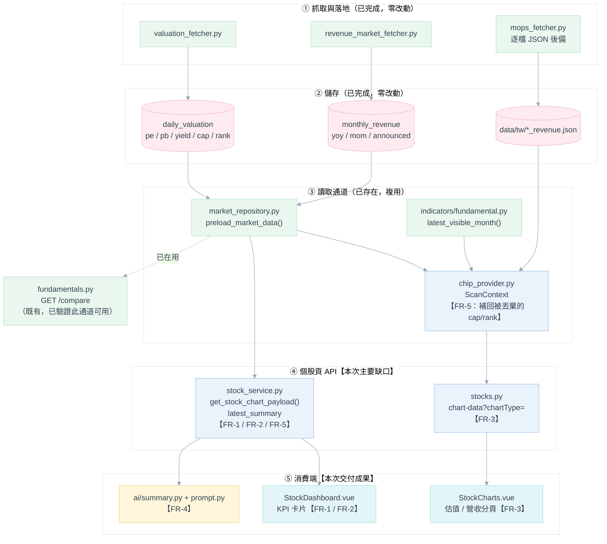

# Phase 2：籌碼面與基本面量化擴充 — 功能需求文件

**模組**：個股基本面／估值指標貫通（個股頁 → 圖表 → AI 診股報告）
**版本**：v2.0（v1.0 為構想草案，與現況嚴重脫節，本版整份重寫，落差逐條記於 §0）
**日期**：2026-08-28
**狀態**：**需求確認中，尚未開發**
**上游文件**：[AI技術分析規劃.md](AI技術分析規劃.md)（v3.4，已完成）、[Phase1-基礎量化與技術面.md](Phase1-基礎量化與技術面.md)
**關聯規格**：[《選股功能及爬蟲》](../13.選股功能/選股功能及爬蟲.md) §10、[《籌碼選股》](../5.籌碼選股策略/籌碼選股.md) §3.4／Phase 2

> **文件性質說明**
> 本文件是**功能需求文件**，回答「Phase 2 要交付哪些使用者看得到的功能、驗收標準是什麼」。
> 實作細節（SQL、函式簽章）僅在「不寫下來就會做錯」之處點到為止，其餘留給實作階段。
> 凡本文件與 v1.0 草案衝突之處，**一律以本文件為準**。

---

## 目錄

| 章節 | 內容 |
|---|---|
| 0 | 改版重點（v1.0 落差修正） |
| 1 | 範圍、需求總表與設計前提 |
| 2 | 現況盤點與缺口分析 |
| 3 | 功能需求逐條規格（FR-1～FR-5） |
| 4 | 資料流與相依關係 |
| 5 | 技術決策紀錄（ADR） |
| 6 | 非功能需求與鐵則 |
| 7 | 驗收條件總表 |
| 8 | 工作分解與排程建議 |
| 9 | 待確認事項 |

---

## 0. 改版重點：v1.0 落差修正

v1.0 草案設想「從零打造一條籌碼與基本面資料管線」，逐項列出三大法人爬蟲、融資融券爬蟲、MOPS 月營收、
估值抓取、動態選股池、個人記帳、系統日誌、多條件濾網共六大項。但逐一比對現有程式碼後發現：**其中約
八成早已完成**，只是分散在其他編號的 `docs/` 資料夾與模組裡，不是在 [16.AI技術分析](.) 之下做的。

照 v1.0 字面開工的後果不是「補功能」，而是**做出第二套與現行系統打架的平行實作**，且會浪費大量工時
在已經上線的東西上。逐條列出落差，避免日後有人回頭複製 v1.0 的需求描述：

| # | v1.0 的寫法 | 問題 | 本版作法 |
|---|---|---|---|
| **D-01** | 「實作 TWSE T86 與 TPEX 每日盤後三大法人買賣超爬蟲」 | **已完成**。`daily_market_chip` 表與 [services/market_fetcher.py](../../backend/services/market_fetcher.py) 已在每日排程中運作 | 移出範圍，§2 標註現況 |
| **D-02** | 「抓取每日融資餘額、融券餘額與券資比（MI_MARGN）」 | **已完成**。同上表，且個股頁早已有融資／融券／券資比 KPI 卡與趨勢圖 | 移出範圍 |
| **D-03** | 「PostgreSQL 建立 `stock_daily_chips`、`stock_master` 與財務比率欄位」 | **表名與現況不符**。實際為 `daily_market_chip`／`symbols`／`daily_valuation`／`monthly_revenue`（[V9 遷移](../../backend/db/migration/V9__Create_market_daily_tables.sql)），皆已建立並每日累積 | 移出範圍；本文件一律沿用現行表名 |
| **D-04** | 「爬取 MOPS 月營收、計算 YoY／MoM」 | **已完成**。`monthly_revenue` 表（含 `yoy_percent`／`mom_percent`／`announced_date`）＋ [revenue_market_fetcher.py](../../backend/services/revenue_market_fetcher.py)（全市場）＋ [mops_fetcher.py](../../backend/services/mops_fetcher.py)（逐檔補洞） | 移出範圍 |
| **D-05** | 「抓取即時本益比、股價淨值比與現金殖利率」 | **已完成**。`daily_valuation` 表 ＋ [valuation_fetcher.py](../../backend/services/valuation_fetcher.py)。**但資料進了資料庫卻沒有任何前端頁面或 AI 報告讀得到**——這才是真正的缺口 | **重新定義為本文件核心需求**（FR-1、FR-3、FR-4） |
| **D-06** | 「串接 FinMind 或 yfinance 抓取歷史除權息與配息紀錄」 | 除權息還原（`adj_close`）確實未做，但**責任文件是《籌碼選股》Phase 1**（§780～789），該處已有完整 WBS 與驗收條件 | 移出範圍，§1.3 標註責任歸屬 |
| **D-07** | 「依 `config/universe.yaml` 動態切分大型權值股與中小型潛力股選股池」 | 市值排名 `daily_valuation.mcap_rank` 已逐日算好；但 YAML 規則池與月頻凍結快照 `universe_snapshots` 未做，**責任文件是《籌碼選股》Phase 2**（§791～799） | 移出範圍；本文件只消費既有的 `mcap_rank`（FR-5） |
| **D-08** | 「實作 `user_transactions` CRUD、FIFO／加權平均成本、已實現損益」 | **已完成**，且範圍遠大於 v1.0 描述（含手續費稅金凍結、股利、出入金、觀察名單） | 移出範圍，見 [docs/8.個人投資記帳功能/](../8.個人投資記帳功能/個人投資記帳功能_design.md) |
| **D-09** | 「建立 `system_activity` 表作為單一真相來源」 | 表已存在但**表名為 `activity_log`**（刻意取通用名，見 [ADR-AI-18](AI技術分析規劃.md#2-技術選型與決策紀錄adr)），目前只有 AI 模組寫入；爬蟲另有專屬的 `market_fetch_job` 作業紀錄表 | 移出範圍：屬各既有模組的零星待辦，不足以構成 Phase 2 主題 |
| **D-10** | 「組合技術面＋籌碼面＋基本面多條件選股邏輯」 | **已完成**。[strategies/conditions_pick.py](../../backend/strategies/conditions_pick.py) 的 `stock_pick_resonance`／`relative_low_zone` 即是，門檻走 `strategy_config/strategies.yaml` | 移出範圍 |

### 0.1 本版如何重新定位 Phase 2

扣掉上述已完成與另有歸屬的項目後，**與「籌碼面與基本面量化」這個主題直接相關、且無人認領的缺口只剩
一條主線**：

> 估值（PE／PB／殖利率／市值）與月營收（YoY／MoM）資料**每天都在寫進資料庫，卻沒有任何一個
> 使用者看得到的地方讀它**——個股頁的四張估值 KPI 卡永遠顯示「—」，沒有對應的趨勢圖分頁，
> AI 診股報告的量化摘要也完全沒有這些維度。

Phase 2 因此重新定義為：**把已經落地的基本面／估值資料，端到端貫通到個股頁與 AI 診股報告**。
籌碼面（三大法人／融資融券）在這條路徑上早已貫通，正好是本次要照抄的既有樣板（§3 各需求皆註明
對應的籌碼面前例）。

---

## 1. 範圍、需求總表與設計前提

### 1.1 功能需求總表

| 編號 | 功能需求 | 優先級 | 使用者可見成果 |
|---|---|---|---|
| **FR-1** | 個股頁估值指標卡片補值（本益比／股價淨值比／殖利率／市值） | **P0** | 四張目前恆為「—」的卡片顯示真實數值 |
| **FR-2** | 個股頁月營收指標卡片（YoY／MoM＋資料可見月份） | **P0** | 新增兩張營收成長卡片，副標標示資料月份 |
| **FR-3** | 估值與月營收歷史趨勢圖分頁 | **P1** | 點卡片可看走勢，而非跳回 K 線圖 |
| **FR-4** | AI 診股報告量化摘要擴充（估值／營收／市場定位／近期策略訊號） | **P1** | AI 報告內容涵蓋基本面與籌碼佐證，不再只有技術面 |
| **FR-5** | 市值與市值排名端到端貫通（`market_cap`／`mcap_rank`） | **P2** | 個股頁顯示市值與全市場排名位階 |

**優先級判準**：P0 ＝ 修補目前畫面上就看得到的破綻（空值卡片）；P1 ＝ 新增使用者價值；
P2 ＝ 錦上添花，可延後但不應遺忘。

### 1.2 既有系統前提（本文件賴以建立的既有事實）

| 既有元件 | 位置 | 與本文件的關係 |
|---|---|---|
| 全市場每日估值 | `daily_valuation`（`pe_ratio`／`pb_ratio`／`dividend_yield`／`market_cap`／`mcap_rank`） | FR-1／FR-5 的**唯一資料來源**，已逐日累積，不需新爬蟲 |
| 全市場每月營收 | `monthly_revenue`（`yoy_percent`／`mom_percent`／`announced_date`） | FR-2 的**主要資料來源** |
| 逐檔月營收 JSON | `data/tw/{symbol}_revenue.json`，[mops_fetcher.py](../../backend/services/mops_fetcher.py) `load_stock_revenue()` | FR-2 在 `DATA_SOURCE=json` 模式下的後備來源（見 ADR-P2-02） |
| **批次預載查詢** | [repositories/market_repository.py](../../backend/repositories/market_repository.py) `preload_market_data()` | **已同時查回行情／估值／營收，且已回傳 `market_cap`／`mcap_rank`**。FR-1／FR-2／FR-5 一律複用，不另寫 SQL（ADR-P2-01） |
| 已驗證的消費前例 | [api/v1/endpoints/fundamentals.py](../../backend/api/v1/endpoints/fundamentals.py) `GET /compare` | 已用上述路徑取得多檔估值／營收並成功產出比較報表——證明資料通道可用，本文件是把同一條通道接到個股頁 |
| Point-in-time 可見性 | [indicators/fundamental.py](../../backend/indicators/fundamental.py) `latest_visible_month()` | FR-2 判定「當日該看到哪一個月營收」的既有實作，**直接重用不重寫**（ADR-P2-03） |
| 估值／營收平行序列 | [services/chip_provider.py](../../backend/services/chip_provider.py) `ScanContext.valuation`／`revenue_yoy`／`revenue_mom` | FR-3 歷史序列的現成組裝邏輯；FR-5 需在此補上被丟棄的兩個欄位 |
| 指標定義 | [markets/tw.py](../../backend/markets/tw.py) `metrics`／`meta.panels` | **已宣告** `pe_ratio`／`pb_ratio`／`dividend_yield`／`market_cap` 四個 `tile=True, panel="valuation"` 指標，`panels` 也已含 `"valuation"`。FR-2 需在此補營收指標 |
| 圖表資料組裝 | [services/stock_service.py](../../backend/services/stock_service.py) `get_stock_chart_payload()` | `latest_summary` 的組裝處，FR-1／FR-2／FR-5 的**主要修改對象** |
| KPI 卡片渲染 | [views/StockDashboard.vue](../../frontend/src/views/StockDashboard.vue)（188～215 行） | 以 `v-for="metric in chartData.metrics"` 動態渲染，**後端有值就會自動顯示**，不需新增元件 |
| 圖表分頁定義 | [components/StockCharts.vue](../../frontend/src/components/StockCharts.vue) `widgetDefinitions`（150 行起） | FR-3 的修改對象；依 `panel` 過濾分頁的機制已存在 |
| AI 量化摘要 | [ai/summary.py](../../backend/ai/summary.py) `build_quant_summary()` | FR-4 的修改對象。其鐵則「唯一呼叫 `get_stock_chart_payload()`，不得自行查表或計算指標」本次**不放寬**（ADR-P2-05） |
| AI Prompt 組裝 | [ai/prompt.py](../../backend/ai/prompt.py) | FR-4 的修改對象 |
| 策略警示查詢 | [repositories/alert_repository.py](../../backend/repositories/alert_repository.py) `query_alerts()` | FR-4 `recent_alerts` 區塊的資料來源 |

### 1.3 不在本文件範圍

| 項目 | 原因與責任歸屬 |
|---|---|
| 三大法人／融資融券／估值／月營收的**資料抓取** | 全部已完成，見 §0 D-01／D-02／D-04／D-05 |
| 除權息還原（`adj_close`／`adj_factor`） | 未做，但責任文件為《籌碼選股》Phase 1（§780～789），該處已有 ERD 與驗收條件 |
| 選股池月頻凍結（`universe_snapshots`、`config/universe.yaml`） | 未做，責任文件為《籌碼選股》Phase 2（§791～799） |
| 個人投資記帳與庫存損益 | 已完成，見 [docs/8.個人投資記帳功能/](../8.個人投資記帳功能/個人投資記帳功能_design.md) |
| `activity_log` 擴及爬蟲／策略掃描／記帳模組 | 各模組自行辦理的零星待辦，不構成 Phase 2 主題 |
| 季報 EPS 進個股頁 | `mops_eps_fetcher.py` 的 MOPS 端點在開發環境無法實測（見其檔案註解的已知限制），資料可信度未確認前不納入；列 §9 Q-4 |
| 財務比率深度分析（杜邦分析、DCF、EPS 預估） | 與《選股功能及爬蟲》§1.2 的既有範圍界定一致，不做新的評分模型 |
| 美股估值／營收 | 無等價的官方免費資料來源；本文件所有基本面需求**皆為 TW-only**，美股維持現狀 |

---

## 2. 現況盤點與缺口分析

### 2.1 v1.0 六大項 vs 實際狀態

| v1.0 項目 | 現況 | 依據 |
|---|---|---|
| 一、籌碼面資料管線（三大法人＋融資融券） | ✅ **已完成**（含前端 KPI 卡與趨勢圖） | `daily_market_chip`、`market_fetcher.py`、`StockCharts.vue` 的 `institutional`／`margin` 分頁 |
| 二、基本面與財報量化（月營收、估值、配息） | 🟡 **資料層已完成，消費層完全缺席**；除權息未做且另有歸屬 | `daily_valuation`／`monthly_revenue` 已逐日累積；前端與 AI 皆讀不到 |
| 三、動態選股池 | 🟡 `mcap_rank` 已逐日算好；YAML 規則池與月頻快照未做（另有歸屬） | `daily_valuation.mcap_rank`；《籌碼選股》Phase 2 |
| 四、個人投資記帳與庫存 | ✅ **已完成** | `portfolio_*` 五張表、`portfolio_ledger.py`、記帳前端頁面 |
| 五、系統活動日誌 | 🟡 `activity_log` 表已建立且設計為通用表，目前僅 AI 模組寫入 | `activity_log_repository.py`；爬蟲另有 `market_fetch_job` |
| 六、多條件選股濾網 | ✅ **已完成** | `conditions_pick.py` 的 `stock_pick_resonance`／`relative_low_zone` |

### 2.2 缺口鏈：資料進得來，出不去

四個環節中，**只有最上游是通的**：

| 環節 | 狀態 | 具體情形 |
|---|---|---|
| ① 抓取與落地 | ✅ 通 | `valuation_fetcher.py`／`revenue_market_fetcher.py` 每日寫入 `daily_valuation`／`monthly_revenue` |
| ② 讀取通道 | ✅ 通（但只有選股用到） | `preload_market_data()` 已能一次查回行情＋估值＋營收；`GET /compare` 已在用 |
| ③ 個股頁 API | ❌ **斷** | `get_stock_chart_payload()` 的 `latest_summary` 完全沒有這些欄位 |
| ④ 前端與 AI | ❌ **斷** | KPI 卡顯示「—」；無趨勢圖分頁；`ai/summary.py` 無基本面區塊 |

### 2.3 目前畫面上就看得到的三個破綻

這三項是 P0 需求（FR-1）的直接理由——**不是「缺功能」，是「已經壞在畫面上」**：

| # | 現象 | 成因 |
|---|---|---|
| **G-1** | 台股個股頁固定出現「本益比 —」「股價淨值比 —」「殖利率 —」「市值 —」四張空卡 | [markets/tw.py](../../backend/markets/tw.py) 已宣告這四個 `Metric`，`StockDashboard.vue` 的 `v-for` 會把 `metrics` **全部**渲染成卡片；但 `latest_summary` 從未提供對應鍵，`formatMetricValue()` 遇到 `undefined` 一律回傳 `'—'` |
| **G-2** | 點擊上述四張卡，畫面跳到 K 線圖 | `StockDashboard.vue` `setActiveChart()` 的對照表沒有這四個 key，落到預設值 `widgetId = 'kline'`；且 `StockCharts.vue` 的 `widgetDefinitions` 根本沒有 `valuation` 分頁 |
| **G-3** | AI 診股報告的基本面研判完全缺席 | `ai/summary.py` 目前只組裝 `latest`／`ma`／`bias_percent`／`kd`／`range`／`volume_*`／`chips`／`margin`，沒有任何估值或營收維度 |

> **G-1 的正面意義**：後端指標定義既然已經就位，FR-1 的前端**幾乎不用改**——只要 `latest_summary`
> 開始帶值，卡片自然就有數字。這也是本文件把它列為 P0 的原因：投入小、可見度高。

---

## 3. 功能需求逐條規格

### FR-1　個股頁估值指標卡片補值（P0）

| 項目 | 內容 |
|---|---|
| **使用者情境** | 使用者瀏覽任一檔已追蹤台股時，應直接在頁面上方 KPI 區看到本益比、股價淨值比、殖利率與市值，不必先跑選股掃描、也不必跳到 `/compare` 頁 |
| **功能描述** | `get_stock_chart_payload()` 的 `latest_summary` 新增 `pe_ratio`／`pb_ratio`／`dividend_yield`／`market_cap` 四個欄位，取該標的**最新交易日**的估值數值 |
| **資料來源** | `daily_valuation`，經 `preload_market_data()` 讀取（ADR-P2-01） |
| **適用市場** | 僅 TW。美股 `metrics` 不含這四項，不受影響 |
| **前端異動** | 原則上**無需異動**（卡片已存在且會自動顯示）。例外見下方「顯示規格」 |

**顯示規格**

| 指標 | 單位 | 顯示規則 |
|---|---|---|
| `pe_ratio` | 倍 | 小數 2 位；**不得加正負號**（`isSignedMetric()` 目前以 key 命名模式判斷，這四個 key 皆不符合其模式，行為正確，無需改動） |
| `pb_ratio` | 倍 | 同上 |
| `dividend_yield` | % | 小數 2 位 |
| `market_cap` | **億元** | 原始值為「元」，台積電量級約 10¹³，直接顯示會是一長串數字。**需將 `markets/tw.py` 的 `unit` 由 `"元"` 改為 `"億元"`，並於後端換算後回傳**（換算放後端，避免前端硬編碼除數，比照既有「單位轉換不散落前端」慣例） |

**缺值規則**

| 情境 | 行為 |
|---|---|
| 虧損股（`pe_ratio` 為 `NULL`） | 該卡顯示「—」，其餘三卡正常顯示。**不得回傳 `0`**（與 `daily_valuation` 來源端「虧損股存 `NULL` 不存 0」的既有約定一致） |
| `DATA_SOURCE=json` 或 Postgres 不可用 | 四卡全部顯示「—」，**K 線／均線／KD／籌碼一律照常顯示**，不得整頁報錯（ADR-P2-02） |
| 該標的當日未進 `daily_valuation`（冷門股、暫停交易） | 同上，顯示「—」 |

**驗收條件**：AC-1、AC-2、AC-3、AC-11

---

### FR-2　個股頁月營收指標卡片（P0）

| 項目 | 內容 |
|---|---|
| **使用者情境** | 使用者看個股時應能直接看到最新公布的月營收年增率與月增率，並清楚知道「這是哪一個月的數字」——月營收有公布時滯，不標示月份會讓人誤以為是當月數據 |
| **功能描述** | ① `markets/tw.py` 新增 `revenue_yoy`／`revenue_mom` 兩個 `Metric`（`tile=True, panel="fundamental", frequency="monthly"`），`meta.panels` 追加 `"fundamental"`；② `latest_summary` 新增 `revenue_yoy`／`revenue_mom`／`revenue_visible_month` 三個欄位 |
| **資料來源** | `monthly_revenue`（主）／`data/tw/{symbol}_revenue.json`（後備，見 ADR-P2-02） |
| **月份判定** | 一律以 `latest_visible_month()` 計算「該交易日當下市場已公開可見」的月份，**不得直接取當月或最新一筆**（ADR-P2-03） |
| **適用市場** | 僅 TW |

**顯示規格**

| 指標 | 單位 | 顯示規則 |
|---|---|---|
| `revenue_yoy` | % | 小數 2 位；**可正可負，需顯示正負號並依專案色彩慣例上色（紅漲綠跌）** |
| `revenue_mom` | % | 同上 |

> **前端需一併調整**：`StockDashboard.vue` 的 `isSignedMetric()` 目前以
> `key.includes('buy_sell') || key === 'institutional_total' || key.includes('amount')` 判斷，
> `revenue_yoy`／`revenue_mom` 不在其中，會**漏掉正負號與漲跌色**。需擴充該判斷式。

**副標規格**：`revenue_yoy` 卡片副標顯示資料月份（例如「資料月份 2026-06」），比照既有
`institutional_total` 卡片副標顯示「外資 +1,234」的寫法（`StockDashboard.vue` 207～212 行），
**不另開卡片元件**。

**缺值規則**

| 情境 | 行為 |
|---|---|
| 新上市未滿 12 個月，無 YoY 基期 | `revenue_yoy` 顯示「—」，`revenue_mom` 若有值仍正常顯示 |
| 該檔無任何營收資料（多為 ETF、金融特殊架構） | 兩卡皆顯示「—」，副標不顯示月份 |
| 月營收公布前的空窗期 | 顯示前一個可見月份的數字＋其月份標示，**不得顯示空白或當月**（這正是 `latest_visible_month()` 的用途） |

**驗收條件**：AC-4、AC-5、AC-6、AC-11

---

### FR-3　估值與月營收歷史趨勢圖分頁（P1）

| 項目 | 內容 |
|---|---|
| **使用者情境** | 使用者點擊估值或營收 KPI 卡片時，應看到該指標的歷史走勢（例如「本益比目前 18 倍，是近一年的相對高檔還是低檔？」），而不是被丟回 K 線圖（現況 G-2） |
| **功能描述** | ① `StockCharts.vue` `widgetDefinitions` 新增 `{ id: 'valuation', title: '估值走勢（PE／PB／殖利率）', panel: 'valuation' }` 與 `{ id: 'revenue', title: '月營收 YoY／MoM', panel: 'fundamental' }`；② `StockDashboard.vue` `setActiveChart()` 對照表補上六個 key 的對應；③ `GET /{stock_id}/chart-data` 支援 `chartType=valuation｜revenue` 回傳歷史序列；④ [utils/chartExplanations.js](../../frontend/src/utils/chartExplanations.js) 補兩則白話說明（既有慣例：每個 chartType 都要有） |
| **資料來源** | 估值序列與營收序列的組裝邏輯 `ChipDataProvider.get_bars(with_valuation=True)` **已存在**（`ScanContext.valuation`／`revenue_yoy`／`revenue_mom`），複用即可，不重寫 |
| **圖表形式** | 估值：三條線（PE／PB／殖利率）共圖，因量級差異需**雙 Y 軸**（PE／PB 一軸，殖利率 % 一軸）；營收：YoY／MoM 雙線，零軸需明顯標示（成長與衰退的分界） |
| **缺值規則** | 序列中的缺值**留空不連線、不補 0、不沿用前一日**（沿用 `chip_provider.py` 既有的 ADR-SP-08 約定） |

**驗收條件**：AC-7、AC-8、AC-12

---

### FR-4　AI 診股報告量化摘要擴充（P1）

| 項目 | 內容 |
|---|---|
| **使用者情境** | 使用者產生 AI 診股報告時，希望 AI 的研判涵蓋「這檔股票貴不貴、營收有沒有成長、近期規則引擎有沒有發過訊號」，而不是只看線圖說技術面 |
| **功能描述** | `ai/summary.py` `build_quant_summary()` 新增四個區塊；`ai/prompt.py` 對應擴充研判框架與 User Prompt 分節 |
| **對外契約** | **完全不變**。[AI技術分析規劃.md §4.5](AI技術分析規劃.md#45-結構化輸出aischemapy) 的七個結構化輸出欄位、`ai_analysis_report` 表結構、每日一次閘門邏輯皆不動——本需求只豐富**輸入** |
| **資料庫遷移** | **不需要**。`quant_summary` 為 `JSONB`，新增鍵值原樣存入即符合 ADR-AI-15「摘要即快照」 |

**新增區塊**

| 區塊鍵 | 欄位 | 來源 | 市場 |
|---|---|---|---|
| `valuation` | `pe_ratio`、`pb_ratio`、`dividend_yield` | FR-1 的 `latest_summary` | 僅 TW |
| `revenue` | `yoy_percent`、`mom_percent`、`visible_month` | FR-2 的 `latest_summary` | 僅 TW |
| `market_position` | `market_cap`、`mcap_rank` | FR-5 的 `latest_summary` | 僅 TW |
| `recent_alerts`（選用） | `[{strategy_id, direction, trade_date, signal_strength}]` | `alert_repository.query_alerts()` | TW／US |

**`recent_alerts` 規格**

| 項目 | 規格 |
|---|---|
| 查詢方式 | `query_alerts(market=..., symbol=..., days=...)`（同步函式，可直接呼叫） |
| 回看天數 | 預設 10 天，走 `.env`／`ai/config.py`，**不寫死**（比照 ADR-AI-12） |
| 筆數上限 | 最多 5 筆，取最新者 |
| 送出欄位 | 只取 `strategy_id`／`direction`／`trade_date`／`signal_strength`，**不送 `details`**——`details` 內含策略門檻值，送出會違反「Prompt 不得出現硬編碼策略門檻」的既有原則（[§4.4](AI技術分析規劃.md#44-prompt-設計)） |
| 涵蓋範圍 | 若 `stock_pick_resonance`／`relative_low_zone` 等多因子選股策略已在 YAML 啟用，其觸發結果就是一般 alert，會自動被撈到，**不需另建整合路徑** |
| 失敗處理 | 讀取失敗只記警告、視為無訊號，**不得讓整份報告中止**（比照 [§4.7](AI技術分析規劃.md#47-失敗分類與錯誤處理) 「紀錄失敗不得讓主流程失敗」） |

**缺值規則**：沿用 `ai/summary.py` 既有的 `_clean()` 慣例——`0`／`None` 一律**整個鍵省略**，
不送 `null` 或 `0`；區塊內全部欄位皆缺時整個區塊省略；美股不出現前三個區塊。
理由同既有註解：模型看到 `"pe_ratio": 0` 會當成真實估值並據此推論。

**Prompt 擴充**：System Prompt 的研判框架新增兩點（基本面與估值檢核、市場資金定位），並在輸出規範
補一條「近期策略訊號僅供佐證，不得複述訊號當結論」。User Prompt 依區塊分節序列化，缺值區塊整段不輸出
（不得出現空標題）。

**驗收條件**：AC-9、AC-10、AC-13、AC-14

---

### FR-5　市值與市值排名端到端貫通（P2）

| 項目 | 內容 |
|---|---|
| **使用者情境** | 「這檔在全市場排第幾大？」是判斷法人資金偏好與流動性風險的常用參考。市值排名已經每天算好，卻沒有任何地方讀得到 |
| **功能描述** | ① `ScanContext.valuation` 的序列字典新增 `market_cap`／`mcap_rank` 兩個 key；② `latest_summary` 新增 `mcap_rank`（`market_cap` 由 FR-1 提供）；③ `markets/tw.py` 新增 `mcap_rank` `Metric`（單位「名」） |
| **關鍵事實** | `preload_market_data()` **已經把 `market_cap` 與 `mcap_rank` 查回來了**（見 `market_repository.py` 估值批次查詢），但 `chip_provider.py` 組裝 `val_series` 時只取了 `pe_ratio`／`pb_ratio`／`dividend_yield`，**其餘兩個欄位被直接丟棄**。本需求不新增任何資料庫查詢 |
| **顯示規格** | 顯示為排名數字（例如「18」），單位「名」；缺值顯示「—」 |
| **適用市場** | 僅 TW |

**驗收條件**：AC-15

---

## 4. 資料流與相依關係

### 4.1 目標資料流



（色票沿用專案統一色系：綠＝既有可複用元件、粉＝資料儲存、藍＝核心處理、青＝介面、黃＝外部／AI）

### 4.2 需求間相依

```
FR-1（估值補值）──┐
FR-2（營收卡片）──┼──→ FR-4（AI 摘要擴充）
FR-5（市值排名）──┘

FR-1、FR-2 ──→ FR-3（趨勢圖分頁）
```

**FR-4 必須排在 FR-1／FR-2／FR-5 之後**：`ai/summary.py` 的既有鐵則是「只讀
`get_stock_chart_payload()` 已算好的結果，不得自行查表」（ADR-P2-05），因此欄位必須先出現在
`latest_summary`，AI 才讀得到。

### 4.3 與《選股功能及爬蟲》§10 的關係

該文件 §10 已就「個股頁新增估值／營收 KPI 卡與趨勢分頁」定案過欄位與異動檔案清單，且**部分已實作**
（`markets/tw.py` 的四個估值 `Metric` 與 `meta.panels` 的 `"valuation"` 即出自該處），但後端 payload
與前端圖表分頁**未完成**——這正是 G-1／G-2 兩個破綻的由來。

本文件 FR-1／FR-2／FR-3 即是**完成 §10 未竟的部分**，並額外新增 §10 未涵蓋的 `mcap_rank`（FR-5）與
AI 摘要擴充（FR-4）。實作時應視為同一批工作，**避免同一組檔案（`markets/tw.py`、
`stock_service.py`、`StockCharts.vue`）在短期內被改兩次**。

---

## 5. 技術決策紀錄（ADR）

| 編號 | 決策 | 理由 | 影響 |
|---|---|---|---|
| **ADR-P2-01** | 估值／營收讀取一律走 `market_repository.preload_market_data()`，**不在 `stock_service.py` 另寫 SQL** | ① `repositories/` 是唯一 SQL 入口是專案既有鐵則；② 這條通道已被 `GET /compare` 實際驗證可用；③ 單檔查詢傳入單元素清單即可，不需為此新增方法 | FR-1、FR-2、FR-5 |
| **ADR-P2-02** | 估值在 `DATA_SOURCE=json` 模式下**明確降級為「—」**，不做任何替代估算；月營收則保留 `load_stock_revenue()` 的 JSON 後備 | `daily_valuation` 只存在於 Postgres，JSON 模式無等價來源，硬湊只會產生假數字；月營收本來就有逐檔 JSON（`chip_provider.py` 已是這個雙來源模式），沿用即可 | FR-1、FR-2；AC-11 |
| **ADR-P2-03** | 月營收月份一律以 `latest_visible_month()` 判定，**不取當月、不取最新一筆** | 月營收每月 10 日前才公布上月數字。直接取最新一筆會讓「今天」看到市場當時還不知道的資料；個股頁雖非回測場景，但與策略引擎採同一判定可避免「同一檔在個股頁與選股結果顯示不同月份」的矛盾 | FR-2；AC-5 |
| **ADR-P2-04** | `market_cap`／`mcap_rank` 補進 `ScanContext.valuation` 既有序列字典，**不新增查詢、不新增資料結構** | `preload_market_data()` 早已把這兩欄查回，只是組裝時被丟棄。補兩行取值即可，成本近乎為零 | FR-5 |
| **ADR-P2-05** | `ai/summary.py`「只讀 `get_stock_chart_payload()`、不得自行查表或計算指標」的鐵則**本次不放寬** | 放寬會讓 AI 模組多一條繞過 `stock_service` 的資料路徑，違反 CLAUDE.md「資料讀取只在 `stock_service` 分支」的既有約束，也會讓 AI 引用的數字與個股頁畫面出現分歧（正是 [ADR-AI-09](AI技術分析規劃.md#2-技術選型與決策紀錄adr) 要避免的） | FR-4 排序在 FR-1／FR-2 之後 |
| **ADR-P2-06** | 市值單位換算（元 → 億元）放**後端** | 前端硬編碼除數會讓同一個數字在 KPI 卡、比較報表、AI 摘要三處各自換算，遲早不一致 | FR-1 |
| **ADR-P2-07** | 本文件**不新增任何資料庫遷移** | 所有需要的欄位都已存在於 `daily_valuation`／`monthly_revenue`；AI 摘要走 `JSONB` 無需改結構 | 全部 |

---

## 6. 非功能需求與鐵則

| 鐵則 | 說明 |
|---|---|
| **切換圖表不得跳回頁首** | 新增的估值／營收圖表分頁必須遵守 CLAUDE.md 硬規則 1：切換期間保留既有內容（dim/overlay），**不得**用 `loading` 旗標把整塊內容換成 spinner |
| **KPI 卡片同列等高** | 新增卡片必須帶 `!m-0`，遵守 CLAUDE.md 硬規則 2，避免 `_utils.scss` 的 `.card` 底部間距讓最後一張卡變高 |
| **紅漲綠跌** | `revenue_yoy`／`revenue_mom` 的正負色彩沿用專案慣例（台美股一致），不得引入依市場切換的配色 |
| **不得顯示 0 代替缺值** | 全部新增欄位一律「缺值即缺席」：後端省略鍵、前端顯示「—」。這是本專案自 `restore_price_from_legacy.py` 那次歷史事故以來的一貫約定 |
| **不得因新功能拖垮既有頁面** | Postgres 不可用、估值缺漏、營收缺漏等任一情況，K 線／均線／KD／籌碼皆須照常顯示 |
| **不在條件／摘要層算數** | 所有數值一律由來源端算好（`daily_valuation` 已是比率、`monthly_revenue` 已是百分比），消費端只做取值與格式化，不重算 |
| **效能** | 新增查詢皆為既有索引欄位（`(symbol, trade_date)` 主鍵、`(symbol, year_month)` 主鍵）的單檔查詢，個股頁 API 回應時間不得因此增加超過 10% |

---

## 7. 驗收條件總表

| 編號 | 對應需求 | 驗收條件 |
|---|---|---|
| AC-1 | FR-1 | 任選 3 檔有估值資料的台股，個股頁「本益比／股價淨值比／殖利率」三張卡顯示數值，且與 `daily_valuation` 當日該檔的值一致 |
| AC-2 | FR-1 | 任選 1 檔虧損股（`pe_ratio` 為 `NULL`），該卡顯示「—」，**不是 0**；其餘卡片正常 |
| AC-3 | FR-1 | 市值卡以「億元」顯示且數量級正確（抽驗台積電，應為兆元量級 ÷ 10⁸ 後的合理數字） |
| AC-4 | FR-2 | 任選 3 檔台股，`revenue_yoy`／`revenue_mom` 與 `monthly_revenue` 對應月份的值一致，**正負號一致** |
| AC-5 | FR-2 | 於每月 1～9 日（上月營收尚未公布的空窗期）檢視，副標顯示的月份為**前一個已公布月份**，而非當月 |
| AC-6 | FR-2 | 營收 YoY 為負值時顯示負號且套用綠色（跌），為正值時顯示 `+` 且套用紅色（漲） |
| AC-7 | FR-3 | 點擊本益比卡片切換到「估值走勢」分頁（**不是**跳回 K 線圖），圖上三條序列的最新值與 KPI 卡數字一致 |
| AC-8 | FR-3 | 估值／營收圖表序列中的缺值日**斷線留白**，不補 0、不水平延伸 |
| AC-9 | FR-4 | 任選 1 檔台股產生 AI 報告，`ai_analysis_report.quant_summary` 內含 `valuation`／`revenue`／`market_position` 三個區塊，數值與 KPI 卡一致 |
| AC-10 | FR-4 | 任選 1 檔美股產生 AI 報告，`quant_summary` **不含**上述三個區塊，且報告內容未出現臆測的基本面數字 |
| AC-11 | FR-1／FR-2 | 停用 Postgres（或設 `DATA_SOURCE=json`）後重新載入個股頁：估值卡顯示「—」，**K 線、均線、KD、三大法人、融資融券全部正常**，無整頁錯誤 |
| AC-12 | FR-3 | 切換估值／營收圖表分頁時畫面**不跳回頁首**；KPI 卡新增後同列卡片**等高**（CLAUDE.md 兩條硬規則） |
| AC-13 | FR-4 | 該檔近 10 日有策略警示時，`quant_summary.recent_alerts` ≤ 5 筆、按日期新到舊排序，且不含 `details` 欄位 |
| AC-14 | FR-4 | **既有回歸**：在同一份歷史資料上，改動前後產生的 AI 報告七個對外欄位（`verdict`／`headline`／支撐／壓力／停損／`report_markdown`／`confidence`）結構完全一致，前端渲染無異常；`ai_analysis_report` 未新增欄位 |
| AC-15 | FR-5 | 任選 3 檔台股，`mcap_rank` 卡顯示的排名與 `daily_valuation.mcap_rank` 當日值一致 |
| AC-16 | 全部 | **既有回歸**：`fundamental_revenue_decline`、三個籌碼型態警示、六個均線策略、KD 相關策略在同一份歷史資料上的觸發結果與改動前**逐筆相同** |

---

## 8. 工作分解與排程建議

| # | 項目 | 需求 | 前置 |
|---|---|---|---|
| 1 | `chip_provider.py`：`val_series` 補回 `market_cap`／`mcap_rank` | FR-5 | — |
| 2 | `stock_service.py`：`latest_summary` 新增 6 個欄位（PE／PB／殖利率／市值／`mcap_rank`），資料經 `preload_market_data()` 取得，含降級處理 | FR-1、FR-5 | #1 |
| 3 | `stock_service.py`：`latest_summary` 新增 `revenue_yoy`／`revenue_mom`／`revenue_visible_month`，走 `latest_visible_month()` | FR-2 | #2 |
| 4 | `markets/tw.py`：`market_cap` 單位改「億元」；新增 `revenue_yoy`／`revenue_mom`／`mcap_rank` 三個 `Metric`；`meta.panels` 追加 `"fundamental"` | FR-1、FR-2、FR-5 | #3 |
| 5 | `StockDashboard.vue`：`isSignedMetric()` 納入營收指標；`revenue_yoy` 卡副標顯示資料月份；卡片圖示對應補齊 | FR-1、FR-2 | #4 |
| 6 | `stocks.py`：`chart-data` 支援 `chartType=valuation｜revenue` | FR-3 | #3 |
| 7 | `StockCharts.vue` 新增兩個圖表分頁；`setActiveChart()` 補對照；`chartExplanations.js` 補說明 | FR-3 | #6 |
| 8 | `ai/summary.py`：新增四個區塊與缺值規則 | FR-4 | #3 |
| 9 | `ai/prompt.py`：System Prompt 研判框架＋輸出規範；User Prompt 分節 | FR-4 | #8 |
| 10 | 驗收（AC-1～AC-16），含既有回歸 | 全部 | #9 |
| 11 | 回填 [AI技術分析規劃.md](AI技術分析規劃.md) 版本紀錄（依其既有慣例新增一列，如 v3.5） | — | #10 |

**排程建議**：#1～#5 為一批（P0，修補 G-1，投入小、可見度最高，可獨立交付驗收）；#6～#7 為一批
（P1，修補 G-2）；#8～#9 為一批（P1，AI 擴充）。三批之間有明確前置關係，不建議並行。

---

## 9. 待確認事項

| # | 問題 | 影響 | 建議 |
|---|---|---|---|
| **Q-1** | `daily_valuation.market_cap` 與 `mcap_rank` 目前實際的**資料涵蓋率**為何？上市／上櫃是否皆有值？ | 若涵蓋率低，FR-1 的市值卡與 FR-5 會大量顯示「—」，價值降低 | 開工前先跑一次抽樣查詢確認；涵蓋率過低則 FR-5 降級為「暫不實作」，並在《選股功能及爬蟲》回報資料缺口 |
| **Q-2** | 上櫃股票的估值資料是否已納入？（《選股功能及爬蟲》Q-7 已拍板「P0 只做上市，上櫃自上線日往後累積不回補」） | 上櫃個股的估值卡可能顯示「—」而使用者不知原因 | 若確認上櫃缺資料，需在 UI 上以 tooltip 或說明文字揭露涵蓋範圍，不能只留一個「—」讓人以為是壞掉 |
| **Q-3** | 估值趨勢圖（FR-3）的預設區間應為多久？ | PE 河流圖的判讀價值高度依賴區間長度（近 3 個月看不出位階） | 建議預設 1 年，並沿用個股頁既有的區間切換控制項，不另做一套 |
| **Q-4** | 季報 EPS（`mops_eps_fetcher.py`）是否要一併納入個股頁？ | 擴大 Phase 2 範圍 | **本版不納入**：該爬蟲的 MOPS 端點在開發環境受 WAF 阻擋、欄位對應未經實測（見其檔案註解），資料可信度確認前不應上前端。待實測通過後另案評估 |
| **Q-5** | AI 摘要的 `recent_alerts` 回看天數（預設 10 天）與筆數上限（預設 5 筆）是否合適？ | Prompt 長度與參考價值的取捨 | 先用預設值上線，依實際報告品質微調（走 `.env`，免重新部署） |
| **Q-6** | 是否需要讓 AI 交叉比對「近期訊號是否仍然成立」（例如訊號觸發後隔日已跌破均線）？ | 若要做，`ai/summary.py` 需多一層判斷邏輯，複雜度上升 | **本版不做**：交由 LLM 自行比對圖片與數值判斷，符合「AI 報告是獨立觀察視角、不與規則引擎耦合」的既有定位（[ADR-AI-11](AI技術分析規劃.md#2-技術選型與決策紀錄adr)） |
