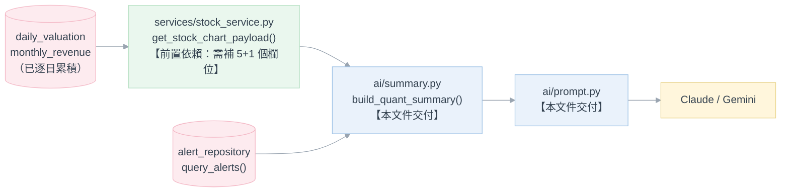

# Phase 2：籌碼面與基本面量化擴充 — AI 診股報告量化維度擴充規格書

**模組**：AI 技術分析報告（[AI技術分析規劃.md](AI技術分析規劃.md)）之量化摘要（`quant_summary`）擴充
**版本**：v2.0（v1.0 為草案，範圍與現況嚴重脫節，本版整份重寫，見 §0）
**日期**：2026-08-28
**狀態**：規劃中，尚未開發
**對應既有模組**：[backend/ai/summary.py](../../backend/ai/summary.py)、[backend/ai/prompt.py](../../backend/ai/prompt.py)、
[services/stock_service.py](../../backend/services/stock_service.py)、
[《選股功能及爬蟲》規格書](../13.選股功能/選股功能及爬蟲.md)、
[《籌碼選股》規格書](../5.籌碼選股策略/籌碼選股.md)

---

## 0. 改版說明：為什麼整份重寫

v1.0 的草案設想的是「從零打造」一條籌碼／基本面資料管線（三大法人爬蟲、融資融券爬蟲、MOPS 月營收、
估值抓取、動態選股池、個人記帳、系統日誌、多條件濾網），但實際比對現有程式碼與其他 `docs/` 文件後
發現：**這八成內容早就做完了**，只是分散在其他編號的文件與模組裡，不是在這個
[16.AI技術分析](.) 資料夾下完成的。照 v1.0 字面重寫只會生出一份「要求重做已完成功能」的錯誤規格，
往後任何人（含 Claude Code）依此文件開工都會浪費工時、甚至疊出第二套互相打架的實作。

因此 v2.0 做了兩件事：

1. **§2 现況盤點**：把 v1.0 六大項逐一核對現況，標明「已完成」與對應文件／程式碼位置，避免重複造輪子。
2. **重新定位本文件的範圍**：v1.0 標題「籌碼面與基本面量化擴充」在現況下唯一站得住腳、且未被任何其他
   文件認領的缺口，是——**這些籌碼／估值／基本面資料雖然都已經進了資料庫，但 AI 診股報告完全看不到**。
   `ai/summary.py` 目前只讀均線、KD、五日法人買賣超與融資融券（見 §2、§3.1），本文件的交付內容就是把
   已經存在的估值、月營收、市值排名、近期選股訊號接進 AI 報告的量化摘要與 Prompt。

> 本文件**不**重複規劃除權息還原（`adj_close`）與月頻選股池快照（`universe_snapshots`）——
> 這兩項已在《籌碼選股》規格書自己的 Phase 1／Phase 2（§770～800）有完整 WBS、ERD 與驗收條件，
> 兩者皆**尚未開工**，但責任文件是那份，不是本文件（見 §1.3）。

---

## 1. 範圍與設計前提

### 1.1 交付範圍

1. 擴充 `ai/summary.py` 的 `build_quant_summary()`，新增三個 TW-only 資料區塊：**估值**（本益比／股價
   淨值比／殖利率）、**月營收**（YoY／MoM／最新可見月份）、**市場定位**（市值排名）。
2. 新增一個全市場皆適用（TW／US）的選用區塊：**近期選股／策略訊號**（`recent_alerts`），讓 AI 能引用
   該檔近期已被規則引擎判定觸發過哪些策略，作為佐證而非另立判斷依據。
3. 同步調整 `ai/prompt.py` 的 System Prompt 研判框架與 User Prompt 區塊組裝，讓模型知道如何解讀新欄位。
4. **不改變**對外七個結構化輸出欄位（`verdict`／`headline`／`support_levels`／`resistance_levels`／
   `stop_loss`／`report_markdown`／`confidence`，見 [AI技術分析規劃.md §4.5](AI技術分析規劃.md#45-結構化輸出aischemapy)）——
   本次只豐富**輸入**，不動輸出契約，端點與前端完全無感。

### 1.2 既有系統前提（本文件賴以建立的既有事實）

| 既有元件 | 位置 | 與本文件的關係 |
|---|---|---|
| 全市場每日估值 | `daily_valuation` 表（`pe_ratio`／`pb_ratio`／`dividend_yield`／`market_cap`／`mcap_rank`），[V9 遷移](../../backend/db/migration/V9__Create_market_daily_tables.sql) | 估值與市值排名區塊的**唯一資料來源**，已逐日累積，不需新爬蟲 |
| 全市場每月營收 | `monthly_revenue` 表（`yoy_percent`／`mom_percent`／`announced_date`），同上遷移 | 月營收區塊的**唯一資料來源** |
| 抓取管線 | [services/valuation_fetcher.py](../../backend/services/valuation_fetcher.py)、[services/revenue_market_fetcher.py](../../backend/services/revenue_market_fetcher.py)、[services/market_fetcher.py](../../backend/services/market_fetcher.py) | 已在排程中每日寫入上述兩張表，本文件不新增任何抓取邏輯 |
| 量化摘要組裝 | [ai/summary.py](../../backend/ai/summary.py) `build_quant_summary()` | 本文件的**修改對象**；鐵則「唯一呼叫 `get_stock_chart_payload()`，不得自行計算或查表」維持不變（見該檔案自身註解） |
| 圖表資料組裝 | [services/stock_service.py](../../backend/services/stock_service.py) `get_stock_chart_payload()` | 估值／月營收要先出現在這裡的 `latest_summary`，`ai/summary.py` 才能讀到（見 §1.4 前置依賴） |
| 策略警示查詢 | [repositories/alert_repository.py](../../backend/repositories/alert_repository.py) `query_alerts(market, days, symbol, ...)` | `recent_alerts` 區塊的資料來源；同步、JSON 支撐，`ai/summary.py` 可直接呼叫 |
| 多因子選股條件 | [strategies/conditions_pick.py](../../backend/strategies/conditions_pick.py) `stock_pick_resonance` / `relative_low_zone` | 若對應策略已在 `strategy_config/strategies.yaml` 啟用，其觸發結果就是一般 alert，`recent_alerts` 撈到即涵蓋，不需另開整合路徑 |
| Prompt 組裝 | [ai/prompt.py](../../backend/ai/prompt.py) | 本文件的**修改對象**之一 |

### 1.3 不在本文件範圍

| 項目 | 原因 | 責任文件 |
|---|---|---|
| 三大法人／融資融券資料抓取 | 已完成 | `daily_market_chip` + `market_fetcher.py`，見 [《選股功能及爬蟲》](../13.選股功能/選股功能及爬蟲.md) |
| 估值／月營收全市場抓取 | 已完成 | 同上（§1.2） |
| 動態選股池（市值分級／YAML 規則池） | `mcap_rank` 已逐日算好，但月頻凍結快照 `universe_snapshots` 未做 | 《籌碼選股》Phase 2（§791～799） |
| 除權息還原（`adj_close`） | 未做 | 《籌碼選股》Phase 1（§780～789） |
| 個人投資記帳與庫存 | 已完成 | [docs/8.個人投資記帳功能/](../8.個人投資記帳功能/個人投資記帳功能_design.md) |
| 系統活動日誌通用化 | `activity_log` 表已建立且設計上預留給其他模組沿用，但爬蟲／策略掃描／記帳目前仍未接（見 [ADR-AI-18](AI技術分析規劃.md#2-技術選型與決策紀錄adr)），屬各自模組的小型待辦，不構成獨立文件 | 各模組自行辦理，非本文件範圍 |
| 個股頁估值／營收 KPI 卡與趨勢圖 | 已有完整規劃（欄位、檔案、圖表分頁），但**尚未實作** | 《選股功能及爬蟲》§10（見 §1.4 前置依賴） |
| AI 排程自動產生報告、推播進通知平台、多輪對話 | 與本文件無關 | [AI技術分析規劃.md §1.3](AI技術分析規劃.md#13-不在本文件範圍) |

### 1.4 前置依賴（實作順序）

`ai/summary.py` 的鐵則是「不得自行計算或查表，只能讀 `get_stock_chart_payload()` 算好的結果」——這條
鐵則本次**不放寬**（放寬會讓 AI 模組多一條繞過 `stock_service` 的資料路徑，違反 CLAUDE.md「資料讀取只
在 `stock_service` 分支」的既有約束）。因此本文件的三個 TW-only 區塊有明確前置條件：



| 前置條件 | 現況 | 動作 |
|---|---|---|
| `get_stock_chart_payload()` 的 `latest_summary` 需含 `pe_ratio`／`pb_ratio`／`dividend_yield`／`revenue_yoy`／`revenue_mom`／`revenue_visible_month` | 《選股功能及爬蟲》§10 已定案欄位與異動檔案清單（`markets/tw.py` metrics、`stock_service.py`、`StockCharts.vue` 等），**但截至本文件撰寫時尚未實作** | 需先完成《選股功能及爬蟲》§10，本文件不重複定義這 6 個既有欄位的規格 |
| 同一函式需再補 `mcap_rank`（市值排名） | 《選股功能及爬蟲》§10 的既定欄位清單**沒有**這一項 | 本文件在 §10 既定範圍之外**額外新增**這一個欄位，走同一套機制（`markets/tw.py` metrics → `stock_service.py` latest_summary），實作時建議與 §10 合併一次處理，避免同一檔案改兩次 |

若 §10 尚未排入排程，本文件的估值／營收／市值排名三個區塊應視為**與 §10 綁定的同一批工作**一併規劃，
不建議只做 AI 摘要端而讓個股頁繼續看不到這些欄位。

---

## 2. 現況盤點：v1.0 六大項 vs 實際狀態

| v1.0 項目 | 現況 | 依據 |
|---|---|---|
| 一、三大法人買賣超＋融資融券爬蟲 | ✅ 已完成 | `daily_market_chip` 表、[services/market_fetcher.py](../../backend/services/market_fetcher.py) |
| 二、MOPS 月營收 YoY/MoM ＋ 估值（PE/PB/殖利率）＋ 除權息 | 月營收／估值 ✅ 已完成；除權息還原 ❌ 未做 | `monthly_revenue`／`daily_valuation` 表；除權息見《籌碼選股》Phase 1 |
| 三、動態選股池（市值分級） | 🟡 部分完成：`mcap_rank` 已逐日算好；YAML 規則池與月頻凍結快照未做 | `daily_valuation.mcap_rank`；《籌碼選股》Phase 2 |
| 四、個人投資記帳與庫存 | ✅ 已完成 | [docs/8.個人投資記帳功能/](../8.個人投資記帳功能/個人投資記帳功能_design.md)（FIFO/加權平均成本、手續費稅金、觀察名單皆已上線） |
| 五、系統活動日誌 | 🟡 部分完成：`activity_log` 表已建立並設計為通用表，目前只有 AI 模組寫入 | [repositories/activity_log_repository.py](../../backend/repositories/activity_log_repository.py)；爬蟲另有獨立的 `market_fetch_job` 作業紀錄表 |
| 六、多條件選股濾網 | ✅ 已完成 | [strategies/conditions_pick.py](../../backend/strategies/conditions_pick.py) `stock_pick_resonance`／`relative_low_zone` |

**結論**：唯一與「AI 技術分析」這個資料夾主題直接相關、且無人認領的缺口，是本文件 §3 要處理的
「AI 報告看不到已存在的籌碼／估值／基本面資料」。

---

## 3. 核心設計：`quant_summary` 擴充內容

### 3.1 新增資料維度

沿用 `ai/summary.py` 既有的「0/None 視為缺值，一律省略不送」慣例（`_clean()`），與既有 `chips`／
`margin` 區塊同樣**僅 TW** 適用（美股沒有這些資料來源，整段略去，不得臆測）：

| 區塊鍵 | 欄位 | 型別 | 來源（經 §1.4 補齊後的 `latest_summary`） | 市場 |
|---|---|---|---|---|
| `valuation` | `pe_ratio`（本益比）、`pb_ratio`（股價淨值比）、`dividend_yield`（殖利率 %） | number | `latest_summary.pe_ratio` 等 | 僅 TW |
| `revenue` | `yoy_percent`、`mom_percent`、`visible_month`（如 `"2026-06"`） | number / string | `latest_summary.revenue_yoy`／`revenue_mom`／`revenue_visible_month` | 僅 TW |
| `market_position` | `mcap_rank`（全市場市值排名） | integer | `latest_summary.mcap_rank`（§1.4 新增） | 僅 TW |
| `recent_alerts`（選用） | `[{strategy_id, direction, trade_date, signal_strength}]`，見 §3.4 | array | `alert_repository.query_alerts()` | TW／US 皆可 |

既有欄位（`latest`／`ma`／`bias_percent`／`kd`／`range`／`volume_ma5`／`volume_ratio`／`chips`／`margin`）
不動。

### 3.2 缺值與邊界規則

沿用既有 `_clean()`（0/None 一律省略）與 `_round()`（四捨五入 2 位）慣例，額外規則：

| 情境 | 規則 | 理由 |
|---|---|---|
| 虧損股 `pe_ratio` 為空 | 省略整個 `pe_ratio` 鍵，不送 `null` 或 `0` | 與 `daily_valuation` 來源端「虧損股不得存 0，一律 `NULL`」的既有約定（《選股功能及爬蟲》§7）一致 |
| 新上市未滿 12 個月，`revenue_yoy` 無基期可比 | 省略 `yoy_percent`，保留 `mom_percent`（若有） | 避免模型把「無法計算」誤讀為「衰退」 |
| `mcap_rank` 為 `NULL`（極冷門標的當日未進 `daily_valuation`） | 省略整個 `market_position` 區塊 | 同上，缺值不臆測 |
| 美股 | 完全不出現 `valuation`／`revenue`／`market_position` 三個鍵 | 沿用既有 `chips`／`margin` 的 TW-only 模式 |

### 3.3 `recent_alerts`（選用區塊）

| 項目 | 規格 |
|---|---|
| 呼叫方式 | `query_alerts(market=market, symbol=symbol, days=RECENT_ALERTS_LOOKBACK_DAYS)`（同步函式，`ai/summary.py` 可直接呼叫，不需額外 I/O 隔離） |
| 回看天數 | 預設 10 個交易日（`RECENT_ALERTS_LOOKBACK_DAYS`，走 `.env`／`ai/config.py`，比照 ADR-AI-12「不寫死」） |
| 筆數上限 | 最多 5 筆，超過取最新 5 筆（避免 Prompt 過長；策略掃描本身已有 cooldown 機制，同一 `(strategy_id, direction)` 短期內不會重複出現） |
| 送入欄位 | 只取 `strategy_id`／`direction`／`trade_date`／`signal_strength`，**不送整包 `details`**（避免把濾網內部門檻值洩漏進 Prompt，且維持「Prompt 不得出現硬編碼策略門檻」既有原則，[AI技術分析規劃.md §4.4](AI技術分析規劃.md#44-prompt-設計)） |
| 涵蓋範圍 | 不限技術面策略——若 `stock_pick_resonance`／`relative_low_zone` 等選股策略已啟用，其觸發結果同樣是一般 alert，會被撈到，天然涵蓋「多因子選股訊號」，不需另開整合路徑（見 §1.2） |
| 失敗處理 | 讀取失敗（例如 `alerts.json` 損毀）只記警告、回傳空陣列，不得讓整份報告因此中止（比照既有 §4.7「紀錄失敗不得讓主流程失敗」精神） |

### 3.4 Prompt 影響

**System Prompt**（[ai/prompt.py](../../backend/ai/prompt.py)，沿用 [AI技術分析規劃.md §4.4](AI技術分析規劃.md#44-prompt-設計) 既有研判框架，新增第 6、7 點）：

```text
6. 基本面與估值檢核：本益比／股價淨值比是否處於合理區間、殖利率是否具吸引力、
   月營收年增率是否支撐目前股價；三者缺席時略過，不得臆測。
7. 市場資金定位：市值排名反映該股在全市場的資金規模位階，可作為法人資金偏好與
   流動性風險的輔助判斷，不單獨作為買賣依據。
```

同時在既有「輸出規範」補一條：

```text
- 若【近期策略訊號】區塊存在，可作為既有規則引擎的佐證參考，但**不得**單純複述訊號
  內容當作結論；你的研判必須基於圖片與結構化量化數值獨立產生。
```

**User Prompt**：`ai/prompt.py` 依 §3.1 的區塊分節序列化（沿用「分節標題＋單位標註」既有風格），新增
「估值面」「基本面（營收）」「市場定位」「近期策略訊號」四個分節，缺值區塊整段不輸出（不出現空標題）。

### 3.5 對既有契約的影響

| 項目 | 影響 |
|---|---|
| 對外結構化輸出（7 欄位） | **不變** |
| `ai_analysis_report` 資料表結構 | **不需要新遷移**——`quant_summary` 是 `JSONB`，新增鍵值原樣存入即符合 ADR-AI-15「摘要即快照」 |
| 每日一次／併發閘門（§4.6） | **不變**，本文件只影響送進 LLM 的內容，不影響去重與計費邏輯 |
| 成本 | 每次呼叫的 input token 略增（估計 4 個新分節共數十至一百餘 token），對 `max_tokens=8000` 的輸出上限與 §10 成本估算無實質影響 |

---

## 4. 驗收條件

| 編號 | 條件 |
|---|---|
| AC-1 | 前置依賴（§1.4）完成後，任選 3 檔有估值資料的 TW 股，`quant_summary.valuation` 數值與當日 `daily_valuation` 表一致 |
| AC-2 | 任選 3 檔有月營收資料的 TW 股，`quant_summary.revenue` 數值與當月 `monthly_revenue` 表一致，YoY／MoM 正負號一致 |
| AC-3 | 任選 1 檔虧損股（`pe_ratio` 為 `NULL`），`quant_summary.valuation` 不含 `pe_ratio` 鍵，且不是 `0` 或 `null` |
| AC-4 | 任選 1 檔美股，`quant_summary` 不含 `valuation`／`revenue`／`market_position` 任一鍵 |
| AC-5 | 該檔近期有策略警示觸發時，`quant_summary.recent_alerts` 筆數 ≤ 5、按 `trade_date` 由新到舊排序，且與 `query_alerts()` 直接查詢結果一致 |
| AC-6 | 該檔近期無任何警示時，`quant_summary` 不含 `recent_alerts` 鍵（而非空陣列） |
| AC-7 | 既有回歸：關閉本次新增區塊後產生的報告（`verdict`／支撐壓力／停損等 7 個對外欄位）與改動前逐筆相同 |
| AC-8 | 一次完整報告產生流程（擷圖＋量化摘要＋呼叫 LLM）耗時與改動前相比無顯著增加（新增區塊查詢皆為既有索引欄位的單筆查詢） |

---

## 5. 工作分解（粗估）

| # | 項目 | 前置 |
|---|---|---|
| 1 | 完成《選股功能及爬蟲》§10：`get_stock_chart_payload()` 補 `pe_ratio`／`pb_ratio`／`dividend_yield`／`revenue_yoy`／`revenue_mom`／`revenue_visible_month` | — |
| 2 | 同批次加補 `mcap_rank`（§1.4 新增，非 §10 原定範圍） | 與 #1 同一批 |
| 3 | `ai/summary.py`：新增 `valuation`／`revenue`／`market_position`／`recent_alerts` 四個區塊組裝與 §3.2 缺值規則 | #1、#2 |
| 4 | `ai/prompt.py`：System Prompt 研判框架新增第 6、7 點；User Prompt 新增四個分節 | #3 |
| 5 | 回歸測試（AC-7）＋新增驗收（AC-1～AC-6、AC-8） | #4 |
| 6 | 版本紀錄回填 [AI技術分析規劃.md](AI技術分析規劃.md)（依其既有版本紀錄慣例新增一列，例如 v3.5） | #5 |

---

## 6. 待確認事項

| # | 問題 | 影響 | 建議 |
|---|---|---|---|
| Q-1 | 《選股功能及爬蟲》§10 何時排入開發排程？ | 決定本文件最早可開工時間 | 建議與 §10、本文件的 `mcap_rank` 補項合併成同一個開發批次，一次改完 `stock_service.py` 相關檔案 |
| Q-2 | `recent_alerts` 的回看天數（預設 10）與筆數上限（預設 5）是否符合實際需求？ | Prompt 長度與參考價值的取捨 | 先用預設值上線，正式使用後依實際報告品質微調（走 `.env`，免重新部署） |
| Q-3 | 是否需要把「近期訊號」與「目前量化數值是否仍符合該訊號成立條件」做交叉比對（例如訊號觸發後隔日已跌破均線）？ | 若要做，`ai/summary.py` 需要多一層邏輯判斷，複雜度上升 | 本版**不做**，交由 LLM 自行比對圖片與數值後判斷是否仍然成立，符合「AI 報告是獨立觀察視角」的既有定位（[AI技術分析規劃.md ADR-AI-11](AI技術分析規劃.md#2-技術選型與決策紀錄adr)） |
