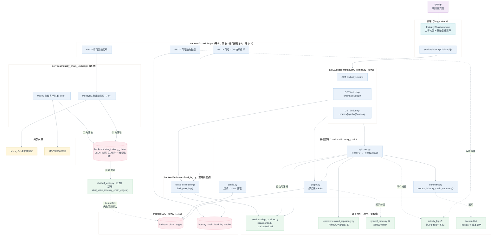
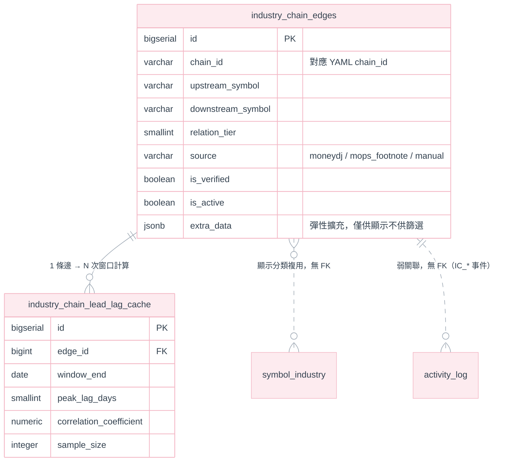

# Phase 3：產業鏈知識圖譜與輪動模型 需求規格書

**模組**：產業鏈知識圖譜與輪動模型（Industry Chain Knowledge Graph & Rotation Model）
**對應既有模組**：[strategies/](../../backend/strategies/)（策略警示引擎）、
[services/chip_provider.py](../../backend/services/chip_provider.py)（`ScanContext`／`MarketPreload`）、
[services/industry_fetcher.py](../../backend/services/industry_fetcher.py) ＋ `symbol_industry` 表（既有產業分類標籤，見 §2.1）、
[services/mops_fetcher.py](../../backend/services/mops_fetcher.py)（MOPS 抓取前例與已知限制，見 §2.2）、
[backend/ai/](../../backend/ai/)（LLM Provider／成本閘門前例，見 §4.4）
**版本**：v2.2
**日期**：2026-08-28
**狀態**：**需求規格 — 待審核。本文件只定義需求、資料模型與驗收條件，不含程式開發**

**參考文件**
- [AI 技術分析報告 系統開發規格書](AI技術分析規劃.md)（以下簡稱《AI 報告規格》）—— `backend/ai/` package 的 Provider 抽象、成本閘門、`activity_log` 設計前例，本文件多處直接沿用
- [Phase1-基礎量化與技術面.md](Phase1-基礎量化與技術面.md)、[Phase2-籌碼面與基本面量化擴充.md](Phase2-籌碼面與基本面量化擴充.md)（前置階段構想）—— **重要落差說明見 §2.0**
- [股價相對低點 需求規格書](../13.選股功能/股價相對低點.md)（以下簡稱《相對低點》）—— 估值分位數資料缺口、point-in-time 營收判斷、「本專案無回測模組」等結論本文件直接沿用，不重複查證
- [選股功能與爬蟲 整合設計規格書](../13.選股功能/選股功能及爬蟲.md)——`ScanContext`／`MarketPreload` 批次預載機制之母體文件
- [策略管理架構 設計規格書](../1.策略管理模組/策略管理架構-設計規格書.md)——`@condition` 註冊表與條件函式簽章規範
- [大盤指數功能規劃書](../10.加權指數/大盤指數功能規劃書.md) §8.2——`symbol_industry` 產業標籤表的原始設計依據
- [爬蟲開發.md](../3.爬蟲開發/爬蟲開發.md)——TWSE／MOPS 爬蟲的既有節流與容錯慣例

> **文件性質**：原始版本（v1.0，見 §0）是一段從外部貼入、尚未核對本專案現行架構的功能構想清單，寫法與寫作動機和《相對低點》v1.0 被查核前的狀態相同。本版（v2.0）逐項核對現行程式碼與資料現況，標出可直接沿用、需修正、與不可落地之處，並改寫為可審核的需求規格書。

---

## 目錄

| 章節 | 內容 |
|---|---|
| 0 | 修訂紀錄 |
| 1 | 目的與範圍 |
| 2 | 現況盤點與既有系統的分界（避免重複建設） |
| 3 | 系統架構 |
| 4 | 功能需求 |
| 5 | 資料庫設計 |
| 6 | 設定檔與環境變數設計 |
| 7 | API 設計 |
| 8 | 前端設計 |
| 9 | 決議事項（ADR） |
| 10 | 分階段交付 |
| 11 | 驗收準則 |
| 12 | 開放問題 |
| 13 | 風險與限制 |
| 14 | 影響範圍（僅供日後開發估算） |

---

## 0. 修訂紀錄

| 版本 | 變更摘要 |
|---|---|
| v1.0 | 初版構想清單：`industry_chain_edges` 上下游關聯表、CCF 領先落後檢定、動能外溢監控三段式描述。方向正確，但未核對本專案現行的資料層（`DATA_SOURCE` 雙軌、`ScanContext`／`MarketPreload`）、既有產業標籤（`symbol_industry`）、既有爬蟲限制（MOPS WAF）與策略引擎的條件函式簽章，直接照抄會出現架構不相容之處（見 §2） |
| v2.0 | 本次優化：新增 §2 現況盤點（釐清與 `symbol_industry`／`SectorRotationView.vue`／策略引擎的分界）、§9 決議事項（ADR）、資料庫設計改為 Flyway／Postgres-only 慣例並移除與現行 `config.py` 撞名的設定檔路徑、將「動能外溢偵測」拆分為「可沿用既有引擎」與「需要新批次模組」兩部分、標出年報客戶名單解析與跟漲勝率矩陣的資料/工程缺口、補上分階段交付與驗收準則 |
| v2.1 | 併入一份外部審閱意見（自稱 v3.0）中查證屬實的部分，並修正 v2.0 自身一處誤植：(1) **修正** ADR-IC-01 誤把 `symbol_industry` 引用為「Postgres-only」前例——查證 `services/industry_fetcher.py`／`db/dual_write.py` 後，`symbol_industry` 實際是 **JSON 為主、Postgres best-effort 雙寫**（`dual_write_symbol_industry()`），與 `daily_stock_data` 同一套既有慣例；`industry_chain_edges` 的寫入面因此改採同一套慣例（新增 ADR-IC-09），讀取面（圖查詢／BFS）維持需要 Postgres 的結論不變；(2) **新增** `extra_data JSONB` 欄位（比照 `daily_stock_data.market_specific_data` 既有慣例，ADR-IC-10）；(3) **精煉** ADR-IC-06：明確納入「力導向圖截圖 + 多模態 LLM」的構想（呼應既有 ADR-AI-02「AI 看到的圖＝使用者看到的圖」哲學），但**否決**該外部意見提出的具體實作路徑（新開 `/industry-chains/analyze-ai` 端點、寫死過期模型 ID `Gemini 1.5 Pro`／`Claude 3.5 Sonnet`）；(4) **否決**該外部意見的 `system_activity`（非既有表名，應為 `activity_log`）與 `config/industry_chains.yaml`（重現 v2.0 已修正的撞名問題）兩處，理由與逐項評估見對話紀錄 |
| v2.2 | **自我查核版**：v2.1 只改了 §5.1 一處，卻沒有把同一個修正推到文件其餘引用點，造成三處**文件內互相矛盾**——本版逐一修正，並補上四個原本缺漏的規格章節。**修正矛盾**：(1) ADR-IC-01 仍寫著「比照 `symbol_industry` 既有先例」，正是 v2.1 宣稱已修掉的誤植，已改寫為讀／寫分離的正確敘述；(2) FR-1 仍寫「Postgres-only」，與 §5.1 的雙寫結論衝突；(3) **AC-IC-5 與 §5.1 直接互斥**——前者要求「`DATA_SOURCE=json` 時本功能整體自我停用」，後者明訂「不受 `DATA_SOURCE` 影響」，已改以「Postgres 可用性」為唯一判準；(4) §3.1 架構圖漏畫 v2.1 新增的 JSON 快照層；(5) FR-17 新增後未編入 §10 分階段交付與 §14 影響範圍。**補上缺漏**：(6) 新增 §4.6 排程與批次作業——FR-8 的 CCF 快取、FR-9 的脫鉤監控原本都只說「要算」卻沒定義**何時由誰觸發**；(7) 新增 §6.2 環境變數設定——§7 早已引用 `IC_DISABLED` 錯誤碼，但全文從未定義過這個功能旗標叫什麼；(8) 新增 CCF 最小樣本數門檻（原本 `sample_size` 欄位存在卻無判準）；(9) §1.4 補上 `relation_tier`（圖層級）與「低位階」（價格位階）的**術語衝突警告** |

---

## 1. 目的與範圍

### 1.1 目的

量化台股產業鏈上下游的價格傳導路徑與時間差，將現有「單一標的獨立分析」升級為「同一產業鏈內標的的關聯分析」，在下游龍頭發動時，從其上游候選中篩出「同期尚未反應、基本面未轉壞」的補漲名單，作為既有選股／警示體系的第四種訊號來源（技術面、籌碼面、基本面之外的「關聯面」）。

### 1.2 範圍

| 範圍內 | 範圍外（本文件不涵蓋） |
|---|---|
| 產業鏈上下游關聯的資料模型與設定檔規格（§5、§6） | 程式開發、YAML／SQL 實際套用（本文件只給規格範本） |
| CCF 領先—落後量化引擎的需求與資料前置條件（§4.2） | CCF／Granger 演算法的實作細節與參數尋優（工程階段自行決定） |
| 動能外溢篩選邏輯的需求，及其與既有策略引擎的整合方式（§4.3） | 自動下單、資金配置（本專案無此類模組，比照《相對低點》ADR-RL-06） |
| API／前端視覺化需求（§7、§8） | UI 視覺稿（可另立原型，比照《相對低點》§10.3 的 `prototype/` 慣例） |
| MoneyDJ／MOPS 兩個新資料來源的**可行性評估與風險** | 實際爬蟲程式碼；來源本身的合法性／ToS 判斷需使用者確認（§12 Q-1） |
| **回測式**「跟漲勝率」統計的**簡化需求**（§4.3.3） | 嚴謹回測框架（本專案無回測模組，見《相對低點》§1.2，本文件不新建） |

### 1.3 市場範圍

**本文件僅涵蓋台股（TW）**。理由：動能外溢篩選所需的「估值分位數」「營收未衰退」「三大法人／融資」皆為台股限定資料（`ctx.valuation`／`ctx.revenue_yoy`／`indicators/chip.py`，見 CLAUDE.md「多市場抽象」一節），美股沒有等價來源。產業鏈本身雖可能實質跨市場（例如美系 IC 設計上游、台系代工下游），但本文件的圖譜節點與篩選邏輯**只處理台股節點**；跨市場邊留作 §12 Q-2 開放問題。

### 1.4 名詞

| 名詞 | 本文件的定義 |
|---|---|
| 產業鏈（chain） | 一組具備進銷貨關係的標的集合，如「AI 伺服器鏈」「半導體鏈」，對應 §6.1 YAML 的一個 `chain_id` |
| 上游／下游 | 依供應鏈方向定義的相對關係；同一檔標的在不同鏈中可能同時是甲鏈的下游、乙鏈的上游 |
| 領先—落後（lead-lag） | 兩檔標的報酬率序列在特定延遲天數 `k` 下的相關性最強；本文件以 CCF 量化 |
| 動能外溢（momentum spillover） | 下游標的發動後，動能傳導至上游標的、帶動補漲的現象 |
| **價格位階**（低位階候選） | 下游已發動、但自身尚處於盤整／未上漲，因此存在補漲空間的上游標的。**「位階」一律指價格／估值的高低**，與供應鏈的第幾層無關 |
| **關聯層級**（`relation_tier`） | 供應鏈上距離下游幾層（1 = 直接上游，2 = 次一層）。**「層級」一律指圖上的距離**，與價格高低無關 |
| 脫鉤（decoupling） | 上游標的與其所屬產業鏈的價格關聯性長期低於門檻，過去有效的傳導路徑失效 |

> **術語衝突警告**：中文的「位階」與「層級」、英文的 tier 在本文件裡指**兩件完全不同的事**——`relation_tier` 是圖結構上的距離，「低位階」是價格便宜與否。FR-11（BFS 收集 `tier ≤ N`）與 FR-12～FR-14（低位階濾網）是**前後兩個獨立步驟**：先用**關聯層級**圈出候選範圍，再用**價格位階**篩掉已經漲上去的。撰寫程式或後續文件時，變數命名建議一律用 `relation_tier` / `price_position` 兩個不同的字根，避免混用單一個 `tier`。

---

## 2. 現況盤點與既有系統的分界（避免重複建設）

### 2.0 與 Phase 1／Phase 2 文件的關係（重要落差說明）

Phase 1／Phase 2 文件描述的部分模組名稱（`TWSEProvider`／`YahooProvider` 抽象基底類別、兩段式 `data/raw/` → Parquet 落地、獨立的 `stock_daily_chips` 資料表）**與本專案實際落地的架構不一致**：現行爬蟲是 `services/fetcher.py`（TWSE）／`services/us_fetcher.py`（yfinance）兩支具體模組，落地為 `backend/data/{tw,us}/<symbol>.json`，法人與融資券資料是併入 `daily_stock_data.market_specific_data`（JSONB 欄位，見 [V1 遷移](../../backend/db/migration/V1__Create_symbols_and_daily_data.sql)），不是獨立的 `stock_daily_chips` 表；儲存亦無 Parquet 層。本文件**不依賴** Phase 1／Phase 2 文件裡尚未落地的模組名稱，一律以 CLAUDE.md 與本章 §2.1～§2.4 核對過的現行架構為準。Phase 1／Phase 2 文件本身是否需要同步修正，不在本文件範圍內。

### 2.1 與既有 `symbol_industry`／`SectorRotationView.vue` 的分界

專案已有兩個「產業」相關的既有功能，**與本文件的產業鏈圖譜是三個不同粒度的概念**，必須在文件與 UI 用語上明確區分，否則會讓使用者誤以為是重複功能：

| 既有／新增 | 粒度 | 資料 | 用途 |
|---|---|---|---|
| `symbol_industry` 表（[V6](../../backend/db/migration/V6__Create_symbol_industry.sql)／[V7](../../backend/db/migration/V7__Widen_symbol_industry_code.sql) 遷移，`services/industry_fetcher.py`） | 個股 → 單一產業分類標籤 | TWSE 官方產業分類代碼（靜態，無方向性） | 熱力圖／投組配置圓餅圖分組 |
| `SectorRotationView.vue`（既有頁面） | **類股指數**（大盤子指數）層級 | 各類股指數對 TWII 的 alpha／動能排名 | 「哪個產業類股正在相對強勢」的巨觀輪動 |
| **本文件：`industry_chain_edges`（新增）** | **個股對個股**的有向供應鏈關聯 | 上游／下游具體標的、關聯層級、傳導時差 | 「這檔下游發動後，該去看哪幾檔上游」的微觀傳導 |

`industry_chain_edges` 可**沿用** `symbol_industry.industry_name` 作為圖譜節點的顯示分類（不必重建產業字典），但**不得**把三者的資料表或 UI 頁面合併——分類標籤是靜態的一對一標籤，類股輪動是指數層級排名，供應鏈關聯是個股對個股的有向邊，三者的更新頻率、資料來源、查詢語意都不同。

### 2.2 資料來源可行性查核

原始構想的兩個資料來源，工程量與風險差異很大，**不應綑綁為同一個交付項目**：

| 來源 | 用途 | 查核結果 |
|---|---|---|
| MoneyDJ 產業價值鏈資訊平台 | 上中下游成分股快照 | **非官方公開 API**，需 HTML 結構爬取；頁面結構變動或反爬蟲機制皆會使其失效。是否符合該站 ToS 需使用者確認（§12 Q-1，**列為 P0 阻塞項**）。爬取失敗須容錯降級（比照 `mops_fetcher.py` 對單一請求被擋不可中斷整體排程的既有慣例），**不得**因此中斷既有的每日爬蟲／掃描排程 |
| MOPS 財報附註「主要進銷貨客戶」（佔營收 10% 以上） | 補強供應鏈關聯的官方佐證 | **與現行 `mops_fetcher.py` 的性質完全不同**：後者是月營收 AJAX 端點（結構化 JSON），前者是年報財報附註內的**非結構化文字**（PDF 或 XBRL），需要額外的文件解析能力（PDF 文字擷取或 XBRL taxonomy 解析），且同樣可能撞上 `mops_fetcher.py` 檔頭註解記載的官方 WAF。工程量遠大於「新增一支 AJAX 爬蟲」，**降級為 P2 獨立子專案**（§10），不與 P0 圖譜管線綑綁，也不作為 P0 的資料前置條件 |

**寫入面應沿用既有「JSON 為主、Postgres best-effort 雙寫」慣例**：MoneyDJ 快照爬蟲風險本就較高（§2.2 表格已列非官方頁面、結構可能變動），更需要保留原始爬取結果的稽核軌跡。本專案對這種「結構性／非逐日行情」資料**已有現成前例**：`services/industry_fetcher.py` 抓到 `symbol_industry` 資料後，是先呼叫 `save_industries_json()` 落地 JSON（`backend/data/` 下，讀取端 `GET .../industries` 也是直接讀這份 JSON，並非讀 Postgres），再呼叫 `db/dual_write.py` 的 `dual_write_symbol_industry()` best-effort 寫入 Postgres，失敗只記警告、不影響 JSON 這條主流程。`services/industry_chain_fetcher.py` 應比照同一組函式風格新增 `dual_write_industry_chain_edges()`，JSON 快照存放路徑比照既有 `repositories/alert_repository.py` 的 `DATA_DIR/_alerts/` 慣例，放在 `backend/data/_industry_chain/`（詳見 ADR-IC-09）。

### 2.3 與策略引擎（`strategies/`）的架構適配性

既有 `strategies/scanner.py` 的 `@condition` 簽章固定為 `(ctx: ScanContext, idx: int, params: dict) -> list[dict] | None`（見《策略管理架構-設計規格書》）——**單一標的、單一時間點**。這個簽章能表達的範圍，與本文件的兩類需求對照如下：

| 需求 | 是否落在既有簽章內 | 處置 |
|---|---|---|
| 「下游龍頭是否觸發帶量突破／法人連買」 | ✅ 可以。這就是既有引擎的日常工作 | **不新增偵測邏輯，直接查詢既有 `alert_repository`**（見 §4.3.1、ADR-IC-03），比照通知平台已有的事件來源 |
| 「CCF／Granger：兩檔標的的歷史序列互相比較」 | ❌ 不行。條件函式一次只看得到自己的 `ctx`，看不到另一檔標的的序列 | 需要**跨標的**的批次運算模組，不能靠新增一個 `@condition` 完成（§4.2、ADR-IC-02） |
| 「BFS 找上游候選 → 套用低位階濾網 → 輸出清單」 | ❌ 不行。這是跨圖結構的批次查詢，不是逐檔逐日掃描 | 獨立批次模組，比照 `backend/ai/` 在既有系統之上新增自成一格套件的前例（§3、ADR-IC-02） |

### 2.4 新增相依套件評估

| 需求 | 是否需要新套件 | 結論 |
|---|---|---|
| CCF／Granger 因果檢定 | `scipy.stats`／`statsmodels`，現行 `requirements.txt`（見 [requirements.txt](../../backend/requirements.txt)）未包含 | 需新增。以 `scipy.stats.pearsonr` 滾動視窗即可算 CCF，不必為此單獨新增 `statsmodels`——**Granger 檢定延後到證明 CCF 有實用價值後再評估**（§12 Q-4，避免一次引入兩個統計套件卻只用得到其中一個） |
| BFS 圖遍歷 | `networkx` | **不需要**。單一產業鏈通常僅數十檔標的，鄰接表用純 Python `dict[str, list[str]]` 即可完成 BFS，符合專案「非必要不新增重依賴」的既有慣例（`indicators/`／`strategies/` 皆為純函式與內建資料結構） |

---

## 3. 系統架構

### 3.0 圖例色票（沿用《AI 報告規格》§3.0 統一色系）

| 語意 | 填色 | 邊框 |
|---|---|---|
| 外部系統 | `#FFF6DC` | `#E8D48B` |
| 核心處理 | `#EAF2FB` | `#9EC2E6` |
| 既有可複用元件 | `#EAF7EE` | `#B7E0C4` |
| 資料儲存／閘門 | `#FDEBEF` | `#F3B6C4` |
| 介面 | `#E4F5F7` | `#A5D8DF` |
| 使用者 | `#F4EAF8` | `#CDA9DC` |

### 3.1 全景架構圖



### 3.2 相依方向約束

```
api/v1/endpoints/industry_chains.py
        ↓
    industry_chain/config.py ──→ industry_chain_config/industry_chains.yaml
        ↓
    industry_chain/graph.py ──→ repositories/industry_chain_repository.py ──→ db/session.py（既有）
        ↓
    services/industry_chain_fetcher.py ──→ db/dual_write.py（既有，新增 dual_write_industry_chain_edges()）
        ↓
    industry_chain/spillover.py ──→ repositories/alert_repository.py（既有，下游點火判定）
        ↓                          services/chip_provider.py（既有，ScanContext／MarketPreload）
    indicators/lead_lag.py（新增純函式，不吃 DB，比照 moving_average.py／chip.py 慣例）
```

**禁止的反向相依**：`strategies/`／`services/chip_provider.py`／`indicators/`（既有部分）**不得 import `industry_chain/`**——與 CLAUDE.md 對 `ai/` 套件的既有原則一致，新模組是既有資料流之上的消費者，不得反向耦合。

**SQL 邊界**：`industry_chain/` 套件內不得直接操作 SQLAlchemy session，一律經 `repositories/industry_chain_repository.py`（比照 `ai_report_repository.py`／`notify_repository.py` 慣例）。

---

## 4. 功能需求

### 4.1 產業鏈知識圖譜管線

| # | 需求 | 說明 |
|---|---|---|
| FR-1 | 建立 `industry_chain_edges` 資料表 | 讀取面走 Postgres（ADR-IC-01）、寫入面採 JSON 快照 ＋ best-effort 雙寫（ADR-IC-09）；欄位規格見 §5.2 |
| FR-2 | 設定檔驅動的產業鏈骨架 | `industry_chain_config/industry_chains.yaml` 定義 `chain_id`／顯示名稱／`lead_lag_window`／哪些標的視為該鏈的「下游龍頭」；**目錄命名比照 `strategy_config/`，避開與 `backend/config.py` 撞名**（見該檔案頭既有註解），路徑不採原始構想的 `config/industry_chains.yaml` |
| FR-3 | MoneyDJ 產業結構快照爬蟲 | `services/industry_chain_fetcher.py`；P0，但**待 §12 Q-1 確認來源可用性後才可開工**；容錯需求見 §2.2 |
| FR-4 | MOPS 年報主要客戶名單解析 | 同一支 fetcher 內的獨立函式或獨立檔案；**P2**，見 §2.2、§10 |
| FR-5 | 邊的信心標記 | 每筆邊需有 `source`（`moneydj` / `mops_footnote` / `manual`）與 `is_verified` 欄位，預設 `false`；本專案為單人使用工具、無管理者登入介面（比照《AI 報告規格》ADR-AI-07 移除 `require_owner` 的既有決定），**驗證動作為使用者事後人工核對後直接更新資料庫**，不另建審核 UI |

### 4.2 領先—落後量化檢定引擎

| # | 需求 | 說明 |
|---|---|---|
| FR-6 | CCF 純函式 | `indicators/lead_lag.py`，輸入兩檔標的的**日報酬率序列**（非價格本身，需先算報酬率以避免趨勢項污染相關係數），輸出延遲 `k ∈ [1, 30]` 天的相關係數陣列。比照 `moving_average.py`／`chip.py`：**純函式、不吃 DB、不做 I/O**（ADR-IC-04） |
| FR-7 | 最佳延遲天數辨識 | 由 CCF 陣列取相關係數絕對值最大者，回傳 `peak_lag_day` 與對應係數；相關係數需同時回報以便前端判斷訊號強弱，不能只回傳天數 |
| FR-7a | **最小樣本數門檻** | §5.3 存了 `sample_size` 欄位卻無判準，等於把「這個數字可不可信」丟給讀者自行判斷。規定：重疊交易日 < `IC_MIN_SAMPLE_SIZE`（預設 120，約半年）時**不得寫入快取表**，該邊的 `peak_lag_day` 一律視為未知；120～250 日之間寫入但標記為低信心，前端須比照 AC-IC-9 的樣本不足樣式呈現。理由：延遲 30 天的 CCF 會吃掉序列頭尾各 30 個點，樣本再短則實際參與計算的點數過少，相關係數會劇烈跳動——這與《相對低點》ADR-RL-04「寧可先上線偏誤已知的絕對門檻，也不要上線看似正確的假分位數」是同一條原則 |
| FR-7b | 新上市／停牌標的的處理 | 兩檔標的的交易日若無法對齊（新上市、長期停牌、暫停交易），**必須取交集後再計算**，不得以前值填補或補 0——補值會製造出不存在的同步性。交集後不足 FR-7a 門檻者，依 FR-7a 處理 |
| FR-8 | 領先—落後快取表 | `industry_chain_lead_lag_cache`（見 §5.3），批次預先算好每條邊的 CCF 結果，供 §4.3 的 BFS 篩選與 §7 的查詢 API 直接讀取，避免每次請求都重算 |
| FR-9 | 產業鏈動態脫鉤監控 | 月排程（比照 `services/scheduler.py` 既有 `AsyncIOScheduler` 慣例）重算 60 日滾動相關係數，低於門檻（預設 0.1，可調）即寫入 `activity_log`（`code` 前綴 `IC_DECOUPLE_*`，沿用《AI 報告規格》ADR-AI-18 的通用事件表設計，不新建專用日誌表） |
| FR-10 | 格蘭傑因果檢定 | **P2／延後**（ADR-IC-05）：先以 FR-6～FR-8 的 CCF 結果驗證是否有實用價值，再決定是否值得多一層統計複雜度；若導入，**必須**處理多重比較問題（同時檢定數十至數百組上下游配對，p<0.05 門檻在無校正下必然產生假陽性，需 Benjamini-Hochberg 或等效校正，見 §13） |

### 4.3 動能外溢與補漲偵測

#### 4.3.1 下游龍頭點火偵測（重用既有引擎，不新增偵測邏輯）

「點火」定義為：該鏈設定檔（§6.1）列為 `downstream_leaders` 的標的，**今日在既有 `alert_repository` 中已有一筆技術面或籌碼面的訊號紀錄**（例如 `price_cross_ma`／`ma_golden_death_cross`／既有法人連買濾網達標的策略）。**不新增獨立的點火判斷邏輯**（ADR-IC-03）——這正是既有策略引擎每日已在做的事，本模組只是多一層「查詢」。

#### 4.3.2 中上游低位階候選篩選（BFS + 濾網）

| # | 需求 | 與既有能力的對照 |
|---|---|---|
| FR-11 | 點火後對圖上游節點做 BFS，收集 `tier ≤ N`（可設定）的候選標的 | 新增 `industry_chain/graph.py`（純 Python 鄰接表，見 §2.4） |
| FR-12 | 濾網 C1：「本益比分位數低於 30%」 | **與《相對低點》§6 的資料缺口完全相同**：估值歷史目前只回補近 3 個月，無法算出有意義的分位數。**本文件不重複調查，直接沿用《相對低點》的結論與 P1 標記**——本濾網在資料前置完成前，先以絕對門檻（如既有 `pick_valuation_low_pe` 的 `pe_max`）替代 |
| FR-13 | 濾網 C2：「營收尚未衰退」 | **可直接重用** `strategies/conditions_pick._eval_revenue_growth()` 的 point-in-time 判斷邏輯，不得自行重算月營收 YoY（比照《策略架構》鐵則） |
| FR-14 | 濾網 C3：「20MA／60MA 量縮整理」 | 專案目前**沒有**「量縮」的既有指標或條件（`indicators/chip.py` 只有法人買賣超相關函式）。需新增一個純函式（如 `volume_contraction_ratio()`），置於 `indicators/chip.py` 或新檔，並遵守既有「純函式、讀已算好序列」的慣例 |

#### 4.3.3 跟漲勝率矩陣（簡化統計，非回測框架）

**本專案沒有通用回測模組**（《相對低點》§1.2 已有此結論，本文件沿用不重複開發）。「跟漲勝率」與「平均補漲幅度」需求，**降級為對歷史觸發事件的簡單統計**，而非嚴謹的策略回測：

- 資料源：`alert_repository` 累積的歷史下游點火紀錄 × 對應上游標的在 `peak_lag_day` 窗口內的實際報酬率（由 `daily_stock_data`／JSON 記錄直接查詢）。
- **冷啟動限制**：勝率統計只能從「下游點火判斷邏輯開始有歷史紀錄」的那天起算，**無法回溯到更早的歷史**（除非該策略本來就已經在跑）。上線初期樣本數會很少，勝率數字須標示樣本數，避免使用者把 3 次事件的 100% 勝率當成有統計意義的結果（§11 AC-IC-9）。
- 明確**不是**回測：不模擬進出場滑價、不考慮同時多筆訊號的資金排擠，只回答「歷史上這條邊觸發過幾次、上游平均漲跌多少」。

### 4.4 產業鏈輪動 Context 注入（LLM，選用）

| # | 需求 | 說明 |
|---|---|---|
| FR-15 | `extract_industry_chain_summary(symbol)` | 輸出 JSON：所屬產業鏈、上下游狀態、龍頭發動進度、`peak_lag_day`、估值位階。**比照《AI 報告規格》§4.2 `recent_alerts` 選用欄位的既有模式**，作為 `ai/summary.py` 的一個新選用欄位，而不是另建一條 LLM 呼叫管線（ADR-IC-06） |
| FR-16 | LLM 產業鏈輪動 Prompt | 若要讓 AI 產出「優先佈局補漲」或「避開價值陷阱」的敘述，**必須**經由既有 `backend/ai/` 套件的 Provider 抽象層與成本閘門（`AI_DAILY_QUOTA`／每日一次唯一鍵），不得繞過既有費用控管另開一條呼叫路徑（ADR-IC-06） |
| FR-17 | （選用）力導向圖截圖注入多模態 LLM | 值得做的延伸：比照《AI 報告規格》ADR-AI-02「AI 看到的圖＝使用者看到的圖」——前端用 ECharts `getDataURL()` 擷取當下的力導向圖（而非後端另外重繪），與 FR-15 的 JSON context 一併送給 LLM。**必須**沿用既有 `POST /api/v1/ai/analyze-stock` 所在的 `ai_analysis_report` 唯一鍵去重與成本閘門（擴充其可接受的圖片來源，而非新開一張表／一個端點），且模型 ID **一律**透過 `ai/config.py` 的 `*_SELECTABLE_MODELS` 白名單（ADR-AI-22），文件中不得寫死任何具體模型字面值——**理由與反例見 ADR-IC-06** |

### 4.5 API 與前端視覺化

見 §7、§8。

### 4.6 排程與批次作業

v2.1 之前的版本只說明各項運算「要算什麼」，卻未定義**何時算、由誰觸發**——FR-8 的快取表若無人填寫，§7 的查詢 API 永遠只會回空值。本節補上這層缺口。所有排程一律註冊於既有 `services/scheduler.py` 的 `AsyncIOScheduler`（共用 FastAPI event loop，阻塞式爬蟲跑在 APScheduler 執行緒池），時區 `Asia/Taipei`，比照既有 `monthly_revenue_tw` 工作的註冊方式。

| # | 工作 | 觸發時機 | 說明 |
|---|---|---|---|
| FR-18 | MoneyDJ 圖譜快照爬取 | **每月 1 次**（建議每月 1 號 09:00） | 供應鏈組成變動以季為單位，每日爬取沒有意義且徒增被封鎖風險。另提供 §7 的手動觸發端點供臨時更新 |
| FR-19 | CCF 快取重算（FR-8） | **每月 1 次**，排在 FR-18 之後（建議每月 1 號 10:00） | 全量重算所有 `is_active` 的邊，寫入 `industry_chain_lead_lag_cache`。**不接在每日爬蟲之後**——CCF 用的是數百日的長視窗，多一天資料不會改變結論，每日重算是純浪費 |
| FR-20 | 脫鉤監控（FR-9） | **每月 1 次**，排在 FR-19 之後（建議每月 1 號 11:00） | 直接讀 FR-19 剛算好的結果判定，不重複計算相關係數 |

**設計約束**

| 約束 | 說明 |
|---|---|
| 功能旗標優先 | `INDUSTRY_CHAIN_ENABLED=false` 時，三個工作各自**立即返回**，不建立連線、不消耗資源（比照既有 `NOTIFY_ENABLED=false` 時 notify 背景工作的既有行為） |
| 不得與既有排程互相阻塞 | 既有 TW 抓取在 14:30、US 在 06:00；本模組的三個工作刻意排在上午 09:00～11:00 的空檔，且**不得**與每日抓取鏈接在一起（比照既有「掃描緊接在抓取之後」的鏈接**不適用**於本模組——那是每日資料，這是每月資料） |
| 單一飛行中防重入 | 比照既有 `fetch_status` 慣例，同一工作執行中時新的觸發（含手動端點）一律拒絕，回 `IC_CRAWL_IN_PROGRESS` |
| 全量重算而非增量 | 邊的數量是數百級（§13 已估算），全量重算耗時可接受，且能自動修正歷史錯誤；增量邏輯的複雜度不成比例 |
| 執行結果寫 `activity_log` | 成功與失敗都寫（`IC_CRAWL_*`／`IC_CCF_*`／`IC_DECOUPLE_*`），比照《AI 報告規格》ADR-AI-18；**寫 log 失敗不得讓主流程失敗**（同規格書既有共同規範） |

---

## 5. 資料庫設計

### 5.1 設計前提

| 決策 | 說明 |
|---|---|
| 讀取／查詢面：Postgres-only | 圖結構查詢（BFS、上下游索引、CCF 快取查詢）在關聯式資料庫上遠比平面 JSON 檔自然。**不受 `DATA_SOURCE` 開關影響**——`DATA_SOURCE` 決定行情從哪讀，與圖譜結構儲存無關，比照《AI 報告規格》ADR-AI-14 的既有先例（ADR-IC-01） |
| 寫入面：JSON 快照優先 ＋ Postgres best-effort 雙寫 | **v2.0 誤植修正**：v2.0 曾把 `symbol_industry` 引用為「Postgres-only」的既有前例，查證 `services/industry_fetcher.py`／`db/dual_write.py` 後**並非如此**——`symbol_industry` 實際是 JSON 為主（`save_industries_json()`，`GET .../industries` 讀的也是這份 JSON）、Postgres 只是 `dual_write_symbol_industry()` best-effort 雙寫的副本，與 `daily_stock_data` 同一套慣例。`industry_chain_edges` 的**寫入**面因此改採同一套慣例（見 ADR-IC-09）；**讀取／查詢**面（圖 API、BFS、CCF 快取）維持上一列的「需要 Postgres」結論不變——這是與 `symbol_industry` 的差異之處：`symbol_industry` 是扁平字典查詢，JSON 就能撐住讀取；圖查詢與唯一索引則實質需要關聯式資料庫 |
| 不建 `symbols` 外鍵 | 與 `symbol_industry` 的既有理由相同（見 [V6 遷移](../../backend/db/migration/V6__Create_symbol_industry.sql) 註解）：`symbols` 主要由台股代碼母體填充，加外鍵會讓尚未存在於 `symbols` 的標的寫入失敗 |
| 資料庫不可用時 | 圖查詢／API 自我停用並回報明確錯誤，**不得影響任何既有功能**（比照《AI 報告規格》AC-AI-15）；**JSON 快照的寫入不受影響**——這正是採雙寫慣例的價值所在，見 ADR-IC-09 |
| 遷移編號 | 現行最新為 [V16](../../backend/db/migration/V16__Create_investment_notes.sql)；本文件新增 **V17** |

### 5.2 `industry_chain_edges`

一筆代表「一組具方向性的上下游關聯」。

| 欄位 | 型別 | 說明 |
|---|---|---|
| `id` | `BIGSERIAL PK` | |
| `chain_id` | `VARCHAR(50) NOT NULL` | 對應 §6.1 YAML 的 `chain_id`（如 `ai_server`）；**不建 FK**（YAML 不在 DB 內），有效性由應用層核對，比照 `strategy_config` 對 `CONDITION_REGISTRY` 的驗證方式 |
| `upstream_symbol` / `downstream_symbol` | `VARCHAR(20) NOT NULL` | |
| `upstream_market` / `downstream_market` | `VARCHAR(10) NOT NULL` | 現行只會是 `tw`（見 §1.3），欄位保留供日後跨市場擴充 |
| `relation_tier` | `SMALLINT NOT NULL` | 1 = 直接上游／下游，2 = 次一層，以此類推 |
| `component_type` | `VARCHAR(50)` | 如「CCL」「散熱模組」，選用 |
| `source` | `VARCHAR(20) NOT NULL` | `moneydj` / `mops_footnote` / `manual` |
| `is_verified` | `BOOLEAN NOT NULL DEFAULT FALSE` | 見 FR-5；動能外溢篩選預設只吃 `is_verified = TRUE` 的邊（可設定） |
| `is_active` | `BOOLEAN NOT NULL DEFAULT TRUE` | 供應鏈關係變動時軟刪除，不物理刪除（保留歷史稽核） |
| `first_seen_date` / `last_confirmed_date` | `DATE` | |
| `extra_data` | `JSONB` | 彈性擴充欄位，**比照 `daily_stock_data.market_specific_data` 既有慣例**（[V1 遷移](../../backend/db/migration/V1__Create_symbols_and_daily_data.sql)）：schema 尚不穩定或來源各異的補充資訊放這裡而非新增 migration，例如 `source="mops_footnote"` 時的揭露營收佔比百分比與年報頁碼、`source="moneydj"` 時的原始快照片段與擷取時間戳、佐證連結（`evidence_url`）。**僅供顯示與稽核，不得作為 §4.3 篩選邏輯的判斷依據**（篩選一律走型別化欄位，避免鑽進 JSONB 內部比較） |
| `created_at` / `updated_at` | `TIMESTAMP NOT NULL DEFAULT NOW()` | |

**唯一索引**：`UNIQUE (chain_id, upstream_symbol, downstream_symbol)`。
**索引**：`idx_chain_downstream (downstream_symbol, is_active)`、`idx_chain_upstream (upstream_symbol, is_active)`（原始構想已提出，保留）。若日後需要對 `extra_data` 內特定欄位做等值查詢，比照既有 `idx_daily_stock_data_market_specific_data` 的 GIN 索引慣例另加，P0 不預先建立。

### 5.3 `industry_chain_lead_lag_cache`

一筆代表「一條邊、一個計算窗口的 CCF 結果快取」（見 FR-8）。

| 欄位 | 型別 | 說明 |
|---|---|---|
| `id` | `BIGSERIAL PK` | |
| `edge_id` | `BIGINT NOT NULL REFERENCES industry_chain_edges(id)` | |
| `window_start` / `window_end` | `DATE NOT NULL` | 計算所用的歷史區間 |
| `peak_lag_days` | `SMALLINT` | FR-7 |
| `correlation_coefficient` | `NUMERIC(6,4)` | 對應 `peak_lag_days` 的相關係數 |
| `sample_size` | `INTEGER NOT NULL` | 參與計算的交易日數，前端／使用者判斷可信度用 |
| `computed_at` | `TIMESTAMP NOT NULL DEFAULT NOW()` | |

**唯一索引**：`UNIQUE (edge_id, window_end)`——同一條邊在同一個計算截止日只保留一筆，重算時 upsert。

### 5.4 實體關聯圖



---

## 6. 設定檔與環境變數設計

**兩者分工**：YAML 管「產業鏈長什麼樣」（人工審閱、隨投資觀點調整）；`.env` 管「功能開不開、跑多久、留多久」（部署層設定）。放錯地方的典型錯誤是把 `decouple_threshold` 放進 `.env`——那是投資參數不是部署參數，改它應該和改 YAML 門檻一樣免重啟、且能被版本控制看見變更歷史。

### 6.1 產業鏈骨架設定檔

`backend/industry_chain_config/industry_chains.yaml`（目錄命名理由見 FR-2）。**設定檔只定義骨架與參數，不存實際的上下游成分股**——成分股是爬蟲/人工核對後寫入 `industry_chain_edges` 的資料，兩者分離的理由：設定檔由人工審閱、變動頻率低；邊的資料隨爬取結果更新、變動頻率高，混在一起會讓每次爬蟲結果都需要人工改 YAML。

```yaml
# 產業鏈骨架設定（Phase3-產業鏈知識圖譜與輪動模型 需求規格書 §6.1）
# 只定義「鏈的骨架與參數」，實際成分股上下游關聯存於資料庫 industry_chain_edges（§5.2）

defaults:
  lead_lag_window_days: [1, 30]     # CCF 延遲天數掃描範圍
  decouple_threshold: 0.1           # 脫鉤判定門檻（60 日滾動相關係數）
  decouple_check_window_days: 60

chains:
  - chain_id: "ai_server"
    name: "AI 伺服器鏈"
    downstream_leaders: ["2382", "3231"]   # 廣達、緯創（範例，實際名單由使用者核定）
    lead_lag_window_days: [1, 15]          # 覆寫 defaults

  - chain_id: "semiconductor"
    name: "半導體鏈"
    downstream_leaders: ["2330"]

  - chain_id: "ccl_pcb"
    name: "銅箔基板／PCB 鏈"
    downstream_leaders: []                 # 尚未核定，留空即不參與點火偵測
```

| 規則 | 說明 |
|---|---|
| `chain_id` 需與 `industry_chain_edges.chain_id` 一致 | 應用層啟動時／API 回應前核對，缺一致性的邊視為孤兒資料，記入 `activity_log` 警示 |
| `downstream_leaders` 留空 | 該鏈不參與 §4.3.1 的點火偵測，但仍可用於 §4.2 的 CCF／脫鉤監控 |
| 沿用 `config_loader` 慣例 | 每次呼叫重新解析 YAML，不快取（檔案小、掃描頻率低，比照 `strategy_config/strategies.yaml`），改門檻免重啟 |

### 6.2 環境變數（`backend/.env.example` 新增區塊）

§7 早已引用 `IC_DISABLED` 錯誤碼、§4.6 引用 `INDUSTRY_CHAIN_ENABLED`，但 v2.1 之前全文從未定義過這些設定項。命名與註解格式比照既有 `.env.example` 的 `NOTIFY_*`／`AI_*` 區塊。

```bash
# --- 產業鏈知識圖譜（backend/industry_chain/，見 docs/16.AI技術分析/Phase3-產業鏈知識圖譜與輪動模型.md）---
# 前置需求：圖查詢需要 PostgreSQL（不受 DATA_SOURCE 影響，見 ADR-IC-01），
#           且需先套用 db/migration/V17__Create_industry_chain_tables.sql
# ============================================================
# 總開關：預設關閉。啟用後 §4.6 的三個每月排程工作才會實際執行。
INDUSTRY_CHAIN_ENABLED=false

# --- 資料來源 ---
# ⚠️ 啟用前必須先確認 §12 Q-1（來源使用條款與結構穩定性）
IC_MONEYDJ_ENABLED=false
IC_CRAWL_DELAY_SEC=3           # 單次請求間隔，比照既有 TWSE 爬蟲的防封鎖節流慣例

# --- 統計有效性門檻（見 FR-7a）---
IC_MIN_SAMPLE_SIZE=120         # 重疊交易日低於此值不寫入 CCF 快取
IC_LOW_CONFIDENCE_SAMPLE=250   # 低於此值寫入但標記低信心，前端須顯示樣本不足
IC_MIN_WINRATE_SAMPLE=5        # 跟漲勝率的最小觸發次數，低於此值須標示（AC-IC-9）

# --- 篩選行為 ---
IC_REQUIRE_VERIFIED_EDGE=true  # 雷達清單是否只採用 is_verified=true 的邊（見 §5.2）
IC_MAX_BFS_TIER=2              # BFS 向上游收集的最大關聯層級（FR-11）

# --- 紀錄保留 ---
IC_SNAPSHOT_RETENTION_DAYS=730     # data/_industry_chain/ JSON 快照保留天數
IC_LEAD_LAG_RETENTION_DAYS=1095    # lead_lag_cache 保留天數（跨年比較用，刻意留較久）
```

| 規則 | 說明 |
|---|---|
| 旗標關閉時零副作用 | `INDUSTRY_CHAIN_ENABLED=false` 時不得建立資料庫連線、不得發出任何外部請求——比照《AI 報告規格》ADR-AI-05 的既有鐵則「未啟用的部署必須能正常啟動且完全不受影響」 |
| 兩層旗標 | `INDUSTRY_CHAIN_ENABLED` 控整個模組；`IC_MONEYDJ_ENABLED` 單獨控爬蟲。分開是因為 §12 Q-1 未決前，使用者可能想先用人工維護的邊試跑圖譜與 CCF，但**不**啟動爬蟲 |
| 讀取慣例 | 沿用既有 `load_dotenv(ENV_PATH, override=True)` 每次讀取重載，改 `.env` 免重啟 |

---

## 7. API 設計

比照 CLAUDE.md 既有回應封套：`{"success": bool, "data": ..., "message"?, "error"?}`。

| Method | 路徑 | 說明 |
|---|---|---|
| `GET` | `/api/v1/industry-chains` | 列出所有產業鏈（YAML 骨架 + 邊數量統計） |
| `GET` | `/api/v1/industry-chains/{chain_id}/graph` | 該鏈的節點與邊（Node-Edge JSON），供前端力導向圖使用 |
| `GET` | `/api/v1/industry-chains/{symbol}/lead-lag` | 該標的與其上下游的 CCF 時差曲線（讀 `industry_chain_lead_lag_cache`） |
| `GET` | `/api/v1/industry-chains/spillover-radar` | 輪動外溢雷達清單（§4.3.2 篩選結果 + §4.3.3 勝率統計） |
| `POST` | `/api/v1/industry-chains/crawl/trigger` | 手動觸發 MoneyDJ 快照爬蟲（比照既有 `/fetch/trigger`／`/fundamentals/revenue/trigger` 的既有慣例，`fetch_status` 型單一飛行中防重入） |

**錯誤碼**（比照《AI 報告規格》§4.7 的既有分類慣例）：`IC_DISABLED`（功能旗標關閉）、`IC_STORAGE_UNAVAILABLE`（DB 不可用）、`IC_CHAIN_NOT_FOUND`、`IC_CRAWL_IN_PROGRESS`。

---

## 8. 前端設計

| 元件 | 需求 |
|---|---|
| `views/industry-chain/IndustryChainView.vue`（新增） | 力導向圖（ECharts `graph` series）+ 輪動外溢雷達清單，兩者並列 |
| `service/industryChainApi.js`（新增） | 薄封裝，比照既有 `service/*.js` 慣例共用 `apiClient` |
| ECharts 元件註冊 | 專案內各 Vue 檔各自 `use([...])` 註冊所需圖表（無集中註冊點，見 `StockCharts.vue`／`SectorRotationView.vue` 既有慣例），本頁需額外 `use([GraphChart, ...])`——**目前全專案尚無任何頁面使用 `GraphChart`**，屬新增註冊，非既有共用資源的改動 |
| 節點顏色 | 依 §3.1「已突破（下游）」／「低位階整理（中游）」／「尚未連動（上游）」三態上色；**上色不得違反 CLAUDE.md 既有硬規則**——本頁無漲跌顏色語意衝突（是狀態色非漲跌色），但若疊加報酬率相關的視覺元素，仍須維持紅漲綠跌（見 `up-down-color-convention` 既有慣例） |
| **CLAUDE.md 硬規則 1** | 若頁面提供期間／鏈別切換控制項，**不得**整頁 refresh 導致捲動跳回頂端（keep-mounted + overlay 模式，比照 `StockDashboard.vue` 既有作法） |
| **CLAUDE.md 硬規則 2** | 若雷達清單以卡片 Grid 呈現，同列卡片須等高，grid 項目加 `!m-0` 中和 `_utils.scss` 的舊版 `margin-bottom` 規則 |
| 路由 | `router/index.js` 新增 `/industry-chains`；`layout/AppMenu.vue` 新增選單項目 |

---

## 9. 決議事項（ADR）

| 編號 | 決策 | 理由 |
|---|---|---|
| **ADR-IC-01** | **讀取／查詢**面（圖 API、BFS、CCF 快取）需要 PostgreSQL，且不受 `DATA_SOURCE` 影響；**寫入**面另見 ADR-IC-09 | 「不受 `DATA_SOURCE` 影響」比照《AI 報告規格》ADR-AI-14 既有先例——`DATA_SOURCE` 管的是行情從哪讀，與圖譜結構無關。「需要 Postgres」的理由是圖查詢與唯一索引實質需要關聯式資料庫特性，**不是**因為 `symbol_industry` 這麼做（v2.0 曾誤植此前例，v2.1 已於 §5.1 更正：`symbol_industry` 實際是 JSON 為主、Postgres 雙寫） |
| **ADR-IC-02** | 跨標的批次運算（CCF、BFS）獨立成 `backend/industry_chain/` 套件，不塞進 `strategies/` | `@condition` 簽章是單一標的單一時點，無法表達跨標的比較（§2.3）；比照 `backend/ai/` 在既有系統之上新增自成一格套件的既有前例 |
| **ADR-IC-03** | 下游龍頭「點火」判定直接查詢既有 `alert_repository`，不新增獨立偵測邏輯 | 既有策略引擎每日已在做這件事；重新實作等於維護第二套訊號偵測管線，且可能與既有訊號不一致 |
| **ADR-IC-04** | CCF／領先-落後計算為純函式，置於 `indicators/lead_lag.py`，不吃 DB、不做 I/O | 比照 `indicators/moving_average.py`／`chip.py` 既有慣例，保持指標層與資料層解耦、可單元測試 |
| **ADR-IC-05** | Granger 因果檢定延後至 P2，待 CCF／`peak_lag_day` 證明有實用價值後再評估是否導入 | 避免一次引入兩層統計複雜度；且需先解決多重比較校正問題（§13），倉促上線容易產生看似顯著實則雜訊的「因果」訊號 |
| **ADR-IC-06** | LLM Context 注入（含選用的 FR-17 圖片截圖）複用既有 `backend/ai/` Provider 抽象層與成本閘門，不另開呼叫路徑、不寫死模型 ID | 避免繞過《AI 報告規格》既有的「每日一次」唯一鍵與 `AI_DAILY_QUOTA` 費用控管；兩套 LLM 呼叫路徑會讓成本統計（`ai_llm_execution`）失去單一事實來源的意義。**反例**：曾有外部審閱意見建議新開 `POST /industry-chains/analyze-ai` 直呼 `Gemini 1.5 Pro/Flash` 或 `Claude 3.5 Sonnet`——後者是《AI 報告規格》D-01 早已記錄並修正過的過期模型 ID（現行為 Gemini 2.5 系列／Claude 5 系列，且一律經 `ai/config.py` 白名單選擇，ADR-AI-22），前者會產生第二條未受成本閘門控管的計費路徑，兩者皆已否決 |
| **ADR-IC-07** | 估值分位數濾網（FR-12）直接沿用《相對低點》的既有結論與 P1 標記，不重複調查 | 是同一個資料缺口（估值歷史只回補 3 個月），重複調查沒有新資訊，且兩份文件若各自給出不一致的權宜替代方案會互相矛盾 |
| **ADR-IC-08** | 跟漲勝率統計是簡單事件統計，不建立回測框架 | 本專案無回測模組（《相對低點》§1.2 既有結論），為單一功能新建回測框架不成比例；且冷啟動樣本天生不足，嚴謹回測的精確度並無實質意義 |
| **ADR-IC-09** | `industry_chain_edges` 的**寫入**面採「JSON 快照優先 ＋ Postgres best-effort 雙寫」，比照既有 `dual_write_symbol_industry()` | 查證後 `symbol_industry` 本就是這個模式，而非 v2.0 誤植的「Postgres-only」（見 §5.1）。對本文件而言額外的價值：MoneyDJ 是高風險資料源（§2.2），JSON 快照留下每次爬取的原始稽核軌跡，即使 Postgres 當下不可用或爬蟲後續解析出錯，也不必重新爬取一次 |
| **ADR-IC-10** | `industry_chain_edges` 新增 `extra_data JSONB` 彈性欄位，但**不得**作為篩選依據 | 比照 `daily_stock_data.market_specific_data` 既有慣例，容納 schema 不穩定的補充佐證資訊，避免每次來源格式微調就要新增 migration；限制「僅供顯示」是為了不重蹈《相對低點》查核中「條件語意藏在非型別化欄位裡難以驗證」的覆轍 |

---

## 10. 分階段交付

| 階段 | 內容 | 前置條件 |
|---|---|---|
| **P0** | `industry_chain_edges` 表 ＋ YAML 骨架 ＋ `.env` 設定（§6.2）＋ MoneyDJ 快照爬蟲（FR-3）＋ CCF／`peak_lag_day` 含樣本門檻（FR-6～FR-7b）＋ 快取表（FR-8）＋ 爬蟲與 CCF 兩個月排程（FR-18、FR-19）＋ 下游點火偵測（FR-11，複用既有）＋ 基礎 API／前端力導向圖 | **§12 Q-1（MoneyDJ 來源可用性）需先有答案**；Q-1 未決時可先以人工維護的邊跑完 P0 其餘部分（`IC_MONEYDJ_ENABLED=false`，見 §6.2） |
| **P1** | 脫鉤監控與其排程（FR-9、FR-20）＋ BFS 低位階候選篩選中**可行的兩項濾網**（FR-13 營收、FR-14 量縮）＋ 跟漲勝率簡化統計（§4.3.3） | P0 穩定運行，且已累積足夠的點火事件樣本 |
| **P2** | MOPS 年報客戶名單解析（FR-4）＋ 估值分位數濾網（FR-12，待《相對低點》P1 資料前置完成）＋ Granger 因果檢定（FR-10）＋ LLM Context 注入（FR-15、FR-16）＋ **選用的**圖譜截圖多模態研判（FR-17） | 個別前置條件見各自章節；FR-17 另需 `backend/ai/` 端點先能接受非 K 線來源的圖片 |

---

## 11. 驗收準則

| # | 準則 |
|---|---|
| AC-IC-1 | `industry_chain_edges` 唯一索引 `(chain_id, upstream_symbol, downstream_symbol)` 生效，重複匯入同一關係不產生重複列 |
| AC-IC-2 | MoneyDJ 爬蟲單次請求失敗**不得**中斷既有 TW／US 排程（比照 `mops_fetcher` 既有容錯慣例） |
| AC-IC-3 | CCF 計算輸入為**報酬率**序列而非原始價格（以趨勢股的反例驗證：兩檔長期上漲但無實質關聯的標的，不應因共同趨勢被誤判為高相關） |
| AC-IC-4 | 下游點火判定的資料源可追溯到 `alert_repository` 的具體一筆紀錄，不存在「查無來源」的點火事件 |
| AC-IC-5 | **判準是 Postgres 可用性，與 `DATA_SOURCE` 設定值無關**（`DATA_SOURCE=json` 但 Postgres 可用時，本功能須正常運作）。Postgres 不可用時：圖查詢／雷達 API 回報 `IC_STORAGE_UNAVAILABLE`，爬蟲的 JSON 快照寫入**仍須成功**（AC-IC-11），且**不影響**既有選股／警示功能 |
| AC-IC-6 | 脫鉤警示只在 `activity_log` 新增事件列，不修改／刪除 `industry_chain_edges` 既有列（脫鉤是觀察結果，不代表關聯不存在） |
| AC-IC-7 | 力導向圖切換鏈別／期間時，不觸發整頁 refresh 導致捲動跳回頂端（CLAUDE.md 硬規則 1） |
| AC-IC-8 | 雷達清單卡片 Grid 同列等高（CLAUDE.md 硬規則 2） |
| AC-IC-9 | 跟漲勝率清單**必須**顯示樣本數（觸發次數），樣本數 < 5 的配對需有明顯視覺標示（如灰階或註記「樣本不足」），不得與樣本數充足的配對同等呈現 |
| AC-IC-10 | 濾網（FR-12～FR-14）任一輸入資料缺失（如 `is_verified=false` 的邊、無估值資料的標的）時，該候選**不得**進入雷達清單，也不得靜默以預設值代入 |
| AC-IC-11 | `dual_write_industry_chain_edges()` 寫入 Postgres 失敗（斷線、逾時）時，`backend/data/_industry_chain/` 下的 JSON 快照**仍完整寫入**，且該次失敗只記警告，不拋出例外中斷爬蟲（ADR-IC-09） |
| AC-IC-12 | FR-17（若實作）的截圖經 `getDataURL()` 轉為 base64 後，能經**既有** `POST /api/v1/ai/analyze-stock` 呼叫路徑成功送達並計入該筆 `ai_analysis_report`／`ai_llm_execution` 紀錄；**不存在**繞開此路徑、單獨呼叫 Provider SDK 的第二條程式碼路徑（ADR-IC-06） |
| AC-IC-13 | 重疊交易日 < `IC_MIN_SAMPLE_SIZE` 的邊**不得**寫入 `industry_chain_lead_lag_cache`（以一檔新上市股與其上游配對驗證）；介於門檻與 `IC_LOW_CONFIDENCE_SAMPLE` 之間者寫入且前端顯示低信心標示（FR-7a） |
| AC-IC-14 | 兩檔標的交易日不對齊時取交集計算，**不得**前值填補或補 0（以一檔曾長期停牌的標的驗證：停牌區間不得出現在參與計算的樣本中）（FR-7b） |
| AC-IC-15 | `INDUSTRY_CHAIN_ENABLED=false` 時，§4.6 的三個排程工作皆立即返回，**不建立資料庫連線、不發出任何外部請求**；服務啟動與既有功能完全不受影響（比照 ADR-AI-05 既有鐵則） |
| AC-IC-16 | §4.6 的三個月排程工作**不得**與既有 TW（14:30）／US（06:00）每日抓取工作互相阻塞；任一工作執行中時重複觸發回 `IC_CRAWL_IN_PROGRESS`，不產生第二個併行執行 |

---

## 12. 開放問題

| # | 問題 | 影響 | 待決 |
|---|---|---|---|
| Q-1 | MoneyDJ 產業價值鏈頁面的爬取是否符合其使用條款？頁面結構穩定性如何？ | 若不可行，P0 的資料來源需改為**人工維護 YAML／CSV 起始清單**，圖譜規模與更新頻率會大幅下降 | 使用者（需先確認再排入開發） |
| Q-2 | 跨市場產業鏈（如美系上游、台系下游）是否要納入？ | 目前 schema 保留 `upstream_market`／`downstream_market` 欄位但邏輯未支援；若要納入，§4.3.2 的濾網（估值／營收）在美股節點上全部無資料可用，需另立降級規則 | 使用者，建議先以台股內部鏈驗證有效性後再評估 |
| Q-3 | `relation_tier` 的分層粒度（幾層算合理）？ | 分層過細會讓 BFS 候選爆量、訊號稀釋；過粗則失去「越接近下游優先」的排序意義 | 上線後依實際圖譜規模校準 |
| Q-4 | 是否真的需要 Granger 因果檢定，或 CCF 的 `peak_lag_day` 已足夠實用？ | 影響 P2 是否啟動；Granger 需額外處理平穩性假設與多重比較校正，工程成本不小 | 建議 P0/P1 上線觀察 1～2 個月後再評估（同 ADR-IC-05） |
| Q-5 | 邊的 `is_verified` 人工核對流程，未來是否需要一個簡易後台頁面？ | 目前假設使用者直接改資料庫；若邊的數量成長到人工 SQL 不便維護的規模，需要補一個管理頁面 | 使用者，視 P0 上線後邊的數量而定 |

---

## 13. 風險與限制

1. **統計顯著性 ≠ 可交易的邊**：即使 CCF／Granger 在統計上顯著，不代表該傳導路徑在未來持續有效，也不代表報酬扣除交易成本後仍為正——本文件的輸出是「觀察與提示」，不是可直接執行的訊號（比照《AI 報告規格》§8.3 對 LLM 輸出「不構成投資建議」的既有立場，本模組的統計輸出應比照相同免責層級）。
2. **多重比較問題**：一個產業鏈若有 10 檔上游 × 5 檔下游，即產生 50 組配對；同時對 50 組配對做 p<0.05 檢定，即使全部關聯皆為雜訊，預期仍會有約 2～3 組因隨機性而「顯著」。P0 的 CCF 若日後接上顯著性檢定（含 Granger），**必須**做多重比較校正，否則產出的「高信心」配對本質上是統計假象。
3. **資料來源穩定性**：MoneyDJ 為非官方頁面，MOPS 財報附註解析屬非結構化文字，兩者的長期可維護性都低於現行已驗證多年的 TWSE／MOPS 月營收爬蟲，需預期較高的維護頻率。
4. **冷啟動**：勝率統計、脫鉤監控皆需要時間累積歷史事件，上線初期的統計量沒有意義，需在 UI 上誠實標示樣本不足（AC-IC-9）。
5. **規模估算（供 §4.6 全量重算的可行性判斷）**：以 §6.1 範例的 3 條鏈、每鏈 20～50 檔標的估算，邊的總量約在**數百條**量級，遠低於全市場逐檔掃描（約 1,800 檔）的既有負載。每條邊的 CCF 是對兩條數百點的序列做 30 次相關係數計算，屬毫秒級運算，因此 FR-19 的「全量重算」在此規模下完全可行，不需要增量邏輯。**但這個結論綁定在「鏈的數量是人工核定的個位數」這個前提上**——若日後把圖譜擴張到全市場自動建邊（邊數成長到數萬條），全量重算與 `IC_MAX_BFS_TIER` 的候選爆量問題都需要重新評估（相關的分層粒度風險見 §12 Q-3）。

---

## 14. 影響範圍（僅供日後開發估算，本文件不動任何檔案）

| 檔案 | 預期異動 |
|---|---|
| `backend/db/migration/V17__Create_industry_chain_tables.sql` | 新增：`industry_chain_edges`、`industry_chain_lead_lag_cache`（§5） |
| `backend/industry_chain_config/industry_chains.yaml` | 新增：鏈骨架設定（§6.1） |
| `backend/.env.example` | 新增：§6.2 的設定區塊（比照既有 `NOTIFY_*`／`AI_*` 區塊格式） |
| [services/scheduler.py](../../backend/services/scheduler.py) | 新增 §4.6 的三個每月工作（比照既有 `monthly_revenue_tw` 的 `CronTrigger` 註冊方式）；旗標關閉時各自立即返回 |
| `backend/industry_chain/__init__.py`／`config.py`／`graph.py`／`spillover.py`／`summary.py` | 新增套件（§3.2） |
| `backend/indicators/lead_lag.py` | 新增純函式：CCF、`find_peak_lag`（FR-6、FR-7） |
| `backend/indicators/chip.py` 或新檔 | 新增：量縮偵測純函式（FR-14） |
| `backend/services/industry_chain_fetcher.py` | 新增：MoneyDJ 快照爬蟲（P0，JSON 快照落地 `backend/data/_industry_chain/`）＋ MOPS 客戶名單解析（P2） |
| `backend/db/dual_write.py` | 新增 `dual_write_industry_chain_edges()`，比照既有 `dual_write_symbol_industry()`（ADR-IC-09） |
| `backend/repositories/industry_chain_repository.py` | 新增：唯一 SQL 入口 |
| `backend/api/v1/endpoints/industry_chains.py` | 新增：§7 五個端點 |
| [main.py](../../backend/main.py) | 掛載新路由；lifespan 視需要加入孤兒爬蟲工作回收（比照既有 `reap_orphaned_fetch_jobs()`） |
| [requirements.txt](../../backend/requirements.txt) | 新增 `scipy`（§2.4） |
| `frontend/src/service/industryChainApi.js` | 新增 |
| `frontend/src/views/industry-chain/IndustryChainView.vue` | 新增 |
| [router/index.js](../../frontend/src/router/index.js)、`layout/AppMenu.vue` | 新增路由與選單項目 |
| `backend/ai/summary.py` | P2：新增選用欄位 `industry_chain_context`（FR-15） |
| `backend/ai/`（端點與 schema） | P2／選用：若實作 FR-17，需讓既有 `POST /api/v1/ai/analyze-stock` 接受「圖譜截圖」作為 K 線以外的圖片來源，並在報告中標示圖片類型；**不得**新增第二個 AI 端點（ADR-IC-06） |
| **不需異動** | `strategies/`（既有引擎完全不改，見 ADR-IC-02、ADR-IC-03）、`symbol_industry` 表結構（只讀複用，見 §2.1） |
