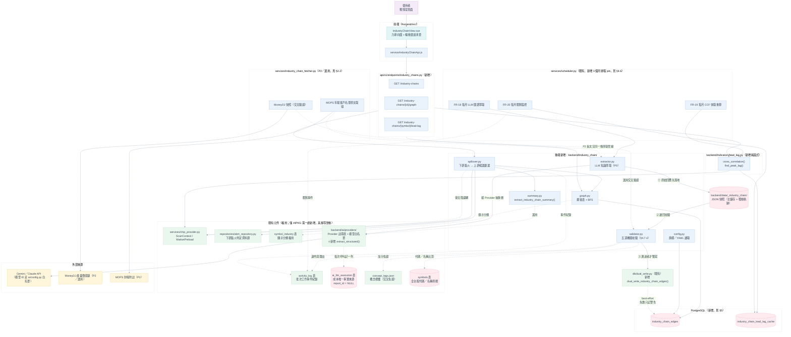
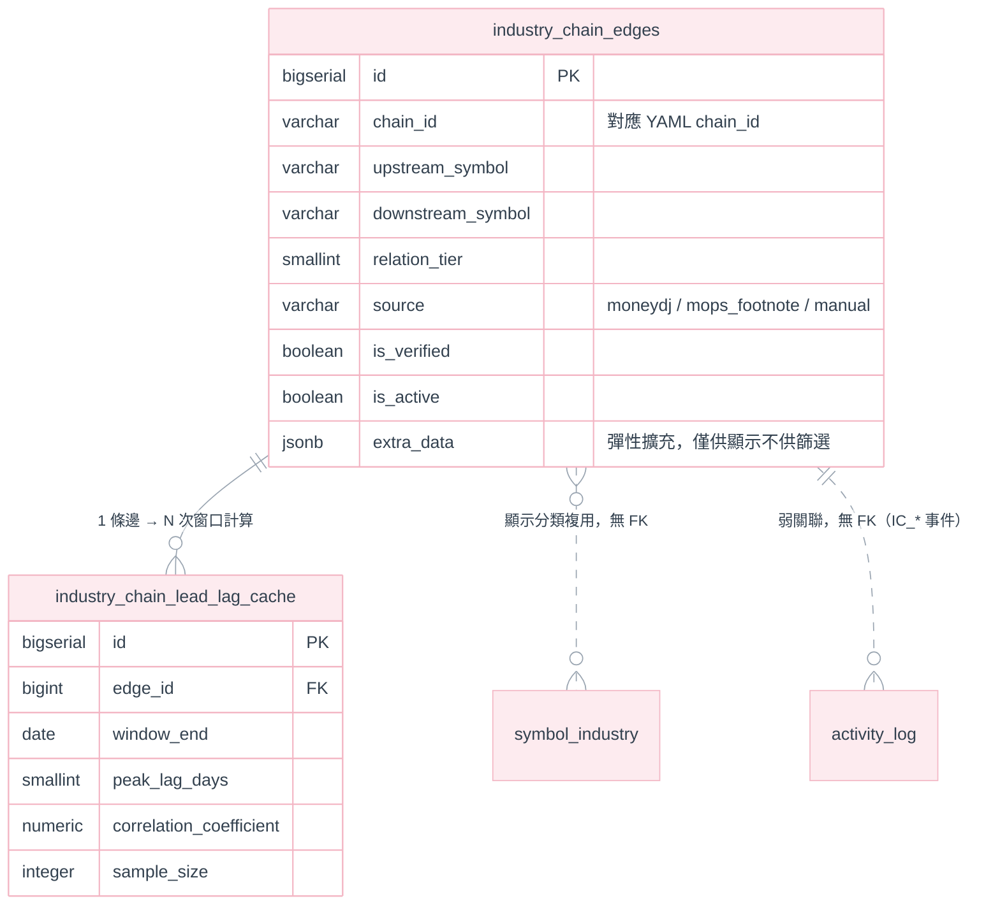

# Phase 3：產業鏈知識圖譜與輪動模型 需求規格書

**模組**：產業鏈知識圖譜與輪動模型（Industry Chain Knowledge Graph & Rotation Model）
**對應既有模組**：[strategies/](../../backend/strategies/)（策略警示引擎）、
[services/chip_provider.py](../../backend/services/chip_provider.py)（`ScanContext`／`MarketPreload`）、
[services/industry_fetcher.py](../../backend/services/industry_fetcher.py) ＋ `symbol_industry` 表（既有產業分類標籤，見 §2.1）、
[services/mops_fetcher.py](../../backend/services/mops_fetcher.py)（MOPS 抓取前例與已知限制，見 §2.2）、
[backend/ai/](../../backend/ai/)（LLM Provider 抽象層／成本閘門／`ai_llm_execution` 成本帳——**本版起升為 P0 主資料來源**，見 §2.5、§4.7）、
[services/concept_tag_service.py](../../backend/services/concept_tag_service.py)（概念股標籤，第四種產業粒度，見 §2.1）
**版本**：v2.7
**日期**：2026-08-30
**狀態**：**需求規格 — 待審核。本文件只定義需求、資料模型與驗收條件，不含程式開發**

**參考文件**
- [AI 技術分析報告 系統開發規格書](AI技術分析規劃.md)（以下簡稱《AI 報告規格》）—— `backend/ai/` package 的 Provider 抽象、成本閘門、`activity_log` 設計前例，本文件多處直接沿用
- [Phase1-基礎量化與技術面.md](Phase1-基礎量化與技術面.md)、[Phase2-籌碼面與基本面量化擴充.md](Phase2-籌碼面與基本面量化擴充.md)（前置階段構想）—— **重要落差說明見 §2.0**
- [股價相對低點 需求規格書](../13.選股功能/股價相對低點.md)（以下簡稱《相對低點》）—— 估值分位數資料缺口、point-in-time 營收判斷、「本專案無回測模組」等結論本文件直接沿用，不重複查證
- [選股功能與爬蟲 整合設計規格書](../13.選股功能/選股功能及爬蟲.md)——`ScanContext`／`MarketPreload` 批次預載機制之母體文件
- [策略管理架構 設計規格書](../1.策略管理模組/策略管理架構-設計規格書.md)——`@condition` 註冊表與條件函式簽章規範
- [大盤指數功能規劃書](../10.加權指數/大盤指數功能規劃書.md) §8.2——`symbol_industry` 產業標籤表的原始設計依據
- [爬蟲開發.md](../3.爬蟲開發/爬蟲開發.md)——TWSE／MOPS 爬蟲的既有節流與容錯慣例
- [概念股標籤分類 規劃書](../17.熱力圖概念股標籤分類/概念股標籤分類_規劃書.md)——人工維護的多對多主題標籤，與本文件的供應鏈圖譜是不同粒度（見 §2.1），但可作為 LLM 萃取結果的交叉佐證（見 §4.7.4）
- [執行歷史頁面開發計劃.md](執行歷史頁面開發計劃.md) §2.1——`ai_llm_execution.view_id`「這次呼叫由哪個功能觸發」的既有欄位與命名慣例

> **文件性質**：原始版本（v1.0，見 §0）是一段從外部貼入、尚未核對本專案現行架構的功能構想清單，寫法與寫作動機和《相對低點》v1.0 被查核前的狀態相同。本版（v2.0）逐項核對現行程式碼與資料現況，標出可直接沿用、需修正、與不可落地之處，並改寫為可審核的需求規格書。

---

## 目錄

| 章節 | 內容 |
|---|---|
| 0 | 修訂紀錄 |
| 1 | 目的與範圍 |
| 2 | 現況盤點與既有系統的分界（避免重複建設） |
| 3 | 系統架構 |
| 4 | 功能需求 |
| 5 | 資料庫設計 |
| 6 | 設定檔與環境變數設計 |
| 7 | API 設計 |
| 8 | 前端設計 |
| 9 | 決議事項（ADR） |
| 10 | 分階段交付 |
| 11 | 驗收準則 |
| 12 | 開放問題 |
| 13 | 風險與限制 |
| 14 | 影響範圍（僅供日後開發估算） |

---

## 0. 修訂紀錄

| 版本 | 變更摘要 |
|---|---|
| v1.0 | 初版構想清單：`industry_chain_edges` 上下游關聯表、CCF 領先落後檢定、動能外溢監控三段式描述。方向正確，但未核對本專案現行的資料層（`DATA_SOURCE` 雙軌、`ScanContext`／`MarketPreload`）、既有產業標籤（`symbol_industry`）、既有爬蟲限制（MOPS WAF）與策略引擎的條件函式簽章，直接照抄會出現架構不相容之處（見 §2） |
| v2.0 | 本次優化：新增 §2 現況盤點（釐清與 `symbol_industry`／`SectorRotationView.vue`／策略引擎的分界）、§9 決議事項（ADR）、資料庫設計改為 Flyway／Postgres-only 慣例並移除與現行 `config.py` 撞名的設定檔路徑、將「動能外溢偵測」拆分為「可沿用既有引擎」與「需要新批次模組」兩部分、標出年報客戶名單解析與跟漲勝率矩陣的資料/工程缺口、補上分階段交付與驗收準則 |
| v2.1 | 併入一份外部審閱意見（自稱 v3.0）中查證屬實的部分，並修正 v2.0 自身一處誤植：(1) **修正** ADR-IC-01 誤把 `symbol_industry` 引用為「Postgres-only」前例——查證 `services/industry_fetcher.py`／`db/dual_write.py` 後，`symbol_industry` 實際是 **JSON 為主、Postgres best-effort 雙寫**（`dual_write_symbol_industry()`），與 `daily_stock_data` 同一套既有慣例；`industry_chain_edges` 的寫入面因此改採同一套慣例（新增 ADR-IC-09），讀取面（圖查詢／BFS）維持需要 Postgres 的結論不變；(2) **新增** `extra_data JSONB` 欄位（比照 `daily_stock_data.market_specific_data` 既有慣例，ADR-IC-10）；(3) **精煉** ADR-IC-06：明確納入「力導向圖截圖 + 多模態 LLM」的構想（呼應既有 ADR-AI-02「AI 看到的圖＝使用者看到的圖」哲學），但**否決**該外部意見提出的具體實作路徑（新開 `/industry-chains/analyze-ai` 端點、寫死過期模型 ID `Gemini 1.5 Pro`／`Claude 3.5 Sonnet`）；(4) **否決**該外部意見的 `system_activity`（非既有表名，應為 `activity_log`）與 `config/industry_chains.yaml`（重現 v2.0 已修正的撞名問題）兩處，理由與逐項評估見對話紀錄 |
| **v2.7** | **FR-10 格蘭傑因果檢定解除延後並實作完成**（使用者明確要求導入，解除 ADR-IC-05 原「待 CCF 證明有實用價值後再評估」的延後條件，§12 Q-4 結案）。**新增 ADR-IC-22**：記錄解除理由、Benjamini-Hochberg 多重比較校正的批次範圍決策（同一次執行涵蓋的全部配對一起校正，globally 而非分鏈各自校正——分鏈校正會讓每次校正的檢定數 `m` 變小、稀釋校正力度，與 §13 風險 2「多重比較問題」的原始目的相違）、資料儲存位置（沿用既有 `industry_chain_lead_lag_cache`，新增 4 個 nullable 欄位而非新表，V20 遷移）、排程方式（併入既有 FR-19 CCF 月排程之後執行，不新增排程時段／FR 編號）。**同步修正**：(1) §2.4 相依套件評估表移除「Granger 延後」的舊結論，改記錄 `statsmodels` 已實際導入；(2) FR-10（§4.2）移除「P2／延後」標記，改記錄實作狀態與 ADR-IC-22 交叉引用；(3) §10 分階段交付的 P2 移除 FR-10 這一項；(4) §12 Q-4 標記已結案。**ADR-IC-05 本身保留原文不刪**，只標註「已被 ADR-IC-22 取代」，比照本文件既有慣例（ADR 決策一旦寫下即為歷史紀錄，後續修正一律以新增／標註取代方式處理，不回頭改寫既有 ADR 正文）。實作細節：`indicators/lead_lag.py`（`granger_causality()`／`benjamini_hochberg_correction()`）、`industry_chain/lead_lag_job.py`（`compute_granger_for_all_edges()`）、`repositories/industry_chain_repository.py`（`update_granger_result()`）、`services/scheduler.py`（併入既有 FR-19 排程函式）——已對真實本地 Postgres 端到端驗證（含一組刻意製造的 BH 校正案例：原始 p=0.0355 校正後為 0.0966，由「顯著」變為「不顯著」），驗證資料驗證後已清除 |
| **v2.6** | **雛形畫面走查後的兩項優化**：(1) **視覺化可行性評估**——雛形以擴充至 20+ 節點的 `ai_server` 鏈（貼近 §13 估算的「每鏈 20～50 檔標的」規模）實測分層 SVG 布局，結論是**在此規模下不需要真正的力導向物理模擬即可保持可讀**（節點多跳路徑追蹤高亮＋自訂懸浮提示已能清楚呈現關聯，見 ADR-IC-20），但明確標出上限：邊數與節點數若再成長一個數量級（§12 Q-3 的分層粒度風險），分層布局會開始擁擠，屆時才需要評估真正的 ECharts 力導向模擬。(2) **新增「轉為投資筆記」整合**（FR-21）：力導向圖、單一關聯、節點路徑三種範圍皆可一鍵轉出為 Markdown 並帶 Mermaid 圖，直接呼叫既有 `POST /api/v1/investment-notes`（**零後端改動**）；查證 [V16](../../backend/db/migration/V16__Create_investment_notes.sql)／[V17](../../backend/db/migration/V17__Relax_investment_note_symbol_pair_check.sql) 遷移後發現 `investment_note.symbol` 是**單一欄位**，只能綁定一個錨點標的——這是本次整合唯一需要使用者決策的取捨點（ADR-IC-20）。Mermaid 圖表的「淡色系」要求，沿用本頁既有的節點三態色票而非 §3.0 的架構圖色票，理由是語意對應更正確、且查證前端 `MarkdownPreview.vue` 的 `.mermaid-diagram` 容器背景固定白色、不隨深色模式切換，淡色節點在此背景上更可讀（ADR-IC-21） |
| **v2.5** | **MCP／agentic tool loop 評估與否決**：回應「是否可引入 MCP 或 tools 讓 LLM 驅動上網查詢」。結論是**分三種形態、只採用其中一種**——(A) Provider 原生檢索工具（v2.4 §4.7.7 已採用）、(B) 我們自建 agentic tool loop、(C) MCP，後兩者 P0～P1 **不採用**（新增 §4.7.8、ADR-IC-19）。**最具決定性的理由與本專案既有設計直接相關**：現行「一次邏輯萃取＝一次實體呼叫＝`ai_llm_execution` 一列」是 `IC_LLM_MONTHLY_CALL_CAP`（ADR-IC-13，本模組唯一的花費天花板）能夠成立的前提；多輪 tool loop 會讓一次萃取變成不確定次數的呼叫、且每輪重送整段對話使 token 隨輪次二次成長，該閘門的語意會從「最多花這麼多」退化成「最多啟動這麼多次不知道會花多少的迴圈」——要修得連帶改動 `ai_llm_execution` 的粒度與成本帳結構，代價遠超過它解決的問題。**同時記錄一個被否決但值得日後重審的替代方案**：以「收斂範圍後的代碼清單直接放進 Stage B 輸入」取代 `lookup_symbol` 工具，不需要任何 agent 迴圈即可降低校驗二的退件率——列為 P1 依實測退件率再決定（§4.7.8、Q-9），並說明它與 §4.7.3「刻意不把全市場 1,800 檔塞進 Prompt」為何不衝突。**新增 Q-10**（MCP 在本專案真正適合的位置，在 Phase 3 之外） |
| **v2.4** | **兩段式 grounded 萃取（回應「能否讓 LLM 先查新資料再分析」）**：v2.3 把知識截止日列為最大實質限制（§13.6）並開為 Q-6；本版定案採**兩段式檢索增強萃取（RAE）**——Stage A 開檢索工具產生帶引用的研究結果、Stage B 不開工具但強制 `response_schema` 做結構化萃取（新增 §4.7.7、ADR-IC-17）。**關鍵釐清**：這件事**不是**靠「加強 Prompt」達成的——對一個沒有檢索工具的呼叫寫「請查最新資料」，模型只會用記憶回答並顯得更有信心，是**負向**改動；真正的差別在呼叫參數（`tools=`），不在提示詞文字。**另查出一處既有程式碼會被 grounding 打破的假設**：`api/v1/endpoints/ai_analysis.py` 的 `_estimate_cost()` 只吃 `(model, input_tokens, output_tokens)`，而檢索工具在兩家 Provider 都可能按次計價、不反映在 token 數上 → 若照現況導入，`ai_llm_execution.estimated_cost_usd` 會**系統性低估**，違反 ADR-AI-17「成本唯一事實來源」的本意（新增 ADR-IC-18）。**Q-6 結案**（改列 P1 交付），**新增 Q-8**（檢索來源是否需網域白名單） |
| **v2.3** | **導入 LLM 知識萃取（本次優化）**：把 P0 的資料來源從「爬 MoneyDJ HTML」改為「設計 Prompt 呼叫 LLM 做結構化知識萃取」，直接消除 v2.2 中唯一的 P0 阻塞項（§12 Q-1 的 ToS／反爬風險）。同時逐項核對 `backend/ai/` 的**實際程式碼**（非僅憑《AI 報告規格》文件），修正三處外部構想與現行實作不符之處：(1) 既有 `AIProvider.analyze()` 的簽章是**圖片必填**且把 `response_schema` 寫死為 `LLMAnalysisReport`，**無法**直接承接純文字知識萃取，需新增一個 `extract_structured()` 方法（§2.5、ADR-IC-12）；(2) 外部構想所稱「同時受 `AI_DAILY_QUOTA` 費用控管」**不成立**——該閘門實際是 `ai_report_repository.count_succeeded_today()` 對 `ai_analysis_report` 的計數，本模組不產生報告列，既不受其限制也不會消耗使用者的每日診股額度，因此必須自備模組級上限（§2.5、ADR-IC-13）；(3) `ai_llm_execution.report_id`／`symbol`／`trade_date` 皆**可為 NULL**（[V14 遷移](../../backend/db/migration/V14__Create_ai_analysis_tables.sql) 已查證），因此成本帳這一層**可以**原樣複用，「成本單一事實來源」的既有原則不受影響。**新增章節**：§2.5（`backend/ai/` 可複用性盤點）、§4.7（LLM 知識萃取管線規格：Prompt、輸出 schema、五道機器校驗、快照 ELT）。**新增 ADR**：ADR-IC-11～ADR-IC-16。**其他查核修正**：(4) §2.1 的「三個粒度」漏列 2026 年新增的**概念股標籤**（`concept_tags.json`，docs/17）——現行 `ai` 標籤已含 2330／2317／2382／3231／6669，與本文件 `ai_server` 鏈的範例節點高度重疊，不寫清楚分界必然被誤認為重複功能；(5) **遷移編號撞號**：v2.2 寫「現行最新為 V16、本文件新增 V17」，但 `V17__Relax_investment_note_symbol_pair_check.sql` 與 `V18__Add_view_id_to_ai_llm_execution.sql` 皆已存在並套用，本文件的遷移一律改為 **V19** |
| v2.2 | **自我查核版**：v2.1 只改了 §5.1 一處，卻沒有把同一個修正推到文件其餘引用點，造成三處**文件內互相矛盾**——本版逐一修正，並補上四個原本缺漏的規格章節。**修正矛盾**：(1) ADR-IC-01 仍寫著「比照 `symbol_industry` 既有先例」，正是 v2.1 宣稱已修掉的誤植，已改寫為讀／寫分離的正確敘述；(2) FR-1 仍寫「Postgres-only」，與 §5.1 的雙寫結論衝突；(3) **AC-IC-5 與 §5.1 直接互斥**——前者要求「`DATA_SOURCE=json` 時本功能整體自我停用」，後者明訂「不受 `DATA_SOURCE` 影響」，已改以「Postgres 可用性」為唯一判準；(4) §3.1 架構圖漏畫 v2.1 新增的 JSON 快照層；(5) FR-17 新增後未編入 §10 分階段交付與 §14 影響範圍。**補上缺漏**：(6) 新增 §4.6 排程與批次作業——FR-8 的 CCF 快取、FR-9 的脫鉤監控原本都只說「要算」卻沒定義**何時由誰觸發**；(7) 新增 §6.2 環境變數設定——§7 早已引用 `IC_DISABLED` 錯誤碼，但全文從未定義過這個功能旗標叫什麼；(8) 新增 CCF 最小樣本數門檻（原本 `sample_size` 欄位存在卻無判準）；(9) §1.4 補上 `relation_tier`（圖層級）與「低位階」（價格位階）的**術語衝突警告** |

---

## 1. 目的與範圍

### 1.1 目的

量化台股產業鏈上下游的價格傳導路徑與時間差，將現有「單一標的獨立分析」升級為「同一產業鏈內標的的關聯分析」，在下游龍頭發動時，從其上游候選中篩出「同期尚未反應、基本面未轉壞」的補漲名單，作為既有選股／警示體系的第四種訊號來源（技術面、籌碼面、基本面之外的「關聯面」）。

### 1.2 範圍

| 範圍內 | 範圍外（本文件不涵蓋） |
|---|---|
| 產業鏈上下游關聯的資料模型與設定檔規格（§5、§6） | 程式開發、YAML／SQL 實際套用（本文件只給規格範本） |
| CCF 領先—落後量化引擎的需求與資料前置條件（§4.2） | CCF／Granger 演算法的實作細節與參數尋優（工程階段自行決定） |
| 動能外溢篩選邏輯的需求，及其與既有策略引擎的整合方式（§4.3） | 自動下單、資金配置（本專案無此類模組，比照《相對低點》ADR-RL-06） |
| API／前端視覺化需求（§7、§8） | UI 視覺稿（可另立原型，比照《相對低點》§10.3 的 `prototype/` 慣例） |
| **LLM 知識萃取管線**的需求、Prompt 規格、輸出 schema 與機器校驗規則（§4.7） | Prompt 的實際調校與 few-shot 迭代（工程階段依實測結果自行決定） |
| MoneyDJ／MOPS 兩個資料來源的**可行性評估與風險**（本版起降為選用交叉驗證，見 §2.2） | 實際爬蟲程式碼；來源本身的合法性／ToS 判斷需使用者確認（§12 Q-1，本版起**不再是 P0 阻塞項**） |
| **回測式**「跟漲勝率」統計的**簡化需求**（§4.3.3） | 嚴謹回測框架（本專案無回測模組，見《相對低點》§1.2，本文件不新建） |

### 1.3 市場範圍

**本文件僅涵蓋台股（TW）**。理由：動能外溢篩選所需的「估值分位數」「營收未衰退」「三大法人／融資」皆為台股限定資料（`ctx.valuation`／`ctx.revenue_yoy`／`indicators/chip.py`，見 CLAUDE.md「多市場抽象」一節），美股沒有等價來源。產業鏈本身雖可能實質跨市場（例如美系 IC 設計上游、台系代工下游），但本文件的圖譜節點與篩選邏輯**只處理台股節點**；跨市場邊留作 §12 Q-2 開放問題。

### 1.4 名詞

| 名詞 | 本文件的定義 |
|---|---|
| 產業鏈（chain） | 一組具備進銷貨關係的標的集合，如「AI 伺服器鏈」「半導體鏈」，對應 §6.1 YAML 的一個 `chain_id` |
| 上游／下游 | 依供應鏈方向定義的相對關係；同一檔標的在不同鏈中可能同時是甲鏈的下游、乙鏈的上游 |
| 領先—落後（lead-lag） | 兩檔標的報酬率序列在特定延遲天數 `k` 下的相關性最強；本文件以 CCF 量化 |
| 動能外溢（momentum spillover） | 下游標的發動後，動能傳導至上游標的、帶動補漲的現象 |
| **價格位階**（低位階候選） | 下游已發動、但自身尚處於盤整／未上漲，因此存在補漲空間的上游標的。**「位階」一律指價格／估值的高低**，與供應鏈的第幾層無關 |
| **關聯層級**（`relation_tier`） | 供應鏈上距離下游幾層（1 = 直接上游，2 = 次一層）。**「層級」一律指圖上的距離**，與價格高低無關 |
| 脫鉤（decoupling） | 上游標的與其所屬產業鏈的價格關聯性長期低於門檻，過去有效的傳導路徑失效 |

> **術語衝突警告**：中文的「位階」與「層級」、英文的 tier 在本文件裡指**兩件完全不同的事**——`relation_tier` 是圖結構上的距離，「低位階」是價格便宜與否。FR-11（BFS 收集 `tier ≤ N`）與 FR-12～FR-14（低位階濾網）是**前後兩個獨立步驟**：先用**關聯層級**圈出候選範圍，再用**價格位階**篩掉已經漲上去的。撰寫程式或後續文件時，變數命名建議一律用 `relation_tier` / `price_position` 兩個不同的字根，避免混用單一個 `tier`。

---

## 2. 現況盤點與既有系統的分界（避免重複建設）

### 2.0 與 Phase 1／Phase 2 文件的關係（重要落差說明）

Phase 1／Phase 2 文件描述的部分模組名稱（`TWSEProvider`／`YahooProvider` 抽象基底類別、兩段式 `data/raw/` → Parquet 落地、獨立的 `stock_daily_chips` 資料表）**與本專案實際落地的架構不一致**：現行爬蟲是 `services/fetcher.py`（TWSE）／`services/us_fetcher.py`（yfinance）兩支具體模組，落地為 `backend/data/{tw,us}/<symbol>.json`，法人與融資券資料是併入 `daily_stock_data.market_specific_data`（JSONB 欄位，見 [V1 遷移](../../backend/db/migration/V1__Create_symbols_and_daily_data.sql)），不是獨立的 `stock_daily_chips` 表；儲存亦無 Parquet 層。本文件**不依賴** Phase 1／Phase 2 文件裡尚未落地的模組名稱，一律以 CLAUDE.md 與本章 §2.1～§2.4 核對過的現行架構為準。Phase 1／Phase 2 文件本身是否需要同步修正，不在本文件範圍內。

### 2.1 與既有 `symbol_industry`／`SectorRotationView.vue` 的分界

專案已有**三個**「產業／主題」相關的既有功能，**與本文件的產業鏈圖譜是四個不同粒度的概念**，必須在文件與 UI 用語上明確區分，否則會讓使用者誤以為是重複功能（v2.2 只列出三個，漏了概念股標籤，本版補上）：

| 既有／新增 | 粒度 | 資料 | 用途 |
|---|---|---|---|
| `symbol_industry` 表（[V6](../../backend/db/migration/V6__Create_symbol_industry.sql)／[V7](../../backend/db/migration/V7__Widen_symbol_industry_code.sql) 遷移，`services/industry_fetcher.py`） | 個股 → 單一產業分類標籤 | TWSE 官方產業分類代碼（靜態，無方向性） | 熱力圖／投組配置圓餅圖分組 |
| `SectorRotationView.vue`（既有頁面） | **類股指數**（大盤子指數）層級 | 各類股指數對 TWII 的 alpha／動能排名 | 「哪個產業類股正在相對強勢」的巨觀輪動 |
| **概念股標籤**（`services/concept_tag_service.py`、`data/{market}/_meta/concept_tags.json`，見 [docs/17 規劃書](../17.熱力圖概念股標籤分類/概念股標籤分類_規劃書.md)） | 個股 ↔ 主題標籤，**多對多、無方向性** | **人工維護的 JSON 種子檔**（無公開資料源可抓，規劃書 ADR-CT4） | 熱力圖／清單的主題式分組（「AI」「CPO矽光子」「記憶體」…） |
| **本文件：`industry_chain_edges`（新增）** | **個股對個股**的**有向**供應鏈關聯 | 上游／下游具體標的、關聯層級、傳導時差 | 「這檔下游發動後，該去看哪幾檔上游」的微觀傳導 |

`industry_chain_edges` 可**沿用** `symbol_industry.industry_name` 作為圖譜節點的顯示分類（不必重建產業字典），但**不得**把四者的資料表或 UI 頁面合併——分類標籤是靜態的一對一標籤，類股輪動是指數層級排名，概念標籤是人工維護的無向主題集合，供應鏈關聯是個股對個股的有向邊，四者的更新頻率、資料來源、查詢語意都不同。

> **與概念股標籤的重疊必須講清楚**：現行 `data/tw/_meta/concept_tags.json` 的 `ai` 標籤已包含 2330、2317、2308、2382、3231、2454、3661、6669，與 §6.1 範例中 `ai_server` 鏈的節點高度重疊。**兩者不是重複功能，差別在「有沒有方向」**：概念標籤只回答「這幾檔都算 AI 概念」，供應鏈邊回答「2382 的散熱模組是向 3017 買的」——後者才撐得起「下游發動 → 該看哪幾檔上游」的推論，前者做不到。實作上**不得**把 `concept_tags.json` 當成 `industry_chain_edges` 的替代或來源表；但它是一份**人工已核可的標的集合**，可作為 §4.7.4 校驗 LLM 萃取結果的交叉佐證（LLM 給出的上游若同時落在該鏈對應的概念標籤內，是加分訊號而非判定依據）。

### 2.2 資料來源可行性查核（v2.3 重新評估：改以 LLM 知識萃取為 P0 主來源）

v2.2 把 MoneyDJ 爬蟲列為 P0 主來源，同時把「來源是否合法可用」列為 **P0 阻塞項**（Q-1）——也就是整個 Phase 3 的第一步卡在一個本專案無法自行解決的外部條件上。本版改以 **LLM 結構化知識萃取**取代之，該阻塞項隨之消失。

| 面向 | MoneyDJ HTML 爬蟲（v2.2 的 P0） | **LLM 知識萃取（v2.3 的 P0）** | 結論 |
|---|---|---|---|
| 合法性與穩定度 | 非官方頁面，結構改版或反爬蟲即失效；ToS 未決（Q-1） | 官方付費 API，無反爬蟲與 IP 封鎖問題，不觸及第三方站台 ToS | ✅ **P0 阻塞項消除**，維護成本大幅下降 |
| 非結構化長文解析（原 FR-4／P2） | 需自建 PDF 文字擷取或 XBRL taxonomy 解析器 | 長文理解是 LLM 的原生能力，餵入財報附註文字即可輸出客戶名單 | ✅ 讓 P2 的 MOPS 客戶名單從「獨立子專案」降回「同一支 Prompt 換一份輸入」 |
| 工程量 | 一支爬蟲 ＋ 一套 HTML 選擇器 ＋ 長期跟著改版維護 | 複用既有 `backend/ai/` Provider 抽象層，新增一支 Prompt ＋ 一組 schema ＋ 一層校驗 | ✅ 淨減少 |
| 資料正確性 | 忠實反映來源，來源本身可能有錯，但**可追溯到一個網址** | **有幻覺風險**，且受模型知識截止日限制；無天然的佐證連結 | ⚠️ 必須靠 §4.7.4 的機器校驗 ＋ `is_verified` 人工核對把關（ADR-IC-14） |
| 時效性 | 網頁多久更新就多久 | **模型訓練資料截止日之前的產業共識**；截止日之後的新供應商、被換掉的供應商一律看不到 | ⚠️ 這是本方案**最大的實質限制**，見 §13.6 與 ADR-IC-15 |
| 量化時序運算（CCF／領先落後天數／勝率） | 不適用（爬蟲只取回原始資料） | **一律禁止交給 LLM** | 🛑 見 ADR-IC-11 |

**分工原則（本版核心決策）**：**LLM 只負責「這張圖有哪些節點與哪些邊」（知識萃取），不負責「這條邊的數值是多少」（量化計算）**。CCF、`peak_lag_day`、相關係數、跟漲勝率、脫鉤判定一律仍由 `indicators/lead_lag.py` 的純函式與 SQL 統計產出——語言模型沒有精確計算能力，讓它輸出一個「領先 7 天」的數字，等於把一個可驗證的統計量換成一句不可驗證的臆測（ADR-IC-11）。

**兩個舊來源的新定位**：

| 來源 | v2.2 定位 | v2.3 定位 |
|---|---|---|
| MoneyDJ 產業價值鏈 | P0 主來源（阻塞於 Q-1） | **選用的交叉驗證來源**（P2）。若日後使用者確認 ToS 可行，其價值不在「取代 LLM」而在**自動提升信心**：同一條邊若 LLM 與 MoneyDJ 各自獨立產出，可自動翻 `is_verified=TRUE`，省下人工核對（見 ADR-IC-16）。爬取失敗須容錯降級（比照 `mops_fetcher.py` 對單一請求被擋不可中斷整體排程的既有慣例），**不得**中斷既有的每日爬蟲／掃描排程 |
| MOPS 財報附註「主要進銷貨客戶」（佔營收 10% 以上） | P2 獨立子專案（需自建 PDF／XBRL 解析器） | 仍是 P2，但**工程量大幅下降**：取得財報文字後交由同一條 LLM 萃取管線處理（換一份 User Prompt 與 `source` 值即可），不需要自建解析器。**取得**財報原文這一段仍需面對 `mops_fetcher.py` 檔頭註解記載的官方 WAF，這部分沒有因為導入 LLM 而變簡單，仍是 P2 的主要成本 |

> **這是「換掉來源」，不是「換掉架構」**：`industry_chain_edges` 的資料模型（§5.2）、CCF 引擎（§4.2）、外溢篩選（§4.3）、API／前端（§7、§8）全部不因本次變更而改動。變的只有 `industry_chain/extractor.py` 內部「這批邊從哪裡來」，以及隨之而來的校驗與稽核要求。

**寫入面應沿用既有「JSON 為主、Postgres best-effort 雙寫」慣例**：LLM 萃取的回應**每次都可能不同**（§13.7 非決定性），且是要花錢才拿得到的結果——保留每次呼叫的原始回應快照，比 v2.2 的爬蟲情境更有價值：解析或校驗邏輯事後改動時可直接重跑歷史快照，不必重新計費呼叫一次。本專案對這種「結構性／非逐日行情」資料**已有現成前例**：`services/industry_fetcher.py` 抓到 `symbol_industry` 資料後，是先呼叫 `save_industries_json()` 落地 JSON（`backend/data/` 下，讀取端 `GET .../industries` 也是直接讀這份 JSON，並非讀 Postgres），再呼叫 `db/dual_write.py` 的 `dual_write_symbol_industry()` best-effort 寫入 Postgres，失敗只記警告、不影響 JSON 這條主流程。`industry_chain/extractor.py` 應比照同一組函式風格新增 `dual_write_industry_chain_edges()`，JSON 快照存放路徑比照既有 `repositories/alert_repository.py` 的 `DATA_DIR/_alerts/` 慣例，放在 `backend/data/_industry_chain/`（詳見 ADR-IC-09、§4.7.3）。

### 2.3 與策略引擎（`strategies/`）的架構適配性

既有 `strategies/scanner.py` 的 `@condition` 簽章固定為 `(ctx: ScanContext, idx: int, params: dict) -> list[dict] | None`（見《策略管理架構-設計規格書》）——**單一標的、單一時間點**。這個簽章能表達的範圍，與本文件的兩類需求對照如下：

| 需求 | 是否落在既有簽章內 | 處置 |
|---|---|---|
| 「下游龍頭是否觸發帶量突破／法人連買」 | ✅ 可以。這就是既有引擎的日常工作 | **不新增偵測邏輯，直接查詢既有 `alert_repository`**（見 §4.3.1、ADR-IC-03），比照通知平台已有的事件來源 |
| 「CCF／Granger：兩檔標的的歷史序列互相比較」 | ❌ 不行。條件函式一次只看得到自己的 `ctx`，看不到另一檔標的的序列 | 需要**跨標的**的批次運算模組，不能靠新增一個 `@condition` 完成（§4.2、ADR-IC-02） |
| 「BFS 找上游候選 → 套用低位階濾網 → 輸出清單」 | ❌ 不行。這是跨圖結構的批次查詢，不是逐檔逐日掃描 | 獨立批次模組，比照 `backend/ai/` 在既有系統之上新增自成一格套件的前例（§3、ADR-IC-02） |

### 2.4 新增相依套件評估

| 需求 | 是否需要新套件 | 結論 |
|---|---|---|
| CCF／Granger 因果檢定 | `scipy.stats`／`statsmodels`，現行 `requirements.txt`（見 [requirements.txt](../../backend/requirements.txt)）未包含 | 需新增。CCF 以 `scipy.stats.pearsonr` 滾動視窗計算。**v2.7 更新**：Granger 檢定原訂延後到證明 CCF 有實用價值後再評估（§12 Q-4），該延後已由使用者明確解除，`statsmodels`（`grangercausalitytests`／`multipletests`）已實際導入，見新增 **ADR-IC-22**、FR-10（§4.2） |
| BFS 圖遍歷 | `networkx` | **不需要**。單一產業鏈通常僅數十檔標的，鄰接表用純 Python `dict[str, list[str]]` 即可完成 BFS，符合專案「非必要不新增重依賴」的既有慣例（`indicators/`／`strategies/` 皆為純函式與內建資料結構） |
| LLM 呼叫（§4.7） | `google-genai`／`anthropic` | **不需要新增**。[requirements.txt](../../backend/requirements.txt) 已因 AI 診股模組同時安裝這兩個 SDK；本模組經 `ai/providers/` 抽象層使用，不直接 import SDK |

### 2.5 `backend/ai/` 的可複用性盤點（導入 LLM 前必讀）

導入 LLM 之前必須先回答一個問題：**既有的 `backend/ai/` 到底有多少能直接拿來用？** 下表逐項核對**現行程式碼**（不是只看《AI 報告規格》的文字），因為外部構想中有三處「複用既有機制」的假設，經查證與實作不符。

| 既有元件 | 現行實作 | 本模組可否直接複用 |
|---|---|---|
| `ai/providers/__init__.py` 的 `PROVIDER_REGISTRY` ＋ `get_provider(code)` | `@ai_provider` 裝飾器自我註冊，比照 `notify/channels/` 慣例 | ✅ **可直接複用**。本模組依 `IC_LLM_PROVIDER` 取 Provider，不自建第二套註冊表 |
| `ai/config.py` 的 `*_SELECTABLE_MODELS` 白名單、`is_valid_model()`、`get_model_pricing()` | 程式碼白名單（ADR-AI-22）＋ 每百萬 token 定價表 | ✅ **可直接複用**。本模組的模型 ID 一律經此白名單驗證，文件與程式碼**不得**寫死模型字面值（ADR-AI-12） |
| `ai/errors.py` 的例外階層 | `AIProviderMisconfiguredException`／`AIRateLimitedException`／`AITimeoutException`… | ✅ **可直接複用**，本模組不另定義一套 LLM 錯誤型別 |
| `ai_llm_execution` 表（成本唯一事實來源，ADR-AI-17） | 查證 [V14 遷移](../../backend/db/migration/V14__Create_ai_analysis_tables.sql)：`report_id BIGINT REFERENCES ... ON DELETE SET NULL`（**可為 NULL**）、`symbol`／`market_type`／`trade_date` 亦皆可為 NULL；`AIExecutionRepository.start()` 的 `report_id` 型別已是 `int \| None` | ✅ **可直接複用**。本模組以 `report_id=NULL`、`view_id="industry_chain_extract"` 寫入，成本統計與執行歷史頁面自動涵蓋本模組的呼叫，**「成本單一事實來源」原則不被破壞**（ADR-IC-13） |
| `activity_log` 表（ADR-AI-18） | 通用事件表，以 `code` 前綴區隔模組 | ✅ **可直接複用**。⚠️ 注意 `code VARCHAR(30)` 的長度上限，`IC_*` 事件碼須在 30 字元內 |
| **`AIProvider.analyze()`** | 簽章為 `analyze(image_base64: str, system_prompt, user_prompt, model)`——**圖片為必填位置參數**，且兩個 Provider 內部都把結構化輸出 schema **寫死**為 `LLMAnalysisReport`（Gemini 端 `response_schema=LLMAnalysisReport`、Claude 端 `output_format=LLMAnalysisReport`） | ❌ **不能直接複用**。純文字的知識萃取沒有圖片，輸出也不是技術分析報告。處置：在 `AIProvider` 基底類別新增一個**非抽象**方法 `extract_structured(system_prompt, user_prompt, response_schema, model)`，預設拋不支援例外，再於兩個 Provider 各實作一份——`analyze()` **完全不動**，既有診股功能零回歸風險（ADR-IC-12） |
| **`ai/guard.py` 的 `resolve_report_slot()`** | 閘門 2～5 全部繞著 `ai_analysis_report` 的唯一鍵 `(market_type, symbol, trade_date, provider, model)` 與 `chart_period`／`chart_months`／`chart_start_date`／`chart_end_date` 參數打轉 | ❌ **不能複用**。一次產業鏈萃取沒有 `symbol`、沒有 `trade_date`、沒有圖表視角；硬要塞進去只能捏造假值並在 `ai_analysis_report` 產生語意錯誤的列。處置：本模組自備一組輕量閘門（§4.7.5） |
| **`AI_DAILY_QUOTA`** | 查證 `ai_report_repository.count_succeeded_today()`：`SELECT COUNT(*) FROM ai_analysis_report WHERE status='succeeded' AND generated_at::date = CURRENT_DATE` | ❌ **外部構想所稱「同時受 `AI_DAILY_QUOTA` 費用控管」不成立**。該閘門只數 `ai_analysis_report` 的列；本模組不產生報告列，因此**既不受它限制，也不會消耗使用者當日的診股額度**。這其實是好事（每月一次的批次不該吃掉使用者手動診股的配額），但代價是**必須自備模組級上限**，否則本模組的呼叫完全沒有天花板（`IC_LLM_MONTHLY_CALL_CAP`，見 §4.7.5、ADR-IC-13） |
| `ai/prompt.py` 的 `SYSTEM_PROMPT` | 個股技術分析專用，內容與產業鏈無關 | ❌ 不複用內容，但**沿用其兩條既有寫作原則**：① Prompt 內不得出現硬編碼的策略門檻；② 提示詞版本以常數管理（本模組用 `IC_LLM_PROMPT_VERSION`，寫入 `ai_llm_execution.prompt_version`） |

**一句話結論**：**可複用的是「呼叫 LLM 的基礎設施」（Provider 註冊表、模型白名單、錯誤型別、成本帳、事件帳），不可複用的是「AI 診股報告的業務語意」（`analyze()` 的圖片必填簽章、`ai_analysis_report` 唯一鍵、每日配額）。** 這條界線同時解釋了為什麼 ADR-IC-06 當初否決 `POST /industry-chains/analyze-ai` 卻不影響本次決策——見 ADR-IC-11 的辨析。

---

## 3. 系統架構

### 3.0 圖例色票（沿用《AI 報告規格》§3.0 統一色系）

| 語意 | 填色 | 邊框 |
|---|---|---|
| 外部系統 | `#FFF6DC` | `#E8D48B` |
| 核心處理 | `#EAF2FB` | `#9EC2E6` |
| 既有可複用元件 | `#EAF7EE` | `#B7E0C4` |
| 資料儲存／閘門 | `#FDEBEF` | `#F3B6C4` |
| 介面 | `#E4F5F7` | `#A5D8DF` |
| 使用者 | `#F4EAF8` | `#CDA9DC` |

### 3.1 全景架構圖



### 3.2 相依方向約束

```
api/v1/endpoints/industry_chains.py
        ↓
    industry_chain/config.py ──→ industry_chain_config/industry_chains.yaml
        ↓
    industry_chain/graph.py ──→ repositories/industry_chain_repository.py ──→ db/session.py（既有）
        ↓
    industry_chain/extractor.py ──→ ai/providers/（既有註冊表 get_provider()）
        │                        ──→ ai/config.py（既有模型白名單／定價）
        │                        ──→ ai/errors.py（既有例外型別）
        │                        ──→ repositories/ai_execution_repository.py（既有成本帳，report_id=NULL）
        ↓
    industry_chain/validator.py ──→ repositories/stock_repository.py（既有，symbols 代碼／名稱核對）
        │                        ──→ services/concept_tag_service.py（既有，加分佐證）
        ↓
    industry_chain/extractor.py ──→ db/dual_write.py（既有，新增 dual_write_industry_chain_edges()）
        ↓
    industry_chain/spillover.py ──→ repositories/alert_repository.py（既有，下游點火判定）
        ↓                          services/chip_provider.py（既有，ScanContext／MarketPreload）
    indicators/lead_lag.py（新增純函式，不吃 DB，比照 moving_average.py／chip.py 慣例）
```

**禁止的反向相依**：`strategies/`／`services/chip_provider.py`／`indicators/`（既有部分）**不得 import `industry_chain/`**——與 CLAUDE.md 對 `ai/` 套件的既有原則一致，新模組是既有資料流之上的消費者，不得反向耦合。**`backend/ai/` 亦不得 import `industry_chain/`**：本模組是 `ai/` 的消費者，`ai/` 對本模組的存在應完全無感（唯一例外是 ADR-IC-12 於 `AIProvider` 基底新增的泛用 `extract_structured()`——其參數是 `response_schema` 而非任何產業鏈型別，不構成反向相依）。

**LLM 呼叫邊界**：`industry_chain/` 內**不得**直接 import `anthropic`／`google.genai`，一律經 `ai/providers/get_provider()`（比照上面的 SQL 邊界原則）。理由與 ADR-AI-05 相同：金鑰存在與否、SDK 裝了沒，只能在 `ai/providers/` 一處被處理，散出去就會出現「沒裝 SDK 的部署開不了服務」這種既有規格書已修過一次的回歸（見《AI 報告規格》D-03）。

**SQL 邊界**：`industry_chain/` 套件內不得直接操作 SQLAlchemy session，一律經 `repositories/industry_chain_repository.py`（比照 `ai_report_repository.py`／`notify_repository.py` 慣例）。

---

## 4. 功能需求

### 4.1 產業鏈知識圖譜管線

| # | 需求 | 說明 |
|---|---|---|
| FR-1 | 建立 `industry_chain_edges` 資料表 | 讀取面走 Postgres（ADR-IC-01）、寫入面採 JSON 快照 ＋ best-effort 雙寫（ADR-IC-09）；欄位規格見 §5.2 |
| FR-2 | 設定檔驅動的產業鏈骨架 | `industry_chain_config/industry_chains.yaml` 定義 `chain_id`／顯示名稱／`lead_lag_window`／哪些標的視為該鏈的「下游龍頭」；**目錄命名比照 `strategy_config/`，避開與 `backend/config.py` 撞名**（見該檔案頭既有註解），路徑不採原始構想的 `config/industry_chains.yaml` |
| **FR-3** | **LLM 產業鏈知識萃取（P0 主來源，v2.3 取代原 MoneyDJ 爬蟲）** | `industry_chain/extractor.py`：依 §6.1 YAML 的每條鏈組一份 Prompt，經 `ai/providers/` 呼叫 LLM 取得結構化的上下游邊集合。完整規格（System／User Prompt、輸出 schema、失敗處理）見 **§4.7**。**不再有 P0 阻塞前置條件**（原 §12 Q-1 隨 MoneyDJ 降級為選用而解除） |
| **FR-3a** | **萃取結果的機器校驗** | `industry_chain/validator.py`：LLM 回傳的每一筆邊都必須通過 §4.7.4 的**五道校驗**（代碼存在性、代碼↔名稱一致性、自環／反向重複、`relation_tier` 範圍、單次筆數上限）才可進入寫入流程；未通過者一律丟棄並把理由寫入 `activity_log`，**不得**靜默修正或猜測正確代碼（ADR-IC-14） |
| **FR-3b** | **原始回應快照落地（ELT 第一段）** | 呼叫回傳的**原始 JSON 未經任何加工**先寫入 `backend/data/_industry_chain/llm_snapshot_<chain_id>_YYYYMM.json`，再進行 FR-3a 校驗與寫庫。理由見 §4.7.3：校驗規則日後修改時可直接重跑歷史快照，不需重新計費呼叫 |
| FR-3c | （選用）MoneyDJ 快照交叉驗證 | `services/industry_chain_fetcher.py`；**降為 P2／選用**。用途不是取代 FR-3，而是讓「兩個獨立來源都指出同一條邊」時自動翻 `is_verified=TRUE`（ADR-IC-16）。仍受 §12 Q-1 的 ToS 前提限制，但**不再阻塞 P0** |
| FR-4 | MOPS 年報主要客戶名單 | **P2**。取得財報原文後交由 FR-3 的同一條萃取管線處理（換 User Prompt 與 `source` 值，不需自建 PDF／XBRL 解析器）；取得原文本身仍需面對 MOPS WAF，那才是 P2 的主要成本。見 §2.2、§10 |
| FR-5 | 邊的信心標記 | 每筆邊需有 `source`（`llm_gemini` / `llm_claude` / `moneydj` / `mops_footnote` / `manual`）與 `is_verified` 欄位；**LLM 來源一律強制寫入 `is_verified = FALSE`，不接受任何「模型說它有信心所以直接標記已驗證」的捷徑**（ADR-IC-14）；本專案為單人使用工具、無管理者登入介面（比照《AI 報告規格》ADR-AI-07 移除 `require_owner` 的既有決定），**驗證動作為使用者事後人工核對後直接更新資料庫**，不另建審核 UI |

### 4.2 領先—落後量化檢定引擎

| # | 需求 | 說明 |
|---|---|---|
| FR-6 | CCF 純函式 | `indicators/lead_lag.py`，輸入兩檔標的的**日報酬率序列**（非價格本身，需先算報酬率以避免趨勢項污染相關係數），輸出延遲 `k ∈ [1, 30]` 天的相關係數陣列。比照 `moving_average.py`／`chip.py`：**純函式、不吃 DB、不做 I/O**（ADR-IC-04） |
| FR-7 | 最佳延遲天數辨識 | 由 CCF 陣列取相關係數絕對值最大者，回傳 `peak_lag_day` 與對應係數；相關係數需同時回報以便前端判斷訊號強弱，不能只回傳天數 |
| FR-7a | **最小樣本數門檻** | §5.3 存了 `sample_size` 欄位卻無判準，等於把「這個數字可不可信」丟給讀者自行判斷。規定：重疊交易日 < `IC_MIN_SAMPLE_SIZE`（預設 120，約半年）時**不得寫入快取表**，該邊的 `peak_lag_day` 一律視為未知；120～250 日之間寫入但標記為低信心，前端須比照 AC-IC-9 的樣本不足樣式呈現。理由：延遲 30 天的 CCF 會吃掉序列頭尾各 30 個點，樣本再短則實際參與計算的點數過少，相關係數會劇烈跳動——這與《相對低點》ADR-RL-04「寧可先上線偏誤已知的絕對門檻，也不要上線看似正確的假分位數」是同一條原則 |
| FR-7b | 新上市／停牌標的的處理 | 兩檔標的的交易日若無法對齊（新上市、長期停牌、暫停交易），**必須取交集後再計算**，不得以前值填補或補 0——補值會製造出不存在的同步性。交集後不足 FR-7a 門檻者，依 FR-7a 處理 |
| FR-8 | 領先—落後快取表 | `industry_chain_lead_lag_cache`（見 §5.3），批次預先算好每條邊的 CCF 結果，供 §4.3 的 BFS 篩選與 §7 的查詢 API 直接讀取，避免每次請求都重算 |
| FR-9 | 產業鏈動態脫鉤監控 | 月排程（比照 `services/scheduler.py` 既有 `AsyncIOScheduler` 慣例）重算 60 日滾動相關係數，低於門檻（預設 0.1，可調）即寫入 `activity_log`（`code` 前綴 `IC_DECOUPLE_*`，沿用《AI 報告規格》ADR-AI-18 的通用事件表設計，不新建專用日誌表） |
| FR-10 | 格蘭傑因果檢定 | **v2.7：ADR-IC-05 原「P2／延後」已由使用者明確解除並實作**（見新增 ADR-IC-22）。`indicators/lead_lag.py` 新增 `granger_causality()`（單一配對，`statsmodels.tsa.stattools.grangercausalitytests`，對每個延遲天數取 `ssr_ftest` p-value、取最小者為 `optimal_lag`）；**必須**處理多重比較問題（同時檢定數十至數百組上下游配對，p<0.05 門檻在無校正下必然產生假陽性，見 §13）——已以 `benjamini_hochberg_correction()`（`statsmodels.stats.multitest.multipletests`，`method="fdr_bh"`）落實，批次範圍見 ADR-IC-22。結果寫入 `industry_chain_lead_lag_cache` 新增欄位（`granger_p_value`／`granger_p_value_adjusted`／`granger_significant`／`granger_optimal_lag`，V20 遷移），排程併入既有 FR-19 CCF 月排程之後執行（不新增排程時段） |

### 4.3 動能外溢與補漲偵測

#### 4.3.1 下游龍頭點火偵測（重用既有引擎，不新增偵測邏輯）

「點火」定義為：該鏈設定檔（§6.1）列為 `downstream_leaders` 的標的，**今日在既有 `alert_repository` 中已有一筆技術面或籌碼面的訊號紀錄**（例如 `price_cross_ma`／`ma_golden_death_cross`／既有法人連買濾網達標的策略）。**不新增獨立的點火判斷邏輯**（ADR-IC-03）——這正是既有策略引擎每日已在做的事，本模組只是多一層「查詢」。

#### 4.3.2 中上游低位階候選篩選（BFS + 濾網）

| # | 需求 | 與既有能力的對照 |
|---|---|---|
| FR-11 | 點火後對圖上游節點做 BFS，收集 `tier ≤ N`（可設定）的候選標的 | 新增 `industry_chain/graph.py`（純 Python 鄰接表，見 §2.4） |
| FR-12 | 濾網 C1：「本益比分位數低於 30%」 | **與《相對低點》§6 的資料缺口完全相同**：估值歷史目前只回補近 3 個月，無法算出有意義的分位數。**本文件不重複調查，直接沿用《相對低點》的結論與 P1 標記**——本濾網在資料前置完成前，先以絕對門檻（如既有 `pick_valuation_low_pe` 的 `pe_max`）替代 |
| FR-13 | 濾網 C2：「營收尚未衰退」 | **可直接重用** `strategies/conditions_pick._eval_revenue_growth()` 的 point-in-time 判斷邏輯，不得自行重算月營收 YoY（比照《策略架構》鐵則） |
| FR-14 | 濾網 C3：「20MA／60MA 量縮整理」 | 專案目前**沒有**「量縮」的既有指標或條件（`indicators/chip.py` 只有法人買賣超相關函式）。需新增一個純函式（如 `volume_contraction_ratio()`），置於 `indicators/chip.py` 或新檔，並遵守既有「純函式、讀已算好序列」的慣例 |

#### 4.3.3 跟漲勝率矩陣（簡化統計，非回測框架）

**本專案沒有通用回測模組**（《相對低點》§1.2 已有此結論，本文件沿用不重複開發）。「跟漲勝率」與「平均補漲幅度」需求，**降級為對歷史觸發事件的簡單統計**，而非嚴謹的策略回測：

- 資料源：`alert_repository` 累積的歷史下游點火紀錄 × 對應上游標的在 `peak_lag_day` 窗口內的實際報酬率（由 `daily_stock_data`／JSON 記錄直接查詢）。
- **冷啟動限制**：勝率統計只能從「下游點火判斷邏輯開始有歷史紀錄」的那天起算，**無法回溯到更早的歷史**（除非該策略本來就已經在跑）。上線初期樣本數會很少，勝率數字須標示樣本數，避免使用者把 3 次事件的 100% 勝率當成有統計意義的結果（§11 AC-IC-9）。
- 明確**不是**回測：不模擬進出場滑價、不考慮同時多筆訊號的資金排擠，只回答「歷史上這條邊觸發過幾次、上游平均漲跌多少」。

### 4.4 產業鏈輪動 Context 注入（LLM 用途之二，選用）

> **本節與 §4.7 是兩種不同的 LLM 用途，不可混為一談**（v2.3 新增此區分）：
> - **§4.7＝知識萃取（P0）**：問模型「這條產業鏈有哪些上下游關係」，輸出是**要進資料庫的結構化事實**，每月一次批次，需機器校驗與人工核對，不掛在任何個股報告上。
> - **本節（§4.4）＝報告敘述（P2／選用）**：把已經算好的圖譜與統計結果**餵給**個股診股報告當背景資料，輸出是**給人看的一段敘述**，隨使用者手動產生報告時發生。
>
> 兩者的呼叫時機、計費歸屬、去重鍵、驗收標準全都不同，因此走**不同的閘門**（見 ADR-IC-11 的辨析），但**共用同一個 Provider 抽象層與同一本成本帳 `ai_llm_execution`**。

| # | 需求 | 說明 |
|---|---|---|
| FR-15 | `extract_industry_chain_summary(symbol)` | 輸出 JSON：所屬產業鏈、上下游狀態、龍頭發動進度、`peak_lag_day`、估值位階。**比照《AI 報告規格》§4.2 `recent_alerts` 選用欄位的既有模式**，作為 `ai/summary.py` 的一個新選用欄位，而不是另建一條 LLM 呼叫管線（ADR-IC-06） |
| FR-16 | LLM 產業鏈輪動 Prompt | 若要讓 AI 產出「優先佈局補漲」或「避開價值陷阱」的敘述，**必須**經由既有 `backend/ai/` 套件的 Provider 抽象層與成本閘門（`AI_DAILY_QUOTA`／每日一次唯一鍵），不得繞過既有費用控管另開一條呼叫路徑（ADR-IC-06） |
| FR-17 | （選用）力導向圖截圖注入多模態 LLM | 值得做的延伸：比照《AI 報告規格》ADR-AI-02「AI 看到的圖＝使用者看到的圖」——前端用 ECharts `getDataURL()` 擷取當下的力導向圖（而非後端另外重繪），與 FR-15 的 JSON context 一併送給 LLM。**必須**沿用既有 `POST /api/v1/ai/analyze-stock` 所在的 `ai_analysis_report` 唯一鍵去重與成本閘門（擴充其可接受的圖片來源，而非新開一張表／一個端點），且模型 ID **一律**透過 `ai/config.py` 的 `*_SELECTABLE_MODELS` 白名單（ADR-AI-22），文件中不得寫死任何具體模型字面值——**理由與反例見 ADR-IC-06** |

### 4.5 API 與前端視覺化

見 §7、§8。

| # | 需求 | 說明 |
|---|---|---|
| **FR-21** | 匯出為投資筆記（v2.6 新增） | 前端在三個範圍提供「轉為投資筆記」動作：**整鏈快照**（力導向圖目前可見的節點與邊，含輪動雷達摘要）、**單一關聯**（一條邊的詳情）、**節點路徑**（選取節點後多跳追蹤到的完整上下游子圖）。三者皆組出一份 Markdown（表格＋Mermaid 圖）後，直接呼叫既有 `POST /api/v1/investment-notes`（`services/investment_note_service.py`），**不新增任何後端端點或資料表**。細節與取捨見 §8、ADR-IC-20、ADR-IC-21 |

### 4.6 排程與批次作業

v2.1 之前的版本只說明各項運算「要算什麼」，卻未定義**何時算、由誰觸發**——FR-8 的快取表若無人填寫，§7 的查詢 API 永遠只會回空值。本節補上這層缺口。所有排程一律註冊於既有 `services/scheduler.py` 的 `AsyncIOScheduler`（共用 FastAPI event loop，阻塞式爬蟲跑在 APScheduler 執行緒池），時區 `Asia/Taipei`，比照既有 `monthly_revenue_tw` 工作的註冊方式。

| # | 工作 | 觸發時機 | 說明 |
|---|---|---|---|
| FR-18 | **LLM 圖譜萃取**（FR-3）＋校驗（FR-3a）＋寫入 | **每月 1 次**（建議每月 1 號 09:00） | 供應鏈組成變動以季為單位，每日呼叫沒有意義且純粹燒錢。逐鏈依序呼叫（不併發，避免撞限流），單鏈失敗不影響其餘鏈。另提供 §7 的手動觸發端點供臨時更新 |
| FR-19 | CCF 快取重算（FR-8） | **每月 1 次**，排在 FR-18 之後（建議每月 1 號 10:00） | 全量重算所有 `is_active` 的邊，寫入 `industry_chain_lead_lag_cache`。**不接在每日爬蟲之後**——CCF 用的是數百日的長視窗，多一天資料不會改變結論，每日重算是純浪費 |
| FR-20 | 脫鉤監控（FR-9） | **每月 1 次**，排在 FR-19 之後（建議每月 1 號 11:00） | 直接讀 FR-19 剛算好的結果判定，不重複計算相關係數 |

**設計約束**

| 約束 | 說明 |
|---|---|
| 功能旗標優先 | `INDUSTRY_CHAIN_ENABLED=false` 時，三個工作各自**立即返回**，不建立連線、不消耗資源（比照既有 `NOTIFY_ENABLED=false` 時 notify 背景工作的既有行為） |
| 不得與既有排程互相阻塞 | 既有 TW 抓取在 14:30、US 在 06:00；本模組的三個工作刻意排在上午 09:00～11:00 的空檔，且**不得**與每日抓取鏈接在一起（比照既有「掃描緊接在抓取之後」的鏈接**不適用**於本模組——那是每日資料，這是每月資料） |
| 單一飛行中防重入 | 比照既有 `fetch_status` 慣例，同一工作執行中時新的觸發（含手動端點）一律拒絕，回 `IC_CRAWL_IN_PROGRESS` |
| 全量重算而非增量 | 邊的數量是數百級（§13 已估算），全量重算耗時可接受，且能自動修正歷史錯誤；增量邏輯的複雜度不成比例。**⚠️ 此原則只適用於 FR-19 的 CCF 重算，不適用於 FR-18 的圖譜萃取**——LLM 是非決定性的，「這次沒提到」不等於「這條關係消失了」，因此圖譜是**只增不自動刪**（ADR-IC-15） |
| LLM 呼叫的額外約束（FR-18） | ① 模型 ID 一律取自 `ai/config.py` 白名單，經 `is_valid_model()` 驗證後才呼叫（ADR-AI-22）；② 每次呼叫在**送出前**先寫 `ai_llm_execution` 的 pending 列（比照 `AIRecorder.start_execution()` 的既有時序約束：先寫再呼叫，否則行程中斷就完全沒有紀錄）；③ 逾 `IC_LLM_MONTHLY_CALL_CAP` 時整個工作中止並記 `IC_LLM_CAP_HIT`，**不得**只是略過剩餘的鏈而不留痕跡 |
| 執行結果寫 `activity_log` | 成功與失敗都寫（`IC_CRAWL_*`／`IC_CCF_*`／`IC_DECOUPLE_*`），比照《AI 報告規格》ADR-AI-18；**寫 log 失敗不得讓主流程失敗**（同規格書既有共同規範） |

### 4.7 LLM 知識萃取管線規格（v2.3 新增，對應 FR-3／FR-3a／FR-3b）

本節是 v2.3 的核心新增內容：定義「怎麼問模型、模型要回什麼、回來之後憑什麼相信它」。**§4.7 只產生圖的節點與邊，一個數值都不產生**——所有數字仍由 §4.2 的純函式算（ADR-IC-11）。

#### 4.7.1 呼叫路徑

```
scheduler FR-18（每月 1 號 09:00）
   └─ industry_chain/extractor.py
        ├─ ⓪ （P1／選用）Stage A 研究：開檢索工具取得帶引用的最新資訊 → §4.7.7
        ├─ ① 閘門檢查（§4.7.5）：旗標 / 單一飛行中 / 月呼叫上限 / 模型白名單
        ├─ ② ai_execution_repository.start(report_id=None, view_id="industry_chain_extract")  ← 呼叫前先寫
        ├─ ③ ai.providers.get_provider(IC_LLM_PROVIDER).extract_structured(...)  ← 唯一的 LLM 呼叫點
        ├─ ④ 原始回應落地 data/_industry_chain/llm_snapshot_<chain_id>_YYYYMM.json（FR-3b）
        ├─ ⑤ industry_chain/validator.py 五道校驗（§4.7.4）
        ├─ ⑥ dual_write_industry_chain_edges()（best-effort，ADR-IC-09）
        └─ ⑦ mark_succeeded / mark_failed + activity_log（IC_LLM_*）
```

**逐鏈一次呼叫**：每條 `chain_id` 一次獨立呼叫、一份獨立快照、一列獨立 `ai_llm_execution`。不把多條鏈塞進同一個 Prompt——單鏈失敗才不會拖垮其他鏈，且成本可以逐鏈歸屬。

#### 4.7.2 輸出結構（Structured Output）

比照既有 `ai/schema.py` 的 `LLMAnalysisReport` 慣例，以 Pydantic 模型作為 `response_schema`（Gemini）／`output_format`（Claude）；**不靠 Prompt 裡「請輸出 JSON、不要加 Markdown」這種文字約束**——那是結構化輸出出現之前的作法，現行兩個 Provider 都支援 schema 強制。

```python
# industry_chain/schema.py（新增，比照 ai/schema.py 慣例）
class ChainEdgeItem(BaseModel):
    upstream_symbol: str        # 4 碼台股代號
    upstream_name: str          # 公司簡稱，供 §4.7.4 校驗二「代碼↔名稱一致性」
    downstream_symbol: str
    downstream_name: str
    relation_tier: Literal[1, 2]
    component_type: str         # 「散熱模組」「CCL 銅箔基板」等
    confidence: Literal["high", "medium", "low"]
    evidence: str               # 一句話說明依據；僅存入 extra_data 供人工核對，不參與篩選

class ChainExtractionResult(BaseModel):
    chain_id: str
    edges: list[ChainEdgeItem]
    notes: str = ""             # 模型對本次萃取的限制說明（如「某環節無明確上市櫃供應商」）
```

| 設計決定 | 理由 |
|---|---|
| **包一層物件而非直接回 JSON Array** | 外部構想的 `[{...}]` 頂層陣列在兩個 SDK 的支援程度不一致，且沒有地方放鏈層級的資訊。包成物件後 `notes` 可承接模型的自我限縮說明（「我不確定這一環」比硬掰一筆假邊有價值得多），比照 `LLMAnalysisReport` 也是物件的既有慣例 |
| **`chain_id` 由我們填，不採用模型回傳值** | 模型回傳的 `chain_id` 只用來核對是否與請求一致（不一致即整批退件），實際寫庫一律用我們送出的值。**不讓模型有機會創造新的 `chain_id`** |
| **要求 `*_name` 與 `*_symbol` 並存** | 這是最有效的低成本幻覺偵測（§4.7.4 校驗二）。LLM 最典型的錯誤不是掰出不存在的公司，而是**公司對但代號記錯**；只要代號和名稱都要，兩者對不上就抓得到 |
| **`evidence` 只進 `extra_data`** | 比照 ADR-IC-10：非型別化的自由文字僅供顯示與人工核對，**不得**成為 §4.3 篩選邏輯的判斷依據 |
| **`confidence` 不等於 `is_verified`** | 模型自評的信心是它自己的說法，`is_verified` 是人核過的事實。前者存 `extra_data` 供排序參考，後者一律 `FALSE` 起算（ADR-IC-14） |

#### 4.7.3 Prompt 規格

**版本管理**：Prompt 文字改動時遞增 `IC_LLM_PROMPT_VERSION`，並寫入 `ai_llm_execution.prompt_version`（比照 `ai/config.py` 的 `get_prompt_version()` 既有慣例）。沿用 `ai/prompt.py` 檔頭的既有原則：**Prompt 內不得出現任何硬編碼的策略門檻**。

**System Prompt（規格範本，工程階段可依實測調整措辭，但下列每一條約束都必須保留）**：

```text
你是一位熟悉台灣股市與全球科技產業鏈的專業產業研究員。
你的任務是依據我提供的【產業鏈名稱】與【下游龍頭標的】，建構符合台股現況的上下游供應鏈關聯。

【萃取規範】
1. 僅限台股上市／上櫃公司，且必須同時提供 4 碼股票代號與公司簡稱。
2. relation_tier：1 = 下游龍頭的直接供應商；2 = 供應商的上一層供應商。只輸出這兩層。
3. component_type：精要標示該上游提供的具體零組件或服務（如「散熱模組」「CCL 銅箔基板」）。
4. 排除該業務營收佔比極低、或已退出該供應鏈的公司。
5. evidence：用一句話說明你認定這條關係的依據。

【最重要的一條】
你只需要輸出你有把握的關係。**寧可少列，不要猜**。
- 不確定股票代號的公司，直接不要列出——列一筆代號錯誤的關係，比漏掉一筆關係傷害大得多。
- 若某個環節你想不出明確的台股上市櫃供應商，把該環節寫進 notes 說明，不要用相近的公司填充。
- 你的知識有時間截止點；若你對某條關係的近況沒有把握，降低該筆的 confidence 或直接略過。
```

**User Prompt（每鏈組裝，資料來自 §6.1 YAML）**：

```text
請建構【{chain_name}（chain_id: {chain_id}）】的上下游供應鏈關聯。
下游龍頭基準標的：{downstream_leaders 逐檔展開為「名稱(代號)」}
請找出它們在台股中的 Tier 1 與 Tier 2 上游供應商。
{extraction_hint（若 YAML 有設定）}
```

**刻意不做的兩件事**：

| 不做 | 理由 |
|---|---|
| 不把全台股 ~1,800 檔代碼清單塞進 Prompt 當白名單 | 雖然能壓低代號幻覺，但會讓每次呼叫多出上萬 token，且實測上模型面對長清單容易「挑看起來像的」而非「挑正確的」。改採**事後校驗**（§4.7.4）——代號錯了就丟掉，比誘導模型硬湊乾淨 |
| 不在 Prompt 裡要求模型輸出領先天數、相關係數、漲幅或勝率 | ADR-IC-11。這些是 §4.2／§4.3.3 的統計輸出，讓模型「說」一個數字等於用不可驗證的臆測換掉一個可驗證的統計量 |

#### 4.7.4 五道機器校驗（FR-3a）

寫入資料庫**之前**必須全部通過。任一筆邊未通過即**丟棄該筆**（不是丟棄整批，除非觸發第五道），並把 `chain_id`／原始 `symbol`／退件理由寫入 `activity_log`（`IC_LLM_REJECT`）。

| # | 校驗 | 規則 | 未通過的處置 |
|---|---|---|---|
| V1 | **代碼存在性** | `upstream_symbol`／`downstream_symbol` 必須存在於既有 `symbols` 表（`StockRepository.get_symbols(codes, "tw")` 批次查詢，一次查完不逐筆打 DB） | 丟棄該筆。⚠️ 前置條件：需先跑過 `scripts/init_symbol_master.py`，否則母體是空的、全部退件——這點必須寫進 §10 的 P0 前置檢查 |
| V2 | **代碼↔名稱一致性** | LLM 回傳的 `*_name` 需與 `symbols.name` 相符（正規化後比對：去除「股份有限公司」「-KY」等後綴與空白，允許簡稱包含關係） | 丟棄該筆並記錄兩邊的值。**這是最重要的一道**——它專門攔截「公司對但代號記錯」這種最常見也最危險的幻覺 |
| V3 | **結構合法性** | `upstream_symbol != downstream_symbol`（無自環）；同一批內不得同時出現 A→B 與 B→A（方向矛盾）；`(chain_id, upstream, downstream)` 在批內不得重複 | 丟棄該筆；方向矛盾時兩筆都丟（無從判斷哪筆對） |
| V4 | **層級合法性** | `relation_tier ∈ {1, 2}` 且不超過 `IC_MAX_BFS_TIER` | 丟棄該筆 |
| V5 | **批次合理性** | 單鏈邊數 ≤ `IC_LLM_MAX_EDGES_PER_CHAIN`（預設 80）；且**回應未被截斷**（`stop_reason == "max_tokens"` 時 JSON 必然不完整） | **整批退件**，不寫入任何一筆，記 `IC_LLM_TRUNCATED`／`IC_LLM_TOO_MANY_EDGES`。理由：截斷的 JSON 可能剛好在某筆邊中間結束，部分寫入會留下無法辨識的半套資料 |

**加分佐證（不是校驗，不影響去留）**：通過 V1～V5 的邊，若其上游標的同時出現在該鏈對應的概念股標籤成員內（`concept_tags.json`，§2.1），在 `extra_data` 記一個 `concept_tag_match: true`，供人工核對時優先處理。**不得**把它變成自動 `is_verified` 的依據——概念標籤本身也是人工維護的主觀分類，兩個主觀來源一致不構成客觀驗證（真正能自動翻 `is_verified` 的條件見 ADR-IC-16）。

#### 4.7.5 成本與併發閘門（本模組自備，理由見 §2.5）

既有 `ai/guard.py` 的 `resolve_report_slot()` 綁死 `ai_analysis_report` 的唯一鍵，本模組無法複用（§2.5）；`AI_DAILY_QUOTA` 也數不到本模組的呼叫。因此自備一組**輕量**閘門——刻意不重造 `ai/guard.py` 的六道複雜度，因為本模組是每月一次的批次，不存在多使用者併發搶同一份報告的情境。

| 閘門 | 判準 | 未通過 |
|---|---|---|
| G1 功能旗標 | `INDUSTRY_CHAIN_ENABLED` 且 `IC_EXTRACTION_SOURCE` 含 `llm` | 立即返回，不建連線、不發請求（AC-IC-15） |
| G2 單一飛行中 | 比照既有 `fetch_status` 慣例的模組級旗標 | 回 `IC_CRAWL_IN_PROGRESS` |
| G3 月呼叫上限 | 當月 `ai_llm_execution` 中 `view_id="industry_chain_extract"` 的列數 < `IC_LLM_MONTHLY_CALL_CAP`（預設 20） | 中止並記 `IC_LLM_CAP_HIT`。**這是本模組唯一的花費天花板**——沒有它，一個重試迴圈的 bug 就能無上限計費。⚠️ 這道閘門數得準的前提是**一次邏輯萃取＝一次實體呼叫**；任何日後引入多輪工具迴圈的改動都會使它失效，理由詳見 §4.7.8 與 ADR-IC-19 |
| G4 模型白名單 | `ai_config.is_valid_model(provider, model)` | 回 `IC_LLM_MODEL_INVALID`，不呼叫（ADR-AI-22） |
| G5 儲存可用性 | 寫 `ai_llm_execution` 前需要 Postgres | Postgres 不可用時**不呼叫 LLM**——比照《AI 報告規格》§4.6 閘門 2 的既有立場：不得靜默降級成「不留成本紀錄但照樣花錢」 |

**成本量級（供判斷閘門該設多鬆）**：以 `gemini-2.5-flash`（`ai/config.py` 定價表：輸入 $0.30／輸出 $2.50 每百萬 token）估算，單鏈一次呼叫約輸入 1K、輸出 3K token ≈ **US$0.008**；§6.1 範例的 3 條鏈每月一輪 ≈ **US$0.025／月**。**費用實質上不是風險，失控迴圈才是**——`IC_LLM_MONTHLY_CALL_CAP` 的用途是攔截程式錯誤，不是省錢，因此預設值取 20（遠大於 3 條鏈的正常用量）即可，不需要壓到剛好。

#### 4.7.6 失敗與降級

| 情境 | 行為 |
|---|---|
| LLM 呼叫失敗（限流／逾時／金鑰錯） | 沿用 `ai/errors.py` 既有例外型別；`mark_failed` 該列執行紀錄 ＋ `activity_log`，**該鏈本月維持上次的圖譜不變**，不清空、不降級為空圖 |
| 回應可解析但全部邊被校驗退件 | 視為失敗（`IC_LLM_ALL_REJECTED`），同上維持原圖譜。這通常代表 Prompt 或 `symbols` 母體有問題，需要人看，不該靜默通過 |
| Postgres 不可用 | G5 攔在呼叫之前；若是在 `dual_write` 階段才失敗，比照 ADR-IC-09：JSON 快照仍完整寫入、只記警告（AC-IC-11） |
| 本模組整體失敗 | **不得**影響既有每日抓取／掃描／診股（AC-IC-15、AC-IC-16） |

#### 4.7.7 兩段式 grounded 萃取（RAE，P1；針對 §13.6 的知識截止日問題）

**先釐清一個常見誤解**：讓模型「先去查新資料」**不是**靠加強 Prompt 達成的。對一個**沒有掛檢索工具**的呼叫寫「請查閱最新資料再回答」，模型無從查起，只會照記憶回答、而且因為被要求了而顯得**更有信心**——這是負向改動。真正的差別在**呼叫參數**（Gemini 的 `tools=[google_search]`／Claude 的 web search server tool），不在提示詞文字。查證現行程式碼：[gemini_provider.py](../../backend/ai/providers/gemini_provider.py) 的 `GenerateContentConfig` 目前**沒有傳入任何 `tools`**，`backend/ai/` 全域也沒有任何檢索相關程式碼——這是一項**新增能力**，不是設定調整。

**為什麼拆成兩段，而不是一次呼叫同時開工具與 schema**

| 作法 | 評估 |
|---|---|
| 單次呼叫：`tools=[google_search]` ＋ `response_schema` 同時使用 | ⚠️ 這兩者在多個 Gemini 版本上**互斥或行為不穩定**（開了工具就拿不到保證可解析的 JSON）。本專案對 Gemini SDK 細節的既有立場是**不憑記憶下結論**（見 `gemini_provider.py` 檔頭的自我註記），因此**此點必須於實作時以真實 API 實測覆核**；但即使日後證實可行，下列三個好處仍使兩段式較優 |
| **兩段式（本文件採用，ADR-IC-17）** | 規避上述相容性風險，且有三個與相容性無關的獨立好處 |

```
FR-18 每月萃取（IC_LLM_GROUNDING_ENABLED=true 時）
  ├─ Stage A「研究」：開檢索工具、**不**加 response_schema
  │     User Prompt：近 N 個月內，本鏈的供應商有哪些新進、退出、或份額明顯變動？
  │     輸出：一段帶引用來源的自由文字 ＋ grounding metadata（來源 URL 清單）
  │     落地：data/_industry_chain/llm_research_<chain_id>_YYYYMM.json
  └─ Stage B「萃取」：**不**開工具、強制 response_schema（＝§4.7.2 那一段完全不變）
        輸入：System Prompt ＋ User Prompt ＋ **Stage A 的研究結果全文**
        輸出：ChainExtractionResult → 照常進 §4.7.4 的五道校驗
```

| # | 兩段式的獨立好處 |
|---|---|
| 1 | **補上 LLM 方案唯一輸給爬蟲的地方**。§2.2 的比較表列過：爬蟲的資料「可追溯到一個網址」，LLM「沒有天然的佐證連結」。Stage A 的 grounding metadata 帶回**真實 URL**，寫入 `extra_data.evidence_url` 後，§8 的人工核對從「憑自己的產業知識判斷」變成「點開連結看一眼」——這是本模組**核對效率**最大的一次改善，也直接減輕 ADR-IC-15「只增不自動刪」帶來的圖譜膨脹壓力 |
| 2 | **Stage B 仍是純本地、可免費重跑的**。ADR-IC-09 的「快照優先」原則自動延伸到研究結果：改 schema、改校驗規則、改萃取 Prompt，只要重跑 Stage B，**不必重新付費檢索** |
| 3 | **可分段除錯**。萃出來的邊不對時，能分辨是「Stage A 沒查到」還是「Stage B 沒讀懂」；單次呼叫的話兩者混在一起，只能整個重試 |

**它修好什麼、沒修好什麼**（避免過度期待，這幾條必須寫進文件而不是留在對話裡）

| 面向 | 效果 |
|---|---|
| 知識截止日造成的**過時**（§13.6 的兩類系統性偏差） | ✅ **這正是它要修的，且是目前唯一有效的解法**。截止日之後才打進供應鏈的新供應商查得到；已終止的舊關係有機會被新聞推翻 |
| **幻覺** | ⚠️ **只是位移，沒有消除**。模型仍可能誤讀檢索結果、把兩篇報導的內容混在一起、或替一段正確敘述配上錯誤的股票代號。**§4.7.4 的五道校驗一道都不能省**，尤其校驗二（代碼↔名稱一致性） |
| 來源品質 | ⚠️ 台股供應鏈的中文搜尋結果混雜大量內容農場、法說會新聞稿與投顧推介文。一個「有引用」但引用的是三年前內容農場文章的答案，不見得比模型記憶可靠。**因此 `is_verified` 仍一律 `FALSE`——ADR-IC-14 不因導入檢索而放寬** |
| 非決定性 | ❌ **變得更嚴重**。搜尋結果每天都在變，月度輸出的差異會比純記憶模式更大 → **ADR-IC-15「只增不自動刪」因此更必要，不是更不必要** |
| 延遲 | ⚠️ 帶檢索的呼叫明顯較慢。本模組是每月背景批次、無人等待，可接受；但 `IC_LLM_REQUEST_TIMEOUT_SEC` 需比 `AI_REQUEST_TIMEOUT_SEC`（預設 90 秒）放寬 |

**成本與一個既有程式碼會算錯的地方**：呼叫次數 ×2（§6.1 的 3 條鏈 → 每月 6 次），token 成本仍在 US$0.05／月量級，**依舊不是風險**。但查證 [ai_analysis.py:231](../../backend/api/v1/endpoints/ai_analysis.py#L231)：`_estimate_cost(result.model, result.input_tokens, result.output_tokens)` **只吃 token 數**，而 `ai/config.py` 的 `MODEL_PRICING_USD_PER_MTOK` 也只有 `input`／`output` 兩個單價。檢索類工具在 Gemini 與 Claude 都可能**按查詢次數另行計價**，完全不反映在 token 上——照現況導入 grounding，`ai_llm_execution.estimated_cost_usd` 會**系統性低估**，讓一張宣稱是「成本唯一事實來源」的表悄悄失真。處置見 **ADR-IC-18**。

**失敗處理（重要）**：Stage A 失敗（檢索逾時、配額用盡、工具不支援）時，**整條鏈的本月萃取視為失敗**、維持既有圖譜不變。**不得**靜默降級成「跳過 Stage A、直接跑 Stage B」——那會產出一份看起來正常、實際上是純記憶的結果，而使用者以為自己拿到的是查過最新資料的版本。這比直接失敗有害得多（AC-IC-26）。

#### 4.7.8 工具驅動的三種形態：為什麼只採用其中一種（ADR-IC-19）

「讓 LLM 自己上網查」在實作上有三種截然不同的形態，工程成本差一個數量級。**混為一談是這類討論最常見的失誤**，因此先拆開：

| 形態 | 誰執行搜尋 | 我們要蓋與維運的東西 | 本模組 |
|---|---|---|---|
| **A. Provider 原生檢索工具**<br/>（Gemini 的 Google Search grounding、Claude 的 web search server tool） | **Provider 伺服器端**，一次往返內完成 | **無**。呼叫時多傳一個 `tools=` 參數 | ✅ **採用**，即 §4.7.7 的 Stage A |
| **B. 自建 agentic tool loop**<br/>（我們定義工具 → 模型要求呼叫 → 後端執行 → 回灌 → 迴圈至完成） | **我們的後端** | 一整套 agent runtime：工具定義與分派、迴圈控制、最大輪次防護、跨整段迴圈的 timeout、部分成功／部分失敗的處置、每輪的成本歸屬 | ❌ **P0～P1 不採用** |
| **C. MCP**（把工具包成 MCP server，由 Provider 或我們的 client 連線） | MCP server 行程 | **B 的全部，外加**一個協定、一個傳輸層、一個要部署與維運的行程 | ❌ **不採用** |

> **現況查核**：`backend/` 已安裝 `anthropic 1.2.0` 與 `google-genai 2.20.0`（兩者原則上都支援工具呼叫與 MCP 整合），但**未安裝 `mcp` 套件、`backend/ai/` 也沒有任何工具呼叫或迴圈程式碼**。形態 B／C 對本專案都是從零開始的新能力，不是把既有東西接起來。

**理由一：搜尋這件事，形態 A 已經做完了。** MCP 的價值主張是「把模型接到**有介面的既有系統**」，不是「讓模型能上網」。為了上網而引入 MCP，等於在 Provider 已經提供、且執行在對方伺服器上的能力之上，再疊一層自己要維運的基礎設施——付出的是維運成本，換回的是同一件事。

**理由二（最具決定性，且與本專案既有設計直接相關）：B／C 會讓 `IC_LLM_MONTHLY_CALL_CAP` 失去意義。** 現行設計成立的前提是**一次邏輯萃取 ＝ 一次實體呼叫 ＝ `ai_llm_execution` 一列**——唯有如此，ADR-IC-13 那道「本模組唯一的花費天花板」才數得準。改成多輪 tool loop 後：

- 一次萃取可能是 5 次呼叫，也可能是 40 次，**事前無法預估**；
- 每一輪都要把整段對話重送一次，**token 隨輪次二次成長**；
- 於是上限的語意從「最多花這麼多錢」退化成「最多啟動這麼多次、不知道各自會花多少的迴圈」。

要修好，得同時改 `ai_llm_execution` 的粒度（引入 parent execution 的概念，讓 N 次實體呼叫歸屬到一次邏輯萃取）與閘門的計量方式——**這是動到既有成本帳結構的改動**，而 `ai_llm_execution` 同時是既有 AI 診股模組與執行歷史頁面的資料來源。代價遠超過它要解決的問題。

**理由三：本模組真正想靠工具解的問題，已經有更好的解法。** 若引入一個 `lookup_symbol(code)` 之類的工具讓模型邊寫邊查，得到的是**「模型宣稱它查過了」**；§4.7.4 的五道校驗得到的是**確定性、可稽核、零邊際成本**的結果，退件理由還會寫進 `activity_log`。用不確定的機制取代已經確定的機制，方向是反的。

##### 但有一個值得日後重審的替代方案（不需要任何 agent 迴圈）

上述否決留下一個真實的缺口：**校驗二（代碼↔名稱一致性）的退件率**。模型正確想到了某家公司、卻記錯代號時，整筆邊被丟掉——那條供應鏈關係就漏了。這個問題不需要工具或迴圈也能處理：**把收斂過範圍的代碼清單，直接放進 Stage B 的輸入。**

清單的組成（**不是全市場**）：該鏈既有的邊所涉標的 ＋ 對應概念標籤的成員（§2.1）＋ 相同 TWSE 產業別的標的，數量級在數百檔而非 1,800 檔。

> **這與 §4.7.3「刻意不把全台股 ~1,800 檔清單塞進 Prompt」為何不衝突**：當時反對的具體對象是**全市場清單**，理由是 token 膨脹與「模型容易從長清單裡挑看起來像的」。收斂到數百檔後，token 成本可忽略；更重要的是它的作用範圍不同——它只幫模型**把已經正確想到的公司對上正確代號**，不幫模型決定**哪些公司屬於這條鏈**（後者仍靠 System Prompt 的「寧可少列，不要猜」）。
>
> **但風險並未歸零**：給了清單，模型就總能找到一個真實代號來湊，可能把「不確定所以略過」變成「挑一個看起來合理的」。因此**不預先加入**，列為 **P1 依實際退件率再決定**（Q-9）——先跑一輪、看校驗二實際退掉多少筆、其中多少是「公司對代號錯」，再判斷值不值得。這與 Q-8「先不設限跑一輪再依實際命中的網域決定」是同一種作法：**用資料決定，不用猜的**。

##### MCP 在本專案真正適合的位置（明確在本文件範圍之外）

否決 MCP 是針對**這個模組的這個用途**，不是對 MCP 本身的評價。它在本專案確實有一個合理的位置：**把 MyStock 自己的資料（`symbols`、`daily_stock_data`、`industry_chain_edges`、警示紀錄）包成 MCP server，供使用者在自己的 Claude Code／桌面端做臨機的探索式分析**。那是「讓人透過 AI 查自己的資料」，與本模組「批次生產結構化事實」是不同的產品需求，**不共用任何設計**，也不該塞進 Phase 3。若日後要做，應另立文件（見 Q-10）。

---

## 5. 資料庫設計

### 5.1 設計前提

| 決策 | 說明 |
|---|---|
| 讀取／查詢面：Postgres-only | 圖結構查詢（BFS、上下游索引、CCF 快取查詢）在關聯式資料庫上遠比平面 JSON 檔自然。**不受 `DATA_SOURCE` 開關影響**——`DATA_SOURCE` 決定行情從哪讀，與圖譜結構儲存無關，比照《AI 報告規格》ADR-AI-14 的既有先例（ADR-IC-01） |
| 寫入面：JSON 快照優先 ＋ Postgres best-effort 雙寫 | **v2.0 誤植修正**：v2.0 曾把 `symbol_industry` 引用為「Postgres-only」的既有前例，查證 `services/industry_fetcher.py`／`db/dual_write.py` 後**並非如此**——`symbol_industry` 實際是 JSON 為主（`save_industries_json()`，`GET .../industries` 讀的也是這份 JSON）、Postgres 只是 `dual_write_symbol_industry()` best-effort 雙寫的副本，與 `daily_stock_data` 同一套慣例。`industry_chain_edges` 的**寫入**面因此改採同一套慣例（見 ADR-IC-09）；**讀取／查詢**面（圖 API、BFS、CCF 快取）維持上一列的「需要 Postgres」結論不變——這是與 `symbol_industry` 的差異之處：`symbol_industry` 是扁平字典查詢，JSON 就能撐住讀取；圖查詢與唯一索引則實質需要關聯式資料庫 |
| 不建 `symbols` 外鍵 | 與 `symbol_industry` 的既有理由相同（見 [V6 遷移](../../backend/db/migration/V6__Create_symbol_industry.sql) 註解）：`symbols` 主要由台股代碼母體填充，加外鍵會讓尚未存在於 `symbols` 的標的寫入失敗 |
| 資料庫不可用時 | 圖查詢／API 自我停用並回報明確錯誤，**不得影響任何既有功能**（比照《AI 報告規格》AC-AI-15）；**JSON 快照的寫入不受影響**——這正是採雙寫慣例的價值所在，見 ADR-IC-09 |
| 遷移編號 | **v2.3 撞號修正**：v2.2 寫「現行最新為 V16、本文件新增 V17」，但查證 `backend/db/migration/` 後 **V17（`V17__Relax_investment_note_symbol_pair_check.sql`）與 V18（`V18__Add_view_id_to_ai_llm_execution.sql`）皆已存在並套用**——沿用 V17 會與已套用的遷移撞號，Flyway 直接拒絕啟動。本文件的遷移一律改為 **V19**（`V19__Create_industry_chain_tables.sql`）。開工前請再次確認當下最新編號，本欄位隨時可能再被其他功能超前 |

### 5.2 `industry_chain_edges`

一筆代表「一組具方向性的上下游關聯」。

| 欄位 | 型別 | 說明 |
|---|---|---|
| `id` | `BIGSERIAL PK` | |
| `chain_id` | `VARCHAR(50) NOT NULL` | 對應 §6.1 YAML 的 `chain_id`（如 `ai_server`）；**不建 FK**（YAML 不在 DB 內），有效性由應用層核對，比照 `strategy_config` 對 `CONDITION_REGISTRY` 的驗證方式 |
| `upstream_symbol` / `downstream_symbol` | `VARCHAR(20) NOT NULL` | |
| `upstream_market` / `downstream_market` | `VARCHAR(10) NOT NULL` | 現行只會是 `tw`（見 §1.3），欄位保留供日後跨市場擴充 |
| `relation_tier` | `SMALLINT NOT NULL` | 1 = 直接上游／下游，2 = 次一層，以此類推 |
| `component_type` | `VARCHAR(50)` | 如「CCL」「散熱模組」，選用 |
| `source` | `VARCHAR(20) NOT NULL` | `llm_gemini` / `llm_claude`（v2.3 新增，P0 主來源）／ `moneydj` / `mops_footnote` / `manual`。**帶 provider 而非只寫 `llm`**：日後要回答「換模型之後萃出來的邊品質有沒有變好」時，這個欄位是唯一能分組的依據；細到模型 ID 的資訊則存於 `extra_data.llm_model` |
| `is_verified` | `BOOLEAN NOT NULL DEFAULT FALSE` | 見 FR-5；動能外溢篩選預設只吃 `is_verified = TRUE` 的邊（可設定） |
| `is_active` | `BOOLEAN NOT NULL DEFAULT TRUE` | 供應鏈關係變動時軟刪除，不物理刪除（保留歷史稽核） |
| `first_seen_date` / `last_confirmed_date` | `DATE` | |
| `extra_data` | `JSONB` | 彈性擴充欄位，**比照 `daily_stock_data.market_specific_data` 既有慣例**（[V1 遷移](../../backend/db/migration/V1__Create_symbols_and_daily_data.sql)）：schema 尚不穩定或來源各異的補充資訊放這裡而非新增 migration，例如 `source="mops_footnote"` 時的揭露營收佔比百分比與年報頁碼、`source="moneydj"` 時的原始快照片段與擷取時間戳、佐證連結（`evidence_url`）。**`source` 為 `llm_*` 時（v2.3）必須記入**：`llm_model`（實際模型 ID）、`llm_prompt_version`、`llm_execution_id`（對應 `ai_llm_execution.id`，這是「這條邊是哪一次花錢的呼叫產生的」唯一稽核連結，刻意不建 FK 以免刪紀錄時連帶影響圖譜）、`llm_confidence`（模型自評，**不等於** `is_verified`）、`llm_evidence`（模型給的一句話依據）、`concept_tag_match`（§4.7.4 的加分佐證）。**啟用 §4.7.7 的兩段式 grounded 萃取時另需記入**：`evidence_url`（Stage A grounding metadata 帶回的**真實來源網址**——這是本模組唯一可被人「點開看一眼」的佐證，也是 §8 核對介面的主要依據）、`grounded`（布林，這條邊是否來自帶檢索的萃取）、`research_snapshot`（對應的 `llm_research_*.json` 檔名）。**`evidence_url` 沒有就是沒有，不得以模型自行生成的網址填充**——一個打不開或指向無關頁面的連結，比空值更容易誤導核對的人。**僅供顯示與稽核，不得作為 §4.3 篩選邏輯的判斷依據**（篩選一律走型別化欄位，避免鑽進 JSONB 內部比較） |
| `created_at` / `updated_at` | `TIMESTAMP NOT NULL DEFAULT NOW()` | |

**唯一索引**：`UNIQUE (chain_id, upstream_symbol, downstream_symbol)`。
**索引**：`idx_chain_downstream (downstream_symbol, is_active)`、`idx_chain_upstream (upstream_symbol, is_active)`（原始構想已提出，保留）。若日後需要對 `extra_data` 內特定欄位做等值查詢，比照既有 `idx_daily_stock_data_market_specific_data` 的 GIN 索引慣例另加，P0 不預先建立。

### 5.3 `industry_chain_lead_lag_cache`

一筆代表「一條邊、一個計算窗口的 CCF 結果快取」（見 FR-8）。

| 欄位 | 型別 | 說明 |
|---|---|---|
| `id` | `BIGSERIAL PK` | |
| `edge_id` | `BIGINT NOT NULL REFERENCES industry_chain_edges(id)` | |
| `window_start` / `window_end` | `DATE NOT NULL` | 計算所用的歷史區間 |
| `peak_lag_days` | `SMALLINT` | FR-7 |
| `correlation_coefficient` | `NUMERIC(6,4)` | 對應 `peak_lag_days` 的相關係數 |
| `sample_size` | `INTEGER NOT NULL` | 參與計算的交易日數，前端／使用者判斷可信度用 |
| `computed_at` | `TIMESTAMP NOT NULL DEFAULT NOW()` | |

**唯一索引**：`UNIQUE (edge_id, window_end)`——同一條邊在同一個計算截止日只保留一筆，重算時 upsert。

### 5.4 實體關聯圖



---

## 6. 設定檔與環境變數設計

**兩者分工**：YAML 管「產業鏈長什麼樣」（人工審閱、隨投資觀點調整）；`.env` 管「功能開不開、跑多久、留多久」（部署層設定）。放錯地方的典型錯誤是把 `decouple_threshold` 放進 `.env`——那是投資參數不是部署參數，改它應該和改 YAML 門檻一樣免重啟、且能被版本控制看見變更歷史。

### 6.1 產業鏈骨架設定檔

`backend/industry_chain_config/industry_chains.yaml`（目錄命名理由見 FR-2）。**設定檔只定義骨架與參數，不存實際的上下游成分股**——成分股是爬蟲/人工核對後寫入 `industry_chain_edges` 的資料，兩者分離的理由：設定檔由人工審閱、變動頻率低；邊的資料隨爬取結果更新、變動頻率高，混在一起會讓每次爬蟲結果都需要人工改 YAML。

```yaml
# 產業鏈骨架設定（Phase3-產業鏈知識圖譜與輪動模型 需求規格書 §6.1）
# 只定義「鏈的骨架與參數」，實際成分股上下游關聯存於資料庫 industry_chain_edges（§5.2）

defaults:
  lead_lag_window_days: [1, 30]     # CCF 延遲天數掃描範圍
  decouple_threshold: 0.1           # 脫鉤判定門檻（60 日滾動相關係數）
  decouple_check_window_days: 60

chains:
  - chain_id: "ai_server"
    name: "AI 伺服器鏈"
    downstream_leaders: ["2382", "3231", "6669"]   # 廣達、緯創、緯穎（範例，實際名單由使用者核定）
    lead_lag_window_days: [1, 15]          # 覆寫 defaults
    # v2.3：選用，會原樣併入 §4.7.3 的 User Prompt 尾端，用來把模型的注意力
    # 收束到使用者關心的環節。留空即不附加，不影響其餘流程。
    extraction_hint: "請特別涵蓋散熱、電源、機殼與高速連接器環節。"

  - chain_id: "semiconductor"
    name: "半導體鏈"
    downstream_leaders: ["2330"]

  - chain_id: "ccl_pcb"
    name: "銅箔基板／PCB 鏈"
    downstream_leaders: []                 # 尚未核定，留空即不參與點火偵測
```

| 規則 | 說明 |
|---|---|
| `chain_id` 需與 `industry_chain_edges.chain_id` 一致 | 應用層啟動時／API 回應前核對，缺一致性的邊視為孤兒資料，記入 `activity_log` 警示 |
| `downstream_leaders` 留空 | 該鏈不參與 §4.3.1 的點火偵測，但仍可用於 §4.2 的 CCF／脫鉤監控。**⚠️ v2.3 新增的連帶效應**：`downstream_leaders` 同時是 §4.7.3 User Prompt 的錨點，留空的鏈**也無法進行 LLM 萃取**（沒有基準標的可問）——這種鏈只能靠 `source="manual"` 人工建邊 |
| `extraction_hint` | 選用。純粹是給 LLM 的提示文字，**不得**在其中寫入任何門檻數字或篩選條件（那些屬於 `defaults`／`.env` 的管轄範圍，比照 `ai/prompt.py` 檔頭既有原則） |
| 沿用 `config_loader` 慣例 | 每次呼叫重新解析 YAML，不快取（檔案小、掃描頻率低，比照 `strategy_config/strategies.yaml`），改門檻免重啟 |

### 6.2 環境變數（`backend/.env.example` 新增區塊）

§7 早已引用 `IC_DISABLED` 錯誤碼、§4.6 引用 `INDUSTRY_CHAIN_ENABLED`，但 v2.1 之前全文從未定義過這些設定項。命名與註解格式比照既有 `.env.example` 的 `NOTIFY_*`／`AI_*` 區塊。

```bash
# --- 產業鏈知識圖譜（backend/industry_chain/，見 docs/16.AI技術分析/Phase3-產業鏈知識圖譜與輪動模型.md）---
# 前置需求：圖查詢需要 PostgreSQL（不受 DATA_SOURCE 影響，見 ADR-IC-01），
#           且需先套用 db/migration/V17__Create_industry_chain_tables.sql
# ============================================================
# 總開關：預設關閉。啟用後 §4.6 的三個每月排程工作才會實際執行。
INDUSTRY_CHAIN_ENABLED=false

# --- 資料來源（v2.3：P0 主來源改為 LLM 知識萃取，見 §2.2、§4.7）---
# llm | moneydj | llm,moneydj（後者代表兩個來源都跑，可自動交叉驗證，見 ADR-IC-16）
IC_EXTRACTION_SOURCE=llm

# --- LLM 知識萃取（§4.7）---
# 前置需求：GEMINI_API_KEY／CLAUDE_API_KEY 沿用既有 AI 診股模組的設定，不另立金鑰。
#           模型 ID 必須在 ai/config.py 的 *_SELECTABLE_MODELS 白名單內（ADR-AI-22），
#           填不在白名單內的值會被 §4.7.5 的閘門 G4 擋下並回 IC_LLM_MODEL_INVALID。
IC_LLM_PROVIDER=gemini              # gemini | claude（走既有 ai/providers 註冊表）
IC_LLM_MODEL=                       # 留空＝用該 provider 的既有 .env 預設模型
IC_LLM_MONTHLY_CALL_CAP=20          # 本模組每月呼叫上限。注意：AI_DAILY_QUOTA 數不到本模組
                                    # 的呼叫（見 §2.5），這是本模組唯一的花費天花板
IC_LLM_MAX_OUTPUT_TOKENS=16000      # 刻意與 AI_MAX_OUTPUT_TOKENS（預設 8000）分開：一條鏈
                                    # 數十筆邊的 JSON 比一份診股報告長，共用會頻繁截斷（V5）
IC_LLM_MAX_EDGES_PER_CHAIN=80       # 單鏈邊數上限，超過即整批退件（§4.7.4 V5）
IC_LLM_PROMPT_VERSION=v1            # 改 Prompt 就遞增，寫入 ai_llm_execution.prompt_version

# --- 兩段式 grounded 萃取（§4.7.7，P1；預設關閉，P0 不需要）---
# ⚠️ 開啟後每條鏈的呼叫次數變成 2 次（Stage A 研究 + Stage B 萃取），
#    且 estimated_cost_usd 會低估（檢索按次計價不反映在 token 上，見 ADR-IC-18）。
IC_LLM_GROUNDING_ENABLED=false
IC_LLM_RESEARCH_MODEL=              # 留空＝沿用 IC_LLM_MODEL；研究階段可指定較強機型
IC_LLM_RESEARCH_LOOKBACK_MONTHS=12  # 要求 Stage A 聚焦的時間範圍
IC_LLM_REQUEST_TIMEOUT_SEC=180      # 刻意與 AI_REQUEST_TIMEOUT_SEC（90）分開：帶檢索的
                                    # 呼叫明顯較慢，且本模組是無人等待的背景批次

# --- MoneyDJ 交叉驗證（P2／選用，FR-3c）---
# ⚠️ 啟用前必須先確認 §12 Q-1（來源使用條款與結構穩定性）。關閉不影響 P0。
IC_MONEYDJ_ENABLED=false
IC_CRAWL_DELAY_SEC=3           # 單次請求間隔，比照既有 TWSE 爬蟲的防封鎖節流慣例

# --- 統計有效性門檻（見 FR-7a）---
IC_MIN_SAMPLE_SIZE=120         # 重疊交易日低於此值不寫入 CCF 快取
IC_LOW_CONFIDENCE_SAMPLE=250   # 低於此值寫入但標記低信心，前端須顯示樣本不足
IC_MIN_WINRATE_SAMPLE=5        # 跟漲勝率的最小觸發次數，低於此值須標示（AC-IC-9）

# --- 篩選行為 ---
IC_REQUIRE_VERIFIED_EDGE=true  # 雷達清單是否只採用 is_verified=true 的邊（見 §5.2）
IC_MAX_BFS_TIER=2              # BFS 向上游收集的最大關聯層級（FR-11）

# --- 紀錄保留 ---
IC_SNAPSHOT_RETENTION_DAYS=730     # data/_industry_chain/ JSON 快照保留天數
IC_LEAD_LAG_RETENTION_DAYS=1095    # lead_lag_cache 保留天數（跨年比較用，刻意留較久）
```

| 規則 | 說明 |
|---|---|
| 旗標關閉時零副作用 | `INDUSTRY_CHAIN_ENABLED=false` 時不得建立資料庫連線、不得發出任何外部請求——比照《AI 報告規格》ADR-AI-05 的既有鐵則「未啟用的部署必須能正常啟動且完全不受影響」 |
| 兩層旗標 | `INDUSTRY_CHAIN_ENABLED` 控整個模組；`IC_EXTRACTION_SOURCE`／`IC_MONEYDJ_ENABLED` 分別控 LLM 萃取與選用爬蟲。分開是因為使用者可能想先用人工維護的邊試跑圖譜與 CCF（`IC_EXTRACTION_SOURCE=` 留空），確認 §4.2／§4.3 有價值後才開始花錢萃取 |
| LLM 金鑰不重複設定 | `GEMINI_API_KEY`／`CLAUDE_API_KEY` 一律沿用既有 AI 診股模組的既有設定項，**不得**為本模組新增 `IC_GEMINI_API_KEY` 這類第二把金鑰——同一個帳號兩處設定，換金鑰時必然漏改一處 |
| 未設金鑰時的行為 | 比照 ADR-AI-05：`INDUSTRY_CHAIN_ENABLED=true` 但未設金鑰時，**服務仍須正常啟動**，只在 FR-18 實際執行時失敗並記 `IC_LLM_NO_KEY`；不得在模組匯入階段檢查金鑰 |
| 讀取慣例 | 沿用既有 `load_dotenv(ENV_PATH, override=True)` 每次讀取重載，改 `.env` 免重啟 |

---

## 7. API 設計

比照 CLAUDE.md 既有回應封套：`{"success": bool, "data": ..., "message"?, "error"?}`。

| Method | 路徑 | 說明 |
|---|---|---|
| `GET` | `/api/v1/industry-chains` | 列出所有產業鏈（YAML 骨架 + 邊數量統計） |
| `GET` | `/api/v1/industry-chains/{chain_id}/graph` | 該鏈的節點與邊（Node-Edge JSON），供前端力導向圖使用 |
| `GET` | `/api/v1/industry-chains/{symbol}/lead-lag` | 該標的與其上下游的 CCF 時差曲線（讀 `industry_chain_lead_lag_cache`） |
| `GET` | `/api/v1/industry-chains/spillover-radar` | 輪動外溢雷達清單（§4.3.2 篩選結果 + §4.3.3 勝率統計） |
| `POST` | `/api/v1/industry-chains/extract/trigger` | 手動觸發 FR-18 的萃取工作（比照既有 `/fetch/trigger`／`/fundamentals/revenue/trigger` 的既有慣例，`fetch_status` 型單一飛行中防重入）。可帶 `chain_id` 只跑單鏈。**受 §4.7.5 全部五道閘門管轄**——手動觸發不是繞過月呼叫上限的後門 |
| `GET` | `/api/v1/industry-chains/{chain_id}/edges?verified=false` | 待人工核對的邊清單（§8 的核對介面資料源，Q-5） |

**刻意不新增的端點**：**不提供** `POST /industry-chains/analyze-ai` 這類「直接對圖譜問 LLM 拿一段敘述」的端點——那條路徑在 v2.1 已被 ADR-IC-06 否決，v2.3 維持否決。本次新增的 `extract/trigger` 是**批次資料生產**（產出要進資料庫的結構化邊、寫既有成本帳、有自己的上限），與被否決的「第二條未受管控的報告計費路徑」不是同一件事，辨析見 ADR-IC-11。

**錯誤碼**（比照《AI 報告規格》§4.7 的既有分類慣例）：`IC_DISABLED`（功能旗標關閉）、`IC_STORAGE_UNAVAILABLE`（DB 不可用）、`IC_CHAIN_NOT_FOUND`、`IC_CRAWL_IN_PROGRESS`、**`IC_LLM_MODEL_INVALID`**（模型不在 `ai/config.py` 白名單）、**`IC_LLM_CAP_HIT`**（已達 `IC_LLM_MONTHLY_CALL_CAP`）、**`IC_LLM_NO_KEY`**（未設定 provider 金鑰）。

> **`activity_log.code` 長度上限**：查證 [V14 遷移](../../backend/db/migration/V14__Create_ai_analysis_tables.sql) 的 `code VARCHAR(30)`——本模組的事件碼（`IC_CRAWL_*`／`IC_CCF_*`／`IC_DECOUPLE_*`／`IC_LLM_*`）**一律不得超過 30 字元**，命名時請實際數過。

---

## 8. 前端設計

| 元件 | 需求 |
|---|---|
| `views/industry-chain/IndustryChainView.vue`（新增） | 力導向圖（ECharts `graph` series）+ 輪動外溢雷達清單，兩者並列 |
| `service/industryChainApi.js`（新增） | 薄封裝，比照既有 `service/*.js` 慣例共用 `apiClient` |
| ECharts 元件註冊 | 專案內各 Vue 檔各自 `use([...])` 註冊所需圖表（無集中註冊點，見 `StockCharts.vue`／`SectorRotationView.vue` 既有慣例），本頁需額外 `use([GraphChart, ...])`——**目前全專案尚無任何頁面使用 `GraphChart`**，屬新增註冊，非既有共用資源的改動 |
| **邊的來源與信心標示（v2.3 新增，必要）** | 力導向圖的每條邊與雷達清單的每個候選，**必須**能看出它的 `source` 與 `is_verified`。LLM 萃取的邊在未經人工核對前，須有明顯的視覺區隔（如虛線邊／「AI 推測・未核對」標籤），**不得**與人工核可的邊呈現得一模一樣——理由同 AC-IC-9 的樣本不足標示：使用者有權知道眼前這條關係的可信度來自哪裡（ADR-IC-14） |
| **人工核對介面（v2.3 從 Q-5 升級為 P1 必要）** | v2.2 假設「使用者直接改資料庫」，前提是邊由人工建立、數量很少。改用 LLM 萃取後每月自動產生數十至數百條 `is_verified=false` 的邊，用 SQL 逐條核對不再合理。P1 需提供最小可用的核對介面：待核對清單（`GET .../edges?verified=false`）＋單筆「確認／刪除」動作，並顯示 `extra_data` 的 `llm_evidence`、`llm_confidence`、`concept_tag_match` 供判斷。**只需最小可用，不做完整後台** |
| 節點顏色 | 依 §3.1「已突破（下游）」／「低位階整理（中游）」／「尚未連動（上游）」三態上色；**上色不得違反 CLAUDE.md 既有硬規則**——本頁無漲跌顏色語意衝突（是狀態色非漲跌色），但若疊加報酬率相關的視覺元素，仍須維持紅漲綠跌（見 `up-down-color-convention` 既有慣例） |
| **CLAUDE.md 硬規則 1** | 若頁面提供期間／鏈別切換控制項，**不得**整頁 refresh 導致捲動跳回頂端（keep-mounted + overlay 模式，比照 `StockDashboard.vue` 既有作法） |
| **CLAUDE.md 硬規則 2** | 若雷達清單以卡片 Grid 呈現，同列卡片須等高，grid 項目加 `!m-0` 中和 `_utils.scss` 的舊版 `margin-bottom` 規則 |
| 路由 | `router/index.js` 新增 `/industry-chains`；`layout/AppMenu.vue` 新增選單項目 |
| **圖形互動深度（v2.6 新增）** | 除基本力導向圖外，需支援：① 點選節點時**多跳追蹤**（BFS 沿邊向上游與下游兩個方向展開，不只是直接相鄰的一跳），高亮整條可追溯路徑；② 節點與邊的懸浮提示需顯示完整資訊（代號＋名稱＋來源＋信心＋CCF 統計），不得只靠瀏覽器原生 `title` 提示（延遲高、無法自訂樣式）；③ 提供放大檢視（同一份資料以較大尺寸重繪，供節點數較多的鏈使用）|
| **FR-21 匯出為投資筆記（v2.6 新增）** | 見 §4.5。三個匯出範圍共用同一個轉換 Modal（欄位比照既有 `InvestmentNoteEditor.vue`：日期／狀態／主旨／內容（原始 Markdown／渲染檢視兩分頁）／標籤／關聯標的），差異只在內容產生器帶入的資料範圍不同 |

---

## 9. 決議事項（ADR）

| 編號 | 決策 | 理由 |
|---|---|---|
| **ADR-IC-01** | **讀取／查詢**面（圖 API、BFS、CCF 快取）需要 PostgreSQL，且不受 `DATA_SOURCE` 影響；**寫入**面另見 ADR-IC-09 | 「不受 `DATA_SOURCE` 影響」比照《AI 報告規格》ADR-AI-14 既有先例——`DATA_SOURCE` 管的是行情從哪讀，與圖譜結構無關。「需要 Postgres」的理由是圖查詢與唯一索引實質需要關聯式資料庫特性，**不是**因為 `symbol_industry` 這麼做（v2.0 曾誤植此前例，v2.1 已於 §5.1 更正：`symbol_industry` 實際是 JSON 為主、Postgres 雙寫） |
| **ADR-IC-02** | 跨標的批次運算（CCF、BFS）獨立成 `backend/industry_chain/` 套件，不塞進 `strategies/` | `@condition` 簽章是單一標的單一時點，無法表達跨標的比較（§2.3）；比照 `backend/ai/` 在既有系統之上新增自成一格套件的既有前例 |
| **ADR-IC-03** | 下游龍頭「點火」判定直接查詢既有 `alert_repository`，不新增獨立偵測邏輯 | 既有策略引擎每日已在做這件事；重新實作等於維護第二套訊號偵測管線，且可能與既有訊號不一致 |
| **ADR-IC-04** | CCF／領先-落後計算為純函式，置於 `indicators/lead_lag.py`，不吃 DB、不做 I/O | 比照 `indicators/moving_average.py`／`chip.py` 既有慣例，保持指標層與資料層解耦、可單元測試 |
| **ADR-IC-05** | ~~Granger 因果檢定延後至 P2，待 CCF／`peak_lag_day` 證明有實用價值後再評估是否導入~~ **【v2.7：已被 ADR-IC-22 取代，本列原文保留不刪，僅供歷史對照】** | 避免一次引入兩層統計複雜度；且需先解決多重比較校正問題（§13），倉促上線容易產生看似顯著實則雜訊的「因果」訊號 |
| **ADR-IC-06** | LLM Context 注入（含選用的 FR-17 圖片截圖）複用既有 `backend/ai/` Provider 抽象層與成本閘門，不另開呼叫路徑、不寫死模型 ID | 避免繞過《AI 報告規格》既有的「每日一次」唯一鍵與 `AI_DAILY_QUOTA` 費用控管；兩套 LLM 呼叫路徑會讓成本統計（`ai_llm_execution`）失去單一事實來源的意義。**反例**：曾有外部審閱意見建議新開 `POST /industry-chains/analyze-ai` 直呼 `Gemini 1.5 Pro/Flash` 或 `Claude 3.5 Sonnet`——後者是《AI 報告規格》D-01 早已記錄並修正過的過期模型 ID（現行為 Gemini 2.5 系列／Claude 5 系列，且一律經 `ai/config.py` 白名單選擇，ADR-AI-22），前者會產生第二條未受成本閘門控管的計費路徑，兩者皆已否決。**v2.3 補充（避免與 FR-3 讀起來互相矛盾）**：本 ADR 的適用範圍是 **§4.4 的「報告敘述」用途**——把圖譜與統計結果餵給個股診股報告，那條路徑必須走既有 `POST /api/v1/ai/analyze-stock`。§4.7 的「知識萃取」是另一種用途（產出要進資料庫的結構化事實、每月批次、寫同一本成本帳、有自己的月上限），不在本 ADR 的射程內，辨析見 **ADR-IC-11** |
| **ADR-IC-07** | 估值分位數濾網（FR-12）直接沿用《相對低點》的既有結論與 P1 標記，不重複調查 | 是同一個資料缺口（估值歷史只回補 3 個月），重複調查沒有新資訊，且兩份文件若各自給出不一致的權宜替代方案會互相矛盾 |
| **ADR-IC-08** | 跟漲勝率統計是簡單事件統計，不建立回測框架 | 本專案無回測模組（《相對低點》§1.2 既有結論），為單一功能新建回測框架不成比例；且冷啟動樣本天生不足，嚴謹回測的精確度並無實質意義 |
| **ADR-IC-09** | `industry_chain_edges` 的**寫入**面採「JSON 快照優先 ＋ Postgres best-effort 雙寫」，比照既有 `dual_write_symbol_industry()` | 查證後 `symbol_industry` 本就是這個模式，而非 v2.0 誤植的「Postgres-only」（見 §5.1）。對本文件而言額外的價值（**v2.3 更新後這一點只增不減**）：原本的理由是「MoneyDJ 是高風險資料源，快照留下稽核軌跡」；改為 LLM 萃取後理由更強——LLM 的回應是**非決定性且要付費**的，重跑一次拿不到相同結果、還要再計費一次。原始回應先落地，等於把「校驗與寫庫」這一段變成可以無限次免費重跑的純本地作業（§4.7.3、FR-3b） |
| **ADR-IC-10** | `industry_chain_edges` 新增 `extra_data JSONB` 彈性欄位，但**不得**作為篩選依據 | 比照 `daily_stock_data.market_specific_data` 既有慣例，容納 schema 不穩定的補充佐證資訊，避免每次來源格式微調就要新增 migration；限制「僅供顯示」是為了不重蹈《相對低點》查核中「條件語意藏在非型別化欄位裡難以驗證」的覆轍 |
| **ADR-IC-11** | **v2.3：LLM 只做「知識萃取」（圖有哪些節點與邊），一律不做「量化計算」（領先天數、相關係數、漲幅、勝率、脫鉤判定）** | 語言模型沒有精確計算能力，一個「領先約 7 天」的模型輸出無法被複現也無法被驗證，而 `indicators/lead_lag.py` 的同一個問題有唯一正確答案。把可驗證的統計量換成不可驗證的臆測是純粹的退步。**同時這條也是 ADR-IC-06 與本次決策的分界線**：ADR-IC-06 當初否決 `POST /industry-chains/analyze-ai`，理由是它會產生「第二條未受成本閘門控管的**報告**計費路徑」；FR-3 的萃取端點不同——它產出的是要進資料庫的結構化事實而非給人看的報告、它寫入**同一本**成本帳 `ai_llm_execution`、它有自己明確的上限 `IC_LLM_MONTHLY_CALL_CAP`。被否決的是「不受管控的第二條計費路徑」，不是「LLM 只能有一個入口」 |
| **ADR-IC-12** | **在 `AIProvider` 基底新增非抽象方法 `extract_structured(system_prompt, user_prompt, response_schema, model)`，預設拋不支援例外；不修改既有 `analyze()`** | 查證現行程式碼：`analyze()` 的 `image_base64` 是必填位置參數，且兩個 Provider 都把 schema 寫死為 `LLMAnalysisReport`（§2.5）。三種可能作法中——(a) 改 `analyze()` 簽章讓圖片可選、(b) 新增抽象方法、(c) 新增非抽象方法——選 (c)：(a) 會動到已上線且唯一在跑的計費路徑，回歸風險最高；(b) 會讓任何未實作新方法的 Provider 無法完成類別定義。(c) 對既有功能零改動，且兩個 Provider 本來就都支援結構化輸出（Claude `output_format=`、Gemini `response_schema=`），可各實作一份，**本模組因此不綁死在單一 provider 上**——雖然預設用 Gemini（成本考量），但架構上不假設 |
| **ADR-IC-13** | **本模組自備成本閘門（`IC_LLM_MONTHLY_CALL_CAP`），不複用 `AI_DAILY_QUOTA`；但呼叫紀錄一律寫入既有 `ai_llm_execution`（`report_id=NULL`、`view_id="industry_chain_extract"`）** | 查證 `count_succeeded_today()` 只數 `ai_analysis_report`，本模組不產生報告列 → `AI_DAILY_QUOTA` 對本模組**完全無效**（外部構想在此點上是錯的）。這其實合理：每月一次的背景批次不該吃掉使用者手動診股的每日額度。代價是必須自備天花板，否則本模組的呼叫毫無上限。而「成本單一事實來源」（ADR-AI-17）**不受影響**——真正的事實來源是 `ai_llm_execution`，不是那個閘門，而該表的 `report_id`／`symbol`／`trade_date` 皆可為 NULL，本模組可原樣寫入 |
| **ADR-IC-14** | **LLM 產出的邊一律 `is_verified = FALSE`，且必須通過 §4.7.4 的五道機器校驗才可寫入；模型自評的 `confidence` 不得作為自動驗證依據** | 幻覺的典型型態不是「掰出不存在的公司」，而是「公司對、代號錯」——這種錯誤在 UI 上完全看不出來，卻會讓整條傳導路徑指向另一檔股票。校驗二（代碼↔名稱一致性）是針對這個型態設計的低成本防線。至於模型自評信心：它衡量的是「模型對自己記憶的把握」，不是「這件事是不是真的」，兩者在幻覺情境下恰好高度不相關 |
| **ADR-IC-15** | **圖譜是「只增不自動刪」：某條邊在本月萃取結果中未出現時，`is_active` 維持不變，不得自動軟刪除** | LLM 是非決定性的，同一個 Prompt 兩次呼叫的邊集合本來就會有出入。若「這次沒提到」就自動下架，圖譜會每月無意義地抖動，連帶讓 `industry_chain_lead_lag_cache` 的歷史序列失去可比性。真正的下架只有兩種來源：使用者人工判定，或 §4.9／FR-9 的脫鉤監控提供的**量化證據**。**注意這是 §4.6「全量重算而非增量」的例外**——那條原則講的是 FR-19 的 CCF 數值重算（純函式、有唯一正確答案），不是 FR-18 的圖譜結構 |
| **ADR-IC-16** | **`is_verified` 的自動翻轉只在「兩個相互獨立的來源指向同一條邊」時發生**（例：`llm_gemini` ＋ `moneydj`，或 `llm_*` ＋ `mops_footnote`）；概念股標籤命中**不算**獨立來源 | 這是保留 MoneyDJ（FR-3c）的真正價值所在——它的用途不是取代 LLM，而是把人工核對的工作量從「每一條都要看」降到「只看單一來源的那些」。概念標籤被排除的理由：它本身也是人工維護的主觀分類（§2.1），兩個主觀來源一致不構成客觀驗證，只能當 §4.7.4 的排序加分 |
| **ADR-IC-17** | **v2.4：檢索增強採「兩段式」（Stage A 研究 → Stage B 萃取）兩次獨立呼叫，不採單次呼叫同時開檢索工具與 `response_schema`** | ① 兩者在多個 Gemini 版本上互斥或不穩定，而本專案對 Gemini SDK 細節的既有立場是不憑記憶下結論（`gemini_provider.py` 檔頭註記）；② 即使日後實測證實可單次完成，兩段式仍有三個獨立好處——研究結果落地後 Stage B 可**免費重跑**、grounding metadata 的**真實 URL** 能寫進 `extra_data.evidence_url` 讓人工核對從「憑知識判斷」變成「點連結看一眼」、以及萃取出錯時能分辨是沒查到還是沒讀懂。詳見 §4.7.7 |
| **ADR-IC-18** | **導入 grounding 後，`estimated_cost_usd` 不得沿用「只算 token」的既有估算而假裝它完整**：帶檢索的呼叫需在 `request_meta` 記下 `grounded=true` 與檢索查詢次數，並在成本統計上標示為**部分估算** | 查證 [ai_analysis.py](../../backend/api/v1/endpoints/ai_analysis.py) 的 `_estimate_cost(model, input_tokens, output_tokens)` 與 `ai/config.py` 的 `MODEL_PRICING_USD_PER_MTOK`（只有 input／output 兩個單價）：檢索工具的按次計價完全不在其中。若不處理，一張宣稱是「成本唯一事實來源」（ADR-AI-17）的表會**系統性低估**且無人察覺。**明確標示為不完整，優於填一個看起來精確的錯誤數字**——這與《相對低點》ADR-RL-04「寧可先上線偏誤已知的絕對門檻，也不要上線看似正確的假分位數」是同一條原則 |
| **ADR-IC-19** | **v2.5：檢索一律採 Provider 原生工具（形態 A）；P0～P1 不引入自建 agentic tool loop（形態 B）或 MCP（形態 C）** | ① 「讓模型能上網」這件事形態 A 已完成，且執行在 Provider 伺服器端、我們零維運；MCP 的價值是接上**有介面的既有系統**，不是上網——為了上網引入 MCP，是在既有能力上多疊一層自己要維運的東西。② **決定性理由**：現行「一次邏輯萃取＝一次實體呼叫＝`ai_llm_execution` 一列」是 `IC_LLM_MONTHLY_CALL_CAP`（ADR-IC-13）成立的前提；多輪迴圈使單次萃取的呼叫次數事前不可預估、且每輪重送整段對話讓 token 隨輪次二次成長，該閘門將退化為無意義。修好它需連帶改動 `ai_llm_execution` 的粒度，而該表同時是既有診股模組與執行歷史頁面的資料來源——代價遠超過所解決的問題。③ 本模組想靠工具解的「代碼正確性」問題，§4.7.4 的確定性校驗已是更好的答案；用「模型宣稱查過了」取代可稽核的機器校驗，方向是反的。**保留的退路**：真正的缺口（校驗二退件率）有一個不需迴圈的替代解法，見 §4.7.8 與 Q-9。**適用範圍**：本 ADR 只否決「本模組用 MCP／agentic loop 生產結構化事實」，不否決 MCP 在本專案其他用途的價值（Q-10） |
| **ADR-IC-20** | **v2.6：匯出投資筆記時，`market`／`symbol` 只能綁定一個錨點標的；其餘涉及的標的一律以 Markdown 內文（表格＋Mermaid 圖）呈現，不建構多對多的結構化關聯** | 查證 [V16](../../backend/db/migration/V16__Create_investment_notes.sql)／[V17](../../backend/db/migration/V17__Relax_investment_note_symbol_pair_check.sql)：`investment_note` 的 `market`／`symbol` 是**單一欄位**，且既有 `ck_investment_note_symbol_pair` 約束只允許「無」或「一組」，沒有多值設計；`api/v1/endpoints/investment_notes.py` 的 `NoteCreate`／`NoteUpdate` 也都是單一 `Optional[str]`。三個匯出範圍（整鏈／單一關聯／節點路徑）因此一律先決定一個「代表標的」（單一關聯預設下游、節點路徑預設使用者選取的節點、整鏈預設當日已點火的下游龍頭），其餘標的只出現在內文。**明確不做**：不因為本次需求去擴充 `investment_note` 的 schema 成多值——那是既有筆記模組的資料模型改動，會牽動既有清單／篩選（`GET /investment-notes` 的 `symbol` 單值查詢參數）的既有語意，代價與本次需求不成比例；且既有模組本就以「一篇筆記聚焦一個主要標的、其餘用文字說明」為既定慣例（比照 `market` 可單獨存在、代表大盤層級筆記的既有彈性） |
| **ADR-IC-21** | **Mermaid 圖表的節點配色沿用本頁既有「節點三態」色票（`--state-ignited-bg` 等），不重用《AI 報告規格》／本文件 §3.0 的架構圖色票** | 兩者色票語意不同：§3.0 的六色分類（外部系統／核心處理／既有元件／資料儲存／介面／使用者）是給**系統架構圖**用的，本頁節點色票的語意是「已突破／低位階候選／尚未連動」的**訊號狀態**，套用架構圖色票在語意上是錯的（一個下游龍頭節點不是「外部系統」）。查證前端既有 [MarkdownPreview.vue](../../frontend/src/components/portfolio/MarkdownPreview.vue)：`.mermaid-diagram` 容器背景寫死 `#fff`、不隨深色模式切換（`app-dark` 覆寫規則沒有觸及這個容器），因此淡色系節點在任何主題下都渲染在白底之上，可讀性不受深色模式影響，不需要額外的深色模式色票 |
| **ADR-IC-22** | **v2.7：解除 ADR-IC-05 的延後，實作 FR-10 格蘭傑因果檢定；Benjamini-Hochberg 多重比較校正的批次範圍＝「單次執行實際涵蓋的全部配對」（預設跨鏈全域一起校正，不分鏈各自校正）；結果存於既有 `industry_chain_lead_lag_cache` 新增欄位（V20 遷移），不新建資料表；排程併入既有 FR-19 CCF 月排程之後執行，不新增排程時段** | **解除延後的理由**：使用者已明確要求導入，ADR-IC-05 原本的前提「先讓 CCF 證明有實用價值」是待辦順序判斷，非技術阻塞，使用者可自行決定跳過該等待；ADR-IC-05 另一個前提「需先解決多重比較校正問題」在本次已一併解決（見下）。**批次範圍的設計判斷（globally per run，而非 per chain per run）**：§13 風險 2 的假陽性估算（10 上游 × 5 下游 = 50 配對，預期 2～3 組假陽性）描述的是「同時執行的檢定總數」造成的假陽性膨脹，與配對來自同一條鏈或不同鏈無關；若改成分鏈各自校正，會讓每次校正的檢定數 `m` 變小，Benjamini-Hochberg 的顯著性門檻反而變寬鬆（`p_(i) <= (i/m) * alpha` 中 `m` 變小使右式變大），**削弱**校正的保護力度，與「必須做多重比較校正」的原始目的背道而馳——因此選擇「一次執行 = 一次校正批次」，範圍隨呼叫端傳入的 `chain_id` 自然縮放（不傳則為全域，傳則為該鏈），而不是把批次範圍與圖結構的鏈劃分綁在一起。**儲存位置**：沿用「一列 = 一條邊、一個計算窗口的領先—落後分析結果」的既有語意（§5.3），CCF 與 Granger 是同一份分析的兩種統計量，不是兩張表；新增欄位全部 nullable，區分「尚未跑過 Granger」（NULL）與「跑過但不顯著」（`FALSE`）。**排程**：Granger 只處理「CCF 已確認樣本數足夠」的邊，語意上是 FR-19 的下一步而非獨立作業，因此接在同一個月排程工作內、CCF 成功之後執行，不佔用 §4.6 表格外的新時段、不需新的 FR 編號。**實作細節**：詳見 `backend/indicators/lead_lag.py`（`granger_causality()`／`benjamini_hochberg_correction()`）、`backend/industry_chain/lead_lag_job.py`（`compute_granger_for_all_edges()`）、`backend/repositories/industry_chain_repository.py`（`update_granger_result()`）程式內註解 |

---

## 10. 分階段交付

| 階段 | 內容 | 前置條件 |
|---|---|---|
| **P0** | `industry_chain_edges` 表（V19 遷移）＋ YAML 骨架 ＋ `.env` 設定（§6.2）＋ **`AIProvider.extract_structured()`（ADR-IC-12）＋ LLM 萃取管線 FR-3／FR-3a／FR-3b（§4.7）** ＋ CCF／`peak_lag_day` 含樣本門檻（FR-6～FR-7b）＋ 快取表（FR-8）＋ 萃取與 CCF 兩個月排程（FR-18、FR-19）＋ 下游點火偵測（FR-11，複用既有）＋ 基礎 API／前端力導向圖（含來源與未核對標示） | **v2.3：原本的 P0 阻塞項（§12 Q-1 MoneyDJ 來源可用性）已解除。** 新的前置檢查有兩項，都在本專案掌握範圍內：① **`symbols` 表必須已填入台股母體**（跑過 `scripts/init_symbol_master.py`），否則 §4.7.4 校驗一會把所有萃取結果全部退件；② 既有 AI 診股模組的金鑰（`GEMINI_API_KEY` 或 `CLAUDE_API_KEY`）至少設定一把 |
| **P1** | 脫鉤監控與其排程（FR-9、FR-20）＋ BFS 低位階候選篩選中**可行的兩項濾網**（FR-13 營收、FR-14 量縮）＋ 跟漲勝率簡化統計（§4.3.3）＋ **最小可用的人工核對介面（§8，v2.3 從 Q-5 升級）** ＋ **兩段式 grounded 萃取（§4.7.7、ADR-IC-17，v2.4 從 Q-6 定案）** | P0 穩定運行，且已累積足夠的點火事件樣本。核對介面之所以升到 P1：LLM 萃取讓待核對的邊從個位數變成數十至數百條，用 SQL 逐條核對不再合理。**grounding 與核對介面刻意排在同一階段**：前者產出的 `evidence_url` 正是後者最需要的欄位，分開做等於讓核對介面先上線一個空欄位。**兩者都不進 P0**——P0 要先回答的是「這個圖譜結構本身有沒有用」，那個問題與資料新不新無關；先花力氣把資料弄新、最後發現整套外溢邏輯沒有價值，順序是錯的 |
| **P2** | MOPS 年報客戶名單（FR-4，交同一條萃取管線）＋ **MoneyDJ 交叉驗證與自動 `is_verified`（FR-3c、ADR-IC-16）** ＋ 估值分位數濾網（FR-12，待《相對低點》P1 資料前置完成）＋ LLM Context 注入（FR-15、FR-16）＋ **選用的**圖譜截圖多模態研判（FR-17） | 個別前置條件見各自章節；FR-3c 仍受 §12 Q-1 的 ToS 前提限制（但不再阻塞 P0）；FR-17 另需 `backend/ai/` 端點先能接受非 K 線來源的圖片。**v2.7**：Granger 因果檢定（FR-10）已提前實作完成並移出本列，見 §4.2、新增 ADR-IC-22 |

---

## 11. 驗收準則

| # | 準則 |
|---|---|
| AC-IC-1 | `industry_chain_edges` 唯一索引 `(chain_id, upstream_symbol, downstream_symbol)` 生效，重複匯入同一關係不產生重複列 |
| AC-IC-2 | LLM 萃取（或選用的 MoneyDJ 爬蟲）單次失敗**不得**中斷既有 TW／US 排程，也不得中斷同一輪其餘產業鏈的萃取（比照 `mops_fetcher` 既有容錯慣例） |
| AC-IC-3 | CCF 計算輸入為**報酬率**序列而非原始價格（以趨勢股的反例驗證：兩檔長期上漲但無實質關聯的標的，不應因共同趨勢被誤判為高相關） |
| AC-IC-4 | 下游點火判定的資料源可追溯到 `alert_repository` 的具體一筆紀錄，不存在「查無來源」的點火事件 |
| AC-IC-5 | **判準是 Postgres 可用性，與 `DATA_SOURCE` 設定值無關**（`DATA_SOURCE=json` 但 Postgres 可用時，本功能須正常運作）。Postgres 不可用時：圖查詢／雷達 API 回報 `IC_STORAGE_UNAVAILABLE`，爬蟲的 JSON 快照寫入**仍須成功**（AC-IC-11），且**不影響**既有選股／警示功能 |
| AC-IC-6 | 脫鉤警示只在 `activity_log` 新增事件列，不修改／刪除 `industry_chain_edges` 既有列（脫鉤是觀察結果，不代表關聯不存在） |
| AC-IC-7 | 力導向圖切換鏈別／期間時，不觸發整頁 refresh 導致捲動跳回頂端（CLAUDE.md 硬規則 1） |
| AC-IC-8 | 雷達清單卡片 Grid 同列等高（CLAUDE.md 硬規則 2） |
| AC-IC-9 | 跟漲勝率清單**必須**顯示樣本數（觸發次數），樣本數 < 5 的配對需有明顯視覺標示（如灰階或註記「樣本不足」），不得與樣本數充足的配對同等呈現 |
| AC-IC-10 | 濾網（FR-12～FR-14）任一輸入資料缺失（如 `is_verified=false` 的邊、無估值資料的標的）時，該候選**不得**進入雷達清單，也不得靜默以預設值代入 |
| AC-IC-11 | `dual_write_industry_chain_edges()` 寫入 Postgres 失敗（斷線、逾時）時，`backend/data/_industry_chain/` 下的 JSON 快照**仍完整寫入**，且該次失敗只記警告，不拋出例外中斷爬蟲（ADR-IC-09） |
| AC-IC-12 | FR-17（若實作）的截圖經 `getDataURL()` 轉為 base64 後，能經**既有** `POST /api/v1/ai/analyze-stock` 呼叫路徑成功送達並計入該筆 `ai_analysis_report`／`ai_llm_execution` 紀錄；**不存在**繞開此路徑、單獨呼叫 Provider SDK 的第二條程式碼路徑（ADR-IC-06） |
| AC-IC-13 | 重疊交易日 < `IC_MIN_SAMPLE_SIZE` 的邊**不得**寫入 `industry_chain_lead_lag_cache`（以一檔新上市股與其上游配對驗證）；介於門檻與 `IC_LOW_CONFIDENCE_SAMPLE` 之間者寫入且前端顯示低信心標示（FR-7a） |
| AC-IC-14 | 兩檔標的交易日不對齊時取交集計算，**不得**前值填補或補 0（以一檔曾長期停牌的標的驗證：停牌區間不得出現在參與計算的樣本中）（FR-7b） |
| AC-IC-15 | `INDUSTRY_CHAIN_ENABLED=false` 時，§4.6 的三個排程工作皆立即返回，**不建立資料庫連線、不發出任何外部請求**；服務啟動與既有功能完全不受影響（比照 ADR-AI-05 既有鐵則） |
| AC-IC-16 | §4.6 的三個月排程工作**不得**與既有 TW（14:30）／US（06:00）每日抓取工作互相阻塞；任一工作執行中時重複觸發回 `IC_CRAWL_IN_PROGRESS`，不產生第二個併行執行 |
| **AC-IC-17** | 既有 `POST /api/v1/ai/analyze-stock` 的個股診股功能，在本模組上線前後**行為完全一致**（ADR-IC-12 的零回歸要求）：以同一標的、同一 provider／model 產生報告，結果與本模組上線前無差異；`AIProvider.analyze()` 的簽章與兩個 Provider 的既有實作**未被修改** |
| **AC-IC-18** | 每一次 LLM 萃取呼叫都在 `ai_llm_execution` 留下**恰好一列**，且 `report_id IS NULL`、`view_id = 'industry_chain_extract'`、`prompt_version` 與 `IC_LLM_PROMPT_VERSION` 一致；失敗的呼叫**同樣留列**（狀態 `failed`），不得因為失敗就沒有成本紀錄（比照 ADR-AI-17 的既有立場：失敗同樣可能已計費） |
| **AC-IC-19** | 本模組的萃取呼叫**不消耗** `AI_DAILY_QUOTA`：連續執行萃取後，使用者當日仍可正常產生 `AI_DAILY_QUOTA` 上限額度的個股診股報告（ADR-IC-13）。反向亦然：`IC_LLM_MONTHLY_CALL_CAP` 用盡時，個股診股功能不受任何影響 |
| **AC-IC-20** | 幻覺防線可驗證：以一筆**代號正確但公司名稱錯誤**、與一筆**代號不存在於 `symbols`** 的偽造 LLM 回應餵入 `validator.py`，兩筆都必須被丟棄且在 `activity_log` 留下 `IC_LLM_REJECT` 與可讀的理由；**資料庫不得出現任何一筆**（§4.7.4 V1／V2） |
| **AC-IC-21** | 回應被截斷（`stop_reason == "max_tokens"`）時**整批退件**，`industry_chain_edges` 不得出現本次萃取的任何一筆邊，且記 `IC_LLM_TRUNCATED`（§4.7.4 V5）——部分寫入是明確的失敗，不是可接受的降級 |
| **AC-IC-22** | 連續兩個月萃取同一條鏈，第二次結果**未包含**第一次的某條邊時，該邊的 `is_active` 維持 `TRUE` 不被自動改動（ADR-IC-15）；且第二次萃取不因唯一索引衝突而失敗（重複的邊走 upsert，只更新 `last_confirmed_date` 與 `extra_data`） |
| **AC-IC-23** | 所有 LLM 產出的邊在 `industry_chain_edges` 中 `is_verified = FALSE` 且 `source` 以 `llm_` 開頭；前端力導向圖與雷達清單對這些邊有明顯的視覺區隔，與 `is_verified = TRUE` 的邊**不得**呈現得完全相同（ADR-IC-14、§8） |
| **AC-IC-24** | `IC_LLM_GROUNDING_ENABLED=false` 時，行為與 P0 的單段式**完全一致**：不呼叫任何檢索工具、不產生 `llm_research_*.json`、每條鏈仍只有一次 `ai_llm_execution` 紀錄（§4.7.7 的能力是可關閉的增益，不是必要相依） |
| **AC-IC-25** | 啟用 grounding 後，寫入的邊若在 Stage A 的來源清單中有對應項目，`extra_data.evidence_url` 必須是**該清單中的真實網址**且可開啟；查無對應時該欄位留空。**不得**出現由模型自行生成、實際打不開或指向無關頁面的網址（§4.7.7） |
| **AC-IC-26** | Stage A 失敗（檢索逾時／配額用盡／工具不支援）時，該鏈本月萃取**整體視為失敗**並維持既有圖譜；**不得**靜默降級為「跳過 Stage A 直接跑 Stage B」——以刻意讓檢索失敗的測試驗證：結果必須是失敗紀錄，而非一份沒有 `grounded` 標記卻照常寫入的邊（§4.7.7） |
| **AC-IC-27** | 啟用 grounding 的執行紀錄，其 `request_meta` 含 `grounded=true` 與檢索查詢次數；成本統計畫面對這些列標示為**部分估算**，不得與純 token 計價的列混在同一個總額中呈現為精確值（ADR-IC-18） |

---

## 12. 開放問題

| # | 問題 | 影響 | 待決 |
|---|---|---|---|
| Q-1 | ~~MoneyDJ 產業價值鏈頁面的爬取是否符合其使用條款？~~ **v2.3：已降級，不再阻塞 P0**。改問：日後是否值得為了「自動提升 `is_verified`」（ADR-IC-16）而導入這個來源？ | 不影響 P0。只影響 P2 能否減少人工核對工作量 | 使用者，建議等 P1 的核對介面上線、實際體驗過核對負擔後再決定 |
| Q-2 | 跨市場產業鏈（如美系上游、台系下游）是否要納入？ | 目前 schema 保留 `upstream_market`／`downstream_market` 欄位但邏輯未支援；若要納入，§4.3.2 的濾網（估值／營收）在美股節點上全部無資料可用，需另立降級規則 | 使用者，建議先以台股內部鏈驗證有效性後再評估 |
| Q-3 | `relation_tier` 的分層粒度（幾層算合理）？ | 分層過細會讓 BFS 候選爆量、訊號稀釋；過粗則失去「越接近下游優先」的排序意義 | 上線後依實際圖譜規模校準 |
| ~~Q-4~~ | ~~是否真的需要 Granger 因果檢定，或 CCF 的 `peak_lag_day` 已足夠實用？~~ **v2.7：已結案**——使用者明確要求導入，不再等待 P0/P1 觀察期，見新增 ADR-IC-22 | 影響 P2 是否啟動；Granger 需額外處理平穩性假設與多重比較校正，工程成本不小 | ~~建議 P0/P1 上線觀察 1～2 個月後再評估（同 ADR-IC-05）~~ |
| Q-5 | ~~邊的 `is_verified` 人工核對流程，未來是否需要一個簡易後台頁面？~~ **v2.3：已定案為「需要」，升級為 P1 交付項**（§8、§10） | LLM 萃取讓待核對的邊從個位數變成數十至數百條，「直接改資料庫」不再是可行的作業方式 | 已決 |
| Q-6 | ~~模型知識截止日造成的時效落差是否要引入網路檢索？~~ **v2.4：已結案，定案為「引入，且列 P1」**，採兩段式 grounded 萃取（§4.7.7、ADR-IC-17）。**P0 維持不引入**——P0 要先回答「這個圖譜結構本身有沒有用」，那個問題與資料新不新無關 | 已決 |
| **Q-8** | **Stage A 的檢索是否需要限定來源網域白名單**（如公開資訊觀測站、證交所、主要財經媒體），排除內容農場與投顧推介文？ | 影響 §4.7.7 的實際效果。台股供應鏈的中文搜尋結果品質落差極大，「有引用」不等於「引用得好」；但過窄的白名單會讓多數供應鏈異動查不到（這類消息主要出現在財經媒體與法說會報導，而非官方公告） | 使用者。建議 P1 上線後**先不設限**跑一輪，人工核對時記錄「引用來源是否有幫助」，再依實際命中的網域回頭決定要不要收斂——先設白名單等於在沒有資料的情況下猜 |
| **Q-9** | **是否把「收斂範圍後的代碼清單」加進 Stage B 的輸入**，以降低校驗二（代碼↔名稱一致性）的退件率？ | 影響萃取的**召回率**——目前「公司對、代號記錯」的邊會被整筆丟棄，那條供應鏈關係就跟著漏掉。但給了清單也可能讓模型從「不確定所以略過」變成「挑一個看起來合理的」，反而增加似是而非的邊 | 使用者／依資料決定。建議 P1 先跑一輪，統計校驗二實際退掉幾筆、其中多少屬「公司對代號錯」，再判斷值不值得（§4.7.8）。**不預先加入** |
| **Q-10** | 是否要把 MyStock 自己的資料（`symbols`、`daily_stock_data`、`industry_chain_edges`、警示紀錄）包成 **MCP server**，供使用者在自己的 Claude Code／桌面端做臨機探索式分析？ | **與本模組無關，明確在 Phase 3 範圍之外**。那是「讓人透過 AI 查自己的資料」，與本模組「批次生產結構化事實」是不同的產品需求，不共用任何設計（ADR-IC-19 的否決不涵蓋此用途） | 使用者。若要做應另立文件，不得夾帶進本模組的交付範圍 |
| **Q-7** | 每月重新萃取的必要性：既然 ADR-IC-15 規定只增不自動刪，且模型知識截止日在短期內不會前進，**每月**呼叫是否過於頻繁？ | 影響 `IC_LLM_MONTHLY_CALL_CAP` 與 FR-18 的排程頻率。費用不是考量（§4.7.5 估算約 US$0.025／月），但無意義的重複呼叫會讓 `extra_data` 與快照目錄累積雜訊 | 建議 P0 先維持每月，觀察連續三個月的萃取結果差異；若差異極小，改為每季並在 §6.1 加一個 `extraction_interval_months` 參數 |

---

## 13. 風險與限制

1. **統計顯著性 ≠ 可交易的邊**：即使 CCF／Granger 在統計上顯著，不代表該傳導路徑在未來持續有效，也不代表報酬扣除交易成本後仍為正——本文件的輸出是「觀察與提示」，不是可直接執行的訊號（比照《AI 報告規格》§8.3 對 LLM 輸出「不構成投資建議」的既有立場，本模組的統計輸出應比照相同免責層級）。
2. **多重比較問題**：一個產業鏈若有 10 檔上游 × 5 檔下游，即產生 50 組配對；同時對 50 組配對做 p<0.05 檢定，即使全部關聯皆為雜訊，預期仍會有約 2～3 組因隨機性而「顯著」。P0 的 CCF 若日後接上顯著性檢定（含 Granger），**必須**做多重比較校正，否則產出的「高信心」配對本質上是統計假象。
3. **資料來源穩定性**：v2.3 的 P0 主來源改為官方 LLM API 後，「頁面改版就壞掉」這類風險已消除；剩下的是**模型汰換**風險——白名單中的機型會下架（`ai/config.py` 已記錄 `gemini-2.5-flash-lite` 對新用戶回 404 的實例），需比照既有 AI 診股模組的作法定期複核白名單。選用的 MoneyDJ（FR-3c）與 MOPS 財報附註（FR-4）仍是非官方頁面／非結構化文字，長期可維護性低於現行已驗證多年的 TWSE／MOPS 月營收爬蟲——但兩者都已降為 P2，不影響 P0 的可用性。
4. **冷啟動**：勝率統計、脫鉤監控皆需要時間累積歷史事件，上線初期的統計量沒有意義，需在 UI 上誠實標示樣本不足（AC-IC-9）。
5. **規模估算（供 §4.6 全量重算的可行性判斷）**：以 §6.1 範例的 3 條鏈、每鏈 20～50 檔標的估算，邊的總量約在**數百條**量級，遠低於全市場逐檔掃描（約 1,800 檔）的既有負載。每條邊的 CCF 是對兩條數百點的序列做 30 次相關係數計算，屬毫秒級運算，因此 FR-19 的「全量重算」在此規模下完全可行，不需要增量邏輯。**但這個結論綁定在「鏈的數量是人工核定的個位數」這個前提上**——若日後把圖譜擴張到全市場自動建邊（邊數成長到數萬條），全量重算與 `IC_MAX_BFS_TIER` 的候選爆量問題都需要重新評估（相關的分層粒度風險見 §12 Q-3）。

6. **模型知識截止日（v2.3 導入 LLM 後的最大實質限制）**：LLM 萃取出來的供應鏈，是**模型訓練資料截止時的產業共識**，不是今天的事實。這造成兩類系統性偏差，且兩類都**不會**觸發任何錯誤或警告——它們看起來完全正常：① **漏掉新進供應商**（截止日之後才打進供應鏈的公司永遠不會出現）；② **留著已被換掉的供應商**（關係已終止，模型仍記得）。第二類尤其危險，因為它會產生一條看起來合理、CCF 也算得出數字、但實際上早已失效的傳導路徑。現有的三層防線各自只擋掉一部分：§4.7.4 的機器校驗只能驗證「這檔股票存在且代號沒記錯」，驗不了「這個關係現在還成立嗎」；`is_verified` 人工核對能擋，但依賴使用者自己的產業知識；FR-9 的脫鉤監控是**唯一的量化防線**——它用實際價格相關性反過來檢出「這條邊已經不傳導了」。**這使 FR-9 從 v2.2 的「錦上添花」變成 v2.3 的必要配套**，這也是它留在 P1 而非更後面的理由。**v2.4 更新**：更根本的解法已定案——**兩段式 grounded 萃取**（§4.7.7、ADR-IC-17），列入 P1。但需清楚認知它的邊界：它修的是**過時**，不是幻覺（幻覺只是從「記錯」位移到「誤讀檢索結果」），且會讓非決定性**變得更嚴重**（搜尋結果每天都在變）——因此 §4.7.4 的五道校驗與 ADR-IC-15 的「只增不自動刪」一條都不能因為導入檢索而放寬。

7. **非決定性與圖譜抖動**：同一個 Prompt 兩次呼叫不保證得到相同的邊集合（即使溫度設為 0，模型版本更新也會改變輸出）。ADR-IC-15 的「只增不自動刪」規避了「邊每月消失又出現」的抖動，但代價是**圖譜會單調膨脹**：錯誤的邊一旦寫入，除非有人核對掉、或被脫鉤監控抓到，否則會一直留著。P1 的核對介面因此不只是便利性功能，而是這個設計的必要配套（§8、§10）。

8. **成本可預期，但上限必須自己設**：實際費用極低（§4.7.5 估算約 US$0.025／月），真正的風險不是單次呼叫的價格，而是**沒有天花板**——`AI_DAILY_QUOTA` 數不到本模組的呼叫（ADR-IC-13），若 `IC_LLM_MONTHLY_CALL_CAP` 未實作或設得過大，一個重試迴圈的 bug 就能在無人察覺的情況下持續計費。這是本模組唯一需要嚴肅對待的成本風險。

---

## 14. 影響範圍（僅供日後開發估算，本文件不動任何檔案）

| 檔案 | 預期異動 |
|---|---|
| `backend/db/migration/V19__Create_industry_chain_tables.sql` | 新增：`industry_chain_edges`、`industry_chain_lead_lag_cache`（§5）。**編號自 V17 更正為 V19**——V17／V18 已存在並套用（見 §5.1） |
| `backend/industry_chain_config/industry_chains.yaml` | 新增：鏈骨架設定（§6.1） |
| `backend/.env.example` | 新增：§6.2 的設定區塊（比照既有 `NOTIFY_*`／`AI_*` 區塊格式） |
| [services/scheduler.py](../../backend/services/scheduler.py) | 新增 §4.6 的三個每月工作（比照既有 `monthly_revenue_tw` 的 `CronTrigger` 註冊方式）；旗標關閉時各自立即返回 |
| `backend/industry_chain/__init__.py`／`config.py`／`graph.py`／`spillover.py`／`summary.py` | 新增套件（§3.2） |
| `backend/industry_chain/extractor.py` | **新增（v2.3，P0）**：LLM 知識萃取管線——閘門、呼叫、快照落地、寫庫（§4.7） |
| `backend/industry_chain/research.py` | **新增（v2.4，P1）**：§4.7.7 的 Stage A——組研究 Prompt、呼叫帶檢索的 Provider 方法、落地 `llm_research_*.json` 並抽出來源 URL 清單 |
| `backend/industry_chain/validator.py` | **新增（v2.3，P0）**：§4.7.4 的五道機器校驗；純函式為主，代碼母體由呼叫端注入以維持可單元測試 |
| `backend/industry_chain/schema.py` | **新增（v2.3，P0）**：`ChainExtractionResult`／`ChainEdgeItem` Pydantic 模型，供 Provider 的 `response_schema` 使用（比照 `ai/schema.py` 慣例，§4.7.2） |
| [ai/providers/base.py](../../backend/ai/providers/base.py) | **修改（v2.3，P0）**：新增**非抽象**方法 `extract_structured()`，預設拋不支援例外。**`analyze()` 一字不動**（ADR-IC-12、AC-IC-17）。**（v2.4，P1）** 再新增一個同樣是非抽象的 `research_grounded()`（開檢索工具、回自由文字＋來源清單＋用量），未支援檢索的 Provider 沿用預設的不支援例外 |
| [ai/providers/gemini_provider.py](../../backend/ai/providers/gemini_provider.py)、[ai/providers/claude_provider.py](../../backend/ai/providers/claude_provider.py) | **修改（v2.3，P0）**：各實作一份 `extract_structured()`（Gemini 走 `response_schema=`、Claude 走 `output_format=`，皆為既有能力）。既有 `analyze()` 不受影響 |
| [api/v1/endpoints/ai_analysis.py](../../backend/api/v1/endpoints/ai_analysis.py) 的 `_estimate_cost()`／`ai/config.py` 的定價表 | **修改（v2.4，P1，僅在啟用 grounding 時必要）**：現況只算 token，無法涵蓋檢索的按次計價。需讓成本估算能標示「部分估算」，**不得**沿用只算 token 的數字卻呈現為精確成本（ADR-IC-18、AC-IC-27）。⚠️ 這是本文件唯一會動到**既有計費路徑**的異動，須與既有診股報告的成本統計一併回歸驗證 |
| [ai/errors.py](../../backend/ai/errors.py) | 可能新增一個 `AICapabilityUnsupportedException`（供 `extract_structured()` 預設實作使用）；其餘例外型別直接沿用 |
| `backend/indicators/lead_lag.py` | 新增純函式：CCF、`find_peak_lag`（FR-6、FR-7） |
| `backend/indicators/chip.py` 或新檔 | 新增：量縮偵測純函式（FR-14） |
| `backend/services/industry_chain_fetcher.py` | **降為 P2／選用（v2.3）**：MoneyDJ 交叉驗證快照（FR-3c）＋ MOPS 年報原文取得（FR-4）。原「P0 主爬蟲」的角色已由 `industry_chain/extractor.py` 取代 |
| `backend/db/dual_write.py` | 新增 `dual_write_industry_chain_edges()`，比照既有 `dual_write_symbol_industry()`（ADR-IC-09） |
| `backend/repositories/industry_chain_repository.py` | 新增：唯一 SQL 入口 |
| `backend/api/v1/endpoints/industry_chains.py` | 新增：§7 五個端點 |
| [main.py](../../backend/main.py) | 掛載新路由；lifespan 視需要加入孤兒爬蟲工作回收（比照既有 `reap_orphaned_fetch_jobs()`） |
| [requirements.txt](../../backend/requirements.txt) | 新增 `scipy`（§2.4）。**LLM SDK 不需新增**——`anthropic`／`google-genai` 已因 AI 診股模組安裝 |
| `frontend/src/views/ai/`（執行歷史頁面） | **小幅修改（v2.3）**：`view_id` 篩選器新增一個選項「產業鏈圖譜萃取」（`industry_chain_extract`），比照 [執行歷史頁面開發計劃.md](執行歷史頁面開發計劃.md) §2.1 已預留的 `war_room_batch` 作法。不加這一項的話，本模組的呼叫會出現在成本統計裡卻無法被篩選出來 |
| `frontend/src/service/industryChainApi.js` | 新增 |
| `frontend/src/views/industry-chain/IndustryChainView.vue` | 新增 |
| [router/index.js](../../frontend/src/router/index.js)、`layout/AppMenu.vue` | 新增路由與選單項目 |
| `frontend/src/components/industry-chain/ExportToNoteDialog.vue`（新增，v2.6） | FR-21：轉換 Modal，共用三種匯出範圍；呼叫既有 [service/investmentNoteApi.js](../../frontend/src/service/investmentNoteApi.js) 的 `createNote()`，**不新增後端端點** |
| `backend/ai/summary.py` | P2：新增選用欄位 `industry_chain_context`（FR-15） |
| `backend/ai/`（端點與 schema） | P2／選用：若實作 FR-17，需讓既有 `POST /api/v1/ai/analyze-stock` 接受「圖譜截圖」作為 K 線以外的圖片來源，並在報告中標示圖片類型；**不得**新增第二個 AI 端點（ADR-IC-06） |
| **不需異動** | `strategies/`（既有引擎完全不改，見 ADR-IC-02、ADR-IC-03）、`symbol_industry` 表結構（只讀複用，見 §2.1）、**`ai_llm_execution` 的表結構與粒度**（維持「一次呼叫一列」——ADR-IC-19 否決 agentic loop 的理由之一正是為了不動它）、**`requirements.txt` 不新增 `mcp` 套件**（ADR-IC-19） |
