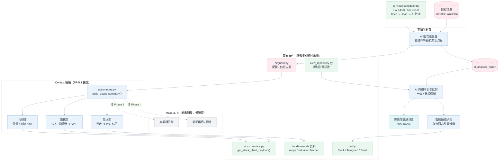
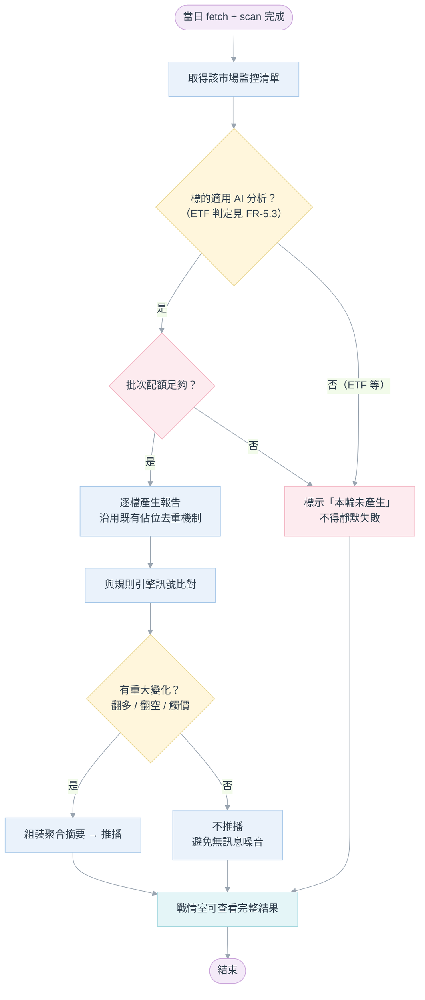

# Phase 5：三層式 AI 決策引擎與戰情室 — 功能需求文件

**模組**：AI 技術分析 → AI 決策引擎（AI Decision Engine）與戰情室（War Room）
**版本**：v3.0
**日期**：2026-08-28
**狀態**：規劃中，尚未開發。本文件界定需求範圍（What／Why），不含技術設計（How）
**前置文件**：[AI技術分析規劃.md](AI技術分析規劃.md)（Phase 5 基礎版規格書，**已完成並上線**）

---

## 目錄

- [0. 這份文件的定位](#0-這份文件的定位)
- [1. 名詞定義](#1-名詞定義)
- [2. 現況盤點：基礎版已完成的範圍](#2-現況盤點基礎版已完成的範圍)
- [3. 本階段目標與使用情境](#3-本階段目標與使用情境)
- [4. 範圍](#4-範圍)
- [5. 目標架構](#5-目標架構)
- [6. 功能需求](#6-功能需求)
- [7. 非功能需求](#7-非功能需求)
- [8. 成本影響評估（本階段最關鍵的前置決策）](#8-成本影響評估本階段最關鍵的前置決策)
- [9. 驗收條件](#9-驗收條件)
- [10. 相依關係與風險](#10-相依關係與風險)
- [11. 建議開發順序](#11-建議開發順序)
- [12. 待決問題](#12-待決問題)

---

## 0. 這份文件的定位

Phase 5 的原始草稿把「單股 AI 診股報告」的整套機制——多模態截圖、雙引擎 Provider、結構化
輸出、歷史落地、FastAPI 路由、Vue 彈窗——當作**尚待開發**的清單列出。但這一套已經依
[AI技術分析規劃.md](AI技術分析規劃.md) **完整實作並上線**（見第 2 節的逐項對照）。若繼續照原
草稿開發，等於把已完成的功能重做一遍。

因此本文件重新界定 Phase 5：**基礎版交付的是「單股、手動、技術面」的診股報告；本階段要交付的
是「多股、自動、三層面」的決策引擎與彙總戰情室。**

本文件只寫需求與驗收標準。實際動工前，各功能需求（FR）應比照
[AI技術分析規劃.md](AI技術分析規劃.md) 的先例，個別展開成含 ADR、資料庫設計、API 設計的技術
規格書。**本次僅產出文件，不撰寫任何程式碼。**

---

## 1. 名詞定義

| 名詞 | 定義 |
|---|---|
| **三層式** | 技術面（價量、均線、KD）／籌碼面（三大法人、融資券）／基本面（營收、EPS、估值）三個面向。**注意**：原始草稿的「三層式」有時指「技術／籌碼／基本」，有時指「Context 注入 → LLM 推論 → 結構化輸出」的三段管線。本文件一律採前者，後者統稱「AI 報告管線」 |
| **Context** | 送給 LLM 的結構化量化摘要，即 `ai/summary.py` 產出、原樣存入 `quant_summary` 欄位的 JSON |
| **評等（verdict）** | AI 對標的的方向研判。現行為 `bullish`／`bearish`／`neutral` 三級 |
| **戰情室（War Room）** | 本階段新增的彙總視圖，橫向呈現所有監控標的的最新 AI 評等。與既有「個股頁彈窗」互補 |
| **監控清單** | 追蹤與觀察名單（`portfolio_watchlist`，Postgres 為主儲存、`.env` 為鏡像），見 [docs/14.追蹤個股清單優化/](../14.追蹤個股清單優化/) |
| **規則引擎** | `strategies/` 的設定檔驅動訊號掃描器，輸出寫入 `data/_alerts/`。與 AI 報告是兩套獨立的判斷來源 |

---

## 2. 現況盤點：基礎版已完成的範圍

以下能力已實作完成。細節與 ADR 依據一律以 [AI技術分析規劃.md](AI技術分析規劃.md) 為準，此處
只做對照，**不重複設計**：

| 原始草稿的訴求 | 實際落地位置 | 狀態 |
|---|---|---|
| 後端特徵萃取、組裝 Context | [ai/summary.py](../../backend/ai/summary.py) `build_quant_summary()` | 已完成（僅技術面＋台股籌碼面） |
| 嚴謹 System Prompt、交叉驗證 | [ai/prompt.py](../../backend/ai/prompt.py) `SYSTEM_PROMPT` | 已完成 |
| ECharts 截圖「所見即 AI 所見」 | 前端 `getDataURL()`（規格書 §4.1） | 已完成 |
| 雙引擎 Provider（Claude／Gemini） | [ai/providers/](../../backend/ai/providers)，註冊表模式（ADR-AI-01） | 已完成 |
| JSON Schema／Markdown 雙模輸出 | [ai/schema.py](../../backend/ai/schema.py) | 已完成 |
| 歷史報告持久化 | PostgreSQL `ai_analysis_report`（`V14`／`V15`） | 已完成 |
| AI 分析 RESTful API | [api/v1/endpoints/ai_analysis.py](../../backend/api/v1/endpoints/ai_analysis.py) | 已完成（含用量／執行紀錄查詢） |
| 一鍵診股按鈕、Loading Skeleton | [AiAnalysisDialog.vue](../../frontend/src/components/AiAnalysisDialog.vue) | 已完成 |
| 報告面板 | 同上（彈窗，非抽屜）＋ [AiReportHistory.vue](../../frontend/src/views/ai/AiReportHistory.vue) | 已完成 |
| 逾時與降級機制 | 規格書 §4.6～4.7（成本閘門、失敗分類） | 部分：**純文字降級未做**（見 §4.2） |
| 推播告警整合 | — | **未做**（見 FR-5.4） |

### 2.1 基礎版的四項限制（本階段的設計前提）

| # | 限制 | 依據 | 本階段對應 |
|---|---|---|---|
| L1 | Context **只有技術面＋台股籌碼面**；基本面、產業鏈、輿情皆未注入 | `ai/summary.py` 只呼叫 `get_stock_chart_payload()` | FR-5.1 |
| L2 | **單股、手動點擊觸發**；無排程批次、無彙總視圖 | 規格書 §1.3、§13 明列為延後項目 | FR-5.3、FR-5.5 |
| L3 | **不推送進通知平台** | 規格書 §1.3。但通知平台（[notify/](../../backend/notify)）已於其後上線，**此延後前提已消失** | FR-5.4 |
| L4 | 評等僅三級，**無目標價**；原始草稿要的四級評等未實作 | `ai/schema.py` `verdict` 為三值 Literal | FR-5.2 |

---

## 3. 本階段目標與使用情境

### 3.1 目標

在已完成的單股技術面診股報告之上：

1. 把 Phase 1～2 **已經產出但未被 AI 使用**的基本面資料串進 Context，讓 AI 的研判有第三個面向
   可交叉驗證（目前 AI 看不到營收與估值，無法識別「技術面突破但本益比已在歷史高位」這類背離）。
2. 從「使用者主動點一次」升級為「系統主動彙整、比對、推播」，讓使用者**不必逐檔點開**就知道
   該優先看哪幾檔。

### 3.2 使用情境

| 使用情境 | 現況 | 本階段預期結果 |
|---|---|---|
| 盤後想知道監控清單裡哪幾檔值得注意 | 逐檔進個股頁點擊，35 檔要點 35 次 | 開啟戰情室一次看完所有評等與變化（FR-5.5） |
| 想知道 AI 是否與策略訊號看法一致 | 兩套結論分散在不同頁面，需自行比對 | 報告與戰情室直接標示一致／分歧（FR-5.6） |
| 不在電腦前也想知道有無重大變化 | 無推播 | 收到聚合摘要推播，附回戰情室連結（FR-5.4） |
| 判斷技術面突破是否有基本面支撐 | AI 看不到營收與估值，無法判斷 | Context 含基本面層，AI 可交叉驗證（FR-5.1） |
| 想知道 AI 認為的上檔滿足點 | 只有壓力位階清單，無明確目標價 | 報告輸出 `target_price`（FR-5.2） |

---

## 4. 範圍

### 4.1 納入本階段

| # | 功能需求 | 優先級 | 摘要 |
|---|---|---|---|
| FR-5.1 | 三層式 Context 擴充引擎 | **P0** | Context 加入基本面層；產業鏈／輿情層預留擴充點 |
| FR-5.2 | 決策輸出強化 | **P0** | 新增 `target_price`；評等分級是否擴充見 Q1 |
| FR-5.3 | 監控清單批次／排程產生 | **P0** | 對監控清單批次產生報告，取代逐檔手動點擊 |
| FR-5.4 | 戰情摘要推播整合 | P1 | 沿用既有通知平台推送聚合摘要（非整篇報告） |
| FR-5.5 | 戰情室彙總儀表板 | **P0** | 新 Vue 視圖，橫向呈現所有監控標的評等 |
| FR-5.6 | AI 判讀與規則引擎比對 | P1 | 標示「與策略訊號一致」或「分歧」 |

P0 為本階段最小可用範圍；P1 可於 P0 驗證穩定後接續交付。

### 4.2 明確排除（沿用基礎版既有決策，本階段不重新開放）

| 項目 | 排除理由 |
|---|---|
| 多輪對話（追問式） | 基礎版定調首版單輪；需另立對話歷程資料模型 |
| AI 訊號寫回 `alerts.json` | 規則引擎需保持規則式、可回溯，不可混入不可重現的 LLM 輸出 |
| AI 報告準確度回測與評分 | 需長期累積資料；`quant_summary`／`prompt_version` 已存快照供日後回測 |
| 純 JSON 模式支援 AI 功能 | AI 報告一律走 PostgreSQL（ADR-AI-14），不重新評估 |
| 逾時降級為「純文本推論」 | 原始草稿提過但基礎版未做。目前失敗即回報錯誤碼，語意明確；降級會產出「使用者以為看的是多模態判讀、實際上 AI 沒看到圖」的報告，反而更危險。另案評估 |

---

## 5. 目標架構

新增元件（藍）與既有可複用元件（綠）的關係。**灰底虛線框為 Phase 3／4 尚未開發的部分**，本階段
只預留擴充點，不等待其完工：

### 5.1 批次產生與推播流程

---

## 6. 功能需求

### FR-5.1　三層式 Context 擴充引擎（新增基本面層）　`P0`

**需求描述**：`ai/summary.py` 的 Context 組裝，在既有技術面／籌碼面之外，加入第三層基本面
數據：最新月營收 YoY／MoM、最近一季 EPS 年增率、本益比（P/E）、股價淨值比（P/B）、現金殖利率。

**問題背景**：目前 AI 完全看不到基本面。這代表它無法識別「技術面帶量突破，但本益比已在歷史
高位」或「營收連三月衰退中的技術面反彈」這類**跨面向背離**——而交叉驗證正是原始草稿對本階段
的核心訴求。

**資料來源**：全部是既有資料，**不需要新增任何爬蟲**——

| 資料 | 既有來源 |
|---|---|
| 月營收 YoY／MoM | [services/mops_fetcher.py](../../backend/services/mops_fetcher.py) |
| 季 EPS | [services/mops_eps_fetcher.py](../../backend/services/mops_eps_fetcher.py) |
| P/E、P/B、殖利率 | [services/valuation_fetcher.py](../../backend/services/valuation_fetcher.py) |

[api/v1/endpoints/fundamentals.py](../../backend/api/v1/endpoints/fundamentals.py) 的 `/compare`
端點已示範如何以 `MarketPreload` 批次組裝「行情＋估值＋營收」。Context 組裝應走**同一條資料
路徑**，不得另開一套查詢，也不得自行重算任何指標——這是 CLAUDE.md 對策略引擎既有約束
（「只讀已算好的序列」）的同一條理由：確保 AI 引用的數字與畫面上、與 `/compare` 報表上完全一致。

**降級規則**：沿用 `ai/prompt.py` 既有慣例——任何一層資料缺席就**整段略過**，不得輸出
`null`／`0`，更不得由 LLM 臆測。已知的缺席情境：

- 美股：無月營收 YoY 概念（MOPS 為台股專屬）。
- ETF／ETN：**無月營收、無 EPS、無本益比**（見 FR-5.3 的 ETF 議題）。
- 新上市股：不滿一季無 EPS 可比較。

**產業鏈／輿情層**：Phase 3（產業鏈知識圖譜）與 Phase 4（新聞輿情與總經監控）目前**尚未開發**
——只有靜態產業分類 `symbol_industry`，沒有 `industry_chain_edges` 上下游圖譜，也沒有
`stock_news`／`macro_indicators` 表。本階段**不等待**這兩個 Phase，Context 結構預留這兩層的
位置，待其完工後以同一套「缺席就略過」規則插入，不必回頭改動 Phase 5 的架構。

---

### FR-5.2　決策輸出強化　`P0`

**需求描述**：

1. **新增 `target_price`（目標價）**，語意與現有 `stop_loss` 對稱：一個是下檔防守、一個是上檔
   滿足點。現有 `resistance_levels` 是「壓力位階清單」，語意上不等於「操作目標價」——原始草稿
   明確要求兩者分開。
2. **評等分級**是否從現行三級擴充為原始草稿的四級（強力買進／分批佈局／觀望／減碼），見 Q1。

**相依關係**：`ai/schema.py` 的 `LLMAnalysisReport`／`AnalysisReport` 需擴充欄位；
`ai_analysis_report` 需新增遷移（比照 `V15` 的擴充模式，**不得修改已套用的 `V14`**，見
CLAUDE.md 對 Flyway 的規定）；前端兩個既有視圖需同步顯示與篩選。

**相容性要求**：既有歷史報告的 `verdict` 已有實際資料。若 Q1 決議改為四級制，**必須定義舊值
到新值的對應規則**，且歷史頁的篩選與顯示不得因此損壞。

---

### FR-5.3　監控清單批次／排程產生　`P0`

**需求描述**：把 AI 診股從「使用者進個股頁手動點擊」擴充為對**監控清單**批次產生，可排程執行
（比照 [services/scheduler.py](../../backend/services/scheduler.py) 既有的「台股 14:30／美股
06:00 收盤後 fetch → scan」鏈，於 scan 之後接續）。

**沿用既有機制，不重新設計**：

- 「同標的同交易日同 provider＋model 只呼叫一次」的唯一鍵去重（ADR-AI-16／ADR-AI-21）。
- 「先佔位、再呼叫 LLM」的併發控制（ADR-AI-16）——批次與手動點擊天然互斥，不需額外設計。

**兩項本階段必須新決定的事**：

1. **配額必須重新設計**。現行 `AI_DAILY_QUOTA` 預設 20，而目前監控清單為 **TW 25 檔＋US 10 檔
   ＝ 35 檔**——批次會在跑到第 21 檔時被自己的配額擋下（見 §8 的量化分析）。需要「批次配額與
   手動配額分開計算」，否則兩者互相搶額度：使用者白天點幾檔就讓晚上的批次跑不完，或批次把
   配額吃光導致使用者想手動看某檔時被擋。
2. **ETF 是否納入批次**。目前 TW 監控清單 25 檔中有 **10 檔是 ETF／ETN**（`0050`、`0056`、
   `006208`、`00631L`、`00637L`、`00706L`、`00757`、`00878`、`00940`、`00981A`），佔 40%。
   這對本階段有三重影響：
   - 規則引擎**已經**排除 ETF／ETN／TDR／特別股／受益證券不做籌碼類策略（ADR-SP-13，見
     [strategies/scanner.py:65](../../backend/strategies/scanner.py#L65)），理由是這些證券的
     籌碼語意與個股不同。同一條理由對 AI 的籌碼面判讀同樣成立。
   - FR-5.1 新增的基本面層對 ETF **完全不適用**（無營收、無 EPS、無本益比），三層式退化成
     一層半。
   - 槓桿型 ETF（`00631L`、`00637L`、`00706L`）的技術型態判讀還需考慮每日重設與正逆價差，
     與一般個股的均線語意不同。

   換言之，ETF 佔了 40% 的批次成本，卻只能得到最單薄的分析。**建議預設排除，但保留手動點擊
   的能力**（使用者仍可在個股頁對 ETF 點擊產生報告）——最終決議見 Q2。

**失敗處理**：任何一檔因配額不足、資料缺失或 LLM 失敗而未產生，都必須在戰情室明確標示「本輪
未產生」與原因，**不得靜默跳過**。批次的成功／失敗與用量須可由既有
`GET /api/v1/ai/usage`、`GET /api/v1/ai/status` 查得，不另開一套統計。

---

### FR-5.4　戰情摘要推播整合　`P1`

**需求描述**：批次產生完成後，將「評等翻多／翻空、或觸及停損／目標價」的標的彙整成**聚合
摘要**推播，**不轉發整篇 Markdown 報告**。

**為何是摘要而非全文**：基礎版規格書 §13 已把「Telegram／Email 呈現長篇 Markdown 體驗不佳」
列為延後推播的理由之一。本階段用「聚合摘要＋回戰情室連結」化解，而不是把一樣的長文硬塞進
訊息通道。

**沿用既有通知平台**：比照 [notify/events.py](../../backend/notify/events.py) 既有的
`EventType`（`ALERT_SIGNAL`／`ALERT_DIGEST`／`FETCH_COMPLETED`／`FETCH_FAILED`／
`SYSTEM_HEALTH`）新增一個對稱的事件類型（例如 `AI_VERDICT_DIGEST`），配上既有的 `_key_*`
冪等鍵與 `_facts_*` 路由函式慣例，以及各 channel 各自的 Jinja 模板（`notify/templates/*.j2`）。
**不另立一套推播機制**。

**靜默規則**：當一輪批次沒有任何標的達到「重大變化」門檻時**不發送**。每天固定發一則「今天
沒事」的通知會讓使用者迅速對這個頻道失去敏感度，反而錯過真正重要的推播。「重大變化」的判定
門檻需在設計階段明確定義。

---

### FR-5.5　戰情室彙總儀表板（Vue）　`P0`

**需求描述**：新增彙總視圖，橫向列出監控清單中每檔標的的：市場、代號名稱、最新評等、目標價／
停損價、信心度、報告產生時間、與規則引擎的比對結果（FR-5.6）、以及「本輪未產生」的狀態與
原因。支援依市場、評等、是否觸價、是否分歧篩選與排序。

**與既有彙總頁的分工**：個股頁彈窗回答「這一檔現在該怎麼辦」；戰情室回答「我今天該優先看哪
幾檔」。兩者互補，不取代。

**相依關係**：資料來源為 `GET /api/v1/ai/reports/latest` 的**批次版本**（需可一次查多檔，避免
前端對 35 檔各發一次請求）與監控清單 API。UI 可重用 `AiAnalysisDialog.vue` 既有的評等標籤與
位階卡片樣式，不必重新設計視覺語彙。

**必須遵守的既有鐵則**（CLAUDE.md「Hard rules」，違反即為缺陷）：

- 切換篩選條件或期間時，**不得整頁重整、不得重置捲動位置**。
- 同列的卡片／表格列**高度必須一致**。

---

### FR-5.6　AI 判讀與規則引擎比對　`P1`

**需求描述**：當某標的當日有規則引擎觸發的訊號時，將該訊號（策略 ID、方向）一併放進 Context
（基礎版規格書 §4.2 已預留為選用欄位、§13 已提出此作法但未實作），並在報告與戰情室中明確
標示「AI 研判與規則訊號**一致**」或「**分歧**」。

**為何只標示、不仲裁**：兩套系統的方法論不同——規則引擎是可回溯的確定性規則，AI 是不可完全
重現的機率性判讀。由系統自動裁決哪一邊對，等於憑空發明一個沒有依據的權重。標示分歧讓使用者
自己判斷，同時也讓「AI 與規則引擎長期頻繁矛盾」這件事**被看見**——那通常代表其中一套的品質
需要檢討。

**單向約束**：規則訊號來源為
[repositories/alert_repository.py](../../backend/repositories/alert_repository.py)。**AI 的判斷
不得回寫或修改 `alerts.json` 的任何內容**——這是單向餵入，不是雙向同步（見 §4.2 排除項目）。

---

## 7. 非功能需求

| # | 項目 | 要求 |
|---|---|---|
| NFR-1 | 成本可預測 | 批次上線後的每月成本上限必須可由「監控清單張數 × 交易日數 × 單價」事前推算，且實際值可由 `GET /api/v1/ai/usage` 驗證（見 §8） |
| NFR-2 | 既有功能零影響 | AI 功能停用（`AI_ANALYSIS_ENABLED=false`）或 PostgreSQL 未啟動時，行情、圖表、策略掃描、通知平台**全部照常運作**（沿用 AC-AI-02／AC-AI-15） |
| NFR-3 | 批次不阻塞 | 批次執行不得阻塞 API 回應或排程中其他工作；單檔失敗不影響同批其他標的 |
| NFR-4 | 數值一致性 | AI 引用的任何數字都必須能在 Context 中找到，且與對應既有 API 回傳值一致（沿用 AC-AI-03 的標準，延伸至基本面層） |
| NFR-5 | 推播不製造噪音 | 無重大變化時不發送；推播頻率受既有通知平台的訂閱與頻率上限管制 |
| NFR-6 | 前端互動鐵則 | 戰情室遵守 CLAUDE.md 兩條硬性規則（捲動位置、卡片等高） |

---

## 8. 成本影響評估（本階段最關鍵的前置決策）

**這是 Phase 5 從「手動」轉為「自動」帶來的最大質變，必須在動工前決策。**

基礎版的成本特性是「**使用者不點就不花錢**」——多數日子的實際支出遠低於配額上限。改為排程
批次後，成本從「**依使用量浮動**」變成「**每個交易日的固定支出**」。

### 8.1 目前監控清單規模

| 市場 | 檔數 | 其中 ETF／ETN | 個股 |
|---|---|---|---|
| 台股 | 25 | 10（40%） | 15 |
| 美股 | 10 | — | 10 |
| **合計** | **35** | **10** | **25** |

### 8.2 每月成本試算

單價取 [AI技術分析規劃.md](AI技術分析規劃.md) §10.2 的估算（`claude-sonnet-5` 約 $0.020／次、
`claude-opus-5` 約 $0.049／次），每月以 21 個交易日計：

| 情境 | 每日呼叫 | 每月呼叫 | sonnet-5 月成本 | opus-5 月成本 |
|---|---|---|---|---|
| **現況**（手動，配額 20 上限） | ≤20 | ≤420 | ≤US$8.4（實際遠低） | ≤US$20.6 |
| 批次含 ETF（35 檔） | 35 | 735 | **~US$14.7** | ~US$36.0 |
| 批次排除 ETF（25 檔） | 25 | 525 | **~US$10.5** | ~US$25.7 |

> 上述為**成功呼叫**的成本。實際帳單還須加計失敗重試（ADR-AI-17：失敗的呼叫同樣計費）。

### 8.3 結論與必要動作

1. **現行 `AI_DAILY_QUOTA=20` 不足以支撐批次**。35 檔的批次會在第 21 檔被自己的配額擋下，
   導致每天有 14 檔永遠拿不到報告——且被擋下的是清單後段的固定那幾檔，不是隨機的。
2. **配額必須拆分為「批次」與「手動」兩份**，否則兩者互相排擠（FR-5.3）。
3. **排除 ETF 可省下約 29% 的批次成本**，且被排除的正是三層式分析退化最嚴重的那批標的
   （FR-5.3、Q2）。
4. 上線後應以 `GET /api/v1/ai/usage` 的實際 `estimated_cost_usd` 回頭校準，沿用基礎版
   §10.3 的建議做法，不停留在估算。

---

## 9. 驗收條件

沿用基礎版 `AC-AI-xx` 的編號慣例，本階段以 `AC-P5-xx` 續編：

| 編號 | 驗收條件 | 驗證方式 | 對應 |
|---|---|---|---|
| **AC-P5-01** | 台股個股的 Context 同時含技術面／籌碼面／基本面三層數值 | 產生一份報告後檢視 `quant_summary` 欄位 | FR-5.1 |
| **AC-P5-02** | 基本面數值與 `/api/v1/fundamentals/` 對應端點查得的值**完全一致** | 同一檔同一日逐欄比對 | FR-5.1 |
| **AC-P5-03** | 美股、ETF、新上市股的基本面區塊**整段消失**，不出現 `null`／`0` | 各取一檔產生報告後檢視 Context 與報告全文 | FR-5.1 |
| **AC-P5-04** | 報告全文引用的基本面數字都能在 Context 中找到（無臆測） | 人工比對報告敘述與 `quant_summary` | FR-5.1、NFR-4 |
| **AC-P5-05** | 新產生的報告一律帶 `target_price` 欄位（值可為 `null`，欄位必須存在） | 檢視 API 回應與資料表 | FR-5.2 |
| **AC-P5-06** | 既有歷史報告在欄位擴充後**顯示與篩選皆正常** | 擴充遷移套用後開啟歷史頁逐筆檢視 | FR-5.2 |
| **AC-P5-07** | 批次執行後，監控清單中每檔標的**不是有當日報告，就是有明確的「未產生」狀態與原因** | 執行一輪批次後比對清單與結果 | FR-5.3 |
| **AC-P5-08** | 批次不會因單檔失敗而中斷；其餘標的照常產生 | 故意讓一檔失敗（如填錯代號）後執行批次 | FR-5.3、NFR-3 |
| **AC-P5-09** | 批次配額耗盡時，**手動點擊仍可使用**（兩份配額互不排擠） | 批次配額設為 1 後執行批次，再手動點擊一檔 | FR-5.3 |
| **AC-P5-10** | 同一標的當日已有批次產生的報告時，手動點擊**回讀既有報告、不重複計費** | 批次後手動點擊同一檔，比對 `/ai/usage` 用量 | FR-5.3 |
| **AC-P5-11** | 無重大變化的批次**不發送推播** | 在無評等變化的日子執行批次，確認未送出 | FR-5.4、NFR-5 |
| **AC-P5-12** | 推播內容為聚合摘要＋戰情室連結，**非整篇 Markdown** | 檢視實際收到的 Slack／Telegram 訊息 | FR-5.4 |
| **AC-P5-13** | 通知平台既有訂閱開關與頻率上限對新事件類型同樣生效 | 關閉訂閱後執行批次，確認未收到 | FR-5.4 |
| **AC-P5-14** | 戰情室一次呈現所有監控標的最新評等，**無須逐檔點擊** | 開啟戰情室目視 | FR-5.5 |
| **AC-P5-15** | 切換戰情室篩選條件時，**捲動位置不被重置** | 捲到中段後切換篩選（CLAUDE.md 鐵則 1） | FR-5.5、NFR-6 |
| **AC-P5-16** | 戰情室同列卡片／表格列**高度一致** | 目視 ＋ 檢查 `!m-0`（CLAUDE.md 鐵則 2） | FR-5.5、NFR-6 |
| **AC-P5-17** | 戰情室載入 35 檔資料時，**不對後端發出 35 次請求** | 瀏覽器 Network 面板檢視 | FR-5.5 |
| **AC-P5-18** | 當日有規則訊號的標的，其 Context 可見對應策略 ID 與方向 | 取一檔當日有訊號者，檢視 `quant_summary` | FR-5.6 |
| **AC-P5-19** | 報告與戰情室皆顯示一致／分歧標記 | 分別找一致與分歧的案例各一檢視 | FR-5.6 |
| **AC-P5-20** | **規則引擎的輸出與行為完全不受 AI 報告影響**；`alerts.json` 內容未被改寫 | 批次前後比對 `data/_alerts/` 內容 | FR-5.6、§4.2 |
| **AC-P5-21** | AI 功能停用或 PostgreSQL 未啟動時，行情／圖表／策略／通知平台**全部正常** | 關閉旗標與停掉 db 容器後操作全站 | NFR-2 |

---

## 10. 相依關係與風險

| 項目 | 風險／說明 | 因應 |
|---|---|---|
| **批次成本從浮動變固定** | 從「不點就不花錢」變成每交易日固定支出（§8） | 配額拆分、ETF 排除、上線後以實際用量校準 |
| **現行配額不足** | `AI_DAILY_QUOTA=20` < 監控清單 35 檔，批次必然跑不完 | FR-5.3 明列為必須先解決的前置條件 |
| **Phase 3／4 尚未開發** | 產業鏈圖譜與新聞輿情只有規劃文件，無資料表與爬蟲 | 本階段不等待，Context 預留擴充點（FR-5.1） |
| **ETF 佔監控清單 40%** | 三層式分析對 ETF 退化嚴重，卻佔滿額成本 | 建議預設排除、保留手動（Q2） |
| **評等分級變更影響既有資料** | 若改四級制，既有三級歷史資料需相容處理 | FR-5.2 列為明確要求，AC-P5-06 驗證 |
| **推播噪音** | 每日固定推播會讓使用者對頻道失去敏感度 | 無重大變化不發送（FR-5.4、AC-P5-11） |
| **兩套判斷長期矛盾** | AI 與規則引擎可能經常性分歧 | 只標示不仲裁；長期矛盾代表某一套品質需檢討，非由本階段裁決 |
| **戰情室 N+1 請求** | 35 檔逐檔查詢會讓頁面載入緩慢 | 需批次查詢端點（FR-5.5、AC-P5-17） |

---

## 11. 建議開發順序

每一步都能獨立驗證，且後續步驟只依賴前面已驗證的產出：

| 順序 | 項目 | 理由 |
|---|---|---|
| 1 | **FR-5.1** 三層式 Context | 純後端擴充，不動 UI，可用 `/docs` 獨立驗證數值正確性 |
| 2 | **FR-5.2** 輸出強化 | 在完整 Context 之上，LLM 才有足夠依據判斷目標價與更細緻的評等 |
| 3 | **§8 配額決策** ＋ **FR-5.3** 批次 | **配額拆分必須先定案**，否則批次一上線就會被自己的配額擋下 |
| 4 | **FR-5.6** 規則引擎比對 | 批次穩定產生報告後，比對才有足夠樣本可驗證 |
| 5 | **FR-5.5** 戰情室 UI | 彙總視圖需要 3、4 的資料已存在才有東西可呈現 |
| 6 | **FR-5.4** 推播整合 | 放最後：「該推什麼」取決於 FR-5.5 已定義好的欄位與比對結果 |

---

## 12. 待決問題

**需在進入設計階段前決策。** 各題附建議選項與理由，但最終由使用者定案：

| # | 問題 | 建議 | 影響範圍 |
|---|---|---|---|
| **Q1** | 評等維持三級（`bullish`／`bearish`／`neutral`），還是改為四級（強力買進／分批佈局／觀望／減碼）？ | **建議維持三級**。四級把「方向判斷」與「部位建議」混在同一個欄位——「分批佈局」講的是進場方式而非看多看空。若需要部位建議，較乾淨的作法是保留三級 `verdict`，另加一個獨立的「建議操作」欄位，兩者正交、歷史資料也不必轉換 | FR-5.2 資料表欄位、歷史資料相容性、前端標籤 |
| **Q2** | 批次是否納入 ETF？ | **建議預設排除、保留手動點擊**。理由見 FR-5.3：規則引擎已有相同排除先例（ADR-SP-13）、基本面層對 ETF 完全不適用、且可省 29% 批次成本 | FR-5.3 批次範圍、§8 成本 |
| **Q3** | 批次配額如何拆分？ | **建議 `.env` 分設批次與手動兩個獨立配額**，批次配額預設值 ≥ 監控清單張數並保留餘裕。兩者共用一個總量必然互相排擠 | FR-5.3、`ai/config.py` 設定項 |
| **Q4** | 批次執行時機與現有 14:30／06:00 的 fetch＋scan 共用同一時點，還是錯開？ | **建議接在 scan 之後串行執行**，沿用既有「fetch → scan」鏈的既有慣例；錯開會讓「當日資料已就緒」的前提變得不確定 | FR-5.3 與 [scheduler.py](../../backend/services/scheduler.py) 整合方式 |
| **Q5** | 推播沿用通知平台既有訂閱設定，還是新增獨立的「AI 摘要」開關？ | **建議新增獨立事件類型**（`AI_VERDICT_DIGEST`），讓使用者可單獨關閉 AI 摘要而不影響策略訊號推播——兩者的重要性與頻率不同 | FR-5.4 通知平台訂閱模型 |
| **Q6** | 戰情室是獨立路由頁面，還是併入既有 Dashboard 的分頁？ | **建議獨立路由頁面**。戰情室的篩選維度（評等、觸價、分歧）與既有 Dashboard 完全不同，併入會讓兩者的狀態管理互相干擾 | FR-5.5 前端路由與資訊架構 |
